# 十八、统计推断

> 原文：[https://www.textbook.ds100.org/ch/18/hyp_intro.html](https://www.textbook.ds100.org/ch/18/hyp_intro.html)

```py
# HIDDEN
# Clear previously defined variables
%reset -f

# Set directory for data loading to work properly
import os
os.chdir(os.path.expanduser('~/notebooks/18'))
```

尽管数据科学家经常使用个别的数据样本，但我们几乎总是有兴趣对从中收集数据的人群进行归纳。本章讨论了 _ 统计推断 _ 的方法，即使用数据集得出整个总体的结论的过程。

统计推断主要依靠两种方法：假设检验和置信区间。在最近的一段时间里，这些方法严重依赖于正常理论，这是一个需要对人口进行大量假设的统计学分支。今天，强大计算资源的快速增长使得基于 _ 重采样 _ 的一类新方法得以推广到许多类型的人群中。

我们首先回顾使用置换测试和引导方法的推理。然后介绍了回归推理和偏态分布的自举方法。

## 18.1 假设检验和置信区间

```py
# HIDDEN
# Clear previously defined variables
%reset -f

# Set directory for data loading to work properly
import os
os.chdir(os.path.expanduser('~/notebooks/18'))
```

```py
# HIDDEN
import warnings
# Ignore numpy dtype warnings. These warnings are caused by an interaction
# between numpy and Cython and can be safely ignored.
# Reference: https://stackoverflow.com/a/40846742
warnings.filterwarnings("ignore", message="numpy.dtype size changed")
warnings.filterwarnings("ignore", message="numpy.ufunc size changed")

import numpy as np
import matplotlib.pyplot as plt
import pandas as pd
import seaborn as sns
%matplotlib inline
import ipywidgets as widgets
from ipywidgets import interact, interactive, fixed, interact_manual
import nbinteract as nbi

sns.set()
sns.set_context('talk')
np.set_printoptions(threshold=20, precision=2, suppress=True)
pd.options.display.max_rows = 7
pd.options.display.max_columns = 8
pd.set_option('precision', 2)
# This option stops scientific notation for pandas
# pd.set_option('display.float_format', '{:.2f}'.format)
```

在本节中，我们将简要回顾使用引导测试和置换测试的假设测试。我们假设对这个主题很熟悉，因为它在计算和推理思维（数据 8 的教科书）中有详细介绍。关于这里解释的概念的更深入的解释，请参见计算和推理思维的[第 11 章](https://www.inferentialthinking.com/chapters/11/Testing_Hypotheses)、[第 12 章](https://www.inferentialthinking.com/chapters/12/Comparing_Two_Samples)和[第 13 章](https://www.inferentialthinking.com/chapters/13/Estimation)。

## 假设检验

当把数据科学技术应用到不同的领域时，我们经常会遇到关于世界的问题。例如，喝咖啡会导致睡眠不足吗？自动驾驶车辆比非自动驾驶车辆更容易撞车吗？药物 X 有助于治疗肺炎吗？为了帮助回答这些问题，我们使用假设检验根据观察到的证据/数据做出明智的结论。

由于数据收集通常是一个不精确的过程，所以我们常常不确定数据集中的模式是由噪声还是真实现象造成的。假设检验有助于我们确定一个模式是否会因为数据收集中的随机波动而发生。

为了探索假设检验，我们从一个例子开始。表`baby`包含出生时婴儿体重的信息。它记录了 1174 名婴儿的出生体重（盎司），以及母亲是否在怀孕期间吸烟。

```py
# HIDDEN
baby = pd.read_csv('baby.csv')
baby = baby.loc[:, ["Birth Weight", "Maternal Smoker"]]
baby
```

|  | 出生体重 | 母亲吸烟者 |
| --- | --- | --- |
| 零 | 一百二十 | 错误 |
| --- | --- | --- |
| 1 个 | 一百一十三 | False |
| --- | --- | --- |
| 二 | 一百二十八 | 对 |
| --- | --- | --- |
| …… | …… | ... |
| --- | --- | --- |
| 一千一百七十一 | 一百三十 | True |
| --- | --- | --- |
| 一千一百七十二 | 一百二十五 | False |
| --- | --- | --- |
| 一千一百七十三 | 117 个 | False |
| --- | --- | --- |

1174 行×2 列

### 设计[¶](#Design)

我们想看看母亲吸烟是否与出生体重有关。为了建立我们的假设检验，我们可以使用以下空假设和可选假设来表示世界的两种观点：

**无效假设**在人口中，婴儿出生体重的分布对于不吸烟的母亲和不吸烟的母亲是一样的。样品的差异是由于偶然性造成的。

**另一种假设：在人口中，吸烟的母亲的婴儿平均出生体重低于不吸烟的婴儿。**

我们的最终目标是在这两个数据生成模型之间做出决定。值得注意的一点是，我们构建了关于数据生成模型的 _ 参数 _ 的假设，而不是实验结果。例如，我们不应该构建一个无效的假设，例如“吸烟母亲的出生体重将等于非吸烟母亲的出生体重”，因为这一过程的结果存在自然的变异性。

零假设强调，如果数据看起来与零假设预测的不同，那么差异只由偶然性造成。非正式地，另一种假设认为观察到的差异是“真实的”。

我们应该仔细看看我们的替代假设的结构。在我们当前的设置中，请注意，如果吸烟母亲的婴儿出生体重显著低于不吸烟母亲的婴儿出生体重，我们将拒绝无效假设。换句话说，替代假设包含/支持分布的一侧。我们称之为**单边**替代假设。一般来说，如果我们有充分的理由相信吸烟的母亲的婴儿平均出生体重更高是不可能的，那么我们只想使用这种替代假设。

为了可视化数据，我们绘制了母亲吸烟者和非吸烟者所生婴儿体重的柱状图。

```py
# HIDDEN
plt.figure(figsize=(9, 6))
smokers_hist = (baby.loc[baby["Maternal Smoker"], "Birth Weight"]
                .hist(normed=True, alpha=0.8, label="Maternal Smoker"))
non_smokers_hist = (baby.loc[~baby["Maternal Smoker"], "Birth Weight"]
                    .hist(normed=True, alpha=0.8, label="Not Maternal Smoker"))
smokers_hist.set_xlabel("Baby Birth Weights")
smokers_hist.set_ylabel("Proportion per Unit")
smokers_hist.set_title("Distribution of Birth Weights")
plt.legend()
plt.show()
```

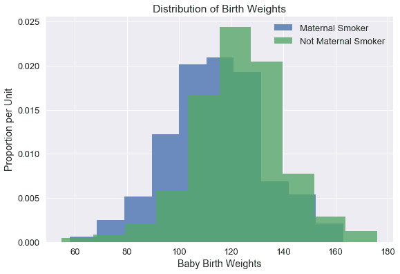

吸烟母亲的婴儿的平均体重似乎比不吸烟母亲的婴儿的平均体重要低。这种差异可能是由于随机变化引起的吗？我们可以尝试用假设检验来回答这个问题。

为了进行假设检验，我们假设一个生成数据的特定模型；然后，我们问自己，我们将看到与我们观察到的结果一样极端的结果的可能性有多大？直观地说，如果看到我们观察到的结果的机会很小，我们假设的模型可能不是合适的模型。

特别是，我们假设零假设及其概率模型**零模型**是真的。换言之，我们假设零假设是真的，并关注统计值在零假设下的值。这个机会模型表示没有潜在的差异；样本中的分布只是因为偶然而有所不同。

### 测试统计[¶](#Test-Statistic)

在我们的例子中，我们假设母亲吸烟对婴儿体重没有影响（观察到的任何差异都是由于偶然性）。为了在我们的假设之间进行选择，我们将使用两组方法之间的差异作为我们的**检验统计**。从形式上讲，我们的测试统计是

$$\mu \text 吸烟-\mu \text 不吸烟$$

因此，这个统计的小值（即大负值）将有利于替代假设。让我们计算测试统计的观察值：

```py
nonsmoker = baby.loc[~baby["Maternal Smoker"], "Birth Weight"]
smoker = baby.loc[baby["Maternal Smoker"], "Birth Weight"]
observed_difference = np.mean(smoker) - np.mean(nonsmoker)
observed_difference
```

```py
-9.266142572024918
```

如果这两种分布在基础人群中真的没有差别，那么每个母亲是否是一个吸烟者不应该影响平均出生体重。换言之，与母亲吸烟有关的标签“真”或“假”不应与平均值有任何差异。

因此，为了模拟零假设下的检验统计量，我们可以将所有出生体重随机地放入母亲中。我们在下面进行这种随机排列。

```py
def shuffle(series):
    '''
    Shuffles a series and resets index to preserve shuffle when adding series
    back to DataFrame.
    '''
    return series.sample(frac=1, replace=False).reset_index(drop=True)
```

```py
baby["Shuffled"] = shuffle(baby["Birth Weight"])
baby
```

|  | Birth Weight | Maternal Smoker | 无序播放 |
| --- | --- | --- | --- |
| 0 | 120 | False | 一百二十二 |
| --- | --- | --- | --- |
| 1 | 113 | False | 167 个 |
| --- | --- | --- | --- |
| 2 | 128 | True | 一百一十五 |
| --- | --- | --- | --- |
| ... | ... | ... | ... |
| --- | --- | --- | --- |
| 1171 | 130 | True | 一百一十六 |
| --- | --- | --- | --- |
| 1172 | 125 | False | 一百三十三 |
| --- | --- | --- | --- |
| 1173 | 117 | False | 120 |
| --- | --- | --- | --- |

1174 行×3 列

### 进行置换试验

基于数据随机排列的测试称为**排列测试**。在下面的单元中，我们将多次模拟测试统计数据，并收集数组中的差异。

```py
differences = np.array([])

repetitions = 5000
for i in np.arange(repetitions):
    baby["Shuffled"] = shuffle(baby["Birth Weight"])

    # Find the difference between the means of two randomly assigned groups
    nonsmoker = baby.loc[~baby["Maternal Smoker"], "Shuffled"]
    smoker = baby.loc[baby["Maternal Smoker"], "Shuffled"]
    simulated_difference = np.mean(smoker) - np.mean(nonsmoker)

    differences = np.append(differences, simulated_difference)
```

我们绘制了以下平均值中模拟差异的柱状图：

```py
# HIDDEN
differences_df = pd.DataFrame()
differences_df["differences"] = differences
diff_hist = differences_df.loc[:, "differences"].hist(normed = True)
diff_hist.set_xlabel("Birth Weight Difference")
diff_hist.set_ylabel("Proportion per Unit")
diff_hist.set_title("Distribution of Birth Weight Differences");
```

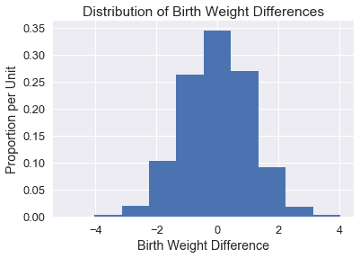

从直觉上讲，差异的分布集中在 0 附近，因为在零假设下，两组的平均值应该相同。

为了得出这个假设检验的结论，我们应该计算 p 值。试验的经验 p 值是模拟差异等于或小于观察差异的比例。

```py
p_value = np.count_nonzero(differences <= observed_difference) / repetitions
p_value
```

```py
0.0
```

在假设检验开始时，我们通常选择一个 P 值**显著性阈值**（通常表示为 alpha）。如果我们的 p 值低于显著性阈值，那么我们拒绝无效假设。最常用的阈值是 0.01 和 0.05，其中 0.01 被认为更“严格”，因为我们需要更多的证据支持替代假设来拒绝无效假设。

在这两种情况下，我们都拒绝了无效假设，因为 p 值小于显著性阈值。

## 引导置信区间

数据科学家必须经常使用随机样本估计未知的人口参数。虽然理想情况下，我们希望从人群中采集大量样本，以生成一个样本分布，但我们通常仅限于金钱和时间上的单一样本。

幸运的是，一个随机采集的大样本看起来像原始种群。引导过程使用这个事实，通过从原始样本重新采样来模拟新样本。

要执行引导，我们执行以下步骤：

1.  从原始样本替换的样本（现在是引导填充）。这些样本称为引导样本。我们通常会抽取数千个自举样本（通常是 10000 个）。
2.  计算每个引导样本的兴趣统计。这种统计称为引导统计，这些引导统计的经验分布近似于引导统计的抽样分布。


我们可以使用引导抽样分布来创建一个置信区间，用来估计总体参数的值。

由于出生体重数据提供了一个大的随机样本，因此我们可以将不吸烟母亲的数据视为非吸烟母亲群体的代表。同样，我们的行为就好像吸烟母亲的数据代表了吸烟母亲的人口。

因此，我们将原始样本作为引导填充来执行引导过程：

1.  从不吸烟的母亲身上提取一个替代品样本，并计算这些母亲的平均出生体重。我们还从吸烟的母亲那里提取了一个替代品样本，并计算出平均出生体重。
2.  计算平均差。
3.  重复上述过程 10000 次，得到 10000 个平均差。

该程序给出了婴儿平均体重差异的经验抽样分布。

```py
def resample(sample):
    return np.random.choice(sample, size=len(sample))

def bootstrap(sample, stat, replicates):
    return np.array([
        stat(resample(sample)) for _ in range(replicates)
    ])
```

```py
nonsmoker = baby.loc[~baby["Maternal Smoker"], "Birth Weight"]
smoker = baby.loc[baby["Maternal Smoker"], "Birth Weight"]

nonsmoker_means = bootstrap(nonsmoker, np.mean, 10000)
smoker_means = bootstrap(smoker, np.mean, 10000)

mean_differences = smoker_means - nonsmoker_means
```

我们绘制了平均值差异的经验分布：

```py
# HIDDEN
mean_differences_df = pd.DataFrame()
mean_differences_df["differences"] = np.array(mean_differences)
mean_diff = mean_differences_df.loc[:, "differences"].hist(normed=True)
mean_diff.set_xlabel("Birth Weight Difference")
mean_diff.set_ylabel("Proportion per Unit")
mean_diff.set_title("Distribution of Birth Weight Differences");
```

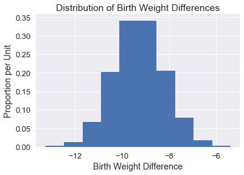

最后，为了构建一个 95%的置信区间，我们取引导统计数据的 2.5%和 97.5%。

```py
(np.percentile(mean_differences, 2.5), 
 np.percentile(mean_differences, 97.5))
```

```py
(-11.36909646997882, -7.181670323140913)
```

这个置信区间可以让我们 95%的置信度说明出生体重的总体平均差异在-11.37 至-7.18 盎司之间。

## 摘要[¶](#Summary)

在本节中，我们将回顾使用置换测试的假设测试和使用引导的置信区间。为了进行假设检验，我们必须陈述我们的无效假设和替代假设，选择适当的检验统计量，并执行检验程序来计算 p 值。为了建立一个置信区间，我们选择适当的测试统计量，引导原始样本生成测试统计量的经验分布，并选择与我们期望的置信水平相对应的分位数。

## 18.2 置换检验

```py
# HIDDEN
# Clear previously defined variables
%reset -f

# Set directory for data loading to work properly
import os
os.chdir(os.path.expanduser('~/notebooks/18'))
```

```py
# HIDDEN
import warnings
# Ignore numpy dtype warnings. These warnings are caused by an interaction
# between numpy and Cython and can be safely ignored.
# Reference: https://stackoverflow.com/a/40846742
warnings.filterwarnings("ignore", message="numpy.dtype size changed")
warnings.filterwarnings("ignore", message="numpy.ufunc size changed")

import numpy as np
import matplotlib.pyplot as plt
import pandas as pd
import seaborn as sns
%matplotlib inline
import ipywidgets as widgets
from ipywidgets import interact, interactive, fixed, interact_manual
import nbinteract as nbi

sns.set()
sns.set_context('talk')
np.set_printoptions(threshold=20, precision=2, suppress=True)
pd.options.display.max_rows = 7
pd.options.display.max_columns = 8
pd.set_option('precision', 2)
# This option stops scientific notation for pandas
# pd.set_option('display.float_format', '{:.2f}'.format)
```

在一些情况下，我们希望执行一个置换测试，以测试一个假设并了解更多关于世界的信息。置换测试是一种非常有用的非参数测试类型，它允许我们在不进行低于传统参数测试的统计假设的情况下进行推论。

排列推理的一个有见地的例子是通过无聊、奥托博尼和斯塔克（2016）对学生对教学（集合）数据的评估进行复查。在这个实验中，47 名学生被随机分配到四个部分中的一个。有两个助教分别教两个部分；一个助教是男性，另一个是女性。在其中两个部分中，教学助理是用他们的实际姓名介绍的。在其他两个部分中，助手们交换了名字。

```py
#HIDDEN 
from IPython.display import Image
display(Image('student_setup.png'))
```


学生们从未面对面见到过助教。相反，他们通过在线论坛与学生互动。家庭作业的返回是协调的，这样所有学生都能同时收到分数/反馈。这两个助教的经验水平也相当。在课程结束时，学生们会评估作业的及时性。作者想调查性别认知是否对集合评估/评分有任何影响。

### 实验装置

我们使用 0.05 的 p 值截止值进行假设检验。

在我们的**模型**中，每个助教有两个可能的评分，每个学生一个针对每个感知到的性别。每个学生被分配到任何一对（性别，感知性别）的机会均等。最后，学生们相互独立地评估他们的助教。

本实验的**无效假设**是感知性别对集合没有影响，任何观察到的评分差异都是偶然的。换言之，无论是男性还是女性，对每个助教的评估都应保持不变。这意味着每个助教实际上只有一个可能的评分来自每个学生。

另一种假设是感知性别对集合有影响。

**检验统计**是每个 TA 的感知男性和感知女性评分的平均值差异。直观地说，如果性别对收视率没有影响，我们预计这将接近 0。我们可以正式写下：

$$\mu \文本感知女性-\mu \文本感知男性$$

哪里：

$$ \begin{aligned} \mu_{\text{perceived female}} &= \frac {\sum_{j=1}^{n_1} x_{1j} + \sum_{j=1}^{n_3} x_{3j}}{{n_1} + {n_3}} \\ \mu_{\text{perceived male}} &= \frac {\sum_{j=1}^{n_2} x_{2j} + \sum_{j=1}^{n_4} x_{4j}}{{n_2} + {n_4}} \end{aligned} $$

其中，$n i$是$i$th 组的学生人数，$x ij 是第 i 组的第 j 个学生的评分。

为了确定性别对集合评分是否有影响，我们进行了置换测试，以在无效假设下生成检验统计量的经验分布。我们遵循以下步骤：

1.  为同一助教下的学生排列感知的性别标签。请注意，在上图中，我们在左右两半部分进行了调整。
2.  计算确定的女性和确定的男性群体的平均得分差异。
3.  重复多次，为两组的平均分数差创建一个近似的抽样分布。
4.  使用近似分布来估计看到测试统计数据比观察到的更极端的可能性。

理解置换测试在这种情况下的合理性是很重要的。在空模型下，每个学生都会给他们的助教相同的分数，而不管他们的性别。简单的随机分配意味着，对于一个给定的助教，无论他们被视为男性还是女性，他们的所有评分都有平等的机会出现。因此，如果无效假设为真，那么排列性别标签对评分应该没有影响。

### 数据[¶](#The-Data)

我们从下面的学生和性别数据开始。这些数据是美国一所大学的 47 名参加在线课程的学生的人口普查。

```py
#HIDDEN 
student_eval = (
    pd.read_csv('StudentRatingsData.csv')
    .loc[:, ["tagender", "taidgender", "prompt"]]
    .dropna()
    .rename(columns={'tagender': 'actual', 'taidgender': 'perceived'})
)
student_eval[['actual', 'perceived']] = (
    student_eval[['actual', 'perceived']]
    .replace([0, 1], ['female', 'male'])
)
student_eval
```

|  | 实际的 | 感知 | 促使 |
| --- | --- | --- | --- |
| 零 | 女性的 | 男性的 | 四 |
| --- | --- | --- | --- |
| 1 个 | female | male | 五 |
| --- | --- | --- | --- |
| 二 | female | male | 5.0 |
| --- | --- | --- | --- |
| …… | …… | ... | ... |
| --- | --- | --- | --- |
| 四十三 | male | female | 4.0 |
| --- | --- | --- | --- |
| 四十四 | male | female | 二 |
| --- | --- | --- | --- |
| 45 岁 | male | female | 4.0 |
| --- | --- | --- | --- |

43 行×3 列

这些列具有以下含义：

**实际**——助教的真实性别

**感知**——呈现给学生的性别

**提示**——HW 的及时性等级从 1 到 5

在分析和绘制了下面实验的评分数据后，两组学生之间似乎存在差异，感知到的女性评分低于男性评分；然而，我们需要一个更正式的假设测试，以确定这种差异是否仅仅是由于随机性导致的。m 学生作业。

```py
# HIDDEN
avg_ratings = (student_eval
 .loc[:, ['actual', 'perceived', 'prompt']]
 .groupby(['actual', 'perceived'])
 .mean()
 .rename(columns={'prompt': 'mean prompt'})
)
avg_ratings
```

|  |  | 平均提示 |
| --- | --- | --- |
| actual | perceived |  |
| --- | --- | --- |
| 女性的 | 女性的 | 3.75 条 |
| --- | --- | --- |
| 男性的 | 四点三三 |
| --- | --- |
| 男性的 | female | 三点四二 |
| --- | --- | --- |
| male | 四点三六 |
| --- | --- |

```py
# HIDDEN
fig, ax = plt.subplots(figsize=(12, 7))
ind = np.arange(4)
plt.bar(ind, avg_ratings["mean prompt"])
ax.set_xticks(ind)
ax.set_xticklabels(['Female (Percieved Female)', 'Female (Percieved Male)', 'Male (Percieved Female)', "Male (Percieved Male)"])
ax.set_ylabel('Average Promptness Rating')
ax.set_xlabel('Actual/Percieved Gender')
ax.set_title('Average Rating Per Actual/Percieved Gender')
plt.show()
```

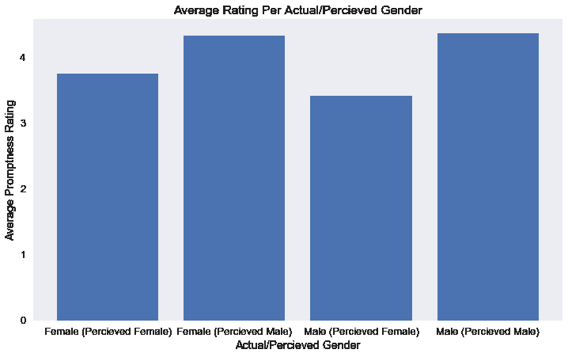

### 进行实验

我们将计算确定的男性和确定的女性群体的平均评分之间观察到的差异：

```py
def stat(evals):
    '''Computes the test statistic on the evals DataFrame'''
    avgs = evals.groupby('perceived').mean()
    return avgs.loc['female', 'prompt'] - avgs.loc['male', 'prompt']
```

```py
observed_difference = stat(student_eval)
observed_difference
```

```py
-0.79782608695652169
```

我们发现差异是-0.8-在这种情况下，女性的平均评分从 1 分到 5 分低了近 1 分。考虑到评级的规模，这种差异似乎相当大。通过执行排列测试，我们将能够发现在空模型下观察到如此大差异的机会。

现在，我们可以为每个 TA 排列感知的性别标签，并计算 1000 次测试统计：

```py
def shuffle_column(df, col):
    '''Returns a new copy of df with col shuffled'''
    result = df.copy()
    result[col] = np.random.choice(df[col], size=len(df[col]))
    return result
```

```py
repetitions = 1000

gender_differences = np.array([
    stat(shuffle_column(student_eval, 'perceived'))
    for _ in range(repetitions)
])
```

我们使用下面的排列图绘制得分差异的近似抽样分布，用红色虚线显示观察值。

```py
# HIDDEN
differences_df = pd.DataFrame()
differences_df["gender_differences"] = gender_differences
gender_hist = differences_df.loc[:, "gender_differences"].hist(normed=True)
gender_hist.set_xlabel("Average Gender Difference (Test Statistic)")
gender_hist.set_ylabel("Percent per Unit")
gender_hist.set_title("Distribution of Gender Differences")
plt.axvline(observed_difference, c='r', linestyle='--');
```

```py
<matplotlib.lines.Line2D at 0x1a1b34e3c8>
```

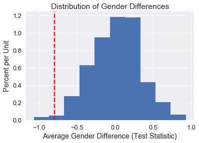

```py
# HIDDEN
differences_df = pd.DataFrame()
differences_df["gender_differences"] = gender_differences
gender_hist = differences_df.loc[:, "gender_differences"].hist(normed=True)
gender_hist.set_xlabel("Average Gender Difference (Test Statistic)")
gender_hist.set_ylabel("Percent per Unit")
gender_hist.set_title("Distribution of Gender Differences")
plt.axvline(observed_difference, c='r', linestyle='--')
```

```py
<matplotlib.lines.Line2D at 0x1a1b256ef0>
```


根据下面的计算，在 1000 个模拟中，只有 18 个的差异至少与观察到的差异一样大。因此，我们的 p 值小于 0.05 阈值，我们拒绝了零假设，而赞成替代。

```py
#Sample Distribution Parameters
sample_sd = np.std(gender_differences)
sample_mean = np.mean(gender_differences)
#Computing right-hand extreme value
num_sd_away = (sample_mean - observed_difference)/sample_sd
right_extreme_val = sample_mean + (num_sd_away*sample_sd)
#Calculate P-value
num_extreme_left = np.count_nonzero(gender_differences <= observed_difference)
num_extreme_right = np.count_nonzero(gender_differences >= right_extreme_val)
empirical_P = (num_extreme_left + num_extreme_right) / repetitions
empirical_P
```

```py
0.018
```

### 结论[¶](#Conclusion)

通过这一排列测试，我们发现集合对女教师的偏见是一个数额大，统计意义重大。

还有其他一些研究也在教学评估中测试了偏差。根据 Dring，Ottoboni&Stark 2016，进行了其他几个参数测试，假设男女教师的评级是来自具有相同方差的正态分布人群的独立随机样本；这种类型的实验设计与提出了零假设，导致 p 值可能产生误导。

相比之下，无聊的 Ottoboni&Stark 2016 使用了基于随机分配学生到班级的排列测试。回想一下，在排列测试期间，我们没有对数据的分布做任何基本假设。在这个实验中，我们没有假设学生、集合分数、成绩或任何其他变量包含任何群体的随机样本，更不用说具有正态分布的群体。

在检验假设时，仔细选择实验设计和无效假设是非常重要的，以获得可靠的结果。

## 18.3 线性回归的自举（真系数的推断）

```py
# HIDDEN
# Clear previously defined variables
%reset -f

# Set directory for data loading to work properly
import os
os.chdir(os.path.expanduser('~/notebooks/18'))
```

```py
# HIDDEN
import warnings
# Ignore numpy dtype warnings. These warnings are caused by an interaction
# between numpy and Cython and can be safely ignored.
# Reference: https://stackoverflow.com/a/40846742
warnings.filterwarnings("ignore", message="numpy.dtype size changed")
warnings.filterwarnings("ignore", message="numpy.ufunc size changed")

import numpy as np
import matplotlib.pyplot as plt
import pandas as pd
import seaborn as sns
%matplotlib inline
import ipywidgets as widgets
from ipywidgets import interact, interactive, fixed, interact_manual
import nbinteract as nbi

sns.set()
sns.set_context('talk')
np.set_printoptions(threshold=20, precision=2, suppress=True)
pd.options.display.max_rows = 7
pd.options.display.max_columns = 8
pd.set_option('precision', 2)
# This option stops scientific notation for pandas
# pd.set_option('display.float_format', '{:.2f}'.format)
```

回想一下，在线性回归中，我们拟合了如下形式的模型：$\ begin aligned f \ theta（x）=\hat \ theta+hat \ theta x u 1+\ldots+\hat \ theta x u p\end aligned$$

我们想推断模型的真实系数。由于$\hat \theta 0，$\hat \theta，$\ldots$\hat \theta p 是根据我们的培训数据/观察结果而变化的估计量，我们想了解我们的估计系数与真实系数的比较情况。bootstrapping 是一种统计推断的非参数方法，它为我们的参数提供了标准误差和置信区间。

让我们来看一个如何在线性回归中使用引导方法的例子。

### 数据[¶](#The-Data)

奥蒂斯·达德利·邓肯是一位定量社会学家，对衡量不同职业的声望水平感兴趣。在 1947 年的国家意见研究中心（Norc）调查中，只有 90 个职业被评为他们的声望水平。邓肯希望通过使用 1950 年人口普查记录的每个职业的收入和教育数据来“填写”未分级职业的声望分数。当把北卡罗来纳州的数据与 1950 年的人口普查数据相结合时，只有 45 个职业可以匹配。最后，邓肯的目标是建立一个模型，用不同的特征来解释威望；使用这个模型，人们可以预测在挪威国家石油公司调查中没有记录的其他职业的威望。

邓肯数据集是一个随机样本，其中包含 1950 年美国 45 个职业的声望和其他特征的信息。变量包括：

`occupation`表示职业/头衔的类型。

`income`表示收入超过 3500 美元的职业在职人员的百分比。

`education`代表 1950 年美国人口普查中在职者中高中毕业生的百分比。

`prestige`表示在一项调查中，被调查者在声望上认为某一职业“好”或“优秀”的百分比。

```py
duncan = pd.read_csv('duncan.csv').loc[:, ["occupation", "income", "education", "prestige"]]
duncan
```

|  | 职业 | 收入 | 教育 | 声望 |
| --- | --- | --- | --- | --- |
| 零 | 会计 | 六十二 | 86 岁 | 八十二 |
| --- | --- | --- | --- | --- |
| 1 个 | 飞行员 | 七十二 | 七十六 | 八十三 |
| --- | --- | --- | --- | --- |
| 二 | 建筑师 | 75 岁 | 92 岁 | 九十 |
| --- | --- | --- | --- | --- |
| …… | …… | ... | ... | ... |
| --- | --- | --- | --- | --- |
| 42 岁 | 看门人 | 七 | 20 个 | 8 个 |
| --- | --- | --- | --- | --- |
| 四十三 | 警察 | 34 岁 | 47 岁 | 四十一 |
| --- | --- | --- | --- | --- |
| 四十四 | 服务员 | 8 | 三十二 | 10 个 |
| --- | --- | --- | --- | --- |

45 行×4 列

通过可视化来探索数据通常是一个好主意，以便了解变量之间的关系。下面，我们将看到收入、教育和声望之间的关系。

```py
plt.scatter(x=duncan["education"], y=duncan["prestige"])
```

```py
<matplotlib.collections.PathCollection at 0x1a1cf2cd30>
```

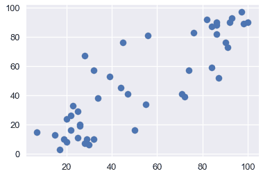

```py
plt.scatter(x=duncan["income"], y=duncan["prestige"])
```

```py
<matplotlib.collections.PathCollection at 0x1a1d0224e0>
```

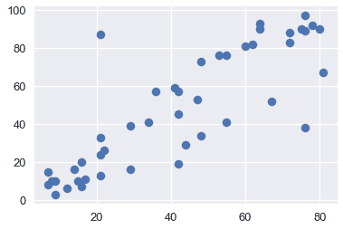

```py
plt.scatter(x=duncan["income"], y=duncan["education"])
```

```py
<matplotlib.collections.PathCollection at 0x1a1d0de5f8>
```

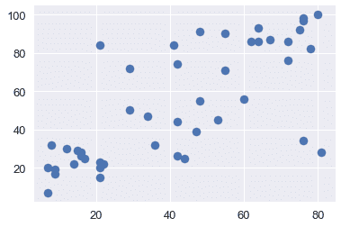

从上面的图中，我们看到教育和收入与声望呈正相关；因此，这两个变量可能有助于解释声望。让我们用这些解释变量拟合一个线性模型来解释声望。

### 拟合模型[¶](#Fitting-the-model)

我们将采用以下模型来解释职业声望作为收入和教育的线性函数：

$$\开始对齐\文本 tt 声望 _i=\theta_0^*

*   \ theta ^*\cdot\texttt 收入 u i
*   \ theta 教育^*\cdot\texttt 教育 u i
*   \ varepsilon_i \结束对齐$$

为了适应这个模型，我们将定义设计矩阵（x）和响应变量（y）：

```py
X = duncan.loc[:, ["income", "education"]]
X.head()
```

|  | income | education |
| --- | --- | --- |
| 0 | 62 | 86 |
| --- | --- | --- |
| 1 | 72 | 76 |
| --- | --- | --- |
| 2 | 75 | 92 |
| --- | --- | --- |
| 三 | 55 岁 | 90 |
| --- | --- | --- |
| 四 | 六十四 | 86 |
| --- | --- | --- |

```py
y = duncan.loc[:, "prestige"]
y.head()
```

```py
0    82
1    83
2    90
3    76
4    90
Name: prestige, dtype: int64
```

下面，我们拟合我们的线性模型，并在模型与数据相匹配后，打印出模型的所有系数（从上面的方程式中）。注意，这些是我们的样本系数。

```py
import sklearn.linear_model as lm

linear_model = lm.LinearRegression()
linear_model.fit(X, y)

print("""
intercept: %.2f
income:    %.2f
education:    %.2f
""" % (tuple([linear_model.intercept_]) + tuple(linear_model.coef_)))
```

```py
intercept: -6.06
income:    0.60
education:    0.55
```

上面的系数给出了真实系数的估计。但是，如果我们的样本数据是不同的，我们将使我们的模型适合不同的数据，导致这些系数是不同的。我们想探讨一下，我们的系数可能使用了引导方法。

在我们的引导方法和分析中，我们将关注教育系数。我们希望探讨声誉与教育之间的部分关系，即保持收入不变（而不是声誉与教育之间的边际关系，而忽略收入）。偏回归系数$\widehat \theta_uxttet education$说明了我们数据中声望和教育之间的部分关系。

### 引导观察结果[¶](#Bootstrapping-the-Observations)

在这种方法中，我们将对$（x_i，y_i）$作为样本，因此我们通过从这些对中进行替换采样来构造引导重新采样：

$$\ begin aligned（x_i^*，y_i^*）=（x_i，y_i），\text 其中 i=1，点，n \ text 随机均匀采样。\ end aligned$$

换句话说，我们从我们的数据点用替换的方法对 n 个观测进行采样；这是我们的引导样本。然后我们将一个新的线性回归模型拟合到这个样本数据中，并记录教育系数$\tilde\theta\texttt education$；这个系数是我们的引导统计。

#### $\tilde\theta\texttt 教育$[？](#Bootstrap-Sampling-Distribution-of-$\tilde\theta_\texttt{education}$)的引导抽样分布

```py
def simple_resample(n): 
    return(np.random.randint(low = 0, high = n, size = n))

def bootstrap(boot_pop, statistic, resample = simple_resample, replicates = 10000):
    n = len(boot_pop)
    resample_estimates = np.array([statistic(boot_pop[resample(n)]) for _ in range(replicates)])
    return resample_estimates
```

```py
def educ_coeff(data_array):
    X = data_array[:, 1:]
    y = data_array[:, 0]

    linear_model = lm.LinearRegression()
    model = linear_model.fit(X, y)
    theta_educ = model.coef_[1]

    return theta_educ

data_array = duncan.loc[:, ["prestige", "income", "education"]].values

theta_hat_sampling = bootstrap(data_array, educ_coeff)
```

```py
plt.figure(figsize = (7, 5))
plt.hist(theta_hat_sampling, bins = 30, normed = True)
plt.xlabel("$\\tilde{\\theta}_{educ}$ Values")
plt.ylabel("Proportion per Unit")
plt.title("Bootstrap Sampling Distribution of $\\tilde{\\theta}_{educ}$ (Nonparametric)");
plt.show()
```

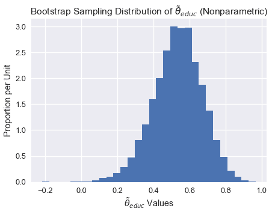

注意上面的采样分布是如何稍微向左倾斜的。

#### 估算真系数

虽然我们不能直接测量$\theta^*u \texttt education$我们可以使用引导置信区间来解释样本回归系数$\widehat\theta \texttt education 的可变性。下面，我们使用 bootstrap percentile 方法为真系数$\theta^*\texttt education 构建一个大约 95%的置信区间。置信区间从 2.5%扩展到 10000 个自举系数的 97.5%。

```py
left_confidence_interval_endpoint = np.percentile(theta_hat_sampling, 2.5)
right_confidence_interval_endpoint = np.percentile(theta_hat_sampling, 97.5)

left_confidence_interval_endpoint, right_confidence_interval_endpoint
```

```py
(0.24714198882974781, 0.78293602739856061)
```

从上述置信区间，我们可以相当确定，真实系数介于 0.236 和 0.775 之间。

#### 利用正态理论的置信区间

我们也可以建立基于正态理论的置信区间。由于$\widehat\theta educ 值呈正态分布，我们可以通过计算以下内容来构造置信区间：

$$\begin aligned[\widehat\theta-z \frac \alpha 2 se（\theta ^*），\widehat\theta+z \frac \alpha 2 se（\theta ^*）]\end aligned$$

其中，$se（\theta^*）$是引导系数的标准误差，$z$是一个常数，$widehat\theta$是我们的样本系数。注意$Z$根据我们构建的区间的置信水平而变化。由于我们正在建立一个 95%的置信区间，我们将使用 1.96。

```py
# We will use the statsmodels library in order to find the standard error of the coefficients
import statsmodels.api as sm
ols = sm.OLS(y, X)
ols_result = ols.fit()
# Now you have at your disposition several error estimates, e.g.
ols_result.HC0_se
```

```py
income       0.15
education    0.12
dtype: float64
```

```py
left_confidence_interval_endpoint_normal = 0.55 - (1.96*0.12)
right_confidence_interval_endpoint_normal = 0.55 + (1.96*0.12)
left_confidence_interval_endpoint_normal, right_confidence_interval_endpoint_normal
```

```py
(0.3148000000000001, 0.7852)
```

**观察值：**注意使用正态理论的置信区间比使用百分位法的置信区间窄，特别是在区间的左边。

我们不会详细讨论正常理论置信区间，但如果您想了解更多信息，请参阅 x。

#### 真系数可以是 0 吗？[¶](#Could-the-true-coefficient-be-0?)

虽然我们观察到教育和声望之间存在正的部分关系（从 0.55 系数开始），但如果真正的系数是 0，而教育和声望之间没有部分关系呢？在这种情况下，我们观察到的关联仅仅是由于在获得构成我们样本的点时的变化。

为了正式检验教育与声望之间的部分关系是否真实，我们要检验以下假设：

**虚假设**真偏系数为 0。

**替代假设。**真正的分项系数不是 0。

由于我们已经为真系数建立了 95%的置信区间，我们只需要看看 0 是否在这个区间内。请注意，0 不在上述置信区间内；因此，我们有足够的证据来拒绝无效假设。

如果真系数的置信区间确实包含 0，那么我们就没有足够的证据来拒绝无效假设。在这种情况下，观察到的系数$\widehat\theta \textt education$可能是假的。

#### 方法 1 引导反射

为了建立系数$\widehat\theta \texttt education 的抽样分布，并构造真系数的置信区间，我们直接对观测结果进行了重采样，并在引导样本上拟合了新的回归模型。此方法将回归量$x_i$隐式地视为随机的，而不是固定的。

在某些情况下，我们可能希望将$x_i$视为固定值（例如，如果数据来自实验设计）。如果解释变量被控制，或者解释变量的值被实验者设置，那么我们可以考虑下面的替代引导方法。

### 备选方案：引导残差[¶](#Alternative:-Bootstrapping-the-Residuals)

线性回归中假设检验的另一种方法是自举残差。这种方法有许多基本假设，在实践中使用频率较低。在这种方法中，我们将 _ 残差 _$e_i：=y_i-x_i \widehat \beta$作为我们的样本，因此我们通过用这些残差替换的样本来构造引导重采样。一旦我们构造了每个引导样本，我们就可以使用这些残差计算新的拟合值。然后，我们将这些新的 y 值回归到固定的 x 值上，得到自举回归系数。

为了更清楚地说明，让我们将此方法分解为以下步骤：

1.  估计原始样本的回归系数，并计算每个观测值的拟合值$\widehat y$和残差$e_i$。

2.  选择残差的引导样本；我们将这些引导残差表示为$\tilde e_1、\tilde e_2、\dots\tilde e_n$。然后，通过计算$\widehat y+\tilde e_i$计算引导的$\tilde y_i$值，其中拟合值$\widehat y_i=x_i\widehat\beta$从原始回归中获得。

3.  在固定的$x$值上对引导的$\tilde y_i$值进行回归，以获得引导回归系数$\tilde\theta$。

4.  重复第二步和第三步数次，以获得几个引导回归系数$\tilde\theta_1、\tilde\theta_2、\dots\tilde\theta_n$。这些可以用来计算引导标准错误和置信区间。

#### Estimating the True Coefficients[¶](#Estimating-the-True-Coefficients)

既然我们已经有了自举回归系数，我们可以使用与以前相同的技术构造一个置信区间。我们将把这个留作练习。

#### 引导残差反射[？](#Bootstrapping-the-Residuals-Reflection)

让我们考虑一下这个方法。通过将重新取样的残差随机重新附加到确定的值，此过程隐式地假定错误分布相同。更具体地说，该方法假定输入$x_i$的所有值的回归曲线周围的波动分布是相同的。这是一个缺点，因为真正的错误可能有不恒定的方差；这种现象被称为异方差。

虽然这种方法没有对误差分布的形状做任何假设，但它隐式地假定模型的函数形式是正确的。通过依赖模型来创建每个引导样本，我们假设模型结构是适当的。

## 摘要[¶](#Summary)

在本节中，我们将重点介绍线性回归设置中使用的引导技术。

一般来说，引导观察通常用于引导。该方法通常比其他技术更为稳健，因为它所做的基本假设更少；例如，如果拟合了错误的模型，则该方法仍将生成相关参数的适当抽样分布。

我们还强调了另一种方法，它有几个缺点。当我们希望将我们的观察值$x$视为固定值时，可以使用引导残差。请注意，应该谨慎使用此方法，因为它对模型的错误和形式进行了额外的假设。

## 18.4 学生化自举

```py
# HIDDEN
# Clear previously defined variables
%reset -f

# Set directory for data loading to work properly
import os
os.chdir(os.path.expanduser('~/notebooks/18'))
```

```py
# HIDDEN
import warnings
# Ignore numpy dtype warnings. These warnings are caused by an interaction
# between numpy and Cython and can be safely ignored.
# Reference: https://stackoverflow.com/a/40846742
warnings.filterwarnings("ignore", message="numpy.dtype size changed")
warnings.filterwarnings("ignore", message="numpy.ufunc size changed")

import numpy as np
import matplotlib.pyplot as plt
import pandas as pd
import seaborn as sns
%matplotlib inline
import ipywidgets as widgets
from ipywidgets import interact, interactive, fixed, interact_manual
import nbinteract as nbi

sns.set()
sns.set_context('talk')
np.set_printoptions(threshold=20, precision=2, suppress=True)
pd.options.display.max_rows = 7
pd.options.display.max_columns = 8
pd.set_option('precision', 2)
# This option stops scientific notation for pandas
# pd.set_option('display.float_format', '{:.2f}'.format)
```

```py
# HIDDEN
def df_interact(df, nrows=7, ncols=7):
    '''
    Outputs sliders that show rows and columns of df
    '''
    def peek(row=0, col=0):
        return df.iloc[row:row + nrows, col:col + ncols]
    if len(df.columns) <= ncols:
        interact(peek, row=(0, len(df) - nrows, nrows), col=fixed(0))
    else:
        interact(peek,
                 row=(0, len(df) - nrows, nrows),
                 col=(0, len(df.columns) - ncols))
    print('({} rows, {} columns) total'.format(df.shape[0], df.shape[1]))
```

```py
# HIDDEN
times = pd.read_csv('ilec.csv')['17.5']
```

**bootstrap**是我们在数据 8 中了解到的一个过程，我们只能使用一个样本来估计人口统计。引导的一般步骤如下：

*   从人群中抽取相当大的样本。
*   使用这个样本，我们用替换品重新取样，形成相同尺寸的新样本。
*   我们做了很多次，对每个重采样进行期望的统计（例如，我们取每个重采样的中位数）。

在这里，我们得到了许多来自个别重采样的测试统计数据，从中我们可以形成一个分布。在数据 8 中，我们被教导通过采用引导统计的 2.5%和 97.5%来形成 95%的置信区间。这种用于创建置信区间的引导方法称为**百分位数引导。**95%置信度意味着，如果我们从总体中提取一个新的样本并构造一个置信区间，置信区间将包含概率为 0.95 的总体参数。然而，重要的是要注意，从实际数据创建的置信区间只能接近 95%的置信度。特别是在小样本量的情况下，百分位数引导比期望的置信度要低。

下面，我们选取了一个总体，并为不同样本大小的总体平均值创建了 1000 个引导 95%的置信区间。Y 轴表示包含实际总体平均值的 1000 个置信区间的分数。注意，在样本量低于 20 的情况下，小于 90%的置信区间实际上包含总体平均值。

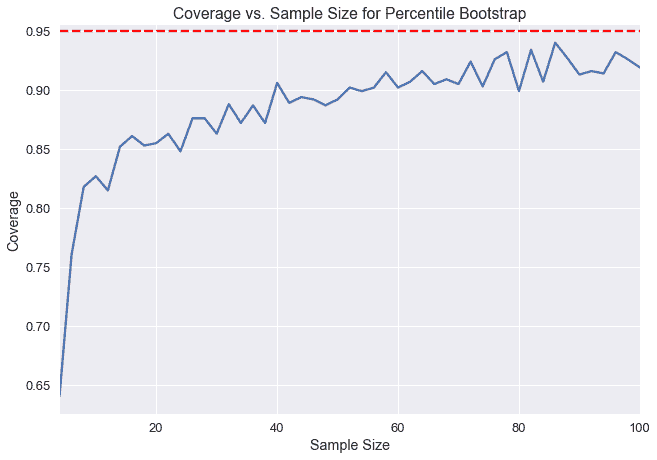

我们可以通过计算我们这里测量的置信度和我们期望的 95%置信度之间的差异来测量 _ 覆盖误差 _。我们可以看到，在小样本量的情况下，百分位数引导的覆盖率误差非常高。在本章中，我们将介绍一种新的引导方法，称为**studentized bootstrap**方法，它具有较低的覆盖率错误，但需要更多的计算。

### 修理次数[¶](#Repair-Times)

纽约市公用事业委员会监测该州修理陆地电话服务的响应时间。这些维修时间可能会因维修类型的不同而有所不同。我们对一个特定的 _ 现有本地交换运营商 _ 进行了一次一类维修的维修时间普查，该公司是一家电话公司，在向竞争激烈的本地交换运营商开放市场之前，该公司对固定电话服务拥有区域垄断权，或者这类公司的法人继承人。委员会对平均维修时间的估计很感兴趣。首先，让我们看看所有时间的分布。

```py
plt.hist(times, bins=20, normed=True)
plt.xlabel('Repair Time')
plt.ylabel('Proportion per Hour')
plt.title('Distribution of Repair Times');
```

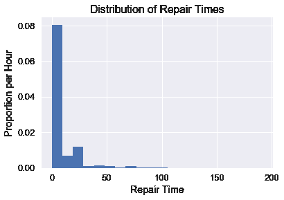

假设我们要估计修复时间的总体平均值。我们首先需要定义实现这一点所需的主要统计函数。通过对整个人口的统计，我们可以看出实际平均修复时间约为 8.4 小时。

```py
def stat(sample, axis=None):
    return np.mean(sample, axis=axis)
```

```py
theta = stat(times)
theta
```

```py
8.406145520144333
```

现在我们需要定义一个方法，它将返回一个索引列表，这样我们就可以从原始样本中重新取样而不需要替换。

```py
def take_sample(n=10):
    return np.random.choice(times, size=n, replace=False)
```

在现实生活中，我们将无法从人群中提取许多样本（我们使用自举只能使用一个样本）。但出于演示目的，我们可以接触到整个人口，因此我们将采集 1000 个 10 号样本，并绘制样本平均值的分布图。

```py
samples_from_pop = 1000

pop_sampling_dist = np.array(
    [stat(take_sample()) for _ in range(samples_from_pop)]
)

plt.hist(pop_sampling_dist, bins=30, normed=True);
plt.xlabel('Average Repair Time')
plt.ylabel('Proportion per Hour')
plt.title(r'Distribution of Sample Means ($\hat{\theta}$)');
```

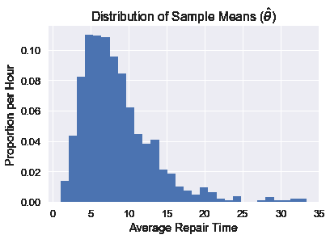

我们可以看到，这个分布的中心是~5，并且由于原始数据的分布是倾斜的，所以它是向右倾斜的。

### 统计分布比较

现在我们可以看看单个引导分布如何与从总体中抽样的分布相比较。

一般来说，我们的目标是估计我们的人口参数$\theta^*$（在这种情况下，人口的平均修复时间，我们发现是~8.4）。每个单独的样本都可以用来计算一个估计的统计，$\hat\theta$（在这种情况下，是单个样本的平均修复时间）。上面的图表显示了我们所称的 _ 经验分布 _，它是由人口中许多样本的估计统计数据计算得出的。但是，对于自举，我们需要原始样本（称为$\tilde\theta$）重新采样的统计信息。

为了使自举正常工作，我们希望原始样本看起来与总体相似，以便重新取样看起来也与总体相似。如果我们的原始样本 _ 看起来像人群，那么从重新取样计算出的平均修复时间分布将类似于直接从人群中提取的样本的经验分布。_

让我们来看看一个单独的引导分布将如何显示。我们可以定义不需要替换的情况下抽取 10 号样本的方法，并将其引导 1000 次以获得我们的分布。

```py
bootstrap_reps = 1000

def resample(sample, reps):
    n = len(sample)
    return np.random.choice(sample, size=reps * n).reshape((reps, n))

def bootstrap_stats(sample, reps=bootstrap_reps, stat=stat):
    resamples = resample(sample, reps)
    return stat(resamples, axis=1)
```

```py
np.random.seed(0)

sample = take_sample()

plt.hist(bootstrap_stats(sample), bins=30, normed=True)
plt.xlabel('Average Repair Time')
plt.ylabel('Proportion per Hour')
plt.title(r'Distribution of Bootstrap Sample Means ($\tilde{\theta}$)');
```


正如您所看到的，我们的$\tilde\theta$分布与$\hat\theta$分布不太一样，这可能是因为我们的原始样本不像人群。因此，我们的置信区间表现相当差。下面我们可以看到两个分布的并排比较：

```py
plt.figure(figsize=(10, 4))
plt.subplot(121)
plt.xlabel('Average Repair Time')
plt.ylabel('Proportion per Hour')
plt.title(r'Distribution of Sample Means ($\hat{\theta}$)')
plt.hist(pop_sampling_dist, bins=30, range=(0, 40), normed=True)
plt.ylim((0,0.2))

plt.subplot(122)
plt.xlabel('Average Repair Time')
plt.ylabel('Proportion per Hour')
plt.title(r'Distribution of Bootstrap Sample Means ($\tilde{\theta}$)')
plt.hist(bootstrap_stats(sample), bins=30, range=(0, 40), normed=True)
plt.ylim((0,0.2))

plt.tight_layout();
```

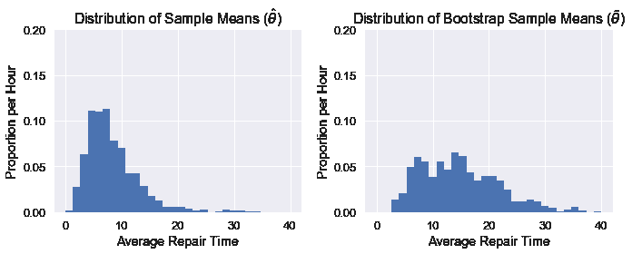

### studentized 自举[¶](#The-Studentized-Bootstrap-Procedure)

正如我们所看到的，百分位数自举的主要问题是需要更大的样本量才能真正达到所需的 95%置信度。利用 studentized 自举，我们可以做更多的计算，以在较小的样本量下获得更好的覆盖率。

研究自举背后的思想是规范化测试统计的分布$\tilde\theta$以 0 为中心，标准偏差为 1。这将修正原始分布的扩展差和倾斜。为了完成所有这些，我们需要首先进行一些派生。

在百分位数引导过程中，我们生成了许多$\tilde\theta$的值，然后我们将 2.5%和 97.5%作为置信区间。简言之，我们将这些百分位数称为$Q_2.5 和$Q_97.5 美元。请注意，这两个值都来自引导统计信息。

通过这个过程，我们希望实际的人口统计数据在置信区间之间的概率是 95%。换句话说，我们希望实现以下平等：

$$\Begin Aligned 0.95&amp；=\Cal P \ Left（Q 2.5 \Leq\Theta ^*\Leq Q 97.5 \ Let Aligned$$

在这个过程中，我们做了两个近似：因为我们假设我们的随机样本看起来像总体，所以我们用.\that\theta$来近似.\theta^*；因为我们假设一个随机重采样看起来像原始样本，所以我们用.\tilde\theta$来近似.\that\theta$。由于第二个近似值依赖于第一个近似值，所以它们都会在置信区间生成中引入误差，从而产生我们在图中看到的覆盖误差。

我们的目标是通过标准化我们的统计数据来减少这个错误。我们不直接使用我们的计算值$\tilde\theta$，而是使用：

$$\begin aligned \frac \tilde \theta-\hat \theta se（\tilde \theta）\end aligned$$

这将用样本统计标准化重采样统计，然后除以重采样统计的标准偏差（此标准偏差也称为标准误差，或 SE）。

整个规范化的统计称为学生的 t 统计量，所以我们称这个引导方法为**studentized bootstrap**或**bootstrap-t**方法。

像往常一样，我们计算了许多重采样的统计数据，然后取 2.5%和 97.5%分别为$Q_2.5 和$Q_97.5_。因此，我们希望归一化总体参数位于这些百分位数之间：

$$\Begin Aligned 0.95&amp；=\Cal P \ Left（Q 2.5 \Leq\Frac \Hat \Theta-\Theta ^*SE（\Hat \Theta）\Leq Q 97.5 \ Let Aligned$$

我们现在可以解出$\theta^*$的不等式：

$$ \begin{aligned} 0.95 &= {\cal P}\left(q_{2.5} \leq \frac{\hat{\theta} - \theta^*} {SE({\hat{\theta}})} \leq q_{97.5}\right) \\ &= {\cal P}\left(q_{2.5}SE({\hat{\theta}}) \leq {\hat{\theta} - \theta^*} \leq q_{97.5}SE({\hat{\theta}})\right) \\ &= {\cal P}\left(\hat{\theta} - q_{97.5}Se（\Hat \Theta）\Leq \Theta ^*\Leq \Hat \Theta-Q 2.5 Se（\Hat \Theta）\右\端对齐$$

这意味着我们可以只用$\hat\theta$（原始样本的测试统计）、$q 2.5 和$q 97.5$（用重采样计算的标准化统计百分比）和$se（\hat\theta）$（样本测试统计的标准差）来构造置信区间。最后一个值是通过使用重新取样测试统计数据的标准偏差来估计的。

因此，要计算 studentized 自举 CI，我们执行以下过程：

1.  计算样本上的测试统计数据。
2.  多次引导样本。
3.  对于每个自举，重新取样：
    1.  计算$\tilde\theta$，重新取样的测试统计信息。
    2.  计算$SE（\tilde \theta）美元。
    3.  计算$Q=\frac \tilde \theta-\hat \theta se（\tilde \theta）$。
4.  使用$\tilde\theta$值的标准偏差估计$se（\hat\theta）$值。
5.  然后计算置信区间：$\Left[\Hat \Theta-Q 97.5 SE（\Hat \Theta），\Hat \Theta-Q 2.5 SE（\Hat \Theta Right）$。

### 重新取样统计的标准误差计算

需要注意的是，$SE（\hat\theta）$是重新采样测试统计的标准错误，它并不总是容易计算，并且依赖于测试统计。对于样本平均值，$se（\tilde\theta）=\frac \tilde\sigma \sqrt n$，重采样值的标准差除以样本大小的平方根。

还要记住，我们必须使用重采样值来计算$SE（\tilde\theta）$；我们使用示例值来计算$SE（\hat\theta）$。

但是，如果我们的测试统计数据没有一个分析表达式（就像我们对于样本平均值的表达式），那么我们需要进行第二级引导。对于每个重采样，我们再次引导它，并计算每个第二级重采样（重采样）的测试统计信息，并使用这些第二级统计信息计算标准偏差。通常，我们会进行大约 50 个二级采样。

这大大增加了 studentized 引导过程的计算时间。如果我们进行 50 个二级重采样，整个过程将花费 50 倍的时间，只要我们有一个$SE（\tilde\theta）$的分析表达式。

### 研究性引导与百分位数引导的比较

为了评估 studentized 和 percentile 引导的权衡，让我们使用修复时间数据集比较两种方法的覆盖率。

```py
plt.hist(times, bins=20, normed=True);
plt.xlabel('Repair Time')
plt.ylabel('Proportion per Hour')
plt.title('Distribution of Repair Times');
```


我们将从人群中抽取许多样本，计算每个样本的百分位置信区间和研究的置信区间，然后计算每个样本的覆盖率。我们将对不同的样本大小重复此操作，以了解每个方法的覆盖范围如何随样本大小而变化。

我们可以使用`np.percentile`计算以下百分位置信区间：

```py
def percentile_ci(sample, reps=bootstrap_reps, stat=stat):
    stats = bootstrap_stats(sample, reps, stat)
    return np.percentile(stats, [2.5, 97.5])
```

```py
np.random.seed(0)
sample = take_sample(n=10)
percentile_ci(sample)
```

```py
array([ 4.54, 29.56])
```

要进行 studentized 引导，我们需要更多的代码：

```py
def studentized_stats(sample, reps=bootstrap_reps, stat=stat):
    '''
    Computes studentized test statistics for the provided sample.

    Returns the studentized test statistics and the SD of the
    resample test statistics.
    '''
    # Bootstrap the sample and compute \tilde \theta values
    resamples = resample(sample, reps)
    resample_stats = stat(resamples, axis=1)
    resample_sd = np.std(resample_stats)

    # Compute SE of \tilde \theta.
    # Since we're estimating the sample mean, we can use the formula.
    # Without the formula, we would have to do a second level bootstrap here.
    resample_std_errs = np.std(resamples, axis=1) / np.sqrt(len(sample))

    # Compute studentized test statistics (q values)
    sample_stat = stat(sample)
    t_statistics = (resample_stats - sample_stat) / resample_std_errs
    return t_statistics, resample_sd

def studentized_ci(sample, reps=bootstrap_reps, stat=stat):
    '''
    Computes 95% studentized bootstrap CI
    '''
    t_statistics, resample_sd = studentized_stats(sample, reps, stat)
    lower, upper = np.percentile(t_statistics, [2.5, 97.5])

    sample_stat = stat(sample)
    return (sample_stat - resample_sd * upper,
            sample_stat - resample_sd * lower)
```

```py
np.random.seed(0)
sample = take_sample(n=10)
studentized_ci(sample)
```

```py
(4.499166906400612, 59.03291210887363)
```

现在所有内容都写出来了，我们可以比较两种方法的覆盖范围，因为样本大小从 4 增加到 100。

```py
def coverage(cis, parameter=theta):
    return (
        np.count_nonzero([lower < parameter < upper for lower, upper in cis])
        / len(cis)
    )
```

```py
def run_trials(sample_sizes):
    np.random.seed(0)
    percentile_coverages = []
    studentized_coverages = []

    for n in sample_sizes:
        samples = [take_sample(n) for _ in range(samples_from_pop)]
        percentile_cis = [percentile_ci(sample) for sample in samples]
        studentized_cis = [studentized_ci(sample) for sample in samples]

        percentile_coverages.append(coverage(percentile_cis))
        studentized_coverages.append(coverage(studentized_cis))
    return pd.DataFrame({
        'percentile': percentile_coverages,
        'studentized': studentized_coverages,
    }, index=sample_sizes)
```

```py
%%time

trials = run_trials(np.arange(4, 101, 2))
```

```py
CPU times: user 1min 52s, sys: 1.08 s, total: 1min 53s
Wall time: 1min 57s
```

```py
trials.plot()
plt.axhline(0.95, c='red', linestyle='--', label='95% coverage')
plt.legend()
plt.xlabel('Sample Size')
plt.ylabel('Coverage')
plt.title('Coverage vs. Sample Size for Studentized and Percentile Bootstraps');
```


如我们所见，在较小的样本量下，studentized 引导具有更好的覆盖范围。

## 摘要[¶](#Summary)

大多数情况下，研究的引导比百分位引导更好，特别是如果我们只有一个小样本开始。我们通常希望在样本量较小或原始数据倾斜时使用此方法。主要的缺点是它的计算时间，如果$SE（\tilde\theta）$不容易计算，它会被进一步放大。

## 18.5 P-HACKING

```py
# HIDDEN
# Clear previously defined variables
%reset -f

# Set directory for data loading to work properly
import os
os.chdir(os.path.expanduser('~/notebooks/18'))
```

```py
# HIDDEN
import warnings
# Ignore numpy dtype warnings. These warnings are caused by an interaction
# between numpy and Cython and can be safely ignored.
# Reference: https://stackoverflow.com/a/40846742
warnings.filterwarnings("ignore", message="numpy.dtype size changed")
warnings.filterwarnings("ignore", message="numpy.ufunc size changed")

import numpy as np
import matplotlib.pyplot as plt
import pandas as pd
import seaborn as sns
%matplotlib inline
import ipywidgets as widgets
from ipywidgets import interact, interactive, fixed, interact_manual
import nbinteract as nbi

sns.set()
sns.set_context('talk')
np.set_printoptions(threshold=20, precision=2, suppress=True)
pd.options.display.max_rows = 7
pd.options.display.max_columns = 8
pd.set_option('precision', 2)
# This option stops scientific notation for pandas
# pd.set_option('display.float_format', '{:.2f}'.format)
```

正如我们所讨论的，p 值或概率值是基于零假设的模型，检验统计量等于在数据中观察到的值，或者更进一步地向替代值方向观察到的值的机会。如果一个 p 值很小，这意味着超出观测统计值的尾部很小，因此观测统计值远离零预测值。这意味着数据比支持空值更好地支持替代假设。按照惯例，当我们看到 p 值低于 0.05 时，结果被称为统计显著性，我们拒绝了无效假设。

当 p 值被滥用时，存在着危险。_p-hacking_ 是错误地使用数据分析来证明数据中的模式在实际情况下具有统计意义的行为。这通常是通过对数据执行多个测试来完成的，并且只关注返回重要结果的测试。

在本节中，我们将介绍一些关于 p 值和 p-hacking 危险的例子。

## 多重假设检验

盲目依赖 p 值来确定“统计显著性”的最大危险之一是，当我们试图找到“最性感”的结果时，这些结果会给我们“好的”p 值。这通常是在做“食物频率问卷”或 FFQ 时，为了研究饮食习惯与其他特征（疾病、体重、宗教等）的相关性。Fivethirtyeight 是一个专注于民意调查分析的在线博客，它制作了自己的 ffq，我们可以使用他们的数据运行我们自己的分析，找到一些愚蠢的结果，这些结果可以被认为是“统计上的显著性”。

```py
data = pd.read_csv('raw_anonymized_data.csv')
# Do some EDA on the data so that categorical values get changed to 1s and 0s
data.replace('Yes', 1, inplace=True)
data.replace('Innie', 1, inplace=True)
data.replace('No', 0, inplace=True)
data.replace('Outie', 0, inplace=True)

# These are some of the columns that give us characteristics of FFQ-takers
characteristics = ['cat', 'dog', 'right_hand', 'left_hand']

# These are some of the columns that give us the quantities/frequencies of different food the FFQ-takers ate
ffq = ['EGGROLLQUAN', 'SHELLFISHQUAN', 'COFFEEDRINKSFREQ']
```

我们将特别关注人们是否拥有猫、狗，或者他们是什么样的手习惯。

```py
data[characteristics].head()
```

|  | 猫 | 狗 | 右手 | 左手 |
| --- | --- | --- | --- | --- |
| 零 | 零 | 0 | 1 个 | 0 |
| --- | --- | --- | --- | --- |
| 1 个 | 0 | 0 | 1 | 0 |
| --- | --- | --- | --- | --- |
| 二 | 0 | 1 | 1 | 0 |
| --- | --- | --- | --- | --- |
| 三 | 0 | 0 | 1 | 0 |
| --- | --- | --- | --- | --- |
| 四 | 0 | 0 | 1 | 0 |
| --- | --- | --- | --- | --- |

此外，我们还将了解人们消费了多少贝类、蛋卷和咖啡。

```py
data[ffq].head()
```

|  | 鸡蛋卷 | 贝鱼圈 | 共同进料机频率 |
| --- | --- | --- | --- |
| 0 | 1 | 三 | 二 |
| --- | --- | --- | --- |
| 1 | 1 | 2 | 3 |
| --- | --- | --- | --- |
| 2 | 2 | 3 | 3 |
| --- | --- | --- | --- |
| 3 | 3 | 2 | 1 |
| --- | --- | --- | --- |
| 4 | 2 | 2 | 2 |
| --- | --- | --- | --- |

所以现在我们可以计算每对特征和食物频率/数量特征的 p 值。

```py
# HIDDEN
def findpvalue(data, c, f):
    return stat.pearsonr(data[c].tolist(), data[f].tolist())[1]
```

```py
# Calculate the p value between every characteristic and food frequency/quantity pair
pvalues = {}
for c in characteristics:
    for f in ffq:
        pvalues[(c,f)] = findpvalue(data, c, f)
pvalues
```

```py
{('cat', 'EGGROLLQUAN'): 0.69295273146288583,
 ('cat', 'SHELLFISHQUAN'): 0.39907214094767007,
 ('cat', 'COFFEEDRINKSFREQ'): 0.0016303467897390215,
 ('dog', 'EGGROLLQUAN'): 2.8476184473490123e-05,
 ('dog', 'SHELLFISHQUAN'): 0.14713568495622972,
 ('dog', 'COFFEEDRINKSFREQ'): 0.3507350497291003,
 ('right_hand', 'EGGROLLQUAN'): 0.20123440208411372,
 ('right_hand', 'SHELLFISHQUAN'): 0.00020312599063263847,
 ('right_hand', 'COFFEEDRINKSFREQ'): 0.48693234457564749,
 ('left_hand', 'EGGROLLQUAN'): 0.75803051153936374,
 ('left_hand', 'SHELLFISHQUAN'): 0.00035282554635466211,
 ('left_hand', 'COFFEEDRINKSFREQ'): 0.1692235856830212}
```

我们的研究发现：

| 吃/喝 | 链接到： | P 值 |
| --- | --- | --- |
| 蛋卷 | 狗的所有权 | &lt；0.000 一 |
| 贝类 | 右手习惯 | 零点零零零二 |
| Shellfish | 左撇子 | 零点零零零四 |
| 咖啡 | CAT 所有权 | 零点零零一六 |

显然这是有缺陷的！除了这些相关性似乎毫无意义之外，我们还发现贝类与左右手习惯有关！因为我们盲目地测试了所有列之间的统计显著性，所以我们可以选择任何对给我们的“统计显著性”结果。这显示了盲目遵循 p 值而不注意正确的实验设计的危险。

## A/B 测试[¶](#A/B-Testing)

A/B 测试是一个非常简单的概念。我们在一个正常的、受控的环境中测量一个统计量（我们称之为 a），然后将其与在一个环境中 _ 一个 _ 变化的相同统计量进行比较。这种形式的测试经常用于市场营销和广告研究，以比较广告某些特征的有效性。

假设我们为一家公司工作，该公司的网站允许用户制作自己的自定义视频游戏。该公司有一个免费版本，允许用户制作非常基本的视频游戏，和一个付费版本，允许用户使用更先进的工具制作视频游戏。当一个用户通过一个免费帐户完成了一个视频游戏，我们会把他们发送到一个登陆页面，让他们可以选择注册一个付费帐户。在这种情况下，我们测量的统计数据是有多少免费用户在到达这个页面后注册一个付费帐户。我们可以向一半的用户发送一个版本的页面，其中可能有详细解释付费帐户好处的文本（这将是版本 A），另一半的用户将获得另一个版本的页面，其中可能有一个彩色的图形，解释了一些好处的页面。e 支付账户（这将是 B 版）。

之所以称之为 A/B 测试，而不是 A/B/C/D，有一个非常具体的原因。测试。这是因为如果我们尝试同时测试多个版本，我们很容易遇到问题。

假设我们有 15 个不同的注册页面（一个是控件，在本例中为“a”），每个页面都有不同的内容（一个有小狗的图片，一个有客户的引述，一个有图形等），并且假设在本例中，我们的任何变体实际上都没有效果。关于用户交互（所以我们可以使用平均值为 0，标准差为 0.1 的高斯分布）。

```py
# HIDDEN
n = 50
reps = 1000
num_pages = 15
np.random.seed(11)
def permute(A, B):
    combined = np.append(A, B)
    shuffled = np.random.choice(combined, size=len(combined), replace=False)
    return shuffled[:n], shuffled[n:]

def permutedpvalue(A, B):
    obs = test_stat(A, B)
    resampled = [test_stat(*permute(A, B)) for _ in range(reps)]
    return np.count_nonzero(obs >= resampled) / reps
```

```py
n = 50
reps = 1000
num_pages = 15
# This will represent percentage of users that make a paid account from the landing page
# Note that all pages have no effect, so they all just have a base 10% of interactions.
landing_pages = [np.random.normal(0.1, 0.01, n) for _ in range(num_pages)]

# This will be our "control"
A = landing_pages[0]

# Our test statistic will be the difference between the mean percentage 
def test_stat(A, B):
    return np.abs(np.mean(B) - np.mean(A))

p_vals = []
for i in range(1, num_pages):
    # We test against each of the non-control landing pages
    B = landing_pages[i]
    p_val = permutedpvalue(A, B)
    p_vals.append(p_val)
print(p_vals)
```

```py
[0.732, 0.668, 0.037, 0.245, 0.717, 0.256, 0.683, 0.654, 0.43, 0.503, 0.897, 0.868, 0.328, 0.044]
```

```py
sns.distplot(p_vals, bins=8, kde=False)
plt.xlim((0,1))
plt.show()
```

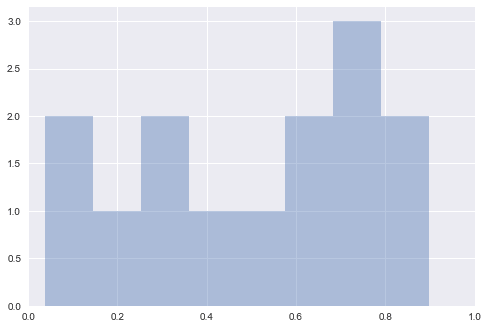

正如我们所看到的，这些广告中不止一个的 p 值似乎小于 0.05，尽管我们知道页面之间实际上没有差别。这就是为什么我们在多个试验中进行单个 A/B 试验，而不是仅在单个试验中进行多个假设试验。如果我们只尝试多次，p 值就很容易给我们一个假阳性。

## 一种现象的许多测试

有时，多次测试可能是偶然的。如果许多研究人员同时研究同一现象，那么其中一个研究人员很可能会以幸运的试验结束。这正是 2010 年世界杯期间发生的事情。

### 章鱼保罗

章鱼保罗是一只生活在德国奥伯豪森海洋生物中心的普通章鱼。他最著名的是正确猜测 2010 年世界杯期间德国队的七场足球赛，以及荷兰队和西班牙队之间的决赛。

在比赛之前，保罗的主人会把两个装食物的盒子放在自己的油箱里，每个盒子上都标有不同国家的国旗。保罗从一开始就选择吃哪个盒子，这都被认为是他对比赛结果的预测。


那么，为什么保罗在预测这些比赛的结果方面如此出色呢？他到底是通灵的还是运气好？我们可能会问，假设他只是“猜测”，那么他得到所有正确预测的机会有多大？

保罗正确预测了 2010 年世界杯的 8 场比赛，每次他都有 1/2 的机会做出正确的预测。获得 8 个匹配项中所有 8 个匹配项的唯一方法是：$$1/2^8=1/256$$

他真的是通灵的吗？还是有更多的事情要揭露？

原来，有很多动物（其中一些和保罗在同一个动物园里！）做同样的事情，试图猜测各自国家比赛的结果，包括：

*   马尼鹦鹉，来自新加坡
*   来自德国的豪猪利昂
*   小矮人河马，来自德国
*   奥托·阿姆斯特朗，章鱼，来自德国
*   安东·塔马林，来自德国
*   来自德国的秘鲁豚鼠吉米
*   中国章鱼小哥
*   来自荷兰的章鱼保琳
*   来自爱沙尼亚的黑猩猩皮诺
*   来自爱沙尼亚的红河猪 Apelsin
*   鳄鱼哈利，来自澳大利亚，他们都没有得到他们的权利（虽然马尼鹦鹉得到了 7 场比赛中的 8 个权利）。

有些人可能会争辩说，把他们都搞错也很了不起。那么，12 只动物中至少有一只会得到正确或错误的机会有多大？

我们可以用简单的概率来计算。我们有 12 个试验（在本例中为动物），每个独立试验有 2 美元*（1/2）^8=1/128 美元的机会得到所有正确或错误的预测。那么，至少有一次成功的概率是多少？那是 1 美元-p 全部\textrm 失败=1-（127/128）^ 12=1-0.910=0.090$

我们有 9%的机会得到一只能够选择所有正确预测的动物，而且这还不包括世界上所有的动物都在做这些“预测”。这并不罕见，正是多重测试的危险导致了这种“现象”。这只章鱼被淘汰了。在世界上许多不同的动物中，恰巧有人猜对了所有正确的预测，这种情况的流行使它变得不可思议。

对于那些想知道这是否真的是运气的人来说，已经证明了普通章鱼（htg0）这个物种实际上是色盲的，一些人认为章鱼是被画成水平形状的，因此保罗决定选择德国，除了在与西班牙和塞尔维亚比赛时。

最后，我们知道，当研究被复制时，它们是更值得信赖的。数据科学家应该尽量避免像章鱼保罗这样的案例，因为在那里，只有一个真正的案例可以正确地预测一系列世界杯比赛。只有当我们看到他在多场足球比赛中这样做时，我们才应该开始查看数据。

## P-hacking 只是冰山一角

事实证明，P-hacking 并不是数据科学家和统计学家在从数据中做出合理推断时唯一需要担心的事情。成功研究的设计和分析有很多阶段，如下图所示（摘自李鹏的 _p 值只是冰山一角 _）。

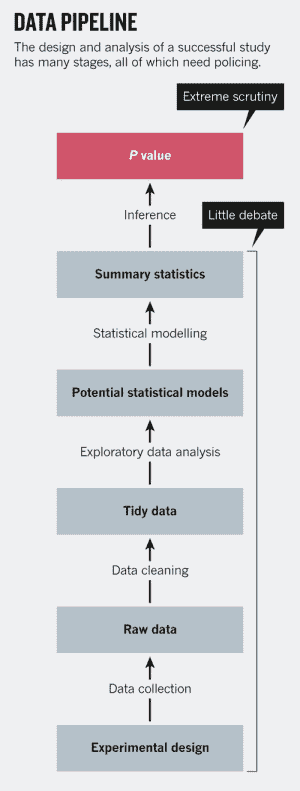

如图所示，整个“数据管道”的最后一步是计算像 p 值这样的推断统计，并对其应用规则（例如 p&gt；0.05）。但是，还有许多其他的预先决定，如实验设计或 EDA，可以对结果产生更大的影响-错误，如简单的舍入或测量误差，选择错误的模型，或不考虑混杂因素可以改变一切。通过改变数据的清理、汇总或建模方式，我们可以实现任意程度的统计显著性。

举一个简单的例子，掷一对骰子，得到两个 6。如果我们假设骰子是公平的，不加权的，并且我们的检验统计量是骰子的和，我们会发现这个结果的 p 值是 1/36 或 0.028，和 g。艾夫斯我们的统计结果显着的骰子是公平的。但是很明显，单卷还不足以为我们提供充分的证据来判断结果是否具有统计学意义，并且表明如果不正确地设计一个好的实验而盲目地应用 p 值，会导致糟糕的结果。

最后，最重要的是关于安全假设检验的教育，并确保你不会陷入糟糕的统计决策的愚蠢之中。