# 十八、数据可视化

数据可视化与图形或图形形式的数据表示有关。 这是数据分析中最重要的任务之一，因为它使我们能够查看分析结果，检测异常值并为模型构建做出决策。 有许多用于可视化的 Python 库，其中 matplotlib，seaborn，bokeh 和 ggplot 最受欢迎。 但是，在本章中，我们主要关注 matplotlib 库，该库在许多不同的上下文中被许多人使用。

Matplotlib 生成各种格式的出版物质量的数字，以及跨 Python 平台的交互式环境。 另一个优点是，pandas 附带了一些围绕 matplotlib 绘制例程的有用包装器，可以快速方便地绘制 Series 和 DataFrame 对象。

IPython 包起初是对标准交互式 Python Shell 的替代，但从那时起，它已发展成为用于数据探索，可视化和快速原型制作的必不可少的工具。 可以通过各种选项来使用 IPython 中 matplotlib 提供的图形功能，其中最简单的方法是`pylab`标志：

```pypy
$ ipython --pylab

```

该标志将预加载`matplotlib`和`numpy`与默认的 matplotlib 后端进行交互使用。 IPython 可以在各种环境中运行：在终端中作为`Qt`应用运行，或者在浏览器内部运行。 这些选项值得探索，因为 IPython 已在许多用例中得到广泛采用，例如原型设计，用于使会议演讲或讲座更具吸引力的交互式幻灯片，以及作为共享研究的工具。

# matplotlib API 入门

使用 matplotlib 进行绘图的最简单的方法通常是使用软件包支持的 MATLAB API：

```pypy
>>> import matplotlib.pyplot as plt
>>> from numpy import *
>>> x = linspace(0, 3, 6)
>>> x
array([0., 0.6, 1.2, 1.8, 2.4, 3.])
>>> y = power(x,2)
>>> y
array([0., 0.36, 1.44, 3.24, 5.76, 9.])
>>> figure()
>>> plot(x, y, 'r')
>>> xlabel('x')
>>> ylabel('y')
>>> title('Data visualization in MATLAB-like API')
>>> plt.show()

```

先前命令的输出如下：

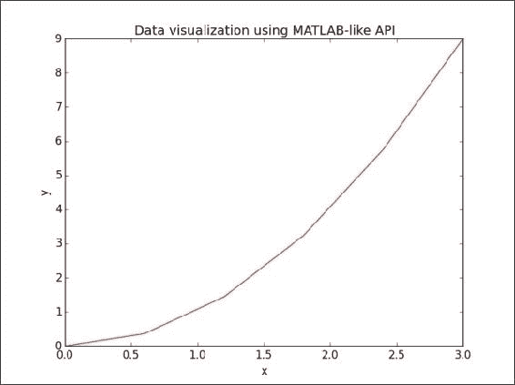

但是，除非有充分的理由，否则不应使用星级导入。 对于 matplotlib，我们可以使用规范导入：

```pypy
>>> import matplotlib.pyplot as plt

```

然后，可以将前面的示例编写如下：

```pypy
>>> plt.plot(x, y)
>>> plt.xlabel('x')
>>> plt.ylabel('y')
>>> plt.title('Data visualization using Pyplot of Matplotlib')
>>> plt.show()

```

先前命令的输出如下：


如果我们仅向 plot 函数提供单个参数，它将自动将其用作`y`值并生成从`0`到`N-1`的`x`值，其中`N`等于值的数量 ：

```pypy
>>> plt.plot(y)
>>> plt.xlabel('x')
>>> plt.ylabel('y')
>>> plt.title('Plot y value without given x values')
>>> plt.show()

```

先前命令的输出如下：

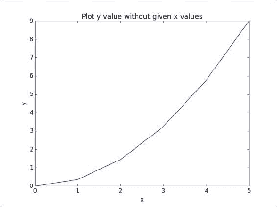

默认情况下，轴的范围受输入`x`和`y`数据的范围限制。 如果要指定轴的`viewport`，则可以使用`axis()`方法设置自定义范围。 例如，在先前的可视化中，我们可以通过编写以下命令来将`x`轴的范围从`[0, 5]`增大到`[0, 6]`，并将`y`轴的范围从`[0, 9]`增大到`[0, 10]`。 ：

```pypy
>>> plt.axis([0, 6, 0, 12])

```

## 线属性

当我们在 matplotlib 中绘制数据时，默认线格式是蓝色实线，缩写为`b-`。 要更改此设置，我们只需要向`plot`功能添加符号代码，其中包括字母作为颜色字符串和符号作为线条样式字符串。 让我们考虑一下具有不同格式样式的多条线的图：

```pypy
>>> plt.plot(x*2, 'g^', x*3, 'rs', x**x, 'y-')
>>> plt.axis([0, 6, 0, 30])
>>> plt.show()

```

上一条命令的输出如下：

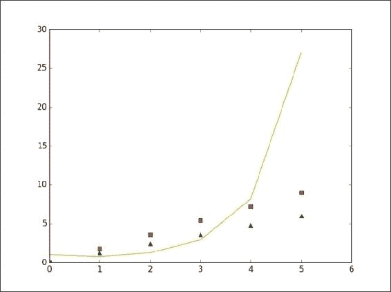

我们可以选择许多线型和属性，例如颜色，线宽和破折号，以控制图形的外观。 以下示例说明了设置线属性的几种方法：

```pypy
>>> line = plt.plot(y, color='red', linewidth=2.0)
>>> line.set_linestyle('--')
>>> plt.setp(line, marker='o')
>>> plt.show()

```

上一条命令的输出如下：

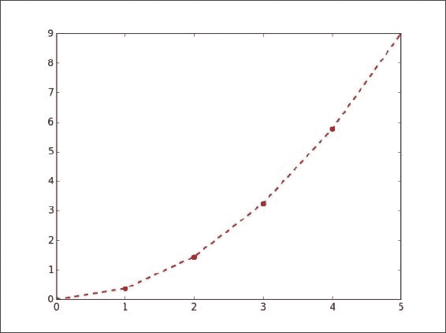

下表列出了`line2d`绘图的一些常见属性：

<colgroup class="calibre17"><col class="calibre18"> <col class="calibre18"> <col class="calibre18"></colgroup> 
| 

财产

 | 

值类型

 | 

描述

 |
| --- | --- | --- |
| `color`或`c` | 任何 matplotlib 颜色 | 设置图中线条的颜色 |
| `dashes` | 开关 | 这样可以设置墨点的顺序 |
| `data` | `np`。 `array xdata`，`np.array ydata` | 设置用于可视化的数据 |
| `linestyle`或`ls` | [`'-'` &#124; `'—'` &#124; `'-.'` &#124; `':'` &#124; ...] | 这将在图中设置线条样式 |
| `linewidth`或`lw` | 浮点价值 | 这将设置图中的线宽 |
| `marker` | 任何符号 | 这将在图中的数据点设置样式 |

## 图和子图

默认情况下，所有绘图命令均适用于当前图形和轴。 在某些情况下，我们希望可视化多个图形和轴上的数据，以比较不同的图或更有效地使用页面上的空间。 在绘制数据之前，需要完成两个步骤。 首先，我们必须定义要绘制的图形。 其次，我们需要弄清楚子图在图中的位置：

```pypy
>>> plt.figure('a')    # define a figure, named 'a'
>>> plt.subplot(221)    # the first position of 4 subplots in 2x2 figure
>>> plt.plot(y+y, 'r--')
>>> plt.subplot(222)    # the second position of 4 subplots
>>> plt.plot(y*3, 'ko')
>>> plt.subplot(223)    # the third position of 4 subplots
>>> plt.plot(y*y, 'b^')
>>> plt.subplot(224)
>>> plt.show()

```

上一条命令的输出如下：

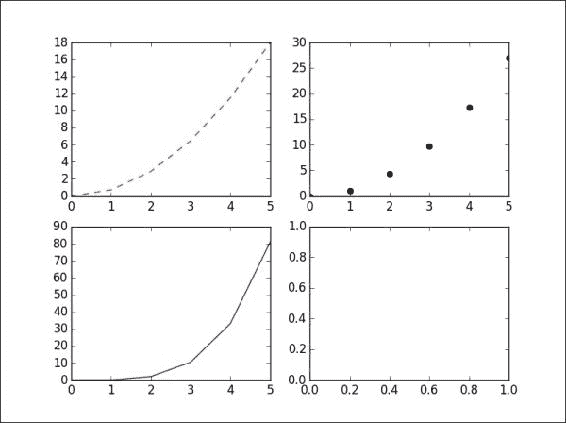

在这种情况下，我们当前具有图`a`。 如果要修改图形`a`中的任何子图，我们首先调用命令以选择图形和子图，然后执行该函数以修改子图。 例如，在这里，我们更改了四图图形的第二个图形的标题：

```pypy
>>> plt.figure('a')
>>> plt.subplot(222)
>>> plt.title('visualization of y*3')
>>> plt.show()

```

前面的命令的输出如下：

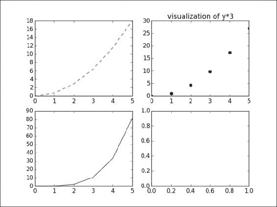

### 注意

如果我们不使用逗号分隔索引，则整数子图规范必须为三位数。 因此，`plt.subplot(221)`等于`plt.subplot(2,2,1)`命令。

有便捷方法`plt.subplots()`来创建包含给定数量的子图的图形。 与前面的示例一样，我们可以使用`plt.subplots(2,2)`命令创建由四个子图组成的`2x2`图形。

我们还可以使用`plt.axes([left, bottom, width, height])`命令手动创建轴，而不是矩形网格，其中所有输入参数都在小数`[0, 1]`坐标中：

```pypy
>>> plt.figure('b')    # create another figure, named 'b'
>>> ax1 = plt.axes([0.05, 0.1, 0.4, 0.32])
>>> ax2 = plt.axes([0.52, 0.1, 0.4, 0.32])
>>> ax3 = plt.axes([0.05, 0.53, 0.87, 0.44])
>>> plt.show()

```

先前命令的输出如下：

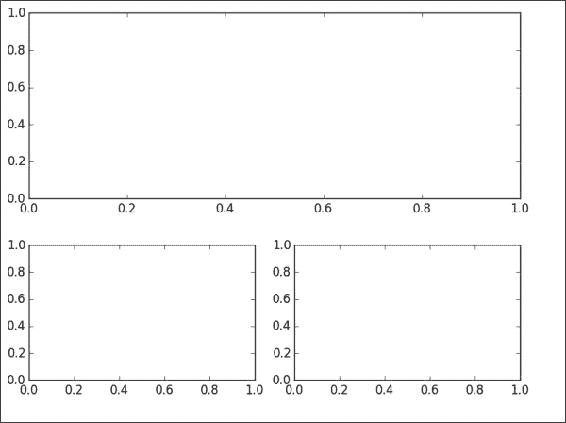

但是，当您手动创建轴时，需要花费更多时间来平衡子图之间的坐标和大小，才能获得比例合理的图形。


# 探索地块类型

到目前为止，我们已经研究了如何创建简单的线图。 matplotlib 库支持更多可用于数据可视化的图类型。 但是，我们的目标是提供基本知识，以帮助您理解和使用该库在最常见的情况下可视化数据。 因此，我们仅关注四种图类型：**散点图**，**条形图**，**等高线图**和**直方图**。

## 散点图

散点图用于可视化同一数据集中测得的变量之间的关系。 使用`plt.scatter()`函数可以很容易地绘制一个简单的散点图，该散点图需要`x`和`y`轴都使用数字列：

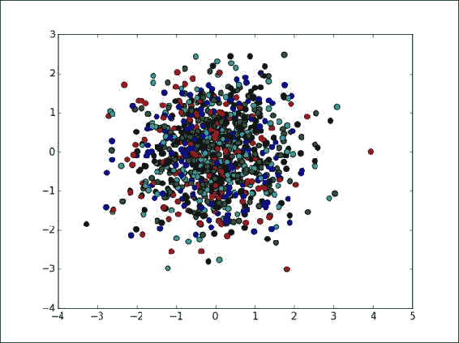

让我们看一下前面输出的命令：

```pypy
>>> X = np.random.normal(0, 1, 1000)
>>> Y = np.random.normal(0, 1, 1000)
>>> plt.scatter(X, Y, c = ['b', 'g', 'k', 'r', 'c'])
>>> plt.show()

```

## 条形图

条形图用于以矩形条形显示分组的数据，矩形条可以是垂直或水平的，且条形的长度对应于其值。 我们使用`plt.bar()`命令显示垂直条，使用`plt.barh()`命令显示其他条形：

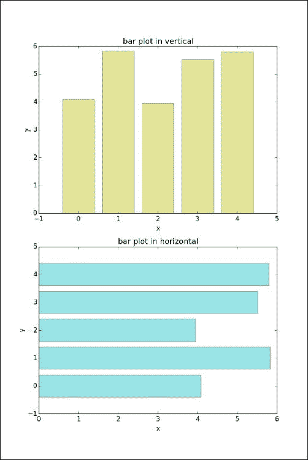

上一个输出的命令如下：

```pypy
>>> X = np.arange(5)
>>> Y = 3.14 + 2.71 * np.random.rand(5)
>>> plt.subplots(2)
>>> # the first subplot
>>> plt.subplot(211)
>>> plt.bar(X, Y, align='center', alpha=0.4, color='y')
>>> plt.xlabel('x')
>>> plt.ylabel('y')
>>> plt.title('bar plot in vertical')
>>> # the second subplot
>>> plt.subplot(212)
>>> plt.barh(X, Y, align='center', alpha=0.4, color='c')
>>> plt.xlabel('x')
>>> plt.ylabel('y')
>>> plt.title('bar plot in horizontal')
>>> plt.show()

```

## 等高线图

我们使用等高线图来表示二维的三个数值变量之间的关系。 沿`x`和`y`轴绘制了两个变量，第三个变量`z`用于以不同颜色绘制为曲线的轮廓级别：

```pypy
>>> x = np.linspace(-1, 1, 255)
>>> y = np.linspace(-2, 2, 300)
>>> z = np.sin(y[:, np.newaxis]) * np.cos(x)
>>> plt.contour(x, y, z, 255, linewidth=2)
>>> plt.show()

```

让我们看一下下图中的轮廓图：

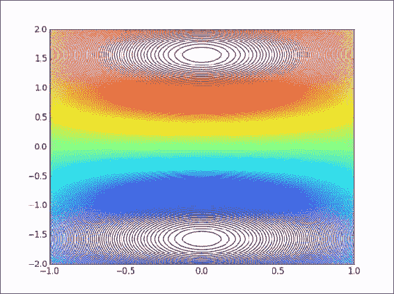

### 注意

如果要绘制轮廓线和填充轮廓，可以使用`plt.contourf()`方法代替`plt.contour()`。 与 MATLAB 相比，matplotlib 的`contourf()`不会绘制多边形的边缘。

## 直方图

直方图以图形方式表示数值数据的分布。 通常，值范围被划分为大小相等的 bin，每个 bin 的高度对应于该 bin 中值的频率：

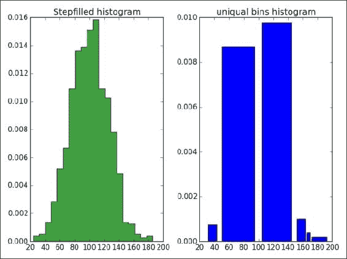

先前输出的命令如下：

```pypy
>>> mu, sigma = 100, 25
>>> fig, (ax0, ax1) = plt.subplots(ncols=2)
>>> x = mu + sigma * np.random.randn(1000)
>>> ax0.hist(x,20, normed=1, histtype='stepfilled', 
 facecolor='g', alpha=0.75)
>>> ax0.set_title('Stepfilled histogram')
>>> ax1.hist(x, bins=[100,150, 165, 170, 195] normed=1, 
 histtype='bar', rwidth=0.8)
>>> ax1.set_title('uniquel bins histogram')
>>> # automatically adjust subplot parameters to give specified padding
>>> plt.tight_layout()
>>> plt.show()

```


# 图例和注释

图例是一个重要元素，用于标识图中的`plot`元素。 在图中显示图例的最简单方法是使用`plot`函数的`label`参数，并通过调用`plt.legend()`方法显示标签：

```pypy
>>> x = np.linspace(0, 1, 20) 
>>> y1 = np.sin(x)
>>> y2 = np.cos(x)
>>> y3 = np.tan(x)
>>> plt.plot(x, y1, 'c', label='y=sin(x)')
>>> plt.plot(x, y2, 'y', label='y=cos(x)')
>>> plt.plot(x, y3, 'r', label='y=tan(x)')
>>> plt.lengend(loc='upper left')
>>> plt.show()

```

前面命令的输出如下：


图例命令中的`loc`自变量用于确定标签框的位置。 有几个有效的位置选项：`lower left`，`right`，`upper left`，`lower center`，`upper right`，`center`，`lower right`，`upper right`，`center right`，`best`，`upper center` 和`center left`。 默认位置设置为`upper right`。 但是，当我们设置了上面列表中不存在的无效位置选项时，该功能将自动退回到最佳选项。

如果要将图例分成多个图框，可以手动设置绘图线的预期标签，如下图所示：

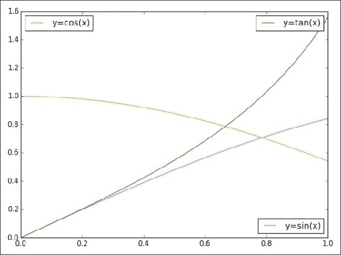

上一条命令的输出如下：

```pypy
>>> p1 = plt.plot(x, y1, 'c', label='y=sin(x)')
>>> p2 = plt.plot(x, y2, 'y', label='y=cos(x)')
>>> p3 = plt.plot(x, y3, 'r', label='y=tan(x)')
>>> lsin = plt.legend(handles=p1, loc='lower right')
>>> lcos = plt.legend(handles=p2, loc='upper left')
>>> ltan = plt.legend(handles=p3, loc='upper right')
>>> # with above code, only 'y=tan(x)' legend appears in the figure
>>> # fix: add lsin, lcos as separate artists to the axes
>>> plt.gca().add_artist(lsin)
>>> plt.gca().add_artist(lcos)
>>> # automatically adjust subplot parameters to specified padding
>>> plt.tight_layout()
>>> plt.show()

```

我们要介绍的图形中的另一个元素是注释，可以由文本，箭头或其他形状组成，以详细说明图形的各个部分或强调一些特殊的数据点。 有多种显示注释的方法，例如`text`，`arrow`和 `annotation`。

*   `text`方法在绘图上的给定坐标`(x, y)`处绘制文本； （可选）具有自定义属性。 该函数中有一些常见的参数：`x`，`y`，标签文本和可以通过`fontdict`传递的字体相关属性，例如`family`，`fontsize`和`style`。
*   `annotate`方法可以绘制适当排列的文本和箭头。 该函数的参数是`s`（标签文本），`xy`（要注释的元素的位置），`xytext`（标签`s`的位置），`xycoords`（指示什么类型的 坐标`xy`是）和`arrowprops`（连接注释的箭头的线属性字典）。

这是一个简单的示例来说明`annotate`和`text`功能：

```pypy
>>> x = np.linspace(-2.4, 0.4, 20)
>>> y = x*x + 2*x + 1
>>> plt.plot(x, y, 'c', linewidth=2.0)
>>> plt.text(-1.5, 1.8, 'y=x^2 + 2*x + 1',
 fontsize=14, style='italic')
>>> plt.annotate('minima point', xy=(-1, 0),
 xytext=(-1, 0.3),
 horizontalalignment='center', 
 verticalalignment='top', 
 arrowprops=dict(arrowstyle='->', 
 connectionstyle='arc3'))
>>> plt.show()

```

上一条命令的输出如下：

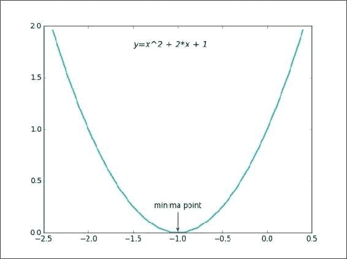

# 用 Pandas 绘图功能

我们已使用 matplotlib 覆盖了图中的大多数重要组件。 在本节中，我们将介绍另一种强大的绘图方法，该方法可从通常用于处理数据的 Pandas 数据对象直接创建标准可视化效果。

对于 Pandas 中的 Series 或 DataFrame 对象，支持大多数绘图类型，例如折线图，条形图，框形图，直方图和散点图以及饼图。 要选择绘图类型，我们使用`plot`函数的`kind`参数。 没有指定任何类型的绘图，默认情况下`plot`函数将生成线型可视化效果，如以下示例所示：

```pypy
>>> s = pd.Series(np.random.normal(10, 8, 20))
>>> s.plot(style='ko—', alpha=0.4, label='Series plotting')
>>> plt.legend()
>>> plt.show()

```

上一条命令的输出如下：

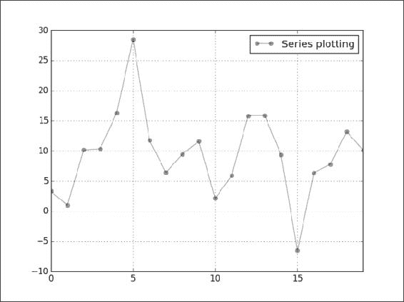

另一个示例将可视化包含多列的 DataFrame 对象的数据：

```pypy
>>> data = {'Median_Age': [24.2, 26.4, 28.5, 30.3],
 'Density': [244, 256, 268, 279]}
>>> index_label = ['2000', '2005', '2010', '2014'];
>>> df1 = pd.DataFrame(data, index=index_label)
>>> df1.plot(kind='bar', subplots=True, sharex=True)
>>> plt.tight_layout();
>>> plt.show()

```

上一条命令的输出如下：

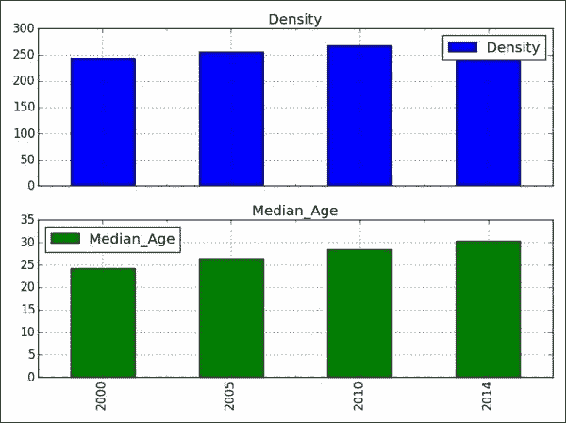

DataFrame 的绘图方法具有许多选项，使我们能够处理列的绘图。 例如，在前面的 DataFrame 可视化中，我们选择将列绘制在单独的子图中。 下表列出了更多选项：

<colgroup class="calibre17"><col class="calibre18"> <col class="calibre18"> <col class="calibre18"></colgroup> 
| 

争论

 | 

价值

 | 

描述

 |
| --- | --- | --- |
| `subplots` | `True` / `False` | 该图在单独的子图中绘制每个数据列 |
| `logy` | `True` / `False` | 获取对数刻度`y`轴 |
| `secondary_y` | `True` / `False` | 在辅助`y`轴上绘制数据 |
| `sharex`，`sharey` | `True` / `False` | 共享相同的`x`或`y`轴，链接杆和限制 |


# 其他 Python 数据可视化工具

除了 matplotlib 之外，还有其他基于 Python 的强大数据可视化工具包。 尽管我们无法更深入地研究这些库，但我们希望至少在本节中简要介绍它们。

## 散景

Bokeh 是，由 Peter Wang，Hugo Shi 和其他人在 Continuum Analytics 中进行。 它旨在以`D3.js`的样式提供优雅且引人入胜的可视化。 该库可以快速轻松地创建交互式绘图，仪表板和数据应用。 这是 matplotlib 和 Bokeh 之间的一些差异：

*   Bokeh 通过 IPython 的浏览器内客户端渲染新模型实现了跨平台的普遍性
*   Bokeh 使用 R 和 ggplot 用户熟悉的语法，而 matplotlib 对 Matlab 用户更熟悉
*   Bokeh 具有一致的构想，以构建受 ggplot 启发的浏览器内交互式可视化工具，而 Matplotlib 具有一致的构想，即专注于 2D 跨平台图形。

使用散景创建图的基本步骤如下：

*   准备列表，系列和数据框中的一些数据
*   告诉 Bokeh 您想在哪里生成输出
*   调用`figure()`创建带有一些总体选项的绘图，类似于前面讨论的 matplotlib 选项
*   使用颜色，图例和宽度等视觉自定义添加数据的渲染器
*   要求 Bokeh `show()`或`save()`结果

## MayaVi

MayaVi 是一个用于交互式科学数据可视化和 3D 绘图的库，建立在屡获殊荣的**可视化工具包**（**VTK**）的基础上， 开源可视化库的基于特征的包装器。 它提供以下内容：

*   通过对话框与可视化中的数据和对象进行交互的可能性。
*   Python 中的接口，用于编写脚本。 MayaVi 可以与 Numpy 和 scipy 一起使用以进行现成的 3D 绘制，并且可以在 IPython 笔记本中使用，类似于 matplotlib。
*   VTK 的抽象，提供了更简单的编程模型。

让我们查看基于 VTK 示例及其提供的数据完全使用 MayaVi 制作的插图：


