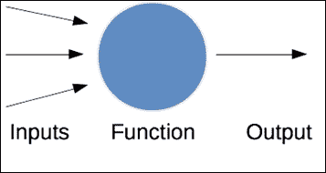
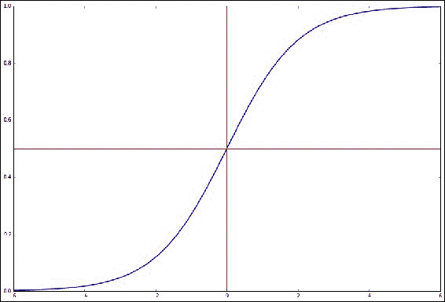
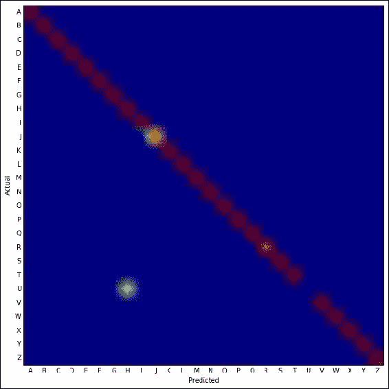
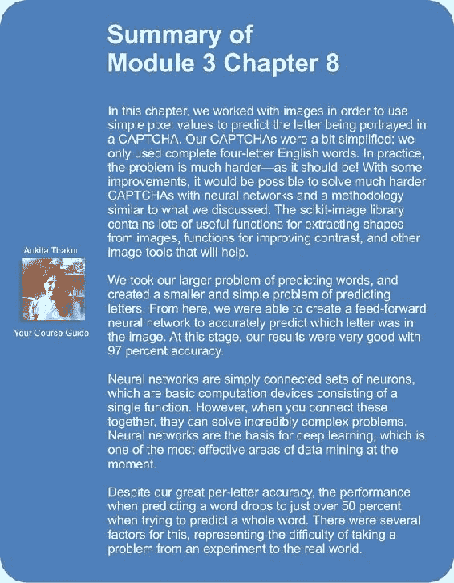

# 二十九、使用神经网络击败验证码

长期以来，解释图像中包含的信息一直是数据挖掘中的难题，但这是一个真正开始得到解决的问题。 最新的研究正在提供算法，以检测和理解图像，直到主要供应商在现实世界中使用自动化商业监视系统。 这些系统能够理解和识别录像中的物体和人物。

从图像中提取信息是困难的。 图像中有许多原始数据，而对图像进行编码的标准方法（像素）本身并不能提供足够的信息。 图像（尤其是照片）可能会模糊，太靠近目标，太暗，太亮，缩放，裁剪，偏斜或其他各种问题，这些问题会给试图提取有用信息的计算机系统造成破坏。

在本章中，我们着眼于使用神经网络预测每个字母从图像中提取文本。 我们正在尝试解决的问题是自动理解 CAPTCHA 消息。 根据首字母缩写词：CAPTCHA 是旨在使人类易于解决而计算机难以解决的图像：全自动公共图灵测试，用于区分计算机和人类。 许多网站使用它们进行注册和评论系统，以阻止自动化程序用假帐户和垃圾评论充斥其网站。

本章涵盖的主题包括：

*   神经网络
*   创建我们自己的验证码和字母数据集
*   scikit-image 库，用于处理图像数据
*   神经网络的 PyBrain 库
*   从图像中提取基本特征
*   使用神经网络进行大规模分类任务
*   使用后处理提高性能

# 人工神经网络

**神经网络**是一类算法，最初是根据人脑的工作方式设计的。 但是，现代技术通常基于数学而非生物学见解。 神经网络是连接在一起的**神经元**的集合。 每个神经元都是其输入的简单函数，它生成一个输出：



定义神经元处理的函数可以是任何标准函数，例如输入的线性组合，称为**激活函数**。 为了使常用的学习算法正常工作，我们需要激活函数是可导出的且平滑的。 常用的激活函数是逻辑函数，由以下等式定义（`k`通常简单为 1，`x`是神经元的输入，*L [* 通常为 1，即该函数的最大值）：


该图的值从-6 到+6，如下所示：



红线表示`x`为零时的值为 0.5。

每个单独的神经元接收其输入，然后根据这些值计算输出。 神经网络只是将这些神经元连接在一起的网络，它们对于数据挖掘应用可能非常强大。 这些神经元的组合，它们如何组合在一起以及如何组合以学习模型是机器学习中最强大的概念之一。

## 神经网络介绍

对于数据挖掘应用，神经元的排列通常位于层中。 第一层是**输入层**，它从数据集中获取输入。 计算每个神经元的输出，然后将其传递到下一层中的神经元。 这称为**前馈** **神经网络**。 在本章中，我们将这些简称为神经网络。 还有其他类型的神经网络可用于不同的应用。 我们将在第 11 章，“使用深度学习”对图像中的对象进行分类中看到另一种类型的网络。

一层的输出变为下一层的输入，一直持续到到达最后一层：**输出层**为止。 这些输出将神经网络的预测表示为分类。 输入层和输出层之间的任何神经元层都被称为隐藏层，因为他们学习了人类无法直观理解的数据表示。 大多数神经网络至少具有三层，尽管大多数现代应用使用的网络要多得多。


通常，我们考虑完全连接的层。 一层中每个神经元的输出将到达下一层中的所有神经元。 虽然我们确实定义了一个完全连接的网络，但在训练过程中许多权重将被设置为零，从而有效地删除了这些链接。 完全连接的神经网络也比其他连接模式更简单，更有效地编程。

由于神经元的功能通常是逻辑功能，并且神经元完全连接到下一层，因此用于构建和训练神经网络的参数必须是其他因素。 神经网络的第一个因素是在构建阶段：神经网络的大小。 这包括神经网络有多少层以及每个隐藏层中有多少神经元（输入和输出层的大小通常由数据集决定）。

在训练阶段确定神经网络的第二个参数：神经元之间连接的权重。 当一个神经元连接到另一个神经元时，该连接具有关联的**权重**，该权重乘以信号（第一个神经元的输出）。 如果连接的权重为 0.8，则神经元被激活，并输出值 1，下一个神经元的输入结果为 0.8。 如果第一个神经元未激活且值为 0，则保持为 0。

适当大小的网络和训练有素的权重的结合确定了进行分类时神经网络的准确性。 “适当地”一词也不一定意味着更大，因为太大的神经网络需要花费很长时间进行训练，并且更容易过拟合训练数据。

### 注意

通常从一开始就随机设置权重，然后在训练阶段进行权重更新。

现在，我们有了一个分类器，该分类器具有要设置的初始参数（网络的大小）和要从数据集中训练的参数。 然后，分类器可用于基于输入来预测数据样本的目标，这与我们在前几章中使用的分类算法非常相似。 但是首先，我们需要一个数据集进行训练和测试。

# 创建数据集

在本章中，我们将扮演坏蛋的角色。 我们要创建一个可以击败验证码的程序，从而使我们的垃圾评论程序能够在某人的网站上做广告。 应当指出，我们的验证码将比今天在网络上使用的验证码要容易一些，并且垃圾邮件并不是一件好事。

我们的验证码将仅是四个字母的单个英文单词，如下图所示：


我们的目标将是创建一个程序，可以从这样的图像中恢复单词。 为此，我们将使用四个步骤：

1.  将图像分成单个字母。
2.  对每个单独的字母进行分类。
3.  重新组合字母以形成单词。
4.  使用字典对单词进行排名，以尝试纠正错误。

我们的验证码消除算法将做出以下假设。 首先，该单词将是一个完整且有效的四字符英文单词（实际上，我们使用相同的词典来创建和删除验证码）。 其次，单词将仅包含大写字母。 不会使用符号，数字或空格。 我们将使问题更加棘手：我们将执行*剪切*转换为文本，以及不同的剪切速率。

## 绘制基本的验证码

接下来，我们开发用于创建验证码的功能。 我们的目标是绘制带有单词的图像以及剪切变换。 我们将使用`PIL`库绘制我们的验证码，并使用`scikit-image`库执行剪切变换。 `scikit-image`库可以读取`PIL`可以导出到的 NumPy 数组格式的图像，从而允许我们使用这两个库。

### 注意

`PIL`和`scikit-image`均可通过`pip`安装：

```pypy
pip install PIL
pip install scikit-image
```

首先，我们导入必要的库和模块。 我们导入 NumPy 和`Image`绘图函数，如下所示：

```pypy
import numpy as np
from PIL import Image, ImageDraw, ImageFont
from skimage import transform as tf
```

然后，我们创建我们的基本函数以生成验证码。 此函数需要一个单词和一个剪切值（通常在 0 到 0.5 之间）以 NumPy 数组格式返回图像。 我们允许用户设置结果图像的大小，因为我们还将将此功能用于单字母训练样本。 代码如下：

```pypy
def create_captcha(text, shear=0, size=(100, 24)):
```

我们使用 L 作为格式创建一个新图像，即仅表示黑白像素，然后创建`ImageDraw`类的实例。 这使我们可以使用`PIL`绘制此图像。 代码如下：

```pypy
    im = Image.new("L", size, "black")
    draw = ImageDraw.Draw(im)
```

接下来，我们设置将使用的验证码的字体。 您将需要一个字体文件，并且以下代码（`Coval.otf`）中的文件名应指向该文件（我只是将文件放置在`Notebook's`目录中。

```pypy
    font = ImageFont.truetype(r"Coval.otf", 22)
    draw.text((2, 2), text, fill=1, font=font)
```

### 注意

您可以从[这个页面](http://openfontlibrary.org/en/font/bretan)的开放字体库中获得我使用的 Coval 字体。

我们将 PIL 图像转换为 NumPy 数组，这使我们可以使用`scikit-image`对它进行剪切。 `scikit-image`库在其大部分计算中倾向于使用 NumPy 数组。 代码如下：

```pypy
    image = np.array(im)
```

然后，我们应用剪切变换并返回图像：

```pypy
    affine_tf = tf.AffineTransform(shear=shear)
    image = tf.warp(image, affine_tf)
    return image / image.max()
```

在最后一行，我们通过除以最大值进行归一化，确保特征值在 0 到 1 的范围内。此归一化可以发生在数据预处理阶段，分类阶段或其他地方。

从这里，我们现在可以很容易地生成图像并使用`pyplot`来显示它们。 首先，我们将在线显示用于`matplotlib`图并导入`pyplot`。 代码如下：

```pypy
%matplotlib inline 
from matplotlib import pyplot as plt
```

然后，我们创建我们的第一个 CAPTCHA 并显示它：

```pypy
image = create_captcha("GENE", shear=0.5)
plt.imshow(image, cmap='Greys')
```

结果是本节开头显示的图像：我们的 CAPTCHA。

## 将图像分割成单个字母

我们的验证码是单词。 与其构建可以识别成千上万个可能单词的分类器，不如将问题分解为一个较小的问题：预测字母。

击败这些验证码的算法的下一步涉及对单词进行分段以发现其中的每个字母。 为此，我们将创建一个函数，以查找图像上黑色像素的连续部分并将其提取为子图像。 这些是（或至少应该是）我们的来信。

首先，我们导入`label`和`regionprops`函数，我们将在此函数中使用它们：

```pypy
from skimage.measure import label, regionprops
```

我们的函数将拍摄一张图像，并返回一个子图像列表，其中每个子图像都是图像中原始单词的字母：

```pypy
def segment_image(image):
```

我们需要做的第一件事是检测每个字母在哪里。 为此，我们将使用`scikit-image`中的标签功能，该功能可找到具有相同值的相连像素集。 这类似于我们在第 7 章，“使用图形挖掘”中发现要遵循的帐户中的连接组件发现。

`label`函数拍摄图像并返回与原始形状相同的数组。 但是，每个*连接区域*在阵列中具有不同的编号，不在连接区域中的像素的值为 0。代码如下：

```pypy
    labeled_image = label(image > 0)
```

我们将提取每个子图像并将其放入列表中：

```pypy
    subimages = []
```

`scikit-image`库还包含用于提取有关以下区域的信息的功能：`regionprops`。 我们可以遍历这些区域并分别处理每个区域：

```pypy
    for region in regionprops(labeled_image): 
```

从这里，我们可以查询`region`对象以获取有关当前区域的信息。 对于我们的算法，我们需要获取当前区域的开始和结束坐标：

```pypy
        start_x, start_y, end_x, end_y = region.bbox
```

然后，我们可以通过使用子图像的开始位置和结束位置对图像进行索引（请记住将其表示为简单的 NumPy 数组，以便我们可以轻松对其进行索引）来提取子图像，并将所选子图像添加到 我们的清单。 代码如下：

```pypy
        subimages.append(image[start_x:end_x,start_y:end_y])
```

最后（在循环外部），我们返回发现的子图像，每个子图像（希望是）都包含图像中带有单个字母的部分。 但是，如果未找到任何子图像，则仅将原始图像作为唯一的子图像返回。 代码如下：

```pypy
    if len(subimages) == 0:
        return [image,]
    return subimages
```

然后，我们可以使用以下函数从示例验证码中获取子图像：

```pypy
subimages = segment_image(image)
```

我们还可以查看以下每个子图像：

```pypy
f, axes = plt.subplots(1, len(subimages), figsize=(10, 3))
for i in range(len(subimages)):
    axes[i].imshow(subimages[i], cmap="gray")
```

结果将如下所示：


正如您所看到的，我们的图像分割做得很合理，但是结果仍然很混乱，显示了一些先前的字母。

## 创建训练数据集

使用此功能，我们现在可以创建字母的数据集，每个字母具有不同的剪切值。 由此，我们将训练一个神经网络来识别图像中的每个字母。

首先，我们设置随机状态和一个数组，其中包含我们将从中随机选择的字母和剪切值的选项。 这里没有什么奇怪的，但是如果您以前没有使用过 NumPy 的`arange`函数，则它类似于 Python 的`range`函数-区别在于该函数可与 NumPy 数组一起使用并使步骤成为浮点数。 代码如下：

```pypy
from sklearn.utils import check_random_state
random_state = check_random_state(14)
letters = list("ABCDEFGHIJKLMNOPQRSTUVWXYZ")
shear_values = np.arange(0, 0.5, 0.05)
```

然后，我们创建一个函数（用于在训练数据集中生成单个样本），该函数从可用选项中随机选择一个字母和一个剪切值。 代码如下：

```pypy
def generate_sample(random_state=None):
    random_state = check_random_state(random_state)
    letter = random_state.choice(letters)
    shear = random_state.choice(shear_values)
```

然后，我们返回字母的图像以及代表图像中字母的目标值。 我们的班级对于 A 来说是 0，对于 B 来说是 1，对于 C 来说是 2，依此类推。 代码如下：

```pypy
    return create_captcha(letter, shear=shear, size=(20, 20)), letters.index(letter)
```

在功能块之外，我们现在可以调用此代码以生成新的示例，然后使用`pyplot`进行显示：

```pypy
image, target = generate_sample(random_state)
plt.imshow(image, cmap="Greys")
print("The target for this image is: {0}".format(target))
```

现在，我们可以通过调用数千次来生成所有数据集。 然后，我们将数据放入 NumPy 数组中，因为它们比列表更易于使用。 代码如下：

```pypy
dataset, targets = zip(*(generate_sample(random_state) for i in range(3000)))
dataset = np.array(dataset, dtype='float')
targets =  np.array(targets)
```

我们的目标是 0 到 26 之间的整数值，每个值代表一个字母。 神经网络通常不支持单个神经元的多个值，而是更喜欢具有多个输出，每个输出的值为 0 或 1。因此，我们对目标执行一次热编码，从而为我们提供了一个目标数组，每个样本具有 26 个输出 ，如果该字母很可能使用接近 1 的值，否则使用接近 0 的值。 代码如下：

```pypy
from sklearn.preprocessing import OneHotEncoder
onehot = OneHotEncoder()
y = onehot.fit_transform(targets.reshape(targets.shape[0],1))
```

我们将要使用的库不支持稀疏数组，因此我们需要将稀疏矩阵转换为密集的 NumPy 数组。 代码如下：

```pypy
y = y.todense()
```

## 根据我们的方法调整训练数据集

我们的训练数据集与我们的最终方法有很大不同。 我们的数据集是精心创建的单个字母，适合 20 像素乘 20 像素的图像。 该方法包括从单词中提取字母，这可能会挤压它们，将其移离中心或产生其他问题。

理想情况下，您训练分类器所使用的数据应模拟将要使用的环境。在实践中，我们做出了让步，但目的是尽可能地减少差异。

对于此实验，理想情况下，我们将从实际的验证码中提取字母并将其标记。 为了稍微加快该过程，我们将在训练数据集上运行分段功能，然后返回这些字母。

我们将需要`scikit-image`中的`resize`函数，因为我们的子图像并不总是 20 像素乘 20 像素。 代码如下：

```pypy
from skimage.transform import resize
```

从这里开始，我们可以对每个样本运行`segment_image`函数，然后将它们的大小调整为 20 x 20 像素。 代码如下：

```pypy
dataset = np.array([resize(segment_image(sample)[0], (20, 20)) for sample in dataset])
```

最后，我们将创建我们的数据集。 此`dataset`数组是三维的，因为它是二维图像的数组。 我们的分类器将需要一个二维数组，因此我们只需将最后两个维度展平：

```pypy
X = dataset.reshape((dataset.shape[0], dataset.shape[1] * dataset.shape[2]))
```

最后，使用 scikit-learn 的`train_test_split`函数，我们创建了一组训练数据和一个测试数据。 代码如下：

```pypy
from sklearn.cross_validation import train_test_split
X_train, X_test, y_train, y_test = \
    train_test_split(X, y, train_size=0.9)
```


# 训练和分类

现在，我们将构建一个神经网络，该神经网络将图像作为输入并尝试预测图像中的哪个（单个）字母。

我们将使用我们之前创建的单个字母的训练集。 数据集本身非常简单。 我们有一个 20 x 20 像素的图像，每个像素 1（黑色）或 0（白色）。 这些代表我们将用作神经网络输入的 400 个功能。 输出将是 0 到 1 之间的 26 个值，其中较高的值表示关联字母（第一个神经元是 A，第二个神经元是 B，依此类推）是输入图像表示的字母的可能性更高。

我们将对神经网络使用 PyBrain 库。

### 注意

与到目前为止我们所看到的所有库一样，可以从`pip`： `pip install pybrain`安装 PyBrain。

`PyBrain`库使用其自己的数据集格式，但幸运的是，使用此格式创建训练和测试数据集并不难。 代码如下：

```pypy
from pybrain.datasets import SupervisedDataSet
```

首先，我们在训练数据集上迭代，并将每个作为样本添加到新的`SupervisedDataSet`实例中。 代码如下：

```pypy
training = SupervisedDataSet(X.shape[1], y.shape[1])
for i in range(X_train.shape[0]):
    training.addSample(X_train[i], y_train[i])
```

然后，我们遍历测试数据集，并将每个样本作为样本添加到新的`SupervisedDataSet`实例中进行测试。 代码如下：

```pypy
testing = SupervisedDataSet(X.shape[1], y.shape[1])
for i in range(X_test.shape[0]):
    testing.addSample(X_test[i], y_test[i])
```

现在我们可以建立一个神经网络。 我们将创建一个基本的三层网络，该网络由输入层，输出层和它们之间的单个隐藏层组成。 输入层和输出层中神经元的数量是固定的。 数据集中的 400 个特征指示第一层需要 400 个神经元，而 26 个可能的目标指示我们需要 26 个输出神经元。

确定隐藏层中神经元的数量可能非常困难。 太多的结果会导致网络稀疏，这意味着很难训练足够的神经元来正确表示数据。 这通常会导致训练数据过拟合。 如果神经元中尝试进行太多分类的结果太少而又没有正确训练，则数据不足会成为问题。 我发现创建漏斗形状（中间层介于输入的大小和输出的大小之间）是一个很好的起点。 在本章中，我们将在隐藏层中使用 100 个神经元，但是使用此值可能会产生更好的结果。

我们导入`buildNetwork`函数，并告诉它根据我们的必要尺寸来构建网络。 第一个值`X.shape[1]`是输入层中神经元的数量，并设置为要素数量（这是`X`中的列数）。 第二个特征是我们确定的隐藏层中 100 个神经元的值。 第三个值是输出数量，它基于目标阵列`y`的形状。 最后，我们将网络设置为对每一层（输出层除外）使用偏向神经元，即有效地始终激活（但仍具有受过训练的权重的连接）的神经元。 代码如下：

```pypy
from pybrain.tools.shortcuts import buildNetwork
net = buildNetwork(X.shape[1], 100, y.shape[1], bias=True)
```

现在，从，我们可以训练网络并为权重确定好的值。 但是我们如何训练神经网络呢？

## 反向传播

反向传播（**反向传播**）算法是一种将错误归因于错误预测的每个神经元的方法。 从输出层开始，我们计算哪些神经元的预测不正确，并以少量调整这些神经元的权重以尝试修正错误的预测。

这些神经元犯了错误，是因为神经元向它们提供了输入，但更具体地说，是由于神经元与其输入之间的连接权重。 然后，我们通过少量更改它们来更改这些权重。 变化量基于两个方面：神经元单个权重的误差函数的偏导数和*学习率*，这是算法的参数（通常设置为非常低的值）。 我们计算函数误差的梯度，将其乘以学习率，然后从权重中减去该梯度。 在下面的示例中显示。 取决于误差，该梯度将为正或负，并且减去权重将始终尝试将权重*朝*校正为正确的预测。 不过，在某些情况下，校正会朝着称为**局部最优值**的方向发展，该最优值优于类似的权重，但不是最佳的权重集。

此过程从输出层开始，然后返回每一层，直到我们到达输入层。 此时，所有连接上的权重已更新。

PyBrain 包含 backprop 算法的实现，该算法通过`trainer`类在神经网络上调用。 代码如下：

```pypy
from pybrain.supervised.trainers import BackpropTrainer
trainer = BackpropTrainer(net, training, learningrate=0.01, weightdecay=0.01)
```

使用训练数据集反复运行反向传播算法，每次调整权重时都会进行一次。 当错误减少非常少时，我们可以停止运行 backprop，这表明该算法不能进一步改善错误，并且不值得继续进行训练。 在理论中，我们将运行算法，直到误差完全不改变为止。 这称为收敛，但是实际上这需要很长时间才能获得很少的收益。

或者，更简单地说，我们可以将算法运行固定的次数，称为**时期**。 纪元数越多，算法将花费的时间越长，结果越好（每个纪元的改进程度都在下降）。 我们将为此代码训练 20 个纪元，但尝试使用更大的值将提高性能（如果只是略微提高）。 代码如下：

```pypy
trainer.trainEpochs(epochs=20)
```

在运行了之前的代码（可能需要花费几分钟的时间，具体取决于硬件）之后，我们可以对测试数据集中的样本进行预测。 PyBrain 包含一个为此功能，并在`trainer`实例上调用它：

```pypy
predictions = trainer.testOnClassData(dataset=testing)
```

根据这些预测，我们可以使用`scikit-learn`计算 F1 分数：

```pypy
from sklearn.metrics import f1_score 
print("F-score: {0:.2f}".format(f1_score(predictions,
                                         y_test.argmax(axis=1) )))
```

此处的分数是 0.97，对于这样一个相对简单的模型，这是一个不错的结果。 回想一下，我们的功能仅是简单的像素值； 神经网络找出了如何使用它们。

既然我们有了一个字母预测准确度很高的分类器，就可以开始为我们的验证码组合单词。

## 预测字

我们希望从这些段中的每个段中预测每个字母，并将这些预测放在一起以形成来自给定验证码的预测单词。

我们的函数将接受 CAPTCHA 和经过训练的神经网络，并将返回预测的单词：

```pypy
def predict_captcha(captcha_image, neural_network):
```

我们首先使用先前创建的`segment_image`函数提取子图像：

```pypy
    subimages = segment_image(captcha_image)
```

我们将从每个字母中建立我们的单词。 子图像是根据其位置排序的，因此通常这将以正确的顺序放置字母：

```pypy
    predicted_word = ""
```

接下来，我们遍历子图像：

```pypy
    for subimage in subimages:
```

每个子图像不太可能恰好是 20 像素乘 20 像素，因此我们将需要调整其大小，以便为神经网络拥有正确的尺寸。

```pypy
        subimage = resize(subimage, (20, 20))
```

我们将通过将子图像数据发送到输入层来激活神经网​​络。 这会通过我们的神经网络传播并返回给定的输出。 所有这些都发生在我们之前对神经网络的测试中，但是我们不必显式调用它。 代码如下：

```pypy
        outputs = net.activate(subimage.flatten())
```

神经网络的输出是 26 个数字，每个数字都与给定索引处的字母为预测字母的可能性有关。 为了获得实际的预测，我们获取这些输出的最大值的索引，并从之前的字母列表中查找实际字母。 例如，如果第五个输出的值最高，则预测字母将为`E`。 代码如下：

```pypy
        prediction = np.argmax(outputs)
```

然后，我们将预测字母附加到要构建的预测单词上：

```pypy
        predicted_word += letters[prediction]
```

循环完成后，我们遍历了每个字母并形成了我们预测的单词：

```pypy
    return predicted_word
```

现在，我们可以使用以下代码对一个单词进行测试。 尝试使用不同的单词，看看会遇到什么样的错误，但是请记住，我们的神经网络只知道大写字母。

```pypy
word = "GENE"
captcha = create_captcha(word, shear=0.2)
print(predict_captcha(captcha, net))
```

我们可以将其编码为一个函数，从而使我们可以更轻松地执行预测。 我们还利用了这样的假设，即单词只有四个字符，使预测更容易。 尝试不使用`prediction = prediction[:4]`行的情况，然后查看您得到的错误类型。 代码如下：

```pypy
def test_prediction(word, net, shear=0.2):
    captcha = create_captcha(word, shear=shear)
    prediction = predict_captcha(captcha, net)
    prediction = prediction[:4]
    return word == prediction, word, prediction
```

返回的结果指定预测是否正确，原始单词和预测单词。

该代码可以正确预测单词 *GENE*，但会出错。 它有多精确？ 为了进行测试，我们将创建一个数据集，其中包含来自 NLTK 的一串四个四个字母的英语单词。 代码如下：

```pypy
from nltk.corpus import words
```

这里的`words`实例实际上是一个语料库对象，因此我们需要对其调用`words()`以从该语料库中提取单个单词。 我们还过滤以从此列表中仅获取四个字母的单词。 代码如下：

```pypy
valid_words = [word.upper() for word in words.words() if len(word) == 4]
```

然后，我们可以遍历所有单词，只需简单地计算正确和不正确的预测就可以看到有多少正​​确的单词：

```pypy
num_correct = 0
num_incorrect = 0
for word in valid_words:
    correct, word, prediction = test_prediction(word, net,
                                                shear=0.2)
if correct:
        num_correct += 1
    else:
        num_incorrect += 1
print("Number correct is {0}".format(num_correct))
print("Number incorrect is {0}".format(num_incorrect))
```

我们得到的结果是 2,832 正确和 2,681 不正确，准​​确度超过 51％。 从我们最初的每个字母 97％的准确性来看，这是一个很大的下降。 发生了什么？

影响的第一个因素是我们的准确性。 在所有其他条件相同的情况下，如果我们有四个字母，并且每个字母的准确性为 97％，那么我们可以期望大约 88％的成功率（在所有其他条件相同的情况下）连续四个字母（0.88≈0.974）。 单个字母的预测中的单个错误会导致预测错误的单词。

第二个影响是剪切值。 我们的数据集在 0 到 0.5 的剪切值之间随机选择。 先前的测试使用的剪切力为 0.2。 值为 0 时，我的准确度为 75％； 对于 0.5 的剪切，结果差得多，为 2.5％。 剪切力越高，性能越低。

接下来的影响是我们的字母是为数据集随机选择的。 实际上，这根本不是真的。 字母（例如 E）比其他字母（例如 Q）出现的频率要高得多。合理地普遍出现但经常被误认的字母也会导致这种错误。

我们可以使用混淆矩阵（二维数组）来确定哪些字母经常被误认为彼此。 它的行和列分别代表一个单独的类。

每个单元代表样品实际来自一类（由行表示）并被预测为处于第二类（由列表示）的次数。 例如，如果单元格（`4,2`）的值为 6，则意味着在六种情况下，带有字母 D 的样本被预测为字母 B。

```pypy
from sklearn.metrics import confusion_matrix
cm = confusion_matrix(np.argmax(y_test, axis=1), predictions)
```

理想情况下，混淆矩阵应仅沿对角线具有值。 单元格（`i, i`）具有值，但其他单元格的值为零。 这表明预测的类别与实际的类别完全相同。 不在对角线上的值表示分类中的错误。

我们还可以使用`pyplot`对此进行绘制，以图形方式显示哪些字母相互混淆。 代码如下：

```pypy
plt.figure(figsize=(10, 10))
plt.imshow(cm)
```

我们设置轴和刻度线以轻松引用每个索引对应的字母：

```pypy
tick_marks = np.arange(len(letters))
plt.xticks(tick_marks, letters)
plt.yticks(tick_marks, letters)
plt.ylabel('Actual')
plt.xlabel('Predicted')
plt.show()
```

下图显示结果。 可以很清楚地看出，错误的主要根源是几乎每次都将 U 误认为 H！



在列表中 17％的单词中显示字母 U。 对于出现 U 的每个单词，我们可以预期这是错误的。 实际上，U 的出现频率比 H（大约占单词的 11％）多，这表明我们可以通过将任何 H 预测更改为 U 来廉价（尽管可能不是很健壮）地提高准确性。

在的下一部分中，我们将做一些更聪明的操作，并实际使用词典搜索相似的单词。

# 使用字典提高准确性

除了而不只是返回给定的预测，我们可以检查单词是否确实存在于我们的字典中。 如果是的话，那就是我们的预测。 如果字典中没有它，我们可以尝试找到一个与它相似的词，然后进行预测。 请注意，此策略基于我们的假设，即所有 CAPTCHA 单词都是有效的英语单词，因此该策略不适用于随机字符序列。 这就是某些验证码不使用单词的原因之一。

这里有一个问题-我们如何确定最接近的词？ 有很多方法可以做到这一点。 例如，我们可以比较单词的长度。 具有相似长度的两个单词可以被认为更相似。 但是，如果单词在相同位置具有相同字母，我们通常认为它们是相似的。 这是编辑距离的来源。

## 单词排名机制

**Levenshtein 编辑距离**是比较两个短字符串的相似度的常用方法。 它不是可扩展性很高的，因此它不常用于很长的字符串。 编辑距离计算从一个单词到到另一个单词所需的步数。 这些步骤可以是以下三个操作之一：

1.  在单词的任意位置插入一个新字母。
2.  删除单词中的任何字母。
3.  用一封信代替另一封信。

将第一个单词转换为第二个单词所需的最少操作数作为距离给出。 较高的值表示单词不太相似。

该距离在 NLTK 中以`nltk.metrics.edit_distance`的形式提供。 我们可以使用两个字符串来调用它，并返回编辑距离：

```pypy
from nltk.metrics import edit_distance
steps = edit_distance("STEP", "STOP")
print("The number of steps needed is: {0}".format(steps))
```

当与不同的单词一起使用时，编辑距离非常接近许多人在直觉上会感觉到的相似单词。 编辑距离非常适合测试拼写错误，听写错误和名称匹配（您可以在其中轻松混合 Marc 和 Mark 拼写）。

但是，它不是很好。 我们并不真正期望字母会四处移动，只是将单个字母进行比较是错误的。 因此，我们将创建一个不同的距离度量标准，该距离度量标准只是在相同位置上不正确的字母数。 代码如下：

```pypy
def compute_distance(prediction, word):
    return len(prediction) - sum(prediction[i] == word[i] for i in range(len(prediction)))
```

我们从预测字的长度（为四）中减去该值，以使其成为距离度量，其中较低的值表示这些字之间的相似度更高。

## 全部放在一起

现在，我们可以使用与以前相似的代码来测试改进的预测功能。 首先，我们定义一个预测，该预测也使用我们的有效单词列表：

```pypy
from operator import itemgetter
def improved_prediction(word, net, dictionary, shear=0.2):
    captcha = create_captcha(word, shear=shear)
    prediction = predict_captcha(captcha, net)
    prediction = prediction[:4]
```

至此，代码与以前一样。 我们进行预测并将其限制为前四个字符。 但是，我们现在检查单词是否在字典中。 如果是，我们将其作为我们的预测。 如果不是，我们找到下一个最接近的词。 代码如下：

```pypy
    if prediction not in dictionary:
```

我们计算字典中预测单词与其他单词之间的距离，并按距离排序（最低的优先）。 代码如下：

```pypy
        distances = sorted([(word, compute_distance(prediction, word))
                            for word in dictionary], key=itemgetter(1))
```

然后，我们得到匹配度最高的单词（即距离最小的单词）并预测该单词：

```pypy
        best_word = distances[0]
        prediction = best_word[0]
```

然后，我们像以前一样返回正确性，单词和预测：

```pypy
    return word == prediction, word, prediction
```

以下代码突出显示了我们测试代码中的更改：

```pypy
num_correct = 0
num_incorrect = 0
for word in valid_words:
    correct, word, prediction = improved_prediction(word, net, valid_words, shear=0.2)
    if correct:
        num_correct += 1
    else:
        num_incorrect += 1
print("Number correct is {0}".format(num_correct))
print("Number incorrect is {0}".format(num_incorrect))
```

前面的代码需要一段时间才能运行（计算所有距离都需要一些时间），但最终结果是正确的 3,037 个样本和错误的 2,476 个样本。 这是 55％的准确度，可提高 4 个百分点。 该改进之所以如此之低，是因为多个单词都具有相同的相似性，并且算法是在这组最相似的单词之间随机选择*最佳*。 例如，列表中的第一个单词 AANI（我刚刚选择了列表中的第一个单词，这是埃及神话中的狗头猿），具有 44 个候选单词，它们与该单词的距离相同。 从列表中选择正确单词的机会只有 1/44。

如果我们作弊并将预测视为正确，如果实际单词是最佳候选者中的任何一个，则我们会将 78％的预测评为正确（要查看此代码，请查看捆绑包中的代码）。

为了进一步改善结果，我们可以研究距离度量，也许使用来自混淆矩阵的信息来查找*常见混淆字母*或对此进行一些其他改进。 这种迭代式改进是许多数据挖掘方法的一个功能，它模仿了科学方法-有一个主意，对其进行测试，分析结果，然后使用该主意来改进下一个主意。





