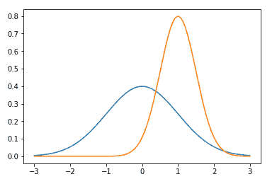
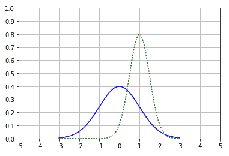
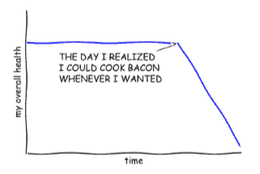
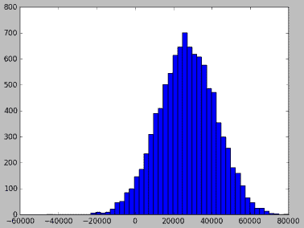
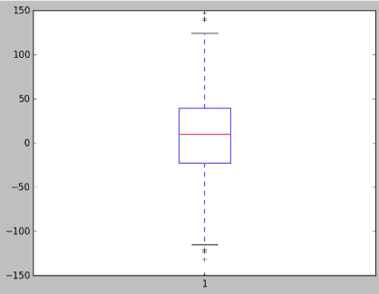
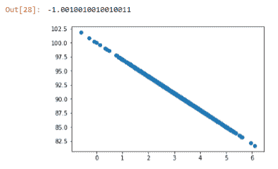

# Matplotlib 和高级概率概念

在上一章中介绍了一些简单的统计和概率概念之后，我们现在将注意力转移到一些更高级的主题上，您需要熟悉这些主题才能充分利用本章的其余部分。 书。 不用担心，它们并不太复杂。 首先，让我们玩得开心，看看`matplotlib`库的惊人图形功能。

本章将涵盖以下主题：

*   使用`matplotlib`程序包绘制图形
*   了解协方差和相关性以确定数据之间的关系
*   通过示例了解条件概率
*   了解贝叶斯定理及其重要性

# Matplotlib 中的速成课程

实际上，您的数据仅能将其呈现给其他人，因此，让我们来讨论一下如何绘制和图形化数据以及如何将其呈现给其他人并使您的图形看起来更漂亮。 我们将更全面地介绍 Matplotlib 并逐步进行。

我将向您展示一些技巧，以使您的图表尽可能漂亮。 让我们玩一下图吧。 用您的作品制作漂亮的图片总是很好的。 这将在您的工具箱中提供更多工具，以使用不同类型的图形可视化不同类型的数据并使它们看起来更漂亮。 我们将使用不同的颜色，不同的线型，不同的轴，诸如此类。 使用图形和数据可视化来尝试在数据中找到有趣的模式不仅很重要，而且将您的发现很好地呈现给非技术受众也很有趣。 事不宜迟，让我们深入了解 Matplotlib。

继续打开`MatPlotLib.ipynb`文件，您可以和我一起玩这些东西。 我们将首先绘制一个简单的折线图。

```py
%matplotlib inline 

from scipy.stats import norm 
import matplotlib.pyplot as plt 
import numpy as np 

x = np.arange) 

plt.plot(x, norm.pdf(x)) 
plt.show() 

```

因此，在此示例中，我将`matplotlib.pyplot`导入为`plt`，并且从现在开始，我们可以在此笔记本中将其称为`plt`。 然后，我使用`np.arange(-3, 3, 0.001)`创建一个以 0.001 为增量填充`-3`和`3`之间的值的 x 轴，并使用`pyplot`的`plot()`函数绘制`x`。 y 函数将为`norm.pdf(x)`。 因此，我将基于`x`值创建一个具有正态分布的概率密度函数，然后使用`scipy.stats norm`包进行此操作。

因此，将其结合到上一章的概率密度函数中，这里我们使用`matplotlib`绘制正态概率密度函数。 因此，我们只需要调用`pyplot`的`plot()`方法来设置绘图，然后使用`plt.show()`进行显示即可。 运行前面的代码时，将得到以下输出：


这就是我们得到的：具有所有默认格式的漂亮图形。

# 在一张图上生成多个图

假设我要一次绘制多个内容。 实际上，您可以在调用 show 之前多次调用 plot，以向图形实际添加多个功能。 让我们看下面的代码：

```py
plt.plot(x, norm.pdf(x)) 
plt.plot(x, norm.pdf(x, 1.0, 0.5)) 
plt.show() 

```

在此示例中，我将原来的函数称为正态分布，但我还将在此处渲染另一个正态分布，均值约为`1.0`，标准偏差为`0.5`。 然后，我将一起展示这两者，以便您了解它们之间的比较。



您可以看到，默认情况下，`matplotlib`会为您自动为每个图形选择不同的颜色，这非常好用。

# 将图形另存为图像

如果我想将此图形保存到文件中，或者想将其包含在文档中或其他东西中，则可以执行以下代码：

```py
plt.plot(x, norm.pdf(x)) 
plt.plot(x, norm.pdf(x, 1.0, 0.5)) 
plt.savefig('C:\\Users\\Frank\\MyPlot.png', format='png') 

```

我不仅可以调用`plt.show()`，还可以调用`plt.savefig()`，并提供一个指向我要保存此文件的位置以及所需文件格式的路径。

如果要继续，则需要将其更改为计算机上存在的实际路径。 您的系统上可能没有`Users\Frank`文件夹。 还要记住，如果您使用的是 Linux 或 macOS，则要使用反斜杠而不是反斜杠，而不会使用驱动器号。 对于所有这些 Python 笔记本，每当看到这样的路径时，请确保将其更改为在系统上可用的实际路径。 我在 Windows 上，并且确实有`Users\Frank`文件夹，因此我可以继续运行它。 如果在`Users\Frank`下检查我的文件系统，则有一个`MyPlot.png`文件可以打开并查看，并且可以在所需的任何文档中使用它。


太酷了。 要注意的另一件事是，根据设置的不同，保存文件时可能会遇到权限问题。 您只需要找到适合您的文件夹。 在 Windows 上，`Users\Name`文件夹通常是一个安全的选择。 好吧，让我们继续前进。

# 调整轴

假设我不喜欢上图中的该值的轴的默认选择。 它会自动将其拟合为您可以找到的最紧密的一组轴值，这通常是一件好事，但有时您想要的东西是绝对的。 看下面的代码：

```py
axes = plt.axes() 
axes.set_xlim([-5, 5]) 
axes.set_ylim([0, 1.0]) 
axes.set_xticks([-5, -4, -3, -2, -1, 0, 1, 2, 3, 4, 5]) 
axes.set_yticks([0, 0.1, 0.2, 0.3, 0.4, 0.5, 0.6, 0.7, 0.8, 0.9, 1.0]) 
plt.plot(x, norm.pdf(x)) 
plt.plot(x, norm.pdf(x, 1.0, 0.5)) 
plt.show() 

```

在此示例中，首先使用`plt.axes`获得轴。 一旦有了这些轴对象，就可以对其进行调整。 通过调用`set_xlim`，我可以将 x 范围设置为-5 到 5，并通过设置`set_ylim`来将 y 范围设置为 0 到 1。您可以在下面的输出中看到，我的 x 值的范围是[ `-5`到`5`，并且 y 从 0 到 1。我还可以明确控制轴上刻度线的位置。 因此，在前面的代码中，我想让 x 刻度线位于`-5`，`-4`，`- 3`等位置，而 y 刻度线则使用`set_xticks()`和[[ `set_yticks()`功能。 现在，我可以使用`arange`函数来更紧凑地执行此操作，但要点是您可以明确控制那些刻度线的确切位置，也可以跳过一些标记。 您可以按所需的增量或分布进行配置。 除此之外，这是一回事。

调整轴后，我便用要绘制的函数调用了`plot()`，并调用了`show()`来显示它。 果然，您可以得到结果。


# 添加网格

如果要在图表中显示网格线怎么办？ 好吧，同样的想法。 我要做的就是在从`plt.axes()`返回的轴上调用`grid()`。

```py
axes = plt.axes() 
axes.set_xlim([-5, 5]) 
axes.set_ylim([0, 1.0]) 
axes.set_xticks([-5, -4, -3, -2, -1, 0, 1, 2, 3, 4, 5]) 
axes.set_yticks([0, 0.1, 0.2, 0.3, 0.4, 0.5, 0.6, 0.7, 0.8, 0.9, 1.0]) 
axes.grid() 
plt.plot(x, norm.pdf(x)) 
plt.plot(x, norm.pdf(x, 1.0, 0.5)) 
plt.show() 

```

通过执行以上代码，我得到了漂亮的小网格线。 尽管它使事情变得有些混乱，但是这使得查看特定点在哪里更加容易。 那里是一种风格选择。


# 更改线型和颜色

如果我想使用线型和颜色玩游戏怎么办？ 你也可以那样做。

```py
axes = plt.axes() 
axes.set_xlim([-5, 5]) 
axes.set_ylim([0, 1.0]) 
axes.set_xticks([-5, -4, -3, -2, -1, 0, 1, 2, 3, 4, 5]) 
axes.set_yticks([0, 0.1, 0.2, 0.3, 0.4, 0.5, 0.6, 0.7, 0.8, 0.9, 1.0]) 
axes.grid() 
plt.plot(x, norm.pdf(x), 'b-') 
plt.plot(x, norm.pdf(x, 1.0, 0.5), 'r:') 
plt.show() 

```

因此，您可以在前面的代码中看到`plot()`函数的末尾实际上有一个额外的参数，我可以传递一个描述线条样式的小字符串。 在第一个示例中，`b-`指示的是我想要一条蓝色的实线。 `b`代表蓝色，破折号表示实线。 对于我的第二个`plot()`函数，我将其绘制为红色，这就是`r`的含义，而冒号意味着我将用虚线绘制它。


如果执行此操作，则可以在上图中看到它的作用，并且可以更改不同类型的线型。

此外，您可以执行双破折号（`--`）。

```py
axes = plt.axes() 
axes.set_xlim([-5, 5]) 
axes.set_ylim([0, 1.0]) 
axes.set_xticks([-5, -4, -3, -2, -1, 0, 1, 2, 3, 4, 5]) 
axes.set_yticks([0, 0.1, 0.2, 0.3, 0.4, 0.5, 0.6, 0.7, 0.8, 0.9, 1.0]) 
axes.grid() 
plt.plot(x, norm.pdf(x), 'b-') 
plt.plot(x, norm.pdf(x, 1.0, 0.5), 'r--') 
plt.show() 

```

前面的代码为您提供了红色虚线作为线条样式，如下图所示：


我也可以做破折号组合（`-.`）。

```py
axes = plt.axes() 
axes.set_xlim([-5, 5]) 
axes.set_ylim([0, 1.0]) 
axes.set_xticks([-5, -4, -3, -2, -1, 0, 1, 2, 3, 4, 5]) 
axes.set_yticks([0, 0.1, 0.2, 0.3, 0.4, 0.5, 0.6, 0.7, 0.8, 0.9, 1.0]) 
axes.grid() 
plt.plot(x, norm.pdf(x), 'b-') 
plt.plot(x, norm.pdf(x, 1.0, 0.5), 'r-.') 
plt.show() 

```

您得到的输出看起来像下面的图形图像：


因此，这些是那里的不同选择。 我什至可以用斜杠（`g:`）将其变为绿色。

```py
axes = plt.axes() 
axes.set_xlim([-5, 5]) 
axes.set_ylim([0, 1.0]) 
axes.set_xticks([-5, -4, -3, -2, -1, 0, 1, 2, 3, 4, 5]) 
axes.set_yticks([0, 0.1, 0.2, 0.3, 0.4, 0.5, 0.6, 0.7, 0.8, 0.9, 1.0]) 
axes.grid() 
plt.plot(x, norm.pdf(x), 'b-') 
plt.plot(x, norm.pdf(x, 1.0, 0.5), ' g:') 
plt.show() 

```

我将得到以下输出：



如有需要，可以尝试一些有趣的事情，尝试不同的值，然后可以获得不同的线条样式。

# 标记轴并添加图例

您将更常做的事情是标记轴。 您永远都不想真空呈现数据。 您绝对想告诉人们它代表什么。 为此，您可以使用`plt`上的`xlabel()`和`ylabel()`功能在轴上实际放置标签。 我将标记 x 轴 Greebles 和 y 轴概率。 您还可以添加图例插图。 通常，这是同一回事，但只是为了表明它是独立设置的，我还在以下代码中设置了图例：

```py
axes = plt.axes() 
axes.set_xlim([-5, 5]) 
axes.set_ylim([0, 1.0]) 
axes.set_xticks([-5, -4, -3, -2, -1, 0, 1, 2, 3, 4, 5]) 
axes.set_yticks([0, 0.1, 0.2, 0.3, 0.4, 0.5, 0.6, 0.7, 0.8, 0.9, 1.0]) 
axes.grid() 
plt.xlabel('Greebles') 
plt.ylabel('Probability') 
plt.plot(x, norm.pdf(x), 'b-') 
plt.plot(x, norm.pdf(x, 1.0, 0.5), 'r:') 
plt.legend(['Sneetches', 'Gacks'], loc=4) 
plt.show() 

```

在图例中，您基本上传入了要为每个图形命名的列表。 因此，我的第一个图将被称为 Sneetches，而我的第二个图将被称为 Gacks，`loc`参数指示您想要的位置，其中`4`代表右下角。 让我们继续运行代码，您应该看到以下内容：


可以看到，我正在绘制 Sneetches 和 Gacks 的 Greebles 与概率。 苏斯博士为您提供了一些参考资料。 这样便可以设置轴标签和图例。

# 一个有趣的例子

这里有个有趣的例子。 如果您熟悉 Webcomic XKCD，则 Matplotlib 中有一些复活节彩蛋，您可以在其中实际以 XKCD 样式绘制内容。 以下代码显示了如何执行此操作。

```py
plt.xkcd() 

fig = plt.figure() 
ax = fig.add_subplot(1, 1, 1) 
ax.spines['right'].set_color('none') 
ax.spines['top'].set_color('none') 
plt.xticks([]) 
plt.yticks([]) 
ax.set_ylim([-30, 10]) 

data = np.ones(100) 
data[70:] -= np.arange(30) 

plt.annotate( 
    'THE DAY I REALIZED\nI COULD COOK BACON\nWHENEVER I WANTED', 
    xy=(70, 1), arrowprops=dict(arrowstyle='->'), xytext=(15, -10)) 

plt.plot(data) 

plt.xlabel('time') 
plt.ylabel('my overall health') 

```

在此示例中，您调用`plt.xkcd()`，这将 Matplotlib 置于 XKCD 模式。 完成此操作后，事物将具有一种漫画字体和自动弯曲的线条的样式。 这个小小的示例将显示一个有趣的小图形，其中我们在绘制您的健康状况与时间的关系图，一旦您意识到可以随时煮熏肉，健康状况就会急剧下降。 我们在那里所做的只是使用`xkcd()`方法进入该模式。 您可以看到以下结果：



我们实际上是如何将这张图放在一起的，这里有一些有趣的 Python。 我们首先制作一条数据线，该数据线不过是 100 个数据点上的值 1。 然后，我们使用旧的 Python 列表切片运算符获取值 70 之后的所有内容，然后从该 30 项子列表中减去 0 到 30 的范围。因此具有线性减去较大值的效果 当您越过 70 时，这条线便朝着点 70 下方下降到 0。

因此，这只是其中一些 Python 列表切片操作的小示例，以及对`arange`函数的一点创造性使用，以修改您的数据。

# 生成饼图

现在，回到现实世界，我们可以通过在 Matplotlib 上调用`rcdefaults()`来删除 XKCD 模式，然后在这里回到普通模式。

如果要使用饼图，只需调用`plt.pie`，并为其提供一个数组，其中包含值，颜色，标签以及是否要爆炸的项目（如果爆炸了，则爆炸了多少）。 这是代码：

```py
# Remove XKCD mode: 
plt.rcdefaults() 

values = [12, 55, 4, 32, 14] 
colors = ['r', 'g', 'b', 'c', 'm'] 
explode = [0, 0, 0.2, 0, 0] 
labels = ['India', 'United States', 'Russia', 'China', 'Europe'] 
plt.pie(values, colors= colors, labels=labels, explode = explode) 
plt.title('Student Locations') 
plt.show() 

```

您可以在这段代码中看到我正在创建一个值为`12`，`55`，`4`，`32`和`14`值的饼图。 我为这些值的每一个分配了明确的颜色，为这些值的每一个分配了明确的标签。 我将饼图的俄文部分放大了 20%，并为该图添加了“学生位置”标题并显示出来。 以下是您应该看到的输出：


这里的所有都是它的。

# 生成条形图

如果要生成条形图，这也非常简单。 这与饼图类似。 让我们看下面的代码。

```py
values = [12, 55, 4, 32, 14] 
colors = ['r', 'g', 'b', 'c', 'm'] 
plt.bar(range(0,5), values, color= colors) 
plt.show() 

```

我定义了一个值数组和一个颜色数组，然后绘制数据。 上面的代码使用`values`数组中的 y 值，并使用`colors`数组中列出的显式颜色，从 0 到 5 的范围进行绘制。 继续进行显示，然后显示条形图：


# 生成散点图

在本书中，我们经常会看到散点图。 因此，假设您要为同一组人或事物绘制几个不同的属性。 例如，也许我们正在针对每个人的年龄绘制图表，其中每个点代表一个人，而轴代表这些人的不同属性。

使用散点图进行此操作的方式是，使用要定义的两个轴调用`plt.scatter()`，即，两个属性包含要相互绘制的数据。

假设我在`X`和`Y`中具有随机分布，并且将散布在散点图上，然后将其显示：

```py
from pylab import randn 

X = randn(500) 
Y = randn(500) 
plt.scatter(X,Y) 
plt.show() 

```

您将获得以下散点图作为输出：


看起来很酷。 由于在两个轴上都使用正态分布，因此您可以在此处看到中心的某种集中度，但是由于它是随机的，因此这两个点之间没有真正的相关性。

# 生成直方图

最后，我们会提醒自己直方图的工作原理。 我们已经在书中看到了很多次。 让我们看下面的代码：

```py
incomes = np.random.normal(27000, 15000, 10000) 
plt.hist(incomes, 50) 
plt.show() 

```

在此示例中，我称一个以 27,000 为中心的正态分布，标准偏差为 15,000，具有 10,000 个数据点。 然后，我只调用`pyplot`的直方图函数，即`hist()`，并指定输入数据和我们要在直方图中将事物分组的存储桶数。 然后我叫`show()`，其余的都是魔术。



# 生成箱须图

最后，让我们看一下箱须图。 请记住，在上一章中，当我们谈论百分位数时，我谈到了这一点。

同样，使用箱须图，该框代表两个内部四分位数，其中 50% 的数据位于该四分位数中。 相反，另外 25% 的居民位于该盒子的两侧。 晶须（在我们的示例中为虚线）代表数据的范围（异常值除外）。

我们将箱须图中的离群值定义为四分位间距或框的大小的 1.5 倍以外的任何值。 因此，我们将盒子的大小乘以 1.5，直到点状晶须上的那个点，我们将这些部分称为四分位数外。 但是外部四分位数之外的任何东西都被视为离群值，这就是外部四分位数以外的线所代表的含义。 那就是我们根据盒须图绘制的定义来定义离群值的地方。

关于箱须图的几点要记住：

*   它们对于可视化数据的散布和偏斜很有用
*   方框中间的线代表数据的中位数，方框代表第一四分位数和第三四分位数的边界
*   一半的数据存在于框内
*   “晶须”表示数据的范围，但异常值除外，这些异常值绘制在晶须之外。
*   离群值是四分位数范围的 1.5 倍或更大。

现在，在这里仅举一个例子，我们创建了一个伪数据集。 以下示例创建了-40 至 60 之间均匀分布的随机数，以及`100`之上和`-100`之下的一些异常值：

```py
uniformSkewed = np.random.rand(100) * 100 - 40 
high_outliers = np.random.rand(10) * 50 + 100 
low_outliers = np.random.rand(10) * -50 - 100 
data = np.concatenate((uniformSkewed, high_outliers, low_outliers)) 
plt.boxplot(data) 
plt.show() 

```

在代码中，我们具有统一的数据随机分布（`uniformSkewed`）。 然后，我们在高端（HTG1）上添加了一些离群值，并在`low_outliers`上添加了一些负值。 然后，我们将这些列表连接在一起，并使用 NumPy 从这三个不同的集合中创建了一个数据集。 然后，我们采用统一数据和一些离群值的组合数据集，并使用`plt.boxplot()`进行绘制，这就是您得到箱须图的方式。 调用`show()`将其可视化，然后就可以了。



您可以看到该图形显示的框代表了所有数据的内部 50%，然后我们有了这些离群值线，在其中我们可以看到位于其中的每个离群值的小叉（在您的版本中可能是圆圈） 范围。

# 自己尝试

好了，这就是 Matplotlib 中的速成课程。 是时候动手了，并在这里进行一些练习。

作为您的挑战，我希望您创建一个散点图，该散点图代表您根据年龄和观看电视所花费的时间制作的随机数据，并且您可以做任何想要的事情。 如果您想玩的是不同的虚拟数据集，请尝试一下。 创建一个散点图，以散点图的方式绘制两组随机数据，并标记您的轴。 让它看起来漂亮，玩转它，玩得开心。 您需要参考和示例的所有内容都应该在此 IPython Notebook 中。 如果您愿意的话，它就像是一份备忘单，您可能需要为生成不同种类的图形和不同样式的图形而做的不同事情。 我希望它证明有用。 现在该回到统计信息了。

# 协方差和相关

接下来，我们将讨论协方差和相关性。 假设我有某种事物的两个不同属性，并且我想看看它们是否确实相互关联。 本节将为您提供所需的数学工具，我们将深入研究一些示例，并使用 Python 实际找出协方差和相关性。 这些是测量一组数据中两个不同属性是否相互关联的方法，这可能是非常有用的事情。

# 定义概念

想象一下，我们有一个散布图，每个数据点都代表我们测量的一个人，并且我们在一个轴上绘制了他们的年龄，而在另一个轴上绘制了他们的收入。 这些点中的每个点都代表一个人，例如，它们的 x 值表示他们的年龄，y 值表示他们的收入。 我完全弄清楚了，这是假数据。


现在，如果我有一个散布图，看起来像上图中的左图，您会发现这些值往往遍布整个地方，这将告诉您，根据此数据，年龄和收入之间没有真正的相关性。 对于任何给定的年龄，收入的范围可能很大，并且往往集中在中间，但是我们并没有真正看到年龄和收入这两个不同属性之间的明确关系。 现在，相比之下，在右侧的散点图中，您可以看到年龄和收入之间存在非常明显的线性关系。

因此，协方差和相关性为我们提供了一种手段来衡量这些事物之间的相关性。 我希望左侧散点图中的数据具有非常低的相关性或协方差，但是右侧散点图中的数据具有非常高的协方差和相关性。 这就是协方差和相关性的概念。 它可以衡量我正在衡量的这两个属性在多大程度上相互依赖。

# 测量协方差

用数学方法测量协方差有点困难，但是我会尽力解释。 这些步骤是：

*   将两个变量的数据集视为高维向量
*   将这些转换为均值方差向量
*   取两个向量的点积（它们之间夹角的余弦值）
*   除以样本量

了解如何使用它及其含义真的更重要。 要实际导出它，请将数据的属性视为高维向量。 我们将为每个数据点的每个属性执行的操作是计算每个点的均值方差。 因此，现在有了这些高维向量，其中每个数据点，每个人（如果愿意）都对应于一个不同的维。

在这个高维空间中，我有一个向量，代表一个属性的年龄平均值的所有方差。 然后，我有另一个向量，表示与其他某些属性（例如收入）的均值相比的所有方差。 然后，我要做的就是采用这些向量来测量每个属性的均值方差，并采用两者之间的点积。 从数学上讲，这是一种测量这些高维向量之间的角度的方法。 因此，如果它们最终彼此之间非常接近，则可以告诉我，这些差异在这些不同的属性之间相互之间的步调一致。 如果我采用最终的点积并将其除以样本量，那便是得出协方差量的方式。

现在，您将不再需要自己实际计算困难的方式。 我们将看到如何在 Python 中以简单的方式执行此操作，但是从概念上讲，这就是它的工作方式。

现在，协方差的问题在于它可能难以解释。 如果我的协方差接近于零，那么我知道这告诉我这些变量之间根本没有太大的相关性，但是大的协方差意味着存在某种关系。 但是多大呢？ 根据我使用的单位，可能会有非常不同的解释数据的方式。 这是相关性解决的问题。

# 相关性

相关性通过每个属性的标准偏差对所有事物进行归一化（只需将协方差除以两个变量的标准偏差即可对事物进行归一化）。 这样做，我可以很清楚地说，相关系数为-1 表示存在完美的逆相关性，因此，一个值增大，另一个值减小，反之亦然。 相关性为 0 表示两组属性之间完全没有相关性。 相关性为 1 表示完全相关，其中这两个属性的移动方式与查看不同数据点时完全相同。

请记住，关联并不意味着因果关系。 仅仅因为您发现一个很高的相关值并不意味着这些属性之一会导致另一个属性。 这仅表示两者之间存在某种关系，并且这种关系可能是由完全不同的事物引起的。 真正确定因果关系的唯一方法是通过受控实验，我们将在后面讨论。

# 用 Python 计算协方差和相关性

好吧，让我们在这里通过一些实际的 Python 代码来了解协方差和相关性。 再次，您可以在概念上将协方差视为将这些多维方差矢量从每个属性的均值中提取出来，并计算它们之间的角度作为协方差的量度。 做到这一点的数学比听起来容易得多。 我们正在谈论高维向量。 这听起来像是史蒂芬·霍金（Stephen Hawking）的东西，但实际上，从数学角度来看，这非常简单。

# 计算相关性-困难的方法

我将从困难的方式开始。 NumPy 确实有一种方法可以为您计算协方差，稍后我们将讨论这一点，但是现在我想表明您实际上可以从第一个原理上做到这一点：

```py
%matplotlib inline 

import numpy as np 
from pylab import * 

def de_mean(x): 
    xmean = mean(x) 
    return [xi - xmean for xi in x] 

def covariance(x, y): 
    n = len(x) 
    return dot(de_mean(x), de_mean(y)) / (n-1) 

```

同样，协方差被定义为点积，它是两个向量之间的夹角的量度，对于给定的一组数据，该向量与均值之间的偏差，对于一个给定的数据，与另一种给定的数据集合之间，均值的偏差 相同数据的数据点。 然后在这种情况下将其除以 n-1，因为实际上是在处理样本。

因此`de_mean()`，我们与均值函数的偏差是获取一组数据`x`，实际上是一个列表，并且它正在计算该组数据的均值。 `return`行包含一些 Python 技巧。 语法是说，我将创建一个新列表，并遍历`x`中的每个元素，将其称为`xi`，然后为此返回`xi`和均值`xmean`之间的差 整个数据集。 该函数返回一个新的数据列表，该列表表示每个数据点与平均值的偏差。

我的`covariance()`函数将对输入的两组数据执行此操作，除以数据点的数量减去 1。还记得上一章中关于样本数与总体数的事情吗？ 好吧，这正在这里发挥作用。 然后，我们可以使用这些功能，看看会发生什么。

为了扩展此示例，我将构造一些数据，以尝试找到页面速度之间的关系，即页面在网站上的呈现速度以及人们的花费。 例如，在亚马逊，我们非常担心页面呈现的速度与人们在经历之后花费多少钱之间的关系。 我们想知道网站的速度与人们实际在网站上花费的钱之间是否存在实际关系。 这是您可能要弄清楚的一种方法。 让我们只为页面速度和购买量生成一些正态分布的随机数据，由于它是随机的，因此它们之间不会有真正的相关性。

```py
pageSpeeds = np.random.normal(3.0, 1.0, 1000) 
purchaseAmount = np.random.normal(50.0, 10.0, 1000) 

scatter(pageSpeeds, purchaseAmount) 

covariance (pageSpeeds, purchaseAmount) 

```

因此，就像在这里进行健全性检查一样，我们将从散布这些东西开始：


您会看到，由于每个属性的正态分布，它倾向于聚集在中间，但是两者之间没有真正的关系。 对于任何给定的页面速度而言，花费的金额是多种多样的，对于任何给定的金额而言，页面速度的种类繁多，因此，除了那些来自随机性或正态分布性质的页面速度之外，没有任何实际的相关性。 果然，如果我们计算这两组属性的协方差，我们最终会得到一个非常小的值-0.07。 因此，这是一个非常小的协方差值，接近零。 这意味着这两件事之间没有真正的联系。

现在，让生活变得更加有趣。 让我们实际使购买金额成为页面速度的真实函数。

```py
purchaseAmount = np.random.normal(50.0, 10.0, 1000) / pageSpeeds 

scatter(pageSpeeds, purchaseAmount) 

covariance (pageSpeeds, purchaseAmount) 

```

在这里，我们使事情有点随机，但是我们在这两组值之间创建了真实的关系。 对于给定的用户，他们遇到的页面速度和花费的金额之间存在真实的关系。 如果将其绘制出来，我们将看到以下输出：


您可以看到实际上存在一条小曲线，事物趋于紧密对齐。 事情在底部附近变得有点奇怪，只是因为事情是随机发生的。 如果我们计算协方差，则最终会得到更大的值-8，而重要的是该数量的大小。 正负号只表示正相关或负相关，但是值 8 表示该值比零高得多。 因此，这里发生了一些事情，但是同样很难解释 8 的实际含义。

这就是相关性的体现，我们通过标准差对所有内容进行归一化，如以下代码所示：

```py
def correlation(x, y): 
stddevx = x.std() 
stddevy = y.std() 
return covariance(x,y) / stddevx / stddevy  #In real life you'd check for divide by zero here 

correlation(pageSpeeds, purchaseAmount) 

```

再次，从第一原理开始，我们可以获取两组属性之间的相关性，计算每个属性的标准偏差，然后计算这两个属性之间的协方差，然后除以每个数据集的标准偏差。 这样便得到了相关值，该值被标准化为-1 比 1。我们最终得到的值是-0.4，这表明在负方向上这两件事之间存在一些相关性：


这不是一条完美的线，应该是-1，但是那里发生了一些有趣的事情。

相关系数-1 表示完全负相关，0 表示没有相关，1 表示完全正相关。

# 计算相关性-NumPy 方法

现在，NumPy 实际上可以使用`corrcoef()`函数为您计算相关性。 让我们看下面的代码：

```py
np.corrcoef(pageseeds, purchaseAmount) 

```

此行提供以下输出：

```py
array([(1\.         ,-046728788], 
      [-0.46728788], 1\.       ]) 

```

因此，如果我们想以一种简单的方式进行操作，则可以使用`np.corrcoef(pageSpeeds, purchaseAmount)`，然后返回给您的是一个数组，该数组为您提供传入数据集的每种可能组合之间的相关性。 读取输出是：1 表示比较`pageSpeeds`与自身和`purchaseAmount`与自身之间存在完美的关联，这是可以预期的。 但是，当您开始比较`pageSpeeds`与`purchaseAmount`或`purchaseAmount`与`pageSpeeds`时，最终会得到-0.4672 的值，这大约是我们用困难的方式得到的结果。 几乎不会有精度误差，但这并不是很重要。

现在，我们可以通过构造一个完全线性的关系来强制建立一个完美的相关性，因此让我们看一个例子：

```py
purchaseAmount = 100 - pageSpeeds * 3 

scatter(pageSpeeds, purchaseAmount) 

correlation (pageSpeeds, purchaseAmount) 

```

再一次，在这里，我们期望相关性达到-1，以获得完美的负相关性，实际上，这就是我们得出的结果：



再次提醒您：相关性并不意味着因果关系。 仅仅因为人们在拥有更快的页面速度时可能会花更多钱，也许这意味着他们可以负担得起更好的 Internet 连接。 也许这并不意味着页面呈现的速度与人们的花费之间实际上存在因果关系，但是它告诉您存在一种有趣的关系，值得进一步研究。 如果不运行实验，就无法说出因果关系，但是相关性可以告诉您可能要运行的实验。

# 相关活动

因此，请弄脏您的手，卷起袖子，我希望您使用`numpy.cov()`功能。 这实际上是让 NumPy 为您计算协方差的一种方法。 我们看到了如何使用`corrcoef()`函数计算相关性。 因此，返回并仅使用`numpy.cov()`函数重新运行这些示例，看看是否获得相同的结果。 它应该是相当不错的，所以不要使用我从头开始编写的协方差函数来做到这一点，而要使用 NumPy 看看是否可以获得相同的结果。 同样，此练习的目的是使您熟悉使用 NumPy 并将其应用于实际数据。 因此，看看它在哪里。

在理论和实践中都有协方差和相关性。 有一项非常有用的技术，因此请务必记住本节。 让我们继续。

# 条件概率

接下来，我们将讨论条件概率。 这是一个非常简单的概念。 它试图找出发生其他事情的可能性。 尽管听起来很简单，但实际上可能很难将它的一些细微差别包裹住。 因此，多喝杯咖啡，确保您的思维能力处于开启状态，并且如果您准备在此处提出一些更具挑战性的概念。 我们开工吧。

条件概率是一种衡量彼此发生的两件事之间的关系的方法。 假设我想找到一个事件发生的可能性，因为另一个事件已经发生。 条件概率为您提供了解决这一问题的工具。

我试图以条件概率来查找是否有两个相互依赖的事件。 也就是说，两者都会发生的概率是多少？

用数学符号表示，这里的方式是 *P（A，B）*表示 A 和 B 彼此独立发生的概率。 也就是说，无论其他什么情况，这两种情况发生的概率是多少？

而将 *P（B | A）*表示为给定 A 的 B 的概率。那么，给定事件 A 已经发生的 B 的概率是多少？ 有点不同，这些东西是这样关联的：


给定 A 的 B 的概率等于 A 和 B 的概率超过 A 单独发生的概率，因此这可以消除 B 的概率取决于 A 的概率。

这里有一个例子会更有意义，所以请允许我。

假设我给您，我的读者两个测试，并且你们中有 60% 通过了这两个测试。 现在，第一个测试更加容易，您中的 80% 通过了该测试。 我可以使用此信息来计算通过第一项考试的读者中还通过第二项考试的读者所占的百分比。 因此，这是一个真实的例子，说明给定 B 的 B 概率与 A 和 B 的概率之间的差异。

我将 A 表示通过第一项测试的概率，将 B 表示通过第二项测试的概率。 我要寻找的是给定您通过了第一项考试即第二项考试的概率，即 *P（B | A）*。


因此，假设您通过了第一个测试，则通过第二个测试的概率等于通过两个测试的概率 *P（A，B）*（我知道您中有 60% 的人通过了两个测试，而与每个测试都无关 其他）除以通过第一项测试的概率 *P（A）*，即 80%。 算出 60% 的人通过了两个测试，80% 的人通过了第一次测试，因此，如果您通过了第一个测试，则通过第二次测试的概率为 75%。

好吧，围绕这个概念有点困难。 我花了一些时间才真正地内化了某些事物给定某种事物的概率与两件事相互独立发生的概率之间的差异。 在继续之前，请确保内部化此示例及其实际工作方式。

# Python 中的条件概率练习

好了，让我们继续使用一些真实的 Python 代码做另一个更复杂的示例。 然后，我们可以看到如何使用 Python 实际实现这些想法。

让我们在这里将条件概率付诸行动，并使用一些想法使用一些捏造的数据找出年龄和购买物品之间是否存在关系。 继续并在此处打开`ConditionalProbabilityExercise.ipynb`，如果愿意，可以跟我来。

我要做的是写一些 Python 代码来创建一些假数据：

```py
from numpy import random 
random.seed(0) 

totals = {20:0, 30:0, 40:0, 50:0, 60:0, 70:0} 
purchases = {20:0, 30:0, 40:0, 50:0, 60:0, 70:0} 
totalPurchases = 0 
for _ in range(100000): 
    ageDecade = random.choice([20, 30, 40, 50, 60, 70]) 
    purchaseProbability = float(ageDecade) / 100.0 
    totals[ageDecade] += 1 
    if (random.random() < purchaseProbability): 
        totalPurchases += 1 
        purchases[ageDecade] += 1 

```

我要做的是容纳 100,000 个虚拟人员，并将他们随机分配到年龄段。 他们可以是 20 多岁，30 多岁，40 多岁，50 多岁，60 多岁或 70 多岁。 我还将为他们分配他们在一段时间内购买的一些商品，并根据他们的年龄来加权购买商品的可能性。

该代码最终要做的是使用 NumPy 的`random.choice()`函数将每个人随机分配到一个年龄组。 然后，我将分配购买商品的可能性，并对其进行加权，以使年轻人购买商品的可能性低于老年人。 我要遍历 100,000 个人，然后将所有内容加起来，最后得到的是两个 Python 词典：一个给我每个年龄段的总人数，另一个给我总人数 每个年龄段内购买的商品。 我还将跟踪总体上购买的商品总数。 让我们继续运行该代码。

如果您想花一点时间研究一下该代码，并弄清楚它是如何工作的，则可以使用 IPython Notebook。 您也可以稍后再讨论。 让我们看看最终的结果。


我们的`totals`字典告诉我们每个年龄段有多少人，并且分布均匀，就像我们期望的那样。 实际上，每个年龄段的购买量都随着年龄的增长而增加，因此 20 岁的人只购买了大约 3,000 东西，而 70 岁的人购买了大约 11,000 的东西，整个人口总共购买了大约 45,000 的东西。

让我们使用这些数据来研究条件概率的想法。 让我们首先弄清楚，如果您 30 岁左右，可以购买东西的可能性是多少。 如果我们称购买商品为 E，则表示该符号为 *P（E | F）*；如果您的年龄在 30 多岁，则表示 F。

现在我们有了这个奇特的方程式，它为您提供了一种在给定 *P（E，F）*和 *P（E）*的情况下计算 *P（E | F）*的方式 ，但我们不需要。 您不会在看到任何东西时盲目地应用方程式。 您必须直观地考虑数据。 它告诉我们什么？ 考虑到您 30 多岁，我想算出购买商品的可能性。 好吧，我拥有直接计算所需的所有数据。

```py
PEF = float(purchases[30]) / float(totals[30]) 

```

我在购买[30]桶中购买了 30 岁的孩子多少东西，我知道那里有 30 岁的孩子多少。 因此，我可以将这两个数字相除，得出 30 岁购买次数与 30 岁购买次数的比率。 然后，我可以使用 print 命令将其输出：

```py
print ("P(purchase | 30s): ", PEF) 

```

考虑到您 30 岁左右时大约占 30%，我最终有可能购买某种东西：

```py
P(purchase | 30s): 0.2992959865211 

```

请注意，如果您使用的是 Python 2，则 print 命令没有括号，因此应该是：

```py
print "p(purchase | 30s): ", PEF 

```

如果我想找到 *P（F）*，那仅是总体上是 30 的概率，我可以将 30 岁的总人数除以我的数据集中的人数，即 100,000 ：

```py
PF = float(totals[30]) / 100000.0 
print ("P(30's): ", PF) 

```

同样，如果您使用的是 Python 2，请删除 print 语句周围的括号。这应该提供以下输出：

```py
P(30's): 0.16619 

```

我知道进入您的`30s`的可能性约为 16%。

现在，我们将找出 *P（E）*，它仅代表购买产品的总体可能性，与您的年龄无关：

```py
PE = float(totalPurchases) / 100000.0 
print ("P(Purchase):", PE) 

P(Purchase): 0.45012 

```

在此示例中，结果约为 45%。 我可以将每个人购买的商品总数（不分年龄），再除以总人数即可得出购买的总体概率。

好吧，那我这里有什么？ 假设您在 30 多岁时购买的东西大约是 30%，那么我有购买的可能性，那么总体上，我有购买大约 45% 的东西的可能性。

现在，如果 E 和 F 独立，并且年龄无关紧要，那么我希望 *P（E | F）*与 *P（E）*大致相同。 考虑到您 30 多岁，我希望购买商品的可能性与购买商品的整体可能性大致相同，但事实并非如此，对吧？ 而且因为它们不同，所以告诉我它们实际上是某种程度上的依赖。 因此，这是使用条件概率来梳理数据中这些依赖关系的一种小方法。

让我们在这里做更多的注释。 如果一起看到 *P（E）P（F）*，则意味着将这些概率相乘。 我可以将购买的总概率乘以`30s`中的总概率：

```py
print ("P(30's)P(Purchase)", PE * PF) 

P(30's)P(Purchase) 0.07480544280000001 

```

算下来大约是 7.5%。

从概率的工作方式来看，我知道，如果我想获得两件事同时发生的概率，那就像乘以它们各自的概率一样。 因此，事实证明 *P（E，F）*的发生与 *P（E）P（F）*相同。

```py
print ("P(30's, Purchase)", float(purchases[30]) / 100000.0) 
P(30's, Purchase) 0.04974 

```

现在，由于数据的随机分布，它不可能完全相同。 记住，我们在这里谈论的是概率，但是它们在同一范围内，所以有意义的是，大约 5% 对 7%，足够接近。

现在，这又不同于 *P（E | F）*，因此既在`30s`中又购买东西的概率不同于在`30s`中购买东西的概率 ]。

现在，让我们在这里进行一些理智检查。 我们可以检查前面在“条件概率”部分中看到的等式，该方程式表示，假设您在`30s`中，则购买某物的概率与在`30s`中并在某物上购买某物的概率相同 买东西的可能性。 也就是说，我们检查 *P（E | F）= P（E，F）/ P（F）*。

```py
(float(purchases[30]) / 100000.0) / PF  

```

这给我们：

```py
Out []:0.29929598652145134 

```

果然，它确实可以解决。 如果我考虑买入某物的概率高于您在`30s`中的总概率，那么我们最终得到大约 30%，这几乎是我们最初为 *P（E | F ）*。 所以方程式起作用了，是的！

好吧，很难缠住这些东西。 我知道这有点令人困惑，但是如果您需要，请再次进行遍历，研究一下，并确保您了解这里发生的事情。 我在这里尝试输入足够的示例，以说明对这些内容的不同思考组合。 一旦您将其内部化，我将挑战您自己在这里实际进行一些工作。

# 条件概率分配

我要您做的是修改以下在上一节中使用的 Python 代码。

```py
from numpy import random 
random.seed(0) 

totals = {20:0, 30:0, 40:0, 50:0, 60:0, 70:0} 
purchases = {20:0, 30:0, 40:0, 50:0, 60:0, 70:0} 
totalPurchases = 0 
for _ in range(100000): 
ageDecade = random.choice([20, 30, 40, 50, 60, 70]) 
purchaseProbability = 0.4 
totals[ageDecade] += 1 
if (random.random() < purchaseProbability): 
totalPurchases += 1 
purchases[ageDecade] += 1 

```

对其进行修改，使其实际上不依赖购买和年龄。 也要使机会均匀分布。 看看对您的结果有什么影响。 您是否最终有条件地置入`30s`并购买商品与购买整体商品的概率不同？ 关于您的数据以及这两个不同属性之间的关系，这告诉您什么？ 继续尝试，并确保您实际上可以从这些数据中获得一些结果并了解正在发生的事情，而我将在一分钟之内通过我自己的解决方案来完成该练习。

因此，无论从理论上还是在实践中，这都是条件概率。 您会看到它有很多细微差别，并且有很多令人困惑的符号。 如果您需要将头包起来，请返回并再次浏览本节。 我给您分配了一项作业，所以现在就去做，看看您是否可以实际修改我的 IPython Notebook 中的代码，以产生针对不同年龄段的固定购买概率。 回来，我们将看看我如何解决该问题以及取得的结果。

# 我的作业解决方案

你做功课了吗 但愿如此。 让我们看一下我的解决方案，看看条件概率如何告诉我们假数据集中年龄和购买概率之间是否存在关系。

提醒您，我们试图做的是消除年龄和购买可能性之间的依存关系，看看我们是否可以在条件概率值中实际反映这一点。 这是我得到的：

```py
from numpy import random 
random.seed(0) 

totals = {20:0, 30:0, 40:0, 50:0, 60:0, 70:0} 
purchases = {20:0, 30:0, 40:0, 50:0, 60:0, 70:0} 
totalPurchases = 0 
for _ in range(100000): 
    ageDecade = random.choice([20, 30, 40, 50, 60, 70]) 
    purchaseProbability = 0.4 
    totals[ageDecade] += 1 
    if (random.random() < purchaseProbability): 
        totalPurchases += 1 
        purchases[ageDecade] += 1 

```

我在这里所做的是，我使用了原始代码段来创建我们的年龄组字典，以及每个年龄组为 100,000 个随机人群购买了多少代码。 我没有使购买概率取决于年龄，而是使它成为 40% 的恒定概率。 现在，我们只是将人们随机分配到一个年龄段，他们都有相同的购买可能性。 让我们继续运行它。

现在，这一次，如果我计算 *P（E | F）*，即假设您在`30s`中，则有购买某物品的可能性，我得出了大约 40% 的概率。

```py
PEF = float(purchases[30]) / float(totals[30]) 
print ("P(purchase | 30s): ", PEF) 

P(purchase | 30s):  0.398760454901 

```

如果将其与购买的总体可能性进行比较，那也大约是 40%。

```py
PE = float(totalPurchases) / 100000.0 
print ("P(Purchase):", PE) 

P(Purchase): 0.4003 

```

我在这里可以看到，假设您身在`30s`中，则购买商品的可能性与不考虑年龄的商品（即 *P（E | F）* 非常接近 *P（E）*）。 这表明这两件事之间没有真正的关系，实际上，我知道这些数据中没有。

现在，在实践中，您可能只是看到随机的机会，因此，您想要研究多个年龄段的人。 您可能希望查看多个数据点，以查看是否确实存在关联，但这表明在我们修改的此示例数据中，年龄和购买可能性之间没有关联。

因此，这是有条件的概率在起作用。 希望您的解决方案相当接近，并能获得类似的结果。 如果没有，请返回并研究我的解决方案。 如果您需要打开书本并对其进行研究和使用，它就在本书的数据文件中，即 ConditionalProbabilitySolution.ipynb。 显然，数据的随机性会使您的结果有所不同，并且取决于您为总体购买概率做出的选择，但这就是想法。

接下来，让我们继续进行贝叶斯定理。

# 贝叶斯定理

既然您已经了解了条件概率，就可以了解如何应用基于条件概率的贝叶斯定理。 这是一个非常重要的概念，特别是如果您要进入医学领域，但是它也广泛适用，一会儿您就会明白为什么。

您会听到很多有关此的信息，但是很少有人真正了解它的含义或意义。 当人们误以统计数据误导您时，它可以非常定量地告诉您，因此让我们看看它是如何工作的。

首先，让我们从高层次谈谈贝叶斯定理。 贝叶斯定理就是这样：给定 B 的 A 的概率等于 A 的概率乘以给定 B 的 B 的概率乘以 B 的概率。因此，您可以将 A 和 B 替换为所需的任何东西。


关键的见解是，依赖于 B 的事物的概率在很大程度上取决于 B 和 A 的基本概率。人们一直都忽略这一点。

一个常见的例子是药物测试。 我们可能会说，假设您的药物测试呈阳性，那么成为药物的实际使用者的可能性是多少。 贝叶斯定理之所以重要，是因为它指出，这在很大程度上取决于 A 的概率和 B 的概率。假设您测试为阳性，成为吸毒者的概率在很大程度上取决于 B 的基本总体概率。 成为毒品使用者和测试呈阳性的总体可能性。 药物测试准确的可能性在很大程度上取决于成为人群中吸毒者的总体可能性，而不仅仅是测试的准确性。

这也意味着，给定 A 的 B 的概率与给定 B 的 A 的概率不是同一回事。也就是说，假设您被测为阳性，成为吸毒者的概率与假设为正的概率非常不同。 你是吸毒者。 您可以看到前进的方向。 这是一个非常现实的问题，其中医学诊断测试或药物测试会产生许多误报。 您仍然可以说，测试检测到用户的可能性很高，但这并不一定意味着在您测试为肯定的情况下成为用户的可能性就很高。 这是两个不同的事物，贝叶斯定理可让您量化该差异。

让我们再把这个例子钉在家里。

同样，药物测试可能是应用贝叶斯定理证明观点的常见示例。 即使是高度准确的药物测试，也会产生比真实阳性更多的假阳性。 因此，在这里的示例中，我们将提出一种药物测试，该测试可以在 99% 的时间内准确地识别出某种药物的使用者，并且对于 99% 的非使用者来说准确地得出阴性结果，但只有 0.3% 整个人口实际上正在使用有问题的药物。 因此，我们实际成为毒品使用者的可能性很小。 看来 99% 的非常高的准确度实际上还不够高，对吧？

我们可以算出以下公式：

*   事件 A =是该药物的使用者
*   事件 B =对该药物进行了正面测试

因此，让事件 A 表示您是某种药物的使用者，事件 B 表示您使用此药物测试对药物进行了积极测试的事件。

我们需要确定总体上进行积极测试的可能性。 如果您是用户，则可以通过测试呈阳性的概率之和，如果您不是用户，则可以通过测试呈阳性的概率之和。 因此，在此示例中，P（B）计算为 1.3%（0.99 * 0.003 + 0.01 * 0.997）。 因此，我们有 B 的概率，即在不了解您的情况下对整个药物进行积极测试的概率。

假设您的测试积极，让我们进行数学计算并计算出成为该药物使用者的可能性。


因此，假设您实际上是一名吸毒者，则检测结果呈阳性的概率就是成为吸毒者整体*（P（A））*的概率，即 3%（您知道 （3% 的人口是吸毒者）乘以 *P（B | A）*，即假设您是用户，则该测试为阳性的概率除以总体测试为阳性的概率 1.3 %。 再次，此测试听起来像是 99% 的非常高的准确性。 我们有 0.3% 的人口使用某种药物，乘以 99% 的准确度，再除以总体检测呈阳性的概率，即 1.3%。 因此，如果您对它进行了阳性测试，那么成为该药物的实际使用者的概率只有 22.8%。 因此，即使此药物测试在 99% 的时间内都是准确的，但在您测试呈阳性的大多数情况下，它仍提供错误的结果。

即使 *P（B | A）*高（99%），也并不意味着 *P（A | B）*高。

人们一直无视这一点，因此，如果要从贝叶斯定理中吸取教训，那就总是将这类事情付之东流。 将贝叶斯定理应用于这些实际问题，您经常会发现，如果您要解决给定问题的总体发生率较低的情况，那么听起来准确率很高的结果实际上可能会产生非常令人误解的结果。 我们在癌症筛查和其他类型的医学筛查中也看到了同样的事情。 这是一个非常现实的问题。 由于不了解贝叶斯定理，导致许多人接受非常非常非常真实且不必要的手术。 如果您要进入具有大数据的医学专业，请，请记住这个定理。

这就是贝叶斯定理。 始终记住，某物被赋予某种其他东西的可能性与另一种东西是不同的，它实际上在很大程度上取决于您要测量的这两件事的基本概率。 记住这是非常重要的事情，并且始终牢记这一点。 贝叶斯定理为您提供量化效果的工具。 我希望它证明有用。

# 概括

在本章中，我们讨论了如何绘制和绘制数据图形以及如何使用 Python 中的`matplotlib`库使图形看起来更漂亮。 我们还介绍了协方差和相关性的概念。 我们看了一些示例，并找出了使用 Python 的协方差和相关性。 我们分析了条件概率的概念，并查看了一些示例以更好地理解它。 最后，我们看到了贝叶斯定理及其重要性，特别是在医学领域。

在下一章中，我们将讨论预测模型。