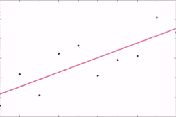
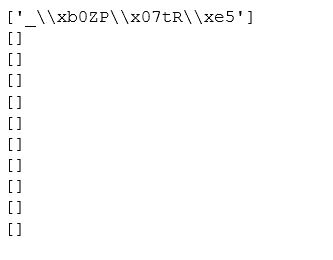
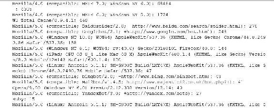
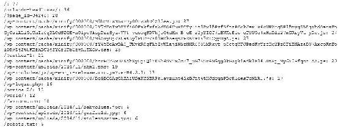

# 处理真实数据

在本章中，我们将讨论处理现实数据的挑战，以及您可能会遇到的一些怪癖。 本章首先讨论偏差方差折衷，这是一种更原则性的方式，用于讨论您可能过度拟合和欠拟合数据的不同方式，以及它们之间如何相互关联。 然后，我们讨论 k 折交叉验证技术，该技术是打击过度拟合的重要工具，并介绍了如何使用 Python 实施该技术。

接下来，我们分析在实际应用任何算法之前清除数据并对其进行规范化的重要性。 我们看到一个示例，用于确定网站上最受欢迎的页面，这些页面将演示清洁数据的重要性。 本章还涵盖了记住对数值数据进行规范化的重要性。 最后，我们研究如何检测异常值并加以处理。

具体而言，本章涵盖以下主题：

*   分析偏差/方差的权衡
*   k 折交叉验证的概念及其实现
*   清理和规范化数据的重要性
*   确定网站受欢迎页面的示例
*   归一化数值数据
*   检测异常值并对其进行处理

# 偏差/方差折衷

在处理现实世界数据时，我们面临的基本挑战之一是拟合过高与拟合过低而不是拟合数据，模型或预测。 当我们谈论欠拟合和过度拟合时，我们经常可以在偏差和方差以及偏差与方差之间进行权衡。 所以，让我们谈谈这意味着什么。

因此，从概念上讲，偏差和方差非常简单。 偏差与您与正确值的距离有多远，也就是说，您的总体预测在预测正确的总体值方面有多好。 如果您采用所有预测的均值，它们或多或少都在正确的位置上？ 还是您的错误始终在一个方向或另一个方向上始终偏斜？ 如果是这样，则您的预测会偏向某个方向。

方差只是衡量预测的分散程度和分散程度的指标。 因此，如果您的预测无处不在，那么差异就很大。 但是，如果他们非常关注正确的值，或者在高偏差的情况下甚至不正确的值，那么您的差异就很小。

让我们看一些例子。 让我们想象一下，以下飞镖代表了我们所做的一系列预测，而我们试图预测的实际价值位于靶心的中心：


*   从左上角的飞镖板开始，您可以看到我们的点都分散在中心周围。 因此，总的来说，您知道平均误差非常接近实际。 我们的偏见实际上非常低，因为我们的预测都围绕着相同的正确点。 但是，我们的方差很高，因为这些点散布在整个地方。 因此，这是低偏差和高方差的示例。
*   如果我们继续移动到右上角的飞镖板上，就会看到我们的点始终一致地从其应有的位置偏向西北。 因此，这是我们的预测中存在高度偏见的一个示例，在这些偏见中始终存在一定偏差。 我们的差异很小，因为它们都紧密地聚集在错误的位置，但是至少它们彼此靠近，因此我们的预测是一致的。 那是低方差。 但是，偏见很高。 同样，这是高偏差，低方差。
*   在左下角的飞镖板上，您可以看到我们的预测分散在错误的均值周围。 因此，我们有很高的偏见。 一切都偏向了不该有的地方。 但是我们的差异也很大。 因此，这是两个世界中最糟糕的一个。 在此示例中，我们具有较高的偏见和较高的方差。
*   最后，在一个奇妙的完美世界中，您将看到一个示例，例如右下方向的飞镖盘，其中我们的偏见低，所有事物都集中在应该放置的地方，而方差很小，所有事物都紧密地聚集在应该放置的地方 是。 因此，在一个完美的世界中，这就是最终的结果。

实际上，您通常需要在偏差和方差之间进行选择。 归结为过度拟合对数据的拟合不足。 让我们看下面的例子：

 

这与偏见和差异的思考方式有些不同。 因此，在左图中，我们有一条直线，相对于这些观察，您可以认为这具有非常低的方差。 因此，该行没有太多变化，即，变化很小。 但是偏差（每个点的误差）实际上很高。

现在，将其与右图中的过度拟合数据进行对比，我们已经竭尽全力来拟合观察值。 该线具有较高的方差，但具有较低的偏差，因为每个点都非常接近应有的位置。 因此，这是我们用方差权衡偏差的一个例子。

归根结底，您并不想减少偏差或减少方差，而是想减少误差。 真正重要的是，事实证明您可以将误差表示为偏差和方差的函数：


以此来看，误差等于偏差平方加方差。 因此，这些因素都会造成整体误差，而偏差实际上会造成更大的误差。 但请记住，这是您真正要最小化的错误，而不是具体的偏差或方差，并且过于复杂的模型最终可能具有高方差和低偏差，而过于简单的模型将具有低方差和高偏差。 偏见。 但是，它们最终都可能在一天结束时具有相似的错误条件。 尝试拟合数据时，您只需要找到这两件事的正确的快乐媒介即可。 在接下来的部分中，我们将讨论一些实际上避免过拟合的更原则的方法。 但是，这只是我想克服的偏见和差异的概念，因为人们确实在谈论它，并且您将被期望知道这意味着什么。

现在，让我们将其与本书中较早的概念联系起来。 例如，在 k 个最近的邻居中，如果我们增加 K 的值，我们就会开始平均扩展到更大区域的邻居。 这具有减少方差的效果，因为我们可以在更大的空间上使事物平滑，但是它可能会增加我们的偏见，因为我们将要挑选到的人群可能与我们开始时的相关性越来越小 。 通过在大量邻居上平滑 KNN，我们可以减小方差，因为我们正在通过更多值平滑事物。 但是，我们可能会引入偏见，因为我们引入了越来越多的点，而这些点与开始时的点之间的关联性却不那么高。

决策树是另一个例子。 我们知道，单个决策树很容易过度拟合，因此可能暗示它具有很大的方差。 但是，随机森林寻求权衡一些方差以减少偏差，并且它通过拥有多个随机变异的树并将其所有解决方案求平均来做到这一点。 就像当我们通过增加 KNN 中的 K 来对事物进行平均时：我们可以通过使用多个使用相似森林的随机森林决策树来平均决策树的结果。

这是偏差方差的权衡。 您知道必须在价值的整体准确性，价值的分散程度或紧密程度之间做出决定。 那就是偏差-方差的权衡，它们都会导致整体误差，这是您真正关心的要最小化的事情。 因此，请记住这些条款！

# K 折交叉验证以避免过拟合

在本书的前面，我们讨论了训练和测试，将其作为防止过度拟合并实际测量模型在从未见过的数据上的性能的好方法。 我们可以使用称为 k 折交叉验证的技术将其提升到一个新的水平。 因此，让我们谈谈您的武器库中用于对抗过度拟合的强大工具； k 折交叉验证并了解其工作原理。

回想一下火车/测试，当时的想法是，我们将要构建机器学习模型的所有数据分为两个部分：训练数据集和测试数据集。 想法是，我们仅使用训练数据集中的数据来训练模型，然后使用为测试数据集保留的数据评估模型的性能。 这样可以防止我们过度拟合现有的数据，因为我们正在针对该模型进行过从未见过的数据测试。

但是，训练/测试仍然有其局限性：您仍然可能最终过度适合您的特定训练/测试单元。 也许您的训练数据集并不能真正代表整个数据集，并且太多的东西最终出现在您的训练数据集中，使事情发生了偏差。 因此，这就是 k 折交叉验证的用武之地，它需要训练/测试并将其提升一个档次。

这个想法虽然听起来很复杂，但相当简单：

1.  我们没有将数据分为两个存储桶，一个用于训练，一个用于测试，而是将其分为 K 个存储桶。
2.  我们保留其中一个存储桶用于测试目的，以评估模型的结果。
3.  我们针对剩余的 K-1 桶对模型进行训练，然后获取测试数据集，并使用该数据集来评估模型在所有这些不同训练数据集中的表现。
4.  我们将这些结果误差度量（即那些 r 平方值）平均，以从 k 倍交叉验证中获得最终误差度量。

仅此而已。 这是一种进行训练/测试的更强大的方法，而这也是一种方法。

现在，您可能会好好考虑一下，如果我对保留的那一个测试数据集过度拟合该怎么办？ 对于这些训练数据集中的每个数据集，我仍使用相同的测试数据集。 如果该测试数据集也不能真正代表事物怎么办？

有 k 折交叉验证的变体，也可以将其随机化。 因此，您可以每次都随机选择训练数据集是什么，而只是保持随机地将事物分配给不同的存储桶并测量结果。 但是通常，当人们谈论 k 折交叉验证时，他们谈论的是这种特定技术，即您保留一个存储桶用于测试，其余的存储桶用于训练，然后在测试数据集相对于测试数据集评估时 您为每个模型建立一个模型。

# 使用 scikit-learn 进行 k 倍交叉验证的示例

幸运的是，scikit-learn 使得此操作确实非常容易，并且比进行常规培训/测试更容易！ 进行 k 折叠交叉验证非常简单，因此您也可以这样做。

现在，这一切在实践中的工作方式是您将要尝试调整一个模型，并且该模型将具有不同的变体，您可能需要对其进行调整的不同参数，对吗？

例如，多项式拟合的多项式次数。 因此，我们的想法是尝试使用模型的不同值，不同的变体，使用 k 倍交叉验证对它们进行度量，然后找到一个对测试数据集最小化误差的变量。 那是您在那里的最佳去处。 在实践中，您想使用 k 折交叉验证来衡量模型相对于测试数据集的准确性，并且只是不断完善该模型，继续尝试其中的不同值，继续尝试该模型的不同变体，甚至尝试不同的方法 完全建模，直到您找到使用 k 折交叉验证最大程度地减少错误的技术为止。

让我们深入一个例子，看看它是如何工作的。 我们将再次将其应用于 Iris 数据集，重新访问 SVC，然后我们将进行 k 倍交叉验证，看看它有多简单。 我们实际上使用一些真实的 Python 代码在此处进行 k 折交叉验证和训练/测试。 您会发现它实际上非常易于使用，这是一件好事，因为这是您应使用的一种技术，用于在监督学习中测量模型的准确性和有效性。

请继续打开`KFoldCrossValidation.ipynb`，然后继续操作。 我们将再次查看 Iris 数据集； 还记得我们在谈到降维时介绍过的吗？

只是为了刷新您的记忆，虹膜数据集包含一组 150 个虹膜花的测量值，其中每朵花的花瓣的长度和宽度以及其萼片的长度和宽度。 我们也知道每朵花属于 3 种不同鸢尾花中的哪一种。 面临的挑战是创建一个模型，只要给定其花瓣和萼片的长度和宽度，就可以成功地预测鸢尾花的种类。 因此，让我们继续进行。

我们将使用 SVC 模型。 如果您还记得，那只是对数据进行分类的一种非常可靠的方法。 如果您需要去刷新内存，则有一个章节：

```py
import numpy as np 
from sklearn import cross_validation 
from sklearn import datasets 
from sklearn import svm 

iris = datasets.load_iris() 

# Split the iris data into train/test data sets with 
#40% reserved for testing 
X_train, X_test, y_train, y_test = cross_validation.train_test_split(iris.data, 
                                    iris.target, test_size=0.4, random_state=0) 

# Build an SVC model for predicting iris classifications 
#using training data 
clf = svm.SVC(kernel='linear', C=1).fit(X_train, y_train) 

# Now measure its performance with the test data 
clf.score(X_test, y_test) 

```

我们要做的是使用 scikit-learn 的`cross_validation`库，我们首先进行常规的火车测试拆分，仅进行一次火车/测试拆分，然后看看如何工作。

为此，我们有一个`train_test_split()`函数，使它非常容易。 因此，此方法的工作方式是将一组特征数据输入到`train_test_split()`中。 `iris.data`仅包含每朵花的所有实际测量值。 `iris.target`基本上是我们要预测的事情。

在这种情况下，它包含每朵花的所有种类。 `test_size`说我们要训练与测试的百分比。 因此，0.4 表示我们将随机抽取 40％的数据用于测试，并将 60％的数据用于培训。 这带给我们的是 4 个数据集，基本上是特征数据和目标数据的训练数据集和测试数据集。 因此，`X_train`最终包含虹膜测量值的 60％，`X_test`包含 40％用于测试模型结果的测量值。 `y_train`和`y_test`包含这些段中每个段的实际种类。

然后，在此之后，我们继续构建一个 SVC 模型，以根据虹膜物种的测量值来预测它们，然后仅使用训练数据来构建该模型。 我们使用线性核，仅使用训练特征数据和训练种类数据（即目标数据）来拟合此 SVC 模型。 我们称该模型为`clf`。 然后，我们在`clf`上调用`score()`函数以仅针对我们的测试数据集测量其性能。 因此，我们根据为虹膜测量保留的测试数据和虹膜种类对模型进行评分，并观察其效果如何：


事实证明，它确实做得很好！ 在超过 96％的时间中，我们的模型仅基于该虹膜的测量值就能够正确预测它从未见过的虹膜的种类。 太酷了！

但是，这是一个相当小的数据集，如果我没记错的话，大约有 150 朵花。 因此，我们仅使用 150 朵花中的 60％进行训练，而仅使用 150 朵花中的 40％进行测试。 这些仍然是很小的数字，因此我们仍然可能过度适合于我们进行的特定训练/测试分组。 因此，让我们使用 k 倍交叉验证来防止这种情况。 事实证明，使用 k 折交叉验证（即使它是更可靠的技术），实际上实际上比训练/测试更容易使用。 所以，这很酷！ 因此，让我们看看它是如何工作的：

```py
# We give cross_val_score a model, the entire data set and its "real" values, and the number of folds: 
scores = cross_validation.cross_val_score(clf, iris.data, iris.target, cv=5) 

# Print the accuracy for each fold: 
print scores 

# And the mean accuracy of all 5 folds: 
print scores.mean() 

```

我们已经有了一个模型，我们为此预测定义了 SVC 模型，您需要做的就是在`cross_validation`程序包上调用`cross_val_score()`。 因此，您要在此函数中传递给定类型（`clf`）的模型，即所有测量的整个数据集，即我的所有特征数据（`iris.data`）和我的所有目标数据 （所有物种），`iris.target`。

我想要`cv=5`，这意味着它实际上将使用 5 个不同的训练数据集，同时保留`1`进行测试。 基本上，它将运行 5 次，这就是我们需要做的。 这将针对整个数据集自动评估我们的模型，分解出五种不同的方式，并给我们单独的结果。

如果我们将其输出打印出来，它将为我们提供这些迭代中的每一个迭代（即，这些折叠中的每一个）的实际错误度量的列表。 我们可以将它们平均在一起，以获得基于 k 折交叉验证的总体误差度量：


当我们这样做超过 5 倍时，我们可以看到我们的结果甚至比我们想象的还要好！ 98％的准确性。 太酷了！ 实际上，在几次运行中我们都具有完美的准确性。 所以这真是太神奇了。

现在，让我们看看是否可以做得更好。 以前我们使用线性核，如果我们使用多项式核甚至更高级怎么办？ 这会过拟合还是实际上会更好地拟合我们拥有的数据？ 这种类型取决于这些花瓣测量值与实际物种之间是否存在线性关系或多项式关系。 因此，让我们尝试一下：

```py
clf = svm.SVC(kernel='poly', C=1).fit(X_train, y_train)
scores = cross_validation.cross_val_score(clf, iris.data, iris.target, cv=5)
print scores
print scores.mean()

```

我们将使用相同的技术再次运行所有这些。 但是这次，我们使用的是多项式内核。 我们将其适合我们的训练数据集，在这种情况下您适合的位置并不重要，因为`cross_val_score()`会一直为您重新运行它：


事实证明，当我们使用多项式拟合时，最终得出的总体得分甚至低于我们的原始得分。 因此，这告诉我们多项式内核可能过度拟合。 当我们使用 k 倍交叉验证时，它显示出比线性核函数更低的分数。

这里重要的一点是，如果我们仅使用单个火车/测试单元，就不会意识到我们过度拟合。 如果我们像在线性内核上那样只进行一次训练/测试拆分，我们实际上会得到相同的结果。 因此，我们可能会无意间在此处过度拟合数据，甚至在不使用 k 倍交叉验证的情况下甚至都不知道。 因此，这是一个很好的例子，它说明了救援人员使用 k 形折叠的情况，并警告您过拟合，在这种情况下，单次火车/测试分站可能无法解决这一问题。 因此，请将其放在工具箱中。

如果您想更多地玩这个游戏，请尝试不同程度的尝试。 因此，您实际上可以指定其他数量的度数。 多项式内核的默认值为 3 度，但是您可以尝试其他一个，也可以尝试两个。

这样会更好吗？ 如果降为 1，则基本上可以降级为线性核，对吗？ 因此，也许仍然存在多项式关系，也许只是二阶多项式。 试试看，看看你能得到什么。 这就是 k 倍交叉验证。 如您所见，感谢 scikit-learn，它非常易于使用。 这是一种非常健壮的方式来衡量模型的良好状态的重要方法。

# 数据清理和规范化

现在，这是最简单的部分之一，但可能是整本书中最重要的部分。 我们将讨论清理输入数据，这将花费很多时间。

您清理输入数据的方式以及对原始输入数据的理解程度将对结果质量产生巨大影响-甚至可能比您选择的模型或模型的调优程度更大。 所以，要注意； 这是重要的东西！

作为数据科学家，清理原始输入数据通常是最重要且最耗时的工作！

让我们谈谈数据科学的一个不便之处，那就是您花费了大部分时间实际上只是在清理和准备数据，而实际上却很少用它来分析和尝试新的算法。 它并不像人们一直认为的那样迷人。 但是，这是一件非常重要的事情要注意。

您可能会在原始数据中找到很多不同的东西。 传入的数据（仅是原始数据）将非常脏，并且将以多种不同方式受到污染。 如果您不加以处理，它将使您的结果产生偏差，最终将最终导致您的业务做出错误的决定。

如果再次出现错误，那就是您提取了很多不良数据并没有考虑到这些错误，没有对这些数据进行清理，您告诉您的业务是根据后来的结果来做某事 完全是错误的，您将会遇到很多麻烦！ 所以，要注意！

您需要注意许多不同类型的问题和数据：

*   **离群值**：因此，也许您的人员在数据中表现得有些奇怪，而当您对它们进行挖掘时，它们却是您不应该首先关注的数据。 一个很好的例子是，如果您正在查看 Web 日志数据，并且看到一个会话 ID 不断地反复出现，并且它以人们永远无法完成的高速度执行某项操作。 您可能会看到一个机器人，该脚本正在某个地方运行以实际抓取您的网站。 甚至可能是某种恶意攻击。 但是无论如何，您都不希望这些行为数据通知您的模型，这些数据只能用来预测使用您的网站的真实人类的行为。 因此，监视异常值是识别在构建模型时可能希望从模型中删除的数据类型的一种方法。
*   **缺少数据**：当数据不存在时您会怎么做？ 回到网络日志的示例，您可能在该行中有一个引荐来源网址，也可能没有。 如果不存在该怎么办？ 是否为丢失或未指定的内容创建新分类？ 还是您将那条线全部淘汰？ 您必须考虑正确的做法。
*   **恶意数据**：可能有人在尝试玩您的系统，有人可能在试图欺骗系统，而您不希望那些人逃避它。 假设您正在建立一个推荐系统。 可能有人在外面捏造行为数据以推广他们的新产品，对吗？ 因此，您需要警惕此类情况，并确保对输入数据识别先令攻击或其他类型的攻击，并从结果中过滤掉它们，不要让它们获胜。 。
*   **错误数据**：如果某些系统中某处出现软件错误，而该错误仅在某些情况下会写出错误的值？ 这有可能发生。 不幸的是，您没有很好的方法来了解这一点。 但是，如果您看到的数据看起来有些混乱，或者结果对您而言没有意义，那么深入研究有时可能会发现潜在的错误，这些错误首先导致写入错误的数据。 也许某些时候事情没有被正确地组合在一起。 可能不是整个会议期间都举行会议。 例如，人们在访问网站时可能会丢弃其会话 ID 并获取新的会话 ID。
*   **不相关数据**：此处非常简单。 也许您只对纽约市人的数据感兴趣，或出于某种原因。 在这种情况下，来自世界各地的人们的所有数据都与您要查找的内容无关。 您要做的第一件事就是丢弃所有数据并限制数据，将其缩减为您真正关心的数据。
*   **数据不一致**：这是一个很大的问题。 例如，在地址中，人们可以用许多不同的方式编写相同的地址：他们可能会缩写街道，或者可能不会缩写街道，他们可能根本不会将街道放在街道名称的末尾。 他们可能以不同的方式将行组合在一起，可能会拼写不同的东西，可能在美国使用邮政编码，或者在美国使用邮政编码加 4 码，他们可能有一个国家，他们可能没有一个国家。 您需要以某种方式找出您看到的变化以及如何将它们全部归一化。
*   也许我正在看有关电影的数据。 电影在不同国家/地区可能具有不同的名称，或者一本书在不同国家/地区可能具有不同的名称，但它们的含义相同。 因此，您需要在需要规范化数据，可以用许多不同方式表示相同数据的地方，并需要将它们组合在一起以获得正确的结果。
*   **格式化**：这也可能是一个问题； 事物的格式可能不一致。 以日期为例：在美国，我们总是执行月，日，年（MM / DD / YY），但是在其他国家，他们可能会执行日，月，年（DD / MM / YY），谁知道呢。 您需要了解这些格式差异。 电话号码可能在区号周围带有括号，也许没有。 也许数字的每个部分之间都有破折号，也许没有。 也许社会保险号有破折号，也许没有。 这些都是您需要注意的事情，并且您需要确保在处理过程中不会将格式的变化视为不同的实体或不同的分类。

因此，有很多事情需要提防，而前面的列表只是要注意的主要问题。 记住：垃圾进，垃圾出。 您的模型仅与您提供给它的数据一样好，这是非常非常正确的！ 您可以拥有一个非常简单的模型，如果您向其提供大量干净的数据，则其性能将非常好，并且实际上它可能会在较脏的数据集上胜过复杂的模型。

因此，确保您拥有足够的数据和高质量的数据通常是最主要的任务。 您会惊讶于现实世界中使用的一些最成功的算法是如此简单。 它们只有通过输入的数据质量和输入的数据量才能成功。 您并不总是需要精美的技术来获得良好的结果。 通常，数据的质量和数量与其他任何事物一样重要。

始终质疑您的结果！ 您不想返回并且仅在得到不满意的结果时在输入数据中查找异常。 这会给您的结果带来无意的偏差，让您希望或期望的结果毫无疑问地通过，对吗？ 您想一直质疑事物，以确保您一直在寻找这些事物，因为即使您找到自己喜欢的结果，即使结果是错误的，它仍然是错误的，它仍然会通知您 公司方向错误。 以后可能会再次咬你。

例如，我有一个名为“无恨新闻”的网站。 这是非营利性组织，所以我不会试图通过告诉您来赚钱。 假设我只想在我拥有的该网站上找到最受欢迎的页面。 这听起来像是一个非常简单的问题，不是吗？ 我应该只能够浏览一下我的 Web 日志，并计算出每个页面有多少次匹配，并对它们进行排序，对吗？ 它能有多难？！ 好吧，事实证明这真的很难！ 因此，让我们深入研究该示例，看看为什么会很难，并查看一些必须进行的实际数据清除的示例。

# 清理 Web 日志数据

我们将展示清除数据的重要性。 我有一个自己的小网站上的一些网络日志数据。 我们将尝试查找该网站上浏览量最高的页面。 听起来很简单，但是正如您所看到的，这实际上是非常具有挑战性的！ 因此，如果您想继续学习，`TopPages.ipynb`是我们在这里工作的笔记本电脑。 开始吧！

我实际上有一个从实际网站获取的访问日志。 这是来自 Apache 的真实 HTTP 访问日志，并包含在您的书中。 因此，如果您确实想在这里玩，请确保更新路径以将访问日志移动到保存书籍材料的位置：

```py
logPath = "E:\\sundog-consult\\Packt\\DataScience\\access_log.txt" 

```

# 在网络日志上应用正则表达式

因此，我去了互联网，获得了以下几段代码，这些代码段将 Apache 访问日志行解析为一堆字段：

```py
format_pat= re.compile( 
    r"(?P<host>[\d\.]+)\s" 
    r"(?P<identity>\S*)\s" 
    r"(?P<user>\S*)\s" 
    r"\[(?P<time>.*?)\]\s" 
    r'"(?P<request>.*?)"\s' 
    r"(?P<status>\d+)\s" 
    r"(?P<bytes>\S*)\s" 
    r'"(?P<referer>.*?)"\s' 
    r'"(?P<user_agent>.*?)"\s*' 
) 

```

这段代码包含主机，用户，时间，实际页面请求，状态，引荐来源网址`user_agent`（意味着实际上是使用哪个浏览器来查看此页面）之类的内容。 它建立了所谓的正则表达式，我们正在使用`re`库来使用它。 从本质上讲，这是用于对大字符串进行模式匹配的非常强大的语言。 因此，我们实际上可以将此正则表达式应用于访问日志的每一行，并将该访问日志行中的信息位自动分组到这些不同的字段中。 让我们继续运行。

在这里要做的显而易见的事情是，让我们编写一个小脚本，该脚本计算我们遇到的每个被请求的 URL，并计算被请求的次数。 然后，我们可以对该列表进行排序并获得首页，对吗？ 听起来很简单！

因此，我们将构建一个名为`URLCounts`的 Python 字典。 我们将打开日志文件，并针对每一行应用正则表达式。 如果实际上返回的结果与我们要匹配的模式成功匹配，我们会说，好吧，这看起来像访问日志中的一条不错的线。

让我们从中提取请求字段，它是实际的 HTTP 请求，即浏览器实际上正在请求的页面。 我们将其分为三个部分：它由一个动作（例如 get 或 post）组成； 实际请求的 URL； 以及所使用的协议。 鉴于该信息已拆分，我们然后可以仅查看该 URL 是否已存在于我的字典中。 如果是这样，我将增加`1`遇到该 URL 的次数的计数； 否则，我将为该 URL 引入一个新的字典条目，并将其初始化为`1`的值。 我对日志中的每一行都执行此操作，以相反的顺序对结果进行数字排序并打印出来：

```py
URLCounts = {}
with open(logPath, "r") as f:
    for line in (l.rstrip() for l in f):
        match= format_pat.match(line)
        if match:
            access = match.groupdict()
            request = access['request']
            (action, URL, protocol) = request.split()
            if URLCounts.has_key(URL):
                URLCounts[URL] = URLCounts[URL] + 1
            else:
                URLCounts[URL] = 1
results = sorted(URLCounts, key=lambda i: int(URLCounts[i]), reverse=True)

for result in results[:20]:
    print result + ": " + str(URLCounts[result])

```

因此，让我们继续进行以下操作：


糟糕！ 我们最终在这里遇到了这个大错误。 告诉我们，我们需要超过`1`值才能解压缩。 因此，显然，我们得到了一些不包含操作，URL 和包含其他内容的协议的请求字段。

让我们看看那里发生了什么！ 因此，如果我们打印出所有不包含三个项目的请求，我们将看到实际显示的内容。 因此，我们将在此处执行类似的一小段代码，但实际上将在 request 字段上进行拆分，并打印出无法得到预期的三个字段的情况。

```py
URLCounts = {}

with open(logPath, "r") as f:
    for line in (l.rstrip() for l in f):
        match= format_pat.match(line)
        if match:
            access = match.groupdict()
            request = access['request']
            fields = request.split()
            if (len(fields) != 3):
                print fields

```

让我们看看里面到底有什么：



因此，我们有一堆空字段。 那是我们的第一个问题。 但是，然后我们有了第一个充满垃圾的字段。 谁知道那是哪里来的，但是显然是错误的数据。 好的，让我们修改脚本。

# 修改一-过滤请求字段

实际上，我们只会抛出请求中没有期望的 3 个字段的任何行。 这似乎是一件合法的事情，因为实际上其中确实包含完全无用的数据，这并不是说我们在这样做时会漏掉任何东西。 因此，我们将修改脚本来执行此操作。 在实际尝试处理之前，我们已经引入了`if (len(fields) == 3)`行。 我们将运行：

```py
URLCounts = {}

with open(logPath, "r") as f:
    for line in (l.rstrip() for l in f):
        match= format_pat.match(line)
        if match:
            access = match.groupdict()
            request = access['request']
            fields = request.split()
            if (len(fields) == 3):
                URL = fields[1]
                if URLCounts.has_key(URL):
                    URLCounts[URL] = URLCounts[URL] + 1
                else:
                    URLCounts[URL] = 1

results = sorted(URLCounts, key=lambda i: int(URLCounts[i]), reverse=True)

for result in results[:20]:
    print result + ": " + str(URLCounts[result])

```

嘿，我们得到了结果！


但这与我网站上的首页并不完全相同。 请记住，这是一个新闻网站。 因此，我们得到了很多 PHP 文件，即 Perl 脚本。 那里发生了什么事？ 我们的最佳结果是此`xmlrpc.php`脚本，然后是`WP_login.php`，然后是主页。 所以，不是很有用。 然后是`robots.txt`，然后是一堆 XML 文件。

您知道当我稍后对此进行调查时，发现我的网站实际上受到了恶意攻击； 有人试图闯进去。 他们尝试使用此`xmlrpc.php`脚本猜测我的密码，并尝试使用登录脚本进行登录。 幸运的是，在他们真正进入本网站之前，我将其关闭。

这是一个恶意数据被引入到我的数据流中的例子，我必须将其过滤掉。 因此，通过查看，我们不仅可以看到恶意攻击在查看 PHP 文件，而且还试图执行内容。 这不仅是在执行 get 请求，还在于在脚本上进行发布请求，以实际尝试在我的网站上执行代码。

# 修改二-过滤发布请求

现在，我知道我所关心的数据是根据我要弄清楚的事情来确定的，那就是人们从我的网站获取网页。 因此，对我而言，合法的做法是从这些日志中过滤掉不是 get 请求的所有内容。 所以，让我们接下来做。 我们将再次检查请求字段中是否有三个字段，然后还要检查操作是否得到执行。 如果不是，我们将完全忽略该行：

```py
URLCounts = {}

with open(logPath, "r") as f:
    for line in (l.rstrip() for l in f):
        match= format_pat.match(line)
        if match:
            access = match.groupdict()
            request = access['request']
            fields = request.split()
            if (len(fields) == 3):
                (action, URL, protocol) = fields
                if (action == 'GET'):
                    if URLCounts.has_key(URL):
                        URLCounts[URL] = URLCounts[URL] + 1
                    else:
                        URLCounts[URL] = 1

results = sorted(URLCounts, key=lambda i: int(URLCounts[i]), reverse=True)

for result in results[:20]:
    print result + ": " + str(URLCounts[result])

```

我们应该越来越接近我们现在想要的东西，以下是前面代码的输出：


是的，这看起来似乎更加合理。 但是，它仍然没有真正通过健全性检查。 这是一个新闻网站； 人们去看新闻。 他们是否真的在阅读我仅有两篇文章的小博客？ 我不这么认为！ 这似乎有点可疑。 因此，让我们深入探讨一下，看看谁真正在看那些博客页面。 如果您实际上要手动进入该文件并进行检查，您会发现很多此类博客请求实际上都没有任何用户代理。 他们只有`-`的用户代理，这非常不常见：


如果一个真正的人使用一个真正的浏览器来尝试获取此页面，它将说出诸如 Mozilla 或 Internet Explorer 或 Chrome 之类的内容。 因此，这些请求似乎来自某种刮板。 同样，潜在的恶意流量无法识别其身份。

# 修改三-检查用户代理

也许，我们也应该查看 UserAgent，以查看这些用户是否是提出请求的实际人员。 让我们继续打印所有遇到的不同 UserAgent。 因此，按照实际上总结了所看到的不同 URL 的代码的精神，我们可以查看所看到的所有不同 UserAgent，并按此日志中最流行的`user_agent`字符串对它们进行排序：

```py
UserAgents = {}

with open(logPath, "r") as f:
    for line in (l.rstrip() for l in f):
        match= format_pat.match(line)
        if match:
            access = match.groupdict()
            agent = access['user_agent']
            if UserAgents.has_key(agent):
                UserAgents[agent] = UserAgents[agent] + 1
            else:
                UserAgents[agent] = 1

results = sorted(UserAgents, key=lambda i: int(UserAgents[i]), reverse=True)

for result in results:
    print result + ": " + str(UserAgents[result])

```

我们得到以下结果：



您可以看到其中大部分看起来都是合法的。 因此，如果是刮板，在这种情况下，它实际上是恶意攻击，但实际上是在假装自己是合法的浏览器。 但是这个破折号`user_agent`也显示了很多。 因此，我不知道那是什么，但我知道它不是一个实际的浏览器。

我看到的另一件事是来自网络爬虫的大量流量。 因此，有百度是中国的搜索引擎，还有 Googlebot 只是在抓取页面。 我想我也看到了俄罗斯搜索引擎 Yandex。 因此，我们的数据正受到许多爬网程序的污染，这些爬网程序正试图为搜索引擎目的挖掘我们的网站。 再次，该流量不应计入我的分析的预期目的，即查看这些实际人类在我的网站上浏览的页面。 这些都是自动化脚本。

# 过滤蜘蛛/机器人的活动

好吧，所以这有点棘手。 仅基于用户字符串，没有真正好的识别蜘蛛或机器人的好方法。 但是我们至少可以对其进行合理的破解，并过滤掉其中包含“ bot”一词的所有内容，或者从我的缓存插件中过滤出可能还需要提前请求页面的任何内容。 我们还将去除我们的朋友单破折号。 因此，我们将再次优化脚本，以除其他所有功能外，删除所有看上去很脏的 UserAgent：

```py
URLCounts = {}

with open(logPath, "r") as f:
    for line in (l.rstrip() for l in f):
        match= format_pat.match(line)
        if match:
            access = match.groupdict()
            agent = access['user_agent']
            if (not('bot' in agent or 'spider' in agent or 
                    'Bot' in agent or 'Spider' in agent or
                    'W3 Total Cache' in agent or agent =='-')):
                request = access['request']
                fields = request.split()
                if (len(fields) == 3):
                    (action, URL, protocol) = fields
                    if (action == 'GET'):
                        if URLCounts.has_key(URL):
                            URLCounts[URL] = URLCounts[URL] + 1
                        else:
                            URLCounts[URL] = 1

results = sorted(URLCounts, key=lambda i: int(URLCounts[i]), reverse=True)

for result in results[:20]:
    print result + ": " + str(URLCounts[result])

```

```py
URLCounts = {}

with open(logPath, "r") as f:
    for line in (l.rstrip() for l in f):
        match= format_pat.match(line)
        if match:
            access = match.groupdict()
            agent = access['user_agent']
            if (not('bot' in agent or 'spider' in agent or 
                    'Bot' in agent or 'Spider' in agent or
                    'W3 Total Cache' in agent or agent =='-')):
                request = access['request']
                fields = request.split()
                if (len(fields) == 3):
                    (action, URL, protocol) = fields
                    if (URL.endswith("/")):
                        if (action == 'GET'):
                            if URLCounts.has_key(URL):
                                URLCounts[URL] = URLCounts[URL] + 1
                            else:
                                URLCounts[URL] = 1

results = sorted(URLCounts, key=lambda i: int(URLCounts[i]), reverse=True)

for result in results[:20]:
    print result + ": " + str(URLCounts[result])

```

我们得到什么？



好了，我们开始吧！ 对于前两个条目，这似乎开始变得更加合理，该主页是最受欢迎的，这是可以预期的。 奥兰多的头条新闻也很受欢迎，因为我使用这个网站的人比其他任何人都多，而且我住在奥兰多。 但是在那之后，我们得到了一堆根本不是网页的东西：一堆脚本，一堆 CSS 文件。 这些不是网页。

# 修改四-应用网站特定的过滤器

我可以应用一些有关我的网站的知识，而我碰巧知道我网站上的所有合法页面的 URL 都以斜杠结尾。 因此，让我们继续进行修改，以去除所有不以斜杠结尾的内容：

```py
URLCounts = {}

with open (logPath, "r") as f:
    for line in (l.rstrip() for 1 in f):
        match= format_pat.match(line)
        if match:
            access = match.groupdict()
            agent = access['user_agent']
            if (not('bot' in agent or 'spider' in agent or
                    'Bot' in agent or 'Spider' in agent or
                    'W3 Total Cache' in agent or agent =='-')):
                request = access['request']
                fields = request.split()
                if (len(fields) == 3):
                    (action, URL, protocol) = fields
                    if (URL.endswith("/")):
                        if (action == 'GET'):
                            if URLCounts.has_key(URL):
                                URLCounts[URL] = URLCounts[URL] + 1
                            else:
                                URLCounts[URL] = 1

results = sorted(URLCounts, key=lambda i: int(URLCounts[i]), reverse=True)

for result in results[:20]:
    print result + ": " + str(URLCounts[result])

```

让我们运行它！


最后，我们得到了一些似乎有意义的结果！ 因此，看起来像是，我小的 No-Hate News 网站上实际人类所要求的首页是首页，然后是`orlando-headlines`，接着是世界新闻，接着是漫画，接着是天气，以及有关 屏幕。 因此，这开始看起来更加合法。

如果您要进行更深入的研究，您会发现此分析仍然存在问题。 例如，那些提要页面仍然来自机器人，只是试图从我的网站获取 RSS 数据。 因此，这在看似简单的分析如何在获得有意义的结果之前需要进行大量的预处理和清理源数据方面是一个很好的寓言。

再次，确保在清理数据过程中所做的事情是原则性的，并且您不仅仅是在挑剔与您的先入为主的概念不符的问题。 因此，请始终对您的结果提出疑问，始终查看您的源数据，并寻找其中的奇怪内容。

# Web 日志数据活动

好吧，如果您想进一步解决这个问题，可以解决该 Feed 问题。 继续并删除包含提要的内容，因为我们知道这不是一个真正的网页，只是为了熟悉代码。 或者，更仔细地查看日志，以了解那些供稿页面实际来自何处。

也许有一种更好，更强大的方法来将流量识别为更大的类别。 因此，请随意解决。 但是，我希望您能吸取教训：数据清理-非常重要，这将花费大量时间！

因此，令人惊讶的是，在一个简单的问题（例如“我的网站上浏览量最高的页面是什么？”）上获得合理的结果是多么困难。 您可以想象，如果要为清理这样一个简单的问题而花费大量的精力来清理数据，请考虑一下脏数据可能实际上影响更复杂问题和复杂算法的结果的所有细微差别。

了解您的源数据，查看它，查看它的代表性示例，确保您了解系统中将要包含的内容非常重要。 始终对您的结果提出疑问，并将其与原始源数据联系起来，以查看可疑结果的来源。

# 归一化数值数据

这是一个非常快速的部分：我只想提醒您标准化数据的重要性，请确保您的各种输入要素数据在相同范围内并且具有可比性。 而且，有时很重要，有时没有。 但是，您只需要了解它的时间即可。 只需将其放在脑后，因为如果不这样做，有时会影响结果的质量。

因此，有时模型将基于几个不同的数值属性。 如果您还记得多变量模型，那么我们可能正在寻找的汽车具有不同的属性，并且它们可能不是直接可比的度量。 或者，例如，如果我们查看年龄与收入之间的关系，年龄可能在 0 到 100 之间，但以美元计的收入可能在 0 到十亿之间，并且取决于货币，范围可能更大！ 某些模型可以。

如果您要进行回归分析，通常这没什么大不了的。 但是，除非将这些值先按比例缩小到一个通用比例，否则其他模型的性能将不佳。 如果不小心，可能会导致某些属性的数量超过其他属性。 如果您试图将这两个值视为模型中的可比较值，那么收入可能最终会超过年龄。

因此，这也会给属性带来偏差，这也是一个问题。 您知道，也许您的一组数据是偏斜的，有时您需要对事物与该组值看到的实际范围进行归一化，而不仅仅是将 0 缩放到最大刻度。 对于何时应该和不应该进行这种归一化没有固定的规则。 我只能说您始终在阅读文档以了解所使用的技术。

因此，例如，在 scikit-learn 中，其 PCA 实现具有`whiten`选项，该选项将自动为您标准化数据。 您可能应该使用它。 它还具有一些可用的预处理模块，这些模块也将自动为您标准化和缩放内容。

也要注意实际上应该以数字或常规方式表示的文本数据。 如果您具有`yes`或`no`数据，则可能需要将其转换为`1`或`0`并以一致的方式进行。 因此，再次阅读文档。 大多数技术对于未标准化的原始数据都可以很好地工作，但是在您第一次开始使用新技术之前，只需阅读文档并了解输入是否应该先缩放或归一化或白化。 如果是这样，scikit-learn 可能会使您很容易做到这一点，您只需要记住要这样做！ 如果要缩放输入数据，请不要忘记在完成后重新缩放结果。

如果您希望能够解释所获得的结果，有时您需要在完成后将其缩放回原始范围。 如果您正在缩放事物，甚至在将它们输入模型之前甚至将它们偏向某个量，请确保在实际将这些结果呈现给他人之前先对它们进行缩放并使其没有偏差。 否则，它们将毫无意义！ 提醒一下，如果您愿意的话，还需要一点寓言，在将数据传递到给定模型之前，请务必检查是否应该对数据进行规范化或变白。

没有与本节相关的练习； 这只是我想让您记住的事情。 我只是想把重点讲清楚。 有些算法需要变白或标准化，而另一些则不需要。 因此，请务必阅读文档！ 如果您确实需要标准化进入算法的数据，通常会告诉您，并且这样做非常容易。 请注意这一点！

# 检测异常值

实际数据的一个常见问题是离群值。 您总是会有一些奇怪的用户或某些奇怪的代理程序在污染您的数据，而这些行为异常而非典型地来自于典型用户。 它们可能是合法的异常值； 它们可能是由真实的人而不是某种恶意流量或伪造数据引起的。 所以有时候，删除它们是适当的，有时候不是。 确保做出负责任的决定。 因此，让我们深入研究一些处理异常值的示例。

例如，如果我正在进行协作过滤，并且试图提出电影推荐或类似的建议，那么您可能会有一些超级用户观看过每部电影，并对每部电影进行了评分。 他们最终可能会对其他所有人的建议产生过分的影响。

您实际上并不希望少数人在您的系统中拥有如此强大的功能。 因此，这可能是一个示例，其中过滤掉异常值并通过它们实际放入系统中的评级来识别它们是合理的事情。 或者，也许一个离群值就是没有足够评分的人。

我们可能正在查看 Web 日志数据，就像我们在前面的示例中进行数据清理时所看到的那样，离群值可能会告诉您，您的数据一开始有很多错误。 可能是恶意流量，也可能是漫游器或其他不应代表您要建模的实际人类的代理。

如果有人真的想要美国的平均平均收入（而不是中位数），那么您不应该因为不喜欢唐纳德·特朗普而把他扔掉。 您知道的事实是，即使他的中位数不超出中位数，他的数十亿美元也将推动该中位数的增长。 因此，不要通过排除异常值来弄乱数字。 但是，如果它与您首先要建模的内容不一致，则将其排除在外。

现在，我们如何识别异常值？ 好吧，还记得我们的老朋友标准差吗？ 我们在本书的开头部分已经介绍了这一点。 这是检测异常值的非常有用的工具。 原则上，您可以计算应该具有或多或少正态分布的数据集的标准偏差。 如果您看到的数据点超出一两个标准偏差，则那里有一个异常值。

记住，我们之前也讨论过箱形图和晶须图，它们还具有检测和可视化异常值的内置方法。 这些图将异常值定义为位于四分位数范围的 1.5 之外。

您选择几倍？ 好吧，您必须使用常识，您知道，关于异常值没有严格的规定。 您必须查看您的数据并加以关注，查看分布，查看直方图。 看看是否有实际的事物会以明显的异常值突出于您，并在您将它们扔掉之前了解它们是什么。

# 处理异常值

因此，让我们来看一些示例代码，看看在实践中如何处理异常值。 让我们弄乱一些异常值。 这是一个非常简单的部分。 一点点审查实际上。 如果您想继续，我们在`Outliers.ipynb`中。 因此，如果您愿意，请继续打开它：

```py
import numpy as np

incomes = np.random.normal(27000, 15000, 10000)
incomes = np.append(incomes, [1000000000])

import matplotlib.pyplot as plt
plt.hist(incomes, 50)
plt.show()

```

在本书的早期，我们做了非常相似的事情，在那本书中，我们创建了一个虚假的美国收入分配直方图。 我们要做的是从这里的收入的正态分布开始，每年的平均收入为 27,000 美元，标准差为 15,000。 我将创建 10,000 个在该分布中有收入的假美国人。 顺便说一下，尽管与现实相距不远，但这完全是虚构数据。

然后，我要坚持一个离群值-叫唐纳德·特朗普（Donald Trump），他有十亿美元。 我们将把这个家伙留在数据集的末尾。 因此，我们有一个约 27,000 美元的正态分布数据集，然后我们将在最后坚持 Donald Trump。

我们将继续将其绘制为直方图：


哇！ 这不是很有帮助！ 我们把该国其他所有人的整个正态分布压缩到直方图的一个桶中。 另一方面，我们在右边有唐纳德·特朗普，把整个事情搞砸了十亿美元。

另一个问题也是，如果我要回答这个问题，典型的美国人能赚多少钱。 如果我要尝试找出答案，这将不是一个非常有用的数字：

```py
incomes.mean ()

```

前面代码的输出如下：

```py
126892.66469341301

```

当我知道我不包括唐纳德·特朗普的正态分布数据的真实平均值仅为 27,000 美元时，唐纳德·特朗普就将这个数字自己提高到了 126,000 美元，并且有些变化。 因此，正确的做法是使用中位数而不是均值。

但是，假设我们出于某种原因不得不使用均值，而解决此问题的正确方法将是排除唐纳德·特朗普等离群值。 因此，我们需要弄清楚如何识别这些人。 好吧，您可以选择一些任意的界限，然后说：“我将淘汰所有亿万富翁”，但这并不是一件非常原则性的事情。 10 亿来自哪里？

我们数数的方式只是偶然。 因此，更好的方法是实际测量数据集的标准偏差，并将异常值识别为偏离平均值的标准偏差的倍数。

因此，以下是我编写的一个小功能。 称为`reject_outliers()`：

```py
def reject_outliers(data): 
    u = np.median(data) 
    s = np.std(data) 
    filtered = [e for e in data if (u - 2 * s < e < u + 2 * s)] 
    return filtered 

filtered = reject_outliers(incomes) 

plt.hist(filtered, 50) 
plt.show() 

```

它接收数据列表并找到中位数。 它还找到该数据集的标准偏差。 因此，我将其过滤掉，因此只保留数据中位数两个标准偏差内的数据点。 因此，我可以在收入数据上使用此便捷的 dandy `reject_outliers()`函数，以自动自动剔除怪异的异常值：


果然，它可行！ 现在，我得到了一张更漂亮的图表，其中不包括唐纳德·特朗普，而是着重介绍了位于中心的更典型的数据集。 所以，很酷的东西！

因此，这是识别异常值并自动将其删除或在您认为合适时对其进行处理的一个示例。 请记住，请始终以有原则的方式进行此操作。 不要因为不便而将异常值排除在外。 了解它们的来源，以及它们实际上如何影响您要在精神上衡量的事物。

顺便说一下，我们的意思现在也更有意义了。 现在我们已经摆脱了离群值，因此应该接近 27,000。

# 异常活动

因此，如果您想玩这个游戏，就可以像我通常要求您那样去弄弄它。 尝试使用标准偏差的不同倍数，尝试添加更多离群值，并尝试添加不像唐纳德·特朗普那样离群值的离群值。 您知道，只需在此处构造一些额外的伪造数据并进行处理，看看您是否可以成功识别这些人。

所以你有它！ 离群值; 非常简单的概念。 因此，这是通过查看标准偏差并仅查看与您关心的均值或中值的标准偏差的数量来识别异常值的示例。 实际上，考虑到离群值本身可能会扭曲均值，因此中值实际上可能是一个更好的选择，对吗？ 因此，通过使用标准偏差，这是一种以更原则性的方式识别异常值的好方法，而不仅仅是选择一些任意的截止值。 同样，您需要决定对这些异常值进行正确的处理。 您实际上想衡量什么？ 实际丢弃它们是否合适？ 所以，把它放在你的头上！

# 概括

在本章中，我们讨论了在偏差和方差之间保持平衡并最小化误差的重要性。 接下来，我们看到了 k 折交叉验证的概念以及如何在 Python 中实现它以防止过度拟合。 我们了解了在处理数据之前清理数据并对其进行标准化的重要性。 然后，我们看到了一个确定网站受欢迎页面的示例。 在第 9 章和 *Apache Spark-大数据机器学习*中，我们将使用 Apache Spark 学习大数据机器学习。