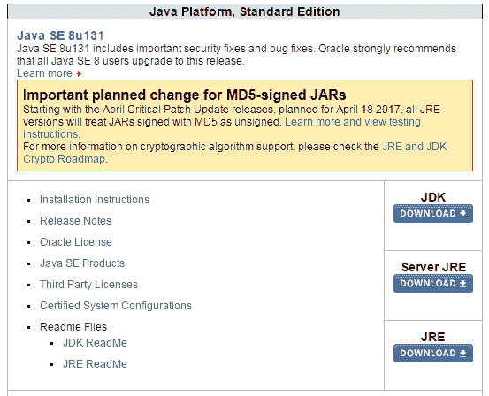
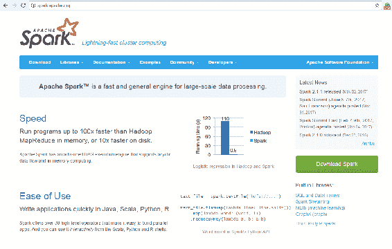
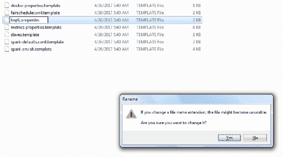
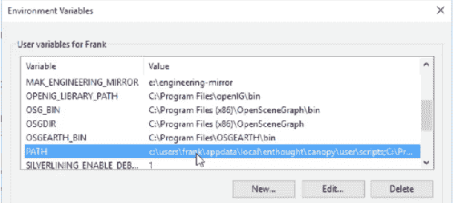

# Apache Spark-大数据机器学习

到目前为止，在本书中，我们已经讨论了很多可以在数据科学职业中使用的常规数据挖掘和机器学习技术，但是它们都已经在您的桌面上运行了。 因此，您只能使用 Python 和 Scikit-learn 之类的技术来运行一台计算机可以处理的尽可能多的数据。

现在，每个人都在谈论大数据，而您可能正在为一家实际上有大数据要处理的公司工作。 大数据意味着您无法实际控制所有内容，也无法仅在一个系统上实际处理所有内容。 您实际上需要使用整个云（一组计算资源）的资源来对其进行计算。 这就是 Apache Spark 的用武之地。ApacheSpark 是一个非常强大的工具，用于管理大数据并在大型数据集上进行机器学习。 在本章结束时，您将对以下主题有深入的了解：

*   安装和使用 Spark
*   **弹性分布式数据集**（**RDD**）
*   **MLlib**（**机器学习库**）
*   Spark 中的决策树
*   Spark 中的 K 均值聚类

# 安装 Spark

在本节中，我将为您设置使用 Apache Spark 的设置，并向您展示一些实际使用 Apache Spark 解决与本书过去使用单计算机解决的相同问题的示例。 我们需要做的第一件事是在您的计算机上设置 Spark。 因此，在接下来的两节中，我们将引导您完成该操作。 这是非常简单的东西，但是有一些陷阱。 因此，不要只跳过这些部分； 要使 Spark 成功运行，需要特别注意一些事项，尤其是在 Windows 系统上。 让我们在系统上进行 Apache Spark 的设置，这样您就可以真正开始使用它了。

现在，我们将仅在您自己的桌面上运行它。 但是，我们将在本章中编写的相同程序可以在实际的 Hadoop 集群上运行。 因此，您可以采用我们在 Spark 独立模式下在桌面上本地编写和运行的这些脚本，并从实际 Hadoop 集群的主节点实际运行它们，然后使其扩展到 Hadoop 集群的全部功能，并以这种方式处理海量数据集。 即使我们打算将事情设置为在您自己的计算机上本地运行，但请记住，这些相同的概念也可以扩展到在群集上运行。

# 在 Windows 上安装 Spark

在 Windows 上安装 Spark 涉及几个步骤，我们将在这里逐步指导您。 我只是假设您使用 Windows，因为大多数人在家中使用这本书。 稍后我们将讨论与其他操作系统打交道的内容。 如果您已经熟悉在计算机上安装东西和处理环境变量的知识，则可以选择以下小备忘单，然后再做。 如果您不太熟悉 Windows 的内部组件，我将在接下来的部分中一次逐步引导您。 以下是针对这些 Windows 专业人士的快速步骤：

1.  **安装 JDK**：您需要首先安装 JDK，这是 Java 开发工具包。 您可以直接访问 Sun 的网站并下载并安装（如果需要）。 我们需要 JDK，因为即使在本课程中我们将使用 Python 进行开发，也需要将其转换为 Scala 代码，这是 Spark 本身开发的。 而且，Scala 反过来又在 Java 解释器上运行。 因此，为了运行 Python 代码，您需要一个 Scala 系统，该系统将作为 Spark 的一部分默认安装。 另外，我们需要 Java 或更具体地说是 Java 的解释器来实际运行 Scala 代码。 就像技术层蛋糕。
2.  **安装 Python**：显然，您将需要 Python，但是如果您到此为止，则应该已经建立了 Python 环境，并希望使用 Enthought Canopy。 因此，我们可以跳过此步骤。
3.  **安装适用于 Hadoop 的 Spark 的预构建版本**：幸运的是，Apache 网站提供了可用的 Spark 的预构建版本，这些预构建版本可以立即使用为最新 Hadoop 版本进行预编译的版本。 您无需构建任何东西，只需将其下载到计算机上，然后将其放置在正确的位置即可，大部分时间都很好。
4.  **创建`conf/log4j.properties`文件**：我们需要处理一些配置事项。 我们要做的一件事就是调整警告级别，这样我们在工作时就不会收到很多警告垃圾邮件。 我们将逐步介绍如何做到这一点。 基本上，您需要重命名其中一个属性文件，然后在其中调整错误设置。
5.  **添加一个`SPARK_HOME`环境变量**：接下来，我们需要设置一些环境变量，以确保您可以实际从任何路径运行 Spark。 我们将添加一个指向您安装 Spark 的位置的`SPARK_HOME`环境变量，然后将`%SPARK_HOME%\bin`添加到您的系统路径中，以便在您运行 Spark Submit，PySpark 或所需的任何 Spark 命令时，Windows 会知道在哪里找到它。
6.  **设置一个`HADOOP_HOME`变量**：在 Windows 上，我们还需要做一件事，我们还需要设置一个`HADOOP_HOME`变量，因为它将期望找到一点点 Hadoop，即使您不在独立系统上使用 Hadoop。
7.  **安装`winutils.exe`**：最后，我们需要安装一个名为`winutils.exe`的文件。 本书的资源中有指向`winutils.exe`的链接，因此您可以在那里找到它。

如果您想详细了解这些步骤，可以参考后面的章节。

# 在其他操作系统上安装 Spark

关于在其他操作系统上安装 Spark 的快速说明：相同的步骤基本上也将适用于它们。 主要区别在于您如何在系统上设置环境变量，方式是每次登录时都会自动应用它们。这会因操作系统而异。 macOS 的功能与 Linux 的各种功能有所不同，因此您至少必须对使用 Unix 终端命令提示符以及如何操纵您的环境有所了解。 但是，大多数从事开发工作的 macOS 或 Linux 用户已经掌握了这些基础知识。 当然，如果您不在 Windows 上，则不需要`winutils.exe`。 因此，这些是在不同操作系统上安装的主要区别。

# 安装 Java 开发套件

要安装 Java 开发工具包，请返回浏览器，打开一个新标签，然后仅搜索`jdk`（Java 开发工具包的缩写）。 这将带您到 Oracle 站点，从该站点可以下载 Java：


在 Oracle 网站上，单击`JDK DOWNLOAD`。 现在，单击“接受许可协议”，然后可以为您的操作系统选择下载选项：



对我来说，这将是 Windows 64 位，等待 198 MB 的好消息下载：


下载完成后，找到安装程序并开始运行。 请注意，我们不能仅在此处接受 Windows 安装程序中的默认设置。 因此，这是 Windows 专用的解决方法，但在撰写本书时，Spark 的当前版本为 2.1.1，事实证明 Windows 上的 Java 上的 Spark 2.1.1 存在问题。 问题是，如果您已经将 Java 安装到其中有空格的路径中，则它不起作用，因此我们需要确保将 Java 安装到其中没有空格的路径中。 这意味着即使您已经安装了 Java，也无法跳过此步骤，因此，让我向您展示如何执行此操作。 在安装程序上，单击“下一步”，您将看到，如以下屏幕所示，无论版本是什么，它都希望默认安装到`C:\Program Files\Java\jdk`路径：


`Program Files`路径中的空格将引起麻烦，因此让我们单击“更改...”按钮并安装到`c:\jdk`，这是一个很好的简单路径，易于记住，并且其中没有空格：


现在，它还希望安装 Java 运行时环境，因此为了安全起见，我还将其安装到没有空格的路径中。

在 JDK 安装的第二步，我们应该在屏幕上显示以下内容：


我还将更改该目标文件夹，为此我们将创建一个名为`C:\jre`的新文件夹：


好的，安装成功。 呼！

现在，您需要记住我们安装 JDK 的路径，在我们的例子中是`C:\jdk`。 我们还有更多步骤可去。 接下来，我们需要安装 Spark 本身。

# 安装 Spark

让我们回到这里的新浏览器选项卡，转到[这个页面](http://spark.apache.org)，然后单击`Download Spark`按钮：



现在，我们在本书中使用了 Spark 2.1.1，但是 2.0 以后的任何东西都可以正常工作。


确保您获得了预构建的版本，然后选择“直接下载”选项，以便所有这些默认设置都可以正常使用。 继续并单击说明 4 旁边的链接以下载该软件包。

现在，它下载了您可能不熟悉的 **TGZ**（GZip 中的 Tar）。 老实说，Windows 是 Spark 的事后想法，因为在 Windows 上，您将没有内置的实用程序来实际解压缩 TGZ 文件。 这意味着，如果您还没有一个，则可能需要安装它。 我使用的一个称为 WinRAR，您可以从[这个页面](http://www.rarlab.com)中进行选择。 如果需要，请转到“下载”页面，然后下载 32 位或 64 位 WinRAR 的安装程序，具体取决于您的操作系统。 正常安装 WinRAR，这将允许您在 Windows 上实际解压缩 TGZ 文件：


因此，让我们继续解压缩 TGZ 文件。 我将打开我的`Downloads`文件夹以找到我们下载的 Spark 存档，然后继续右键单击该存档并将其解压缩到我选择的文件夹中-我现在将它放置在我的`Downloads`文件夹中。 再次，WinRAR 现在为我执行此操作：


因此，我现在应该在与该软件包关联的`Downloads`文件夹中有一个文件夹。 让我们打开它，其中就有 Spark 本身。 您应该看到类似如下所示的文件夹内容。 因此，您需要将其安装在可以记住的地方：


您显然不想将其保留在`Downloads`文件夹中，所以让我们继续在此处打开一个新的文件浏览器窗口。 我转到`C`驱动器并创建一个新文件夹，让我们将其命名为`spark`。 因此，我的 Spark 安装将在`C:\spark`中运行。 同样，很容易记住。 打开该文件夹。 现在，我回到下载的`spark`文件夹，并使用`Ctrl + A`选择 Spark 发行版中的所有内容，`Ctrl + C`复制它，然后返回`C:\spark`，我要放置在其中，然后`Ctrl + V`粘贴到：


记住要粘贴`spark`文件夹的内容，而不是`spark`文件夹本身很重要。 因此，我现在应该是带有`spark`文件夹的`C`驱动器，其中包含 Spark 发行版中的所有文件和文件夹。

好了，我们还需要配置一些东西。 因此，当我们进入`C:\spark`文件夹时，让我们打开`conf`文件夹，为确保我们不会被日志消息所淹没，我们将在此处更改日志记录级别设置。 为此，请右键单击`log4j.properties.template`文件，然后选择“重命名”：


删除文件名的`.template`部分，使其成为实际的`log4j.properties`文件。 Spark 将使用此配置日志记录：



现在，在某种文本编辑器中打开此文件。 在 Windows 上，您可能需要右键单击那里，然后选择“打开方式”，然后选择“写字板”。 在文件中，找到`log4j.rootCategory=INFO`：


让我们将其更改为`log4j.rootCategory=ERROR`，这将消除我们运行内容时打印出的所有日志垃圾邮件的混乱情况。 保存文件，然后退出编辑器。

到目前为止，我们已经安装了 Python，Java 和 Spark。 现在，我们下一步要做的是安装一些东西，使您的 PC 误以为 Hadoop 存在，而此步骤仅在 Windows 上才是必需的。 因此，如果您使用的是 Mac 或 Linux，则可以跳过此步骤。

我有一个小文件可以解决问题。 让我们转到[这个页面](http://media.sundog-soft.com/winutils.exe)。 下载`winutils.exe`将为您提供可执行文件的一小段副本，可用于诱使 Spark 认为您确实拥有 Hadoop：


现在，由于我们要在桌面上本地运行脚本，所以这没什么大不了的，我们不需要真正安装 Hadoop。 这只是绕过了另一个在 Windows 上运行 Spark 的怪癖。 因此，现在我们有了它，让我们在`Downloads`文件夹中找到它，`Ctrl + C`复制它，然后转到`C`驱动器并创建一个位置来放置：


因此，再次在根`C`驱动器中创建一个新文件夹，我们将其命名为`winutils`：


现在，打开此`winutils`文件夹并在其中创建一个`bin`文件夹：


现在，在此`bin`文件夹中，我希望您粘贴我们下载的`winutils.exe`文件。 因此，您应该先安装`C:\winutils\bin`，然后再安装`winutils.exe`：


仅在某些系统上才需要执行下一步，但是为了安全起见，请在 Windows 上打开“命令提示符”。 您可以执行以下操作：转到“开始”菜单，然后转到“Windows 系统”，然后单击“命令提示符”。 在这里，我希望您键入`cd c:\winutils\bin`，这是我们粘贴`winutils.exe`文件的位置。 现在，如果您输入`dir`，那么您应该在那里看到该文件。 现在输入`winutils.exe chmod 777 \tmp\hive`。 这只是确保成功成功运行 Spark 所需的所有文件权限都到位，没有任何错误。 完成该步骤后，您可以关闭命令提示符。 哇，信不信由你，我们快完成了。

现在，我们需要设置一些环境变量以使事情正常进行。 我将向您展示如何在 Windows 上执行此操作。 在 Windows 10 上，您需要打开“开始”菜单并转到“Windows 系统| Windows”。 控制面板打开控制面板：


在控制面板中，单击系统和安全性：


然后，单击系统：


然后从左侧列表中单击高级系统设置：


在这里，单击环境变量...：


我们将获得以下选项：


现在，这是一种非常特定于 Windows 的设置环境变量的方法。 在其他操作系统上，您将使用不同的进程，因此您必须查看如何在它们上安装 Spark。 在这里，我们将设置一些新的用户变量。 单击第一个`New ...`按钮以获取新的用户变量，并将其命名为`SPARK_HOME`，如下所示，全部为大写。 这将指向我们安装 Spark 的位置，对我们来说它是`c:\spark`，所以键入它作为变量值，然后单击 OK：


我们还需要设置`JAVA_HOME`，因此再次单击`New ...`并在`JAVA_HOME`中输入变量名称。 我们需要指出 Java 的安装位置，对我们来说是`c:\jdk`：


我们还需要设置`HADOOP_HOME`，这就是我们安装`winutils`软件包的位置，因此我们将其指向`c:\winutils`：


到目前为止，一切都很好。 我们需要做的最后一件事是修改路径。 您应该在此处具有`PATH`环境变量：



单击`PATH`环境变量，然后单击“编辑...”，然后添加一个新路径。 这将是`%SPARK_HOME%\bin`，我要添加另一个`%JAVA_HOME%\bin`：


基本上，这使 Spark 的所有二进制可执行文件都可用于 Windows，无论您在何处运行它。 单击此菜单上的前两个菜单上的确定。 我们终于完成了一切。

# Spark 介绍

让我们从 Apache Spark 的高级概述开始，看看它的全部含义，它的优点以及它的工作方式。

什么是星火？ 好吧，如果您访问 Spark 网站，他们会为您提供一个非常高级的手动答案，即“用于大规模数据处理的快速通用引擎”。 它切成薄片，切成小方块，洗衣服。 好吧，不是真的。 但这是一个用于编写可以处理大量数据的作业或脚本的框架，并且可以为您在整个计算集群中分配该处理。 基本上，Spark 的工作原理是让您将数据加载到称为弹性分布式数据存储（RDD）的这些大对象中。 它可以根据这些 RDD 自动执行转换和创建动作的操作，您可以将其视为大型数据帧。

它的优点在于，如果有可用的计算机，Spark 会自动并以最佳方式在整个计算机群集中分散该处理过程。 您不再受限于在一台计算机或一台计算机的内存上可以执行的操作。 实际上，您可以将其扩展到机器集群可用的所有处理能力和内存，并且在当今时代，计算非常便宜。 实际上，您可以通过 Amazon 的 Elastic MapReduce 服务之类的工具在群集上租用时间，而仅花几美元就可以在整个计算机群集上租用一些时间，并执行您无法在自己的台式机上运行的工作。

# 可扩展

Spark 如何可扩展？ 好吧，让我们在这里更详细地说明所有工作原理。


它的工作方式是，编写一个驱动程序，它只是一个小脚本，看起来和其他 Python 脚本一样，并且使用 Spark 库实际编写脚本。 在该库中，您定义了所谓的 Spark 上下文，它是您在 Spark 中进行开发时在其中工作的根对象。

从那里开始，Spark 框架将接管并为您分发事务。 因此，如果您在自己的计算机上以独立模式运行，就像我们在接下来的部分中将要做的那样，那么显然，所有这些都将保留在您的计算机上。 但是，如果您在集群管理器上运行，Spark 可以找出并自动利用它。 Spark 实际上具有自己的内置集群管理器，您甚至可以在没有安装 Hadoop 的情况下单独使用它，但是如果您确实有一个 Hadoop 集群可用，它也可以使用它。

Hadoop 不仅限于 MapReduce； 实际上有一个称为 YARN 的 Hadoop 组件将 Hadoop 的整个集群管理部分分离出来。 Spark 可以与 YARN 交互以实际使用它来在该 Hadoop 集群可用的资源之间最佳地分配处理组件。

在集群中，您可能正在运行单个执行程序任务。 它们可能在不同的计算机上运行，​​或者可能在同一计算机的不同内核上运行。 他们每个人都有自己的缓存和各自运行的任务。 驱动程序，Spark Context 和群集管理器一起工作以协调所有这些工作并将最终结果返回给您。

这样做的好处是，您要做的就是编写初始的小脚本（驱动程序），该程序使用 Spark 上下文在较高级别上描述您要对该数据进行的处理。 Spark 与您正在使用的集群管理器一起工作，找出了如何进行分发和分发的方法，因此您不必担心所有这些细节。 好吧，如果它不起作用，显然，您可能必须进行一些故障排除，才能确定您是否有足够的资源来处理手头的任务，但是，从理论上讲，这只是魔术。

# 它很快

Spark 有什么大不了的？ 我的意思是，类似 MapReduce 的类似技术已经存在了很长时间。 不过，Spark 速度很快，在网站上，他们声称“在内存中运行作业时，Spark 的速度比 MapReduce 快 100 倍，在磁盘上快 10 倍”。 当然，这里的关键词是“最多”，您的里程可能会有所不同。 我认为我从未见过比 MapReduce 运行速度快得多的东西。 实际上，一些精心设计的 MapReduce 代码仍然可以提高效率。 但我会说，Spark 确实使许多常见操作变得更加容易。 MapReduce 迫使您将内容真正分解为映射器和简化器，而 Spark 则更高一些。 您不必总是花太多的精力去做 Spark 正确的事情。

部分原因导致 Spark 如此之快的另一个原因。 它具有 DAG 引擎，有向无环图。 哇，那是另一个花哨的词。 这是什么意思？ Spark 的工作方式是，编写一个描述如何处理数据的脚本，并且您可能具有一个 RDD，该 RDD 基本类似于数据框架。 您可以对其进行某种转换，或对其进行某种操作。 但是，除非您实际对该数据执行操作，否则实际上不会发生任何事情。 此时发生的事情是，Spark 会说：“嗯，好的。所以，这是您要在此数据上得到的最终结果。为了达到这一点，我还需要做其他哪些其他事情，以及达到此目的的最佳方法是什么？ 制定实现这一目标的策略？” 因此，在幕后，它将找出拆分处理并分发信息以获得所需最终结果的最佳方法。 因此，这里的关键是，Spark 等待直到您告诉它实际产生结果，然后才真正知道如何产生该结果。 因此，那里的想法很酷，这是提高效率的关键。

# 还年轻

Spark 是一项非常热门的技术，并且相对来说还很年轻，因此它仍在不断涌现并迅速变化，但是很多大人们正在使用它。 例如，亚马逊声称他们正在使用它，eBay，NASA 的喷气推进实验室，Groupon，TripAdvisor，Yahoo 以及许多其他许多公司也使用了它。 我敢肯定，有很多公司都在使用它，但如果您转到 [Spark Apache Wiki 页面](http://spark.apache.org/powered-by.html) 。

实际上，您可以找到一个列表，其中列出了使用 Spark 解决实际数据问题的知名大公司。 如果您担心自己正在进入最前沿，请不要担心，您与很多非常大的人在一起，他们在生产中使用 Spark 解决实际问题。 在这一点上，它是相当稳定的东西。

# 不难

这也不难。 您可以选择使用 Python，Java 或 Scala 进行编程，它们都基于我之前所描述的相同概念构建，即，弹性分布式数据集，简称 RDD。 我们将在本章的后续部分中对此进行更详细的讨论。

# Spark 的组成

实际上，Spark 具有许多不同的组件。 因此，有一个 Spark Core 可以让您仅使用 Spark Core 函数就可以完成您可以梦想的任何事情，但是在 Spark 之上构建的其他这些功能也很有用。


*   **Spark Streaming**：Spark Streaming 是一个库，可让您实际实时处理数据。 数据可以连续不断地从服务器上流入服务器，例如，Spark Streaming 可以帮助您永久地实时处理这些数据。
*   **Spark SQL**：这实际上使您可以将数据视为 SQL 数据库，并在其上实际执行 SQL 查询，如果您已经熟悉 SQL，这将很酷。
*   **MLlib**：这是本节中要重点介绍的内容。 它实际上是一个机器学习库，可让您执行通用的机器学习算法，而 Spark 则在后台运行，以在整个集群中实际分配该处理。 您可以在比其他更大的数据集上执行机器学习。
*   **GraphX**：这不是用于制作漂亮的图表。 它是指网络理论意义上的图形。 考虑一下社交网络； 那是一个图的例子。 GraphX 仅具有一些功能，可让您分析信息图的属性。

# Python 与 Scala for Spark

当我向人们介绍 Apache Spark 时，有时确实会有些关于使用 Python 的错误，但是有一种让我疯狂的方法。 确实，很多人在编写 Spark 代码时都会使用 Scala，因为这是 Spark 本身开发的。 因此，通过迫使 Spark 将 Python 代码转换为 Scala，然后在一天结束时转换为 Java 解释器命令，会产生一些开销。

但是，Python 容易得多，并且您不需要编译任何东西。 管理依赖关系也容易得多。 您可以真正地将时间集中在算法和您正在做的事情上，而不是真正地构建，运行，编译以及所有这些废话。 另外，显然，到目前为止，这本书一直专注于 Python，在这些讲座中，继续使用我们所学的知识并坚持使用 Python 是有意义的。 以下是这两种语言的优缺点的简要摘要：

| **Python** | **Scala** |
| --- | --- |
| 无需编译，管理依赖项等。 | Scala 可能是 Spark 更受欢迎的选择 |
| 较少的编码开销 | Spark 是在 Scala 中构建的，因此 Scala 中的编码是 Spark “原生”的。 |
| 您已经知道 Python | |
| 让我们专注于概念而非新语言 | |

但是，我要说的是，如果您要在现实世界中进行一些 Spark 编程，那么人们很有可能会使用 Scala。 不过，不必太担心它，因为在 Spark 中，Python 和 Scala 代码最终看起来非常相似，因为它们都围绕相同的 RDD 概念。 语法略有不同，但没有太大不同。 如果您能弄清楚如何使用 Python 执行 Spark，那么学习在 Scala 中使用它的步伐并不是很大。 这是两种语言的相同代码的快速示例：


所以，这就是 Spark 本身的基本概念，为什么这么大的事情，以及它如何强大到可以让您在非常大的数据集或任何算法上运行机器学习算法。 现在让我们更详细地讨论它是如何做到的，以及弹性分布式数据集的核心概念。

# Spark 和弹性分布式数据集（RDD）

让我们更深入地了解 Spark 的工作方式。 我们将讨论称为 RDD 的弹性分布式数据集。 这是您在 Spark 中编程时使用的核心，我们将提供一些代码片段来尝试使其成为现实。 我们将在这里为您提供 Apache Spark 速成班。 除了我们在接下来的几节中将要介绍的内容之外，它还涉及很多其他内容，但是我只是向您提供一些基本知识，您需要它们才能真正理解这些示例中发生的事情，并希望可以开始并指向正确的方向。

如上所述，Spark 的最基本部分称为弹性分布式数据集（RDD），这将是您用来实际加载和转换并从尝试处理的数据中获取所需答案的对象。 了解这是非常重要的事情。 RDD 中的最后一个字母代表数据集，而到了最后，一切都结束了。 它只是一堆信息行，可以包含几乎所有内容。 但是关键是 R 和第一个 D。

*   **弹性**：这是有弹性的，因为 Spark 可以确保如果您正在集群上运行此服务器，并且其中一个集群发生故障，它可以自动从中恢复并重试。 现在，请注意，这种恢复力到目前为止还没有达到。 如果您没有足够的资源来尝试运行该作业，则该作业仍然会失败，因此您必须向其添加更多资源。 它可以从中恢复很多东西。 重试给定任务的次数有限制。 但是，它确实尽最大努力来确保面对不稳定的群集或不稳定的网络，它仍将继续尽最大的努力来完成任务。
*   **分布式**：显然，它是分布式的。 使用 Spark 的全部目的是可以将其用于大数据问题，在此您可以实际在整个 CPU 和计算机集群的内存能力之间分配处理。 它可以水平分布，因此您可以根据需要将任意数量的计算机扔给给定问题。 问题越大，计算机越多； 在那里您可以做什么实际上没有上限。

# `SparkContext`对象

您总是通过获取一个`SparkContext`对象来启动 Spark 脚本，这是体现 Spark 勇气的对象。 它是要给您要处理的 RDD 的原因，因此它是生成您在处理中使用的对象的原因。

您知道，当您实际编写 Spark 程序时，实际上并没有考虑太多`SparkContext`，但这是在后台运行它们的基础。 如果您在 Spark 外壳中以交互方式运行，则它已经具有一个`sc`对象，可用于创建 RDD。 但是，在独立脚本中，您将必须显式创建该`SparkContext`，并且必须注意所使用的参数，因为您实际上可以告诉 Spark 上下文如何分配它们。 我应该利用我拥有的每个核心吗？ 我应该在群集上运行还是在本地计算机上独立运行？ 因此，在这里可以设置 Spark 运行方式的基本设置。

# 创建 RDD

让我们看一下实际创建 RDD 的一些小代码片段，我认为所有这些都将变得更加有意义。

# 使用 Python 列表创建 RDD

以下是一个非常简单的示例：

```py
nums = parallelize([1, 2, 3, 4]) 

```

如果我只想从普通的旧 Python 列表中创建 RDD，则可以调用 Spark 中的`parallelize()`函数。 这样会将一系列东西（在这种情况下，只是数字 1、2、3、4）转换为称为`nums`的 RDD 对象。

这只是从硬编码的内容列表中创建 RDD 的最简单情况。 这个清单可能来自任何地方。 它也不必进行硬编码，但是这种做法破坏了大数据的目的。 我的意思是，如果必须先将整个数据集加载到内存中，然后才能从中创建 RDD，那有什么意义呢？

# 从文本文件加载 RDD

我还可以从文本文件加载 RDD，该文件可以在任何地方。

```py
sc.textFile("file:///c:/users/frank/gobs-o-text.txt")  

```

在此示例中，我有一个巨大的文本文件，它是整个百科全书之类的东西。 我正在从本地磁盘读取该文件，但是如果我想将此文件托管在分布式 AmazonS3 存储桶中，也可以使用 s3n；如果我要引用存储在分布式 HDFS 集群中的数据（则代表 hdfs），也可以使用 hdfs Hadoop 分布式文件系统（如果您不熟悉 HDFS）。 当您处理大数据并使用 Hadoop 集群时，通常就是您的数据所在的地方。

该行代码实际上会将该文本文件的每一行都转换为 RDD 中自己的行。 因此，您可以将 RDD 视为行的数据库，并且在此示例中，它将把我的文本文件加载到 RDD 中，其中每一行每一行都包含一行文本。 然后，我可以在该 RDD 中进行进一步处理，以解析或分解该数据中的分隔符。 但这就是我的出发点。

还记得本书前面提到的 ETL 和 ELT 吗？ 这是一个很好的示例，说明您实际上可能在哪里将原始数据加载到系统中，并在用于查询数据的系统本身上进行转换。 您可以获取未经处理的原始文本文件，并使用 Spark 的功能将其实际转换为结构化数据。

它还可以与 Hive 之类的内容进行通信，因此，如果您在公司中建立了现有的 Hive 数据库，则可以基于 Spark 上下文创建 Hive 上下文。 多么酷啊？ 看一下下面的示例代码：

```py
hiveCtx = HiveContext(sc)  rows = hiveCtx.sql("SELECT name, age FROM users")  

```

您实际上可以创建一个 RDD（在本例中称为行），该 RDD 是通过在 Hive 数据库上实际执行 SQL 查询而生成的。

# 创建 RDD 的更多方法

还有更多创建 RDD 的方法。 您可以从 JDBC 连接创建它们。 基本上，任何支持 JDBC 的数据库都可以与 Spark 对话并从中创建 RDD。 Cassandra，HBase，Elasticsearch 以及 JSON 格式，CSV 格式的文件，序列文件目标文件以及一堆其他压缩文件（如 ORC）都可以用来创建 RDD。 我不想深入了解所有这些细节，您可以阅读一本书，并在需要时查找它们，但要点是，无论数据来自何处，无论从何处创建 RDD，在本地文件系统或分布式数据存储上，都非常容易。

同样，RDD 只是一种加载和维护大量数据并同时跟踪所有数据的方法。 但是，从概念上讲，在脚本中，RDD 只是一个包含大量数据的对象。 您无需考虑规模，因为 Spark 为您做到了。

# RDD 操作

现在，一旦拥有 RDD，便可以执行两种不同类型的事情，可以进行转换，也可以进行操作。

# 转变

让我们先谈谈转换。 转换正是它们的本质。 这是一种采用 RDD 并将 RDD 中的每一行转换为基于您提供的函数的新值的方法。 让我们看一下其中的一些功能：

*   `map()`和`flatmap()`：`map`和`flatmap`是您最常看到的功能。 两者都将具有您可以梦想的任何功能，将 RDD 的一行作为输入，并且将输出转换后的行。 例如，您可能会从 CSV 文件中获取原始输入，并且您的`map`操作可能会将该输入获取并基于逗号分隔符将其分解为各个字段，然后返回 Python 列表，该列表以更结构化的格式包含该数据，您可以对其进行进一步处理。 您可以将映射操作链接在一起，因此一个`map`的输出可能最终会创建一个新的 RDD，然后对其进行另一次转换，依此类推。 再次，关键是，Spark 可以将这些转换分布在整个群集中，因此它可能会包含 RDD 的一部分并在一台机器上进行转换，而 RDD 的另一部分又会在另一台计算机上进行转换。

就像我说的，`map`和`flatmap`是您将看到的最常见的转换。 唯一的区别是`map`仅允许您为每一行输出一个值，而`flatmap`则允许您实际为给定行输出多个新行。 因此，实际上您可以创建比使用`flatmap.`时更大的 RDD 或更小的 RDD。

*   `filter()`：`filter`可用于以下情况：仅创建一个布尔函数，该布尔函数表示“是否应保留此行？是或否”。
*   `different()`：`distinct`是一种不太常用的转换，仅会返回 RDD 中的不同值。
*   `sample()`：此函数可让您从 RDD 中抽取随机样本
*   `union()`，`intersection()`，`subtract()`和`cartesian()`：您可以执行诸如交集，并集，差集甚至生成 RDD 中存在的每个笛卡尔组合的交集操作。

# 使用`map()`

这是一个有关如何在工作中使用`map`函数的小例子：

```py
rdd = sc.parallelize([1, 2, 3, 4]) 
rdd.map(lambda x: x*x) 

```

假设我只是从列表 1、2、3、4 中创建了一个 RDD，然后可以使用`x`的 Lambda 函数调用`rdd.map()`，该函数在每一行（即该 RDD 的每个值）中都称为`x`， 然后将函数`x`乘以`x`平方。 如果然后我要收集该 RDD 的输出，它将是 1、4、9 和 16，因为它将采用该 RDD 的每个单独的条目并将其平方，然后将其放入新的 RDD 中。

如果您不记得什么是 Lambda 函数，我们在本书的前面部分就已经讨论过了，但是作为回顾，Lambda 函数只是在线定义函数的简写。 因此`rdd.map(lambda x: x*x)`与单独的函数`def squareIt(x): return x*x`完全相同，并且说`rdd.map(squareIt)`。

这只是您要作为转换传递的非常简单的函数的简写。 它消除了实际将其声明为自己的单独命名函数的需要。 这就是函数编程的全部思想。 因此，可以说您现在已经了解函数式编程！ 但实际上，这只是用于将内联函数定义为`map()`函数的参数或任何相关转换的简写形式。

# 动作

当您想实际获得结果时，还可以对 RDD 执行操作。 以下是一些您可以执行的操作示例：

*   `collect()`：您可以在 RDD 上调用`collect()`，这将带给您一个普通的旧 Python 对象，您可以对其进行遍历并打印出结果，或者将其保存到文件中，或者执行任何操作。
*   `count()`：您也可以调用`count()`，这将迫使它此时实际上计算 RDD 中的条目数。
*   `countByValue()`：此功能将为您提供该 RDD 中每个唯一值出现多少次的细分。
*   `take()`：您也可以使用`take()`从 RDD 中采样，这将从 RDD 中随机抽取条目。
*   `top()`：`top()`将为您提供该 RDD 中的前几项，如果您只是想了解其中的内容以进行调试的话。
*   `reduce()`：`reduce()`是更强大的操作，它实际上使您可以将相同的公用键值的值组合在一起。 您还可以在键值数据的上下文中使用 RDD。 `reduce()`功能可让您定义一种将给定键的所有值组合在一起的方式。 它的实质与 MapReduce 非常相似。 `reduce()`基本上与 MapReduce 中的`reducer()`类似，并且`map()`与`mapper()`类似。 因此，实际上很容易进行 MapReduce 作业，并使用这些功能将其转换为 Spark。

还要记住，在您调用动作之前，Spark 实际上不会发生任何事情。 调用了其中一种操作方法后，Spark 便会退出并使用有向无环图进行操作，并实际上计算出获取所需答案的最佳方法。 但是请记住，在该操作发生之前，什么都不会发生。 因此，有时在编写 Spark 脚本时可能会绊倒您，因为您可能在其中有一个打印语句，并且可能希望得到一个答案，但是直到实际执行操作时它才会真正出现。

简而言之就是 Spark 101。 这些是 Spark 编程所需的基础。 基本上，什么是 RDD，以及您可以对 RDD 执行哪些操作。 一旦掌握了这些概念，就可以编写一些 Spark 代码。 现在让我们改变立场，谈谈 MLlib，以及 Spark 中的一些特定功能，这些功能使您可以使用 Spark 进行机器学习算法。

# MLlib 简介

幸运的是，当您进行机器学习时，您不必在 Spark 中做困难的事情。 它具有一个称为 MLlib 的内置组件，该组件位于 Spark Core 的顶部，这使使用大量数据集执行复杂的机器学习算法变得非常容易，并将该处理过程分布在整个计算机集群中。 因此，非常令人兴奋的东西。 让我们进一步了解它可以做什么。

# 某些 MLlib 功能

那么，MLlib 可以做什么？ 好吧，其中之一就是特征提取。

您可以按比例做的一件事是术语频率和逆文档频率，这对于例如创建搜索索引很有用。 实际上，本章后面将通过一个示例。 同样，关键是它可以使用海量数据集在整个集群中做到这一点，因此您可以潜在地为网络创建自己的搜索引擎。 它还提供基本的统计功能，卡方检验，Pearson 或 Spearman 相关性，以及一些更简单的内容，例如最小值，最大值，均值和方差。 这些本身并不十分令人兴奋，但令人兴奋的是，您实际上可以跨庞大的数据集计算方差，均值或其他任何东西或相关分数，并且实际上会将数据集分解为多个块，并在必要时在整个群集中运行。

因此，即使其中的一些操作不是很有趣，但有趣的是它可以运行的规模。 它还可以支持线性回归和逻辑回归等功能，因此，如果您需要将函数拟合到大量数据并将其用于预测，则也可以这样做。 它还支持支持向量机。 我们将在这里介绍一些更高级的算法，一些更高级的算法，并且它们也可以使用 Spark 的 MLlib 扩展到海量数据集。 MLlib 中内置了一个朴素的贝叶斯分类器，因此，还记得我们在本书前面构建的垃圾邮件分类器吗？ 实际上，您可以使用 Spark 在整个电子邮件系统中执行此操作，然后将其扩展到所需的范围。

决策树，这是我在机器学习中最喜欢的东西之一，也得到了 Spark 的支持，我们实际上将在本章的后面有一个示例。 我们还将研究 K 均值聚类，您可以使用 K 均值和带有 Spark 和 MLlib 的海量数据集进行集群。 甚至主成分分析和 **SVD**（**奇异值分解**）也可以通过 Spark 进行，我们也将提供一个示例。 最后，MLlib 内置了一个内置的推荐算法，称为最小二乘。 就我个人而言，它的结果有些复杂，就我的口味而言，它有点像一个黑匣子，但是我是一个推荐系统势利小人，所以带一点盐就可以了！

# 特殊 MLlib 数据类型

使用 MLlib 通常非常简单，只需调用一些库函数即可。 它确实引入了一些新的数据类型。 但是，您需要了解，其中之一就是向量。

# 向量数据类型

还记得本书前面提到的电影相似之处和电影推荐吗？ 向量的一个示例可能是给定用户评分的所有电影的列表。 向量有两种类型：稀疏和密集。 让我们看一个例子。 世界上有很多电影，无论用户是否实际观看，密集的向量实际上代表每个电影的数据。 例如，假设我有一个用户观看过《玩具总动员》，显然我会存储他们对玩具总动员的评分，但是如果他们不看电影《星球大战》，我实际上会存储一个事实，那就是《星球大战》没有数字。 因此，我们最终以密集的向量为所有这些丢失的数据点占用了空间。 稀疏向量仅存储存在的数据，因此不会在丢失的数据上浪费任何内存空间，好的。 因此，它是内部表示向量的一种更紧凑的形式，但是显然在处理时会引入一些复杂性。 因此，如果您知道向量中会有很多丢失的数据，那么这是节省内存的好方法。

# LabeledPoint 数据类型

还出现了`LabeledPoint`数据类型，这听起来就是这样，该点具有某种与之相关的标签，以人类可读的方式传达此数据的含义。

# 评分数据类型

最后，如果在 MLlib 中使用推荐，则会遇到`Rating`数据类型。 此数据类型可以接受代表 1-5 或 1-10 的等级（无论一个人可能拥有的星级），并使用该等级自动通知产品推荐。

因此，我认为您终于拥有了开始所需的一切，让我们深入研究一下实际的 MLlib 代码并运行它，然后它将变得更加有意义。

# 带有 MLlib 的 Spark 中的决策树

好吧，我们实际上使用 Spark 和 MLlib 库构建一些决策树，这是非常酷的事情。 无论您将本书的课程资料放在哪里，我都希望您现在转到该文件夹​​。 确保完全封闭 Canopy 或用于 Python 开发的任何环境，因为我想确保您是从此目录启动的，好吗？ 并找到`SparkDecisionTree`脚本，然后双击该脚本以打开 Canopy：


现在，到目前为止，我们一直在为代码使用 IPython 笔记本，但是您实际上不能将它们与 Spark 很好地结合使用。 使用 Spark 脚本，您需要将它们实际提交到 Spark 基础结构并以非常特殊的方式运行它们，我们将很快看到其工作原理。

# 探索决策树代码

因此，我们现在只看原始的 Python 脚本文件，而没有 IPython 笔记本内容的任何常规修饰。 让我们来看一下脚本中发生的事情。


我们将慢慢进行介绍，因为这是您在本书中看到的第一个 Spark 脚本。

首先，我们将从`pyspark.mllib`导入 Spark 的机器学习库中所需的位。

```py
from pyspark.mllib.regression import LabeledPoint 
from pyspark.mllib.tree import DecisionTree 

```

我们需要`LabeledPoint`类（这是`DecisionTree`类所需的数据类型），以及`DecisionTree`类本身，它们是从`mllib.tree`导入的。

接下来，您看到的几乎每个 Spark 脚本都将包含以下行，我们在其中导入`SparkConf`和`SparkContext`：

```py
from pyspark import SparkConf, SparkContext 

```

创建`SparkContext`对象是需要的，它是您在 Spark 中所做的所有操作的根。

最后，我们将从`numpy`导入数组库：

```py
from numpy import array 

```

是的，您仍然可以使用`NumPy`和`scikit-learn`以及在 Spark 脚本中使用的任何内容。 首先，您只需确保要在其上运行它的每台计算机上都安装了这些库。

如果您在集群上运行，则需要确保这些 Python 库已经以某种方式就位，并且还需要了解 Spark 不会使 Scikit-learn 方法变得不可思议，例如可以魔术地扩展。 您仍然可以在给定的`map`函数或类似的上下文中调用这些函数，但是它只会在该进程中的一台计算机上运行。 不要过于依赖这些东西，但是对于诸如管理数组之类的简单事情，这完全是一件好事。

# 创建`SparkContext`

现在，我们将首先设置`SparkContext`，并为其提供一个`SparkConf`配置。

```py
conf = SparkConf().setMaster("local").setAppName("SparkDecisionTree") 

```

这个配置对象说，我要将主节点设置为“`local`”，这意味着我只在自己的本地桌面上运行，实际上根本不在集群上运行， 只是要在一个过程中运行。 我还要给它一个应用程序名称“`SparkDecisionTree`”，您可以随便叫它什么，弗雷德，鲍勃，蒂姆，只要浮船就可以。 就像您稍后要在 Spark 控制台中查看它一样，它就是该工作的样子。

然后，我们将使用该配置创建`SparkContext`对象：

```py
sc = SparkContext(conf = conf) 

```

这为我们提供了可用于创建 RDD 的`sc`对象。

接下来，我们有很多功能：

```py
# Some functions that convert our CSV input data into numerical 
# features for each job candidate 
def binary(YN): 
    if (YN == 'Y'): 
        return 1 
    else: 
        return 0 

def mapEducation(degree): 
    if (degree == 'BS'): 
        return 1 
    elif (degree =='MS'): 
        return 2 
    elif (degree == 'PhD'): 
        return 3 
    else: 
        return 0 

# Convert a list of raw fields from our CSV file to a 
# LabeledPoint that MLLib can use. All data must be numerical... 
def createLabeledPoints(fields): 
    yearsExperience = int(fields[0]) 
    employed = binary(fields[1]) 
    previousEmployers = int(fields[2]) 
    educationLevel = mapEducation(fields[3]) 
    topTier = binary(fields[4]) 
    interned = binary(fields[5]) 
    hired = binary(fields[6]) 

    return LabeledPoint(hired, array([yearsExperience, employed, 
        previousEmployers, educationLevel, topTier, interned])) 

```

现在让我们简单介绍一下这些功能，稍后再返回。

# 导入和清理我们的数据

让我们转到在此脚本中实际执行的 Python 代码的第一位。


我们要做的第一件事是加载此`PastHires.csv`文件，这与我们在本书前面所做的决策树练习中使用的文件相同。

让我们暂停一下，以提醒自己该文件的内容。 如果您没记错的话，我们有很多应聘者的属性，而且我们有一个领域是否应聘这些人。 我们正在尝试做的是建立一个可以预测的决策树-考虑到这些属性，我们会雇用还是不雇用一个人？

现在，让我们快速浏览`PastHires.csv`，它将是一个 Excel 文件。


您可以看到 Excel 实际上将其导入到表中，但是如果您要查看原始文本，则会看到它由逗号分隔的值组成。

第一行是每列的实际标题，因此我们上面的内容是在先经验的年限，是否在职的候选人，以前的雇主人数，受教育程度，是否上了最好的学校，他们在学校期间是否有实习机会，最后是我们要预测的目标，他们是否最终获得了工作机会。 现在，我们需要将该信息读入 RDD，以便可以对其进行处理。

让我们回到我们的脚本：

```py
rawData = sc.textFile("e:/sundog-consult/udemy/datascience/PastHires.csv") 
header = rawData.first() 
rawData = rawData.filter(lambda x:x != header) 

```

我们需要做的第一件事是读入 CSV 数据，我们将丢弃第一行，因为请记住，这是我们的标头信息。 因此，这里有一些技巧。 我们首先从该文件中的每一行导入到原始数据 RDD 中，我可以随意调用它，但是我们将其命名为`sc.textFile`。 `SparkContext`具有`textFile`函数，该函数将获取文本文件并创建一个新的 RDD，其中，每个条目（RDD 的每一行）都由一行输入组成。

确保将文件的路径更改为实际安装该文件的位置，否则它将无法正常工作。

现在，我将使用`first`函数从该 RDD 中提取第一行，即第一行。 因此，现在标题 RDD 将包含一个条目，该条目仅是列标题的这一行。 现在，看看上面的代码中发生了什么，我在包含该 CSV 文件中所有信息的原始数据上使用`filter`，并且正在定义`filter`函数，该函数仅当该行不等于该初始标题行的内容时，将允许行通过。 我在这里所做的是，我已经获取了原始 CSV 文件，并通过仅允许与第一行不相等的行继续存在而删除了第一行，然后将其返回给`rawData` RDD 变量再次。 因此，我将使用`rawData`，过滤掉第一行，并创建一个仅包含数据本身的新`rawData`。 到目前为止和我在一起？ 没那么复杂。

现在，我们将使用`map`函数。 接下来，我们需要开始从此信息中构造出更多结构。 现在，我的 RDD 的每一行都只是一行文本，它是逗号分隔的文本，但是它仍然只是一个巨大的文本行，我想采用逗号分隔的值列表并将其实际拆分成单个文本字段。 归根结底，我希望将每个 RDD 从一行包含一堆用逗号分隔的信息的文本行转换为 Python 列表，该列表对我拥有的每列信息都有实际的单独字段。 因此，这就是 Lambda 函数的作用：

```py
csvData = rawData.map(lambda x: x.split(",")) 

```

它调用内置的 Python 函数`split`，该函数将接受一行输入，并将其分割为逗号字符，然后将其分成每个用逗号分隔的字段的列表。

这个`map`函数的输出是一个新的 RDD，称为`csvData`，我在其中传递了一个 Lambda 函数，该函数仅基于逗号将每一行拆分为多个字段。 而且，此时`csvData`是一个 RDD，它在每一行上包含一个列表，其中每个元素都是源数据中的一列。 现在，我们越来越近了。

事实证明，为了将决策树与 MLlib 一起使用，需要做两件事。 首先，输入必须采用`LabeledPoint`数据类型的形式，并且本质上必须全部为数字。 因此，我们需要将所有原始数据转换为 MLlib 实际可以使用的数据，这就是我们先前跳过的`createLabeledPoints`函数所做的。 我们将在一秒钟内解决这个问题，首先是它的调用：

```py
trainingData = csvData.map(createLabeledPoints) 

```

我们将在`csvData`上调用一个映射，并将其传递给`createLabeledPoints`函数，该函数将把每个输入行转换为更接近最终需求的内容。 因此，让我们看一下`createLabeledPoints`的作用：

```py
def createLabeledPoints(fields): 
    yearsExperience = int(fields[0]) 
    employed = binary(fields[1]) 
    previousEmployers = int(fields[2]) 
    educationLevel = mapEducation(fields[3]) 
    topTier = binary(fields[4]) 
    interned = binary(fields[5]) 
    hired = binary(fields[6]) 

    return LabeledPoint(hired, array([yearsExperience, employed, 
        previousEmployers, educationLevel, topTier, interned])) 

```

它包含一个字段列表，并且只是为了再次提醒您看起来是什么样子，让我们再次提取`.csv` Excel 文件：


因此，在这一点上，每个 RDD 条目都有一个字段，它是一个 Python 列表，其中第一个元素是经验的年限，第二个元素是所使用的，依此类推。 这里的问题是我们希望将这些列表转换为“标记点”，并且希望将所有内容转换为数值数据。 因此，所有这些是和否答案都需要转换为一和零。 这些经验水平需要从学位名称转换为某个数字序数值。 例如，也许我们将零值分配给没有学历，例如，一个可以表示 BS，两个可以表示 MS，而三个可以表示 PhD。 同样，所有这些是/否值都必须转换为零和一，因为到了最后，进入决策树的所有内容都必须是数字，这就是`createLabeledPoints`的作用。 现在，让我们回到代码并运行它：

```py
def createLabeledPoints(fields): 
    yearsExperience = int(fields[0]) 
    employed = binary(fields[1]) 
    previousEmployers = int(fields[2]) 
    educationLevel = mapEducation(fields[3]) 
    topTier = binary(fields[4]) 
    interned = binary(fields[5]) 
    hired = binary(fields[6]) 

    return LabeledPoint(hired, array([yearsExperience, employed, 
        previousEmployers, educationLevel, topTier, interned])) 

```

首先，它接受我们准备好将其转换为`LabeledPoints`的`StringFields`列表，其中标签是目标值-此人是否被雇用？ 0 或 1 后跟一个包含我们关心的所有其他字段的数组。 因此，这就是创建`DecisionTree MLlib`类可以使用的`LabeledPoint`的方式。 因此，在上面的代码中，您看到我们正在将多年的经验从字符串转换为整数值，对于所有的是否字段，我们都将其称为`binary`函数，该函数是我在顶部定义的代码，但我们尚未讨论：

```py
def binary(YN): 
    if (YN == 'Y'): 
        return 1 
    else: 
        return 0 

```

它所做的只是将字符`yes`转换为 1，否则返回 0。因此，Y 将变为 1，N 将变为 0。类似地，我有一个`mapEducation`函数：

```py
def mapEducation(degree): 
    if (degree == 'BS'): 
        return 1 
    elif (degree =='MS'): 
        return 2 
    elif (degree == 'PhD'): 
        return 3 
    else: 
        return 0 

```

正如我们前面所讨论的，这只是将不同类型的度转换为序数数值，其方式与是/否字段完全相同。

提醒一下，这是使我们通过这些功能运行的代码行：

```py
trainingData = csvData.map(createLabeledPoints) 

```

此时，在使用该`createLabeledPoints`函数映射了我们的 RDD 之后，我们现在有了一个`trainingData` RDD，而这正是 MLlib 想要构造决策树的原因。

# 创建测试候选人并建立我们的决策树

让我们创建一个可以使用的测试候选者，以便我们可以使用模型来实际预测是否会雇用新人。 我们要做的是创建一个候选测试，其中包含与 CSV 文件中每个字段相同的值数组：

```py
testCandidates = [ array([10, 1, 3, 1, 0, 0])] 

```

让我们快速将该代码与 Excel 文档进行比较，以便可以看到数组映射：


同样，我们需要将这些映射回它们的原始列表示形式，以便 10、1、3、1、0、0 表示 10 年的先前工作经验（当前受雇），三个以前的雇主（具有 BS 学士学位）， 最好的学校，没有做实习。 如果愿意，我们实际上可以创建一个完整的 RDD，其中包含所有候选人，但是我们现在只做一个。

接下来，我们将使用并行化将该列表转换为 RDD：

```py
testData = sc.parallelize(testCandidates) 

```

那里没有新东西。 好了，现在让魔术开始下一个代码块：

```py
model = DecisionTree.trainClassifier(trainingData, numClasses=2, 
                    categoricalFeaturesInfo={1:2, 3:4, 4:2, 5:2}, 
                    impurity='gini', maxDepth=5, maxBins=32) 

```

我们将调用`DecisionTree.trainClassifier`，这实际上是在构建决策树本身。 我们传入`trainingData`，它只是一个充满`LabeledPoint`数组`numClasses=2`的 RDD，因为基本上我们会做出一个是或否的预测，这个人是否会被录用 ？ 下一个参数称为`categoricalFeaturesInfo`，这是一个 Python 字典，它将字段映射到每个字段中的类别数。 因此，如果您对给定的领域有连续的范围（例如经验的年限），则根本不会在此处指定，但是对于本质上属于类别的领域（例如，他们拥有什么程度）， 例如，将`fieldID3`，映射到获得的学位，它有四种不同的可能性：没有学历，BS，MS 和 PhD。 对于所有的是否字段，我们将它们映射到 2 个可能的类别，是否或 0/1 是将它们转换为的类别。

继续进行`DecisionTree.trainClassifier`调用，我们将在测量熵时使用`'gini'`杂质度量。 我们的`maxDepth`为 5，这只是我们要走多远的上限，如果您愿意，可以更大。 最后，`maxBins`只是一种折衷计算费用的方法，因此，它至少需要至少是每个功能中具有类别的最大数量。 记住，在我们调用一个动作之前，什么都不会发生，所以我们将实际使用该模型对测试候选人进行预测。

我们使用`DecisionTree`模型，该模型包含根据测试训练数据进行训练的决策树，并告诉我们对测试数据进行预测：

```py
predictions = model.predict(testData) 
print ('Hire prediction:') 
results = predictions.collect() 
for result in results: 
     print (result) 

```

我们将返回一个预测列表，然后可以进行迭代。 因此，`predict`返回一个普通的旧 Python 对象，并且是`collect`可以执行的操作。 让我稍微改一下一下：`collect`将根据我们的预测返回一个 Python 对象，然后我们可以遍历该列表中的每个项目并打印预测的结果。

我们还可以使用`toDebugString`打印出决策树本身：

```py
print('Learned classification tree model:') 
print(model.toDebugString()) 

```

这实际上会打印出它在内部创建的决策树的一点表示，您可以自己动手执行。 所以，这也很酷。

# 运行脚本

好了，请花些时间，多看一点这个脚本，了解正在发生的事情，但是，如果您准备好了，那就继续并实际运行这个野兽吧。 因此，要做到这一点，您不仅可以直接从 Canopy 中运行它。 我们将转到“工具”菜单，打开一个 Canopy 命令提示符，这将打开一个 Windows 命令提示符，其中包含在 Canopy 中运行 Python 脚本所需的所有必要环境变量。 确保工作目录是您将所有课程资料安装到的目录。

我们需要做的就是调用`spark-submit`，所以这是一个脚本，您可以从 Python 运行 Spark 脚本，然后是脚本的名称`SparkDecisionTree.py`。 这就是我要做的。

```py
spark-submit SparkDecisionTree.py 

```

点击回车，它就会消失。 同样，如果我在集群上执行此操作，并相应地创建了`SparkConf`，则该代码实际上将分发到整个集群，但是，现在，我们仅在计算机上运行它。 完成后，您应该看到以下输出：


因此，在上面的图像中，您可以在上面放置的测试人员中看到，我们预测该人员将被聘用，而且我还打印了决策树本身，所以这很酷。 现在，让我们再次打开该 Excel 文档，以便将其与输出进行比较：


我们可以逐步了解它的含义。 因此，在输出决策树中，我们实际上以 4 个深度结束，有 9 个不同的节点，并且再次提醒我们，这些不同的字段与什么相关，读取方式如下：`If(feature 1 in 0)`，这意味着如果所雇用的人员为“否”，那么我们将下拉至功能 5。该列表基于零，因此 Excel 文档中的功能 5 为实习职位。 我们可以像这样穿过这棵树：这个人目前没有工作，没有实习，没有过往的工作经验，并且拥有学士学位，我们不会雇用这个人。 然后我们进入其他条款。 如果该人具有较高的学位，我们将根据我们对其进行过培训的数据来雇用他们。 因此，您可以算出这些不同的功能 ID 返回原始源数据的含义，请记住，您始终从 0 开始计数，并据此进行解释。 请注意，在它看到的可能类别的列表中，所有分类特征均以布尔值表示，而连续数据在数值上表示为小于或大于关系。

有了它，使用 Spark 和 MLlib 构建的实际决策树就可以正常工作并且有意义。 很棒的东西。

# Spark 中的 K 均值聚类

好吧，让我们看一下在 MLlib 中使用 Spark 的另一个示例，这一次我们将研究 K 均值聚类，就像我们对决策树所做的一样，我们将采用与使用决策树相同的示例 Scikit-learn，我们将改为在 Spark 中进行，因此它实际上可以扩展到海量数据集。 因此，再次，我确保将所有其他内容都排除在外，并且我将进入我的书中，并打开`SparkKMeans` Python 脚本，让我们研究发生了什么。


好了，再次，我们从一些样板开始。

```py
from pyspark.mllib.clustering import KMeans 
from numpy import array, random 
from math import sqrt 
from pyspark import SparkConf, SparkContext 
from sklearn.preprocessing import scale 

```

我们将从集群`MLlib`包中导入`KMeans`包，我们将从`numpy`中导入`array`和`random`，因为同样，我们可以自由使用您想要的任何东西，这是当天最后的 Python 脚本，并且`MLlib`需要使用`numpy`数组作为输入。 我们将要导入`sqrt`函数和通常的样板内容，我们需要`SparkConf`和`SparkContext`，几乎每次都需要从`pyspark`中引入。 我们还将从`scikit-learn`导入`scale`函数。 同样，只要确保将`scikit-learn`安装在要运行此作业的每台计算机上，就可以使用`scikit-learn`，并且不要以为`scikit-learn`会神奇地自我扩展，仅仅因为你在 Spark 上运行它。 但是，由于我仅将其用于缩放功能，因此可以。 好吧，让我们继续进行设置。

我将首先创建一个全局变量：

```py
 K=5 

```

在本示例中，我将使用 k 为 5 的 K 均值聚类，即五个不同的聚类。 然后，我将继续设置仅在我自己的桌面上运行的本地`SparkConf`：

```py
conf = SparkConf().setMaster("local").setAppName("SparkKMeans") 
sc = SparkContext(conf = conf) 

```

我将把应用程序的名称设置为`SparkKMeans`，并创建一个`SparkContext`对象，然后将其用于创建在本地计算机上运行的 RDD。 现在，我们将跳过`createClusteredData`函数，然后转到要运行的第一行代码。

```py
data = sc.parallelize(scale(createClusteredData(100, K)))  

```

1.  我们要做的第一件事是通过并行化我正在创建的一些虚假数据来创建 RDD，这就是`createClusteredData`函数的作用。 基本上，我要告诉您创建围绕 K 个质心聚类的 100 个数据点，这与我们在本书前面介绍 K 均值聚类时所看的代码几乎相同。 如果需要复习，请继续阅读该章。 基本上，我们要做的是创建一堆随机质心，通常我们会围绕这些质心分发年龄和收入数据。 因此，我们正在尝试根据人们的年龄和收入对他们进行聚类，并且我们正在构造一些数据点来实现此目的。 这将返回我们假数据的`numpy`数组。
2.  从`createClusteredData`返回该结果后，我将其命名为`scale`，这将确保我的年龄和收入处于可比的范围内。 现在，还记得我们研究过的那一部分，您必须记住有关数据标准化的内容吗？ 这是重要的示例之一，因此我们正在使用`scale`对该数据进行归一化，以便从 K 均值中获得良好的结果。
3.  最后，我们使用`parallelize`将数组的结果列表并行化为 RDD。 现在，我们的数据 RDD 包含我们所有的假数据。 我们要做的就是比我们的决策树更容易做，就是在训练数据上调用`KMeans.train`。

```py
clusters = KMeans.train(data, K, maxIterations=10, 
        initializationMode="random") 

```

我们传入想要的簇数，即 K 值，该参数为要执行的处理量设置了上限。 然后，我们告诉它使用默认的 K 均值初始化模式，在该模式中，我们仅对簇进行初始质心抽取，然后开始对其进行迭代，然后返回可使用的模型。 我们将其称为`clusters`。

好了，现在我们可以使用该集群了。

让我们开始打印出每个点的聚类分配。 因此，我们将获取原始数据并使用 Lambda 函数对其进行转换：

```py
resultRDD = data.map(lambda point: clusters.predict(point)).cache() 

```

该功能只是将每个点转换为根据我们的模型预测的聚类数。 同样，我们只是采用数据点的 RDD。 我们正在调用`clusters.predict`来确定我们的 K 均值模型将它们分配给哪个集群，然后将结果放入`resultRDD`中。 现在，我想在这里指出的一件事是上述代码中的此缓存调用。

在执行 Spark 时，重要的一点是，每当您要在 RDD 上调用多个动作时，首先对其进行缓存很重要，因为当您在 RDD 上调用动作时，Spark 会熄灭并弄清楚 DAG，以及如何最佳地获得该结果。

它将关闭并实际执行所有操作以获得该结果。 因此，如果我在同一个 RDD 上调用两个不同的动作，它实际上将最终对该 RDD 进行两次评估，并且如果要避免所有这些额外的工作，则可以缓存 RDD 以确保它不会不止一次重新计算。

这样，我们确保随后的这两个操作可以正确执行操作：

```py
print ("Counts by value:") 
counts = resultRDD.countByValue() 
print (counts) 

print ("Cluster assignments:") 
results = resultRDD.collect() 
print (results) 

```

为了获得实际结果，我们要做的是使用`countByValue`，而要做的就是给我们返回一个 RDD，该 RDD 的每个簇中有多少个点。 请记住，`resultRDD`当前已将每个单独的点映射到最终的集群，因此现在我们可以使用`countByValue`来计算每个给定集群 ID 所能看到的值。 然后，我们可以轻松地将该列表打印出来。 实际上，通过在其上调用`collect`，我们也可以查看该 RDD 的原始结果，这将使我获得每个点簇的分配，我们可以打印出所有这些点。

# 在设定的平方误差总和内（WSSSE）

现在，我们如何衡量集群的质量？ 好吧，一个指标被称为平方误差的内部设置总和，哇，听起来很花哨！ 这个词太大了，我们需要简称 WSSSE。 所有这些，我们看一下每个点到它的质心的距离，即每个聚类中的最后一个质心，取该误差的平方并将其求和为整个数据集。 它只是每个点与质心的距离的度量。 显然，如果我们的模型中存在很多错误，则它们往往会与可能应用的质心相距甚远，因此，例如，我们需要更高的 K 值。 我们可以继续计算该值，并使用以下代码将其打印出来：

```py
def error(point): 
    center = clusters.centers[clusters.predict(point)] 
    return sqrt(sum([x**2 for x in (point - center)])) 

WSSSE = data.map(lambda point: error(point)).reduce(lambda x, y: x + y) 
print("Within Set Sum of Squared Error = " + str(WSSSE)) 

```

首先，我们定义此`error`函数，该函数计算每个点的平方误差。 它只是计算从点到每个聚类的质心中心的距离并将其求和。 为此，我们获取源数据，在其上调用一个 Lambda 函数，该函数实际上计算每个质心中心点的误差，然后可以在此处将不同的操作链接在一起。

首先，我们调用`map`计算每个点的误差。 然后，为了得到代表整个数据集的最终总数，我们在该结果上调用`reduce`。 因此，我们正在执行`data.map`以计算每个点的误差，然后执行`reduce`以获取所有这些误差并将它们加在一起。 这就是 Lambda 小功能的作用。 这基本上是一种幻想的表达方式，“我希望您将这个 RDD 中的所有内容加起来成为一个最终结果。” `reduce`会同时提取整个 RDD，一次两件事，然后使用您提供的任何功能将它们组合在一起。 我上面提供的功能是“将要合并的两行合并起来。”

如果我们在 RDD 的每个条目中都这样做，那么最终将得出最终的总计。 总结一堆值似乎有些费解，但是通过这种方式，我们可以确保我们可以根据需要实际分发此操作。 实际上，我们最终可以在一台计算机上计算一个数据的总和，然后在另一台计算机上计算另一数据的总和，然后将这两个总和相结合，以将它们组合在一起成为最终结果。 此`reduce`函数表示，如何从此操作中获取任何两个中间结果，并将它们组合在一起？

同样，如果您希望它沉入其中，请花一点时间凝视一下更长的时间。在这里并没有什么特别的幻想，但是有一些重要的要点：

*   如果您要确保不要对要使用多次的 RDD 进行不必要的重新计算，则介绍了缓存的使用。
*   我们介绍了`reduce`功能的使用。
*   在这里，我们还有几个有趣的映射器函数，因此在此示例中有很多东西可以学习。

归根结底，它将仅进行 K 均值聚类，因此让我们继续运行它。

# 运行代码

转到“工具”菜单的“Canopy 命令提示符”，然后键入：

```py
spark-submit SparkKMeans.py  

```

点击回车，它就会消失。 在这种情况下，您可能需要等待片刻才能使输出出现在您面前，但是您应该看到类似以下内容：


很好用！ 因此请记住，我们要求的输出首先是每个集群中最终获得多少点的计数。 因此，这告诉我们集群 0 的空间为 21 点，集群 1 的空间为 20 点，依此类推。 最终分布均匀，所以这是一个好兆头。

接下来，我们打印出每个点的聚类分配，并且，如果您还记得的话，构成该数据的原始数据是按顺序进行的，因此，将所有 3 个和所有 1 个一起查看实际上是一件好事 ，以及所有 4s 在一起，看起来好像开始与 0s 和 2s 有点混淆了，但是总的来说，它似乎非常好地发现了我们最初创建数据的集群。

最后，我们计算了 WSSSE 指标，在本示例中为 19.97。 因此，如果您想稍微尝试一下，我鼓励您这样做。 您可以看到随着增加或减小 K 值，该错误度量会发生什么，并思考为什么会这样。 如果不对所有数据进行归一化，您还可以尝试发生什么，这是否会对您的结果产生有意义的影响？ 这实际上是一件重要的事情吗？ 您还可以在模型本身上使用`maxIterations`参数进行试验，从而很好地了解实际对最终结果的影响以及它的重要性。 因此，可以随意使用它并进行实验。 这是使用 MLlib 和 Spark 以可扩展方式完成的 K 均值聚类。 很酷的东西。

# 特遣部队

因此，我们最后的 MLlib 示例将使用称为术语频率逆文档频率或 TF-IDF 的东西，它是许多搜索算法的基本组成部分。 和往常一样，这听起来很复杂，但没有听起来那么糟糕。

因此，首先让我们讨论 TF-IDF 的概念，以及如何使用它来解决搜索问题。 我们实际上要使用 TF-IDF 的方法是使用 MLlib 中的 Apache Spark 为维基百科创建一个基本的搜索引擎。 那有多棒？ 让我们开始吧。

TF-IDF 代表术语频率和文档逆向频率，这基本上是两个指标，它们在进行搜索和弄清楚给定单词与文档的相关性（给定大量文档）时紧密相关。 因此，例如，对于维基百科上的每篇文章，可能都会有一个术语频率与之相关，对于该文档中出现的每个单词，互联网上的每个页面都可能会与术语频率相关联。 听起来很花哨，但是，正如您将看到的，这是一个非常简单的概念。

*   **所有词频**表示给定文档中给定单词出现的频率。 那么，在一个网页内，在一篇维基百科文章内，在任何内容内，给定单词在该文档中的普遍程度如何？ 您知道，该单词在该文档中所有单词中的出现率是多少？ 而已。 这就是所有术语的频率。
*   **文档频率**是相同的想法，但是这次是该单词在整个文档库中的频率。 因此，这个词多久出现在我拥有的所有文档，所有网页，维基百科上的所有文章中，无论如何。 例如，`a`或`the`之类的常用词的文档出现频率很高，我希望它们的术语出现频率也很高，但这并不一定意味着它们与给定文档相关 。

您可以看到我们将如何发展。 因此，假设给定单词的词频很高，而文档词频很低。 这两件事的比例可以使我对该词与文档的相关性有所了解。 因此，如果我看到某个单词在给定文档中经常出现，但在文档的整体空间中却很少出现，那么我知道这个单词可能对该特定文档传达了一些特殊含义。 它可能传达了本文档的实际含义。

因此，这就是 TF-IDF。 它仅代表术语频率 x 反向文档频率，这只是表达术语频率高于文档频率的一种奇妙方式，也只是一种表达该单词在本文档中出现的频率与在文档中出现的频率相比的奇特方式。 整个文件？ 就这么简单。

# TF-IDF 在实践中

在实践中，我们如何使用它有一些细微差别。 例如，我们使用反向文档频率的实际对数而不是原始值，这是因为现实中的词频倾向于呈指数分布。 因此，考虑到它们的整体流行性，通过记录日志，我们最终得出的词权重稍好一些。 这种方法有一些局限性，很明显，一个是我们基本上假设一个文档不过是一堆单词，我们假设单词本身之间没有任何关系。 而且，显然并非总是如此，将其解析出来可能是工作的一个很好的部分，因为您必须处理同义词和各种时态的单词，缩写，大写字母，拼写错误等问题。 这回到了清理数据的想法，这是您作为数据科学家的大部分工作，在处理自然语言处理内容时尤其如此。 幸运的是，那里有一些库可以帮助您解决此问题，但这是一个实际的问题，它将影响结果的质量。

我们与 TF-IDF 一起使用的另一种实现技巧是，为了节省空间并提高效率，我们没有将实际的字符串单词及其词频和反文档频率存储起来，而是将每个单词映射为一个数值，即一个哈希值， 称它为。 我们的想法是，我们有一个函数，可以接受任何单词，查看其字母，然后以某种相当均匀的方式将其分配给范围内的一组数字。 这样，我们可以不使用单词`represented`，而是将其哈希值指定为 10，然后从现在开始可以将单词`represented`称为“10”。 现在，如果您的哈希值空间不够大，您最终可能会用相同的数字表示不同的单词，这听起来比实际情况要糟糕。 但是，您知道，您想确保自己具有相当大的哈希空间，以免发生这种情况。 这些被称为哈希冲突。 它们可能会引起问题，但实际上，人们通常只用英语使用这么多的单词。 您可以逃脱 100,000 左右的罚款。

大规模地做到这一点是困难的部分。 如果要在整个维基百科上执行此操作，则必须在群集上运行此操作。 但是为了争辩，我们现在仅使用一小部分维基百科数据在自己的桌面上运行此文件。

# 使用 TF-IDF

我们如何将其变成实际的搜索问题？ 一旦有了 TF-IDF，我们就可以衡量每个单词与每个文档的相关性。 我们该怎么办？ 嗯，您可以做的一件事是为我们在整个文档正文中遇到的每个单词计算 TF-IDF，然后假设我们要搜索给定术语，给定单词。 假设我们要搜索“我的一组维基百科文章中与葛底斯堡最相关的维基百科文章？” 我可以按照葛底斯堡的 TF-IDF 分数对所有文档进行排序，并获得最佳结果，而这就是我对葛底斯堡的搜索结果。 而已。 只需使用您的搜索词，计算 TF-IDF，然后获得最高的结果。 而已。

显然，在现实世界中，要搜索的内容不止这些。 Google 有许多人致力于解决这个问题，实际上它的方法更加复杂，但这实际上将为您提供有效的搜索引擎算法，并产生合理的结果。 让我们继续前进，看看它是如何工作的。

# 使用 Spark MLlib 搜索维基百科

我们将使用 MLlib 中的 Apache Spark 为一个维基百科构建实际的工作搜索算法，并且将用不到 50 行的代码来完成所有这些工作。 这可能是我们整本书中最酷的事情！

进入您的课程资料并打开`TF-IDF.py`脚本，这应该使用以下代码打开 Canopy：


现在，退后一会儿，让它沉入其中，因为我们实际上是在创建一个有效的搜索算法，以及一些在不到 50 行代码中使用它的示例，并且它是可扩展的。 我可以在集群上运行它。 太神奇了。 让我们逐步看一下代码。

# 导入语句

我们将从导入在 Python 中运行的任何 Spark 脚本所需的`SparkConf`和`SparkContext`库开始，然后使用以下命令导入`HashingTF`和`IDF`。

```py
from pyspark import SparkConf, SparkContext 
from pyspark.mllib.feature import HashingTF 
from pyspark.mllib.feature import IDF 

```

因此，这就是在我们的文档中计算术语频率（`TF`）和反向文档频率（`IDF`）的原因。

# 创建初始 RDD

我们将从创建样板 Spark 的东西开始，它创建一个本地`SparkConfiguration`和一个`SparkContext`，然后可以从中创建初始的 RDD。

```py
conf = SparkConf().setMaster("local").setAppName("SparkTFIDF") 
sc = SparkContext(conf = conf) 

```

接下来，我们将使用`SparkContext`从`subset-small.tsv`创建一个 RDD。

```py
rawData = sc.textFile("e:/sundog-consult/Udemy/DataScience/subset-small.tsv") 

```

这是一个包含制表符分隔值的文件，它代表维基百科文章的一小部分。 同样，无论您在何处安装本书的课程资料，都需要根据前面的代码更改路径。

这给了我一个 RDD，其中每个文档都位于 RDD 的每一行中。 `tsv`文件在每一行上包含一个完整的维基百科文档，并且我知道这些文档中的每一个都被拆分为表格字段，其中包含有关每篇文章的各种元数据。

我要做的下一件事是将它们分开：

```py
fields = rawData.map(lambda x: x.split("\t")) 

```

我将基于它们的制表符分隔符将每个文档拆分为一个 Python 列表，并创建一个新的`fields` RDD，它代替原始输入数据，现在包含该输入数据中每个字段的 Python 列表。

最后，我将映射该数据，获取每个字段列表，提取第三个字段`x[3]`，我碰巧知道它是文章本身，实际文章文本，而我将反过来基于空格进行拆分：

```py
documents = fields.map(lambda x: x[3].split(" ")) 

```

`x[3]`的作用是从每个维基百科文章中提取文本的正文，并将其拆分为单词列表。 我的新`documents` RDD 每个文档都有一个条目，并且该 RDD 中的每个条目都包含该文档中出现的单词列表。 现在，我们实际上知道稍后在评估结果时如何称呼这些文档。

我还将创建一个存储文档名称的新 RDD：

```py
documentNames = fields.map(lambda x: x[1]) 

```

所有操作都采用相同的`fields` RDD，并使用此`map`函数提取文档名称，而我恰好知道该名称在第一字段中。

因此，我现在有两个 RDD，`documents`包含每个文档中出现的单词列表，`documentNames`包含每个文档的名称。 我也知道它们的顺序相同，因此稍后我可以将它们组合在一起以查找给定文档的名称。

# 创建和转换`HashingTF`对象

现在，魔术发生了。 我们要做的第一件事是创建一个`HashingTF`对象，我们将传入 100,000。 这意味着我将每个单词散列为 100,000 个数值之一：

```py
hashingTF = HashingTF(100000)  

```

与其在内部将单词表示为字符串（效率很低），不如将其尽可能地均匀地分配给唯一的哈希值。 我给它最多 100,000 个哈希值供您选择。 基本上，这是在一天结束时将单词映射到数字。

接下来，我将使用我的实际 RDD 文档调用`hashingTF`上的`transform`：

```py
tf = hashingTF.transform(documents) 

```

这将把我在每个文档中的单词列表转换为哈希值列表，即代表每个单词的数字列表。

实际上，这实际上表示为稀疏向量，以节省更多空间。 因此，我们不仅将所有单词都转换为数字，而且还删除了所有丢失的数据。 如果单词没有出现在文档中，而您没有存储单词没有显式出现的事实，则可以节省更多空间。

# 计算 TF-IDF 分数

为了实际计算每个文档中每个单词的 TF-IDF 分数，我们首先缓存此`tf` RDD。

```py
tf.cache() 

```

我们这样做是因为我们将不止一次使用它。 接下来，我们使用`IDF(minDocFreq=2)`，这意味着我们将忽略至少出现两次的任何单词：

```py
idf = IDF(minDocFreq=2).fit(tf) 

```

我们在`tf`上调用`fit`，然后在下一行中在`tf`上调用`transform`：

```py
tfidf = idf.transform(tf) 

```

我们最终得到的是每个文档中每个单词的 TF-IDF 分数的 RDD。

# 使用维基百科搜索引擎算法

让我们尝试使用该算法。 让我们尝试为`Gettysburg`一词查找最佳文章。 如果您不熟悉美国历史，那是亚伯拉罕·林肯发表著名演讲的地方。 因此，我们可以使用以下代码将“葛底斯堡”一词转换为其哈希值：

```py
gettysburgTF = hashingTF.transform(["Gettysburg"]) 
gettysburgHashValue = int(gettysburgTF.indices[0]) 

```

然后，我们将针对该哈希值的 TF-IDF 分数提取到每个文档的新 RDD 中：

```py
gettysburgRelevance = tfidf.map(lambda x: x[gettysburgHashValue])  

```

这是从每个文档映射的哈希值中提取葛底斯堡的 TF-IDF 分数，并将其存储在此`gettysburgRelevance` RDD 中。

然后，我们将其与`documentNames`组合在一起，以便可以看到结果：

```py
zippedResults = gettysburgRelevance.zip(documentNames)  

```

最后，我们可以打印出答案：

```py
print ("Best document for Gettysburg is:") 
print (zippedResults.max()) 

```

# 运行算法

因此，让我们开始运行，看看会发生什么。 像往常一样，要运行 Spark 脚本，我们不会只点击播放图标。 我们必须转到“工具”>“Canopy 命令提示符”。 在打开的命令提示符中，我们将输入`spark-submit TF-IDF.py`，然后关闭。

我们要求它分拆相当多的数据，即使它只是维基百科的一小部分，它仍然是相当多的信息，因此可能需要一段时间。 让我们看看获得葛底斯堡最佳文件匹配的结果，哪些文件的 TF-IDF 得分最高？


是亚伯拉罕·林肯！ 那不是很棒吗？ 我们只用了几行代码就制作了一个真正有效的搜索引擎。

在那里，有了 MLlib 和 TF-IDF 中使用 Spark 的一小部分维基百科的实际有效搜索算法。 好处是，如果我们有足够大的集群可以运行它，那么我们可以按需扩展到整个维基百科。

希望我们对 Spark 有兴趣，并且您可以看到如何将其应用于以分布式方式解决非常复杂的机器学习问题。 因此，这是一个非常重要的工具，我想确保您在不至少了解如何将 Spark 应用于大数据问题的概念的前提下，不阅读本书中的数据科学。 因此，当您需要超越一台计算机可以完成的工作时，请记住，Spark 可供您使用。

# 使用适用于 MLlib 的 Spark 2.0 `DataFrame` API

本章最初是为 Spark 1 编写的，因此让我们讨论一下 Spark 2 的新增功能以及 MLlib 现在具有哪些新功能。

因此，Spark 2 的主要优点是它们越来越趋向于数据框和数据集。 数据集和数据框有时可以互换使用。 从技术上讲，数据帧是行对象的数据集，它们有点像 RDD，但是唯一的区别是，RDD 仅包含非结构化数据，而数据集具有已定义的架构。

数据集会提前准确知道每一行中存在哪些信息列，以及这些信息的类型。 因为它可以提前知道该数据集的实际结构，所以可以更有效地优化事物。 它还使我们可以将此数据集的内容视为一个小型微型数据库，实际上，如果它位于集群上，则是一个非常大的数据库。 这意味着我们可以做一些事情，例如在上面执行 SQL 查询。

这将创建一个更高级别的 API，通过该 API 我们可以查询和分析 Spark 集群上的大量数据集。 这是很酷的东西。 它速度更快，有更多的优化机会，并且具有更易于使用的高级 API。

# Spark 2.0 MLlib 如何工作

在 Spark 2.0 中，MLlib 正在将数据帧作为其主要 API。 这是未来的方式，所以让我们看一下它是如何工作的。 我已经继续并在 Canopy 中打开了`SparkLinearRegression.py`文件，如下图所示，所以让我们逐步了解一下：


如您所见，一方面，我们使用`ml`而不是`MLlib`，这是因为新的基于数据帧的 API 在那里。

# 实现线性回归

在此示例中，我们要做的是实现线性回归，而线性回归只是将一条线拟合到一组数据的一种方式。 在本练习中，我们要做的是获取一堆二维的伪造数据，并尝试使用线性模型将一条线拟合到该数据上。

我们将数据分为两组，一组用于构建模型，另一组用于评估模型，并且我们将比较此线性模型在实际预测实际值方面的表现。 首先，在 Spark 2 中，如果要使用`SparkSQL`接口并使用数据集进行操作，则必须使用`SparkSession`对象而不是`SparkContext`。 要进行设置，请执行以下操作：

```py
spark = SparkSession.builder.config("spark.sql.warehouse.dir", "file:///C:/temp").appName("LinearRegression").getOrCreate() 

```

请注意，仅在 Windows 和 Spark 2.0 中才需要中间位。 老实说，它可以解决一些小错误。 因此，如果您使用的是 Windows，请确保您具有`C:/temp`文件夹。 如果要运行此程序，请根据需要立即创建。 如果您不在 Windows 上，则可以删除整个中间部分以保留：`spark = SparkSession.builder.appName("LinearRegression").getOrCreate()`。

好的，所以您可以说`spark`，给它一个`appName`和`getOrCreate()`。

这很有趣，因为一旦创建了 Spark 会话，如果它意外终止，那么您实际上可以在下次运行它时从中恢复。 因此，如果我们有一个检查点目录，则它实际上可以使用`getOrCreate`从上次中断的地方重新启动。

现在，我们将使用课程材料中随附的此`regression.txt`文件：

```py
inputLines = spark.sparkContext.textFile("regression.txt")  

```

那只是一个文本文件，具有两列以逗号分隔的值，它们只是线性相关数据（或多或少随机）的两列。 它可以代表您想要的任何东西。 假设它代表了身高和体重。 因此，第一列可能代表高度，第二列可能代表重量。

在机器学习的术语中，我们谈论标签和特征，其中标签通常是您要预测的事物，特征是用于进行预测的数据的一组已知属性。

在此示例中，也许高度是标签，特征是权重。 也许我们正在尝试根据您的体重预测身高。 可以是任何东西，没关系。 所有这些都归一化为介于 -1 和 1 之间的数据。任何地方的数据规模都没有任何实际意义，您可以假装它确实意味着您想要的任何东西。

要将其与 MLlib 一起使用，我们需要将数据转换为期望的格式：

```py
data = inputLines.map(lambda x: x.split(",")).map(lambda x: (float(x[0]), Vectors.dense(float(x[1]))))  

```

我们要做的第一件事是使用`map`函数将数据拆分，该函数仅将每行拆分为列表中的两个不同值，然后将其映射为 MLlib 期望的格式。 这将是一个浮点标签，然后是要素数据的密集向量。

在这种情况下，我们只有一点特征数据即权重，因此我们拥有的向量中只有一件事，但是即使只是一件事，MLlib 线性回归模型也需要一个密集的向量。 这就像旧版 API 中的`labeledPoint`，但是我们必须在这里用困难的方式做到这一点。

接下来，我们需要为这些列实际分配名称。 这是执行此操作的语法：

```py
colNames = ["label", "features"] 
df = data.toDF(colNames) 

```

我们将告诉 MLlib，结果 RDD 中的这两列实际上对应于标签和功能，然后我可以将该 RDD 转换为`DataFrame`对象。 此时，我有一个实际的数据框，或者，如果有的话，我将有一个包含两个列，标签和要素的数据集，其中标签是浮点高度，而要素列是浮点权重的密集向量。 这是 MLlib 要求的格式，而 MLlib 可能对此有些挑剔，因此请务必注意这些格式。

现在，就像我说的，我们将数据分成两半。

```py
trainTest = df.randomSplit([0.5, 0.5]) 
trainingDF = trainTest[0] 
testDF = trainTest[1] 

```

我们将在训练数据和测试数据之间进行 50/50 的分配。 这将返回两个数据帧，一个将用于实际创建我的模型，另一个将用于评估我的模型。

接下来，我将在此处设置一些标准参数来创建实际的线性回归模型。

```py
lir = LinearRegression(maxIter=10, regParam=0.3, elasticNetParam=0.8) 

```

我们将调用`lir = LinearRegression`，然后将模型与我保留用于训练的数据集（训练数据帧）相匹配：

```py
model = lir.fit(trainingDF) 

```

这给了我一个可以用来进行预测的模型。

让我们继续做。

```py
fullPredictions = model.transform(testDF).cache() 

```

我将调用`model.transform(testDF)`，这将根据我的测试数据集中的权重来预测高度。 我实际上有已知的标签，即实际的正确高度，这将向该数据框添加一个称为预测的新列，该列具有基于该线性模型的预测值。

我将缓存这些结果，现在我可以提取它们并将它们进行比较。 因此，让我们像在 SQL 中一样使用`select`来抽出预测列，然后我将实际转换该数据框并从中抽出 RDD，并使用它将其映射到一个普通的旧 RDD，在这种情况下，它充满浮点高度：

```py
predictions = fullPredictions.select("prediction").rdd.map(lambda x: x[0]) 

```

这些是预测的高度。 接下来，我们将从标签列中获取实际高度：

```py
labels = fullPredictions.select("label").rdd.map(lambda x: x[0]) 

```

最后，我们可以将它们重新拉在一起，并排打印出来，看看效果如何：

```py
predictionAndLabel = predictions.zip(labels).collect() 

for prediction in predictionAndLabel: 
    print(prediction) 

spark.stop() 

```

这是一种复杂的操作方式。 我这样做是为了与前面的示例更加一致，但是一种更简单的方法是实际上选择预测并将其一起标记到单个 RDD 中，该 RDD 将这两列映射在一起，然后不必压缩它们，但是无论哪种方式都有效。 您还将注意到，在最后，我们需要停止 Spark 会话。

因此，让我们看看它是否有效。 让我们转到“工具”，“Canopy 命令提示符”，然后输入`spark-submit SparkLinearRegression.py`，看看会发生什么。

使用数据集实际运行这些 API 会有更多的前期时间，但是一旦开始使用，它们就会非常快。 好吧，那里有。


在这里，我们并排显示了实际值和预测值，您可以看到它们还不错。 他们往往或多或少地在同一个球场上。 您已经有了一个使用 Spark 2.0 的线性回归模型，该模型使用了新的基于 MLlib 的基于数据帧的 API。 越来越多地，您将在 Spark 中使用 MLlib 来使用这些 API，因此请确保尽可能选择这些 API。 好的，这就是 Spark 中的 MLlib，它是一种在整个集群中实际分配海量计算任务的方法，用于在大数据集上进行机器学习。 因此，具有良好的技能。 让我们继续。

# 总结

在本章中，我们从安装 Spark 开始，然后继续深入介绍 Spark，同时了解 Spark 如何与 RDD 结合使用。 在探索不同的操作时，我们还介绍了创建 RDD 的各种方法。 然后，我们介绍了 MLlib，并逐步介绍了 Spark 中决策树和 K 均值聚类的一些详细示例。 然后，我们完成了使用 TF-IDF 仅用几行代码创建搜索引擎的技巧。 最后，我们研究了 Spark 2.0 的新功能。

在下一章中，我们将介绍 A/B 测试和实验设计。