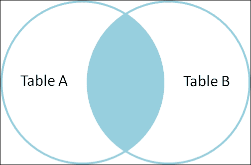
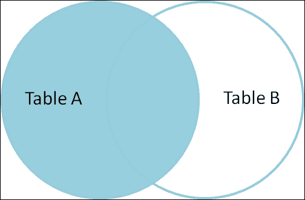
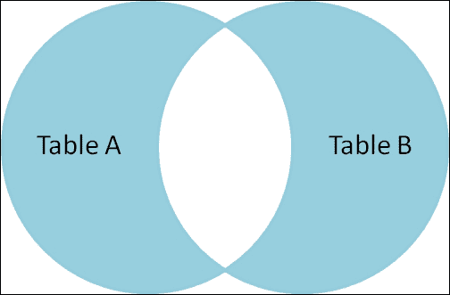

# 第 1 章。原始数据入门

在数据科学世界中，原始数据有多种形式和规模。 从原始数据中可以提取很多信息。 举个例子，亚马逊收集点击流数据，记录用户在网站上的每次点击。 可以利用此数据来了解用户是价格敏感的客户还是更受欢迎的产品。 您一定已经注意到亚马逊的推荐产品； 它们是使用此类数据得出的。

进行此类分析的第一步是解析原始数据。 数据解析涉及以下步骤：

*   **从源中提取数据**：数据可以多种形式出现，例如 Excel，CSV，JSON，数据库等。 在一些有用的软件包的帮助下，Python 使得从源中读取数据变得非常容易，本章将对此进行介绍。
*   **清理数据**：完成完整性检查后，需要适当清理数据，以便将其用于分析。 您可能具有有关班级学生的数据集，以及有关他们的身高，体重和成绩的详细信息。 可能还会有某些行缺少高度或重量。 根据执行的分析，这些具有缺失值的行可以忽略，也可以替换为平均身高或体重。

在本章中，我们将讨论以下主题：

*   使用 NumPy 探索数组
*   用Pandas处理数据
*   读写各种格式的数据
*   处理丢失的数据
*   处理数据

# 使用 NumPy 的数组世界

Python 默认情况下为，它具有可用于数组操作的数据结构，例如 List，但是 Python 列表本身并不适合执行繁重的数学运算，因为它没有为此进行优化。

NumPy 是 Travis Oliphant 生产的一个很棒的 Python 软件包，它是从根本上为科学计算而创建的。 它有助于处理大型多维数组和矩阵，以及处理这些数组的大型高级数学函数库。

与 Python 列表相比，NumPy 数组需要更少的内存来存储相同数量的数据，这有助于以更快的方式读取和写入数组。

## 创建数组

数字列表可以传递给以下数组函数以创建 NumPy 数组对象：

```py
>>> import numpy as np

>>> n_array = np.array([[0, 1, 2, 3],
 [4, 5, 6, 7],
 [8, 9, 10, 11]])

```

NumPy 数组对象具有许多属性，这些属性有助于提供有关数组的信息。 以下是其重要属性：

*   `ndim`: 这给出了数组的维数。 下面显示了我们定义的数组具有两个维度：

    ```py
    >>> n_array.ndim
    2

    ```

    `n_array`的排名为`2`，是 2D 数组。

*   `shape`: 这给出了数组每个维度的大小：

    ```py
    >>> n_array.shape
    (3, 4)

    ```

    `n_array`的第一维的大小为`3`，第二维的大小为`4`。 这也可以可视化为三行四列。

*   `size`: 这给出了元素数量：

    ```py
    >>> n_array.size
    12

    ```

    `n_array`中的元素总数为 12。

*   `dtype`: 这给出了数组中元素的数据类型：

    ```py
    >>> n_array.dtype.name
    int64

    ```

    编号作为`int64`存储在`n_array`中。

## 数学运算

当您具有数据数组时，您想对其执行某些数学运算。 现在，我们将在以下各节中讨论一些重要的方面。

### 数组减法

以下命令从`b`数组中减去`a`数组，以得到结果的`c`数组。 减法逐个元素发生：

```py
>>> a = np.array( [11, 12, 13, 14])
>>> b = np.array( [ 1, 2, 3, 4])
>>> c = a - b
>>> c
Array[10 10 10 10]

```

请注意，当减去两个数组时，它们的大小应相等。

## 平方数组

以下命令将每个元素提高到`2`的幂，以获得此结果：

```py
>>> b**2
[1  4  9 16]

```

### 对数组执行的三角函数

以下命令将余弦应用于`b`数组中的每个值，以获得以下结果：

```py
>>> np.cos(b)
[ 0.54030231 -0.41614684 -0.9899925  -0.65364362]

```

### 条件运算

以下命令将对`b`数组的每个元素应用条件运算，以生成相应的布尔值：

```py
>>> b<2
[ True False False False]

```

### 矩阵乘法

可以将两个矩阵逐个元素相乘或成点乘积。 以下命令将执行逐元素乘法：

```py
>>> A1 = np.array([[1, 1],
 [0, 1]])

>>> A2 = np.array([[2, 0],
 [3, 4]])

>>> A1 * A2
[[2 0]
[0 4]]

```

`dot`产品可以通过以下命令执行：

```py
>>> np.dot(A1, A2)
[[5 4]
[3 4]]

```

## 索引和切片

如果要选择数组的特定元素，则可以使用索引来实现：

```py
>>> n_array[0,1]
1

```

前面的命令将选择第一个数组，然后选择数组中的第二个值。 也可以将其视为矩阵的第一行和第二列的交集。

如果必须在一行上选择一个值范围，那么我们可以使用以下命令：

```py
>>> n_array[ 0 , 0:3 ]
[0 1 2]

```

`0:3`值选择第一行的前三个值。

可以使用以下命令选择整行值：

```py
>>> n_array[ 0 , : ]
[0 1 2 3]

```

使用以下命令，需要选择一整列值：

```py
>>> n_array[ : , 1 ]
[1 5 9]

```

## 形状处理

创建数组后，我们也可以更改其形状。 以下命令将数组展平：

```py
>>> n_array.ravel()
[ 0  1  2  3  4  5  6  7  8  9 10 11]

```

以下命令将数组重塑为六行两列的格式。 另外，请注意，在重塑时，新形状应具有与上一个相同的元素数量：

```py
>>> n_array.shape = (6,2)
>>> n_array
[[ 0  1]
[ 2  3]
[ 4  5]
[ 6  7]
[ 8  9]
[10 11]]

```

数组也可以转置：

```py
>>> n_array.transpose()
[[ 0  2  4  6  8 10]
[ 1  3  5  7  9 11]]

```

# 利用Pandas进行数据分析

Pandas库由 Wes McKinny 在 AQR Capital Management 工作时开发。 他想要一种足够灵活的工具来对财务数据进行定量分析。 后来，Chang She 加入了他，并帮助进一步开发了该软件包。

pandas 库是一个开放源代码 Python 库，专门用于数据分析。 它建立在 NumPy 上，可以轻松处理数据。 NumPy 是一个相当底层的工具，可以很好地处理矩阵。

pandas 库在 Python 世界中带来了 R 的丰富功能，可以处理数据。 它具有高效的数据结构，可以处理数据，执行快速联接以及从各种来源读取数据，仅举几例。

## Pandas的数据结构

Pandas库本质上具有三个数据结构：

1.  系列
2.  数据框
3.  控制板

### 系列

Series 是一维数组，它可以保存任何类型的数据，例如也可以是整数，浮点数，字符串和 Python 对象。 可以通过调用以下命令来创建系列：

```py
>>> import pandas as pd
>>> pd.Series(np.random.randn(5))

0    0.733810
1   -1.274658
2   -1.602298
3    0.460944
4   -0.632756
dtype: float64

```

`random.randn`参数是 NumPy 包的一部分，它生成随机数。 series 函数创建一个由索引组成的Pandas系列，第一列是索引，第二列由随机值组成。 输出的底部是系列的数据类型。

可以通过调用以下命令来定制系列的索引：

```py
>>> pd.Series(np.random.randn(5), index=['a', 'b', 'c', 'd', 'e'])

a   -0.929494
b   -0.571423
c   -1.197866
d    0.081107
e   -0.035091
dtype: float64

```

一系列也可以从 Python dict 派生而来：

```py
>>> d = {'A': 10, 'B': 20, 'C': 30}
>>> pd.Series(d)

A    10
B    20
C    30
dtype: int64

```

### 数据框

DataFrame 是 2D 数据结构，其列可以具有不同的数据类型。 它可以看作是一张桌子。 一个 DataFrame 可以由以下数据结构组成：

*   一个 NumPy 数组
*   清单
*   字典
*   系列
*   2D NumPy 数组

可以通过调用以下命令从系列字典创建`DataFrame`：

```py
>>> d = {'c1': pd.Series(['A', 'B', 'C']),
 'c2': pd.Series([1, 2., 3., 4.])}
>>> df = pd.DataFrame(d)
>>> df

 c1  c2
0    A   1
1    B   2
2    C   3
3  NaN   4

```

也可以使用列表的字典来创建 DataFrame：

```py
>>> d = {'c1': ['A', 'B', 'C', 'D'],
 'c2': [1, 2.0, 3.0, 4.0]}
>>> df = pd.DataFrame(d)
>>> print df
 c1  c2
0  A   1
1  B   2
2  C   3
3  D   4

```

### 面板

`Panel`是处理 3D 数据的数据结构。 以下命令是面板数据的示例：

```py
>>> d = {'Item1': pd.DataFrame(np.random.randn(4, 3)),
 'Item2': pd.DataFrame(np.random.randn(4, 2))}
>>> pd.Panel(d)

<class 'pandas.core.panel.Panel'>
Dimensions: 2 (items) x 4 (major_axis) x 3 (minor_axis)
Items axis: Item1 to Item2
Major_axis axis: 0 to 3
Minor_axis axis: 0 to 2

```

前面的命令显示有两个由两个项目表示的数据帧。 有四行由四个主轴表示，三列由三个短轴表示。

## 插入和导出数据

数据以的各种形式存储，例如 CSV，TSV，数据库等。 Pandas库使您可以方便地从这些格式读取数据或将其导出为这些格式。 我们将使用一个数据集，其中包含来自美国的在校学生的体重统计数据。

我们将使用具有以下结构的文件：

<colgroup><col style="text-align: left"> <col style="text-align: left"></colgroup> 
| 

柱子

 | 

描述

 |
| --- | --- |
| `LOCATION CODE` | 唯一的位置代码 |
| `COUNTY` | 学校所属的县 |
| `AREA NAME` | 学校所属的地区 |
| `REGION` | 学校所属的地区 |
| `SCHOOL YEARS` | 数据要处理的学年 |
| `NO. OVERWEIGHT` | 超重学生人数 |
| `PCT OVERWEIGHT` | 超重学生百分比 |
| `NO. OBESE` | 肥胖学生人数 |
| `PCT OBESE` | 肥胖学生的百分比 |
| `NO. OVERWEIGHT OR OBESE` | 超重或肥胖的学生人数 |
| `PCT OVERWEIGHT OR OBESE` | 超重或肥胖的学生百分比 |
| `GRADE LEVEL` | 他们是属于小学还是高中 |
| `AREA TYPE` | 区域类型 |
| `STREET ADDRESS` | 学校地址 |
| `CITY` | 学校所属的城市 |
| `STATE` | 学校所属的状态 |
| `ZIP CODE` | 学校的邮政编码 |
| `Location 1` | 经度和纬度的地址 |

### CSV

要从`.csv`文件读取数据，可以使用以下`read_csv`功能：

```py
>>> d = pd.read_csv('Data/Student_Weight_Status_Category_Reporting_Results__Beginning_2010.csv')
>>> d[0:5]['AREA NAME']

0    RAVENA COEYMANS SELKIRK CENTRAL SCHOOL DISTRICT
1    RAVENA COEYMANS SELKIRK CENTRAL SCHOOL DISTRICT
2    RAVENA COEYMANS SELKIRK CENTRAL SCHOOL DISTRICT
3                        COHOES CITY SCHOOL DISTRICT
4                        COHOES CITY SCHOOL DISTRICT

```

`read_csv`功能采用`.csv`文件的路径来输入数据。 此后的命令将在数据中打印`Location`列的前五行。

要将数据写入`.csv`文件，可以使用以下`to_csv`函数：

```py
>>> d = {'c1': pd.Series(['A', 'B', 'C']),
 'c2': pd.Series([1, 2., 3., 4.])}
>>> df = pd.DataFrame(d)
>>> df.to_csv('sample_data.csv')

```

通过使用`to_csv`方法将 DataFrame 写入`.csv`文件。 应该提到需要在其中创建文件的路径和文件名。

### XLS

除了Pandas软件包外，还需要安装`xlrd`软件包，Pandas才能从 Excel 文件中读取数据：

```py
>>> d=pd.read_excel('Data/Student_Weight_Status_Category_Reporting_Results__Beginning_2010.xls')

```

先前的功能是，类似于 CSV 读取命令。 要写入 Excel 文件，需要安装`xlwt`软件包：

```py
>>> df.to_excel('sample_data.xls')

```

### JSON

要从 JSON 文件读取数据，可以使用 Python 的标准`json`包。 以下命令有助于读取文件：

```py
>>> import json
>>> json_data = open('Data/Student_Weight_Status_Category_Reporting_Results__Beginning_2010.json')
>>> data = json.load(json_data)
>>> json_data.close()

```

在前面的命令中，`open()`函数打开与文件的连接。 `json.load()`函数将数据加载到 Python 中。 `json_data.close()`功能关闭与文件的连接。

pandas 库还提供了读取 JSON 文件的功能，可以使用`pd.read_json()`对其进行访问。

### 数据库

要从数据库读取数据，可以使用以下功能：

```py
>>> pd.read_sql_table(table_name, con)

```

前面的命令生成一个 DataFrame。 如果给出了表名和 SQLAlchemy 引擎，它们将返回一个 DataFrame。 此功能不支持 DBAPI 连接。 以下是所用参数的说明：

*   `table_name`：这是指数据库中 SQL 表的名称
*   `con`：这是指 SQLAlchemy 引擎

以下命令将 SQL 查询读取到 DataFrame 中：

```py
>>> pd.read_sql_query(sql, con)

```

以下是所用参数的说明：

*   `sql`：这是指要执行的 SQL 查询
*   `con`：这是指 SQLAlchemy 引擎

# 数据清理

原始数据中的数据通常需要进行一些清理，以便可以对其进行分析或在其上创建仪表板。 数据可能有很多原因。 例如，零售商店的销售点系统可能出现故障，并输入了一些缺少值的数据。 在下一节中，我们将学习如何处理此类数据。

## 检查丢失的数据

通常，大多数数据都会缺少一些值。 可能有多种原因：收集数据的源系统可能未收集值，或者可能从未存在过这些值。 加载数据后，必须检查数据中缺少的元素。 根据要求，需要处理丢失的数据。 可以通过删除行或用替代值替换缺少的值来进行处理。

在`Student Weight`数据中，要检查 location 列是否缺少值，可以使用以下命令：

```py
>>> d['Location 1'].isnull()
0       False
1       False
2       False
3       False
4       False
5       False
6       False

```

`notnull()`方法将值的每一行输出为`TRUE`或`FALSE`。 如果它是`False`，则缺少一个值。 可以汇总此数据以查找缺少值的实例数：

```py
>>> d['Location 1'].isnull().value_counts()
False    3246
True       24
dtype: int64

```

前面的命令显示`Location 1`列具有`24`实例的缺失值。 这些缺失值可以通过删除具有缺失值的行或将其替换为某些值来处理。 要删除行，请执行以下命令：

```py
>>> d = d['Location 1'].dropna()

```

要删除所有缺少值实例的行，请使用以下命令：

```py
>>> d = d.dropna(how='any')

```

## 填写缺失的数据

让我们定义一些要使用的数据框：

```py
>>> df = pd.DataFrame(np.random.randn(5, 3), index=['a0', 'a10', 'a20', 'a30', 'a40'],
 columns=['X', 'Y', 'Z'])
>>> df
 X         Y         Z
a0  -0.854269  0.117540  1.515373
a10 -0.483923 -0.379934  0.484155
a20 -0.038317  0.196770 -0.564176
a30  0.752686  1.329661 -0.056649
a40 -1.383379  0.632615  1.274481

```

现在，我们将添加一些额外的行索引，这些索引将在 DataFrame 中创建空值：

```py
>>> df2 = df2.reindex(['a0', 'a1', 'a10', 'a11', 'a20', 'a21', 'a30', 'a31', 'a40', 'a41'])
>>> df2

 X         Y         Z
a0  -1.193371  0.912654 -0.780461
a1        NaN       NaN       NaN
a10  1.413044  0.615997  0.947334
a11       NaN       NaN       NaN
a20  1.583516  1.388921  0.458771
a21       NaN       NaN       NaN
a30  0.479579  1.427625  1.407924
a31       NaN       NaN       NaN
a40  0.455510 -0.880937  1.375555
a41       NaN       NaN       NaN

```

如果要在以下情况下将的`df2` DataFrame 中的空值替换为零，请执行以下命令：

```py
>>> df2.fillna(0)

 X         Y         Z
a0  -1.193371  0.912654 -0.780461
a1   0.000000  0.000000  0.000000
a10  1.413044  0.615997  0.947334
a11  0.000000  0.000000  0.000000
a20  1.583516  1.388921  0.458771
a21  0.000000  0.000000  0.000000
a30  0.479579  1.427625  1.407924
a31  0.000000  0.000000  0.000000
a40  0.455510 -0.880937  1.375555
a41  0.000000  0.000000  0.000000

```

如果要使用正向传播来填充该值，这意味着该列中空值之前的值将用于填充空值，则可以使用以下命令：

```py
>>> df2.fillna(method='pad') #filling with forward propagation

 X         Y         Z
a0  -1.193371  0.912654 -0.780461
a1  -1.193371  0.912654 -0.780461
a10  1.413044  0.615997  0.947334
a11  1.413044  0.615997  0.947334
a20  1.583516  1.388921  0.458771
a21  1.583516  1.388921  0.458771
a30  0.479579  1.427625  1.407924
a31  0.479579  1.427625  1.407924
a40  0.455510 -0.880937  1.375555
a41  0.455510 -0.880937  1.375555

```

如果要用列均值填充列的空值，则可以使用以下命令：

```py
>>> df2.fillna(df2.mean())

 X         Y         Z
a0  -1.193371  0.912654 -0.780461
a1   0.547655  0.692852  0.681825
a10  1.413044  0.615997  0.947334
a11  0.547655  0.692852  0.681825
a20  1.583516  1.388921  0.458771
a21  0.547655  0.692852  0.681825
a30  0.479579  1.427625  1.407924
a31  0.547655  0.692852  0.681825
a40  0.455510 -0.880937  1.375555
a41  0.547655  0.692852  0.681825

```

## 字符串操作

有时，您会想要修改数据中的字符串字段列。 以下技术说明了一些字符串操作：

*   **子字符串**：让我们首先选择数据中`AREA NAME`列的前五行作为我们的示例数据进行修改：

    ```py
    >>> df = pd.read_csv('Data/Student_Weight_Status_Category_Reporting_Results__Beginning_2010.csv')
    >>> df['AREA NAME'][0:5]

    0    RAVENA COEYMANS SELKIRK CENTRAL SCHOOL DISTRICT
    1    RAVENA COEYMANS SELKIRK CENTRAL SCHOOL DISTRICT
    2    RAVENA COEYMANS SELKIRK CENTRAL SCHOOL DISTRICT
    3                        COHOES CITY SCHOOL DISTRICT
    4                        COHOES CITY SCHOOL DISTRICT
    Name: AREA NAME, dtype: object

    ```

    为了从`Area Name`列中提取第一个单词，我们将使用`extract`函数，如以下命令所示：

    ```py
    >>> df['AREA NAME'][0:5].str.extract('(\w+)')

    0    RAVENA
    1    RAVENA
    2    RAVENA
    3    COHOES
    4    COHOES
    Name: AREA NAME, dtype: object

    ```

    在前面的命令中，使用了系列的`str`属性。 `str`类包含`extract`方法，可以使用正则表达式来提取数据，这非常强大。 也可以在`AREA NAME`中提取另一个单词作为单独的列：

    ```py
    >>> df['AREA NAME'][0:5].str.extract('(\w+)\s(\w+)')
     0         1
    0  RAVENA  COEYMANS
    1  RAVENA  COEYMANS
    2  RAVENA  COEYMANS
    3  COHOES      CITY
    4  COHOES      CITY

    ```

    要提取不同列中的数据，需要将相应的正则表达式括在单独的括号中。

*   **过滤**：如果要用`ELEMENTARY`学校中的数据过滤行，则可以使用以下命令：

    ```py
    >>> df[df['GRADE LEVEL'] == 'ELEMENTARY']

    ```

*   **大写**：要将区域名称转换为大写，我们将使用以下命令：

    ```py
    >>> df['AREA NAME'][0:5].str.upper()
    0    RAVENA COEYMANS SELKIRK CENTRAL SCHOOL DISTRICT
    1    RAVENA COEYMANS SELKIRK CENTRAL SCHOOL DISTRICT
    2    RAVENA COEYMANS SELKIRK CENTRAL SCHOOL DISTRICT
    3                        COHOES CITY SCHOOL DISTRICT
    4                        COHOES CITY SCHOOL DISTRICT
    Name: AREA NAME, dtype: object

    ```

    由于数据字符串已经是大写的，因此不会有任何区别。

*   **小写**：要将转换为小写，我们将使用以下命令：

    ```py
    >>> df['AREA NAME'][0:5].str.lower()
    0    ravena coeymans selkirk central school district
    1    ravena coeymans selkirk central school district
    2    ravena coeymans selkirk central school district
    3                        cohoes city school district
    4                        cohoes city school district
    Name: AREA NAME, dtype: object

    ```

*   **长度**：要查找`Area Name`列中每个元素的长度，我们将使用以下命令：

    ```py
    >>> df['AREA NAME'][0:5].str.len()
    0    47
    1    47
    2    47
    3    27
    4    27
    Name: AREA NAME, dtype: int64

    ```

*   **拆分**：要基于空格将拆分`Area Name`，我们将使用以下命令：

    ```py
    >>> df['AREA NAME'][0:5].str.split(' ')

    0    [RAVENA, COEYMANS, SELKIRK, CENTRAL, SCHOOL, D...
    1    [RAVENA, COEYMANS, SELKIRK, CENTRAL, SCHOOL, D...
    2    [RAVENA, COEYMANS, SELKIRK, CENTRAL, SCHOOL, D...
    3                     [COHOES, CITY, SCHOOL, DISTRICT]
    4                     [COHOES, CITY, SCHOOL, DISTRICT]
    Name: AREA NAME, dtype: object

    ```

*   **替换**：如果我们要将所有以`DISTRICT`结尾的区域名称替换为`DIST`，则可以使用以下命令：

    ```py
    >>> df['AREA NAME'][0:5].str.replace('DISTRICT$', 'DIST')

    0    RAVENA COEYMANS SELKIRK CENTRAL SCHOOL DIST
    1    RAVENA COEYMANS SELKIRK CENTRAL SCHOOL DIST
    2    RAVENA COEYMANS SELKIRK CENTRAL SCHOOL DIST
    3                        COHOES CITY SCHOOL DIST
    4                        COHOES CITY SCHOOL DIST
    Name: AREA NAME, dtype: object

    ```

    replace 方法中的第一个参数是用于标识要替换的字符串的部分的正则表达式。 第二个参数是要替换为它的值。

## 合并数据

要将数据集组合在一起，可以利用Pandas的`concat`功能。 让我们以`Area Name`和`County`列的前五行为例：

```py
>>> d[['AREA NAME', 'COUNTY']][0:5]

 AREA NAME            COUNTY
0  RAVENA COEYMANS SELKIRK CENTRAL SCHOOL DISTRICT    ALBANY
1  RAVENA COEYMANS SELKIRK CENTRAL SCHOOL DISTRICT    ALBANY
2  RAVENA COEYMANS SELKIRK CENTRAL SCHOOL DISTRICT    ALBANY
3                      COHOES CITY SCHOOL DISTRICT    ALBANY
4                      COHOES CITY SCHOOL DISTRICT    ALBANY

```

我们可以如下划分数据：

```py
>>> p1 = d[['AREA NAME', 'COUNTY']][0:2]
>>> p2 = d[['AREA NAME', 'COUNTY']][2:5]

```

数据的前两行在`p1`中，后三行在`p2`中。 这些片段可以使用`concat()`功能进行组合：

```py
>>> pd.concat([p1,p2])

 AREA NAME            COUNTY
0  RAVENA COEYMANS SELKIRK CENTRAL SCHOOL DISTRICT    ALBANY
1  RAVENA COEYMANS SELKIRK CENTRAL SCHOOL DISTRICT    ALBANY
2  RAVENA COEYMANS SELKIRK CENTRAL SCHOOL DISTRICT    ALBANY
3                      COHOES CITY SCHOOL DISTRICT    ALBANY
4                      COHOES CITY SCHOOL DISTRICT    ALBANY

```

可以通过分配密钥来识别组合的件：

```py
>>> concatenated = pd.concat([p1,p2], keys = ['p1','p2'])
>>> concatenated
 AREA NAME           COUNTY
p1 0  RAVENA COEYMANS SELKIRK CENTRAL SCHOOL DISTRICT      ALBANY
 1  RAVENA COEYMANS SELKIRK CENTRAL SCHOOL DISTRICT     ALBANY
p2 2  RAVENA COEYMANS SELKIRK CENTRAL SCHOOL DISTRICT      ALBANY
 3                      COHOES CITY SCHOOL DISTRICT    ALBANY
 4                      COHOES CITY SCHOOL DISTRICT    ALBANY

```

使用键，可以从连接的数据中提取回片段：

```py
>>> concatenated.ix['p1']

 AREA NAME     COUNTY
0  RAVENA COEYMANS SELKIRK CENTRAL SCHOOL DISTRICT    ALBANY
1  RAVENA COEYMANS SELKIRK CENTRAL SCHOOL DISTRICT    ALBANY

```

# 数据操作

处理丢失的数据后，可以对数据执行各种操作。

## 聚合操作

有许多聚合操作，例如平均值，总和等，您希望在数字字段上执行这些操作。 这些是执行它的方法：

*   **平均**：要找出`ELEMENTARY`学校肥胖学生的平均人数，我们将首先使用以下命令过滤`ELEMENTARY`数据：

    ```py
    >>> data = d[d['GRADE LEVEL'] == 'ELEMENTARY']
    213.41593780369291

    ```

    现在，我们将使用以下命令找到均值：

    ```py
    >>> data['NO. OBESE'].mean()

    ```

    过滤基本年级水平数据并将其存储在数据对象中。 选择`NO. OBESE`列，其中包含肥胖学生的数量，并使用`mean()`方法得出平均值。

*   **总和**：要找出所有学校肥胖儿童的总数，请使用以下命令：

    ```py
    >>> data['NO. OBESE'].sum()
    219605.0

    ```

*   **最大值**：要获取小学肥胖学生的最大数量，请使用以下命令：

    ```py
    >>> data['NO. OBESE'].max()
    48843.0

    ```

*   **最小值**：要获取小学肥胖学生的最低人数，请使用以下命令：

    ```py
    >>> data['NO. OBESE'].min()
    5.0

    ```

*   **标准差**：要获取肥胖学生人数的标准差，请使用以下命令：

    ```py
    >>> data['NO. OBESE'].std()
    1690.3831128098113

    ```

*   **数量**：要计算`DELAWARE`县中具有`'ELEMENTARY'`等级的学校总数，请使用以下命令：

    ```py
    >>> data = df[(d['GRADE LEVEL'] == 'ELEMENTARY') & (d['COUNTY'] == 'DELAWARE')]
    >>> data['COUNTY'].count()
    19

    ```

    该表是针对`ELEMENTARY`等级和`DELAWARE`县过滤的。 请注意，条件用括号括起来。 这是为了确保评估各个条件，并且如果未提供括号，则 Python 将引发错误。

## 加入

可以使用Pandas在 DataFrame 上执行类似 SQL 的联接。 让我们定义一个查找 DataFrame，它使用以下命令为每个成绩指定级别：

```py
>>> grade_lookup = {'GRADE LEVEL': pd.Series(['ELEMENTARY', 'MIDDLE/HIGH', 'MISC']),
 'LEVEL': pd.Series([1, 2, 3])}

>>> grade_lookup = DataFrame(grade_lookup)

```

让我们以`GRADE`数据列的前五行作为执行连接的示例：

```py
>>> df[['GRADE LEVEL']][0:5]
 GRADE LEVEL
0  DISTRICT TOTAL
1      ELEMENTARY
2     MIDDLE/HIGH
3  DISTRICT TOTAL
4      ELEMENTARY

```

### 内部联接

图像后的是内部联接的示例：



可以使用以下命令执行内部联接：

```py
>>> d_sub = df[0:5].join(grade_lookup.set_index(['GRADE LEVEL']), on=['GRADE LEVEL'], how='inner')
>>> d_sub[['GRADE LEVEL', 'LEVEL']]

 GRADE LEVEL  LEVEL
1   ELEMENTARY      1
4   ELEMENTARY      1
2  MIDDLE/HIGH      2

```

连接使用`join()`方法进行。 第一个参数采用在其上进行查找的 DataFrame。 请注意，`grade_lookup` DataFrame 的索引是通过`set_index()`方法设置的。 这对于联接至关重要，因为没有联接，联接方法将不知道将 DataFrame 联接到哪一列。

第二个自变量采用`d` DataFrame 的一列来联接数据。 第三个参数将联接定义为内部联接。

### 左外部联接

图像后的是左外部联接的样本：



可以使用以下命令执行左外部联接：

```py
>>> d_sub = df[0:5].join(grade_lookup.set_index(['GRADE LEVEL']), on=['GRADE LEVEL'], how='left')
>>> d_sub[['GRADE LEVEL', 'LEVEL']]

 GRADE LEVEL  LEVEL
0  DISTRICT TOTAL    NaN
1      ELEMENTARY      1
2     MIDDLE/HIGH      2
3  DISTRICT TOTAL    NaN
4      ELEMENTARY      1

```

您会注意到级别列的`DISTRICT TOTAL`缺少值，因为的`grade_lookup` DataFrame 没有`DISTRICT TOTAL`的实例。

### 完整的外部联接

图像后的是完整外部联接的示例：



完整的外部联接可以使用以下命令执行：

```py
>>> d_sub = df[0:5].join(grade_lookup.set_index(['GRADE LEVEL']), on=['GRADE LEVEL'], how='outer')
>>> d_sub[['GRADE LEVEL', 'LEVEL']]

 GRADE LEVEL  LEVEL
0  DISTRICT TOTAL    NaN
3  DISTRICT TOTAL    NaN
1      ELEMENTARY      1
4      ELEMENTARY      1
2     MIDDLE/HIGH      2
4            MISC      3

```

### 分组功能

通过对Pandas的操作来进行类似于 SQL 的分组很容易。 让我们说，如果您想查找每个年级的肥胖学生人数的总和，则可以使用以下命令：

```py
>>> df['NO. OBESE'].groupby(d['GRADE LEVEL']).sum()
GRADE LEVEL
DISTRICT TOTAL    127101
ELEMENTARY         72880
MIDDLE/HIGH        53089

```

该命令选择“肥胖学生人数”列，然后使用“分组方式”对基于数据的分组级别进行分组，最后，“求和”方法将数字汇总。 同样可以通过以下功能实现：

```py
>>> d['NO. OBESE'].groupby(d['GRADE LEVEL']).aggregate(sum)

```

在这里，利用了聚集方法。 传递求和函数以获得所需的结果。

也可以在同一度量标准上获得多种聚合。 此可以通过以下命令来实现：

```py
>>> df['NO. OBESE'].groupby(d['GRADE LEVEL']).aggregate([sum, mean, std])
 sum        mean         std
GRADE LEVEL 
DISTRICT TOTAL  127101  128.384848  158.933263
ELEMENTARY       72880   76.958817  100.289578
MIDDLE/HIGH      53089   59.251116   65.905591

```

# 摘要

在本章中，我们熟悉了 NumPy 和 pandas 软件包。 我们了解了Pandas中不同的数据类型以及如何利用它们。 我们学习了如何执行数据清除和操作，其中我们处理了缺失值并执行了字符串操作。 本章为我们提供了数据科学的基础，您可以通过单击以下链接来更深入地了解 NumPy 和Pandas：

*   [**NumPy 文档**](http://docs.scipy.org/doc/)
*   [**Pandas 文档**](http://pandas.pydata.org/)

在下一章中，我们将学习推断统计的含义及其作用，以及如何理解推断统计中的不同概念。