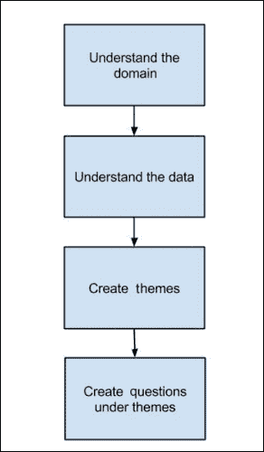
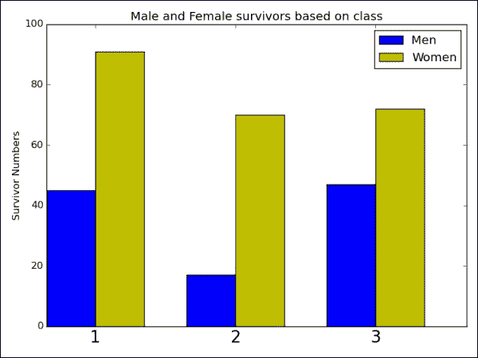
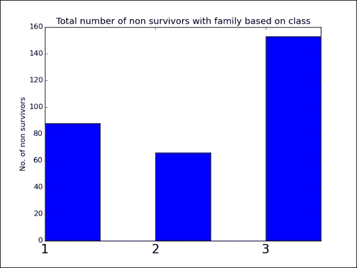
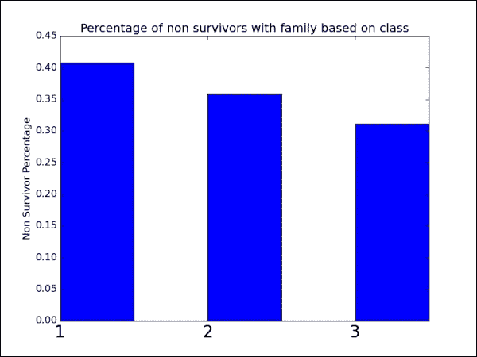
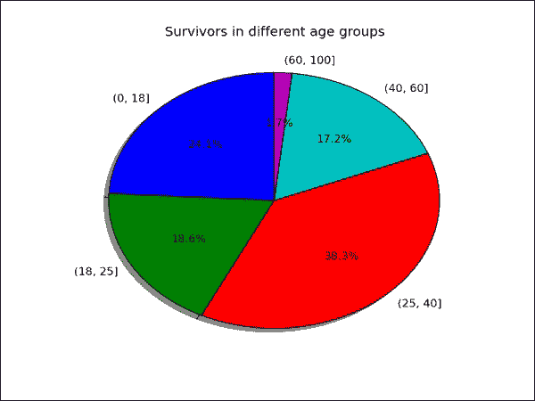

# 第 3 章。在干草堆中寻找针头

分析数据集以查找模式既是一门艺术，也是一门科学。 数据集可能有很多指标，您想在这堆干草堆中找到要害。 对于我们来说，针是我们在以前不知道的数据中寻找的洞察力。 在这里，洞察力可能指的是有关购买特定品牌牛奶以及购买其他品牌谷物的人们的重要信息。 然后，零售商店可以将产品彼此靠近堆叠。

每当您尝试分析数据集时，都应该对它以及与它关联的域有详细的了解。 如果这是一个易于理解的简单数据集，则可以直接进行分析，但是如果该数据集与涡轮机的传感器数据相关，则对涡轮机如何工作以及对其功能至关重要的领域的领域理解将增加分析的丰富性。

对域的理解就像北极星一样：它可以帮助您浏览分析。

在本章中，您将学习以下主题：

*   如何为数据挖掘构建分析
*   如何呈现您的分析
*   如何对泰坦尼克号幸存者数据集进行数据挖掘


# 什么是数据挖掘？

数据挖掘是使用机器学习，统计信息和数据库系统探索数据并在其中寻找模式的过程。 数据挖掘的最终目标是从数据中获取有用的信息，这些信息可用于通过某些应用程序来增加收入，降低成本甚至挽救生命。

当您有一个需要挖掘的数据集时，使用在数据的每个列字段上可用的所有数据挖掘技术来获得洞察力是不可行的。 这将是一项繁琐的任务，并且需要很长时间才能得出任何有用的见解。

为了加快数据挖掘的过程，领域知识是一个很大的帮助。 有了这些知识，就可以了解数据代表什么以及如何分析数据以获取见解。

开始数据挖掘的最佳方法是派生需要挖掘数据的主题。 如果您具有**快速消费品**（**FMCG**）公司的销售数据，则主题可能如下：

*   品牌行为
*   出口行为
*   产品成长
*   对产品的季节性影响

这些主题可为您提供指导，以探索数据并在其中寻找模式，从而为您提供帮助。

有了主题后，您需要在主题下提出问题以简化分析：

*   **品牌行为**：以下是用于简化分析的问题：

    *   哪些顶级品牌？
    *   哪些品牌覆盖率最高？
    *   哪些品牌蚕食了其他品牌的销量？

*   **店铺行为**：以下是用于简化分析的问题：

    *   百分之八十的店铺占收入的 80%？
    *   哪种网点的销售量最高？
    *   什么样的商店主要销售优质产品？

*   **产品增长**：以下是用于简化分析的问题：

    *   就销售而言，增长最快的品牌是哪些？
    *   就销量而言，哪些是增长最快的品牌？
    *   哪个品牌的增长趋于平稳？

*   **产品的季节性影响**：以下是用于简化分析的问题：

    *   季节性有几个品牌？
    *   在季节性和非季节性期间，销售方面有何不同？
    *   哪个假期为特定品牌带来了最大的销售额？

这些主题下的前面的问题为查找模式和进行分析提供了一些质量结果的精确指导。

可以通过以下流程图总结探索数据的过程：



# 进行分析

在执行分析之后，您需要提供一些观察结果。 为此，最常用的媒体是通过 Microsoft PowerPoint 演示文稿。 分析的结果可以是图表或表格形式的构造。 介绍这些结构时，应将某些信息添加到幻灯片中。 这是最常用的模板之一：


以下是上图的不同部分：

*   **问题**：模板的最顶部应描述特定分析试图解决的问题说明。
*   **观察结果**：此处，在垂直栏中列出了来自构建体的观察结果。 有时，可以使用箭头标记或对话框在结构上标记观察结果。
*   **关键点**：在图像底部，您可以描述图表得出的结论。

# 学习泰坦尼克号

为了执行数据分析，我们将使用来自 Kaggle 的泰坦尼克数据集。

该数据集易于理解，不需要任何领域的知识即可得出见解。

该数据集包含泰坦尼克号上每位乘客的详细信息，以及他们是否幸存。

以下是字段描述：

| 字段 | 说明 |
| --- | --- |
| `survival` | 生存（`0`：否，`1`：是） |
| `pclass` | 旅客舱位（`1`：1，`2`：2，`3`：3） |
| `name` | 旅客姓名 |
| `sex` | 旅客性别 |
| `age` | 乘客年龄 |
| `sibsp` | 兄弟姐妹/配偶人数 |
| `parch` | 父母/子女人数 |
| `ticket` | 票号 |
| `fare` | 旅客票价 |
| `cabin` | 舱号 |
| `embarked` | 登船港口（`C`：瑟堡，`Q`：皇后镇，`S`：南安普敦） |

由于数据非常易于理解，因此我们将生存分析作为可用于数据分析的主要主题。 我们将对这些主题附加问题。

这些是我们将要回答的问题：

*   哪个旅客类别的幸存者人数最多？
*   基于性别，不同阶级之间幸存者的分布是什么？
*   非幸存者在船上有亲属的阶级之间的分布是什么？
*   不同年龄段的存活率是多少？

## 哪个旅客类别的幸存者人数最多？

为了回答这个问题，我们将构建一个简单的条形图，分别显示每个类别中幸存者的数量和幸存者的百分比。 您可以使用以下命令执行此操作：

```py
>>> import pandas as pd
>>> import pylab as plt
>>> import numpy as np

>>> df = pd.read_csv('Data/titanic data.csv')

>>> df['Pclass'].isnull().value_counts()
>>> False    891
>>> dtype: int64

>>> df['Survived'].isnull().value_counts()
>>> False    891
>>> dtype: int64

>>> #Passengers survived in each class
>>> survivors = df.groupby('Pclass')['Survived'].agg(sum)

>>> #Total Passengers in each class
>>> total_passengers = df.groupby('Pclass')['PassengerId'].count()
>>> survivor_percentage = survivors / total_passengers

>>> #Plotting the Total number of survivors
>>> fig = plt.figure()
>>> ax = fig.add_subplot(111)
>>> rect = ax.bar(survivors.index.values.tolist(), survivors, color='blue', width=0.5)
>>> ax.set_ylabel('No. of survivors')
>>> ax.set_title('Total number of survivors based on class')
>>> xTickMarks = survivors.index.values.tolist()
>>> ax.set_xticks(survivors.index.values.tolist())
>>> xtickNames = ax.set_xticklabels(xTickMarks)
>>> plt.setp(xtickNames, fontsize=20)
>>> plt.show()

```


```py
>>> #Plotting the percentage of survivors in each class

>>> fig = plt.figure()
>>> ax = fig.add_subplot(111)

>>> rect = ax.bar(survivor_percentage.index.values.tolist(), survivor_percentage, color='blue', width=0.5)
>>> ax.set_ylabel('Survivor Percentage')
>>> ax.set_title('Percentage of survivors based on class')
>>> xTickMarks = survivors.index.values.tolist()
>>> ax.set_xticks(survivors.index.values.tolist())
>>> xtickNames = ax.set_xticklabels(xTickMarks)
>>> plt.setp(xtickNames, fontsize=20)
>>> plt.show()

```


在前面的代码中，我们对使用的字段上的空值进行了初步检查。 此后，我们计算了每个类别中幸存者的数量和幸存者的百分比。 然后，我们绘制了两个条形图，表示幸存者总数和幸存者百分比。

这些是我们的观察结果：

*   幸存者的最大人数分别是一等和三等
*   对于每个班级的乘客总数，头等舱的最大幸存者约为 61%
*   对于每个舱位的乘客总数，三等舱的幸存者人数最少，约为 25%

这是我们的主要收获：

*   显然，倾向于在船只溺水时从头等舱救出来。 它也有最大的幸存者百分比

## 在不同类别中，基于性别的幸存者分布是什么？

为了回答这个问题，我们将使用以下代码绘制并排的条形图，以比较男性和女性相对于他们所处的阶层的存活率和百分比。

```py
>>> #Checking for any null values
>>> df['Sex'].isnull().value_counts()
>>> False    891
>>> dtype: int64

>>> # Male Passengers survived in each class
>>> male_survivors = df[df['Sex'] == 'male'].groupby('Pclass')['Survived'].agg(sum)

>>> #Total Male Passengers in each class
>>> male_total_passengers = df[df['Sex'] == 'male'].groupby('Pclass')['PassengerId'].count()
>>> male_survivor_percentage = male_survivors / male_total_passengers

>>> # Female Passengers survived in each class
>>> female_survivors = df[df['Sex'] == 'female'].groupby('Pclass')['Survived'].agg(sum)

>>> #Total Female Passengers in each class
>>> female_total_passengers = df[df['Sex'] == 'female'].groupby('Pclass')['PassengerId'].count()
>>> female_survivor_percentage = female_survivors / female_total_passengers

>>> #Plotting the total passengers who survived based on Gender
>>> fig = plt.figure()
>>> ax = fig.add_subplot(111)
>>> index = np.arange(male_survivors.count())
>>> bar_width = 0.35
>>> rect1 = ax.bar(index, male_survivors, bar_width, color='blue', label='Men')
>>> rect2 = ax.bar(index + bar_width, female_survivors, bar_width, color='y', label='Women')
>>> ax.set_ylabel('Survivor Numbers')
>>> ax.set_title('Male and Female survivors based on class')
>>> xTickMarks = male_survivors.index.values.tolist()
>>> ax.set_xticks(index + bar_width)
>>> xtickNames = ax.set_xticklabels(xTickMarks)
>>> plt.setp(xtickNames, fontsize=20)
>>> plt.legend()
>>> plt.tight_layout()
>>> plt.show()

```



```py
>>> #Plotting the percentage of passengers who survived based on Gender
>>> fig = plt.figure()
>>> ax = fig.add_subplot(111)
>>> index = np.arange(male_survivor_percentage.count())
>>> bar_width = 0.35
>>> rect1 = ax.bar(index, male_survivor_percentage, bar_width, color='blue', label='Men')
>>> rect2 = ax.bar(index + bar_width, female_survivor_percentage, bar_width, color='y', label='Women')
>>> ax.set_ylabel('Survivor Percentage')
>>> ax.set_title('Percentage Male and Female of survivors based on class')
>>> xTickMarks = male_survivor_percentage.index.values.tolist()
>>> ax.set_xticks(index + bar_width)
>>> xtickNames = ax.set_xticklabels(xTickMarks)
>>> plt.setp(xtickNames, fontsize=20)
>>> plt.legend()
>>> plt.tight_layout()
>>> plt.show()

```


在前面的代码中，计算了男性和女性幸存者的数量，然后绘制了并排的条形图。 此后，计算出中男性和女性幸存者相对于各自类别中男女总数的百分比，然后作图。

这些是我们的观察：

*   所有班级中大多数幸存者是女性
*   头等舱和二等舱中超过 90% 的女性乘客幸存
*   在头等舱和三等舱中幸存下来的男性乘客百分比是可比的

此是我们的主要收获：

*   女乘客被优先选择救生艇，而大多数人获救。

## 在船上有家人的各个阶层中，非幸存者的分布是什么？

为了回答这个问题，我们将使用以下代码再次绘制条形图，使用每个班级中每个都有家人的非幸存者的总数以及相对于乘客总数的百分比：

```py
>>> #Checking for the null values
>>> df['SibSp'].isnull().value_counts()
>>> False    891
>>> dtype: int64

>>> #Checking for the null values
>>> df['Parch'].isnull().value_counts()
>>> False    891
>>> dtype: int64

>>> #Total number of non-survivors in each class
>>> non_survivors = df[(df['SibSp'] > 0) | (df['Parch'] > 0) & (df['Survived'] == 0)].groupby('Pclass')['Survived'].agg('count')
>>> #Total passengers in each class
>>> total_passengers = df.groupby('Pclass')['PassengerId'].count()
>>> non_survivor_percentage = non_survivors / total_passengers
>>> #Total number of non survivors with family based on class
>>> fig = plt.figure()
>>> ax = fig.add_subplot(111)
>>> rect = ax.bar(non_survivors.index.values.tolist(), non_survivors, color='blue', width=0.5)
>>> ax.set_ylabel('No. of non survivors')
>>> ax.set_title('Total number of non survivors with family based on class')
>>> xTickMarks = non_survivors.index.values.tolist()
>>> ax.set_xticks(non_survivors.index.values.tolist())
>>> xtickNames = ax.set_xticklabels(xTickMarks)
>>> plt.setp(xtickNames, fontsize=20)
>>> plt.show()

```



```py
>>> #Plot of percentage of non survivors with family based on class
>>> fig = plt.figure()
>>> ax = fig.add_subplot(111)
>>> rect = ax.bar(non_survivor_percentage.index.values.tolist(), non_survivor_percentage, color='blue', width=0.5)
>>> ax.set_ylabel('Non Survivor Percentage')
>>> ax.set_title('Percentage of non survivors with family based on class')
>>> xTickMarks = non_survivor_percentage.index.values.tolist()
>>> ax.set_xticks(non_survivor_percentage.index.values.tolist())
>>> xtickNames = ax.set_xticklabels(xTickMarks)
>>> plt.setp(xtickNames, fontsize=20)
>>> plt.show()

```



这里的代码与前面的问题中使用的代码非常相似。 在这里，我们可以获取有一个家庭的非幸存者的数量，然后执行通常的条形图。

这些是我们的观察结果：

*   第三类中有很多非幸存者
*   二等人与亲属的非幸存者人数最少
*   就乘客总数而言，拥有亲属的头等舱的非幸存者比例最高，而三等舱的非幸存者比例最低。

这是我们的主要收获：

*   尽管三等舱的非幸存者中有亲属的人数最多，但主要是因为乘客没有船上的亲戚，而三等舱中的大多数人中都有亲戚。

## 不同年龄段的存活率是多少？

对于这个问题，我们将使用以下代码绘制饼图，以比较幸存者在数量和百分比方面相对于不同年龄段的比例：

```py
>>> #Checking for null values
>>> df['Age'].isnull().value_counts()
>>> False    714
>>> True     177
>>> dtype: int64

>>> #Defining the age binning interval
>>> age_bin = [0, 18, 25, 40, 60, 100]
>>> #Creating the bins
>>> df['AgeBin'] = pd.cut(df.Age, bins=age_bin)
>>> #Removing the null rows
>>> d_temp = df[np.isfinite(df['Age'])]  # removing all na instances
>>> #Number of survivors based on Age bin
>>> survivors = d_temp.groupby('AgeBin')['Survived'].agg(sum)
>>> #Total passengers in each bin
>>> total_passengers = d_temp.groupby('AgeBin')['Survived'].agg('count')
>>> #Plotting the pie chart of total passengers in each bin
>>> plt.pie(total_passengers, labels=total_passengers.index.values.tolist(),autopct='%1.1f%%', shadow=True, startangle=90)
>>> plt.title('Total Passengers in different age groups')
>>> plt.show()

```


```py
>>> #Plotting the pie chart of percentage passengers in each bin
>>> plt.pie(survivors, labels=survivors.index.values.tolist(),
 autopct='%1.1f%%', shadow=True, startangle=90)
>>> plt.title('Survivors in different age groups')
>>> plt.show()

```



在代码中，我们使用`age_bin`变量定义了箱子，然后添加了一个名为`AgeBin`的列，其中使用`cut`函数填充了箱子值。 此后，我们过滤掉了年龄设置为`null`的所有行。 此后，我们创建了两个饼图：一个用于每个年龄组的乘客总数，另一个用于每个年龄组的幸存者数量。

这些是我们的观察：

*   25-40 岁年龄段的乘客人数最多，0-18 岁年龄段的乘客人数第二多
*   在幸存的人中，18-25 岁年龄段的幸存者人数第二高
*   60-100 岁年龄段的幸存者比例较低

这是我们的主要收获：

*   与其他年龄组相比，年龄在 25-40 岁之间的幸存者人数最多，而且年龄较大的人要么不够幸运，要么被年轻人带到救生艇上。

# 总结

在本章中，我们了解了数据挖掘的含义。 我们了解了领域知识在执行分析以及如何以系统方式进行数据挖掘中的重要性。 我们还学习了如何呈现数据挖掘的结果。 最后，我们举了一个例子，并进行了一些分析以提取有用的信息。

在下一章中，您将学习如何在数据上创建可视化以及在何处应用各种可视化。

### 提示

**下载示例代码**

您可以从[这个页面](http://www.packtpub.com)下载从帐户购买的所有 Packt 图书的示例代码文件。 如果您在其他地方购买了此书，则可以访问[这个页面](http://www.packtpub.com/support)并注册以将文件直接通过电子邮件发送给您。

该代码包中提供的代码同时适用于 IPython笔记本和 Python 2.7。 在本章中，遵循了 Python 约定。