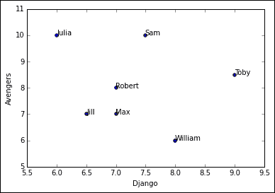
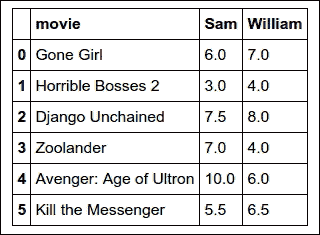
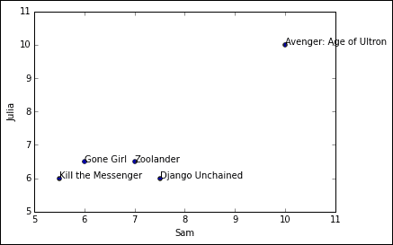

# 第 8 章。使用协作过滤生成建议

协作过滤是使用包括多个代理，视点，数据源等之间的协作的技术对信息或模式进行过滤的过程。 协作过滤方法已应用于许多不同类型的数据，包括感测和监视数据，例如矿物勘探，大面积环境感测或多个传感器； 金融数据，例如集成了许多财务来源的金融服务机构； 或以用户数据等为重点的电子商务和 Web 应用程序中。

协作过滤方法背后的基本原理是，它通过查看自己的品味来寻找彼此相似的人。 假设某人主要喜欢动作片，那么它将尝试找到曾经看过类似电影的人，并且会推荐一个未被第一人看过但被第二人看过的人。 。

在本章中，我们将重点介绍以下类型的协作过滤：

*   基于用户的协同过滤
*   基于项目的协作过滤

# 推荐数据

我们将使用一组用户，他们为他们选择的电影提供了评级。 以下是一个字典对象，其中包含键形式的不同用户，以及电影词典形式的值，每个电影的值都是用户给出的等级：

```py
movie_user_preferences={'Jill': {'Avenger: Age of Ultron': 7.0,
 'Django Unchained': 6.5,
 'Gone Girl': 9.0,
 'Kill the Messenger': 8.0},
'Julia': {'Avenger: Age of Ultron': 10.0,
 'Django Unchained': 6.0,
 'Gone Girl': 6.5,
 'Kill the Messenger': 6.0,
 'Zoolander': 6.5},
'Max': {'Avenger: Age of Ultron': 7.0,
 'Django Unchained': 7.0,
 'Gone Girl': 10.0,
 'Horrible Bosses 2': 6.0,
 'Kill the Messenger': 5.0,
 'Zoolander': 10.0},
'Robert': {'Avenger: Age of Ultron': 8.0,
 'Django Unchained': 7.0,
 'Horrible Bosses 2': 5.0,
 'Kill the Messenger': 9.0,
 'Zoolander': 9.0},
'Sam': {'Avenger: Age of Ultron': 10.0,
 'Django Unchained': 7.5,
 'Gone Girl': 6.0,
 'Horrible Bosses 2': 3.0,
 'Kill the Messenger': 5.5,
 'Zoolander': 7.0},
'Toby': {'Avenger: Age of Ultron': 8.5,
 'Django Unchained': 9.0,
 'Zoolander': 2.0},
'William': {'Avenger: Age of Ultron': 6.0,
 'Django Unchained': 8.0,
 'Gone Girl': 7.0,
 'Horrible Bosses 2': 4.0,
 'Kill the Messenger': 6.5,
 'Zoolander': 4.0}}

movie_user_preferences['William']['Gone Girl']
7.0

```

# 基于用户的协作过滤

让我们开始，通过查找彼此相似的用户来构建基于用户的协作过滤器。

## 寻找相似用户

当您获得有关人们喜欢的数据时，您需要一种方法来确定不同用户之间的相似性。 通过将每个用户与每个其他用户进行比较并计算相似度得分，可以确定不同用户之间的相似度。 可以使用 Pearson 相关性，欧几里得距离，曼哈顿距离等来计算该相似性分数。

## 欧几里得距离得分

欧式距离是空间中两点之间的最小距离。 让我们通过绘制观看过 Django Unchained 和 Avengers 的用户来了解这一点。

我们将创建一个数据框，其中包含`user`，`django`和`avenger`列，其中`django`和`avenger`包含用户给出的评分：

```py
>>> data = []
>>> for i in movie_user_preferences.keys():
 try:
 data.append( (i
 ,movie_user_preferences[i]['Django Unchained']
 ,movie_user_preferences[i]['Avenger: Age of Ultron']) )
 except:
 pass

>>> df = pd.DataFrame(data = data, columns = ['user', 'django', 'avenger'])
>>> df

```


使用前面的 DataFrame 的，我们将通过将`Django`保持为`y`轴，而将`Avengers`保持为`x`轴来绘制不同的用户：

```py
>>> plt.scatter(df.django, df.avenger)
>>> plt.xlabel('Django')
>>> plt.ylabel('Avengers')
>>> for i,txt in enumerate(df.user):
 plt.annotate(txt, (df.django[i],df.avenger[i]))
>>> plt.show()

```



我们可以看到`Jill`和`Toby`彼此距离很远，而`Robert`和`Max`彼此非常接近。 让我们计算两者之间的欧几里德距离：

```py
>>> #Euclidean distance between Jill and Toby rating
>>> sqrt(pow(8.5-7,2)+pow(9-6.5,2))

2.9154759474226504

>>> #Euclidean distance between Robert and Max rating
>>> sqrt(pow(8-7,2)+pow(7-7,2))

1.0

```

我们可以看到，用户之间的距离越远，欧几里得距离就越大。 从前面的代码中可以看出，欧氏距离越小，相似度就越大。 我们将欧几里德距离除以`1`，以便获得一个度量，该度量表示更高的数字具有更大的相似性。 我们还将在分母中添加`1`以避免得到`ZeroDivisionError`。

```py
>>> #Similarity Score based on Euclidean distance between Jill and Toby
>>> 1/(1 + sqrt(pow(8.5-7,2)+pow(9-6.5,2)) )
0.2553967929896867

>>> #Similarity Score based on Euclidean distance between Robert and Max
>>> 1/(1 + sqrt(pow(8-7,2)+pow(7-7,2)) )

0.5

```

让我们创建一个函数，该函数基于两个用户之间的欧几里得距离来计算相似度，其中除我们前面提到的的两部电影外，还考虑了他们观看的所有电影：

```py
>>> # Returns a distance-based similarity score for person1 and person2
>>> def sim_distance(prefs,person1,person2):
 # Get the list of shared_items
 si={}
 for item in prefs[person1]:
 if item in prefs[person2]:
 si[item]=1

 # if they have no ratings in common, return 0
 if len(si)==0: return 0

 # Add up the squares of all the differences
 sum_of_squares=sum([pow(prefs[person1][item] - prefs[person2][item],2)
 for item in prefs[person1] if item in prefs[person2]])

 return 1/(1+sum_of_squares)

```

让我们应用前面的函数来计算`Sam`和`Toby`之间的相似性得分：

```py
>>> sim_distance(movie_user_preferences,'Sam','Toby')

0.03278688524590164

```

## 皮尔森相关评分

我们已经在第 2 章，“推断统计”中研究了皮尔逊相关性。 欧几里得距离是用户彼此分开的距离，而 Pearson 相关性考虑了两个人之间的关联。 我们将使用 Pearson 相关性来计算两个用户之间的相似度得分。

让我们看看`Sam`和`Toby`如何相互关联：

```py
>>> def create_movie_user_df(input_data, user1, user2):
 data = []
 for movie in input_data[user1].keys():
 if movie in input_data[user2].keys():
 try:
 data.append( (movie
 ,input_data[user1][movie]
 ,input_data[user2][movie]) )
 except:
 pass

 return pd.DataFrame(data = data, columns = ['movie', user1, user2])

>>> df = create_movie_user_df(movie_user_preferences, 'Sam', 'William')
>>> df

```



一旦在 DataFrame 之前创建了，我们将像之前一样绘制散点图：

```py
>>> plt.scatter(df.Sam, df.William)
>>> plt.xlabel('Sam')
>>> plt.ylabel('William')
>>> for i,txt in enumerate(df.movie):
 plt.annotate(txt, (df.Sam[i],df.William[i]))
>>> plt.show()

```


让我们计算和`William`之间的皮尔逊相关性：

```py
>>> pearsonr(df.Sam,df.William)

(0.37067401970178415, 0.46945413268410929)

```

让我们看一下`Sam`和`Julia`之间的相关散点图：

```py
>>> df = create_movie_user_df(movie_user_preferences, 'Sam', 'Julia')
>>> df

>>> plt.scatter(df.Sam, df.Julia)
>>> plt.xlabel('Sam')
>>> plt.ylabel('Julia')
>>> for i,txt in enumerate(df.movie):
 plt.annotate(txt, (df.Sam[i],df.Julia[i]))
>>> plt.show()

```



让我们计算`Sam`和`Julia`之间的皮尔逊相关性：

```py
>>> pearsonr(df.Sam,df.Julia)

(0.88285183326025096, 0.047277507003439537)

```

我们可以看到`Sam`和`Julia`彼此非常相似，因为`0.88`的相关值接近 1。

现在，我们将创建一个函数，该函数将接收数据并计算两个用户之间的 Pearson 相关性：

```py
>>> # Returns the Pearson correlation coefficient for p1 and p2
>>> def sim_pearson(prefs,p1,p2):
 # Get the list of mutually rated items
 si={}
 for item in prefs[p1]:
 if item in prefs[p2]: si[item]=1

 # Find the number of elements
 n=len(si)

 # if they are no ratings in common, return 0
 if n==0: return 0

 # Add up all the preferences
 sum1=sum([prefs[p1][it] for it in si])
 sum2=sum([prefs[p2][it] for it in si])

 # Sum up the squares
 sum1Sq=sum([pow(prefs[p1][it],2) for it in si])
 sum2Sq=sum([pow(prefs[p2][it],2) for it in si])

 # Sum up the products
 pSum=sum([prefs[p1][it]*prefs[p2][it] for it in si])

 # Calculate Pearson score
 num=pSum-(sum1*sum2/n)
 den=sqrt((sum1Sq-pow(sum1,2)/n)*(sum2Sq-pow(sum2,2)/n))
 if den==0: return 0

 r=num/den

 return r

```

让我们使用前面的函数来计算`Sam`和`Julia`之间的皮尔逊相关性，并验证其计算是否正确：

```py
>>> sim_pearson(movie_user_preferences,'Sam','Julia')

0.8828518332602507

```

## 排名用户

一旦有了计算用户之间相似度的方法，我们便根据特定用户之间的相似度对它们进行排名。 我想认识与我最相似的人。 我们可以使用以下代码来实现：

```py
>>> def top_matches(prefs,person,n=5,similarity=sim_pearson):
 scores=[(similarity(prefs,person,other),other)
 for other in prefs if other!=person]

 # Sort the list so the highest scores appear at the top
 scores.sort( )
 scores.reverse( )
 return scores[0:n]

```

让我们来看看与`Sam`相似的前三个：

```py
>>> top_matches(movie_user_preferences,'Toby', 
 n = 3, similarity = sim_distance)

[(0.10526315789473684, 'Jill'),
(0.08163265306122448, 'William'),
(0.03278688524590164, 'Sam')]

```

## 推荐商品

一旦您知道与您相似的人，您现在就想知道推荐给您的电影。 下图显示了如何计算电影的得分，以便我们找出最推荐的电影是：


我们将相似性得分乘以每个用户的电影评分。 然后，我们将这个新分数相加，然后将其除以适用的相似性分数。 总而言之，我们将基于相似度分数得出加权平均值。

从前面的输出中，我们可以看到《 Gone Girl》在被推荐方面得分很高，然后是 Kill the Messenger。

现在，我们将创建一个函数，该函数将通过包含上述逻辑为用户生成推荐：

```py
>>> # Gets recommendations for a person by using a weighted average
>>> # of every other user's rankings
>>> def get_recommendations(prefs,person,similarity=sim_pearson):
 totals={}
 simSums={}
 for other in prefs:
 # don't compare me to myself
 if other==person: continue
 sim=similarity(prefs,person,other)

 # ignore scores of zero or lower
 if sim<=0: continue
 for item in prefs[other]:

 # only score movies I haven't seen yet
 if item not in prefs[person] or prefs[person][item]==0:
 # Similarity * Score
 totals.setdefault(item,0)
 totals[item]+=prefs[other][item]*sim
 # Sum of similarities
 simSums.setdefault(item,0)
 simSums[item]+=sim

 # Create the normalized list
 rankings=[(total/simSums[item],item) for item,total in totals.items( )]

 # Return the sorted list
 rankings.sort( )
 rankings.reverse( )
 return rankings

```

让我们使用前面的函数获得推荐：

```py
>>> get_recommendations(movie_user_preferences,'Toby')

[(6.587965809121004, 'Gone Girl'),
(6.087965809121004, 'Kill the Messenger'),
(3.608127720528246, 'Horrible Bosses 2')]

>>> getRecommendations(movie_user_preferences,'Toby', similarity = sim_distance)

[(7.773043918833565, 'Gone Girl'),
(6.976295282563891, 'Kill the Messenger'),
(4.093380589669568, 'Horrible Bosses 2')]

```

现在，我们已经创建了一个基于用户的协作过滤器。

# 基于项目的协作过滤

基于用户的协同过滤查找用户之间的相似性，然后使用用户之间的这些相似性进行推荐。

基于项目的协同过滤可发现项目之间的相似性。 然后将其用于为用户查找新推荐。

首先要开始基于项目的协作过滤，我们首先必须将电影放在第一层中，然后将用户放在第二层中，以反转数据集：

```py
>>> def transform_prefs(prefs):
 result={}
 for person in prefs:
 for item in prefs[person]:
 result.setdefault(item,{})

 # Flip item and person
 result[item][person]=prefs[person][item]
 return result

{'Avenger: Age of Ultron': {'Jill': 7.0,'Julia': 10.0,
 'Max': 7.0,
 'Robert': 8.0,
 'Sam': 10.0,
 'Toby': 8.5,
 'William': 6.0},
'Django Unchained': {'Jill': 6.5,
 'Julia': 6.0,
 'Max': 7.0,
 'Robert': 7.0,
 'Sam': 7.5,
 'Toby': 9.0,
 'William': 8.0},
'Gone Girl': {'Jill': 9.0,
 'Julia': 6.5,
 'Max': 10.0,
 'Sam': 6.0,
 'William': 7.0},
'Horrible Bosses 2': {'Max': 6.0, 'Robert': 5.0, 'Sam': 3.0, 'William': 4.0},
'Kill the Messenger': {'Jill': 8.0,
 'Julia': 6.0,
 'Max': 5.0,
 'Robert': 9.0,
 'Sam': 5.5,
 'William': 6.5},
'Zoolander': {'Julia': 6.5,
 'Max': 10.0,
 'Robert': 9.0,
 'Sam': 7.0,
 'Toby': 2.0,
 'William': 4.0}}

```

现在，我们希望为每部电影找到相似的电影：

```py
>>> def calculate_similar_items(prefs,n=10):
 # Create a dictionary of items showing which other items they
 # are most similar to.
 result={}

 # Invert the preference matrix to be item-centric
 itemPrefs=transform_prefs(prefs)
 c=0
 for item in itemPrefs:
 # Status updates for large datasets
 c+=1
 if c%100==0: print "%d / %d" % (c,len(itemPrefs))
 # Find the most similar items to this one
 scores=top_matches(itemPrefs, item, n=n, similarity=sim_distance)
 result[item]=scores
 return result

>>> itemsim=calculate_similar_items(movie_user_preferences)
>>> itemsim

{'Avenger: Age of Ultron': [(0.034782608695652174, 'Django Unchained'),
 (0.023121387283236993, 'Gone Girl'),
 (0.022988505747126436, 'Kill the Messenger'),
 (0.015625, 'Horrible Bosses 2'),
 (0.012738853503184714, 'Zoolander')],
'Django Unchained': [(0.05714285714285714, 'Kill the Messenger'),
 (0.05063291139240506, 'Gone Girl'),
 (0.034782608695652174, 'Avenger: Age of Ultron'),
 (0.023668639053254437, 'Horrible Bosses 2'),
 (0.012578616352201259, 'Zoolander')],
'Gone Girl': [(0.09090909090909091, 'Zoolander'),
 (0.05063291139240506, 'Django Unchained'),
 (0.036036036036036036, 'Kill the Messenger'),
 (0.02857142857142857, 'Horrible Bosses 2'),
 (0.023121387283236993, 'Avenger: Age of Ultron')],
'Horrible Bosses 2': [(0.03278688524590164, 'Kill the Messenger'),
 (0.02857142857142857, 'Gone Girl'),
 (0.023668639053254437, 'Django Unchained'),
 (0.02040816326530612, 'Zoolander'),
 (0.015625, 'Avenger: Age of Ultron')],
'Kill the Messenger': [(0.05714285714285714, 'Django Unchained'),
 (0.036036036036036036, 'Gone Girl'),
 (0.03278688524590164, 'Horrible Bosses 2'),
 (0.02877697841726619, 'Zoolander'),
 (0.022988505747126436, 'Avenger: Age of Ultron')],
'Zoolander': [(0.09090909090909091, 'Gone Girl'),
 (0.02877697841726619, 'Kill the Messenger'),
 (0.02040816326530612, 'Horrible Bosses 2'),
 (0.012738853503184714, 'Avenger: Age of Ultron'),
 (0.012578616352201259, 'Django Unchained')]}

```

一旦我们在所有电影之间都有相似之处，我们便想为用户生成推荐。

下表显示`Movie`列下`Toby`所观看的电影以及`Toby`所给出的等级。 `Movie`列包含与`Toby`相似的电影。 以 R 为前缀的列是评级和相似性分数的乘积。

最后，我们通过对`R`前缀列求和，然后将其除以`Movie`列的相似性得分总和，来对这些值进行归一化。

下表显示了“杀死信使”为最受推荐的电影：


现在，我们希望通过包含以下逻辑来生成建议：

```py
>>> def get_recommendedItems(prefs,itemMatch,user):
 userRatings=prefs[user]
 scores={}
 totalSim={}

 # Loop over items rated by this user
 for (item,rating) in userRatings.items( ):

 # Loop over items similar to this one
 for (similarity,item2) in itemMatch[item]:

 # Ignore if this user has already rated this item
 if item2 in userRatings: continue

 # Weighted sum of rating times similarity
 scores.setdefault(item2,0)
 scores[item2]+=similarity*rating

 # Sum of all the similarities
 totalSim.setdefault(item2,0)
 totalSim[item2]+=similarity

 # Divide each total score by total weighting to get an average
 rankings=[(score/totalSim[item],item) for item,score in scores.items( )]

 # Return the rankings from highest to lowest
 rankings.sort( )
 rankings.reverse( )
 return rankings 
 # Divide each total score by total weighting to get an average
 rankings=[(score/totalSim[item],item) for item,score in scores.items( )]

 # Return the rankings from highest to lowest
 rankings.sort( )
 rankings.reverse( )
 return rankings

```

让我们使用基于项目的推荐器为`Toby`生成推荐：

```py
>>> get_recommendedItems(movie_user_preferences, itemsim,'Toby')

[(7.044841200971884, 'Kill the Messenger'),
(6.476296577225752, 'Horrible Bosses 2'),
(5.0651585538275095, 'Gone Girl')]

```

# 摘要

在本章中，您学习了如何执行基于用户和基于项目的协作过滤。 您还了解了一些可用于计算用户和项目之间相似度的度量标准，以及如何应用此相似度为最终用户生成建议。

下一章将介绍不同的集成模型，这些模型基本上将多个模型结合起来以提高预测的性能。