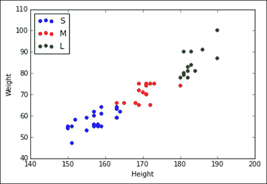
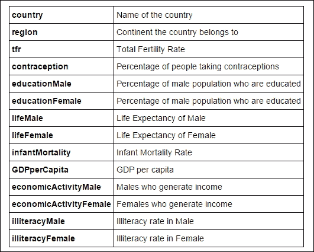
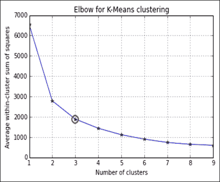
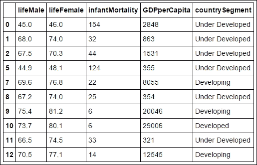
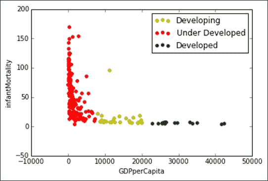
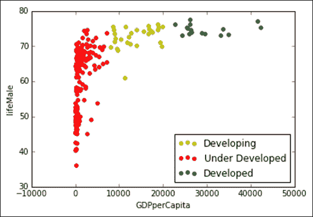

# 第 10 章。通过 K 均值聚类应用细分

聚类属于无监督学习，有助于以一种使组中的实例具有相似特征的方式将一个实例划分为多个组。 亚马逊可能想了解他们的高价值，中价值和低价值用户是谁。 以最简单的形式，我们可以通过将每个用户的总交易金额存储在三个存储桶中来确定这一点。 高价值客户将排在前 20% 的百分比范围内，中值客户将排在第 20 至 80% 的百分比范围内，而最低 20% 的百分比将包含低价值客户。 亚马逊将由此了解他们的高价值客户，并确保在发生某些情况（例如交易付款失败）时会照顾他们。 在这里，我们使用了一个变量，例如交易金额，并且我们手动存储了数据。

我们需要一种算法，该算法可以采用多个变量，并可以帮助我们进行存储分区实例。 K 均值是执行聚类的最流行算法之一，因为它是在聚类下最容易理解的机器学习算法。 此外，细分是将客户分为多个组的过程，而聚类是一种有助于发现组中相似点并帮助将客户分配给特定组的技术。

在本章中，您将学习以下主题：

*   通过 K 均值技术确定理想的簇数
*   用 K 均值算法聚类

# K 均值算法及其工作

K 均值聚类算法通过计算特征的平均值（例如我们用于聚类的变量）来进行操作。 例如，根据平均交易金额和每季度购买的平均产品数量对客户进行细分。 然后，这意味着成为群集的中心。`K`数是聚类数，也就是说，该技术包含计算`K`数的均值，这些均数导致围绕这些 K 均值的数据聚类。

我们如何选择`K`？ 如果我们对所要寻找的东西有所了解，或者期望或想要多少个集群，则可以在启动引擎并进行算法计算之前将`K`设置为该数字。

如果我们不知道有多少个集群，那么我们的探索将花费更长的时间并涉及一些反复试验，例如，当我们尝试`K = 3`，`4`时， 和`5`。

K 均值算法是迭代的。 首先从数据中随机选择`K`点，然后将它们用作聚类中心。 然后，在每个迭代步骤中，此算法都会确定哪些行值最接近聚类中心，并为其分配`K`点。

完成此操作后，我们便有了新的积分安排。 因此，由于聚类的中心或均值可能已更改，因此再次对其进行了计算。 什么时候不转移？ 当我们拥有稳定的集群并且进行迭代直到无法从进一步迭代中受益时，这就是我们的结果。

在某些情况下 K 均值不会收敛，也就是说，没有稳定的簇，但在这里我们不做讨论。 您可以在[这个页面](http://webdocs.cs.ualberta.ca/~nray1/CMPUT466_551/kmeans_convergence.pdf)上进一步了解 K 均值的收敛性。

## 一个简单的例子

在进入 K 均值聚类之前，让我们看一个简单的示例。 我们将在以下各列中使用 T 恤尺寸的数据集：

*   `Size`：这是指 T 恤的尺寸
*   `Height`：这是指一个人的身高
*   `Weight`：这是指一个人的体重

让我们看一下数据：

```py
>>> import numpy as np
>>> import pandas as pd
>>> import matplotlib.pyplot as plt
>>> #Reading the data from the file
>>> df = pd.read_csv('./Data/tshirt_sizes.csv')
>>> print df[:10]

 Height  Weight Size
0     150      54    S
1     150      55    S
2     151      55    S
3     151      47    S
4     152      58    S
5     155      53    S
6     155      59    S
7     157      60    S
8     157      56    S
9     157      55    S

```

我们将绘制人员身高和体重的散点图，并使用以下代码根据 T 恤尺寸将其分组：

```py
>>> d_color = {
 "S": "b",
 "M": "r",
 "L": "g",
 }
>>> fig, ax = plt.subplots()
>>> for size in ["S", "M", "L"]:
 color = d_color[size]
 df[df.Size == size].plot(kind='scatter', x='Height', y='Weight', label=size, ax=ax, color=color)
>>> handles, labels = ax.get_legend_handles_labels()
>>> _ = ax.legend(handles, labels, loc="upper left")

```

执行上述代码后，我们将获得以下输出：


您会看到尺寸小的人，例如身材矮小，身高矮，体重轻且呈蓝色。 类似地，对于其他 T 恤尺寸，人的身高和体重彼此围绕在一起。

在前面的案例中，我们为 T 恤尺寸设置了标签。 但是，如果我们没有随身携带的 T 恤尺寸，而是拥有个人的身高和体重，而我们想根据身高和体重来估算尺寸，那么这就是 K 均值算法可以帮助我们的地方：

```py
>>> from math import sqrt
>>> from scipy.stats.stats import pearsonr 
>>> from sklearn.cluster import KMeans 
>>> from scipy.cluster.vq import kmeans,vq
>>> from scipy.spatial.distance import cdist

>>> km = KMeans(3,init='k-means++', random_state=3425) # initialize
>>> km.fit(df[['Height','Weight']])
>>> df['SizePredict'] = km.predict(df[['Height','Weight']])
>>> df.groupby(['Size','SizePredict']).Size.count()
>>> print pd.crosstab(df.Size
 ,df.SizePredict
 ,rownames = ['Size']
 ,colnames = ['SizePredict'])

SizePredict   0   1   2
Size 
L            13   0   1
M             0   6  14
S             0  15   0

```

我们根据已知的 T 恤尺寸在 K 均值算法中假设了三个聚类（稍后我们将讨论如何确定聚类的数量），然后在“平均长度”中输入身高和体重 K 均值算法。 发布之后，我们将预测存储桶并将这些存储桶分配给`SizePredict`变量。 然后，我们查看实际值与预测值之间的混淆矩阵，以了解预测存储桶所属的位置。 我们可以看到`0`桶属于`L`衬衫尺寸，`1`属于`S`和`2`属于`M`。 现在，将桶映射回 T 恤尺寸并绘制散点图：

```py
>>> c_map = {
 2: "M",
 1: "S",
 0: "L",
 }

>>> df['SizePredict'] = df['SizePredict'].map(c_map)
>>> df['SizePredict'][:10]
0    S
1    S
2    S
3    S
4    S
5    S
6    S
7    S
8    S
9    S
Name: SizePredict, dtype: object

```

现在，我们将绘制散点图：

```py
>>> fig, ax = plt.subplots()
>>> for size in ["S", "M", "L"]:
 color = d_color[size]
 df[df.SizePredict == size].plot(kind='scatter', x='Height', y='Weight', label=size, ax=ax, color=color)
>>> handles, labels = ax.get_legend_handles_labels()
>>> _ = ax.legend(handles, labels, loc="upper left")

```

在执行前面的代码之后，我们将获得以下输出：



从图中可以看出，K 均值算法能够将人们分类到适当的存储桶中，其中衬衫尺寸可用于将存储桶识别为唯一的存储桶。

# 与国家/地区的 K 均值聚类

我们拥有有关世界不同国家/地区有关人员接受国内生产总值教育的联合国数据。 我们将使用这些数据根据国家/地区的发展对其进行分类。 以下是各列的说明：



这是数据的屏幕截图：


让我们看一下每一列的数据类型：

```py
>>> df = pd.read_csv('./Data/UN.csv')
>>> # print the raw column information plus summary header
>>> print('----')
>>> # look at the types of each column explicitly
>>> [(col, type(df[col][0])) for col in df.columns] [(x, type(df[x][0])) for x in df.columns] 
 [('country', str),
 ('region', str),
 ('tfr', numpy.float64),
 ('contraception', numpy.float64),
 ('educationMale', numpy.float64),
 ('educationFemale', numpy.float64),
 ('lifeMale', numpy.float64),
 ('lifeFemale', numpy.float64),
 ('infantMortality', numpy.float64),
 ('GDPperCapita', numpy.float64),
 ('economicActivityMale', numpy.float64),
 ('economicActivityFemale', numpy.float64),
 ('illiteracyMale', numpy.float64),
 ('illiteracyFemale', numpy.float64)]

```

让我们检查列的**填充率**，这基本上是具有值的行和列的百分比：

```py
>>> print('Percentage of the values complete in the columns')
>>> s_col_fill = df.count(0)/df.shape[0] * 100
>>> s_col_fill
country                   100.000000
region                    100.000000
tfr                        95.169082
contraception              69.565217
educationMale              36.714976
educationFemale            36.714976
lifeMale                   94.685990
lifeFemale                 94.685990
infantMortality            97.101449
GDPperCapita               95.169082
economicActivityMale       79.710145
economicActivityFemale     79.710145
illiteracyMale             77.294686
illiteracyFemale           77.294686
dtype: float64

```

我们可以看到，避孕栏后面的教育栏填充率不高。

填充率高的色谱柱的预期寿命为`lifeMale`和`lifeFemale`，`infantMortality`和`GDPperCapita`。 使用这些列，我们将仅删除一些国家，而如果包括其他列，则将删除许多国家。

应该基于男性和女性的预期寿命以及基于一个国家的 GDP 的婴儿死亡率进行聚类影响。 这是因为较高的 GDP 对该国的经济更好，并且一个经济状况良好的国家被认为具有良好的预期寿命和较低的婴儿死亡率：

```py
>>> df = df[['lifeMale', 'lifeFemale', 'infantMortality', 'GDPperCapita']]

>>> df = df.dropna(how='any')

```

## 确定簇数

在应用 K 均值算法之前，我们想估计一个理想的集群数量到称为国家的组：

```py
>>> K = range(1,10)

>>> # scipy.cluster.vq.kmeans
>>> KM = [kmeans(df.values,k) for k in K] # apply kmeans 1 to 10
>>> KM[:3]
[(array([[   63.52606383,    68.30904255,    44.30851064,  5890.59574468]]),    6534.9809626620172),  (array([[  6.12227273e+01,   6.57779221e+01,   5.23831169e+01,  2.19273377e+03],    [  7.39588235e+01,   7.97735294e+01,  7.73529412e+00,    2.26397353e+04]]),    2707.2294867471232), (array([[  7.43050000e+01,   8.02350000e+01,   6.60000000e+00,2.76644500e+04],    [  6.02309353e+01,   6.46640288e+01,  5.61007194e+01,    1.47384173e+03],     [  7.18862069e+01,  7.75551724e+01,   1.37931034e+01,    1.20441034e+04]]),1874.0284870915732)]

```

在前面的代码中，我们定义了 1 到 10 之间的多个簇。使用 SciPy 库的 **K 均值函数**，我们计算了质心，以及这些质心和观测值之间的失真，它们相关于质心和群集的观测值之间的失真：

```py
>>> euclidean_centroid = [cdist(df.values, centroid, 'euclidean') for (centroid,var) in k_clusters]
>>> print '-----with 1 cluster------'
>>> print euclidean_centroid[0][:5]

-----with 1 cluster------
[[ 3044.71049474]
 [ 5027.61602297]
 [ 4359.59802141]
 [ 5536.23755972]
 [ 2164.54439528]]
>>> print '-----with 2 cluster------'
>>> print euclidean_centroid[1][:5]

-----with 2 cluster------
[[ 19792.32574968    663.5918709 ]
 [ 21776.75039319   1329.9326654 ]
 [ 21108.76955936    661.83208396]
 [ 22285.08003662   1839.28608809]
 [ 14584.74322443   5862.36131557]]

```

我们在组的每个簇中取重心，并使用 SciPy 中的`dist`函数计算从空间中所有点到簇的重心的**欧几里德距离**。

您可以看到第一个集群只有一个列，因为它只有一个集群，而第二个集群有两个列，因为它有两个集群：

```py
>>> dist = [np.min(D,axis=1) for D in D_k]
>>> print '-----with 1st cluster------'
>>> print dist[0][:5]
>>> print '-----with 2nd cluster------'
>>> print dist[1][:5]

-----with 1st cluster------
[ 3044.71049474 
5027.61602297 
4359.59802141 
5536.23755972 
2164.54439528]
-----with 2nd cluster------
[  663.5918709 
1329.9326654 
661.83208396 
1839.28608809 
5862.36131557]

```

由于我们具有每个观测点到不同质心的距离，因此可以找到每个观测点到最接近质心的最小距离。

您可以在前面的代码中看到，第一个和第二个聚类包含一个值，即到质心的距离。

现在，我们将计算距离平方和的平均值：

```py
>>> avgWithinSS = [sum(d)/df.values.shape[0] for d in dist]
>>> avgWithinSS

[6534.9809626620136,
 2790.2101193300132,
 1890.9166153060164,
 1438.7793254224125,
 1120.3902815703975,
 903.15438285732,
 740.45942949866003,
 645.91915410445336,
 604.37878538964185]

```

数组中的每个值都是平方的平均和，该平方具有一个群集到一组十个群集。

现在，我们使用以下数据绘制 K 均值聚类的**肘形曲线**（这是曲线开始展平的点）：

```py
>>> #Choosing the cluster number
>>> kIdx = 2

>>> # plot elbow curve
>>> fig = plt.figure()

>>> ax = fig.add_subplot(111)

>>> ax.plot(K, avgWithinSS, 'b*-')

>>> ax.plot(K[kIdx], avgWithinSS[kIdx], marker='o', markersize=12, 
 markeredgewidth=2, markeredgecolor='r', markerfacecolor='None')

>>> plt.grid(True)

>>> plt.xlabel('Number of clusters')

>>> plt.ylabel('Average within-cluster sum of squares')

>>> tt = plt.title('Elbow for K-Means clustering')

```

执行上述代码后，我们将获得以下输出：



通过观察曲线，我们可以看到从一个群集到另一个群集有很大的跳跃，然后从群集`2`到群集`3`出现了显着的跳跃。 从群集`3`到群集`4`略有跳跃，然后跳转到随后的群集数目很小。 让我们将弯头固定在群集`3`上，并创建三个群集以对国家进行细分。

# 聚集国家

现在，我们将应用 K 均值算法将国家/地区聚在一起：

```py
>>> km = KMeans(3, init='k-means++', random_state = 3425) # initialize
>>> km.fit(df.values)
>>> df['countrySegment'] = km.predict(df.values)
>>> df[:5]

```

执行上述代码后，我们将获得以下输出：


让我们找到每个国家/地区细分的人均 GDP：

```py
>>> df.groupby('countrySegment').GDPperCapita.mean()
>>> countrySegment
0    13800.586207
1     1624.538462
2    29681.625000
Name: GDPperCapita, dtype: float64

```

我们可以看到，集群`2`的人均 GDP 最高，我们可以假设其中包括发达国家。 集群`0`的 GDP 排名第二，我们可以假设其中包括发展中国家，最后，集群`1`的人均 GDP 却很低。 我们可以假设这包括发达国家：

```py
>>> clust_map = {
 0:'Developing',
 1:'Under Developed',
 2:'Developed'
 }

>>> df.countrySegment = df.countrySegment.map(clust_map)
>>> df[:10]

```

执行上述代码后，我们将获得以下输出：



让我们看一下每个集群中国家的 GDP 与婴儿死亡率的关系：

```py
>>> d_color = {
 'Developing':'y',
 'Under Developed':'r',
 'Developed':'g'
 }

>>> fig, ax = plt.subplots()
>>> for clust in clust_map.values():
 color = d_color[clust]
 df[df.countrySegment == clust].plot(kind='scatter', x='GDPperCapita', y='infantMortality', label=clust, ax=ax, color=color)
>>> handles, labels = ax.get_legend_handles_labels()
>>> _ = ax.legend(handles, labels, loc="upper right")

```

执行上述代码后，我们将获得以下输出：



从上图可以看出，当 GDP 较低时，`infantMortality`比率确实很高，并且随着 GDP 的增加，`InfantMortality`比率降低。

我们还可以清楚地看到，绿色的国家是欠发达国家，深蓝色的国家是发展中国家，红色的国家是发达国家。

让我们看看男性相对于 GDP 的预期寿命：

```py
>>> fig, ax = plt.subplots()
>>> for clust in clust_map.values():
 color = d_color[clust]
 df[df.countrySegment == clust].plot(kind='scatter', x='GDPperCapita', y='lifeMale', label=clust, ax=ax, color=color)
>>> handles, labels = ax.get_legend_handles_labels()
>>> _ = ax.legend(handles, labels, loc="lower right")

```

执行前面的代码后，我们将获得以下输出：



我们可以看到，不同国家的男性预期寿命也随着 GDP 的增加而增加。

现在，对于女性在 GDP 方面的预期寿命，我们将使用以下代码：

```py
>>> fig, ax = plt.subplots()
>>> for clust in clust_map.values():
 color = d_color[clust]
 df[df.countrySegment == clust].plot(kind='scatter', x='GDPperCapita', y='lifeFemale', label=clust, ax=ax, color=color)
>>> handles, labels = ax.get_legend_handles_labels()
>>> _ = ax.legend(handles, labels, loc="lower right")

```

执行上述代码后，我们将获得以下输出：


女性也有类似的趋势。

# 总结

在本章中，使您了解了聚类的概念，并学习了一种称为 K 均值技术的无监督学习技术。 您还学习了如何在使用 K 均值分割数据之前确定群集的数量，最后，您看到了使用 K 均值群集的结果。

在下一章中，您将学习如何探索非结构化数据以及如何在非结构化数据上使用文本挖掘技术。