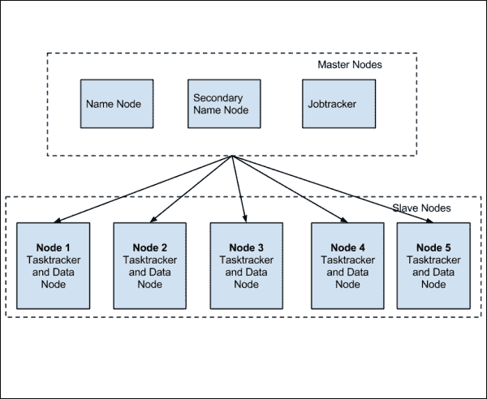
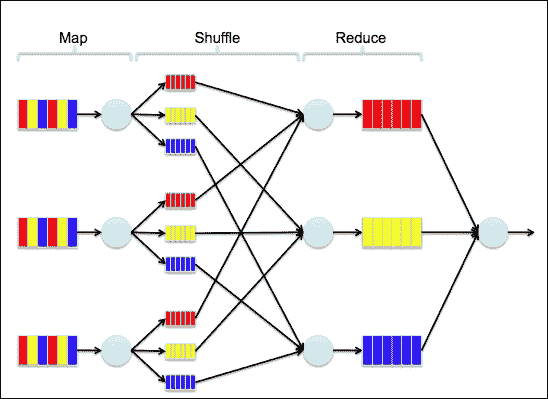
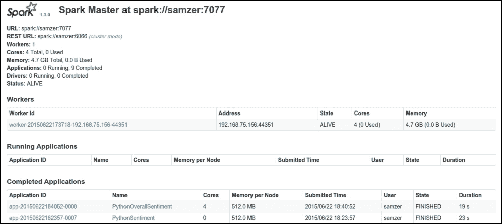

# 第 12 章。在大数据世界中利用 Python

我们每天都在生成越来越多的数据。 与上个世纪相比，本世纪我们生成的数据更多，而距本世纪仅 15 年。 大数据是新的流行语，每个人都在谈论它。 它带来了新的可能性。 借助大数据，Google 翻译可以翻译任何语言。 由于它，我们能够解码我们的人类基因组。 由于大数据，我们可以预测涡轮机的故障并对其进行必要的维护。

大数据有三个 V，它们的定义如下：

*   **卷**：此定义数据的大小。 Facebook 拥有数 PB 的用户数据。
*   **Velocity**：这是生成数据的速率。
*   **品种**：数据不是仅表格形式的。 我们可以从文本，图像和声音中获取数据。 数据也以 JSON，XML 和其他类型的形式出现。

让我们看一下以下屏幕截图：


在本章中，我们将通过以下步骤学习如何在大数据世界中使用 Python：

*   了解 Hadoop
*   用 Python 编写 MapReduce 程序
*   使用 Hadoop 库

# 什么是 Hadoop？

根据 Apache Hadoop 网站的说法，Hadoop 以分布式方式存储数据并有助于计算数据。 它的设计旨在借助计算能力和存储功能轻松地扩展到任意数量的机器。 Hadoop 由 Doug Cutting 和 Mike Cafarella 于 2005 年创建。它以 Doug Cutting 儿子的玩具大象命名。



## 编程模型

Hadoop 是编程范例，它采用大型分布式计算作为对键/值对的大型数据集的分布式操作序列。 MapReduce 框架利用机器集群，并在这些机器上执行 MapReduce 作业。 MapReduce 有两个阶段-映射阶段和简化阶段。 MapReduce 的输入数据是数据的键值对。

在映射阶段，Hadoop 将数据分成较小的部分，然后将其馈送到映射器。 这些映射器分布在集群中的所有计算机上。 每个映射器都采用输入键值对，并通过在其中调用用户定义的函数来生成中间键值对。

在映射器阶段之后，Hadoop 按键对中间数据集进行排序，并生成一组键值元组，以便属于特定键的所有值都在一起。

在 reduce 阶段，reduce 接收中间键值对并调用用户定义的函数，然后该函数生成输出键值对。 Hadoop 在机器之间分配化简器，并为每个化简器分配一组键-值对。



通过 MapReduce 进行数据处理

## MapReduce 架构

MapReduce 具有主从结构，其中主是 JobTracker，而 TaskTracker 是从属。 当将 MapReduce 程序提交给 Hadoop 时，JobTracker 将映射/归约任务分配给 TaskTracker，并在执行程序时接管该任务。

## Hadoop DFS

Hadoop 的分布式文件系统已设计为以分布式方式存储非常大的数据集。 它受到 Google 文件系统的启发，该文件系统是 Google 设计的专有分布式文件系统。 HDFS 中的数据存储在一系列块中，除最后一个块外，所有块的大小均相同。 块大小可在 Hadoop 中配置。

## Hadoop 的 DFS 架构

它还具有主/从体系结构，其中 NameNode 是主计算机，而 DataNode 是从计算机。 实际数据存储在数据节点中。 NameNode 保留一个选项卡，用于存储某些类型的数据以及是否具有所需的复制。 它还通过创建，删除和移动文件系统中的目录和文件来帮助管理文件系统。

# Python MapReduce

可以从[这个页面](https://hadoop.apache.org/)下载并安装 Hadoop。 我们将使用 Hadoop 流 API 来在 Hadoop 中执行 Python MapReduce 程序。 Hadoop Streaming API 可帮助使用具有标准输入和输出的任何程序作为 MapReduce 程序。

我们将使用 Python 编写三个 MapReduce 程序，如下所示：

*   基本字数
*   获取每个评论的情感分数
*   从所有评论中获得总体情感评分

## 基本字数

我们将从字数统计 MapReduce 开始。 将以下代码保存在`word_mapper.py`文件中：

```py
import sys
for l in sys.stdin:
 # Trailing and Leading white space is removed
 l = l.strip()

 # words in the line is split
 word_tokens = l.split()

 # Key Value pair is outputted
 for w in word_tokens:
 print '%s\t%s' % (w, 1)

```

在前面的映射器代码中，文件的每一行都去除了开头和结尾的空白。 然后将该行划分为单词标记，然后将这些单词标记作为`1`的键值对输出。

将以下代码保存在`word_reducer.py`文件中：

```py
from operator import itemgetter
import sys

current_word_token = None
counter = 0
word = None

# STDIN Input
for l in sys.stdin:
 # Trailing and Leading white space is removed
 l = l.strip()

 # input from the mapper is parsed
 word_token, counter = l.split('\t', 1)

 # count is converted to int
 try:
 counter = int(counter)
 except ValueError:
 # if count is not a number then ignore the line
 continue

 #Since Hadoop sorts the mapper output by key, the following
 # if else statement works
 if current_word_token == word_token:
 current_counter += counter
 else:
 if current_word_token:
 print '%s\t%s' % (current_word_token, current_counter)

 current_counter = counter
 current_word_token = word_token

# The last word is outputed
if current_word_token == word_token:
 print '%s\t%s' % (current_word_token, current_counter)

```

在前面的代码中，我们使用`current_word_token`参数来跟踪正在计数的当前单词。 在`for`循环中，我们使用`word_token`参数和一个计数器从键值对中获取值。 然后，我们将计数器转换为`int`类型。

在`if/else`语句中，如果`word_token`值与前一个实例`current_word_token`相同，则我们将继续计算`else`语句的值。 如果它是输出的新单词，则我们输出该单词及其计数。 最后的`if`语句将输出最后一个单词。

我们可以使用以下命令来检查映射器是否工作正常：

```py
$ echo 'dolly dolly max max jack tim max' | ./BigData/word_mapper.py

```

前面的命令的输出如下所示：

```py
dolly1
dolly1
max1
max1
jack1
tim1
max1

```

现在，我们可以通过将化简器管道化到映射器输出的排序列表来检查化简器是否还在正常工作：

```py
$ echo "dolly dolly max max jack tim max" | ./BigData/word_mapper.py | sort -k1,1 | ./BigData/word_reducer.py

```

前面命令的输出如下所示：

```py
dolly2
jack1
max3
tim1

```

现在，让我们尝试在包含`mobydick`摘要的本地文件上应用相同的代码：

```py
$ cat ./Data/mobydick_summary.txt | ./BigData/word_mapper.py | sort -k1,1  | ./BigData/word_reducer.py

```

前面命令的输出如下所示：

```py
a28
A2
abilities1
aboard3
about2

```

## 每个评论的情感评分

我们在上一章中编写了程序来计算情感得分。 我们将对此进行扩展，以编写 MapReduce 程序来确定每个评论的情感评分。 在`senti_mapper.py`文件中编写以下代码：

```py
import sys
import re

positive_words = open('positive-words.txt').read().split('\n')
negative_words = open('negative-words.txt').read().split('\n')

def sentiment_score(text, pos_list, neg_list):
 positive_score = 0
 negative_score = 0

 for w in text.split(''):
 if w in pos_list: positive_score+=1
 if w in neg_list: negative_score+=1

 return positive_score - negative_score

for l in sys.stdin:
 # Trailing and Leading white space is removed
 l = l.strip()

 #Convert to lower case
 l = l.lower()

 #Getting the sentiment score
 score = sentiment_score(l, positive_words, negative_words)

 # Key Value pair is outputted
 print '%s\t%s' % (l, score)

```

在前面的代码中，我们使用了上一章中的`sentiment_score`函数。 对于每一行，我们先去除开头和结尾的空白，然后获得情感评分进行审查。 最后，我们输出一个句子和分数。

对于此程序，我们不需要缩减器，因为我们可以在映射器本身中计算情感，而只需要输出情感分数即可。

让我们通过一个包含《侏罗纪世界》评论的文件来测试映射器是否在本地正常工作：

```py
$ cat ./Data/jurassic_world_review.txt | ./BigData/senti_mapper.py

there is plenty here to divert, but little to leave you enraptored. such is the fate of the sequel: bigger. louder. fewer teeth.0
if you limit your expectations for jurassic world to "more teeth," it will deliver on that promise. if you dare to hope for anything more-relatable characters, narrative coherence-you'll only set yourself up for disappointment.-1
there's a problem when the most complex character in a film is the dinosaur-2
not so much another bloated sequel as it is the fruition of dreams deferred in the previous films. too bad the genre dictates that those dreams are once again destined for disaster.-2

```

我们可以看到我们的程序能够很好地计算情感得分。

## 整体情感评分

要计算总体情感评分，我们需要使用 reducer，我们将使用相同的 mapper，但要进行一些修改。

这是我们将使用存储在`overall_senti_mapper.py`文件中的映射器代码：

```py
import sys
import hashlib

positive_words = open('./Data/positive-words.txt').read().split('\n')
negative_words = open('./Data/negative-words.txt').read().split('\n')

def sentiment_score(text, pos_list, neg_list):
 positive_score = 0
 negative_score = 0

 for w in text.split(''):
 if w in pos_list: positive_score+=1
 if w in neg_list: negative_score+=1
 return positive_score - negative_score

for l in sys.stdin:
 # Trailing and Leading white space is removed
 l = l.strip()
 #Convert to lower case
 l = l.lower()
 #Getting the sentiment score
 score = sentiment_score(l, positive_words, negative_words)
 #Hashing the review to use it as a string
 hash_object = hashlib.md5(l)
 # Key Value pair is outputted
 print '%s\t%s' % (hash_object.hexdigest(), score)

```

该映射器代码与先前的映射器代码相似，但是在这里我们使用`MD5`哈希库进行审查，然后将输出作为键。

这是还原器代码，用于确定电影的整体情感评分。 将以下代码存储在`overall_senti_reducer.py`文件中：

```py
from operator import itemgetter
import sys

total_score = 0

# STDIN Input
for l in sys.stdin:
 # input from the mapper is parsed
 key, score = l.split('\t', 1)
 # count is converted to int
 try:
 score = int(score)
 except ValueError:
 # if score is not a number then ignore the line
 continue

 #Updating the total score 
 total_score += score

print '%s' % (total_score,)

```

在前面的代码中，我们剥离包含分数的值，然后继续添加到`total_score`变量中。 最后，我们输出`total_score`变量，该变量显示了电影的情感。

让我们在本地测试《侏罗纪世界》的整体情感，这是一部好电影，然后测试电影《未完成的商业》的情感，这部电影被认为很差：

```py
$ cat ./Data/jurassic_world_review.txt | ./BigData/overall_senti_mapper.py | sort -k1,1 | ./BigData/overall_senti_reducer.py
19

$ cat ./Data/unfinished_business_review.txt | ./BigData/overall_senti_mapper.py | sort -k1,1 | ./BigData/overall_senti_reducer.py
-8

```

我们可以看到我们的代码运行良好，并且我们也看到侏罗纪世界的得分更高，这意味着人们非常喜欢它。 相反，“未完成的业务”具有负值，表明人们不太喜欢它。

## 在 Hadoop 上部署 MapReduce 代码

我们将在 HDFS `tmp`文件夹中为[Moby Dick]，《侏罗纪世界》和《未完成的业务》中的数据创建一个目录：

```py
$ Hadoop fs -mkdir /tmp/moby_dick
$ Hadoop fs -mkdir /tmp/jurassic_world
$ Hadoop fs -mkdir /tmp/unfinished_business

```

让我们检查是否创建了文件夹：

```py
$ Hadoop fs -ls /tmp/

Found 6 items
drwxrwxrwx   - mapred Hadoop          0 2014-11-14 15:42 /tmp/Hadoop-mapred
drwxr-xr-x   - samzer Hadoop          0 2015-06-18 18:31 /tmp/jurassic_world
drwxrwxrwx   - hdfs   Hadoop          0 2014-11-14 15:41 /tmp/mapred
drwxr-xr-x   - samzer Hadoop          0 2015-06-18 18:31 /tmp/moby_dick
drwxr-xr-x   - samzer Hadoop          0 2015-06-16 18:17 /tmp/temp635459726
drwxr-xr-x   - samzer Hadoop          0 2015-06-18 18:31 /tmp/unfinished_business

```

创建文件夹后，让我们将数据文件复制到相应的文件夹中。

```py
$ Hadoop fs -copyFromLocal ./Data/mobydick_summary.txt /tmp/moby_dick
$ Hadoop fs -copyFromLocal ./Data/jurassic_world_review.txt /tmp/jurassic_world
$ Hadoop fs -copyFromLocal ./Data/unfinished_business_review.txt /tmp/unfinished_business

```

让我们验证文件是否已复制：

```py
$ Hadoop fs -ls /tmp/moby_dick
$ Hadoop fs -ls /tmp/jurassic_world
$ Hadoop fs -ls /tmp/unfinished_business
Found 1 items
-rw-r--r--   3 samzer Hadoop       5973 2015-06-18 18:34 /tmp/moby_dick/mobydick_summary.txt
Found 1 items
-rw-r--r--   3 samzer Hadoop       3185 2015-06-18 18:34 /tmp/jurassic_world/jurassic_world_review.txt
Found 1 items
-rw-r--r--   3 samzer Hadoop       2294 2015-06-18 18:34 /tmp/unfinished_business/unfinished_business_review.txt

```

我们可以看到文件已成功复制。

使用以下命令，我们将在 Hadoop 中执行映射器和化简器的脚本。 在此命令中，我们定义了映射器，化简器，输入和输出文件的位置，然后使用 Hadoop 流执行脚本。

让我们先执行字数统计程序：

```py
$ Hadoop jar /usr/lib/Hadoop-0.20-mapreduce/contrib/streaming/Hadoop-*streaming*.jar -file ./BigData/word_mapper.py -mapper word_mapper.py -file ./BigData/word_reducer.py -reducer word_reducer.py -input /tmp/moby_dick/* -output /tmp/moby_output

```

让我们验证一下 MapReduce 字数统计程序是否成功运行：

```py
$ Hadoop fs -cat /tmp/moby_output/*

```

前面命令的输出如下所示：

```py
(Queequeg1
A2
Africa1
Africa,1
After1
Ahab13
Ahab,1
Ahab's6
All1
American1
As1
At1
Bedford,1
Bildad1
Bildad,1
Boomer,2
Captain1
Christmas1
Day1
Delight,1
Dick6
Dick,2

```

该程序正在按预期工作。 现在，我们将部署该程序来计算每个评论的情感分数。 请注意，我们可以将正负字典文件添加到 Hadoop 流中：

```py
$ Hadoop jar /usr/lib/hadoop-0.20-mapreduce/contrib/streaming/hadoop-*streaming*.jar -file ./BigData/word_mapper.py -mapper word_mapper.py -file ./BigData/word_reducer.py -reducer word_reducer.py -input /tmp/moby_dick/* -output /tmp/moby_output

```

在前面的代码中，我们将 Hadoop 命令与 Hadoop 流 JAR 文件一起使用，然后定义映射器和 reducer 文件，最后定义 Hadoop 中的输入和输出目录。

让我们检查一下电影评论的情感评分：

```py
$ Hadoop fs -cat /tmp/jurassic_output/*

```

前面命令的输出如下所示：

```py
"jurassic world," like its predecessors, fills up the screen with roaring, slathering, earth-shaking dinosaurs, then fills in mere humans around the edges. it's a formula that works as well in 2015 as it did in 1993.3
a perfectly fine movie and entertaining enough to keep you watching until the closing credits.4
an angry movie with a tragic moral ... meta-adoration and criticism ends with a genetically modified dinosaur fighting off waves of dinosaurs.-3
if you limit your expectations for jurassic world to "more teeth," it will deliver on that promise. if you dare to hope for anything more-relatable characters, narrative coherence-you'll only set yourself up for disappointment.-1

```

该程序也按预期工作。 现在，我们将尝试一部电影的整体情感：

```py
$ Hadoop jar /usr/lib/Hadoop-0.20-mapreduce/contrib/streaming/Hadoop-*streaming*.jar -file ./BigData/overall_senti_mapper.py -mapper

```

让我们验证结果：

```py
$ Hadoop fs -cat /tmp/unfinished_business_output/*

```

前面命令的输出如下所示：

```py
-8

```

我们可以看到，总体情感分数来自 MapReduce。 这是 JobTracker 状态页面的屏幕截图：


上图显示了一个门户，可以在其中查看提交给 JobTracker 的作业并查看其状态。 这可以在主系统的端口`50070`上看到。

从前面的图像中，我们可以看到一个作业正在运行，并且图像上方的状态表明该作业已成功完成。

# 使用 Hadoopy 处理文件

**Hadoopy** 是 Python 中的一个库，它提供了一个与 Hadoop 交互以管理文件并对其执行 MapReduce 的 API。 可以从[这个页面](http://www.Hadoopy.com/en/latest/tutorial.html#installing-Hadoopy)下载 Hadoopy。

让我们尝试通过 Hadoopy 在 HDFS 内创建的目录`data`中将一些文件放入 Hadoopy 中：

```py
$ Hadoop fs -mkdir data

```

这是将数据放入 HDFS 的代码：

```py
importHadoopy
import os
hdfs_path = ''
def read_local_dir(local_path):
 for fn in os.listdir(local_path):
 path = os.path.join(local_path, fn)
 if os.path.isfile(path):
 yield path

def main():
 local_path = './BigData/dummy_data'
 for file in  read_local_dir(local_path):
 Hadoopy.put(file, 'data')
 print"The file %s has been put into hdfs"% (file,)

if __name__ =='__main__':
 main()
The file ./BigData/dummy_data/test9 has been put into hdfs
The file ./BigData/dummy_data/test7 has been put into hdfs
The file ./BigData/dummy_data/test1 has been put into hdfs
The file ./BigData/dummy_data/test8 has been put into hdfs
The file ./BigData/dummy_data/test6 has been put into hdfs
The file ./BigData/dummy_data/test5 has been put into hdfs
The file ./BigData/dummy_data/test3 has been put into hdfs
The file ./BigData/dummy_data/test4 has been put into hdfs
The file ./BigData/dummy_data/test2 has been put into hdfs

```

在前面的代码中，我们列出目录中的所有文件，然后使用 Hadoopy 的`put()`方法将每个文件放入 Hadoop。

让我们检查是否所有的文件都已放入 HDFS：

```py
$ Hadoop fs -ls data

```

前面命令的输出如下所示：

```py
Found 9 items
-rw-r--r--   3 samzer Hadoop          0 2015-06-23 00:19 data/test1
-rw-r--r--   3 samzer Hadoop          0 2015-06-23 00:19 data/test2
-rw-r--r--   3 samzer Hadoop          0 2015-06-23 00:19 data/test3
-rw-r--r--   3 samzer Hadoop          0 2015-06-23 00:19 data/test4
-rw-r--r--   3 samzer Hadoop          0 2015-06-23 00:19 data/test5
-rw-r--r--   3 samzer Hadoop          0 2015-06-23 00:19 data/test6
-rw-r--r--   3 samzer Hadoop          0 2015-06-23 00:19 data/test7
-rw-r--r--   3 samzer Hadoop          0 2015-06-23 00:19 data/test8
-rw-r--r--   3 samzer Hadoop          0 2015-06-23 00:19 data/test9

```

因此，我们已经成功地能够将文件放入 HDFS。

# 猪

**Pig** 是一个平台，具有一种非常有表达力的语言，可以执行数据转换和查询。 用 Pig 编写的代码是以脚本方式完成的，并将其编译为 MapReduce 程序，该程序在 Hadoop 上执行。 下图是 Pig Latin 的徽标：


猪徽标

Pig 帮助降低原始级别的 MapReduce 程序的复杂性，并使用户能够执行快速转换。

Pig Latin 是的文字语言，可以从[这个页面](http://pig.apache.org/docs/r0.7.0/piglatin_ref2.html)学习。

我们将介绍如何使用 Pig 来执行最常出现的 10 个单词，然后我们将了解如何在 Python 中创建可以在 Pig 中使用的函数。

让我们从字数开始。 这是 Pig 拉丁代码，您可以将其保存在`pig_wordcount.py`文件中：

```py
data = load '/tmp/moby_dick/';
word_token = foreach data generate flatten(TOKENIZE((chararray)$0)) as word;
group_word_token = group word_token by word;
count_word_token = foreach group_word_token generate COUNT(word_token) as cnt, group;
sort_word_token = ORDER count_word_token by cnt DESC;
top10_word_count = LIMIT sort_word_token 10;
DUMP top10_word_count;

```

在前面的代码中，我们可以加载 Moby Dick 的摘要，然后将其逐行标记化，并基本上拆分成各个元素。 flatten 函数将一行中单个单词标记的集合转换为逐行形式。 然后，我们对单词进行分组，然后对每个单词进行单词计数。 最后，我们按降序对单词计数进行排序，然后将单词计数限制在前 10 行，以获取出现次数最多的前 10 个单词。

让我们执行前面的 Pig 脚本：

```py
$ pig ./BigData/pig_wordcount.pig

```

前面命令的输出如下所示：

```py
(83,the)
(36,and)
(28,a)
(25,of)
(24,to)
(15,his)
(14,Ahab)
(14,Moby)
(14,is)
(14,in)

```

我们能够获得前 10 个字。 现在让我们使用 Python 创建用户定义的函数，该函数将在 Pig 中使用。

我们将定义两个用户定义的函数来对句子的正面和负面情绪进行评分。

以下代码是用于对积极情绪进行评分的 UDF，可在`positive_sentiment.py`文件中找到该代码：

```py
positive_words = [ 'a+', 'abound', 'abounds', 'abundance', 'abundant', 'accessable', 'accessible', 'acclaim', 'acclaimed', 'acclamation', 'acco$ ]

@outputSchema("pnum:int")
def sentiment_score(text):
 positive_score = 0
 for w in text.split(''):
 if w in positive_words: positive_score+=1
 return positive_score

```

在前面的代码中，我们定义了`sentiment_score()`函数使用的肯定单词列表。 该功能检查句子中的肯定词，最后输出它们的总数。 有一个`outputSchema()`装饰器，用于告诉 Pig 输出什么类型的数据，在我们的情况下为`int`。

这是评分负面情绪的代码，在`negative_sentiment.py`文件中可用。 该代码几乎类似于积极情绪：

```py
negative_words = ['2-faced', '2-faces', 'abnormal', 'abolish', 'abominable', 'abominably', 'abominate', 'abomination', 'abort', 'aborted', 'ab$....]

@outputSchema("nnum:int")
def sentiment_score(text):
 negative_score = 0
 for w in text.split(''):
 if w in negative_words: negative_score-=1
 return  negative_score

```

Pig 使用以下代码来评分侏罗纪世界评论的情绪，并且在`pig_sentiment.pig`文件中可用：

```py
register 'positive_sentiment.py' using org.apache.pig.scripting.jython.JythonScriptEngine as positive;

register 'negative_sentiment.py' using org.apache.pig.scripting.jython.JythonScriptEngine as negative;

data = load '/tmp/jurassic_world/*';

feedback_sentiments = foreach data generate LOWER((chararray)$0) as feedback, positive.sentiment_score(LOWER((chararray)$0)) as psenti,
negative.sentiment_score(LOWER((chararray)$0)) as nsenti;

average_sentiments = foreach feedback,feedback_sentiments generate psenti + nsenti;

dump average_sentiments;

```

在前面的 Pig 脚本中，我们首先使用 register 命令注册 Python UDF 脚本，并为其指定适当的名称。 然后，我们加载《侏罗纪世界》评论。 然后，我们将评论转换为小写形式，并对评论的正面和负面情绪进行评分。 最后，我们添加分数以获得评论的总体感觉。

让我们执行 Pig 脚本并查看结果：

```py
$ pig ./BigData/pig_sentiment.pig

```

前面命令的输出如下所示：

```py
(there is plenty here to divert, but little to leave you enraptored. such is the fate of the sequel: bigger. louder. fewer teeth.,0)
(if you limit your expectations for jurassic world to "more teeth," it will deliver on that promise. if you dare to hope for anything more-relatable characters, narrative coherence-you'll only set yourself up for disappointment.,-1)
(there's a problem when the most complex character in a film is the dinosaur,-2)
(not so much another bloated sequel as it is the fruition of dreams deferred in the previous films. too bad the genre dictates that those dreams are once again destined for disaster.,-2)
(a perfectly fine movie and entertaining enough to keep you watching until the closing credits.,4)
(this fourth installment of the jurassic park film series shows some wear and tear, but there is still some gas left in the tank. time is spent to set up the next film in the series. they will keep making more of these until we stop watching.,0)

```

我们已经成功地在 Pig 中使用 Python UDF 评分了《侏罗纪世界》评论的情绪。

# 带有 Apache Spark 的 Python

**Apache Spark** 是在 HDFS 之上工作的计算框架，并提供类似于 MapReduce 的另一种计算方式。 它是由 UC Berkeley 的 AmpLab 开发的。 因此，Spark 主要在内存中进行计算，因此比 MapReduce 快得多，并且由于它能够很好地处理迭代工作负载，因此非常适合机器学习。


Spark 使用 **RDD**（**弹性分布式数据集**）的编程抽象，其中数据按逻辑分配到分区中，并且可以在此数据之上执行转换。

Python 是用于与 Apache Spark 进行交互的语言之一，我们将创建一个程序来对 Jurassic Park 的每次评论以及整体情绪进行情绪评分。

您可以按照[这个页面](https://spark.apache.org/docs/1.0.1/spark-standalone.html)上的说明安装 Apache Spark。

## 评估情绪

这是 Python 代码，用于对该情感进行评分：

```py
from __future__ import print_function
import sys
from operator import add
from pyspark import SparkContext
positive_words = open('positive-words.txt').read().split('\n')
negative_words = open('negative-words.txt').read().split('\n')
def sentiment_score(text, pos_list, neg_list):
 positive_score = 0
 negative_score = 0
 for w in text.split(''):
 if w in pos_list: positive_score+=1
 if w in neg_list: negative_score+=1
 return positive_score - negative_score
if __name__ == "__main__":
 if len(sys.argv) != 2:
 print("Usage: sentiment <file>", file=sys.stderr)
 exit(-1)
 sc = SparkContext(appName="PythonSentiment")
 lines = sc.textFile(sys.argv[1], 1)
 scores = lines.map(lambda x: (x, sentiment_score(x.lower(), positive_words, negative_words)))
 output = scores.collect()
 for (key, score) in output:
 print("%s: %i" % (key, score))
 sc.stop()

```

在前面的代码中，我们定义了标准的`sentiment_score()`函数，我们将对其进行重用。 `if`语句检查是否提供了 Python 脚本和文本文件。 `sc`变量是具有`PythonSentiment`应用名称的 Spark 上下文对象。 参数中的文件名通过`sc`变量的`textFile()`方法传递到 Spark 中。 在 Spark 的`map()`函数中，我们定义了`lambda`函数，在该函数中传递了文本文件的每一行，然后获得了该行及其各自的情感评分。 输出变量获取结果，最后，我们将结果打印在屏幕上。

让我们为《侏罗纪世界》的每条评论打分。 用您的主机名替换`<hostname>`，这足够了：

```py
$ ~/spark-1.3.0-bin-cdh4/bin/spark-submit --master spark://<hostname>:7077 ./BigData/spark_sentiment.py hdfs://localhost:8020/tmp/jurassic_world/*

```

对于前面的命令，我们将获得以下输出：

```py
There is plenty here to divert but little to leave you enraptured. Such is the fate of the sequel: Bigger, Louder, Fewer teeth: 0
If you limit your expectations for Jurassic World to more teeth, it will deliver on this promise. If you dare to hope for anything more—relatable characters or narrative coherence—you'll only set yourself up for disappointment:-1

```

我们可以看到我们的 Spark 程序能够为每条评论打分。 情感分数输出末尾的数字表明，如果评论为肯定或否定，则情感分数的数字越高—评论越好，而情感分数的数字越负—否定 审查已经。

我们使用带有以下参数的 Spark Submit 命令：

*   Spark 系统的主节点
*   包含转换命令的 Python 脚本
*   Python 脚本的参数

## 整体情绪

这是一个 Spark 程序，用于对所有评论的总体情感进行评分：

```py
from __future__ import print_function
import sys
from operator import add
from pyspark import SparkContext
positive_words = open('positive-words.txt').read().split('\n')
negative_words = open('negative-words.txt').read().split('\n')
def sentiment_score(text, pos_list, neg_list):
 positive_score = 0
 negative_score = 0
 for w in text.split(''):
 if w in pos_list: positive_score+=1
 if w in neg_list: negative_score+=1
 return positive_score - negative_score
if __name__ =="__main__":
 if len(sys.argv) != 2:
 print("Usage: Overall Sentiment <file>", file=sys.stderr)
 exit(-1)
 sc = SparkContext(appName="PythonOverallSentiment")
 lines = sc.textFile(sys.argv[1], 1)
 scores = lines.map(lambda x: ("Total", sentiment_score(x.lower(), positive_words, negative_words)))\
 .reduceByKey(add)
 output = scores.collect()
 for (key, score) in output:
 print("%s: %i"% (key, score))
 sc.stop()

```

在前面的代码中，我们添加了`reduceByKey()`方法，该方法通过添加输出值来减小该值，并且还将`key`定义为`Total`，以便基于单个键降低所有分数 。

让我们尝试一下前面的代码，以全面了解《侏罗纪世界》。 用您的主机名替换`<hostname>`，这足够了：

```py
$ ~/spark-1.3.0-bin-cdh4/bin/spark-submit --master spark://<hostname>:7077 ./BigData/spark_overall_sentiment.py hdfs://localhost:8020/tmp/jurassic_world/*

```

前面命令的输出如下所示：

```py
Total: 19

```

我们可以看到 Spark 的整体情感得分为`19`。

可以在浏览器中的 Spark 主站的`8080`端口上查看在 Spark 上执行的应用程序。 这是它的屏幕截图：



我们可以看到 Spark 的节点数，当前正在执行的应用程序以及已执行的应用程序的数量。

# 摘要

在本章中，向您介绍了大数据，了解了 Hadoop 软件的工作方式以及与之相关的架构。 然后，您学习了如何为 MapReduce 程序创建一个映射器和一个 reducer，如何在本地对其进行测试，然后将其放入 Hadoop 并进行部署。 然后，您被介绍到 Hadoopy 库中，并且使用该库，您能够将文件放入 Hadoop。 您还了解了 Pig 以及如何使用它创建用户定义的函数。 最后，您了解了 Apache Spark，它是 MapReduce 的替代品，以及如何使用它来执行分布式计算。

在本章中，我们的旅程已经结束，您应该处于使用 Python 执行数据科学任务的状态。 从这里开始，您可以参加[这个页面](https://www.kaggle.com/)上的 Kaggle 竞赛，以提高您解决实际问题的数据科学技能。 这将微调您的技能，并帮助您了解如何解决分析问题。

另外，您可以在[这个页面](https://www.coursera.org/learn/machine-learning)上注册来学习机器学习的 Andrew NG 课程，以了解机器学习算法背后的细微差别。