# 时间序列简介

近年来，目睹了统计和机器学习的广泛应用，以从几乎所有工业领域的数据中得出可行的见解和商业价值。 因此，业务分析师和软件专业人员必须能够处理不同类型的数据集。 通常，数据是时间序列，以一系列有关系统或过程的定量观察的形式出现，并在连续的时间点进行。 通常，时间点之间的距离是相等的。 时间序列数据的示例包括国内生产总值，销售量，股票价格，在数年，数月，数天，数小时等的时间范围内记录的天气属性。 观察的频率取决于变量的性质及其应用。 例如，每年公开报告用于衡量一个国家的年度经济进步的国内生产总值。 销量每月，每季度或每两年发布一次，尽管较长时间的数字可能是通过汇总更细粒度的数据（例如每日或每周的销量）而生成的。 每秒都有关于股票价格和天气属性的信息。 另一方面，有几个物理过程会在几分之一秒内生成时间序列数据。

成功利用时间序列数据将导致随着时间的推移监视系统的运行状况。 例如，从其季度利润率跟踪公司的业绩。 时间序列分析旨在将这些数据用于多种目的，可以大致归类为：

*   理解和解释随着时间推移产生观察到的系统或过程状态的潜在力量
*   根据可观察的特征预测系统或过程的未来状态

为了实现上述目标，时间序列分析应用了不同的统计方法来探索和建模时间序列数据的内部结构，例如趋势，季节性波动，周期性行为和不规则变化。 存在几种数学技术和编程工具可以有效地设计计算机程序，这些程序可以探索，可视化和建模时间序列数据中的模式。

但是，在深入研究这些技术之前，本章旨在解释以下两个方面：

*   时间序列数据与非时间序列数据之间的差异
*   时间序列的内部结构（在上一段中已经简要提及了其中的一些）

对于解决问题，读者会发现本章有用以：

*   区分时间序列数据和非时间序列数据，因此选择正确的方法来表述和解决给定的问题。
*   为时间序列问题选择适当的技术。 根据应用程序的不同，可以选择将重点放在时间序列数据的一个或多个内部结构上。

在本章的最后，您将了解您在分析项目中可能必须处理的不同类型的数据集，并能够区分时间序列与非时间序列。 您还将了解使数据成为时间序列的特殊内部数据结构。 从本章中学到的总体概念将有助于选择处理时间序列的正确方法。

本章将涵盖以下几点：

*   了解您在分析项目中可能遇到的不同类型的数据
*   了解构成时间序列的数据的内部结构
*   自相关是时间序列的最重要的内部结构，通常是时间序列分析的主要重点

# 不同类型的数据

业务分析师和数据科学家在其分析项目中会遇到许多不同类型的数据。 在学术和工业项目中通常可以找到的大多数数据可以大致分为以下几类：

*   横截面数据
*   时间序列数据
*   面板数据

了解解决问题所需的数据类型以及可以从可用资源中获取哪种类型的数据对于提出问题和选择正确的分析方法非常重要。

# 横截面数据

人口的横截面数据或横截面是通过在同一时间点从多个人的观察中获得的。 横截面数据可以包含在不同时间点获得的观察结果，但是，在这种情况下，时间本身在分析中没有任何重要作用。 特定年份中高中生的 SAT 分数是横断面数据的一个示例。 给定年份中国家的国内生产总值是横截面数据的另一个示例。 用于客户流失分析的数据是横截面数据的另一个示例。 请注意，在学生的 SAT 分数和国家/地区 GDP 的情况下，所有观测值都是在一年内进行的，这使两个数据集具有横截面。 本质上，在两种情况下，横截面数据都代表给定时间实例的快照。 但是，可以从诸如数年和数月之类的时间范围内获得用于客户流失分析的客户数据。 但是出于分析目的，时间可能不会发挥重要作用，因此尽管客户流失数据可能来自多个时间点，但仍可以将其视为横截面数据集。

通常，对横截面数据的分析从绘制变量图开始，以可视化它们的统计属性，例如集中趋势，离散度，偏度和峰度。 下图以 2010 年军费开支占 85 个国家的国内生产总值百分比的单变量示例对此进行了说明。通过采用一年的数据，我们可以确保其横截面性质。 该图结合了标准化的直方图和核密度图，以突出显示军事费用数据的不同统计属性。

从该图可以明显看出，军事支出略有偏斜，大约在 1.0％左右达到最高峰。 在 6.0％和 8.0％附近也可以观察到几个次要峰。

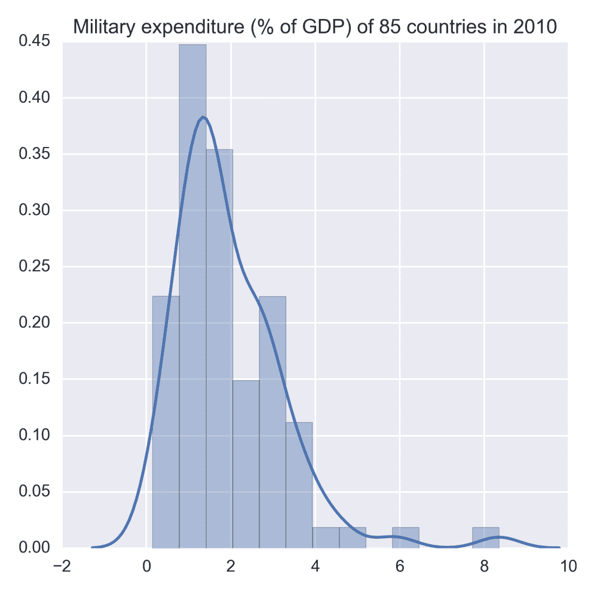

图 1.1：单变量横截面数据示例

还可以对多个变量进行探索性数据分析（例如上图中的数据分析），以了解它们的联合分布。 让我们通过考虑这些国家的中央政府的总债务及其 2010 年的军费开支来说明双变量分析。下图以**核密度图**的形式显示了这些变量的联合分布。 双变量联合分布表明两者之间没有明显的相关性，只是军事支出和中央政府债务的价值较低。


图 1.2：双变量横截面数据示例

值得注意的是，如前面的示例所示，横截面数据的分析超出了探索性数据分析和可视化的范围。 诸如横截面回归之类的高级方法在几个解释变量和因变量之间拟合了线性回归模型。 例如，在客户流失分析的情况下，目标可能是在由搅动或不搅动描述的顾客属性和顾客行为之间拟合逻辑回归模型。 逻辑回归模型是离散和二进制结果的广义线性回归的一种特殊情况。 它解释了导致客户流失的因素，并可以预测新客户的结果。 由于时间不是此类横截面数据中的关键因素，因此可以在将来的某个时间点为新客户获得预测。 在本书中，我们讨论了对时间序列数据进行建模的技术，其中时间和观测的顺序性质是进行分析的关键因素。

有关国家军事支出和国债的示例数据集已从世界银行的开放数据目录中下载。 您可以在本书的 GitHub 存储库的`datasets`文件夹下的`WDIData.csv`文件中找到数据。

本书中的所有示例均附带有相同的 Python 实现。 因此，现在让我们讨论为生成上述图形而编写的 Python 程序。 在绘制图形之前，我们必须将数据集读入 Python，并根据数据集中发现的列和行熟悉数据的基本结构。 本书中用于示例和图形的数据集为 Excel 或 CSV 格式。 我们将使用`pandas`包来读取和处理数据。 为了可视化，使用了`matplotlib`和`seaborn`。 让我们首先导入所有程序包以运行此示例：

```
from __future__ import print_function 
import os 
import pandas as pd 
import numpy as np 
%matplotlib inline 
from matplotlib import pyplot as plt 
import seaborn as sns 
```

`print_function`已从`__future__`包中导入，以使`print`可以作为可能使用 Python 2.x 版本的读者的功能。 在 Python 3.x 中，默认情况下`print`是一个函数。 由于此代码是从 IPython 笔记本编写和执行的，因此`%matplotlib inline`可确保正确导入图形包并使其可在笔记本的 HTML 环境中工作。 `os`程序包用于如下设置工作目录：

```
os.chdir('D:\Practical Time Series') 
```

现在，我们从 CSV 文件中读取数据并显示有关其的基本信息：

```
data = pd.read_csv('datasets/WDIData.csv') 
print('Column names:', data.columns) 
```

这为我们提供了以下输出，显示了数据集的列名：

```
Column names: Index([u'Country Name', u'Country Code', u'Indicator Name', 
     u'Indicator Code', u'1960', u'1961', u'1962', u'1963', u'1964',  u'1965', 
       u'1966', u'1967', u'1968', u'1969', u'1970', u'1971', u'1972', u'1973', 
       u'1974', u'1975', u'1976', u'1977', u'1978', u'1979', u'1980', u'1981', 
       u'1982', u'1983', u'1984', u'1985', u'1986', u'1987', u'1988', u'1989', 
       u'1990', u'1991', u'1992', u'1993', u'1994', u'1995', u'1996', u'1997', 
       u'1998', u'1999', u'2000', u'2001', u'2002', u'2003', u'2004', u'2005', 
       u'2006', u'2007', u'2008', u'2009', u'2010', u'2011', u'2012', u'2013', 
       u'2014', u'2015', u'2016'], 
      dtype='object') 
```

通过运行以下行，我们还可以从行和列数的角度了解数据的大小：

```
print('No. of rows, columns:', data.shape) 
```

这将返回以下输出：

```
No. of rows, columns: (397056, 62) 
```

该数据集具有近 40 万行，因为它捕获了 264 个不同国家的 1504 个世界发展指标。 通过运行以下四行，可以获取有关指标和国家/地区的唯一数目的信息：

```
nb_countries = data['Country Code'].unique().shape[0] 
print('Unique number of countries:', nb_countries) 
```

从数据结构上看，每一行都给出了有关由`Indicator Name`和`Indicator Code`列标识的指标以及对于国家/地区的观察值，该指标由`Country Name`和`Country Code`列表明。 列`1960`至`2016`具有相同时间段内的指标值。 基于对`DataFrame`中数据布局方式的了解，我们现在可以提取与可视化相关的行和列。

让我们首先准备另外两个`DataFrames`，它们得到与所有国家的指标`Total Central Government Debt (as % of GDP)`和`Military expenditure (% of GDP)`相对应的行。 这是通过将原始`DataFrame`切片如下来完成的：

```
central_govt_debt = data.ix[data['Indicator Name']=='Central government debt, total (% of GDP)'] 
military_exp = data.ix[data['Indicator Name']=='Military expenditure (% of GDP)'] 
```

前两行创建两个新的`DataFrames`，即`central_govt_debt`和`military_exp`。 通过运行以下两行，可以快速检查这些`DataFrames`的形状：

```
print('Shape of central_govt_debt:', central_govt_debt.shape) 
print('Shape of military_exp:', military_exp.shape) 
```

这些行返回以下输出：

```
Shape of central_govt_debt: (264, 62) 
Shape of military_exp: (264, 62) 
```

这些`DataFrames`具有我们需要的所有信息。 为了在上图中绘制单变量和双变量横截面数据，我们需要`2010`列。 在实际运行绘图代码之前，让我们快速检查`2010`列是否丢失。 这是通过以下两行完成的：

```
central_govt_debt['2010'].describe() 
military_exp['2010'].describe() 
```

分别产生以下输出：

```
count     93.000000 
mean      52.894412 
std       30.866372 
min        0.519274 
25%             NaN 
50%             NaN 
75%             NaN 
max      168.474953 
Name: 2010, dtype: float64 
count    194.000000 
mean       1.958123 
std        1.370594 
min        0.000000 
25%             NaN 
50%             NaN 
75%             NaN 
max        8.588373 
Name: 2010, dtype: float64 
```

这就告诉我们 describe 函数无法计算第 25 个<sup xmlns:epub="http://www.idpf.org/2007/ops" class="calibre23">，第<sup xmlns:epub="http://www.idpf.org/2007/ops" class="calibre23">个</sup>和第 75 <sup xmlns:epub="http://www.idpf.org/2007/ops" class="calibre23">个</sup>的四分位数，因此有一些遗漏的值需要避免 。</sup>

另外，我们希望`Country Code`列成为行索引。 因此，执行以下几行：

```
central_govt_debt.index = central_govt_debt['Country Code'] 
military_exp.index = military_exp['Country Code'] 
```

接下来，我们通过从`central_govt_debt`和`military_exp`中获取非空的`2010`列来创建两个`pandas.Series`。 然后将新创建的`Series`对象合并为一个`DataFrame`：

```
central_govt_debt_2010 = central_govt_debt['2010'].ix[~pd.isnull(central_govt_debt['2010'])] 
military_exp_2010 = military_exp['2010'].ix[~pd.isnull(military_exp['2010'])] 
data_to_plot = pd.concat((central_govt_debt_2010, military_exp_2010), axis=1) 
data_to_plot.columns = ['central_govt_debt', 'military_exp'] 
data_to_plot.head() 
```

前几行返回下表，该表表明并非所有国家都掌握 2010 年中央政府债务和军事费用的信息：

|  | **central_govt_debt** | **Military_exp** |
| 美国空军 | NaN | 1.897473 |
| 前 | NaN | 4.244884 |
| 白色的 | NaN | 1.558592 |
| ARB | NaN | 5.122879 |
| 是 | NaN | 6.119468 |
| 生气的 | NaN | 0.814878 |
| 手臂 | NaN | 4.265646 |
| ATG | 75.289093 | NaN |
| 出去 | 29.356946 | 1.951809 |
| 或者 | 79.408304 | 0.824770 |

要作图，我们只需要选择既有中央政府债务又有军事费用的国家。 运行以下行，以筛选出缺少值的行：

```
data_to_plot = data_to_plot.ix[(~pd.isnull(data_to_plot.central_govt_debt)) & (~pd.isnull(data_to_plot.military_exp)), :] 
```

通过运行以下行，可以显示已过滤的`DataFrame`的前五行：

```
data_to_plot.head() 
```

|  | central_govt_debt | Military_exp |
| --- | --- | --- |
| 出去 | 29.356946 | 1.951809 |
| 或者 | 79.408304 | 0.824770 |
| AZE | 6.385576 | 2.791004 |
| 贝尔 | 7.022605 | 1.084631 |
| BGR | 21.286254 | 1.765384 |
| 出去 | 29.356946 | 1.951809 |
| 或者 | 79.408304 | 0.824770 |
| AZE | 6.385576 | 2.791004 |
| 贝尔 | 7.022605 | 1.084631 |
| BGR | 21.286254 | 1.765384 |

上表只有非空值，我们现在可以为横截面数据生成图了。 以下代码行生成有关军事费用的单变量横截面数据的图：

```
plt.figure(figsize=(5.5, 5.5)) 
g = sns.distplot(np.array(data_to_plot.military_exp), norm_hist=False) 
g.set_title('Military expenditure (% of GDP) of 85 countries in 2010') 
```

该图将另存为[GitHub]存储库的`plots/ch1`文件夹下的`png`文件。 我们还将通过运行以下代码来生成军费与中央政府债务之间的二元图：

```
plt.figure(figsize=(5.5, 5.5)) 
g = sns.kdeplot(data_to_plot.military_exp, data2=data_to_plot.central_govt_debt) 
g.set_title('Military expenditures & Debt of central governments in 2010') 
```

# 时间序列数据

前面讨论的横截面数据示例仅来自 2010 年。 但是，相反，如果我们仅考虑一个国家（例如美国），并查看其从 2001 年到 2010 年的 10 年间的军费和中央政府债务，那将得到两个时间序列-一个关于美国联邦 军费支出以及其他与美国联邦政府债务有关的支出。 因此，从本质上讲，时间序列由对单个实体的一个或多个可测量特征的定量观察组成，并在多个时间点获取。 在这种情况下，数据代表美国的年度军事支出和政府债务。 时间序列数据通常以一些有趣的内部结构为特征，例如趋势，季节性，平稳性，自相关等。 这些将在本章的后续部分中进行概念性讨论。

时间序列数据的内部结构需要特殊的表述和分析技术。 这些技术将在接下来的章节中通过案例研究和 Python 中工作代码的实现进行介绍。

下图绘制了我们一直在谈论的几个时间序列：


图 1.3：时间序列数据示例

为了生成前面的图，我们将扩展为获取横截面数据图而开发的代码。 我们将首先创建两个新的`Series`，分别代表 1960 年至 2010 年美国军费和中央政府债务的时间序列：

```
central_govt_debt_us = central_govt_debt.ix[central_govt_debt['Country Code']=='USA', :].T 
military_exp_us = military_exp.ix[military_exp['Country Code']=='USA', :].T 
```

前面代码中创建的两个`Series`对象合并在一起形成一个`DataFrame`，并切片以保存 2001 年到 2010 年的数据：

```
data_us = pd.concat((military_exp_us, central_govt_debt_us), axis=1) 
index0 = np.where(data_us.index=='1960')[0][0] 
index1 = np.where(data_us.index=='2010')[0][0] 
data_us = data_us.iloc[index0:index1+1,:] 
data_us.columns = ['Federal Military Expenditure', 'Debt of Federal  Government'] 
data_us.head(10)  
```

前面的代码准备的数据返回下表：

|  | **联邦军事支出** | **联邦政府的债务** |
| 1960 | NaN | NaN |
| 1961 | NaN | NaN |
| 1962 | NaN | NaN |
| 1963 | NaN | NaN |
| 1964 | NaN | NaN |
| 1965 | NaN | NaN |
| 1966 | NaN | NaN |
| 1967 | NaN | NaN |
| 1968 | NaN | NaN |
| 1969 | NaN | NaN |

上表显示，从 1960 年开始的几年中，都无法获得联邦军事开支和联邦债务的数据。因此，在绘制时间序列之前，我们从`Dataframe data_us`中删除缺少值的行：

```
data_us.dropna(inplace=True)
print('Shape of data_us:', data_us.shape)
```

从打印功能的输出中可以看到，在删除缺失值之后，DataFrame 有 23 行：

```
Shape of data_us: (23, 2)
```

删除缺少值的行后，我们显示`data_us`的前十行，如下所示：

|  | **联邦军事支出** | **联邦政府的债务** |
| 1988 | 5.57993 | 42.0258 |
| 1989 | 5.37472 | 43.1439 |
| 1990 | 5.12025 | 45.3772 |
| 1991 | 4.53985 | 48.633 |
| 1992 | 4.66626 | 50.6016 |
| 1993 | 4.32693 | 50.1657 |
| 1994 | 3.94129 | 49.3475 |
| 1995 | 3.63849 | 49.2366 |
| 1996 | 3.35074 | 46.7174 |
| 1997 | 3.2099 | 43.2997 |

最后，通过执行以下代码来生成时间序列：

```
# Two subplots, the axes array is 1-d
f, axarr = plt.subplots(2, sharex=True)
f.set_size_inches(5.5, 5.5)
axarr[0].set_title('Federal Military Expenditure during 1988-2010 (% of GDP)')
data_us['Federal Military Expenditure'].plot(linestyle='-', marker='*', color='b', ax=axarr[0])
axarr[1].set_title('Debt of Federal Government during 1988-2010 (% of GDP)')
data_us['Debt of Federal Government'].plot(linestyle='-', marker='*', color='r', ax=axarr[1]) 
```

# 面板数据

到目前为止，我们已经看到了从多个个人获取的数据，但这些数据是在一个时间点（横截面），或者是从一个个体实体获取的，但数据是在多个时间点（时间序列）。 但是，如果我们在多个时间点上观察到多个实体，则会得到面板数据，也称为**纵向数据**。 扩展我们前面有关军事支出的示例，现在让我们考虑 1960-2010 年同期的四个国家。 结果数据将是一个面板数据集。 下图显示了这种情况下的面板数据。 在绘制数据之前，已删除具有缺失值（对应于 1960 年至 1987 年）的行。


图 1.4：面板数据示例

通用面板数据回归模型可以表示为 *y_it = W x _it + b + _it*，该模型将因变量 *y_it* 表示为解释变量 *x_it*，其中 W 是 *x_it* 的权重，`b`是偏差项，*__it* 是误差。`i`代表针对多个时间点收集数据的个人，这些时间点由`j`表示。 显而易见，这种类型的面板数据分析试图对多个单个时间点和多个时间点的变化进行建模。 变化由 *_it* 反映，假设确定了必要的数学处理方法。 例如，如果假设 *ϵ_it* 相对于`i`和`t`非随机变化，则它减小为代表随机噪声的虚拟变量。 这种类型的分析称为固定效应模型。 另一方面，*it_it* 随`i`和`t`随机变化，需要对误差进行特殊处理，并在随机效应模型中进行处理。

让我们准备绘制上图所需的数据。 我们将继续扩展本章前面用于横截面和时间序列数据的代码。 我们首先创建一个`DataFrame`，其中包含上图中提到的四家公司的数据。 这样做如下：

```
chn = data.ix[(data['Indicator Name']=='Military expenditure (% of GDP)')&\
               (data['Country Code']=='CHN'),index0:index1+1
             ]
chn = pd.Series(data=chn.values[0], index=chn.columns)
chn.dropna(inplace=True)

usa = data.ix[(data['Indicator Name']=='Military expenditure (% of GDP)')&\
               (data['Country Code']=='USA'),index0:index1+1
             ]
usa = pd.Series(data=usa.values[0], index=usa.columns)
usa.dropna(inplace=True)

ind = data.ix[(data['Indicator Name']=='Military expenditure (% of GDP)')&\
               (data['Country Code']=='IND'),index0:index1+1
             ]
ind = pd.Series(data=ind.values[0], index=ind.columns)
ind.dropna(inplace=True)

gbr = data.ix[(data['Indicator Name']=='Military expenditure (% of GDP)')&\
               (data['Country Code']=='GBR'),index0:index1+1
             ]
gbr = pd.Series(data=gbr.values[0], index=gbr.columns)
gbr.dropna(inplace=True)
```

现在已经可以为所有五个国家/地区准备好数据了，我们将使用以下代码对它们进行绘制：

```
plt.figure(figsize=(5.5, 5.5))
usa.plot(linestyle='-', marker='*', color='b')
chn.plot(linestyle='-', marker='*', color='r')
gbr.plot(linestyle='-', marker='*', color='g')
ind.plot(linestyle='-', marker='*', color='y')
plt.legend(['USA','CHINA','UK','INDIA'], loc=1)
plt.title('Miltitary expenditure of 5 countries over 10 years')
plt.ylabel('Military expenditure (% of GDP)')
plt.xlabel('Years')s
```

Jupyter 笔记本（具有用于生成所有上述图形的代码）位于 GitHub 存储库中`code`文件夹下的`Chapter_1_Different_Types_of_Data.ipynb`。

有关不同类型数据的讨论为进一步研究时间序列奠定了基础。 我们将通过了解通常可以在时间序列中找到的数据的特殊属性或其中包含固有时间序列的面板数据来开始这样做。

# 时间序列的内部结构

在本节中，我们将在概念上解释需要时间序列数据进行特殊数学处理的以下特殊特征：

*   大势所趋
*   季节性
*   周期性运动
*   意外的变化

大多数时间序列具有一个或多个上述内部结构。 基于此概念，时间序列可以表示为 *x <sub class="calibre26">t</sub> = f <sub class="calibre26">t</sub> + s <sub class="calibre26">t</sub> + c <sub class="calibre26">t</sub> + e <sub class="calibre26">t</sub>*，它是按顺序排列的趋势，季节，周期性和不规则分量的总和。 此处，`t`是在 *t = 1,2,3 ... N* 连续且等间隔的时间点上进行系列观测的时间索引。

时间序列分析的目的是将时间序列分解为其组成特征，并为每个特征开发数学模型。 然后使用这些模型来了解是什么导致了观察到的时间序列行为，并预测了未来时间点的序列。

# 大势所趋

从长远来看，当一个时间序列显示出向上或向下的移动时，则具有总体趋势。 检查总趋势是否存在的快速方法是绘制时间序列，如下图所示，该时间序列显示了从 1974 年到 1987 年测量的空气中 CO <sub class="calibre26">2</sub> 浓度：

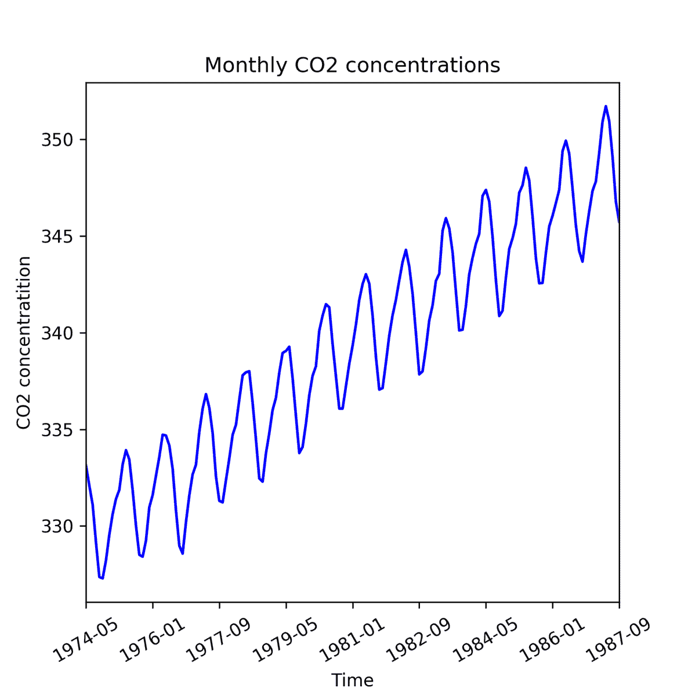

图 1.5：CO2 读数的时间序列呈上升趋势

但是，从短期来看，总体趋势可能并不明显。 短期影响（例如季节性波动和不规则变化）会导致时间序列重新出现在过去观察到的较低或较高值，因此可能会暂时混淆任何总体趋势。 在放大的 1979 年至 1981 年期间，在相同的时间序列中，CO <sub class="calibre26">2</sub> 的浓度很明显，如下图所示。 因此，要揭示总体趋势，我们需要一个可以追溯到过去的时间序列。

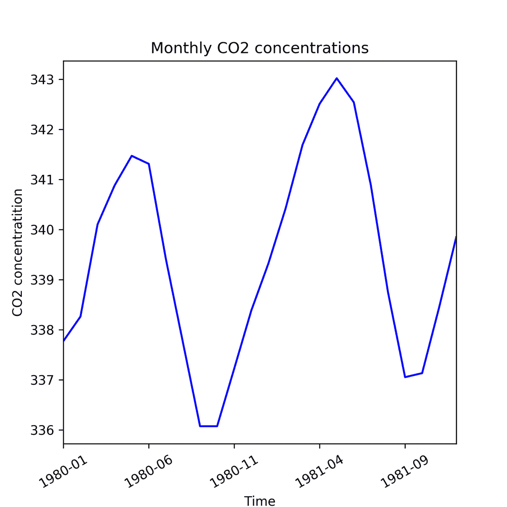

图 1.6：较短的 CO2 读数时间序列无法显示总体趋势

时间序列的总体趋势是由于它所代表的过程或系统的根本性变化或系统性变化。 例如，1974 年至 1987 年期间 CO <sub class="calibre26">2</sub> 浓度的上升趋势可归因于这些年来汽车和工业化的逐步发展。

通常通过将时间序列设置为对时间的回归，并将其他已知因素作为解释变量来对总体趋势进行建模。 然后可以将回归线或趋势线用作时间序列的长期运动的预测。 趋势线留下的残差将进一步分析其他有趣的属性，例如季节性，周期性行为和不规则变化。

现在，让我们看一下生成关于 CO <sub class="calibre26">2</sub> 浓度的前述图的代码。 我们还将展示如何使用线性回归来建立趋势模型，其中以时间指数（在这种情况下为数据中的年份指数）作为解释变量，以 CO <sub class="calibre26">2</sub> 浓度为因变量 。 但是首先，让我们将数据加载到`pandas.DataFrame`中。

此示例的数据在 GitHub 存储库的`datasets`文件夹下的 Excel 文件`Monthly_CO2_Concentrations.xlsx`中。

我们首先导入所需的软件包，如下所示：

```
from __future__ import print_function 
import os 
import pandas as pd 
import numpy as np 
%matplotlib inline 
from matplotlib import pyplot as plt 
import seaborn as sns 
os.chdir('D:\Practical Time Series') 
data = pd.read_excel('datasets/Monthly_CO2_Concentrations.xlsx',                                  converters={'Year': np.int32, 'Month':  np.int32}) 
data.head() 
```

我们已将参数`converters`传递给`read_excel`函数，以确保为`Year`和`Month`列分配了整数（`np.int32`）数据类型。 前面的代码行将生成下表：

|  | **CO <sub class="calibre26">2</sub>** | **年** | **月** |
| 0 | 333.13 | 1974 | 5 |
| 1 | 332.09 | 1974 | 6 |
| 2 | 331.10 | 1974 | 7 |
| 3 | 329.14 | 1974 | 8 |
| 4 | 327.36 | 1974 | 9 |

绘制之前，我们必须删除所有缺少值的列。 此外，`DataFrame`以`Year`和`Month`的升序排序。 这些操作如下：

```
data = data.ix[(~pd.isnull(data['CO2']))&\ 
               (~pd.isnull(data['Year']))&\ 
               (~pd.isnull(data['Month']))] 
data.sort_values(['Year', 'Month'], inplace=True) 
```

最后，通过执行以下几行来生成 1974 年至 1987 年时间段的图：

```
plt.figure(figsize=(5.5, 5.5))
data['CO2'].plot(color='b')
plt.title('Monthly CO2 concentrations')
plt.xlabel('Time')
plt.ylabel('CO2 concentratition')
plt.xticks(rotation=30)
```

`DataFrame`之后的这三年是 1980 年至 1981 年期间数据的放大版本：

```
plt.figure(figsize=(5.5, 5.5))
data['CO2'].loc[(data['Year']==1980) | (data['Year']==1981)].plot(color='b')
plt.title('Monthly CO2 concentrations')
plt.xlabel('Time')
plt.ylabel('CO2 concentratition')
plt.xticks(rotation=30)
```

接下来，让我们拟合趋势线。 为此，我们从`scikit-learn`导入`LinearRegression`类，并在时间索引上拟合线性模型：

```
from sklearn.linear_model import LinearRegression 
trend_model = LinearRegression(normalize=True, fit_intercept=True) 
trend_model.fit(np.array(data.index).reshape((-1,1)), data['CO2']) 
print('Trend model coefficient={} and intercept={}'.format(trend_model.coef_[0], 
                                                           trend_model.intercept_) 
      ) 
```

这将产生以下输出：

```
Trend model coefficient=0.111822078545 and intercept=329.455422234 
```

下图显示了从趋势线模型获得的残差，这些残差似乎具有季节性行为，这将在下一部分讨论。

残差是通过下面的代码行在前面计算和绘制的：

```
residuals = np.array(data['CO2']) - trend_model.predict(np.array(data.index).reshape((-1,1)))
plt.figure(figsize=(5.5, 5.5))
pd.Series(data=residuals, index=data.index).plot(color='b')
plt.title('Residuals of trend model for CO2 concentrations')
plt.xlabel('Time')
plt.ylabel('CO2 concentratition')
plt.xticks(rotation=30)
```


图 1.7：来自二氧化碳读数总体趋势的线性模型中的残差

# 季节性

季节性表现为时间序列中的重复和周期变化。 在大多数情况下，探索性数据分析揭示了季节性的存在。 让我们回顾一下 CO <sub class="calibre26">2</sub> 浓度的趋势下降的时间序列。 尽管去趋势线系列具有恒定的均值和恒定的方差，但是它以可预测的方式系统地偏离趋势模型。

季节性表现为周期性偏差，例如在 CO <sub class="calibre26">2</sub> 排放量下降趋势观察中看到的那些。 圣诞礼物或季节性服装等季节性商品的月销售量的高峰和低谷是具有季节性的时间序列的另一个示例。

确定季节性的一种实用技术是通过以下图进行探索性数据分析：

*   运行序列图
*   季节性子系列剧情
*   多箱图

# 运行序列图

一个简单的原始时间序列的运行序列图，其中时间在`x`轴上，变量在`y`轴上，可以很好地指示时间序列的以下属性：

*   系列平均运动
*   方差变化
*   异常值的存在

下图是从数学公式 *x <sub class="calibre26">t</sub> =（At + B）sin（t）+Є（t）*获得的假设时间序列的运行序列图 时间相关的均值和误差 ***Є*（t）**，它随正态分布 *N（0，at + b）*的变化而变化。 此外，还包括一些异常高和低的观察值作为异常值。

在这种情况下，运行序列图是识别序列均值和方差以及离群值的有效方法。 CO2 浓度的下降趋势时间序列图是运行序列图的一个示例。

# 季节性子系列剧情

对于已知的季节性变化周期性，季节性子系列会在连续时间段的批次中重绘原始系列。 例如，CO <sub class="calibre26">2</sub> 浓度的周期为 12 个月，因此，下图显示了残差均值和标准差的季节性子系列图。 为了可视化残差的季节性，我们创建季度均值和标准差。

一个季节性子系列揭示了两个属性：

*   连续几个月内，季节内的变化
*   连续几批之间的季节之间的变化

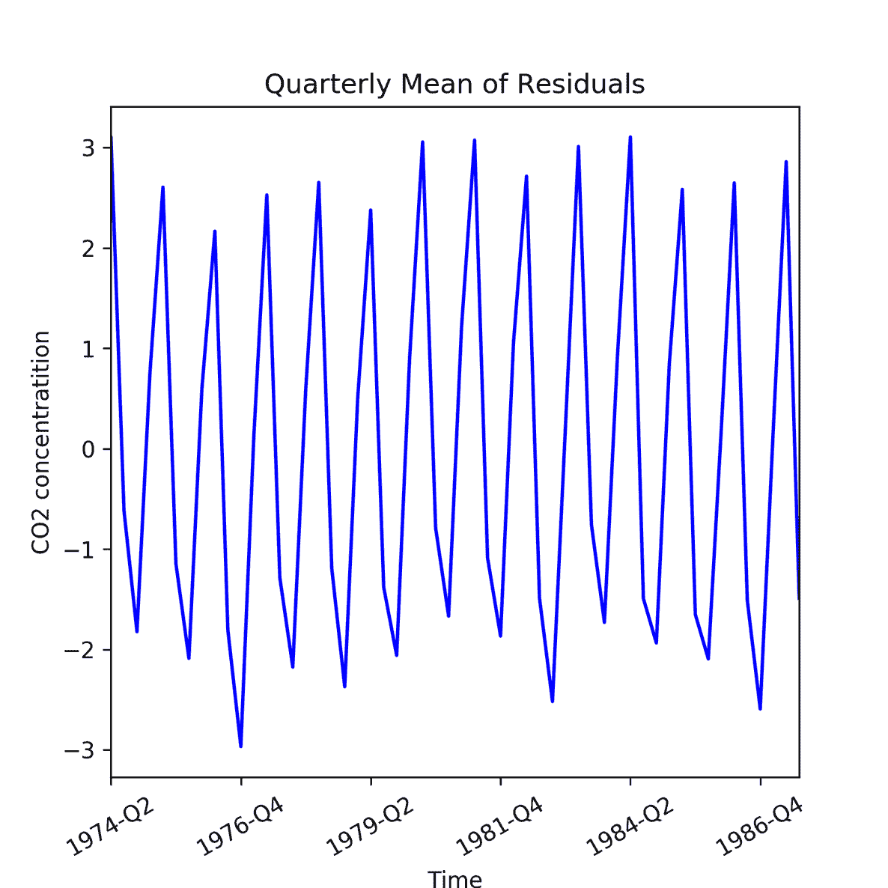

图 1.8：二氧化碳读数总体趋势线性模型中残差的季度均值

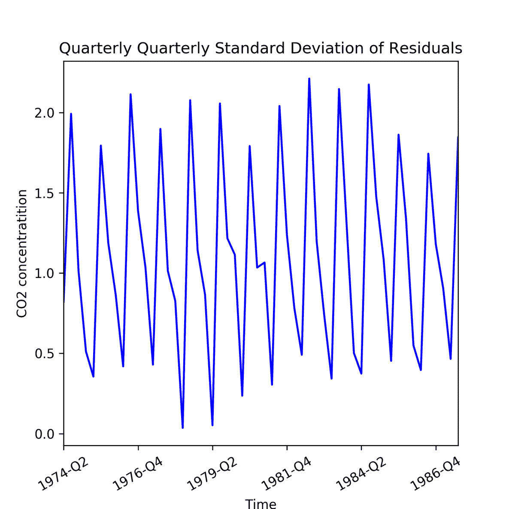

图 1.9：残留物的季度标准偏差与二氧化碳读数总体趋势的线性模型

现在让我们描述用于生成前面的图的代码。 首先，我们需要将残留物和四分之一标记添加到 CO2 浓度`DataFrame`中。 这样做如下：

```
data['Residuals'] = residuals 
month_quarter_map = {1: 'Q1', 2: 'Q1', 3: 'Q1', 
                     4: 'Q2', 5: 'Q2', 6: 'Q2', 
                     7: 'Q3', 8: 'Q3', 9: 'Q3', 
                     10: 'Q4', 11: 'Q4', 12: 'Q4' 
                    } 
data['Quarter'] = data['Month'].map(lambda m: month_quarter_map.get(m)) 
```

接下来，通过对`Year`和`Quarter`上的数据进行分组来计算季节性平均值和标准差：

```
seasonal_sub_series_data = data.groupby(by=['Year', 'Quarter'])['Residuals']\ 
                           .aggregate([np.mean, np.std]) 
```

这将创建新的`DataFrame`作为`seasonal_sub_series_data`，这些年份具有季度平均值和标准偏差。 这些列的重命名如下：

```
seasonal_sub_series_data.columns = ['Quarterly Mean', 'Quarterly Standard Deviation'] 
```

接下来，通过运行以下代码行来绘制季度均值和标准差：

```
#plot quarterly mean of residuals
plt.figure(figsize=(5.5, 5.5))
seasonal_sub_series_data['Quarterly Mean'].plot(color='b')
plt.title('Quarterly Mean of Residuals')
plt.xlabel('Time')
plt.ylabel('CO2 concentratition')
plt.xticks(rotation=30)

#plot quarterly standard deviation of residuals
plt.figure(figsize=(5.5, 5.5))
seasonal_sub_series_data['Quarterly Standard Deviation'].plot(color='b')
plt.title('Quarterly Standard Deviation of Residuals')
plt.xlabel('Time')
plt.ylabel('CO2 concentratition')
plt.xticks(rotation=30)
```

# 多箱图

使用季节性箱形图重绘时，季节性子系列图可以提供更多信息，如下图所示。 箱形图显示了一批时间单位内季节性数据内的集中趋势和离散度。 此外，两个相邻箱形图之间的分离揭示了季节内的变化：

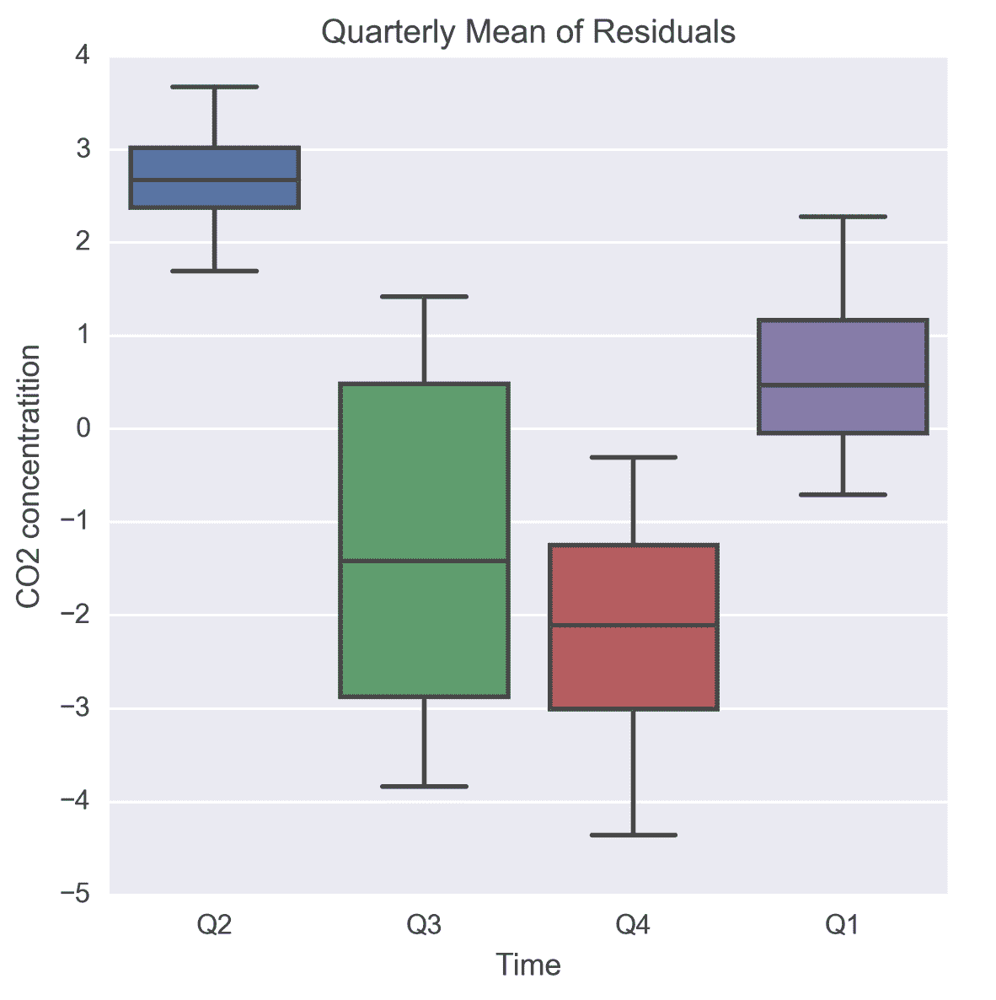

图 1.10：来自二氧化碳读数的一般趋势的线性模型的差值差值

生成箱形图的代码如下：

```
plt.figure(figsize=(5.5, 5.5)) 
g = sns.boxplot(data=data, y='Residuals', x='Quarter') 
g.set_title('Quarterly Mean of Residuals') 
g.set_xlabel('Time') 
g.set_ylabel('CO2 concentratition') 
```

# 周期性变化

周期性变化是每隔几个时间单位观察到的运动，但其发生频率低于季节性波动。 与季节性不同，周期性变化可能没有固定的变化周期。 此外，周期性变化的平均周期会更大（最常见的年份是几年），而同一年内观察到季节性变化，并且对应于时间的年度划分，例如季节，季度以及节日和节假日等。

需要一个时间序列的长期图来识别可能发生的周期性变化，例如，每隔几年出现一次，并表现为重复的波峰和波谷。 在这方面，与经济和商业有关的时间序列通常会显示出与通常的商业和宏观经济周期相对应的周期性变化，例如经济衰退期，随后的繁荣时期，但相隔数年的时间跨度。 与一般趋势类似，识别周期性运动可能需要追溯到过去的数据。

下图说明了 1960 年至 2016 年期间印度和美国的**消费者价格指数**（**CPI**）通货膨胀发生的周期性变化。这两个国家的 CPI 通货膨胀率均表现出周期性变化 ，大约需要 2-2.5 年的时间。 此外，印度的 CPI 通货膨胀率在 1990 年前比 1990 年以后更大。

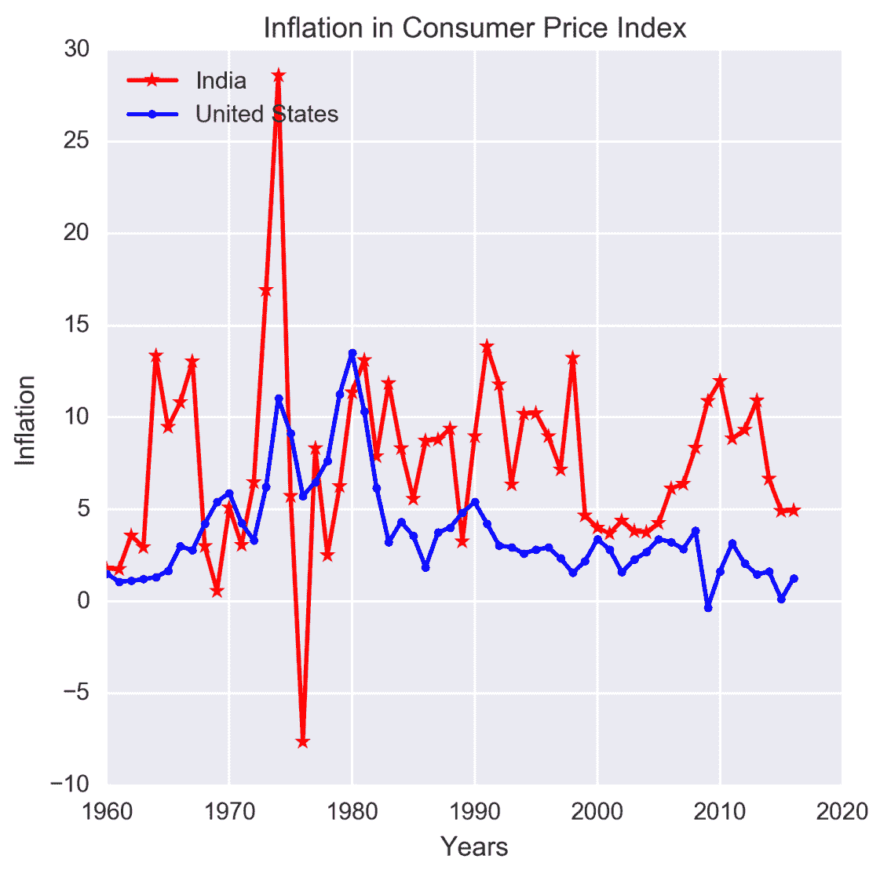

图 1.11：时间序列数据中的周期性运动示例

来源：上图的数据已从[这个页面](http://datamarket.com)下载，该网站维护了来自多个主题的时间序列数据。

您可以在 GitHub 存储库中`datasets`文件夹中的`inflation-consumer-prices-annual.xlsx`文件中找到 CPI 通胀数据集。

生成该图所编写的代码如下：

```
inflation = pd.read_excel('datasets/inflation-consumer-prices-annual.xlsx', parse_dates=['Year']) 
plt.figure(figsize=(5.5, 5.5)) 
plt.plot(range(1960,2017), inflation['India'], linestyle='-', marker='*', color='r') 
plt.plot(range(1960,2017), inflation['United States'], linestyle='-', marker='.', color='b') 
plt.legend(['India','United States'], loc=2) 
plt.title('Inflation in Consumer Price Index') 
plt.ylabel('Inflation') 
plt.xlabel('Years') 
```

# 意外的变化

关于将时间序列表示为四个成分之和的模型，值得注意的是，尽管能够考虑其他三个成分，但我们可能仍会留下不可约的误差成分，该成分是随机的并且不会表现出 对时间指标的系统依赖性。 这第四部分反映了时间序列中的意外变化。 出乎意料的变化是随机的，无法在数学模型中进行明确的未来预测。 这种类型的错误是由于缺乏有关可以对这些变化进行建模的解释变量的信息，或者是由于存在随机噪声。

本节中开发的所有代码的 IPython 笔记本都在本书 GitHub 存储库的`code`文件夹中的`Chapter_1_Internal_Structures.ipynb`文件中。

# 时间序列分析模型

时间序列分析的目的是开发一个数学模型，该模型可以解释观察到的时间序列行为，并可能预测该序列的未来状态。 所选模型应能够说明可能存在的一个或多个内部结构。 为此，我们将概述以下通常用作时间序列分析构建块的常规模型：

*   零均值模型
*   随机漫步
*   趋势模型
*   季节性模型

# 零均值模型

零均值模型具有恒定的均值和恒定的方差，并且没有可预测的趋势或季节性。 假设来自零均值模型的观测值是**独立且均匀分布的**（**iid**），并且表示固定均值周围的随机噪声，该噪声已从时间序列中扣除为常数 学期。

让我们考虑 *X <sub class="calibre26">1</sub> ，X <sub class="calibre26">2</sub> ，...，X <sub class="calibre26">n</sub>* 代表与 a 的 n 个观测值相对应的随机变量。 零均值模型。 如果 *x <sub class="calibre26">1</sub> ，x <sub class="calibre26">2</sub> ，...，x <sub class="calibre26">n</sub>* 是来自零平均时间序列的 n 个观测值，则联合 观测值的分布是每个时间索引的概率质量函数的乘积，如下所示：

```
**P(X1 = x1,X2 = x2 , ... , Xn = xn) = f(X1 = x1) f(X2 = x2) ... f(Xn = xn)**
```

最常见的 *f（X <sub class="calibre26">t</sub> = x <sub class="calibre26">t</sub> ）*由均值零和方差的正态分布建模*σ <sup class="calibre23">2</sup>*，被认为是模型的不可减少的误差，因此被视为随机噪声。 下图显示了零均值序列的方差的正态分布随机噪声：

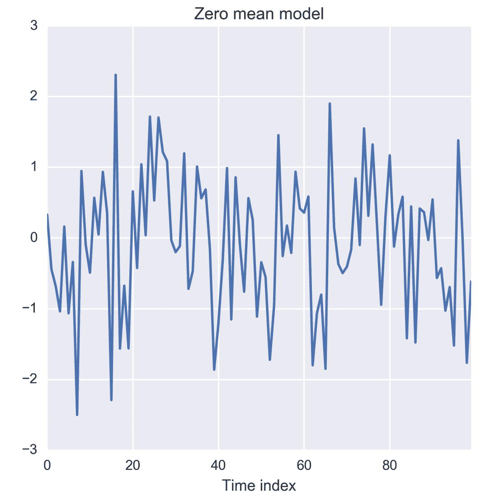

图 1.12：零均值时间序列

上图是通过以下代码生成的：

```
import os 
import numpy as np 
%matplotlib inline 
from matplotlib import pyplot as plt 
import seaborn as sns 
os.chdir('D:/Practical Time Series/') 
zero_mean_series = np.random.normal(loc=0.0, scale=1., size=100) 
```

具有恒定方差的零均值表示随机噪声，该随机噪声可以假定无限可能的实数值，并且适合于表示连续变量的时间序列中的不规则变化。 但是，在许多情况下，系统或过程的可观察状态本质上可能是离散的，并且被限制为有限数量的可能值 *s <sub class="calibre26">1</sub> s <sub class="calibre26">2</sub> 等。 。，s <sub class="calibre26">m</sub>*。 在这种情况下，假设观测变量*（X）*服从多项式分布，*P（X = s <sub class="calibre26">1</sub> ）= p <sub class="calibre26">1</sub> ， P（X = s <sub class="calibre26">2</sub> ）= p <sub class="calibre26">2</sub> ，…，P（X = s <sub class="calibre26">m</sub> ）= p <sub class="calibre26">m</sub>* 这样 *p <sub class="calibre26">1</sub> + p <sub class="calibre26">2</sub> + ... + p <sub class="calibre26">m</sub> = 1*。 这样的时间序列是离散的随机过程。

随时间推移多次掷骰子是离散随机过程的一个示例，任何掷骰都有六个可能的结果。 一个更简单的离散随机过程是一个二进制过程，例如扔硬币，例如只有两个结果，即正面和反面。 下图显示了投掷有偏骰子的模拟过程的 100 次运行，为此，举起偶数面的几率要高于显示奇数面的几率。 请注意，平均而言，与奇数面孔的出现次数相比，偶数面孔的发生次数更高。

# 随机漫步

随机游走作为 n 个 id 的总和给出，它具有零均值和恒定方差。 基于此定义，时间总和 t 处的随机游走的实现由总和 *S = x <sub class="calibre26">1</sub> + x <sub class="calibre26">2</sub> + ... + x <sub class="calibre26">n</sub>*。 下图显示了从 iid 获得的随机游动，其随零均值和单位方差的正态分布而变化。

随机游走很重要，因为如果在一个时间序列中发现这种行为，则可以通过将来自两个连续时间指标的观测值的差异作为 *S <sub class="calibre26">t</sub> -S 轻松地简化为零均值模型 <sub class="calibre26">t-1</sub> = x <sub class="calibre26">t</sub>* 是具有零均值和恒定方差的 iid。

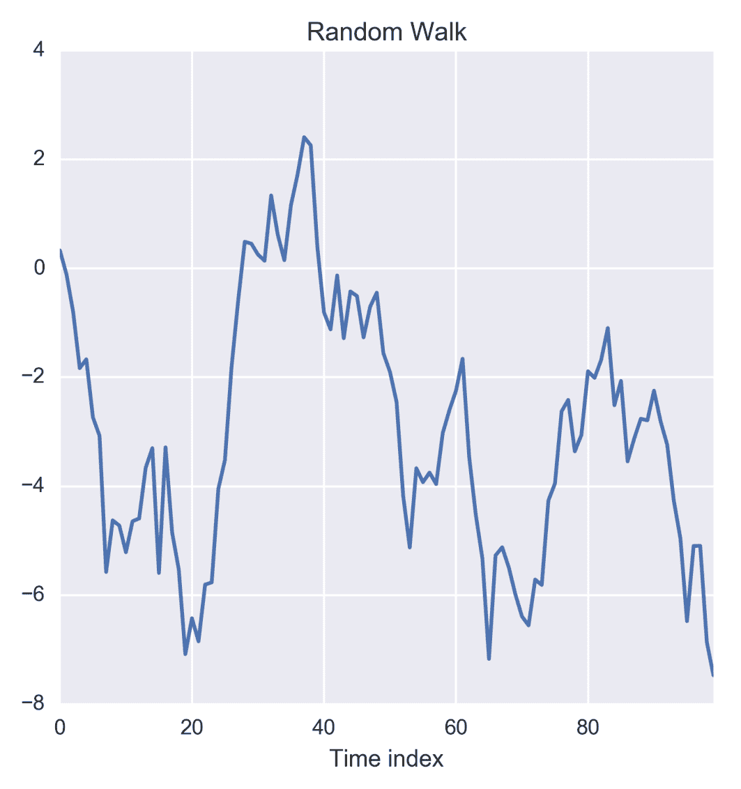

图 1.13：随机游走时间序列

上图中的随机游走可以通过采用上一节中讨论的零均值模型的累加和来生成。 以下代码实现了这一点：

```
random_walk = np.cumsum(zero_mean_series) 
plt.figure(figsize=(5.5, 5.5)) 
g = sns.tsplot(random_walk) 
g.set_title('Random Walk') 
g.set_xlabel('Time index') 
```

# 趋势模型

这种类型的模型旨在捕获时间序列中的长期趋势，可以将其拟合为时间指数的线性回归。 当时间序列没有任何周期性或季节性波动时，可以将其表示为趋势和零均值模型的总和，表示为 *x <sub class="calibre26">t</sub> =μ（t）+ y <sub class="calibre26">t</sub>*，其中μ*（t）*是该序列的时间依赖性长期趋势。

趋势模型μ*（t）*的选择对于正确捕获时间序列的行为至关重要。 探索性数据分析通常为假设模型在`t`中是线性还是非线性提供了提示。 线性模型为μ*（t）= wt + b*，而二次模型为μ*（t）= w <sub class="calibre26">1</sub> t + w <sub class="calibre26">2</sub> t <sup class="calibre23">2</sup> + b*。 有时，可以根据时间指数，例如μ*（t）= w <sub class="calibre26">0</sub> t <sup class="calibre23">p</sup> + b*，通过更复杂的关系来推测趋势。

通过以`t`为解释变量，以**μ**作为解释变量进行回归，可以获得趋势模式（如先前讨论的趋势）中的权重和偏差。 趋势模型的残差 *x <sub class="calibre26">t</sub> -*μ*（t）*被视为不可归约的噪声，并且作为零均值分量 *y [ <sub class="calibre26">t</sub>*。

# 季节性模型

季节性表现为时间序列中的周期性和重复性波动，因此可以将其建模为已知周期性的正弦波的加权和。 假设长期趋势已被趋势线消除，则季节性模型可以表示为`x[t] = s[t] + y[t]`，其中具有已知周期性的季节性变化为`α`：


季节性模型也称为**谐波回归模型**，因为它们试图拟合多个正弦波的总和。

此处描述的四个模型是成熟的时间序列模型的构建基块。 如您现在可能已经收集到的，零和模型代表了系统的不可减少的误差，所有其他三个模型旨在通过适当的数学转换将给定的时间序列转换为零和模型。 为了获得有关原始时间序列的预测，应用了相关的逆变换。

接下来的章节将详细介绍此处讨论的四种模型。 但是，我们可以在以下四个步骤中总结时间序列分析的通用方法：

*   可视化时间索引不同粒度的数据，以揭示长期趋势和季节性波动
*   拟合趋势线可捕获长期趋势并绘制残差以检查季节性或不可减少的误差
*   拟合谐波回归模型以捕获季节性
*   绘制季节性模型剩余的残差以检查不可减少的误差

这些步骤通常足以为大多数时间序列开发数学模型。 各个趋势和季节性模型可以是简单的也可以是复杂的，具体取决于原始时间序列和应用程序。

可在本书 GitHub 存储库的`code`文件夹中的`Chapter_1_Models_for_Time_Series_Analysis.ipynb` IPython 笔记本中找到本节中编写的代码。

# 自相关和部分自相关

在应用了上一节中讨论的数学变换之后，我们经常会得到**平稳**（或弱平稳）**时间序列**，其特征是恒定的均值 *E（x <sub class="calibre26">t</sub> ）*和相关性仅取决于两个时间步长之间的时滞，而与时间步长的值无关。 这种协方差是时间序列分析的关键，当归一化为-1 到 1 时，称为**自协方差**或**自相关**，因此，自相关表示为二阶矩 *E（x <sub class="calibre26">t</sub> ，x <sub class="calibre26">t + h</sub> ）= g（h）*显然仅是时间滞后`h`的函数，并且 与实际时间指标`t`无关。 自相关的这种特殊定义确保了它是与时间无关的属性，因此可以可靠地用于推断时间序列的未来实现。

自相关反映了索引为`t`的时间序列与索引为 *t-h* 或 *t + h* 的时间序列之间的线性相关程度。 正自相关表示时间序列的当前值和将来值沿相同方向移动，而负值表示时间序列的当前值和将来值沿相反方向移动。 如果自相关接近于零，则可能很难找到序列中的时间相关性。 由于此属性，自相关在预测`h`时间提前的时间序列的未来状态时很有用。

通过绘制给定时间序列的**自相关函数**（**ACF**）的观察值，可以确定自相关的存在。 该图通常称为 ACF 图。 让我们说明绘制 ACF 的观察值如何帮助检测自相关的存在。 为此，我们首先绘制 2016 年 1 月至 2016 年 12 月观察到的**道琼斯工业平均指数**（**DJIA**）的每日价值：


图 1.14：道琼斯工业平均指数的时间序列

从上图可以明显看出，道琼斯工业平均指数开始上升时，会持续上升一段时间，反之亦然。 但是，我们必须通过 ACF 图来确定这一点。

该图的数据集已从 [Yahoo Finance](http://finance.yahoo.com) 下载，并以`DJIA_Jan2016_Dec2016.xlsx`的形式保存在本书 GitHub 存储库的`datasets`文件夹下。

我们将使用`pandas`从 Excel 文件中读取数据，并与 matplotlib 一起使用 seaborn 来可视化时间序列。 像以前一样，我们还将使用 os 包来设置工作目录。

因此，让我们首先导入以下软件包：

```
import os 
import pandas as pd 
%matplotlib inline 
from matplotlib import pyplot as plt 
import seaborn as sns  
os.chdir('D:/Practical Time Series') 
```

接下来，我们将数据加载为`pandas.DataFrame`并显示其前 10 行以查看数据集的列：

```
djia_df = pd.read_excel('datasets/DJIA_Jan2016_Dec2016.xlsx') 
djia_df.head(10) 
```

上面的代码显示数据集的前 10 行，如下表所示：

|  | **日期** | **打开** | **高** | **低** | **关闭** | **调整关闭** | **音量** |
| 0 | 2016-01-04 | 17405.480469 | 17405.480469 | 16957.630859 | 17148.939453 | 17148.939453 | 148060000 |
| 1 | 2016-01-05 | 17147.500000 | 17195.839844 | 17038.609375 | 17158.660156 | 17158.660156 | 105750000 |
| 2 | 2016-01-06 | 17154.830078 | 17154.830078 | 16817.619141 | 16906.509766 | 16906.509766 | 120250000 |
| 3 | 2016-01-07 | 16888.359375 | 16888.359375 | 16463.630859 | 16514.099609 | 16514.099609 | 176240000 |
| 4 | 2016-01-08 | 16519.169922 | 16651.890625 | 16314.570313 | 16346.450195 | 16346.450195 | 141850000 |
| 5 | 2016-01-11 | 16358.709961 | 16461.849609 | 16232.030273 | 16398.570313 | 16398.570313 | 127790000 |
| 6 | 2016-01-12 | 16419.109375 | 16591.349609 | 16322.070313 | 16516.220703 | 16516.220703 | 117480000 |
| 7 | 2016-01-13 | 16526.630859 | 16593.509766 | 16123.200195 | 16151.410156 | 16151.410156 | 153530000 |
| 8 | 2016-01-14 | 16159.009766 | 16482.050781 | 16075.120117 | 16379.049805 | 16379.049805 | 158830000 |
| 9 | 2016-01-15 | 16354.330078 | 16354.330078 | 15842.110352 | 15988.080078 | 15988.080078 | 239210000 |

上表中的第一列始终是`pandas.read_csv`函数创建的默认行索引。

我们使用`Close`列中给出的 DJIA 的关闭值来说明自相关和 ACF 函数。 时间序列图已生成如下：

```
plt.figure(figsize=(5.5, 5.5)) 
g = sns.tsplot(djia_df['Close']) 
g.set_title('Dow Jones Industrial Average between Jan 2016 - Dec 2016') 
g.set_xlabel('Time') 
g.set_ylabel('Closing Value') 
```

接下来，通过为滞后`h`的不同值计算自相关来估计 ACF，在这种情况下，滞后`h`在 0 到 30 之间变化。`Pandas.Series.autocorr`函数用于为滞后不同值计算自相关。 给出的代码如下：

```
lag = range(0,31) 
   djia_acf = [] 
for l in lag: 
    djia_acf.append(djia_df['Close'].autocorr(l)) 
```

前面的代码在从 0 到 30 的 31 个滞后值列表中进行迭代。滞后 0 表示观察值与自身之间具有自相关性（换言之为自相关），因此也可以确定为 1.0 在下图中。 DJIA 收盘价的自相关似乎随着延迟而线性下降，并且下降速度在 18 天左右出现明显变化。 在 30 天的滞后时间内，ACF 略高于 0.65。

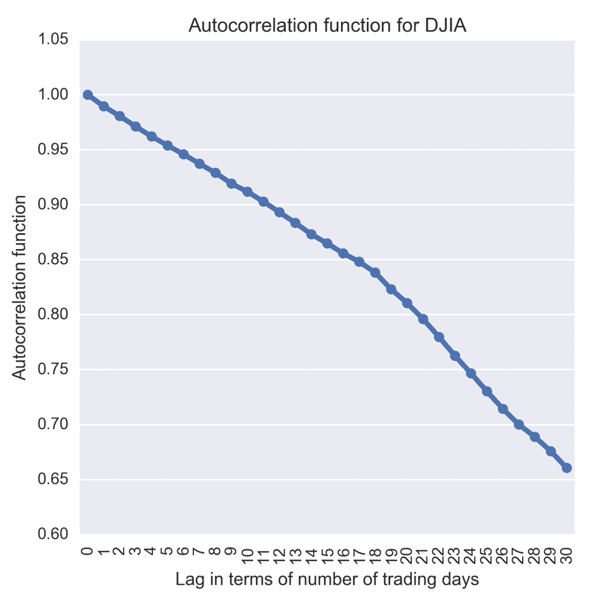

图 1.15：针对各种滞后计算出的道琼斯工业平均指数的自相关

前面的图是通过以下代码生成的：

```
plt.figure(figsize=(5.5, 5.5)) 
g = sns.pointplot(x=lag, y=djia_acf, markers='.') 
g.set_title('Autocorrelation function for DJIA') 
g.set_xlabel('Lag in terms of number of trading days') 
g.set_ylabel('Autocorrelation function') 
g.set_xticklabels(lag, rotation=90) 
plt.savefig('plots/ch2/B07887_02_11.png', format='png', dpi=300) 
```

ACF 图显示，在 DJIA Close 值的情况下，自相关与观测之间的时间间隔具有函数相关性。

为运行本节中的分析而开发的代码位于本书 GitHub 存储库的`code`文件夹下的 IPyton 笔记本`Chapter1_Autocorrelation.ipynb`中。

我们编写了一个 for 循环来计算不同滞后的自相关，并使用`sns.pointplot`函数绘制结果。 或者，`statsmodels.graphics.tsaplots`的`plot_acf`函数可计算和绘制各种滞后的自相关。 此外，该功能还可以绘制 95％的置信区间。 在这些置信区间之外的自相关在统计上是显着的相关，而在置信区间内的自相关是由于随机噪声引起的。
由`plot_acf`生成的自相关和置信区间如下图所示：

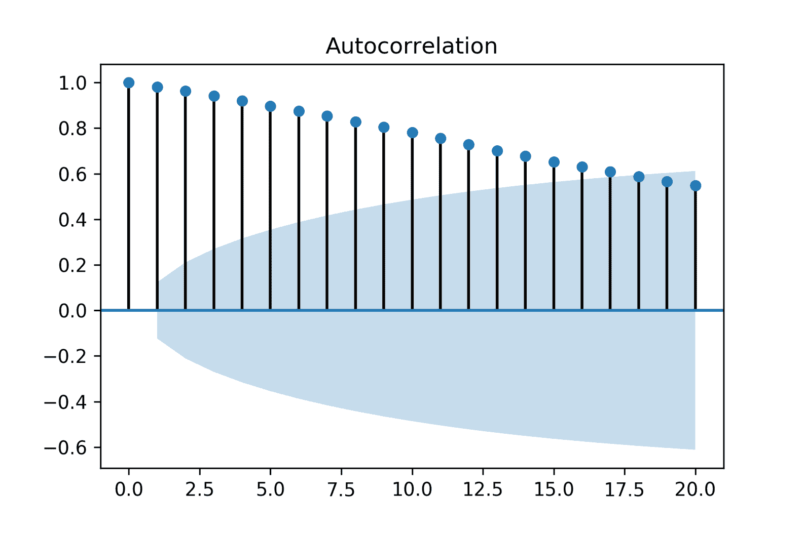

图 1.16：95％置信区间的道琼斯工业平均指数自相关

到目前为止，我们已经讨论了自相关，它是变量 *x_t* 和 *x_（t + h）*之间线性相关性的量度。 **自回归**（**AR**）模型以 *x_（t + h）*和 *x_t* 之间的线性回归的形式捕获了这种依赖性。 但是，时间序列倾向于逐步携带信息和相关性结构，因此滞后`h`的自相关也受到中间变量 *x_t，x_（t + 1）…x_（t + h- 1）*。 因此，在存在中间变量的情况下，自相关不是 *x_t* 和 *x_（t + h）*之间相互关系的正确度量。 因此，基于自相关在 AR 模型中选择`h`是错误的。 当消除了中间变量的影响时，部分自相关通过测量 *x_t* 和 *x_（t + h）*之间的相关性来解决此问题。 因此，时间序列分析中的部分自相关定义了 *x_t* 和 *x_（t + h）*之间的相关性，但并未由滞后 *t + 1* 到 *] t + h-1*。
局部自相关有助于确定 AR（`h`）模型的阶数 h。 让我们使用 *plot_pacf* 绘制 DJIA 关闭值的局部自相关，如下所示：

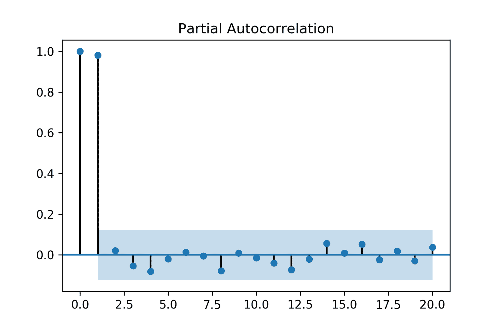

图 1.17：道琼斯工业平均指数与 95％置信区间的部分自相关

滞后零处的第一个部分自相关始终为 1.0。 从上图中可以看出，仅在滞后一个时，部分自相关在统计上就很显着，而对于其他滞后，则在 95％的置信区间内。 因此，对于 DJIA Close Values，AR 模型的顺序为 1。

# 概括

在本章中，我们讨论了几种数据类型，例如横截面，时间序列和面板数据。 我们深入研究了使时间序列数据变得特别的特殊属性。 已经讨论了 Python 中的几个示例和工作代码，以了解如何在时间序列上进行探索性数据分析以可视化其属性。 我们还描述了自相关和部分自相关以及图形技术来检测时间序列中的这些。 本章讨论的主题为我们提供了一个使用 Python 进行时间序列数据更详细讨论的阶段。
在下一章中，您将学习如何按时间序列读取更复杂的数据类型，以及如何使用此类信息进行更深入的探索性数据分析。 我们将在时间序列平稳的情况下重新审视自相关。 将讨论检测自相关的统计方法。 我们还将讨论平稳性的重要性，并描述用于平稳化非平稳时间序列的不同微分和平均方法。 讨论了时间分解的加法和乘法模型，用于估计趋势和季节性。