# 数据管道

到目前为止，我们已经探索了如何将数据加载到 Python 中并进行处理，以创建一个包含数值（您的数据集）的二维 NumPy 数组。 现在，我们准备完全融入数据科学，从数据中提取含义，并开发潜在的数据产品。 关于数据处理和转换的这一章以及关于机器学习的下一章是整本书中最具挑战性的部分。

在本章中，您将学习如何执行以下操作：

*   简要浏览数据并创建新功能
*   降低数据的维数
*   发现并处理异常值
*   确定项目的最佳得分或损失指标
*   应用科学的方法论并有效地测试您的机器学习假设的性能
*   通过减少功能部件数量来降低数据科学问题的复杂性
*   优化您的学习参数

# 介绍 EDA

**探索性数据分析**（**EDA**）或数据探索是数据科学过程中的第一步。 约翰·图基（John Tukey）在 1977 年首次撰写他的著作《探索性数据分析》时就创造了这个名词，强调了 EDA 的重要性。 要求 EDA 更好地理解数据集，检查其特征和形状，验证您要记住的一些第一个假设，并获得有关在后续后续数据科学任务中要进行的下一步的初步思路。

在本节中，您将处理上一章中已使用的虹膜数据集。 首先，让我们加载数据集：

```py
In: import pandas as pd
    iris_filename = 'datasets-uci-iris.csv'
    iris = pd.read_csv(iris_filename, header=None, 
            names= ['sepal_length', 'sepal_width', 
            'petal_length', 'petal_width', 'target'])
    iris.head()
```

调用`head`方法将显示前五行：


伟大的！ 使用一些命令，您已经加载了数据集。 现在，调查阶段开始。 `.describe()`方法提供了一些很好的见解，可以按如下方式使用：

```py
In: iris.describe() 
```

随即出现了对数据集的描述，包括频率，均值和其他描述性信息：


对于所有数字功能，您都有观测值的数量，它们各自的平均值，标准差，最小值和最大值以及一些常规报告的分位数（以`25`百分比，`50`百分比和`75`百分比）， 所谓的四分位数。 这为您提供了有关每个功能的分布的一个好主意。 如果要可视化此信息，只需使用`boxplot()`方法，如下所示：

```py
In: boxes = iris.boxplot(return_type='axes') 
```

每个变量的箱线图将出现：

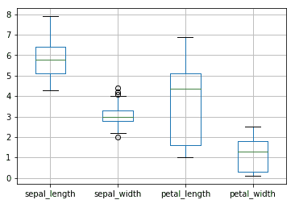

有时，本章中介绍的图形/图表可能与在本地计算机上获得的图形/图表略有不同，因为图形布局的初始化是使用随机参数进行的。

如果需要了解其他分位数，可以使用`.quantile()`方法。 例如，如果您需要的值是值分布的 10% 和 90%，则可以尝试以下代码：

```py
In: iris.quantile([0.1, 0.9]) 
```

以下是所需百分位数的值：


最后，要计算中位数，可以使用`.median()`方法。 同样，为了获得均值和标准差，分别使用了`.mean()`和`.std()`方法。 对于分类要素，要获取有关要素中存在的级别的信息（即要素所采用的不同值），可以使用`.unique()`方法，如下所示：

```py
In: iris.target.unique()

Out: array(['Iris-setosa', 'Iris-versicolor', 'Iris-virginica'], 
     dtype=object)
```

要检查要素之间的关系，可以创建同现矩阵或相似矩阵。
在下面的示例中，我们将针对`petal_width`功能的相同计数计算`petal_length`功能出现的次数多于平均值的次数。 为此，您需要使用`crosstab`方法，如下所示：

```py
In: pd.crosstab(iris['petal_length'] > 3.758667, 
                iris['petal_width'] > 1.198667)
```

该命令生成一个双向表：

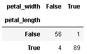

结果，您将注意到这些功能几乎总是联合出现的。 因此，您可以假设这两个事件之间存在很强的关系。 以图形方式，您可以使用以下代码检查这样的假设：

```py
In: scatterplot = iris.plot(kind='scatter', 
                            x='petal_width', y='petal_length', 
                            s=64, c='blue', edgecolors='white')
```

您将获得指定为`x`和`y`的变量的散点图：


趋势十分明显。 我们推断`x`和`y`密切相关。 您通常在 EDA 期间执行的最后一项操作是检查功能的分布。 要使用Pandas进行管理，您可以使用直方图来估算分布，这要归功于以下代码段：

```py
In: distr = iris.petal_width.plot(kind='hist', alpha=0.5, bins=20)
```

结果，显示直方图：

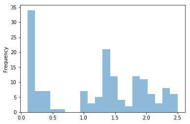

经过仔细搜索，我们选择了 20 个垃圾箱。 在其他情况下，20 个 bin 可能是一个极低或极高的值。 根据经验，绘制分布直方图时，起始值为观察数的平方根。 初始可视化之后，您将需要修改垃圾箱的数量，直到您在分布中识别出众所周知的形状为止。

我们建议您探索所有功能，以检查它们之间的关系并估计其分布。 实际上，鉴于其分布，您可能决定对每个特征进行不同的处理，以便随后获得最大的分类或回归性能。

# 建立新功能

有时，您会发现自己与功能和`target`变量没有真正的联系。 在这种情况下，您可以修改输入数据集。 您可以应用线性或非线性变换来提高系统的精度，等等。 这是整个过程中非常重要的一步，因为它完全取决于数据科学家的技能，后者是人为地更改数据集并调整输入数据以更好地适合学习模型的人。 尽管此步骤直观地增加了复杂性，但是这种方法通常可以提高学习者的表现； 这就是为什么它被诸如深度学习之类的尖端技术所使用的原因。

例如，如果您要预测房屋的价值并且知道每个房间的高度，宽度和长度，则可以人为地构建代表房屋体积的特征。 严格来说，这不是可观察的功能，而是在现有功能之上构建的功能。 让我们从一些代码开始：

```py
In: import numpy as np
    from sklearn import datasets
    from sklearn.model_selection import train_test_split
    from sklearn.metrics import mean_squared_error
    cali = datasets.california_housing.fetch_california_housing()
    X = cali['data']
    Y = cali['target']
    X_train, X_test, Y_train, Y_test = train_test_split(X, Y, 
                                                  test_size=0.2)
```

我们导入了包含加州房价的数据集。 这是一个回归问题，因为`target`变量是房价（即实数）。 立即应用称为 **KNN 回归器**的简单回归器（以简单学习者为例；将在第 4 章，[HTG5 机器学习），在测试数据集上的**平均绝对误差**（**MAE**）结尾。 如果您不能完全理解代码，请不要担心。 本书稍后将介绍 MAE 和其他回归变量。 现在，假设 MAE 代表错误。 因此，MAE 的值越低，解决方案越好：

```py
In: from sklearn.neighbors import KNeighborsRegressor
    regressor = KNeighborsRegressor()
    regressor.fit(X_train, Y_train)
    Y_est = regressor.predict(X_test)
    print ("MAE=", mean_squared_error(Y_test, Y_est))

Out: MAE= 1.07452795578
```

`1.07`的`MAE`结果看似不错，但让我们努力做得更好。 我们将使用 Z 分数对输入要素进行归一化，并比较此新要素集上的回归任务。 Z 归一化只是将每个特征映射到具有零均值和单一方差的新特征。 使用 Scikit-learn，可以通过以下方式实现：

```py
In: from sklearn.preprocessing import StandardScaler
    scaler = StandardScaler()
    X_train_scaled = scaler.fit_transform(X_train)
    X_test_scaled = scaler.transform(X_test)
    regressor = KNeighborsRegressor()
    regressor.fit(X_train_scaled, Y_train) 
```

```py
 Y_est = regressor.predict(X_test_scaled)
    print ("MAE=", mean_squared_error(Y_test, Y_est)) Out: MAE= 0.402334179429
```

借助这一简单的步骤，我们将 MAE 降低了一半以上，现在的价值约为`0.40`。

请注意，我们没有使用原始功能。 我们使用了它们的线性修改，这更适合使用 KNN 回归器进行学习。

代替 Z 归一化，我们可以在对异常值更鲁棒的特征上使用缩放函数，即`RobustScaler`。这样的缩放器使用中位数和**四分位间距**（**IQR**），而不是使用均值和标准差来缩放每个特征 独立地。 它比异常值更健壮，因为如果几个点（最终只有一个）距离中心较远，例如由于错误的读数，传输错误或 传感器损坏：

```py
In: from sklearn.preprocessing import RobustScaler
    scaler2 = RobustScaler()
    X_train_scaled = scaler2.fit_transform(X_train)
    X_test_scaled = scaler2.transform(X_test)
    regressor = KNeighborsRegressor()
    regressor.fit(X_train_scaled, Y_train)
    Y_est = regressor.predict(X_test_scaled)
    print ("MAE=", mean_squared_error(Y_test, Y_est)) Out: MAE=0.41749216189 
```

现在，让我们尝试为特定功能添加非线性修改。 我们可以假设输出大致与房屋的占用人数有关。 实际上，一个人居住的房屋的价格与三个人住在同一所房屋的价格之间存在很大差异。 但是，居住在那里的 10 个人的价格与居住在那里的 12 个人的价格之间的差异并不大（尽管两者之间仍然存在差异）。 因此，让我们尝试添加另一个功能，该功能是对另一个功能进行非线性转换而构建的：

```py
In: non_linear_feat = 5 # AveOccup 
    X_train_new_feat = np.sqrt(X_train[:,non_linear_feat])
    X_train_new_feat.shape = (X_train_new_feat.shape[0], 1)
    X_train_extended = np.hstack([X_train, X_train_new_feat])
    X_test_new_feat = np.sqrt(X_test[:,non_linear_feat])
    X_test_new_feat.shape = (X_test_new_feat.shape[0], 1)
    X_test_extended = np.hstack([X_test, X_test_new_feat])
    scaler = StandardScaler()
    X_train_extended_scaled = scaler.fit_transform(X_train_extended)
    X_test_extended_scaled = scaler.transform(X_test_extended)
    regressor = KNeighborsRegressor()
    regressor.fit(X_train_extended_scaled, Y_train)
    Y_est = regressor.predict(X_test_extended_scaled)
    print ("MAE=", mean_squared_error(Y_test, Y_est)) 

Out: MAE= 0.325402604306 
```

通过添加此新功能，我们额外减少了`MAE`，最终获得了更令人满意的回归指标。 当然，我们可以尝试其他转换来改善此情况，但是这个简单的示例应该表明，对您分析 EDA 发现的线性和非线性转换的应用并获得在概念上与转换更为相关的特征有多重要。 输出变量。

# 降维

通常，您必须处理包含大量要素的数据集，其中许多要素可能是不必要的。 这是一个典型的问题，其中某些功能对预测很有帮助，某些功能以某种方式相关，而某些功能则完全不相关（也就是说，它们仅包含噪声或不相关的信息）。 仅保留有趣的功能是一种方法，不仅可以使数据集更易于管理，而且可以使预测算法更好地工作，而不会因数据中的噪声而使其预测迷惑。

因此，降维是消除输入数据集的某些特征并创建一组受限制的特征的操作，这些特征包含了以更有效和可靠的方式预测`target`变量所需的所有信息。 如前所述，减少功能部件的数量通常还会减少输出变异性和学习过程的复杂性（以及所需的时间）。

许多用于归约的算法的主要假设是与**加性高斯白噪声**（**AWGN**）有关的一种假设。 我们假设一个独立的高斯型噪声已添加到数据集的每个特征中。 因此，减小维数也会减少噪声的能量，因为您要减小其跨度设置。

# 协方差矩阵

协方差矩阵为您提供了所有不同对特征之间的相关性的概念。 通常，这是降维的第一步，因为它使您可以了解高度相关的要素数量（因此可以丢弃的要素数量）和独立的要素数量。 使用每个观测具有四个特征的虹膜数据集，可以轻松地计算相关矩阵，并且您可以借助简单的图形表示来了解其结果，可以通过以下代码获得：

```py
In: from sklearn import datasets
    import numpy as np
    iris = datasets.load_iris()
    cov_data = np.corrcoef(iris.data.T)
    print (iris.feature_names)
    print (cov_data) Out: ['sepal length (cm)', 'sepal width (cm)', 'petal length (cm)', 
      'petal width (cm)']
     [[ 1\.         -0.10936925  0.87175416  0.81795363]
      [-0.10936925  1\.         -0.4205161  -0.35654409]
      [ 0.87175416 -0.4205161   1\.          0.9627571 ]
      [ 0.81795363 -0.35654409  0.9627571   1\.        ]] 
```

使用热图，让我们以图形形式可视化协方差矩阵：

```py
In: import matplotlib.pyplot as plt
    img = plt.matshow(cov_data, cmap=plt.cm.rainbow)
    plt.colorbar(img, ticks=[-1, 0, 1], fraction=0.045)
    for x in range(cov_data.shape[0]):
        for y in range(cov_data.shape[1]):
            plt.text(x, y, "%0.2f" % cov_data[x,y], 
                     size=12, color='black', ha="center", va="center")
    plt.show() 
```

这是生成的热图：

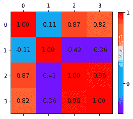

从上图中，您可以看到主要对角线的值为 1。这是因为我们使用的是协方差矩阵的归一化版本（将每个特征协方差归一化为 1.0）。 我们还可以注意到第一和第三特征，第一和第四以及第三和第四特征之间的高度相关性。 另外，我们可以验证只有第二个功能几乎独立于其他功能； 所有其他功能都以某种方式相互关联。

现在，我们有了关于简化集中潜在特征数量的想法，想象一下如何压缩相关矩阵指出的重复信息-我们可以将所有内容简单地简化为两个特征。

# 主成分分析

**主成分分析**（**PCA**）是一种有助于定义更小且更相关的功能集的技术。 从 PCA 获得的新特征是当前特征的线性组合（即旋转），即使它们是二进制的。 输入空间旋转后，输出集的第一个矢量包含信号的大部分能量（或换句话说，其方差）。 第二个正交于第一个，它包含大部分剩余能量； 第三个与前两个向量正交，并且包含大部分剩余能量，依此类推。 就像通过将尽可能多的信息聚合到 PCA 产生的初始向量上来重构数据集中的信息一样。

在 AWGN 的理想​​情况下，初始向量包含输入信号的所有信息； 靠近末端的仅包含噪音。 此外，由于输出基础是正交的，因此您可以分解并合成输入数据集的近似版本。 能量是决定人能使用多少个基向量的关键参数。 由于该算法在本质上是用于奇异值分解的，因此在阅读有关 PCA 时经常会引用两个特征向量（基本向量）和特征值（与该向量相关的标准偏差）。 通常，输出集的基数是保证存在 95%（在某些情况下需要 90% 或 99%）输入能量（或方差）的基数。 对 PCA 的严格解释超出了本书的范围，因此，我们仅向您介绍有关如何在 Python 中使用此功能强大的工具的准则。

这是有关如何将数据集缩小为二维的示例。 在上一节中，我们推论 2 是降维的好选择； 让我们检查是否正确：

```py
In: from sklearn.decomposition import PCA
    pca_2c = PCA(n_components=2)
    X_pca_2c = pca_2c.fit_transform(iris.data)
    X_pca_2c.shape 

Out: (150, 2) In: plt.scatter(X_pca_2c[:,0], X_pca_2c[:,1], c=iris.target, alpha=0.8, 
                s=60, marker='o', edgecolors='white')
    plt.show()
    pca_2c.explained_variance_ratio_.sum() 

Out: 0.97763177502480336
```

在执行代码时，您还会获得前两个组件的散点图：

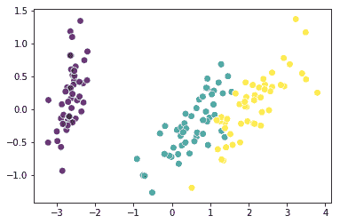

前两个组件的散点图

我们可以立即看到，在应用 PCA 之后，输出集仅具有两个功能。 这是因为在`n_components`参数设置为`2`的情况下调用了`PCA()`对象。 获得相同结果的另一种方法是对`1`，`2`和`3`组件运行`PCA()`，然后从解释的方差比和视觉检查得出结论，对于`n_components = 2`，我们得到了 最好的结果。 然后，我们将有证据表明，当使用两个基向量时，输出数据集包含几乎 98% 的输入信号能量，并且在模式中，这些类几乎可以很好地分离。 每种颜色位于二维欧几里得空间的不同区域。

请注意，此过程是自动的，培训 PCA 时不需要提供标签。 实际上，PCA 是一种无监督算法，它不需要与自变量有关的数据来旋转投影基础。

对于好奇的读者，可以通过以下代码查看转换矩阵（将原始数据集转换为 PCA 重组的数据集）：

```py
In: pca2c.componentsOut: array([[ 0.36158968, -0.08226889,  0.85657211,  0.35884393],
            [-0.65653988, -0.72971237,  0.1757674 ,  0.07470647]]) 
```

转换矩阵由四列（即输入要素的数量）和两行（即归约要素的数量）组成。

有时，您会发现自己处于 PCA 不够有效的情况下，尤其是在处理高维数据时，这是因为要素可能非常相关，同时差异不平衡。 对于这种情况，可能的解决方案是尝试使信号变白（或使其更加球形）。 在这种情况下，特征向量被迫以单位分量方差为单位。 变白会删除信息，但有时会提高 PCA 减少后将使用的机器学习算法的准确性。 这是采用美白时的代码外观（在我们的示例中，除了输出减少的数据集的比例外，它没有任何改变）：

```py
In: pca_2cw = PCA(n_components=2, whiten=True)
    X_pca_1cw = pca_2cw.fit_transform(iris.data)
    plt.scatter(X_pca_1cw[:,0], X_pca_1cw[:,1], c=iris.target, alpha=0.8, 
                s=60, marker='o', edgecolors='white')
    plt.show()
    pca_2cw.explained_variance_ratio_.sum() 

Out: 0.97763177502480336  
```

您还可以使用变白来获得 PCA 的第一部分的散点图：

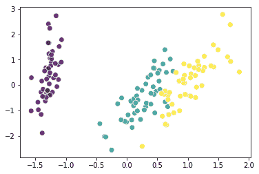

现在，让我们看看如果将输入数据集投影到 PCA 生成的一维空间上会发生什么，如下所示：

```py
In: pca_1c = PCA(n_components=1)
    X_pca_1c = pca_1c.fit_transform(iris.data)
    plt.scatter(X_pca_1c[:,0], np.zeros(X_pca_1c.shape),
 c=iris.target, alpha=0.8, s=60, marker='o', edgecolors='white')
    plt.show()
    pca_1c.explained_variance_ratio_.sum() Out: 0.9246162071742684  
```

投影沿一条水平线分布：

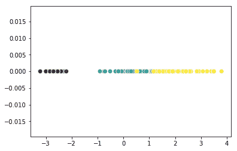

在这种情况下，输出能量较低（原始信号的 92.4%），并且输出点被添加到一维欧几里德空间中。 这可能不是一个很棒的功能简化步骤，因为许多具有不同标签的点被混合在一起。

最后，这是一个把戏。 为确保生成的输出集至少包含 95% 的输入能量，您可以在第一次调用 PCA 对象时指定该值。 可以使用以下代码获得等于两个矢量的结果：

```py
In: pca_95pc = PCA(n_components=0.95)
    X_pca_95pc = pca_95pc.fit_transform(iris.data)
    print (pca_95pc.explained_variance_ratio_.sum())
    print (X_pca_95pc.shape) Out: 0.977631775025
     (150, 2)
```

# 大数据 PCA –随机 PCA

PCA 的主要问题是进行还原操作的基础**奇异值分解**（**SVD**）算法的复杂性，使得整个过程很难扩展。 Scikit 学习中有一种基于随机 SVD 的更快算法。 这是一种较轻但近似的迭代分解方法。 使用随机 SVD，全秩重构并不完美，并且在每次迭代过程中都对基向量进行了局部优化。 另一方面，它只需要几个步骤就可以得到一个很好的近似值，证明了随机 SVD 比传统 SVD 算法要快得多。 因此，如果训练数据集很大，则此约简算法是一个不错的选择。 在以下代码中，我们将其应用于 Iris 数据集。 由于问题的规模很小，因此输出非常接近经典 PCA。 但是，将算法应用于大型数据集时，结果会有很大不同：

```py
In: from sklearn.decomposition import PCA
    rpca_2c = PCA(svd_solver='randomized', n_components=2)
    X_rpca_2c = rpca_2c.fit_transform(iris.data)
    plt.scatter(X_rpca_2c[:,0], X_rpca_2c[:,1], 
c=iris.target, alpha=0.8, s=60, marker='o', edgecolors='white')
    plt.show()
    rpca_2c.explained_variance_ratio_.sum() 

Out: 0.97763177502480414 
```

这是使用 SVD 求解器的 PCA 的前两个组件的散点图：

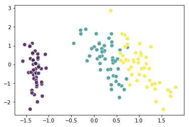

# 潜在因素分析

**潜在因子分析**（**LFA**）是另一种帮助您降低数据集维数的技术。 总体思路类似于 PCA。 但是，在这种情况下，输入信号没有正交分解，因此没有输出基础。 一些数据科学家认为 LFA 是 PCA 的概括，它消除了正交性的约束。 通常，当预期在系统中存在潜在因子或构建体时，将使用 LFA。 在这种假设下，所有特征都是对变量的观察，这些变量是由线性变换的潜因子导出或影响的，并且具有**任意波形发生器**（**AWG**）噪声。 通常假设潜因子具有高斯分布和一元协方差。 因此，在这种情况下，不是破坏信号的能量/方差，而是在输出数据集中说明变量之间的协方差。 Scikit-learn 工具箱实现了迭代算法，使其适用于大型数据集。

下面的代码通过假设系统中的两个潜在因素来降低 Iris 数据集的维数：

```py
In: from sklearn.decomposition import FactorAnalysis
    fact_2c = FactorAnalysis(n_components=2)
    X_factor = fact_2c.fit_transform(iris.data)
    plt.scatter(X_factor[:,0], X_factor[:,1], 
                c=iris.target, alpha=0.8, s=60, 
                marker='o', edgecolors='white')
    plt.show()
```

这是散点图中表示的两个潜在因素（与以前的 PCA 不同的解决方案）：

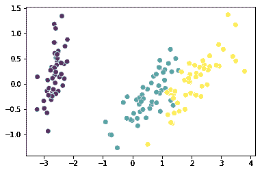

# 线性判别分析

严格来说，**线性判别分析**（**LDA**）是分类器（现代统计之父 Ronald Fisher 开发的一种经典统计方法），但通常用于降维。 它不能很好地扩展到较大的数据集（像许多统计方法一样），但这是有待尝试的方法，它可以带来比其他分类方法（例如逻辑回归）更好的结果。 由于这是一种有监督的方法，因此需要标签集来优化减少步骤。 LDA 输出输入要素的线性组合，从而尝试对最好区分它们的类之间的差异进行建模（因为 LDA 使用标签信息）。 与 PCA 相比，在 LDA 的帮助下获得的输出数据集包含了类之间的精妙区别。 但是，它不能用于回归问题，因为它来自分类过程。

这是 LDA 在 Iris 数据集上的应用：

```py
In: from sklearn.lda import LDA
    lda_2c = LDA(n_components=2)
    X_lda_2c = lda_2c.fit_transform(iris.data, iris.target)
    plt.scatter(X_lda_2c[:,0], X_lda_2c[:,1], 
                c=iris.target, alpha=0.8, edgecolors='none')
 plt.show() 
```

此散点图是由 LDA 生成的前两个组件得出的：

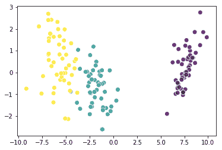

# 潜在语义分析

通常，**潜在语义分析**（**LSA**）在通过`TfidfVectorizer`或`CountVectorizer`处理后应用于文本。 与 PCA 相比，它将 SVD 应用于输入数据集（通常是稀疏矩阵），从而生成通常与同一概念关联的单词语义集。 这就是为什么当特征是同质的（即文档中的所有单词）并大量存在时使用 LSA 的原因。

Python 中带有文本和`TfidfVectorizer`的示例如下。 输出显示了潜在向量的部分内容：

```py
In: from sklearn.datasets import fetch_20newsgroups
    categories = ['sci.med', 'sci.space']
    twenty_sci_news = fetch_20newsgroups(categories=categories)
    from sklearn.feature_extraction.text import TfidfVectorizer
    tf_vect = TfidfVectorizer()
    word_freq = tf_vect.fit_transform(twenty_sci_news.data)
    from sklearn.decomposition import TruncatedSVD
    tsvd_2c = TruncatedSVD(n_components=50)
    tsvd_2c.fit(word_freq)
    arr_vec = np.array(tf_vect.get_feature_names())
 arr_vec[tsvd_2c.components_[20].argsort()[-10:][::-1]]

Out: array(['jupiter', 'sq', 'comet', 'of', 'gehrels', 'zisfein',            'jim', 'gene', 'are', 'omen'], dtype='<U79')
```

# 独立成分分析

可以从名称中猜出，**独立分量分析**（**ICA**）是一种尝试从输入信号派生独立分量的方法。 实际上，ICA 是一种允许您从初始多元输入信号创建最大独立的加性子成分的技术。 该技术的主要假设集中在子组件及其非高斯分布的统计独立性上。 ICA 在神经病学数据中有许多应用，并且在神经科学领域中被广泛使用。

可能需要使用 ICA 的典型方案是盲源分离。 例如，两个或多个麦克风将录制两种声音（例如，一个人讲话并同时播放一首歌曲）。 在这种情况下，ICA 可以将两种声音分成两个输出功能。

Scikit-learn 程序包提供了算法的更快版本（`sklearn.decomposition.FastICA`），其用法与迄今为止介绍的其他技术相似。

# 内核 PCA

**核 PCA** 是一种使用内核将信号映射到（通常是）非线性空间并使其线性可分离（或接近获得）的技术。 它是 PCA 的扩展，其中映射是线性子空间上的实际投影。 有许多众所周知的内核（当然，您始终可以随时构建自己的内核），但是最常用的内核是*线性*，*多项式*，*RBF*，*Sigmoid* 和*余弦*。 它们都只能为输入数据集提供不同的配置，因为它们只能线性化某些选定类型的数据。 例如，假设我们有一个磁盘状的数据集，就像我们将要使用以下代码创建的那样：

```py
In: def circular_points (radius, N):
        return np.array([[np.cos(2*np.pi*t/N)*radius,    
                          np.sin(2*np.pi*t/N)*radius] for t in range(N)])
    N_points = 50
    fake_circular_data = np.vstack([circular_points(1.0, N_points), 
                                    circular_points(5.0, N_points)])
    fake_circular_data += np.random.rand(*fake_circular_data.shape)
    fake_circular_target = np.array([0]*N_points + [1]*N_points)
    plt.scatter(fake_circular_data[:,0], fake_circular_data[:,1], 
                c=fake_circular_target, alpha=0.8, 
                s=60, marker='o', edgecolors='white')
    plt.show()
```

这是示例的输出：

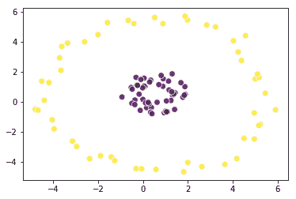

对于此输入数据集，由于数据集包含圆周形状的类，因此所有线性变换都将无法分离蓝色点和红色点。 现在，让我们使用 RBF 内核与内核 PCA 一起尝试一下，看看会发生什么：

```py
In: from sklearn.decomposition import KernelPCA
    kpca_2c = KernelPCA(n_components=2, kernel='rbf')
    X_kpca_2c = kpca_2c.fit_transform(fake_circular_data)
    plt.scatter(X_kpca_2c[:,0], X_kpca_2c[:,1], c=fake_circular_target, 
                alpha=0.8, s=60, marker='o', edgecolors='white')
    plt.show()
```

下图表示示例的转换：

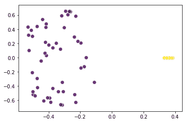

本章中的图形/图表可能与在本地计算机上获得的图形/图表不同，因为图形布局的初始化是使用随机参数进行的。

我们实现了我们的目标-蓝点在左边，红点在右边。 感谢内核 PCA 的转换，您现在可以使用线性技术来处理此数据集。

# T-SNE

PCA 是一种广泛的降维技术，但是当我们处理大数据并呈现许多功能时，我们首先需要了解*特征空间中*的情况。 实际上，在 EDA 阶段，您通常会对数据进行几次散点图绘制，以了解要素之间的关系。 在这一点上，T 分布随机邻居嵌入或 T-SNE 可以为您提供帮助，因为它的设计目标是将高维数据嵌入 2D 或 3D 空间中以充分利用 散点图。 它是由 Laurens van der Maaten 和 Geoffrey Hinton 开发的一种非线性降维技术，该算法的核心是基于两个规则：第一个是周期性的相似观测必须对输出有更大的贡献（这是通过概率实现的）。 分配功能）; 其次，高维空间中的分布必须类似于小空间中的分布（这是通过最小化 **Kullback-Leibler**（**KL** 来实现的），两者之间的差异 概率分布函数）。 输出在视觉上是不错的，并允许您猜测要素之间的非线性相互作用。

让我们通过将 T-SNE 应用于 Iris 数据集并将其绘制到二维空间来查看一个简单的示例如何工作：

```py
In: from sklearn.manifold import TSNE
    from sklearn.datasets import load_iris    

    iris = load_iris()
    X, y = iris.data, iris.target
    X_tsne = TSNE(n_components=2).fit_transform(X)
    plt.scatter(X_tsne[:, 0], X_tsne[:, 1], c=y, alpha=0.8, 
                s=60, marker='o', edgecolors='white')
    plt.show()
```

这是`T_SNE`的结果，将一个类与另一个类完全分开：

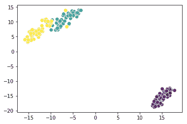

# 受限玻尔兹曼机

**受限玻尔兹曼机**（**RBM**）是另一种由线性函数（通常称为隐藏单元或神经元）组成的技术，可对输入数据进行非线性变换。 隐藏的单位表示系统的状态，而输出数据集实际上是该层的状态。

该技术的主要假设是，输入数据集由表示概率的特征（[0,1]范围内的二进制值或实数值）组成，因为 RBM 是一种概率方法。 在下面的示例中，我们将使用图像的二值化像素作为特征（1 =白色，0 =黑色）来馈送 RBM，并且将打印系统的潜在组件。 这些组件代表原始图像中出现的不同通用面孔：

```py
In: from sklearn import preprocessing 
    from sklearn.neural_network   
    import BernoulliRBM 
    n_components = 64 # Try with 64, 100, 144 
    olivetti_faces = datasets.fetch_olivetti_faces() 
    X = preprocessing.binarize(   
           preprocessing.scale(olivetti_faces.data.astype(float)),
           0.5) 
    rbm = BernoulliRBM(n_components=n_components, learning_rate=0.01, 
                      n_iter=100) 
    rbm.fit(X) 
    plt.figure(figsize=(4.2, 4)) 
    for i, comp in enumerate(rbm.components_):
 plt.subplot(int(np.sqrt(n_components+1)),                     int(np.sqrt(n_components+1)), i + 1)
         plt.imshow(comp.reshape((64, 64)), cmap=plt.cm.gray_r, 
                    interpolation='nearest')
         plt.xticks(()); plt.yticks(())
    plt.suptitle(str(n_components) + ' components extracted by RBM', 
                 fontsize=16)
    plt.subplots_adjust(0.08, 0.02, 0.92, 0.85, 0.08, 0.23)
    plt.show()
```

这是 RBM 提取的 64 个组件：


请注意，Scikit 学习仅包含 RBM 处理的基础层。 如果您正在处理大型数据集，则最好使用基于 GPU 的工具箱（例如基于 CUDA 或 OpenCL 顶部构建的工具箱），因为 RBM 具有高度可并行性。

# 异常值的检测和处理

在数据科学中，示例是从数据过程中学习的核心。 如果将异常，不一致或错误的数据输入到学习过程中，则结果模型可能无法正确概括任何新数据的容纳情况。 除了歪曲诸如均值和方差之类的描述性度量外，变量中存在的异常高的值还会使多少个机器学习算法从数据中学习，从而导致预测失真。

当数据点与样本中的其他数据点明显偏离时，称为*离群值*。 任何其他预期的观察结果都标记为*内部值*。

数据点可能由于以下三个普遍原因而异常（并且每个隐含着不同的补救措施）：

*   考虑到可用数据只是原始数据分布的一个事实，该点表示很少出现，但它也是一个可能的值。 在这种情况下，生成点的基本过程对于所有点都是相同的，但是由于其稀有性，外围点可能被认为不适合通过机器学习进行概括。 在这种情况下，通常会删除该点或将其权重降低。 另一种解决方案是增加样本数量，从而使异常值在数据集中的相关性降低。
*   该点表示通常发生的另一种分布。 当发生类似情况时，可以想象一下影响样品生成的错误或规格错误。 无论如何，您的学习算法都会从无关的分布中获取数据，而这些分布并不是您的数据科学项目关注的重点（重点是泛化）。 在这种情况下，只需删除异常值即可。
*   显然，这是某种错误。 由于某些原因，存在数据输入错误或数据完整性问题，这些问题修改了原始值，并用不一致的值替换了它。 最好的做法是删除该值，并将其视为随机丢失的值。 在这种情况下，通常根据平均数或最常见的类替换异常值，这取决于它是回归问题还是分类问题。 如果这样做不方便或不可能，那么我们建议您从数据集中删除示例。

# 单变量离群值检测

为了解释数据点为何是异常值的原因，首先需要在数据中找到可能的异常值。 有很多方法-有些是单变量的（您可以一次观察每个奇异变量），而另一些是多变量的（他们同时考虑更多的变量）。 单变量方法通常基于 EDA 和可视化显示，例如箱形图（在本章的开头已介绍；我们将在第 5 章，“可视化，见解和结果”中更详细地讨论箱形图）。

通过检查单个变量来追踪异常值时，需要牢记一些经验法则。 实际上，离群值可能会被视为极值：

*   如果您正在观察 Z 分数，则绝对值高于 3 的观察结果必须视为可疑离群值。
*   如果您正在观察数据描述，则可以将小于 25% 百分值的观察值减去`IQR * 1.5`（即 75% 与 25% 百分值之间的差），大于第 75 个百分点值的观察值加上`IQR * 1.5`视为可疑离群值。 通常，您可以借助箱线图来实现这种区分。

为了说明我们如何使用 Z 分数轻松检测出一些离群值，让我们加载并浏览“波士顿房屋价格”数据集。 正如数据集的描述所指出的那样（您可以在`boston.DESCR`的帮助下获得），索引为 3 的变量 CHAS 是二进制的。 因此，在检测异常值时使用它几乎没有意义。 实际上，此类变量的值只能为 0 或 1：

```py
In: from sklearn.datasets import load_boston
    boston = load_boston()
    continuous_variables = [n for n in range(boston.data.shape[1]) if n!=3]
```

现在，让我们使用 sklearn 的`StandardScaler`函数快速标准化所有连续变量。 我们的目标是对`boston.data boston.data[:,continuous_variables]`进行华丽索引，以便创建另一个包含除上一个索引为 3 的变量以外的所有变量的数组。

`StandardScaler`自动标准化为零均值和单位方差。 这是必需的常规操作，应在将数据馈送到学习阶段之前执行。 否则，许多算法将无法正常工作（例如由梯度下降和支持向量机支持的线性模型）。

最后，让我们找到高于三个标准偏差的绝对值的值：

```py
In: import numpy as np
    from sklearn import preprocessing
    scaler= preprocessing.StandardScaler()
 normalized_data = scaler.fit_transform(
                                     boston.data[:,continuous_variables])
    outliers_rows, outliers_columns = np.where(np.abs(normalized_data)>3)
```

`outliers_rows`和`outliers_columns`变量包含可疑离群值的行和列索引。 我们可以打印示例的索引：

```py
In: print(outliers_rows) Out: [ 55  56  57 102 141 199 200 201 202 203 204 225 256 257 262 283 284
 ... 
```

另外，我们可以在数组中显示行/列坐标的元组：

```py
In: print (list(zip(outliers_rows, outliers_columns))) Out: [(55, 1), (56, 1), (57, 1), (102, 10), (141, 11), (199, 1), (200, 1), 
      ...
```

单变量方法可以揭示很多潜在的异常值。 它不会披露没有极值的离群值-相反，它的特征是两个或多个变量中的值异常组合。 在这种情况下，所涉及变量的值甚至可能不是极端值，因此，异常值可能会在单变量检查中未被注意到而消失。 这些离群值称为多元离群值。

为了发现多元离群值，您可以使用降维算法，例如前面说明的 PCA，然后检查超出三个标准偏差的组件的绝对值，或目视检查双变量图以找到孤立的聚类。 数据点。

Scikit-learn 软件包提供了两个类，这些类可以直接为您自动工作并发出所有可疑情况的信号：

*   `covariance.EllipticEnvelope`类适合您的数据的可靠分布估计，指出可能污染数据集的异常值，因为它们是数据一般分布中的极端点。
*   `svm.OneClassSVM`类是一种支持向量机算法，可以近似于数据的形状并确定是否应将提供的任何新实例视为新颖性（它充当新颖性检测器，因为默认情况下，它假定存在 数据中没有异常值）。 通过仅修改其参数，它也可以在存在异常值的数据集上工作，从而提供比`EllipticEnvelope`更鲁棒和可靠的异常值检测系统。

这两种课程都基于不同的统计和机器学习方法，需要在建模阶段进行了解和应用。

# 椭圆形信封

`EllipticEnvelope`是一项函数，它通过假设您的整个数据是基础多元高斯分布的表达式来尝试找出数据总体分布的关键参数。 这个假设不能适用于所有数据集，但是当它成立时，就证明了一种发现异常值的有效方法。 我们可以说，它尽可能地简化了算法背后的复杂估计，它可以检查每个观测值相对于考虑到数据集中所有变量的均值的距离。 因此，它可以发现单变量和多变量离群值。

使用协方差模块中的此功能时，您唯一需要考虑的参数是污染参数，该参数的值最多为 0.5。 它为算法提供有关数据集中存在的异常值比例的信息。 情况因数据集而异。 但是，作为一个开始的数字，我们建议使用 0.01-0.02 的值，因为它是观察值的百分比应落在标准化正态分布中距平均值的 Z 得分距离的绝对值 3 之上。 因此，我们认为默认值 0.1 太高。

让我们在综合分发的帮助下看一下该算法的作用：

```py
In: from sklearn.datasets import make_blobs
    blobs = 1
    blob = make_blobs(n_samples=100, n_features=2, centers=blobs, 
                      cluster_std=1.5, shuffle=True, random_state=5)
    # Robust Covariance Estimate
    from sklearn.covariance import EllipticEnvelope
    robust_covariance_est = EllipticEnvelope(contamination=.1).fit(blob[0])
    detection = robust_covariance_est.predict(blob[0])
    outliers = np.where(detection==-1)[0]
    inliers = np.where(detection==1)[0]
    # Draw the distribution and the detected outliers
    from matplotlib import pyplot as plt
    # Just the distribution
    plt.scatter(blob[0][:,0],blob[0][:,1], c='blue', alpha=0.8, s=60, 
                marker='o', edgecolors='white')
    plt.show()
    # The distribution and the outliers
    in_points = plt.scatter(blob[0][inliers,0],blob[0][inliers,1],  
                            c='blue', alpha=0.8,
 s=60, marker='o', 
                            edgecolors='white')
    out_points = plt.scatter(blob[0][outliers,0],blob[0][outliers,1], 
                             c='red', alpha=0.8, s=60, marker='o', 
                             edgecolors='white')
    plt.legend((in_points,out_points),('inliers','outliers'), 
               scatterpoints=1,               loc='lower right')
    plt.show()
```

让我们仔细检查这段代码。

`make_blobs`函数在二维空间中创建一定数量的分布，总共 100 个示例（`n_samples`参数）。 分布的数量（参数中心）与用户定义的变量 Blob 有关，该变量最初设置为 1。

创建完人工示例数据后，以 10% 的污染率运行`EllipticEnvelope`可帮助您找出分布中的极值。 该模型首先通过在`EllipticEnvelope`类上使用`.fit()`方法来部署拟合。 然后，通过使用`.predict()`方法获得用于拟合的数据的预测。

通过使用`matplotlib`中`pyplot`模块的`plot`函数，可以通过散点图显示与值 1 和-1 的向量相对应的结果（其中-1 为异常示例的标记） ]。

离群值和离群值的区别记录在变量的离群值和离群值中，其中包含示例的索引。

现在，让我们在更改 blob 的数目之后再运行几次代码，并检查 blob 的值为`1`和`4`时的结果：

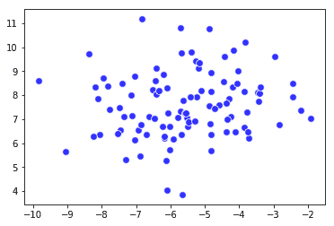

更改斑点数后的数据点分布如下：

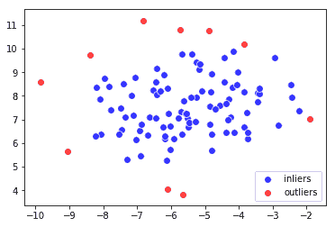

在唯一的基础多元分布的情况下（当变量 blob = 1 时），`EllipticEnvelope`算法已成功将观测值的 10% 定位在分布本身的边缘，并因此向所有可疑异常值发出信号。

相反，当数据中存在多个分布时，好像有两个或两个以上的自然簇时，该算法试图拟合唯一的一般分布，往往会将潜在异常值定位在最远端的簇上，从而忽略了数据的其他区域 可能会受到外围案例的影响。

对于真实数据，这并非罕见情况，它代表了`EllipticEnvelope`算法的重要局限性。

现在，让我们回到最初的波士顿房屋价格数据集，以验证比合成斑点更真实的更多数据。 这是我们可以用于实验的代码的第一部分：

```py
In: from sklearn.decomposition import PCA
    # Normalized data relative to continuos variables
    continuous_variables = [n for n in range(boston.data.shape[1]) if n!=3]
    scaler = preprocessing.StandardScaler()
 normalized_data = scaler.fit_transform(
                                       boston.data[:,continuous_variables])
    # Just for visualization purposes pick the first 2 PCA components
    pca = PCA(n_components=2)
    Zscore_components = pca.fit_transform(normalized_data)
    vtot = 'PCA Variance explained ' + str(round(np.sum( pca.explained_variance_ratio_),3))
    v1 = str(round(pca.explained_variance_ratio_[0],3))
    v2 = str(round(pca.explained_variance_ratio_[1],3))
```

在此脚本中，我们将首先对数据进行标准化，然后仅出于随后的可视化目的，通过使用 PCA 来减少两个分量。

这两个 PCA 分量约占初始方差的 62%，该初始方差由数据集中的 12 个连续变量（`.explained_variance_ratio_`变量的总和，位于已拟合的`PCA`类的内部）表示。

尽管只有两个 PCA 组件足以实现可视化目的，但是通常，此数据集将获得两个以上的组件，因为目标是要有足够的分量以至少占总方差的 95%（如本章前面所述） 。

我们将继续执行脚本：

```py
In: robust_covariance_est = EllipticEnvelope(store_precision=False, 
                                             assume_centered = False, 
                                             contamination=.05)
    robust_covariance_est.fit(normalized_data)
    detection = robust_covariance_est.predict(normalized_data)
    outliers = np.where(detection==-1)
    regular = np.where(detection==1)

In: # Draw the distribution and the detected outliers
    from matplotlib import pyplot as plt
    in_points = plt.scatter(Zscore_components[regular,0],
 Zscore_components[regular,1],                            c='blue', alpha=0.8, s=60, marker='o',        
                            edgecolors='white')
    out_points = plt.scatter(Zscore_components[outliers,0],
 Zscore_components[outliers,1],                             c='red', alpha=0.8, s=60, marker='o', 
                             edgecolors='white')
    plt.legend((in_points,out_points),('inliers','outliers'), 
                scatterpoints=1, loc='best')
    plt.xlabel('1st component ('+v1+')')
    plt.ylabel('2nd component ('+v2+')')
    plt.xlim([-7,7])
    plt.ylim([-6,6])
    plt.title(vtot)
    plt.show()
```

前两个组件的可视化占原始差异的 62.2%：


与前面的示例一样，在我们假设等于 0.05 的低污染的情况下，基于`EllipticEnvelope`的代码将预测异常值，并将其存储在数组中的方式与存储异常值的方式相同。 最后，是可视化（如前所述，我们将在第 5 章，“可视化，见解和结果”中讨论所有可视化方法）。

现在，让我们观察由散点图提供的结果，该散点图用于可视化数据的前两个`PCA`分量并标记外围观察。 关于我们示例中数据点的总体分布，由两个组成部分提供，它们约占数据方差的 62%，看来波士顿似乎有两个不同的房价集群，分别对应于 市场中存在高端和低端设备。 一般而言，对于`EllipticEnvelope`估算，数据中群集的存在并不是最佳的情况。 实际上，根据我们在使用合成斑点进行实验时已经注意到的结果，该算法仅指出了一个簇上的离群值-较小的一个。 鉴于这样的结果，有充分的理由相信我们刚刚收到了有偏见的，部分的回应，在将这些点视为异常值之前，需要进行一些进一步的调查。 Scikit-learn 软件包实际上将鲁棒的协方差估计方法（从根本上讲是一种统计方法）与一种扎根于机器学习的另一种方法集成在一起：`OneClassSVM`类。 现在，我们将继续进行试验。

在离开此示例之前，请注意，为了同时适合 PCA 和`EllipticEnvelope`，我们使用了一个名为`normalized_data`的数组，该数组仅包含标准化的连续数据集变量。 请始终注意，使用非标准化数据并将二进制或分类数据与连续数据混合可能会导致`EllipticEnvelope`算法的错误和近似估计。

# OneClassSVM

由于`EllipticEnvelope`利用参数和统计假设拟合假设的高斯分布，因此`OneClassSVM`是一种机器学习算法，可从数据本身学习特征的分布，因此适用于多种情况 您希望能够捕获所有离群值以及异常数据示例。

如果您已经拥有一个干净的数据集，并且已通过机器学习算法进行了拟合，那就太好了。 之后，可以召唤`OneClassSVM`来检查是否有任何新示例适合历史分布，如果不合适，它将发出一个新示例的信号，该示例可能是错误，也可能是某些新的，以前看不见的情况。

只需将数据科学情况视为经过训练的机器学习分类算法，即可识别网站上的帖子和新闻并采取在线操作。 `OneClassSVM`可以轻松地发现与网站上其他帖子（垃圾邮件，也许是？）不同的帖子，而其他算法只会尝试将新示例适合现有主题的分类。

但是，`OneClassSVM`也可以用来发现现有的异常值。 如果这个专门的 SVM 类不能容纳某些数据（指出该数据处于数据分布的边缘），那么这些示例肯定有一些问题。

为了使`OneClassSVM`作为离群值检测器，您需要研究其核心参数； 它要求您定义内核，度，伽玛和 nu：

*   **核和阶数**：它们相互关联。 通常，我们根据经验建议的值是默认值。 内核的类型应为`rbf`，其阶数应为 3。此类参数将通知`OneClassSVM`创建一系列跨越三个维度的分类气泡，甚至可以对最复杂的多维分布形式进行建模。

*   `Gamma`：这是连接到 RBF 内核的参数。 我们建议您将其保持在尽可能低的水平。 一个好的经验法则是为其分配一个最小值，该最小值介于案例数和变量之间。 γ在 SVM 中的作用将在第 4 章，“机器学习”中进一步说明。 现在就可以说，较高的 gamma 值倾向于使算法遵循数据，但更多地定义分类气泡的形状。
*   `Nu`：此参数确定是否必须拟合精确的分布，或者是否通过不对当前数据示例进行过多调整来尝试获得一定程度的概括（如果存在异常值，则为必要选择）。 可以通过以下公式轻松确定：

```py
nu_estimate = 0.95 * outliers_fraction + 0.05
```

*   如果离群分数的值非常小，则 nu 将很小，并且 SVM 算法将尝试拟合数据点的轮廓。 另一方面，如果分数较高，则参数为，这将强制使 Inliers 分布的边界更平滑。

让我们立即观察该算法在我们之前在波士顿房价数据集上遇到的问题上的性能：

```py
In: from sklearn.decomposition import PCA
    from sklearn import preprocessing
    from sklearn import svm
    # Normalized data relative to continuos variables
    continuous_variables = [n for n in range(boston.data.shape[1]) if n!=3]
 scaler = preprocessing.StandardScaler()
    normalized_data = scaler.fit_transform(
                                       boston.data[:,continuous_variables])
    # Just for visualization purposes pick the first 5 PCA components
    pca = PCA(n_components=5)
    Zscore_components = pca.fit_transform(normalized_data)
    vtot = 'PCA Variance explained ' + str(round( np.sum(pca.explained_variance_ratio_),3))    # OneClassSVM fitting and estimates
    outliers_fraction = 0.02 # 
    nu_estimate = 0.95 * outliers_fraction + 0.05
    machine_learning = svm.OneClassSVM(kernel="rbf", 
                                       gamma=1.0/len(normalized_data), 
                                       degree=3, nu=nu_estimate)
    machine_learning.fit(normalized_data)
    detection = machine_learning.predict(normalized_data)
    outliers = np.where(detection==-1)
    regular = np.where(detection==1) 
```

现在，我们将可视化结果：

```py
In: # Draw the distribution and the detected outliers
    from matplotlib import pyplot as plt
    for r in range(1,5):
        in_points = plt.scatter(Zscore_components[regular,0],
 Zscore_components[regular,r],                                c='blue', alpha=0.8, s=60, 
                                marker='o', edgecolors='white')
        out_points = plt.scatter(Zscore_components[outliers,0],
 Zscore_components[outliers,r],                                 c='red', alpha=0.8, s=60, 
                                 marker='o', edgecolors='white')
        plt.legend((in_points,out_points),('inliers','outliers'), 
                    scatterpoints=1, loc='best')
        plt.xlabel('Component 1 (' + str(round(
 pca.explained_variance_ratio_[0],3))+')')
        plt.ylabel('Component '+str(r+1)+'('+str(round( pca.explained_variance_ratio_[r],3))+')')
        plt.xlim([-7,7])
        plt.ylim([-6,6])
        plt.title(vtot)
        plt.show()
```

与先前提供的代码相比，此代码段有所不同，因为最终 PCA 分解由五个组件组成。 为了探索更多的数据维度，需要更大的数量。 增加所得 PCA 组件数量的另一个原因是因为我们打算将转换后的数据集与`OneClassSVM`一起使用。

核心参数是根据观察次数计算得出的，如下所示：

```py
gamma = 1.0 / len(normalized_data)
nu = no_estimated
```

`nu`特别取决于：

```py
nu_estimate = 0.95 * outliers_fraction + 0.05
```

因此，通过将`outliers_fraction`（从`0.02`更改为较大的值，例如`0.1`），当假定发生率较高时，您需要算法对可能出现的异常现象给予更多关注 您数据中的异常情况。

我们还要观察 PCA 组件从 2 到 5 的图形输出，并将其与主组件进行比较（所解释方差的 51%）。 该系列的第一个图（包括四个散点图）如下：

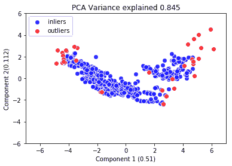

从我们的图形探索中，似乎`OneClassSVM`很好地模拟了房价数据的分布，并帮助发现了分布边界上的一些极值。

此时，您可以决定我们将要提出的新颖性和异常检测方法之一。 您甚至可以同时使用：

*   仔细检查异常值的特征以找出存在异常的原因（这一事实可能会使您进一步思考数据的潜在生成过程）
*   通过对偏远的观察使用权重较低或仅排除它们来尝试构建一些机器学习模型

最后，采用纯粹的数据科学方法，可以帮助您决定对任何遥远的观察采取下一步措施的方法是测试决策结果以及对数据的后续操作。 如何测试和试验关于您的数据的假设是我们将在接下来的部分中与您讨论的主题。

# 验证指标

为了评估已构建的数据科学系统的性能并检查与目标之间的距离，您需要使用对结果进行评分的功能。 通常，使用不同的评分函数来处理二进制分类，多标签分类，回归或聚类问题。 现在，让我们看看这些任务中最受欢迎的功能，以及机器学习算法如何使用它们。

学习如何为数据科学项目选择正确的分数/错误度量标准实际上是一个经验问题。 我们发现咨询（并参加）Kaggle（HTG1）kaggle.com 举办的数据科学竞赛非常有帮助，该公司致力于组织来自世界各地的数据科学家之间的数据挑战。 通过观察各种挑战以及他们尝试优化的分数或错误度量，您一定可以对自己的问题获得有用的见解。 Kaggle 的首席技术官本·哈默（Ben Hammer）甚至创建了一个比赛中常用指标的 Python 库，您可以在[这个页面](http://github.com/benhamner/Metrics)上查询并使用`pip install ml_metrics`安装在计算机上。

# 多标签分类

当您的任务是预测多个标签时（例如：今天的天气如何？这是什么花？您的工作是什么？），我们将此问题称为多标签分类。 多标签分类是一项非常流行的任务，并且存在许多性能指标来评估分类器。 当然，在二进制分类的情况下，您可以使用所有这些度量。 现在，让我们使用一个简单的真实示例来说明其工作原理：

```py
In: from sklearn import datasets
    iris = datasets.load_iris()
    # No crossvalidation for this dummy notebook
    from sklearn.model_selection import train_test_split
    X_train, X_test, Y_train, Y_test = train_test_split(iris.data, 
iris.target, test_size=0.50, random_state=4)
    # Use a very bad multiclass classifier
    from sklearn.tree import DecisionTreeClassifier
    classifier = DecisionTreeClassifier(max_depth=2)
    classifier.fit(X_train, Y_train) 
    Y_pred = classifier.predict(X_test)
    iris.target_names Out: array(['setosa', 'versicolor', 'virginica'], dtype='<U10')
```

现在，让我们看一下多标签分类中常用的度量：

*   **混淆矩阵**：在描述多标签分类的性能指标之前，让我们看一下混淆矩阵，该表使我们了解了每个类别的错误分类。 理想情况下，在理想分类中，所有不在对角线上的像元应为 0s。 在下面的示例中，您将看到类别 0（*山鸢尾*）从未被错误分类，类别 1（*杂色鸢尾*）被两次错误分类为*弗吉尼亚鸢尾*，并且类别 2（*弗吉尼亚鸢尾*）被误分类为*杂色鸢尾*两次：

```py
In: from sklearn import metrics
    from sklearn.metrics import confusion_matrix
    cm = confusion_matrix(y_test, y_pred)
    print cm

Out: [[30  0  0]
      [ 0 19  3]
      [ 0  2 21]] In: import matplotlib.pyplot as plt
    img = plt.matshow(cm, cmap=plt.cm.autumn)
    plt.colorbar(img, fraction=0.045)
    for x in range(cm.shape[0]):
        for y in range(cm.shape[1]):
            plt.text(x, y, "%0.2f" % cm[x,y], 
              size=12, color='black', ha="center", va="center")
    plt.show() 
```

混淆矩阵以这种方式用图形表示：


*   **准确率**：准确性是预测标签中与实际标签完全相等的部分。 换句话说，它是正确分类的标签总数的百分比：

```py
In: print ("Accuracy:", metrics.accuracy_score(Y_test, Y_pred)) Out: Accuracy: 0.933333333333
```

*   **精度**：这是从信息检索领域中采取的一种措施。 它计算结果集中相关结果的数量。 等效地，在分类任务中，它计算每组分类标签中正确标签的数量。 然后，将所有标签的结果取平均值：

```py
In: print ("Precision:", metrics.precision_score(y_test, y_pred)) Out: Precision: 0.933333333333
```

*   **召回**：这是从信息检索中提取的另一个概念。 与数据集中的所有相关标签相比，它计算结果集中相关结果的数量。 在分类任务中，这是一组中正确分类的标签的数量除以该组的标签总数。 最后，对结果进行平均，如以下代码所示：

```py
In: print ("Recall:", metrics.recall_score(y_test, y_pred)) Out: Recall: 0.933333333333
```

*   **F1 得分**：这是精度和召回率的谐波平均值，通常在处理不平衡数据集时使用，以显示分类器在所有类别中的表现是否良好：

```py
In: print ("F1 score:", metrics.f1_score(y_test, y_pred)) Out: F1 score: 0.933267359393
```

这些是多标签分类中最常用的度量。 方便的功能`classification_report`显示有关这些措施的报告，非常方便。 支持只是带有该标签的观察次数。 了解数据集是否平衡（即每个类的示例份额是否相同）非常有用：

```py
In: from sklearn.metrics import classification_report
 print classification_report(y_test, y_pred, 
                                target_names=iris.target_names)
```

这是完整报告，具有**精度**，**召回**，**F1 得分**和**支持度**（该类案件的数量）：


在数据科学实践中，**精度**和**召回**比**准确率**更为广泛地使用，因为数据问题中的大多数数据集倾向于不平衡。 为了解决这种不平衡，数据科学家经常以**精度**，**召回**和 **F1 分数**来表示其结果。 此外，我们必须注意**准确率**，**精度**，**召回**和 **F1-分数**如何采用`[0.0, 1.0]`范围。 完美的分类器在所有这些指标上的得分都达到`1.0`（但是要当心任何完美的分类，如果太令人难以置信，请当心，因为这通常意味着出了点问题；现实世界中的数据问题永远不会 完美的解决方案）。

# 二进制分类

除了上一节中显示的错误度量之外，在只有两个输出类的问题中（例如，如果您必须猜测用户的性别或预测用户是否会点击/购买/喜欢该商品）， 还有一些其他措施。 因为它非常有用，所以使用最多的是受试者工作特性（**ROC**）的曲线下面积（**AUC**）。

ROC 曲线是一种图形化的方式，用于表达分类器的性能在所有可能的分类阈值上如何变化（即，当参数变化时结果的变化）。 具体而言，这些表演具有真实的正（或命中）率和错误的正（或失误）率。 第一个是正确阳性结果的比率，第二个是错误阳性结果的比率。 该曲线下方的区域表示分类器相对于随机分类器（其 AUC 为 0.50）的效果。

在这里，我们有一个随机分类器（虚线）和一个更好的分类器（实线）的图形示例。 您可以看到随机分类器的 AUC 为 0.5（是平方的一半），另一个具有更高的 AUC（其上限为`1.0`）：

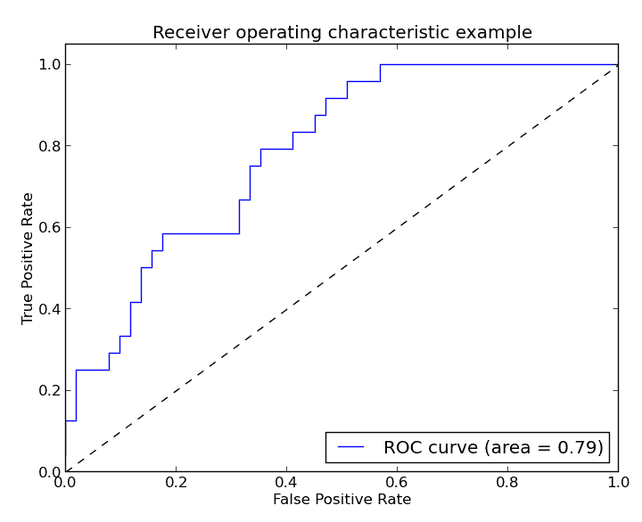

用于使用 Python 计算 AUC 的函数为`sklearn.metrics.roc_auc_score()`。

# 回归

在必须预测实数或回归的任务中，许多误差度量均来自欧几里得代数：

*   **平均绝对误差或 MAE**：这是预测值和实际值之间的差矢量的平均 L1 范数：

```py
In: from sklearn.metrics import mean_absolute_error 
mean_absolute_error([1.0, 0.0, 0.0], [0.0, 0.0, -1.0]) Out: 0.66666666666666663
```

*   **均方误差或 MSE**：这是预测值和实际值之间的差矢量的平均 L2 范数：

```py
In: from sklearn.metrics import mean_squared_error 
mean_squared_error([-10.0, 0.0, 0.0], [0.0, 0.0, 0.0]) Out: 33.333333333333
```

*   **R² 得分**：R² 也称为**测定系数**。 简而言之，R² 确定在预测变量和`target`变量之间存在线性拟合的程度。 取值介于 0 和 1（含）之间； R² 越高，模型越好。 这是一个很好的评分标准，但是并不能说明所有有关故事的信息，尤其是在您的数据中存在异常值的情况下。 您可以在《统计》的参考书中找到关于此指标的更多错综复杂的信息。 作为建议，可以使用它，但要同时进行其他评分或错误测量。 在这种情况下使用的功能是`sklearn.metrics.r2_score`。

# 测试和验证

加载数据，对其进行预处理，创建新的有用功能，检查异常值和其他不一致的数据点并最终选择正确的指标后，我们准备应用机器学习算法。

通过观察一系列示例并将它们与结果配对，机器学习算法能够提取一系列规则，通过正确猜测它们的结果，可以将这些规则成功地推广到新示例。 这就是有监督的学习方法，其中应用了一系列高度专业化的学习算法，我们希望这些算法可以正确地预测（并概括）任何新数据。

但是，我们如何才能正确地应用学习过程，以便获得最佳的预测模型，以便通常将其用于相似但新的数据？

在数据科学中，有一些最佳实践可以遵循，可以确保在将来将模型推广到任何新数据时获得最佳结果。 让我们通过逐步进行说明，首先加载以下示例中将要处理的数据集：

```py
In: from sklearn.datasets import load_digits
    digits = load_digits()
    print (digits.DESCR)
    X = digits.data
    y = digits.target  
```

数字数据集包含从 0 到 9 的手写数字图像。数据格式由 8 x 8 此类图像的矩阵组成：


这些数字实际上存储为矢量（从每个 8 x 8 图像的平整度得出），其矢量值为 0 到 16 之间的 64 个数值，代表每个像素的灰度色调：

```py
In: X[0] Out: array([0., 0., 5., 13., 9., 1., 0., 0., ...])  
```

我们还将使用三个不同的支持向量机上载三个不同的机器学习假设（在机器学习语言中，一个假设是一种已将其所有参数设置为可学习的算法）。 它们对于我们的实际示例很有用：

```py
In: from sklearn import svm
    h1 = svm.LinearSVC(C=1.0)
    h2 = svm.SVC(kernel='rbf', degree=3, gamma=0.001, C=1.0)
    h3 = svm.SVC(kernel='poly', degree=3, C=1.0)
```

作为第一个实验，让我们将线性 SVM 分类器拟合到我们的数据并验证结果：

```py
In: h1.fit(X,y)
    print (h1.score(X,y)) 

Out: 0.984974958264  
```

第一种方法是使用`X`数组拟合模型，以便正确预测`y`向量指示的 10 个类别之一。 此后，通过调用`.score()`方法并指定相同的预测变量（`X`数组），该方法根据相对于`y`向量给定的真实值的平均准确度来评估性能。 结果在预测正确的数字上约为 98.5% 的准确度。

该数字表示样本内性能，即学习算法的性能。 它纯粹是指示性的，尽管它代表了性能的上限（提供不同的示例，但平均性能始终会很差）。 实际上，每种学习算法都具有一定的记忆能力，可以记忆训练过的数据。 因此，样本内性能部分归因于该算法从数据中学习一些一般推断的能力，部分归因于其记忆能力。 在极端情况下，如果模型相对于可用数据而言训练过度或过于复杂，则存储的模式将优先于派生的规则，并且该算法将不适合正确地预测新的观测值（尽管对过去的观测值非常有用）。 这样的问题称为过度拟合。 由于在机器学习中，我们无法分离这两种伴随的影响，为了正确估计我们的假设的预测性能，我们需要在没有记忆效应的一些新数据上对其进行测试。

记忆的发生是由于算法的复杂性。 复杂的算法拥有许多系数，可以在其中存储有关训练数据的信息。 不幸的是，由于预测过程变得随机，因此在预测未见实例时，记忆效应会导致估计的高方差。 三种解决方案是可能的：

*   首先，您可以增加示例数，这样就无法存储所有以前见过的案例的信息，但是查找所有必要数据可能会变得更加昂贵
*   其次，您可以使用较简单的机器学习算法，该算法不太容易记忆，但是会以使用机器学习解决方案的能力为代价，该解决方案不太适合数据基础规则的复杂性。
*   第三，您可以使用正则化对极其复杂的模型进行惩罚，并迫使算法过轻，甚至从模型中排除一定数量的变量，从而有效地减少了模型中系数的数量及其存储数据的能力。

在许多情况下，即使没有一定的成本，也无法获得新的数据。 在这种常见情况下，一种好的方法是将初始数据分为训练集（通常为总数据的 70-80%）和测试集（其余为 20-30%）。 考虑到任何可能的不平衡班级分布，训练和测试集之间的划分应该是完全随机的：

```py
In: chosen_random_state = 1
    X_train, X_test, y_train, y_test = model_selection.train_test_split(
                        X, y, 
                        test_size=0.30, random_state=chosen_random_state)
    print ("(X train shape %s, X test shape %s, n/y train shape %s, \
 y test shape %s" % (X_train.shape, X_test.shape,y_train.shape, y_test.shape))
    h1.fit(X_train,y_train)
    print (h1.score(X_test,y_test)) 
    # Returns the mean accuracy on the given test data and labels Out: (X train shape (1257, 64), X test shape (540, 64), 
      y train shape (1257,), y test shape (540,)
      0.953703703704
```

通过执行前面的代码，`model_selection.train_test_split()`函数根据参数`test_size`将初始数据随机分为两个互斥的集合（该整数可以表示测试集示例的确切数目，也可以是 浮点数，表示要用于测试目的的总数据的百分比）。 拆分由`random_state`控制，该操作可确保在不同时间和不同计算机上（即使您使用的是完全不同的操作系统）也可以重现该操作。

目前的平均准确度为 0.94。 如果您尝试使用`chosen_random_state`参数使用不同的整数值再次运行同一单元，则实际上您会注意到准确性会发生变化，这表明测试集进行的性能评估并非绝对的性能指标，并且 应谨慎使用。 给定不同的测试样本，您必须了解它的可变性。

实际上，我们甚至可以从测试集中获得有偏差的性能估计。 如果我们选择（在使用`random_state`进行各种试验后）可以确认我们假设的测试集，或者开始使用测试集作为参考以对学习过程做出决定（例如，选择 符合特定测试样本的最佳假设）。

与仅评估训练数据的拟合度一样，对选定的测试集进行操作也可以确保最终的性能看起来不错。 但是，您建立的模型不会在不同的测试集上复制相同的性能（再次是过度拟合问题）。

因此，当我们在将每个假设拟合到训练数据之后必须在多个假设之间进行选择（数据科学中的一个常见实验）时，我们需要一个可用于比较其性能的数据样本，并且它不能是测试集（ 由于我们之前提到的原因）。

正确的方法是使用验证集。 我们建议您拆分初始数据-可以为训练集保留 60% 的初始数据，为验证集保留 20% 的数据，为测试集保留 20% 的数据。 为了考虑到这一点，我们可以更改初始代码，并且可以对其进行修改以测试所有三个假设：

```py
In: chosen_random_state = 1
    X_train, X_validation_test, y_train, y_validation_test =  
    model_selection.train_test_split(X, y, 
                                     test_size=.40,                                                   
                                     random_state=chosen_random_state)
    X_validation, X_test, y_validation, y_test = 
    model_selection.train_test_split(X_validation_test, y_validation_test, 
                                    test_size=.50, 
                                    random_state=chosen_random_state)
    print ("X train shape, %s, X validation shape %s, X test shape %s, 
           /ny train shape %s, y validation shape %s, y test shape %s/n" % 
           (X_train.shape, X_validation.shape, X_test.shape,  
            y_train.shape, y_validation.shape, y_test.shape))
    for hypothesis in [h1, h2, h3]:
        hypothesis.fit(X_train,y_train)
        print ("%s -> validation mean accuracy = %0.3f" % (hypothesis,  
        hypothesis.score(X_validation,y_validation))  )  
    h2.fit(X_train,y_train)
    print ("n%s -> test mean accuracy = %0.3f" % (h2,   
h2.score(X_test,y_test)))

Out: X train shape, (1078, 64), X validation shape (359, 64), 
     X test shape (360, 64), 
     y train shape (1078,), y validation shape (359,), y test shape (360,)    

     LinearSVC(C=1.0, class_weight=None, dual=True, fit_intercept=True,
         intercept_scaling=1, loss='squared_hinge', max_iter=1000,
         multi_class='ovr', penalty='l2', random_state=None,  tol=0.0001,
         verbose=0) -> validation mean accuracy = 0.958    

     SVC(C=1.0, cache_size=200, class_weight=None, coef0=0.0,
      decision_function_shape=None, degree=3, gamma=0.001, kernel='rbf',
      max_iter=-1, probability=False, random_state=None, shrinking=True,
      tol=0.001, verbose=False) -> validation mean accuracy = 0.992

     SVC(C=1.0, cache_size=200, class_weight=None, coef0=0.0,
      decision_function_shape=None, degree=3, gamma='auto', kernel='poly',
      max_iter=-1, probability=False, random_state=None, shrinking=True,
      tol=0.001, verbose=False) -> validation mean accuracy = 0.989

     SVC(C=1.0, cache_size=200, class_weight=None, coef0=0.0,
      decision_function_shape=None, degree=3, gamma=0.001, kernel='rbf',
      max_iter=-1, probability=False, random_state=None, shrinking=True,
      tol=0.001, verbose=False) -> test mean accuracy = 0.978
```

如产出所报告的那样，现在，培训集由 1,078 例（占总数的 60%）组成。 为了将数据分为三个部分-训练，验证和测试-首先使用功能`model_selection.train_test_split`在训练集和测试/验证数据集之间提取数据（从而提取训练样本）。 然后，使用相同的功能将测试/验证数据集进一步分为两部分。 在对每个假设进行训练后，将根据验证集对其进行测试。 根据验证集，使用 RBF 内核的 SVC 的精度为 0.992，是最佳模型。 决定使用此模型后，将在测试集上评估其性能，从而得出 0.978 的准确度（这是该模型实际性能的实测代表）。

由于测试的准确性与验证的准确性不同，因此选择的假设真的是最好的假设吗？ 我们建议您尝试多次运行单元格中的代码（理想情况下，至少运行 30 次代码应确保具有统计意义），每次都更改`chosen_random_state`值。 这样，将针对不同的样本验证相同的学习过程，从而使您对自己的期望更有信心。

# 交叉验证

如果您运行了先前的实验，则可能已经意识到：

*   验证和测试结果都不同，因为它们的样本不同。
*   选择的假设通常是最好的假设，但并非总是如此。

不幸的是，依赖于样本的验证和测试阶段会带来不确定性，同时减少了专门用于训练的学习示例（示例越少，模型估计值的差异就越大）。

一种解决方案是使用交叉验证，Scikit-learn 提供了一个完整的交叉验证和性能评估模块（`sklearn.model_selection`）。

通过使用交叉验证，您只需要将数据分为训练和测试集，就可以将训练数据用于模型优化和模型训练。

交叉验证如何工作？ 这个想法是将您的训练数据划分为一定数量的分区（称为折叠），然后对您的模型进行多达该分区数量的训练，每次从训练阶段就将一个不同的分区排除在外。 每次模型训练后，您都将在未折叠的折痕上测试结果并将其存储起来。 最后，您将获得与折痕一样多的结果，并且您可以计算出折痕的平均值和标准差：

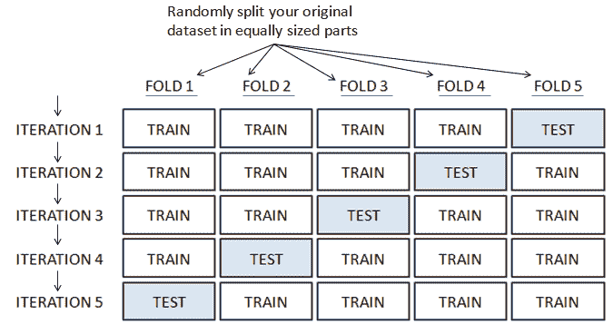

在前面的图形示例中，图表描述了一个数据集，该数据集被分为五个大小相等的折叠，根据迭代的不同，它们在机器学习过程中被用作训练或测试集的一部分。

在我们推荐的交叉验证中，十折是很常见的配置。 对于线性估计等有偏估计量，使用较少的折痕可能会很好，但它可能会惩罚更复杂的机器学习算法。 在某些情况下，您确实需要使用更多的折痕以确保有足够的训练数据供机器学习算法正确归纳。 这在没有足够数据点的医学数据集中很常见。 另一方面，如果手头的示例数量不成问题，则使用更多的折叠会占用更多的计算资源，并且交叉验证完成可能需要更长的时间。 有时，使用五折可以很好地权衡估算的准确性和运行时间。

标准偏差将提示您模型如何受到训练提供的数据（实际上是模型的方差）的影响，并且平均值提供了对其总体性能的合理估计。 使用从不同模型获得的交叉验证结果的平均值（由于使用了不同的模型类型，或者因为使用了不同的训练变量选择，或者因为模型的不同超参数），您可以放心地选择 表现最佳的假设，可进行总体表现测试。

我们强烈建议您将交叉验证仅用于优化目的，而不是用于性能估计（也就是说，找出新数据上的模型错误可能是什么）。 交叉验证只是根据最佳平均结果指出最佳算法和参数选择。 将其用于性能评估将意味着使用找到的最佳结果，这比应该的结果更为乐观。 为了报告您可能的性能的无偏估计，您应该首选使用测试集。

让我们执行一个示例，以查看交叉验证的实际效果。 此时，我们可以回顾一下对数字数据集的三个可能假设的先前评估：

```py
In: choosen_random_state = 1
 cv_folds = 10 # Try 3, 5 or 20
    eval_scoring='accuracy' # Try also f1
    workers = -1 # this will use all your CPU power
    X_train, X_test, y_train, y_test = model_selection.train_test_split(
                                      X, y, 
                                      test_size=0.30, 
                                      random_state=choosen_random_state)
    for hypothesis in [h1, h2, h3]:
        scores = model_selection.cross_val_score(hypothesis, 
                     X_train, y_train, 
                     cv=cv_folds, scoring= eval_scoring, n_jobs=workers)
        print ("%s -> cross validation accuracy: mean = %0.3f \
               std = %0.3f" % (hypothesis, np.mean(scores), 
                               np.std(scores))) 

Out: LinearSVC(C=1.0, class_weight=None, dual=True, fit_intercept=True,
      intercept_scaling=1, loss='squared_hinge', max_iter=1000,
      multi_class='ovr', penalty='l2', random_state=None, tol=0.0001,
      verbose=0) -> cross validation accuracy: mean = 0.930 std = 0.021

     SVC(C=1.0, cache_size=200, class_weight=None, coef0=0.0,
      decision_function_shape=None, degree=3, gamma=0.001, kernel='rbf',
      max_iter=-1, probability=False, random_state=None, shrinking=True,
      tol=0.001, verbose=False) -> cross validation accuracy: 
      mean = 0.990 std = 0.007

     SVC(C=1.0, cache_size=200, class_weight=None, coef0=0.0,
      decision_function_shape=None, degree=3, gamma='auto', kernel='poly',
      max_iter=-1, probability=False, random_state=None, shrinking=True,
      tol=0.001, verbose=False) -> cross validation accuracy: 
      mean = 0.987 std = 0.010
```

脚本的核心是`model_selection.cross_val_score`函数。 我们脚本中的函数接收以下参数：

*   学习算法（`estimator`）
*   一组预测变量（`X`）
*   `target`变量（`y`）
*   交叉验证倍数（`cv`）
*   计分功能（`scoring`）
*   要使用的 CPU 数（`n_jobs`）

给定这样的输入，该函数将包装一些其他复杂函数。 它创建 n 个重复项，训练 n 个交叉验证样本中的模型，测试结果，并存储从样本外折叠中每次迭代得出的分数。 最后，该功能将报告此类记录的分数列表：

```py
In: scores  Out: array([ 0.96899225, 0.96899225, 0.9921875, 0.98412698, 0.99206349,             1, 1., 0.984, 0.99186992, 0.98347107])
```

使用`cross_val_score`的主要优点在于使用简单，并且它自动合并了所有必要步骤以进行正确的交叉验证。 例如，在决定如何将训练样本分成多个折叠时，如果提供了`y`向量，则它在每个折叠中的目标类别标签所占的比例将与最初提供的`y`相同。

# 使用交叉验证迭代器

尽管`model_selection`模块中的`cross_val_score`功能充当大多数交叉验证目的的完整帮助器功能，但您可能仍需要构建自己的交叉验证过程。 在这种情况下，相同的`model_selection`模块可确保对迭代器的强大选择。

在研究最有用的迭代器之前，让我们通过研究其中一个迭代器`model_selection.KFold`的工作方式，清楚地概述它们的功能。

`KFold`的功能非常简单。 如果给出 n 次折叠，则它将 n 次迭代返回到训练和验证集的索引以测试每个折叠。

假设我们有一个由 100 个示例组成的训练集，并且我们想创建一个 10 倍的交叉验证。 首先，让我们设置迭代器：

```py
In: kfolding = model_selection.KFold(n_splits=10, shuffle=True, 
                                     random_state=1)
 for train_idx, validation_idx in kfolding.split(range(100)): print (train_idx, validation_idx) Out: [ 0 1 2 3 4 5 6 7 8 9 10 11 12 13 14 15 16 18 19 20 21 22 23 24 25 26 27  
       28 29 30 31 32 34 35 37 38 39 40 41 42 43 44 45 46 47 48 49 50 51 52 53 
       54 55 56 57 58 59 60 61 62 63 64 66 67 68 70 71 72 73 74 75 76 77 78 79 
       83 85 86 87 88 89 90 91 92 94 95 96 97 98 99] [17 33 36 65 69 80 81 82 
       84 93] ...
```

通过使用 n 参数，我们可以指示迭代器对 100 个索引执行折叠。 `n_splits`指定折数。 将随机播放设置为`True`时，它将随机选择折叠分量。 相反，如果将其设置为`False`，则将根据索引的顺序创建折叠（因此，第一个折叠将为`[0 1 2 3 4 5 6 7 8 9]`）。

像往常一样，`random_state`参数可允许产生折痕。

在迭代器循环中，会根据您的假设提供评估和验证的索引，以进行评估。 （让我们通过使用线性 SVC h1 来了解它是如何工作的。）您只需在花式索引的帮助下同时选择`X`和`y`：

```py
In: h1.fit(X[train_idx],y[train_idx])
    h1.score(X[validation_idx],y[validation_idx]) Out:0.90000000000000002
```

如您所见，交叉验证迭代器仅为您提供索引功能，并且在使用索引对假设进行评分评估时由您自己决定。 这为复杂的验证操作打开了机会。

在其他最有用的迭代器中，值得一提的是：

*   `StratifiedKFold`的工作方式与`Kfold`相似，但它始终返回与训练集大致相同的班级百分比的折叠。 这样可以使每个折痕保持平衡； 因此，学习者适合正确的课堂比例。 代替案例数，它需要输入目标变量 y 作为输入参数。 如上一节所述，默认情况下，迭代器包装在`cross_val_score`函数中。
*   `LeaveOneOut`的工作方式类似于`Kfold`，但它仅作为一个观测值的验证集返回。 因此，最后，折叠数将等于训练集中的示例数。 我们建议您仅在训练集严重不平衡（例如，在欺诈检测问题中）或很小的训练集时使用此交叉验证方法，尤其是在观察值少于 100 的情况下– k 倍验证会减少训练集 很多。
*   `LeavePOut`在`LeaveOneOut`的优点和局限性方面相似，但其验证集由 P 个案例组成。 因此，总折叠数将是所有可用案例中 P 个案例的组合（随着数据集大小的增长，实际上可能是相当大的数量）。
*   `LeaveOneLabelOut`提供了一种方便的方法，可根据您预先准备或计算的方案进行交叉验证。 实际上，它的行为类似于`Kfolds`，但是对于折叠已经被标记并提供给标签参数这一事实。
*   `LeavePLabelOut`是`LeaveOneLabelOut`的变体。 在这种情况下，根据您事先准备的方案，测试折痕由许多标签组成。

[要了解有关每个迭代器所需的特定参数的更多信息，建议您访问 Scikit-learn 网站](http://scikit-learn.org/stable/modules/classes.html#module-sklearn.cross_validation)。

实际上，交叉验证也可以用于预测目的。 实际上，对于特定的数据科学项目，可能会要求您从可用数据中构建模型，然后对完全相同的数据进行预测。 如前所述，使用训练预测将导致高方差估计，因为该模型已经拟合到该数据上，因此它已经记住了其许多特征。

应用于预测的交叉验证过程可以解决：

*   创建一个交叉验证迭代器（最好具有大量的 k 折）。
*   反复进行交叉验证，每次使用 k-1 训练倍数训练模型。
*   在每次迭代中，在验证折痕上（实际上是超出样本的折痕），生成预测并将其存储起来，以跟踪其索引。 这样做的最好方法是拥有一个预测矩阵，该矩阵将通过使用花式索引进行预测。

这种方法通常称为跨验证倍数预测。

# 采样和引导

在说明了基于折叠，p-out 和自定义方案的迭代器之后，我们将继续对交叉验证迭代器进行概述，并引用所有基于采样的迭代器。

采样方案是不同的，因为它们不会拆分训练集，但是会使用不同的方法对其进行采样：子采样或自举。

当您随机选择可用数据的一部分，从而获得比初始数据集小的数据集时，将执行子采样。

二次采样非常有用，尤其是当您需要广泛地检验假设时，尤其是您不希望从极小的测试样本中获得验证时（因此，您可以选择不采用遗忘式方法或使用`KFold`大量折叠）。 以下是相同的示例：

```py
In: subsampling = model_selection.ShuffleSplit(n_splits=10, 
    test_size=0.1, random_state=1)
 for train_idx, validation_idx in subsampling.split(range(100)): print (train_idx, validation_idx) Out:[92 39 56 52 51 32 31 44 78 10  2 73 97 62 19 35 94 27 46 38 67 99 54 
     95 88 40 48 59 23 34 86 53 77 15 83 41 45 91 26 98 43 55 24  4 58 49
     21 87  3 74 30 66 70 42 47 89  8 60  0 90 57 22 61 63  7 96 13 68 85 
     14 29 28 11 18 20 50 25  6 71 76  1 16 64 79  5 75  9 72 12 37] [80 
     84 33 81 93 17 36 82 69 65]
     ...
```

与其他迭代器类似，`n_splits`将设置子样本数，`test_size`百分比（如果给出浮点数）或用作测试的观察数。

自举作为一种重采样方法，已经很长时间用于估计统计数据的采样分布。 因此，根据对机器学习假设的样本外性能的评估，这是一种合适的方法。

自举的工作方式是随机选择观察值并允许重复，直到建立了一个与原始数据集大小相同的新数据集。

不幸的是，由于引导是通过替换采样（即允许重复相同的观察值）来工作的，因此，由于以下原因会出现问题：

*   案例可能同时出现在培训和测试集上（您仅需出于测试目的使用引导外样本观察）
*   与交叉验证估计相比，方差少且偏差大，这是由于替换采样导致的观察结果不一致。

尽管该功能很有用（至少从我们作为数据科学从业人员的角度来看），但我们向您建议了`Bootstrap`的简单替代品，该替代品适用于交叉验证，可以通过迭代调用。 它生成与输入数据（索引的长度）大小相同的样本引导程序，以及可用于测试目的的排除索引列表（样本之外）：

```py
In: import random
    def Bootstrap(n, n_iter=3, random_state=None):
        """
        Random sampling with replacement cross-validation generator.
        For each iter a sample bootstrap of the indexes [0, n) is 
        generated and the function returns the obtained sample 
        and a list of all the excluded indexes.
        """
        if random_state:
            random.seed(random_state)
        for j in range(n_iter):
            bs = [random.randint(0, n-1) for i in range(n)]
            out_bs = list({i for i in range(n)} - set(bs))
            yield bs, out_bs    

    boot = Bootstrap(n=100, n_iter=10, random_state=1)
    for train_idx, validation_idx in boot:
        print (train_idx, validation_idx)    

Out:[37, 12, 72, 9, 75, 5, 79, 64, 16, 1, 76, 71, 6, 25, 50, 20, 18, 84, 
     11, 28, 29, 14, 50, 68, 87, 87, 94, 96, 86, 13, 9, 7, 63, 61, 22, 57, 
     1, 0, 60, 81, 8, 88, 13, 47, 72, 30, 71, 3, 70, 21, 49, 57, 3, 68, 
     24, 43, 76, 26, 52, 80, 41, 82, 15, 64, 68, 25, 98, 87, 7, 26, 25, 
     22, 9, 67, 23, 27, 37, 57, 83, 38, 8, 32, 34, 10, 23, 15, 87, 25, 71, 
     92, 74, 62, 46, 32, 88, 23, 55, 65, 77, 3] [2, 4, 17, 19, 31, 33, 35, 
     36, 39, 40, 42, 44, 45, 48, 51, 53, 54, 56, 58, 59, 66, 69, 73, 78, 
     85, 89, 90, 91, 93, 95, 97, 99]
     ...
```

该函数执行二次采样，并接受`n_iter`索引的参数`n`以绘制引导程序样本，并接受`random_state`索引以提高可重复性。

# 超参数优化

机器学习假设不仅由学习算法确定，还由其超参数（算法的参数必须事先确定，并且在训练过程中无法学习）确定，并选择要用于实现的变量 最好的学习参数。

在本节中，我们将探索如何扩展交叉验证方法，以找到能够推广到我们的测试集的最佳超参数。 我们将继续使用 Scikit-learn 软件包提供的手写数字数据集。 这是有关如何加载数据集的有用提示：

```py
In: from sklearn.datasets import load_digits
    digits = load_digits()
 X, y = digits.data, digits.target 
```

此外，我们将继续使用支持向量机作为学习算法：

```py
In: from sklearn import svm
    h = svm.SVC()
    hp = svm.SVC(probability=True, random_state=1)
```

这次，我们将处理两个假设。 第一个假设只是输出标签作为预测的普通 SVC。 第二个假设是通过将`random_state`固定为`1`的标签概率（`probability=True`参数）的计算来增强 SVC，以保证结果的可重复性。 SVC 输出概率可以通过所有需要概率的损失度量来评估，而不是通过结果来进行标签预测，例如 AUC。

运行上述代码段后，我们准备导入`model_selection`模块并设置要通过交叉验证测试的超参数列表。

我们将使用`GridSearchCV`功能，该功能将根据搜索时间表自动搜索最佳参数，并根据预定义或自定义评分功能对结果进行评分：

```py
In: from sklearn import model_selection
    search_grid = [
          {'C': [1, 10, 100, 1000], 'kernel': ['linear']},
          {'C': [1, 10, 100, 1000], 'gamma': [0.001, 0.0001], 
           'kernel': ['rbf']},
          ]
    scorer = 'accuracy'
```

现在，我们导入了模块，使用字符串参数（`'accuracy'`）设置了 scorer 变量，并创建了一个由两个字典组成的列表。

记分器是一个字符串，我们从 Scikit-learn 文档的预定义值部分中找到的可能范围中选择了一个字符串，可以在[这个页面](http://scikit-learn.org/stable/modules/model_evaluation.html)。

使用预定义值只需要您从列表中选择一个评估指标（有一些用于分类和回归，有一些用于聚类）并通过将字符串直接插入或使用字符串变量插入`GridSearchCV`功能。

`GridSearchCV`还接受称为`param_grid`的参数，该参数可以是一个字典，其中包含要更改的所有超参数的指示作为键，并作为要引用字典键的值包含要测试的参数列表。 因此，如果要测试关于超参数`C`的假设的性能，则可以创建如下字典：

```py
{'C' : [1, 10, 100, 1000]}
```

另外，根据您的喜好，您可以使用专门的 NumPy 函数来生成在对数刻度上均匀分布的数字（就像我们在上一章中看到的那样）：

```py
{'C' :np.logspace(start=-2, stop=3, num=6, base=10.0)}
```

因此，您可以枚举所有可能的参数值并测试它们的所有组合。 但是，您还可以堆叠不同的字典，使每个字典仅包含应一起测试的部分参数。 例如，当使用 SVC 时，设置为*线性*的内核会自动排除 gamma 参数。 实际上，将其与线性核相结合将浪费计算能力，因为它不会对学习过程产生任何影响。

现在，让我们继续进行网格搜索，对它进行计时（由于`%timeit`命令 magic 命令），以了解完成整个过程将花费多少时间：

```py
In: search_func = model_selection.GridSearchCV(estimator=h,  
                                param_grid=search_grid, scoring=scorer, 
n_jobs=-1, iid=False, refit=True, cv=10)
    %timeit search_func.fit(X,y)
    print (search_func.best_estimator_)
    print (search_func.best_params_)
    print (search_func.best_score_) Out: 4.52 s ± 75.6 ms per loop (mean ± std. dev. of 7 runs, 1 loop each)
     SVC(C=10, cache_size=200, class_weight=None, coef0=0.0, degree=3, 
     gamma=0.001,
       kernel='rbf', max_iter=-1, probability=False, random_state=None,
       shrinking=True, tol=0.001, verbose=False)
     {'kernel': 'rbf', 'C': 10, 'gamma': 0.001}
     0.981081122784
```

在我们的计算机上完成搜索大约需要`10`秒。 搜索指出，最好的解决方案是具有`rbf`内核，`C=10`和`gamma=0.001`的支持向量机分类器，交叉验证的平均准确度为`0.981`。

至于`GridSearchCV`命令，除了我们的假设（估计参数）`param_grid`和我们刚刚谈到的得分外，我们决定设置其他可选但有用的参数：

1.  首先，我们将设置`n_jobs=-1`。 这迫使该功能使用计算机上所有可用的处理器，因此我们运行 Jupyter 单元。
2.  然后，我们将使用最佳估计器的参数设置`refit=True`，以使函数适合整个训练集。 现在，我们只需要对新数据应用`search_funct.predict()`方法即可获得新的预测。
3.  `cv`参数设置为 10 倍（但是，您可以选择较小的倍数，以牺牲测试精度为代价进行折衷）。

4.  `iid`参数设置为`False`。 此参数决定如何计算有关类的错误度量。 如果类是平衡的（如本例所示），则设置`iid`不会有太大影响。 但是，如果它们不平衡，则默认情况下，`iid=True`将使带有更多示例的类在全局误差的计算上更具权重。 相反，`iid=False`意味着应将所有类都视为相同。 由于我们希望 SVC 能够识别从 0 到 9 的每个手写数字，无论给每个手写数字提供了多少示例，将`iid`参数设置为`False`是正确的选择。 根据您的数据科学项目，您可以决定实际上更喜欢将默认值设置为`True`。

# 建立自定义评分功能

对于我们的实验，我们选择了预定义的计分功能。 对于分类，有五种可用的度量（准确性，AUC，精确度，召回率和 f1-得分），对于回归，有三种度量（R <sup>2</sup> ，MAE 和 MSE）。 尽管它们是一些最常见的度量，但您可能不得不使用其他度量。 在我们的示例中，我们发现使用损失函数来找出正确答案的可能性仍然很高，即使分类器是错误的（因此请考虑正确答案是否是第二个或第三个选项） 算法）。 我们该如何处理？

在`sklearn.metrics`模块中，实际上有一个`log_loss`功能。 我们要做的就是将其包装为`GridSearchCV`可以使用的方式：

```py
In: from sklearn.metrics import log_loss, make_scorer
    Log_Loss = make_scorer(log_loss, 
                           greater_is_better=False, 
                           needs_proba=True)
```

这里是。 基本上，它是单线的。 通过从`sklearn.metrics`调用`make_scorer`到`log_loss`错误函数，我们创建了另一个函数（`Log_Loss`）。 我们还想指出，我们想通过设置`greater_is_better=False`来最小化该度量（这是损失，而不是分数）。 我们还将指定它适用于概率，而不适用预测（因此，设置`needs_proba=True`）。 由于它使用概率，因此我们将使用在上一节中刚刚定义的`hp`假设，因为否则 SVC 不会为其预测提供任何概率：

```py
In: search_func = model_selection.GridSearchCV(estimator=hp, 
                         param_grid=search_grid, scoring=Log_Loss, 
n_jobs=-1, iid=False, refit=True, cv=3)
    search_func.fit(X,y)
    print (search_func.best_score_)
    print (search_func.best_params_) Out: -0.16138394082
     {'kernel': 'rbf', 'C': 1, 'gamma': 0.001}
```

现在，我们的超参数针对日志损失（而非准确性）进行了优化。

要记住的一件好事是，针对正确的功能进行优化可以为您的项目带来更好的结果。 因此，花费在分数函数上的时间始终是花费在数据科学上的时间。

在这一点上，让我们想象您有一项艰巨的任务。 由于很容易将手写数字 1 和 7 弄错，因此您必须优化算法以最大程度地减少手写数字 1 和 7 的错误。 您可以通过定义新的损失函数来实现此目标：

```py
In: import numpy as np
    from sklearn.preprocessing import LabelBinarizer
    def my_custom_log_loss_func(ground_truth, 
                                p_predictions, 
                                penalty = list(), 
                                eps=1e-15):
        adj_p = np.clip(p_predictions, eps, 1 - eps)
        lb = LabelBinarizer()
        g = lb.fit_transform(ground_truth)
        if g.shape[1] == 1:
            g = np.append(1 - g, g, axis=1)
        if penalty:
            g[:,penalty] = g[:,penalty] * 2
        summation = np.sum(g * np.log(adj_p))
        return summation * (-1.0/len(ground_truth))
```

通常，函数的第一个参数应该是实际答案，第二个参数应该是预测或预测的概率。 您还可以添加具有默认值的参数，或者稍后在调用`make_scorer`函数时可以固定其值：

```py
In: my_custom_scorer = make_scorer(my_custom_log_loss_func, 
                                    greater_is_better=False, 
                                    needs_proba=True, penalty = [4,9])
```

在这种情况下，我们为易混淆的数字`4`和`9`设置了罚款（但是，您可以更改它，甚至将其保留为空，以检查由此产生的损失是否与之前的实验相同） `sklearn.metrics.log_loss`功能）。

现在，当评估数字`4`和`9`类别的结果时，新的损失函数将`log_loss`误差计算为两倍：

```py
In: from sklearn import model_selection
    search_grid = [{'C': [1, 10, 100, 1000], 'kernel': ['linear']},
    {'C': [1, 10, 100, 1000], 'gamma': [0.001, 0.0001], 'kernel': ['rbf']}]
    search_func = model_selection.GridSearchCV(estimator=hp, 
                param_grid=search_grid, scoring=my_custom_scorer, n_jobs=1, 
                iid=False, cv=3)
    search_func.fit(X,y)
    print (search_func.best_score_)
    print (search_func.best_params_)

Out: -0.199610271298
     {'kernel': 'rbf', 'C': 1, 'gamma': 0.001}
```

请注意，对于最后一个示例，我们设置`n_jobs=1`。 此选择背后有技术原因。 如果您在 Windows 上运行此代码（在任何 Unix 或 macOS 系统中，实际上都可以），则可能会发生错误，该错误可能会阻塞 Jupyter 笔记本。 借助`joblib`软件包，Scikit-learn 软件包中的所有交叉验证功能（以及许多其他功能）都可以使用多处理器来工作。 这样的程序包要求所有功能都必须在多个处理器上运行，以便将它们导入，并且如果它们是动态定义的，则它们不能接受（它们应该是可选取的）。 可能的解决方法是将该功能保存到磁盘上的文件中，例如`custom_measure.py`，然后使用`from custom_measure import Log_Loss`命令将其导入。

# 减少网格搜索运行时间

通过检查网格规范要求的所有参数组合，`GridSearchCV`功能实际上可以为您管理大量工作。 无论如何，当数据或网格搜索空间很大时，该过程可能需要很长时间才能计算出来。

从`model_selection`模块采用以下方法可以解决此问题。 `RandomizedSearchCV`提供了一种程序，可随机抽取组合样本并报告找到的最佳组合。

这具有一些明显的优点：

*   您可以限制计算数量。
*   您可以获得良好的结果，或者在最坏的情况下，了解在网格搜索中将精力集中在哪里。
*   `RandomizedSearchCV`具有与`GridSearchCV`相同的选项，但：
    1.  有一个`n_iter`参数，它是随机样本的数量。
    2.  包括`param_distributions`，其功能与`param_grid`相同。 但是，它仅接受字典，如果将分布分配为值而不是离散值列表，则效果更好。 例如，您可以分配`C:scipy.stats.expon(scale=100)`之类的分配，而不是`C: [1, 10, 100, 1000]`。

让我们使用之前的设置来测试此功能：

```py
In: search_dict = {'kernel': ['linear','rbf'],'C': [1, 10, 100, 1000], 
                   'gamma': [0.001, 0.0001]}
    scorer = 'accuracy'
    search_func = model_selection.RandomizedSearchCV(estimator=h, 
                                      param_distributions=search_dict, 
                                      n_iter=7, 
                                      scoring=scorer, 
                                      n_jobs=-1, 
                                      iid=False, 
                                      refit=True, 
                                      cv=10,
 return_train_score=False)
    %timeit search_func.fit(X,y)
    print (search_func.best_estimator_)
    print (search_func.best_params_)
    print (search_func.best_score_) Out: 1.53 s ± 265 ms per loop (mean ± std. dev. of 7 runs, 1 loop each)
     SVC(C=10, cache_size=200, class_weight=None, coef0=0.0, degree=3,
       gamma=0.001, kernel='rbf', max_iter=-1, probability=False,
       random_state=None, shrinking=True, tol=0.001, verbose=False)
     {'kernel': 'rbf', 'C': 1000, 'gamma': 0.001}
     0.981081122784
```

仅使用一半的计算（7 个得出详尽的网格搜索得出的 14 个试验结果），它找到了一个等效的解决方案。 让我们来看看已经测试过的组合：

```py
In: res = search_func.cv*results*  for el in zip(res['mean_test_score'],                  res['std_test_score'], 
                  res['params']):
 print(el) Out: (0.9610800248897716, 0.021913085707003094, {'kernel': 'linear', 
     'gamma': 0.001, 'C': 1000})
 (0.9610800248897716, 0.021913085707003094, {'kernel': 'linear',     'gamma': 0.001, 'C': 1})
 (0.9716408520553866, 0.02044204452092589, {'kernel': 'rbf',     'gamma': 0.0001, 'C': 1000})
 (0.981081122784369, 0.015506818968315338, {'kernel': 'rbf',     'gamma': 0.001, 'C': 10})
 (0.9610800248897716, 0.021913085707003094, {'kernel': 'linear',     'gamma': 0.001, 'C': 10})
 (0.9610800248897716, 0.021913085707003094, {'kernel': 'linear',     'gamma': 0.0001, 'C': 1000})
 (0.9694212166750269, 0.02517929728858225, {'kernel': 'rbf',     'gamma': 0.0001, 'C': 10})
```

即使没有所有组合的完整概述，一个好的示例也会提示您仅寻找 RBF 内核以及某些`C`和 gamma 范围，从而将随后的网格搜索限制在潜在搜索空间的有限范围内。

依靠基于随机过程的优化可能看起来是靠运气，但是实际上，这是探索超参数空间的一种非常有效的方法，尤其是在高维空间中。 如果安排得当，随机搜索不会在一定程度上牺牲探索的完整性。 在高维超参数空间中，网格搜索探索趋向于重复相似参数组合的测试，事实证明，在存在不相关参数或效果密切相关的参数的情况下，计算效率低下。

James Bergstra 和 Yoshua Bengio 设计了随机搜索，以使深度学习中超参数的最佳组合搜索更加有效。 [原始论文为进一步了解这种方法提供了很好的资源](http://www.jmlr.org/papers/volume13/bergstra12a/bergstra12a.pdf)。

统计测试表明，要使随机搜索取得良好的效果，您应尝试从最少 30 次试验到最多 60 次试验（此经验法则是基于最佳覆盖了 5% 至 10% 超参数的假设 空间，并且 95% 的成功率是可以接受的）。 因此，如果您的网格搜索需要类似的搜索（这样您就可以利用随机搜索的属性）或需要进行大量的实验（从而可以节省计算量），通常可以选择随机搜索。

# 功能选择

对于将要使用的机器学习算法，不相关且多余的功能可能会导致结果模型的可解释性不足，训练时间长，最重要的是过度拟合和泛化性差。

过度拟合与观察次数与数据集中可用变量的比率有关。 当变量与观测值相比有很多时，由于变量之间的相关性，您的学习算法将有更多的机会以某种局部优化或某些杂散噪声的拟合结果。

除了降维（这需要您转换数据）之外，特征选择还可以解决上述问题。 通过选择最具预测性的变量集，可以简化高维结构。 也就是说，即使某些功能在独立级别上并不是很好的预测指标，它也会选择能够很好地协同工作的功能。

Scikit-learn 软件包提供了广泛的功能选择方法：

*   基于方差的选择
*   单变量选择
*   递归消除
*   随机逻辑回归/稳定性选择
*   基于 L1 的功能选择
*   基于树的特征选择

方差，单变量和递归消除可以在`feature_selection`模块中找到。 其他是特定机器学习算法的副产品。 除了基于树的选择（将在第 4 章，“机器学习”中提到）之外，我们还将介绍所有前面的方法，并指出它们如何帮助您改善您的 从数据中学习。

# 基于特征差异的选择

此方法是最简单的特征选择方法，通常用作基准。 它只是删除所有差异较小的特征； 通常低于一组。 默认情况下，`VarianceThresholder`对象将删除所有零方差特征，但您可以使用阈值参数进行控制。

让我们创建一个由`10`观测值和`5`特征组成的小型数据集，其中`3`具有参考意义：

```py
In: from sklearn.datasets import make_classification
    X, y = make_classification(n_samples=10, n_features=5, 
    n_informative=3, n_redundant=0, random_state=101)
```

现在，让我们测量它们的`Variance`：

```py
In: print ("Variance:", np.var(X, axis=0)) Out: Variance: [ 2.50852168  1.47239461  0.80912826  1.51763426                   
                1.37205498]
```

较低的方差与第三个特征相关； 因此，如果要选择四个最佳特征，则应将最小方差阈值设置为`1.0`。 让我们这样做，看看第一次观察数据集会发生什么：

```py
In: from sklearn.feature_selection import VarianceThreshold
    X_selected = VarianceThreshold(threshold=1.0).fit_transform(X)
    print ("Before:", X[0, :])
    print ("After: ", X_selected[0, :]) Out: Before: [ 1.26873317 -1.38447407  0.99257345  1.19224064 -2.07706183]
     After:  [ 1.26873317 -1.38447407  1.19224064 -2.07706183] 
```

正如预期的那样，在特征选择过程中删除了第三列，并且所有输出观察都没有该列。 仅保留方差大于 1.0 的那些。 记住在应用`VarianceThresholder`之前不要对数据集进行 Z 归一化（例如，使用`StandardScaler`）； 否则，所有要素将具有单一方差。

# 单变量选择

在单变量选择的帮助下，我们打算根据统计测试选择与`target`变量关联最大的单个变量。

有三种可用的测试可以使我们的选择基于：

*   `f_regression`对象根据变量与目标的线性回归中的解释方差与无法解释的方差之比，使用 F 检验和 p 值。 这仅对回归问题有用。
*   `f_classif`对象是 ANOVA F 测试，可用于处理分类问题。
*   `Chi2`对象是卡方检验，适用于目标是分类且变量是计数或二进制数据（它们应该为正）的情况。

所有测试均具有得分和 p 值。 较高的分数和 p 值表示该变量是关联的，因此对目标有用。 测试未考虑变量为重复变量或与另一个变量高度相关的实例。 因此，最适合排除不那么有用的变量，而不是突出显示最有用的变量。

为了使过程自动化，还有一些可用的选择例程：

*   `SelectKBest`基于测试的分数，采用 k 个最佳变量。
*   根据测试分数，`SelectPercentile`占执行变量的最高百分比。
*   根据测试的 p 值，选择`SelectFpr`（假阳性率测试），`SelectFdr`（假发现率测试）和`SelectFwe`（家庭错误率程序）。

您还可以使用`score_func`参数使用`GenericUnivariateSelect`函数创建自己的选择过程，该参数将获取预测变量和目标，并根据您喜欢的统计检验返回得分和 p 值。

这些函数提供的最大优势是，它们提供了一系列方法来选择变量（拟合），然后自动将所有集合缩减（转换）为最佳变量。 在我们的示例中，我们使用`.get_support()`方法来从前 25% 的预测变量的`Chi2`和`f_classif`测试中获取布尔索引。 然后，我们确定两个测试都选择的变量：

```py
In: X, y = make_classification(n_samples=800, n_features=100, 
                               n_informative=25, 
                               n_redundant=0, random_state=101)
```

`make_classification`创建一个`800`案例和`100`特征的数据集。 重要变量占总数的四分之一：

```py
In: from sklearn.feature_selection import SelectPercentile
    from sklearn.feature_selection import chi2, f_classif
    from sklearn.preprocessing import Binarizer, scale
    Xbin = Binarizer().fit_transform(scale(X))
    Selector_chi2 = SelectPercentile(chi2, percentile=25).fit(Xbin, y)
    Selector_f_classif = SelectPercentile(f_classif, 
                                          percentile=25).fit(X, y)
    chi_scores = Selector_chi2.get_support()
    f_classif_scores = Selector_f_classif.get_support()
    selected = chi_scores & f_classif_scores # use the bitwise and operator
```

如果使用卡方关联度量，如上例所示，则输入`X`必须为非负数：`X`必须包含布尔值或频率，因此，如果变量高于，则选择在归一化后进行二值化。 平均。

最终选择的变量包含一个布尔向量，指出了两个测试均已证明的 21 个预测变量。

作为基于经验的建议，通过使用不同的统计检验并保留较高百分比的变量，您可以通过排除信息量较小的变量来有效地利用单变量选择，从而简化预测变量集。

# 递归消除

单变量选择的问题是选择包含冗余信息的子集的可能性，而我们的兴趣是获得与我们的预测器算法一起使用的最小集合。 在这种情况下，递归消除可以帮助提供答案。

通过运行以下脚本，您将发现问题的再现，这是一个非常具有挑战性的问题，并且通常还会在不同案例和可变大小的数据集中遇到该问题：

```py
In: from sklearn.model_selection import train_test_split
    X, y = make_classification(n_samples=100, n_features=100, 
                               n_informative=5,  
                               n_redundant=2, random_state=101)
    X_train, X_test, y_train, y_test = train_test_split(X, y, 
                                                        test_size=0.30, 
                                                        random_state=101)   

In: from sklearn.linear_model import LogisticRegression
    classifier = LogisticRegression(random_state=101)
    classifier.fit(X_train, y_train)
    print ('In-sample accuracy: %0.3f' % 
                              classifier.score(X_train, y_train))
    print ('Out-of-sample accuracy: %0.3f' % 
                              classifier.score(X_test, y_test))

Out: In-sample accuracy: 1.000
     Out-of-sample accuracy: 0.667 
```

我们有一个带有大量变量的小型数据集。 这是`p > n`类型的问题，其中`p`是变量数，`n`是观察数。

在这种情况下，数据集中肯定会有一些信息变量，但是其他变量提供的噪声可能会在为正确的特征分配正确的系数时使学习算法蒙蔽。 请记住，这种情况不是进行数据科学的最佳操作环境。 因此，最多只能期待平庸的结果。

这反映出较高的（在我们的情况下，是完美的）样本内准确性，当在样本外进行测试或使用交叉验证时，准确性会急剧下降。

在这种情况下，提供学习算法，关于评分/损失函数和交叉验证过程的指令`RFECV`类，开始对所有变量拟合初始模型并基于交叉验证计算分数。 在这一点上，`RFECV`开始修剪变量，直到达到交叉验证得分开始降低的一组变量为止（而通过修剪，得分应该保持稳定或增加）：

```py
In: from sklearn.feature_selection import RFECV
    selector = RFECV(estimator=classifier, step=1, cv=10, 
                     scoring='accuracy')
    selector.fit(X_train, y_train)
    print('Optimal number of features : %d' % selector.n_features_)    

Out: Optimal number of features : 4
```

在我们的示例中，`RFECV`从`100`变量中只选择了其中四个。 在转换训练和测试集之后，我们可以在测试集上检查结果，以反映变量修剪：

```py
In: X_train_s = selector.transform(X_train)
    X_test_s = selector.transform(X_test)
    classifier.fit(X_train_s, y_train)
    print ('Out-of-sample accuracy: %0.3f' % 
classifier.score(X_test_s, y_test)) Out: Out-of-sample accuracy: 0.900
```

通常，当您发现训练结果（基于交叉验证，而不是样本中得分）与样本外结果之间存在较大差异时，递归选择可以通过以下方法帮助您从学习算法中获得更好的性能： 指出一些最重要的变量。

# 稳定性和基于 L1 的选择

尽管有效，但递归消除实际上是一种逐步算法，其选择基于单个求值序列。 修剪时，它会选择某些选项，可能会排除许多其他选项。 这是将特别具有挑战性和耗时的问题（例如在可能的集合中进行详尽搜索）减少为更易于管理的一个好方法。 无论如何，还有另一种解决问题的方法，就是联合使用所有手头的变量。 一些算法使用正则化来限制系数的权重，从而防止过度拟合和最相关变量的选择而不会失去预测能力。 特别是，正则化 L1（套索）在创建变量系数的稀疏选择方面众所周知，因为它会根据设置的正则化强度将许多变量推到 0 值。

一个示例将阐明逻辑回归分类器和我们用于递归消除的综合数据集的用法。

顺便说一句，`linear_model.Lasso`将计算出 L1 正则化以进行回归，而`linear_model.LogisticRegression`和`svm.LinearSVC`则将其分类：

```py
In: from sklearn.svm import LinearSVC
    classifier = LogisticRegression(C=0.1, penalty='l1', random_state=101)
    classifier.fit(X_train, y_train)
    print ('Out-of-sample accuracy: %0.3f' % 
                                    classifier.score(X_test, y_test)) Out: Out-of-sample accuracy: 0.933
```

样本外精度比使用贪婪方法获得的精度更高。 秘密是在初始化`LogisticRegression`类时分配的`penalty='l1'`和`C`值。 由于`C`是基于 L1 的选择的主要成分，因此正确选择它非常重要。 这可以通过使用网格搜索和交叉验证来完成，但是通过正则化获得变量选择的方法更简单，更有效：稳定性选择。

稳定性选择即使在默认值下也可以成功使用 L1 正则化（尽管您可能需要更改它们才能改善结果），因为它通过二次采样（即通过使用来重新计算正则化过程多次）来验证其结果 训练数据集中随机选择的一部分。

结果不包括通常将其系数估计为零的所有变量。 仅当变量的系数为非零时，该变量才被认为对数据集和要素集变化稳定，这是要包含在模型中的重要内容（因此，其名称为“稳定性选择”）。

让我们通过实施选择方法（通过使用我们之前使用的数据集）进行测试：

```py
In: from sklearn.linear_model import RandomizedLogisticRegression
    selector = RandomizedLogisticRegression(n_resampling=300, 
                                            random_state=101)
    selector.fit(X_train, y_train)
    print ('Variables selected: %i' % sum(selector.get_support()!=0))
    X_train_s = selector.transform(X_train)
    X_test_s = selector.transform(X_test)
    classifier.fit(X_train_s, y_train)
    print ('Out-of-sample accuracy: %0.3f' % 
           classifier.score(X_test_s, y_test)) 

Out: Variables selected: 3
     Out-of-sample accuracy: 0.933
```

实际上，仅通过使用`RandomizedLogisticRegression`类的默认参数，我们获得了与基于 L1 的选择相似的结果。

该算法工作正常。 它是可靠的并且开箱即用（没有参数可调整，除非您想降低`C`值以加快速度）。 我们只是建议您将`n_resampling`参数设置为较大的数目，以便您的计算机可以在合理的时间内处理稳定性选择。

如果要对回归问题求助于相同的算法，则应改用`RandomizedLasso`类。 让我们看看如何使用它。 首先，我们创建一个足以解决回归问题的数据集。 为简单起见，我们将使用 100 个样本，10 个特征的观察矩阵； 信息特征的数量为`4`。

然后，我们可以让`RandomizezLasso`通过打印得分来找出最重要的功能（信息量最大的功能）。 请注意，所得分数是浮点数：

```py
In: from sklearn.linear_model import RandomizedLasso
    from sklearn.datasets import make_regression
    X, y = make_regression(n_samples=100, n_features=10, 
                           n_informative=4, 
                           random_state=101) 
    rlasso = RandomizedLasso()
    rlasso.fit(X, y)
    list(enumerate(rlasso.scores_))

Out: [(0, 1.0),
      (1, 0.0),
      (3, 0.0),
      (4, 0.0),
      (5, 1.0),
      (6, 0.0),
      (7, 0.0),
      (8, 1.0),
      (9, 0.0)]
```

不出所料，权重非零的特征数为`4`。 选择它们，因为它们是进行任何进一步分析的最有用的信息。 也就是说，演示该方法的有效性，您可以在大多数特征选择情况下安全地应用该方法，以便快速选择适用于逻辑或线性回归模型以及其他线性模型的有用特征。

# 包装管道中的所有内容

作为最后一个主题，我们将讨论如何将到目前为止已经看到的转换和选择操作包装到一个命令中，该命令将把您的数据从源到机器学习算法。

将所有数据操作包装到一个命令中可以带来一些好处：

*   因为流水线迫使您依赖函数进行操作（每个步骤都是一个函数），所以您的代码变得清晰且逻辑上更合理。
*   您以与火车数据完全相同的方式对待测试数据，而无需重复代码或过程中可能出现任何错误。
*   您可以轻松地在已设计的所有数据管道上网格搜索最佳参数，而不仅仅是在机器学习超参数上。

我们根据需要构建的数据流来区分两种包装器：串行或并行。

串行处理意味着您的转换步骤彼此依赖，因此必须按一定顺序执行。 对于串行处理，Scikit-learn 提供了`Pipeline`类，可以在`pipeline`模块中找到该类。

另一方面，并​​行处理意味着您所有的转换都仅取自相同数据，并且可以通过单独的过程轻松执行，这些过程的结果将在最后收集在一起。 Scikit-learn 还具有用于并行处理的类`FeatureUnion`，该类再次位于`pipeline`模块中。 `FeatureUnion`有趣的方面是它也可以并行化任何串行管线。

# 将特征组合在一起并链接转换

弄清楚`FeatureUnion`和`Pipeline`如何工作的最佳方法是什么？ 只要回想一下 Scikit-learn API 的工作方式：首先，实例化一个类，然后将其拟合到一些数据，然后根据先前的拟合来转换相同的数据（或某些不同的数据）。 您只需提供包含步骤名称和要执行的命令的元组来指示管道，而不是与脚本一起执行。 根据顺序，这些操作将由您的 Python 线程执行或分配给多个处理器上的不同线程。

在我们的示例中，我们试图复制我们之前的示例，通过稳定性选择来构建逻辑回归分类器。 首先，我们在此基础上添加一些无监督的学习和功能创建。 我们首先通过创建训练和测试数据集来设置问题：

```py
In: import numpy as np 
    from sklearn.model_selection import train_test_split 
    from sklearn.datasets import make_classification 
    from sklearn.linear_model import LogisticRegression 
    from sklearn.pipeline import Pipeline 
    from sklearn.pipeline import FeatureUnion 
    X, y = make_classification(n_samples=100, n_features=100, 
                               n_informative=5,  
                               n_redundant=2, random_state=101) 
    X_train, X_test, y_train, y_test = train_test_split(X, y, 
                                                        test_size=0.30, 
                                                        random_state=101) 
    classifier = LogisticRegression(C=0.1, penalty='l1', random_state=101) 
```

这样做之后，我们指示并行执行 PCA，`KernelPCA`和两个自定义转换器-一个仅按原样传递功能，而另一个按逆向传递。 您可以期望`transformer_list`中的每个元素都适合，应用转换以及所有结果按列堆叠在一起，但是仅当执行`transform`方法时（这是一个懒惰的执行；定义`FeatureUnion`不会 触发任何执行）。

您还会发现使用`make_pipeline`和`make_union`命令获得相同结果很有用。 实际上，这些命令可以生成`FeatureUnion`和`Pipeline`类，可以将它们设置为输出。 值得一提的是，它们不需要您命名步骤，因为该功能将自动完成命名：

```py
In: from sklearn.decomposition import PCA 
    from sklearn.decomposition import KernelPCA 
    from sklearn.preprocessing import FunctionTransformer 

    def identity(x): 
        return x 

    def inverse(x): 
        return 1.0 / x 

    parallel = FeatureUnion(transformer_list=[ 
               ('pca', PCA()), 
               ('kernelpca', KernelPCA()), 
               ('inverse', FunctionTransformer(inverse)), 
               ('original',FunctionTransformer(identity))], n_jobs=1) 
```

请注意，我们已经将`n_jobs`设置为`1`，从而完全避免了多重处理。 这是因为负责在 Scikit-learn 上进行多核并行处理的`joblib`软件包无法与 Windows 上运行的 Jupyter Notebook 上的自定义功能一起正常使用。 如果您使用的是 macOS 或 Linux，则可以安全地将`n_jobs`设置为多个工作程序，或将问题上的所有多核资源都设置为（-1）。 但是，在 Windows 上运行时，除非您没有使用自定义功能而是从软件包中选择它们，或者您在将`__name__`变量设置为`__main__`的脚本中运行代码，否则肯定会遇到一些问题。 在本章的“构建自定义评分功能”部分的结尾，我们已经在技术上更详细地讨论了这个问题。 请同时参阅该部分提示中的建议，以获取有关该问题的更多见解。

定义并行操作后，我们可以继续准备完整的管道：

```py
In: from sklearn.preprocessing import RobustScaler 
    from sklearn.linear_model import RandomizedLogisticRegression 
    from sklearn.feature_selection import RFECV 
    selector = RandomizedLogisticRegression(n_resampling=300, 
                                            random_state=101, 
                                            n_jobs=1) 
    pipeline = Pipeline(steps=[('parallel_transformations', parallel), 
                               ('random_selection', selector), 
                               ('logistic_reg', classifier)]) 
```

拥有完整的转换和学习流水线的一大优势是可以控制其所有参数。 我们可以在管道上测试网格搜索，以便找到超参数的最佳配置：

```py
In: from sklearn import model_selection 
    search_dict = {'logistic_reg__C':[10,1,0.1], 'logistic_reg__penalty':  
                   ['l1','l2']} 
    search_func = model_selection.GridSearchCV(estimator=pipeline,  
    param_grid =search_dict, scoring='accuracy', n_jobs=1,  
    iid=False, refit=True, cv=10) 
    search_func.fit(X_train,y_train) 
    print (search_func.best_estimator_) 
    print (search_func.best_params_) 
    print (search_func.best_score_) 
```

在定义参数网格搜索时，可以通过以下方式引用管道的不同部分：编写管道名称，添加两个下划线以及要调整的参数名称。 例如，对逻辑回归的`C`超参数起作用，需要将其命名为`'logistic_reg__C'`。 如果参数嵌套在多个管道中，则只需将它们全部命名，并用双下划线分隔，就好像您导航到磁盘目录一样。

由于使用双下划线来构造管道的步骤和超参数的层次结构，因此在命名管道的步骤时不能使用它。

作为最后的步骤，我们仅使用结果搜索对测试集进行预测。 完成此操作后，Python 将执行完整的管道，并使用网格搜索设置的超参数，并为您提供结果。 您不必担心将在火车上完成的工作复制到测试集中； 管道中的一组指令将始终确保数据处理操作的一致性和可重复性：

```py
In: from sklearn.metrics import classification_report 
    print (classification_report(y_test, search_func.predict(X_test)))  

Out:              precision    recall  f1-score   support 

               0       0.94      0.94      0.94        17 
               1       0.92      0.92      0.92        13  

     avg / total       0.93      0.93      0.93        30 
```

# 构建自定义转换功能

就像您将注意到的那样，在我们的示例中，我们使用了两个自定义转换函数，一个标识和一个逆函数，以使原始特征与转换后的特征保持一致并使特征逆。 自定义转换可以帮助您处理针对您的问题的特定解决方案，并且您还将发现它们很有用，因为它们可以通过过滤不必要或错误的值来充当过滤器。

您可以通过应用`sklearn.preprocessing`中的`FunctionTransformer`函数来创建自定义转换，该函数使用 fit 和 transform 方法将任何函数转换为 Scikit-learn 类。 从头开始创建转换可能有助于您清楚其工作方式。

首先，您必须创建一个类。 让我们看一个过滤某些列的示例，该列先前是您从数据集中定义的：

```py
In: from sklearn.base import BaseEstimator, TransformerMixin

 class filtering(BaseEstimator, TransformerMixin): 
        def __init__(self, columns): 
            self.columns = columns 

        def fit(self, X, y=None): 
            return self 

        def transform(self, X): 
            if len(self.columns) == 0: 
                return X 
            else: 
                return X[:,self.columns] 
```

使用`__init__`方法，您可以定义参数以实例化该类。 在这种情况下，您只需记录一个列表，其中包含要过滤的列的位置。 然后，您必须为该类准备`fit`和`transform`方法。

在我们的示例中，`fit`方法仅返回自身。 在不同情况下，使用`fit`方法可能很有用，以便跟踪稍后要应用于测试集的训练集的特征（例如，特征的均值和方差， 最大值和最小值，依此类推）。

您想对数据执行的实际操作是在`transform`方法中执行的。

您可能还记得，由于 Scikit-learn 在内部使用 NumPy 数组进行操作，因此将转换后的数据视为 NumPy 数组非常重要。

定义了类后，可以根据需要将其包装在`Pipeline`或`FeatureUnion`中。 在我们的示例中，我们只是通过选择训练集的前五个功能并对其进行 PCA 转换来创建管道：

```py
In: ff = filtering([1,2,3])
 ff.fit_transform(X_train)

Out: array([[ 0.78503915,  0.84999568, -0.63974955], 
            [-2.4481912 , -0.38522917, -0.14586868], 
            [-0.6506899 ,  1.71846072, -1.14010846], 
            ... 
```

# 概括

在本章中，我们通过应用许多高级数据操作（从 EDA 和特征创建到降维和离群值检测）从数据中提取了有意义的含义。

更重要的是，我们借助许多示例开始开发我们的数据管道。 这是通过将训练/交叉验证/测试设置封装到我们的假设中来实现的，该假设以各种活动表示-从数据选择和转换到学习算法及其最佳超参数的选择。

在下一章中，我们将深入研究 Scikit-learn 软件包提供的主要机器学习算法，例如线性模型，支持向量机，树的集合以及无监督的聚类技术等。