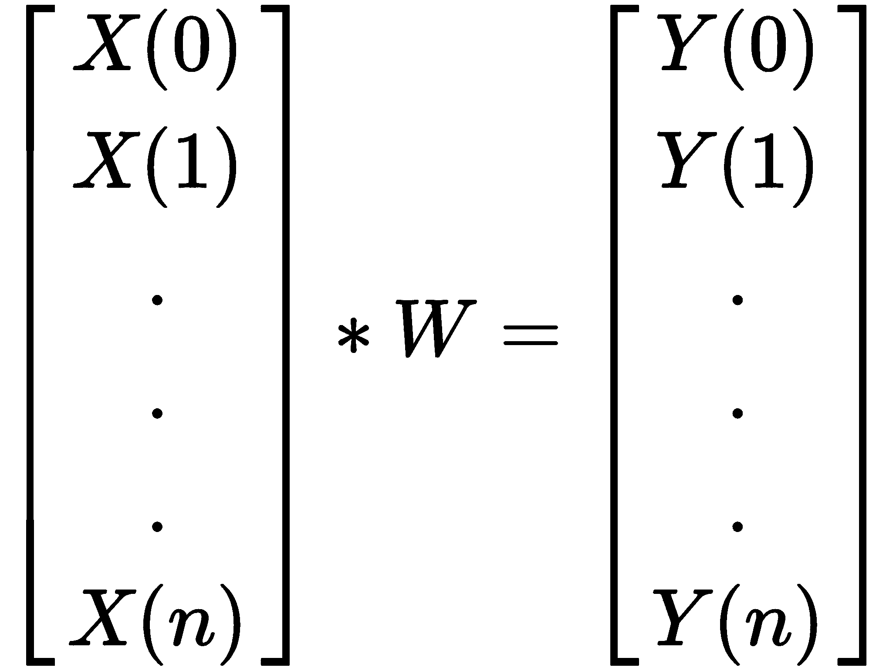
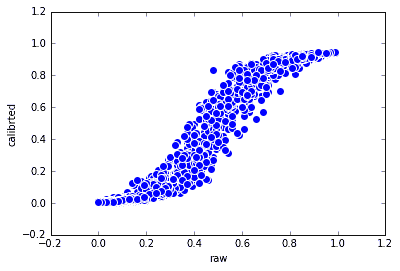
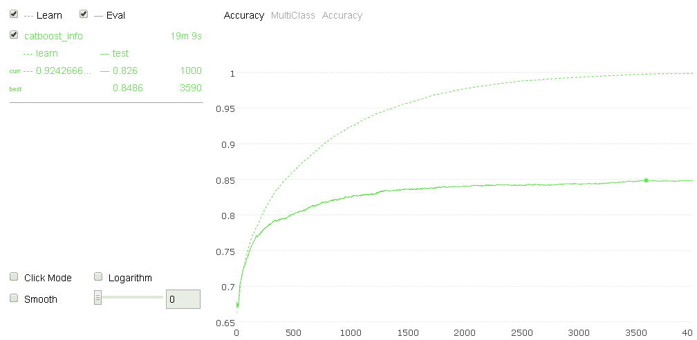
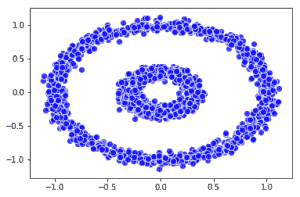
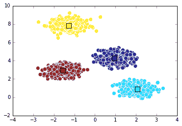
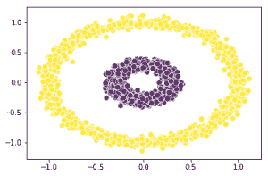

# 机器学习

在说明了数据科学项目中的所有数据准备步骤之后，我们终于到达了学习阶段，在此阶段应用了学习算法。 为了向您介绍 Scikit-learn 和其他 Python 包中现成的最有效的机器学习工具，我们准备了所有主要算法系列的简要介绍。 我们使用超参数示例和技巧来完成此过程，以确保获得最佳结果。

在本章中，我们将介绍以下主题：

*   线性和逻辑回归
*   朴素贝叶斯
*   K 最近邻居（KNN）
*   支持向量机（SVM）
*   解决方案包
*   装袋和提升分类器
*   基于随机梯度的大数据分类与回归
*   使用 K 均值和 DBSCAN 的无监督聚类

神经网络和深度学习将在下一章中介绍。

# 准备工具和数据集

如前几章所述，用于机器学习的 Python 包是 Scikit-learn。 在本章中，我们还将使用 XGboost，LightGBM 和 Catboost：您将在相关部分中找到说明。

法国计算机科学与自动化研究所 [Inria](https://www.inria.fr/en/) 开发的 Scikit-learn 的使用动机是多种多样的。 在这一点上，有必要提及使用 Scikit-learn 成功实现数据科学项目的最重要原因：

*   跨模型的一致 API（`fit`，`predict`，`transform`和`partial_fit`）自然有助于正确实现对以 NumPy 数组组织的数据进行处理的数据科学过程
*   完整的经过测试的可扩展经典机器学习模型供您选择，提供了许多核心实现，用于从 RAM 内存中无法容纳的数据中学习
*   一群杰出的贡献者（Andreas Mueller，Olivier Grisel，Fabian Pedregosa，Gael Varoquaux，Gilles Loupe，Peter Prettenhofer 等）为我们带来了稳定的发展，并增加了许多新产品。
*   包含许多示例的大量文档，可使用`help`命令在线或在线查阅

在本章中，我们将 Scikit-learn 的机器学习算法应用于一些示例数据集。 我们将分解非常有启发性但太常用的鸢尾和波士顿数据集，以证明将机器学习应用于更现实的数据集。 我们从以下示例中选择了有趣的示例：

*   柏林工业大学托管的机器学习数据集存储库（ [mldata.org](http://mldata.org/) ）
*   UCI 机器学习存储库（ [archive.ics.uci.edu/ml/datasets.html](http://archive.ics.uci.edu/ml/datasets.html) ）
*   LIBSVM 数据集（由台湾大学林志仁提供）

为了让您拥有这样的数据集，而不必每次都要测试示例时都不必依赖互联网连接，建议您下载它们并将其存储在硬盘上。 因此，我们准备了一些脚本来自动下载数据集，这些脚本将精确地放置在您使用 Python 的目录中，从而使数据访问更加容易：

```py
In: import pickle
    import urllib
    import ssl
    ssl._create_default_https_context = ssl._create_unverified_context
    from sklearn.datasets import fetch_mldata
    from sklearn.datasets import load_svmlight_file
    from sklearn.datasets import fetch_covtype
    from sklearn.datasets import fetch_20newsgroups
    mnist = fetch_mldata("MNIST original")
    pickle.dump(mnist, open("mnist.pickle", "wb"))
    target_page = 
'http://www.csie.ntu.edu.tw/~cjlin/libsvmtools/datasets/binary/ijcnn1.bz2'
    with urllib.request.urlopen(target_page) as response:
 with open('ijcnn1.bz2','wb') as W: W.write(response.read())    target_page =
'http://www.csie.ntu.edu.tw/~cjlin/libsvmtools/datasets/regression/cadata'
    cadata = load_svmlight_file(urllib.request.urlopen(target_page))
    pickle.dump(cadata, open("cadata.pickle", "wb")) 

    covertype_dataset = fetch_covtype(random_state=101, shuffle=True)
    pickle.dump(covertype_dataset, open(
                                   "covertype_dataset.pickle", "wb"))   

    newsgroups_dataset = fetch_20newsgroups(shuffle=True, 
              remove=('headers', 'footers', 'quotes'), random_state=6)

    pickle.dump(newsgroups_dataset, open(
                                    "newsgroups_dataset.pickle", "wb"))
```

如果下载程序的任何部分对您不起作用，我们将为您直接下载数据集。 获取压缩的 zip 包后，您要做的就是将其数据解压缩到当前工作的 Python 目录中，您可以通过使用以下命令在 Python 界面（Jupyter 笔记本电脑或任何 Python IDE）上运行来找到该目录：

```py
In: import os
    print ("Current directory is: "%s"" % (os.getcwd()))
```

您可以使用其他开源代码测试本书中的所有算法，并可以随意使用数据集。 Google 提供了一个搜索引擎，可以在[这个页面](https://toolbox.google.com/datasetsearch)上为您的实验寻找合适的数据：您只需要询问搜索引擎想要的内容即可。

# 线性和逻辑回归

线性回归和逻辑回归是分别可用于线性预测目标值或目标类别的两种方法。 让我们从线性回归预测目标值的示例开始。

在本节中，我们将再次使用波士顿数据集，其中包含 506 个样本，13 个特征（所有实数）和一个（实数）数字目标（这使其非常适合回归问题）。 我们将使用训练/测试拆分交叉验证来将我们的数据集分为两部分，以测试我们的方法（在本示例中，我们的数据集的 80% 用于训练，而 20% 的数据在测试集中）：

```py
In: from sklearn.datasets import load_boston
    boston = load_boston()
    from sklearn.model_selection import train_test_split
    X_train, X_test, Y_train, Y_test = train_test_split(boston.data, 
                                  boston.target, test_size=0.2, random_state=0) 
```

现在已加载数据集，并已创建训练/测试对。 在接下来的几个步骤中，我们将训练回归变量并将其拟合到训练集中，并预测测试数据集中的目标变量。 然后，我们将使用 MAE 分数来衡量回归任务的准确率（如第 3 章，“数据管道”中所述）。 至于评分函数，我们决定了平均绝对误差，以与误差本身的大小成正比地惩罚误差（使用更常见的均方误差会更多地强调较大的误差，因为误差是平方的）：

```py
In: from sklearn.linear_model import LinearRegression
    regr = LinearRegression()
    regr.fit(X_train, Y_train)
    Y_pred = regr.predict(X_test)

    from sklearn.metrics import mean_absolute_error
    print ("MAE", mean_absolute_error(Y_test, Y_pred)) Out: MAE 3.84281058945
```

伟大的！ 我们以最简单的方式实现了我们的目标。 现在让我们看一下训练系统所需的时间：

```py
In: %timeit regr.fit(X_train, y_train) Out: 544 µs ± 37.4 µs per loop 
     (mean ± std. dev. of 7 runs, 1000 loops each)
```

那真的很快！ 结果当然不是那么好（如果您在本书前面的第 1 章，“第一步”）。 但是，线性回归在表现与训练速度和简单性之间提供了很好的权衡。 现在，让我们看一下该算法的内幕。 为什么这么快却不那么准确？ 答案在某种程度上是可以预期的-这是因为它是一种非常简单的线性方法。

让我们简要地对此技术进行数学解释。 让我们将`X(i)`命名为第`i`个样本（实际上是具有数字特征的行向量），并将`Y(i)`作为目标。 线性回归的目标是找到一个良好的权重（列）向量`W`，该向量最适合于与观察向量相乘时近似目标值，即`X(i) * W ≈ Y(i)`（请注意，这是点积）。`W`应该相同，并且对每个观察结果都是最佳的。 因此，解决以下等式变得容易：



`W`可以借助矩阵求逆（或更可能是伪求逆，这是一种计算有效的方法）和点积的帮助容易地找到。 这就是线性回归如此之快的原因。 请注意，这只是一个简单的解释-实际方法添加了另一个虚拟特征来补偿过程的偏差。 但是，这并没有很大程度地改变回归算法的复杂性。

我们现在进行逻辑回归。 尽管顾名思义，它是一个分类器，而不是回归器。 它只能用于仅处理两个类的分类问题（二分类）。 通常，目标标签是布尔值； 也就是说，它们的值为`True/False`或 0/1（指示是否存在预期结果）。 在我们的示例中，我们继续使用相同的数据集。 目标是猜测房屋价值是高于还是低于我们感兴趣的阈值的平均值。本质上，我们从回归问题转向二元分类问题，因为现在我们的目标是猜测一个示例成为一个小组的一部分的可能性有多大。 我们开始使用以下命令来准备数据集：

```py
In: import numpy as np
    avg_price_house = np.average(boston.target)
    high_priced_idx = (Y_train >= avg_price_house)
    Y_train[high_priced_idx] = 1
    Y_train[np.logical_not(high_priced_idx)] = 0
    Y_train = Y_train.astype(np.int8)
    high_priced_idx = (Y_test >= avg_price_house)
    Y_test[high_priced_idx] = 1
    Y_test[np.logical_not(high_priced_idx)] = 0
    Y_test = Y_test.astype(np.int8)
```

现在我们将训练并应用分类器。 要衡量其表现，我们只需打印分类报告：

```py
In: from sklearn.linear_model import LogisticRegression
    clf = LogisticRegression()
    clf.fit(X_train, Y_train)
    Y_pred = clf.predict(X_test)
    from sklearn.metrics import classification_report
    print (classification_report(Y_test, Y_pred))

 Out:
 precision    recall  f1-score   support

          0       0.81      0.92      0.86        61
          1       0.85      0.68      0.76        41

avg / total       0.83      0.82      0.82       102
```

根据`LogisticRegression`分类器的优化过程，此命令的输出可以在您的计算机上更改（未设置种子以提高结果的可复制性）。

`precision`和`recall`值超过`80`百分比。 对于一个非常简单的方法来说，这已经是一个很好的结果。 训练速度也令人印象深刻。 感谢 Jupyter 笔记本，我们可以在表现和速度方面将算法与更高级的分类器进行比较：

```py
In: %timeit clf.fit(X_train, y_train)

Out: 2.75 ms ± 120 µs per loop (mean ± std. dev. of 7 runs, 100 loops each)
```

什么是逻辑回归的内幕？ 人们可以想象的最简单的分类器（除均值外）是线性回归变量，后跟一个硬阈值：

```py
y_pred[i] = sign(X[i] * W)
```

在此，如果`a`大于或等于零，则`sign(a) = 1`，否则为 0。

为了降低阈值的难度并预测属于某个类别的可能性，逻辑回归求助于`logit`函数。 它的输出是一个（0 到 1）实数（只能通过舍入获得 0.0 和 1.0；否则， `logit`函数将趋向于它们），这表示观察值属于 1 类的可能性。 使用公式，结果如下：


在上面的公式中，您具有：`logistic(α) = exp(α) / (1 + exp(α))`。

为什么`logistic`函数而不是其他函数？ 好吧，因为它在大多数实际情况下都很好用。 在其余情况下，如果您对其结果不完全满意，则可能需要尝试其他一些非线性函数（不过，合适的函数种类有限）。

# 朴素贝叶斯

**朴素贝叶斯**是用于概率二进制和多类分类的非常常见的分类器。 给定特征向量，它利用贝叶斯规则来预测每个类别的概率。 它通常用于文本分类，因为它对大量数据（即具有许多特征的数据集）非常有效，并且具有一致的先验概率，可有效处理维数问题的诅咒。

朴素贝叶斯分类器分为三种： 他们每个人都对这些特征有很强的假设（假设）。 如果要处理真实/连续数据，则高斯朴素贝叶斯分类器会假定特征是从高斯过程生成的（也就是说，它们是正态分布的）。 或者，如果要处理事件模型，其中可以使用多项式分布来建模事件（在这种情况下，特征是计数器或频率），则需要使用“多项朴素贝叶斯”分类器。 最后，如果您所有的特征都是独立且布尔的，并且可以安全地假设它们是伯努利过程的结果，则可以使用伯努利朴素贝叶斯分类器。

现在让我们尝试高斯朴素贝叶斯分类器的应用示例。 此外，本章结尾给出了文本分类的示例。 您可以通过简单地将示例的 SGDClassifier 替换为 MultinomialNB 来与朴素贝叶斯一起测试它。

在以下示例中，假设特征为高斯特征，我们将使用鸢尾花数据集：

```py
In: from sklearn import datasets
    iris = datasets.load_iris()
    from sklearn.model_selection import train_test_split
    X_train, X_test, Y_train, Y_test = train_test_split(iris.data, 
iris.target, test_size=0.2, random_state=0) In: from sklearn.naive_bayes import GaussianNB
    clf = GaussianNB()
    clf.fit(X_train, Y_train)
    Y_pred = clf.predict(X_test) In: from sklearn.metrics import classification_report
    print (classification_report(Y_test, Y_pred)) Out:
             precision    recall  f1-score   support

          0       1.00      1.00      1.00        11
          1       0.93      1.00      0.96        13
          2       1.00      0.83      0.91         6

avg / total       0.97      0.97      0.97        30 In: %timeit clf.fit(X_train, y_train) 

Out: 685 µs ± 9.86 µs per loop (mean ± std. dev. of 7 runs, 1000 loops each)
```

生成的模型似乎具有良好的表现和较高的训练速度，尽管我们不要忘记我们的数据集也很小。 现在，让我们看看它如何处理另一个多类问题。

分类器的目的是预测特征向量属于`Ck`类的可能性。 在该示例中，存在三个类别（`setosa`，`versicolor`和`virginica`）。 因此，我们需要计算所有类别的成员资格概率； 为了使说明简单，我们将其命名为`1`，`2`和`3`。 因此，对于观察`i`，朴素贝叶斯分类器的目标是计算以下内容：


在此， `X(i)`是特征的向量（在示例中，它由四个实数组成），其成分为`[X(i, 0), X(i, 1), X(i, 2), X(i, 3)]`。

使用贝叶斯规则，它将变为以下内容：


我们可以描述相同的公式，如下所示：

*后验概率是类别的先验概率乘以可能性，然后除以证据。*

从概率论出发，我们知道联合概率可以表示为以下形式（简化问题）：


然后，乘法的第二个因子可以重写如下（条件概率）：


然后，您可以使用条件概率定义来表示乘法的第二个成员。 最后，您将得到一个很长的乘法：


朴素的假设是，当与每个类别相关时，每个特征都被认为有条件地独立于其他特征。 因此，概率可以简单地相乘。 公式如下：


因此，总结一下数学，以选择最佳类别，使用以下公式：


这是一种简化，因为除去了证据概率（贝叶斯规则的分母），因为所有类别的事件概率都相同。

从前面的公式中，您可以了解学习阶段为何如此之快的原因，因为它只是对事件的计数。

请注意，对于此分类器，不存在相应的回归变量，但是您可以通过对它进行分类来实现对连续目标变量的建模，即将其转换为类（例如，我们房屋价格的低，平均和高值） 问题）。

# K 最近邻居

**K 最近邻居**或简称为 KNN，属于基于实例的学习类别，也称为**惰性分类器**。 这是最简单的分类方法之一，因为在我们要分类的情况下，仅通过查看训练集中的 K 个最接近的示例（按照欧几里得距离或某种其他距离）来完成分类。 然后，在给出 K 个相似示例的情况下，选择最受欢迎的目标（多数投票）作为分类标签。 该算法必须使用两个参数：邻域基数（K）和评估相似度的度量（尽管最常用的是欧几里德距离或 L2，并且是大多数实现的默认参数）。

让我们看一个例子。 我们将使用大型数据集`MNIST`手写数字。 稍后我们将解释为什么我们决定在示例中使用此数据集。 我们打算仅使用其中的一小部分（1,000 个样本）来保持合理的计算时间，并且我们将观察值进行混洗以获得更好的结果（尽管如此，您的最终输出可能与我们的最终输出略有不同）：

```py
In: from sklearn.utils import shuffle
    from sklearn.datasets import fetch_mldata
    from sklearn.model_selection import train_test_split

    import pickle
    mnist = pickle.load(open( "mnist.pickle", "rb" ))
    mnist.data, mnist.target = shuffle(mnist.data, mnist.target)
 # We reduce the dataset size, otherwise it'll take too much time to run    mnist.data = mnist.data[:1000]
    mnist.target = mnist.target[:1000]
    X_train, X_test, y_train, y_test = train_test_split(mnist.data,
                               mnist.target, test_size=0.8, random_state=0)  In: from sklearn.neighbors import KNeighborsClassifier    # KNN: K=10, default measure of distance (euclidean)
    clf = KNeighborsClassifier(3)
    clf.fit(X_train, y_train)
    y_pred = clf.predict(X_test)  In: from sklearn.metrics import classification_report    print (classification_report(y_test, y_pred)) Out:
              precision    recall  f1-score   support

        0.0       0.79      0.91      0.85        82
        1.0       0.62      0.98      0.76        86
        2.0       0.88      0.68      0.76        77
        3.0       0.71      0.83      0.77        69
        4.0       0.68      0.88      0.77        91
        5.0       0.69      0.66      0.67        56
        6.0       0.93      0.86      0.89        90
        7.0       0.91      0.85      0.88       102
        8.0       0.91      0.41      0.57        73
        9.0       0.79      0.50      0.61        74

avg / total       0.80      0.77      0.76       800
```

该数据集的表现不是很高。 但是，请考虑一下分类器必须处理十个不同的类。 现在，让我们检查分类器进行训练和预测所需的时间：

```py
In: %timeit clf.fit(X_train, y_train)
Out: 1.18 ms ± 119 µs per loop (mean ± std. dev. of 7 runs, 
     1000 loops each)
```

```py
In: %timeit clf.predict(X_test)
Out: 179 ms ± 1.68 ms per loop (mean ± std. dev. of 7 runs, 10 loops each)
```

训练速度异常出色。 现在考虑算法。 训练阶段只是将数据复制到该算法以后将要使用的某种数据结构中，而没有别的（这就是它被称为惰性学习器的原因）。 相反，预测速度与您在训练步骤中拥有的样本数量以及构成它的特征数量（实际上就是元素的特征矩阵数量）有关。 在我们看到的所有其他算法中，预测速度与数据集中训练案例的数量无关。 总而言之，我们可以说 KNN 非常适合小型数据集，但绝对不是处理大数据时要使用的算法。

关于该分类算法的最后一句话-您还可以尝试类似的回归器`KNeighborsRegressor`，其工作方式相同。 它的算法几乎相同，除了预测值是邻域的 K 目标值的平均值。

# 非线性算法

**支持向量机**（**SVM**）是一种强大的高级监督学习技术，用于分类和回归，可以自动拟合线性和非线性模型。

与其他机器学习算法相比，SVM 算法具有很多优势：

*   它们可以处理大多数监督问题，例如回归，分类和异常检测（无论如何，它们实际上最擅长于二元分类）。
*   它们可以很好地处理嘈杂的数据和异常值。 由于它们仅与某些特定示例（支持向量）一起使用，因此它们往往不太适合。
*   尽管与其他机器学习算法一样，SVM 可以从降维和特征选择中获得好处，但它们与呈现更多特征而不是示例的数据集配合得很好。
*   至于缺点，我们必须提到这些：
*   它们仅提供估计值，而不提供概率，除非您通过普拉特定标进行了一些耗时且计算量大的概率校准
*   它们与示例数量呈超线性比例关系（因此，它们无法处理非常大的数据集）

Scikit-learn 提供了一个基于 LIBSVM 的实现，LIBSVM 是一个完整的 SVM 分类和回归实现的库，而 LIBLINEAR 是一个可扩展的库，适用于大型数据集的线性分类，尤其是任何基于稀疏文本的数据集。 这两个库都是在国立台湾大学开发的，并且都使用 C++ 和 C API 编写，可以与其他语言接口。 这两个库都经过了广泛的测试（免费，它们已在其他开源机器学习工具包中使用），并且早已被证明既快速又可靠。 C API 很好地解释了它们在 Python Scikit-learn 下最佳运行的两个棘手需求：

*   LIBSVM 在运行时需要为核操作保留一些内存。 `cache_size`参数用于设置核缓存的大小，以兆字节为单位指定。 尽管默认值为 200，但建议根据可用资源将其提高到 500 或 1000。
*   他们都期望 C 顺序的 NumPy `ndarray`或 SciPy `sparse.csr_matrix`（行优化的稀疏矩阵类型），最好是`float64`类型。 如果 Python 包装器以不同的数据结构接收它们，则它将必须以适当的格式复制数据，从而减慢训练过程并消耗更多的 RAM 内存。

LIBSVM 或 LIBLINEAR 都不提供能够处理大型数据集的实现。 `SGDClassifier`和`SGDRegressor`是 Scikit-learn 类，即使数据太大而无法容纳到内存中，它们也可以在合理的计算时间内生成解决方案。 在以下有关处理大数据的段落中将讨论它们。

# 支持分类的 SVM

Scikit-learn 提供的 SVM 分类的实现如下所示：

| **类** | **目的** | **超参数** |
| --- | --- | --- |
| `sklearn.svm.SVC` | 用于二进制和多类线性和核分类的 LIBSVM 实现 | `C`，核，度和伽马 |
| `sklearn.svm.NuSVC` | 与`.SVC`版本相同 | `nu`，核，度和`gamma` |
| `sklearn.svm.OneClassSVM` | 无监督检测异常值 | `nu`，核，度和`gamma` |
| `sklearn.svm.LinearSVC` | 基于 LIBLINEAR； 它是一个二进制和多类线性分类器 | 罚款，损失和`C` |

作为使用 SVM 进行分类的示例，我们将同时使用带有线性核和 RBF 核的 SVC（**RBF** 代表**径向基函数**，这是有效的非线性函数）。 取而代之的是，将`LinearSVC`用于表示大量观测值的复杂问题（由于三次复杂性的提高，标准 SVC 在处理 10,000 多个观测值时效果不佳；相反，`LinearSVC`可以线性缩放）。

对于我们的第一个分类示例（二进制），我们将使用 IJCNN'01 神经网络竞赛的数据集。 它是由 10 缸内燃机的物理系统产生的 50,000 个样本的时间序列。 我们的目标是二进制：正常发动机点火或不点火。 我们将使用本章开头的脚本从 LIBSVM 网站检索的数据集。 数据文件为 LIBSVM 格式，并由 Bzip2 压缩。 我们使用 Scikit-learn 的`load_svmlight_file`函数对其进行操作：

```py
In: from sklearn.datasets import load_svmlight_file
    X_train, y_train = load_svmlight_file('ijcnn1.bz2')
    first_rows = 2500
    X_train, y_train = X_train[:first_rows,:], y_train[:first_rows]
```

为了举例说明，我们将观测值的数量从 25,000 限制为 2,500。 可用特征的数量为 22。此外，由于它已经与 SVM 要求兼容，并且已经在 0 到 1 之间范围内重新缩放了特征，因此我们不会对其进行预处理。

```py
In: import numpy as np
    from sklearn.model_selection import cross_val_score
    from sklearn.svm import SVC
    hypothesis = SVC(kernel='rbf', random_state=101)
    scores = cross_val_score(hypothesis, X_train, y_train, 
                             cv=5, scoring='accuracy')
    print ("SVC with rbf kernel -> cross validation accuracy: \
            mean = %0.3f std = %0.3f" % (np.mean(scores), np.std(scores))) Out: SVC with rbf kernel -> cross validation accuracy: 
     mean = 0.910 std = 0.001
```

在我们的示例中，我们测试了带有 RBF 核的 SVC。 所有其他参数均保持默认值。 您可以尝试将`first_rows`修改为更大的值（最大 25,000），并验证算法扩展到观察数量增加的程度。 跟踪计算时间，您会注意到缩放比例不是线性的。 也就是说，计算时间将与数据大小成比例增加。 关于 SVM 可伸缩性，有趣的是，看到这种算法在遇到多类问题和大量情况时的行为。 我们将使用的 Covertype 数据集以美国 30x30 米的大片森林为例。 收集与它们有关的数据以预测每个斑块（覆盖类型）的优势树种。 这是一个多类分类问题（可以预测为七个`covertypes`）。 每个样本都具有 54 个特征，并且有超过 580,000 个示例（但出于性能原因，我们将仅处理 25,000 个此类示例）。 而且，类是不平衡的，大多数示例都有两种树。

这是可用于加载先前准备的数据集的脚本：

```py
In: import pickle
    covertype_dataset = pickle.load(open("covertype_dataset.pickle", "rb"))
    covertype_X = covertype_dataset.data[:25000,:]
    covertype_y = covertype_dataset.target[:25000] -1  
```

使用此脚本，您可以了解要预测的示例，特征和目标：

```py
In: import numpy as np
    covertypes = ['Spruce/Fir', 'Lodgepole Pine', 'Ponderosa Pine', 
                  'Cottonwood/Willow', 'Aspen', 'Douglas-fir', 'Krummholz']
    print ('original dataset:', covertype_dataset.data.shape)
    print ('sub-sample:', covertype_X.shape)
    print('target freq:', list(zip(covertypes,np.bincount(covertype_y)))) Out: original dataset: (581012, 54)
     sub-sample: (25000, 54)
     target freq: [('Spruce/Fir', 9107), ('Lodgepole Pine', 12122), 
     ('Ponderosa Pine', 1583), ('Cottonwood/Willow', 120), ('Aspen', 412),   
     ('Douglas-fir', 779), ('Krummholz', 877)] 
```

假设我们认为，由于我们有七个类别，因此我们需要训练七个不同的分类器，重点是针对一个类别与另一个类别进行预测（在多类别问题中，`LinearSVC`的默认行为是“剩余”）。 这样，每个交叉验证测试都将有 175,000 个数据点（因此，如果`cv = 3`，则必须重复三遍）。 考虑到有 54 个变量，这对许多算法来说都是一个挑战，但是`LinearSVC`可以演示如何在合理的时间内处理它：

```py
In: from sklearn.cross_validation import cross_val_score, StratifiedKFold
    from sklearn.svm import LinearSVC
    hypothesis = LinearSVC(dual=False, class_weight='balanced')
    cv_strata = StratifiedKFold(covertype_y, n_folds=3, 
                                shuffle=True, random_state=101)
    scores = cross_val_score(hypothesis, covertype_X, covertype_y, 
                             cv=cv_strata, scoring='accuracy')
    print ("LinearSVC -> cross validation accuracy: \
           mean = %0.3f std = %0.3f" % (np.mean(scores), np.std(scores))) Out: LinearSVC -> cross validation accuracy: mean = 0.645 std = 0.007  
```

得出的精度为`0.65`，这是一个很好的结果。 但是，它肯定会留下进一步改进的空间。 另一方面，这个问题似乎是一个非线性的问题，尽管将 SVC 与非线性核一起使用会导致观察过程很多，因此训练过程非常漫长。 在下面的示例中，我们将通过使用其他非线性算法来重现此问题，以检查是否可以提高`LinearSVC`获得的分数。

# 支持向量机回归

至于回归，下面显示了 Scikit-learn 提出的 SVM 算法：

| **类** | **目的** | **超参数** |
| --- | --- | --- |
| `sklearn.svm.SVR` | LIBSVM 实现回归 | `C`，核，度，伽玛和`epsilon` |
| `sklearn.svm.NuSVR` | 与`.SVR`相同 | `nu`，`C`，核，度和伽玛 |

为了提供回归示例，我们决定使用加利福尼亚州房屋的房地产价格数据集（与之前看到的波士​​顿房屋价格数据集略有不同的问题）：

```py
In: import pickle
    X_train, y_train = pickle.load(open( "cadata.pickle", "rb" ))
    from sklearn.preprocessing import scale
    first_rows = 2000
    X_train = scale(X_train[:first_rows,:].toarray())
    y_train = y_train[:first_rows]/10**4.0 
```

由于性能原因，将数据集中的案例减少为`2,000`。 对特征进行了缩放，以避免原始变量的不同比例产生影响。 此外，目标变量除以`1,000`以使其在千美元值中更具可读性：

```py
In: import numpy as np
    from sklearn.cross_validation import cross_val_score
    from sklearn.svm import SVR
    hypothesis = SVR()
    scores = cross_val_score(hypothesis, X_train, y_train, cv=3, 
                             scoring='neg_mean_absolute_error')
    print ("SVR -> cross validation accuracy: mean = %0.3f \
    std = %0.3f" % (np.mean(scores), np.std(scores))) Out: SVR -> cross validation accuracy: mean = -4.618 std = 0.347 
```

选择的误差是平均绝对误差，它由`sklearn`类报告为负数（但实际上要解释为不带符号；负号只是 Scikit-learn 的内部函数使用的计算技巧） 。

# 调整 SVM

在我们开始处理超参数（根据实现通常是不同的参数集）之前，在使用 SVM 算法时有两个方面需要澄清。

首先是关于 SVM 对不同规模和大量变量的敏感性。 与基于线性组合的其他学习算法类似，具有不同比例的变量会使该算法被具有较大范围或方差的特征所控制。 而且，极高或极低的数目可能在学习算法的优化过程中引起问题。 建议以有限的时间间隔缩放所有数据，例如`[0, +1]`，这是使用稀疏数组时的必要选择。 实际上，希望保留零个条目。 否则，数据将变得密集，从而消耗更多的内存。 您也可以将数据缩放到`[-1, +1]`间隔。 或者，您可以将它们标准化为零均值和单位方差。 您可以从预处理模块中使用`MinMaxScaler`和`StandardScaler`工具类，方法是先将它们拟合到训练数据上，然后转换训练和测试集。

第二个方面是关于不平衡的阶级。 该算法倾向于偏爱频繁类。 除了重采样或下采样（将多数类减少为较小的相同数目）之外，一种解决方案是根据类的频率加权`C`惩罚参数（低值将对类进行更多的惩罚，高值将对类进行更多的惩罚） 。 对于不同的实现，有两种方法可以实现此目的。 首先，SVC 中有`class_weight`参数（可以将其设置为关键字`balanced`，或提供包含每个类的特定值的字典）。 然后，在`SVC`，`NuSVC`，`SVR`，`NuSVR`和`OneClassSVM`的`.fit()`方法中还有`sample_weight`参数（它需要一维数组作为输入，其中每个位置是指每个训练示例的权重）。

处理了比例和类的平衡之后，您可以使用 Sklearn 中`model_selection`模块中的`GridSearchCV`详尽搜索其他参数的最佳设置。 尽管 SVM 可以使用默认参数很好地工作，但是它们通常不是最佳的，并且您需要使用交叉验证来测试各种值组合以找到最佳参数。

根据其重要性，您必须设置以下参数：

*   `C`：惩罚值。 减小它会使余量更大，从而忽略了更多噪声，同时也使该模型更具通用性。 通常可以在`np.logspace(-3, 3, 7)`的范围内考虑最佳值。
*   `kernel`：可以将 SVM 的非线性主力设置为`linear`，`poly`，`rbf`，`sigmoid`或自定义核（供专家使用！）。 当然，最常用的是`rbf`。
*   `degree`：它与`kernel='poly'`一起使用，表示多项式展开的维数。 相反，它被其他核忽略。 通常，将其值设置为 2 到 5 效果最佳。
*   `gamma`：`'rbf'`，`'poly'`和`'sigmoid'`的系数。 高值倾向于以更好的方式拟合数据，但可能导致一些过拟合。 直观地，我们可以将伽马想象为单个示例对模型的影响。 较低的值使每个示例的影响都很大。 由于必须考虑许多点，因此 SVM 曲线倾向于采用受局部点影响较小的形状，其结果将是病态的轮廓曲线。 相反，较高的`gamma`值会使曲线更多地考虑点的局部排列方式。 许多小气泡会阐明结果，这些小气泡通常会表示局部点所产生的影响。 该超参数的建议网格搜索范围为`np.logspace(-3, 3, 7)`。
*   `nu`：对于使用`nuSVR`和`nuSVC`进行回归和分类，此参数将对没有可靠分类的训练点进行近似估计，即，错误分类的点和边界内或边界上的正确点。 它应该在`[0, 1]`的范围内，因为它是相对于您的训练集的比例。 最后，它以`C`的形式发挥作用，高比例扩大了边距。
*   `epsilon`：此参数通过定义`epsilon`大范围来指定 SVR 将接受多少误差，在该范围内，与该点的真实值无关的惩罚。 建议的搜索范围是`np.insert(np.logspace(-4, 2, 7),0,[0])`。
*   `penalty`，`loss`和`dual`：对于`LinearSVC`，这些参数接受`('l1', 'squared_hinge', False), ('l2', 'hinge', True), ('l2', ' squared_hinge', True)`和`('l2', 'squared_hinge', False)`组合。 `('l2', 'hinge', True)`组合类似于`SVC(kernel = 'linear')`学习器。

例如，我们将再次加载 IJCNN'01 数据集，并通过寻找更好的度数`C`和`gamma`值来尝试提高初始精度 0.91。 为了节省时间，我们将使用`RandomizedSearchCV`类将精度提高到`0.989`（交叉验证估计值）：

```py
In: from sklearn.svm import SVC
    from sklearn.model_selection import RandomizedSearchCV
    X_train, y_train = load_svmlight_file('ijcnn1.bz2')
    first_rows = 2500
    X_train, y_train = X_train[:first_rows,:], y_train[:first_rows]
    hypothesis = SVC(kernel='rbf', random_state=101)
    search_dict = {'C': [0.01, 0.1, 1, 10, 100], 
                   'gamma': [0.1, 0.01, 0.001, 0.0001]}
    search_func = RandomizedSearchCV(estimator=hypothesis, 
                                     param_distributions=search_dict,
                                     n_iter=10, scoring='accuracy', 
 n_jobs=-1, iid=True, refit=True, 
                                     cv=5, random_state=101)    search_func.fit(X_train, y_train)
    print ('Best parameters %s' % search_func.best_params_)
    print ('Cross validation accuracy: mean = %0.3f' %  
            search_func.best_score_) Out: Best parameters {'C': 100, 'gamma': 0.1} 
 Cross validation accuracy: mean = 0.989
```

# 策略集

到目前为止，我们已经看到越来越复杂的单一学习算法。 集成表示一种有效的替代方法，因为它们通过组合或链接基于不同数据样本和算法设置的模型结果来达到更好的预测准确率。 集成策略将自己分为两个分支。 根据使用的方法，他们通过以下方式将预测组合在一起：

*   **平均算法**：这些算法通过平均各种并行估计量的结果来进行预测。 估计量的变化可进一步划分为四个系列：粘贴，装袋，子空间和补丁。
*   **增强算法**：这些算法通过使用顺序聚合估计量的加权平均值进行预测。

在研究分类和回归的一些示例之前，我们将为您提供重新加载 Covertype 数据集的必要步骤，Covertype 数据集是在处理线性 SVC 之前我们开始探讨的多类分类问题：

```py
In: import pickle
    covertype_dataset = pickle.load(open("covertype_dataset.pickle", "rb"))
    print (covertype_dataset.DESCR)
    covertype_X = covertype_dataset.data[:15000,:]
    covertype_y = covertype_dataset.target[:15000]
    covertypes = ['Spruce/Fir', 'Lodgepole Pine', 'Ponderosa Pine', 
                  'Cottonwood/Willow', 'Aspen', 'Douglas-fir', 'Krummholz']
```

# 随机样本的粘贴

**粘贴**是我们将讨论的第一类平均集成。 在粘贴过程中，使用从数据中获取的小样本来构建一定数量的估计器（使用不替换的样本）。 最后，将结果汇总起来，通过对结果进行平均（在回归的情况下）或在处理分类时采用投票率最高的类别来获得估计值。 当处理非常大的数据时（例如无法容纳到内存中的情况），粘贴非常有用，因为它只允许处理计算机的可用 RAM 和计算资源可管理的那些数据部分。

作为一种方法，随机森林算法的创建者 Leo Breiman 首先设计了这种策略。 尽管可以通过使用可用的装袋算法（下段主题`BaggingClassifier`或`BaggingRegressor`，并将其`bootstrap`设置为）轻松实现，但 Scikit-learn 包中没有使用粘贴的特定算法。 `False`和`max_features`设为 1.0。

# 弱分类器的装袋

**装袋**用于样本的方式与粘贴类似，但是可以替换。 同样，在理论上由 Leo Breiman 阐述，装袋是在特定的 Scikit-learn 类中进行回归的，而在分类中进行。 您只需要决定要用于训练的算法即可。 将其插入`BaggingClassifier`或`BaggingRegressor`中以解决回归问题，并设置足够多的估计量（因此要设置大量的样本）：

```py
In: import numpy as np
    from sklearn.model_selection import cross_val_score
    from sklearn.ensemble import BaggingClassifier
    from sklearn.neighbors import KNeighborsClassifier
    hypothesis = BaggingClassifier(KNeighborsClassifier(n_neighbors=1), 
                                   max_samples=0.7, max_features=0.7,  
                                   n_estimators=100)
    scores = cross_val_score(hypothesis, covertype_X, covertype_y, cv=3, 
                                      scoring='accuracy', n_jobs=-1)
    print ("BaggingClassifier -> cross validation accuracy: mean = %0.3f 
    std = %0.3f" % (np.mean(scores), np.std(scores))) Out: BaggingClassifier -> cross validation accuracy: 
     mean = 0.795 std = 0.001  
```

预测器较弱是用于装袋的估计器的不错选择。 在分类或预测方面学习能力较弱的人，由于其简单性或估计的偏见，其执行效果不佳（刚好超过数据问题的机会基准）。 朴素贝叶斯和 K 最近邻就是很好的例子。 使用弱学习器并将其组合在一起的好处是，与复杂算法相比，它们可以更快地得到训练。 尽管预测能力较弱，但结合起来使用时，它们通常比更复杂的单个算法具有可比甚至更好的预测表现。

# 随机子空间和随机补丁

在随机子空间中，由于特征的随机子集，估计量会有所不同。 同样，可以通过调整`BaggingClassifier`和`BaggingRegressor`的参数，并将`max_features`设置为小于 1.0 的数字来实现这样的解决方案，该数字表示要为集合的每个模型随机选择的特征的百分比。

取而代之的是，在随机补丁中，估计器建立在样本和特征的子集上。

现在让我们在表中检查粘贴，装袋，随机子空间和随机补丁的不同特征，这些特征是使用 Scikit-learn 中的`BaggingClassifier`和`BaggingRegressor`实现的：

| **组装** | **目的** | **超参数** |
| --- | --- | --- |
| 粘贴 | 使用子样本构建了许多模型（在不替换小于原始数据集的样本的情况下进行抽样） | `bootstrap=False``max_samples <1.0``max_features=1.0` |
| 装袋 | 使用自举案例的随机选择构建了许多模型（通过替换原始样本的相同大小进行采样） | `bootstrap=True``max_samples = 1.0``max_features=1.0` |
| 随机子空间 | 这与装袋相同，但是在选择每个模型时也会对特征进行采样 | `bootstrap=True``max_samples = 1.0``max_features<1.0` |
| 随机补丁 | 这与装袋相同，但是在选择每个模型时也会对特征进行采样 | `bootstrap=False``max_samples <1.0``max_features<1.0` |

当`max_features`或`max_samples`必须小于 1.0 时，可以将它们设置为`(0, 1)`范围内的任何值，并且可以通过网格搜索测试最佳值。 根据我们的经验，如果您需要限制或加快搜索速度，最有效的值是 0.7 到 0.9。

# 随机森林和多余的树木

Leo Breiman 和 Adele Cutler 最初是在“随机森林”算法的核心中设计出这个主意的，而该算法的名称至今仍是他们的商标（尽管该算法是开源的）。 随机森林在 Scikit-learn 中实现为`RandomForestClassifier`/`RandomForestRegressor`。

随机森林的工作方式与 Leo Breiman 所设计的装袋相似，但它只能使用二叉拆分决策树进行操作，而二叉决策树会不断发展壮大。 此外，它使用自举对每个模型中要使用的案例进行采样。 并且，随着树的生长，在分支的每个分割处，也将随机绘制要用于分割处的变量集。 最后，这是该算法的核心秘密，因为它使由于不同样本和拆分时所考虑的变量而彼此不同的树融合在一起。 与众不同，它们也不相关。 这是有益的，因为当结果汇总时，可以排除很多差异，因为平均而言，分布两侧的极值趋于彼此平衡。 换句话说，装袋算法保证了预测中的一定程度的多样性，从而允许制定可能永远不会遇到单个学习器（例如决策树）的规则。

在 Scikit-learn 中以`ExtraTreesClassifier`/`ExtraTreesRegressor`类表示的极端树是一种随机性更高的随机森林，其估计值的方差较小，但代价是估计量的偏差更大。 无论如何，在 CPU 效率方面，与随机森林相比，极端树可以提供相当大的提速，因此从示例和特征上来说，当您使用大型数据集时，极端树是理想的选择。 产生更高偏差但速度更快的原因是在极端树中构建拆分的方式。 随机森林会从要考虑拆分树的分支的采样特征中仔细搜索最佳值，以分配给每个分支，而在极端树中，这是随机决定的。 因此，尽管随机选择的分割可能不是最有效的分割（因此存在偏差），但无需进行大量计算。

让我们看看这两种算法在预测的准确率和执行时间方面如何与 Covertype 森林问题进行比较。 为此，我们将在 Jupyter 笔记本电脑的单元格中使用神奇的`%%time`单元格，以测量计算表现：

```py
In: import numpy as np
    from sklearn.model_selection import cross_val_score
    from sklearn.ensemble import RandomForestClassifier
    from sklearn.ensemble import ExtraTreesClassifier  

In: %%time
    hypothesis = RandomForestClassifier(n_estimators=100, random_state=101)
    scores = cross_val_score(hypothesis, covertype_X, covertype_y, 
                             cv=3, scoring='accuracy', n_jobs=-1)
    print ("RandomForestClassifier -> cross validation accuracy: \
            mean = %0.3f std = %0.3f" % (np.mean(scores), np.std(scores))) Out: RandomForestClassifier -> cross validation accuracy: 
     mean = 0.809 std = 0.009
     Wall time: 7.01 s In: %%time
    hypothesis = ExtraTreesClassifier(n_estimators=100, random_state=101)
    scores = cross_val_score(hypothesis, covertype_X, covertype_y, cv=3, 
                                            scoring='accuracy', n_jobs=-1)
    print ("ExtraTreesClassifier -> cross validation accuracy: mean = %0.3f 
    std = %0.3f" % (np.mean(scores), np.std(scores))) Out: ExtraTreesClassifier -> cross validation accuracy: 
     mean = 0.821 std = 0.009
     Wall time: 6.48 s
```

对于这两种算法，应设置的关键超参数如下：

*   `max_features`：这是每次拆分中可以确定算法表现的采样特征数量。 数字越小，速度越快，但偏差越大。
*   `min_samples_leaf`：这使您可以确定树木的深度。 较大的数字会减少方差并增加偏差。
*   `bootstrap`：这是一个布尔值，允许进行引导。
*   `n_estimators`：这是树的数量（请记住，树越多越好，但这要以计算成本为基础）。

实际上，随机森林和极端树都是并行算法。 不要忘记设置适当的`n_jobs`数量以加快执行速度。 在分类时，他们决定投票最多的阶层（多数投票）； 回归时，它们只是对结果值求平均值。 作为示例，我们提出一个基于加利福尼亚房价数据集的回归示例：

```py
In: import pickle
    from sklearn.preprocessing import scale
    X_train, y_train = pickle.load(open( "cadata.pickle", "rb" ))
    first_rows = 2000 In: import numpy as np
    from sklearn.ensemble import RandomForestRegressor
    X_train = scale(X_train[:first_rows,:].toarray())
    y_train = y_train[:first_rows]/10**4.
    hypothesis = RandomForestRegressor(n_estimators=300, random_state=101)
    scores = cross_val_score(hypothesis, X_train, y_train, cv=3, 
                             scoring='neg_mean_absolute_error', n_jobs=-1)
    print ("RandomForestClassifier -> cross validation accuracy: mean = %0.3f 
    std = %0.3f" % (np.mean(scores), np.std(scores))) Out: RandomForestClassifier -> cross validation accuracy: 
     mean = -4.642 std = 0.514
```

# 估计整体概率

随机森林具有很大的优势，它们被认为是您应该尝试对数据进行研究以找出可以获得哪种结果的第一种算法。 这是因为随机森林没有太多要固定的超参数，并且开箱即用地工作得很好。 他们自然可以解决多类问题。 此外，随机森林提供了一种方法来估计变量对您的见解或特征选择的重要性，并且它们有助于估计示例之间的相似性，因为相似的情况应最终出现在集合中许多树的同一末端。

但是，在分类问题中，该算法缺乏预测结果概率的能力（除非使用`CalibratedClassifierCV`使用 Scikit-learn 中提供的概率校准进行校准）。 在分类问题中，通常不足以预测响应标签。 我们还需要与之相关的概率（概率为真；这是预测的可信度）。 这对于多类问题特别有用，因为正确的答案可能是第二大或第三大可能的答案（因此，概率提供了答案的等级）。

但是，当需要使用“随机森林”来估计响应类别的概率时，该算法将仅报告示例相对于该集合本身中所有树的数量被分类为该类别的次数。 这样的比率实际上并不对应于正确的概率，但是它是一个有偏的比率（预测的概率仅与真实的比率相关；它不能以数字上正确的方式表示出来）。

为了帮助随机森林和受类似情况影响的其他算法（如朴素贝叶斯或线性 SVM）发出正确的响应概率，在 Scikit-learn 中引入了`CalibratedClassifierCV`包装器类。

`CalibrateClassifierCV`使用两种方法将机器学习算法的响应重新映射为概率：普拉特定标和等渗回归（后者是表现较好的非参数方法，条件是您有足够的示例，即至少有 1,000 个）。 这两种方法都是第二级模型，旨在仅对算法的原始响应和预期概率之间的链接进行建模。 通过将原始概率分布与校准概率分布进行比较，可以绘制结果。

例如，在这里我们使用`CalibratedClassifierCV`来修正 Covertype 问题：

```py
In: import pandas as pd
    import matplotlib.pyplot as plt
    from sklearn.calibration import CalibratedClassifierCV
    from sklearn.calibration import calibration_curve
    hypothesis = RandomForestClassifier(n_estimators=100, random_state=101)
    calibration = CalibratedClassifierCV(hypothesis, method='sigmoid', 
                                         cv=5)
    covertype_X = covertype_dataset.data[:15000,:]
    covertype_y = covertype_dataset.target[:15000]
    covertype_test_X = covertype_dataset.data[15000:25000,:]
    covertype_test_y = covertype_dataset.target[15000:25000]
```

为了评估校准的行为，我们准备了一个由 10,000 个示例组成的测试集，这些示例不用于训练。 我们的校准模型将基于 Platt 的模型（`method='sigmoid'`），并使用五个交叉验证折叠来调整校准：

```py
In: hypothesis.fit(covertype_X,covertype_y)
    calibration.fit(covertype_X,covertype_y)
    prob_raw = hypothesis.predict_proba(covertype_test_X)
    prob_cal = calibration.predict_proba(covertype_test_X)
```

拟合原始模型和校准模型后，我们估计概率，现在将它们绘制在散点图中以突出显示差异。 在对美国黄松的估计概率进行预测之后，似乎已经对原始的随机森林概率（实际投票百分比）进行了重新缩放，使其类似于对数曲线。 现在，我们尝试编写一些代码，并探讨校准为概率输出带来的变化类型：

```py
In: %matplotlib inline
    tree_kind = covertypes.index('Ponderosa Pine')
    probs = pd.DataFrame(list(zip(prob_raw[:,tree_kind], 
                                  prob_cal[:,tree_kind])), 
                         columns=['raw','calibrted'])
    plot = probs.plot(kind='scatter', x=0, y=1, s=64, 
                      c='blue', edgecolors='white')
```

校准虽然不会改变模型的表现，但通过重塑概率输出可以帮助您获得与训练数据更相符的概率。 在下图中，您可以通过添加一些非线性作为校正来观察校准程序如何修改了原始概率：

 

# 模型序列—— AdaBoost

**AdaBoost** 是基于梯度下降优化方法的增强算法。 它适合数据重新加权版本上的一系列弱学习器（最初是树桩，即单级决策树）。 根据案例的可预测性分配权重。 较难处理的案件的权重更高。 想法是，树首先学习简单的示例，然后将更多的精力集中在困难的示例上。 最后，对弱学习器的顺序进行加权以最大程度地提高整体表现：

```py
In: import numpy as np
    from sklearn.ensemble import AdaBoostClassifier
    hypothesis = AdaBoostClassifier(n_estimators=300, random_state=101)
    scores = cross_val_score(hypothesis, covertype_X, covertype_y, cv=3, 
                             scoring='accuracy', n_jobs=-1)
    print ("Adaboost -> cross validation accuracy: mean = %0.3f 
    std = %0.3f" % (np.mean(scores), np.std(scores)))
    Out: Adaboost -> cross validation accuracy: mean = 0.610 std = 0.014
```

# 梯度树增强（GTB）

梯度提升是增强的另一个改进版本。 像 AdaBoost 一样，它基于梯度下降函数。 尽管该算法的特征在于估计的方差增加，对数据中的噪声更敏感（这两个问题都可以通过使用子采样来减弱），但已证明是该算法中最熟练的算法之一。 由于非并行操作。

为了演示 GTB 的表现，我们将再次尝试检查是否可以改善 Covertype 数据集的预测表现，在说明线性 SVM 和集成算法时已经进行了检查：

```py
In: import pickle
    covertype_dataset = pickle.load(open("covertype_dataset.pickle", "rb"))
    covertype_X = covertype_dataset.data[:15000,:]
    covertype_y = covertype_dataset.target[:15000] -1 
    covertype_val_X = covertype_dataset.data[15000:20000,:]
    covertype_val_y = covertype_dataset.target[15000:20000] -1
    covertype_test_X = covertype_dataset.data[20000:25000,:]
    covertype_test_y = covertype_dataset.target[20000:25000] -1  
```

加载数据后，将训练样本大小限制为 15000 个观察值，以实现合理的训练效果。 我们还提取了由 5,000 个示例组成的验证样本和由另外 5,000 个示例组成的测试样本。 现在，我们开始训练模型：

```py
In: import numpy as np
    from sklearn.model_selection import cross_val_score, StratifiedKFold
    from sklearn.ensemble import GradientBoostingClassifier
    hypothesis = GradientBoostingClassifier(max_depth=5, 
                                            n_estimators=50, 
                                            random_state=101)
    hypothesis.fit(covertype_X, covertype_y) In: from sklearn.metrics import accuracy_score
    print ("GradientBoostingClassifier -> test accuracy:", 
             accuracy_score(covertype_test_y, 
                            hypothesis.predict(covertype_test_X))) Out: GradientBoostingClassifier -> test accuracy: 0.8202
```

为了从`GradientBoostingClassifier`和`GradientBoostingRegression`获得最佳表现，您必须进行以下调整：

*   `n_estimators`：超过估计量，会增加方差。 无论如何，如果估计量不足，则该算法将遭受高偏差。 正确的数字不是先验已知的，必须通过交叉验证测试各种配置来启发式地找到。
*   `max_depth`：它增加了方差和复杂性。
*   `subsample`：使用 0.9 到 0.7 的值可以有效减少估计的方差。
*   `learning_rate`：较小的值可以改善训练过程中的优化，尽管这将需要更多的估计量来收敛，因此需要更多的计算时间。
*   `in_samples_leaf`：这可以减少由于噪声数据导致的方差，从而保留对极少数情况的过拟合。

除了深度学习，梯度提升实际上是最先进的机器学习算法。 自从 Adaboost 和 Jerome Friedman 开发的以下梯度提升实现以来，出现了各种算法实现，最近的是 XGBoost，LightGBM 和 CatBoost。 在以下各段中，我们将探索这些新解决方案，并使用 Forest Covertype 数据在道路上对其进行测试。

# XGBoost

XGBoost 代表**极限梯度提升**，这是一个不属于 Scikit-learn 的开源​​项目，尽管最近它已通过 scikit-Learn 包装器接口进行了扩展，该接口使用基于 [XGBoost](http://xgboost.readthedocs.io/en/latest/python/python_api.html#module-xgboost.sklearn) 的模型进行渲染，并已集成到您的计算机的数据管道中。

XGBoost 源代码可从 [GitHub 上](http://github.com/dmlc/XGBoost)获得； 可以在[这个页面](http://xgboost.readthedocs.io/en/latest)上找到其文档和一些教程。

XGBoost 算法在 [Kaggle](http://www.kaggle.com) 和 KDD-cup 2015 等数据科学竞赛中获得了动力和普及。作者（Tianqui Chen，Tong He，Carlos Guestrin）在有关该算法的论文中报告，2015 年期间在 Kaggle 上进行了 29 个挑战，其中有 17 个获奖解决方案使用 XGBoost 作为独立解决方案或作为多个不同模型集合的一部分。

在他们的论文《XGBoost：可扩展树增强系统》中（可在[这个页面](http://learningsys.org/papers/LearningSys_2015_paper_32.pdf)中找到），作者报告说，每个团队也都使用 XGBoost 在最近的 KDD 杯 2015 的前十名中排名第二。

除了在准确率和计算效率上都取得了成功的成就外，从不同的角度来看，XGBoost 还是可扩展的解决方案。 XGBoost 代表了新一代 GBM 算法，这要归功于对初始树增强 GBM 算法的重要调整：

*   稀疏感知算法； 它可以利用稀疏矩阵，既节省内存（不需要密集矩阵），又节省计算时间（以特殊方式处理零值）。
*   近似树学习（加权分位数草绘），其结果相似，但所需时间比可能的分支切割的经典完整探索要少得多。
*   一台机器上的并行计算（在搜索最佳分割阶段使用多线程），以及在多个机器上进行类似分布的计算。
*   利用称为列块的数据存储解决方案，在一台计算机上进行核外计算。 这样可以按列在磁盘上排列数据，从而通过优化算法（适用于列向量）期望从磁盘上提取数据，从而节省了时间。
*   XGBoost 还可以有效地处理丢失的数据。 基于标准决策树的其他树集合要求首先使用诸如负数之类的非标度值来估计缺失数据，以便开发出适当的树分支以处理缺失值。

相反，XGBoost 首先适合所有非缺失值。 在为变量创建分支之后，它决定哪个分支更适合丢失值，以最大程度地减少预测误差。 这样的方法可以使两棵树都更加紧凑，并提供有效的插补策略，从而提高预测能力。

从实际的角度来看，XGBoost 具有与 Scikit-learn 的 GBT 几乎相同的参数。 关键参数如下：

*   `eta`：相当于 Scikit-learn 的 GTB 中的学习率。 它影响算法学习的速度，从而影响需要多少棵树。 较高的值有助于更好地融合学习过程，但代价是要花费更多的训练时间和更多的树木。
*   `gamma`：这是树开发中的停止标准，因为它表示在树的叶节点上进行进一步分区所需的最小损失减少。 更高的值使学习更加保守。
*   `min_child_weight`：这些代表树的叶子节点上存在的最小权重（示例）。 较高的值可防止过拟合和树的复杂性。
*   `max_depth`：树的最大深度。
*   `subsample`：训练数据中示例的一部分，将在每次迭代中使用。
*   `colsample_bytree`：在每次迭代中使用的特征分数。
*   `colsample_bylevel`：在每个分支分割中使用的特征分数（如在随机森林中）。

在我们如何应用 XGBoost 的示例中，我们首先回顾如何通过部分切片包含完整数据集的初始 NumPy 数组来上载 Covertype 数据集并将其分为训练集，验证集和测试集：

```py
In: from sklearn.datasets import fetch_covtype
 from sklearn.model_selection import cross_val_score, StratifiedKFold covertype_dataset = fetch_covtype(random_state=101, shuffle=True) covertype_dataset.target = covertype_dataset.target.astype(int) covertype_X = covertype_dataset.data[:15000,:] covertype_y = covertype_dataset.target[:15000] -1 covertype_val_X = covertype_dataset.data[15000:20000,:] covertype_val_y = covertype_dataset.target[15000:20000] -1 covertype_test_X = covertype_dataset.data[20000:25000,:] covertype_test_y = covertype_dataset.target[20000:25000] -1
```

加载数据后，我们首先通过设置目标（如`multi:softprob`来定义超参数，但是 XGBoost 为回归，分类，多类和排名提供了其他选择），然后设置了一些前述参数。

当拟合数据时，可以对算法给出进一步的指示。 在我们的案例中，我们将`eval_metric`设置为针对多类问题的准确率（`'merror'`），并提供了`eval_set`，这是 XGBoost 在训练过程中必须通过计算评估指标来监控的验证集。 如果训练在 25 个回合中没有提高评估指标（由`early_stopping_rounds`定义），则训练将在达到先前定义的估计器数量（`n_estimators`）之前停止。 这种方法称为“早期停止”，它源自神经网络训练，有效地避免了训练阶段的过拟合：

有关参数和评估指标的完整列表，请参见[这个页面](http://github.com/dmlc/xgboost/blob/master/doc/parameter.md)。 在这里，我们开始导入包，设置其参数并将其适合我们的问题：

```py
In: import xgboost as xgb
 hypothesis = xgb.XGBClassifier(objective= "multi:softprob", max_depth = 24, 
                                   gamma=0.1, 
                                   subsample = 0.90,                                   learning_rate=0.01,
                                   n_estimators = 500, 
                                   nthread=-1)
 hypothesis.fit(covertype_X, covertype_y,                   eval_set=[(covertype_val_X, covertype_val_y)], 
                   eval_metric='merror', early_stopping_rounds=25, 
                   verbose=False)
```

为了获得预测，我们只使用与 Scikit-learn API 相同的方法：`predict`和`predict_proba`。 打印准确率揭示了到目前为止，XGBoost 算法的长期拟合实际上是如何带来最佳测试结果的。 对混淆矩阵的检查表明，只有白杨树类型很难预测：

```py
In: from sklearn.metrics import accuracy_score, confusion_matrix
 print ('test accuracy:', accuracy_score(covertype_test_y,           hypothesis.predict(covertype_test_X)))
 print (confusion_matrix(covertype_test_y,hypothesis.predict(covertype_test_X))) Out: test accuracy: 0.848 
     [[1512   288     0     0     0     2    18]
 [ 215  2197    18     0     7    11     0] [   0    17   261     4     0    19     0] [   0     0     4    20     0     3     0] [   1    54     3     0    19     0     0] [   0    16    42     0     0    86     0] [  37     1     0     0     0     0   145]]
```

# LightGBM

当您的数据集包含大量案例或变量时，即使 XGBoost 是用 C++ 编译的，训练起来也确实需要很长时间。 因此，尽管 XGBoost 取得了成功，但仍有空间在 2017 年 1 月推出另一种算法（XGBoost 的首次出现是在 2015 年 3 月）。 它是高性能的 LightGBM，能够分发和快速处理大量数据，并且由 Microsoft 的团队作为一个开源项目开发。

[这是它的 GitHub 页面](https://github.com/Microsoft/LightGBM)。 并且，[这里是说明该算法背后思想的学术论文](https://papers.nips.cc/paper/6907-lightgbm-a-highly-efficient-gradient-boosting-decision-tree)。

LightGBM 基于决策树以及 XGBoost，但遵循不同的策略。 XGBoost 使用决策树对变量进行拆分，并在该变量上探索不同的切分（逐级树增长策略），而 LightGBM 则专注于拆分并从那里进行拆分，以实现更好的拟合（这就是叶子级别的树木生长策略）。 这使得 LightGBM 可以首先快速获得数据的良好拟合度，并生成与 XGBoost 相比的替代解决方案（如果您希望将这两个解决方案进行混合（即平均），则可以很好地解决这一问题，以减少估计值的方差） ）。

从算法上讲，XGBoost 仔细研究了**广度优先搜索**（**BFS**），而 LightGBM 则是**深度优先搜索**（**DFS**）。

这是该算法的其他亮点：

1.  由于采用逐叶策略，因此树木更为复杂，从而导致预测的准确率更高，但过拟合的风险也更高； 因此，这对于小型数据集（使用具有 10,000 多个示例的数据集）尤其无效。
2.  在较大的数据集上速度更快。
3.  它可以利用并行化和 GPU 使用率； 因此，它可以扩展到更大的问题（实际上，它仍然是 GBM，一种顺序算法；并行化的是决策树的“查找最佳拆分”部分）。
4.  这是内存节约的方法，因为它不会按原样存储和处理连续变量，但是会将它们变成离散的值箱（基于直方图的算法）。

调整 LightGBM 可能会令人望而生畏，需要修复一百多个参数（[您可以在此处找到所有这些参数](https://github.com/Microsoft/LightGBM/blob/master/docs/Parameters.rst)）， 但是，实际上，您只需调整几个即可获得出色的结果。 LightGBM 中的参数在以下方面有所不同：

*   核心参数，指定要对数据完成的任务
*   控制参数，决定决策树的行为
*   度量参数，无视您的误差度量（除了用于分类和回归的经典误差之外，实际上还有很多可供选择的列表）
*   IO 参数，主要决定输入的处理方式

这是每个类别的主要参数的快速概述。

至于核心参数，您可以通过以下操作来选择关键选项：

*   `task`：您要用模型完成的任务； 可以是`train`，`predict`和`convert_model`（将其作为一系列`if-else`语句获取），重新装配（用于使用新数据更新模型）。
*   `application`：默认情况下，预期模型为回归模型，但可以为`regression`，`binary`，`multiclass`和其他许多模型（也可以作为`lambdarank`用于对搜索引擎优化等任务进行排名 ）。
*   `boosting`：LightGBM 可以使用不同的算法进行学习迭代。 默认值为`gbdt`（单个决策树），但它可以为`rf`（随机森林），`darts`（下降点符合多个加性回归树）或`goss`（基于梯度的单边采样）。
*   `device`：默认情况下为`cpu`，但是如果系统上有可用的`gpu`，则使用`gpu`。

IO 参数定义如何加载（甚至由模型存储）数据：

*   `max_bin`：用于存储特征值的最大仓数（越多，处理数字变量时的近似值越小，但更多的内存和计算时间）
*   `categorical_feature`：类别特征的索引
*   `ignore_column`：要忽略的特征的索引
*   `save_binary`：如果将数据以二进制格式保存在磁盘上以加快加载和保存内存的速度

最后，通过设置控制参数，您可以更具体地决定模型如何从数据中学习：

*   `num_boost_round`：要执行的增强迭代次数。
*   `learning_rate`：在生成的模型的构建中，每次增强迭代权重的速率。
*   `num_leaves`：一棵树上的最大叶子数，默认为 31。
*   `max_depth`：一棵树可以达到的最大深度。
*   `min_data_in_leaf`：要创建的叶子的最小示例数。
*   `bagging_fraction`：在每次迭代中随机使用的数据比例。
*   `feature_fraction`：当增强为`rf`时，此参数指示要为分割随机考虑的全部特征的比例。
*   `early_stopping_round`：固定此参数，如果您的模型在一定回合中没有改善，它将停止训练。 它有助于减少过拟合和训练时间。
*   `lambda_l1`或`lambda_l2`：正则化参数，范围为 0 到 1（最大值）。
*   `min_gain_to_split`：此参数指示在树上创建拆分的最小增益。 通过不发展分裂对模型的贡献不大，它限制了树的复杂性。
*   `max_cat_group`：在处理具有高基数（大量类别）的类别变量时，此参数通过聚合次要变量来限制变量可以具有的类别数目。 此参数的默认值为 64。
*   `is_unbalance`：对于二分类中的不平衡数据集，将其设置为`True`可使算法针对不平衡类进行调整。
*   `scale_pos_weight`：对于二分类中的不平衡数据集，它也为正类别设置权重。

实际上，我们仅引用了 LightGBM 模型的所有可能参数的一小部分，但引用了最重要和最重要的参数。 浏览文档，您可以找到更多适合您特定情况和项目的参数。

我们如何调整所有这些参数？ 实际上，您可以有效地进行一些操作。 如果要实现更快的计算，只需使用`save_binary`并设置一个较小的`max_bin`即可。 您还可以使用数量较少的`bagging_fraction`和`feature_fraction`来减少训练集的大小并加快学习过程（以增加解决方案的差异为代价，因为它将从更少的数据中学习）。

如果要通过误差度量获得更高的精度，则应改用较大的`max_bin`（这意味着在使用数字变量时精度更高），应使用较小的`learning_rate`和较大的`num_iterations`（这是必需的，因为算法会收敛），并使用较大的`num_leaves`（尽管可能会导致过拟合）。

在过拟合的情况下，您可以尝试设置`lambda_l1`，`lambda_l2`和`min_gain_to_split`并获得更多的正则化。 您也可以尝试`max_depth`避免生长过深的树木。

在我们的示例中，我们承担与之前相同的任务，以对 Forest Covertype 数据集进行分类。 我们首先导入必要的包。

接下来，下一步是为该增强算法设置参数以使其正常工作。 我们定义目标（'`multiclass`'），设置较低的学习率（0.01），并允许其分支几乎完全像随机森林一样散布：其树的最大深度设置为 128，并且结果数 leaves 是 256。为此，我们还对情况和特征都进行了随机抽样（每次将其中的 90% 装袋）：

```py
In: import lightgbm as lgb
 import numpy as np params = {'task': 'train', 'boosting_type': 'gbdt', 'objective': 'multiclass', 'num_class':len(np.unique(covertype_y)), 'metric': 'multi_logloss', 'learning_rate': 0.01, 'max_depth': 128, 'num_leaves': 256, 'feature_fraction': 0.9, 'bagging_fraction': 0.9, 'bagging_freq': 10}
```

然后，我们使用 LightGBM 包中的`Dataset`命令设置数据集进行训练，验证和测试：

```py
In: train_data = lgb.Dataset(data=covertype_X, label=covertype_y)
 val_data = lgb.Dataset(data=covertype_val_X, label=covertype_val_y)
```

最后，我们通过提供先前设置的参数，确定最大迭代次数为 2500，设置验证集，并要求误差大于 25 的迭代不能改善验证，要求提早停止训练，从而设置训练实例（ 这将使我们避免由于太多的迭代而导致的过拟合，也就是说，增加了树的数量）：

```py
In: bst = lgb.train(params,
 train_data, num_boost_round=2500, valid_sets=val_data, verbose_eval=500, early_stopping_rounds=25)
```

过了一会儿，训练停止指出对 0.40 和 851 迭代的验证所产生的对数损失是最好的选择。 进行训练，直到 25 轮验证分数没有提高：

```py
Out: Early stopping, best iteration is:[851]       
     valid_0's multi_logloss: 0.400478
```

除了使用验证集，我们还可以通过交叉验证来测试最佳迭代次数，即在同一训练集上：

```py
In: lgb_cv = lgb.cv(params,
 train_data, num_boost_round=2500, nfold=3, shuffle=True, stratified=True, verbose_eval=500, early_stopping_rounds=25) nround = lgb_cv['multi_logloss-mean'].index(np.min(lgb_cv[ 'multi_logloss-mean'])) print("Best number of rounds: %i" % nround) Out: cv_agg's multi_logloss: 0.468806 + 0.0124661
 Best number of rounds: 782
```

结果并不像验证集那样出色，但是回合的数量与我们之前的发现并不遥远。 无论如何，我们将在提早停车的情况下使用首列训练。 首先，我们使用预测方法获得最佳类别的概率，并获得最佳迭代，然后选择概率最高的类别作为预测。

这样做之后，我们将检查准确率并绘制混淆矩阵。 获得的分数类似于 XGBoost，但获得的训练时间较短：

```py
In: y_probs = bst.predict(covertype_test_X, 
          num_iteration=bst.best_iteration)
 y_preds = np.argmax(y_probs, axis=1) from sklearn.metrics import accuracy_score, confusion_matrix
    print('test accuracy:', accuracy_score(covertype_test_y, y_preds)) print(confusion_matrix(covertype_test_y, y_preds)) Out: test accuracy: 0.8444
 [[1495 309     0    0    0    2   14]      [ 221 2196   17    0    5    9    0] 
      [   0   20  258    5    0   18    0] 
      [   0   0     3   19    0    5    0] 
      [   1   51    4    0   21    0    0] 
      [   0   14   43    0    0   87    0] 
      [  36   1     0    0    0    0  146]]
```

# CatBoost

2017 年 7 月，另一种有趣的 GBM 算法由俄罗斯搜索引擎 Yandex 公开：它是 [CatBoost](https://catboost.yandex/)，其名称来自两个词 Category 和 Boosting。 实际上，它的最强之处是能够处理分类变量，该变量实际上通过采用“单热编码”和“均值编码”的混合策略来充分利用大多数关系数据库中的信息（一种通过分配变量来表达分类级别的方法） 适当的数值来解决手头的问题；稍后再讨论）。

正如[《CatBoost：具有分类特征的梯度提升支持》](https://pdfs.semanticscholar.org/9a85/26132d3e05814dca7661b96b3f3208d676cc.pdf)所解释的，因为其他 GBM 解决方案都通过一次热编码来处理分类变量（就数据矩阵的内存打印而言而言非常昂贵）或通过将任意数字代码分配给分类级别（至多一种不精确的方法，需要大的分支才能生效），CatBoost 的解决方法有所不同。

您可以为算法提供分类变量的索引，并设置一个`one_hot_max_size`参数，告诉 CatBoost 使用单热编码来处理分类变量（如果变量的级别小于或等于该级别）。 如果变量具有更多分类级别，从而超过了`one_hot_max_size`参数，则算法将以与均值编码不太相同的方式对它们进行编码，如下所示：

1.  排列示例级别。
2.  根据损失函数将级别转换为整数，以使其最小化。
3.  根据对目标的随机排序，根据对级别标签进行计数，将级别号转换为浮点数值（更多详细信息请参见[这个页面](https://tech.yandex.com/catboost/doc/dg/concepts/algorithm-main-stages_cat-to-numberic-docpage/)（带有简单示例）。

CatBoost 用来编码分类变量的想法并不是什么新鲜事物，但它已经成为一种特征工程，已经被广泛使用，主要是在 Kaggle 的数据科学竞赛中使用。 均值编码（也称为似然编码，影响编码或目标编码）只是将标签与目标变量的关联关系转换为数字的一种方法。 如果您进行回归分析，则可以根据该级别的平均目标值来转换标签； 如果是分类，则只是给定该标签的目标分类的概率（目标概率，取决于每个类别值）。 它可能看起来像是一个简单而明智的特征工程技巧，但实际上，它具有副作用，主要是在过拟合方面，因为您正在将来自目标的信息纳入预测变量。

有几种经验方法可以限制过拟合并利用将分类变量作为数字变量进行处理。 最好了解更多信息，实际上是 Coursera 的视频，[因为没有关于它的正式论文](https://www.coursera.org/lecture/competitive-data-science/concept-of-mean-encoding-b5Gxv)。 我们的建议是谨慎使用此技巧。

CatBoost 除了具有 R 和 Python API 并在 GBM 领域中以与 XGBoost 和 LightGBM 竞争的程度相同之外，还得益于 GPU 和多 GPU 支持（您可以在[这个页面](https://s3-ap-south-1.amazonaws.com/av-blog-media/wp-content/uploads/2017/08/13153401/Screen-Shot-2017-08-13-at-3.33.33-PM.png)上查看性能比较。它也是一个完全开源的项目，[您可以从其 GitHub 存储库中阅读以下所有代码](https://github.com/catboost/catboost)。

即使在 CatBoost 的情况下，参数列表也非常庞大，尽管详细，但位于[这个页面](https://tech.yandex.com/catboost/doc/dg/concepts/python-reference_catboost-docpage/)。 对于简单的应用，您只需要调整以下关键参数：

*   `one_hot_max_size`：目标编码任何分类变量的阈值
*   `iterations`：迭代次数
*   `od_wait`：评估指标未改善时要等待的迭代次数
*   `learning_rate`：学习率
*   `depth`：树的深度
*   `l2_leaf_reg`：正则化系数
*   `random_strength`和`bagging_temperature`控制随机装袋

我们首先导入所有必需的包和函数：

1.  由于 CatBoost 在处理分类变量时表现出色，因此我们必须重建 Forest Covertype 数据集，因为其所有分类变量都已经被热编码。 因此，我们只需重建它们并重新创建数据集即可：

```py
In: import numpy as np
 from sklearn.datasets import fetch_covtype from catboost import CatBoostClassifier, Pool covertype_dataset = fetch_covtype(random_state=101, 
                                      shuffle=True)
    label = covertype_dataset.target.astype(int) - 1 wilderness_area = 
    np.argmax(covertype_dataset.data[:,10:(10+4)], 
              axis=1) soil_type = np.argmax(
                   covertype_dataset.data[:,(10+4):(10+4+40)], 
                   axis=1) data = (covertype_dataset.data[:,:10],  
            wilderness_area.reshape(-1,1),            soil_type.reshape(-1,1))
 data = np.hstack(data)
```

2.  创建它之后，我们像以前一样选择训练，验证和测试部分：

```py
In: covertype_train = Pool(data[:15000,:], 
                           label[:15000], [10, 11])
 covertype_val = Pool(data[15000:20000,:], 
                         label[15000:20000], [10, 11]) covertype_test = Pool(data[20000:25000,:], 
                          None, [10, 11]) covertype_test_y = label[20000:25000]
```

3.  现在是时候设置`CatBoostClassifier`了。 我们决定采用较低的学习率（0.05）和大量的迭代，最大树深度为 8（CatBoost 的实际最大值为 16），针对`MultiClass`进行优化（对数丢失），但同时监控训练和验证的准确率：

```py
In: model = CatBoostClassifier(iterations=4000,
 learning_rate=0.05, depth=8, custom_loss = 'Accuracy', eval_metric = 'Accuracy', use_best_model=True, loss_function='MultiClass')
```

4.  然后，我们开始训练，关闭详细程度，但允许在样本内，更重要的是在样本外，直观地表示训练及其结果：

```py
In: model.fit(covertype_train, eval_set=covertype_val, 
              verbose=False, plot=True)
```

这是可以为在 CoverType 数据集上训练的模型获得什么样的可视化效果的示例：



5.  训练后，我们只需预测类别及其相关概率：

```py
In: preds_class = model.predict(covertype_test) 
    preds_proba = model.predict_proba(covertype_test)
```

6.  准确率评估指出，结果等效于 XGBoost（对 848 而言为 0.847），并且混淆矩阵看起来更清晰，指出此算法可以完成更好的分类工作：

```py
In: from sklearn.metrics import accuracy_score, confusion_matrix 
    print('test accuracy:', accuracy_score(covertype_test_y, 
                                           preds_class))
 print(confusion_matrix(covertype_test_y, preds_class))
 Out: test accuracy:  0.847 [[1482  320    0    0    0    0   18]      [ 213 2199   12    0   10   12    2] 
      [   0   13  260    5    0   23    0] 
      [   0    0    6   18    0    3    0] 
      [   2   40    5    0   30    0    0] 
      [   0   16   33    1    0   94    0] 
      [  31    0    0    0    0    0  152]]
```

# 处理大数据

大数据将数据科学项目置于四个角度：数量（数据量），速度，多样性和准确率（您的数据是否真正代表了它应该是什么，还是受到一些偏见，失真或错误的影响？）。 Scikit-learn 包提供了一系列类和函数，可以帮助您有效地处理如此大的数据，以至于无法完全容纳在标准计算机的内存中。

在向您提供大数据解决方案概述之前，我们必须创建或导入一些数据集，以便使您更好地了解不同算法的可伸缩性和性能。 这将需要约 1.5 GB 的硬盘空间，实验后将释放该硬盘空间。
（本身不是大数据-如今，很难找到内存少于 4 GB 的计算机-但是，甚至没有玩具数据集，它也应该提供一些想法）。

# 创建一些大数据集作为示例

作为大数据分析的典型示例，我们将使用互联网上的一些文本数据，并利用可用的`fetch_20newsgroups`，其中包含 11,314 个帖子的数据，每个帖子平均约 206 个单词，出现在 20 个不同的新闻组中：

```py
In: import numpy as np
    from sklearn.datasets import fetch_20newsgroups
    newsgroups_dataset = fetch_20newsgroups(shuffle=True, 
                         remove=('headers', 'footers', 'quotes'), 
                         random_state=6)
    print ('Posts inside the data: %s' % np.shape(newsgroups_dataset.data))
    print ('Average number of words for post: %0.0f' % 
           np.mean([len(text.split(' ')) for text in 
           newsgroups_dataset.data])) Out: Posts inside the data: 11314
     Average number of words for post: 206
```

相反，为了得出通用分类示例，我们将创建三个合成数据集，其中包含 100,000 至 1000 万个案例。 您可以根据计算机的资源来创建和使用其中任何一个。 我们将始终在实验中引用最大的一个：

```py
In: from sklearn.datasets import make_classification
    X,y = make_classification(n_samples=10**5, n_features=5, 
                              n_informative=3, random_state=101)
    D = np.c_[y,X]
    np.savetxt('large_dataset_10__5.csv', D, delimiter=",") 
    # the saved file should be around 14,6 MB
    del(D, X, y)
    X,y = make_classification(n_samples=10**6, n_features=5, 
                              n_informative=3, random_state=101)
    D = np.c_[y,X]
    np.savetxt('large_dataset_10__6.csv', D, delimiter=",") 
    # the saved file should be around 146 MB
    del(D, X, y)
    X,y = make_classification(n_samples=10**7, n_features=5, 
                            n_informative=3, random_state=101)
    D = np.c_[y,X]
    np.savetxt('large_dataset_10__7.csv', D, delimiter=",") 
    #the saved file should be around 1,46 GB
    del(D, X, y)
```

创建并使用任何数据集后，可以通过以下命令将它们从磁盘中删除：

```py
In: import os
    os.remove('large_dataset_10__5.csv')
    os.remove('large_dataset_10__6.csv')
    os.remove('large_dataset_10__7.csv')
```

# 体积可扩展

在不将太多兆字节（或千兆字节）数据加载到内存中的情况下管理大量数据的技巧是一次仅使用部分示例来增量更新算法的参数，然后对以下数据块重复更新，直到机器学习器至少对所有观察进行了详细阐述。

借助`.partial_fit()`方法，这在 Scikit-learn 中是可能的，该方法已可用于一定数量的有监督和无监督算法。 通过使用`.partial_fit()`方法并提供一些基本信息（例如，对于分类，您应该事先知道要预测的类的数量），即使您只有一个案例或几个观察结果，也可以立即开始拟合模型 。

该方法称为`incremental learning`。 您逐步输入到学习算法中的数据块称为批量。 增量学习的关键点如下：

*   批量大小
*   数据预处理
*   相同示例的传递次数
*   验证和参数微调

批量大小通常取决于您的可用内存。 原理是数据块越大越好，因为随着数据样本的大小增加，数据样本将获得更多的数据分布代表。 此外，数据预处理也具有挑战性。 增量学习算法可以很好地处理`[-1, +1]`或`[0, +1]`范围内的数据（例如，多项式贝叶斯不接受负值）。 但是，要缩放到如此精确的范围，您需要事先知道每个变量的范围。 或者，您必须执行以下操作之一：一次传递所有数据，记录最小值和最大值，或者从第一批数据中导出它们，并修剪超出初始最大值和最小值的以下观察值。

解决此问题的一种更可靠的方法是使用 Sigmoid 归一化，将所有可能值范围限制在 0 到 1 之间。

通过次数可能会成为问题。 实际上，当您多次传递相同的示例时，可以帮助将预测系数收敛到最佳解决方案。 如果您通过太多相同的观察结果，该算法将趋于过拟合； 也就是说，它将过多地适应重复多次的数据。 一些算法（例如 SGD 系列）对您建议的要学习的示例的顺序也非常敏感。 因此，您必须设置其随机播放选项（`shuffle = True`）或在学习开始之前随机播放文件行，请记住，为提高效率，为学习建议的行顺序应该是随意的。

验证是一个批量流，可以通过两种方式实现：

*   逐步验证； 也就是说，先测试模型如何预测新到达的数据块，然后再将它们传递给训练。
*   从每个块中拿出一些观察结果。 后者也是为网格搜索或其他优化保留样本的最佳方法。

在我们的示例中，我们将对数损失（类似于逻辑回归）委托给`SGDClassifier`，以学习在给定`10 ** 7`个观察值的情况下如何预测二进制结果：

```py
In: from sklearn.linear_model import SGDClassifier
    from sklearn.preprocessing import MinMaxScaler
    import pandas as pd
    streaming = pd.read_csv('large_dataset_10__7.csv', 
                         header=None, chunksize=10000)
    learner = SGDClassifier(loss='log', max_iter=100)
    minmax_scaler = MinMaxScaler(feature_range=(0, 1))
    cumulative_accuracy = list()
 for n,chunk in enumerate(streaming): if n == 0: minmax_scaler.fit(chunk.iloc[:,1:].values) X = minmax_scaler.transform(chunk.iloc[:,1:].values) X[X>1] = 1 X[X<0] = 0        y = chunk.iloc[:,0]
 if n > 8: cumulative_accuracy.append(learner.score(X,y)) learner.partial_fit(X,y,classes=np.unique(y)) print ('Progressive validation mean accuracy %0.3f' %
           np.mean(cumulative_accuracy)) Out: Progressive validation mean accuracy 0.660
```

首先，pandas `read_csv`允许我们通过读取 10,000 个观测值的批量来遍历文件（可以根据您的计算资源来增加或减少数目）。

我们使用`MinMaxScaler`来记录第一批中每个变量的范围。 对于以下批次，我们将使用以下规则：如果超过`[0, +1]`的限制之一，则将它们修剪到最接近的限制。 否则，我们可以使用`MinMaxScaler`的`partial_fit`方法，并在使用模型学习时了解特征的边界。 使用`MinMaxScaler`时，唯一需要注意的注意事项是离群值，因为离群值可以将数值转换压缩到`[0, +1]`间隔的一部分。

最终，从第十批开始，我们将在使用新算法更新训练之前，在每个新接收的批上记录学习算法的准确率。 最后，对累计的准确率得分进行平均，以提供整体表现评估。

# 速度

各种算法都使用增量学习来工作。 对于分类，我们将回忆以下内容：

*   `sklearn.naive_bayes.MultinomialNB`
*   `sklearn.naive_bayes.BernoulliNB`
*   `sklearn.linear_model.Perceptron`
*   `sklearn.linear_model.SGDClassifier`
*   `sklearn.linear_model.PassiveAggressiveClassifier`

对于回归，我们将回忆以下内容：

*   `sklearn.linear_model.SGDRegressor`
*   `sklearn.linear_model.PassiveAggressiveRegressor`

至于速度，它们在速度上都是可比的。 您可以使用以下脚本自行尝试：

```py
In: from sklearn.naive_bayes import MultinomialNB
    from sklearn.naive_bayes import BernoulliNB
    from sklearn.linear_model import Perceptron
    from sklearn.linear_model import SGDClassifier
    from sklearn.linear_model import PassiveAggressiveClassifier
    import pandas as pd
    from datetime import datetime
    classifiers = {'SGDClassifier hinge loss' : SGDClassifier(loss='hinge',
                                            random_state=101, max_iter=10), 
                   'SGDClassifier log loss' : SGDClassifier(loss='log',
                                            random_state=101, max_iter=10),
                   'Perceptron' : Perceptron(random_state=101,max_iter=10),
                   'BernoulliNB' : BernoulliNB(),
              'PassiveAggressiveClassifier' : PassiveAggressiveClassifier(
                                             random_state=101, max_iter=10)
                   }
    large_dataset = 'large_dataset_10__6.csv'
    for algorithm in classifiers:
        start = datetime.now()
        minmax_scaler = MinMaxScaler(feature_range=(0, 1))
        streaming = pd.read_csv(large_dataset, header=None, chunksize=100)
        learner = classifiers[algorithm]
        cumulative_accuracy = list()
        for n,chunk in enumerate(streaming):
            y = chunk.iloc[:,0]
            X = chunk.iloc[:,1:]
            if n > 50 :
                cumulative_accuracy.append(learner.score(X,y))
            learner.partial_fit(X,y,classes=np.unique(y))
        elapsed_time = datetime.now() - start
        print (algorithm + ' : mean accuracy %0.3f in %s secs'
          % (np.mean(cumulative_accuracy),elapsed_time.total_seconds())) Out: BernoulliNB : mean accuracy 0.734 in 41.101 secs
     Perceptron : mean accuracy 0.616 in 37.479 secs
     SGDClassifier hinge loss : mean accuracy 0.712 in 38.43 secs
     SGDClassifier log loss : mean accuracy 0.716 in 39.618 secs
     PassiveAggressiveClassifier : mean accuracy 0.625 in 40.622 secs
```

作为一般说明，请记住较小的批量速度较慢，因为这意味着从数据库或文件访问更多磁盘，这始终是瓶颈。

# 处理多样性

多样性是大数据的另一个典型特征。 当我们处理文本数据或很大的分类变量（例如，在程序化广告中存储网站名称的变量）时，尤其如此。 当您从大量示例中学到的知识以及展开类别或单词时，您会看到每个都是合适的排他变量。 您可能会发现难以应对多样化的挑战以及大型数据流的不可预测性。 Scikit-learn 为您提供了一种简单而又快速的方法来实现哈希技巧，并且完全忘记了预先定义刚性变量结构的问题。

哈希技巧使用哈希函数和稀疏矩阵来节省时间，资源和麻烦。 哈希函数是以确定性的方式映射它们收到的任何输入的函数。 不管您给它们提供数字还是字符串，它们都将始终为您提供一定范围内的整数。 相反，稀疏矩阵是仅记录不为零的值的数组，因为其行和列的任何组合的默认值为零。 因此，哈希技巧限制了所有可能的输入。 以前是否未在相应的输入稀疏矩阵上看到某个范围或位置没有关系，该稀疏矩阵的值不为 0。

除了 Python 中的内置哈希函数外，[`hashlib`](https://docs.python.org/2/library/hashlib.html)。 有趣的是，Scikit-learn 在许多函数和方法中也大量使用了哈希函数，并且可以使用 [MurmurHash 32](https://github.com/aappleby/smhasher)。 [可以在针对开发人员的工具中找到它](http://scikit-learn.org/stable/developers/utilities.html)； 只需将其导入并直接使用即可：

```py
In: from sklearn.utils import murmurhash3_32
 print (murmurhash3_32("something", seed=0, positive=True))
```

例如，如果您输入的是`Python`，则诸如`abs(hash('Python'))`之类的哈希命令可以将其转换为整数 539294296，然后将值 1 分配给 539294296 列索引处的单元格。 哈希函数是一种非常快速便捷的方法，可以在给定相同输入的情况下始终定位相同的列索引。 仅使用绝对值可确保每个索引仅对应于数组中的一列（负索引仅从最后一列开始，因此在 Python 中，数组的每一列都可以由正数和负数表示）。

下面的示例使用`HashingVectorizer`类，这是一个方便的类，该类自动获取文档，分离单词，并借助哈希技巧将其转换为输入矩阵。 该脚本旨在根据新闻组中现有帖子上使用的单词来学习为什么在 20 个不同的新闻组中发布帖​​子：

```py
In: import pandas as pd
    from sklearn.linear_model import SGDClassifier
    from sklearn.feature_extraction.text import HashingVectorizer
    def streaming():
        for response, item in zip(newsgroups_dataset.target,        
                                  newsgroups_dataset.data):
            yield response, item
    hashing_trick = HashingVectorizer(stop_words='english', norm = 'l2')
    learner = SGDClassifier(random_state=101, max_iter=10)
    texts = list()
    targets = list()
    for n, (target, text) in enumerate(streaming()):
        texts.append(text)
        targets.append(target)
        if n % 1000 == 0 and n >0:
            learning_chunk = hashing_trick.transform(texts)
        if n > 1000:
            last_validation_score = learner.score(learning_chunk, targets),
            learner.partial_fit(learning_chunk, targets, 
                                classes=[k for k in range(20)])
            texts, targets = list(), list()
    print ('Last validation score: %0.3f' % last_validation_score) Out: Last validation score: 0.710
```

此时，无论您输入什么文本，预测算法都将始终通过指出一个类来回答。 在我们的案例中，它指出了适合在该帖子上显示的`newsgroup`。 让我们使用分类广告中的文字来尝试这种算法：

```py
In: New_text = ["A 2014 red Toyota Prius v Five with fewer than 14K" + 
                "miles. Powered by a reliable 1.8L four cylinder " +
                "hybrid engine that averages 44mpg in the city and " +
                "40mpg on the highway."]
    text_vector = hashing_trick.transform(New_text)
    print (np.shape(text_vector), type(text_vector))
    print ('Predicted newsgroup: %s' %  
           newsgroups_dataset.target_names[learner.predict(text_vector)]) Out: (1, 1048576) <class 'scipy.sparse.csr.csr_matrix'>
     Predicted newsgroup: rec.autos
```

当然，您可以更改`New_text`变量，并发现您的文本最有可能在新闻组中显示的位置。 请注意，`HashingVectorizer`类已将文本转换为`csr_matrix`（这是一种非常有效的稀疏矩阵）以节省内存，该数据集具有大约一百万列。

# 随机梯度下降（SGD）概述

我们将通过对 SGD 系列的快速概述来完成本章中的有关大数据学习的这一部分，其中包括`SGDClassifier`（用于分类）和`SGDRegressor`（用于回归）。

像其他分类器一样，可以通过使用`.fit()`方法（将内存中的数据集逐行传递到学习算法）或以前基于批次的`.partial_fit()`方法进行拟合。 在后一种情况下，如果要分类，则必须使用`class`参数声明预测的类。 它可以接受一个列表，其中包含在训练阶段应该满足的所有类代码。

当损失参数设置为`loss`时，`SGDClassifier`可以充当逻辑回归。 如果将损失设置为`hinge`，它将转换为线性 SVC。 它也可以采取其他损失函数的形式，甚至可以采用损失函数进行回归。

`SGDRegressor`使用`squared_loss`损失参数模拟线性回归。 取而代之的是，Huber 损失将平方损失转换为一定距离`epsilon`上的线性损失（另一固定参数）。 它也可以使用`epsilon_insensitive`损失函数或稍有不同的`squared_epsilon_insensitive`（会更严重地影响异常值）充当线性 SVR。

与在机器学习的其他情况下一样，无法先验估计数据科学问题上不同损失函数的表现。 无论如何，请考虑到如果要进行分类并且需要估计类概率，则只能将选择限制为`log`或`modified_huber`。

需要调整以使该算法最适合您的数据的关键参数如下：

*   `n_iter`：数据上的迭代次数。 根据经验，通过次数越多，算法的优化效果越好。 但是，如果通过次数过多，则存在过度装配的较高风险。 根据经验，SGD 在看到`10 ** 6`个示例后趋于收敛到一个稳定的解。 根据您的示例，相应地设置迭代次数。
*   `penalty`：您必须选择 l1，l2 或 Elasticnet，它们都是不同的正则化策略，以避免由于过度参数化而导致过拟合（使用过多不必要的参数导致的记忆远大于对模式的学习）。 简而言之，l1 倾向于将无用系数减小为零，l2 只是将其衰减，而 Elasticnet 是 l1 和 l2 策略的混合。
*   `alpha`：这是正则项的乘数； `alpha`越高，正则化越多。 我们建议您通过执行`10 ** -7`至`10 ** -1`的网格搜索来找到最佳的`alpha`值。
*   `l1_ratio`：l1 比率用于弹性网惩罚。 建议值或 0.15 通常会非常有效。
*   `learning_rate`：这设置每个示例对系数的影响程度。 通常，对于分类器而言，它是最佳选择；对于回归而言，`invscaling`是最佳选择。 如果要使用`invscaling`进行分类，则必须设置`eta0`和`power_t (invscaling = eta0 / (t**power_t))`。 使用`invscaling`，您可以从较低的学习率开始，尽管它会降低得较慢，但学习率低于最佳率。
*   `epsilon`：如果您的损失是`huber`，`epsilon_insensitive`或`squared_epsilon_insensitive`，则应使用此选项。
*   `shuffle`：如果为`True`，则该算法将打乱训练数据的顺序，以提高学习的通用性。

# 窥探自然语言处理（NLP）

本节与机器学习不是严格相关的，但它包含自然语言处理领域的一些机器学习结果。 Python 有许多处理文本数据的包，用于文本处理的功能最强大且最完整的工具箱之一是 **NLTK**，即自然语言工具箱。

适用于 Python 社区的其他 NLP 工具包是 [gensim](https://radimrehurek.com/gensim/) 和 [spaCy](https://spacy.io/)。

在以下各节中，我们将探讨 NLTK 核心功能。 我们将使用英语。 对于其他语言，您首先需要下载语言语料库（请注意，有时语言没有用于 NLTK 的免费开源语料库）。

请访问 [NLTK 数据的官方网站](http://www.nltk.org/nltk_data/)，以使用多种语言来访问语料库和词法资源，从而可以与 NLTK 一起使用。

# 单词分词

**分词**是将文本拆分为单词的动作。 块空白似乎很容易，但并非如此，因为文本包含标点和收缩。 让我们从一个例子开始：

```py
In: my_text = "The coolest job in the next 10 years will be " +\
              "statisticians. People think I'm joking, but " +\
              "who would've guessed that computer engineers " +\
              "would've been the coolest job of the 1990s?"
    simple_tokens = my_text.split(' ')
    print (simple_tokens)Out: ['The', 'coolest', 'job', 'in', 'the', 'next', '10', 'years', 'will', 
      'be', 'statisticians.', 'People', 'think', "I'm", 'joking,', 'but', 
      'who', "would've", 'guessed', 'that', 'computer', 'engineers',
      "would've", 'been', 'the', 'coolest', 'job', 'of', 'the', '1990s?']
```

在这里，您可以立即看到有问题。 以下标记包含多个单词：`statisticians.`（带有最后一个句点），`I'm`（两个单词），`would've`和`1990s?`（带有最后一个问号）。 现在让我们看一下 NLTK 在此任务中的表现如何（当然，在幕后，该算法比简单的空白分块器还要复杂）：

```py
In: import nltk
    nltk_tokens = nltk.word_tokenize(my_text)
    print (nltk_tokens)
 Out: ['The', 'coolest', 'job', 'in', 'the', 'next', '10', 'years', 
      'will', 'be', 'statisticians', '.', 'People', 'think', 'I', 
      "'m", 'joking', ',', 'but', 'who', 'would', "'ve", 'guessed', 
      'that', 'computer', 'engineers', 'would', "'ve", 'been', 'the', 
      'coolest', 'job', 'of', 'the', '1990s', '?']
```

在执行此调用或其他一些 NLTK 包调用时，如果出现错误消息`"Resource u'tokenizers/punkt/english.pickle' not found."`，只需在控制台上键入`nltk.download()`并选择下载所有内容或浏览触发警告的丢失资源。

在这里，质量更好，并且每个令牌都与文本中的一个单词相关联。

注意`.`，`,`和`?`也是令牌。

还存在一个句子标记器（请参见`nltk.tokenize.punkt`模块），但是在数据科学中很少使用。

此外，除了通用英语标记器外，NLTK 还包含许多其他标记器，可在不同的上下文中使用。 例如，如果您正在处理推文，则`TweetTokenizer`对解析类似推文的文档非常有用。 最有用的选项是删除句柄，缩短连续字符并正确分词标签。 这是一个例子：

```py
In: 
from nltk.tokenize import TweetTokenizer  
tt = TweetTokenizer(strip_handles=True, reduce_len=True) 
tweet = '@mate: I loooooooove this city!!!!!!! #love #foreverhere'
tt.tokenize(tweet) Out: [':', 'I', 'looove', 'this', 'city', '!', '!', '!', '#love', 
      '#foreverhere']
```

# 词干提取

**词干提取**是减少单词的变形形式并将单词带入其核心概念的动作。 例如，`is`，`be`，`are`和`am`后面的概念相同。 同样，`go`和`goes`以及`table`和`tables`后面的概念相同。 推导每个单词的词根概念的操作称为词干提取。 在 NLTK 中，您可以选择要使用的词干提取（有几种获取词根的方法）。 我们将向您展示其中一个，让 Jupyter 笔记本中的其他内容与本书的这一部分相关联：

```py
In: from nltk.stem import *
    stemmer = LancasterStemmer()
    print ([stemmer.stem(word) for word in nltk_tokens]) Out: ['the', 'coolest', 'job', 'in', 'the', 'next', '10', 'year', 
      'wil', 'be', 'stat', '.', 'peopl', 'think', 'i', "'m", 'jok', 
      ',', 'but', 'who', 'would', "'ve", 'guess', 'that', 'comput', 
      'engin', 'would', "'ve", 'been', 'the', 'coolest', 'job', 
      'of', 'the', '1990s', '?']
```

在示例中，我们使用了 Lancaster 词干提取器，它是功能最强大且最新的算法之一。 检查结果，您将立即看到它们全部为小写，并且`statistician`与它的根`stat`相关联。 做得好！

# 单词标记

**标记**或 **POS 标记**是单词（或令牌）与其**词性标记**（**POS 标签**）。 标记后，您知道动词，形容词，名词等在句子中的位置（和位置）。 即使在这种情况下，NLTK 也会使此复杂操作变得非常容易：

```py
In: import nltk
    print (nltk.pos_tag(nltk_tokens)) Out: [('The', 'DT'), ('coolest', 'NN'), ('job', 'NN'), ('in', 'IN'), 
      ('the', 'DT'), ('next', 'JJ'), ('10', 'CD'), ('years', 'NNS'), 
      ('will', 'MD'), ('be', 'VB'), ('statisticians', 'NNS'), ('.', '.'), 
      ('People', 'NNS'), ('think', 'VBP'), ('I', 'PRP'), ("'m", 'VBP'), 
      ('joking', 'VBG'), (',', ','), ('but', 'CC'), ('who', 'WP'), 
      ('would', 'MD'), ("'ve", 'VB'), ('guessed', 'VBN'), ('that', 'IN'), 
      ('computer', 'NN'), ('engineers', 'NNS'), ('would', 'MD'), 
      ("'ve", 'VB'),  ('been', 'VBN'), ('the', 'DT'), ('coolest', 'NN'), 
      ('job', 'NN'), ('of', 'IN'), ('the', 'DT'), ('1990s', 'CD'), 
      ('?', '.')]
```

使用 NLTK 的语法，您将认识到`The`令牌表示确定符（`DT`），`coolest`和`job`表示名词（`NN`），`in`表示连词，依此类推。 关联非常详细； 对于动词，有六个可能的标记，如下所示：

*   `take`：`VB`（动词，基本形式）
*   `took`：`VBD`（动词，过去时）
*   `taking`：`VBG`（动词，动名词）
*   `taken`：`VBN`（动词，过去分词）
*   `take`：`VBP`（动词，单数现在时）
*   `takes`：`VBZ`（动词，第三人称单数现在时）

如果您需要更详细的句子视图，则可能需要使用解析树标记器来理解其语法结构。 由于此操作非常适合逐句分析，因此在数据科学中很少使用此操作。

# 命名实体识别（NER）

NER 的目标是识别与人员，组织和位置相关的令牌。 让我们用一个例子来进一步解释它：

```py
In: import nltk
    text = "Elvis Aaron Presley was an American singer and actor. Born in \
            Tupelo, Mississippi, when Presley was 13 years old he and his \ 
            family relocated to Memphis, Tennessee."
    chunks = nltk.ne_chunk(nltk.pos_tag(nltk.word_tokenize(text)))
    print (chunks) Out:  (S
      (PERSON Elvis/NNP)
      (PERSON Aaron/NNP Presley/NNP)
      was/VBD
      an/DT
      (GPE American/JJ)
      singer/NN
      and/CC
      actor/NN
      ./.
      Born/NNP
      in/IN
      (GPE Tupelo/NNP)
      ,/,
      (GPE Mississippi/NNP)
      ,/,
      when/WRB
      (PERSON Presley/NNP)
      was/VBD
      13/CD
      years/NNS
      old/JJ
      he/PRP
      and/CC
      his/PRP$
      family/NN
      relocated/VBD
      to/TO
      (GPE Memphis/NNP)
      ,/,
      (GPE Tennessee/NNP)
      ./.)
```

对猫王的维基百科页面的摘录进行了分析和 NER 处理。 此处列出了 NER 认可的一些实体：

*   **埃尔维斯·亚伦·普雷斯利**：`PERSON`（人物）
*   **美国人**：`GPE`（地缘政治实体）
*   **密西西比州图珀洛**：`GPE`（地缘政治实体）
*   **田纳西州孟菲斯**：`GPE`（地缘政治实体）

# 停用词

**停用词**是文本中信息最少的片（或标记），因为它们是最常见的词（例如，`the`，`it`，`is`，`as`和`not`）。 停用词通常会被删除。 而且，如果将其删除，则与在特征选择阶段中发生的情况完全相同，处理所需的时间更少，内存也更少。 此外，有时它更准确。 删除停用词会降低文本的整体熵，从而使其中的任何信号更明显，更易于在特征中表示。

在 Scikit-learn 中也可以找到英语停用词列表。 有关其他语言的停用词，请查看 NLTK：

```py
In: from sklearn.feature_extraction import text
    stop_words = text.ENGLISH_STOP_WORDS
    print (stop_words) Out: frozenset(['all', 'six', 'less', 'being', 'indeed', 'over', 'move',  
                'anyway', 'four', 'not', 'own', 'through', 'yourselves', 
                'fify', 'where', 'mill', 'only', 'find', 'before', 'one', 
                'whose', 'system', 'how', ... 
In: from nltk.corpus import stopwords
    print(stopwords.words('english'))
Out: ['i', 'me', 'my', 'myself', 'we', 'our', 'ours', 'ourselves', 
      'you', 'your', 'yours', 'yourself', 'yourselves', 'he', 'him', 
      'his', 'himself', 'she', 'her', 'hers', 'herself', 'it', 'its', 
      'itself', 'they', 'them', 'their', 'theirs', 'themselves', 'what',  
      'which', 'who', 'whom', 'this', 'that', 'these', ...
In: print(stopwords.words('german'))
Out: ['aber', 'alle', 'allem', 'allen', 'aller', 'alles', 'als', 'also', 
      'am', 'an', 'ander', 'andere', 'anderem', 'anderen', 'anderer', 
      'anderes', 'anderm', 'andern', 'anderr', 'anders', 'auch', 
      'auf', 'au', ...
```

# 完整的数据科学示例——文本分类

现在，这是一个完整的示例，可让您将每个文本放在正确的类别中。 我们将使用`20newsgroup`数据集，该数据集已在第 1 章，“第一步”中引入。 为了使事情更真实，并防止分类器过拟合数据，我们将删除电子邮件标头，页脚（例如签名）和引号。 另外，在这种情况下，目标是在两个相似的类别之间进行分类：`sci.med`和`sci.space`。 我们将使用准确率度量来评估分类：

```py
In: import nltk
    from sklearn.datasets import fetch_20newsgroups
    from sklearn.feature_extraction.text import TfidfVectorizer
    from sklearn.linear_model import SGDClassifier
    from sklearn.metrics import accuracy_score
    from sklearn.datasets import fetch_20newsgroups
    import numpy as np
    categories = ['sci.med', 'sci.space']
    to_remove = ('headers', 'footers', 'quotes')
    twenty_sci_news_train = fetch_20newsgroups(subset='train', 
                          remove=to_remove, categories=categories)
    twenty_sci_news_test = fetch_20newsgroups(subset='test', 
                         remove=to_remove, categories=categories)
```

让我们从使用`TfIdf`预处理文本数据的最简单方法开始。 请记住，`Tfidf`是文档中单词的频率乘以所有文档中其频率的倒数。 高分表示该单词在当前文档中已被多次使用，但在其他文档中很少见（也就是说，它是文档的关键字）：

```py
In: tf_vect = TfidfVectorizer()
    X_train = tf_vect.fit_transform(twenty_sci_news_train.data)
    X_test = tf_vect.transform(twenty_sci_news_test.data)
    y_train = twenty_sci_news_train.target
    y_test = twenty_sci_news_test.target
```

现在，让我们使用线性分类器（`SGDClassifier`）来执行分类任务。 最后要做的是打印出分类精度：

```py
In: clf = SGDClassifier()
    clf.fit(X_train, y_train)
    y_pred = clf.predict(X_test)
    print ("Accuracy=", accuracy_score(y_test, y_pred)) Out: Accuracy= 0.878481012658
```

精确度为`87.8`，是非常好的结果。 整个程序由少于 20 行代码组成。 现在，让我们看看是否可以做得更好。 在本章中，我们学习了停用词的删除，分词和词干提取。 让我们看看我们是否通过使用它们来获得准确率：

```py
In: def clean_and_stem_text(text):
 tokens = nltk.word_tokenize(text.lower())        clean_tokens = [word for word in tokens if word not in stop_words]
        stem_tokens = [stemmer.stem(token) for token in clean_tokens]
        return " ".join(stem_tokens)
    cleaned_docs_train = [clean_and_stem_text(text) for text in  
                          twenty_sci_news_train.data]
    cleaned_docs_test = [clean_and_stem_text(text) for text in 
                         twenty_sci_news_test.data]
```

`clean_and_stem_text`函数基本上将小写，分词，词干提取和重构数据集中的每个文档。 最后，我们将应用与先前示例相同的预处理（`Tfidf`）和分类器（`SGDClassifier`）：

```py
In: X1_train = tf_vect.fit_transform(cleaned_docs_train)
    X1_test = tf_vect.transform(cleaned_docs_test)
    clf.fit(X1_train, y_train)
    y1_pred = clf.predict(X1_test)
    print ("Accuracy=", accuracy_score(y_test, y1_pred)) Out: Accuracy= 0.893670886076
```

此处理需要更多时间，但我们获得了约 1.5% 的精度。 对`Tfidf`参数的精确调整和对分类器参数的交叉验证选择最终将使准确率提高到 90% 以上。 到目前为止，我们对这种表现感到满意，但是您可以尝试突破这一障碍。

# 无监督学习概述

到目前为止，在所有方法中，每个样本或观察值都有其自己的目标标签或值。 在其他一些情况下，数据集是未标记的，并且要提取数据结构，您需要一种无监督的方法。 在本节中，我们将介绍两种执行聚类的方法，因为它们是无监督学习中最常用的方法之一。

请记住，经常将术语*聚类*和*无监督学习*视为同义词，尽管实际上，无监督学习的含义更大。

# K 均值

我们将介绍的第一种方法称为 K 均值，尽管存在不可避免的缺点，但它是最常用的聚类算法。 在信号处理中，K 均值等效于*向量量化*，即，选择最佳*码字*（从给定的*码本*中选择） 近似输入的观察值（或单词）。

您必须为算法提供 K 参数，即群集数。 有时，这可能是一个限制，因为您必须首先研究当前数据集的正确 K。

K 均值迭代 **EM**（**期望最大化**）方法。 在第一阶段，它将每个训练点分配给最近的聚类质心； 在第二阶段中，它将聚类质心移动到分配给它的点的质心（以减少变形）。 重心的初始位置是随机的。 因此，您可能需要多次运行算法，以免找到局部最小值。

这就是算法背后的理论。 现在，让我们在实践中看到它。 在本节中，我们使用两个二维虚拟数据集，这些数据集将说明发生了什么情况。 两个数据集均由 2,000 个样本组成，因此您也可以对处理时间有所了解。

现在，让我们创建人工数据集，然后通过图表示它们：

```py
In: %matplotlib inline
    import numpy as np
    import matplotlib.pyplot as plt
    from sklearn import datasets
    N_samples = 2000
    dataset_1 = np.array(datasets.make_circles(n_samples=N_samples, 
                         noise=0.05, factor=0.3)[0])
    dataset_2 = np.array(datasets.make_blobs(n_samples=N_samples, 
                         centers=4, cluster_std=0.4, random_state=0)    
    plt.scatter(dataset_1[:,0], dataset_1[:,1], c=labels_1, 
                alpha=0.8, s=64, edgecolors='white')
   plt.show()
```

这是我们创建的第一个数据集，由点的同心圆环组成（这是一个非常棘手的问题，因为所表示的群集是非球形的）：



```py
In: plt.scatter(dataset_2[:,0], dataset_2[:,1], alpha=0.8, s=64, 
                c='blue', edgecolors='white')
    plt.show()
```

这是第二个，由点分开的气泡组成：


现在是时候应用 K 均值了。 在这种情况下，我们将设置`K=2`。 让我们看看结果：

```py
In: from sklearn.cluster import KMeans
    K_dataset_1 = 2
    km_1 = KMeans(n_clusters=K_dataset_1)
    labels_1 = km_1.fit(dataset*1).labels*     plt.scatter(dataset_1[:,0], dataset_1[:,1], c=labels_1, 
                alpha=0.8, s=64, edgecolors='white')
    plt.scatter(km_1.cluster_centers_[:,0], km_1.cluster_centers_[:,1], 
                s=200, c=np.unique(labels_1), edgecolors='black')
    plt.show()
```

这是获取关于此问题的结果：


如您所见，K 均值在此数据集上的表现不佳，因为它期望球形数据群集。 对于此数据集，应在使用 K 均值之前应用核 PCA。

现在，让我们看看它如何处理球面集群数据。 在这种情况下，基于对问题的了解和轮廓系数，我们将设置`K=4`：

```py
In: K_dataset_2 = 4
    km_2 = KMeans(n_clusters=K_dataset_2)
    labels_2 = km_2.fit(dataset*2).labels*     plt.scatter(dataset_2[:,0], dataset_2[:,1], c=labels_2, 
                alpha=0.8, s=64, edgecolors='white')
    plt.scatter(km_2.cluster_centers_[:,0], km_2.cluster_centers_[:,1], 
          marker='s', s=100, c=np.unique(labels_2), edgecolors='black')
    plt.show()
```

我们在此问题上得到的结果要好得多：



正如预期的那样，绘制的结果很好。 质心和聚类正是我们在查看未标记数据集时所想到的。 现在，我们将检查是否有其他聚类方法可以帮助我们解决非球形聚类问题。

在实际情况下，您可以考虑使用轮廓系数来了解群集的定义良好程度。 它是组内一致性的评估指标，适用于各种聚类结果，甚至适用于监督学习中的类别结构。 您可以在[这个页面](http://scikit-learn.org/stable/modules/clustering.html#silhouette-coefficient)上了解有关剪影系数的更多信息。

# DBSCAN ——一种基于密度的聚类技术

现在，我们将向您介绍 **DBSCAN**，这是一种基于密度的聚类技术。 这是一种非常简单的技术。 它选择一个随机点； 如果该点位于密集区域（如果它的邻居数超过 N 个），则它将开始扩展群集，包括所有邻居以及邻居的邻居，直到达到不再有邻居的点。

如果该点不在密集区域中，则将其分类为噪声。 然后，随机选择另一个未标记的点，然后过程重新开始。 该技术对非球形群集非常有用，但与球形群集同样有效。 输入只是邻域半径（`eps`参数，即被视为邻居的两个点之间的最大距离），输出是每个点的聚类成员资格标签。

请注意，由值 1 标记的点被 DBSCAN 分类为噪声。

让我们看一下先前介绍的数据集的示例：

```py
In: from sklearn.cluster import DBSCAN
    dbs_1 = DBSCAN(eps=0.25)
    labels_1 = dbs_1.fit(dataset*1).labels*     plt.scatter(dataset_1[:,0], dataset_1[:,1], c=labels_1, 
                alpha=0.8, s=64, edgecolors='white')
    plt.show()
```

现在，可以通过 DBSCAN 算法正确定位群集：



结果现在是完美的。 没有将点分类为噪音（标签集中仅显示`0`和`1`标签）：

```py
In: np.unique(labels_1) Out: array([0, 1])
```

现在让我们转到另一个数据集：

```py
In: dbs_2 = DBSCAN(eps=0.5)
    labels_2 = dbs_2.fit(dataset*2).labels*     plt.scatter(dataset_2[:,0], dataset_2[:,1], c=labels_2, 
                alpha=0.8, s=64, edgecolors='white')
    plt.show() In: np.unique(labels_2) Out: array([-1,  0,  1,  2,  3])
```

为 DBSCAN 选择最佳设置花费了一些时间，在这种情况下，已检测到四个聚类，并将几个点归类为噪声（因为标签集包含 -1）：


在本节的最后，最后一个重要说明是，在 K 均值和 DBSCAN 的基本介绍中，我们一直使用欧几里得距离，因为它是这些函数中的默认距离度量（尽管如果您认为合适的话，其他距离度量也可以使用）。 在实际情况下使用此距离时，请记住您必须对每个特征进行归一化（z 归一化），以便每个特征对最终失真的贡献均相等。 如果未对数据集进行规范化，则具有更大支持的特征将对输出标签具有更大的决策权，而这正是我们所不希望的。

# 潜在狄利克雷分布（LDA）

对于文本，可以使用**潜在狄利克雷分布**或 **LDA** 作为流行的无监督算法，该算法可用于理解文档集合中的一组常见单词。

请注意，另一种算法，线性判别分析，也具有相同的首字母缩写词，但是这两种算法是完全不相关的。

LDA 的目的是从一组文档中提取同类单词或主题集。 该算法的数学原理非常先进。 在这里，我们将看到它的一个实际概念。

让我们从一个示例开始，解释为什么 LDA 如此流行以及为什么其他无监督的方法在处理文本时不够好。 例如，K 均值和 DBSCAN 为每个样本提供了一个艰难的决定，将每个点置于不相交的分区中。 相反，文档常常描述一起涵盖的主题（想想莎士比亚的书；它们很好地融合了悲剧，浪漫史和冒险经历）。 在文本文件上，任何艰难的决定几乎肯定是错误的。 相反，LDA 提供构成文档的主题的混合输出，以及指示在文档中代表了多少主题的指示。

让我们用一个例子来解释它是如何工作的。 我们将在两个类别上训练算法； 汽车和药品，来自 20 个新闻组的数据集（在本章前面的较早段落“准备工具和数据集”中，我们已经使用了相同的数据集）：

```py
In: import nltk
    Import gensim
    from sklearn.datasets import fetch_20newsgroups

    def tokenize(text):
 return [token.lower() \
                for token in gensim.utils.simple_preprocess(text) \ if token not in gensim.parsing.preprocessing.STOPWORDS]    text_dataset=fetch_20newsgroups(categories=['rec.autos','sci.med'],
 random_state=101, remove=('headers', 'footers', 'quotes')) documents = text_dataset.data print("Document count:", len(documents)) Out: Document count: 1188
```

构成数据集的 1,188 个文档中的每个文档都是一个字符串。 例如，第一个文档包含以下文本：

```py
In: documents[0] 
Out: 'nI have a new doctor who gave me a prescription today for something called nSeptra DS. He said it may cause GI problems and I have a sensitive stomach nto begin with. Anybody ever taken this antibiotic. Any good?  Suggestions nfor avoiding an upset stomach?  Other tips?n'
```

这份文件绝对是关于医学的。 无论如何，算法没有什么真正重要的。 现在，让我们分词并创建一个包含数据集中所有单词的字典。 请注意，令牌化操作还会删除停用词并将每个词都用小写字母表示：

```py
In: processed_docs = [tokenize(doc) for doc in documents]
    word_dic = gensim.corpora.Dictionary(processed_docs)
    print("Num tokens:", len(word_dic)) **Out:** **Num tokens: 16161**
```

在数据集中，有超过 16,000 个不同的词。 现在是时候过滤太常见的单词和太稀有的单词了。 在这一步中，我们将使单词出现至少 10 次，且不超过文档的 20%。 至此，我们有了每个文档的“单词袋”（或 BoW）表示形式； 也就是说，每个文档都表示为字典，其中包含每个单词在文本中出现的次数。 文本中每个单词的绝对位置都会丢失，就像将文档中的所有单词都放在袋子中一样。 结果，并非基于此方法在特征中捕获文本中的所有信号，但在大多数情况下，足以建立有效的模型：

```py
In: word_dic.filter_extremes(no_below=10, no_above=0.2)
    bow = [word_dic.doc2bow(doc) for doc in processed_docs]
```

最后，这是 LDA 的核心类。 在此示例中，我们指示 LDA 在数据集中只有两个主题。 我们还提供了其他参数来使算法收敛（如果不收敛，您将收到 Python 解释器的警告）。 请注意，此算法可在计算机上的许多 CPU 上使用，以加快处理速度。 如果它不起作用，请使用具有相同参数的单进程类`gensim.models.ldamodel.LdaModel`：

```py
In: lda_model = gensim.models.LdaMulticore(bow, num_topics=2, 
                                           id2word=word_dic, passes=10, 
                                           iterations=500)
```

最后，几分钟后，模型被训练。 要查看单词和主题之间的关联，请运行以下代码：

```py
In: lda_model.print_topics(-1)  
Out: [(0, '0.011*edu + 0.008*com + 0.007*health + 0.007*medical + 
       0.007*new + 0.007*use + 0.006*people + 0.005*time + 
       0.005*years + 0.005*patients'), (1, '0.018*car + 0.008*good + 
       0.008*think + 0.008*cars + 0.007*msg + 0.006*time + 
       0.006*people + 0.006*water + 0.005*food + 0.005*engine')]
```

如您所见，该算法遍历了所有文档，并了解到主要主题是汽车和医学。 请注意，该算法并未提供主题的简称，而是其组成（数字是每个主题中每个单词的权重，从高到低排列）。 另外，请注意，两个主题中都出现了一些单词； 它们是模棱两可的词，可以在两种意义上使用。

最后，让我们看看该算法如何在看不见的文档上工作。 为了使事情变得容易，让我们创建一个包含两个主题的句子，例如“我已经给医生看了我的新车。 他喜欢它的大轮子！”。然后，在为这个新文档创建了词袋表示法之后，LDA 将产生两个分数，每个主题一个分数：

```py
In: new_doc = "I've shown the doctor my new car. He loved its big wheels!"
    bow_doc = word_dic.doc2bow(tokenize(new_doc))
    for index, score in sorted(lda_model[bow_doc], key=lambda tup: 
    -1*tup[1]):
    print("Score: {}t Topic: {}".format(score,  
         lda_model.print_topic(index, 5))) Out: Score: 0.5047402389474193   Topic: 0.011*edu + 0.008*com +  
            0.007*health + 0.007*medical + 0.007*new
     Score: 0.49525976105258074  Topic: 0.018*car + 0.008*good + 
            0.008*think + 0.008*cars + 0.007*msg
```

两个主题的得分都在 0.5 和 0.5 左右，这意味着句子包含了主题`car`和`medicine`的良好平衡。 我们在这里显示的只是两个主题的示例； 但是由于执行库 Gensim，相同的实现也可以在几小时内分配整个英语维基百科的进程。

Word2Vec 算法提供了与 LDA 不同的方法，Word2Vec 算法是一种用于在向量中嵌入单词的最新模型。 与 LDA 相比，Word2Vec 跟踪句子中单词的位置，并且此附加上下文有助于更好地消除某些单词的歧义。 Word2Vec 使用类似于深度学习的方法进行训练，但是 Gensim 库提供的实现使训练和使用变得非常容易。 请注意，虽然 LDA 旨在理解文档中的主题，但 Word2Vec 在单词级别起作用，并试图了解低维空间中单词之间的语义关系（即，为每个单词创建一个 N 维向量） 。 让我们看一个例子，使事情变得清楚。

我们将使用电影评论数据集来训练 Word2Vec 模型。 只需通过将组成语料库的句子传递给 Word2Vec 构造器，并最终传递可以并行执行训练任务的工作器数量即可完成训练：

```py
In: from gensim.models import Word2Vec
    from nltk.corpus import movie_reviews
    w2v = Word2Vec(movie_reviews.sents(), workers=4)
    w2v.init_sims(replace=True)
```

最后一行代码只是冻结了模型，不允许进行任何其他更新。 这也带来了另一个非常受欢迎的好处：减少对象的内存指纹。

表示单词的向量可视化可能很复杂； 因此，让我们看一些相似性（即，低维子空间中的相似向量）。 在这里，我们将要求模型提供与单词`house`和`countryside`最相似的前五个单词（以及相似性得分）。 这只是一个例子。 可以为输入语料库中包含的所有单词检索相似的单词：

```py
In: w2v.wv.most_similar('house', topn=5) 
Out: [('apartment', 0.8799251317977905),  ('body', 0.8719735145568848), ('hotel', 0.8618944883346558), ('head', 0.848749041557312), ('boat', 0.8469674587249756)] 
In: w2v.vw.most_similar('countryside', topn=5) 
Out: [('motorcycle', 0.9531803131103516),  ('marches', 0.9499938488006592), ('rural', 0.9467764496803284), ('shuttle', 0.9466159343719482), ('mining', 0.9461280107498169)]
```

Word2Vec 如何做到这一点？ 简单地说，在低维向量空间中具有相似性得分。 实际上，要查看每个单词的向量表示，请执行以下操作：

```py
In: w2v.wv['countryside'] 
Out: array([-0.09412272,  0.07695948, -0.14981066,  0.04894404, 
            -0.03712097, -0.17099065, -0.0379245 , -0.05336253,  
             0.06084964, -0.01273731, -0.03949985, -0.06456301, 
            -0.03289359, -0.06889232,   0.02217194, ...
```

数组由 100 个维度组成； 您可以在训练模型时通过设置`size`参数来增加或减少它。 默认值为 100。

在我们先前使用的`most_similar`方法中，您还可以指定要使用的否定词（即，减去相似的词）。 一个经典的例子是找到与`woman`和`king`类似的词，而没有`queen`。 毫不奇怪，最高结果是`man`：

```py
In: w2v.wv.most_similar(positive=['woman', 'king'], negative=['queen'], 
                        topn=3) 
Out: [('man', 0.8440324068069458),  ('girl', 0.7671926021575928), ('child', 0.7635241746902466)]
```

由于向量表示，该模型还提供了在一组相似单词中识别不匹配单词的方法。 也就是说，与上下文不匹配的单词（在这种情况下，上下文是卧室）：

```py
In: w2v.wv.doesnt_match(['bed', 'pillow', 'cake', 'mattress']) Out: 'cake'    
```

最后，所有前面的方法都基于相似度分数。 该模型还提供了单词之间相似度的原始分数。 这是`woman`和`girl`以及`woman`和`boy`相似性得分的示例。 第一个相似度更高，但第二个相似度不为零，这是因为我们在谈论人的事实将两个词联系在一起：

```py
In: w2v.wv.similarity('woman', 'girl'), w2v.similarity('woman', 'boy') 
Out: (0.90198267746062233, 0.82372486297773828)
```

# 总结

在本章中，我们介绍了机器学习的要点。 我们从一些简单但仍然非常有效的分类器开始（线性和逻辑回归器，朴素贝叶斯和 K 最近邻）。 然后，我们继续使用更高级的（SVM）。 我们介绍了如何将弱分类器组合在一起（集合，随机森林，梯度树增强），并介绍了三个很棒的梯度提升分类器：XGboost，LightGBM 和 CatBoost。 最后，我们窥视了大数据，集群和 NLP 中使用的算法。

在下一章中，我们将向您介绍 Matplotlib 可视化的基础知识，如何使用 Pandas 操作 EDA 并通过 Seaborn 实现漂亮的可视化，以及如何设置 Web 服务器以按需提供信息。