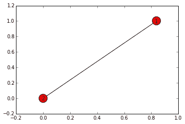
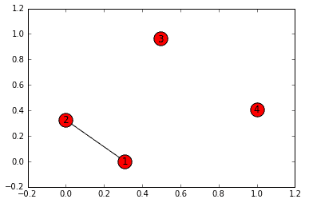
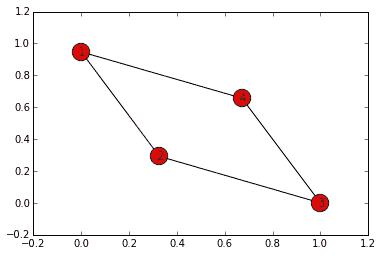
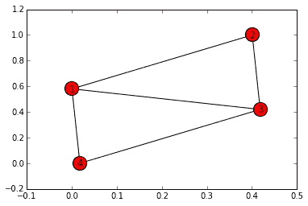
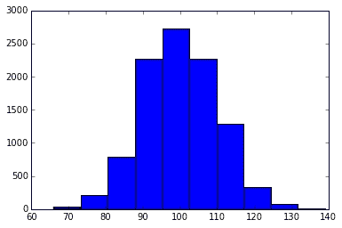
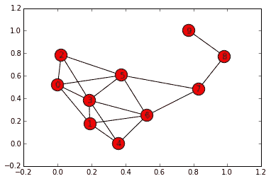
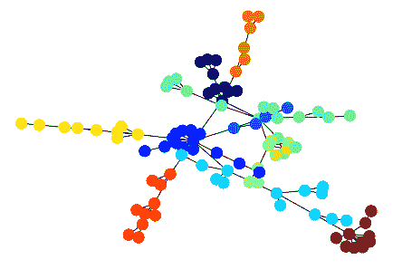
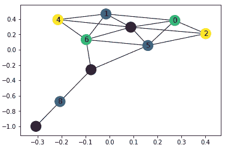
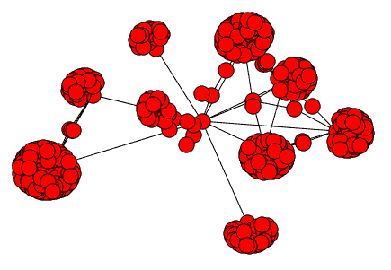
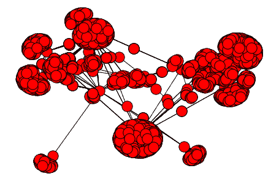

# 六、社交网络分析

“社交网络分析”（通常称为 **SNA**）创建模型并研究以网络形式存在的一组社交实体的关系。 实体可以是人，计算机或网页，关系可以是喜欢，链接或友谊（即，实体之间的连接）。

在本章中，您将了解以下内容：

*   图，因为社交网络通常以这种形式表示
*   用于从图中获取见解的重要算法
*   如何加载，转储和采样大型图

# 图论概论

基本上，图是一种能够表示对象集合中的关系的数据结构。 在这种范式下，对象是图的节点，关系是图的链接（或边）。 如果链接具有方向（在概念上，它们就像城市的单向街道），则图是有向的。 否则，该图是无向的。 下表提供了众所周知的图的示例：

| **图示例** | **类型** | **节点** | **边** |
| --- | --- | --- | --- |
| 全球资讯网 | 导演 | 网页 | 链接 |
| Facebook | 无向 | 人们 | 友谊 |
| 推特 | 导演 | 人们 | 追随者 |
| IP 网络 | 无向 | 主持人 | 电线/连接 |
| 导航系统 | 导演 | 地点/地址 | 街道 |
| 维基百科 | 导演 | 页数 | 锚链接 |
| 科学文献 | 导演 | 文件 | 引文 |
| 马尔可夫链 | 导演 | 状态 | 排放概率 |

如在传统的**关系数据库管理系统**（**RDBMS**）（例如 MySQL 或 Postgres）中，所有上述示例都可以表示为节点之间的关系。 现在，我们将发现图数据结构的优点，并开始考虑以下 SQL 查询对于诸如 Facebook 之类的社交网络的复杂程度（考虑一种推荐系统，该系统可以帮助您找到您可能认识的人 ）：

1.  检查以下查询：

```py
Find all people who are friends of my friends, but not my friends  
```

2.  在图上将前面的查询与下面的查询进行比较：

```py
Get all friends connected to me having distance=2  
```

3.  现在，让我们看看如何使用 Python 创建图或社交网络。 在本章中将广泛使用的库称为`NetworkX`。 它能够处理中小型图，并且功能齐全：

```py
In: %matplotlib inline
 import networkx as nx
 import matplotlib.pyplot as plt

 G = nx.Graph()
 G.add_edge(1,2)
 nx.draw_networkx(G)
 plt.show()
```

下图是上述代码的可视化视图，显示了两个节点及其连接边缘：



该命令是不言自明的。 检查之前的代码，在包导入之后，我们将首先定义一个（`NetworkX`）图对象（默认情况下，它是无向的）。 然后，我们将在两个节点之间添加一条边（即一个连接）（由于节点尚未在图中，因此会自动创建它们）。 最后，我们将绘制图。 库自动生成图布局（节点的位置）。

使用`.add_note()`方法，将其他节点添加到图非常简单。 例如，如果要添加节点`3`和`4`，则可以简单地使用以下代码：

```py
    In: G.add_nodes_from([3, 4])
        nx.draw_networkx(G)
        plt.show()
```

现在，我们的图变得越来越复杂，如您从图中所看到的：



前面的代码将添加两个节点。 由于它们未链接到其他节点，因此将断开连接。 同样，要向图添加更多边，可以使用以下代码：

```py
    In: G.add_edge(3,4)
 G.add_edges_from([(2, 3), (4, 1)]) nx.draw_networkx(G) plt.show()  
```

通过使用前面的代码，我们已经完成了图中的节点的连接：



要获取图中的节点集合，只需使用`.nodes()`方法。 同样，`.edges()`给出边列表作为连接节点的列表：

```py
In: G.nodes() Out: [1, 2, 3, 4] 
In: G.edges() Out: [(1, 2), (1, 4), (2, 3), (3, 4)]  
```

有几种表示和描述图的方法。 在以下部分中，我们将说明最受欢迎的。 第一种选择是使用邻接表。 它列出了每个节点的邻居； 即，`list[0]`包含以邻接表格式表示的邻接节点：

```py
In: list(nx.generate_adjlist(G)) Out: ['1 2 4', '2 3', '3 4', '4']  
```

按照这种格式，第一个数字始终是来源，后面的数字始终是目标，[如以下 URL 所示](https://networkx.github.io/documentation/stable/reference/readwrite/adjlist.html)。

为了使描述独立，可以将图表示为列表的字典。 由于其简洁，这是描述图的最流行（也是实用）方法。 在这里，节点的名称是字典键，其值是节点的邻接表：

```py
In: nx.to_dict_of_lists(G) Out: {1: [2, 4], 2: [1, 3], 3: [2, 4], 4: [1, 3]}  
```

另一方面，您可以将图描述为边的**集合**。 在输出中，每个元组的第三个元素是边的属性。 实际上，每个边缘都可以具有一个或多个属性（例如其权重，其基数等）。 由于我们创建了一个非常简单的图，因此在以下示例中，我们没有属性：

```py
In: nx.to_edgelist(G) Out: [(1, 2, {}), (1, 4, {}), (2, 3, {}), (3, 4, {})]
```

最后，图可以描述为 NumPy 矩阵。 如果矩阵在`(i, j)`位置包含`1`，则表示`i`和`j`节点之间存在链接。 由于矩阵通常只包含很少的 1（与零的数量相比），因此通常表示为稀疏（SciPy）矩阵，NumPy 矩阵或 Pandas `DataFrame`。

请注意，矩阵描述是详尽无遗的。 因此，将无向图转换为有向图，将连接`(i, j)`的链接转换为两个链接，即`(i, j)`和`(j, i)`。 该表示形式通常被称为邻接矩阵或连接矩阵。

因此，将创建一个对称矩阵，如以下示例所示：

```py
In: nx.to_numpy_matrix(G) Out: matrix([[ 0., 1., 0., 1.],
             [ 1., 0., 1., 0.],
             [ 0., 1., 0., 1.],
             [ 1., 0., 1., 0.]]) In: print(nx.to_scipy_sparse_matrix(G)) Out:   (0, 1) 1
       (0, 3) 1
       (1, 0) 1
       (1, 2) 1
       (2, 1) 1
       (2, 3) 1
       (3, 0) 1
       (3, 2) 1 In: nx.convert_matrix.to_pandas_adjacency(G)    
```

下表显示了结果输出：


当然，如果要加载 NetworkX 图，则可以使用相反的函数（将函数名称中的`from`更改为`to`），并且可以加载 NetworkX 列表，边列表以及 NumPy，SciPy 和`pandas`结构的字典中的图。

图中每个节点的重要度量是其度。 在无向图中，节点的度数表示该节点具有的链接数。 对于有向图，度有两种类型：入度和出度。 这些分别计算节点的入站和出站链接。

让我们添加一个节点（以使图不平衡）并计算节点的度，如下所示：

```py
In: G.add_edge(1, 3)
 nx.draw_networkx(G) plt.show()  
```

图的结果图如下：



本章中的图可能与在本地计算机上获得的图有所不同，因为图布局的初始化是使用随机参数进行的。

节点的度显示如下：

```py
In: G.degree() Out: {1: 3, 2: 2, 3: 3, 4: 2}
```

对于大型图，此度量是不切实际的，因为输出字典的每个节点都有一个项目。 在这种情况下，通常使用节点度的直方图来近似其分布。 在以下示例中，构建了一个具有 10,000 个节点且链接概率为 1% 的随机网络。 然后，提取节点度的直方图，如下所示：

```py
In: k = nx.fast_gnp_random_graph(10000, 0.01).degree()
 plt.hist(list(dict(k).values())) 
```

前面代码的直方图如下：



# 图算法

为了从图中获得见解，已经开发了许多算法。 在本章中，我们将在`NetworkX`中使用一个众所周知的图，即`Krackhardt Kite`图。 它是一个包含 10 个节点的伪图，通常用于证明图算法。 大卫·克拉克哈特（David Krackhardt）是风筝形状的结构的创造者。 它由两个不同的区域组成。 在第一个区域（由节点 0 到 6 组成）中，节点相互链接； 在另一个区域（节点 7 至 9）中，它们以链状连接：

```py
In: G = nx.krackhardt_kite_graph()
 nx.draw_networkx(G) plt.show()
```

在以下图表中，您可以检查 Krackhardt Kite 的图结构：



让我们从连通性开始。 如果图的两个节点之间至少存在一条路径（即一系列节点），则将它们连接起来。

如果存在至少一条路径，则这两个节点之间的最短路径就是从源节点到目标节点必须经过（或遍历）的节点集合最短的路径。

请注意，在有向图中，必须遵循链接的指示。

在`NetworkX`中，检查两个节点之间是否存在路径，计算最短路径并获取其长度非常容易。 例如，要检查节点 1 和 9 之间的连通性和路径，可以使用以下代码：

```py
In: print(nx.has_path(G, source=1, target=9))
 print(nx.shortest_path(G, source=1, target=9)) print(nx.shortest_path_length(G, source=1, target=9)) Out: True
 [1, 6, 7, 8, 9] 4
```

此函数仅给出从一个节点到另一节点的最短路径。 如果我们要查看从节点 1 到达节点 9 的所有路径，该怎么办？ Jin Yen 提出的算法提供了此答案，并在 NetworkX 的`shortest_simple_paths`函数中实现。 此函数返回图中节点源和目标之间从最短到最长的所有路径的生成器：

```py
In: print (list(nx.shortest_simple_paths(G, source=1, target=9))) Out: [[1, 6, 7, 8, 9], [1, 0, 5, 7, 8, 9], [1, 6, 5, 7, 8, 9], 
      [1, 3, 5, 7, 8, 9], [1, 4, 6, 7, 8, 9], [1, 3, 6, 7, 8, 9], 
      [1, 0, 2, 5, 7, 8, 9], [...]]
```

最后，NetworkX 提供的另一个便捷函数是`all_pairs_shortest_path`函数，它返回一个 Python 字典，其中包含网络中所有节点对之间的最短路径。 例如，要查看从节点`5`的最短路径，您只需要查看键`5`的内容：

```py
In: paths = list(nx.all_pairs_shortest_path(G))
 paths[5][1] Out: {0: [5, 0],
      1: [5, 0, 1],
      2: [5, 2],
      3: [5, 3],
      4: [5, 3, 4],
      5: [5],
      6: [5, 6],
      7: [5, 7],
      8: [5, 7, 8],
      9: [5, 7, 8, 9]}
```

不出所料，`5`与所有其他节点之间的路径以`5`本身开始。 请注意，此结构也是字典，因此，为了获得节点`a`和`b`之间的最短路径，可以将其称为`path[a][b]`。 在大型网络上，请谨慎使用此功能。 实际上，在后台，它以`O(N²)`的计算复杂度来计算所有成对的最短路径。

# 节点中心性的类型

现在我们将开始讨论节点中心性，这大致代表了节点在网络内部的重要性。 它还给出了节点连接网络的程度的想法。 我们将在此处查看多种类型的中心性，包括中间性中心，度中心性，接近性中心性，谐波中心性和特征向量中心性。

*   **中间性中心性**：这种类型的中心性可让您大致了解节点所在的最短路径的数量。 具有高度中间性的节点是网络的核心组件，许多最短的路径都经过它们。 在下面的示例中，`NetworkX`提供了一种直接的方法来计算所有节点之间的中间性：

```py
In: nx.betweenness_centrality(G) Out: {0: 0.023148148148148143,
      1: 0.023148148148148143,
      2: 0.0,
      3: 0.10185185185185183,
      4: 0.0,
      5: 0.23148148148148148,
      6: 0.23148148148148148,
      7: 0.38888888888888884,
      8: 0.2222222222222222,
      9: 0.0}
```

可以想象，最高的中间性是通过节点`7`实现的。 这似乎非常重要，因为它是连接元素`8`和`9`（这是它们到网络的网关）的唯一节点。 相反，诸如`9`，`2`和`4`之类的节点位于网络的极端边界上，并且它们不存在于网络的任何最短路径中。 因此，可以删除这些节点而不会影响网络的连接性。

*   **度中心性**：这种类型的中心性只是入射到节点上的顶点的百分比。 请注意，在有向图中，每个节点都有两个度中心：即度中心和度中心。 让我们看下面的例子：

```py
In: nx.degree_centrality(G) Out: {0: 0.4444444444444444,
      1: 0.4444444444444444,
      2: 0.3333333333333333,
      3: 0.6666666666666666,
      4: 0.3333333333333333,
      5: 0.5555555555555556,
      6: 0.5555555555555556,
      7: 0.3333333333333333,
      8: 0.2222222222222222,
      9: 0.1111111111111111}
```

不出所料，节点`3`具有最高的中心度，因为它是链接数最多的节点（已连接到其他六个节点）。 相反，节点`9`是度数最低的节点，因为它只有一个边缘。

*   **紧密度中心性**：要为每个节点计算此距离，请计算到所有其他节点的最短路径距离，将其平均后除以最大距离，然后取该值的倒数。 这导致得分在 0（平均距离较大）和 1（平均距离较低）之间。 在我们的示例中，对于节点`9`，最短路径距离为`[1, 2, 3, 3, 4, 4, 4, 5, 5]`。 然后将平均值（3.44）除以 5（最大距离）并从 1 中减去，得出的紧密度中心得分为 0.31。 您可以使用以下代码来计算示例图中所有节点的接近中心性：

```py
In: nx.closeness_centrality(G) Out: {0: 0.5294117647058824,
      1: 0.5294117647058824,
      2: 0.5,
      3: 0.6,
      4: 0.5,
      5: 0.6428571428571429,
      6: 0.6428571428571429,
      7: 0.6,
      8: 0.42857142857142855,
      9: 0.3103448275862069}
```

具有高度接近中心性的节点是`5`，`6`和`3`。 实际上，它们是存在于网络中间的节点，平均而言，它们可以通过几跳到达所有其他节点。 最低分属于节点`9`。 实际上，它到达所有其他节点的平均距离相当高。

*   **谐波中心性**：此度量类似于接近中心点，但不是距离的倒数之和的倒数，而是距离的倒数的总和。 这样做强调了距离的极限。 让我们看看我们的网络中的谐波距离是什么样的：

```py
In: nx.harmonic_centrality(G) Out: {0: 6.083333333333333,
      1: 6.083333333333333,
      2: 5.583333333333333,
      3: 7.083333333333333,
      4: 5.583333333333333,
      5: 6.833333333333333,
      6: 6.833333333333333,
      7: 6.0,
      8: 4.666666666666666,
      9: 3.4166666666666665}
```

节点`3`是具有最高谐波中心度的节点，而`5`和`6`具有可比较但较低的值。 同样，这些节点位于网络的中心，平均而言，它们可以通过几跳到达所有其他节点。 相反，节点`9`具有最低的谐波中心度； 实际上，它平均距离所有其他节点最远。

*   **特征向量中心性**：如果图是有向的，则节点表示 Web 页面，而边缘表示页面链接。 稍作修改的版本称为 PageRank。 该指标由拉里·佩奇（Larry Page）发明，是 Google，必应（Bing）以及其他搜索引擎的核心排名算法。 从随机冲浪者的角度来看，它可以使每个节点衡量该节点的重要性。 其名称源于以下事实：如果将图视为马尔可夫链，则图表示与最大特征值相关的特征向量。 因此，从这个角度来看，这种概率测度表示访问节点概率的静态分布。 让我们看下面的例子：

```py
In: nx.eigenvector_centrality(G) Out: {0: 0.35220918419838565,
      1: 0.35220918419838565,
      2: 0.28583482369644964,
      3: 0.481020669200118,
      4: 0.28583482369644964,
      5: 0.3976909028137205,
      6: 0.3976909028137205,
      7: 0.19586101425312444,
      8: 0.04807425308073236,
      9: 0.011163556091491361}  
```

在此示例中，根据特征向量中心度度量，节点`3`和`9`的得分最高和最低。 与度中心性相比，特征值中心性提供了关于冲浪者在网络中的静态分布的想法，因为它针对每个节点不仅考虑直接连接的邻居（如度中心性），而且还考虑网络的整个结构。 如果该图表示网页及其连接，则表示它们是访问次数最多/最少（可能）的页面。

作为结束语，我们将介绍聚类系数。 简而言之，就是节点的邻居的比例也就是彼此的邻居（即存在的可能的三元组或三角形的比例）。 较高的值表示较高的湿度。 之所以这样命名，是因为它代表节点趋于聚集在一起的程度。 让我们看下面的例子：

```py
In: nx.clustering(G) Out: {0: 0.6666666666666666,
      1: 0.6666666666666666,
      2: 1.0,
      3: 0.5333333333333333,
      4: 1.0,
      5: 0.5,
      6: 0.5,
      7: 0.3333333333333333,
      8: 0.0,
      9: 0.0}
```

在图的高度连接的部分中可以看到较高的值，而在连接最少的区域中可以看到较低的值。

# 分割网络

现在，让我们看一下将网络划分为节点的多个子网络的方式。 最常用的算法之一是 Louvain 方法，该方法专门用于精确检测大型图（具有一百万个节点）中的社区。 我们将首先介绍模块化措施。 这是对图结构的度量（它不是面向节点的），其形式上的数学定义非常长且复杂，并且超出了本书的范围（读者可以在[这个页面](https://sites.google.com/site/findcommunities/)）。 它直观地衡量将图划分为社区的质量，将实际的社区联系与随机的联系进行比较。 模块化得分在 -0.5 至 +1.0 之间； 值越高，划分就越好（组内连接密集，而组间连接稀疏）。

这是一个两步迭代的算法：首先是局部优化，然后是全局优化，然后是局部优化，依此类推：

1.  第一步，该算法局部最大化小社区的模块化。
2.  然后，它聚合同一社区的节点，并按层次构建一个图，其节点为社区。
3.  该方法迭代地重复这两个步骤，直到达到最大的全局模块化评分。

为了在实际示例中窥视该算法，我们首先需要创建一个更大的图。 让我们考虑一个具有 100 个节点的随机网络：

1.  在此示例中，我们将使用`powerlaw`算法构建图，该算法试图维持近似平均聚类。
2.  对于添加到图中的每个新节点，还将向其中添加`m`个随机边缘，每个随机边缘都有`p`的概率来创建三角形。
3.  源代码未包含在`NetworkX`中，但在名为`community`的单独模块中。 以下示例显示了该算法的实现：

```py
In: import community 
    # Module for community detection and clustering 
 G = nx.powerlaw_cluster_graph(100, 1, .4, seed=101)
 partition = community.best_partition(G)

 for i in set(partition.values()):
 print("Community", i)
 members = [nodes for nodes in partition.keys() 
 if partition[nodes] == i]
 print(members)

 values = [partition.get(node) for node in G.nodes()]
 nx.draw(G, pos=nx.fruchterman_reingold_layout(G),
 cmap = plt.get_cmap('jet'), 
 node_color = values, 
 node_size=150,
 with_labels=False)
 plt.show()
 print ("Modularity score:", community.modularity(partition, G))

Out: Community 0
     [0, 46, 50, 61, 73, 74, 75, 82, 86, 96]
     Community 1
     [1, 2, 9, 16, 20, 28, 29, 35, 57, 65, 78, 83, 89, 93]
     [...] Modularity score: 0.7941026425874911 
```

程序的第一个输出是图中检测到的社区列表（每个社区都是节点的集合）。 在这种情况下，该算法检测到八个组。 我们想强调的是，我们没有指定要查找的输出社区的数量，但是它是由算法自动确定的。 这是并非所有聚类算法都具有的理想功能（例如，K 均值需要聚类数作为参数）。

然后，我们打印了图，为每个社区分配了不同的颜色。 您可以看到边缘节点上的颜色非常均匀：



最后，该算法返回解决方案的模块化评分：0.79（这是一个很高的评分）。

关于图的简短介绍将要介绍的最后一个算法是`coloring`。 这是一种为节点分配标签的图方式，邻居（即具有链接的节点）必须具有不同的标签（或颜色）。 为了解释该算法为何如此重要，我们将使用一个实际示例。 电信网络由遍布地球的不同频率的天线组成。 将每个天线视为一个节点，并将频率视为该节点的标签。 如果天线的距离小于定义的距离（假设距离足够近，会引起干扰），则说明它们与边缘相连。 我们是否可以找到分配的最低频率数（以使公司必须支付的费用降至最低）并避免相邻天线之间的干扰（即通过为链接节点分配不同的频率）？

该解决方案由图着色算法给出。 从理论上讲，这类算法的解决方案是 NP 难解的，尽管有很多近似方法可以快速获得次优解决方案，但几乎找不到最佳解决方案。 NetworkX 实现贪婪方法来解决着色问题。 该函数返回的是一个字典，其中每个节点（字典中的键）包含颜色（字典中键的值）。 作为示例，让我们在示例图中查看颜色的分配，然后让我们看到颜色：

```py
In: G = nx.krackhardt_kite_graph()
    d = nx.coloring.greedy_color(G)
    print(d)
    nx.draw_networkx(G, 
       node_color=[d[n] for n in sorted(d.keys())])
    plt.show() Out:{3: 0, 5: 1, 6: 2, 0: 2, 1: 1, 2: 3, 4: 3, 7: 0, 8: 1, 9: 0}
```

这是图的图形，对链接的节点使用了不同的颜色：



正如预期的那样，链接的节点具有不同的颜色。 似乎对于这种网络配置，需要四种颜色。 如果这代表一个电信网络，它将向我们显示需要四个频率来避免干扰。

# 图加载，转储和采样

除了`NetworkX`以外，还可以使用其他软件来生成和分析图和网络。 可用于分析的最佳开源多平台软件之一称为 Gephi。 这是一种视觉工具，不需要编程技能。 可在[这个页面](http://gephi.github.io/)免费获得。

与机器学习数据集中一样，甚至图都具有用于存储，加载和交换的标准格式。 这样，您可以使用 NetworkX 创建图，将其转储到文件中，然后使用 Gephi 进行加载和分析。

最常用的格式之一是**图建模语言**（**GML**）。 现在，让我们看看如何将图转储到 GML 文件中：

```py
In: dump_file_base = "dumped_graph"

    # Be sure the dump_file file doesn't exist
    def remove_file(filename):
        import os
        if os.path.exists(filename):
            os.remove(filename)

    G = nx.krackhardt_kite_graph()

    # GML format write and read
    GML_file = dump_file_base + '.gml'
    remove_file(GML_file)

    to_string = lambda x: str(x)
    nx.write_gml(G, GML_file, stringizer=to_string)
    to_int = lambda x: int(x)
    G2 = nx.read_gml(GML_file, destringizer = to_int)

    assert(G.edges() == G2.edges())
```

在前面的代码块中，我们执行了以下操作：

1.  如果转储文件确实存在，我们将其删除。
2.  然后，我们创建了一个图（风筝），然后，我们将其转储并加载。
3.  最后，我们比较了原始结构和加载的结构，断言它们是相等的。

除了 GML，还有多种格式。 这些格式均具有不同的功能。 请注意，其中一些会删除与网络有关的信息（例如边缘/节点属性）。 与`write_gml`函数及其等效项`read_gml`相似，以下内容（名称不言而喻）：

*   邻接表（`read_adjlist`和`write_adjlist`）
*   多行邻接表（`read_multiline_adjlist`和`write_multiline_adjlist`）
*   边缘列表（`read_edgelist`和`write_edgelist`）
*   GEXF（`read_gexf`和`write_gexf`）
*   泡菜（`read_gpickle`和`write_gpickle`）
*   GraphML（`read_graphml`和`write_graphml`）
*   LEDA（`read_leda`和`parse_leda`）
*   YAML（`read_yaml`和`write_yaml`）
*   帕杰克（`read_pajek`和`write_pajek`）
*   GIS Shapefile（`read_shp`和`write_shp`）
*   JSON（加载/加载和转储/转储，并提供 JSON 序列化）

本章的最后一个主题是采样。 为什么要采样图？ 我们对图进行采样是因为处理大型图有时是不切实际的（请记住，在最佳情况下，处理时间与图的大小成正比）。 因此，最好对其进行采样，通过在小规模场景中工作来创建算法，然后在全面问题上对其进行测试。 有几种采样图的方法。 在这里，我们将介绍三种最常用的技术。

在第一种技术（称为节点采样）中，节点的有限子集及其链接形成了采样集。 在第二种技术（称为链接采样）中，链接的子集形成采样集。 这两种方法既简单又快速，但是它们可能会为网络创建不同的结构。 第三种方法称为雪球采样。 初始节点，它的所有邻居以及邻居的邻居（以这种方式扩展选择，直到我们达到最大遍历深度参数）都形成了采样集。 换句话说，选择就像滚雪球一样。

请注意，您还可以对遍历的链接进行二次采样。 换句话说，每个链接都有`p`的概率，必须在输出集中进行跟踪和选择。

最后一种采样方法不是`NetworkX`的一部分，但是您可以在`snowball_sampling.py`文件中找到相同的实现。

在此示例中，我们将从具有`alberto` ID 的人开始对`LiveJournal`网络进行二次采样，然后递归扩展两次（在第一个示例中）和三次（在第二个示例中）。 在后一种情况下，每个链接后面都有 20% 的概率，因此减少了检索时间。 这是一个说明相同的示例：

```py
In: import snowball_sampling
    import matplotlib.pyplot as plot
    my_social_network = nx.Graph()
    snowball_sampling.snowball_sampling(my_social_network, 2, 'alberto')
    nx.draw(my_social_network)
    ax = plot.gca()
    ax.collections[0].set_edgecolor("#000000")
    plt.show() Out:  Reching depth 0
 new nodes to investigate: ['alberto'] Reching depth 1 new nodes to investigate: ['mischa', 'nightraven', 'seraph76',
      'adriannevandal', 'hermes3x3', 'clymore', 'cookita', 'deifiedsoul',   
      'msliebling', 'ph8th', 'melisssa', '______eric_', 'its_kerrie_duhh',
      'eldebate']
```

这是采样代码的结果：



现在，我们将使用特定的采样率`0.2`：

```py
In: my_sampled_social_network = nx.Graph()
 snowball_sampling.snowball_sampling(my_sampled_social_network, 3,   
                                        'alberto', sampling_rate=0.2)
 nx.draw(my_sampled_social_network)
 ax = plot.gca()
 ax.collections[0].set_edgecolor("#000000")
 plt.show()  Out:  Reching depth 0
 new nodes to investigate: ['alberto']
 Reching depth 1 new nodes to investigate: ['mischa', 'nightraven', 'seraph76',
      'adriannevandal', 'hermes3x3', 'clymore', 'cookita', 'deifiedsoul', 
      'msliebling', 'ph8th', 'melisssa', '______eric_', 'its_kerrie_duhh', 
      'eldebate']
      Reching depth 2
      new nodes to investigate: ['themouse', 'brynna', 'dizzydez', 'lutin',  
      'ropo', 'nuyoricanwiz', 'sophia_helix', 'lizlet', 'qowf', 'cazling',   
      'copygirl', 'cofax7', 'tarysande', 'pene', 'ptpatricia', 'dapohead', 
      'infinitemonkeys', 'noelleleithe', 'paulisper', 'kirasha', 'lenadances', 
      'corianderstem', 'loveanddarkness', ...] 
```

结果图更详细：



# 总结

在本章中，我们学习了社交网络是什么，包括社交网络的创建和修改，表示以及社交网络及其节点的一些重要度量。 最后，我们讨论了大图的加载和保存以及处理方法。

在本章中，几乎所有基本数据科学算法都已介绍。 在第 4 章，“机器学习”中讨论了机器学习技术，并在此讨论了社交网络分析方法。 我们将在下一章“超越基础的深度学习”中最终讨论深度学习和神经网络的最先进，最前沿的技术。