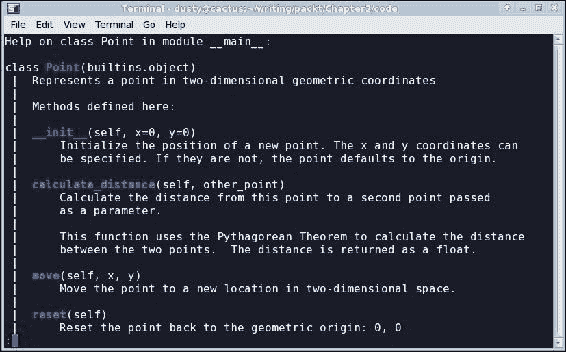
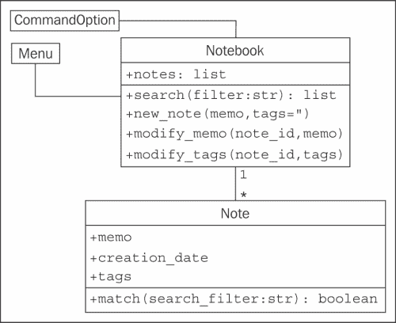
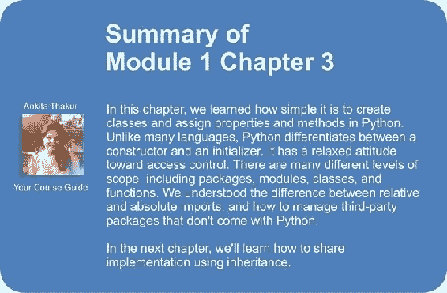

# 第 3 章 Python 对象

因此，我们现在手头有一个设计，可以将其变成可行的程序了！ 当然，这种情况通常不会发生。 我们将在整个模块中看到有关良好软件设计的示例和提示，但我们的重点是面向对象的编程。 因此，让我们看一下允许我们创建面向对象软件的 Python 语法。

完成本章后，我们将了解：

*   如何在 Python 中创建类和实例化对象
*   如何向 Python 对象添加属性和行为
*   如何将类组织成包和模块
*   如何建议人们不要破坏我们的数据

# 创建 Python 类

我们没有编写太多 Python 代码来意识到 Python 是一种非常“干净”的语言。 当我们想做某事时，我们只需要做，而无需进行大量设置。 您可能已经看到，Python 中无处不在的“ hello world”仅仅是一行。

同样，Python 3 中最简单的类如下所示：

```py
class MyFirstClass:
    pass
```

这是我们第一个面向对象的程序！ 类定义以`class`关键字开头。 这之后是（由我们选择的）标识类的名称，并以冒号结尾。

### 注意

类名必须遵循标准的 Python 变量命名规则（它必须以字母或下划线开头，并且只能由字母，下划线或数字组成）。 此外，Python 样式指南（在网络上搜索“ PEP 8”）建议使用 **CamelCase** 表示法将类命名为（以大写字母开头；任何后续单词也应以 首都）。

在类定义行之后紧跟着类内容。 与其他 Python 构造一样，缩进用于分隔类，而不是许多其他语言使用的花括号或方括号。 除非有令人信服的理由，否则使用四个空格进行缩进（例如，与使用制表符作为缩进的其他人的代码相适应）。 只要按下*选项卡*键，任何体面的程序编辑器都可以配置为插入四个空格。

由于我们的第一堂课实际上什么也没做，因此我们仅在第二行使用`pass`关键字来表示不需要采取进一步的措施。

我们可能认为这个最基本的类没有什么可以做的，但是它确实允许我们实例化该类的对象。 我们可以将类加载到 Python 3 解释器中，以便我们可以交互地进行播放。 为此，将前面提到的类定义保存到名为`first_class.py`的文件中，然后运行命令`python -i first_class.py`。 `-i`参数告诉 Python“运行代码，然后放到交互式解释器中”。 以下解释器会话演示了与此类的基本交互：

```py
>>> a = MyFirstClass()
>>> b = MyFirstClass()
>>> print(a)
<__main__.MyFirstClass object at 0xb7b7faec>
>>> print(b)
<__main__.MyFirstClass object at 0xb7b7fbac>
>>>

```

此代码从新类实例化了两个对象，分别名为`a`和`b`。 创建类的实例很简单，只需键入类名，然后输入一对括号即可。 它看起来很像一个普通的函数调用，但是 Python 知道我们是在“调用”一个类而不是一个函数，因此它知道它的工作是创建一个新对象。 当打印时，这两个对象告诉我们它们是哪个类，以及它们住在什么内存地址。 内存地址在 Python 代码中使用不多，但是在这里，它们表明涉及两个不同的对象。

## 添加属性

现在，我们有了一个基本类，但是它毫无用处。 它不包含任何数据，并且不执行任何操作。 要为给定对象分配属性，我们该怎么做？

事实证明，我们不必在类定义中做任何特别的事情。 我们可以使用点表示法在实例化对象上设置任意属性：

```py
class Point:
    pass

p1 = Point()
p2 = Point()

p1.x = 5
p1.y = 4

p2.x = 3
p2.y = 6

print(p1.x, p1.y)
print(p2.x, p2.y)
```

如果运行此代码，最后的两个`print`语句将告诉我们两个对象的新属性值：

```py
5 4
3 6

```

此代码创建一个空的`Point`类，不包含任何数据或行为。 然后，它创建该类的两个实例，并为每个实例分配`x`和`y`坐标以标识二维点。 为对象的属性分配值所需要做的就是使用 *<对象>。 <属性> = <值>* 语法。 有时将其称为**点表示法**。 该值可以是任何值：Python 原语，内置数据类型或其他对象。 它甚至可以是一个函数或另一个类！

## 让它做某事

现在，具有属性的对象很棒，但是面向对象的编程实际上是关于对象之间的交互的。 我们对调用导致这些属性发生事情的操作感兴趣。 现在是时候将行为添加到我们的类中了。

让我们在`Point`类上模拟几个动作。 我们可以从名为`reset`的方法开始，该方法将点移动到原点（原点是`x`和`y`均为零的点）。 这是一个很好的介绍性操作，因为它不需要任何参数：

```py
class Point:
    def reset(self):
        self.x = 0
        self.y = 0

p = Point()
p.reset()
print(p.x, p.y)
```

此`print`语句向我们显示了属性上的两个零：

```py
0 0

```

Python 中的方法与函数的格式相同。 它以关键字`def`开头，后跟一个空格和方法名称。 接下来是一组包含参数列表的括号（我们稍后将讨论`self`参数），并以冒号结尾。 下一行缩进以包含方法内部的语句。 这些语句可以是在对象本身上操作的任意 Python 代码，以及在方法认为合适时传递的任何参数。

### 自言自语

方法和普通函数之间的区别是所有方法都有一个必填参数。 这个参数通常被命名为`self`。 我从未见过程序员为此变量使用任何其他名称（约定是非常强大的功能）。 但是，没有什么可以阻止您将其称为`this`甚至`Martha`。

方法的 `self`参数只是对该方法在其上调用的对象的引用。 我们可以像访问其他对象一样访问该对象的属性和方法。 这正是我们在设置`self`对象的`x`和`y`属性时在`reset`方法中所做的事情。

注意，当我们调用`p.reset()`方法时，不必将`self`参数传递给它。 Python 自动为我们解决了这一问题。 它知道我们正在`p`对象上调用方法，因此它将自动将该对象传递给该方法。

但是，方法实际上只是一个碰巧在类上的函数。 除了在对象上调用方法之外，我们还可以在类上调用函数，将我们的对象作为`self`参数显式传递：

```py
p = Point()
Point.reset(p)
print(p.x, p.y)
```

输出与前面的示例相同，因为在内部，发生了完全相同的过程。

如果我们忘记在类定义中包含`self`参数，会发生什么？ Python 将保释并显示一条错误消息：

```py
>>> class Point:
...     def reset():
...         pass
...
>>> p = Point()
>>> p.reset()
Traceback (most recent call last):
 File "<stdin>", line 1, in <module>
TypeError: reset() takes no arguments (1 given)

```

错误消息可能不那么清晰（“傻瓜，您忘记了`self`参数”会提供更多信息）。 只要记住，当您看到指示缺少参数的错误消息时，首先要检查的是您是否在方法定义中忘记了`self`。

### 更多参数

那么，如何将多个参数传递给方法？ 让我们添加一个新方法，该方法允许我们将点移动到任意位置，而不仅仅是原点。 我们还可以包含一个接受另一个`Point`对象作为输入并返回它们之间的距离的对象：

```py
import math

class Point:
    def move(self, x, y):
        self.x = x
        self.y = y

    def reset(self):
        self.move(0, 0)

    def calculate_distance(self, other_point):
        return math.sqrt(
                (self.x - other_point.x)**2 +
                (self.y - other_point.y)**2)

# how to use it:
point1 = Point()
point2 = Point()

point1.reset()
point2.move(5,0)
print(point2.calculate_distance(point1))
assert (point2.calculate_distance(point1) ==
        point1.calculate_distance(point2))
point1.move(3,4)
print(point1.calculate_distance(point2))
print(point1.calculate_distance(point1))
```

最后的`print`语句为我们提供以下输出：

```py
5.0
4.472135955
0.0

```

在这里发生了很多事情。 该类现在具有三种方法。 `move`方法接受`x`和`y`这两个参数，并在`self`对象上设置值，就像上一个示例中的旧`reset`方法一样。 现在，旧的`reset`方法调用`move`，因为重置只是向特定已知位置的移动。

`calculate_distance`方法使用不太复杂的勾股定理来计算两点之间的距离。 希望您理解数学（`**2`表示平方，`math.sqrt`计算平方根），但这不是我们当前关注的，学习如何编写方法的要求。

上一示例末尾的示例代码显示了如何使用参数调用方法：只需在括号内包含参数，然后使用相同的点符号即可访问该方法。 我只是选择了一些随机位置来测试方法。 测试代码调用每种方法，并将结果打印在控制台上。 `assert`功能是一个简单的测试工具； 如果`assert`之后的语句为`False`（或零，空或`None`），则程序将失败。 在这种情况下，无论哪个点称为另一点的`calculate_distance`方法，我们都使用它来确保距离是相同的。

## 初始化对象

如果我们没有使用`move`或直接访问它们，而没有明确在我们的`Point`对象上设置`x`和`y`位置，则我们会出现一个断点，没有实际位置。 当我们尝试访问它时会发生什么？

好吧，让我们尝试一下看看。 “尝试一下，看看”是 Python 学习中非常有用的工具。 打开您的交互式解释器，然后键入。 以下交互式会话显示了如果我们尝试访问缺少的属性会发生什么。 如果您将先前的示例另存为文件或正在使用该模块随附的示例，则可以使用命令`python -i filename.py`将其加载到 Python 解释器中：

```py
>>> point = Point()
>>> point.x = 5
>>> print(point.x)
5
>>> print(point.y)
Traceback (most recent call last):
 File "<stdin>", line 1, in <module>
AttributeError: 'Point' object has no attribute 'y'

```

好吧，至少它抛出了一个有用的例外。 我们将在第 4 章和*期望意外的*中详细介绍异常。 您可能之前已经看过它们（尤其是普遍存在的 **SyntaxError**，意味着您键入的内容不正确！）。 此时，只需注意这意味着出了点问题。

输出对于调试很有用。 在交互式解释器中，它告诉我们在**第 1 行**发生的错误，该错误仅部分正确（在交互式会话中，一次仅执行一行）。 如果我们在文件中运行脚本，它将告诉我们确切的行号，从而很容易找到有问题的代码。 此外，它告诉我们错误是`AttributeError`，并给出了有用的信息，告诉我们该错误意味着什么。

我们可以捕获并从此错误中恢复，但是在这种情况下，感觉就像我们应该指定某种默认值一样。 也许每个新对象在默认情况下都应为`reset()`，或者如果我们可以强迫用户告诉我们在创建对象时这些位置应该是什么，那就更好了。

大多数面向对象的编程语言都具有**构造函数**的概念，这是一种特殊的方法，可在创建对象时创建并初始化该对象。 Python 有点不同； 它有一个构造函数*和*一个初始化程序。 除非您要执行某些操作，否则很少使用构造函数。 因此，我们将从初始化方法开始讨论。

Python 初始化方法与其他任何方法都相同，只是它有一个特殊的名称`__init__`。 前导和尾随的双下划线表示这是一种特殊的方法，Python 解释器会将其视为特殊情况。

### 注意

切勿使用前后双下划线来命名自己的函数。 对于 Python 而言，这可能毫无意义，但 Python 的设计人员将来总有可能会添加一个具有特定用途的功能，并且使用该名称时，您的代码将被破坏。

让我们从`Point`类上的初始化函数开始，该函数要求用户在实例化`Point`对象时提供`x`和`y`坐标：

```py
class Point:
    def __init__(self, x, y):
        self.move(x, y)

    def move(self, x, y):
        self.x = x
        self.y = y

    def reset(self):
        self.move(0, 0)

# Constructing a Point
point = Point(3, 5)
print(point.x, point.y)
```

现在，我们的观点永远离不开`y`坐标！ 如果我们尝试在不包含适当初始化参数的情况下构造一个点，则它将失败，并出现**参数不足**错误，这与我们先前忘记`self`参数时收到的错误相似。

如果我们不想将这两个参数都设为必需，该怎么办？ 好了，那么我们可以使用 Python 函数提供默认参数的相同语法。 关键字参数语法在每个变量名称后附加一个等号。 如果调用对象不提供此参数，则使用默认参数。 变量仍可用于该函数，但它们将具有在参数列表中指定的值。 这是一个例子：

```py
  class Point:
      def __init__(self, x=0, y=0):
          self.move(x, y)
```

在的大部分时间里，我们将初始化语句放在`__init__`函数中。 但是如前所述，Python 除了其初始化函数外，还具有构造函数。 您可能永远不需要使用其他 Python 构造函数，但这有助于了解它的存在，因此我们将简要介绍它。

相对于`__init__`，构造函数称为`__new__`，并且只接受一个参数。 所构造的类（在构造对象的之前将其称为*，因此没有`self`参数）。 它还必须返回新创建的对象。 当涉及到元编程的复杂技术时，这具有有趣的可能性，但在日常编程中不是很有用。 在实践中，几乎不需要使用`__new__`，并且`__init__`就足够了。*

## 自我解释

Python 是一种非常易于阅读的编程语言。 有人可能会说这是自我记录。 但是，在进行面向对象的编程时，编写 API 文档以清楚地总结每个对象和方法的工作非常重要。 使文档保持最新是很困难的。 最好的方法是将其正确写入我们的代码中。

Python 通过使用**文档字符串**支持此功能。 每个类，函数或方法标头都可以将标准 Python 字符串作为定义之后的第一行（以冒号结尾的行）。 该行的缩进应与以下代码相同。

Docstrings 只是用撇号（`'`）或引号（`"`）括起来的 Python 字符串。 通常，文档字符串很长，并且跨越多行（样式指南建议该行的长度不应超过 80 个字符），可以将其格式化为多行字符串，并用匹配的三撇号（`'''`）或三引号（ `"""`）字符。

文档字符串应清楚，简洁地概述其描述的类或方法的目的。 它应该说明使用不立即明显的任何参数，也是包含如何使用 API​​的简短示例的好地方。 毫无疑问的 API 用户应该注意的任何警告或问题。

为了说明文档字符串的用法，我们将在本节结尾以我们完整记录的`Point`类：

```py
import math

class Point:
    'Represents a point in two-dimensional geometric coordinates'

    def __init__(self, x=0, y=0):
        '''Initialize the position of a new point. The x and y            coordinates can be specified. If they are not, the
           point defaults to the origin.'''
        self.move(x, y)

    def move(self, x, y):
        "Move the point to a new location in 2D space."
        self.x = x
        self.y = y

    def reset(self):
        'Reset the point back to the geometric origin: 0, 0'
        self.move(0, 0)

    def calculate_distance(self, other_point):
        """Calculate the distance from this point to a second
        point passed as a parameter.

        This function uses the Pythagorean Theorem to calculate         the distance between the two points. The distance is
        returned as a float."""

        return math.sqrt(
                (self.x - other_point.x)**2 +
                (self.y - other_point.y)**2)
```

尝试在交互式解释器中键入或加载（请记住，它是`python -i filename.py`）此文件。 然后，在 Python 提示符下输入`help(Point)<enter>`。 您应该可以很好地看到该类的格式文档，如以下屏幕截图所示：



# 模块和软件包

现在，我们知道了如何创建类和实例化对象，但是我们如何组织它们呢？ 对于小型程序，我们可以将所有类放入一个文件中，并在文件末尾添加一个小脚本以启动它们的交互。 但是，随着项目的发展，在我们定义的许多类中很难找到一个需要编辑的类。 这是**模块**进入的地方。模块只是 Python 文件，仅此而已。 我们的小程序中的单个文件是一个模块。 两个 Python 文件是两个模块。 如果我们在同一文件夹中有两个文件，则可以从一个模块加载一个类，以在另一个模块中使用。

例如，如果我们正在构建一个电子商务系统，则可能会将大量数据存储在数据库中。 我们可以将所有与数据库访问相关的类和函数放在一个单独的文件中（我们称其为`database.py`）。 然后，我们的其他模块（例如，客户模型，产品信息和库存）可以从该模块导入类以访问数据库。

`import`语句用于从模块导入模块或特定的类或函数。 在上一节的`Point`类中，我们已经看到了这样的示例。 我们使用`import`语句获取 Python 的内置`math`模块，并在`distance`计算中使用其`sqrt`函数。

这是一个具体示例。 假设我们有一个名为`database.py`的模块，其中包含一个名为`Database`的类，以及另一个名为`products.py`的模块，该模块负责与产品相关的查询。 在这一点上，我们不需要考虑这些文件的内容。 我们所知道的是，`products.py`需要从`database.py`实例化`Database`类，以便它可以对数据库中的产品表执行查询。

`import`语句语法有多种变体，可用于访问该类：

```py
import database
db = database.Database()
# Do queries on db
```

该版本将`database`模块导入到`products`名称空间（模块或函数中当前可访问的名称列表），因此可以使用`database.<something>`表示法访问`database`模块中的任何类或函数。 另外，我们可以使用`from` ... `import`语法仅导入所需的一个类：

```py
from database import Database
db = Database()
# Do queries on db
```

如果由于某种原因`products`已经有一个名为`Database`的类，并且我们不想混淆这两个名称，则可以在`products`模块中使用该类时重命名该类：

```py
from database import Database as DB
db = DB()
# Do queries on db
```

我们还可以在一个语句中导入多个项目。 如果我们的`database`模块还包含`Query`类，则可以使用以下两种方法导入这两个类：

```py
from database import Database, Query
```

一些消息来源说，我们可以使用以下语法从`database`模块导入所有类和函数：

```py
from database import *
```

不要这样 每个有经验的 Python 程序员都会告诉您，永远不要使用此语法。 他们将使用晦涩的理由，例如“它弄乱了名称空间”，这对于初学者来说没有太大意义。 了解为什么避免使用这种语法的一种方法是使用它，并在两年后尝试理解您的代码。 但是，现在我们可以快速解释一下，从而节省一些时间和两年编写不佳的代码！

当我们使用`from database import Database`在文件顶部显式导入`database`类时，我们可以轻松地查看`Database`类的来源。 我们可能会在文件的后面使用`db = Database()` 400 行，我们可以快速查看导入内容，以查看`Database`类的来源。 然后，如果需要澄清如何使用`Database`类，则可以访问原始文件（或在交互式解释器中导入模块并使用`help(database.Database)`命令）。 但是，如果使用`from database import *`语法，则查找该类的位置会花费更长的时间。 代码维护成为一场噩梦。

此外，如果使用常规导入，大多数编辑器都可以提供额外的功能，例如可靠的代码完成，跳转到类的定义或内联文档的功能。 `import *`语法通常会完全破坏其可靠执行此操作的能力。

最后，使用`import *`语法可以将意外对象带入我们的本地名称空间。 当然，它将导入要从中导入的模块中定义的所有类和函数，但是还将导入本身已导入到该文件中的所有类或模块！

模块中使用的每个名称都应来自明确指定的位置，无论是在该模块中定义的名称，还是从另一个模块显式导入的名称。 应该没有凭空浮出水面的魔术变量。 我们应该*始终*能够立即识别当前名称空间中名称的起源。 我保证，如果您使用这种邪恶的语法，那么您将有一天会经历极其沮丧的时刻：“该类来自何处？”。

## 整理模块

随着项目成长为越来越多的模块的集合，我们可能会发现我们想添加另一个抽象级别，即模块级别上的某种嵌套层次结构。 但是，我们不能将模块放在模块内部； 一个文件毕竟只能容纳一个文件，而模块无非就是 Python 文件。

但是，文件可以放在文件夹中，而模块也可以。 **包**是文件夹中模块的集合。 程序包的名称是文件夹的名称。 我们要告诉 Python 文件夹是一个包的所有工作，就是将一个文件（通常为空）放在名为`__init__.py`的文件夹中。 如果我们忘记了该文件，将无法从该文件夹导入模块。

让我们将模块放入工作文件夹中的`ecommerce`包中，其中还将包含`main.py`文件以启动程序。 让我们另外在`ecommerce`包中添加另一个包，以获取各种付款方式。 文件夹层次结构如下所示：

```py
parent_directory/
    main.py
    ecommerce/
        __init__.py
        database.py
        products.py
        payments/
            __init__.py
            square.py
            stripe.py
```

在包之间导入模块或类时，我们必须谨慎使用语法。 在 Python 3 中，有两种导入模块的方法：绝对导入和相对导入。

### 绝对进口

**绝对导入**指定到要导入的模块，功能或路径的完整路径。 如果需要访问`products`模块内部的`Product`类，则可以使用以下任何一种语法进行绝对导入：

```py
import ecommerce.products
product = ecommerce.products.Product()
```

或者

```py
from ecommerce.products import Product
product = Product()
```

或者

```py
from ecommerce import products
product = products.Product()
```

`import`语句使用句点运算符分隔包或模块。

这些语句可在任何模块中使用。 我们可以在`main.py`，`database`模块或两个支付模块中的任何一个中使用此语法实例化`Product`类。 确实，假设这些软件包可用于 Python，它将能够导入它们。 例如，也可以将软件包安装到 Python 站点的 packages 文件夹中，或者可以自定义`PYTHONPATH`环境变量以动态告诉 Python 要搜索要导入的软件包和模块的文件夹。

那么，通过这些选择，我们选择哪种语法？ 这取决于您的个人品味和手头的应用。 如果要在`products`模块中使用许多类和函数，则通常会使用`from ecommerce import products`语法导入模块名称，然后使用`products.Product`访问各个类。 如果我只需要`products`模块中的一两个类，则可以使用`from ecommerce.proucts import Product`语法直接导入它们。 除非我遇到某种名称冲突，否则我个人不会经常使用第一种语法（例如，我需要访问两个名为`products`的完全不同的模块，并且需要将它们分开）。 尽您所能使代码看起来更优雅。

### 相对进口

在将与相关模块一起使用时，指定完整路径似乎很愚蠢； 我们知道父模块的名称。 这是**相对导入**出现的地方。相对导入基本上是一种表达的方式，它表示相对于当前模块定位的类，函数或模块。 例如，如果我们正在使用`products`模块，并且想从其旁边的`database`模块导入`Database`类，则可以使用相对导入：

```py
from .database import Database
```

`database`前面的句号为“*使用当前包内的数据库模块”*。 在这种情况下，当前软件包是包含我们当前正在编辑的`products.py`文件的软件包，即`ecommerce`软件包。

如果我们正在编辑`ecommerce.payments`包内的`paypal`模块，我们想说“*使用父包*内的数据库包”。 只需两个周期即可轻松完成，如下所示：

```py
from ..database import Database
```

我们可以使用更多的时间来进一步提高层次结构。 当然，我们也可以一侧向下，另一侧向上。 我们没有足够深入的示例层次结构来正确地说明这一点，但是如果我们有一个包含`email`模块的`ecommerce.contact`包并且想将`send_mail`函数导入到我们的`paypal`中，则以下内容是有效的导入 ] 模块：

```py
from ..contact.email import send_mail
```

此导入使用两个句点来表示*付款包*的父级，然后使用正常的`package.module`语法将*返回*到联系包中 。

最后，我们可以直接从包中导入代码，而不仅仅是包中的模块。 在此示例中，我们有一个`ecommerce`包，其中包含两个名为`database.py`和`products.py`的模块。 数据库模块包含一个`db`变量，可以从很多地方访问该变量。 如果可以将其导入为`import ecommerce.db`而不是`import ecommerce.database.db`会不会很方便？

还记得将目录定义为包的`__init__.py`文件吗？ 该文件可以包含我们喜欢的任何变量或类声明，它们将作为软件包的一部分提供。 在我们的示例中，如果`ecommerce/__init__.py`文件包含以下行：

```py
from .database import db
```

然后，我们可以使用此导入从`main.py`或任何其他文件访问`db`属性：

```py
from ecommerce import db
```

如果`__init__.py`文件是模块而不是包，则将其视为`ecommerce.py`文件可能会有所帮助。 如果将所有代码放在一个模块中，然后又决定将其分解为模块包，则这也很有用。 新程序包的`__init__.py`文件仍然可以是与其通讯的其他模块的主要联系点，但是该代码可以在内部组织为几个不同的模块或子程序包。

但是，我建议不要将所有代码都放在`__init__.py`文件中。 程序员不希望该文件中发生实际的逻辑，并且与`from x import *`一样，如果程序员正在寻找特定代码的声明，并且直到检查`__init__.py`时才能找到它，它可能使它们跳闸。 。

# 组织模块内容

在任何一个模块中，我们都可以指定变量，类或函数。 它们可以是一种方便的方式来存储全局状态而不会导致名称空间冲突。 例如，我们已经将`Database`类导入到各种模块中，然后实例化它，但是从`database`模块中全局仅提供一个`database`对象可能更有意义。 `database`模块可能如下所示：

```py
class Database:
    # the database implementation
    pass

database = Database()
```

然后，我们可以使用我们讨论的任何导入方法来访问`database`对象，例如：

```py
from ecommerce.database import database
```

上一类的问题是，`database`对象是在首次导入模块时立即创建的，通常是在程序启动时创建的。 这并不总是理想的，因为连接到数据库可能要花一些时间，这会减慢启动速度，或者数据库连接信息可能尚不可用。 通过调用`initialize_database`函数来创建模块级变量，我们可以将数据库的创建推迟到实际需要时：

```py
class Database:
    # the database implementation
    pass

database = None

def initialize_database():
    global database
    database = Database()
```

`global`关键字告诉 Python `initialize_database`内部的数据库变量是我们刚刚定义的模块级别。 如果我们没有将变量指定为全局变量，Python 将创建一个新的局部变量，该局部变量在方法退出时将被丢弃，而模块级别的值保持不变。

如这两个示例所示，所有模块级代码在导入时都会立即执行。 但是，如果它在方法或函数内部，则将创建该函数，但是在调用该函数之前，将不会执行其内部代码。 对于执行脚本的脚本（例如我们电子商务示例中的主脚本）来说，这可能是一件棘手的事情。 通常，我们会写一个做一些有用的事情的程序，然后发现我们想在另一个程序中从该模块导入一个函数或类。 但是，一旦导入，模块级的任何代码都会立即执行。 如果我们不小心的话，当我们确实只打算访问该模块中的几个函数时，就可以运行第一个程序。

为了解决这个问题，我们应该始终将启动代码放在一个函数中（通常称为`main`），并且仅在知道我们将模块作为脚本运行时才执行该函数，而不是在导入代码时执行 来自不同的脚本。 但是我们怎么知道呢？

```py
class UsefulClass:
    '''This class might be useful to other modules.'''
    pass

def main():
    '''creates a useful class and does something with it for our module.'''
    useful = UsefulClass()
    print(useful)

if __name__ == "__main__":
    main()
```

每个模块都有一个`__name__`特殊变量（请记住，Python 对特殊变量使用双下划线，例如类的`__init__`方法），用于指定导入模块时的模块名称。 当直接用`python module.py`执行该模块时，永远不会导入该模块，因此`__name__`被任意设置为字符串`"__main__"`。 将所有脚本包装在`if __name__ == "__main__":`测试中作为一项策略，以防万一您编写一个函数时发现有一天可以被其他代码导入有用。

因此，方法进入类，进入模块，进入包。 这就是全部吗？

其实没有 这是 Python 程序中典型的事物顺序，但这不是唯一可能的布局。 类别可以在任何地方定义。 它们通常在模块级别定义，但也可以在函数或方法内部定义，如下所示：

```py
def format_string(string, formatter=None):
    '''Format a string using the formatter object, which
    is expected to have a format() method that accepts
    a string.'''
    class DefaultFormatter:
        '''Format a string in title case.'''
        def format(self, string):
            return str(string).title()

    if not formatter:
        formatter = DefaultFormatter()

    return formatter.format(string)

hello_string = "hello world, how are you today?"
print(" input: " + hello_string)
print("output: " + format_string(hello_string))
```

输出将如下所示：

```py
input: hello world, how are you today?
output: Hello World, How Are You Today?

```

`format_string`函数接受一个字符串和可选的格式化程序对象，然后将格式化程序应用于该字符串。 如果没有提供格式化程序，它将创建自己的格式化程序作为本地类并将其实例化。 由于是在函数范围内创建的，因此无法从该函数之外的任何位置访问此类。 类似地，也可以在其他函数内部定义函数。 通常，任何 Python 语句都可以随时执行。

这些内部类和函数有时对于一次性项目很有用，这些一次性项目在模块级别不需要或不应该拥有自己的范围，或者仅在单个方法内有意义。 但是，经常使用这种技术的 Python 代码并不常见。

# 谁可以访问我的数据？

大多数面向对象的编程语言都有访问控制的概念。 这与抽象有关。 对象上的某些属性和方法被标记为私有，这意味着只有该对象才能访问它们。 其他标记为受保护，这意味着仅该类和任何子类具有访问权限。 其余的都是公共的，这意味着任何其他对象都可以访问它们。

Python 不会这样做。 Python 并不真正相信执行某天可能会妨碍您的法律。 相反，它提供了未强制执行的准则和最佳实践。 从技术上讲，类的所有方法和属性都是公开可用的。 如果我们建议某个方法不应该公开使用，则可以在文档字符串中添加注释，表明该方法仅供内部使用（最好解释一下面向公众的 API 是如何工作的！）。

按照约定，我们还应该在属性或方法前加上下划线字符`_`。 Python 程序员会将其解释为*“这是一个内部变量，在直接访问它之前要三思而行”*。 但是，如果他们认为这样做符合他们的最大利益，那么解释器内部没有任何东西可以阻止他们访问它。 因为如果他们这么想，我们为什么要阻止他们？ 我们可能不知道将来使用我们的类会有什么用。

您可以做另一件事来强烈建议外部对象不要访问属性或方法：在其前面加上双下划线`__`。 这将对相关属性执行**名称处理**。 这基本上意味着，如果外部对象确实想执行此方法，则仍然可以调用该方法，但是它需要额外的工作，并且强烈表明您要求属性保持私有。 例如：

```py
class SecretString:
    '''A not-at-all secure way to store a secret string.'''

    def __init__(self, plain_string, pass_phrase):
        self.__plain_string = plain_string
        self.__pass_phrase = pass_phrase

    def decrypt(self, pass_phrase):
        '''Only show the string if the pass_phrase is correct.'''
        if pass_phrase == self.__pass_phrase:
            return self.__plain_string
        else:
            return ''
```

如果我们加载此类并在交互式解释器中对其进行测试，我们可以看到它隐藏了外界的纯文本字符串：

```py
>>> secret_string = SecretString("ACME: Top Secret", "antwerp")
>>> print(secret_string.decrypt("antwerp"))
ACME: Top Secret
>>> print(secret_string.__plain_string)
Traceback (most recent call last):
 File "<stdin>", line 1, in <module>
AttributeError: 'SecretString' object has no attribute
'__plain_text'

```

看起来可行； 没有密码，没有人可以访问我们的`plain_text`属性，因此它必须安全。 不过，在让我们兴奋不已之前，让我们看看破解我们的安全性有多么容易：

```py
>>> print(secret_string._SecretString__plain_string)
ACME: Top Secret

```

不好了！ 有人入侵了我们的机密字符串。 我们检查的好东西！ 这是工作中的 Python 名称修饰。 当我们使用双下划线时，该属性以`_<classname>`为前缀。 当类中的方法内部访问变量时，它们将自动取消绑定。 当外部类希望访问它时，他们必须自己改名。 因此，名称改写并不能保证隐私，它只是强烈建议您这样做。 大多数 Python 程序员不会碰到另一个对象上的双下划线变量，除非他们有非常有说服力的理由这样做。

但是，大多数 Python 程序员也不会在没有令人信服的理由的情况下接触单个下划线变量。 因此，很少有充分的理由在 Python 中使用名称混用变量，这样做会引起悲伤。 例如，名称混用的变量可能对子类很有用，并且它必须自行处理。 如果其他对象愿意，可以使用单下划线前缀或一些清晰的文档字符串让其他对象访问您的隐藏信息，您认为这不是一个好主意。

# 第三方库

Python 附带带有一个可爱的标准库，该库是在运行 Python 的每台计算机上可用的软件包和模块的集合。 但是，您很快就会发现它不包含所需的一切。 发生这种情况时，您有两种选择：

*   自己写一个支持包
*   使用别人的代码

我们不会介绍将程序包转换为库的详细信息，但是，如果您有问题需要解决，并且不想编写代码（最好的程序员非常懒惰，并且喜欢重用现有的，经过验证的代码， 而不是自己编写），您可以在[这个页面](http://pypi.python.org/)。 确定要安装的软件包后，可以使用名为`pip`的工具进行安装。 但是，`pip`并不随 Python 一起提供，但是 Python 3.4 包含一个名为`ensurepip`的有用工具，它将安装该工具：

```py
python -m ensurepip

```

在 Linux，Mac OS 或其他 Unix 系统上，这可能会失败，在这种情况下，您需要成为 root 用户才能使其工作。 在大多数现代 Unix 系统上，可以使用`sudo python -m ensurepip`完成此操作。

### 注意

如果您使用的 Python 版本高于 Python 3.4，则需要自行下载并安装`pip`，因为`ensurepip`不存在。 您可以按照[这个页面](http://pip.readthedocs.org/)上的说明进行操作。

一旦安装了`pip`，并且知道要安装的软件包的名称，则可以使用以下语法来安装它：

```py
pip install requests

```

但是，如果执行此操作，则将第三方库直接安装到系统 Python 目录中，或者更有可能出现错误消息，表明您没有这样做的权限。 您可以强制以管理员身份进行安装，但是 Python 社区中的普遍共识是，您应仅使用系统安装程序将第三方库安装到系统 Python 目录中。

相反，Python 3.4 提供了`venv`工具。 该实用程序基本上可以在您的工作目录中提供一个名为*虚拟环境*的微型 Python 安装。 当您激活迷你 Python 时，与 Python 相关的命令将在该目录而不是系统目录上运行。 因此，当您运行`pip`或`python`时，它根本不会碰到系统 Python。 使用方法如下：

```py
cd project_directory
python -m venv env
source env/bin/activate  # on Linux or MacOS
env/bin/activate.bat     # on Windows

```

通常，您将为您处理的每个 Python 项目创建一个不同的虚拟环境。 您可以将虚拟环境存储在任何地方，但是我将自己的虚拟环境与其余项目文件保存在同一目录中（但在版本控制中忽略了该目录），因此首先将`cd`放入该目录。 然后，我们运行`venv`实用程序创建一个名为`env`的虚拟环境。 最后，我们使用最后两行之一（取决于操作系统，如注释中所示）来激活环境。 每次我们想使用该特定 virtualenv 时，都需要执行此行，然后在完成该项目时使用命令`deactivate`。

虚拟环境是一种使第三方依赖关系分离的好方法。 通常有不同的项目依赖于特定库的不同版本（例如，较旧的网站可能在 Django 1.5 上运行，而较新的版本可能在 Django 1.8 上运行）。 将每个项目保留在单独的 virtualenvs 中，可以轻松在任一版本的 Django 中工作。 此外，如果尝试使用其他工具安装相同的软件包，它可以防止系统安装的软件包与`pip`安装的软件包之间发生冲突。

# 案例研究

为了将所有捆绑在一起，让我们构建一个简单的命令行笔记本应用程序。 这是一个相当简单的任务，因此我们不会尝试使用多个软件包。 但是，我们将看到类，函数，方法和文档字符串的常见用法。

让我们从快速分析开始：笔记是存储在笔记本中的简短备忘录。 每个便笺应记录其写作日期，并可以添加标签以方便查询。 应该可以修改注释。 我们还需要能够搜索注释。 所有这些事情都应该从命令行完成。

显而易见的对象是`Note`对象； 不太明显的一个是`Notebook`容器对象。 标签和日期似乎也是对象，但是我们可以使用 Python 标准库中的日期和标签的逗号分隔字符串。 为了避免复杂性，在原型中，我们不要为这些对象定义单独的类。

`Note`对象具有`memo`本身，`tags`和`creation_date`的属性。 每个音符还需要一个唯一的整数`id`，以便用户可以在菜单界面中选择它们。 笔记可以有一种修改笔记内容的方法，另一种是为标签修改的方法，或者我们可以让笔记本直接访问那些属性。 为了使搜索更容易，我们应该在`Note`对象上放置`match`方法。 此方法将接受字符串，并且可以在不直接访问属性的情况下告诉我们注释是否与字符串匹配。 这样，如果我们要修改搜索参数（例如，搜索标签而不是注释内容，或者使搜索不区分大小写），则只需要在一个地方进行即可。

`Notebook`对象显然具有注释列表作为属性。 它还需要一个搜索方法，该方法返回已过滤笔记的列表。

但是我们如何与这些对象互动？ 我们已经指定了一个命令行应用程序，这意味着我们可以使用不同的选项来运行程序以添加或编辑命令，或者可以通过某种菜单来选择要在笔记本上进行的操作。 我们应该尝试对其进行设计，以便支持任何一个接口，并且将来可以添加将来的接口，例如 GUI 工具箱或基于 Web 的接口。

作为设计决策，我们现在将实现菜单界面，但是将牢记命令行选项版本，以确保在设计`Notebook`类时要牢记可扩展性。

如果我们有两个命令行界面，每个命令行界面都与`Notebook`对象进行交互，则`Notebook`将需要一些与这些界面进行交互的方法。 除了已经讨论过的`search`方法之外，我们还需要`add`一个新的音符，以及`id`一个`id`的现有音符。 接口还需要能够列出所有注释，但是它们可以通过直接访问`notes` list 属性来做到这一点。

我们可能遗漏了一些细节，但这使我们对需要编写的代码有了很好的概览。 我们可以在一个简单的类图中总结所有这些内容：



在编写任何代码之前，让我们为该项目定义文件夹结构。 菜单界面显然应该在其自己的模块中，因为它将是一个可执行脚本，并且将来我们可能还会有其他可执行脚本访问笔记本。 `Notebook`和`Note`对象可以一起生活在一个模块中。 这些模块都可以存在于同一顶级目录中，而不必将它们放在包中。 空的`command_option.py`模块可以帮助提醒我们将来我们打算添加新的用户界面。

```py
parent_directory/
    notebook.py
    menu.py
    command_option.py
```

现在，让我们看一些代码。 我们从定义`Note`类开始，因为这似乎最简单。 以下示例完整介绍了`Note`。 示例中的文档字符串说明了它们如何组合在一起。

```py
import datetime

# Store the next available id for all new notes
last_id = 0

class Note:
    '''Represent a note in the notebook. Match against a
    string in searches and store tags for each note.'''

    def __init__(self, memo, tags=''):
        '''initialize a note with memo and optional
        space-separated tags. Automatically set the note's
        creation date and a unique id.'''
        self.memo = memo
        self.tags = tags
        self.creation_date = datetime.date.today()
        global last_id
        last_id += 1
        self.id = last_id

    def match(self, filter):
        '''Determine if this note matches the filter
        text. Return True if it matches, False otherwise.

        Search is case sensitive and matches both text and
        tags.'''
        return filter in self.memo or filter in self.tags
```

在继续进行之前，我们应该迅速启动交互式解释器并测试我们的代码。 经常且经常进行测试，因为事情永远不会以您期望的方式发挥作用。 确实，当我测试此示例的第一个版本时，我发现我忘记了`match`函数中的`self`自变量！ 现在，使用解释器检查一些事情：

```py
>>> from notebook import Note
>>> n1 = Note("hello first")
>>> n2 = Note("hello again")
>>> n1.id
1
>>> n2.id
2
>>> n1.match('hello')
True
>>> n2.match('second')
False

```

看起来一切都按预期进行。 接下来创建笔记本：

```py
class Notebook:
    '''Represent a collection of notes that can be tagged,
    modified, and searched.'''

    def __init__(self):
        '''Initialize a notebook with an empty list.'''
        self.notes = []

    def new_note(self, memo, tags=''):
        '''Create a new note and add it to the list.'''
        self.notes.append(Note(memo, tags))

    def modify_memo(self, note_id, memo):
        '''Find the note with the given id and change its
        memo to the given value.'''
        for note in self.notes:
            if note.id == note_id:
                note.memo = memo
                break

    def modify_tags(self, note_id, tags):
        '''Find the note with the given id and change its
        tags to the given value.'''
        for note in self.notes:
            if note.id == note_id:
                note.tags = tags
                break

    def search(self, filter):
        '''Find all notes that match the given filter
        string.'''
        return [note for note in self.notes if
                note.match(filter)]
```

我们将在一分钟内清理。 首先，让我们对其进行测试以确保其正常工作：

```py
>>> from notebook import Note, Notebook
>>> n = Notebook()
>>> n.new_note("hello world")
>>> n.new_note("hello again")
>>> n.notes
[<notebook.Note object at 0xb730a78c>, <notebook.Note object at
 0xb73103ac>]
>>> n.notes[0].id
1
>>> n.notes[1].id
2
>>> n.notes[0].memo
'hello world'
>>> n.search("hello")
[<notebook.Note object at 0xb730a78c>, <notebook.Note object at
 0xb73103ac>]
>>> n.search("world")
[<notebook.Note object at 0xb730a78c>]
>>> n.modify_memo(1, "hi world")
>>> n.notes[0].memo
'hi world'

```

确实有效。 虽然代码有点混乱； 我们的`modify_tags`和`modify_memo`方法几乎相同。 那不是好的编码习惯。 让我们看看如何改进它。

两种方法都试图在对笔记进行处理之前识别具有给定 ID 的笔记。 因此，让我们添加一种方法来查找具有特定 ID 的笔记。 我们将在方法名称前添加下划线，以表明该方法仅供内部使用，但是，如果需要，我们的菜单界面可以访问该方法：

```py
    def _find_note(self, note_id):
        '''Locate the note with the given id.'''
        for note in self.notes:
            if note.id == note_id:
                return note
        return None

    def modify_memo(self, note_id, memo):
        '''Find the note with the given id and change its
        memo to the given value.'''
        self._find_note(note_id).memo = memo
```

现在应该可以使用。 让我们看一下菜单界面。 该界面只需要显示一个菜单并允许用户输入选择即可。 这是我们的第一次尝试：

```py
import sys
from notebook import Notebook, Note

class Menu:
    '''Display a menu and respond to choices when run.'''
    def __init__(self):
        self.notebook = Notebook()
        self.choices = {
                "1": self.show_notes,
                "2": self.search_notes,
                "3": self.add_note,
                "4": self.modify_note,
                "5": self.quit
                }

    def display_menu(self):
        print("""
Notebook Menu

1\. Show all Notes
2\. Search Notes
3\. Add Note
4\. Modify Note
5\. Quit
""")

    def run(self):
        '''Display the menu and respond to choices.'''
        while True:
            self.display_menu()
            choice = input("Enter an option: ")
            action = self.choices.get(choice)
            if action:
                action()
            else:
                print("{0} is not a valid choice".format(choice))

    def show_notes(self, notes=None):
        if not notes:
            notes = self.notebook.notes
        for note in notes:
            print("{0}: {1}\n{2}".format(
                note.id, note.tags, note.memo))

    def search_notes(self):
        filter = input("Search for: ")
        notes = self.notebook.search(filter)
        self.show_notes(notes)

    def add_note(self):
        memo = input("Enter a memo: ")
        self.notebook.new_note(memo)
        print("Your note has been added.")

    def modify_note(self):
        id = input("Enter a note id: ")
        memo = input("Enter a memo: ")
        tags = input("Enter tags: ")
        if memo:
            self.notebook.modify_memo(id, memo)
        if tags:
            self.notebook.modify_tags(id, tags)

    def quit(self):
        print("Thank you for using your notebook today.")
        sys.exit(0)

if __name__ == "__main__":
    Menu().run()
```

此代码首先使用绝对导入来导入笔记本对象。 相对导入将不起作用，因为我们没有将代码放入包中。 `Menu`类的`run`方法重复显示菜单，并通过调用笔记本计算机上的函数来响应选择。 这是使用 Python 特有的习惯用法完成的。 用户输入的选项是字符串。 在菜单的`__init__`方法中，我们创建了一个字典，该字典将字符串映射到菜单对象本身上的函数。 然后，当用户做出选择时，我们从字典中检索对象。 `action`变量实际上是指特定的方法，并通过在变量后附加空括号（因为这些方法均不需要参数）来调用。 当然，用户可能输入了不合适的选项，因此我们在调用操作之前先检查该操作是否确实存在。

各种方法中的每一种都要求用户输入并在与之关联的`Notebook`对象上调用适当的方法。 对于`search`实现，我们注意到在过滤掉注释之后，我们需要将它们显示给用户，因此使`show_notes`函数具有双重职责； 它接受可选的`notes`参数。 如果提供，则仅显示已过滤的注释，如果未提供，则显示所有注释。 由于`notes`参数是可选的，因此`show_notes`仍可以在没有参数的情况下作为空白菜单项被调用。

如果测试此代码，我们会发现修改注释不起作用。 有两个错误，即：

*   当我们输入不存在的笔记 ID 时，笔记本崩溃。 我们绝不应该信任我们的用户输入正确的数据！
*   即使我们输入正确的 ID，它也会崩溃，因为注释 ID 是整数，但是我们的菜单正在传递字符串。

后一种错误可以通过修改`Notebook`类的`_find_note`方法来解决，以使用字符串而不是注释中存储的整数来比较值，如下所示：

```py
    def _find_note(self, note_id):
        '''Locate the note with the given id.'''
        for note in self.notes:
            if str(note.id) == str(note_id):
                return note
        return None
```

在比较它们之前，我们只需将输入（`note_id`）和音符的 ID 都转换为字符串。 我们也可以将输入转换为整数，但是如果用户输入字母“ a”而不是数字“ 1”，那么我们将遇到麻烦。

可以通过更改笔记本上的两个`modify`方法来检查`_find_note`是否返回笔记，从而解决用户输入不存在的笔记 ID 的问题，如下所示：

```py
    def modify_memo(self, note_id, memo):
        '''Find the note with the given id and change its
        memo to the given value.'''
        note = self._find_note(note_id)
        if note:
            note.memo = memo
            return True
        return False
```

此方法已更新为返回`True`或`False`，具体取决于是否已找到便笺。 如果用户输入了无效的注释，菜单可能会使用此返回值显示错误。 这段代码有点笨拙。 如果它引发了异常，看起来会更好一些。 我们将在第 4 章和*中介绍意外的*。




