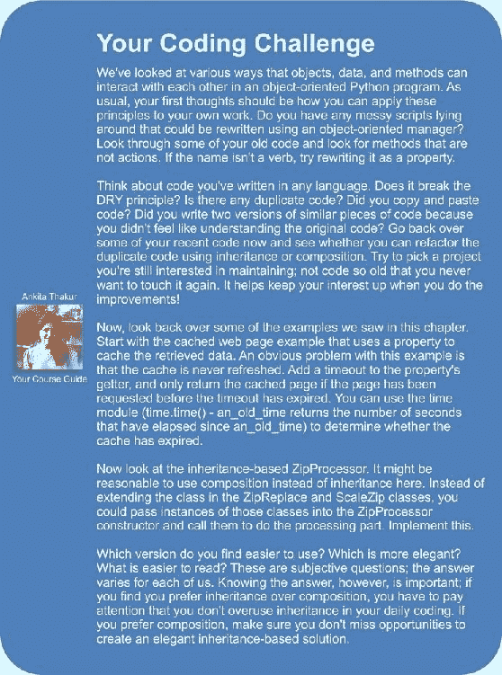

# 第 6 章。何时使用面向对象的编程

在前面的章节中，我们介绍了面向对象编程的许多定义功能。 现在，我们了解了面向对象设计的原理和范例，并且介绍了 Python 中面向对象编程的语法。

但是，我们并不确切地知道如何以及何时在实践中利用这些原理和语法。 在本章中，我们将讨论所获得知识的一些有用应用，并逐步提出一些新主题：

*   如何识别物体
*   数据和行为，再一次
*   使用属性将数据包装为行为
*   使用行为限制数据
*   不要重复自己的原则
*   识别重复的代码

# 将对象视为对象

这似乎很明显。 通常，应该在问题域中为单独的对象提供代码中的特殊类。 在前几章的案例研究中，我们已经看到了这样的例子。 首先，我们确定问题中的对象，然后对它们的数据和行为进行建模。

在面向对象的分析和编程中，识别对象是一项非常重要的任务。 但这并不总是像我们一直在做的那样简单地在短段中计算名词一样容易。 记住，对象是既具有数据又具有行为的事物。 如果仅处理数据，通常最好将其存储在列表，集合，字典或其他 Python 数据结构中（我们将在[第 6 章](07.html "Chapter 7. Python Data Structures")和*中进行全面介绍 Python 数据结构*）。 另一方面，如果我们仅处理行为，而不处理存储的数据，则更简单的功能是更合适的。

但是，对象既具有数据又具有行为。 精通 Python 的程序员使用内置的数据结构，除非（或直到）显然需要定义一个类。 如果没有帮助组织我们的代码，则没有理由添加额外的抽象级别。 另一方面，“显而易见的”需求并不总是不言而喻的。

我们通常可以通过将数据存储在几个变量中来启动 Python 程序。 随着程序的扩展，我们以后会发现我们正在将相同的一组相关变量传递给一组函数。 现在是时候考虑将变量和函数都分组到一个类中了。 如果我们要设计一个在二维空间中对多边形建模的程序，则可以从将每个多边形表示为点列表开始。 这些点将被建模为两个元组（ *x*，*y* ），以描述该点的位置。 这是所有数据，存储在一组嵌套数据结构（特别是元组列表）中：

```py
square = [(1,1), (1,2), (2,2), (2,1)]
```

现在，如果我们要计算多边形周围的距离，我们只需要对两点之间的距离求和即可。 为此，我们还需要一个函数来计算两点之间的距离。 这是两个这样的功能：

```py
import math

def distance(p1, p2):
    return math.sqrt((p1[0]-p2[0])**2 + (p1[1]-p2[1])**2)

def perimeter(polygon):
    perimeter = 0
    points = polygon + [polygon[0]]
    for i in range(len(polygon)):
        perimeter += distance(points[i], points[i+1])
    return perimeter
```

现在，作为面向对象的程序员，我们清楚地认识到`polygon`类可以封装点列表（数据）和`perimeter`函数（行为）。 此外，`point`类（例如我们在[第 2 章](03.html "Chapter 3. Objects in Python")，Python 中的*对象中定义的）可能封装了`x`和`y`坐标以及`distance`方法。 问题是：这样做有价值吗？*

对于先前的代码，也许是，也许不是。 凭借我们在面向对象原理方面的最新经验，我们可以在记录时间内编写一个面向对象的版本。 让我们比较一下

```py
import math

class Point:
 def __init__(self, x, y):
 self.x = x
 self.y = y

    def distance(self, p2):
        return math.sqrt((self.x-p2.x)**2 + (self.y-p2.y)**2)

class Polygon:
 def __init__(self):
 self.vertices = []

 def add_point(self, point):
 self.vertices.append((point))

    def perimeter(self):
        perimeter = 0
        points = self.vertices + [self.vertices[0]]
        for i in range(len(self.vertices)):
            perimeter += points[i].distance(points[i+1])
        return perimeter
```

从突出显示的部分可以看出，这里的代码是早期版本的两倍，尽管我们可以认为`add_point`方法不是严格必需的。

现在，为了更好地理解这些差异，让我们比较两个使用中的 API。 以下是使用面向对象的代码计算正方形的周长的方法：

```py
>>> square = Polygon()
>>> square.add_point(Point(1,1))
>>> square.add_point(Point(1,2))
>>> square.add_point(Point(2,2))
>>> square.add_point(Point(2,1))
>>> square.perimeter()
4.0

```

您可能会认为这相当简洁且易于阅读，但让我们将其与基于函数的代码进行比较：

```py
>>> square = [(1,1), (1,2), (2,2), (2,1)]
>>> perimeter(square)
4.0

```

嗯，也许面向对象的 API 并不是那么紧凑！ 就是说，我认为*比*更容易读懂函数示例：我们如何知道第二个版本中的元组列表应该代表什么？ 我们应该如何记住应该传递给`perimeter`函数的哪种对象（两个元组的列表？这不直观！）？ 我们将需要大量文档来解释如何使用这些功能。

相反，面向对象的代码是相对自记录的，我们只需要查看方法及其参数的列表即可了解对象的功能以及如何使用它。 到我们编写功能版本的所有文档时，它可能比面向对象的代码还要长。

最后，代码长度不是代码复杂度的良好指标。 一些程序员迷上了复杂的“单一代码”，它们在一行代码中完成了大量工作。 这可能是一个有趣的练习，但是结果通常是难以理解的，即使是第二天的原始作者也是如此。 减少代码量通常可以使程序更易于阅读，但不要盲目地认为是这种情况。

幸运的是，这种折衷是不必要的。 我们可以使面向对象的`Polygon` API 与功能实现一样易于使用。 我们要做的就是更改`Polygon`类，以便可以用多个点构造它。 让我们给它一个初始化器，它接受`Point`对象的列表。 实际上，让我们也允许它接受元组，如果需要，我们可以自己构造`Point`对象：

```py
    def __init__(self, points=None):
        points = points if points else []
        self.vertices = []
        for point in points:
            if isinstance(point, tuple):
                point = Point(*point)
            self.vertices.append(point)
```

该初始化程序将遍历列表，并确保将任何元组都转换为点。 如果该对象不是元组，则假定它已经是`Point`对象，或者可以充当`Point`对象的未知鸭子类型对象，则将其保留不变。

但是，此代码的面向对象版本和面向数据版本之间并没有明显的赢家。 他们俩都做同样的事情。 如果我们有接受多边形参数的新函数，例如`area(polygon)`或`point_in_polygon(polygon, x, y)`，则面向对象代码的好处将变得越来越明显。 同样，如果将其他属性（例如`color`或`texture`）添加到多边形，则将数据封装到单个类中变得越来越有意义。

区别是一项设计决策，但通常，一组数据越复杂，它具有针对该数据的多个功能的可能性就越大，并且使用具有属性和 方法代替。

在做出此决定时，还需要考虑如何使用该类。 如果我们只是试图在一个更大的问题的背景下计算一个多边形的周长，那么使用一个函数可能会最快地编写代码，并且更容易使用“仅一次”。 另一方面，如果我们的程序需要以多种方式操纵多个多边形（计算周长，面积，与其他多边形的相交，移动或缩放等），则我们肯定可以确定一个对象。 需要非常通用的一种。

此外，请注意对象之间的交互。 寻找继承关系； 没有类就无法优雅地进行继承建模，因此请确保使用它们。 寻找我们在[第 1 章](02.html "Chapter 2. Object-oriented Design")，*面向对象设计*，关联和组合中讨论的其他类型的关系。 从技术上讲，可以仅使用数据结构对构成进行建模； 例如，我们可以有一个保存元组值的字典列表，但是创建一些对象类通常不那么复杂，尤其是当存在与数据相关联的行为时。

### 注意

不要仅仅因为可以使用一个对象而急于使用一个对象，但是当需要使用一个类时，*绝不会忽略*创建一个类。

# 为具有属性的类数据添加行为

在整个模块中，我们一直专注于行为和数据的分离。 这在面向对象的编程中非常重要，但是我们将看到，在 Python 中，这种区别可能会变得非常模糊。 Python 非常擅长模糊区分。 它并不能完全帮助我们“跳出框框思考”。 相反，它教会我们停止思考盒子。

在深入探讨细节之前，让我们讨论一些糟糕的面向对象理论。 许多面向对象的语言（Java 最臭名昭著）告诉我们永远不要直接访问属性。 他们坚持要求我们这样写属性访问：

```py
class Color:
    def __init__(self, rgb_value, name):
        self._rgb_value = rgb_value
        self._name = name

    def set_name(self, name):
        self._name = name

    def get_name(self):
        return self._name
```

变量前面带有下划线，表示它们是私有的（其他语言实际上会强制它们私有）。 然后，get 和 set 方法提供对每个变量的访问。 该类将在实践中如下使用：

```py
>>> c = Color("#ff0000", "bright red")
>>> c.get_name()
'bright red'
>>> c.set_name("red")
>>> c.get_name()
'red'

```

它不像 Python 支持的直接访问版本那样可读：

```py
class Color:
    def __init__(self, rgb_value, name):
        self.rgb_value = rgb_value
        self.name = name

c = Color("#ff0000", "bright red")
print(c.name)
c.name = "red"
```

那么，为什么有人会坚持基于方法的语法呢？ 他们的理由是，有一天我们可能想在设置或检索值时添加额外的代码。 例如，我们可以决定缓存一个值并返回缓存的值，或者我们可能想验证该值是否是合适的输入。

在代码中，我们可以决定更改`set_name()`方法，如下所示：

```py
def set_name(self, name):
    if not name:
        raise Exception("Invalid Name")
    self._name = name
```

现在，在 Java 和类似语言中，如果我们编写了原始代码来进行直接属性访问，然后又将其更改为类似于上一个方法，则我们将遇到一个问题：任何编写过以下代码的人 直接访问属性现在将必须访问该方法。 如果他们没有将访问样式从属性访问更改为函数调用，则其代码将被破坏。 这些语言的口头禅是，我们绝不应将公共成员设为私人。 在 Python 中这没有多大意义，因为没有任何真正的私有成员概念！

Python 为我们提供了`property`关键字，以使方法看起来像属性。 因此，我们可以编写代码以使用直接成员访问，并且如果我们意外地需要更改实现以在获取或设置该属性的值时进行一些计算，则可以在不更改接口的情况下进行操作。 让我们看看它的外观：

```py
class Color:
    def __init__(self, rgb_value, name):
        self.rgb_value = rgb_value
        self._name = name

    def _set_name(self, name):
        if not name:
            raise Exception("Invalid Name")
        self._name = name

    def _get_name(self):
        return self._name

 name = property(_get_name, _set_name)

```

如果我们从较早的基于非方法的类开始，该类直接设置了`name`属性，则我们以后可以将代码更改为类似于前面的代码。 我们首先将`name`属性更改为（半）私有`_name`属性。 然后，我们再添加两个（半）私有方法来获取并设置该变量，并在设置变量时进行验证。

最后，我们在底部有`property`声明。 这是魔术。 它在`Color`类上创建了一个名为`name`的新属性，该属性现在替换了先前的`name`属性。 它将这个属性设置为一个属性，只要访问或更改属性，它就会调用我们刚刚创建的两个方法。 可以使用与先前版本完全相同的方式来使用`Color`类的新版本，但是现在我们在设置`name`属性时可以进行验证：

```py
>>> c = Color("#0000ff", "bright red")
>>> print(c.name)
bright red
>>> c.name = "red"
>>> print(c.name)
red
>>> c.name = ""
Traceback (most recent call last):
 File "<stdin>", line 1, in <module>
 File "setting_name_property.py", line 8, in _set_name
 raise Exception("Invalid Name")
Exception: Invalid Name

```

因此，如果我们先前编写了代码来访问`name`属性，然后将其更改为使用我们的`property`对象，则除非发送空的`property`值，否则先前的代码仍然可以使用。 我们首先要禁止的行为。 成功！

请记住，即使使用`name`属性，以前的代码也不是 100％安全的。 人们仍然可以直接访问`_name`属性，并根据需要将其设置为空字符串。 但是，如果他们访问一个变量，我们已经在其中明确标记了下划线以表明该变量是私有的，那么他们就是那些必须处理后果的人，而不是我们。

## 详细属性

将`property`函数视为返回一个对象，该对象可以通过我们指定的方法代理任何设置或访问属性值的请求。 `property`关键字类似于此类对象的构造函数，并且该对象设置为给定属性的面向公众的成员。

该 `property`构造函数实际上可以接受两个附加参数，即删除函数和该属性的文档字符串。 实际上，`delete`函数很少提供，但对于记录已删除的值或在我们有理由这样做时可以否决删除的记录很有用。 docstring 只是描述属性作用的字符串，与我们在[第 2 章](03.html "Chapter 3. Objects in Python")和 *Python* 中的对象中讨论的 docstring 相同。 如果我们不提供此参数，则将从第一个参数的文档字符串中复制文档字符串：getter 方法。 这是一个愚蠢的示例，仅在任何方法被调用时简单声明：

```py
class Silly:
    def _get_silly(self):
        print("You are getting silly")
        return self._silly
    def _set_silly(self, value):
        print("You are making silly {}".format(value))
        self._silly = value
    def _del_silly(self):
        print("Whoah, you killed silly!")
        del self._silly

    silly = property(_get_silly, _set_silly,
            _del_silly, "This is a silly property")
```

如果我们实际使用此类，则当我们要求时，它确实会打印出正确的字符串：

```py
>>> s = Silly()
>>> s.silly = "funny"
You are making silly funny
>>> s.silly
You are getting silly
'funny'
>>> del s.silly
Whoah, you killed silly!

```

此外，如果我们查看`Silly`类的帮助文件（通过在解释器提示符处发出`help(silly)`），它将为我们显示`silly`属性的自定义文档字符串：

```py
Help on class Silly in module __main__:

class Silly(builtins.object)
 |  Data descriptors defined here:
 |  
 |  __dict__
 |      dictionary for instance variables (if defined)
 |  
 |  __weakref__
 |      list of weak references to the object (if defined)
 |  
 |  silly
 |      This is a silly property
```

再一次，一切都按我们的计划进行。 实际上，通常只使用前两个参数来定义属性：getter 和 setter 函数。 如果要为属性提供文档字符串，可以在 getter 函数上定义它； 属性代理会将其复制到自己的文档字符串中。 删除功能通常留空，因为对象属性很少被删除。 如果编码人员确实尝试删除未指定删除功能的属性，则会引发异常。 因此，如果有正当理由删除我们的财产，我们应该提供该功能。

## 装饰器–创建属性的另一种方法

如果您以前从未使用过 Python 装饰器，那么在[第 10 章](11.html "Chapter 11. Python Design Patterns I")和 *Python 设计模式 I 中讨论装饰器模式之后，您可能希望跳过本节并返回。*。 但是，您无需了解使用装饰器语法使属性方法更具可读性的情况。

属性函数可以与装饰器语法一起使用，以将 get 函数转换为属性：

```py
class Foo:
    @property
    def foo(self):
        return "bar"
```

这将`property`函数用作装饰器，并且等效于先前的`foo = property(foo)`语法。 从可读性的角度来看，主要区别在于我们可以将`foo`函数标记为方法顶部的属性，而不是在定义之后将其容易忽略的属性。 这也意味着我们不必仅使用下划线前缀创建私有方法来定义属性。

更进一步，我们可以为新属性指定一个 setter 函数，如下所示：

```py
class Foo:
    @property
    def foo(self):
        return self._foo

    @foo.setter
    def foo(self, value):
        self._foo = value
```

尽管意图很明显，但此语法看起来很奇怪。 首先，我们将`foo`方法修饰为吸气剂。 然后，通过应用最初装饰的`foo`方法的`setter`属性，装饰具有完全相同名称的第二种方法！ `property`函数返回一个对象； 该对象始终带有自己的`setter`属性，然后可以将其用作装饰器以使用其他功能。 不需要为 get 和 set 方法使用相同的名称，但这确实有助于将访问一个属性的多个方法组合在一起。

我们还可以使用`@foo.deleter`指定删除功能。 我们无法使用`property`装饰器指定文档字符串，因此我们需要依赖于从初始 getter 方法复制文档字符串的属性。

这是我们先前的`Silly`类，重写为使用`property`作为装饰器：

```py
class Silly:
    @property
    def silly(self):
        "This is a silly property"
        print("You are getting silly")
        return self._silly

    @silly.setter
    def silly(self, value):
        print("You are making silly {}".format(value))
        self._silly = value

    @silly.deleter
    def silly(self):
        print("Whoah, you killed silly!")
        del self._silly
```

此类的操作*与我们的早期版本完全相同*，包括帮助文本。 您可以使用任何感觉更易读和优雅的语法。

## 决定何时使用属性

内置的属性使行为和数据之间的划分变得模糊不清，从而使您难以选择哪个。 我们前面看到的示例用例是属性的最常见用法之一。 我们在某个类上有一些数据，稍后我们要向其添加行为。 在决定使用物业时，还需要考虑其他因素。

从技术上讲，在 Python 中，数据，属性和方法都是类的属性。 方法是可调用的这一事实并未将其与其他类型的属性区分开； 确实，我们将在[第 7 章](08.html "Chapter 8. Python Object-oriented Shortcuts")和 *Python 面向对象的快捷方式*中看到，可以创建可以像函数一样调用的普通对象。 我们还将发现函数和方法本身就是普通的对象。

方法只是可调用的属性，而属性只是可定制的属性，这一事实可以帮助我们做出此决定。 方法通常应代表行动； 可以对对象执行或由对象执行的事情。 当调用一个方法时，即使只有一个参数，它也应该*做*。 方法名称通常是动词。

确认属性不是动作后，我们需要在标准数据属性和属性之间做出决定。 通常，请始终使用标准属性，直到您需要以某种方式控制对该属性的访问。 无论哪种情况，您的属性通常都是一个名词。 属性和属性之间的唯一区别是，当检索，设置或删除属性时，我们可以自动调用自定义操作。

让我们看一个更现实的例子。 自定义行为的常见需求是缓存一个难以计算或查找成本很高的值（例如，需要网络请求或数据库查询）。 目标是将值存储在本地，以避免重复调用昂贵的计算。

我们可以通过在属性上使用自定义 getter 来做到这一点。 第一次检索该值时，我们执行查找或计算。 然后，我们可以将值作为对象的私有属性在本地缓存（或在专用缓存软件中），并且下次请求该值时，我们将返回存储的数据。 这是我们缓存网页的方法：

```py
from urllib.request import urlopen

class WebPage:
    def __init__(self, url):
        self.url = url
        self._content = None

    @property
    def content(self):
        if not self._content:
            print("Retrieving New Page...")
            self._content = urlopen(self.url).read()
        return self._content
```

我们可以测试此代码以查看页面仅被检索一次：

```py
>>> import time
>>> webpage = WebPage("http://ccphillips.net/")
>>> now = time.time()
>>> content1 = webpage.content
Retrieving New Page...
>>> time.time() - now
22.43316888809204
>>> now = time.time()
>>> content2 = webpage.content
>>> time.time() - now
1.9266459941864014
>>> content2 == content1
True

```

最初测试此代码时，我处于糟糕的卫星连接中，并且第一次加载内容时花了 20 秒。 第二次，我在 2 秒内得到了结果（这实际上只是将行输入到解释器中所花费的时间）。

自定义获取器对于基于其他对象属性需要动态计算的属性也很有用。 例如，我们可能要计算整数列表的平均值：

```py
class AverageList(list):
    @property
    def average(self):
        return sum(self) / len(self)
```

这个非常简单的类继承自`list`，因此我们免费获得类似列表的行为。 我们只向类添加一个属性，然后，我们的列表可以具有平均值：

```py
>>> a = AverageList([1,2,3,4])
>>> a.average
2.5

```

当然，我们可以使它成为方法，但是由于方法表示动作，因此应将其命名为`calculate_average()`。 但是称为`average`的属性更合适，既易于键入，又易于阅读。

正如我们已经看到的，自定义设置器对很有用，可用于验证，但是它们也可以用于将值代理到另一个位置。 例如，我们可以在`WebPage`类中添加一个内容设置器，该设置器将自动登录到我们的 Web 服务器并在设置该值时上传一个新页面。

# 管理器对象

我们一直专注于对象及其属性和方法。 现在，我们来看看设计更高级别的对象：管理其他对象的对象的类型。 将所有东西绑在一起的物体。

这些对象与到目前为止我们看到的大多数示例之间的区别在于，我们的示例倾向于代表具体的思想。 管理对象更像是办公室经理。 他们不会在地板上进行实际的“可见”工作，但是如果没有他们，部门之间将无法进行沟通，也没人会知道他们应该做什么（尽管如果组织非常糟糕，无论如何这都是正确的） 管理！）。 类似地，管理类上的属性倾向于引用其他做“可见”工作的对象； 这样一个类的行为会在适当的时候委托给其他类，并在它们之间传递消息。

作为示例，我们将编写一个程序，对存储在压缩 ZIP 文件中的文本文件执行查找和替换操作。 我们需要对象来表示 ZIP 文件和每个单独的文本文件（幸运的是，我们不必编写这些类，它们在 Python 标准库中可用）。 manager 对象将负责确保按顺序执行三个步骤：

1.  解压缩压缩文件。
2.  执行查找和替换操作。
3.  压缩新文件。

该类使用`.zip`文件名初始化，然后搜索并替换字符串。 我们创建一个临时目录来存储解压缩的文件，以便该文件夹保持干净。 Python 3.4 `pathlib`库可帮助处理文件和目录。 我们将在[第 8 章](09.html "Chapter 9. Strings and Serialization")，*字符串和序列化*中了解更多有关该内容的信息，但是在以下示例中，该接口应该非常清楚：

```py
import sys
import shutil
import zipfile
from pathlib import Path

class ZipReplace:
    def __init__(self, filename, search_string, replace_string):
        self.filename = filename
        self.search_string = search_string
        self.replace_string = replace_string
        self.temp_directory = Path("unzipped-{}".format(
                filename))
```

然后，我们为三个步骤中的每个步骤创建一个整体的“经理”方法。 此方法将责任委托给其他方法。 显然，我们可以在一个方法中，甚至在一个脚本中完成所有三个步骤，而无需创建对象。 分离这三个步骤有几个优点：

*   **可读性**：每个步骤的代码均位于一个易于阅读和理解的独立单元中。 方法名称描述了该方法的作用，并且需要较少的其他文档来了解所发生的情况。
*   **可扩展性**：如果子类希望使用压缩的 TAR 文件而不是 ZIP 文件，则它可以覆盖`zip`和`unzip`方法，而不必重复`find_replace`方法。
*   **分区**：外部类可以创建此类的实例，然后直接在某个文件夹上调用`find_replace`方法，而无需`zip`内容。

委托方法是以下代码中的第一个； 为了完整起见，包括了其余方法：

```py
    def zip_find_replace(self):
        self.unzip_files()
        self.find_replace()
        self.zip_files()

    def unzip_files(self):
        self.temp_directory.mkdir()
        with zipfile.ZipFile(self.filename) as zip:
            zip.extractall(str(self.temp_directory))

    def find_replace(self):
        for filename in self.temp_directory.iterdir():
            with filename.open() as file:
                contents = file.read()
            contents = contents.replace(
                    self.search_string, self.replace_string)
            with filename.open("w") as file:
                file.write(contents)

    def zip_files(self):
        with zipfile.ZipFile(self.filename, 'w') as file:
            for filename in self.temp_directory.iterdir():
                file.write(str(filename), filename.name)
        shutil.rmtree(str(self.temp_directory))

if __name__ == "__main__":
    ZipReplace(*sys.argv[1:4]).zip_find_replace()
```

为简便起见，稀疏地记录了用于压缩和解压缩文件的代码。 我们目前的重点是面向对象的设计。 如果您对`zipfile`模块的内部细节感兴趣，请在线或通过在交互式解释器中键入`import zipfile ; help(zipfile)`来参考标准库中的文档。 请注意，此示例仅搜索 ZIP 文件中的顶级文件。 如果解压缩后的内容中包含任何文件夹，则将不会对其进行扫描，也不会扫描这些文件夹中的任何文件。

该示例的最后两行允许我们通过传递`zip`文件名，搜索字符串并将替换字符串作为参数来从命令行运行程序：

```py
python zipsearch.py hello.zip hello hi

```

当然，不必从命令行创建该对象。 它可以从另一个模块导入（以执行批处理 ZIP 文件），也可以作为 GUI 界面的一部分访问，甚至可以作为更高级的管理对象来访问，该对象知道从何处获取 ZIP 文件（例如，从 FTP 服务器或 将它们备份到外部磁盘）。

随着程序变得越来越复杂，被建模的对象越来越像物理对象。 属性是其他抽象对象，方法是更改​​这些抽象对象状态的动作。 但是，无论多么复杂，每个对象的核心都是一组具体的属性和定义明确的行为。

## 删除重复的代码

通常，诸如`ZipReplace`之类的管理样式类中的代码都是非常通用的，可以通过多种方式应用。 可以使用组合或继承来帮助将此代码保存在一个地方，从而消除重复的代码。 在查看任何此类示例之前，我们先讨论一些理论。 具体来说，为什么重复代码是一件坏事？

有多种原因，但是它们全都归结为可读性和可维护性。 当我们编写与以前的代码相似的新代码时，最简单的操作是复制旧代码并更改需要更改的内容（变量名，逻辑，注释）以使其在新代码中起作用 地点。 或者，如果我们正在编写看起来与项目中其他地方的代码相似但不相同的新代码，则通常更容易编写具有类似行为的新代码，而不是弄清楚如何提取重叠的功能。

但是，一旦有人必须阅读并理解代码，并且遇到重复的块，就会面临困境。 必须突然理解可能有意义的代码。 一个部分与另一个部分有何不同？ 它们如何相同？ 在什么条件下称为一节？ 我们什么时候打给对方？ 您可能会争辩说，您是唯一阅读代码的人，但是如果您八个月不接触该代码，对于您来说，就像对新编码员一样，您将难以理解。 当我们尝试阅读两个相似的代码片段时，我们必须了解它们为什么不同，以及它们如何不同。 这浪费了读者的时间。 代码应始终被编写为可读性强。

### 注意

我曾经不得不尝试理解某人的代码，这些代码具有相同的 300 行非常糟糕的代码的三个完全相同的副本。 在我终于理解这三个“相同”版本实际上执行稍有不同的税收计算之前，我已经使用了一个月的代码。 某些细微的差异是有意为之的，但在某些明显的领域中，某人已在一个函数中更新了计算而未更新其他两个函数。 无法计算代码中微妙的，难以理解的错误的数量。 我最终将所有 900 行替换为 20 行左右的易于阅读的功能。

读取这样的重复代码可能会很麻烦，但是代码维护更加痛苦。 如前所述，将两个相似的代码保持最新可能是一场噩梦。 我们必须记住每当更新两个部分时都要更新两个部分，并且必须记住多个部分的不同之处，以便在编辑每个部分时可以修改更改。 如果我们忘记更新这两个部分，最终将导致极其烦人的错误，这些错误通常会表现为：“但是我已经解决了这一问题，为什么它仍然会发生？”

结果是，与我们最初以非重复的方式编写代码相比，正在阅读或维护我们的代码的人们必须花费大量的时间来理解和测试它。 当我们进行维护时，这更加令人沮丧。 我们发现自己在说：“为什么我第一次没有这样做呢？” 通过复制粘贴现有代码节省的时间在我们第一次维护它时就丢失了。 与被编写的代码相比，代码被读取和修改的次数更多，并且更改的频率也更高。 易懂的代码应始终至关重要。

这就是为什么程序员，尤其是 Python 程序员（倾向于重视优雅代码而不是平均水平）遵循**不要重复自己**（**DRY**）原理的原因。 DRY 代码是可维护的代码。 我对初学者的建议是不要使用其编辑器的复制和粘贴功能。 对于中级程序员，我建议他们在按 *Ctrl* + *C* 之前，应该考虑三次。

但是我们应该做什么而不是代码重复呢？ 最简单的解决方案通常是将代码移到接受参数的函数中，以说明各个部分是否不同。 这不是一个非常面向对象的解决方案，但是它通常是最佳的。

例如，如果我们有两段代码将一个 ZIP 文件解压缩到两个不同的目录中，那么我们可以轻松地编写一个函数，该函数接受应该将其解压缩到的目录的参数。 这可能会使函数本身更难以阅读，但是一个好的函数名和文档字符串可以轻松地弥补这一点，并且调用该函数的任何代码都将更易于阅读。

这当然够理论了！ 这个故事的寓意是：始终努力将代码重构为易于阅读，而不是编写仅易于编写的不良代码。

## 实践中

让我们探索两种可以重用现有代码的方式。 在写完代码以替换包含文本文件的 ZIP 文件中的字符串后，我们后来签订了将 ZIP 文件中的所有图像缩放到 640 x 480 的合同。看起来我们可以使用与`ZipReplace`。 第一个冲动可能是保存该文件的副本，然后将`find_replace`方法更改为`scale_image`或类似的方法。

但是，那太酷了。 如果有一天我们想更改`unzip`和`zip`方法以也打开 TAR 文件怎么办？ 也许我们想为临时文件使用一个保证唯一的目录名。 无论哪种情况，我们都必须在两个不同的地方进行更改！

我们将首先说明该问题的基于继承的解决方案。 首先，我们将我们的原始`ZipReplace`类修改为用于处理常规 ZIP 文件的超类：

```py
import os
import shutil
import zipfile
from pathlib import Path

class ZipProcessor:
    def __init__(self, zipname):
        self.zipname = zipname
        self.temp_directory = Path("unzipped-{}".format(
                zipname[:-4]))

    def process_zip(self):
        self.unzip_files()
        self.process_files()
        self.zip_files()

    def unzip_files(self):
        self.temp_directory.mkdir()
        with zipfile.ZipFile(self.zipname) as zip:
            zip.extractall(str(self.temp_directory))

    def zip_files(self):
        with zipfile.ZipFile(self.zipname, 'w') as file:
            for filename in self.temp_directory.iterdir():
                file.write(str(filename), filename.name)
        shutil.rmtree(str(self.temp_directory))
```

我们将的`filename`属性更改为`zipname`，以避免与各种方法中的`filename`局部变量混淆。 即使实际上不是设计更改，这也有助于使代码更具可读性。

我们还将`ZipReplace`特有的两个参数分别丢给了`__init__`（`search_string`和`replace_string`）。 然后，我们将`zip_find_replace`方法重命名为`process_zip`，并使其（尚未定义）称为`process_files`方法而不是`find_replace`； 这些名称的更改有助于证明我们新班级的更普遍的性质。 注意，我们已经完全删除了`find_replace`方法； 该代码特定于`ZipReplace`，在这里没有业务。

这个新的`ZipProcessor`类实际上没有定义`process_files`方法； 因此，如果我们直接运行它，它将引发异常。 因为它不打算直接运行，所以我们删除了原始脚本底部的 main 调用。

现在，在继续进行图像处理应用程序之前，让我们修复原始的`zipsearch`类以使用此父类：

```py
from zip_processor import ZipProcessor
import sys
import os

class ZipReplace(ZipProcessor):
    def __init__(self, filename, search_string,
            replace_string):
        super().__init__(filename)
        self.search_string = search_string
        self.replace_string = replace_string

    def process_files(self):
        '''perform a search and replace on all files in the
        temporary directory'''
        for filename in self.temp_directory.iterdir():
            with filename.open() as file:
                contents = file.read()
            contents = contents.replace(
                    self.search_string, self.replace_string)
            with filename.open("w") as file:
                file.write(contents)

if __name__ == "__main__":
    ZipReplace(*sys.argv[1:4]).process_zip()
```

该代码比原始版本短，因为它从父类继承了其 ZIP 处理功能。 我们首先导入刚刚编写的基类，然后使`ZipReplace`扩展该类。 然后，我们使用`super()`初始化父类。 `find_replace`方法仍然在这里，但是我们将其重命名为`process_files`，以便父类可以从其管理界面调用它。 由于此名称不像旧名称那样具有描述性，因此我们添加了一个文档字符串来描述其功能。

现在，考虑到我们现在所拥有的只是一个功能上与我们开始时没有区别的程序，这是相当多的工作！ 但是完成这项工作后，现在我们可以轻松编写在 ZIP 存档中的文件上运行的其他类，例如（假设要求的）照片缩放器。 此外，如果我们想改善或错误修复 zip 功能，我们可以通过仅更改一个`ZipProcessor`基类来对所有类都做到这一点。 维护将更加有效。

看看现在创建利用`ZipProcessor`功能的照片缩放类非常简单。 （注意：此类需要第三方`pillow`库来获取`PIL`模块。您可以使用`pip install pillow`安装它。）

```py
from zip_processor import ZipProcessor
import sys
from PIL import Image

class ScaleZip(ZipProcessor):

    def process_files(self):
        '''Scale each image in the directory to 640x480'''
        for filename in self.temp_directory.iterdir():
            im = Image.open(str(filename))
            scaled = im.resize((640, 480))
            scaled.save(str(filename))

if __name__ == "__main__":
    ScaleZip(*sys.argv[1:4]).process_zip()
```

看看这个课程有多简单！ 我们之前所做的所有工作都得到了回报。 我们要做的就是打开每个文件（假设它是一个图像；如果无法打开文件，它将毫无意外地崩溃），缩放它并保存回去。 `ZipProcessor`类负责压缩和解压缩，而无需我们做任何额外的工作。

# 案例研究

对于本案例，我们将尝试进一步探讨以下问题：“何时选择对象还是内置类型？” 我们将为可能在文本编辑器或文字处理器中使用的`Document`类建模。 它应该具有哪些对象，功能或属性？

我们可能从`Document`内容的`str`开始，但是在 Python 中，字符串是不可变的（可以更改）。 一旦定义了`str`，它将永远存在。 如果不创建全新的字符串对象，则无法在其中插入或删除字符。 那会留下很多`str`对象占用内存，直到 Python 的垃圾收集器认为适合清除我们的内存为止。

因此，我们将使用一个字符列表，而不是字符串，可以随意对其进行修改。 另外，`Document`类将需要知道列表中的当前光标位置，并且可能还应该存储文档的文件名。

### 注意

实际文本编辑器使用称为`rope`的基于二叉树的数据结构来建模其文档内容。 该模块的标题不是“高级数据结构”，因此，如果您想了解更多有关此有趣主题的信息，则可能需要在网上搜索绳索数据结构。

现在，它应该有什么方法？ 我们可能想对文本文档做很多事情，包括插入，删除和选择字符，剪切，复制，粘贴，选择以及保存或关闭文档。 看起来数据和行为都很多，因此将所有这些内容放入自己的`Document`类是有意义的。

一个相关的问题是：此类是否应该由一堆基本的 Python 对象组成，例如`str`文件名，`int`光标位置和`list`字符？ 还是其中的某些或全部本身就是专门定义的对象？ 个别的线条和字符呢，他们需要自己的类吗？

我们将在回答这些问题的同时，首先让我们从最简单的`Document`类开始，然后看看它可以做什么：

```py
class Document:
    def __init__(self):
        self.characters = []
        self.cursor = 0
        self.filename = ''

    def insert(self, character):
        self.characters.insert(self.cursor, character)
        self.cursor += 1

    def delete(self):
        del self.characters[self.cursor]

    def save(self):
        with open(self.filename, 'w') as f:
            f.write(''.join(self.characters))

    def forward(self):
        self.cursor += 1

    def back(self):
        self.cursor -= 1
```

这个简单的类使我们可以完全控制编辑基本文档。 看一下它的作用：

```py
>>> doc = Document()
>>> doc.filename = "test_document"
>>> doc.insert('h')
>>> doc.insert('e')
>>> doc.insert('l')
>>> doc.insert('l')
>>> doc.insert('o')
>>> "".join(doc.characters)
'hello'
>>> doc.back()
>>> doc.delete()
>>> doc.insert('p')
>>> "".join(doc.characters)
'hellp'

```

看起来正在运作。 我们可以将键盘的字母和箭头键连接到这些方法，并且文档可以很好地跟踪所有内容。

但是，如果我们不仅要连接箭头键，该怎么办。 如果我们也想连接 *Home* 和 *End* 键，该怎么办？ 我们可以向`Document`类添加更多方法来向前或向后搜索字符串中的换行符（在 Python 中为换行符，或`\n`代表一行的末尾和新行的开头），然后跳转 给他们，但是如果我们针对所有可能的移动动作（逐字移动，逐句移动，*向上翻页*，*向下翻页*，行尾，空格开头等等）进行操作 ），该课程将非常庞大。 将这些方法放在单独的对象上也许会更好。 因此，让我们将 cursor 属性变成一个知道其位置并可以操纵该位置的对象。 我们可以将前进和后退方法移至该类，并为 *Home* 和 *End* 键添加更多：

```py
class Cursor:
    def __init__(self, document):
        self.document = document
        self.position = 0

    def forward(self):
        self.position += 1

    def back(self):
        self.position -= 1

    def home(self):
        while self.document.characters[
                self.position-1] != '\n':
            self.position -= 1
            if self.position == 0:
                # Got to beginning of file before newline
                break

    def end(self):
        while self.position < len(self.document.characters
                ) and self.document.characters[
                    self.position] != '\n':
            self.position += 1
```

此类将文档作为初始化参数，因此这些方法可以访问文档字符列表的内容。 然后，它提供了简单的方法来像以前一样向前和向后移动，以及移动到`home`和`end`位置。

### 注意

此代码不是很安全。 您可以轻松地移至结束位置，如果尝试返回一个空文件，它将崩溃。 这些示例简短易读，但并不代表防御性！ 您可以通过练习来改进此代码的错误检查。 这可能是扩展您的异常处理技能的绝佳机会。

`Document`类本身几乎没有更改，除了删除了移到`Cursor`类的两个方法：

```py
class Document:
    def __init__(self):
        self.characters = []
        self.cursor = Cursor(self)
        self.filename = ''

       def insert(self, character):
        self.characters.insert(self.cursor.position,
                character)
        self.cursor.forward()

    def delete(self):
        del self.characters[self.cursor.position]

    def save(self):
        f = open(self.filename, 'w')
        f.write(''.join(self.characters))
        f.close()
```

我们只是将访问旧游标整数的所有内容更新为使用新对象。 我们可以测试`home`方法是否真的移至换行符：

```py
>>> d = Document()
>>> d.insert('h')
>>> d.insert('e')
>>> d.insert('l')
>>> d.insert('l')
>>> d.insert('o')
>>> d.insert('\n')
>>> d.insert('w')
>>> d.insert('o')
>>> d.insert('r')
>>> d.insert('l')
>>> d.insert('d')
>>> d.cursor.home()
>>> d.insert("*")
>>> print("".join(d.characters))
hello
*world

```

现在，由于经常使用该字符串`join`函数（以连接字符，以便我们可以看到实际的文档内容），因此可以向`Document`类添加属性以提供完整的信息 细绳：

```py
    @property
    def string(self):
        return "".join(self.characters)
```

这使我们的测试更加简单：

```py
>>> print(d.string)
hello
world

```

这个框架很简单（尽管可能会很费时！），可以扩展以创建和编辑完整的纯文本文档。 现在，让我们将其扩展为适用于富文本格式； 可以使用**粗体**，带下划线或*斜体*字符的文本。

我们可以通过两种方式处理此问题； 第一种是将“伪”字符插入我们的字符列表中，这些字符的行为类似于指令，例如“粗体字符，直到找到停止的粗体字符”。 第二种是向每个字符添加信息，以指示其应采用的格式。 尽管前一种方法可能更常见，但我们将实现后一种解决方案。 为此，我们显然需要一个字符类。 此类将具有表示字符的属性，以及三个表示粗体，斜体或带下划线的布尔属性。

嗯，等等！ 这个`Character`类将具有任何方法吗？ 如果没有，也许我们应该使用许多 Python 数据结构之一； 一个元组或命名元组可能就足够了。 我们要对角色执行或对角色调用任何动作吗？

好吧，很明显，我们可能想对字符进行处理，例如删除或复制它们，但是这些是需要在`Document`级别处理的事情，因为它们实际上是在修改字符列表。 是否需要对单个角色执行某些操作？

实际上，现在我们正在考虑`Character`类实际上是什么...这是什么？ 可以肯定地说`Character`类是字符串吗？ 也许我们应该在这里使用继承关系？ 然后，我们可以利用`str`实例随附的众多方法。

我们在谈论什么样的方法？ 有`startswith`，`strip`，`find`和`lower`等。 这些方法中的大多数都希望对包含多个字符的字符串起作用。 相反，如果`Character`是`str`的子类，那么如果提供了多字符字符串，我们最好重写`__init__`以引发异常。 因为我们免费获得的所有这些方法实际上都不会应用于我们的`Character`类，所以毕竟我们似乎不需要使用继承。

这使我们回到了最初的问题； `Character`应该是一类吗？ `object`类上有一个非常重要的特殊方法，我们可以利用它来表示字符。 此方法称为`__str__`（两个下划线，如`__init_` _），用于诸如`print`和`str`构造函数之类的字符串操作函数中，可将任何类转换为字符串。 默认实现会执行一些无聊的工作，例如在内存中打印模块和类的名称及其地址。 但是，如果我们覆盖它，我们可以使它打印出我们喜欢的任何东西。 在我们的实现中，我们可以使用特殊字符作为前缀字符，以表示它们是粗体，斜体还是带下划线。 因此，我们将创建一个表示字符的类，这里是：

```py
class Character:
    def __init__(self, character,
            bold=False, italic=False, underline=False):
        assert len(character) == 1
        self.character = character
        self.bold = bold
        self.italic = italic
        self.underline = underline

    def __str__(self):
        bold = "*" if self.bold else ''
        italic = "/" if self.italic else ''
        underline = "_" if self.underline else ''
        return bold + italic + underline + self.character
```

此类允许我们创建字符，并在将`str()`功能应用于它们时给它们添加特殊字符前缀。 那里没有什么太令人兴奋的。 我们只需要对`Document`和`Cursor`类进行一些小的修改即可使用该类。 在`Document`类中，我们在`insert`方法的开头添加以下两行：

```py
    def insert(self, character):
        if not hasattr(character, 'character'):
            character = Character(character)
```

这是有点奇怪的代码。 其基本目的是检查传入的字符是`Character`还是`str`。 如果是字符串，则将其包装在`Character`类中，因此列表中的所有对象均为`Character`对象。 但是，使用我们的代码的人很可能想通过鸭子类型使用既不是`Character`也不是字符串的类。 如果对象具有字符属性，则假定它是“ `Character` -like”对象。 但是，如果不是这样，我们假定它是“类似于`str`的对象”，并将其包装在`Character`中。 这有助于程序利用鸭子类型和多态性。 只要对象具有字符属性，就可以在`Document`类中使用它。

例如，如果我们想使用语法突出显示功能来使程序员的编辑器，这种通用检查可能非常有用：我们需要字符上的额外数据，例如字符所属的语法标记类型。 请注意，如果我们进行了大量此类比较，则最好将`Character`作为具有适当`__subclasshook__`的抽象基类来实现，如[第 3 章](04.html "Chapter 4. When Objects Are Alike")，*中所述。 对象相同*。

另外，我们需要修改`Document`的字符串属性以接受新的`Character`值。 我们需要做的就是在加入每个字符之前调用`str()`：

```py
    @property
    def string(self):
 return "".join((str(c) for c in self.characters))

```

此代码使用生成器表达式，我们将在[第 9 章](10.html "Chapter 10. The Iterator Pattern")，*迭代器模式*中进行讨论。 这是对序列中的所有对象执行特定操作的快捷方式。

最后，当我们查看`Character.character`和`end`函数是否匹配换行符时，还需要检查`Character.character`，而不仅仅是我们之前存储的字符串字符：

```py
    def home(self):
        while self.document.characters[
                self.position-1].character != '\n':
            self.position -= 1
            if self.position == 0:
                # Got to beginning of file before newline
                break

    def end(self):
        while self.position < len(
                self.document.characters) and \
                self.document.characters[
                        self.position
                        ].character != '\n':
            self.position += 1
```

这样就完成了字符的格式化。 我们可以对其进行测试以查看它是否有效：

```py
>>> d = Document()
>>> d.insert('h')
>>> d.insert('e')
>>> d.insert(Character('l', bold=True))
>>> d.insert(Character('l', bold=True))
>>> d.insert('o')
>>> d.insert('\n')
>>> d.insert(Character('w', italic=True))
>>> d.insert(Character('o', italic=True))
>>> d.insert(Character('r', underline=True))
>>> d.insert('l')
>>> d.insert('d')
>>> print(d.string)
he*l*lo
/w/o_rld
>>> d.cursor.home()
>>> d.delete()
>>> d.insert('W')
>>> print(d.string)
he*l*lo
W/o_rld
>>> d.characters[0].underline = True
>>> print(d.string)
_he*l*lo
W/o_rld

```

不出所料，每当我们打印字符串时，每个粗体字符前面都会带有`*`字符，每个斜体字符之前带有`/`字符，每个带下划线的字符之前都带有`_`字符。 我们所有的功能似乎都可以正常工作，事实发生后我们可以修改列表中的字符。 我们有一个工作的富文本文档对象，可以将其插入适当的用户界面中，并与用于输入的键盘和用于输出的屏幕挂钩。 自然，我们希望在屏幕上显示真实的粗体，斜体和带下划线的字符，而不是使用`__str__`方法，但这足以满足我们要求的基本测试要求。




