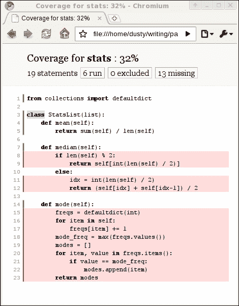
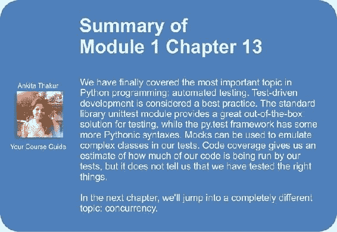

# 十三、测试面向对象的程序

熟练的 Python 程序员同意测试是软件开发最重要的方面之一。 即使本章位于模块的末尾，也不是事后的想法。 到目前为止，我们学习的所有内容都将在编写测试时为我们提供帮助。 我们将研究：

*   单元测试和测试驱动开发的重要性
*   标准`unittest`模块
*   `py.test`自动化测试套件
*   `mock`模块
*   代码覆盖率
*   使用`tox`进行跨平台测试

# 为什么要测试？

大量的程序员已经知道测试他们的代码有多重要。 如果您在其中，请随意浏览本节。 您会在下一节中看到更多令人眼花。乱的内容-我们实际上在其中看到了如何在 Python 中进行测试。 如果您不相信测试的重要性，那么我保证您的代码已损坏，您只是不知道。 继续阅读！

有人认为测试在 Python 代码中更为重要，因为它具有动态特性。 诸如 Java 和 C ++ 之类的编译语言有时被认为是“安全的”，因为它们在编译时会进行类型检查。 但是，Python 测试很少检查类型。 他们正在检查值。 他们要确保在正确的时间设置正确的属性，或确保序列具有正确的长度，顺序和值。 这些更高层次的内容需要使用任何语言进行测试。 Python 程序员比其他语言的程序员进行更多测试的真正原因是，使用 Python 进行测试是如此容易！

但是为什么要测试？ 我们真的需要测试吗？ 如果我们不测试怎么办？ 要回答这些问题，请从头开始编写井字游戏，而无需进行任何测试。 在完全编写之前不要运行它，请开始完成。 如果您将两个玩家都变成了人类玩家（没有人工智能），则井字游戏的实施相当简单。 您甚至不必尝试计算谁是赢家。 现在运行您的程序。 并修复所有错误。 那里有几个？ 我在井字游戏实现中录制了八个，但不确定是否全部抓住了。 你是否？

我们需要测试我们的代码以确保它可以工作。 像我们刚才那样运行程序，并修复错误是测试的一种粗略形式。 Python 程序员能够编写几行代码并运行该程序，以确保这些行符合他们的期望。 但是更改几行代码会影响开发人员未意识到的程序部分，这些部分会受到更改的影响，因此不会对其进行测试。 此外，随着程序的增长，解释器可以通过该代码采用的各种路径也随之增长，并且迅速无法手动测试所有路径。

为了解决这个问题，我们编写了自动化测试。 这些是通过其他程序或程序的一部分自动运行某些输入的程序。 我们可以在几秒钟内运行这些测试程序，并涵盖了比每个程序员每次更改时都认为要测试的输入情况更多的输入情况。

编写测试的主要原因有四个：

*   确保代码按开发人员认为的方式工作
*   为了确保代码在我们进行更改时能够继续工作
*   确保开发人员了解要求
*   为了确保我们正在编写的代码具有可维护的接口

第一点实际上并不能证明编写测试所花的时间。 我们可以直接在交互式解释器中直接测试代码。 但是，当我们必须多次执行相同的测试操作序列时，只需较少的时间就可以自动执行这些步骤，然后在必要时运行它们。 无论何时在初始开发或维护版本中更改代码，最好都运行测试。 当我们拥有一套全面的自动化测试时，我们可以在代码更改后运行它们，并且知道我们没有无意间破坏了所有测试内容。

最后两个点更有趣。 当我们编写代码测试时，它可以帮助我们设计代码所需要的 API，接口或模式。 因此，如果我们误解了需求，编写测试可以帮助突出这种误解。 另一方面，如果我们不确定如何设计一个类，可以编写一个与该类交互的测试，这样我们就可以知道最自然的测试方法。 实际上，在编写要测试的代码之前编写测试通常是有益的。

## 测试驱动的开发

“首先编写测试”是测试驱动开发的口头禅。 测试驱动的开发将“未经测试的代码就是破坏的代码”的概念进一步向前发展，并建议只应对未经编写的代码进行未经测试的测试。 在为该代码编写测试之前，请勿编写任何代码。 因此，第一步是编写一个测试以证明代码可以工作。 显然，由于尚未编写代码，因此测试将失败。 然后编写确保测试通过的代码。 然后为下一段代码编写另一个测试。

测试驱动的开发很有趣。 它使我们可以解决一些难题。 然后，我们实现代码以解决难题。 然后，我们制作了一个更复杂的难题，并编写了解决新难题而又不解决前一个难题的代码。

测试驱动的方法有两个目标。 首先是要确保测试确实得到编写。 在我们编写代码之后，这样非常容易地说：“嗯，它似乎可以工作。我不必为此编写任何测试。这只是一个很小的变化，没有什么坏的。” 如果在编写代码之前已经编写了测试，那么我们将确切知道它的工作时间（因为测试将通过），并且将来我们会知道它是否被我们或其他人所做的更改破坏了 。

其次，编写测试首先迫使我们仔细考虑代码将如何与之交互。 它告诉我们对象需要具有哪些方法以及如何访问属性。 它帮助我们将最初的问题分解为较小的，可测试的问题，然后将经过测试的解决方案重新组合为也经过测试的较大的解决方案。 因此，编写测试可以成为设计过程的一部分。 通常，如果我们正在为新对象编写测试，则会发现设计中的异常迫使我们考虑软件的新方面。

作为一个具体示例，想象一下编写使用对象关系映射器将对象属性存储在数据库中的代码。 在此类对象中通常使用自动分配的数据库 ID。 我们的代码可能出于各种目的使用此 ID。 如果我们正在编写针对此类代码的测试，则在编写之前，我们可能会意识到我们的设计有问题，因为对象只有在将它们保存到数据库后才具有这些 ID。 如果我们想操作一个对象而不将其保存在测试中，则在基于错误前提编写代码之前，它将突出显示此问题。

测试使软件更好。 在我们发布软件之前编写测试可以使最终用户更好地了解或购买有缺陷的版本（我曾在那些依靠“用户可以测试”这一理念而 thr 壮成长的公司工作。这不是一个健康的商业模型！）。 在我们编写软件之前编写测试可以使它在首次编写时变​​得更好。

# 单元测试

让我们从 Python 的内置测试库开始探索。 该库为**单元测试**提供了通用接口。 单元测试专注于测试任何一种测试中可能的最少代码量。 每个测试仅测试可用代码总量的一个单位。

毫不奇怪，为此，Python 库称为`unittest`。 它提供了一些用于创建和运行单元测试的工具，其中最重要的是`TestCase`类。 此类提供了一组方法，使我们可以比较值，设置测试以及在完成后进行清理。

当我们要为特定任务编写一组单元测试时，我们创建`TestCase`的子类，并编写各个方法来进行实际测试。 这些方法都必须以名称`test`开头。 遵循此约定后，测试将作为测试过程的一部分自动运行。 通常，测试会在一个对象上设置一些值，然后运行一个方法，并使用内置的比较方法来确保计算出正确的结果。 这是一个非常简单的示例：

```pypy
import unittest

class CheckNumbers(unittest.TestCase):
    def test_int_float(self):
 self.assertEqual(1, 1.0)

if __name__ == "__main__":
    unittest.main()
```

此代码只是`TestCase`类的子类，并添加了一个调用`TestCase.assertEqual`方法的方法。 此方法将成功还是引发异常，具体取决于两个参数是否相等。 如果运行此代码，则`unittest`中的`main`函数将为我们提供以下输出：

```pypy
.
--------------------------------------------------------------
Ran 1 test in 0.000s

OK

```

您知道浮点数和整数可以相等吗？ 让我们添加一个失败的测试：

```pypy
    def test_str_float(self):
        self.assertEqual(1, "1")
```

此代码的输出更加险恶，因为整数和字符串不视为相等：

```pypy
.F
============================================================
FAIL: test_str_float (__main__.CheckNumbers)
--------------------------------------------------------------
Traceback (most recent call last):
 File "simplest_unittest.py", line 8, in test_str_float
 self.assertEqual(1, "1")
AssertionError: 1 != '1'

--------------------------------------------------------------
Ran 2 tests in 0.001s

FAILED (failures=1)

```

第一行上的点表示第一个测试（我们之前编写的测试）成功通过； 后面的字母`F`表明第二次测试失败。 然后，最后，它提供了一些信息输出，告诉我们测试失败的方式和地点，以及失败次数的摘要。

我们可以根据需要在一个`TestCase`类上拥有尽可能多的测试方法。 只要方法名称以`test`开头，测试运行程序将执行每个测试作为单独的测试。 每个测试应完全独立于其他测试。 先前测试的结果或计算对当前测试没有影响。 编写好的单元测试的关键是使每种测试方法都尽可能短，并在每个测试用例中测试一小部分代码。 如果您的代码似乎没有自然地分解成这样的可测试单元，则可能表明您的设计需要重新考虑。

## 断言方法

测试用例的总体布局是将某些变量设置为已知值，运行一个或多个函数，方法或过程，然后“证明”使用`TestCase`返回或计算出正确的预期结果 ]断言方法。

有几种不同的断言方法可用于确认已实现特定结果。 我们刚刚看到`assertEqual`，如果两个参数未通过相等性检查，将导致测试失败。 如果两个参数确实比较相等，则`assertNotEqual`相反。 `assertTrue`和`assertFalse`方法均接受单个表达式，并且如果该表达式未通过`if`测试，则会失败。 这些测试不检查布尔值`True`或`False`。 相反，它们测试的条件与使用`if`语句的条件相同：`False`，`None`，`0`或空列表，字典，字符串，集合或元组都会将调用传递给`assertFalse`方法，而非零数字，其中包含值的容器或值`True`在调用`assertTrue`方法时将成功。

`assertRaises`方法可用于确保特定的函数调用引发特定的异常，或者可以选择将其用作上下文管理器来包装内联代码。 如果`with`语句中的代码引发适当的异常，则测试通过。 否则，它将失败。 这是两个版本的示例：

```pypy
import unittest

def average(seq):
    return sum(seq) / len(seq)

class TestAverage(unittest.TestCase):
    def test_zero(self):
 self.assertRaises(ZeroDivisionError,
 average,
 [])

    def test_with_zero(self):
 with self.assertRaises(ZeroDivisionError):
            average([])

if __name__ == "__main__":
    unittest.main()
```

上下文管理器允许我们以正常编写代码的方式编写代码（通过调用函数或直接执行代码），而不必将函数调用包装在另一个函数调用中。

下表总结了其他几种断言方法：

<colgroup class="calibre17"><col class="calibre18"> <col class="calibre18"></colgroup> 
| 

方法

 | 

描述

 |
| --- | --- |
| `assertGreater``assertGreaterEqual``assertLess``assertLessEqual` | 接受两个可比较的对象，并确保指定的不等式成立。 |
| `assertIn``assertNotIn` | 确保元素是（或不是）容器对象中的元素。 |
| `assertIsNone``assertIsNotNone` | 确保一个元素是（或不是）确切的值`None`（但不是另一个假值）。 |
| `assertSameElements` | 确保两个容器对象具有相同的元素，忽略顺序。 |
| `assertSequenceEqualassertDictEqual``assertSetEqual``assertListEqual``assertTupleEqual` | 确保两个容器以相同的顺序具有相同的元素。 如果出现故障，请显示代码差异比较两个列表，以查看它们之间的区别。 最后四种方法还可以测试列表的类型。 |

每个断言方法都接受一个名为`msg.`的可选参数（如果提供），如果断言失败，它将包含在错误消息中。 这对于阐明期望的结果或解释可能在何处发生错误以导致断言失败的位置很有用。

## 减少样板并清理

在编写了一些小测试之后，我们经常发现我们必须对几个相关测试执行相同的设置代码。 例如，以下`list`子类具有三种用于统计计算的方法：

```pypy
from collections import defaultdict

class StatsList(list):
    def mean(self):
        return sum(self) / len(self)

    def median(self):
        if len(self) % 2:
            return self[int(len(self) / 2)]
        else:
            idx = int(len(self) / 2)
            return (self[idx] + self[idx-1]) / 2

    def mode(self):
        freqs = defaultdict(int)
        for item in self:
            freqs[item] += 1
        mode_freq = max(freqs.values())
        modes = []
        for item, value in freqs.items():
            if value == mode_freq:
                modes.append(item)
        return modes
```

显然，我们将要使用这三种输入非常相似的方法来测试情况。 我们将想看看空列表，包含非数字值的列表或包含普通数据集的列表会发生什么。 我们可以使用`TestCase`类上的`setUp`方法对每个测试进行初始化。 此方法不接受任何参数，并允许我们在运行每个测试之前进行任意设置。 例如，我们可以在整数相同的列表上测试所有三种方法，如下所示：

```pypy
from stats import StatsList
import unittest

class TestValidInputs(unittest.TestCase):
    def setUp(self):
        self.stats = StatsList([1,2,2,3,3,4])

    def test_mean(self):
        self.assertEqual(self.stats.mean(), 2.5)

    def test_median(self):
        self.assertEqual(self.stats.median(), 2.5)
        self.stats.append(4)
        self.assertEqual(self.stats.median(), 3)

    def test_mode(self):
        self.assertEqual(self.stats.mode(), [2,3])
        self.stats.remove(2)
        self.assertEqual(self.stats.mode(), [3])

if __name__ == "__main__":
    unittest.main()
```

如果我们运行，则表明所有测试均通过。 首先请注意，从未在三个`test_*`方法中显式调用`setUp`方法。 测试套件代表我们执行此操作。 更重要的是，请注意`test_median`如何通过向列表添加附加的`4`来更改列表，但是当调用`test_mode`时，列表已返回`setUp`中指定的值（如果没有，则将返回 列表中的两个四分之一，`mode`方法将返回三个值）。 这表明`setUp`在每次测试之前被单独调用，以确保测试类以干净的状态开始。 测试可以以任何顺序执行，并且一个测试的结果不应依赖于任何其他测试。

除了`setUp`方法之外，`TestCase`还提供了无参数的`tearDown`方法，该方法可用于在运行该类的每个测试之后清除。 如果清理除了让对象被垃圾回收外还需要其他任何操作，这将很有用。 例如，如果我们正在测试执行文件 I / O 的代码，则我们的测试可能会创建新文件，这是测试的一个副作用。 `tearDown`方法可以删除这些文件，并确保系统与测试运行之前的状态相同。 测试用例永远都不应有副作用。 通常，我们根据测试方法的共同设置代码将测试方法分组为单独的`TestCase`子类。 几项要求相同或相似设置的测试将被放在一个类中，而要求不相关设置的测试将被放在另一类中。

## 组织和运行测试

单元测试的集合不需要很大的时间即可变得非常庞大且笨拙。 一次加载和运行所有测试很快变得很复杂。 这是单元测试的主要目标。 在我们的程序上运行所有测试并迅速回答“我最近的更改是否破坏了任何现有测试？”这个问题的答案很简单。

Python 的`discover`模块基本上在当前文件夹或子文件夹中查找名称以字符`test`开头的任何模块。 如果在这些模块的中找到任何`TestCase`对象，则将执行测试。 这是确保我们不会错过任何测试的无痛方法。 要使用它，请确保您的测试模块名为`test_<something>.py`，然后运行命令`python3 -m unittest discover`。

## 忽略测试失败

有时，已知测试失败，但是我们不希望测试套件报告失败。 这可能是因为已损坏或未完成的功能已编写了测试，但是我们目前并未专注于改进它。 之所以会发生这种情况，是因为某个功能仅在特定平台，Python 版本或特定库的高级版本上可用。 Python 为我们提供了一些装饰器，以将测试标记为预期失败或在已知条件下被跳过。

装饰者是：

*   `expectedFailure()`
*   `skip(reason)`
*   `skipIf(condition, reason)`
*   `skipUnless(condition, reason)`

这些是使用 Python 装饰器语法应用的。 第一个不接受任何参数，只是告诉测试运行器在失败时不要将测试记录为失败。 `skip`方法更进一步，甚至不必费心进行测试。 它期望一个字符串参数描述为什么跳过测试。 其他两个装饰器接受两个参数，一个是指示是否应运行测试的布尔表达式，另一个是类似的描述。 在使用中，这三个装饰器可能像这样应用：

```pypy
import unittest
import sys

class SkipTests(unittest.TestCase):
 @unittest.expectedFailure
    def test_fails(self):
        self.assertEqual(False, True)

 @unittest.skip("Test is useless")
    def test_skip(self):
        self.assertEqual(False, True)

 @unittest.skipIf(sys.version_info.minor == 4,
 "broken on 3.4")
    def test_skipif(self):
        self.assertEqual(False, True)

 @unittest.skipUnless(sys.platform.startswith('linux'),
 "broken unless on linux")
    def test_skipunless(self):
        self.assertEqual(False, True)

if __name__ == "__main__":
    unittest.main()
```

第一次测试失败，但报告为预期失败； 第二项测试永远不会运行。 其他两个测试可能会运行，也可能不会运行，具体取决于当前的 Python 版本和操作系统。 在运行 Python 3.4 的 Linux 系统上，输出如下所示：

```pypy
xssF
=============================================================
FAIL: test_skipunless (__main__.SkipTests)
--------------------------------------------------------------
Traceback (most recent call last):
 File "skipping_tests.py", line 21, in test_skipunless
 self.assertEqual(False, True)
AssertionError: False != True

--------------------------------------------------------------
Ran 4 tests in 0.001s

FAILED (failures=1, skipped=2, expected failures=1)

```

第一行的`x`表示预期失败； 这两个`s`字符表示已跳过测试，`F`表示实际失败，因为在我的系统上`skipUnless`的条件为`True`。

# 使用 py.test 进行测试

Python `unittest`模块需要大量样板代码来设置和初始化测试。 它基于非常流行的 Java JUnit 测试框架。 它甚至使用相同的方法名称（您可能已经注意到它们不符合 PEP-8 命名标准，该标准建议使用下划线而不是 CamelCase 来分隔方法名称中的单词）和测试布局。 尽管这对于用 Java 进行测试是有效的，但不一定是进行 Python 测试的最佳设计。

由于 Python 程序员喜欢其代码简洁明了，因此已经开发了标准库之外的其他测试框架。 最受欢迎的两个是`py.test`和`nose`。 前者更强大，并且对 Python 3 的支持时间更长，因此我们将在这里讨论。

由于`py.test`不属于标准库，因此您需要自己下载并安装； 您可以从 [PyTest 主页](http://pytest.org/)获取。 该网站提供了适用于各种解释器和平台的全面安装说明，但通常可以使用更通用的 python 软件包安装程序 pip。 只需在命令行中输入`pip install pytest`，您就可以顺利进行了。

`py.test`具有与`unittest`模块完全不同的布局。 它不需要测试用例是类。 相反，它利用了 Python 函数是对象这一事实，并允许任何正确命名的函数表现得像测试一样。 它没有提供一堆用于声明相等性的自定义方法，而是使用`assert`语句来验证结果。 这使测试更具可读性和可维护性。 当我们运行`py.test`时，它将在当前文件夹中启动，并在该文件夹或子包中搜索名称以字符`test_`开头的任何模块。 如果此模块中的任何功能也以`test`开头，它们将作为单独的测试执行。 此外，如果模块中有任何名称以`Test`开头的类，则该类上以`test_`开头的任何方法也将在测试环境中执行。

让我们移植一下我们先前写给`py.test`的最简单的`unittest`示例：

```pypy
def test_int_float():
    assert 1 == 1.0
```

对于完全相同的测试，与第一个`unittest`示例中的六行相比，我们编写了两行更具可读性的代码。

但是，我们不禁止编写基于类的测试。 类对于将相关测试分组在一起或对需要访问该类上相关属性或方法的测试很有用。 此示例显示了具有通过测试和失败测试的扩展类； 我们将看到错误输出比`unittest`模块提供的错误输出更全面：

```pypy
class TestNumbers:
    def test_int_float(self):
        assert 1 == 1.0

    def test_int_str(self):
        assert 1 == "1"
```

请注意，该类无需扩展任何特殊对象即可作为测试（尽管`py.test`可以正常运行标准`unittest TestCases`）。 如果运行`py.test <filename>`，则输出如下所示：

```pypy
============== test session starts ==============
python: platform linux2 -- Python 3.4.1 -- pytest-2.6.4
test object 1: class_pytest.py

class_pytest.py .F

=================== FAILURES====================
___________ TestNumbers.test_int_str ____________

self = <class_pytest.TestNumbers object at 0x85b4fac>

 def test_int_str(self):
>       assert 1 == "1"
E       assert 1 == '1'

class_pytest.py:7: AssertionError
====== 1 failed, 1 passed in 0.10 seconds =======

```

输出从有关平台和解释器的一些有用信息开始。 这对于在不同系统之间共享错误很有用。 第三行告诉我们要测试的文件的名称（如果拾取了多个测试模块，它们将全部显示），然后是我们在`unittest`模块中看到的熟悉的`.F`； `.`字符表示通过测试，而字母`F`表示失败。

运行所有测试后，将显示每个测试的错误输出。 它提供了局部变量的摘要（此示例中只有一个：`self`参数传递到函数中），发生错误的源代码以及错误消息的摘要。 另外，如果引发了`AssertionError`以外的异常，`py.test`将向我们提供完整的追溯，包括源代码引用。

默认情况下，如果测试成功，则`py.test`抑制`print`语句的输出。 这对于测试调试很有用； 当测试失败时，我们可以在测试中添加`print`语句，以在测试运行时检查特定变量和属性的值。 如果测试失败，则输出这些值以帮助诊断。 但是，一旦测试成功，就不会显示`print`语句输出，并且可以很容易地忽略它们。 我们不必通过删除`print`语句来“清理”输出。 如果测试由于将来的更改而再次失败，则调试输出将立即可用。

## 一种进行设置和清除的方法

`py.test`支持设置和拆卸方法，类似于`unittest`中使用的方法，但它提供了更大的灵活性。 由于它们很熟悉，因此我们将对其进行简要讨论，但是由于`py.test`为我们提供了强大的 funcargs 工具，因此它们在`unittest`模块中的使用并不广泛，我们将在下一节中对其进行讨论。

如果我们正在编写基于类的测试，则可以使用与`unittest`中调用`setUp`和`tearDown`基本上相同的方式使用称为`setup_method`和`teardown_method`的两种方法。 在类中的每个测试方法之前和之后调用它们，以执行设置和清除任务。 与`unittest`方法有一个区别。 两种方法都接受一个参数：表示要调用的方法的函数对象。

此外，`py.test`提供了其他设置和拆卸功能，使我们可以更好地控制何时执行设置和清除代码。 预计`setup_class`和`teardown_class`方法是类方法； 它们接受一个表示所讨论类的参数（没有`self`参数）。

最后，我们具有`setup_module`和`teardown_module`函数，它们在该模块中的所有测试（在函数或类中）之前和之后立即运行。 这些对于“一次性”设置非常有用，例如创建将由模块中的所有测试使用的套接字或数据库连接。 请小心这一点，因为如果要设置的对象存储状态，它可能会意外在测试之间引入依赖关系。

简短的描述并不能很好地解释何时调用这些方法，因此让我们看一个示例，确切说明何时发生这些方法：

```pypy
def setup_module(module):
    print("setting up MODULE {0}".format(
        module.__name__))

def teardown_module(module):
    print("tearing down MODULE {0}".format(
        module.__name__))

def test_a_function():
    print("RUNNING TEST FUNCTION")

class BaseTest:
 def setup_class(cls):
        print("setting up CLASS {0}".format(
            cls.__name__))

 def teardown_class(cls):
        print("tearing down CLASS {0}\n".format(
            cls.__name__))

 def setup_method(self, method):
        print("setting up METHOD {0}".format(
            method.__name__))

 def teardown_method(self, method):
        print("tearing down  METHOD {0}".format(
            method.__name__))

class TestClass1(BaseTest):
    def test_method_1(self):
        print("RUNNING METHOD 1-1")

    def test_method_2(self):
        print("RUNNING METHOD 1-2")

class TestClass2(BaseTest):
    def test_method_1(self):
        print("RUNNING METHOD 2-1")

    def test_method_2(self):
        print("RUNNING METHOD 2-2")
```

`BaseTest`类的唯一目的是提取在其他方面与测试类相同的四个方法，并使用继承来减少重复代码的数量。 因此，从`py.test`的角度来看，这两个子类不仅具有两种测试方法，而且还具有两种设置和两种拆卸方法（一种在类级别，一种在方法级别）。

如果我们在禁用`print`函数输出抑制的情况下（通过传递`-s`或`--capture=no`标志）使用`py.test`运行这些测试，则它们将向我们展示与测试本身相关的各种功能的调用时间：

```pypy
py.test setup_teardown.py -s
setup_teardown.py
setting up MODULE setup_teardown
RUNNING TEST FUNCTION
.setting up CLASS TestClass1
setting up METHOD test_method_1
RUNNING METHOD 1-1
.tearing down  METHOD test_method_1
setting up METHOD test_method_2
RUNNING METHOD 1-2
.tearing down  METHOD test_method_2
tearing down CLASS TestClass1
setting up CLASS TestClass2
setting up METHOD test_method_1
RUNNING METHOD 2-1
.tearing down  METHOD test_method_1
setting up METHOD test_method_2
RUNNING METHOD 2-2
.tearing down  METHOD test_method_2
tearing down CLASS TestClass2

tearing down MODULE setup_teardown

```

模块的设置和拆卸方法在会话的开始和结束时执行。 然后运行单独的模块级测试功能。 接下来，执行第一类的设置方法，然后执行该类的两个测试。 这些测试分别单独包装在`setup_method`和`teardown_method`调用中。 执行完测试后，将调用类拆解方法。 对于第二类，在最终调用`teardown_module`方法之前，只发生了一次相同的序列。

## 设置变量的完全不同的方法

各种设置和拆卸功能最常见的用途之一是在运行每种测试方法之前，确保某些类或模块变量具有已知值。

`py.test`提供了一种完全不同的方法，可以使用称为 **funcargs** 的函数，这是函数参数的缩写。 Funcargs 基本上是在测试配置文件中预定义的命名变量。 这使我们能够将配置与测试的执行分开，并允许真菌类在多个类和模块中使用。

要使用它们，我们向测试函数添加参数。 参数的名称用于在特殊命名的函数中查找特定的参数。 例如，如果我们要测试演示`unittest`时使用的`StatsList`类，我们将再次想要重复测试有效整数列表。 但是我们可以像这样编写测试，而不是使用设置方法：

```pypy
from stats import StatsList

def pytest_funcarg__valid_stats(request):
    return StatsList([1,2,2,3,3,4])

def test_mean(valid_stats):
    assert valid_stats.mean() == 2.5

def test_median(valid_stats):
    assert valid_stats.median() == 2.5
    valid_stats.append(4)
    assert valid_stats.median() == 3

def test_mode(valid_stats):
    assert valid_stats.mode() == [2,3]
    valid_stats.remove(2)
    assert valid_stats.mode() == [3]
```

三种测试方法中的每一种都接受名为`valid_stats`的参数； 通过调用文件顶部定义的`pytest_funcarg__valid_stats`函数来创建此参数。 如果多个模块需要使用 funcarg，也可以在名为`conftest.py`的文件中定义它。 `py.test`会解析`conftest.py`文件，以加载任何“全局”测试配置； 它是一种用于定制`py.test`体验的综合功能。

与其他`py.test`功能一样，返还 Funcarg 的工厂名称很重要。 funcargs 是名为`pytest_funcarg__<identifier>`的函数，其中`<identifier>`是有效的变量名，可以在测试函数中用作参数。 该函数接受一个神秘的`request`参数，并将要作为参数传递的对象返回到各个测试函数中。 每次调用单个测试函数都会重新创建 funcarg。 例如，这使我们能够在一个测试中更改列表，并知道在下一个测试中它将重置为原始值。

Funcargs 除了返回基本变量外，还可以做更多的事情。 传递给 funcarg 工厂的`request`对象提供了一些极其有用的方法和属性来修改 funcarg 的行为。 `module`，`cls`和`function`属性使我们可以准确地看到哪个测试正在请求 funcarg。 `config`属性使我们可以检查命令行参数和其他配置数据。

更有趣的是，请求对象提供的方法使我们可以对真菌进行额外的清除，或在测试之间重用它，否则这些活动将被归类为特定范围的设置和拆卸方法。

`request.addfinalizer`方法接受一个回调函数，该函数在使用 funcarg 的每个测试函数被调用后执行清除。 这提供了等效的拆卸方法，使我们可以清理文件，关闭连接，清空列表或重置队列。 例如，以下代码通过创建临时目录`funcarg`来测试`os.mkdir`功能：

```pypy
import tempfile
import shutil
import os.path

def pytest_funcarg__temp_dir(request):
    dir = tempfile.mkdtemp()
    print(dir)

    def cleanup():
        shutil.rmtree(dir)
 request.addfinalizer(cleanup)
    return dir

def test_osfiles(temp_dir):
    os.mkdir(os.path.join(temp_dir, 'a'))
    os.mkdir(os.path.join(temp_dir, 'b'))
    dir_contents = os.listdir(temp_dir)
    assert len(dir_contents) == 2
    assert 'a' in dir_contents
    assert 'b' in dir_contents
```

funcarg 为要在其中创建文件的文件创建了一个新的空临时目录。然后，在测试完成后，它添加了一个终结器调用以删除该目录（使用`shutil.rmtree`，该递归删除目录和其中的任何内容）。 然后，文件系统保持与启动时相同的状态。

我们可以使用`request.cached_setup`方法来创建函数参数变量，其持续时间超过一个测试。 这在设置可以由多个测试重用的昂贵操作时非常有用，只要资源重用不会破坏测试的原子或单元性质（这样，一个测试就不会依赖并且不受先前测试的影响） 一）。 例如，如果我们要测试以下回显服务器，则可能只想在单独的进程中运行服务器的一个实例，然后将多个测试连接到该实例：

```pypy
import socket

s = socket.socket(socket.AF_INET, socket.SOCK_STREAM)
s.setsockopt(socket.SOL_SOCKET, socket.SO_REUSEADDR, 1)
s.bind(('localhost',1028))
s.listen(1)

    while True:
        client, address = s.accept()
        data = client.recv(1024)
        client.send(data)
        client.close()
```

这些代码所做的全部工作就是侦听特定端口并等待来自客户端套接字的输入。 收到输入后，它将回传相同的值。 为了对此进行测试，我们可以在一个单独的进程中启动服务器，并缓存结果以供多个测试使用。 这是测试代码的外观：

```pypy
import subprocess
import socket
import time

def pytest_funcarg__echoserver(request):
 def setup():
 p = subprocess.Popen(
 ['python3', 'echo_server.py'])
 time.sleep(1)
 return p

 def cleanup(p):
 p.terminate()

 return request.cached_setup(
 setup=setup,
 teardown=cleanup,
 scope="session")

def pytest_funcarg__clientsocket(request):
    s = socket.socket(socket.AF_INET, socket.SOCK_STREAM)
    s.connect(('localhost', 1028))
    request.addfinalizer(lambda: s.close())
    return s

def test_echo(echoserver, clientsocket):
    clientsocket.send(b"abc")
    assert clientsocket.recv(3) == b'abc'

def test_echo2(echoserver, clientsocket):
    clientsocket.send(b"def")
    assert clientsocket.recv(3) == b'def'
```

我们在这里创建了两个 funcarg。 第一个在单独的进程中运行回显服务器，然后返回进程对象。 第二个实例化每个测试的新套接字对象，并在测试完成时使用`addfinalizer`将其关闭。 第一个功能是我们当前感兴趣的功能。它看起来很像传统的单元测试设置和拆卸。 我们创建一个`setup`函数，该函数不接受任何参数并返回正确的参数； 在这种情况下，测试实际上忽略了一个过程对象，因为它们仅关心服务器是否正在运行。 然后，我们创建一个`cleanup`函数（该函数的名称是任意的，因为它只是我们传递给另一个函数的对象），该函数接受一个参数：`setup`返回的参数。 此清除代码终止该过程。

父函数不是直接返回 funcarg，而是返回对`request.cached_setup`的调用结果。 它接受`setup`和`teardown`函数（我们刚刚创建）的两个参数，以及`scope`参数。 最后一个参数应该是三个字符串“ function”，“ module”或“ session”之一； 它确定参数将被缓存多长时间。 在此示例中，我们将其设置为“会话”，因此在整个`py.test`运行期间将其缓存。 在运行所有测试之前，该过程不会终止或重新启动。 当然，“模块”作用域仅将其缓存用于该模块中的测试，而“功能”作用域将对象更像是普通的 funcarg，因为在运行每个测试功能后将其重置。

## 使用 py.test 跳过测试

与 `unittest`模块一样，出于各种原因，经常有必要跳过`py.test`中的测试：尚未编写被测试的代码，该测试仅在某些解释器或操作系统上运行 ，否则测试会很耗时，并且只能在某些情况下运行。

我们可以使用`py.test.skip`函数在代码的任何位置跳过测试。 它接受一个参数：一个字符串，说明为什么它被跳过了。 可以在任何地方调用此函数。 如果在测试函数中调用它，则将跳过测试。 如果我们在模块级别调用它，则将跳过该模块中的所有测试。 如果我们在 funcarg 函数中调用它，则所有调用该 funcarg 的测试都将被跳过。

当然，在所有这些位置，通常都希望仅在满足或不满足某些条件时才跳过测试。 由于我们可以在 Python 代码中的任何位置执行`skip`函数，因此我们可以在`if`语句内执行它。 因此，我们可以编写一个如下所示的测试：

```pypy
import sys
import py.test

def test_simple_skip():
    if sys.platform != "fakeos":
 py.test.skip("Test works only on fakeOS")

    fakeos.do_something_fake()
    assert fakeos.did_not_happen
```

确实，这是一些非常愚蠢的代码。 没有名为`fakeos`的 Python 平台，因此此测试将在所有操作系统上跳过。 它显示了我们如何可以有条件地跳过，并且由于`if`语句可以检查任何有效的条件，因此当跳过测试时，我们具有很大的控制权。 通常，我们检查`sys.version_info`来检查 Python 解释器版本，检查`sys.platform`来检查操作系统，或者检查`some_library.__version__`来检查我们是否具有给定 API 的最新版本。

由于基于某个条件跳过单个测试方法或功能是测试跳过的最常见用途之一，因此`py.test`提供了一种方便的修饰符，使可以在一行中执行此操作。 装饰器接受单个字符串，该字符串可以包含任何评估为布尔值的可执行 Python 代码。 例如，以下测试将仅在 Python 3 或更高版本上运行：

```pypy
import py.test

@py.test.mark.skipif("sys.version_info <= (3,0)")
def test_python3():
    assert b"hello".decode() == "hello"
```

`py.test.mark.xfail`装饰器的行为类似，不同之处在于，它将测试标记为预期失败，类似于`unittest.expectedFailure()`。 如果测试成功，则将记录为失败；否则，将记录为失败。 如果失败，则将其报告为预期行为。 对于`xfail`，条件参数是可选的； 如果未提供，则将在所有情况下将测试标记为预期失败。

# 模仿昂贵的物品

有时，我们想要测试要求提供昂贵或难以构造的对象的代码。 虽然这可能意味着您的 API 需要重新考虑以具有更可测试的接口（通常意味着更可用的接口），但有时我们发现自己编写的测试代码具有大量样板来设置仅与下面的代码相关的对象 测试。

例如，假设我们有一些代码在键值存储区（例如`redis`或`memcache`）中跟踪航班状态，从而可以存储时间戳和最新状态。 此类代码的基本版本可能如下所示：

```pypy
import datetime
import redis

class FlightStatusTracker:
    ALLOWED_STATUSES = {'CANCELLED', 'DELAYED', 'ON TIME'}

    def __init__(self):
        self.redis = redis.StrictRedis()

    def change_status(self, flight, status):
        status = status.upper()
        if status not in self.ALLOWED_STATUSES:
            raise ValueError(
                   "{} is not a valid status".format(status))

        key = "flightno:{}".format(flight)
        value = "{}|{}".format(
            datetime.datetime.now().isoformat(), status)
        self.redis.set(key, value)
```

使用`change_status`方法，我们需要测试很多。 如果传入了错误的状态，我们应该检查它是否引发了适当的错误。我们需要确保将状态转换为大写。 我们可以看到，在`redis`对象上调用`set()`方法时，键和值具有正确的格式。

但是，我们不必在单元测试中检查的一件事是`redis`对象正确存储了数据。 绝对应该在集成或应用测试中对此进行测试，但是在单元测试级别，我们可以假设 py-redis 开发人员已经测试了他们的代码，并且该方法可以完成我们想要的工作。 通常，单元测试应该是独立的，并且不应依赖外部资源（例如正在运行的 Redis 实例）的存在。

相反，我们只需要测试`set()`方法被调用了适当的次数并带有适当的参数即可。 我们可以在测试中使用`Mock()`对象，将麻烦的方法替换为我们可以自省的对象。 以下示例说明了模拟的用法：

```pypy
from unittest.mock import Mock
import py.test
def pytest_funcarg__tracker():
    return FlightStatusTracker()

def test_mock_method(tracker):
 tracker.redis.set = Mock()
    with py.test.raises(ValueError) as ex:
        tracker.change_status("AC101", "lost")
    assert ex.value.args[0] == "LOST is not a valid status"
 assert tracker.redis.set.call_count == 0

```

使用`py.test`语法编写的该测试断言，传入不适当的参数时会引发正确的异常。此外，它会为`set`方法创建一个模拟对象，并确保从不对其进行调用。 如果是这样，则意味着我们的异常处理代码中存在错误。

在这种情况下，简单地替换该方法就可以了，因为被替换的对象最终被破坏了。 但是，我们通常只想在测试期间替换函数或方法。 例如，如果要在模拟方法中测试时间戳格式，则需要确切知道`datetime.datetime.now()`将返回什么。 但是，此值随运行而变化。 我们需要某种方法将其固定为特定值，以便可以确定性地对其进行测试。

还记得猴子打补丁吗？ 临时将库函数设置为特定值是一种很好的用法。 模拟库提供了一个修补程序上下文管理器，使我们可以使用模拟对象替换现有库上的属性。 当上下文管理器退出时，将自动还原原始属性，以免影响其他测试用例。 这是一个例子：

```pypy
from unittest.mock import patch
def test_patch(tracker):
    tracker.redis.set = Mock()
 fake_now = datetime.datetime(2015, 4, 1)
 with patch('datetime.datetime') as dt:
 dt.now.return_value = fake_now
        tracker.change_status("AC102", "on time")
    dt.now.assert_called_once_with()
 tracker.redis.set.assert_called_once_with(
 "flightno:AC102",
 "2015-04-01T00:00:00|ON TIME")

```

在此示例中，我们首先构造一个名为`fake_now`的值，将其设置为`datetime.datetime.now`函数的返回值。 在修补`datetime.datetime`之前，我们必须先构造此对象，因为否则，在构造它之前，我们将调用已修补的`now`函数！

`with`语句邀请修补程序用模拟对象替换`datetime.datetime`模块，该对象作为值`dt`返回。 关于模拟对象的整洁之处在于，每当您访问该对象的属性或方法时，它都会返回另一个模拟对象。 因此，当我们访问`dt.now`时，它为我们提供了一个新的模拟对象。 我们将该对象的`return_value`设置为我们的`fake_now`对象； 这样，每当调用`datetime.datetime.now`函数时，它将返回我们的对象而不是新的模拟对象。

然后，在使用已知值调用`change_status`方法之后，我们使用模拟类的`assert_called_once_with`函数来确保`now`函数确实确实被调用了一次而没有任何参数。 然后，我们再次调用它来证明`redis.set`方法是用我们期望的格式格式化的参数调用的。

前面的示例很好地说明了编写测试如何指导我们的 API 设计。 乍一看，`FlightStatusTracker`对象看起来很明智； 我们在构造对象时构造一个`redis`连接，并在需要时调用它。 但是，当我们为该代码编写测试时，我们发现即使在`FlightStatusTracker`上模拟了`self.redis`变量，仍然必须构造`redis`连接。 如果没有 Redis 服务器正在运行，则此调用实际上会失败，并且我们的测试也会失败。

我们可以通过模拟`redis.StrictRedis`类以在`setUp`方法中返回模拟来解决此问题。 但是，一个更好的主意可能是重新考虑我们的示例。 与其在`__init__`内部构造`redis`实例，不如让我们允许用户传入一个实例，如以下示例所示：

```pypy
    def __init__(self, redis_instance=None):
        self.redis = redis_instance if redis_instance else redis.StrictRedis()
```

这允许我们在测试时传递模拟，因此`StrictRedis`方法永远不会被构造。 但是，它也允许与`FlightStatusTracker`对话的任何客户端代码传入其自己的`redis`实例。 他们可能要这样做有多种原因。 他们可能已经为代码的其他部分构造了一个。 他们可能已经创建了`redis` API 的优化实现。 也许他们有一个将指标记录到其内部监视系统中。 通过编写单元测试，我们发现了一个用例，该用例从一开始就使我们的 API 更加灵活，而不必等待客户要求我们支持他们的特殊需求。

这是对模拟代码奇迹的简要介绍。 自 Python 3.3 起，模仿是标准`unittest`库的一部分，但是从这些示例中可以看出，它们也可以与`py.test`和其他库一起使用。 Mocks 具有其他更高级的功能，随着代码变得越来越复杂，您可能需要利用这些功能。 例如，您可以使用`spec`参数邀请模拟模仿现有的类，以便在代码尝试访问模仿的类中不存在的属性时引发模拟错误。 您还可以构造一个模拟方法，该方法通过将列表作为`side_effect`参数传递来在每次调用时返回不同的参数。 `side_effect`参数用途广泛。 您还可以使用它在调用模拟程序时执行任意函数或引发异常。

总的来说，我们对模拟应该相当谨慎。 如果发现自己在给定的单元测试中模拟了多个元素，则最终可能会测试模拟框架，而不是实际的代码。 这毫无用处。 毕竟，模拟游戏已经过了充分的测试！ 如果我们的代码正在执行很多操作，则可能另一个迹象表明我们正在测试的 API 设计不良。 在被测代码和它们所连接的库之间的边界应存在模拟。 如果这没有发生，我们可能需要更改 API，以便在其他位置重绘边界。

# 多少测试就足够了？

我们已经确定未经测试的代码就是损坏的代码。 但是，我们如何知道我们的代码测试得如何呢？ 我们如何知道实际测试了多少代码，有多少被破坏了？ 第一个问题是更重要的一个，但很难回答。 即使我们知道已经测试了应用中的每一行代码，我们也不知道我们已经正确测试了它。 例如，如果我们编写一个统计测试仅检查提供整数列表时会发生什么情况，那么如果将其用于浮点数，字符串或自制对象的列表，它可能仍然会失败。 设计完整的测试套件的责任仍然在于程序员。

第二个问题-我们实际测试了多少代码-易于验证。 代码覆盖率实质上是对程序执行的代码行数的估计。 如果我们知道该数字和程序中的行数，则可以估算出实际测试或覆盖的代码百分比。 如果我们还有一个指标可以指示未测试的行，则可以更轻松地编写新的测试以确保这些行的中断较少。

令人难忘的是，用于测试代码覆盖率的最流行的工具被称为`coverage.py`。 可以像其他大多数第三方库一样使用命令`pip install coverage`安装。

我们没有足够的空间来覆盖 coverage API 的所有细节，因此我们只看几个典型的例子。 如果我们有一个 Python 脚本可以为我们运行所有单元测试（例如，使用`unittest.main`，自定义测试运行程序或`discover`），则可以使用以下命令执行覆盖率分析：

```pypy
coverage run coverage_unittest.py

```

该命令将正常退出，但是会创建一个名为`.coverage`的文件，其中包含运行中的数据。 现在，我们可以使用`coverage report`命令来分析代码覆盖率：

```pypy
>>> coverage report

```

输出如下：

```pypy
Name                           Stmts   Exec  Cover
--------------------------------------------------
coverage_unittest                  7      7   100%
stats                             19      6    31%
--------------------------------------------------
TOTAL                             26     13    50%

```

这个基本的报告列出了已执行的文件（我们的单元测试和导入的模块）。 还列出了每个文件中的代码行数以及测试执行的代码数。 然后将这两个数字组合起来以估计代码覆盖率。 如果我们将`-m`选项传递给 report 命令，它将另外添加如下所示的列：

```pypy
Missing
-----------
8-12, 15-23

```

此处列出的行范围表示`stats`模块中在测试运行期间未执行的行。

我们刚刚使用本章前面创建的 stats 模块运行代码覆盖率工具的示例。 但是，它故意使用单个测试，该测试无法测试文件中的许多代码。 这是测试：

```pypy
from stats import StatsList
import unittest

class TestMean(unittest.TestCase):
    def test_mean(self):
        self.assertEqual(StatsList([1,2,2,3,3,4]).mean(), 2.5)

if __name__ == "__main__":

    unittest.main()
```

该代码不测试中值或众数函数，它们对应于 coverage 输出告诉我们的行号缺失。

文本报告就足够了，但是如果使用命令`coverage html`，我们可以获得甚至更漂亮的交互式 HTML 报告，可以在 Web 浏览器中查看。 该网页甚至突出显示了源代码中的哪些行已经过测试，没有经过测试。 外观如下：



我们也可以将与`py.test`一起使用`coverage.py`模块。 我们需要使用`pip install pytest-coverage`安装`py.test`插件以覆盖代码。 该插件为`py.test`添加了几个命令行选项，其中最有用的是`--cover-report`，可以将其设置为`html`，`report`或`annotate`（后者实际上是修改源代码以突出显示任何行） 未涵盖的内容）。

不幸的是，如果我们能以某种方式在本章的这一部分运行一份覆盖率报告，我们会发现我们没有涵盖有关代码覆盖率的大部分知识！ 可以使用 coverage API 从我们自己的程序（或测试套件）中管理代码的覆盖范围，并且`coverage.py`接受许多我们没有涉及的配置选项。 我们也没有讨论语句覆盖率和分支覆盖率之间的区别（后者更为有用，并且是`coverage.py`的最新版本中的默认设置）或其他样式的代码覆盖率。

请记住，虽然我们所有人都应该争取 100％的代码覆盖率这一崇高目标，但 100％的覆盖率还不够！ 仅仅因为对一条语句进行了测试并不意味着就对所有可能的输入都对其进行了正确的测试。

# 案例研究

让我们通过编写一个经过测试的小型加密应用来逐步进行测试驱动的开发。 不用担心，您将不需要了解复杂的现代加密算法（例如 Threefish 或 RSA）背后的数学原理。 相反，我们将实现一种称为 Vigenère 密码的 16 世纪算法。 给定编码关键字，应用仅需要能够使用此密码对消息进行编码和解码。

首先，我们需要了解如果手动（没有计算机）应用密码，密码是如何工作的。 我们从这样的表开始：

```pypy
A B C D E F G H I J K L M N O P Q R S T U V W X Y Z
B C D E F G H I J K L M N O P Q R S T U V W X Y Z A
C D E F G H I J K L M N O P Q R S T U V W X Y Z A B
D E F G H I J K L M N O P Q R S T U V W X Y Z A B C
E F G H I J K L M N O P Q R S T U V W X Y Z A B C D
F G H I J K L M N O P Q R S T U V W X Y Z A B C D E
G H I J K L M N O P Q R S T U V W X Y Z A B C D E F
H I J K L M N O P Q R S T U V W X Y Z A B C D E F G
I J K L M N O P Q R S T U V W X Y Z A B C D E F G H
J K L M N O P Q R S T U V W X Y Z A B C D E F G H I
K L M N O P Q R S T U V W X Y Z A B C D E F G H I J
L M N O P Q R S T U V W X Y Z A B C D E F G H I J K
M N O P Q R S T U V W X Y Z A B C D E F G H I J K L
N O P Q R S T U V W X Y Z A B C D E F G H I J K L M
O P Q R S T U V W X Y Z A B C D E F G H I J K L M N
P Q R S T U V W X Y Z A B C D E F G H I J K L M N O
Q R S T U V W X Y Z A B C D E F G H I J K L M N O P
R S T U V W X Y Z A B C D E F G H I J K L M N O P Q
S T U V W X Y Z A B C D E F G H I J K L M N O P Q R
T U V W X Y Z A B C D E F G H I J K L M N O P Q R S
U V W X Y Z A B C D E F G H I J K L M N O P Q R S T
V W X Y Z A B C D E F G H I J K L M N O P Q R S T U
W X Y Z A B C D E F G H I J K L M N O P Q R S T U V
X Y Z A B C D E F G H I J K L M N O P Q R S T U V W
Y Z A B C D E F G H I J K L M N O P Q R S T U V W X
Z A B C D E F G H I J K L M N O P Q R S T U V W X Y
```

给定关键字 TRAIN，我们可以对消息编码为 PYTHON 进行如下编码：

1.  一起重复关键字和消息，以便轻松地将字母从一个字母映射到另一个字母：

    ```pypy
    E N C O D E D I N P Y T H O N    T R A I N T R A I N T R A I N
    ```

2.  对于纯文本中的每个字母，请在表中找到以该字母开头的行。
3.  查找包含与所选明文字母的关键字字母关联的字母的列。
4.  编码的字符在此行和列的交点处。

例如，以 E 开头的行与以 T 开头的列在字符 X 处相交。因此，密文中的第一个字母为 X。以 N 开头的行与以 R 开头的列在字符 E 处相交，从而导致 密文 XE。 C 在 C 处与 A 相交，O 在 W 处与 I 相交。D 和 N 映射到 Q，而 E 和 T 映射到 X。完整的编码消息是 XECWQXUIVCRKHWA。

解码基本上遵循相反的过程。 首先，找到带有共享关键字字符的行（T 行），然后在该行中找到编码字符（X）所在的位置。 明文字符在该行（E）的列的顶部。

## 实施

我们的程序将需要一个`encode`方法，该方法采用关键字和明文并返回密文，而`decode`方法将接受关键字和密文并返回原始消息。

但是，我们不只是编写这些方法，而是遵循测试驱动的开发策略。 我们将使用`py.test`进行单元测试。 我们需要`encode`方法，我们知道它必须做什么； 让我们首先为该方法编写一个测试：

```pypy
def test_encode():
    cipher = VigenereCipher("TRAIN")
    encoded = cipher.encode("ENCODEDINPYTHON")
    assert encoded == "XECWQXUIVCRKHWA"
```

自然，该测试失败了，因为我们没有在任何地方导入`VigenereCipher`类。 让我们创建一个新模块来容纳该类。

让我们从下面的`VigenereCipher`类开始：

```pypy
class VigenereCipher:
    def __init__(self, keyword):
        self.keyword = keyword

    def encode(self, plaintext):
 return "XECWQXUIVCRKHWA"

```

如果我们在测试类的顶部添加 `from vigenere_cipher import VigenereCipher`行并运行`py.test`，则前面的测试将通过！ 我们已经完成了第一个测试驱动的开发周期。

显然，返回一个硬编码的字符串不是密码类的最明智的实现，因此让我们添加另一个测试：

```pypy
def test_encode_character():
    cipher = VigenereCipher("TRAIN")
    encoded = cipher.encode("E")
    assert encoded == "X"
```

啊，现在测试失败了。 看来我们将不得不更加努力。 但是我只是想到了什么：如果有人尝试用空格或小写字符编码一个字符串怎么办？ 在开始实现编码之前，让我们为这些情况添加一些测试，以免我们忘记它们。 预期的行为是删除空格，并将小写字母转换为大写字母：

```pypy
def test_encode_spaces():
    cipher = VigenereCipher("TRAIN")
    encoded = cipher.encode("ENCODED IN PYTHON")
    assert encoded == "XECWQXUIVCRKHWA"

def test_encode_lowercase():
    cipher = VigenereCipher("TRain")
    encoded = cipher.encode("encoded in Python")
    assert encoded == "XECWQXUIVCRKHWA"
```

如果我们运行新的测试套件，则会发现新测试通过了（他们期望使用相同的硬编码字符串）。 但是如果我们忘记考虑这些情况，它们应该在以后失败。

现在我们有了一些测试用例，让我们考虑如何实现我们的编码算法。 可以像以前的手动算法中那样使用表来编写代码，但是考虑到每一行只是一个由一定数量的字符旋转的字母，因此看起来很复杂。 事实证明（我问维基百科），我们可以使用模运算来组合字符，而不是进行表查找。 给定纯文本和关键字字符，如果我们将两个字母转换为它们的数值（A 为 0，Z 为 25），将它们加在一起，然后取余数 mod 26，就得到密文字符！ 这是一个简单的计算，但是由于它是逐字符进行的，因此我们可能应该将其放在自己的函数中。 在此之前，我们应该为新功能编写一个测试：

```pypy
from vigenere_cipher import combine_character
def test_combine_character():
    assert combine_character("E", "T") == "X"
    assert combine_character("N", "R") == "E"
```

现在我们可以编写代码以使此功能正常工作。 老实说，我必须多次运行测试才能完全正确地执行此功能。 首先我返回了一个整数，然后我忘记了将字符从从零开始的比例转换回普通的 ASCII 比例。 有了测试，就可以轻松测试和调试这些错误。 这是测试驱动开发的另一个好处。

```pypy
def combine_character(plain, keyword):
    plain = plain.upper()
    keyword = keyword.upper()
    plain_num = ord(plain) - ord('A')
    keyword_num = ord(keyword) - ord('A')
    return chr(ord('A') + (plain_num + keyword_num) % 26)
```

现在`combine_characters`已经过测试，我想我们已经准备好实现`encode`功能。 但是，我们要在该函数中首先想到的是关键字字符串的重复版本，该版本与纯文本一样长。 让我们首先实现一个功能。 糟糕，我的意思是让我们先实施测试！

```pypy
def test_extend_keyword():
    cipher = VigenereCipher("TRAIN")
    extended = cipher.extend_keyword(16)
    assert extended == "TRAINTRAINTRAINT"
```

在编写此测试之前，我希望将`extend_keyword`编写为接受关键字和整数的独立函数。 但是，当我开始起草测试时，我意识到将其用作`VigenereCipher`类的辅助方法更有意义。 这表明测试驱动的开发如何帮助设计更合理的 API。 这是方法的实现：

```pypy
    def extend_keyword(self, number):
        repeats = number // len(self.keyword) + 1
        return (self.keyword * repeats)[:number]
```

再次，此进行了几次测试以确保正确。 最后，我添加了第二个版本的测试，一个版本包含 15 个字母，另一个版本包含 16 个字母，以确保整数除法具有偶数时可以正常工作。

现在，我们终于可以编写我们的`encode`方法了：

```pypy
    def encode(self, plaintext):
        cipher = []
        keyword = self.extend_keyword(len(plaintext))
        for p,k in zip(plaintext, keyword):
            cipher.append(combine_character(p,k))
        return "".join(cipher)
```

看起来很正确。 我们的测试套件现在应该通过了，对吧？

实际上，如果运行它，我们会发现两个测试仍然失败。 我们完全忘记了空格和小写字符！ 很高兴我们编写了这些测试来提醒我们。 我们必须在方法的开头添加以下行：

```pypy
        plaintext = plaintext.replace(" ", "").upper()
```

### 注意

如果在实现某些东西的过程中对某个极端情况有一个想法，我们可以创建一个描述该想法的测试。 我们甚至不必执行测试； 我们可以运行`assert False`来提醒我们稍后实施。 失败的测试永远不会让我们忘记极端的情况，并且不能像提交任务那样被忽略。 如果花点时间解决该实现问题，我们可以将测试标记为预期的失败。

现在，所有测试均成功通过。 本章篇幅很长，因此我们将压缩示例以进行解码。 这是一些测试：

```pypy
def test_separate_character():
    assert separate_character("X", "T") == "E"
    assert separate_character("E", "R") == "N"

def test_decode():
    cipher = VigenereCipher("TRAIN")
    decoded = cipher.decode("XECWQXUIVCRKHWA")
    assert decoded == "ENCODEDINPYTHON"
```

这是`separate_character`函数：

```pypy
def separate_character(cypher, keyword):
    cypher = cypher.upper()
    keyword = keyword.upper()
    cypher_num = ord(cypher) - ord('A')
    keyword_num = ord(keyword) - ord('A')
    return chr(ord('A') + (cypher_num - keyword_num) % 26)
```

和 `decode`方法：

```pypy
    def decode(self, ciphertext):
        plain = []
        keyword = self.extend_keyword(len(ciphertext))
        for p,k in zip(ciphertext, keyword):
            plain.append(separate_character(p,k))
        return "".join(plain)
```

这些方法与用于编码的方法有很多相似之处。 编写并通过所有这些测试的最大好处是，我们现在可以返回并修改我们的代码，因为它仍然可以安全地通过测试。 例如，如果我们用这些重构方法替换现有的`encode`和`decode`方法，我们的测试仍会通过：

```pypy
    def _code(self, text, combine_func):
        text = text.replace(" ", "").upper()
        combined = []
        keyword = self.extend_keyword(len(text))
        for p,k in zip(text, keyword):
            combined.append(combine_func(p,k))
        return "".join(combined)

    def encode(self, plaintext):
        return self._code(plaintext, combine_character)

    def decode(self, ciphertext):
        return self._code(ciphertext, separate_character)
```

这是测试驱动开发的最终好处，也是最重要的。 编写测试后，我们可以根据需要尽可能地改进代码，并确信我们所做的更改不会破坏我们一直在测试的内容。 此外，我们确切地知道重构何时完成：何时所有测试通过。

当然，我们的测试可能无法全面测试我们需要的所有内容； 维护或代码重构仍会导致无法诊断的错误，这些错误不会在测试中显示。 自动化测试并非万无一失。 但是，如果确实发生错误，仍然可以遵循测试驱动的计划； 第一步是编写一个（或多个）测试来重复或“证明”该问题正在发生。 当然，这将失败。 然后编写代码以使测试停止失败。 如果测试是全面的，则该错误将得到修复，我们将在运行测试套件后立即知道是否再次发生该错误。

最后，我们可以尝试确定我们的测试在此代码上的运行情况。 安装`py.test` coverage 插件后，`py.test –coverage-report=report`告诉我们我们的测试套件具有 100％的代码覆盖率。 这是一个很棒的统计数据，但是我们不应该对此过于自大。 在对带有数字的消息进行编码时，我们的代码尚未经过测试，因此未定义此类输入的行为。




