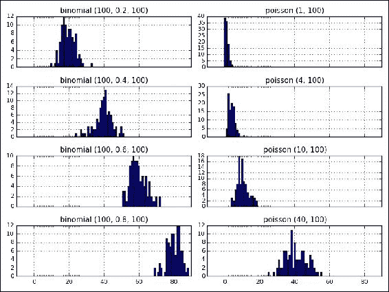

# 十六、NumPy 数组和向量化计算

NumPy 是基本软件包，受支持，可在 Python 中以高性能显示和计算数据。 它提供了一些有趣的功能，如下所示：

*   Python 的扩展包，用于多维数组（`ndarrays`），各种派生对象（例如，掩码数组），提供向量化操作的矩阵以及广播功能。 通过利用现代 CPU 中的**单指令多数据**（**SIMD**）指令集，向量化可以显着提高阵列计算的性能。
*   对数据数组进行快速便捷的运算，包括数学运算，基本统计运算，排序，选择，线性代数，随机数生成，离散傅立叶变换等。
*   由于集成了 C/C++ / Fortran 代码，因此效率工具更接近硬件。

NumPy 是一个很好的入门软件包，可让您熟悉数据分析中的数组和面向数组的计算。 同样，这也是学习其他更有效的工具（如 Pandas）的基本步骤，我们将在下一章中看到它们。 我们将使用 NumPy 1.9.1 版。

# NumPy 数组

数组可用于包含实验或仿真步骤中的数据对象的值，图像的像素或由测量设备记录的信号。 例如，巴黎埃菲尔铁塔的纬度为 48.858598，经度为 2.294495。 它可以在[NumPy]数组对象中显示为`p`：

```pypy
>>> import numpy as np
>>> p = np.array([48.858598, 2.294495])
>>> p
Output: array([48.858598, 2.294495])

```

这是使用`np.array`功能的阵列的手动构造。 导入 NumPy 的标准约定如下：

```pypy
>>> import numpy as np

```

当然，您可以在代码中加入`from numpy import *`以避免编写`np`。 但是，由于存在潜在的代码冲突，因此应谨慎使用此习惯（有关代码约定的更多信息，请参见 *Python 样式指南*，也称为 [**PEP8**](https://www.python.org/dev/peps/pep-0008/)。

NumPy 数组有两个要求：创建时固定大小，以及内存中固定大小的统一固定数据类型。 以下功能可帮助您获取有关`p`矩阵的信息：

```pypy
>>> p.ndim    # getting dimension of array p
1
>>> p.shape   # getting size of each array dimension
(2,)
>>> len(p)    # getting dimension length of array p
2
>>> p.dtype    # getting data type of array p
dtype('float64')

```

## 数据类型

有五种基本的数值类型，包括布尔（`bool`），整数（`int`），无符号整数（`uint`），浮点（`float`）和复数。 它们指示需要多少位来表示内存中数组的元素。 除此之外，NumPy 还具有某些类型，例如`intc`和`intp`，这些类型根据平台而具有不同的位大小。

有关 NumPy 支持的数据类型的列表，请参见下表：

<colgroup class="calibre17"><col class="calibre18"> <col class="calibre18"> <col class="calibre18"> <col class="calibre18"></colgroup> 
| 

类型

 | 

类型代码

 | 

描述

 | 

价值范围

 |
| --- | --- | --- | --- |
| `bool` |   | 布尔值存储为字节 | 真假 |
| `intc` |   | 类似于 C int（int32 或 int 64） |   |
| `intp` |   | 用于索引的整数（与 C size_t 相同） |   |
| `int8`，`uint8` | i1，u1 | 有符号和无符号 8 位整数类型 | int8：（-128 至 127）uint8：（0 到 255） |
| `int16`，`uint16` | i2，u2 | 有符号和无符号 16 位整数类型 | int16：（-32768 至 32767）uint16：（0 到 65535） |
| `int32`，`uint32` | i4，u4 | 有符号和无符号 32 位整数类型 | int32：（-2147483648 至 2147483647uint32：（0 到 4294967295） |
| `int64`，`uinit64` | i8，u8 | 有符号和无符号 64 位整数类型 | Int64：（-9223372036854775808 至 9223372036854775807）uint64：（0 到 18446744073709551615） |
| `float16` | f2 | 半精度浮点数：符号位，5 位指数和 10b 位尾数 |   |
| `float32` | f4 / f | 单精度浮点数：符号位，8 位指数和 23 位尾数 |   |
| `float64` | f8 /天 | 双精度浮点数：符号位，11 位指数和 52 位尾数 |   |
| `complex64`，`complex128`，`complex256` | c8，c16，c32 | 复数由两个 32 位，64 位和 128 位浮点数表示 |   |
| `object` | 0 | Python 对象类型 |   |
| `string_` | 小号 | 定长字符串类型 | 使用`S10`声明长度为 10 的字符串`dtype` |
| `unicode_` | ü | 定长 Unicode 类型 | 与 string_ 示例类似，我们有'U10' |

我们可以轻松地使用`astype`方法将转换为或将数组从一个`dtype`转换为另一个数组：

```pypy
>>> a = np.array([1, 2, 3, 4])
>>> a.dtype
dtype('int64')
>>> float_b = a.astype(np.float64)
>>> float_b.dtype
dtype('float64')

```

### 注意

即使新的`dtype`与旧的数组相似，`astype`函数也会使用旧数组中的数据副本创建一个新的数组。


## 阵列创建

提供了各种函数来创建数组对象。 它们对于我们在不同情况下在多维数组中创建和存储数据非常有用。

现在，在下表中，我们将总结一些 NumPy 的常用功能及其在数组创建示例中的用法：

<colgroup class="calibre17"><col class="calibre18"> <col class="calibre18"> <col class="calibre18"></colgroup> 
| 

功能

 | 

描述

 | 

例子

 |
| --- | --- | --- |
| `empty, empty_like` | 创建给定形状和类型的新数组，而无需初始化元素 | 

```pypy
>>> np.empty([3,2], dtype=np.float64)
array([[0., 0.], [0., 0.], [0., 0.]])
>>> a = np.array([[1, 2], [4, 3]])
>>> np.empty_like(a)
array([[0, 0], [0, 0]])

```

 |
| `eye`，`identity` | 创建一个 NxN 单位矩阵，对角线为 1，其他位置为零 | 

```pypy
>>> np.eye(2, dtype=np.int)
array([[1, 0], [0, 1]])

```

 |
| `ones`，`ones_like` | 创建具有给定形状和类型的新数组，所有元素填充为 1 | 

```pypy
>>> np.ones(5)
array([1., 1., 1., 1., 1.])
>>> np.ones(4, dtype=np.int)
array([1, 1, 1, 1])
>>> x = np.array([[0,1,2], [3,4,5]])
>>> np.ones_like(x)
array([[1, 1, 1],[1, 1, 1]])

```

 |
| `zeros`，`zeros_like` | 这类似于`ones`和`ones_like`，但是用 0 初始化元素 | 

```pypy
>>> np.zeros(5)
array([0., 0., 0., 0-, 0.])
>>> np.zeros(4, dtype=np.int)
array([0, 0, 0, 0])
>>> x = np.array([[0, 1, 2], [3, 4, 5]])
>>> np.zeros_like(x)
array([[0, 0, 0],[0, 0, 0]])

```

 |
| `arange` | 在给定间隔中创建具有均等间隔值的数组 | 

```pypy
>>> np.arange(2, 5)
array([2, 3, 4])
>>> np.arange(4, 12, 5)
array([4, 9])

```

 |
| `full`，`full_like` | 创建具有给定形状和类型的新数组，并填充选定的值 | 

```pypy
>>> np.full((2,2), 3, dtype=np.int)
array([[3, 3], [3, 3]])
>>> x = np.ones(3)
>>> np.full_like(x, 2)
array([2., 2., 2.])

```

 |
| `array` | 根据现有数据创建数组 | 

```pypy
>>> np.array([[1.1, 2.2, 3.3], [4.4, 5.5, 6.6]])
array([1.1, 2.2, 3.3], [4.4, 5.5, 6.6]])

```

 |
| `asarray` | 将输入转换为数组 | 

```pypy
>>> a = [3.14, 2.46]
>>> np.asarray(a)
array([3.14, 2.46])

```

 |
| `copy` | 返回给定对象的数组副本 | 

```pypy
>>> a = np.array([[1, 2], [3, 4]])
>>> np.copy(a)
array([[1, 2], [3, 4]])

```

 |
| `fromstring` | 从字符串或文本创建一维数组 | 

```pypy
>>> np.fromstring('3.14 2.17', dtype=np.float, sep=' ')
array([3.14, 2.17])

```

 |

## 索引和切片

与其他 Python 序列类型（例如列表）一样，访问和分配每个数组元素的值非常容易：

```pypy
>>> a = np.arange(7)
>>> a
array([0, 1, 2, 3, 4, 5, 6])
>>> a[1], a [4], a[-1]
(1, 4, 6)

```

### 注意

在 Python 中，数组索引从 0 开始。这与 Fortran 或 Matlab 的索引从 1 开始形成对比。

再举一个例子，如果我们的数组是多维的，我们需要一个整数元组来索引一个项目：

```pypy
>>> a = np.array([[1, 2, 3], [4, 5, 6], [7, 8, 9]])
>>> a[0, 2]      # first row, third column
3
>>> a[0, 2] = 10
>>> a
array([[1, 2, 10], [4, 5, 6], [7, 8, 9]])
>>> b = a[2]
>>> b
array([7, 8, 9])
>>> c = a[:2]
>>> c
array([[1, 2, 10], [4, 5, 6]])

```

我们将`b`和`c`称为数组切片，它们是原始数组的视图。 这意味着数据不会复制到`b`或`c`，并且每当我们修改它们的值时，它也将反映在数组`a`中：

```pypy
>>> b[-1] = 11
>>> a
array([[1, 2, 10], [4, 5, 6], [7, 8, 11]])

```

### 注意

当我们省略索引号时，我们使用冒号（`:`）表示整个轴。

## 花式索引

除了使用切片索引之外，NumPy 还支持使用布尔或整数数组（掩码）进行索引。 该方法称为**花式索引**。 它创建副本，而不是视图。

首先，我们来看一个使用布尔型掩码数组建立索引的示例：

```pypy
>>> a = np.array([3, 5, 1, 10])
>>> b = (a % 5 == 0)
>>> b
array([False, True, False, True], dtype=bool)
>>> c = np.array([[0, 1], [2, 3], [4, 5], [6, 7]])
>>> c[b]
array([[2, 3], [6, 7]])

```

第二个示例说明了在数组上使用整数掩码：

```pypy
>>> a = np.array([[1, 2, 3, 4], 
 [5, 6, 7, 8], 
 [9, 10, 11, 12],
 [13, 14, 15, 16]])
>>> a[[2, 1]]
array([[9, 10, 11, 12], [5, 6, 7, 8]])
>>> a[[-2, -1]]          # select rows from the end
array([[ 9, 10, 11, 12], [13, 14, 15, 16]])
>>> a[[2, 3], [0, 1]]    # take elements at (2, 0) and (3, 1)
array([9, 14])

```

### 注意

遮罩数组必须与其索引的轴具有相同的长度。

## 对数组的数值运算

我们正在熟悉创建和访问`ndarrays`的过程。 现在，我们继续下一步，对数组数据进行一些数学运算，而无需编写任何 for 循环，当然，它们具有更高的性能。

标量操作会将值传播到数组的每个元素：

```pypy
>>> a = np.ones(4)
>>> a * 2
array([2., 2., 2., 2.])
>>> a + 3
array([4., 4., 4., 4.])

```

数组之间的所有算术运算都将运算元素明智地应用：

```pypy
>>> a = np.ones([2, 4])
>>> a * a
array([[1., 1., 1., 1.], [1., 1., 1., 1.]])
>>> a + a
array([[2., 2., 2., 2.], [2., 2., 2., 2.]])

```

另外，这是一些比较和逻辑运算的示例：

```pypy
>>> a = np.array([1, 2, 3, 4])
>>> b = np.array([1, 1, 5, 3])
>>> a == b
array([True, False, False, False], dtype=bool)

>>> np.array_equal(a, b)      # array-wise comparison
False

>>> c = np.array([1, 0])
>>> d = np.array([1, 1])
>>> np.logical_and(c, d)      # logical operations
array([True, False])

```


# 数组功能

NumPy 支持许多有用的数组函数来分析数据。 我们将列出其中一些常用的部分。 首先，转置函数是另一种重塑形式，它可以在不复制任何内容的情况下返回原始数据数组的视图：

```pypy
>>> a = np.array([[0, 5, 10], [20, 25, 30]])
>>> a.reshape(3, 2)
array([[0, 5], [10, 20], [25, 30]])
>>> a.T
array([[0, 20], [5, 25], [10, 30]])

```

通常，我们有`swapaxes`方法，该方法采用一对轴号并返回数据视图，而不进行复制：

```pypy
>>> a = np.array([[[0, 1, 2], [3, 4, 5]], 
 [[6, 7, 8], [9, 10, 11]]])
>>> a.swapaxes(1, 2)
array([[[0, 3],
 [1, 4],
 [2, 5]],
 [[6, 9],
 [7, 10],
 [8, 11]]])

```

转置函数用于进行矩阵计算。 例如，使用`np.dot`计算内部矩阵乘积`XT.X`：

```pypy
>>> a = np.array([[1, 2, 3],[4,5,6]])
>>> np.dot(a.T, a)
array([[17, 22, 27],
 [22, 29, 36],
 [27, 36, 45]])

```

在数组中对数据进行排序也是处理数据的重要要求。 让我们看一下一些排序函数及其用法：

```pypy
>>> a = np.array ([[6, 34, 1, 6], [0, 5, 2, -1]])

>>> np.sort(a)     # sort along the last axis
array([[1, 6, 6, 34], [-1, 0, 2, 5]])

>>> np.sort(a, axis=0)    # sort along the first axis
array([[0, 5, 1, -1], [6, 34, 2, 6]])

>>> b = np.argsort(a)    # fancy indexing of sorted array
>>> b
array([[2, 0, 3, 1], [3, 0, 2, 1]])
>>> a[0][b[0]]
array([1, 6, 6, 34])

>>> np.argmax(a)    # get index of maximum element
1

```

请参阅下表以获取数组函数的列表：

<colgroup class="calibre17"><col class="calibre18"> <col class="calibre18"> <col class="calibre18"></colgroup> 
| 

功能

 | 

描述

 | 

例子

 |
| --- | --- | --- |
| `sin`，`cos`，`tan`，`cosh`，`sinh`，`tanh`，`arcos`，`arctan`，`deg2rad` | 三角函数和双曲函数 | 

```pypy
>>> a = np.array([0.,30., 45.])
>>> np.sin(a * np.pi / 180)
array([0., 0.5, 0.7071678])

```

 |
| `around`，`round`，`rint`，`fix`，`floor`，`ceil`，`trunc` | 将数组的元素四舍五入到给定或最接近的数字 | 

```pypy
>>> a = np.array([0.34, 1.65])
>>> np.round(a)
array([0., 2.])

```

 |
| `sqrt`，`square`，`exp`，`expm1`，`exp2`，`log`，`log10`，`log1p`，`logaddexp` | 计算数组的指数和对数 | 

```pypy
>>> np.exp(np.array([2.25, 3.16]))
array([9.4877, 23.5705])

```

 |
| `add`，`negative`，`multiply`，`devide`，`power`，`substract`，`mod`，`modf`，`remainder` | 数组上的算术函数集 | 

```pypy
>>> a = np.arange(6)
>>> x1 = a.reshape(2,3)
>>> x2 = np.arange(3)
>>> np.multiply(x1, x2)
array([[0,1,4],[0,4,10]])

```

 |
| `greater`，`greater_equal`，`less`，`less_equal`，`equal`，`not_equal` | 执行元素比较：>，> =， | 

```pypy
>>> np.greater(x1, x2)
array([[False, False, False], [True, True, True]], dtype = bool)

```

 |


# 使用数组的数据处理

使用 NumPy 软件包，我们可以轻松解决多种数据处理任务，而无需编写复杂的循环。 对我们来说，控制我们的代码以及程序的性能非常有帮助。 在这一部分中，我们要介绍一些数学和统计函数。

有关数学和统计函数的列表，请参见下表：

<colgroup class="calibre17"><col class="calibre18"> <col class="calibre18"> <col class="calibre18"></colgroup> 
| 

功能

 | 

描述

 | 

例子

 |
| --- | --- | --- |
| `sum` | 计算数组中或沿轴上所有元素的总和 | 

```pypy
>>> a = np.array([[2,4], [3,5]])
>>> np.sum(a, axis=0)
array([5, 9])

```

 |
| `prod` | 计算给定轴上数组元素的乘积 | 

```pypy
>>> np.prod(a, axis=1)
array([8, 15])

```

 |
| `diff` | 计算沿给定轴的离散差 | 

```pypy
>>> np.diff(a, axis=0)
array([[1,1]])

```

 |
| `gradient` | 返回数组的梯度 | 

```pypy
>>> np.gradient(a)
[array([[1., 1.], [1., 1.]]), array([[2., 2.], [2., 2.]])]

```

 |
| `cross` | 返回两个数组的叉积 | 

```pypy
>>> b = np.array([[1,2], [3,4]])
>>> np.cross(a,b)
array([0, -3])

```

 |
| `std`，`var` | 返回数组的标准偏差和方差 | 

```pypy
>>> np.std(a)
1.1180339
>>> np.var(a)
1.25

```

 |
| `mean` | 计算数组的算术平均值 | 

```pypy
>>> np.mean(a)
3.5

```

 |
| `where` | 从 x 或 y 返回满足条件的元素 | 

```pypy
>>> np.where([[True, True], [False, True]], [[1,2],[3,4]], [[5,6],[7,8]])
array([[1,2], [7, 4]])

```

 |
| `unique` | 返回数组中排序的唯一值 | 

```pypy
>>> id = np.array(['a', 'b', 'c', 'c', 'd'])
>>> np.unique(id)
array(['a', 'b', 'c', 'd'], dtype='&#124;S1')

```

 |
| `intersect1d` | 计算两个数组中的排序元素和公共元素 | 

```pypy
>>> a = np.array(['a', 'b', 'a', 'c', 'd', 'c'])
>>> b = np.array(['a', 'xyz', 'klm', 'd'])
>>> np.intersect1d(a,b)
array(['a', 'd'], dtype='&#124;S3')

```

 |

## 加载和保存数据

通过使用 NumPy 包中支持的不同功能，我们还可以以文本或二进制格式将数据保存到磁盘或从磁盘加载数据。

## 保存数组

默认情况下，数组以未压缩的原始二进制格式保存，`np.save`函数使用文件扩展名`.npy`：

```pypy
>>> a = np.array([[0, 1, 2], [3, 4, 5]])
>>> np.save('test1.npy', a)

```

### 注意

如果我们省略`.npy`扩展名，该库将自动为其分配。

如果我们想以未压缩的`.npz`格式将多个数组存储到单个文件中，则可以使用`np.savez`函数，如以下示例所示：

```pypy
>>> a = np.arange(4)
>>> b = np.arange(7)
>>> np.savez('test2.npz', arr0=a, arr1=b)

```

`.npz`文件是文件的压缩存档，其文件名为包含的变量。 当我们加载`.npz`文件时，我们会得到一个类似字典的对象，可以查询其数组列表：

```pypy
>>> dic = np.load('test2.npz')
>>> dic['arr0']
array([0, 1, 2, 3])

```

将数组数据保存到文件中的另一种方法是使用`np.savetxt`函数，该函数允许我们在输出文件中设置格式属性：

```pypy
>>> x = np.arange(4)
>>> # e.g., set comma as separator between elements
>>> np.savetxt('test3.out', x, delimiter=',')

```


## 加载数组

我们有两个通用函数，例如 `np.load`和`np.loadtxt`，它们与保存函数相对应，用于加载数组：

```pypy
>>> np.load('test1.npy')
array([[0, 1, 2], [3, 4, 5]])
>>> np.loadtxt('test3.out', delimiter=',')
array([0., 1., 2., 3.])

```

与和`np.savetxt`函数相似，`np.loadtxt`函数也具有许多从文本文件加载数组的选项。

# 带有 NumPy 的线性代数

线性代数是与向量空间以及这些空间之间的映射有关的数学分支。 NumPy 有一个名为 **linalg** 的软件包，它支持强大的线性代数功能。 我们可以使用这些函数来查找特征值和特征向量或执行奇异值分解：

```pypy
>>> A = np.array([[1, 4, 6],
 [5, 2, 2],
 [-1, 6, 8]])
>>> w, v = np.linalg.eig(A)
>>> w                           # eigenvalues
array([-0.111 + 1.5756j, -0.111 – 1.5756j, 11.222+0.j])
>>> v                           # eigenvector
array([[-0.0981 + 0.2726j, -0.0981 – 0.2726j, 0.5764+0.j],
 [0.7683+0.j, 0.7683-0.j, 0.4591+0.j],
 [-0.5656 – 0.0762j, -0.5656 + 0.00763j, 0.6759+0.j]])

```

该函数是使用 geev Lapack 例程实现的，该例程计算通用平方矩阵的特征值和特征向量。

另一个常见的问题是求解线性系统，例如以`A`为矩阵，以`x`和`b`为向量的`Ax = b`。 使用`numpy.linalg.solve`功能可以轻松解决该问题：

```pypy
>>> A = np.array([[1, 4, 6], [5, 2, 2], [-1, 6, 8]])
>>> b = np.array([[1], [2], [3]])
>>> x = np.linalg.solve(A, b)
>>> x
array([[-1.77635e-16], [2.5], [-1.5]])

```

下表总结了`numpy.linalg`软件包中的一些常用功能：

<colgroup class="calibre17"><col class="calibre18"> <col class="calibre18"> <col class="calibre18"></colgroup> 
| 

功能

 | 

描述

 | 

例子

 |
| --- | --- | --- |
| `dot` | 计算两个数组的点积 | 

```pypy
>>> a = np.array([[1, 0],[0, 1]])
>>> b = np.array( [[4, 1],[2, 2]])
>>> np.dot(a,b)
array([[4, 1],[2, 2]])

```

 |
| `inner`，`outer` | 计算两个数组的内积和外积 | 

```pypy
>>> a = np.array([1, 1, 1])
>>> b = np.array([3, 5, 1])
>>> np.inner(a,b)
9

```

 |
| `linalg.norm` | 找出矩阵或向量范数 | 

```pypy
>>> a = np.arange(3)
>>> np.linalg.norm(a)
2.23606

```

 |
| `linalg.det` | 计算数组的行列式 | 

```pypy
>>> a = np.array([[1,2],[3,4]])
>>> np.linalg.det(a)
-2.0

```

 |
| `linalg.inv` | 计算矩阵的逆 | 

```pypy
>>> a = np.array([[1,2],[3,4]])
>>> np.linalg.inv(a)
array([[-2., 1.],[1.5, -0.5]])

```

 |
| `linalg.qr` | 计算 QR 分解 | 

```pypy
>>> a = np.array([[1,2],[3,4]])
>>> np.linalg.qr(a)
(array([[0.316, 0.948], [0.948, 0.316]]), array([[ 3.162, 4.427], [ 0., 0.632]]))

```

 |
| `linalg.cond` | 计算矩阵的条件数 | 

```pypy
>>> a = np.array([[1,3],[2,4]])
>>> np.linalg.cond(a)
14.933034

```

 |
| `trace` | 计算对角线元素的总和 | 

```pypy
>>> np.trace(np.arange(6)).
reshape(2,3))
4

```

 |

# NumPy 随机数

任何模拟的重要部分是产生随机数的能力。 为此，NumPy 在子模块`random`中提供了各种例程。 它使用一种称为 Mersenne Twister 的特殊算法来生成伪随机数。

首先，我们需要定义一个使随机数可预测的种子。 重置该值时，每次都会出现相同的数字。 如果我们不分配种子，则 NumPy 会根据系统的随机数生成器设备或时钟自动选择一个随机种子值：

```pypy
>>> np.random.seed(20)

```

可以按以下方式生成`[0.0, 1.0]`间隔中的随机数数组：

```pypy
>>> np.random.rand(5)
array([0.5881308, 0.89771373, 0.89153073, 0.81583748, 
 0.03588959])
>>> np.random.rand(5)
array([0.69175758, 0.37868094, 0.51851095, 0.65795147, 
 0.19385022])

>>> np.random.seed(20)    # reset seed number
>>> np.random.rand(5)
array([0.5881308, 0.89771373, 0.89153073, 0.81583748, 
 0.03588959])

```

如果要在半开间隔`[min, max]`中生成随机整数，则可以使用`randint`（`min`，`max`和`length`）函数：

```pypy
>>> np.random.randint(10, 20, 5)
array([17, 12, 10, 16, 18])

```

NumPy 还提供的许多其他分布，包括`Beta`，`bionomial`，`chi`-`square`，`Dirichlet`，`exponential`，`F`，`Gamma`，`geometric`或 `Gumbel`。

下表将列出一些分布函数，并提供生成随机数的示例：

<colgroup class="calibre17"><col class="calibre18"> <col class="calibre18"> <col class="calibre18"></colgroup> 
| 

功能

 | 

描述

 | 

例子

 |
| --- | --- | --- |
| `binomial` | 从二项分布中抽取样本（n：试验次数，p：概率） | 

```pypy
>>> n, p = 100, 0.2
>>> np.random.binomial(n, p, 3)
array([17, 14, 23])

```

 |
| `dirichlet` | 使用 Dirichlet 分布绘制样本 | 

```pypy
>>> np.random.dirichlet(alpha=(2,3), size=3)
array([[0.519, 0.480], [0.639, 0.36],
 [0.838, 0.161]])

```

 |
| `poisson` | 从泊松分布中抽取样本 | 

```pypy
>>> np.random.poisson(lam=2, size= 2)
array([4,1])

```

 |
| `normal` | 使用正态高斯分布绘制样本 | 

```pypy
>>> np.random.normal
(loc=2.5, scale=0.3, size=3)
array([2.4436, 2.849, 2.741)

```

 |
| `uniform` | 使用均匀分布绘制样本 | 

```pypy
>>> np.random.uniform(
low=0.5, high=2.5, size=3)
array([1.38, 1.04, 2.19[)

```

 |

我们还可以使用随机数生成来随机排列列表中的项目。 有时候当我们想以随机顺序对列表进行排序时，这很有用：

```pypy
>>> a = np.arange(10)
>>> np.random.shuffle(a)
>>> a
array([7, 6, 3, 1, 4, 2, 5, 0, 9, 8])

```

下图并排显示了两个分布`binomial`和`poisson`和各种参数（可视化由`matplotlib`创建，将在第 4 章，“数据可视化”）：




