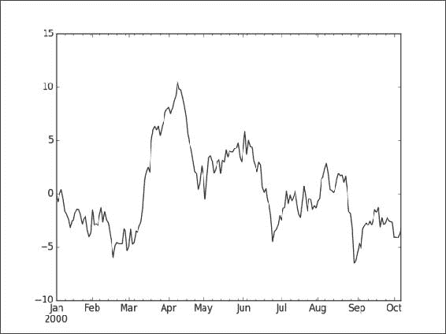
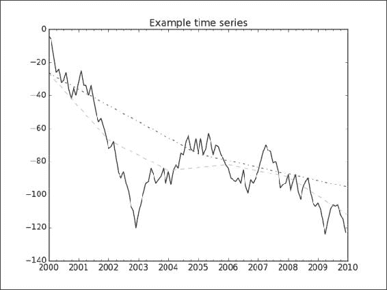
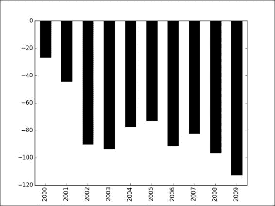
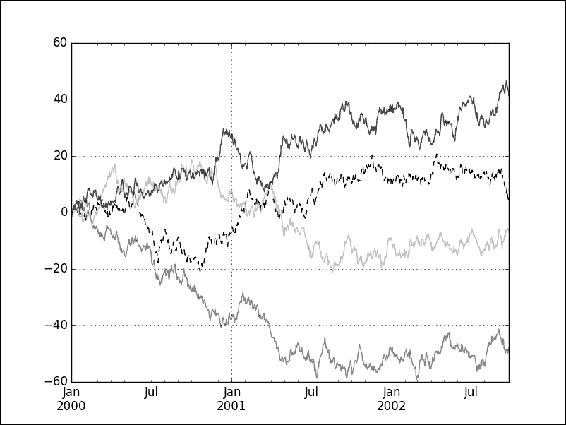

# 十九、时间序列

时间序列通常由一系列数据点组成，这些数据点来自随时间推移而进行的测量。 这种数据非常普遍，并且发生在多个字段中。

业务主管对股票价格，商品和服务价格或每月销售数字感兴趣。 气象学家每天要进行几次温度测量，并保留降水，湿度，风向和力的记录。 神经科医生可以使用脑电图来测量沿头皮的大脑电活动。 社会学家可以使用竞选捐款数据来了解政党及其支持者，并将这些见解用作论证的辅助手段。 几乎可以无休止地列举时间序列数据的更多示例。

# 时间序列入门

通常，时间序列用于有两个目的。 首先，它们帮助我们了解生成数据的基本过程。 另一方面，我们希望能够使用现有数据来预测相同或相关系列的未来价值。 当我们测量温度，降水或风时，我们想了解更多有关更复杂事物的信息，例如天气或某个地区的气候以及各种因素如何相互作用。 同时，我们可能对天气预报感兴趣。

在本章中，我们将探讨Pandas的时间序列功能。 除了强大的核心数据结构（系列和 DataFrame）之外，pandas 还具有用于处理与时间相关的数据的辅助功能。 凭借其广泛的内置优化功能，pandas 能够轻松处理具有数百万个数据点的大型时间序列。

我们将从日期和时间对象的基本构造块开始逐步处理时间序列。

# 处理日期和时间对象

Python 支持标准库中`datetime`和时间模块中的日期和时间处理：

```pypy
>>> import datetime
>>> datetime.datetime(2000, 1, 1)
datetime.datetime(2000, 1, 1, 0, 0)

```

有时，日期是以字符串形式给出或预期的，因此必须从字符串到字符串的转换，这是通过两个函数分别实现的：`strptime`和`strftime`：

```pypy
>>> datetime.datetime.strptime("2000/1/1", "%Y/%m/%d")
datetime.datetime(2000, 1, 1, 0, 0)
>>> datetime.datetime(2000, 1, 1, 0, 0).strftime("%Y%m%d")
'20000101'

```

现实世界中的数据通常以各种形式出现，如果我们不需要记住为解析指定的确切日期格式，那就太好了。 值得庆幸的是，当处理代表日期或时间的字符串时，Pandas消除了很多摩擦。 这些辅助功能之一是`to_datetime`：

```pypy
>>> import pandas as pd
>>> import numpy as np
>>> pd.to_datetime("4th of July")
Timestamp('2015-07-04 
>>> pd.to_datetime("13.01.2000")
Timestamp('2000-01-13 00:00:00')
>>> pd.to_datetime("7/8/2000")
Timestamp('2000-07-08 00:00:00')

```

根据地区，最后一个可以指 8 月 7 日或 7 月 8 日。 为了消除这种情况的歧义，可以向`to_datetime`传递关键字参数`dayfirst`：

```pypy
>>> pd.to_datetime("7/8/2000", dayfirst=True)
Timestamp('2000-08-07 00:00:00')

```

时间戳记对象可以看作是`datetime`对象的Pandas版本，实际上`Timestamp`类是`datetime`的子类：

```pypy
>>> issubclass(pd.Timestamp, datetime.datetime)
True

```

这意味着它们可以在许多情况下互换使用：

```pypy
>>> ts = pd.to_datetime(946684800000000000)
>>> ts.year, ts.month, ts.day, ts.weekday()
(2000, 1, 1, 5)

```

时间戳记对象是Pandas时间序列功能的重要组成部分，因为时间戳记是`DateTimeIndex`对象的构建块：

```pypy
>>> index = [pd.Timestamp("2000-01-01"),
 pd.Timestamp("2000-01-02"),
 pd.Timestamp("2000-01-03")]
>>> ts = pd.Series(np.random.randn(len(index)), index=index)
>>> ts
2000-01-01    0.731897
2000-01-02    0.761540
2000-01-03   -1.316866
dtype: float64
>>> ts.indexDatetime
Index(['2000-01-01', '2000-01-02', '2000-01-03'],
dtype='datetime64[ns]', freq=None, tz=None)

```

这里需要注意一些事项：我们创建一个时间戳对象列表，并将其作为索引传递给序列构造函数。 此时间戳列表将即时转换为`DatetimeIndex`。 如果只传递了日期字符串，则不会获得`DatetimeIndex`，而只会得到`index`：

```pypy
>>> ts = pd.Series(np.random.randn(len(index)), index=[
 "2000-01-01", "2000-01-02", "2000-01-03"])
>>> ts.index
Index([u'2000-01-01', u'2000-01-02', u'2000-01-03'], dtype='object')

```

但是，`to_datetime`函数足够灵活，可以帮助您，如果我们仅有的是日期字符串列表：

```pypy
>>> index = pd.to_datetime(["2000-01-01", "2000-01-02", "2000-01-03"])
>>> ts = pd.Series(np.random.randn(len(index)), index=index)
>>> ts.index
DatetimeIndex(['2000-01-01', '2000-01-02', '2000-01-03'], dtype='datetime64[ns]', freq=None, tz=None))

```

要注意的另一件事是，尽管我们具有`DatetimeIndex`，但`freq`和`tz`属性都是`None`。 在本章后面，我们将学习这两个属性的效用。

使用`to_datetime`，我们可以将各种字符串甚至字符串列表转换为时间戳或`DatetimeIndex`对象。 有时，我们没有明确获得有关一个​​序列的所有信息，我们必须自己生成固定间隔的时间戳序列。

Pandas为此任务提供了另一个强大的实用功能：`date_range`。

`date_range`功能有助于在开始日期和结束日期之间生成固定频率的`datetime`索引。 也可以指定开始或结束日期以及要生成的时间戳数。

频率可以通过`freq`参数指定，该参数支持多个偏移量。 您可以使用典型的时间间隔，例如小时，分钟和秒：

```pypy
>>> pd.date_range(start="2000-01-01", periods=3, freq='H')
DatetimeIndex(['2000-01-01 00:00:00', '2000-01-01 01:00:00','2000-01-01 02:00:00'], dtype='datetime64[ns]', freq='H', tz=None)
>>> pd.date_range(start="2000-01-01", periods=3, freq='T')
DatetimeIndex(['2000-01-01 00:00:00', '2000-01-01 00:01:00','2000-01-01 00:02:00'], dtype='datetime64[ns]', freq='T', tz=None)
>>> pd.date_range(start="2000-01-01", periods=3, freq='S')
DatetimeIndex(['2000-01-01 00:00:00', '2000-01-01 00:00:01','2000-01-01 00:00:02'], dtype='datetime64[ns]', freq='S', tz=None)

```

`freq`属性允许我们指定多个选项。 Pandas已经在金融和经济学中成功使用，尤其是因为它也很容易处理营业日期。 例如，要获取包含千年的前三个工作日的索引，可以使用`B`偏移别名：

```pypy
>>> pd.date_range(start="2000-01-01", periods=3, freq='B')
DatetimeIndex(['2000-01-03', '2000-01-04', '2000-01-05'], dtype='datetime64[ns]', freq='B', tz=None)

```

下表显示了可用的偏移别名，也可以在[时间序列的 pandas 文档](http://pandas.pydata.org/pandas-docs/stable/timeseries.html#offset-aliases)查找：

<colgroup class="calibre17"><col class="calibre18"> <col class="calibre18"></colgroup> 
| 

别名

 | 

描述

 |
| --- | --- |
| 乙 | 工作日频率 |
| C | 自定义工作日频率 |
| d | 日历日频率 |
| 在 | 每周频率 |
| 中号 | 月末频率 |
| BM | 营业月结束频率 |
| 煤层气 | 自定义营业月结束频率 |
| 小姐 | 月开始频率 |
| BMS | 营业月份开始频率 |
| 中央管理系统 | 自定义营业月开始频率 |
| 问 | 四分之一结束频率 |
| BQ | 业务季度频率 |
| 质量体系 | 季度开始频率 |
| BQS | 业务季度开始频率 |
| 一种 | 年末频率 |
| BA | 营业年度结束频率 |
| 作为 | 年开始频率 |
| 低的 | 营业年度开始频率 |
| BH | 营业时间频率 |
| H | 每小时频率 |
| Ť | 分频 |
| 小号 | 其次频率 |
| 大号 | 毫秒 |
| ü | 微秒 |
| ñ | 纳秒 |

此外，偏移别名也可以组合使用。 在这里，我们正在生成一个`datetime`索引，该索引包含五个元素，分别每天，一小时，一分钟和一秒间隔开：

```pypy
>>> pd.date_range(start="2000-01-01", periods=5, freq='1D1h1min10s')
DatetimeIndex(['2000-01-01 00:00:00', '2000-01-02 01:01:10','2000-01-03 02:02:20', '2000-01-04 03:03:30','2000-01-05 04:04:40'],dtype='datetime64[ns]', freq='90070S', tz=None)

```

如果我们想在工作时间的每 12 小时（默认情况下从 9 AM 开始到 5 PM 结束）对数据建立索引，则只需为`BH`别名加上前缀：

```pypy
>>> pd.date_range(start="2000-01-01", periods=5, freq='12BH')
DatetimeIndex(['2000-01-03 09:00:00', '2000-01-04 13:00:00','2000-01-06 09:00:00', '2000-01-07 13:00:00','2000-01-11 09:00:00'],dtype='datetime64[ns]', freq='12BH', tz=None)

```

还可以对工作时间的含义进行自定义：

```pypy
>>> ts.index
DatetimeIndex(['2000-01-01', '2000-01-02', '2000-01-03'], dtype='datetime64[ns]', freq=None, tz=None)

```

我们也可以使用此自定义工作时间来建立索引：

```pypy
>>> pd.date_range(start="2000-01-01", periods=5, freq=12 * bh)
DatetimeIndex(['2000-01-03 07:00:00', '2000-01-03 19:00:00','2000-01-04 07:00:00', '2000-01-04 19:00:00','2000-01-05 07:00:00', '2000-01-05 19:00:00','2000-01-06 07:00:00'],dtype='datetime64[ns]', freq='12BH', tz=None)

```

一些频率允许我们指定锚定后缀，这使我们可以表达间隔，例如每月的每个星期五或第二个星期二：

```pypy
>>> pd.date_range(start="2000-01-01", periods=5, freq='W-FRI')
DatetimeIndex(['2000-01-07', '2000-01-14', '2000-01-21', '2000-01-28', '2000-02-04'], dtype='datetime64[ns]', freq='W-FRI', tz=None)
>>> pd.date_range(start="2000-01-01", periods=5, freq='WOM-2TUE')DatetimeIndex(['2000-01-11', '2000-02-08', '2000-03-14', '2000-04-11', '2000-05-09'], dtype='datetime64[ns]', freq='WOM-2TUE', tz=None)

```

最后，我们可以合并不同频率的各种索引。 可能性是无止境。 我们仅显示一个示例，其中我们结合了两个索引（每个索引十年），一个指向一年中的每个工作日，另一个指向二月的最后一天：

```pypy
>>> s = pd.date_range(start="2000-01-01", periods=10, freq='BAS-JAN')
>>> t = pd.date_range(start="2000-01-01", periods=10, freq='A-FEB')
>>> s.union(t)
DatetimeIndex(['2000-01-03', '2000-02-29', '2001-01-01', '2001-02-28','2002-01-01', '2002-02-28', '2003-01-01', '2003-02-28','2004-01-01', '2004-02-29', '2005-01-03', '2005-02-28','2006-01-02', '2006-02-28', '2007-01-01', '2007-02-28','2008-01-01', '2008-02-29', '2009-01-01', '2009-02-28'],dtype='datetime64[ns]', freq=None, tz=None)

```

我们看到 2000 年和 2005 年不是在工作日开始的，而 2000 年，2004 年和 2008 年是 the 年。

到目前为止，我们已经看到了两个强大的功能`to_datetime`和`date_range`。 现在，我们想通过首先展示如何仅用几行就可以创建和绘制时间序列数据来深入研究时间序列。 在本节的其余部分，我们将展示访问和切片时间序列数据的各种方法。

开始使用Pandas中的时间序列数据很容易。 可以创建随机游走并将其绘制成几行：

```pypy
>>> index = pd.date_range(start='2000-01-01', periods=200, freq='B')
>>> ts = pd.Series(np.random.randn(len(index)), index=index)
>>> walk = ts.cumsum()
>>> walk.plot()

```

下图显示了该图的可能输出：



就像通常的系列对象一样，您可以选择零件并切片索引：

```pypy
>>> ts.head()
2000-01-03    1.464142
2000-01-04    0.103077
2000-01-05    0.762656
2000-01-06    1.157041
2000-01-07   -0.427284
Freq: B, dtype: float64
>>> ts[0]
1.4641415817112928>>> ts[1:3]
2000-01-04    0.103077
2000-01-05    0.762656

```

即使我们的系列具有`DatetimeIndex`，我们也可以将日期字符串用作键：

```pypy
>>> ts['2000-01-03']
1.4641415817112928

```

即使`DatetimeIndex`由时间戳对象组成，我们也可以将`datetime`对象用作键：

```pypy
>>> ts[datetime.datetime(2000, 1, 3)]
1.4641415817112928

```

访问类似于字典或列表中的查找，但功能更强大。 例如，我们可以用字符串甚至是混合对象切片：

```pypy
>>> ts['2000-01-03':'2000-01-05']
2000-01-03    1.464142
2000-01-04    0.103077
2000-01-05    0.762656
Freq: B, dtype: float64
>>> ts['2000-01-03':datetime.datetime(2000, 1, 5)]
2000-01-03    1.464142
2000-01-04    0.103077
2000-01-05    0.762656
Freq: B, dtype: float64
>>> ts['2000-01-03':datetime.date(2000, 1, 5)]
2000-01-03   -0.807669
2000-01-04    0.029802
2000-01-05   -0.434855
Freq: B, dtype: float64 

```

甚至可以使用部分字符串来选择条目组。 如果只对二月份感兴趣，我们可以简单地写：

```pypy
>>> ts['2000-02']
2000-02-01    0.277544
2000-02-02   -0.844352
2000-02-03   -1.900688
2000-02-04   -0.120010
2000-02-07   -0.465916
2000-02-08   -0.575722
2000-02-09    0.426153
2000-02-10    0.720124
2000-02-11    0.213050
2000-02-14   -0.604096
2000-02-15   -1.275345
2000-02-16   -0.708486
2000-02-17   -0.262574
2000-02-18    1.898234
2000-02-21    0.772746
2000-02-22    1.142317
2000-02-23   -1.461767
2000-02-24   -2.746059
2000-02-25   -0.608201
2000-02-28    0.513832
2000-02-29   -0.132000

```

要查看从三月到五月的所有条目，包括：

```pypy
>>> ts['2000-03':'2000-05']
2000-03-01    0.528070
2000-03-02    0.200661
 ...
2000-05-30    1.206963
2000-05-31    0.230351
Freq: B, dtype: float64 

```

时间序列可以在时间上向前或向后移动。 索引保持不变，值移动：

```pypy
>>> small_ts = ts['2000-02-01':'2000-02-05']
>>> small_ts
2000-02-01    0.277544
2000-02-02   -0.844352
2000-02-03   -1.900688
2000-02-04   -0.120010
Freq: B, dtype: float64
>>> small_ts.shift(2)
2000-02-01         NaN
2000-02-02         NaN
2000-02-03    0.277544
2000-02-04   -0.844352
Freq: B, dtype: float64

```

要向后移动时间，我们只需使用负值即可：

```pypy
>>> small_ts.shift(-2)
2000-02-01   -1.900688
2000-02-02   -0.120010
2000-02-03         NaN
2000-02-04         NaN
Freq: B, dtype: float64

```


# 重采样时间序列

重采样描述了按时间序列数据进行频率转换的过程。 在各种情况下，它都是一种有用的技术，因为它可以通过将数据分组和汇总来增进理解。 可以从显示每周或每月平均温度的每日温度数据创建新的时间序列。 另一方面，现实世界中的数据可能无法以统一的间隔获取，因此需要将观测值映射到统一的间隔或填充某些时间点的缺失值。 这是重采样的两个主要使用方向：合并和聚合，以及填充丢失的数据。 下采样和上采样也发生在其他领域，例如数字信号处理。 在那里，下采样的过程通常被称为抽取，并降低了采样率。 逆过程称为**内插**，其中采样率增加。 我们将从数据分析的角度看两个方向。

# 下采样时间序列数据

下采样减少了数据中的采样数。 在减少过程中，我们能够对数据点应用聚合。 让我们想象一个繁忙的机场，每小时都有成千上万的人经过。 机场管理局在主要区域安装了一个访客柜台，以给人确切的印象是他们的机场有多忙。

他们每分钟都会从计数器设备接收数据。 以下是一天的假设度量，从 08:00 开始，到 600 分钟后的 18:00 结束：

```pypy
>>> rng = pd.date_range('4/29/2015 8:00', periods=600, freq='T')
>>> ts = pd.Series(np.random.randint(0, 100, len(rng)), index=rng)
>>> ts.head()
2015-04-29 08:00:00     9
2015-04-29 08:01:00    60
2015-04-29 08:02:00    65
2015-04-29 08:03:00    25
2015-04-29 08:04:00    19

```

为了更好地了解当天情况，我们可以将此时间序列下采样到更大的间隔，例如 10 分钟。 我们也可以选择一个聚合函数。 默认聚合是获取所有值并计算均值：

```pypy
>>> ts.resample('10min').head()
2015-04-29 08:00:00    49.1
2015-04-29 08:10:00    56.0
2015-04-29 08:20:00    42.0
2015-04-29 08:30:00    51.9
2015-04-29 08:40:00    59.0
Freq: 10T, dtype: float64

```

在我们的机场示例中，我们还对值的总和（即，给定时间范围内的访客总数）感兴趣。 我们可以通过将函数或函数名称传递给`how`参数来选择聚合函数：

```pypy
>>> ts.resample('10min', how='sum').head()
2015-04-29 08:00:00    442
2015-04-29 08:10:00    409
2015-04-29 08:20:00    532
2015-04-29 08:30:00    433
2015-04-29 08:40:00    470
Freq: 10T, dtype: int64

```

或者我们可以通过重新采样到每小时间隔来进一步减少采样间隔：

```pypy
>>> ts.resample('1h', how='sum').head()
2015-04-29 08:00:00    2745
2015-04-29 09:00:00    2897
2015-04-29 10:00:00    3088
2015-04-29 11:00:00    2616
2015-04-29 12:00:00    2691
Freq: H, dtype: int64

```

我们也可以要求其他。 例如，一小时内通过我们机场的最大人数是多少：

```pypy
>>> ts.resample('1h', how='max').head()
2015-04-29 08:00:00    97
2015-04-29 09:00:00    98
2015-04-29 10:00:00    99
2015-04-29 11:00:00    98
2015-04-29 12:00:00    99
Freq: H, dtype: int64

```

或者，如果我们对更多非常规指标感兴趣，则可以定义一个自定义函数。 例如，我们可能会对每小时选择一个随机样本感兴趣：

```pypy
>>> import random
>>> ts.resample('1h', how=lambda m: random.choice(m)).head()2015-04-29 08:00:00    28
2015-04-29 09:00:00    14
2015-04-29 10:00:00    68
2015-04-29 11:00:00    31
2015-04-29 12:00:00     5 

```

如果您通过字符串指定函数，pandas 将使用高度优化的版本。

可以用作`how`参数的内置函数是：`sum`，`mean`，`std, sem`，`max`，`min`，`median`，`first`，`last`，[ `ohlc`。 `ohlc`指标在金融领域很流行。 它代表开-高-低-闭。 OHLC 图表是说明金融工具价格随时间变化的一种典型方法。

尽管在我们的机场中该指标可能没有那么有价值，但是我们仍然可以计算出它：

```pypy
>>> ts.resample('1h', how='ohlc').head()
 open  high  low  close
2015-04-29 08:00:00     9    97    0     14
2015-04-29 09:00:00    68    98    3     12
2015-04-29 10:00:00    71    99    1      1
2015-04-29 11:00:00    59    98    0      4
2015-04-29 12:00:00    56    99    3     55

```

# 上采样时间序列数据

在上采样中，的时间序列的频率增加。 结果，我们有比数据点更多的采样点。 主要问题之一是如何计算我们无法衡量的系列中的条目。

让我们从一天的每小时数据开始：

```pypy
>>> rng = pd.date_range('4/29/2015 8:00', periods=10, freq='H')
>>> ts = pd.Series(np.random.randint(0, 100, len(rng)), index=rng)
>>> ts.head()
2015-04-29 08:00:00    30
2015-04-29 09:00:00    27
2015-04-29 10:00:00    54
2015-04-29 11:00:00     9
2015-04-29 12:00:00    48
Freq: H, dtype: int64

```

如果我们将上采样到每 15 分钟获取的数据点，则我们的时间序列将扩展为`NaN`值：

```pypy
>>> ts.resample('15min')
>>> ts.head()
2015-04-29 08:00:00    30
2015-04-29 08:15:00   NaN
2015-04-29 08:30:00   NaN
2015-04-29 08:45:00   NaN
2015-04-29 09:00:00    27

```

处理缺失值的方法有多种，可以通过`fill_method`关键字参数进行控制以进行重采样。 值可以向前或向后填充：

```pypy
>>> ts.resample('15min', fill_method='ffill').head()
2015-04-29 08:00:00    30
2015-04-29 08:15:00    30
2015-04-29 08:30:00    30
2015-04-29 08:45:00    30
2015-04-29 09:00:00    27
Freq: 15T, dtype: int64
>>> ts.resample('15min', fill_method='bfill').head()
2015-04-29 08:00:00    30
2015-04-29 08:15:00    27
2015-04-29 08:30:00    27
2015-04-29 08:45:00    27
2015-04-29 09:00:00    27

```

使用`limit`参数，可以控制要填充的缺失值的数量：

```pypy
>>> ts.resample('15min', fill_method='ffill', limit=2).head()
2015-04-29 08:00:00    30
2015-04-29 08:15:00    30
2015-04-29 08:30:00    30
2015-04-29 08:45:00   NaN
2015-04-29 09:00:00    27
Freq: 15T, dtype: float64

```

如果要在重新采样期间调整标签，则可以使用`loffset`关键字参数：

```pypy
>>> ts.resample('15min', fill_method='ffill', limit=2, loffset='5min').head()
2015-04-29 08:05:00    30
2015-04-29 08:20:00    30
2015-04-29 08:35:00    30
2015-04-29 08:50:00   NaN
2015-04-29 09:05:00    27
Freq: 15T, dtype: float64

```

还有另一种方式来填写缺失值。 对于某种定义，我们可以采用一种算法来构建某种程度上适合现有点的新数据点。 此过程称为插值。

我们可以要求Pandas为我们内插时间序列：

```pypy
>>> tsx = ts.resample('15min')
>>> tsx.interpolate().head()
2015-04-29 08:00:00    30.00
2015-04-29 08:15:00    29.25
2015-04-29 08:30:00    28.50
2015-04-29 08:45:00    27.75
2015-04-29 09:00:00    27.00
Freq: 15T, dtype: float64

```

我们看到了默认的`interpolate`方法-线性插值-正在起作用。 Pandas假设两个现有点之间存在线性关系。

Pandas支持十多种`interpolation`功能，其中一些功能需要安装`scipy`库。 我们不会在本章中介绍`interpolation`方法，但是我们建议您自己探索各种方法。 正确的`interpolation`方法将取决于您的应用要求。


尽管默认情况下，Pandas对象不了解时区，但许多实际应用都会使用时区。 与通常使用时间一样，时区也不是一件容易的事：您知道哪个国家有夏时制吗？您知道这些国家的时区何时切换吗？ 值得庆幸的是，pandas 建立在两个流行且经过验证的实用程序库的时区功能上，用于处理时间和日期：`pytz`和`dateutil`：

```pypy
>>> t = pd.Timestamp('2000-01-01')
>>> t.tz is None
True

```

要提供时区信息，可以使用`tz`关键字参数：

```pypy
>>> t = pd.Timestamp('2000-01-01', tz='Europe/Berlin')
>>> t.tz
<DstTzInfo 'Europe/Berlin' CET+1:00:00 STD>

```

这也适用于`ranges`：

```pypy
>>> rng = pd.date_range('1/1/2000 00:00', periods=10, freq='D', tz='Europe/London')
>>> rng
DatetimeIndex(['2000-01-01', '2000-01-02', '2000-01-03', '2000-01-04','2000-01-05', '2000-01-06', '2000-01-07', '2000-01-08','2000-01-09', '2000-01-10'], dtype='datetime64[ns]', freq='D', tz='Europe/London')

```

时区对象也可以预先构造：

```pypy
>>> import pytz
>>> tz = pytz.timezone('Europe/London')
>>> rng = pd.date_range('1/1/2000 00:00', periods=10, freq='D', tz=tz)
>>> rng
DatetimeIndex(['2000-01-01', '2000-01-02', '2000-01-03', '2000-01-04','2000-01-05', '2000-01-06', '2000-01-07', '2000-01-08','2000-01-09', '2000-01-10'], dtype='datetime64[ns]', freq='D', tz='Europe/London')

```

有时，您将已经有了一个不知道时区的时间序列对象，而您想使该对象知道时区。 `tz_localize`功能有助于在时区感知对象和时区未知对象之间切换：

```pypy
>>> rng = pd.date_range('1/1/2000 00:00', periods=10, freq='D')
>>> ts = pd.Series(np.random.randn(len(rng)), rng)
>>> ts.index.tz is None
True
>>> ts_utc = ts.tz_localize('UTC')
>>> ts_utc.index.tz
<UTC>

```

要将时区感知对象移动到其他时区，可以使用`tz_convert`方法：

```pypy
>>> ts_utc.tz_convert('Europe/Berlin').index.tz
<DstTzInfo 'Europe/Berlin' LMT+0:53:00 STD>

```

最后，要从对象分离任何时区信息，可以将`None`传递给`tz_convert`或`tz_localize`：

```pypy
>>> ts_utc.tz_convert(None).index.tz is None
True
>>> ts_utc.tz_localize(None).index.tz is None
True

```


# Timedeltas

除了功能强大的时间戳对象（用作`DatetimeIndex`的构建块）外，还有另一个有用的数据结构（已在Pandas 0.15 中引入）– Timedelta。 Timedelta 也可以用作索引的基础，在这种情况下为`TimedeltaIndex`。

时间增量是时间差异，以差异单位表示。 Pandas中的`Timedelta`类是 Python 标准库中`datetime.timedelta`的子类。 与其他Pandas数据结构一样，Timedelta 可以由多种输入构成：

```pypy
>>> pd.Timedelta('1 days')
Timedelta('1 days 00:00:00')
>>> pd.Timedelta('-1 days 2 min 10s 3us')
Timedelta('-2 days +23:57:49.999997')
>>> pd.Timedelta(days=1,seconds=1)
Timedelta('1 days 00:00:01')

```

如您所料，`Timedeltas`允许进行基本算术运算：

```pypy
>>> pd.Timedelta(days=1) + pd.Timedelta(seconds=1)
Timedelta('1 days 00:00:01')

```

与`to_datetime`相似，有一个`to_timedelta`函数可以将字符串或字符串列表解析为 Timedelta 结构或`TimedeltaIndices`：

```pypy
>>> pd.to_timedelta('20.1s')
Timedelta('0 days 00:00:20.100000')

```

除了绝对日期，我们可以创建`timedeltas`的索引。 例如，想象一下从火山进行的测量。 我们可能要进行测量，但要从给定日期（例如上一次喷发的日期）开始对其进行索引。 我们可以创建一个`timedelta`索引，该索引具有最近 7 天的条目：

```pypy
>>> pd.to_timedelta(np.arange(7), unit='D')
TimedeltaIndex(['0 days', '1 days', '2 days', '3 days', '4 days', '5 days', '6 days'], dtype='timedelta64[ns]', freq=None)

```

然后，我们可以处理从上一次喷发开始索引的时间序列数据。 如果我们对许多火山爆发（可能来自多个火山）进行了测量，那么我们将拥有一个索引，可以使对这些数据的比较和分析更加容易。 例如，我们可以询问在喷发后的第三天到第五天之间是否存在典型的模式。 用`DatetimeIndex`不可能回答这个问题，但是`TimedeltaIndex`使这种探索更加方便。


# 时间序列图

pandas 对绘图提供了强大的支持，时间序列数据也是如此。

作为第一个示例，让我们获取一些每月数据并将其绘制成图：

```pypy
>>> rng = pd.date_range(start='2000', periods=120, freq='MS')
>>> ts = pd.Series(np.random.randint(-10, 10, size=len(rng)), rng).cumsum()
>>> ts.head()
2000-01-01    -4
2000-02-01    -6
2000-03-01   -16
2000-04-01   -26
2000-05-01   -24
Freq: MS, dtype: int64

```

由于 matplotlib 是在后台使用的，因此我们可以传递一个熟悉的参数来绘图，例如 c 代表颜色，或者 title 代表图表标题：

```pypy
>>> ts.plot(c='k', title='Example time series')
>>> plt.show()

```

下图显示了时间序列图示例：


我们可以覆盖 2 年和 5 年的总积：

```pypy
>>> ts.resample('2A').plot(c='0.75', ls='--')
>>> ts.resample('5A').plot(c='0.25', ls='-.')

```

下图显示了重新采样的 2 年图：


下图显示了重采样的 5 年图：



我们也可以将这种图表传递给`plot`方法。 `plot`方法的返回值为`AxesSubplot`，它使我们可以自定义绘图的许多方面。 在这里，我们将`X`轴上的标签值设置为时间序列中的年份值：

```pypy
>>> plt.clf()
>>> tsx = ts.resample('1A')
>>> ax = tsx.plot(kind='bar', color='k')
>>> ax.set_xticklabels(tsx.index.year)

```



想象一下，我们想同时绘制四个时间序列。 我们生成一个 1000×4 随机值的矩阵，并将每列视为一个单独的时间序列：

```pypy
>>> plt.clf()
>>> ts = pd.Series(np.random.randn(1000), index=pd.date_range('1/1/2000', periods=1000))
>>> df = pd.DataFrame(np.random.randn(1000, 4), index=ts.index, columns=['A', 'B', 'C', 'D'])
>>> df = df.cumsum()>>> df.plot(color=['k', '0.75', '0.5', '0.25'], ls='--')

```




