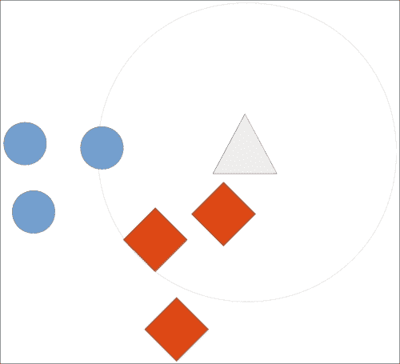
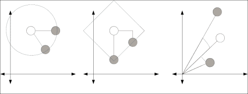
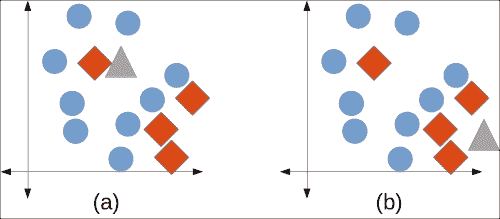
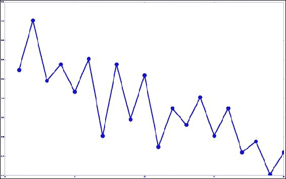
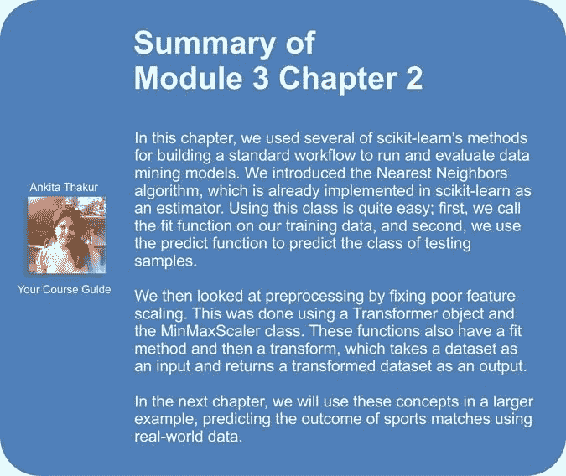

# 第 2 章。使用 scikit-learn 估计器进行分类

`scikit-learn`库是数据挖掘算法的集合，这些数据挖掘算法是用 Python 编写的，并使用通用编程接口。 这使用户可以轻松尝试不同的算法，并利用标准工具进行有效的测试和参数搜索。 scikit-learn 中有大量算法和实用程序。

在本章中，我们着重于为运行数据挖掘过程建立一个良好的框架。 这将在后面的章节中使用，所有这些章节都将重点放在那些情况下的应用程序和技术上。

本章介绍的关键概念如下：

*   **估算器**：此用于执行分类，聚类和回归
*   **变压器**：此用于执行预处理和数据更改
*   **管道**：这是，可将您的工作流程整合为可复制的格式

# scikit 学习估算器

估计器是`scikit-learn's`抽象，允许大量分类算法的标准化实现。 估计器用于分类。 估算器具有以下两个主要功能：

*   `fit()`：此进行算法训练并设置内部参数。 它需要两个输入，训练样本数据集和这些样本的相应类。
*   `predict()`：此预测作为输入给出的测试样本的类别。 此函数返回一个数组，其中包含每个输入测试样本的预测。

大多数`scikit-learn`估算器都将`NumPy`数组或相关格式用于输入和输出。

scikit-learn 中有大量估计量。 这些包括**支持向量机**（**SVM**），**随机** **森林**和**神经网络**。 这些算法中的许多算法将在的后续章节中使用。 在本章中，我们将使用与`scikit-learn`不同的估算器：**最近邻居**。

### 注意

对于本章，您将需要安装一个名为`matplotlib`的新库。 最简单的安装方法是使用`pip3`，就像在第 1 章，*数据挖掘入门*中所做的那样，安装`scikit-learn`：

```py
$pip3 install matplotlib

```

如果您在安装`matplotlib`时遇到任何困难，请在[这个页面](http://matplotlib.org/users/installing.html)中查找官方安装说明。

## 最近的邻居

**最近的邻居**是，可能是标准数据挖掘算法集中最直观的算法之一。 为了预测新样本的类别，我们在训练数据集中浏览了与新样本最相似的样本。 我们采用最相似的样本，并预测大多数样本所具有的类别。

例如，我们希望根据三角形的类更相似来预测它的类（此处通过将相似的对象靠得更近来表示）。 我们寻找三个最近的邻居，即两个菱形和一个正方形。 菱形多于圆形，因此三角形的预测类别为菱形：



最近邻居几乎可用于任何数据集，但是，计算所有样本对之间的距离在计算上非常昂贵。 例如，如果数据集中有 10 个样本，则有 45 个唯一距离要计算。 但是，如果有 1000 个样本，则将近 500,000！ 存在多种方法可以大大提高该速度。 其中一些内容将在本模块的后续章节中介绍。

它在基于分类的数据集中的表现也很差，应该使用其他算法代替。


## 距离指标

数据挖掘中的一个关键基础概念是距离。 如果我们有两个样本，则需要知道它们彼此之间有多近。 此外，我们需要回答一些问题，例如这两个样本是否比其他两个样本更相似？ 回答这样的问题对于案件的结果很重要。

人们知道的最常见的距离度量是**欧几里德**距离，它是*现实世界中的*距离。 如果要在图形上绘制这些点并使用直尺测量距离，则结果将是欧几里得距离。 更正式地说，它是每个要素的平方距离之和的平方根。

欧几里得距离很直观，但是如果某些要素的值大于其他要素，则精度会较差。 当许多特征的值为 0（称为稀疏矩阵）时，结果也会很差。 还有其他距离度量标准正在使用中。 常用的两个是曼哈顿距离和余弦距离。

**曼哈顿**距离是每个要素的绝对差之和（不使用平方距离）。 直观上，可以将中的白嘴鸦棋子（或城堡）在点之间移动所需要的移动次数考虑在内，前提是一次只能移动一个正方形。 如果某些要素具有比其他要素更大的值，则曼哈顿距离确实会受到影响，但效果却不如欧几里得。

**余弦**距离更适合，适用于某些特征大于其他特征且数据集中存在大量零的情况。 直观地，我们从原点到每个样本绘制一条直线，并测量这些直线之间的角度。 在下图中可以看到：



在此示例中，每个灰色圆圈与白色圆圈的距离相同。 在（a）中，距离是欧几里得距离，因此，类似的距离适用于一个圆。 可以使用标尺测量该距离。 在（b）中，距离为曼哈顿，也称为城市街区。 我们通过在行和列之间移动来计算距离，类似于国际象棋中的白嘴鸦（城堡）如何移动。 最后，在（c）中，我们具有余弦距离，该余弦距离是通过计算从样本绘制到矢量的直线之间的角度而测得的，而忽略了直线的实际长度。

选择的距离指标可能会对最终效果产生很大影响。 例如，如果您有许多功能，则随机样本之间的欧几里德距离接近相同的值。 由于距离相同，因此很难比较样本！ 在某些情况下，曼哈顿距离可能会更稳定，但是如果某些要素的值很大，则*可能会推翻*在其他要素中的许多相似性。 最后，余弦距离是比较具有大量特征的项目的一个很好的指标，但是它会丢弃一些有关向量长度的信息，这在某些情况下很有用。

在本章中，我们将在后面的章节中使用其他度量来保持欧几里得距离。


## 加载数据集

我们将要使用的数据集被称为*电离层*，其中是许多高频天线的记录。 天线的目的是确定电离层中是否存在结构以及高层大气中是否存在区域。 具有结构的那些被认为是好的，而没有结构的那些被认为是坏的。 此应用程序的目的是建立一个数据挖掘分类器，该分类器可以确定图像的好坏。


（图片来源：<https://www.flickr.com/photos/geckzilla/16149273389/>）

可以从 UCL 机器学习数据存储库下载，其中包含用于不同数据挖掘应用程序的大量数据集。 转到[这个页面](http://archive.ics.uci.edu/ml/datasets/Ionosphere)并单击**数据文件夹**。 将，`ionosphere.data`和`ionosphere.names`文件下载到计算机上的文件夹中。 对于此示例，我假设您已将数据集放在主文件夹中名为 Data 的目录中。

### 注意

主文件夹的位置取决于您的操作系统。 对于 Windows，通常为`C:\Documents and Settings\username`。 对于 Mac 或 Linux 机器，通常为`/home/username`。 您可以通过运行以下 python 代码获取主文件夹：

```py
import os
print(os.path.expanduser("~"))

```

对于数据集中的每一行，有 35 个值。 前 34 个是从 17 根天线（每个天线有两个值）获取的测量值。 最后一个是“ g”或“ b”； 分别代表好与坏。

启动 IPython Notebook 服务器，并为本章创建一个名为**电离层最近邻居**的新笔记本。

首先，我们加载代码所需的`NumPy`和`csv`库：

```py
import numpy as np
import csv
```

要加载数据集，我们首先获取数据集的文件名。 首先，从数据文件夹中获取存储数据集的文件夹：

```py
data_filename = os.path.join(data_folder, "Ionosphere", "ionosphere.data")
```

然后，我们创建`X`和`y` NumPy 数组来存储数据集。这些数组的大小可以从数据集中得知。 如果您不知道将来的数据集的大小，请不要担心-我们将使用其他方法在以后的章节中加载数据集，并且您无需事先知道此大小：

```py
X = np.zeros((351, 34), dtype='float')
y = np.zeros((351,), dtype='bool')
```

数据集采用**逗号分隔值**（**CSV**）格式，这是数据集的常用格式。 我们将使用`csv`模块加载该文件。 导入它并设置一个`csv`阅读器对象：

```py
with open(data_filename, 'r') as input_file:
    reader = csv.reader(input_file)
```

接下来，我们遍历文件中的各行。 每行代表一组新的度量，这是此数据集中的一个样本。 我们也使用 enumerate 函数来获取行的索引，因此我们可以更新数据集中的适当样本（`X`）：

```py
    for i, row in enumerate(reader):
```

我们从该样本中获取前 34 个值，将每个值转换为浮点数，然后将其保存到我们的数据集中：

```py
  data = [float(datum) for datum in row[:-1]]
  X[i] = data
```

最后，我们获取行的最后一个值并设置类。 如果它是一个好的样本，我们将其设置为 1（或`True`），否则将其设置为 0：

```py
  y[i] = row[-1] == 'g'
```

现在，我们在`X,`中具有示例和特征的数据集，在`y`中具有相应的类，就像在第 1 章，*的分类示例中所做的一样。 。*


## 迈向标准工作流程

`scikit-learn`中的估计器具有两个主要功能：`fit()`和`predict()`。 我们使用`fit`方法和我们的训练集来训练算法。 我们在测试集上使用`predict`方法对其进行评估。

首先，我们需要创建这些训练和测试集。 和以前一样，导入并运行`train_test_split`函数：

```py
from sklearn.cross_validation import train_test_split
X_train, X_test, y_train, y_test = train_test_split(X, y, random_state=14)
```

然后，我们导入最近的邻居类并为其创建一个实例。 现在，我们将参数保留为默认值，本章稍后将选择合适的参数。 默认情况下，该算法将选择五个最近的邻居来预测测试样本的类别：

```py
from sklearn.neighbors import KNeighborsClassifierestimator = KNeighborsClassifier()
```

创建估算器后，我们必须将其拟合到训练数据集中。 对于最近的邻居类，这记录了我们的数据集，从而允许我们通过将新点与训练数据集进行比较来找到新数据点的最近邻居：

```py
estimator.fit(X_train, y_train)
```

然后，我们使用测试集训练算法，并使用测试集进行评估：

```py
y_predicted = estimator.predict(X_test)
accuracy = np.mean(y_test == y_predicted) * 100
print("The accuracy is {0:.1f}%".format(accuracy))
```

准确率达到 86.4％，对于默认算法和仅几行代码而言，这是令人印象深刻的！ 显式选择了大多数`scikit-learn`默认参数，以与一系列数据集配合使用。 但是，您始终应该基于应用程序实验的知识来选择参数。

## 运行算法

在我们的早期实验中，我们将数据集的一部分留作测试集，其余作为训练集。 我们在训练集上训练算法，并根据测试集评估算法的有效性。 但是，如果我们幸运并选择一个简单的测试集会发生什么？ 或者，如果它特别麻烦怎么办？ 由于数据的这种“不幸”分裂而导致的不良结果，我们可以丢弃一个好的模型。

交叉折叠验证框架是解决数据挖掘中选择测试集和标准方法的问题的一种方法。 该过程通过对不同的训练和测试分组进行大量实验来工作，但是每个样本仅在测试集中使用一次。 步骤如下：

1.  将整个数据集拆分为多个称为折叠的部分。
2.  对于数据集中的每个折叠，执行以下步骤：

    *   将该折叠设置为当前测试集
    *   在其余折叠上训练算法
    *   评估 当前测试集

3.  报告所有评估分数，包括平均分数。
4.  在此过程中，每个样本仅在测试集中使用一次。 这样可以减少（但不能完全消除）选择幸运测试集的可能性。 

    ### 注意

    在整个模块中，代码示例在一个章中相互构建。 除非另有说明，否则各章的代码应输入到同一 `IPython` 笔记本中。

`scikit-learn`库包含许多交叉折叠验证方法。 给出了执行前面过程的`helper`功能。 我们现在可以将其导入 IPython Notebook：

```py
from sklearn.cross_validation import cross_val_score
```

### 注意

默认为，`cross_val_score`使用一种称为**分层 K 折**的特定方法将数据集拆分为折叠。 这样创建的折页在每个折页中的类别比例几乎相同，再次降低了选择不良折页的可能性。 这是一个很好的默认设置，因此我们现在不会对其进行处理。

接下来，我们使用此函数，传递原始（完整）数据集和类：

```py
scores = cross_val_score(estimator, X, y, scoring='accuracy')average_accuracy = np.mean(scores) * 100print("The average accuracy is {0:.1f}%".format(average_accuracy))
```

这给出了 82.3％的适度结果，但是考虑到我们还没有尝试设置更好的参数，它还是相当不错的。 在下一节中，我们将看到如何更改参数以获得更好的结果。

## 设置参数

几乎所有数据挖掘算法都具有用户可以设置的参数。 这通常是使算法通用化的原因，以使其可用于多种情况。 设置这些参数可能非常困难，因为选择良好的参数值通常高度依赖于数据集的特征。

最近邻居算法具有多个参数，但是最重要的一个参数是预测未知属性类别时要使用的最近邻居数量。 在 `scikit-learn`中，此参数称为`n_neighbors`。 在下图中，我们显示了当此数字太低时，随机标记的样本可能会导致错误。 相反，当它太高时，实际最近的邻居对结果的影响较小：



在图（a）的左侧，我们通常希望测试样品（三角形）被分类为圆形。 但是，如果`n_neighbors`为 1，则该区域中的单个红色菱形（可能是有噪声的样本）会导致该样本被预测为菱形，而它似乎位于红色区域中。 在图（b）中，我们通常希望测试样品被归类为钻石。 但是，如果`n_neighbors`为 7，则三个最接近的邻居（都是菱形）将被大量的圆形样本覆盖。

如果我们要测试`n_neighbors`参数的多个值，例如，每个值从 1 到 20，则可以通过设置`n_neighbors`并观察结果来多次重新运行实验：

```py
avg_scores = []
all_scores = []
parameter_values = list(range(1, 21))  # Include 20
for n_neighbors in parameter_values:
    estimator = KNeighborsClassifier(n_neighbors=n_neighbors)
    scores = cross_val_score(estimator, X, y, scoring='accuracy')
```

计算平均值并将其存储在我们的分数列表中。 我们还将存储完整的分数集，以供以后分析：

```py
    avg_scores.append(np.mean(scores))
    all_scores.append(scores)
```

然后我们可以绘制`n_neighbors`的值和精度之间的关系。 首先，我们告诉 IPython 笔记本我们要在笔记本本身中内联显示图：

```py
%matplotlib inline
```

然后，我们从`matplotlib`库中导入 `pyplot`并将参数值与平均分数一起绘制：

```py
from matplotlib import pyplot as plt plt.plot(parameter_values, avg_scores, '-o')
```



尽管有很多方差，但该图显示出随着邻居数量增加而减少的趋势。


# 使用管道进行预处理

当进行现实世界物体的测量时，我们通常可以获得范围非常不同的特征。 例如，如果我们正在测量动物的品质，则可能具有以下几个特征：

*   **腿数**：对于大多数动物，这是介于 0-8 之间的范围，而有些动物的更多！
*   **重量**：这仅在几微克的范围内，一直到重量为 190,000 公斤的蓝鲸！
*   **心数**：如果是。，则可以在零到五之间。

对于基于数学的算法来比较每个特征，规模，范围和单位的差异可能难以解释。 如果我们在许多算法中使用上述功能，则权重可能是最有影响力的功能，因为仅是数量较大，而与功能的实际有效性无关。

解决此问题的方法之一是使用称为*标准化*功能的预处理过程，以使它们具有相同的范围，或被归类为*小*等类别，*中型*和*大*。 突然之间，特征类型的巨大差异对算法的影响较小，并且可能导致准确性的大幅提高。

预处理还可以用于仅选择更有效的功能，创建新功能等。 `scikit-learn`中的预处理是通过`Transformer`对象完成的，这些对象以一种形式获取数据集，并在对数据进行某种转换后返回更改后的数据集。 这些不必一定是数字，因为变形金刚也用于提取特征，但是在本节中，我们将坚持预处理。

## 一个例子

我们可以通过*破坏* `Ionosphere`数据集来显示问题的示例。 尽管这只是一个示例，但许多现实世界的数据集都存在这种形式的问题。 首先，我们创建数组的副本，以便不更改原始数据集：

```py
X_broken = np.array(X)
```

接下来，我们*通过将第二个特征除以`10`来打破*数据集：

```py
X_broken[:,::2] /= 10
```

从理论上讲，这不会对结果产生太大影响。 毕竟，这些功能的值仍然相对相同。 主要问题是比例尺已更改，奇数特征*现在比偶数特征大*。 我们可以通过计算精度来看到此效果：

```py
estimator = KNeighborsClassifier()
original_scores = cross_val_score(estimator, X, y,scoring='accuracy')
print("The original average accuracy for is {0:.1f}%".format(np.mean(original_scores) * 100))
broken_scores = cross_val_score(estimator, X_broken, y,scoring='accuracy')
print("The 'broken' average accuracy for is {0:.1f}%".format(np.mean(broken_scores) * 100))
```

原始数据集的得分为 82.3％，在损坏的数据集上下降为 71.5％。 我们可以通过将所有功能缩放到`0`至`1`范围来解决此问题。

## 标准预处理

我们将为执行的预处理通过`MinMaxScaler`类称为基于特征的归一化。 继续本章其余部分的 IPython 笔记本，首先，我们导入此类：

```py
from sklearn.preprocessing import MinMaxScaler
```

此类采用每个功能并将其缩放到`0`至`1`范围。 最小值替换为`0`，最大值替换为`1`，而其他值介于两者之间。

要应用预处理器，我们在其上运行 transform 函数。 尽管`MinMaxScaler`没有，但是某些变压器需要首先以与分类器相同的方式进行训练。 我们可以通过运行`fit_transform`函数来组合这些步骤：

```py
X_transformed = MinMaxScaler().fit_transform(X)
```

在此，`X_transformed`将具有与`X`相同的形状。 但是，每列的最大值为 1，最小值为 0。

以这种方式进行标准化的其他各种形式，对其他应用程序和要素类型也有效：

*   使用`sklearn.preprocessing.Normalizer`确保每个样本的值总和等于 1
*   使用`sklearn.preprocessing.StandardScaler`强制每个特征均值为零且方差为 1，这是标准化的常用起点
*   使用`sklearn.preprocessing.Binarizer`将数字特征转换为二进制特征，其中高于阈值的任何值均为 1，低于阈值的任何值为 0

在后面的章节中，我们将结合使用这些预处理器以及其他类型的`Transformers`对象。

## 全部放在一起

现在，我们可以通过使用先前计算的分解数据集来组合上一部分中的代码来创建工作流程：

```py
X_transformed = MinMaxScaler().fit_transform(X_broken)
estimator = KNeighborsClassifier()
transformed_scores = cross_val_score(estimator, X_transformed, y, scoring='accuracy')
print("The average accuracy for is {0:.1f}%".format(np.mean(transformed_scores) * 100))
```

这使我们获得了 82.3％的准确率。 `MinMaxScaler`产生的特征具有相同的比例，这意味着没有任何特征会因为仅仅是更大的值而超过其他特征。 尽管可以将“最近邻居”算法与较大的功能混淆，但某些算法可以更好地处理比例差异。 相反，有些情况更糟！

# 管道

随着实验的发展，操作的复杂性也在增加。 我们可能会拆分数据集，对特征进行二值化，执行基于特征的缩放，执行基于样本的缩放以及更多其他操作。

跟踪所有这些操作可能会造成混乱，并可能导致无法复制结果。 问题包括忘记一个步骤，错误地应用转换或添加不需要的转换。

另一个问题是代码的顺序。 在上一节中，我们创建了`X_transformed`数据集，然后创建了用于交叉验证的新估算器。 如果我们有多个步骤，则需要在代码中跟踪所有对数据集的更改。

管道是解决这些问题（以及其他问题的结构，我们将在下一章中看到）。 管道将步骤存储在数据挖掘工作流中。 他们可以接收您的原始数据，执行所有必要的转换，然后创建预测。 这使我们可以在`cross_val_score`之类的函数中使用流水线，它们期望估计器。 首先，导入`Pipeline`对象：

```py
from sklearn.pipeline import Pipeline
```

管道将步骤列表作为输入，代表数据挖掘应用程序的链。 最后一步需要是`Estimator`，而所有先前的步骤都是`Transformers`。 每个`Transformer`都会更改输入数据集，其中一步的输出是下一步的输入。 最后，样本由最后一步的估算器分类。 在我们的管道中，我们有两个步骤：

1.  使用`MinMaxScaler`将特征值从 0 缩放到 1
2.  使用`KNeighborsClassifier`作为分类算法

然后，每个步骤由元组`('name', step)`表示。 然后，我们可以创建管道：

```py
scaling_pipeline = Pipeline([('scale', MinMaxScaler()),
                             ('predict', KNeighborsClassifier())])
```

这里的关键是元组列表。 第一个元组是我们的缩放步骤，第二个元组是预测步骤。 我们为每个步骤指定一个名称：第一个我们称为`scale`，第二个我们称为`predict`，但是您可以选择自己的名称。 元组的第二部分是实际的 Transformer 或 estimator 对象。

现在，使用之前的交叉验证代码，运行此管道非常容易：

```py
scores = cross_val_score(scaling_pipeline, X_broken, y, scoring='accuracy')
print("The pipeline scored an average accuracy for is {0:.1f}%".format(np.mean(transformed_scores) * 100))
```

由于我们正在有效地执行相同的步骤，因此我们得到的分数与以前相同（82.3％）。

在后面的章节中，我们将使用更高级的测试方法，并且设置管道是确保代码复杂度不会难以管理的好方法。




