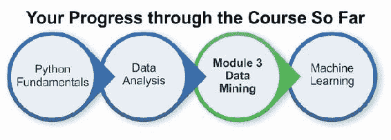

# 第 4 章。使用亲和力分析推荐电影

在本章中，我们将研究确定对象何时频繁出现的亲和力分析。 在确定何时一起购买物品的用例之一之后，通俗地称为“市场篮子分析”。

在第 3 章，“用决策树”预测运动优胜者中，我们将一个对象视为焦点，并使用特征来描述该对象。 在本章中，数据具有不同的形式。 我们有一些交易，其中以某种方式在这些交易中使用了感兴趣的对象（本章中的电影）。 目的是发现对象同时发生的时间。 在此示例中，我们希望确定何时由同一位审阅者推荐两部电影。

本章的关键概念如下：

*   亲和力分析
*   使用 Apriori 算法进行特征关联挖掘
*   电影推荐
*   稀疏数据格式

# 亲和力分析

亲和力分析是确定何时以类似方式使用对象的任务。 在上一章中，我们集中于对象本身是否相似。 用于亲和力分析的数据通常以事务的形式描述。 直观地讲，这来自商店的交易-确定何时一起购买物品。

但是，它可以应用于许多过程：

*   欺诈识别
*   客户细分
*   软件优化
*   产品推荐

亲和力分析通常比分类更具探索性。 我们常常没有许多分类任务所需的完整数据集。 例如，在电影推荐中，我们对不同电影的评论来自不同的人。 但是，不太可能让每个审阅者审阅数据集中的所有电影。 这在亲和力分析中留下了一个重要而困难的问题。 如果评论者没有评论过电影，是否表明他们对电影不感兴趣（因此不推荐），或者仅仅是他们还没有评论过？

我们不会在本章中回答该问题，但是考虑数据集中的空白可能会导致类似的问题。 反过来，这可能会导致可能有助于提高方法效率的答案。

## 亲和力分析算法

我们在第 1 章，“数据挖掘入门”中引入了一种用于亲和力分析的基本方法，该方法测试了所有可能的规则组合。 我们计算了每个规则的置信度和支持度，从而使我们能够对它们进行排名，以找到最佳规则。

但是，这种方法效率不高。 我们在第 1 章，“数据挖掘入门”中的数据集仅售出 5 件。 我们可以预期，即使是一家小商店，也会有数百种商品待售，而许多在线商店将拥有成千上万（甚至数百万！）。 通过天真​​的规则创建（例如我们之前的算法），计算这些规则所需的时间增长呈指数增长。 随着我们添加更多项目，计算所有规则所需的时间显着增加。 具体而言，规则的总数为 *2n-1*。 对于我们的五项数据集，有 31 条可能的规则。 对于 10 个项目，它是 1023。对于仅 100 个项目，该数字具有 30 位数字。 甚至计算能力的急剧增加也无法跟上在线存储物品数量的增加。 因此，我们需要更智能的算法，而不是更辛苦的计算机。

用于亲和力分析的经典算法称为 Apriori 算法。 它解决了创建在数据库中频繁出现的项目集（称为**频繁项目集**）的指数问题。 一旦发现了这些频繁的项目集，就很容易创建关联规则。

Apriori 的直觉既简单又聪明。 首先，我们确保规则在数据集中具有足够的*支持*。 定义最低支持级别是 Apriori 的关键参数。 若要建立一个频繁的项目集，要使一个项目集（A，B）的支持至少达到 30，A 和 B 在数据库中都必须发生至少 30 次。 此属性也扩展到更大的集合。 对于被认为是频繁的项目集（A，B，C，D），集合（A，B，C）也必须是频繁的（与 D 一样）。

可以构建这些*频繁项目集*，并且不会测试不频繁（可能有很多）的可能项目集。 这节省了测试新规则的大量时间。

用于亲和力分析的其他示例算法包括 **Eclat** 和 **FP-growth** 算法。 数据挖掘文献中对这些算法进行了许多改进，进一步提高了该方法的效率。 在本章中，我们将重点介绍基本的 Apriori 算法。

## 选择参数

为了执行关联规则挖掘以进行亲和力分析，我们首先使用 Apriori 生成频繁项集。 接下来，我们通过测试前提条件和结论在这些频繁项目集中的组合，来创建关联规则（例如，如果某人推荐电影`X`，他们也会推荐电影`Y`）。

对于第一阶段，Apriori 算法需要一个值，该值用于将项目集视为频繁的最小支持。 任何支持较少的项目集将不予考虑。 将此最低支持设置得太低将导致 Apriori 测试大量项目集，从而减慢算法速度。 设置得太高将导致较少的项目集被认为是频繁的。

在第二阶段，在发现频繁项集之后，将根据其置信度对关联规则进行测试。 我们可以选择最低置信度，可以选择返回多个规则，也可以简单地返回所有规则，然后让用户决定如何处理它们。

在本章中，我们将仅返回给定置信度以上的规则。 因此，我们需要设置最低置信度。 将此值设置得太低将导致规则具有较高的支持度，但并不十分准确。 将此值设置得更高将导致仅返回更准确的规则，但发现的规则却更少。

# 电影推荐问题

产品推荐是一项大生意。 在线商店通过推荐其他客户可以购买的产品，将其用于向客户进行向上销售。 提出更好的建议可以带来更好的销售。 当在线购物每年销售给数百万个客户时，向这些客户销售更多商品会产生很多潜在的收益。

产品推荐已经研究了很多年。 但是，当 Netflix 在 2007 年至 2009 年间获得 Netflix 奖时，该领域获得了巨大的推动。该竞赛旨在确定是否有人能够预测用户对电影的评级要好于 Netflix 当前的表现。 奖杯比目前的解决方案高出 10％以上。 尽管这似乎不是很大的改进，但这种改进可以通过更好的电影推荐为 Netflix 带来数百万美元的收入。

## 获取数据集

自从成立 Netflix 奖以来，明尼苏达大学的研究小组 Grouplens 已发布了多个数据集，这些数据集通常用于测试该领域的算法。 他们发布了电影分级数据集的多个版本，大小各异。 有一个具有 100,000 条评论的版本，一个具有 100 万条评论，一个具有 1000 万条评论。

数据集可从[这个页面](http://grouplens.org/datasets/movielens/)获得，我们将在本章中使用的数据集是 MovieLens 100 万数据集。 下载此数据集并将其解压缩到您的数据文件夹中。 启动一个新的 IPython Notebook 并输入以下代码：

```pypy
import os
import pandas as pd
data_folder = os.path.join(os.path.expanduser("~"), "Data", "ml-100k")
ratings_filename = os.path.join(data_folder, "u.data")
```

确保`ratings_filename`指向解压缩文件夹中的`u.data`文件。

## 加载大熊猫

MovieLens 数据集状态良好； 但是，我们需要对`pandas.read_csv`中的默认选项进行一些更改。 首先，数据由制表符（而不是逗号）分隔。 接下来，没有标题行。 这意味着文件中的第一行实际上是数据，我们需要手动设置列名。

加载文件时，我们将 delimiter 参数设置为制表符，告诉熊猫不要读取第一行作为标题（带有`header=None`），并设置列名。 让我们看下面的代码：

```pypy
all_ratings = pd.read_csv(ratings_filename, delimiter="\t",header=None, names = ["UserID", "MovieID", "Rating", "Datetime"])
```

尽管我们将在本章中不使用它，但是您可以使用以下行正确地解析日期时间戳：

```pypy
all_ratings["Datetime"] = pd.to_datetime(all_ratings['Datetime'],unit='s')
```

您可以通过在新单元格中运行以下命令来查看前几条记录：

```pypy
all_ratings[:5]
```

结果将看起来像这样：

<colgroup class="calibre17"><col class="calibre18"> <col class="calibre18"> <col class="calibre18"> <col class="calibre18"> <col class="calibre18"></colgroup> 
|   | 

用户身份

 | 

电影 ID

 | 

评分

 | 

约会时间

 |
| --- | --- | --- | --- | --- |
|`0`| 196 | 242 | 3 | 1997-12-04 15:55:49 |
|`1`| 186 | 302 | 3 | 1998-04-04 19:22:22 |
|`2`| 22 | 377 | 1 | 1997-11-07 07:18:36 |
|`3`| 244 | 51 | 2 | 1997-11-27 05:02:03 |
|`4`| 166 | 346 | 1 | 1998-02-02 05:33:16 |

## 稀疏数据格式

该数据集为稀疏格式。 可以将每一行视为上一章中所使用类型的大型特征矩阵中的单元，其中行是用户，列是单独的电影。 第一列将是每个用户对第一部电影的评论，第二列将是每个用户对第二部电影的评论，依此类推。

此数据集中有 1,000 个用户和 1,700 部电影，这意味着完整的矩阵将非常大。 我们可能会遇到将整个矩阵存储在内存中并在其上进行计算的麻烦。 但是，此矩阵具有大多数单元为空的属性，也就是说，大多数用户对大多数电影都没有评论。 但是，对于用户`#213`，没有针对电影`#675`的评论，对于用户和电影的大多数其他组合，则没有评论。

此处给出的格式代表完整的矩阵，但格式更紧凑。 第一行表示用户`#196`观看了电影`#242`，在 1997 年 12 月 4 日，该电影的排名为 3（五分之三）。

假定该数据库中没有用户和电影的任何组合，则不存在。 与在内存中存储一​​堆零相反，此节省了大量空间。 这种格式称为**稀疏矩阵**格式。 根据经验，如果您希望约 60％或更多的数据集为空或为零，则稀疏格式将占用较少的存储空间。

在稀疏矩阵上进行计算时，通常不将重点放在我们没有的数据上，而是比较所有零。 我们通常关注于我们拥有的数据并进行比较。


# Apriori 实现

本章的目标旨在产生以下格式的规则：*如果有人推荐这些电影，他们也会推荐该电影*。 我们还将讨论如果有人推荐一组电影可能会推荐另一部特定电影的扩展。

为此，我们首先需要确定一个人是否推荐电影。 为此，我们可以创建一个新功能`Favorable`，如果该人对电影给予了好评，则该功能为`True`：

```pypy
all_ratings["Favorable"] = all_ratings["Rating"] > 3
```

我们可以通过查看数据集来查看新功能：

```pypy
all_ratings[10:15]
```

<colgroup class="calibre17"><col class="calibre18"> <col class="calibre18"> <col class="calibre18"> <col class="calibre18"> <col class="calibre18"> <col class="calibre18"></colgroup> 
|   | 

用户身份

 | 

电影 ID

 | 

评分

 | 

约会时间

 | 

有利

 |
| --- | --- | --- | --- | --- | --- |
|`10`| 62 | 257 | 2 | 1997-11-12 22:07:14 | 错误的 |
|`11`| 286 | 1014 | 5 | 1997-11-17 15:38:45 | 真的 |
|`12`| 200 | 222 | 5 | 1997-10-05 09:05:40 | 真的 |
|`13`| 210 | 40 | 3 | 1998-03-27 21:59:54 | 错误的 |
|`14`| 224 | 29 | 3 | 1998-02-21 23:40:57 | 错误的 |

我们将采样我们的数据集以形成训练数据集。 这也有助于减小将要搜索的数据集的大小，从而使 Apriori 算法的运行速度更快。 我们从前 200 个用户中获得所有评论：

```pypy
ratings = all_ratings[all_ratings['UserID'].isin(range(200))]
```

接下来，我们可以创建样本中仅包含好评的数据集：

```pypy
favorable_ratings = ratings[ratings["Favorable"]]
```

我们将搜索用户对我们的商品集的好评。 因此，接下来我们需要的是每个用户都喜欢的电影。 我们可以通过按用户 ID 对数据集进行分组并遍历每个组中的电影来进行计算：

```pypy
favorable_reviews_by_users = dict((k, frozenset(v.values))
                                   for k, v in favorable_ratings
                                   groupby("UserID")["MovieID"])
```

在前面的代码中，我们将值存储为`frozenset`，从而使我们能够快速检查电影是否已被用户评级。 对于这种类型的操作，集合比列表快得多，我们将在以后的代码中使用它们。

最后，我们可以创建一个 DataFrame 来告诉我们每部电影获得好评的频率：

```pypy
num_favorable_by_movie = ratings[["MovieID", "Favorable"]]. groupby("MovieID").sum()
```

通过运行以下代码，我们可以查看前五部电影：

```pypy
num_favorable_by_movie.sort("Favorable", ascending=False)[:5]
```

让我们看一下前五部电影列表：

<colgroup class="calibre17"><col class="calibre18"> <col class="calibre18"></colgroup> 
| 

电影 ID

 | 

有利

 |
| --- | --- |
| 50 | 100 |
| 100 | 89 |
| 258 | 83 |
| 181 | 79 |
| 174 | 74 |

## Apriori 算法

Apriori 算法是我们的​​亲和力分析的一部分，专门用于查找数据中的频繁项集。 Apriori 的基本过程是从以前发现的频繁项目集构建新的候选项目集。 对这些候选项进行测试以查看它们是否频繁出现，然后算法按以下说明进行迭代：

1.  通过将每个项目放置在其自己的项目集中来创建初始频繁项目集。 在此步骤中，仅使用支持最少的项目。
2.  通过查找现有频繁项目集的超集，从最近发现的频繁项目集创建新的候选项目集。
3.  测试所有候选项目集以查看它们是否频繁。 如果候选人不频繁，则将其丢弃。 如果此步骤中没有新的频繁项目集，请转到最后一步。
4.  存储新发现的频繁项目集，然后转到第二步。
5.  返回所有发现的频繁项目集。

以下工作流概述了此过程：


## 实施

在 Apriori 的第一次迭代中，新发现的项目集的长度为 2，因为它们是第一步中创建的初始项目集的超集。 在第二次迭代中（应用第四步之后），新发现的项目集的长度为 3。这使我们能够根据第二步的需要快速识别新发现的项目集。

我们可以将发现的频繁项集存储在字典中，其中的关键是项集的长度。 这使我们能够在以下代码的帮助下快速访问给定长度的项目集，从而可以访问最近发现的频繁项目集：

```pypy
frequent_itemsets = {}
```

我们还需要定义一个项目集被视为频繁的最低支持。 该值是根据数据集选择的，但是可以尝试使用其他值。 不过，我建议一次只将其更改 10％，因为算法运行所需的时间会大大不同！ 让我们应用最低限度的支持：

```pypy
min_support = 50
```

为了实现 Apriori 算法的第一步，我们分别为每个电影创建一个项目集，并测试该项目集是否频繁。 我们使用`frozenset`，因为它们允许我们稍后执行设置操作，它们也可以用作计数字典中的键（常规设置不能）。 让我们看下面的代码：

```pypy
frequent_itemsets[1] = dict((frozenset((movie_id,)),
                                 row["Favorable"])
                                 for movie_id, row in num_favorable_by_movie.iterrows()
                                 if row["Favorable"] > min_support)
```

为了实现效率，我们共同创建了第二和第三步，方法是创建一个函数，该函数采用新发现的频繁项集，创建超集，然后测试它们是否频繁。 首先，我们设置函数和计数字典：

```pypy
from collections import defaultdict
def find_frequent_itemsets(favorable_reviews_by_users, k_1_itemsets, min_support):
    counts = defaultdict(int)
```

为了尽可能少地读取数据，我们每次调用此函数都会对数据集进行一次迭代。 尽管在此实现中这无关紧要（我们的数据集相对较小），但是对于大型应用程序来说，这是一个好习惯。 我们遍历所有用户及其评论：

```pypy
    for user, reviews in favorable_reviews_by_users.items():
```

接下来，我们遍历每个先前发现的项目集，并查看它是否是当前评论集的子集。 如果是，则表示用户已查看项目集中的每个电影。 让我们看一下代码：

```pypy
        for itemset in k_1_itemsets:
            if itemset.issubset(reviews):
```

然后，我们可以浏览用户查看过的每个未在项目集中的单个电影，从中创建一个超集，并在计数字典中记录我们看到的该特定项目集。 让我们看一下代码：

```pypy
                for other_reviewed_movie in reviews - itemset:
                    current_superset = itemset | frozenset((other_reviewed_movie,))
                    counts[current_superset] += 1
```

我们通过测试哪些候选项目集有足够的支持被认为是频繁的来结束我们的功能，并仅返回那些：

```pypy
    return dict([(itemset, frequency) for itemset, frequency in counts.items() if frequency >= min_support])
```

为了运行我们的代码，我们现在创建一个循环，循环遍历 Apriori 算法的各个步骤，并在进行过程中存储新的项目集。 在此循环中，`k`表示即将被发现的频繁项集的长度，从而使我们可以通过使用键 *k 在`frequent_itemsets`字典中查找来访问先前发现最多的项- 1*。 我们创建常用项目集，并将它们按其长度存储在我们的字典中。 让我们看一下代码：

```pypy
for k in range(2, 20):
    cur_frequent_itemsets = find_frequent_itemsets(favorable_reviews_by_users, frequent_itemsets[k-1],
          min_support)
     frequent_itemsets[k] = cur_frequent_itemsets
```

如果我们没有找到任何新的频繁项目集，我们想打破前面的循环（并打印一条消息，让我们知道发生了什么事情）：

```pypy
    if len(cur_frequent_itemsets) == 0:
        print("Did not find any frequent itemsets of length {}".format(k))
        sys.stdout.flush()
        break
```

### 注意

我们使用`sys.stdout.flush()`来确保在代码仍在运行时进行打印输出。 有时，在特定单元格中的大型循环中，直到代码完成后才进行打印输出。 以这种方式刷新输出可确保在需要时进行打印输出。 不过，不要做太多—刷新操作会带来计算成本（与打印一样），这会降低程序速度。

如果我们确实找到了频繁的项目集，我们将打印一条消息，让我们知道循环将再次运行。 该算法可能需要一段时间才能运行，因此在等待代码完成时知道代码仍在运行非常有帮助！ 让我们看一下代码：

```pypy
    else:
        print("I found {} frequent itemsets of length {}".format(len(cur_frequent_itemsets), k))
        sys.stdout.flush()
```

最终，在循环结束之后，我们不再对第一组项目集感兴趣-这些项目集的长度为 1，这对我们创建关联规则没有帮助-我们至少需要两个项目来创建关联规则。 让我们删除它们：

```pypy
del frequent_itemsets[1]
```

您现在可以运行此代码。 这可能需要几分钟，如果您使用的是较旧的硬件，则可能需要更多时间。 如果发现在运行任何代码示例时遇到问题，请查看使用在线云提供商以提高速度。 有关使用云进行工作的详细信息，请参见第 13 章，“后续步骤”。

前面的代码返回了 1,718 个不同长度的频繁项集。 您会注意到，项目集的数量在长度减小之前就随着长度的增加而增加。 由于可能的规则越来越多，所以它不断增长。 一段时间后，大量的组合不再具有被认为是频繁出现的必要支持。 这导致数量减少。 这种缩小是 Apriori 算法的好处。 如果我们搜索所有可能的项目集（而不仅仅是频繁项目集的超集），那么我们将搜索成千上万次的项目集，以查看它们是否频繁。

# 提取关联规则

在 Apriori 算法完成后，我们将获得一个频繁项集列表。 这些并不完全是关联规则，但与之相似。 频繁项集是一组具有最小支持的项，而关联规则具有前提和结论。

我们可以通过将项目集中的一部电影作为结论来从频繁项目集中制定关联规则。 项目集中的其他电影将作为前提。 这将形成以下形式的规则：*如果审阅者推荐前提条件中的所有电影，他们还将推荐结论*。

对于每个项目集，我们可以通过将每个电影设置为结论并将其余电影设置为前提来生成许多关联规则。

在代码中，我们首先遍历每个发现的每个长度的频繁项集，从每个频繁项集生成所有规则的列表：

```pypy
candidate_rules = []
for itemset_length, itemset_counts in frequent_itemsets.items():
    for itemset in itemset_counts.keys():
```

然后，我们迭代此项目集中的每个电影，并以此作为结论。 项目集中的其余电影是前提。 我们将前提和结论保存为我们的候选规则：

```pypy
        for conclusion in itemset:
            premise = itemset - set((conclusion,))
            candidate_rules.append((premise, conclusion))
```

这将返回大量候选规则。 通过打印出列表中的前几个规则，我们可以看到一些内容：

```pypy
print(candidate_rules[:5])
```

结果输出显示获得的规则：

```pypy
[(frozenset({79}), 258), (frozenset({258}), 79), (frozenset({50}), 64), (frozenset({64}), 50), (frozenset({127}), 181)]
```

在这些*规则*中，第一部分（`frozenset`）是前提中的电影列表，而后面的数字是结论。 在第一种情况下，如果审阅者推荐电影 79，则他们也可能会推荐电影 258。

接下来，我们计算每个规则的置信度。 此操作非常类似于第 1 章，“数据挖掘入门”，唯一的更改是使用新数据格式进行计算所需的更改。

该过程从创建字典开始，以存储我们看到得出结论的前提的次数（规则的*正确*示例）和不存在的次数（*错误*） 例子）。 让我们看一下代码：

```pypy
correct_counts = defaultdict(int)
incorrect_counts = defaultdict(int)
```

我们遍历所有用户，他们的好评以及每条候选关联规则：

```pypy
for user, reviews in favorable_reviews_by_users.items():
    for candidate_rule in candidate_rules:
        premise, conclusion = candidate_rule
```

然后，我们测试一下前提是否适用于该用户。 换句话说，用户是否在前提条件下浏览了所有电影？ 让我们看一下代码：

```pypy
        if premise.issubset(reviews):
```

如果前提适用，我们将看看结论电影是否也获得了好评。 如果是这样，则该规则在这种情况下是正确的。 如果不是，则不正确。 让我们看一下代码：

```pypy
        if premise.issubset(reviews):
            if conclusion in reviews:
                correct_counts[candidate_rule] += 1
            else:
                incorrect_counts[candidate_rule] += 1
```

然后，我们通过将正确的计数除以看到规则的总次数来计算每个规则的置信度：

```pypy
rule_confidence = {candidate_rule: correct_counts[candidate_rule] / float(correct_counts[candidate_rule] + incorrect_counts[candidate_rule])
              for candidate_rule in candidate_rules}
```

现在，我们可以通过排序此置信词典并打印结果来打印前五个规则：

```pypy
from operator import itemgetter
sorted_confidence = sorted(rule_confidence.items(), key=itemgetter(1), reverse=True)
for index in range(5):
    print("Rule #{0}".format(index + 1))
    (premise, conclusion) = sorted_confidence[index][0]
    print("Rule: If a person recommends {0} they will also recommend {1}".format(premise, conclusion))
    print(" - Confidence: {0:.3f}".format(rule_confidence[(premise, conclusion)]))
    print("")
```

结果如下：

```pypy
Rule #1
Rule: If a person recommends frozenset({64, 56, 98, 50, 7}) they will also recommend 174
 - Confidence: 1.000

Rule #2
Rule: If a person recommends frozenset({98, 100, 172, 79, 50, 56}) they will also recommend 7
 - Confidence: 1.000

Rule #3
Rule: If a person recommends frozenset({98, 172, 181, 174, 7}) they will also recommend 50
 - Confidence: 1.000

Rule #4
Rule: If a person recommends frozenset({64, 98, 100, 7, 172, 50}) they will also recommend 174
 - Confidence: 1.000

Rule #5
Rule: If a person recommends frozenset({64, 1, 7, 172, 79, 50}) they will also recommend 181
 - Confidence: 1.000
```

产生的打印输出仅显示电影 ID，如果没有电影名称也没有太大帮助。 数据集附带一个名为`u.items`的文件，该文件存储电影名称及其对应的`MovieID`（以及其他信息，例如流派）。

我们可以使用 pandas 从该文件中加载标题。 数据集随附的**自述文件**中提供了有关文件和类别的其他信息。 文件中的数据为 CSV 格式，但数据之间用`|`符号分隔； 它没有标题，并且编码很重要。 在`README`文件中找到了列名。

```pypy
movie_name_filename = os.path.join(data_folder, "u.item")
movie_name_data = pd.read_csv(movie_name_filename, delimiter="|", header=None, encoding = "mac-roman")
movie_name_data.columns = ["MovieID", "Title", "Release Date", "Video Release", "IMDB", "<UNK>", "Action", "Adventure",
    "Animation", "Children's", "Comedy", "Crime", "Documentary", "Drama", "Fantasy", "Film-Noir",
  "Horror", "Musical", "Mystery", "Romance", "Sci-Fi", "Thriller","War", "Western"]
```

获取电影标题很重要，因此我们将创建一个函数，该函数将从`MovieID`中返回电影的标题，从而避免了每次查找电影的麻烦。 让我们看一下代码：

```pypy
def get_movie_name(movie_id):
```

我们为给定的`MovieID`查找`movie_name_data` DataFrame，仅返回标题列：

```pypy
    title_object = movie_name_data[movie_name_data["MovieID"] == movie_id]["Title"]
```

我们使用 values 参数获取实际值（而不是当前存储在`title_object`中的熊猫`Series`对象）。 我们只对第一个值感兴趣-无论如何，给定的`MovieID`应该只有一个标题！

```pypy
    title = title_object.values[0]
```

我们根据需要返回标题来结束该函数。 让我们看一下代码：

```pypy
    return title
```

在新的 IPython Notebook 单元中，我们调整了先前的代码以打印出最高规则，同时还包括标题：

```pypy
for index in range(5):
    print("Rule #{0}".format(index + 1))
    (premise, conclusion) = sorted_confidence[index][0]
    premise_names = ", ".join(get_movie_name(idx) for idx in premise)
    conclusion_name = get_movie_name(conclusion)
    print("Rule: If a person recommends {0} they will also recommend {1}".format(premise_names, conclusion_name))
    print(" - Confidence: {0:.3f}".format(confidence[(premise, conclusion)]))
    print("")
```

结果更具可读性（仍然存在一些问题，但是我们暂时可以忽略它们）：

```pypy
Rule #1
Rule: If a person recommends Shawshank Redemption, The (1994), Pulp Fiction (1994), Silence of the Lambs, The (1991), Star Wars (1977), Twelve Monkeys (1995) they will also recommend Raiders of the Lost Ark (1981)
 - Confidence: 1.000

Rule #2
Rule: If a person recommends Silence of the Lambs, The (1991), Fargo (1996), Empire Strikes Back, The (1980), Fugitive, The (1993), Star Wars (1977), Pulp Fiction (1994) they will also recommend Twelve Monkeys (1995)
 - Confidence: 1.000

Rule #3
Rule: If a person recommends Silence of the Lambs, The (1991), Empire Strikes Back, The (1980), Return of the Jedi (1983), Raiders of the Lost Ark (1981), Twelve Monkeys (1995) they will also recommend Star Wars (1977)
 - Confidence: 1.000

Rule #4
Rule: If a person recommends Shawshank Redemption, The (1994), Silence of the Lambs, The (1991), Fargo (1996), Twelve Monkeys (1995), Empire Strikes Back, The (1980), Star Wars (1977) they will also recommend Raiders of the Lost Ark (1981)
 - Confidence: 1.000

Rule #5
Rule: If a person recommends Shawshank Redemption, The (1994), Toy Story (1995), Twelve Monkeys (1995), Empire Strikes Back, The (1980), Fugitive, The (1993), Star Wars (1977) they will also recommend Return of the Jedi (1983)
 - Confidence: 1.000
```

## 评估

在广义上，我们可以使用与分类相同的概念评估关联规则。 我们使用未用于训练的数据测试集，并根据它们在该测试集中的性能评估发现的规则。

为此，我们将计算测试集的置信度，即每个规则对测试集的置信度。

在这种情况下，我们不会应用正式的评估指标； 我们只研究规则并寻找好的例子。

首先，我们提取测试数据集，这是我们在训练集中未使用的所有记录。 我们将前 200 个用户（按 ID 值）用于训练集，并将其余所有用户用于测试数据集。 与训练集一样，我们还将获得该数据集中每个用户的好评。 让我们看一下代码：

```pypy
test_dataset = all_ratings[~all_ratings['UserID'].isin(range(200))]
test_favorable = test_dataset[test_dataset["Favorable"]]
test_favorable_by_users = dict((k, frozenset(v.values)) for k, v in test_favorable.groupby("UserID")["MovieID"])
```

然后，我们以与之前相同的方式计算前提得出结论的正确实例。 唯一的变化是使用测试数据而不是训练数据。 让我们看一下代码：

```pypy
correct_counts = defaultdict(int)
incorrect_counts = defaultdict(int)
for user, reviews in test_favorable_by_users.items():
    for candidate_rule in candidate_rules:
        premise, conclusion = candidate_rule
        if premise.issubset(reviews):
            if conclusion in reviews:
                correct_counts[candidate_rule] += 1
            else:
                incorrect_counts[candidate_rule] += 1
```

接下来，我们从正确的计数中计算每个规则的置信度。 让我们看一下代码：

```pypy
test_confidence = {candidate_rule: correct_counts[candidate_rule]/ float(correct_counts[candidate_rule] + incorrect_counts[candidate_rule])
  for candidate_rule in rule_confidence}
```

最后，我们打印出具有标题而不是影片 ID 的最佳关联规则。

```pypy
for index in range(5):
    print("Rule #{0}".format(index + 1))
    (premise, conclusion) = sorted_confidence[index][0]
    premise_names = ", ".join(get_movie_name(idx) for idx in premise)
    conclusion_name = get_movie_name(conclusion)
    print("Rule: If a person recommends {0} they will also recommend {1}".format(premise_names, conclusion_name))
    print(" - Train Confidence: {0:.3f}".format(rule_confidence.get((premise, conclusion), -1)))
    print(" - Test Confidence: {0:.3f}".format(test_confidence.get((premise, conclusion), -1)))
    print("")
```

现在，我们可以看到哪些规则最适用于新的看不见的数据：

```pypy
Rule #1
Rule: If a person recommends Shawshank Redemption, The (1994), Pulp Fiction (1994), Silence of the Lambs, The (1991), Star Wars (1977), Twelve Monkeys (1995) they will also recommend Raiders of the Lost Ark (1981)
 - Train Confidence: 1.000
 - Test Confidence: 0.909

Rule #2
Rule: If a person recommends Silence of the Lambs, The (1991), Fargo (1996), Empire Strikes Back, The (1980), Fugitive, The (1993), Star Wars (1977), Pulp Fiction (1994) they will also recommend Twelve Monkeys (1995)
 - Train Confidence: 1.000
 - Test Confidence: 0.609

Rule #3
Rule: If a person recommends Silence of the Lambs, The (1991), Empire Strikes Back, The (1980), Return of the Jedi (1983), Raiders of the Lost Ark (1981), Twelve Monkeys (1995) they will also recommend Star Wars (1977)
 - Train Confidence: 1.000
 - Test Confidence: 0.946

Rule #4
Rule: If a person recommends Shawshank Redemption, The (1994), Silence of the Lambs, The (1991), Fargo (1996), Twelve Monkeys (1995), Empire Strikes Back, The (1980), Star Wars (1977) they will also recommend Raiders of the Lost Ark (1981)
 - Train Confidence: 1.000
 - Test Confidence: 0.971

Rule #5
Rule: If a person recommends Shawshank Redemption, The (1994), Toy Story (1995), Twelve Monkeys (1995), Empire Strikes Back, The (1980), Fugitive, The (1993), Star Wars (1977) they will also recommend Return of the Jedi (1983)
 - Train Confidence: 1.000
 - Test Confidence: 0.900
```

例如，第二条规则对训练数据具有完全的信心，但仅在 60％的情况下对测试数据准确。 不过，前 10 名中的许多其他规则对测试数据都抱有很高的信心，这使它们成为提出建议的良好规则。

### 注意

如果您正在浏览其余规则，则某些规则的测试置信度为-1。 置信度值始终在 0 到 1 之间。该值表示在测试数据集中根本找不到该特定规则。


