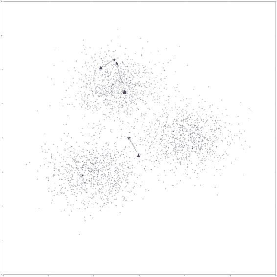
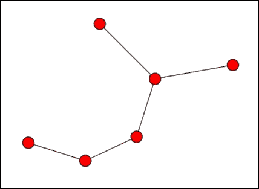
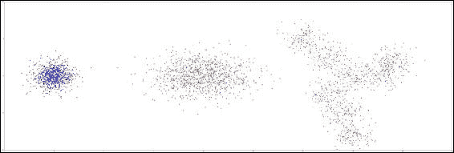

# 第 10 章。聚集新闻文章

在前面的大多数章节中，我们都是在了解数据的基础上进行数据挖掘的。 通过使用目标类，我们可以了解我们的变量如何在训练阶段对这些目标进行建模。 我们有目标要针对的这种学习类型称为**监督学习**。 在本章中，我们考虑了没有这些目标的情况。 这是**无监督学习**，更多的是探索性任务。 无需使用我们的模型进行分类，无监督学习的目标更多是关于探索数据以寻找见解。

在本章中，我们着眼于对新闻文章进行聚类以发现数据中的趋势和模式。 我们研究如何使用链接聚合网站显示不同的新闻故事，从不同的网站提取数据。

本章涵盖的关键概念包括：

*   从任意网站获取文本
*   使用 Reddit API 收集有趣的新闻故事
*   用于无监督数据挖掘的聚类分析
*   从文档中提取主题
*   在线学习以更新模型而无需重新训练
*   集群整合以结合不同的模型

# 获得新闻文章

在本章中，我们将构建一个系统，该系统获取新闻文章的实时供稿并将其分组，其中各组的主题相似。 您可以在数周（或更长时间）内运行系统，以查看在这段时间内趋势如何变化。

我们的系统将从流行的链接聚合网站 **reddit** 开始，该网站存储指向其他网站的链接列表以及用于讨论的评论部分。 reddit 上的链接分为几类链接，称为 **subreddits**。 有一些专门针对特定电视节目，有趣图像和许多其他事物的版本。 我们感兴趣的是新闻的分类。 我们将在本章中使用`/r/worldnews`子目录，但该代码应与任何其他子目录一起使用。

在本章中，我们的目标是下载受欢迎的故事，然后将它们聚类以查看出现的任何主要主题或概念。 这将使我们能够深入了解流行的焦点，而无需手动分析数百个单个故事。

## 使用 Web API 获取数据

在前面的几章中，我们使用基于 Web 的 API 提取数据。 例如，在第 7 章，*使用图形挖掘*发现要遵循的帐户中，我们使用了 Twitter 的 API 提取数据。 收集数据是数据挖掘管道中的关键部分，基于 Web 的 API 是一种收集各种主题数据的绝妙方法。

使用基于 Web 的 API 收集数据时，需要考虑三件事：授权方法，速率限制和 API 端点。

**授权方法**允许数据提供者知道谁在收集数据，以便确保它们受到适当的速率限制，并且可以跟踪数据访问。 对于大多数网站，个人帐户通常足以开始收集数据，但是某些网站会要求您创建一个正式的开发人员帐户来获得此访问权限。

**速率限制**适用于数据收集，特别是免费服务。 使用 API​​时要注意规则，这一点很重要，因为它们会并且确实会在网站之间发生变化。 Twitter 的 API 限制为每 15 分钟 180 个请求（取决于特定的 API 调用）。 稍后我们将看到 Reddit 允许每分钟 30 个请求。 其他网站设置了每日限制，而其他网站则是按秒限制。 即使在网站内部，不同的 API 调用也存在巨大差异。 例如，Google Maps 的限制较小，每个资源的 API 限制不同，每小时请求数量的配额也不同。

### 注意

如果您发现自己正在创建需要更多请求和更快响应的应用程序或正在运行的实验，则大多数 API 提供商都制定了允许进行更多调用的商业计划。

**API 端点**是用于提取信息的实际 URL。 这些内容因网站而异网站。 通常，基于 Web 的 API 将遵循 **RESTful** 接口（**表示状态传输**的缩写）。 RESTful 接口通常使用与 HTTP 相同的操作：GET，POST 和 DELETE 是最常见的操作。 例如，要检索有关资源的信息，我们可以使用以下 API 端点： [www.dataprovider.com/api/resource_type/resource_id/](http://www.dataprovider.com/api/resource_type/resource_id/) 。

为了使*获得*和信息，我们仅向该 URL 发送一个 HTTP GET 请求。 这将返回具有给定类型和 ID 的资源信息。 尽管实现上存在一些差异，但大多数 API 都遵循此结构。 大多数具有 API 的网站都会对其进行适当记录，从而为您提供可检索的所有 API 的详细信息。

首先，我们设置参数以连接到服务。 为此，您需要使用开发人员密钥进行 Reddit。 为了获得此密钥，请登录[这个页面](https://www.reddit.com/login)网站并转到[这个页面](https://www.reddit.com/prefs/apps)。 从此处单击**，您是开发人员吗？ 创建一个应用程序…**并填写表格，将类型设置为*脚本*。 您将获得客户端 ID 和一个秘密，可以将其添加到新的 IPython Notebook 中：

```py
CLIENT_ID = "<Enter your Client ID here>"
CLIENT_SECRET = "<Enter your Client Secret here>"
```

Reddit 还要求您在使用 API​​时将用户代理设置为包含用户名的唯一字符串。 创建一个唯一标识您的应用程序的用户代理字符串。 我使用书名`chapter 10`和版本号 0.1 来创建我的用户代理，但是它可以是您喜欢的任何字符串。 请注意，不这样做会导致您的连接受到严重的速率限制：

```py
 USER_AGENT = "python:<your unique user agent> (by /u/<your reddit username>)"
```

此外，您将需要使用用户名和密码登录 reddit。 如果您还没有，请注册一个新的帐户（这是免费的，您也不需要使用个人信息进行验证）。

### 注意

您将需要密码来完成下一步，因此在与他人共享代码以将其删除之前，请务必小心。 如果您不输入密码，请将其设置为`none`，系统将提示您输入密码。 但是，由于 IPython Notebook 的工作方式，您需要将其输入到启动 IPython 服务器的命令行终端中，而不是输入 Notebook 本身。 如果无法执行此操作，则需要在脚本中进行设置。 IPython Notebook 的开发人员正在开发一个插件来解决此问题，但在编写本文时尚不可用。

现在让我们创建用户名和密码：

```py
USERNAME = "<your reddit username>"
PASSWORD = "<your reddit password>"
```

接下来，我们将创建一个函数来记录此信息。 reddit 登录 API 将返回一个可用于进一步连接的令牌，这是该功能的结果。 代码如下：

```py
def login(username, password):
```

首先，如果您不想将密码添加到脚本中，可以将其设置为`None`，系统将提示您，如前所述。 代码如下：

```py
    if password is None:
        password = getpass.getpass("Enter reddit password for user {}: ".format(username))
```

将用户代理设置为唯一值非常重要，否则连接可能会受到严格限制。 代码如下：

```py
    headers = {"User-Agent": USER_AGENT}
```

接下来，我们设置一个 HTTP 授权对象以允许我们在 reddit 的服务器上登录：

```py
    client_auth = requests.auth.HTTPBasicAuth(CLIENT_ID, CLIENT_SECRET)
```

要登录，我们向`access_token`端点发出 POST 请求。 我们发送的数据是我们的用户名和密码，以及在此示例中设置为`password`的授予类型：

```py
    post_data = {"grant_type": "password", "username": username, "password": password}
```

最后，我们使用`requests`库发出登录请求（通过 HTTP POST 请求完成）并返回结果，该结果是值的字典。 这些值之一是我们将来需要的令牌。 代码如下：

```py
    response = requests.post("https://www.reddit.com/api/v1/access_token", auth=client_auth, data=post_data, headers=headers)
    return response.json()
```

我们现在可以调用我们的函数来获取令牌：

```py
token = login(USERNAME, PASSWORD)
```

`token`对象只是一个字典，但它包含`access_token`字符串，我们将在以后的请求中将其传递给。 它还包含其他信息，例如令牌的范围（将是所有内容）以及令牌的到期时间，例如：

```py
{'access_token': '<semi-random string>',  'expires_in': 3600,  'scope': '*',  'token_type': 'bearer'}
```

## Reddit 作为数据源

Reddit（ [www.reddit.com](http://www.reddit.com) ）是一个链接聚合的网站，全球数百万人使用，尽管英文版本是以美国为中心。 任何用户都可以向他们认为有趣的网站提供链接，以及该链接的标题。 然后，其他用户可以*赞成*，表明他们喜欢该链接，或者*赞成*，表明他们不喜欢该链接。 投票最高的链接将移至页面顶部，而投票较低的链接则不会显示。 较旧的链接会随着时间的流逝而被删除（取决于它拥有多少票）。 拥有推荐的故事的用户获得称为*业力*的积分，从而鼓励他们仅提交好故事。

Reddit 还允许非链接内容，称为自发布。 这些包含标题和提交者输入的一些文本。 这些用于提问和开始讨论，但不计入一个人的业力。 在本章中，我们将仅考虑基于链接的帖子，而不考虑基于评论的帖子。

帖子分为网站的不同部分，称为 *subreddits*。 subreddit 是相关帖子的集合。 当用户提交指向 reddit 的链接时，他们可以选择要加入的子 reddit。 Subreddit 有其自己的管理员，并且对于该 Subreddit 的有效内容有自己的规则。

默认情况下，帖子按*热门*排序，这取决于帖子的年龄，支持的数量和已收到的支持的数量。 还有*新*，它只为您提供最近发布的故事（因此包含很多垃圾邮件和不良帖子），以及*热门*，是给定投票率最高的故事 时间段。 在本章中，我们将使用*热门*，它将为我们提供最近的高质量故事（*新*中确实有许多劣质链接）。

使用我们先前创建的令牌，我们现在可以从 subreddit 获取链接集。 为此，我们将使用`/r/<subredditname>` API 端点，该端点默认情况下返回热门故事。 我们将使用`/r/worldnews` subreddit：

```py
subreddit = "worldnews"
```

上一个端点的 URL 使我们可以创建完整的 URL，可以使用字符串格式设置该 URL：

```py
url = "https://oauth.reddit.com/r/{}".format(subreddit)
```

接下来，我们需要设置标题。 这样做有两个原因：允许我们使用之前收到的授权令牌，并设置用户代理以阻止我们的请求受到严格限制。 代码如下：

```py
headers = {"Authorization": "bearer {}".format(token['access_token']),
           "User-Agent": USER_AGENT}
```

然后，像之前的一样，我们使用`requests`库进行调用，确保设置了标头：

```py
response = requests.get(url, headers=headers)
```

对此调用`json()`将产生一个 Python 字典，其中包含 Reddit 返回的信息。 它将包含来自给定 subreddit 的前 25 个结果。 我们可以通过遍历此响应中的故事来获得标题。 故事本身存储在词典的`data`键下。 代码如下：

```py
for story in result['data']['children']:
    print(story['data']['title'])
```

## 获取数据

我们的数据集将包含`/r/worldnews` subreddit 的热门列表中的帖子。 我们在上一节中看到了如何连接到 reddit 以及如何下载链接。 综上所述，我们将创建一个函数，该函数将提取给定 subreddit 中每个项目的标题，链接和得分。

我们将遍历 subreddit，一次最多获取 100 个故事。 我们也可以进行分页以获得更多结果。 在 reddit 阻止我们之前，我们可以阅读大量页面，但我们会将其限制为 5 页。

由于我们的代码将反复调用 API，因此请务必对调用进行速率限制。 为此，我们需要`sleep`函数：

```py
from time import sleep
```

我们的函数将接受一个 subreddit 名称和一个授权令牌。 尽管我们将默认设置为 5：

```py
def get_links(subreddit, token, n_pages=5):
```

然后，我们创建一个列表以将故事存储在：

```py
    stories = []
```

我们在第 7 章，*中发现了要使用图形挖掘进行跟踪的帐户*，即分页如何适用于 Twitter API。 我们将光标与返回的结果一起发送，并随请求发送。 然后，Twitter 将使用此光标来获取结果的下一页。 除了调用参数`after`之外，reddit API 的功能几乎完全相同。 我们第一页不需要它，因此我们最初将其设置为`none`。 我们将在结果的第一页之后将其设置为有意义的值。 代码如下：

```py
    after = None
```

然后，我们迭代要返回的页面数：

```py
    for page_number in range(n_pages):
```

在循环内部，我们像以前一样初始化 URL 结构：

```py
        headers = {"Authorization": "bearer {}".format(token['access_token']),
            "User-Agent": USER_AGENT}
        url = "https://oauth.reddit.com/r/{}?limit=100".format(subreddit)
```

从第二个循环开始，我们需要设置`after`参数（否则，我们将只获得同一页结果的多个副本）。 该值将在循环的上一个迭代中设置-第一个循环为第二个循环设置 after 参数，依此类推。 如果存在，则将其附加到 URL 的末尾，告诉 reddit 获取下一页数据。 代码如下：

```py
        if after:
            url += "&after={}".format(after)
```

然后，像以前一样，我们使用请求库进行调用，然后使用`json()`将结果转换为 Python 字典：

```py
        response = requests.get(url, headers=headers)
        result = response.json()
```

此结果将为我们在下一次循环迭代时提供`after`参数，我们现在可以将其设置如下：

```py
        after = result['data']['after']
```

然后，我们睡眠 2 秒钟以避免超出 API 限制：

```py
        sleep(2)
```

作为循环中的最后一个动作，我们从返回的结果中获取每个故事，并将它们添加到我们的`stories`列表中。 我们不需要所有数据，仅获得标题，URL 和分数。 代码如下：

```py
        stories.extend([(story['data']['title'], story['data']['url'], story['data']['score'])
                       for story in result['data']['children']])
```

最后（在循环之外），我们返回找到的所有故事：

```py
    return stories
```

调用`stories`函数是传递授权令牌和 subreddit 名称的简单情况：

```py
stories = get_links("worldnews", token)
```

返回的结果应包含标题，URL 和 500 个故事，我们现在将使用它们从所得网站中提取实际文本。


# 从任意网站提取文本

我们从 reddit 获得的链接转到由许多不同组织运营的任意网站。 更难的是，这些页面被设计为人类而非计算机程序读取。 尝试获取这些结果的实际内容/故事时，这可能会引起问题，因为现代网站在后台运行了很多工作。 调用 JavaScript 库，应用样式表，使用 AJAX 加载广告，在侧边栏中添加额外的内容，并进行其他各种操作以使现代网页成为复杂的文档。 这些功能使现代 Web 成为现实，但是很难自动从中获取良好的信息！

## 在任意网站中查找故事

首先，我们将从每个链接下载完整的网页，并将其存储在`raw`子文件夹下的数据文件夹中。 稍后我们将处理这些信息以提取有用的信息。 这种结果缓存确保我们在工作时不必连续下载网站。 首先，我们设置数据文件夹路径：

```py
import os
data_folder = os.path.join(os.path.expanduser("~"), "Data", "websites", "raw")
```

我们将使用 MD5 哈希为文章创建唯一的文件名，因此我们将导入`hashlib`来执行此操作。 `hash`函数是将某些输入（在我们的示例中为包含标题的字符串）转换为看似随机的字符串的函数。 相同的输入将始终返回相同的输出，但是略有不同的输入将返回截然不同的输出。 从哈希值到原始值也是不可能的，这使其成为单向函数。 代码如下：

```py
import hashlib
```

我们将简单地跳过所有失败的网站下载。 为了确保这样做不会丢失太多信息，我们对发生的错误数进行了简单的计数。 我们将抑制发生的任何错误，这可能导致系统性的问题，禁止下载。 如果此错误计数器过高，我们可以查看这些错误是什么并尝试修复它们。 例如，如果计算机无法访问 Internet，则所有 500 次下载都将失败，您应该在继续之前解决此问题！

如果下载没有错误，则输出应为零：

```py
number_errors = 0
```

接下来，我们遍历每个故事：

```py
for title, url, score in stories:
```

然后，我们通过散列标题为文章创建唯一的输出文件名。 reddit 中的标题不必唯一，这意味着两个故事可能具有相同的标题，因此在我们的数据集中会发生冲突。 为了获得唯一的文件名，我们只需使用 MD5 算法对文章的 URL 进行哈希处理即可。 尽管已知 MD5 存在一些问题，但在我们的场景中不太可能发生问题（冲突），即使它确实发生了，我们也不必担心太多，也不必担心太多 如果确实发生碰撞。

```py
    output_filename = hashlib.md5(url.encode()).hexdigest()
    fullpath = os.path.join(data_folder, output_filename + ".txt")
```

接下来，我们下载实际页面并将其保存到我们的`output`文件夹中：

```py
    try:
        response = requests.get(url)
        data = response.text
        with open(fullpath, 'w') as outf:
            outf.write(data)
```

如果在获取网站时出错，我们只需跳过此网站并继续前进。 该代码将在 95％的网站上运行，这对于我们的应用程序已经足够了，因为我们正在寻找总体趋势而非精确性。 请注意，有时您确实希望获得 100％的响应，并且应该调整代码以容纳更多的错误。 获得最终 5％到 10％网站的代码将变得更加复杂。 然后，我们捕获可能发生的任何错误（这是 Internet，许多事情可能出错），增加错误计数，然后继续。

```py
    except Exception as e:
        number_errors += 1
        print(e)
```

如果发现发生太多错误，请将`print(e)`行更改为仅键入`raise`。 这将导致调用异常，从而使您可以调试问题。

现在，子文件夹中有很多网站。 看完这些页面（在文本编辑器中打开创建的文件）之后，您可以看到其中存在内容，但是有 HTML，JavaScript，CSS 代码以及其他内容。 由于我们仅对故事本身感兴趣，因此我们现在需要一种从这些不同的网站中提取此信息的方法。

## 全部放在一起

在获得原始数据之后，我们需要在每个数据中找到故事。 有一些在线来源使用数据挖掘来实现此目的。 您可以在第 13 章中找到它们。 尽管使用它们可以得到更好的准确性，但是很少需要使用这样的复杂算法。 这是数据挖掘的一部分-知道何时使用它，何时不使用。

首先，我们在`raw`子文件夹中获得每个文件名的列表：

```py
filenames = [os.path.join(data_folder, filename)
             for filename in os.listdir(data_folder)]
```

接下来，我们为要提取的纯文本版本创建一个`output`文件夹：

```py
text_output_folder = os.path.join(os.path.expanduser("~"), "Data",
                                  "websites", "textonly")
```

接下来，我们开发代码以从文件中提取文本。 我们将使用`lxml`库来解析 HTML 文件，因为该库具有处理某些格式错误的表达式的良好 HTML 解析器。 代码如下：

```py
from lxml import etree
```

提取文本的实际代码基于三个步骤。 首先，我们遍历 HTML 文件中的每个节点，并提取其中的文本。 其次，我们跳过任何包含 JavaScript，样式或注释的节点，因为这不太可能包含我们感兴趣的信息。 第三，我们确保内容至少包含 100 个字符。 这是一个很好的基准，但是可以进行改进以获得更准确的结果。

如前所述，我们对脚本，样式或注释不感兴趣。 因此，我们创建了一个列表来忽略这些类型的节点。 此列表中具有类型的任何节点都不会被视为包含故事。 代码如下：

```py
skip_node_types = ["script", "head", "style", etree.Comment]
```

现在，我们将创建一个将 HTML 文件解析为`lxml etree`的函数，然后我们将创建另一个解析该树以查找文本的函数。 第一个功能非常简单； 只需使用`lxml`库的 HTML 文件解析功能打开文件并创建树。 代码如下：

```py
def get_text_from_file(filename):
    with open(filename) as inf:
        html_tree = lxml.html.parse(inf)
    return get_text_from_node(html_tree.getroot())
```

在该函数的最后一行，我们调用`getroot()`函数来获取树的根节点，而不是完整的`etree`。 这使我们可以编写文本提取函数以接受任何节点，因此可以编写递归函数。

此函数将在任何子节点上调用自身以从中提取文本，然后返回任何子节点文本的串联。

如果传递此函数的节点没有任何子节点，则仅从中返回文本。 如果没有任何文本，我们只返回一个空字符串。 请注意，我们还在此处检查第三个条件-文本至少 100 个字符长。 代码如下：

```py
def get_text_from_node(node):
    if len(node) == 0:
        # No children, just return text from this item
        if node.text and len(node.text) > 100:
            return node.text
        else:
            return ""
```

至此，我们知道该节点具有子节点，因此我们在每个子节点上递归调用此函数，然后在它们返回时加入结果。 代码如下：

```py
    results = (get_text_from_node(child) for child in node
                     if child.tag not in skip_node_types)
    return "\n".join(r for r in results if len(r) > 1)
```

返回结果的最终条件是停止返回空行（例如，当节点没有子节点也没有文本时）。

现在，我们可以通过遍历原始 HTML 页面，在每个原始 HTML 页面上调用文本提取函数并将结果保存到纯文本子文件夹来在所有原始 HTML 页面上运行此代码：

```py
for filename in os.listdir(data_folder):
    text = get_text_from_file(os.path.join(data_folder, filename))
    with open(os.path.join(text_output_folder, filename), 'w') as outf:
        outf.write(text)
```

您可以通过打开“纯文本”子文件夹中的每个文件并检查其内容来手动评估结果。 如果发现太多结果包含非故事内容，请尝试增加最小 100 个字符的限制。 如果仍然无法获得满意的结果，或者需要更好的结果，请尝试使用第 13 章中列出的更复杂的方法。

# 分组新闻文章

本章的目的是通过将新闻文章进行聚类或分组来发现新闻文章中的趋势。 为此，我们将使用 k-means 算法，这是一种最初于 1957 年开发的经典机器学习算法。

聚类是一种无监督的学习技术，我们使用聚类算法来探索数据。 我们的数据集包含大约 500 个故事，要逐一检查每个故事将非常艰巨。 即使我们使用汇总统计信息，仍然是很多数据。 通过使用聚类，我们可以将相似的故事分组在一起，并且我们可以独立地探索每个聚类中的主题。

当我们没有清晰的数据目标类集时，我们将使用聚类技术。 从这个意义上讲，聚类算法的学习方向不大。 他们根据某种功能学习，而与数据的基本含义无关。 因此，选择良好的功能至关重要。 在监督学习中，如果选择较差的功能，则学习算法可以选择不使用那些功能。 例如，支持向量机将对那些在分类中没有用的特征给予很小的重视。 但是，通过聚类，所有功能都将用于最终结果中，即使这些功能无法为我们提供所需的答案。

在对真实数据进行聚类分析时，最好先了解哪种功能将适用于您的方案。 在本章中，我们将使用词袋模型。 我们正在寻找基于主题的组，因此我们将使用基于主题的功能为文档建模。 我们知道这些功能有效是因为其他人在问题的监督版本中所做的工作。 相反，如果要执行基于作者身份的聚类，则将使用诸如 第 9 章，*作者身份归因*实验中发现的功能。

## k-均值算法

k 均值聚类算法使用迭代过程找到最能代表数据的质心。 该算法从一组预定义的质心开始，这些质心通常是从训练数据中获取的数据点。 k 均值中的`k`是要查找的质心数以及该算法将找到多少个簇。 例如，将`k`设置为`3`将在数据集中找到三个聚类。

k 均值分为两个阶段：分配和更新。

在分配步骤中，我们为数据集中的每个样本设置了标签，将其链接到最近的质心。 对于每个最接近质心 1 的样本，我们为其分配标签 1。对于每个最接近质心 2 的样本，我们为每个`k`重心分配一个标签 2，依此类推。 这些标签形成聚类，因此我们说每个带有标签 1 的数据点都在聚类 1 中（仅此时，因为分配可以随着算法的运行而变化）。

在更新步骤中，我们采用每个聚类并计算质心，质心是该聚类中所有样本的平均值。

然后，算法在分配步骤和更新步骤之间进行迭代； 每次执行更新步骤时，每个质心都会移动少量。 这将导致分配稍有变化，从而导致质心在下一次迭代中移动少量。 重复此过程，直到达到某个停止标准为止。 通常在经过一定数量的迭代后或质心的总运动非常低时停止。 该算法在某些情况下也可以完成，这意味着群集是稳定的，分配不会更改，质心也不会更改。

在下图中，对随机创建的数据集执行了 k 均值，但是数据中包含三个簇。 星形代表质心的起始位置，这些质心是通过从数据集中选取随机样本随机选择的。 在 k 均值算法的 5 次迭代中，质心移至三角形表示的位置。



k 均值算法因其数学特性和历史意义而着迷。 它是一种（大约）只有一个参数的算法，在发现后的 50 多年中，它是相当有效且经常使用的算法。

scikit-learn 中有一个 k-means 算法，我们从`cluster`子包中导入该算法：

```py
from sklearn.cluster import KMeans
```

我们还导入了`CountVectorizer`类的近亲表弟`TfidfVectorizer`。 此矢量化器将根据每个术语的出现次数对每个术语的计数进行加权。许多文档中出现的术语的权重较低（通过将值除以出现在其中的文档数的对数）。 对于许多文本挖掘应用程序，使用这种类型的加权方案可以相当可靠地提高性能。 代码如下：

```py
from sklearn.feature_extraction.text import TfidfVectorizer
```

然后，我们建立了用于分析的管道。 这有两个步骤。 首先是应用矢量化器，其次是应用 k-means 算法。 代码如下：

```py
from sklearn.pipeline import Pipeline
n_clusters = 10
pipeline = Pipeline([('feature_extraction', TfidfVectorizer(max_df=0.4)),
                     ('clusterer', KMeans(n_clusters=n_clusters))
                     ])
```

`max_df`参数设置为 0.4 的较低值，表示*忽略 40％以上的文档*中出现的任何单词。 此参数对于删除功能词本身无价值的意义非常大。

### 注意

删除 40％以上的文档中出现的任何单词都会删除功能单词，这对于我们在第 9 章和“作者身份”中看到的工作来说，这种类型的预处理非常无用。

然后，我们拟合并预测该管道。 到目前为止，在该模块中，我们已经针对分类任务执行了多次此过程，但是这里有所不同-我们没有将数据集的目标类提供给 fit 函数。 这就是使它成为无监督学习任务的原因！ 代码如下：

```py
pipeline.fit(documents)
labels = pipeline.predict(documents)
```

`labels`变量现在包含每个样本的簇号。 带有相同标签的样品被称为属于同一类。 应当注意，集群标签本身是没有意义的：集群 1 和 2 与集群 1 和 3 不再相似。

我们可以使用`Counter`类查看每个簇中放置了多少样本：

```py
from collections import Counter
c = Counter(labels)
for cluster_number in range(n_clusters):
    print("Cluster {} contains {} samples".format(cluster_number, c[cluster_number]))
```

结果中的许多（请记住，您的数据集将与我的完全不同）由一个包含大多数实例的大型群集，几个中等群集以及一些仅包含一个或两个实例的群集组成。 在许多群集应用程序中，这种不平衡是很正常的。

## 评估结果

聚类主要是的探索性分析，因此难以有效评估聚类算法的结果。 一种直接的方法是根据算法尝试学习的标准来评估算法。

### 注意

如果有测试集，则可以根据它评估聚类。 有关更多详细信息，请访问[这个页面](http://nlp.stanford.edu/IR-book/html/htmledition/evaluation-of-clustering-1.html)。

对于 k 均值算法，开发质心时使用的标准是最小化每个样本到其最近质心的距离。 这称为算法的惯性，可以从对其进行调用的任何`KMeans`实例中检索出来：

```py
pipeline.named_steps['clusterer'].inertia_
```

我的数据集上的结果是 343.94。 不幸的是，这个值本身是毫无意义的，但是我们可以使用它来确定应该使用多少个群集。 在前面的示例中，我们将`n_clusters`设置为 10，但这是最佳值吗？ 下面的代码运行 10 次 k-means 算法，其中`n_clusters`的每个值从 2 到 20。每次运行时，它记录结果的惯性。

我们仅将`n_clusters`的每个值拟合`X`矩阵一次，以（大幅）提高此代码的速度：

```py
inertia_scores = []
n_cluster_values = list(range(2, 20))
for n_clusters in n_cluster_values:
    cur_inertia_scores = []
    X = TfidfVectorizer(max_df=0.4).fit_transform(documents)
    for i in range(10):
        km = KMeans(n_clusters=n_clusters).fit(X)
        cur_inertia_scores.append(km.inertia_)
    inertia_scores.append(cur_inertia_scores)
```

`inertia_scores`变量现在包含 2 到 20 之间的每个`n_clusters`值的惯性分数列表。我们可以对其进行绘图，以了解该值如何与`n_clusters`相互作用：


总体而言，随着簇数的增加，惯性的值应随着改进的减少而减小，这可以从这些结果中大致看到。 值 6 到 7 之间的增加仅是由于选择质心的随机性，这直接影响最终结果的质量。 尽管如此，总的趋势是（在这些结果中；您的结果可能会有所不同），大约是 6 个簇是最后一次惯性发生重大改善。

此后，尽管很难对诸如此类的模糊标准做出具体规定，但对惯性仅作了些微改进。 寻找这种类型的图案称为弯头规则，因为我们正在图中寻找弯头式弯头。 一些数据集的弯头更明显，但是不能保证甚至出现此功能（某些图形可能很平滑！）。

基于此分析，我们将`n_clusters`设置为 6，然后重新运行该算法：

```py
n_clusters = 6
pipeline = Pipeline([('feature_extraction', TfidfVectorizer(max_df=0.4)),
                     ('clusterer', KMeans(n_clusters=n_clusters))
                     ])
pipeline.fit(documents)
labels = pipeline.predict(documents)
```

## 从集群中提取主题信息

现在我们将目光聚焦在集群上，以尝试发现每个集群中的主题。 我们首先从特征提取步骤中提取`term`列表：

```py
terms = pipeline.named_steps['feature_extraction'].get_feature_names()
```

我们还设置了另一个计数器来计算每个类的大小：

```py
c = Counter(labels)
```

遍历每个集群，我们像以前一样打印集群的大小。 在评估结果时，请记住群集的大小，这一点很重要-一些群集仅具有一个样本，因此并不表示总体趋势。 代码如下：

```py
for cluster_number in range(n_clusters):
    print("Cluster {} contains {} samples".format(cluster_number, c[cluster_number]))
```

接下来（仍然在循环中），我们遍历此集群的最重要术语。 为此，我们从质心中选取五个最大的值，方法是找到质心本身中具有最高值的要素。 代码如下：

```py
    print("  Most important terms")
    centroid = pipeline.named_steps['clusterer'].cluster_centers_[cluster_number]
    most_important = centroid.argsort()
```

然后，我们打印出最重要的五个术语：

```py
    for i in range(5):
```

我们在这一行中使用`i`的取反，因为我们的`most_important`数组首先以最低值排序：

```py
        term_index = most_important[-(i+1)]
```

然后，我们为该值打印等级，术语和得分：

```py
        print("  {0}) {1} (score: {2:.4f})".format(i+1, terms[term_index], centroid[term_index]))
```

结果可以很好地指示当前趋势。 在我的结果（2015 年 3 月）中，这些分类对应于健康问题，中东紧张局势，朝鲜紧张局势和俄罗斯事务。 这些是这段时间新闻频繁出现的主要主题-尽管多年来一直没有改变！

## 使用聚类算法作为转换器

作为的补充说明，关于 k 均值算法（和任何聚类算法）的一个有趣特性是可以将其用于特征约简。 有许多方法可以减少要素的数量（或创建新的要素以将数据集嵌入到要素上），例如主成分分析，潜在语义索引等。 这些算法中的许多问题之一是它们通常需要大量的计算能力。

在前面的示例中，术语列表中有 14,000 多个条目-这是一个很大的数据集。 我们的 k 均值算法将其转换为六个簇。 然后，我们可以通过将每个质心的距离作为特征来创建特征数量少得多的数据集。 代码如下：

为此，我们在 KMeans 实例上调用 transform 函数。 我们的管道适合于此目的，因为它的末尾有一个 k-means 实例：

```py
X = pipeline.transform(documents)
```

这将在流水线的最后一步调用转换方法，这是 k 均值的一个实例。 这将导致具有六个特征的矩阵，并且样本数与文档的长度相同。

然后，您可以对结果执行自己的第二级聚类，如果有目标值，则可以将其用于分类。 为此，可能的工作流程是使用监督数据执行某些特征选择，使用聚类将特征数量减少到更易于管理的数量，然后在分类算法（例如 SVM）中使用结果。


# 聚类合奏

在第 3 章，*用决策树*预测运动优胜者中，我们研究了使用随机森林算法的分类集成，该集成是许多低质量， 基于分类器。 也可以使用聚类算法进行组装。 这样做的关键原因之一是平滑算法多次运行的结果。 正如我们之前看到的，根据初始质心的选择，运行 k 均值的结果会有所不同。 可以通过多次运行算法然后组合结果来减少差异。

集成还可以减少选择参数对最终结果的影响。 大多数聚类算法对为该算法选择的参数值非常敏感。 选择稍有不同的参数将导致不同的群集。

## 证据积累

作为基本合奏，我们可以首先对数据进行多次聚类并记录每次运行的标签。 然后，我们记录每对样本在一个新矩阵中聚集在一起的次数。 这是**证据累积聚类**（**EAC**）算法的本质。

EAC 有两个主要步骤。 第一步是使用低级聚类算法（例如 k 均值）对数据进行多次聚类，并在每次迭代中记录样本在同一聚类中的频率。 该存储在`coassociation`矩阵中。 第二步是对生成的`coassociation`矩阵执行聚类分析，该分析使用另一种称为层次聚类的聚类算法执行。 该具有有趣的属性，因为它在数学上与找到将所有节点链接在一起并删除弱链接的树相同。

通过遍历每个标签并记录两个样本具有相同标签的地方，我们可以从标签数组中创建一个`coassociation`矩阵。 我们使用 SciPy 的`csr_matrix`，它是一种稀疏矩阵：

```py
from scipy.sparse import csr_matrix
```

我们的函数定义带有一组标签：

```py
def create_coassociation_matrix(labels):
```

然后，我们记录每个匹配项的行和列。 我们在列表中进行这些操作。 稀疏矩阵通常只是记录非零值位置的列表的集合，`csr_matrix`是这种稀疏矩阵的示例：

```py
    rows = []
    cols = []
```

然后，我们遍历每个单独的标签：

```py
    unique_labels = set(labels)
    for label in unique_labels:
```

我们寻找具有该标签的所有样品：

```py
        indices = np.where(labels == label)[0]
```

对于带有前面标签的每对样本，我们将两个样本的位置记录在列表中。 代码如下：

```py
        for index1 in indices:
            for index2 in indices:
                rows.append(index1)
                cols.append(index2)
```

在所有循环之外，我们然后创建数据，每次将两个样本一起列出时，该数据的值就是 1。 通过注意总共在我们的标签集中有多少个匹配项，可以得出 1 的数量。 代码如下：

```py
    data = np.ones((len(rows),))
    return csr_matrix((data, (rows, cols)), dtype='float')
```

要从标签中获取关联矩阵，我们只需调用此函数：

```py
C = create_coassociation_matrix(labels)
```

从这里，我们可以将这些矩阵的多个实例加在一起。 这使我们可以合并多次 k 均值的结果。 打印出 C（只需将 C 输入一个新的单元格并运行它）将告诉您其中有多少个单元格具有非零值。 在我的情况下，大约一半的单元格中都有值，因为我的聚类结果具有较大的聚类（聚类越多，非零值的数量越少）。

下一步涉及协同关联矩阵的层次聚类。 我们将通过在此矩阵上找到最小的生成树并删除权重低于给定阈值的边来做到这一点。

在图理论中，生成树是图上将所有节点连接在一起的一组边。 **最小生成树**（**MST**）只是具有最低总权重的生成树。 对于我们的应用程序，图中的节点是数据集中的样本，边缘权重是这两个样本聚在一起的次数，即，来自我们的关联矩阵的值。

在下图中，显示了六个节点的图形上的 MST。 图中的节点可以在 MST 中多次使用。 生成树的唯一标准是所有节点都应连接在一起。



为了计算 MST，我们使用 SciPy 的`minimum_spanning_tree`函数，该函数在`sparse`程序包中找到：

```py
from scipy.sparse.csgraph import minimum_spanning_tree
```

可以直接在我们的关联函数返回的稀疏矩阵上调用`mst`函数：

```py
mst = minimum_spanning_tree(C)
```

但是，在我们的关联矩阵`C`中，较高的值表示样本聚集在一起的频率更高，即相似度值。 相反，`minimum_spanning_tree`将输入视为距离，但得分较高。 由于这个原因，我们改为根据协关联矩阵的求反来计算最小生成树：

```py
mst = minimum_spanning_tree(-C)
```

上一个函数的结果是一个矩阵的大小与协关联矩阵的大小相同（行和列的数量与数据集中的样本数相同），仅保留了 MST 中的边，所有其他边均被删除。

然后，我们删除任何权重小于预定义阈值的节点。 为此，我们在 MST 矩阵的边缘上进行迭代，删除所有小于特定值的边缘。 我们不能仅凭一个在关联矩阵中的迭代来测试这一点（值将为 1 或 0，因此没有太多需要处理的）。 因此，我们将首先创建额外的标签，创建协关联矩阵，然后将两个矩阵加在一起。 代码如下：

```py
pipeline.fit(documents)
labels2 = pipeline.predict(documents)
C2 = create_coassociation_matrix(labels2)
C_sum = (C + C2) / 2
```

然后，我们计算 MST 并删除这两个标签中未出现的任何边：

```py
mst = minimum_spanning_tree(-C_sum)
mst.data[mst.data > -1] = 0
```

我们想要切掉的阈值是两个聚类中都不存在的任何边缘，即值为 1。但是，当我们否定协关联矩阵时，我们也必须否定该阈值。

最后，我们找到所有连接的分量，这是在去除低权重的边缘之后找到仍通过边缘连接的所有样本的一种简单方法。 返回的第一个值是连接的组件数（即簇数），第二个是每个样本的标签。 代码如下：

```py
from scipy.sparse.csgraph import connected_components
number_of_clusters, labels = connected_components(mst)
```

在我的数据集中，我获得了八个聚类，这些聚类与以前大致相同。 鉴于我们仅使用了两次 k 均值迭代，这不足为奇。 使用更多的 k 均值迭代（如我们在下一节中所做的那样）将导致更多的方差。

## 工作原理

在 k 均值算法中，使用每个特征时均不考虑其权重。 从本质上讲，所有功能均假定为相同比例。 我们在第 2 章，*用 scikit-learn 估计器*分类中看到了不具有缩放功能的问题。 结果是 k-means 正在寻找圆形簇，如以下屏幕截图所示：



正如我们在前面的屏幕截图中所看到的，并不是所有的集群都具有这种形状。 蓝色簇是圆形的，并且是 k 均值非常擅长的类型。 红色簇是椭圆形。 k 均值算法可以通过某种特征缩放来拾取这种形状的聚类。 第三个簇甚至不是凸的-k 均值将很难发现，这是一个奇怪的形状。

EAC 算法通过将特征重新映射到新的空间来工作，实质上是使用与上一节中使用 k 均值进行特征约简的原理相同的原理将 k 均值算法的每次运行转换为变形器。 但是，在这种情况下，我们仅使用实际标签，而不使用到每个质心的距离。 这是在关联矩阵中记录的数据。

结果是，EAC 现在只在乎事物之间的距离，而不必关心它们在原始特征空间中的放置方式。 围绕未缩放的功能仍然存在问题。 特征缩放很重要，并且无论如何都应该进行（我们在本章中使用`tf-idf`进行了缩放，这导致特征值具有相同的缩放比例）。

通过在 SVM 中使用内核，我们在第 9 章，“作者身份”中看到了类似的转换形式。 这些转换非常强大，对于复杂的数据集应牢记。

## 实施

综合所有这些，我们现在可以创建一个适合 scikit-learn 接口的简单聚类算法，该接口执行 EAC 中的所有步骤。 首先，我们使用 scikit-learn 的`ClusterMixin`创建该类的基本结构：

```py
from sklearn.base import BaseEstimator, ClusterMixin
class EAC(BaseEstimator, ClusterMixin):
```

我们的参数是第一步（创建协关联矩阵）要执行的 k 均值聚类数，要在其中截止的阈值以及在每个 k 均值聚类中要找到的聚类数。 我们设置`n_clusters`的范围是为了在我们的 k 均值迭代中获得很多方差。 通常，从整体上讲，差异是一件好事； 没有它，解决方案将不会比单个聚类更好（也就是说，高方差并不表示整体会更好）。 代码如下：

```py
    def __init__(self, n_clusterings=10, cut_threshold=0.5, n_clusters_range=(3, 10)):
        self.n_clusterings = n_clusterings
        self.cut_threshold = cut_threshold
        self.n_clusters_range = n_clusters_range
```

接下来是我们的`EAC`类的`fit`函数：

```py
    def fit(self, X, y=None):
```

然后，我们使用 k 均值执行低级聚类，并对每次迭代所得的关联矩阵求和。 我们在生成器中执行此操作以节省内存，仅在需要它们时才创建协关联矩阵。 在此生成器的每次迭代中，我们使用数据集创建一个新的单 k 均值，然后为其创建协关联矩阵。 我们使用`sum`将它们加在一起。 代码如下：

```py
        C = sum((create_coassociation_matrix(self._single_clustering(X))
                 for i in range(self.n_clusterings)))
```

和以前一样，我们创建 MST，删除小于给定阈值的任何边（如前所述，适当取负值），然后找到连接的组件。 与 scikit-learn 中的任何`fit`函数一样，我们需要返回 self 以使类有效地在管道中工作。 代码如下：

```py
        mst = minimum_spanning_tree(-C)
        mst.data[mst.data > -self.cut_threshold] = 0
        self.n_components, self.labels_ = connected_components(mst)
        return self
```

然后，我们编写函数以对单个迭代进行聚类。 为此，我们使用 NumPy 的`randint`函数和我们的`n_clusters_range`参数随机选择了多个聚类，以设置可能值的范围。 然后，我们使用 k 均值对数据集进行聚类和预测。 这里的返回值将是来自 k 均值的标签。 代码如下：

```py
    def _single_clustering(self, X):
        n_clusters = np.random.randint(*self.n_clusters_range)
        km = KMeans(n_clusters=n_clusters)
        return km.fit_predict(X)
```

现在，我们可以像以前一样通过建立管道并使用 EAC（以前使用`KMeans`实例作为管道的最后阶段）来在以前的代码上运行此代码。 代码如下：

```py
pipeline = Pipeline([('feature_extraction', TfidfVectorizer(max_df=0.4)),
                     ('clusterer', EAC())
                     ])
```

# 在线学习

在某些情况下，在我们开始学习之前，我们没有培训所需的所有数据。 有时，我们在等待新数据到达，也许我们拥有的数据太大而无法容纳到内存中，或者在做出预测后我们收到了额外的数据。 在这种情况下，在线学习是随时间推移训练模型的一种选择。

## 在线学习简介

在线学习是随着新数据的到来而对模型进行的增量更新。 支持在线学习的算法可以一次训练一个或几个样本，并在新样本到达时进行更新。 相反，非在线算法要求立即访问所有数据。 标准 k 均值算法就是这样，到目前为止我们在本模块中看到的大多数算法都是这样。

在线版本的算法仅用几个样本就可以部分更新其模型。 神经网络是一种以在线方式工作的算法的标准示例。 当将新样本提供给神经网络时，网络中的权重会根据学习率进行更新，该学习率通常是一个非常小的值，例如 0.01。 这意味着任何单个实例都只会对模型进行较小（但希望有所改善）的更改。

神经网络也可以以批处理模式进行训练，其中一次给出一组样本，并且训练是一步完成的。 在批处理模式下，算法更快，但使用更多的内存。

同样地，我们可以在单个或少量样本后稍微更新 k 均值质心。 为此，我们在 k 均值算法的更新步骤中将学习率应用于质心运动。 假设样本是从总体中随机选择的，则质心应趋向于它们在标准，离线和 k 均值算法中的位置。

在线学习与基于流的学习有关； 但是，有一些重要的区别。 在线学习能够在模型中使用较旧的样本后对其进行审查，而基于流的机器学习算法通常仅一次通过，也就是说，只有一次机会查看每个样本。

## 实施

scikit-learn 软件包包含`MiniBatchKMeans`算法，该算法允许在线学习。 该类实现`partial_fit`函数，该函数获取一组样本并更新模型。 相反，调用`fit()`将删除以前的所有训练，仅在新数据上重新拟合模型。

`MiniBatchKMeans`遵循与 scikit-learn 中其他算法相同的聚类格式，因此创建和使用它与其他算法非常相似。

因此，我们可以通过使用`TfIDFVectorizer`从数据集中提取特征来创建矩阵`X`，然后从中进行采样以逐步更新模型。 代码如下：

```py
vec = TfidfVectorizer(max_df=0.4)
X = vec.fit_transform(documents)
```

然后，我们导入`MiniBatchKMeans`并创建一个实例：

```py
from sklearn.cluster import MiniBatchKMeans
mbkm = MiniBatchKMeans(random_state=14, n_clusters=3)
```

接下来，我们将从`X`矩阵中随机采样以模拟来自外部源的数据。 每次输入一些数据时，我们都会更新模型：

```py
batch_size = 10
for iteration in range(int(X.shape[0] / batch_size)):
    start = batch_size * iteration
    end = batch_size * (iteration + 1)
    mbkm.partial_fit(X[start:end])
```

然后，我们可以通过要求实例进行预测来获取原始数据集的标签：

```py
labels  = mbkm.predict(X)
```

不过，在此阶段，我们无法在管道中执行此操作，因为`TfIDFVectorizer`不是在线算法。 为了解决这个问题，我们使用`HashingVectorizer`。 `HashingVectorizer`类巧妙地使用了散列算法，从而大大减少了计算词袋模型的内存。 我们只记录那些名称的哈希，而不是记录特征名称（如文档中的单词）。 这使我们甚至在查看数据集之前，就可以*知道*我们的*功能*，因为它是所有可能散列的集合。 这是一个非常大的数字，通常约为 2 ^ 18。 使用稀疏矩阵，我们甚至可以很容易地存储和计算这种大小的矩阵，因为很大一部分矩阵的值为 0。

当前，`Pipeline`类不允许在在线学习中使用它。 在不同的应用程序中存在一些细微差别，这意味着没有一种明显的“一刀切”的方法可以实施。 相反，我们可以创建自己的`Pipeline`子类，使我们可以将其用于在线学习。 我们首先从`Pipeline`派生我们的类，因为我们只需要实现一个函数：

```py
class PartialFitPipeline(Pipeline):
```

我们创建一个类函数`partial_fit`，它接受输入矩阵和一个可选的类集（尽管本实验中不需要这些类）：

```py
    def partial_fit(self, X, y=None):
```

我们之前介绍过的管道是一组转换，其中一步的输入是上一步的输出。 为此，我们将第一个输入设置为`X`矩阵，然后遍历每个转换器以转换此数据：

```py
        Xt = X
        for name, transform in self.steps[:-1]:
```

然后，我们转换当前数据集并继续进行迭代，直到完成最后一步（在本例中为聚类算法）：

```py
            Xt = transform.transform(Xt)
```

然后，我们在最后一步调用`partial_fit`函数并返回结果：

```py
        return self.steps[-1][1].partial_fit(Xt, y=y)
```

现在，我们可以与`HashingVectorizer`一起创建一个管道，以在在线学习中使用`MiniBatchKMeans`。 除了使用我们的新类`PartialFitPipeline`和`HashingVectorizer`外，此过程与本章其余部分所用的过程相同，只是一次只能容纳几个文档。 代码如下：

```py
pipeline = PartialFitPipeline([('feature_extraction', HashingVectorizer()),
                             ('clusterer', MiniBatchKMeans(random_state=14, n_clusters=3))
                             ])
batch_size = 10
for iteration in range(int(len(documents) / batch_size)):
    start = batch_size * iteration
    end = batch_size * (iteration + 1)
    pipeline.partial_fit(documents[start:end])
labels = pipeline.predict(documents)
```

不过，仍存在一些缺点。 首先，我们无法轻松地找出每个单词中最重要的单词。 我们可以通过拟合另一个`CountVectorizer`并获取每个单词的哈希值来解决此问题。 然后，我们通过哈希而不是单词来查找值。 这有点麻烦，并且会破坏使用`HashingVectorizer`的内存。 此外，我们无法使用之前使用的`max_df`参数，因为它要求我们知道功能的含义并随时间对其进行计数。

在线进行训练时，我们也无法使用`tf-idf`加权。 可以对此进行近似并应用这样的加权，但这又是一个麻烦的方法。 `HashingVectorizer`仍然是一种非常有用的算法，并且大量使用了哈希算法。


