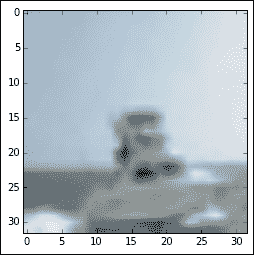
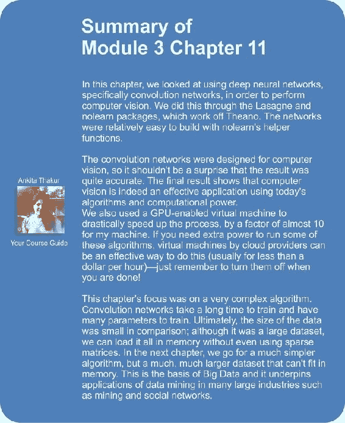

# 第 11 章。使用深度学习对图像中的对象进行分类

我们在第 8 章，“和神经网络”打败验证码中使用了基本的神经网络。 该地区最近的大量研究已使该基础设计取得了许多重大进展。 如今，神经网络的研究正在许多领域中创建一些最先进，最准确的分类算法。

这些进步来自计算能力的提高，这使我们能够训练更大，更复杂的网络。 但是，这些进步远不只是简单地为该问题投入更多的计算能力。 新的算法和层类型大大提高了性能，超出了计算能力。

在本章中，我们将研究确定图像中表示的对象。 像素值将用作输入，然后神经网络将自动找到有用的像素组合以形成更高级别的特征。 然后将这些用于实际分类。 总体而言，在本章中，我们将研究以下内容：

*   分类图像中的对象
*   不同类型的深度神经网络
*   Theano，Lasagne 和 nolearn； 库来构建和训练神经网络
*   使用 GPU 来提高算法速度

# 对象分类

计算机视觉正成为未来技术的重要组成部分。 例如，我们将在未来五年内使用自动驾驶汽车（如果相信一些传闻，则可能会更快）。 为了实现这一目标，汽车的计算机必须能够看到周围的物体：障碍物，其他交通状况和天气状况。

尽管我们可以很容易地检测到是否存在障碍物（例如使用雷达），但知道该物体是什么也很重要。 如果是动物，它可能会移开。 如果它是建筑物，它将完全不会移动，我们需要绕开它。

# 应用场景和目标

在本章中，我们将构建一个系统，该系统将图像作为输入并预测其中的对象是什么。 我们将扮演汽车视觉系统的角色，环视道路或道路两侧的任何障碍物。 图像具有以下形式：


该数据集来自一个流行的数据集 **CIFAR-10**。 它包含 60,000 张图像，这些图像的宽度为 32 像素，高度为 32 像素，每个像素都有一个红绿蓝（RGB）值。 数据集已经分为训练和测试，尽管直到完成训练后我们才使用测试数据集。

### 注意

[CIFAR-10 数据集可从以下位置下载](http://www.cs.toronto.edu/~kriz/cifar.html)。 下载 python 版本，该版本已转换为 NumPy 数组。

打开一个新的 IPython Notebook，我们可以看到数据的样子。 首先，我们设置数据文件名。 我们只担心第一个批次开始，并在最后增加到完整的数据集大小。

```pypy
import os
data_folder = os.path.join(os.path.expanduser("~"), "Data", "cifar-10-batches-py")
batch1_filename = os.path.join(data_folder, "data_batch_1")
```

接下来，我们创建一个可以读取批处理中存储的数据的函数。 批处理已使用 pickle 保存，pickle 是用于保存对象的 python 库。 通常，我们只需在文件上调用`pickle.load`即可获取对象。 但是，此数据有一个小问题：它已保存在 Python 2 中，但是我们需要在 Python 3 中打开它。为了解决此问题，我们将编码设置为*拉丁语*（即使我们 正在以字节模式打开它）：

```pypy
import pickle
# Bigfix thanks to: http://stackoverflow.com/questions/11305790/pickle-incompatability-of-numpy-arrays-between-python-2-and-3
def unpickle(filename):
    with open(filename, 'rb') as fo:
        return pickle.load(fo, encoding='latin1')
```

使用此功能，我们现在可以加载批处理数据集：

```pypy
batch1 = unpickle(batch1_filename)
```

该批处理是一个字典，其中包含 NumPy 数组中的实际数据，相应的标签和文件名，最后是一个注释，说明该批处理是什么（例如，这是*训练 5 的第 1 批*）。

我们可以通过使用批次数据键中的索引来提取图像：

```pypy
image_index = 100
image = batch1['data'][image_index]
```

图像数组是一个 NumPy 数组，具有 3,072 个条目（从 0 到 255）。每个值都是图像中特定位置的红色，绿色或蓝色强度。

图像的格式与 matplotlib 通常使用的格式不同（用于显示图像），因此，要显示图像，我们首先需要对阵列进行整形并旋转矩阵。 训练我们的神经网络并不重要（我们将以适合数据的方式定义网络），但是为了 matplotlib 的缘故，我们确实需要对其进行转换：

```pypy
image = image.reshape((32,32, 3), order='F')
import numpy as np
image = np.rot90(image, -1)
```

现在我们可以使用 matplotlib 显示图像：

```pypy
%matplotlib inline
```

```pypy
from matplotlib import pyplot as plt
plt.imshow(image)
```

显示结果图像，一条船：



该图像的分辨率非常差-仅 32 像素宽和 32 像素高。 尽管如此，大多数人还是会看着图像并看到一条船。 我们可以让计算机做同样的事情吗？

您可以更改图像索引以显示不同的图像，以了解数据集的属性。

在本章中，我们项目的目的是建立一个分类系统，该系统可以拍摄这样的图像并预测其中的对象。

## 用例

在许多情况下都使用计算机视觉。

在线地图网站（例如 Google Maps）出于多种原因使用计算机视觉。 原因之一是自动模糊他们发现的任何面孔，以便为作为街景功能一部分的被拍照人员提供一定的隐私保护。

人脸检测还用于许多行业。 现代相机会自动检测人脸，以提高所拍摄照片的质量（用户最常希望将焦点对准可见的脸）。 人脸检测也可以用于识别。 例如，Facebook 自动识别照片中的人物，从而轻松标记朋友。

正如我们之前所述，自动驾驶汽车高度依赖计算机视觉来识别其路径并避免障碍。 计算机视觉是不仅在自动驾驶汽车研究中要解决的关键问题之一，不仅是供消费者使用，还包括采矿和其他行业。

其他行业也在使用计算机视觉，包括仓库自动检查货物是否有缺陷。

航天工业也在使用计算机视觉，以帮助自动化数据收集。 这对于有效利用航天器至关重要，因为从地球向火星上的漫游者发送信号可能会花费很长时间，并且在某些时候是不可能的（例如，当两个行星彼此不面对时）。 随着我们越来越频繁地从更远的距离开始处理天基飞行器，绝对有必要提高这些航天器的自主性。

以下屏幕截图显示了由 NASA 设计和使用的火星探测器； 它充分利用了计算机视觉：


# 深度神经网络

我们在第 8 章和“用神经网络”击败 CAPTCHAs 中使用的神经网络具有一些出色的理论特性。 例如，只需要一个隐藏层即可学习任何映射（尽管中间层的大小可能需要非常大）。 神经网络在 1970 年代和 1980 年代是非常活跃的研究领域，因此不再使用这些网络，特别是与其他分类算法（例如支持向量机）相比。 主要问题之一是运行许多神经网络所需的计算能力比其他算法还要多，而且比许多人可以访问的能力还要多。

另一个问题是训练网络。 虽然反向传播算法已经有一段时间了，但是它在较大的网络中存在问题，需要在权重确定之前进行大量的训练。

这些问题中的每一个都已在近期得到解决，从而导致了神经网络的流行。 现在比 30 年前更容易获得计算能力，并且训练算法的进步意味着我们现在可以随时使用该能力。

## 直觉

在第 8 章，“和神经网络”中，将深度神经网络与更基本的神经网络区分开来。 当神经网络具有两个或多个隐藏层时，它被认为是。 在实践中，无论是在每层的节点数还是在层数上，深度神经网络通常都大得多。 虽然 2000 年代中期的一些研究集中在非常大量的层上，但是更智能的算法正在减少所需的实际层数。

神经网络基本上将非常基本的特征作为输入-在计算机视觉的情况下，它是简单的像素值。 然后，随着数据的组合和通过网络的推送，这些基本功能将合并为更复杂的功能。 有时，这些功能对人类意义不大，但它们代表了计算机进行分类所需的样本方面。

## 实施

由于它们的规模，实现这些深度神经网络可能非常具有挑战性。 一个不好的实现比一个好的实现要花费更长的时间，并且由于内存的使用甚至可能根本无法运行。

神经网络的基本实现可能首先创建一个节点类，然后将它们的集合收集到一个层类中。 然后，使用 Edge 类的实例将每个节点连接到下一层中的节点。 这种实现是基于类的实现，很好地展示了网络是如何工作的，但对于大型网络而言效率太低。

神经网络的核心只是简单的矩阵数学表达式。 一个网络与下一个网络之间的连接权重可以表示为值矩阵，其中行表示第一层中的节点，列表示第二层中的节点（有时也使用此矩阵的转置） 。 该值是一层与下一层之间的边缘的权重。 然后可以将网络定义为这些权重矩阵的集合。 除了节点之外，我们还向每层添加一个偏差项，该偏差项基本上是一个始终位于并连接到下一层中每个神经元的节点。

这种见解使我们能够使用数学运算来构建，训练和使用神经网络，而不是创建基于类的实现。 这些数学运算非常棒，因为已经编写了许多很棒的高度优化的代码库，我们可以使用它们尽可能高效地执行这些计算。

我们在第 8 章，“用神经网络”击败 CAPTCHAs 中使用的`PyBrain`库确实包含用于神经网络的简单卷积层。 但是，它没有为我们提供此应用程序所需的某些功能。 但是，对于更大，更自定义的网络，我们需要一个库，该库可以为我们提供更多功能。 因此，将使用`Lasagne`和`nolearn`库。 该库在`Theano`库上运行，该库是用于数学表达式的有用工具。

在本章中，我们将从使用`Lasagne`实现基本的神经网络开始，以介绍概念。 然后，我们将使用`nolearn`在第 8 章，“和神经网络”预测图像中的哪个字母上复制实验。 最后，我们将使用复杂得多的卷积神经网络对 CIFAR 数据集进行图像分类，这还将包括在 GPU 而不是 CPU 上运行该算法以提高性能。

## Theano 简介

**Theano** 是一个库，可让您构建数学表达式并运行它们。 尽管该似乎与我们通常编写程序的并没有什么不同，但在 Theano 中，我们定义了要执行的功能，而不是其计算方式。 这使 Theano 可以优化表达式的评估并执行延迟计算-仅在需要时才实际计算表达式，而在定义它们时才进行计算。

许多程序员每天都不使用这种类型的编程，但是大多数程序员都与相关的系统交互。 关系数据库，特别是基于 SQL 的数据库，使用了称为声明式范式的概念。 尽管程序员可能使用 *WHERE* 子句在数据库上定义了 *SELECT* 查询，但数据库会对此进行解释并根据多种因素（例如*是否 ] WHERE* 子句位于主键上，数据存储的格式以及其他因素上。 程序员定义他们想要的东西，然后系统确定如何做。

### 注意

您可以使用 pip `pip3 install Theano`安装 Theano。

使用 Theano，我们可以定义许多用于标量，数组和矩阵的函数，以及其他数学表达式。 例如，我们可以创建一个函数来计算直角三角形的斜边的长度：

```pypy
import theano
from theano import tensor as T
```

首先，我们定义两个输入 a 和 b。 这些是简单的数值，因此我们将它们定义为标量：

```pypy
a = T.dscalar()
b = T.dscalar()
```

然后，我们定义输出`c`。 这是一个基于`a`和`b`值的表达式：

```pypy
c = T.sqrt(a ** 2 + b ** 2)
```

请注意，此处`c`不是函数或值，它只是给定`a`和`b`的表达式。 还要注意`a`和`b`没有实际值-这是一个代数表达式，而不是绝对值。 为了对此进行计算，我们定义一个函数：

```pypy
f = theano.function([a,b], c)
```

该基本上告诉 Theano 创建一个函数，该函数将`a`和`b`的值作为输入，并根据给定的值计算返回`c`作为输出。 例如，`f(3, 4)`返回`5`。

尽管这个简单的示例似乎没有比 Python 强大的功能，但我们现在可以在其他代码部分和其余映射中使用函数或数学表达式`c`。 另外，虽然我们在定义函数之前就定义了`c`，但是直到调用函数之前，才进行实际的计算。

## 千层面的介绍

Theano 并不是构建神经网络的库。 以类似的方式，NumPy 并不是执行机器学习的库； 它只是执行繁重的任务，通常在其他库中使用。 Lasagne 是一个这样的库，它是专门为构建神经网络而设计的，使用 Theano 进行计算。

Lasagne 实现了许多现代类型的神经网络层，以及用于构建它们的构建块。

其中包括：

*   **网络中的网络层**：这些是小型的神经网络，比传统的神经网络层更易于解释。
*   **脱落层**：这些在训练过程中随机脱落的单元，可防止过度拟合，这是神经网络中的主要问题。
*   **噪声层**：这些层将噪声引入神经元。 再次，解决过度拟合的问题。

在本章中，我们将使用`convolution layers`（用来模拟人类视觉工作方式的图层）。 他们使用连接神经元的小集合，这些神经元仅分析输入值的一部分（在这种情况下为图像）。 这允许网络处理标准更改，例如处理图像的翻译。 在基于视觉的实验中，卷积层处理的变化示例是平移图像。

相比之下，传统的神经网络通常连接紧密，一层中的所有神经元都连接到下一层中的所有神经元。

卷积网络是在`lasagne.layers.Conv1DLayer`和`lasagne.layers.Conv2DLayer`类中实现的。

### 注意

在撰写本文时，Lasagne 尚未正式发布，也没有发布在`pip`上。 您可以从`github`安装它。 在新文件夹中，使用以下命令下载源代码存储库：

```pypy
git clone https://github.com/Lasagne/Lasagne.git

```

在创建的 Lasagne 文件夹中，然后可以使用以下命令安装该库：

```pypy
sudo python3 setup.py install

```

请参阅[这个页面](http://lasagne.readthedocs.org/en/latest/user/installation.html)了解安装说明。

神经网络使用卷积层（通常仅使用*卷积神经网络*）以及`pooling`层，它们在特定区域内获得最大输出。 这样可以减少由图像的微小变化引起的噪声，并减少（或下采样）信息量。 这具有减少后续层中需要完成的工作量的额外好处。

Lasagne 还实现了这些池化层，例如在`lasagne.layers.MaxPool2DLayer`类中。 与卷积层一起，我们拥有构建卷积神经网络所需的所有工具。

在 Lasagne 中构建神经网络比仅使用 Theano 构建神经网络容易。 为了展示这些原理，我们将实现一个基于 Iris 数据集的基本网络，我们在第 1 章，“数据挖掘入门”中看到了该数据集。 Iris 数据集非常适合测试新算法，甚至包括深度神经网络等复杂算法。

首先，打开一个新的 IPython Notebook。 在本章的后面，我们将返回加载了 CIFAR 数据集的 Notebook。

首先，我们加载数据集：

```pypy
from sklearn.datasets import load_iris
iris = load_iris()
X = iris.data.astype(np.float32)
y_true = iris.target.astype(np.int32)
```

由于 Lasagne 的工作方式，我们需要更加明确地说明数据类型。 这就是为什么我们将类转换为`int32`（它们在原始数据集中存储为`int64`）的原因。

然后，我们分为训练和测试数据集：

```pypy
from sklearn.cross_validation import train_test_split
X_train, X_test, y_train, y_test = train_test_split(X, y_true, random_state=14)
```

接下来，我们通过创建不同的层来构建我们的网络。 我们的数据集包含四个输入变量和三个输出类。 这给了我们第一层和最后一层的大小，但没有中间的层。 玩弄这个数字会得出不同的结果，值得追踪不同的值以查看会发生什么。

我们从创建一个输入层开始，该输入层具有与数据集相同数量的节点。 我们可以指定一个批处理大小（该值为 10），这使 Lasagne 可以在训练中进行一些优化：

```pypy
import lasagne
input_layer = lasagne.layers.InputLayer(shape=(10, X.shape[1]))
```

接下来，我们创建我们的隐藏层。 该层的输入来自我们的输入层（指定为第一个参数），该输入层具有 12 个节点，并使用 S 型非线性，这在第 8 章，“通过神经网络击败验证码”中；

```pypy
hidden_layer = lasagne.layers.DenseLayer(input_layer, num_units=12, nonlinearity=lasagne.nonlinearities.sigmoid)
```

接下来，我们有一个输出层，它从具有三个节点（与类数相同）的隐藏层获取输入，并使用 **softmax** 非线性。 Softmax 是，通常用于神经网络的最后一层：

```pypy
output_layer = lasagne.layers.DenseLayer(hidden_layer, num_units=3,
                                    nonlinearity=lasagne.nonlinearities.softmax)
```

在千层面的用法中，此输出层是我们的`network`。 当我们在其中输入样本时，它将查看该输出层并获得输入到其中的层（第一个参数）。 这将以递归方式持续进行，直到到达输入层为止，该输入层将样本应用于自身，因为它没有输入层。 输入层中神经元的激活然后被馈送到其调用层（在我们的情况下为`hidden_layer`），然后一直传播到输出层。

为了训练我们的网络，我们现在需要定义一些训练功能，它们是基于 Theano 的功能。 为此，我们需要定义 Theano 表达式和用于训练的函数。 我们首先为输入样本，网络给定的输出和实际输出创建变量：

```pypy
import theano.tensor as T
net_input = T.matrix('net_input')
net_output = output_layer.get_output(net_input)
true_output = T.ivector('true_output')
```

现在，我们可以定义损失函数，该函数告诉训练函数如何改善网络-它尝试根据此函数训练网络以最大程度地减少损失。 我们将使用的损失是分类交叉熵，它是对诸如我们这样的分类数据的度量。 这是网络给定的输出和我们期望的实际输出的函数：

```pypy
loss = T.mean(T.nnet.categorical_crossentropy(net_output, true_output))
```

接下来，我们定义将改变网络权重的函数。 为此，我们从网络中获取所有参数，并创建一个函数（使用 Lasagne 提供的辅助函数），该函数可以调整权重以最大程度地减少损失。

```pypy
all_params = lasagne.layers.get_all_params(output_layer)
updates = lasagne.updates.sgd(loss, all_params, learning_rate=0.1)
```

最后，我们创建基于 Theano 的功能来执行此培训，并获得网络的输出以进行测试：

```pypy
import theano
train = theano.function([net_input, true_output], loss, updates=updates)
get_output = theano.function([net_input], net_output)
```

然后，我们可以在训练数据上调用训练函数，以对网络进行一次迭代训练。 这涉及获取每个样本，计算其预测类别，将这些预测与预期类别进行比较，并更新权重以最小化损失函数。 然后，我们执行这 1000 次，在这些迭代中逐步训练我们的网络：

```pypy
for n in range(1000):
    train(X_train, y_train)
```

接下来，我们可以通过计算输出的 F 分数进行评估。 首先，我们获得以下输出：

```pypy
y_output = get_output(X_test)
```

### 注意

请注意，`get_output`是我们从神经网络获得的 Theano 函数，这就是为什么我们不需要将网络作为参数添加到此代码行的原因。

此结果`y_output`是最终输出层中每个神经元的激活。 通过发现哪个神经元具有最高的激活来创建实际的预测：

```pypy
import numpy as np
y_pred = np.argmax(y_output, axis=1)
```

现在，`y_pred`是类预测的数组，就像我们在分类任务中所习惯的那样。 现在，我们可以使用以下预测来计算 F 分数：

```pypy
from sklearn.metrics import f1_score
print(f1_score(y_test, y_pred))
```

结果是令人印象深刻的完美-1.0！ 这意味着所有分类在测试数据中都是正确的：很好的结果（尽管这是一个更简单的数据集）。

如我们所见，虽然仅使用 Lasagne 即可开发和训练网络，但可能会有些尴尬。 为了解决这个问题，我们将使用`nolearn`，这是一个软件包，可以进一步将该过程包装在可通过 scikit-learn API 方便转换的代码中。

## 使用 nolearn 实现神经网络

`nolearn`软件包提供了千层面的包装。 我们无法通过在 Lasagne 中手动构建神经网络来进行的微调，但是该代码更具可读性且易于管理。

`nolearn`包实现了您可能想要构建的普通类型的复杂神经网络。 如果您想获得比`nolearn`更大的控制权，可以恢复使用 Lasagne，但要付出更多的训练和建设过程的代价。

要开始使用`nolearn`，我们将重新实现在第 8 章，“使用神经网络打败 CAPTCHA”的示例，以预测图像中代表了哪个字母。 我们将重新创建在第 8 章，“使用神经网络击败 CAPTCHA”中的密集神经网络。 首先，我们需要在笔记本中再次输入数据集构建代码。 有关此代码的功能的描述，请参见第 8 章和“用神经网络”击败验证码：

```pypy
import numpy as np
from PIL import Image, ImageDraw, ImageFont
from skimage.transform import resize
from skimage import transform as tf
from skimage.measure import label, regionprops
from sklearn.utils import check_random_state
from sklearn.preprocessing import OneHotEncoder
from sklearn.cross_validation import train_test_split

def create_captcha(text, shear=0, size=(100, 24)):
    im = Image.new("L", size, "black")
    draw = ImageDraw.Draw(im)
    font = ImageFont.truetype(r"Coval.otf", 22)
    draw.text((2, 2), text, fill=1, font=font)
    image = np.array(im)
    affine_tf = tf.AffineTransform(shear=shear)
    image = tf.warp(image, affine_tf)
    return image / image.max()

def segment_image(image):
    labeled_image = label(image > 0)
    subimages = []
    for region in regionprops(labeled_image):
        start_x, start_y, end_x, end_y = region.bbox
        subimages.append(image[start_x:end_x,start_y:end_y])
    if len(subimages) == 0:
        return [image,]
    return subimages

random_state = check_random_state(14)
letters = list("ABCDEFGHIJKLMNOPQRSTUVWXYZ")
shear_values = np.arange(0, 0.5, 0.05)

def generate_sample(random_state=None):
    random_state = check_random_state(random_state)
    letter = random_state.choice(letters)
    shear = random_state.choice(shear_values)
    return create_captcha(letter, shear=shear, size=(20, 20)), letters.index(letter)
dataset, targets = zip(*(generate_sample(random_state) for i in range(3000)))
dataset = np.array(dataset, dtype='float')
targets =  np.array(targets)

onehot = OneHotEncoder()
y = onehot.fit_transform(targets.reshape(targets.shape[0],1))
y = y.todense().astype(np.float32)

dataset = np.array([resize(segment_image(sample)[0], (20, 20)) for sample in dataset])
X = dataset.reshape((dataset.shape[0], dataset.shape[1] * dataset.shape[2]))
X = X / X.max()
X = X.astype(np.float32)

X_train, X_test, y_train, y_test = \
    train_test_split(X, y, train_size=0.9, random_state=14)
```

神经网络是层的集合。 在`nolearn`中实现一个层是组织这些层的外观的情况，就像在 PyBrain 中一样。 我们在第 8 章，“使用神经网络击败 CAPTCHAs”中的神经网络使用了完全连接的密集层。 这些是在 `nolearn`中实现的，这意味着我们可以在此处复制我们的基本网络结构。 首先，我们创建由输入层，密集隐藏层和密集输出层组成的层：

```pypy
from lasagne import layers
layers=[
        ('input', layers.InputLayer),
        ('hidden', layers.DenseLayer),
        ('output', layers.DenseLayer),
        ]
```

然后，我们导入一些需求，我们将在使用它们时进行解释：

```pypy
from lasagne import updates
from nolearn.lasagne import NeuralNet
from lasagne.nonlinearities import sigmoid, softmax
```

接下来，我们定义神经网络，将其表示为 scikit-learn-compatible 估计器：

```pypy
net1 = NeuralNet(layers=layers,
```

请注意，我们还没有关闭括号，这是有意的。 此时，我们从每层的大小开始输入神经网络的参数：

```pypy
    input_shape=X.shape,
    hidden_num_units=100,
    output_num_units=26,
```

此处的参数与图层匹配。 换句话说，`input_shape`参数首先在我们的层中找到已输入名称的层，其工作方式与在管道中设置参数的方式几乎相同。

接下来，我们定义非线性。 同样，我们将`sigmoid`用于隐藏层，并将`softmax`用于输出层：

```pypy
    hidden_nonlinearity=sigmoid,
    output_nonlinearity=softmax,
```

接下来，我们将使用偏置节点，这些节点是始终在隐藏层中打开的节点。 偏置节点对于训练网络很重要，因为它们允许神经元的激活来更具体地训练他们的问题。 举一个简化的例子，如果我们的预测始终偏离 4，则可以添加-4 的偏差以消除该偏差。 我们的偏差节点允许这样做，权重的训练决定了所使用的偏差量。

偏差是作为一组权重给出的，这意味着它的大小必须与该偏差附加到的图层的大小相同：

```pypy
    hidden_b=np.zeros((100,), dtype=np.float32),
```

接下来，我们定义网络将如何训练。 `nolearn`软件包没有与第 8 章和“用神经网络”击败 CAPTCHA 所使用的训练机制完全相同，因为它没有衰减权重的方法 。 但是，它确实具有动量，我们将使用它，以及高学习率和低动量值：

```pypy
    update=updates.momentum,
    update_learning_rate=0.9,
    update_momentum=0.1,
```

接下来，我们将该问题定义为回归问题。 在执行分类任务时，这可能看起来很奇怪。 但是，输出是实值，优化它们是一个回归问题，在训练中比尝试对分类进行优化要好得多：

```pypy
    regression=True,
```

最后，我们将训练的最大纪元数设置为 1,000，这非常适合良好的训练，而又不需要花费很长时间进行训练（对于此数据集；其他数据集可能需要或多或少的训练）：

```pypy
    max_epochs=1000,
```

现在，我们可以关闭神经网络构造函数的括号；

```pypy
)
```

接下来，我们在训练数据集上训练网络：

```pypy
net1.fit(X_train, y_train)
```

现在我们可以评估经过训练的网络。 为此，我们获得网络的输出，并且与 Iris 示例一样，我们需要执行`argmax`来通过选择最高激活值来获得实际分类：

```pypy
y_pred = net1.predict(X_test)
y_pred = y_pred.argmax(axis=1)
assert len(y_pred) == len(X_test)
if len(y_test.shape) > 1:
    y_test = y_test.argmax(axis=1)
print(f1_score(y_test, y_pred))
```

结果同样令人印象深刻，这在我的机器上又是一个完美的成绩。 但是，由于`nolearn`程序包具有某些无法在此阶段直接控制的随机性，因此的结果可能会有所不同。


# GPU 优化

神经网络的规模会很大。 这对内存使用有一些影响。 但是，有效的结构（例如稀疏矩阵）意味着我们通常不会遇到将神经网络拟合到内存中的问题。

当神经网络变大时，主要的问题是它们需要很长时间才能计算。 此外，一些数据集和神经网络将需要进行许多训练，才能很好地适应该数据集。 我们将在本章中训练的神经网络在功能强大的计算机上每个纪元要花费 8 分钟以上的时间，并且我们预计将运行数十个纪元，甚至可能数百个纪元。 一些较大的网络可能需要几个小时才能训练一个时期。 为了获得最佳性能，您可能正在考虑数千个培训周期。

数学显然不能在这里给出很好的结果。

一个积极的方面是，神经网络的核心是充满浮点运算。 由于神经网络训练主要由矩阵运算组成，因此还有许多运算可以并行执行。 这些因素意味着在 GPU 上进行计算是加快培训速度的有吸引力的选择。

## 何时使用 GPU 进行计算

GPU 最初旨在渲染图形以供显示。 这些图形使用矩阵和这些矩阵上的数学方程式表示，然后将其转换为我们在屏幕上看到的像素。 此过程涉及大量并行计算。 尽管现代 CPU 可能具有许多核心（您的计算机可能具有 2、4 甚至 16 个甚至更多！），但 GPU 具有数千个专门为图形设计的小型核心。

因此，CPU 更适合用于顺序任务，因为内核往往更快一些，并且诸如访问计算机内存等任务效率更高。 老实说，让 CPU 做繁重的工作也更容易。 几乎每个机器学习库都默认使用 CPU，并且在使用 GPU 进行计算之前还涉及其他工作。 但是，好处可能非常明显。

因此，GPU 更适合用于其中许多可以同时执行的数字小操作的任务。 许多机器学习任务就是这样，通过使用 GPU 来提高效率。

使您的代码在 GPU 上运行可能会令人沮丧。 这在很大程度上取决于您拥有的 GPU 类型，如何配置，您的操作系统以及您是否准备对计算机进行一些低级更改。

有以下三种主要途径：

*   首先是查看您的计算机，为您的 GPU 和操作系统搜索工具和驱动程序，浏览其中的许多教程，然后找到适合您情况的教程。 是否有效取决于您的系统。 就是说，这种情况比几年前容易得多，有了更好的工具和驱动程序可以执行支持 GPU 的计算。
*   第二种方法是选择一个系统，找到有关设置的良好文档，然后购买一个匹配的系统。 这将更好地工作，但可能会相当昂贵-在大多数现代计算机中，GPU 是最昂贵的部件之一。 如果您想从系统中获得出色的性能，那就尤其如此-您将需要一个非常好的 GPU，这可能会非常昂贵。
*   第三种途径是使用已为此目的配置的虚拟机。 例如，马库斯·贝辛格（Markus Beissinger）已经创建了一个在亚马逊网络服务上运行的系统。 该系统将花费您运行的钱，但价格却比新计算机便宜得多。 根据您所在的位置，所获得的确切系统以及使用量的多少，您每小时的收入可能会少于 1 美元，而且往往要少得多。 如果您在 Amazon Web Services 中使用竞价型实例，则可以以每小时几美分的价格运行它们（尽管您将需要开发代码以分别在竞价型实例上运行）。

如果您负担不起虚拟机的运行成本，建议您使用当前系统来研究第一个途径。 您还可以从家人或不断更新计算机的朋友那里获得良好的二手 GPU（游戏玩家朋友对此非常有用！）。

## 在 GPU 上运行我们的代码

将采用本章的第三种方法，并基于 Markus Beissinger 的基本系统创建一个虚拟机。 这将在亚马逊的 EC2 服务上运行。 还有许多其他的 Web 服务要使用，每个过程都将略有不同。 在本节中，我将概述 Amazon 的过程。

如果要使用自己的计算机并将其配置为运行启用 GPU 的计算，请随时跳过此部分。

### 注意

您可以在[这个页面](http://markus.com/install-theano-on-aws/)。

首先，在以下位置转到到 AWS 控制台：

<https://console.aws.amazon.com/console/home?region=us-east-1>

使用您的 Amazon 帐户登录。 如果您没有，则将提示您创建一个，然后继续进行操作。

[接下来，将转到 EC2 服务控制台](https://console.aws.amazon.com/ec2/v2/home?region=us-east-1)。

单击**启动实例**，然后在右上角的下拉菜单中选择 **N. California** 作为您的位置。

单击**社区 AMI**，然后搜索`ami-b141a2f5`，这是 Markus Beissinger 创建的机器。 然后，单击**选择**。 在下一个屏幕上，选择 **g2.2xlarge** 作为机器类型，然后单击 **Review and Launch**。 在下一个屏幕上，单击**启动**。

此时，您将需要付费，因此请记住在完成处理后关闭计算机。 您可以转到 EC2 服务，选择机器，然后将其停止。 您无需为未运行的计算机付费。

系统将提示您有关如何连接到实例的一些信息。 如果您以前从未使用过 AWS，则可能需要创建一个新的密钥对以安全地连接到您的实例。 在这种情况下，给您的密钥对命名，下载`pem`文件，并将其存储在安全的地方-如果丢失，您将无法再次连接到您的实例！

单击 **Connect**，以获取有关使用`pem`文件连接到您的实例的信息。 最可能的情况是，您将通过以下命令使用`ssh`：

```pypy
ssh -i <certificante_name>.pem ubuntu@<server_ip_address>
```

# 设置环境

将连接到实例后，可以安装更新的`Lasagne`和`nolearn`软件包。

首先，为本章前面概述的`Lasagne`克隆`git`存储库：

```pypy
git clone https://github.com/Lasagne/Lasagne.git
```

为了在此机器上构建该库，我们需要 Python 3 的`setuptools`，我们可以通过`apt-get`进行安装，这是 Ubuntu 安装应用程序和库的方法。 我们还需要 NumPy 的开发库。 在虚拟机的命令行中运行以下命令：

```pypy
sudo apt-get install python3-pip python3-numpy-dev

```

接下来，我们安装千层面。 首先，我们转到源代码目录，然后运行`setup.py`来构建和安装它：

```pypy
cd Lasagne
sudo python3 setup.py install

```

### 注意

为简便起见，我们已经安装了`Lasagne`，并将以系统级软件包的形式安装`nolearn`。 对于那些想要更便携的解决方案的人，我建议使用`virtualenv`安装这些软件包。 它将允许您在同一台计算机上使用不同的 python 和库版本，并使将代码移动到新计算机变得更加容易。 有关更多信息，请参见[这个页面](http://docs.python-guide.org/en/latest/dev/virtualenvs/)。

千层面建好后，我们现在可以安装`nolearn`。 转到主目录，并遵循相同的步骤，但`nolearn`软件包除外：

```pypy
cd ~/
git clone https://github.com/dnouri/nolearn.git
cd nolearn
sudo python3 setup.py install

```

我们的系统即将建立。 我们需要安装 scikit-learn 和 scikit-image 以及 matplotlib。 我们可以使用`pip3`完成所有这些操作。 作为对此的依赖，我们还需要`scipy`和`matplotlib`软件包，它们目前尚未安装在本机上。 我建议使用`apt-get`而不是`pip3`的 scipy 和 matplotlib，因为在某些情况下使用`pip3`安装它可能会很痛苦：

```pypy
sudo apt-get install python3-scipy python3-matplotlib
sudo pip3 install scikit-learn scikit-image

```

接下来，我们需要将代码添加到计算机上。 有很多方法可以将该文件保存到计算机上，但是最简单的方法之一就是复制并粘贴内容。

首先，打开我们之前使用的 IPython Notebook（在您的计算机上，而不是在 Amazon 虚拟机上）。 在笔记本电脑上本身是一个菜单。 单击**文件**，然后单击**下载为**。 选择 **Python** 并将其保存到您的计算机。 此过程将 IPython Notebook 中的代码下载为可从命令行运行的 python 脚本。

打开此文件（在某些系统上，您可能需要右键单击并使用文本编辑器打开）。 选择所有内容并将其复制到剪贴板。

在 Amazon 虚拟机上，移至主目录并使用新文件名打开`nano`：

```pypy
cd ~/
nano chapter11script.py

```

将打开`nano`程序，这是一个命令行文本编辑器。

打开此程序，将剪贴板的内容粘贴到此文件中。 在某些系统上，可能需要使用 ssh 程序的文件选项，而不是按 *Ctrl* +`V`进行粘贴。

在`nano`中，按 *Ctrl* +`O`将文件保存在磁盘上，然后按 *Ctrl* +`X`退出程序。

您还需要字体文件。 最简单的方法是从原始位置重新下载。 为此，请输入以下内容：

```pypy
wget http://openfontlibrary.org/img/downloads/bretan/680bc56bbeeca95353ede363a3744fdf/bretan.zip
sudo apt-get install unzip
unzip -p bretan.zip Coval.otf > Coval.otf

```

这只会解压缩一个`Coval.otf`文件（此 zip 文件夹中有很多我们不需要的文件）。

仍在虚拟机中时，可以使用以下命令运行该程序：

```pypy
python3 chapter11script.py

```

该程序将像在 IPython Notebook 中一样运行，并且结果将打印到命令行。

结果应该与以前相同，但是神经网络的实际训练和测试将更快。 请注意，在程序的其他方面并没有那么快—我们没有编写使用 GPU 的 CAPTCHA 数据集创建过程，因此我们无法在那里获得加速。

### 注意

您可能希望关闭 Amazon 虚拟机以节省一些钱。 我们将在本章结尾使用它来运行我们的主要实验，但是将首先在您的主计算机上开发代码。


# 应用

现在回到您的主机，打开我们在本章中创建的第一个 IPython Notebook-我们用来加载 CIFAR 数据集的笔记本。 在这个主要实验中，我们将获取 CIFAR 数据集，创建一个深度卷积神经网络，然后在基于 GPU 的虚拟机上运行它。

## 获取数据

首先，我们将获取 CIFAR 图像并使用它们创建数据集。 与以前不同，我们将保留像素结构，即。 在行和列中。 首先，将所有批次加载到列表中：

```pypy
import numpy as np
batches = []
for i in range(1, 6):
    batch_filename = os.path.join(data_folder, "data_batch_{}".format(i))
    batches.append(unpickle(batch1_filename))
    break

```

最后一行，即中断，是测试代码—这将大大减少培训示例的数量，使您可以快速查看代码是否正常运行。 在测试代​​码正常工作后，我会提示您删除此行。

接下来，通过将这些批次彼此堆叠来创建数据集。 我们使用 NumPy 的`vstack`，可以将其可视化为在行末添加行：

```pypy
X = np.vstack([batch['data'] for batch in batches])
```

然后，我们将数据集规范化为 0 到 1 的范围，然后将类型强制为 32 位浮点型（这是启用 GPU 的虚拟机可以运行的唯一数据类型）：

```pypy
X = np.array(X) / X.max()
X = X.astype(np.float32)
```

然后，我们对这些类进行相同的操作，除了执行`hstack`，这类似于将列添加到数组的末尾。 然后，我们使用`OneHotEncoder`将其转换为单热阵列：

```pypy
from sklearn.preprocessing import OneHotEncoder
y = np.hstack(batch['labels'] for batch in batches).flatten()
y = OneHotEncoder().fit_transform(y.reshape(y.shape[0],1)).todense()
y = y.astype(np.float32)
```

接下来，我们将数据集分为训练和测试集：

```pypy
X_train, X_test, y_train, y_test = train_test_split(X, y, test_size=0.2)
```

接下来，我们调整数组的形状以保留原始数据结构。 原始数据为 32 x 32 像素的图像，每个像素具有 3 个值（红色，绿色和蓝色值）；

```pypy
X_train = X_train.reshape(-1, 3, 32, 32)
X_test = X_test.reshape(-1, 3, 32, 32)
```

现在，我们有了一个熟悉的培训和测试数据集，以及每个目标类。 现在，我们可以构建分类器。

## 创建神经网络

我们将使用`nolearn`包来构建神经网络，因此将遵循类似于第 8 章和“用神经网络”复制击败 CAPTCHA 的复制实验的模式。 。

首先，我们创建神经网络的各层：

```pypy
from lasagne import layers
layers=[
        ('input', layers.InputLayer),
        ('conv1', layers.Conv2DLayer),
        ('pool1', layers.MaxPool2DLayer),
        ('conv2', layers.Conv2DLayer),
        ('pool2', layers.MaxPool2DLayer),
        ('conv3', layers.Conv2DLayer),
        ('pool3', layers.MaxPool2DLayer),
        ('hidden4', layers.DenseLayer),
        ('hidden5', layers.DenseLayer),
        ('output', layers.DenseLayer),
        ]
```

最后三层使用密集层，但在此之前，我们将卷积层与池化层结合使用。 我们有三套。 另外，我们（必须）从输入层开始。 这总共给了我们 10 层。 和以前一样，可以很容易地从数据集中计算出第一层和最后一层的大小，尽管我们的输入大小将具有与数据集相同的形状，而不仅仅是相同数量的节点/输入。

开始构建我们的神经网络（请记住不要关闭括号）：

```pypy
from nolearn.lasagne import NeuralNet
nnet = NeuralNet(layers=layers,
```

添加输入形状。 此处的形状类似于数据集的形状（每个像素三个值和一个 32 x 32 像素图像）。 第一个值，无，是`nolearn`使用的默认批处理大小-它将立即训练此数量的样本，从而减少了算法的运行时间。 将其设置为 None 将删除此硬编码值，从而使我们在运行算法时更具灵活性：

```pypy
                 input_shape=(None, 3, 32, 32),
```

### 注意

要更改批处理大小，您将需要创建`BatchIterator`实例。 对此参数感兴趣的人可以在[这个页面](https://github.com/dnouri/nolearn/tree/master/nolearn/lasagne)上查看文件的源，跟踪`batch_iterator_train`和`batch_iterator_test` 参数，以及如何在此文件的`NeuralNet`类中设置它们。

接下来，我们设置卷积层的大小。 这里没有严格的规则，但是我发现以下值是一个很好的起点。

```pypy
                 conv1_num_filters=32,
                 conv1_filter_size=(3, 3),
                 conv2_num_filters=64,
                 conv2_filter_size=(2, 2),
                 conv3_num_filters=128,
                 conv3_filter_size=(2, 2),
```

`filter_size`参数决定卷积层所查看图像的窗口大小。 另外，我们设置池化层的大小：

```pypy
                 pool1_ds=(2,2),
                 pool2_ds=(2,2),
                 pool3_ds=(2,2),
```

然后，我们设置两个隐藏的密集层（倒数第三层和倒数第二层）的大小，以及输出层的大小，即我们数据集中的类数；

```pypy
                 hidden4_num_units=500,
                 hidden5_num_units=500,
                 output_num_units=10,
```

我们也使用`softmax`为最后一层设置非线性。

```pypy
                 output_nonlinearity=softmax,
```

我们还设置了学习速度和动力。 根据经验，随着样本数量的增加，学习率应降低：

```pypy
                 update_learning_rate=0.01,
                 update_momentum=0.9,
```

像以前一样，我们将回归设置为`True`，并且将训练时期的数量设置为较低，因为此网络需要很长时间才能运行。 成功运行之后，增加时期数将得到更好的模型，但是您可能需要等待一两天（或更长时间！）才能进行训练：

```pypy
                 regression=True,
                 max_epochs=3,
```

最后，我们将详细程度设置为等于 1，这将使我们打印出每个时期的结果。 这使我们能够知道模型的进度以及模型仍在运行。 另一个功能是，它告诉我们每个纪元运行所花费的时间。 这是非常一致的，因此您可以通过将该值乘以剩余历元数来计算出训练剩余时间，从而可以很好地估算出等待训练完成所需的时间：

```pypy
                 verbose=1)
```

## 全部放在一起

现在我们有了网络，我们可以使用我们的训练数据集对其进行训练：

```pypy
nnet.fit(X_train, y_train)
```

即使减小了数据集的大小并减少了纪元的数量，该仍需要花费相当长的时间才能运行。 代码完成后，您可以像以前一样对其进行测试：

```pypy
from sklearn.metrics import f1_score
y_pred = nnet.predict(X_test)
print(f1_score(y_test.argmax(axis=1), y_pred.argmax(axis=1)))
```

结果将是可怕的，应该如此！ 我们对网络的培训不是很多，仅进行了几次迭代，仅处理了五分之一的数据。

首先，返回并删除在创建数据集时放入的折线（位于批处理循环中）。 这将使代码可以训练所有样本，而不仅仅是其中一些样本。

接下来，将神经网络定义中的时期数更改为 100。

现在，我们将脚本上传到我们的虚拟机。 与以前一样，单击**文件** | **以`Python`格式下载**，并将脚本保存在计算机上的某个位置。 启动并连接到虚拟机，然后像您之前所做的那样上传脚本（我叫我的脚本`chapter11cifar.py`-如果您的命名不同，则只需更新以下代码）。

接下来，我们需要将数据集放在虚拟机上。 最简单的方法是转到虚拟机并键入：

```pypy
wget http://www.cs.toronto.edu/~kriz/cifar-10-python.tar.gz

```

这将下载数据集。 下载完成后，您可以通过首先创建该文件夹，然后将数据解压缩到其中，将数据提取到`Data`文件夹中：

```pypy
mkdir Data
tar -zxf cifar-10-python.tar.gz -C Data

```

最后，我们可以使用以下示例运行示例：

```pypy
python3 chapter11cifar.py

```

您会注意到的第一件事是急剧的加速。 在我的家用计算机上，每个纪元花费了 100 秒钟以上才能运行。 在启用 GPU 的虚拟机上，每个纪元仅需 16 秒！ 如果我们尝试在计算机上运行 100 个纪元，则将花费近 3 个小时，而在虚拟机上仅需 26 分钟。

这种巨大的加速使追踪不同模型的速度更快。 通常在试用机器学习算法的情况下，单个算法的计算复杂性并不太重要。 算法可能需要几秒钟，几分钟或几小时才能运行。 如果仅运行一个模型，则此培训时间不太可能太大，尤其是大多数机器学习算法的预测速度很快时，这就是大多数使用机器学习模型的地方。

但是，当您有多个参数要运行时，您突然需要训练成千上万个参数略有不同的模型-突然地，这些速度的增加就变得越来越重要。

经过 100 个历时的训练，历时 26 分钟，您将获得最终结果的打印输出：

```pypy
0.8497
```

还不错！ 我们可以增加训练的次数来进一步改善这种情况，或者我们可以尝试更改参数。 也许更多的隐藏节点，更多的卷积层或其他密集层。 在千层面中也可以尝试其他类型的图层； 尽管通常来说，卷积层更适合视觉。




