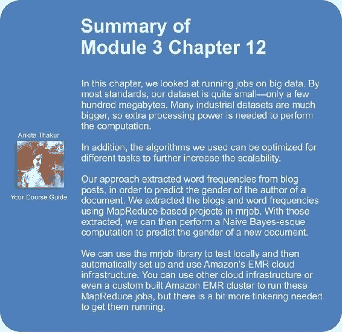

# 第 12.章使用大数据

数据量正以指数速度增长。 当今的系统正在生成和记录有关客户行为，分布式系统，网络分析，传感器以及许多其他来源的信息。 当前移动数据的大趋势正在推动当前的增长，而下一个大事物– **物联网**（ **IoT** ）–将进一步提高增长率。

这对数据挖掘意味着什么是一种新的思维方式。 需要改进或放弃运行时间较长的复杂算法，而能够处理更多样本的简单算法越来越受欢迎。 例如，虽然支持向量机是很好的分类器，但是某些变体很难在非常大的数据集上使用。 相反，在这些情况下，更简单的算法（例如逻辑回归）可以更轻松地进行管理。

在本章中，我们将研究以下内容：

*   大数据挑战与应用
*   MapReduce 范例
*   Hadoop MapReduce
*   mrjob，一个可在亚马逊基础设施上运行 MapReduce 程序的 python 库

# 大数据

什么使大数据与众不同？ 大多数大数据支持者谈论大数据的四个 V：

1.  **量**：我们生成和存储的数据量正在以越来越高的速度增长，对未来的预测通常仅暗示进一步的增长。 今天的数千兆字节大小的硬盘驱动器将在几年内转变为 EB 级硬盘驱动器，并且网络吞吐量流量也将不断增加。 信噪比可能非常困难，因为重要数据丢失在大量不重要的数据中。
2.  **速度**：尽管与体积有关，但数据的速度也在增加。 现代汽车有数百个传感器，这些传感器将数据流传输到计算机中，并且需要在亚秒级的水平上分析来自这些传感器的信息，以操作汽车。 这不仅仅是在数据量中寻找答案的情况； 这些答案通常需要迅速得出。
3.  **品种**：具有清晰定义列的漂亮数据集只是我们如今拥有的数据集的一小部分。 考虑一个社交媒体帖子，该帖子可能包含文本，照片，用户提及，喜欢，评论，视频，地理信息和其他字段。 仅仅忽略这些数据中不适合您模型的部分将导致信息丢失，但是整合信息本身可能非常困难。
4.  **准确性**：随着数据量的增加，可能很难确定是否已正确收集数据-是过时，嘈杂，包含异常值，还是通常是否有用 完全没有 当人们无法可靠地验证数据本身时，很难信任数据。 外部数据集也越来越多地被合并为内部数据集，从而带来了更多与数据准确性相关的麻烦。

这四个主要 V（其他人提出了其他 V）概述了大数据为何与大量数据不同的原因。 在这些规模上，处理数据的工程问题通常更加困难，更不用说分析了。 尽管有很多蛇油销售人员高估了使用大数据的能力，但很难否认工程挑战和大数据分析的潜力。

我们使用的算法是先将数据集加载到内存中，然后再处理内存中的版本。 这在计算速度方面带来了很大的好处，因为在内存中数据上进行计算要比必须在使用之前加载样本快得多。 此外，内存中的数据使我们可以对数据进行多次迭代，从而改进我们的模型。

在大数据中，我们无法将数据加载到内存中，从很多方面来说，这是一个确定问题是否是大数据的好定义-如果数据可以容纳在计算机的内存中，那么您就不会在处理 大数据问题。

# 应用场景和目标

在公共和私营部门中都有许多大数据用例。

人们使用基于大数据的系统的最常见体验是在 Internet 搜索中，例如 Google。 要运行这些系统，需要在一秒钟之内对数十亿个网站进行搜索。 进行基于文本的基本搜索将不足以解决此类问题。 仅存储所有这些网站的文本是一个大问题。 为了处理查询，需要为此应用专门创建和实现新的数据结构和数据挖掘方法。

大数据还用于许多其他科学实验中，例如大型强子对撞机（下图所示），它的长度超过 17 公里，包含 1.5 亿个传感器，每秒监视数亿个粒子碰撞。 来自该实验的数据非常庞大，经过过滤过程之后，每天创建 25 PB（如果不使用过滤，则每年将有 1.5 亿 PB）。 对如此庞大的数据进行分析已经获得了有关我们宇宙的惊人见解，但这一直是工程和分析领域的重大挑战。


各国政府也越来越多地使用大数据来跟踪人口，企业以及有关其国家的其他方面。 跟踪数百万人和数十亿的互动（例如业务交易或医疗保健支出）导致许多政府组织需要大数据分析。

交通管理是世界上许多国家/地区的特别关注的国家，它们正在使用数百万个传感器来跟踪交通，以确定最拥挤的道路，并预测新道路对交通水平的影响。

大型零售组织正在使用大数据来改善客户体验并降低成本。 这涉及到预测客户需求以拥有正确的库存水平，用他们可能想要购买的产品向客户推销，以及跟踪交易以寻找趋势，模式和潜在的欺诈行为。

其他大型企业也正在利用大数据来自动化其业务并改善其产品。 这包括利用分析来预测其行业的未来趋势并跟踪外部竞争对手。 大型企业还使用分析来管理自己的员工，从而跟踪员工以寻找员工可能离开公司的迹象，以便在他们离开之前进行干预。

信息安全部门还通过监视网络流量，利用大数据来查找大型网络中的恶意软件感染。 这可能包括寻找异常的流量模式，恶意软件传播的证据以及其他异常情况。 **高级持久威胁**（ **APT** ）是另一个问题，有意识的攻击者会将他们的代码隐藏在大型网络中，从而在很长一段时间内窃取信息或造成破坏。 查找 APT 通常是对许多计算机进行取证检查的情况，对于人类而言，完成这项任务只需要很长时间才能有效地执行自己的任务。 Analytics（分析）可帮助自动化和分析这些取证图像以发现感染。

大数据正在越来越多的部门和应用程序中使用，并且这种趋势可能只会持续下去。


# MapReduce

有许多概念可以对大数据执行数据挖掘和常规计算。 最受欢迎的模型之一是 MapReduce 模型，该模型可用于任意大型数据集的常规计算。

MapReduce 起源于 Google，当时该公司在开发时就考虑了分布式计算。 它还引入了容错能力和可伸缩性改进。 MapReduce 的“原始”研究报告于 2004 年发表，自那时以来，已有成千上万的项目，实现和应用程序在使用它。

尽管该概念与许多先前的概念相似，但 MapReduce 已成为大数据分析的主要内容。

## 直觉

MapReduce 有两个主要步骤：Map 步骤和 Reduce 步骤。 这些建立在将函数映射到列表并减少结果的函数编程概念上。 为了解释这个概念，我们将开发代码，该代码将遍历列表列表并产生这些列表中所有数字的总和。

MapReduce 范式中还包含混洗和合并步骤，我们将在后面看到。

首先，“映射”步骤采用一个函数并将其应用于列表中的每个元素。 返回的结果是一个大小相同的列表，该函数的结果应用于每个元素。

要打开一个新的 IPython Notebook，首先创建一个列表列表，每个子列表中都有数字：

```py
a = [[1,2,1], [3,2], [4,9,1,0,2]]
```

接下来，我们可以使用 sum 函数执行映射。 此步骤将求和函数应用于`a`的每个元素：

```py
sums = map(sum, a)
```

尽管 sums 是一个生成器（实际值直到我们要求时才计算），但上述步骤大约等于以下代码：

```py
sums = []
for sublist in a:
    results = sum(sublist)
    sums.append(results)
```

减少步骤要复杂一些。 它涉及将函数应用于返回结果的每个元素以及某个初始值。 我们从初始值开始，然后将给定函数应用于该初始值和第一个值。 然后，我们将给定函数应用于结果和下一个值，依此类推。

我们首先创建一个将两个数字加在一起的函数。

```py
def add(a, b):
  return a + b
```

然后我们执行归约。 reduce 的签名是 reduce（函数，序列和初始），其中函数在每个步骤应用于序列。 第一步，将初始值用作第一个值，而不是列表的第一个元素：

```py
from functools import reduce
print(reduce(add, sums, 0))
```

结果 *25* 是和列表中每个值的总和，因此是原始数组中每个元素的总和。

上面的代码等于以下代码：

```py
initial = 0
current_result = initial
for element in sums:
    current_result = add(current_result, element)
```

在这个琐碎的示例中，我们的代码可以大大简化，但是真正的收益来自于分布计算。 例如，如果我们有一百万个子列表，并且每个子列表包含一百万个元素，则可以在许多计算机上分布此计算。

为此，我们分配了地图步骤。 对于列表中的每个元素，我们将其以及功能说明发送到计算机。 然后，这台计算机将结果返回到我们的主计算机（主机）。

然后，主机将结果发送到计算机进行缩减步骤。 在上百万个子列表的示例中，我们会将一百万个作业发送到不同的计算机（同一台计算机在完成我们的第一份工作后可能会被重用）。 返回的结果只是一个一百万个数字的列表，然后我们计算它们的总和。

结果是，即使我们的原始数据中包含一万亿个数字，也没有计算机需要存储超过一百万个数字。

## 字数示例

MapReduce 的实现比仅使用 map and reduce 步骤要复杂一些。 这两个步骤都使用键来调用，这允许分离数据和跟踪值。

映射函数采用键和值对，并返回*键+值*对的列表。 输入和输出的键不一定相互关联。 例如，对于执行单词计数的 MapReduce 程序，输入键可能是示例文档的 ID 值，而输出键可能是给定的单词。 输入值将是文档的文本，输出值将是每个单词的频率：

```py
from collections import defaultdict
def map_word_count(document_id, document):
```

我们首先计算每个单词的频率。 在这个简化的示例中，尽管有更好的选择，我们将文档拆分为空白以获取单词：

```py
    counts = defaultdict(int)
    for word in document.split():
        counts[word] += 1
```

然后我们产生每个单词，计数对。 这里的单词是关键，计数是 MapReduce 术语中的值：

```py
    for word in counts:
        yield (word, counts[word])
```

通过使用单词作为关键字，我们可以执行**随机播放**步骤，该步骤将每个关键字的所有值分组：

```py
def shuffle_words(results):
```

首先，我们将每个单词的结果计数汇总到计数列表中：

```py
    records = defaultdict(list)
```

然后，我们迭代 map 函数返回的所有结果；

```py
    for results in results_generators:
        for word, count in results:
            records[word].append(count)
```

接下来，我们产生每个单词以及在数据集中获得的所有计数：

```py
    for word in records:
        yield (word, records[word])
```

最后一步是 reduce 步骤，该步骤采用一个键值对（在这种情况下，该值始终是一个列表）并生成一个键值对。 在我们的示例中，键是单词，输入列表是在随机播放步骤中产生的计数列表，输出值是计数之和：

```py
def reduce_counts(word, list_of_counts):
    return (word, sum(list_of_counts))
```

为了了解这一点，我们可以使用 scikit-learn 中提供的 20 个新闻组数据集：

```py
from sklearn.datasets import fetch_20newsgroups
dataset = fetch_20newsgroups(subset='train')
documents = dataset.data
```

然后，我们应用地图步骤。 我们在此处使用枚举为我们自动生成文档 ID。 尽管它们在此应用程序中并不重要，但这些键在其他应用程序中却很重要。

```py
map_results = map(map_word_count, enumerate(documents))
```

此处的实际结果只是一个生成器，没有实际计数。 就是说，这是一个生成（单词，计数）对的生成器。

接下来，我们执行洗牌步骤对这些字数进行排序：

```py
shuffle_results = shuffle_words(map_results)
```

从本质上讲，这是 MapReduce 的工作。 但是，它仅在单个线程上运行，这意味着我们无法从 MapReduce 数据格式中获得任何好处。 在下一节中，我们将开始使用 Hadoop（MapReduce 的开源提供程序）开始从这种范例中获取好处。

## Hadoop MapReduce

Hadoop 是 Apache 的开源工具集，其中包括 MapReduce 的实现。 在许多情况下，它是许多人事实上使用的实现。 该项目由 Apache 小组（负责著名的 Web 服务器）管理。

Hadoop 生态系统非常复杂，具有大量工具。 我们将使用的主要组件是 Hadoop MapReduce。 Hadoop 中包含的其他用于处理大数据的工具如下：

*   **Hadoop 分布式文件系统（HDFS）**：此是一种文件系统，可以在许多计算机上存储文件，目的是在提供高带宽的同时，防止硬件故障。
*   **YARN** ：此是用于调度应用程序和管理计算机集群的方法。
*   **Pig** ：这是一种用于 MapReduce 的高​​级编程语言。 Hadoop MapReduce 以 Java 实施，Pig 位于 Java 实施之上，允许您以其他语言（包括 Python）编写程序。
*   **配置单元**：此用于管理数据仓库和执行查询。
*   **HBase** ：此是 Google 的 BigTable（分布式数据库）的实现。

这些工具都解决了进行大数据实验（包括数据分析）时出现的不同问题。

也有非基于 Hadoop 的 MapReduce 实现，以及其他具有类似目标的项目。 此外，许多云提供商都使用基于 MapReduce 的系统。


# 应用

在此应用程序中，我们将研究根据使用不同单词来预测作家的性别。 我们将为此使用朴素贝叶斯方法，并在 MapReduce 中进行训练。 最终模型不需要 MapReduce，尽管我们可以使用 Map 步骤来执行-也就是说，在列表中的每个文档上运行预测模型。 这是 MapReduce 中用于数据挖掘的常见 Map 操作，而 reduce 步骤仅组织了预测列表，因此可以将其追溯到原始文档。

我们将使用亚马逊的基础设施来运行我们的应用程序，从而使我们能够利用其计算资源。

## 获取数据

我们将使用的数据是一组博客文章，其中标有年龄，性别，行业（即工作）以及有趣的是星号。 这些数据是 2004 年 8 月从[这个页面](http://blogger.com)收集的，在超过 60 万个帖子中有 1.4 亿个单词。 每个博客可能只由一个人撰写，并做了一些工作来验证这一点（尽管我们永远无法确定）。 帖子还与发布日期匹配，这使它成为非常丰富的数据集。

要获取数据，请转到[这个页面](http://u.cs.biu.ac.il/~koppel/BlogCorpus.htm)并单击**下载语料库**。 从那里将文件解压缩到计算机上的目录。

数据集由一个博客组织成一个文件，文件名给出了类。 例如，文件名之一如下：

```py
1005545.male.25.Engineering.Sagittarius.xml
```

文件名用句点分隔，字段如下：

*   **Blogger ID** ：此一个简单的 ID 值，用于组织身份。
*   **性别**：此是男性还是女性，并且所有博客都被标识为这两个选项之一（此数据集中不包含其他选项）。
*   **年龄**：给出了确切的年龄，但故意存在一些差距。 存在的年龄在 13-17、23-27 和 33-48（含）范围内。 出现差距的原因是允许将博客按年龄段划分，因为将 18 岁的写作与 19 岁的写作分开很难，而且年龄本身可能已经过时了。
*   **行业**：在中，是 40 个不同行业之一，包括科学，工程，艺术和房地产。 另外，还包括不知名行业的 indUnk。
*   **星号**：此是 12 个占星术星号之一。

所有值都是自我报告的，这意味着标签可能存在错误或不一致，但被认为是最可靠的-如果人们想以这种方式保护自己的隐私，则可以选择不设置值。

单个文件为`pseudo-XML`格式，包含`<Blog>`标签和`<post>`标签序列。 每个`<post>`标签都以`<date>`标签开头。 尽管我们可以将其解析为 XML，但逐行解析它要简单得多，因为文件不是完全格式正确的 XML，存在一些错误（主要是编码问题）。 要阅读文件中的帖子，我们可以使用循环遍历行。

我们设置了一个测试文件名，以便可以看到它的作用：

```py
import os
filename = os.path.join(os.path.expanduser("~"), "Data", "blogs", "1005545.male.25.Engineering.Sagittarius.xml")
```

首先，我们创建一个列表，该列表将让我们存储每个帖子：

```py
all_posts = []
```

然后，我们打开文件以读取：

```py
with open(filename) as inf:
```

然后，我们设置一个标志，指示我们当前是否在帖子中。 当找到表示帖子开始的`<post>`标签时，将其设置为`True`；当找到结束的`</post>`标签时，将其设置为`False`；

```py
    post_start = False
```

然后，我们创建一个列表来存储当前帖子的行：

```py
    post = []
```

然后，我们遍历文件的每一行并删除空白：

```py
    for line in inf:
        line = line.strip()
```

如前所述，如果我们找到开始的`<post>`标签，则表明我们在新帖子中。 同样，使用 close `</post>`标签：

```py
        if line == "<post>":
            post_start = True
        elif line == "</post>":
            post_start = False
```

当我们找到结束`</post>`标记时，我们还将记录到目前为止找到的完整帖子。 然后，我们也开始一个新的“当前”帖子。 该代码与上一行的缩进级别相同：

```py
            all_posts.append("\n".join(post))
            post = []
```

最后，当该行不是 end 标记的开始，而是在发布中时，我们将当前行的文本添加到当前发布中：

```py
        elif post_start:
            post.append(line)
```

如果我们不在当前帖子中，则只需忽略该行。

然后，我们可以获取每个帖子的文本：

```py
print(all_posts[0])
```

我们也可以找出该作者创建的帖子数：

```py
print(len(all_posts))
```

## 朴素贝叶斯预测

现在，我们将要实现能够处理我们的数据集的朴素贝叶斯算法（从技术上讲，是贝叶斯算法的简化版本，没有许多更复杂的实现具有的功能）。

### mrjob 程序包

mrjob 软件包使我们能够创建 MapReduce 作业，这些作业可以轻松地传输到 Amazon 的基础架构。 虽然 mrjob 听起来像是 Men 先生系列儿童读物中的可笑的补充，但它实际上代表 *Map Reduce Job* 。 这是一个很棒的包装； 但是，在撰写本文时，Python 3 支持仍不成熟，这对于我们稍后将讨论的 Amazon EMR 服务是正确的。

### 注意

您可以使用以下命令为 Python 2 版本安装 mrjob：

```py
sudo pip2 install mrjob

```

请注意，`pip`用于版本 2，而不用于版本 3。

本质上，mrjob 提供了大多数 MapReduce 作业所需的标准功能。 它最惊人的功能是，您可以编写相同的代码，在没有 Hadoop 的情况下在本地计算机上进行测试，然后推送到 Amazon 的 EMR 服务或另一台 Hadoop 服务器。

尽管无法神奇地使大问题变小，但这使测试代码变得更加容易-请注意，任何本地测试都使用数据集的子集而不是整个大型数据集。

### 提取博客文章

我们首先要创建一个 MapReduce 程序，该程序将从每个博客文件中提取每个帖子，并将它们存储为单独的条目。 由于我们对帖子作者的性别感兴趣，因此我们也将其提取出来并与帖子一起存储。

我们无法在 IPython Notebook 中执行此操作，因此请打开 Python IDE 进行开发。 如果您没有 Python IDE（例如 PyCharm），则可以使用文本编辑器。 我建议寻找具有语法高亮显示的 IDE。

### 注意

如果仍然找不到良好的 IDE，则可以在 IPython Notebook 中编写代码，然后单击**文件** |。 **下载为** | **Python** 。 将此文件保存到目录并按照[第 11 章](32.html "Chapter 11. Classifying Objects in Images Using Deep Learning")和*使用深度学习*对图像中的对象进行分类中所述运行它。

为此，我们将需要`os`和`re`库，因为我们将获取环境变量，并且还将使用正则表达式进行单词分隔：

```py
import os
import re
```

然后，我们导入`MRJob`类，该类将从我们的 MapReduce 作业中继承：

```py
from mrjob.job import MRJob
```

然后，我们创建一个新类，该子类继承了 MRJob：

```py
class ExtractPosts(MRJob):
```

与以前一样，我们将使用类似的循环从文件中提取博客文章。 接下来将定义的映射功能将在每一行中工作，这意味着我们必须在映射功能之外跟踪不同的帖子。 因此，我们将`post_start`和`post`类变量，而不是函数内部的变量：

```py
    post_start = False
    post = []
```

然后，我们定义我们的 mapper 函数-这将文件中的一行作为输入并产生博客文章。 这些行保证可以从同一作业文件中订购。 这使我们可以使用上述类变量来记录当前的帖子数据：

```py
    def mapper(self, key, line):
```

在开始收集博客文章之前，我们需要获取博客作者的性别。 尽管我们通常不将文件名用作 MapReduce 作业的一部分，但对它的需求非常强烈（如本例所示），因此该功能可用。 当前文件存储为环境变量，我们可以使用以下代码行获取该文件：

```py
        filename = os.environ["map_input_file"]
```

然后，我们分割文件名以获取性别（这是第二个标记）：

```py
        gender = filename.split(".")[1]
```

我们从行的开头和结尾删除空格（这些文档中有很多空格），然后像以前一样进行基于帖子的跟踪；

```py
        line = line.strip()
        if line == "<post>":
            self.post_start = True
        elif line == "</post>":
            self.post_start = False
```

与其像以前那样将存储在列表中，不如将它们存储在列表中，而是生成它们。 这使 mrjob 可以跟踪输出。 我们同时提供性别和职位，以便我们可以记录每条记录匹配的性别。 此函数的其余部分与上述循环的定义方式相同：

```py
            yield gender, repr("\n".join(self.post))
            self.post = []
        elif self.post_start:
            self.post.append(line)
```

最后，在函数和类之外，我们设置脚本以在从命令行调用该 MapReduce 作业时运行该脚本：

```py
if __name__ == '__main__':
    ExtractPosts.run()
```

现在，我们可以使用以下 shell 命令运行此 MapReduce 作业。 请注意，我们使用的是 Python 2，而不是 Python 3。

```py
python extract_posts.py <your_data_folder>/blogs/51* --output-dir=<your_data_folder>/blogposts –no-output
```

第一个参数`<your_data_folder>/blogs/51*`（只需记住将`<your_data_folder` >更改为数据文件夹的完整路径），将获得数据样本（所有以 51 开头的文件，只有 11 个文档）。 然后，我们将输出目录设置为新文件夹，并将其放置在 data 文件夹中，并指定不输出流数据。 如果没有最后一个选项，则运行时输出的数据将显示在命令行中，这对我们不是很有帮助，并且会大大降低计算机的速度。

运行脚本，很快就会提取每个博客帖子并将其存储在我们的`output`文件夹中。 该脚本仅在本地计算机上的单个线程上运行，因此我们根本无法获得加速，但是我们知道代码可以运行。

现在，我们可以在`output`文件夹中查找结果。 创建了一堆文件，每个文件在单独的行中包含每个博客文章，并在其前面加上博客作者的性别。


### 训练朴素贝叶斯

现在我们已经提取了博客文章，我们可以在其上训练我们的朴素贝叶斯模型。 直觉是我们记录了某个单词被特定性别书写的可能性。 为了对新样本进行分类，我们将概率相乘并找到最可能的性别。

此代码的目标是要输出一个文件，该文件列出了语料库中的每个单词以及该单词针对每个性别的出现频率。 输出文件将如下所示：

```py
"'ailleurs"  {"female": 0.003205128205128205}
"'air"  {"female": 0.003205128205128205}
"'an"  {"male": 0.0030581039755351682, "female": 0.004273504273504274}
"'angoisse"  {"female": 0.003205128205128205}
"'apprendra"  {"male": 0.0013047113868622459, "female": 0.0014172668603481887}
"'attendent"  {"female": 0.00641025641025641}
"'autistic"  {"male": 0.002150537634408602}
"'auto"  {"female": 0.003205128205128205}
"'avais"  {"female": 0.00641025641025641}
"'avait"  {"female": 0.004273504273504274}
"'behind"  {"male": 0.0024390243902439024}
"'bout"  {"female": 0.002034152292059272}
```

第一个值是单词，第二个值是字典，将性别映射到该单词在该性别文字中的出现频率。

在 Python IDE 或文本编辑器中打开一个新文件。 我们将再次需要 mrjob 的`os`和`re`库以及`NumPy`和`MRJob`。 我们还需要 itemgetter，因为我们将对字典进行排序：

```py
import os
import re
import numpy as np
from mrjob.job import MRJob
from operator import itemgetter
```

我们还将需要 MRStep，它概述了 MapReduce 作业中的步骤。 我们以前的工作只有一步，即定义为映射函数，然后定义为归约函数。 这项工作将包含三个步骤，我们先进行 Map，Reduce，然后再次进行 Map 和 Reduce。 直觉与我们在前面各章中使用的管道相同，其中一步的输出是下一步的输入：

```py
from mrjob.step import MRStep
```

然后，我们创建单词搜索正则表达式并进行编译，从而使我们能够找到单词边界。 这种正则表达式比我们在前几章中使用的简单拆分功能要强大得多，但是如果您要寻找更准确的单词拆分器，我建议像在[第 6 章](27.html "Chapter 6. Social Media Insight Using Naive Bayes")中一样使用 NLTK，[ *使用朴素贝叶斯*的社交媒体见解：

```py
word_search_re = re.compile(r"[\w']+")
```

我们为培训定义了一个新班级：

```py
class NaiveBayesTrainer(MRJob):
```

我们定义了`MapReduce`工作的步骤。 有两个步骤。 第一步将提取单词出现概率。 第二步将比较两个性别，并将每个性别的概率输出到我们的输出文件中。 在每个 MRStep 中，我们定义映射器和化简器函数，它们是`NaiveBayesTrainer`类中的类函数（我们将在接下来编写这些函数）：

```py
    def steps(self):
        return [
            MRStep(mapper=self.extract_words_mapping,
                   reducer=self.reducer_count_words),
            MRStep(reducer=self.compare_words_reducer),
            ]
```

第一个功能是第一步的映射器功能。 此功能的目标是获取每个博客帖子，获取该帖子中的所有单词，然后记录出现的情况。 我们需要单词的频率，因此我们将返回`1 / len(all_words)`，这允许我们稍后对频率值求和。 这里的计算并不完全正确-我们还需要针对文档数进行标准化。 但是，在此数据集中，类的大小是相同的，因此我们可以方便地忽略它，而对最终版本的影响很小。

我们还将输出该帖子作者的性别，因为稍后我们将需要它：

```py
    def extract_words_mapping(self, key, value):
        tokens = value.split()
        gender = eval(tokens[0])
        blog_post = eval(" ".join(tokens[1:]))
        all_words = word_search_re.findall(blog_post)
        all_words = [word.lower() for word in all_words]
            all_words = word_search_re.findall(blog_post)
            all_words = [word.lower() for word in all_words]
            for word in all_words:
                yield (gender, word), 1\. / len(all_words)
```

### 提示

对于本示例，我们在前面的代码中使用`eval`来简化从文件中博客帖子的解析。 不建议这样做。 而是使用 JSON 之类的格式正确存储和解析文件中的数据。 具有对数据集的访问权限的恶意使用会将代码插入这些令牌中，并使该代码在您的服务器上运行。

在第一步的归约器中，我们将每个性别和单词对的频率相加。 我们也将关键字更改为单词，而不是组合，因为这允许我们在使用最终训练的模型时按单词搜索（尽管，我们仍然需要输出性别以备后用）；

```py
    def reducer_count_words(self, key, frequencies):
        s = sum(frequencies)
        gender, word = key
        yield word, (gender, s)
```

的最后一步不需要映射器功能，因此我们不需要添加一个映射器功能。 数据将作为`identity mapper`类型直接传递。 但是，归约器将组合给定单词下每个性别的频率，然后输出单词和频率字典。

这为我们提供了朴素贝叶斯实现所需的信息：

```py
    def compare_words_reducer(self, word, values):
        per_gender = {}
        for value in values:
            gender, s = value
            per_gender[gender] = s
        yield word, per_gender
```

最后，当文件作为脚本运行时，我们设置代码来运行该模型；

```py
if __name__ == '__main__':
    NaiveBayesTrainer.run()
```

然后，我们可以运行此脚本。 该脚本的输入是前一个提取程序后脚本的输出（如果您愿意，我们可以在同一 MapReduce 作业中将它们实际上作为不同的步骤）；

```py
python nb_train.py <your_data_folder>/blogposts/ 
  --output-dir=<your_data_folder>/models/ 
--no-output
```

输出目录是一个文件夹，该文件夹将存储一个包含此 MapReduce 作业的输出的文件，这将是我们运行 Naive Bayes 分类器所需的概率。

### 全部放在一起

现在，我们可以使用这些概率运行朴素贝叶斯分类器。 我们将在 IPython Notebook 中进行此操作，然后可以返回使用 Python 3（phe！）。

首先，查看上一个 MapReduce 作业中指定的 models 文件夹。 如果输出是多个文件，我们可以通过在 models 目录中使用命令行功能将文件彼此附加在一起来合并文件：

```py
cat * > model.txt
```

如果这样做，则需要使用`model.txt`作为模型文件名更新以下代码。

回到我们的笔记本，我们首先导入脚本所需的一些标准导入：

```py
import os
import re
import numpy as np
from collections import defaultdict
from operator import itemgetter
```

我们再次重新定义词搜索正则表达式-如果您是在实际应用程序中执行此操作，则建议将其集中化。 以相同的方式提取单词进行培训和测试非常重要：

```py
word_search_re = re.compile(r"[\w']+")
```

接下来，我们创建一个从给定文件名加载模型的函数：

```py
def load_model(model_filename):
```

模型参数将采用字典字典的形式，其中第一个键是单词，内部字典将每个性别映射为一个概率。 我们使用`defaultdicts`，如果不存在值，它将返回零；

```py
    model = defaultdict(lambda: defaultdict(float))
```

然后，我们打开模型并解析每一行；

```py
    with open(model_filename) as inf:
        for line in inf:
```

该行分为两部分，用空格隔开。 第一个是单词本身，第二个是概率词典。 对于每个，我们对它们运行`eval`以获得实际值，该实际值是使用`repr`存储在前面的代码中的：

```py
            word, values = line.split(maxsplit=1)
            word = eval(word)
            values = eval(values)
```

然后，我们将值跟踪到模型中的单词：

```py
            model[word] = values
    return model
```

接下来，我们加载实际模型。 您可能需要更改模型文件名，该文件名将位于最后一个 MapReduce 作业的输出`dir`中；

```py
model_filename = os.path.join(os.path.expanduser("~"), "models", "part-00000")
model = load_model(model_filename)
```

例如，我们可以看到男性和女性在单词 **i** （所有单词在 MapReduce 作业中都变为小写）的用法上的差异：

```py
model["i"]["male"], model["i"]["female"]
```

接下来，我们创建一个可以使用该模型进行预测的函数。 在此示例中，我们将不使用 scikit-learn 接口，而仅创建一个函数。 我们的函数将模型和文档作为参数，并返回最可能的性别：

```py
def nb_predict(model, document):
```

我们首先创建一个字典，将每个性别映射到计算出的概率：

```py
    probabilities = defaultdict(lambda : 1)
```

我们从文档中提取每个单词：

```py
    words = word_search_re.findall(document)
```

然后，我们遍历单词并在数据集中找到每种性别的概率：

```py
    for word in set(words):
        probabilities["male"] += np.log(model[word].get("male", 1e-15))
        probabilities["female"] += np.log(model[word].get("female", 1e-15))
```

然后，我们按性别将其值排序，获得最高价值，并将其返回为我们的预测：

```py
    most_likely_genders = sorted(probabilities.items(), key=itemgetter(1), reverse=True)
    return most_likely_genders[0][0]
```

重要的是要注意，我们使用`np.log`来计算概率。 朴素贝叶斯模型中的概率通常很小。 在许多统计值中都必须乘以较小的值，这会导致下溢错误，其中计算机的精度不够好，只会使整个值变为 0。在这种情况下，这将导致两个性别的可能性为零 ，导致错误的预测。

为了解决这个问题，我们使用对数概率。 对于两个值 a 和 b，`log(a,b)`等于`log(a) + log(b)`。 小概率的对数为负值，但相对较大。 例如，`log(0.00001)`约为`-11.5`。 这意味着我们可以乘以对数概率并以相同的方式比较值，而不是乘以实际概率并冒下溢错误的风险（数字越大表示可能性越高）。

使用对数概率的的一个问题是它们不能很好地处理零值（尽管乘以零概率也不能）。 这是因为未定义 log（0）。 在朴素贝叶斯的某些实现中，所有计数都加 1 以消除此问题，但是还有其他方法可以解决此问题。 这是平滑值的简单形式。 在我们的代码中，如果对于给定的性别没有看到这个词，我们只会返回一个很小的值。

回到我们的预测功能，我们可以通过复制数据集中的帖子来进行测试：

```py
new_post = """ Every day should be a half day.  Took the afternoon off to hit the dentist, and while I was out I managed to get my oil changed, too.  Remember that business with my car dealership this winter?  Well, consider this the epilogue.  The friendly fellas at the Valvoline Instant Oil Change on Snelling were nice enough to notice that my dipstick was broken, and the metal piece was too far down in its little dipstick tube to pull out.  Looks like I'm going to need a magnet.   Damn you, Kline Nissan, daaaaaaammmnnn yooouuuu....   Today I let my boss know that I've submitted my Corps application.  The news has been greeted by everyone in the company with a level of enthusiasm that really floors me.     The back deck has finally been cleared off by the construction company working on the place.  This company, for anyone who's interested, consists mainly of one guy who spends his days cursing at his crew of Spanish-speaking laborers.  Construction of my deck began around the time Nixon was getting out of office.
"""
```

然后，我们使用以下代码进行预测：

```py
nb_predict(model, new_post)
```

对于此示例，最终的预测结果是男性，是正确的。 当然，我们绝不会在单个样本上测试模型。 我们使用以 51 开头的文件来训练该模型。 样本不多，所以我们不能指望准确性太高。

我们应该做的第一件事是训练更多样本。 我们将对以 6 或 7 开头的任何文件进行测试，然后对其余文件进行训练。

在命令行和 Blog 文件夹所在的数据文件夹（`cd <your_data_folder`）中，将 Blog 数据的副本创建到新文件夹中。

为我们的训练集创建一个文件夹：

```py
mkdir blogs_train
```

从训练集中将所有以 6 或 7 开头的文件移到测试集中：

```py
cp blogs/4* blogs_train/
cp blogs/8* blogs_train/
```

然后，为我们的测试集创建一个文件夹：

```py
mkdir blogs_test
```

将以`6`或`7`开头的任何文件从训练集中移入测试集中：

```py
cp blogs/6* blogs_test/
cp blogs/7* blogs_test/
```

我们将对训练集中的所有文件重新运行博客提取。 但是，这是一个比我们的系统更适合云基础架构的大型计算。 因此，我们现在将解析作业移至 Amazon 的基础架构。

和以前一样，在命令行上运行以下命令。 唯一的区别是我们在不同的输入文件文件夹上进行训练。 在运行以下代码之前，请删除博客文章和模型文件夹中的所有文件：

```py
python extract_posts.py ~/Data/blogs_train --output-dir=/home/bob/Data/blogposts –no-output
python nb_train.py ~/Data/blogposts/ --output-dir=/home/bob/models/ --no-output
```

此处的代码将需要更长的时间才能运行。

我们将在测试集中的任何博客文件上进行测试。 要获取文件，我们需要提取它们。 我们将使用`extract_posts.py` MapReduce 作业，但将文件存储在单独的文件夹中：

```py
python extract_posts.py ~/Data/blogs_test --output-dir=/home/bob/Data/blogposts_testing –no-output
```

回到 IPython Notebook，我们列出了所有输出的测试文件：

```py
testing_folder = os.path.join(os.path.expanduser("~"), "Data", "blogposts_testing")
testing_filenames = []
for filename in os.listdir(testing_folder):
    testing_filenames.append(os.path.join(testing_folder, filename))
```

对于每个文件，我们提取性别和文档，然后调用预测函数。 因为有很多文档，所以我们在生成器中执行此操作，并且我们不想使用过多的内存。 生成器产生实际性别和预测性别：

```py
def nb_predict_many(model, input_filename):
    with open(input_filename) as inf:
        # remove leading and trailing whitespace
        for line in inf:
            tokens = line.split()
            actual_gender = eval(tokens[0])
            blog_post = eval(" ".join(tokens[1:]))
            yield actual_gender, nb_predict(model, blog_post)
```

然后，我们记录整个数据集中的预测和实际性别。 我们在这里的预测是男性还是女性。 为了使用 scikit-learn 的`f1_score`函数，我们需要将它们变成 1 和 0。 为此，如果性别是男性，我们记录为 0，如果性别是 1，则记录为 1。 为此，我们使用布尔测试，查看性别是否为女性。 然后，我们使用`NumPy`将这些布尔值转换为`int`：

```py
y_true = []
y_pred = []
for actual_gender, predicted_gender in nb_predict_many(model, testing_filenames[0]):
    y_true.append(actual_gender == "female")
    y_pred.append(predicted_gender == "female")
y_true = np.array(y_true, dtype='int')
y_pred = np.array(y_pred, dtype='int')
```

现在，我们使用 scikit-learn 中的`F1`分数来测试的质量：

```py
from sklearn.metrics import f1_score
print("f1={:.4f}".format(f1_score(y_true, y_pred, pos_label=None)))
```

0.78 的结果还不错。 我们可能可以通过使用更多数据来改善此问题，但是要做到这一点，我们需要转向可以处理数据的功能更强大的基础架构。

### 关于亚马逊 EMR 基础设施的培训

我们正在使用 Amazon 的 **Elastic Map Reduce** （ **EMR** ）基础结构来运行我们的解析和模型构建作业。

为了做到这一点，我们首先需要在亚马逊的存储云中创建一个存储桶。 为此，请转到[这个页面](http://console.aws.amazon.com/s3)在 Web 浏览器中打开 Amazon S3 控制台，然后单击**创建存储桶**。 记住存储桶的名称，因为稍后我们将需要它。

右键单击新存储桶，然后选择`Properties`。 然后，更改权限，向所有人授予完全访问权限。 通常，这不是一个好的安全做法，建议您在完成本章后更改访问权限。

左键单击存储桶以将其打开，然后单击**创建文件夹**。 将文件夹命名为`blogs_train`。 我们将训练数据上传到此文件夹以在云上进行处理。

在您的计算机上，我们将使用 Amazon 的 AWS CLI，这是用于在 Amazon 的云上进行处理的命令行界面。

要安装，请使用以下命令：

```py
sudo pip2 install awscli

```

按照[这个页面](http://docs.aws.amazon.com/cli/latest/userguide/cli-chap-getting-set-up.html)上的说明设置此程序的凭据。

现在，我们要将数据上传到我们的新存储桶中。 首先，我们要创建数据集，该数据集不是所有博客都以 6 或 7 开头的博客。有更多优雅的方法可以完成此复制，但没有一个跨平台的方法值得推荐。 相反，只需复制所有文件，然后从训练数据集中删除以 6 或 7 开头的文件：

```py
cp -R ~/Data/blogs ~/Data/blogs_train_large
rm ~/Data/blogs_train_large/6*
rm ~/Data/blogs_train_large/7*

```

接下来，将数据上传到您的 Amazon S3 存储桶。 请注意，这将花费一些时间，并且会使用大量的上传数据（几百兆字节）。 对于互联网连接速度较慢的用户，在连接速度较快的位置进行此操作可能值得；

```py
 aws s3 cp  ~/Data/blogs_train_large/ s3://ch12/blogs_train_large --recursive --exclude "*" --include "*.xml"

```

我们将使用 mrjob 连接到 Amazon 的 EMR，它可以为我们处理所有事情。 它只需要我们的凭据即可。 按照[这个页面](https://pythonhosted.org/mrjob/guides/emr-quickstart.html)上的说明，使用您的 Amazon 凭证设置 mrjob。

完成此操作后，我们只需稍稍更改 mrjob 运行即可在 Amazon EMR 上运行。 我们只是通过`-r`开关告诉 mrjob 使用`emr`，然后将`s3`容器设置为输入和输出目录。 即使这将在亚马逊的基础设施上运行，也将需要相当长的时间才能运行。

```py
python extract_posts.py -r emr s3://ch12gender/blogs_train_large/ --output-dir=s3://ch12/blogposts_train/ --no-output
python nb_train.py -r emr s3://ch12/blogposts_train/ --output-dir=s3://ch12/model/ --o-output

```

### 注意

您还需要为使​​用付费。 这只有几美元，但是如果您要继续运行作业或在更大的数据集上执行其他作业，请记住这一点。 我做了很多工作，被收取了大约 20 美元。 仅运行这少数几个就应该少于$ 4。 但是，您可以转到[这个页面](https://console.aws.amazon.com/billing/home)来检查余额并设置价格提醒。

不需要`blogposts_train`和`model`文件夹存在-它们将由 EMR 创建。 实际上，如果它们存在，您将得到一个错误。 如果要重新运行，只需将这些文件夹的名称更改为新名称，但要记住将两个命令都更改为相同的名称（即，第一个命令的输出目录是第二个命令的输入目录）。

### 注意

如果您不耐烦，您可以在一段时间后随时停止第一份工作，而仅使用到目前为止收集的培训数据即可。 我建议离职至少 15 分钟，可能至少一个小时。 但是，您不能停止第二份工作并获得良好的结果。 第二份工作大概需要第一份工作的两倍到三倍。

您现在可以返回`s3`控制台，并从存储桶中下载输出模型。 将其保存在本地，我们可以返回 IPython Notebook 并使用新模型。 我们在此处重新输入代码-仅突出显示差异，以更新到我们的新模型：

```py
aws_model_filename = os.path.join(os.path.expanduser("~"), "models", "aws_model")
aws_model = load_model(aws_model_filename)
y_true = []
y_pred = []
for actual_gender, predicted_gender in nb_predict_many(aws_model, testing_filenames[0]):
    y_true.append(actual_gender == "female")
    y_pred.append(predicted_gender == "female")
y_true = np.array(y_true, dtype='int')
y_pred = np.array(y_pred, dtype='int')
print("f1={:.4f}".format(f1_score(y_true, y_pred, pos_label=None)))
```

使用额外的数据（0.81），结果要好得多。

### 注意

如果一切按计划进行，则您可能要从 Amazon S3 中删除存储桶-您需要支付存储费用。




