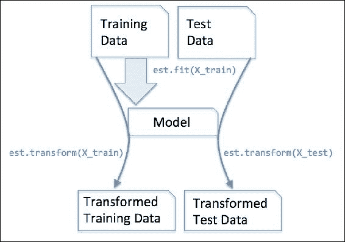
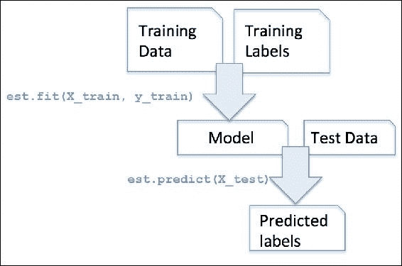
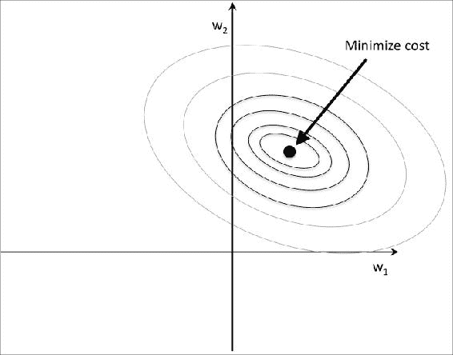
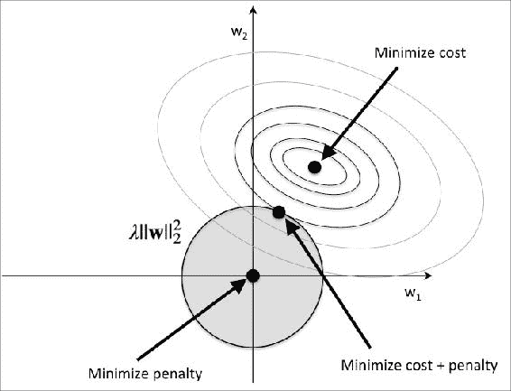
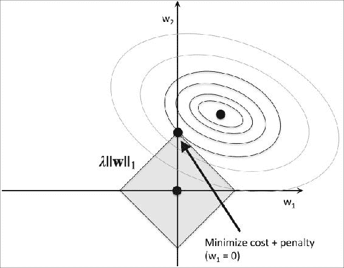
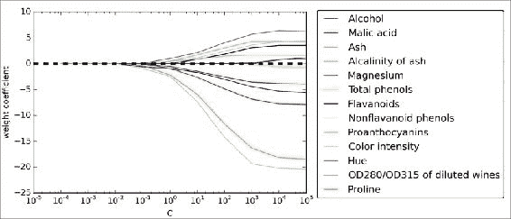
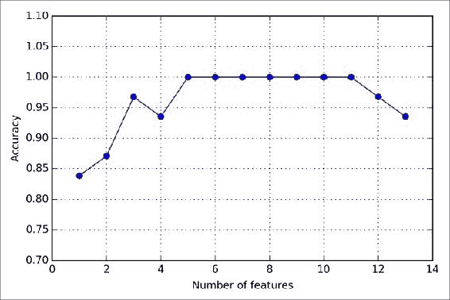
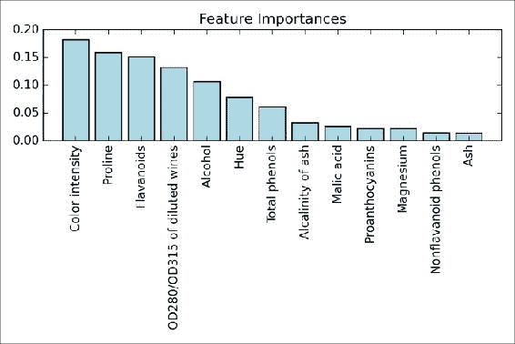

# 第 4 章。建立良好的培训集-数据预处理

数据的质量和其中包含的有用信息的数量是决定机器学习算法学习程度的关键因素。 因此，在将数据集输入学习算法之前，确保对数据集进行检查和预处理绝对至关重要。 在本章中，我们将讨论基本的数据预处理技术，这些技术将帮助我们建立良好的机器学习模型。

我们将在本章中介绍的主题如下：

*   从数据集中删除和估算缺失值
*   将分类数据转化为机器学习算法的形状
*   选择模型构建的相关特征

# 处理丢失的数据

在实际应用中，并非经常因各种原因而缺少一个或多个值。 例如，数据收集过程中可能存在错误，某些度量不适用，某些字段可能仅在调查中留为空白。 我们通常会看到*缺失值*作为数据表中的空格或占位符字符串，例如`NaN`（非数字）。

不幸的是，如果我们简单地忽略它们，大多数计算工具将无法处理此类缺失值，或者会产生无法预测的结果。 因此，至关重要的是，在继续进行进一步分析之前，应对那些遗漏的值进行处理。 但是在讨论几种处理缺失值的技术之前，让我们从 **CSV**（**逗号分隔值**）文件创建一个简单的示例数据框，以便更好地了解 问题：

```pypy
>>> import pandas as pd
>>> from io import StringIO
>>> csv_data = '''A,B,C,D
... 1.0,2.0,3.0,4.0
... 5.0,6.0,,8.0
... 10.0,11.0,12.0,'''
>>> # If you are using Python 2.7, you need
>>> # to convert the string to unicode:
>>> # csv_data = unicode(csv_data)
>>> df = pd.read_csv(StringIO(csv_data))
>>> df
   A   B   C   D
0  1   2   3   4
1  5   6 NaN   8
2  10  11  12 NaN
```

使用前面的代码，我们通过`read_csv`函数将 CSV 格式的数据读取到了大熊猫`DataFrame`中，并注意到两个缺失的单元格被`NaN`替换了。 前面的代码示例中的`StringIO`功能仅用于说明目的。 它使我们可以将分配给`csv_data`的字符串读入熊猫`DataFrame`中，就好像它是我们硬盘上的常规 CSV 文件一样。

对于较大的`DataFrame`，手动查找缺失值可能很繁琐； 在这种情况下，我们可以使用`isnull`方法返回带有布尔值的`DataFrame`，该布尔值指示单元格是否包含数字值（`False`）或是否缺少数据（`True`）。 使用`sum`方法，我们可以按如下所示返回每列缺失值的数量：

```pypy
>>> df.isnull().sum()
A    0
B    0
C    1
D    1
dtype: int64
```

这样，我们可以计算每列缺失值的数量。 在以下小节中，我们将研究如何处理这些丢失的数据的不同策略。

### 注意

尽管 scikit-learn 是为处理 NumPy 数组而开发的，但有时使用 pandas 的`DataFrame`预处理数据会更方便。 我们始终可以通过`values`属性访问`DataFrame`的基础 NumPy 数组，然后再将其提供给 scikit-learn 估计器：

```pypy
>>> df.values
array([[  1.,   2.,   3.,   4.],
       [  5.,   6.,  nan,   8.],
       [ 10.,  11.,  12.,  nan]])
```

## 消除具有缺失值的样品或特征

处理丢失数据的最简单方法之一就是简单地从数据集中完全删除相应的特征（列）或样本（行）。 缺少值的行可以通过`dropna`方法轻松删除：

```pypy
>>> df.dropna()
   A  B  C  D
0  1  2  3  4
```

类似地，我们可以通过将`axis`参数设置为`1`来删除任何行中至少具有`NaN`的列：

```pypy
>>> df.dropna(axis=1)
   A   B
0  1   2
1  5   6
2  10  11
```

`dropna`方法支持一些方便使用的其他参数：

```pypy
# only drop rows where all columns are NaN
>>> df.dropna(how='all')  

# drop rows that have not at least 4 non-NaN values
>>> df.dropna(thresh=4)  

# only drop rows where NaN appear in specific columns (here: 'C')
>>> df.dropna(subset=['C'])
```

尽管删除丢失的数据似乎是一种方便的方法，但它也具有某些缺点。 例如，我们最终可能会删除过多的样本，这将使可靠的分析变得不可能。 或者，如果我们删除太多的功能列，则将冒丢失分类器需要在类之间进行区分的有价值信息的风险。 因此，在下一节中，我们将介绍处理缺失值的最常用替代方法之一：插值技术。

## 插补缺失值

通常，样本的删除或整个特征列的删除根本不可行，因为我们可能会丢失太多有价值的数据。 在这种情况下，我们可以使用不同的插值技术来估计数据集中其他训练样本的缺失值。 最常见的插值技术之一是**均值插补**，其中我们仅将缺失值替换为整个特征列的平均值。 一种方便的方法是使用 scikit-learn 的`Imputer`类，如以下代码所示：

```pypy
>>> from sklearn.preprocessing import Imputer
>>> imr = Imputer(missing_values='NaN', strategy='mean', axis=0)
>>> imr = imr.fit(df)
>>> imputed_data = imr.transform(df.values)
>>> imputed_data
array([[ 1., 2., 3., 4.],
       [ 5., 6., 7.5, 8.],
       [ 10., 11., 12., 6.]])
```

在这里，我们用相应的均值替换了每个`NaN`值，该均值是针对每个功能列分别计算的。 如果将`axis=0`设置更改为`axis=1`，我们将计算行均值。 `strategy`参数的其他选项是`median`或`most_frequent`，其中后者将丢失的值替换为最频繁的值。 这对于估算分类要素值很有用。

## 了解 scikit-learn 估算器 API

在的上一部分中，我们使用了 scikit-learn 的`Imputer`类来估算数据集中的缺失值。 `Imputer` 类属于 scikit-learn 中所谓的**变换器**类，用于数据转换。 这些估计量的两个基本方法是`fit`和`transform`。 `fit`方法用于从训练数据中学习参数，`transform`方法使用这些参数来转换数据。 任何要转换的数据数组都必须具有与用于模型拟合的数据数组相同数量的特征。 下图说明了如何使用安装在训练数据上的变压器来转换训练数据集和新的测试数据集：



在第 3 章，“使用 Scikit-learn” 的机器学习分类器中使用的分类器属于 scikit-learn 中所谓的估计器，其 API 在概念上与变压器类非常相似。 估计器具有`predict`方法，但也可以具有`transform`方法，我们将在后面看到。 您可能还记得，当我们训练那些估计器进行分类时，我们还使用了`fit`方法来学习模型的参数。 但是，在监督学习任务中，我们另外提供了适合模型的类标签，然后可以通过`predict`方法将其用于对新数据样本进行预测，如下图所示：




# 处理分类数据

到目前为止，我们仅使用数值。 但是，现实世界的数据集包含一个或多个分类要素列并不少见。 在讨论分类数据时，我们必须进一步区分**标称**和**标称**特征。 序数特征可以理解为可以排序或排序的分类值。 例如，*T 恤尺寸*将是一个常规特征，因为我们可以定义一个订单 *XL* >`L`>`M`。 相比之下，标称特征并不意味着任何顺序，并且继续前面的示例，我们可以将 *T 恤颜色*视为标称特征，因为通常来说，这是没有意义的， 例如，*红色*大于*蓝色*。

在探索用于处理此类分类数据的不同技术之前，让我们创建一个新的数据框来说明问题：

```pypy
>>> import pandas as pd
>>> df = pd.DataFrame([
...            ['green', 'M', 10.1, 'class1'], 
...            ['red', 'L', 13.5, 'class2'], 
...            ['blue', 'XL', 15.3, 'class1']])
>>> df.columns = ['color', 'size', 'price', 'classlabel']
>>> df
   color size  price classlabel
0  green    M   10.1     class1
1    red    L   13.5     class2
2   blue   XL   15.3     class1
```

从前面的输出中可以看到，新创建的`DataFrame`包含一个名义特征（`color`），一个序数特征（`size`）和一个数值特征（`price`）列。 类标签（假设我们为监督学习任务创建了数据集）存储在最后一列中。 我们在本书中讨论的分类学习算法不在类标签中使用序数信息。

## 映射序数特征

为了确保的学习算法能够正确解释序数特征，我们需要将分类字符串值转换为整数。 不幸的是，没有方便的功能可以自动导出`size`功能标签的正确顺序。 因此，我们必须手动定义映射。 在下面的简单示例中，假设我们知道功能之间的区别，例如`XL = L + 1 = M + 2`。

```pypy
>>> size_mapping = {
...                 'XL': 3,
...                 'L': 2,
...                 'M': 1}
>>> df['size'] = df['size'].map(size_mapping)
>>> df
   color  size  price classlabel
0  green     1   10.1     class1
1    red     2   13.5     class2
2   blue     3   15.3     class1
```

如果我们想要在稍后的阶段将整数值转换回原始字符串表示形式，我们可以简单地定义一个反向映射字典`inv_size_mapping = {v: k for k, v in size_mapping.items()}`，然后可以通过熊猫的`map`方法在转换后的字典中使用它 功能列类似于我们之前使用的`size_mapping`词典。

## 编码类标签

许多机器学习库都要求将类标签编码为整数值。 尽管 scikit-learn 中用于分类的大多数估计器都会在内部将类标签转换为整数，但是将类标签作为整数数组提供以避免技术故障是一种很好的做法。 要对类标签进行编码，我们可以使用类似于前面讨论的序数特征映射的方法。 我们需要记住，类标签不是*而是*序数，并且我们将哪个整数分配给特定的字符串标签都没有关系。 因此，我们可以简单地枚举从 0 开始的类标签：

```pypy
>>> import numpy as np
>>> class_mapping = {label:idx for idx,label in
...                  enumerate(np.unique(df['classlabel']))}
>>> class_mapping
{'class1': 0, 'class2': 1}
```

接下来，我们可以使用映射字典将类标签转换为整数：

```pypy
>>> df['classlabel'] = df['classlabel'].map(class_mapping)
>>> df
   color  size  price  classlabel
0  green     1   10.1           0
1    red     2   13.5           1
2   blue     3   15.3           0
```

我们可以按如下所示反转映射字典中的键/值对，以将转换后的类标签映射回原始字符串表示形式：

```pypy
>>> inv_class_mapping = {v: k for k, v in class_mapping.items()}
>>> df['classlabel'] = df['classlabel'].map(inv_class_mapping)
>>> df
   color  size  price classlabel
0  green     1   10.1     class1
1    red     2   13.5     class2
2   blue     3   15.3     class1
```

另外，是一个方便的`LabelEncoder`类，直接在 scikit-learn 中实现以实现相同的目的：

```pypy
>>> from sklearn.preprocessing import LabelEncoder
>>> class_le = LabelEncoder()
>>> y = class_le.fit_transform(df['classlabel'].values)
>>> y
array([0, 1, 0])
```

请注意，`fit_transform`方法只是分别调用`fit`和`transform`的快捷方式，我们可以使用`inverse_transform`方法将整数类标签转换回原始字符串表示形式：

```pypy
>>> class_le.inverse_transform(y)
array(['class1', 'class2', 'class1'], dtype=object)
```

## 对名义特征执行一次热编码

在的上一部分中，我们使用了一种简单的字典映射方法将序数大小特征转换为整数。 由于 scikit-learn 的估计器对待类标​​签没有任何顺序，因此我们使用方便的`LabelEncoder`类将字符串标签编码为整数。 似乎我们可以使用类似的方法来转换数据集的标称`color`列，如下所示：

```pypy
>>> X = df[['color', 'size', 'price']].values
>>> color_le = LabelEncoder()
>>> X[:, 0] = color_le.fit_transform(X[:, 0])
>>> X
array([[1, 1, 10.1],
       [2, 2, 13.5],
       [0, 3, 15.3]], dtype=object)
```

执行完前面的代码后，NumPy 数组`X`的第一列现在包含新的`color`值，其值编码如下：

*   蓝色→0
*   绿色→1
*   红色→2

如果我们此时停止并将数组提供给分类器，那么在处理分类数据时，我们将犯下最常见的错误之一。 你能发现问题吗？ 尽管颜色值没有特定的顺序，但是学习算法现在将假定*绿色*大于*蓝色*，并且*红色*大于 *绿色*。 尽管此假设不正确，但该算法仍可以产生有用的结果。 但是，这些结果不是最佳的。

针对此问题的常见解决方法是使用一种称为**单热编码**的技术。 这种方法背后的想法是为名义特征列中的每个唯一值创建一个新的**虚拟特征**。 在这里，我们将`color`功能转换为三个新功能：`blue`，`green`和`red`。 然后可以使用二进制值来指示样品的特定颜色； 例如，蓝色样本可以被编码为`blue=1`，`green=0`和`red=0`。 要执行此转换，我们可以使用在`scikit-learn.preprocessing`模块中实现的`OneHotEncoder`：

```pypy
>>> from sklearn.preprocessing import OneHotEncoder
>>> ohe = OneHotEncoder(categorical_features=[0])
>>> ohe.fit_transform(X).toarray()
array([[  0\. ,   1\. ,   0\. ,   1\. ,  10.1],
       [  0\. ,   0\. ,   1\. ,   2\. ,  13.5],
       [  1\. ,   0\. ,   0\. ,   3\. ,  15.3]])
```

初始化`OneHotEncoder`时，我们通过`categorical_features`参数定义了要转换的变量的列位置（请注意`color`是特征矩阵`X`中的第一列）。 默认情况下，当我们使用`transform`方法时，`OneHotEncoder`返回一个稀疏矩阵，并且为了通过`toarray` 方法。 稀疏矩阵只是存储大型数据集的一种更有效的方法，并且是许多 scikit-learn 函数支持的一种方法，如果它包含很多零，则特别有用。 要省略`toarray`步骤，我们可以将编码器初始化为`OneHotEncoder(…,sparse=False)`以返回常规 NumPy 数组。

通过单热编码创建那些虚拟特征的一种更方便的方法是使用在熊猫中实现的`get_dummies`方法。 应用于`DataFrame`上的`get_dummies`方法将仅转换字符串列，并使所有其他列保持不变：

```pypy
>>> pd.get_dummies(df[['price', 'color', 'size']])
   price  size  color_blue  color_green  color_red
0   10.1     1           0            1          0
1   13.5     2           0            0          1
2   15.3     3           1            0          0
```

# 在训练和测试集中划分数据集

第 1 章，“使计算机具有从数据中学习的能力”和[第 3 章中，我们简要介绍了将数据集划分为单独的数据集以进行训练和测试的概念。](37.html "Chapter 3. A Tour of Machine Learning Classifiers Using scikit-learn") 和“使用 Scikit-learn”的机器学习分类器的浏览。 请记住，在我们将其释放到现实世界之前，可以将测试集理解为模型的*最终测试*。 在本节中，我们将准备一个新的数据集 **Wine** 数据集。 在对数据集进行预处理之后，我们将探索用于特征选择的不同技术，以减少数据集的维数。

Wine 数据集是可从 [UCI 机器学习存储库](https://archive.ics.uci.edu/ml/datasets/Wine)获得的另一个开源数据集； 它由 178 个葡萄酒样品组成，具有 13 个描述其不同化学特性的特征。

使用 pandas 库，我们将直接从 UCI 机器学习存储库中读取开源 Wine 数据集：

```pypy
>>> df_wine = pd.read_csv('https://archive.ics.uci.edu/ml/machine-learning-databases/wine/wine.data', header=None)
>>> df_wine.columns = ['Class label', 'Alcohol', 
...                    'Malic acid', 'Ash', 
...                    'Alcalinity of ash', 'Magnesium', 
...                    'Total phenols', 'Flavanoids',
...                    'Nonflavanoid phenols', 
...                    'Proanthocyanins', 
...                    'Color intensity', 'Hue', 
...                    'OD280/OD315 of diluted wines', 
...                    'Proline']
>>>  print('Class labels', np.unique(df_wine['Class label']))
Class labels [1 2 3]
>>> df_wine.head()
```

下表列出了**葡萄酒**数据集中的 13 种不同特征，它们描述了 178 种葡萄酒样品的化学特性：


样品属于 1、2 和 3 三个不同类别中的一个，它们分别是在意大利不同地区种植的三种不同类型的葡萄。

将此数据集随机划分为单独的*测试*和*训练*数据集的便捷方法是使用 scikit-learn 的`cross_validation`子模块中的`train_test_split`函数：

```pypy
>>> from sklearn.cross_validation import train_test_split
>>> X, y = df_wine.iloc[:, 1:].values, df_wine.iloc[:, 0].values
>>> X_train, X_test, y_train, y_test = \
...        train_test_split(X, y, test_size=0.3, random_state=0)
```

首先，我们将要素列 1-13 的 NumPy 数组表示形式分配给变量`X`，然后将第一列中的类标签分配给变量`y`。 然后，我们使用`train_test_split`函数将`X`和`y`随机分为单独的训练和测试数据集。 通过设置`test_size=0.3`，我们将 30％的葡萄酒样品分配给`X_test`和`y_test`，其余 70％的样品分别分配给`X_train`和`y_train`。

### 注意

如果将数据集分为训练和测试数据集，则必须记住，我们扣留了学习算法可以从中受益的有价值的信息。 因此，我们不想为测试集分配过多的信息。 但是，测试集越小，泛化误差的估计就越不准确。 将数据集划分为训练集和测试集都是为了平衡这种权衡。 实际上，最常用的分割是 60：40、70：30 或 80:20，具体取决于初始数据集的大小。 但是，对于大型数据集，将 90:10 或 99：1 分成训练和测试子集也是常见且适当的。 最好不要在模型训练和评估后丢弃分配的测试数据，而是在整个数据集上重新训练分类器以获得最佳性能。

# 使功能达到相同的规模

**特征缩放**是我们**预处理**流程中很容易忘记的关键步骤。 决策树和随机森林是我们无需担心特征缩放的极少数机器学习算法之一。 但是，如果功能相同，则大多数机器学习和优化算法的性能都会好得多，正如我们在实现时在第 2 章和“训练机器学习分类算法”中所看到的那样**梯度下降**优化算法。

一个简单的例子可以说明特征缩放的重要性。 假设我们有两个要素，其中一个要素的缩放比例为 1 到 10，第二个要素的缩放比例为 1 到 100,000。 当我们想到第 2 章和“训练机器学习分类算法”中的 **Adaline** 中的平方误差函数时，可以很直观地说该算法 将主要根据第二个功能中的较大误差忙于优化权重。 另一个例子是具有欧几里德距离测度的 **k 最近邻**（**KNN**）算法； 样本之间的计算距离将由第二个特征轴控制。

现在，有两种常见的方法可以将不同的功能放到相同的规模上：**标准化** 和**标准化**。 这些术语通常在不同领域中非常宽松地使用，其含义必须从上下文中得出。 通常，归一化是指将特征重新缩放到[0，1]的范围，这是最小-最大缩放的一种特殊情况。 为了规范化我们的数据，我们可以简单地将最小-最大缩放应用于每个特征列，其中样本`x^(i)`的新值`x_norm^(i)`可以如下计算：


在此，`x^(i)`是特定样本，`x_min`是特征列中的最小值，`x_max`是最大值。

最小-最大缩放过程在 scikit-learn 中实现，可以按以下方式使用：

```pypy
>>> from sklearn.preprocessing import MinMaxScaler
>>> mms = MinMaxScaler()
>>> X_train_norm = mms.fit_transform(X_train)
>>> X_test_norm = mms.transform(X_test)
```

尽管通过最小-最大缩放进行归一化是一种常用的技术，当我们需要在有界区间中的值时很有用，但对于许多机器学习算法而言，标准化可能更为实用。 原因是很多线性模型，例如我们从第 3 章和“使用 Scikit-learn” 进行的机器学习分类器游记中所记得的逻辑回归和 SVM，将权重初始化为 0 或接近 0 的较小随机值。使用标准化，我们将特征列居中于标准偏差为 1 的均值 0，以便特征列采用正态分布的形式，这使学习权重变得更加容易。 此外，与最小-最大缩放相反，标准化可维护有关异常值的有用信息，并使算法对异常值的敏感性降低，后者可将数据缩放到有限的值范围。

标准化过程可以用以下公式表示：


在此，`μ[x]`分别是特定特征列的样本均值，`σ[x]`是相应的标准差。

下表说明了两种常用的特征缩放技术之间的区别，即对由数字 0 到 5 组成的简单样本数据集的标准化和规范化：

<colgroup class="calibre17"><col class="calibre18"> <col class="calibre18"> <col class="calibre18"></colgroup> 
| 

输入

 | 

标准化的

 | 

归一化

 |
| --- | --- | --- |
| 0.0 | -1.336306 | 0.0 |
| 1.0 | -0.801784 | 0.2 |
| 2.0 | -0.267261 | 0.4 |
| 3.0 | 0.267261 | 0.6 |
| 4.0 | 0.801784 | 0.8 |
| 5.0 | 1.336306 | 1.0 |

类似于`MinMaxScaler`，scikit-learn 还实现了一个用于标准化的类：

```pypy
>>> from sklearn.preprocessing import StandardScaler
>>> stdsc = StandardScaler()
>>> X_train_std = stdsc.fit_transform(X_train)
>>> X_test_std = stdsc.transform(X_test)
```

同样，重要的是要强调我们只对训练数据拟合一次`StandardScaler`，并使用这些参数来变换测试集或任何新的数据点。

# 选择有意义的功能

如果我们注意到，模型在训练数据集上的表现要好于在测试数据集上的表现，则该观察结果是**过拟合**的有力指标。 过度拟合意味着模型太适合参数拟合训练数据集中的特定观测值，但不能很好地推广到真实数据—我们说该模型具有*高方差*。 过度拟合的原因是，对于给定的训练数据，我们的模型过于复杂，为了减少泛化误差，常见的解决方案如下：

*   收集更多培训数据
*   通过正则化引入对复杂性的惩罚
*   选择参数更少的更简单模型
*   降低数据的维度

收集更多的培训数据通常不适用。 在下一章中，我们将学习一种有用的技术，以检查更多的训练数据是否完全有用。 在以下各节中，我们将探讨通过正则化和通过特征选择减少维数来减少过度拟合的常见方法。

## 具有 L1 正则化的稀疏解决方案

我们从第 3 章，“使用 Scikit 学习的机器学习分类器”回顾，**L2 正则化**是一种方法 为了通过惩罚较大的单个权重来降低模型的复杂性，在这里我们定义了权重向量`w`的 L2 范数：


降低模型复杂度的另一种方法是相关的 **L1 正则化**：


在这里，我们简单地用将权重的平方替换为权重的绝对值之和。 与 L2 正则化相反，L1 正则化产生稀疏特征向量。 大多数功能权重将为零。 如果我们拥有一个具有许多不相关特征的高维数据集，则稀疏性在实践中可能会有用，尤其是在我们的不相关维度比样本多的情况下。 从这个意义上讲，L1 正则化可以理解为一种特征选择技术。

为了更好地理解 L1 正则化如何鼓励稀疏性，让我们退后一步，看看正则化的几何解释。 让我们为两个权重系数`w[1]`和`w[2]`绘制凸成本函数的轮廓。 在这里，我们将考虑在第 2 章，“训练机器学习分类算法”中用于 Adaline 的平方误差（**SSE**）成本函数的和。 因为它比 Logistic 回归的成本函数对称且易于绘制； 但是，相同的概念也适用于后者。 请记住，我们的目标是找到权重系数的组合，以最小化训练数据的成本函数，如下图所示（椭圆的中间点）：



现在，我们可以认为正则化是在成本函数中添加惩罚项以鼓励较小的权重； 或者，换句话说，我们会惩罚较大的权重。

因此，通过通过正则化参数`λ`增加正则强度，我们将权重缩小为零，并减少了模型对训练数据的依赖性。 让我们在下图中针对 L2 惩罚项说明这个概念。



二次 L2 正则化项由阴影球表示。 在这里，我们的权重系数不能超过正则化*预算*-权重系数的组合不能落在阴影区域之外。 另一方面，我们仍然希望最小化成本函数。 在惩罚约束下，我们的最大努力是选择 L2 球与未惩罚成本函数的轮廓相交的点。 正则化参数`λ`的值越大，惩罚成本函数的增长越快，这导致 L2 球变窄。 例如，如果我们将正则化参数增加到无穷大，则权重系数将实际上变为零，由 L2 球的中心表示。 总结示例的主要信息：我们的目标是最小化未惩罚成本函数和惩罚项的总和，这可以理解为在没有足够训练数据的情况下增加偏差并倾向于使用更简单的模型来减少方差。 拟合模型。

现在让我们讨论 L1 正则化和稀疏性。 L1 正则化的主要概念与我们在此处讨论的相似。 但是，由于 L1 损失是绝对权重系数的总和（请记住 L2 项是二次项），因此我们可以将其表示为菱形*预算*，如下图所示：



在上图中，我们可以看到成本函数的轮廓触及`w[1] = 0`处的 L1 菱形。 由于 L1 正则化系统的轮廓很锐利，因此最有可能（即，成本函数的椭圆与 L1 钻石的边界之间的交点）位于轴上，这会鼓励稀疏性。 为什么 L1 正则化会导致稀疏解的数学细节超出了本书的范围。 如果您有兴趣，可以在*统计学习的要素*，*Trevor Hastie，Robert Tibshirani 和 Jerome Friedman*，*的第 3.4 节中找到有关 L2 与 L1 正则化的出色部分。 斯普林格*。

对于 scikit-learn 中支持 L1 正则化的正则化模型，我们可以简单地将`penalty`参数设置为`'l1'`以产生稀疏解：

```pypy
>>> from sklearn.linear_model import LogisticRegression
>>> LogisticRegression(penalty='l1')
```

将应用于标准 Wine 数据，L1 正则逻辑回归将产生以下稀疏解：

```pypy
>>> lr = LogisticRegression(penalty='l1', C=0.1)
>>> lr.fit(X_train_std, y_train)
>>> print('Training accuracy:', lr.score(X_train_std, y_train))
Training accuracy: 0.983870967742
>>> print('Test accuracy:', lr.score(X_test_std, y_test))
Test accuracy: 0.981481481481
```

培训和测试准确性（均为 98％）均未表明我们的模型有任何过拟合。 当我们通过`lr.intercept_`属性访问拦截项时，我们可以看到该数组返回三个值：

```pypy
>>> lr.intercept_
array([-0.38379237, -0.1580855 , -0.70047966])
```

由于我们将`LogisticRegression`对象拟合到多类数据集上，因此默认情况下，它使用**单对剩余**（**OvR**）方法，其中第一个截距属于 适合 1 类与 2 类和 3 类的模型； 第二个值是适合类别 2 与类别 1 和类别 3 的模型的截距； 第三个值是分别适合 3 类与 1 类和 2 类的模型的截距：

```pypy
>>> lr.coef_
array([[ 0.280, 0.000, 0.000, -0.0282, 0.000,
         0.000, 0.710, 0.000, 0.000, 0.000,
         0.000, 0.000, 1.236],
       [-0.644, -0.0688 , -0.0572, 0.000, 0.000,
         0.000, 0.000, 0.000, 0.000, -0.927,
         0.060, 0.000, -0.371],
       [ 0.000, 0.061, 0.000, 0.000, 0.000,
         0.000, -0.637, 0.000, 0.000, 0.499,
        -0.358, -0.570, 0.000
       ]])
```

我们通过`lr.coef_`属性访问的权重数组包含三行权重系数，每个类别一个权重向量。 每行包含 13 个权重，其中每个权重乘以 13 维 Wine 数据集中的相应特征以计算净输入：


我们注意到权重向量是稀疏的，这意味着它们只有几个非零的条目。 作为 L1 正则化的结果（用作特征选择方法），我们刚刚训练了一个模型，该模型对于此数据集中的潜在不相关特征具有鲁棒性。

最后，让我们绘制正则化路径，它是针对不同正则化强度的不同特征的权重系数：

```pypy
>>> import matplotlib.pyplot as plt
>>> fig = plt.figure()
>>> ax = plt.subplot(111)   
>>> colors = ['blue', 'green', 'red', 'cyan', 
...          'magenta', 'yellow', 'black', 
...          'pink', 'lightgreen', 'lightblue', 
...          'gray', 'indigo', 'orange']
>>> weights, params = [], []
>>> for c in np.arange(-4, 6):
...     lr = LogisticRegression(penalty='l1', 
...                             C=10**c, 
...                             random_state=0)
...     lr.fit(X_train_std, y_train)
...     weights.append(lr.coef_[1])
...     params.append(10**c)
>>> weights = np.array(weights)
>>> for column, color in zip(range(weights.shape[1]), colors):
...     plt.plot(params, weights[:, column],
...              label=df_wine.columns[column+1],
...              color=color)
>>> plt.axhline(0, color='black', linestyle='--', linewidth=3)
>>> plt.xlim([10**(-5), 10**5])
>>> plt.ylabel('weight coefficient')
>>> plt.xlabel('C')
>>> plt.xscale('log')
>>> plt.legend(loc='upper left')
>>> ax.legend(loc='upper center', 
...           bbox_to_anchor=(1.38, 1.03),
...           ncol=1, fancybox=True)
>>> plt.show()
```

结果图为我们提供了有关 L1 正则化行为的更多见解。 如我们所见，如果使用强正则化参数（`C < 0.1`）惩罚模型，则所有特征权重将为零； `C`是正则化参数`λ`的倒数。



## 顺序特征选择算法

降低模型复杂性并避免过度拟合的另一种方法是通过特征选择来降低**降维**，这对于非正规模型尤其有用。 降维技术主要分为两类：**特征选择** 和**特征提取**。 使用特征选择，我们选择原始特征的子集。 在特征提取中，我们从特征集中获取信息以构造新的特征子空间。 在本节中，我们将介绍经典的特征选择算法系列。 在下一章[，第 5 章](39.html "Chapter 5. Compressing Data via Dimensionality Reduction")和*中，通过降维压缩数据*，我们将学习有关将数据集压缩到低维特征子空间的不同特征提取技术。

顺序特征选择算法是一系列贪婪搜索算法，用于将初始 *d 维*特征空间缩小为 *k 维*特征子空间，其中`k`<`d`。 特征选择算法背后的动机是自动选择与问题最相关的特征子集，以通过消除不相关的特征或噪声来提高计算效率或减少模型的泛化误差，这对于不使用特征的算法很有用 支持正则化。 一种经典的顺序特征选择算法是**顺序向后选择**（**SBS**），该算法旨在以最小的分类器性能衰减来减小初始特征子空间的维数。 提高计算效率。 在某些情况下，如果模型过度拟合，SBS 甚至可以提高模型的预测能力。

### 注意

贪婪算法在组合搜索问题的每个阶段都进行局部最优选择，与穷举搜索算法相反，穷举搜索算法通常会得出次优的解决方案，穷举搜索算法评估所有可能的组合并保证找到最优解。 但是，在实践中，穷举搜索通常在计算上不可行，而贪婪算法则允许使用一种不太复杂，在计算上更有效的解决方案。

SBS 算法背后的思想非常简单：SBS 顺序从完整特征子集中删除特征，直到新特征子空间包含所需数量的特征为止。 为了确定在每个阶段要删除的功能，我们需要定义要最小化的标准函数`J`。 由标准函数计算的标准可以简单地是去除特定特征之后和之前分类器的性能差异。 然后，可以简单地将在每个阶段要删除的功能定义为使该标准最大化的功能。 或者，更直观地说，在每个阶段，我们都消除了删除后性能损失最小的功能。 根据前面的 SBS 定义，我们可以通过 4 个简单步骤概述该算法：

1.  用`k = d`初始化算法，其中`d`是整个特征空间`X[d]`的维数。
2.  确定最大化标准`x⁻ = argmaxJ(X[k] - x)`的特征`x⁻`，其中`x ∈ X[k]`。
3.  从功能集`X[k-1] := X[k] - x⁻; k := k - 1`中删除功能`x⁻`。
4.  如果`k`等于所需功能的数量，则终止；否则，请转到步骤 2。

    ### 注意

    您可以在 *大规模特征选择技术的比较研究*，*F. Ferri，P。Pudil，M。Hatef 和 J. Kittler 中找到几种连续特征算法的详细评估。 大规模特征选择技术的比较研究。 练习 IV 中的模式识别，第 403-413 页，1994*。

不幸的是， SBS 算法尚未在 scikit-learn 中实现。 但是，因为它是如此简单，所以让我们从头开始在 Python 中实现它：

```pypy
from sklearn.base import clone
from itertools import combinations
import numpy as np
from sklearn.cross_validation import train_test_split
from sklearn.metrics import accuracy_score

class SBS():
    def __init__(self, estimator, k_features, 
        scoring=accuracy_score,
        test_size=0.25, random_state=1):
        self.scoring = scoring
        self.estimator = clone(estimator)
        self.k_features = k_features
        self.test_size = test_size
        self.random_state = random_state

    def fit(self, X, y):
        X_train, X_test, y_train, y_test = \
                train_test_split(X, y, test_size=self.test_size, 
                                 random_state=self.random_state)

        dim = X_train.shape[1]
        self.indices_ = tuple(range(dim))
        self.subsets_ = [self.indices_]
        score = self._calc_score(X_train, y_train, 
                                 X_test, y_test, self.indices_)
        self.scores_ = [score]

        while dim > self.k_features:
            scores = []
            subsets = []

            for p in combinations(self.indices_, r=dim-1):
                score = self._calc_score(X_train, y_train, 
                                         X_test, y_test, p)
                scores.append(score)
                subsets.append(p)

            best = np.argmax(scores)
            self.indices_ = subsets[best]
            self.subsets_.append(self.indices_)
            dim -= 1

            self.scores_.append(scores[best])
        self.k_score_ = self.scores_[-1]

        return self

    def transform(self, X):
        return X[:, self.indices_]

    def _calc_score(self, X_train, y_train, 
                          X_test, y_test, indices):
        self.estimator.fit(X_train[:, indices], y_train)
        y_pred = self.estimator.predict(X_test[:, indices])
        score = self.scoring(y_test, y_pred)
        return score
```

在先前的实现中，我们定义了`k_features`参数以指定要返回的所需特征数量。 默认情况下，我们使用 scikit-learn 中的`accuracy_score`来评估模型和估计器的性能，以对特征子集进行分类。 在`fit`方法的`while`循环内部，评估并缩减`itertools.combination`函数创建的特征子集，直到特征子集具有所需的维数为止。 在每次迭代中，基于内部创建的测试数据集`X_test`将最佳子集的准确性得分收集在列表`self.scores_`中。 我们稍后将使用这些分数来评估结果。 最终特征子集的列索引已分配给`self.indices_`，我们可以通过`transform`方法使用它来返回具有所选特征列的新数据数组。 请注意，我们没有删除`fit`方法中的显式标准，而是仅删除了性能最好的子集中不包含的特征。

现在，让我们来看一下使用来自 scikit-learn 的 KNN 分类器的 SBS 实现：

```pypy
>>> from sklearn.neighbors import KNeighborsClassifier
>>> import matplotlib.pyplot as plt
>>> knn = KNeighborsClassifier(n_neighbors=2)
>>> sbs = SBS(knn, k_features=1)
>>> sbs.fit(X_train_std, y_train)
```

尽管我们的 SBS 实现已将数据集拆分为`fit`函数中的测试和训练数据集，但我们仍将训练数据集`X_train`馈给了算法。 然后，SBS `fit`方法将创建用于测试（验证）和训练的新训练子集，这就是为什么此测试集也称为**验证数据集**的原因。 *这种方法对于防止我们的原始测试集成为训练数据*的一部分是必要的。

请记住，我们的 SBS 算法在每个阶段都会收集最佳特征子集的分数，因此，让我们继续进行实施中更令人兴奋的部分，并绘制在验证数据集上计算出的 KNN 分类器的分类精度。 代码如下：

```pypy
>>> k_feat = [len(k) for k in sbs.subsets_]
>>> plt.plot(k_feat, sbs.scores_, marker='o')
>>> plt.ylim([0.7, 1.1])
>>> plt.ylabel('Accuracy')
>>> plt.xlabel('Number of features')
>>> plt.grid()
>>> plt.show()
```

如下图所示，由于减少了特征数量，验证数据集上的 KNN 分类器的精度有所提高，这很可能是由于我们在[...]中讨论的**减少了**第 3 章，“使用 Scikit-learn 的机器学习分类器”中的 KNN 算法上下文。 此外，我们可以在下图中看到，对于 *k = {5，6，7，8，9，10}*，分类器达到了 100％的精度：



为了满足我们的好奇心，让我们看看在验证数据集上产生如此出色性能的这五个功能是什么：

```pypy
>>> k5 = list(sbs.subsets_[8])
>>> print(df_wine.columns[1:][k5])
Index(['Alcohol', 'Malic acid', 'Alcalinity of ash', 'Hue', 'Proline'], dtype='object')
```

使用前面的代码，我们从`sbs.subsets_`属性中第 9 <sup xmlns:xsi="http://www.w3.org/2001/XMLSchema-instance" xmlns:epub="http://www.idpf.org/2007/ops" class="calibre502">个位置的<sup xmlns:xsi="http://www.w3.org/2001/XMLSchema-instance" xmlns:epub="http://www.idpf.org/2007/ops" class="calibre502">位置获得了 5 个特征子集的列索引，并从熊猫 Wine `DataFrame`的列索引中返回了相应的特征名称。 ]。</sup></sup>

接下来，让我们评估原始测试集上的 KNN 分类器的性能：

```pypy
>>> knn.fit(X_train_std, y_train)
>>> print('Training accuracy:', knn.score(X_train_std, y_train))
Training accuracy: 0.983870967742
>>> print('Test accuracy:', knn.score(X_test_std, y_test))
Test accuracy: 0.944444444444
```

在前面的代码中，我们使用了完整的功能集，并在训练数据集上获得了约 98.4％的准确性。 但是，测试数据集的准确性略低（〜94.4％），这表明略有过度拟合的迹象。 现在，让我们使用选定的 5 个功能子集，看看 KNN 的表现如何：

```pypy
>>> knn.fit(X_train_std[:, k5], y_train)
>>> print('Training accuracy:', 
...        knn.score(X_train_std[:, k5], y_train))
Training accuracy: 0.959677419355
>>> print('Test accuracy:',
...        knn.score(X_test_std[:, k5], y_test))
Test accuracy: 0.962962962963
```

使用的少于 Wine 数据集中原始特征的一半，测试集的预测准确性提高了近 2％。 此外，我们减少了过拟合，这可以从测试（〜96.3％）与训练（〜96.0％）准确性之间的微小差距中看出。

### 注意

**scikit-learn** 中的特征选择算法

可以通过 scikit-learn 获得更多功能选择算法。 其中包括基于特征权重的递归后向消除，基于树的重要性选择方法以及单变量统计检验。 关于不同功能选择方法的全面讨论超出了本书的范围，但是可以在[这个页面](http://scikit-learn.org/stable/modules/feature_selection.html)中找到带有说明性示例的出色摘要。 ]。

# 评估随机森林的特征重要性

在前面的中，您学习了如何使用 L1 正则化通过 Logistic 回归将不相关的特征归零，以及如何使用 SBS 算法进行特征选择。 从数据集中选择相关特征的另一种有用方法是使用随机森林，这是我们在第 3 章，“使用 Scikit-learn”的机器学习分类器中引入的一种集成技术。 使用随机森林，我们可以根据森林中所有决策树计算出的平均杂质减少量来衡量特征重要性，而无需假设我们的数据是否可线性分离。 方便地，scikit-learn 中的随机森林实现已经为我们收集了功能重要性，因此我们可以在拟合`RandomForestClassifier`之后通过`feature_importances_`属性访问它们。 通过执行以下代码，我们现在将在 Wine 数据集上训练一万棵树木的森林，并通过它们各自的重要性度量对 13 个要素进行排名。 请记住（根据我们在第 3 章，“使用 Scikit-learn 进行的机器学习分类器”的讨论），我们不需要使用标准化或标准化的基于树的模型。 代码如下：

```pypy
>>> from sklearn.ensemble import RandomForestClassifier
>>> feat_labels = df_wine.columns[1:]
>>> forest = RandomForestClassifier(n_estimators=10000,
...                                random_state=0,
...                                n_jobs=-1)
>>> forest.fit(X_train, y_train)
>>> importances = forest.feature_importances_
>>> indices = np.argsort(importances)[::-1]
>>> for f in range(X_train.shape[1]):
...     print("%2d) %-*s %f" % (f + 1, 30, 
...                             feat_labels[indices[f]], 
...                             importances[indices[f]]))
1) Color intensity                0.182483
2) Proline                        0.158610
3) Flavanoids                     0.150948
4) OD280/OD315 of diluted wines   0.131987
5) Alcohol                        0.106589
6) Hue                            0.078243
7) Total phenols                  0.060718
8) Alcalinity of ash              0.032033
9) Malic acid                     0.025400
10) Proanthocyanins               0.022351
11) Magnesium                     0.022078

12) Nonflavanoid phenols           0.014645
13) Ash                            0.013916
>>> plt.title('Feature Importances')
>>> plt.bar(range(X_train.shape[1]), 
...         importances[indices],
...         color='lightblue', 
...         align='center')
>>> plt.xticks(range(X_train.shape[1]), 
...            feat_labels[indices], rotation=90)
>>> plt.xlim([-1, X_train.shape[1]])
>>> plt.tight_layout()
>>> plt.show()
```

在执行前面的代码之后，我们创建了一个图，根据其相对重要性对 Wine 数据集中的不同特征进行排名； 请注意，功能重要性已归一化，因此它们的总和为 1.0。



我们可以得出结论，根据 10,000 个决策树中的平均杂质减少量，酒的颜色强度是数据集中最具区分性的特征。 有趣的是，上图中的前三个特征也在我们上一节中实现的 SBS 算法选择的前五个特征中。 但是，就可解释性而言，随机森林技术带有重要的*陷阱*，值得一提。 例如，如果两个或多个特征高度相关，则一个特征的排名可能很高，而其他特征的信息可能无法完全捕获。 另一方面，如果我们仅对模型的预测性能感兴趣，而对特征重要性的解释不感兴趣，则无需担心此问题。 总结本节有关特征重要性和随机森林的情况，值得一提的是，scikit-learn 还实现了`transform`方法，该方法在模型拟合后根据用户指定的阈值选择特征，如果要使用[ `RandomForestClassifier`作为功能选择器和 scikit-learn 管道中的中间步骤，这使我们可以将不同的预处理步骤与估算器连接起来，如我们在第 6 章，“评估和超参数调整，学习模型的最佳实践”中所见。  例如，我们可以使用以下代码将阈值设置为 0.15，以将数据集缩小为 3 个最重要的特征，即**颜色强度**，**脯氨酸**和**类黄酮**：

```pypy
>>> X_selected = forest.transform(X_train, threshold=0.15)
>>> X_selected.shape
(124, 3)
```


