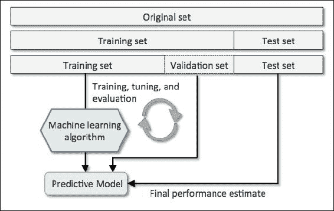
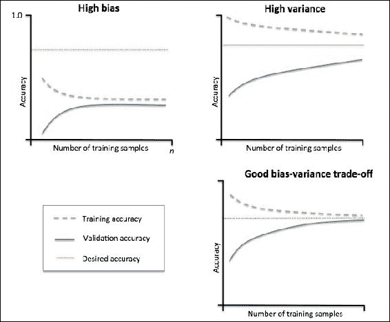
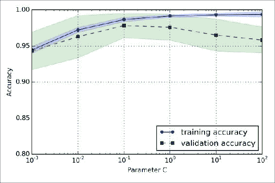
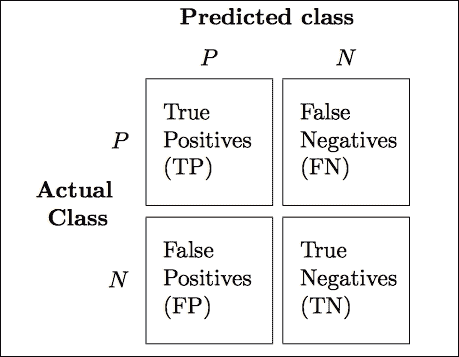
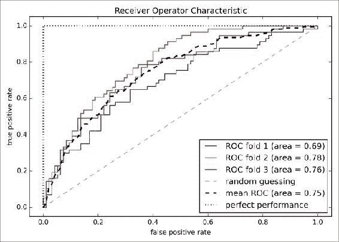
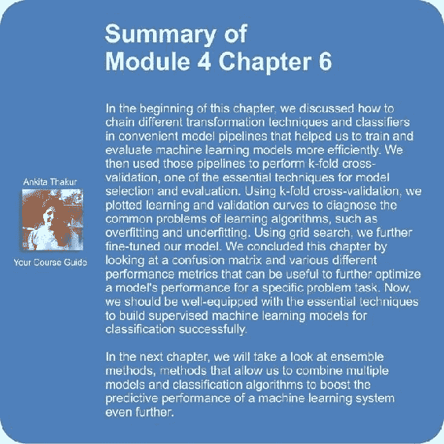

# 第 6 章。学习模型评估和超参数调整的最佳实践

在前面的章节中，您了解了用于分类的基本机器学习算法，以及在将数据输入这些算法之前如何使数据成形。 现在，是时候通过微调算法和评估模型的性能来学习构建良好的机器学习模型的最佳实践！ 在本章中，我们将学习如何：

*   获得模型性能的无偏估计
*   诊断机器学习算法的常见问题
*   微调机器学习模型
*   使用不同的绩效指标评估预测模型

# 使用管道简化工作流程

当在前几章中应用了不同的预处理技术时，例如第 4 章和“构建良好的训练集–数据预处理”*标准化** 用于特征缩放。 第 5 章或“通过降维压缩”进行数据压缩的*或**主数据分析**，您了解到必须重用参数 这些数据是在训练数据拟合以缩放和压缩任何新数据（例如，单独的测试数据集中的样本）期间获得的。 在本节中，您将学习一个非常方便的工具，scikit-learn 中的`Pipeline`类。 它使我们能够拟合包含任意数量的转换步骤的模型，并将其应用于对新数据的预测。

## 加载乳腺癌威斯康星州数据集

在本章中，我们将与**乳腺癌威斯康星州**数据集一起使用，该数据集包含 569 个**恶性**和**良性**肿瘤细胞样本。 数据集中的前两列分别存储样本的唯一 ID 号和相应的诊断（ *M =恶性*，*B =良性*）。 第 3-32 栏包含 30 个实值特征，这些特征是根据细胞核的数字化图像计算得出的，可用于构建模型来预测肿瘤是良性还是恶性。 威斯康星州乳腺癌数据集已保存在 *UCI 机器学习存储库*中，有关此数据集的更多详细信息，请访问[这个页面](https://archive.ics.uci.edu/ml/datasets/Breast+Cancer+Wisconsin+(Diagnostic))。

在本节中，我们将读取数据集，并通过三个简单的步骤将其分为训练和测试数据集：

1.  我们将直接使用熊猫从 UCI 网站读取数据集：

    ```pypy
    >>> import pandas as pd
    >>> df = pd.read_csv('https://archive.ics.uci.edu/ml/machine-learning-databases/breast-cancer-wisconsin/wdbc.data', header=None)
    ```

2.  接下来，我们将 30 个特征分配给 NumPy 数组`X`。 使用`LabelEncoder`，我们将类标签从其原始字符串表示形式（`M`和`B`）转换为整数：

    ```pypy
    >>> from sklearn.preprocessing import LabelEncoder
    >>> X = df.loc[:, 2:].values
    >>> y = df.loc[:, 1].values
    >>> le = LabelEncoder()
    >>> y = le.fit_transform(y)
    ```

    在将类别标签（诊断）编码为数组`y`后，现在将恶性肿瘤表示为`1`类，将良性肿瘤表示为`0`类，我们可以通过称为`transform`来说明 两个假类标签上的`LabelEncoder`的]方法：

    ```pypy
    >>> le.transform(['M', 'B'])
    array([1, 0])
    ```

3.  在以下小节中构建第一个模型管道之前，让我们将数据集分为一个单独的训练数据集（数据的 80％）和一个单独的测试数据集（数据的 20％）：

    ```pypy
    >>> from sklearn.cross_validation import train_test_split
    >>> X_train, X_test, y_train, y_test = \
    ...      train_test_split(X, y, test_size=0.20, random_state=1)
    ```

## 在管道中组合变压器和估计器

在的前一章中，您了解到许多学习算法需要使用相同规模的输入功能才能获得最佳性能。 因此，我们需要在之前将乳腺癌威斯康星州数据集中的列标准化，然后才能将其输入到线性分类器中，例如逻辑回归。 此外，假设我们要通过**主成分分析**（**PCA**）将数据从最初的 30 个维压缩到较低的二维子空间，这是一种用于降维的特征提取技术 我们在第 5 章，“通过降维压缩数据”中介绍。 无需分别进行训练和测试数据集的拟合和转换步骤，我们可以将`StandardScaler`，`PCA`和`LogisticRegression`对象链接在管道中：

```pypy
>>> from sklearn.preprocessing import StandardScaler
>>> from sklearn.decomposition import PCA
>>> from sklearn.linear_model import LogisticRegression
>>> from sklearn.pipeline import Pipeline
>>> pipe_lr = Pipeline([('scl', StandardScaler()),
...            ('pca', PCA(n_components=2)),
...            ('clf', LogisticRegression(random_state=1))])
>>> pipe_lr.fit(X_train, y_train)
>>> print('Test Accuracy: %.3f' % pipe_lr.score(X_test, y_test))
Test Accuracy: 0.947
```

`Pipeline`对象将一个元组列表作为输入，其中每个元组中的第一个值是一个任意的标识符字符串，我们可以使用它来访问管道中的各个元素，如本章稍后所述，第二个 每个元组中的元素是一个 scikit 学习转换器或估计器。

流水线中的中间步骤构成 scikit-learn 变压器，最后一步是估算器。 在前面的代码示例中，我们构建了一个包含两个中间步骤的管道，一个是`StandardScaler`和一个`PCA`转换器，另一个是逻辑回归分类器作为最终估计量。 当我们在管道`pipe_lr`上执行`fit`方法时，`StandardScaler`对训练数据执行`fit`和`transform`，然后将转换后的训练数据传递到管道中的下一个对象，即[ `PCA`。 与上一步相似，`PCA`也对缩放后的输入数据执行了`fit`和`transform`，并将其传递给管道的最后一个元素（估计器）。 我们应注意，此管道中的中间步骤数量没有限制。 下图概述了管道如何工作的概念：


# 使用 k 倍交叉验证来评估模型性能

建立机器学习模型的关键步骤之一是根据该模型以前未见的数据评估其性能。 让我们假设使我们的模型适合于训练数据集，并使用相同的数据来估计其在实践中的表现。 我们从第 3 章，“使用 Scikit-learn” 的机器学习分类器的*通过正则化处理*部分解决过拟合问题中记得，模型可能会遭受拟合不足 （高偏差）（如果模型太简单），或者如果模型对于基础训练数据来说太复杂，则可能过度拟合训练数据（高方差）。 为了找到可接受的偏差方差折衷，我们需要仔细评估模型。 在本节中，您将学习有用的交叉验证技术**保持交叉验证**和 **k 倍交叉验证**，这可以帮助我们获得 模型泛化误差的可靠估计，即模型在看不见的数据上的表现如何。

## 保持方法

估计机器学习模型泛化性能的经典且流行的方法是保持交叉验证。 使用保持方法，我们将初始数据集分为单独的训练和测试数据集-前者用于模型训练，而后者用于估计其性能。 但是，在典型的机器学习应用程序中，我们也对调整和比较不同的参数设置感兴趣，以进一步提高对看不见的数据进行预测的性能。 此过程称为**模型选择**，其中术语“模型选择”指的是给定的分类问题，我们要为其选择调整参数的*最佳*最佳值（也称为**超参数**）。 但是，如果我们在模型选择期间一遍又一遍地重复使用相同的测试数据集，则它将成为我们训练数据的一部分，因此该模型更可能过拟合。 尽管存在此问题，但许多人仍将测试集用于模型选择，这不是一个好的机器学习实践。

使用保留方法进行模型选择的一种更好的方法是将数据分为三个部分：训练集，验证集和测试集。 训练集用于拟合不同的模型，然后将验证集上的性能用于模型选择。 拥有模型在训练和模型选择步骤中从未见过的测试集的优点是，我们可以获得对其通用化为新数据的能力的较少偏倚的估计。 下图说明了保持交叉验证的概念，其中在使用不同的参数值训练后，我们使用验证集重复评估模型的性能。 一旦对参数值的调整感到满意，就可以在测试数据集上估计模型的泛化误差：



保持方法的缺点是，性能估算对我们如何将训练集划分为训练和验证子集非常敏感； 对于不同的数据样本，估算值将有所不同。 在下一个小节中，我们将介绍一种用于性能评估的更强大的技术，即 k 倍交叉验证，其中我们对`k`子集的重复保留方法`k`次 训练数据。

## K 折交叉验证

在 k 倍交叉验证中，我们将训练数据集随机分为`k`折叠，而无需替换，其中`K - 1`折叠用于模型训练，而一折叠用于测试。 重复此过程`k`次，以便获得`k`模型和性能估算。

### 注意

如果您不熟悉在不替换的情况下使用和*采样*的术语，让我们进行一个简单的思想实验。 假设我们正在玩彩票游戏，我们从 an 中随机抽取数字。 我们从一个 holds 着五个唯一数字 0、1、2、3 和 4 的开始，然后每转一圈绘制一个正好一个数字。 在第一轮中，从骨灰盒中提取特定数字的机会是 1/5。 现在，在不更换样本的情况下，我们不会在每次旋转后将数字重新放入骨灰盒。 因此，在下一轮中从剩余号码集合中提取特定号码的可能性取决于前一轮。 例如，如果我们有剩余的一组数字 0、1、2 和 4，则在下一轮中绘制数字 0 的机会将变为 1/4。**

但是，在随机抽样替换中，我们总是将抽取的数字返回到骨灰盒，以使每次旋转绘制特定数字的概率都不会改变。 我们可以多次绘制相同的数字。 换句话说，在替换抽样中，样本（数量）是独立的，并且协方差为零。 例如，五轮绘制随机数的结果如下所示：

*   随机抽样而不更换：2、1、3、4、0
*   随机抽样替换：1、3、3、4、1

然后，我们基于不同的独立折叠计算模型的平均性能，以获得与保持方法相比对训练数据细分不那么敏感的性能估计。 通常，我们使用 k 倍交叉验证进行模型调整，也就是说，找到产生令人满意的泛化性能的最佳超参数值。 一旦找到令人满意的超参数值，我们就可以在完整的训练集上对模型进行重新训练，并使用独立的测试集获得最终的性能估算。

由于 k 倍交叉验证是一种无需替换的重采样技术，因此该方法的优势在于，每个样本点将仅是训练和测试数据集的一部分，一次即可得出模型性能的较低方差估算值 比保持方法。 下图概述了`k = 10`与 k 倍交叉验证背后的概念。 训练数据集分为 10 折，在 10 次迭代期间，将 9 折用于训练，将 1 折用作模型评估的测试集。 同样，每个折叠的估计性能`E[i]`（例如，分类准确度或错误）然后用于计算模型的估计平均性能`E`：


k 倍交叉验证中`k`的标准值为 10，对于大多数应用而言，这通常是一个合理的选择。 但是，如果我们使用相对较小的训练集，则增加折叠数可能很有用。 如果我们增加`k`的值，则在每次迭代中将使用更多的训练数据，这将导致通过平均各个模型估计值来降低对泛化性能的估计偏差。 但是，`k`的较大值也会增加交叉验证算法的运行时间，并且由于训练折叠会彼此更类似于，因此具有较高方差的产量估算值。 另一方面，如果我们使用大型数据集，则可以为`k`选择一个较小的值，例如`k = 5`，并且仍然可以获得模型平均性能的准确估计值，同时降低 在不同折痕处重新拟合和评估模型的计算成本。

### 注意

k 倍交叉验证的一种特殊情况是**留一法则**（**LOO**）交叉验证方法。 在 LOO 中，我们将折数设置为等于训练样本的数量（ *k = n* ），以便在每次迭代期间仅使用一个训练样本进行测试。 这是处理非常小的数据集的推荐方法。

分层 k 折叠交叉验证比标准 k 折叠交叉验证方法稍有改进，这可以产生更好的偏差和方差估计，尤其是在类比例不相等的情况下，正如 R 的研究表明的那样。 Kohavi 等。 （R. Kohavi 等人*交叉验证和自举的研究，用于准确性估计和模型选择*。在伊贾伊，第 14 卷，第 1137-1145 页，1995 年）。 在分层交叉验证中，每个折叠中的类比例都保留下来，以确保每个折叠都代表训练数据集中的类比例，我们将在 scikit-learn 中使用`StratifiedKFold`迭代器进行说明：

```pypy
>>> import numpy as np
>>> from sklearn.cross_validation import StratifiedKFold
>>> kfold = StratifiedKFold(y=y_train, 
...                         n_folds=10,
...                         random_state=1)
>>> scores = []
>>> for k, (train, test) in enumerate(kfold):
...    pipe_lr.fit(X_train[train], y_train[train])
...    score = pipe_lr.score(X_train[test], y_train[test])
...    scores.append(score)
...    print('Fold: %s, Class dist.: %s, Acc: %.3f' % (k+1, 
...                 np.bincount(y_train[train]), score))    
Fold: 1, Class dist.: [256 153], Acc: 0.891
Fold: 2, Class dist.: [256 153], Acc: 0.978
Fold: 3, Class dist.: [256 153], Acc: 0.978
Fold: 4, Class dist.: [256 153], Acc: 0.913
Fold: 5, Class dist.: [256 153], Acc: 0.935
Fold: 6, Class dist.: [257 153], Acc: 0.978
Fold: 7, Class dist.: [257 153], Acc: 0.933
Fold: 8, Class dist.: [257 153], Acc: 0.956
Fold: 9, Class dist.: [257 153], Acc: 0.978
Fold: 10, Class dist.: [257 153], Acc: 0.956
>>> print('CV accuracy: %.3f +/- %.3f' % (
...                 np.mean(scores), np.std(scores)))
CV accuracy: 0.950 +/- 0.029
```

首先，我们使用训练集中的类标签`y_train`从`sklearn.cross_validation`模块初始化了`StratifiedKfold`迭代器，并通过`n_folds`参数指定了折叠次数。 当我们使用`kfold`迭代器遍历`k`折叠时，我们使用`train`中返回的索引来适应本章开始时设置的逻辑回归管线。 使用`pile_lr`管道，我们确保在每次迭代中都正确缩放了样本（例如标准化）。 然后，我们使用`test`指数来计算模型的准确性得分，然后在`scores`列表中收集该模型以计算估计的平均准确性和标准偏差。

尽管前面的代码示例对于说明 k 折交叉验证的工作原理很有用，但是 scikit-learn 还实现了 k 折交叉验证评分器，这使我们能够更有效地使用分层 k 折交叉验证来评估模型：

```pypy
>>> from sklearn.cross_validation import cross_val_score
>>> scores = cross_val_score(estimator=pipe_lr, 
...                          X=X_train, 
...                          y=y_train, 
...                          cv=10, 
...                          n_jobs=1)
>>> print('CV accuracy scores: %s' % scores)
CV accuracy scores: [ 0.89130435  0.97826087  0.97826087  
                      0.91304348  0.93478261  0.97777778
                      0.93333333  0.95555556  0.97777778  
                         0.95555556]
>>> print('CV accuracy: %.3f +/- %.3f' % (np.mean(scores), np.std(scores))) 
CV accuracy: 0.950 +/- 0.029
```

`cross_val_score`方法的极其有用的功能是，我们可以在机器上的多个 CPU 上分布不同倍数的评估。 如果我们将`n_jobs`参数设置为`1`，则就像前面的`StratifiedKFold`示例一样，将仅使用一个 CPU 来评估性能。 但是，通过设置`n_jobs=2`，我们可以将 10 轮交叉验证分配给两个 CPU（如果在我们的计算机上可用），并且通过设置`n_jobs=-1`，我们可以使用我们计算机上的所有可用 CPU 并行进行计算 。

### 注意

请注意，关于如何在交叉验证中估算泛化性能方差的详细讨论超出了本书的范围，但是您可以在 M. Markatou 等人的出色文章（M. Markatou， H. Tian，S。Biswas 和 GM Hripcsak。*泛化误差*的交叉验证估计量方差分析*机器学习研究杂志*，6：1127-1168，2005 ）。

您还可以阅读有关其他交叉验证技术的信息，例如.632 Bootstrap 交叉验证方法（B. Efron 和 R. Tibshirani。*交叉验证的改进：632+ Bootstrap 方法*。*美国统计协会杂志*，92（438）：548-560，1997）。


# 具有学习和验证曲线的调试算法

在此部分中，我们将介绍两个非常简单但功能强大的诊断工具，这些工具可帮助我们改善学习算法的性能：**学习曲线**和**验证曲线**。 在接下来的小节中，我们将讨论如何使用学习曲线来诊断学习算法是否存在过拟合（高方差）或欠拟合（高偏差）的问题。 此外，我们将查看验证曲线，这些曲线可帮助我们解决学习算法的常见问题。

## 使用学习曲线诊断偏差和方差问题

如果模型对于给定的训练数据集过于复杂（该模型中的自由度或参数太多），则该模型往往会过度拟合训练数据，而不能很好地推广到看不见的数据。 通常，它可以帮助收集更多的训练样本以减少过度拟合的程度。 但是，实际上，收集更多数据通常非常昂贵，或者根本不可行。 通过将模型训练和验证准确性绘制为训练集大小的函数，我们可以轻松地检测出模型是遭受高方差还是高偏差，以及收集更多数据是否可以帮助解决该问题。 但是在讨论如何在 sckit-learn 中绘制学习曲线之前，让我们通过遍历下图讨论这两个常见的模型问题：



左上方的图显示了具有高偏差的模型。 该模型具有较低的训练和交叉验证的准确性，这表明它不适合训练数据。 解决此问题的常用方法是增加模型参数的数量，例如，通过收集或构造其他特征，或通过降低正则化的程度，例如在 SVM 或逻辑回归分类器中。 右上方的图形显示了一个模型，该模型存在较大的差异，这由训练和交叉验证准确性之间的巨大差异表示。 为了解决过度拟合的问题，我们可以收集更多训练数据或降低模型的复杂性，例如，通过增加正则化参数； 对于非正规模型，它还可以通过特征选择（第 4 章，“构建良好的训练集–数据预处理”）或特征提取（[第 5 章）来减少特征数量](39.html "Chapter 5. Compressing Data via Dimensionality Reduction") ，*通过降维压缩数据*。 我们将注意到，收集更多的训练数据会减少过度拟合的机会。 但是，例如当训练数据非常嘈杂或模型已经非常接近最佳值时，它可能并不总是有帮助。

在的下一个小节中，我们将看到如何使用验证曲线解决这些模型问题，但首先让我们看看如何使用 scikit-learn 的学习曲线函数来评估模型：

```pypy
>>> import matplotlib.pyplot as plt
>>> from sklearn.learning_curve import learning_curve
>>> pipe_lr = Pipeline([
...           ('scl', StandardScaler()),
...           ('clf', LogisticRegression(
...                        penalty='l2', random_state=0))])
>>> train_sizes, train_scores, test_scores =\
...        learning_curve(estimator=pipe_lr, 
...                       X=X_train, 
...                       y=y_train, 
...                       train_sizes=np.linspace(0.1, 1.0, 10), 
...                       cv=10,
...                       n_jobs=1)
>>> train_mean = np.mean(train_scores, axis=1)
>>> train_std = np.std(train_scores, axis=1)
>>> test_mean = np.mean(test_scores, axis=1)
>>> test_std = np.std(test_scores, axis=1)
>>> plt.plot(train_sizes, train_mean, 
...          color='blue', marker='o', 
...          markersize=5, 
...          label='training accuracy')
>>> plt.fill_between(train_sizes, 
...                  train_mean + train_std,
...                  train_mean - train_std, 
...                  alpha=0.15, color='blue')
>>> plt.plot(train_sizes, test_mean, 
...          color='green', linestyle='--', 
...          marker='s', markersize=5, 
...          label='validation accuracy')
>>> plt.fill_between(train_sizes, 
...                  test_mean + test_std,
...                  test_mean - test_std, 
...                  alpha=0.15, color='green')
>>> plt.grid()
>>> plt.xlabel('Number of training samples')
>>> plt.ylabel('Accuracy')
>>> plt.legend(loc='lower right')
>>> plt.ylim([0.8, 1.0])
>>> plt.show()
```

成功执行了前面的代码后，我们将获得以下学习曲线图：


通过`learning_curve`功能中的`train_sizes`参数，我们可以控制用于生成学习曲线的训练样本的绝对或相对数量。 在这里，我们将`train_sizes=np.linspace(0.1, 1.0, 10)`设置为使用 10 个均匀间隔的相对间隔作为训练集大小。 默认情况下，`learning_curve`函数使用分层的 k 倍交叉验证来计算交叉验证的准确性，我们通过`cv`参数设置了`k = 10`。 然后，我们简单地根据返回的交叉验证的训练和测试得分（针对不同大小的训练集）计算平均准确度，并使用 matplotlib 的`plot`函数对其进行绘制。 此外，我们使用`fill_between`函数将平均准确度的标准偏差添加到该图以指示估计的方差。

正如我们在前面的学习曲线图中所看到的，我们的模型在测试数据集上的表现非常好。 但是，它可能会略微拟合训练数据和交叉验证准确性曲线之间相对较小但可见的间隙所指示的训练数据。

## 使用验证曲线解决过度拟合和过度拟合

验证曲线是通过解决过度拟合或拟合不足等问题来改善模型性能的有用工具。 验证曲线与学习曲线有关，但是我们不改变训练和测试精度作为样本量的函数，而是改变模型参数的值，例如，逻辑回归中的逆正则化参数`C`。 让我们继续看看如何通过 sckit-learn 创建验证曲线：

```pypy
>>> from sklearn.learning_curve import validation_curve
>>> param_range = [0.001, 0.01, 0.1, 1.0, 10.0, 100.0]
>>> train_scores, test_scores = validation_curve(
...                estimator=pipe_lr, 
...                 X=X_train, 
...                 y=y_train, 
...                 param_name='clf__C', 
...                 param_range=param_range,
...                 cv=10)
>>> train_mean = np.mean(train_scores, axis=1)
>>> train_std = np.std(train_scores, axis=1)
>>> test_mean = np.mean(test_scores, axis=1)
>>> test_std = np.std(test_scores, axis=1)
>>> plt.plot(param_range, train_mean, 
...          color='blue', marker='o', 
...          markersize=5, 
...          label='training accuracy')
>>> plt.fill_between(param_range, train_mean + train_std,
...                  train_mean - train_std, alpha=0.15,
...                  color='blue')
>>> plt.plot(param_range, test_mean, 
...          color='green', linestyle='--', 
...          marker='s', markersize=5, 
...          label='validation accuracy')
>>> plt.fill_between(param_range, 
...                  test_mean + test_std,
...                  test_mean - test_std, 
...                  alpha=0.15, color='green')
>>> plt.grid()
>>> plt.xscale('log')
>>> plt.legend(loc='lower right')
>>> plt.xlabel('Parameter C')
>>> plt.ylabel('Accuracy')
>>> plt.ylim([0.8, 1.0])
>>> plt.show() 
```

使用前面的代码，我们获得了参数`C`的验证曲线图：



与`learning_curve`函数类似的，如果我们使用分类算法，则`validation_curve`函数默认情况下使用分层的 k 倍交叉验证来估计模型的性能。 在`validation_curve`函数中，我们指定了要评估的参数。 在这种情况下，它是`C`，`LogisticRegression`分类器的逆正则化参数，我们将其写为`'clf__C'`来访问 scikit-learn 管道内的`LogisticRegression`对象，以获取我们通过设置的指定值范围 `param_range`参数。 与上一节中的学习曲线示例相似，我们绘制了平均训练和交叉验证精度以及相应的标准偏差。

尽管`C`的变化值在精度上的差异很小，但是我们可以看到，当我们增加正则强度时，该模型会略微拟合数据（`C`的值很小）。 但是，对于`C`较大的值，这意味着降低正则化的强度，因此该模型倾向于稍微拟合数据。 在这种情况下，最有效点似乎在`C=0.1`附近。

# 通过网格搜索对机器学习模型进行微调

在机器学习中，我们有两种类型的参数：从训练数据中学习的参数，例如 logistic 回归中的权重，以及分别优化的学习算法的参数。 后者是模型的调整参数，也称为超参数，例如，逻辑回归中的**正则化**参数或决策树的**深度**参数 。

在上一节中，我们使用验证曲线通过调整模型的超参数之一来改善其性能。 在本节中，我们将介绍一种称为**网格搜索**的强大超参数优化技术，该技术可以通过找到以下内容的*最佳*组合来进一步帮助改善模型的性能： 超参数值。

## 通过网格搜索调整超参数

网格搜索的方法非常简单，它是一种蛮力的穷举搜索范例，其中我们为不同的超参数指定值列表，并且计算机针对每种组合的模型性能进行评估，以获得最优的 放：

```pypy
>>> from sklearn.grid_search import GridSearchCV
>>> from sklearn.svm import SVC
>>> pipe_svc = Pipeline([('scl', StandardScaler()),
...                      ('clf', SVC(random_state=1))])
>>> param_range = [0.0001, 0.001, 0.01, 0.1, 1.0, 10.0, 100.0, 1000.0]
>>> param_grid = [{'clf__C': param_range, 
...                'clf__kernel': ['linear']},
...               {'clf__C': param_range, 
...                'clf__gamma': param_range, 
...                'clf__kernel': ['rbf']}]
>>> gs = GridSearchCV(estimator=pipe_svc, 
...                   param_grid=param_grid, 
...                   scoring='accuracy', 
...                   cv=10,
...                   n_jobs=-1)
>>> gs = gs.fit(X_train, y_train)
>>> print(gs.best_score_) 
0.978021978022
>>> print(gs.best_params_)
{'clf__C': 0.1, 'clf__kernel': 'linear'}
```

使用前面的代码，我们从`sklearn.grid_search`模块初始化了`GridSearchCV`对象，以训练和调整**支持向量机**（**SVM**）管道。 我们将`GridSearchCV`的`param_grid`参数设置为词典列表，以指定要调整的参数。 对于线性 SVM，我们仅评估反正则化参数`C`； 对于 RBF 内核 SVM，我们调整了`C`和`gamma`参数。 请注意，`gamma`参数特定于内核 SVM。 在使用训练数据执行网格搜索之后，我们通过`best_score_`属性获得了性能最佳模型的得分，并查看了可通过`best_params_`属性访问的参数。 在这种特殊情况下，带有`'clf__C'= 0.1'`的线性 SVM 模型产生了最佳的 k 倍交叉验证准确性：97.8％。

最后，我们将使用独立的测试数据集来评估最佳选择模型的性能，该模型可通过`GridSearchCV`对象的`best_estimator_`属性获得：

```pypy
>>> clf = gs.best_estimator_
>>> clf.fit(X_train, y_train)
>>> print('Test accuracy: %.3f' % clf.score(X_test, y_test))
Test accuracy: 0.965
```

### 注意

尽管网格搜索是用于找到最佳参数集的强大方法，但是对所有可能参数组合的评估在计算上也非常昂贵。 使用 scikit-learn 采样不同参数组合的另一种方法是随机搜索。 使用 scikit-learn 中的`RandomizedSearchCV`类，我们可以从具有指定预算的采样分布中绘制随机参数组合。 可在[这个页面](http://scikit-learn.org/stable/modules/grid_search.html#randomized-parameter-optimization)中找到更多有关其用法的详细信息和示例。

## 具有嵌套交叉验证的算法选择

结合使用网格搜索将 k 倍交叉验证与网格搜索结合使用是一种有用的方法，可以通过更改机器学习模型的超参数值来对其性能进行微调，正如我们在上一小节中看到的那样。 如果我们想在不同的机器学习算法中进行选择，则另一种推荐的方法是嵌套交叉验证，并且在对误差估计的偏差进行了很好的研究中，Varma 和 Simon 得出结论：相对于误差估计，估计的真实误差几乎是无偏的。 使用嵌套交叉验证的测试集（S. Varma 和 R. Simon。*使用交叉验证进行模型选择时的误差估计偏差*。BMC bioinformatics，7（1）：91，2006）。

在嵌套交叉验证中，我们有一个外部 k 折叠交叉验证循环将数据分为训练和测试折叠，并使用一个内部循环在训练上使用 k 折叠交叉验证选择模型 折叠。 选择模型后，然后使用测试倍数评估模型的性能。 下图说明了具有五个外部折叠和两个内部折叠的嵌套交叉验证的概念，这对于计算性能很重要的大型数据集很有用； 这种特殊的嵌套交叉验证类型也称为 **5x2 交叉验证**：


在 scikit-learn 中，我们可以执行嵌套的交叉验证，如下所示：

```pypy
>>> gs = GridSearchCV(estimator=pipe_svc, 
...                   param_grid=param_grid,
...                   scoring='accuracy', 
...                   cv=2, 
...                   n_jobs=-1)
>>> scores = cross_val_score(gs, X_train, y_train, scoring='accuracy', cv=5)
>>> print('CV accuracy: %.3f +/- %.3f' % (
...               np.mean(scores), np.std(scores)))
CV accuracy: 0.965 +/- 0.025
```

返回的平均交叉验证准确性为我们提供了一个很好的估计，即如果我们调整模型的超参数然后将其用于看不见的数据，该期望什么。 例如，我们可以使用嵌套交叉验证方法将 SVM 模型与简单的决策树分类器进行比较。 为简单起见，我们仅调整其 depth 参数：

```pypy
>>> from sklearn.tree import DecisionTreeClassifier
>>> gs = GridSearchCV(
...       estimator=DecisionTreeClassifier(random_state=0),
...       param_grid=[
...            {'max_depth': [1, 2, 3, 4, 5, 6, 7, None]}],
...       scoring='accuracy', 
...       cv=5)
>>> scores = cross_val_score(gs, 
...                          X_train, 
...                          y_train, 
...                          scoring='accuracy',
...                          cv=2)
>>> print('CV accuracy: %.3f +/- %.3f' % (
...                     np.mean(scores), np.std(scores)))
CV accuracy: 0.921 +/- 0.029
```

正如我们在这里看到的那样，SVM 模型的嵌套交叉验证性能（97.8％）明显优于决策树的性能（90.8％）。 因此，我们希望这可能是对来自与该特定数据集相同总体的新数据进行分类的更好的选择。

# 查看不同的绩效评估指标

在的前面的章节中，我们使用模型准确性评估了模型，该准确性是量化模型总体性能的有用度量。 但是，还有一些其他性能指标可用于测量模型的相关性，例如**精度**，**召回**和 **F1 得分**。

## 读取混淆矩阵

在进入不同评分指标的细节之前，让我们打印一个所谓的**混淆矩阵**，该矩阵列出学习算法的性能。 混淆矩阵只是一个正方形矩阵，它报告**真阳性**，**真阴性**，**假阳性**和**假阴性**的计数 分类器的预测，如下图所示：



尽管可以通过比较真实和预测的类标签轻松地手动计算这些指标，但是 scikit-learn 提供了便捷的`confusion_matrix`函数，我们可以按以下方式使用它：

```pypy
>>> from sklearn.metrics import confusion_matrix
>>> pipe_svc.fit(X_train, y_train)
>>> y_pred = pipe_svc.predict(X_test)
>>> confmat = confusion_matrix(y_true=y_test, y_pred=y_pred)
>>> print(confmat)
[[71  1]
 [ 2 40]]
```

执行前面的代码后返回的数组为我们提供了有关测试数据集上分类器不同类型错误的信息，我们可以使用 matplotlib 的`matshow`函数将其映射到上图中的混淆矩阵图中：

```pypy
>>> fig, ax = plt.subplots(figsize=(2.5, 2.5))
>>> ax.matshow(confmat, cmap=plt.cm.Blues, alpha=0.3)
>>> for i in range(confmat.shape[0]):
...     for j in range(confmat.shape[1]):
...         ax.text(x=j, y=i,
...                 s=confmat[i, j], 
...                 va='center', ha='center')
>>> plt.xlabel('predicted label')
>>> plt.ylabel('true label')
>>> plt.show()
```

现在，如下所示的混淆矩阵图应该使结果更易于解释：


假设在此示例中类别 1（恶性）为阳性类别，我们的模型分别正确分类了属于类别 0 的样本 71 个（真阴性）和属于类别 1 的 40 个样本（真阳性）。 但是，我们的模型还将 0 类中的 1 个样本错误地错误分类为 1 类（假阳性），并且尽管它是恶性肿瘤（假阴性），但它预测 2 个样本是良性的。 在下一节中，我们将学习如何使用此信息来计算各种不同的错误度量。

## 优化分类模型的精度和召回率

预测**误差**（**ERR**）和**精度**（**ACC**） 许多样本被错误分类。 可以将错误理解为所有错误预测的总和除以总预测的数目，准确度是计算为正确预测的总和除以预测的总数目：


然后可以直接从误差中计算出预测精度：


**真阳性率**（**TPR**）和**假阳性率**（**FPR**）是特别重要的性能指标 对于班级不平衡问题很有用：


例如，在肿瘤诊断中，我们更加关注恶性肿瘤的检测，以帮助患者进行适当的治疗。 但是，减少不必要分类为恶性肿瘤（假阳性）的良性肿瘤的数量也很重要，以免不必要地引起患者的注意。 与 FPR 相比，真实的阳性率提供了有关阳性（或相关）样本中被正确识别出的阳性总数（`P`）的分数的有用信息。

**精度**（**PRE**）和**召回**（**REC**）是与那些真实阳性和 真正的负税率，实际上，回忆是真正的正税率的代名词：


实际上，通常会结合使用精度和查全率，即所谓的 **F1 分数**：


这些评分指标都在 scikit-learn 中实现，可以从`sklearn.metrics`模块导入，如以下代码片段所示：

```pypy
>>> from sklearn.metrics import precision_score
>>> from sklearn.metrics  import recall_score, f1_score
>>> print('Precision: %.3f' % precision_score(
...              y_true=y_test, y_pred=y_pred))
Precision: 0.976
>>> print('Recall: %.3f' % recall_score(
...              y_true=y_test, y_pred=y_pred))
Recall: 0.952
>>> print('F1: %.3f' % f1_score(
...              y_true=y_test, y_pred=y_pred))
F1: 0.964
```

此外，我们可以通过评分参数使用除`GridSearch`中的准确性以外的其他评分指标。 可在[这个页面](http://scikit-learn.org/stable/modules/model_evaluation.html)上找到评分参数接受的不同值的完整列表。

请记住，scikit-learn 中的正类是标记为类 1 的类。如果我们要指定不同的*正标签*，我们可以通过`make_scorer`函数构造自己的得分器， 然后可以直接在`GridSearchCV`中将 scoring 参数作为参数提供：

```pypy
>>> from sklearn.metrics import make_scorer, f1_score
>>> scorer = make_scorer(f1_score, pos_label=0)
>>> gs = GridSearchCV(estimator=pipe_svc,
...                   param_grid=param_grid,
...                   scoring=scorer,
...                   cv=10)
```

## 绘制接收机工作特性

**接收器操作员特征**（**ROC**）图是有用的工具，可根据其相对于假阳性率和真阳性率的性能来选择分类模型，这些值是通过移位计算得出的 分类器的决策阈值。 ROC 图的对角线可以解释为随机猜测，而低于对角线的分类模型被认为比随机猜测更糟。 理想的分类器将落在图的左上角，其真率为 1，假率为 0。基于 ROC 曲线，我们可以计算曲线下的**面积**（**AUC**）表征分类模型的性能。

### 注意

与 ROC 曲线类似，我们可以为分类器的不同概率阈值计算**精确召回曲线**。 scikit-learn 中还实现了绘制这些精确调用曲线的功能，并记录在[这个页面](http://scikit-learn.org/stable/modules/generated/sklearn.metrics.precision_recall_curve.html)中。

通过执行以下代码示例，我们将绘制仅使用威斯康星州乳腺癌数据集中的两个特征来预测肿瘤是良性还是恶性的分类器的 ROC 曲线。 尽管我们将使用与先前定义的逻辑回归管道，但对于分类器来说，使分类任务更具挑战性，从而使生成的 ROC 曲线在视觉上变得更加有趣。 出于类似的原因，我们还将`StratifiedKFold`验证程序中的折叠数减少为三。 代码如下：

```pypy
>>> from sklearn.metrics import roc_curve, auc
>>> from scipy import interp
>>> pipe_lr = Pipeline([('scl', StandardScaler()),
...                   ('pca', PCA(n_components=2)),
...                   ('clf', LogisticRegression(penalty='l2',
...                                              random_state=0,
...                                              C=100.0))])
>>> X_train2 = X_train[:, [4, 14]]
>>> cv = StratifiedKFold(y_train, 
...                      n_folds=3, 
...                      random_state=1)
>>> fig = plt.figure(figsize=(7, 5))
>>> mean_tpr = 0.0
>>> mean_fpr = np.linspace(0, 1, 100)
>>> all_tpr = []

>>> for i, (train, test) in enumerate(cv):
...     probas = pipe_lr.fit(X_train2[train],                          >>> y_train[train]).predict_proba(X_train2[test])    
...     fpr, tpr, thresholds = roc_curve(y_train[test], 
...                                     probas[:, 1], 
...                                     pos_label=1)
...     mean_tpr += interp(mean_fpr, fpr, tpr)
...     mean_tpr[0] = 0.0
...     roc_auc = auc(fpr, tpr)
...     plt.plot(fpr, 
...              tpr, 
...              lw=1, 
...              label='ROC fold %d (area = %0.2f)' 
...                     % (i+1, roc_auc))
>>> plt.plot([0, 1], 
...          [0, 1], 
...          linestyle='--', 
...          color=(0.6, 0.6, 0.6), 
...          label='random guessing')
>>> mean_tpr /= len(cv)
>>> mean_tpr[-1] = 1.0
>>> mean_auc = auc(mean_fpr, mean_tpr)
>>> plt.plot(mean_fpr, mean_tpr, 'k--',
...          label='mean ROC (area = %0.2f)' % mean_auc, lw=2)
>>> plt.plot([0, 0, 1], 
...          [0, 1, 1], 
...          lw=2, 
...          linestyle=':', 
...          color='black', 
...          label='perfect performance')
>>> plt.xlim([-0.05, 1.05])
>>> plt.ylim([-0.05, 1.05])
>>> plt.xlabel('false positive rate')
>>> plt.ylabel('true positive rate')
>>> plt.title('Receiver Operator Characteristic')
>>> plt.legend(loc="lower right")
>>> plt.show()
```

在前面的代码示例中，我们使用了 scikit-learn 中已经熟悉的`StratifiedKFold`类，并使用`sklearn.metrics`中的`roc_curve`函数计算了`pipe_lr`流水线中`LogisticRegression`分类器的 ROC 性能。 每次迭代分别使用模块。 此外，我们通过从 SciPy 导入的`interp`函数对三倍平均 ROC 曲线进行插值，并通过`auc`函数计算了曲线下的面积。 产生的 ROC 曲线表明不同倍数之间存在一定程度的差异，并且平均 ROC AUC（0.75）介于完美分数（1.0）和随机猜测（0.5）之间：



如果仅对 ROC AUC 分数感兴趣，我们也可以直接从`sklearn.metrics`子模块导入`roc_auc_score`函数。 以下代码将其拟合到具有两个特征的训练集后，可在独立测试数据集上计算分类器的 ROC AUC 分数：

```pypy
>>> pipe_lr = pipe_lr.fit(X_train2, y_train)
>>> y_pred2 = pipe_lr.predict(X_test[:, [4, 14]])

>>> from sklearn.metrics import roc_auc_score
>>> from sklearn.metrics import accuracy_score
>>> print('ROC AUC: %.3f' % roc_auc_score(
...        y_true=y_test, y_score=y_pred2))
ROC AUC: 0.662

>>> print('Accuracy: %.3f' % accuracy_score(
...        y_true=y_test, y_pred=y_pred2))
Accuracy: 0.711
```

将分类器的性能报告为 ROC AUC 可以针对分类器针对不平衡样本的性能提供进一步的见解。 但是，虽然准确度得分可以解释为 ROC 曲线上的单个分界点，但 AP Bradley 指出，ROC AUC 和准确度指标大多彼此一致（AP Bradley。 *机器学习算法评估中 ROC 曲线下的面积*。模式识别，30（7）：1145-1159，1997）。

## 多类别分类的评分指标

我们在本节中讨论的评分指标特定于二进制分类系统。 但是，scikit-learn 还实现了**宏**和**微型**平均方法，以通过**将单项与全部**（**OvA**）分类。 微观平均值是根据系统的各个真实肯定，真实否定，错误肯定和错误否定来计算的。 例如，k 级系统中精度得分的微平均值可以计算如下：


宏平均值可以简单地计算为不同系统的平均分数：


如果我们想对每个实例或预测进行平均加权，则微平均很有用；而对每个类进行宏平均加权，则可以对最频繁使用的类标签评估分类器的整体性能。

如果我们使用二进制性能指标来评估 scikit-learn 中的多类分类模型，则默认情况下使用宏平均值的归一化或加权变体。 在计算平均值时，通过将每个类别标签的得分乘以真实实例的数量进行加权，可以计算出加权宏平均值。 如果我们要处理类不平衡问题，即每个标签的实例数量不同，则加权宏平均值很有用。

对于 scikit-learn 中的多类问题，默认为加权宏平均，但我们可以通过`sklearn.metrics`模块导入的不同评分函数中的`average`参数指定平均方法，例如， `precision_score`或`make_scorer`功能：

```pypy
>>> pre_scorer = make_scorer(score_func=precision_score, 
...                          pos_label=1, 
...                          greater_is_better=True, 
...                          average='micro')
```




