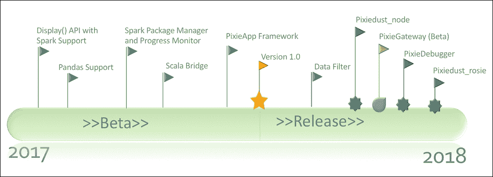

# 前言

|   | *“开发人员是当今商业中最重要，最有价值的选区，而与行业无关。”* |   |
|   | - *The New Kingmakers* 的作者 Stephen O'Grady |

首先，让我感谢您，并祝贺您，读者，决定决定花您宝贵的时间阅读本书。 在接下来的各章中，我将带您从开发人员的角度探索或什至重新发现数据科学的旅程，并将发展本书的主题，即数据科学是一项团队运动，如果 为了获得成功，开发人员将不得不在不久的将来扮演更大的角色，并与数据科学家更好地合作。 但是，为了使数据科学对所有背景和行业的人都具有更大的包容性，我们首先需要通过使数据简单易用使*民主化-这实际上就是本书的目的。*

# 我为什么要写这本书？

正如我将在第 1 章和*来自开发人员*的数据科学观点中更详细地解释的那样，我首先是拥有 20 多年开发经验的开发人员，他在构建以下方面的软件方面有丰富的经验 多样化的性质； 前端，后端，中间件等。 回顾这段时间，我意识到，正确地执行算法有多少是我首先想到的事情。 数据始终是别人的问题。 我很少需要分析它或从中提取见解。 充其量，我正在设计正确的数据结构以某种方式加载它，这将使我的算法更有效地运行并且代码更优雅且可重复使用。

但是，随着人工智能和数据科学革命的进行，对我来说很明显像我这样的开发人员需要参与其中，因此在 7 年前的 2011 年，我抓住了机会成为 IBM Watson 的首席架构师 核心平台用户界面和工具。 当然，我不假装自己不是机器学习或 NLP 方面的专家。 通过实践学习不能代替获得正式的学术背景。

但是，我想在本书中展示的很大一部分是，使用正确的工具和方法，具备正确的数学基础的人（我只是在谈论高中水平的微积分概念）可以迅速成为 该领域的优秀从业者。 成功的关键因素是尽可能简化构建数据管道的不同步骤; 从获取，加载和清理数据到可视化和探索数据，一直到构建和部署机器学习模型。

为了进一步推动使数据更容易被数据科学家以外的社区访问的想法，三年前，我在 IBM Watson Data Platform 团队中担任领导职务，其使命是扩大开发人员社区 这些数据特别代表他们关注教育和行动主义。 在此期间，作为首席开发人员倡导者，我开始公开谈论开发人员和数据科学家在更好地协作解决复杂数据问题方面的需求。

### 注意

**注意**：在会议和聚会上的讨论中，有时我会遇到麻烦的数据科学家的麻烦，因为他们将我的叙述解释为我说数据科学家不是优秀的软件开发人员。 我想弄清楚这一点，包括数据科学家读者在内，与您相提并论。

大多数数据科学家都是优秀的软件开发人员，具有全面的计算机科学概念知识。 但是，它们的主要目的是解决复杂的数据问题，这些问题需要快速的迭代实验来尝试新事物，而不是编写精美的可重用组件。

但是我不想只讲这个话题。 我也想散散步，并启动了 PixieDust 开源项目，这是我为解决这一重要问题所做的不起眼的贡献。 随着 PixieDust 工作的顺利进行，通过具体的示例应用程序，叙述变得更加清晰易懂，开发人员和数据科学家都可能对此感到兴奋。

当我有机会写一本关于这个故事的书时，我犹豫了很长时间，然后才开始这次冒险，主要有两个原因：

*   我曾在博客，文章和教程中广泛撰写过有关我作为 Jupyter Notebooks 的数据科学从业者的经验的文章。 在各种会议上，我作为演讲者和研讨会主持人也有丰富的经验。 一个很好的例子是我在 2017 年在 ODSC 伦敦发表的主题演讲，题为[《数据科学的未来：更少的权力游戏，更多的联盟》](https://odsc.com/training/portfolio/future-data-science-less-game-thrones-alliances)。 但是，我以前从未写过书，也不知道会有多大的承诺，尽管以前曾写过书的朋友多次警告过我。
*   我希望本书具有包容性，并平等地面向开发人员，数据科学家和业务用户，但我一直在努力寻找实现该目标的正确内容和基调。

最后，开始这项冒险的决定很容易。 在 PixieDust 项目上工作了 2 年后，我感到我们已经通过非常有趣的创新取得了令人瞩目的进展，这些创新引起了开源社区的极大兴趣，并且写书将很好地补充我们在帮助开发人员参与数据方面的倡导工作 科学。

附带说明一下，对于正在考虑写书且有类似问题的读者，我只能建议第一个带有大写“是的，继续努力”的读者。 可以肯定的是，这是一项重大承诺，需要付出大量的牺牲，但前提是您要有一个扎实的故事来讲故事，这确实值得您付出努力。

# 这本书适合谁

本书将服务于对正在发展的数据科学家和开发人员感兴趣的技能开发或任何希望成为专业数据科学家的人员。 通过其创建者介绍的 PixieDust，这本书对于已经完成的数据科学家来说也将是一个很好的桌面伴侣。

不管个人的兴趣水平如何，清晰，易读的文本和真实场景都将适合该领域的人们，因为他们可以在 Jupyter Notebooks 中运行 Python 代码。

要生成正常运行的 PixieDust 仪表板，只需要少量的 HTML 和 CSS。 流利的数据解释和可视化也是必要的，因为本书针对的是数据专业人员，例如业务和一般数据分析师。 后面的章节也有很多内容。

# 这本书涵盖的内容

这本书包含两个大致相等长度的逻辑部分。 在上半年中，我列出了本书的主题，即弥合数据科学与工程学之间的鸿沟的必要性，其中包括有关我提议的 Jupyter + PixieDust 解决方案的深入详细信息。 下半年致力于将我们在上半年中学到的知识应用于四个行业案例。

第 1 章，*开发人员对数据科学的观点*，我尝试通过我自己的经验来定义数据科学，并建立一个数据管道来在 Twitter 上执行情感分析 帖子。 我认为这是一项团队运动，并且在大多数情况下，数据科学团队和工程团队之间存在孤岛，这会导致不必要的摩擦，效率低下，最终导致无法充分发挥其潜力。 我还认为，数据科学将继续存在，并最终将成为当今所谓的计算机科学不可或缺的一部分（我想有一天会有新术语出现，例如*计算机 数据科学*更好地捕捉了这种双重性）。

第 2 章，*借助 Jupyter Notebook 和 PixieDust* 进行大规模数据科学，我开始深入研究流行的数据科学工具，例如 Python 及其专用于数据科学的开源库生态系统，以及 当然 Jupyter 笔记本。 我解释了为什么我认为 Jupyter 笔记本电脑将在未来几年成为大赢家。 我还从简单的`display()`方法开始介绍 PixieDust 开源库功能，该方法使用户可以通过构建引人注目的图表直观地浏览交互式用户界面中的数据。 使用此 API，用户可以从多个渲染引擎（例如 Matplotlib，Bokeh，Seaborn 和 Mapbox）中进行选择。 `display()`功能是 PixieDust MVP（最低可行产品）中的唯一功能，但是随着时间的流逝，当我与许多数据科学从业人员进行互动时，我为快速成为 PixieDust 工具箱添加了新功能：

*   **sampleData（）**：一个简单的 API，可轻松将数据加载到熊猫和 Apache Spark DataFrames 中
*   **wrangle_data（）**：用于清理和按摩数据集的简单 API。 此功能包括使用正则表达式从非结构化文本中提取内容的功能，可将列分解为新的列。 `wrangle_data()` API 也可以基于预定义的模式提出建议。
*   **PackageManager**：允许用户在 Python Notebook 中安装第三方 Apache Spark 软件包。
*   **Scala Bridge**：使用户能够在 Python Notebook 中运行 Scala 代码。 在 Python 端定义的变量可以在 Scala 中访问，反之亦然。
*   **Spark Job 进度监视器**：使用实时进度条跟踪您的 Spark Job 状态，该进度条直接显示在正在执行的代码的输出单元格中。
*   **PixieApp**：提供一个以 HTML / CSS 为中心的编程模型，使开发人员可以构建复杂的仪表板，以对 Notebook 中内置的分析进行操作。 PixieApps 可以直接在 Jupyter Notebook 中运行，也可以使用 PixieGateway 微服务作为分析 Web 应用程序进行部署。 PixieGateway 是 PixieDust 的开源配套项目。

下图总结了 PixieDust 的开发过程，包括最近添加的内容，例如 PixieGateway 和 PixieDebugger，这是 Jupyter Notebook 的第一个可视化 Python 调试器：



PixieDust 旅程

从本章中删除的一个关键信息是，PixieDust 首先是一个开源项目，它通过开发人员社区的贡献而生存和呼吸。 就像无数开源项目一样，随着时间的推移，我们可以期望将更多突破性功能添加到 PixieDust 中。

第 3 章，*深入了解*的 PixieApp，我将带给读者关于 PixieApp 编程模型的深入了解，并通过分析 GitHub 数据的示例应用程序说明了每个概念。 我从对 PixieApp 的解剖结构的高级描述开始，包括其生命周期以及带有路由概念的执行流程。 然后，我详细介绍了开发人员如何使用常规 HTML 和 CSS 代码段构建仪表板的 UI，与分析进行无缝交互以及利用 PixieDust `display()` API 添加复杂的图表的细节。

PixieApp 编程模型是弥合数据科学与工程学之间差距的工具策略的基石，因为它简化了分析操作的流程，从而增加了数据科学家与开发人员之间的协作，并缩短了应用程序的上市时间 。

第 4 章和*使用 PixieGateway 服务器*将 PixieApps 部署到 Web 上，我将讨论 PixieGateway 微服务，使开发人员可以将 PixieApps 发布为分析 Web 应用程序。 首先，我将展示如何作为 Kubernetes 容器在本地和云上快速部署 PixieGateway 微服务实例。 然后，我将介绍 PixieGateway 管理控制台功能，包括各种配置配置文件以及如何实时监视已部署的 PixieApps 实例和相关的后端 Python 内核。 我还具有 PixieGateway 的图表共享功能，该功能使用户可以将使用 PixieDust `display()` API 创建的图表转换为团队中任何人都可以访问的网页。

PixieGateway 是一项突破性的创新，具有可以显着加快分析操作速度的潜力，而这正是当今迫切需要的，可以充分利用数据科学的前景。 它代表了市场上已经存在的类似产品的开源替代品，例如 R-Studio 的 [Shiny Server](https://shiny.rstudio.com/deploy) 和 Plotly 的 [Dash](https://dash.plot.ly)。

第 5 章，*最佳做法和高级 PixieDust 概念*，通过研究 PixieApp 编程模型的高级概念，我完成了 PixieDust 工具箱的深入研究：

*   **@captureOutput 装饰器**：默认情况下，PixieApp 路由要求开发人员提供 HTML 片段，该片段将被注入到应用程序 UI 中。 当我们要调用不了解 PixieApp 架构的第三方 Python 库并直接将输出生成到 Notebook 时，这是一个问题。 `@captureOutput`通过自动重定向第三方 Python 库生成的内容并将其封装到适当的 HTML 片段中来解决此问题。
*   **利用 Python 类继承获得更大的模块化和代码重用**：将 PixieApp 代码分解为可以使用 Python 类继承功能组合在一起的逻辑类。 我还将展示如何使用`pd_app`自定义属性调用外部 PixieApp。
*   **PixieDust 对流数据的支持**：展示 PixieDust `display()`和 PixieApp 也可以如何处理流数据。
*   **使用 PixieApp 事件实现仪表板下钻**：提供一种机制，让 PixieApp 组件发布和订阅用户与 UI 交互时生成的事件（例如，图表和按钮）。
*   **为 PixieDust display（）API 构建自定义显示渲染器**：遍历扩展 PixieDust 菜单的简单渲染器的代码。 该渲染器显示一个自定义 HTML 表，其中显示了所选数据。
*   **调试技术**：介绍 PixieDust 提供的各种调试技术，包括称为 PixieDebugger 的可视化 Python 调试器和用于显示 Python 日志记录消息的`%%PixiedustLog`魔术。
*   **运行 Node.js 代码的能力**：我们讨论`pixiedust_node`扩展，该扩展管理负责直接从 Python Notebook 中执行任意 Node.js 脚本的 Node.js 进程的生命周期。

由于开放源代码模型具有透明的开发过程，并且不断增长的用户社区提供了一些有价值的反馈，因此随着时间的推移，我们能够优先考虑和实施许多这些高级功能。 我要说明的重点是遵循具有适当许可证的开源模型（PixieDust 使用此处提供的 [Apache 2.0 许可证](https://www.apache.org/licenses/LICENSE-2.0)运作良好。 它帮助我们发展了用户社区，从而为我们提供了必要的反馈，以优先考虑我们认为具有很高价值的新功能，并在某些情况下以 GitHub 拉取请求的形式提供了代码。

第 6 章和*使用 TensorFlow* 进行图像识别，我将深入探讨四个行业案例中的第一个。 我从机器学习的高级介绍开始，然后是机器学习的子领域深度学习和 TensorFlow 框架的介绍，该框架使构建神经网络模型更加容易。 然后我继续构建图像识别示例应用程序，包括四个部分的相关 PixieApp：

*   *第 1 部分*：使用预训练 ImageNet 模型构建图像识别 TensorFlow 模型。 我使用 TensorFlow for poets 教程，展示了如何构建分析以加载和评分神经网络模型。
*   *第 2 部分*：创建一个 PixieApp，用于对*第 1 部分*中创建的分析进行操作。 该 PixieApp 从用户提供的网页 URL 中抓取图像，根据 TensorFlow 模型对图像评分，然后以图形方式显示结果。
*   *第 3 部分*：我展示了如何直接在笔记本中集成 TensorBoard 图形可视化组件，并提供了调试神经网络模型的功能。
*   *第 4 部分*：我展示了如何使用自定义训练数据重新训练模型，以及如何更新 PixieApp 来显示两个模型的结果。

我决定使用 TensorFlow 进行深度学习图像识别，以开始一系列示例应用程序，因为这是一个日益流行的重要用例，并演示了如何构建模型并将其部署在同一笔记本中的应用程序中，这是对 缩小数据科学与工程之间差距的主题。

第 7 章，*大数据 Twitter 情感分析*，我谈到在 Twitter 规模上进行自然语言处理。 在本章中，我将展示如何使用 IBM Watson Natural Language 了解基于云的服务对推文进行情感分析。 这非常重要，因为它提醒读者，重用托管托管服务而不是内部构建功能有时可能是一个有吸引力的选择。

我首先介绍 Apache Spark 并行计算框架，然后继续分为四个部分构建应用程序：

*   *第 1 部分*：使用 Spark 结构化流媒体获取 Twitter 数据
*   *第 2 部分*：从文本中提取情感和最相关的实体来丰富数据
*   *第 3 部分*：通过创建实时仪表板 PixieApp 来对分析进行操作。
*   *第 4 部分*：一个可选部分，使用 Apache Kafka 和 IBM Streaming Designer 托管服务重新实现应用程序，以演示如何添加更大的可伸缩性。

我认为读者（尤其是不熟悉 Apache Spark 的读者）将喜欢本章，因为它比上一章更容易理解。 关键要点是如何构建可通过连接到 Spark 集群的 Jupyter Notebook 进行扩展的分析。

第 8 章，*金融时间序列分析和预测*，我谈论时间序列分析，它是数据科学中非常重要的领域，在行业中有许多实际应用。 本章首先深入探讨 NumPy 库，它是许多其他库（例如 pandas 和 SciPy）的基础。 然后，我继续构建示例应用程序，该应用程序分析了由历史库存数据组成的时间序列，分为两个部分：

*   *第 1 部分*：提供时间序列的统计信息，包括各种图表，例如自相关函数（ACF）和部分自相关函数（PACF）
*   *第 2 部分*：使用`statsmodels` Python 库，基于 ARIMA 算法构建预测模型

时间序列分析是数据科学的一个重要领域，我认为它被低估了。 在撰写本章时，我个人学到了很多东西。 我当然希望读者也能喜欢它，并且阅读它会激发人们对这个伟大话题的更多了解。 如果是这样，我还希望您能说服您在接下来的时间序列分析学习中尝试 Jupyter 和 PixieDust。

第 9 章，*使用图*的美国国内航班数据分析，我通过图的研究完成了这一系列行业用例。 我选择了一个用于分析航班延误的示例应用程序，因为该数据很容易获得，并且非常适合使用图形算法（嗯，为了全面披露，我可能还选择了它，[因为我已经编写了一个类似的应用程序来预测航班延误 基于我使用 Apache Spark MLlib 的天气数据](https://developer.ibm.com/clouddataservices/2016/08/04/predict-flight-delays-with-apache-spark-mllib-flightstats-and-weather-data)）。

我首先介绍图和相关图算法，包括几种最流行的图算法，例如广度优先搜索和深度优先搜索。 然后，我继续介绍用于构建示例应用程序的`networkx` Python 库。

该应用程序由四个部分组成：

*   *第 1 部分*：显示如何将美国国内航班数据加载到图形中。
*   *第 2 部分*：创建`USFlightsAnalysis` PixieApp，该应用程序使用户可以选择始发地和目的地机场，然后根据选定的中心性显示两个机场之间最短路径的 Mapbox 地图
*   *第 3 部分*：将数据浏览添加到 PixieApp，其中包括飞往选定起点机场的每家航空公司的各种统计信息
*   *第 4 部分*：使用在第 8 章和*金融时间序列分析和预测*中学习的技术，建立用于预测航班延误的 ARIMA 模型

图论也是数据科学的另一个重要且不断发展的领域，本章很好地介绍了该系列文章，我希望该系列文章提供一组多样化且具有代表性的行业用例。 对于对使用大数据图形算法特别感兴趣的读者，我建议您查看 [Apache Spark GraphX](https://spark.apache.org/graphx)，它使用非常简单的方法来实现许多图形算法 灵活的 API。

第 10 章，*最终思想*结束时，我给出了简要摘要并解释了我对 Drew's Conway Venn 图的理解。 然后，我将讨论 AI 和数据科学的未来，以及公司如何为 AI 和数据科学革命做好准备。 另外，我还列出了一些很好的参考资料供进一步学习。

[附录](10.html#23MNU1-6bf9b9b4cfde46e3ba53bd8d61355763 "Appendix A. PixieApp Quick-Reference")， *PixieApp 快速参考*是开发人员快速参考指南，提供了所有 PixieApp 属性的摘要。 这将在适当的示例的帮助下解释各种注释，自定义 HTML 属性和方法。

但是关于介绍的内容已经足够了：让我们从第一个章节*开发人员*的数据科学观点开始我们的旅程。

# 要充分利用这本书

*   遵循该示例所需的大多数软件都是开源的，因此可以免费下载。 全书提供了说明，从安装包括 Jupyter Notebook 服务器的 anaconda 开始。
*   在第 7 章和*大数据 Twitter 情绪分析*中，示例应用程序需要使用 IBM Watson 云服务，包括 NLU 和 Streams Designer。 这些服务带有免费套餐，足以按照示例进行操作。

## 下载示例代码文件

您可以从[这个页面](http://www.packtpub.com)从您的帐户下载本书的示例代码文件。 如果您在其他地方购买了这本书，则可以访问[这个页面](http://www.packtpub.com/support)并注册以将文件直接通过电子邮件发送给您。

您可以按照以下步骤下载代码文件：

1.  登录或注册[这个页面](http://www.packtpub.com)。
2.  选择**支持**标签。
3.  单击**代码下载&勘误表**。
4.  在**搜索**框中输入书籍的名称，然后按照屏幕上的说明进行操作。

下载文件后，请确保使用以下最新版本解压缩或解压缩文件夹：

*   Windows 的 WinRAR / 7-Zip
*   适用于 Mac 的 Zipeg / iZip / UnRarX
*   适用于 Linux 的 7-Zip / PeaZip

本书的代码包也托管在 GitHub 的[这个页面](https://github.com/PacktPublishing/Thoughtful-Data-Science)。 我们还从[这个页面](https://github.com/PacktPublishing/)提供了丰富的书籍和视频目录中的其他代码包。 去看一下！

## 下载彩色图像

我们还提供了 PDF 文件，其中包含本书中使用的屏幕截图/图表的彩色图像。 [您可以在此处下载](http://www.packtpub.com/sites/default/files/downloads/ThoughtfulDataScience_ColorImages.pdf)。

## 使用的约定

本书中使用了许多文本约定。

`CodeInText`：指示文本，数据库表名称，文件夹名称，文件名，文件扩展名，路径名，虚拟 URL，用户输入和 Twitter 句柄中的代码字。 例如：“您可以使用`......…`表示法有条件地输出文本。”

代码块设置如下：

```py
import pandas
data_url = "https://data.cityofnewyork.us/api/views/e98g-f8hy/rows.csv?accessType=DOWNLOAD"
building_df = pandas.read_csv(data_url)
building_df
```

当我们希望引起您对代码块特定部分的注意时，相关行或项目以粗体显示：

```py
import pandas
data_url = "https://data.cityofnewyork.us/api/views/e98g-f8hy/rows.csv?accessType=DOWNLOAD"
building_df = pandas.read_csv(data_url)
building_df
```

任何命令行输入或输出的编写方式如下：

```py
jupyter notebook --generate-config

```

**粗体**：表示新的术语，重要的单词或您在屏幕上看到的单词，例如在菜单或对话框中，也显示在这样的文本中。 例如：“下一步是创建一个使用用户值并返回结果的新路由。该路由将由 **Submit Query** 按钮调用。”

### 注意

警告或重要提示如下所示。

### 提示

提示和技巧如下所示。

# 保持联系

始终欢迎读者的反馈。

**一般反馈**：给`<[feedback@packtpub.com](mailto:feedback@packtpub.com)>`发送电子邮件，并在邮件主题中提及该书的标题。 如果您对本书的任何方面有疑问，请通过`<[questions@packtpub.com](mailto:questions@packtpub.com)>`向我们发送电子邮件。

**勘误表**：尽管我们已尽一切努力确保内容的准确性，但还是会发生错误。 如果您在本书中发现错误，请向我们报告，我们将不胜感激。 请访问[这个页面](http://www.packtpub.com/submit-errata)，选择您的书籍，点击**勘误提交表格**链接，然后输入详细信息。

**盗版**：如果您在 Internet 上以任何形式遇到我们的作品的任何非法副本，请向我们提供位置地址或网站名称，我们将不胜感激。 请通过`<[copyright@packtpub.com](mailto:copyright@packtpub.com)>`与我们联系，并提供材料链接。

**如果您有兴趣成为作者**：如果您有某个专业领域的知识，并且有兴趣撰写或撰写书籍，请访问[这个页面](http://authors.packtpub.com)。

## 评论

请留下评论。 阅读并使用了本书后，为什么不在购买书的网站上留下评论呢？ 然后，潜在的读者可以查看并使用您的公正意见做出购买决定，Packt 的我们可以理解您对我们产品的看法，我们的作者可以在书中看到您的反馈。 谢谢！

有关 Packt 的更多信息，请访问[这个页面](http://packtpub.com)。