# 第 9 章。使用图的美国国内航班数据分析

> “在获得数据之前先进行理论分析是一个重大错误。”

– *福尔摩斯*

在本章中，我们重点介绍一种称为图的基本计算机科学数据模型，以及在它们上常用的不同类型的算法。 作为数据科学家或开发人员，熟悉图形并迅速识别它们何时提供解决特定数据问题的正确解决方案非常重要。 例如，图形非常适合基于 GPS 的应用（例如 Google Maps），并考虑到各种参数（包括用户是开车，步行还是乘坐公共交通工具）找到从 A 点到 B 点的最佳路线 ，或者用户想要的是最短的路线，还是无论公路总距离如何都可以最大限度地利用高速公路的路线。 这些参数中的一些也可以是实时参数，例如交通状况和天气。 使用图的另一类重要应用是社交网络，例如 Facebook 或 Twitter，其中顶点表示个人，边表示关系，例如*好友*，*关注*。

我们将从对图形和相关图形算法的高级介绍开始本章。 然后，我们将介绍`networkx`，这是一个 Python 库，可轻松加载，操纵和可视化图形数据结构，并提供丰富的图形算法集。 我们将通过建立样本分析来继续讨论，该样本分析使用各种图形算法分析美国的航班数据，其中机场用作顶点，航班用作边线。 与往常一样，我们还将通过构建一个简单的仪表板 PixieApp 来对这些分析进行操作。 我们将通过使用在第 8 章，“金融时间序列分析和预测”中学习到的时间序列技术构建历史模型来建立预测模型。

# 图简介

图的引入和相关的图论在 1736 年被列昂哈德·欧拉（Leonhard Euler）研究[柯尼斯堡（Königsberg）七桥](https://en.wikipedia.org/wiki/Seven_Bridges_of_K%C3%B6nigsberg)。

这座城市被普雷格尔河分开，普雷格尔河在某些时候形成了两个岛屿，并根据下图所示的布局建造了七座桥梁。 问题是找到一种方法让人们一次又一次地跨过每座桥，然后回到起点。 欧拉证明了这个问题没有解决方案，并且在此过程中诞生了图论。 基本思想是将城市图转换为一个图形，其中每个土绘图都是一个顶点，每个桥都是连接两个顶点（即土绘图）的边。 然后将问题简化为找到一条路径，该路径是边缘和顶点的连续序列，仅包含每个桥一次。

下图显示了欧拉如何将*柯尼斯堡七桥*问题简化为图形问题：

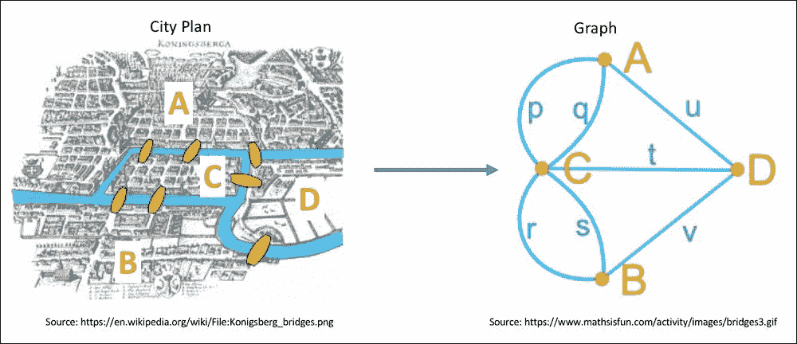

将柯尼斯堡七桥问题简化为图形问题

使用更正式的定义，**图**是表示对象（称为**顶点**或**节点**）之间对象之间的成对关系（称为**边缘**）的数据结构。 ）。 通常使用以下表示法表示图形：`G = (V, E)`其中`V`是顶点集，而`E`是顶点集的边缘。

图主要有两大类：

*   **有向图（称为有向图）**：成对关系的顺序很重要，即，从顶点`A`到顶点`B`的边（`AB`）不同于从顶点`B`到顶点`A`的边缘（`BA`）。
*   **无向图**：成对关系的顺序无关紧要，即边（`A-B`）与边（`B-A`）相同。

下图显示了示例图的表示形式，即无向（边缘没有箭头）和有向（边缘有箭头）：

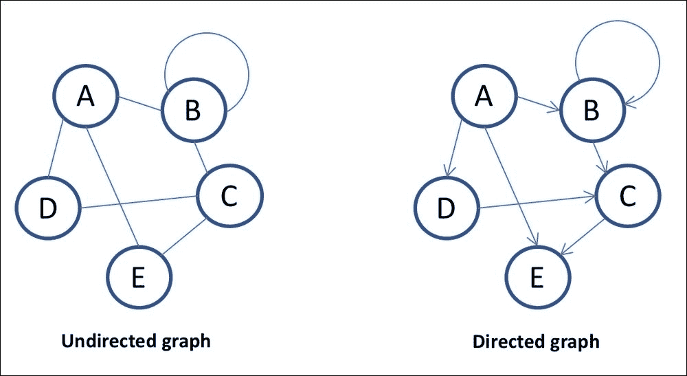

## 图的表示

主要有两种表示图形的方式：

*   **邻接矩阵**：使用`n`维矩阵表示图（我们称其为`A`），其中`n`是图形中的顶点数。 使用 1 到`n`个整数对顶点进行索引。 我们用`A[i, j] = 1`来表示顶点`i`和顶点`j`之间存在边，而`A[i, j] = 0`来表示顶点`i`和顶点`j`之间不存在边缘。 在无向图的情况下，因为顺序无关紧要，所以我们总是有`A[i, j] = A [j, i]`。 然而，在有序关系重要的有向图的情况下，`A[i, j]`可能与`A[j, i]`不同。 以下示例显示了如何在有向和无向的邻接矩阵中表示样本图：

    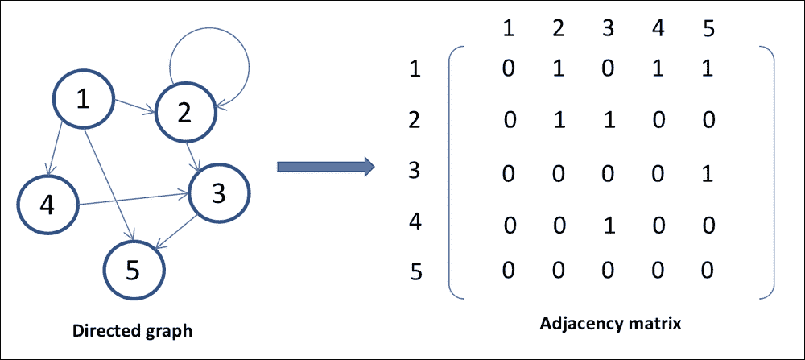

    图的邻接矩阵表示（有向和无向）

    重要的是要注意，邻接矩阵表示具有恒定的空间复杂度，即`O(n²)`，其中`n`是顶点数，但是的时间复杂度为`O(1)`，这是恒定时间，用于计算两个顶点之间是否存在边连接。 当图形密集（边缘很多）时，高空间复杂度可能还可以，但在图形稀疏时可能会浪费空间，在这种情况下，我们可能更喜欢以下邻接表表示形式。

    ### 注意

    **注意**：[大 O 表示法](https://en.wikipedia.org/wiki/Big_O_notation)通常用于代码分析，以通过随着输入大小的增加评估其行为来表示算法的性能。 它用于评估运行时间（运行算法所需的指令数量）和空间需求（随着时间的推移需要多少存储空间）。

*   **邻接表**：对于每个顶点，我们维护一个边连接的所有顶点的列表。 在无向图的情况下，每个边都被表示两次，每个端点代表一个边，对于顺序重要的有向图则不是这种情况。

    下图显示了有向图和无向图的图的邻接表表示形式：

    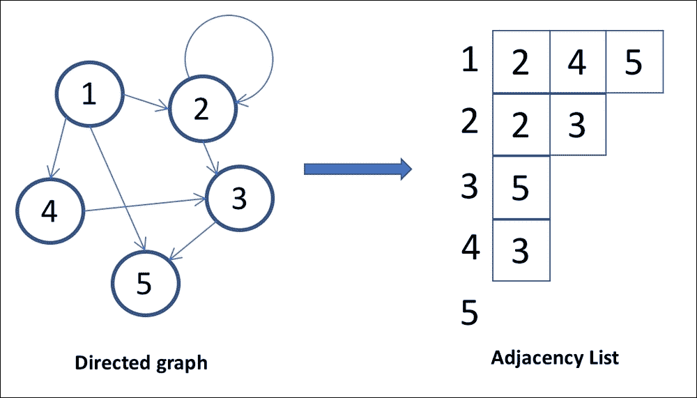

    图的邻接表表示（有向和无向）

    与邻接矩阵表示法相反，邻接列表表示法具有较小的空间复杂度，即`O(m + n)`，其中`m`是边的个数，`n`是顶点数。 但是，与邻接矩阵的`O(1)`相比，时间复杂度增加到`O(m)`。 由于这些原因，当图稀疏连接时（即没有很多边），最好使用邻接表表示。

正如前面的讨论所暗示的那样，要使用哪种图形表示形式在很大程度上取决于图形密度，还取决于我们计划使用的算法类型。 在下一节中，我们将讨论最常用的图形算法。

## 图算法

以下是最常用的图形算法的列表：

*   **搜索**：在图形的上下文中，搜索意味着找到两个顶点之间的路径。路径定义为边和顶点的连续序列。在图中搜索路径的动机可能是多种多样的。可能是您有兴趣根据一些预定义的距离标准（例如，边的最小数量（例如 GPS 路线图））找到最短路径，或者只是想知道两个顶点之间存在一条路径（对于例如，请确保网络中的每台计算机均可从其他任何计算机访问）。一种搜索路径的通用算法是从给定的顶点开始，*发现*与之相连的所有顶点，将发现的顶点标记为已探索（因此我们不会两次找到它们），并继续进行相同的探索每个发现的顶点，直到找到目标顶点，或者用尽顶点为止。该搜索算法有两种常用的风格：广度优先搜索和深度优先搜索，每种都有各自的用例，它们更适合于这些用例。这两种算法的区别在于我们找到未探索顶点的方式：

    *   **广度优先搜索（BFS）**：首先探索与相邻的未探索节点。 探索完相邻邻域后，开始探索层中每个节点的邻域，直到到达图的末尾。 由于我们正在探索首先直接连接的所有顶点，因此该算法保证找到与找到的邻域数量相对应的最短路径。 BFS 的扩展是著名的 Dijkstra 最短路径算法，其中每个边都与非负权重相关联。 在这种情况下，最短路径可能不是跳数最少的路径，而是使所有权重之和最小的路径。 Dijkstra 最短路径的一个示例应用是查找地图上两点之间的最短路径。
    *   **深度优先搜索（DFS）**：对于每个直接相邻的顶点，请先尽可能深入地探索其相邻的邻居，然后在耗尽邻居时开始回溯。 DFS 的应用示例包括查找拓扑排序和有向图的强连接组件。 作为参考，拓扑排序是顶点的线性排列，以使线性顶点中的每个顶点都遵循下一个顶点的边缘方向（也就是说，它不会向后移动）。 有关更多信息，请参见[这个页面](https://en.wikipedia.org/wiki/Topological_sorting)。

    下图说明了在 BFS 和 DFS 之间查找未探索的节点的区别：

    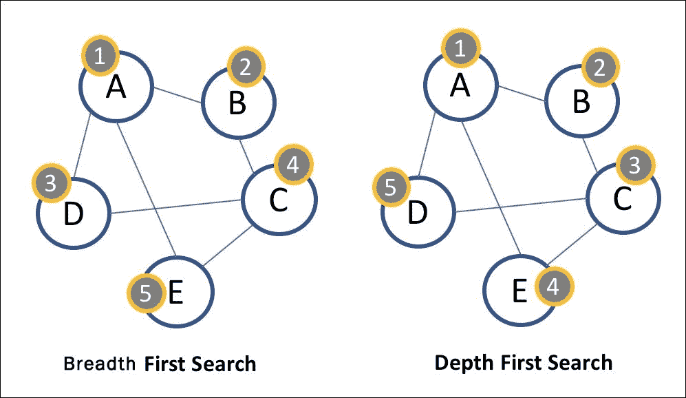

    在 BFS 和 DFS 中查找未探索的顶点的顺序

*   **连通组件和强连通组件**：图的连通组件是一组顶点，其中任意两个顶点之间都有路径。 注意，该定义仅指定必须存在路径，这意味着只要存在路径，两个顶点之间就不必具有边。 在有向图的情况下，由于附加的方向约束，连通组件被称为“强连通组件”，这不仅要求任何顶点 A 都应具有通往任何其他顶点 B 的路径，而且 B 也必须具有通往 A 的路径。

    下图显示了牢固连通组件或有向图示例：

    

    有向图的强连接组件

*   **中心**：顶点的中心度指示符指示顶点相对于图中其他顶点的重要性。 这些中心指数有多个重要的应用。 例如，在社交网络中确定最有影响力的人或通过最重要的页面对网络搜索进行排名等。

    中心性有多个指标，但我们将重点关注本章稍后将使用的以下四个指标：

    *   **阶数**：顶点的阶数是该顶点是端点之一的边的数量。 对于有向图，是顶点是源或目标的边数，我们称**入度**是顶点为目标的边的数量，**出度**是顶点为源的边的数量。
    *   **PageRank**：这是 Google，Larry Page 和 Sergey Brin 的创始人开发的著名算法。 PageRank 用于通过对给定网站的重要性进行衡量来对搜索结果进行排名，其中包括计算从其他网站到该网站的链接数。 它还会评估这些链接的质量（即网站链接到您的链接的可信度）。
    *   **紧密度**：紧密度中心度与给定顶点和图中所有其他顶点之间的最短路径的平均长度成反比。 直觉是顶点离所有其他节点越近，它就越重要。

        紧密度中心度可以使用以下简单方程式计算：

        

        （来源：<https://en.wikipedia.org/wiki/Centrality#Closeness_centrality>）

        其中`d(y, x)`是节点`x`和`y`之间的边缘长度。

    *   **最短路径之间的间隔**：根据给定顶点是任意两个节点之间最短路径的一部分的次数进行度量。 直觉是，顶点对最短路径的贡献越大，它就越重要。 这里提供了最短路径之间的数学方程式：

        

        （来源：<https://en.wikipedia.org/wiki/Centrality#Betweenness_centrality>）

        其中`σ[st]`是从顶点`s`到顶点`t`的最短路径总数，`σ[st](v)`是通过`v`的`σ[st]`的子集。

        ### 注意

    [**注意**：有关集中性的更多信息，请参见这里](https://en.wikipedia.org/wiki/Centrality)。

## 图和大数据

到目前为止，我们的图形讨论集中于可以容纳在一台机器中的数据，但是当我们拥有非常庞大的具有数十亿个顶点和边的图形而无法将整个数据加载到内存中时，会发生什么？ 一个自然的解决方案是将数据分布在多个节点的集群中，这些节点并行处理数据并合并单个结果以形成最终答案。 幸运的是，有多个框架提供了这种图形并行功能，并且它们几乎都包含了大多数常用的图形算法的实现。 流行的开源框架的示例有 [Apache Spark GraphX](https://spark.apache.org/graphx) 和 [Apache Giraph](http://giraph.apache.org)。 Facebook 目前正在使用来分析其社交网络。

无需过多讨论，重要的是要知道这些框架都是从分布式计算的[**批量同步并行**](https://en.wikipedia.org/wiki/Bulk_synchronous_parallel)（**BSP**）模型，它使用机器之间的消息在整个集群中查找顶点。 要记住的关键点是这些框架通常非常易于使用，例如，使用 Apache Spark GraphX 编写本章的分析本来就很容易。

在本节中，我们仅回顾了所有可用的图算法中的一小部分，并且深入探讨将超出本书的范围。 自己实现这些算法将花费大量时间，但是幸运的是，有很多开源库提供了图形算法的相当完整的实现，并且易于使用并将其集成到您的应用中。 在本章的其余部分，我们将使用`networkx`开源 Python 库。

#  NetworkX 图库入门

在开始之前，如果尚未完成，则需要使用`pip`工具安装`networkx`库。 在自己的单元格中执行以下代码：

```py
!pip install networkx

```

### 注意

**注意**：与往常一样，不要忘记在安装完成后重新启动内核。

`networkx`提供的大多数算法都可以直接从主模块调用。 因此，用户将只需要以下`import`语句：

```py
import networkx as nx
```

## 创建图

首先，让我们回顾一下`networkx`和创建空图的构造函数支持的不同类型的图：

*   `Graph`：无向图，只允许顶点之间有一个边。 允许自环边。 构造函数示例：

    ```py
    G = nx.Graph()
    ```

*   `Digraph`：实现有向图的`Graph`的子类。 构造函数示例：

    ```py
    G = nx.DiGraph()
    ```

*   `MultiGraph`：无向图，允许顶点之间有多个边。 构造函数示例：

    ```py
    G = nx.MultiGraph()
    ```

*   `MultiDiGraph`：有向图，允许顶点之间有多个边。 构造函数示例：

    ```py
    G = nx.MultiDiGraph()
    ```

`Graph`类提供了许多用于添加和删除顶点和边的方法。 这是可用方法的子集：

*   `add_edge(u_of_edge, v_of_edge, **attr)`：在顶点`u`和顶点`v`之间添加一条边，并带有与该边相关联的可选附加属性。 如果图中尚未存在顶点`u`和`v`，则会自动创建它们。
*   `remove_edge(u, v)`：移除`u`和`v`之间的边缘。
*   `add_node(self, node_for_adding, **attr)`：使用可选的附加属性将节点添加到图形。
*   `remove_node(n)`：删除由给定参数`n`标识的节点。
*   `add_edges_from(ebunch_to_add, **attr)`：批量添加具有可选附加属性的多个边。 边必须以两元组`(u,v)`或三元组`(u,v,d)`的列表形式给出，其中`d`是包含边数据的字典。
*   `add_nodes_from(self, nodes_for_adding, **attr)`：使用可选附加属性批量添加多个节点。 可以将节点提供为列表，字典，集合，数组等。

作为练习，我们从头开始构建一个一直用作示例的有向图：


使用  NetworkX 以编程方式创建的示例图

以下代码首先创建一个`DiGraph()`对象，然后使用`add_nodes_from()`方法在一次调用中添加所有节点，然后使用`add_edge()`和`add_edges_from()`的组合开始添加边线：

```py
G = nx.DiGraph()
G.add_nodes_from(['A', 'B', 'C', 'D', 'E'])
G.add_edge('A', 'B')
G.add_edge('B', 'B')
G.add_edges_from([('A', 'E'),('A', 'D'),('B', 'C'),('C', 'E'),('D', 'C')])
```

### 注意

[您可以在此处找到代码文件](https://github.com/DTAIEB/Thoughtful-Data-Science/blob/master/chapter%209/sampleCode1.py)。

`Graph`类还提供了通过变量类视图轻松访问其属性的方法。 例如，您可以使用`G.nodes`和`G.edges`遍历图形的顶点和边缘，还可以使用以下符号访问单个边缘：`G.edges[u,v]`。

以下代码遍历图的节点并打印它们：

```py
for n in G.nodes:
    print(n)
```

`networkx`库还提供了一组丰富的预建图形生成器，可用于测试算法。 例如，您可以使用`complete_graph()`生成器轻松生成完整的图形，如以下代码所示：

```py
G_complete = nx.complete_graph(10)
```

### 注意

[您可以在此处找到所有可用图形生成器的完整列表](https://networkx.github.io/documentation/networkx-2.1/reference/generators.html#generators)。

## 可视化图

NetworkX 支持多种渲染引擎，包括 Matplotlib，[Graphviz AGraph](http://pygraphviz.github.io) 和 Graphviz 和 [pydot](https://github.com/erocarrera/pydot)。 尽管 Graphviz 提供了非常强大的绘图功能，但我发现很难安装。 但是，Matplotlib 已预先安装在 Jupyter 笔记本中，可以让您快速入门。

核心图形函数称为`draw_networkx`，该函数将图形作为参数以及一堆可选的关键字参数，这些参数可用于设置图形的样式，例如颜色，宽度以及节点和边的标签字体。 通过将`GraphLayout`对象传递到`pos`关键字参数来配置图形绘图的总体布局。 默认布局为`spring_layout`（使用强制控制算法），但是 NetworkX 支持许多其他布局，包括`circular_layout`，`random_layout`和`spectral_layout`。 [您可以在此处找到所有可用布局的列表](https://networkx.github.io/documentation/networkx-2.1/reference/drawing.html#module-networkx.drawing.layout)。

为了方便起见，`networkx`将这些布局中的每一个封装到其自己的高级绘制方法中，这些方法调用合理的默认值，以便调用者不必处理这些布局中的每一个的复杂性。 例如，`draw()`方法将使用`sprint_layout`，`draw_circular()`和`circular_layout`以及`draw_random()`和`random_layout`绘制图形。

在下面的示例代码中，我们使用`draw()`方法可视化我们先前创建的`G_complete`图：

```py
%matplotlib inline
import matplotlib.pyplot as plt
nx.draw(G_complete, with_labels=True)
plt.show()
```

### 注意

[您可以在此处找到代码文件](https://github.com/DTAIEB/Thoughtful-Data-Science/blob/master/chapter%209/sampleCode2.py)。

结果显示在以下输出中：

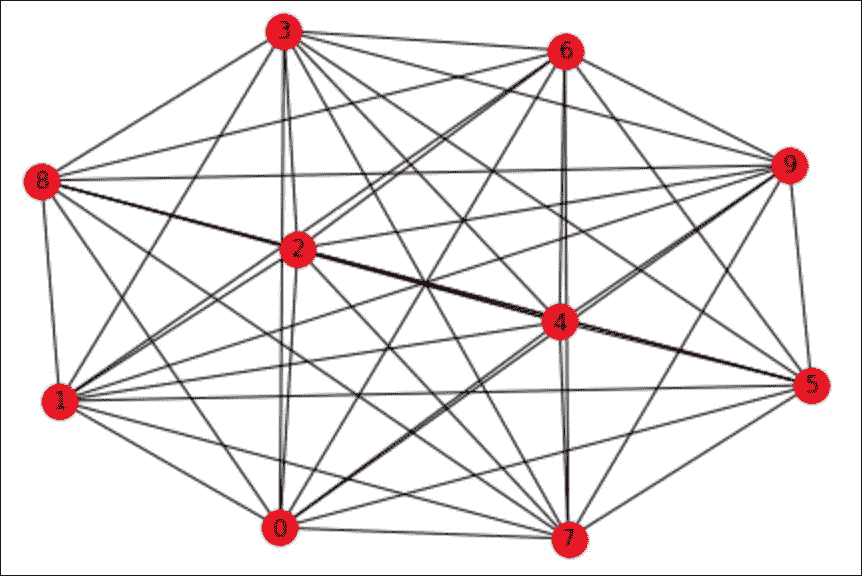

绘制具有 10 个节点的完整图形

使用`networkx`绘制图形既简单又有趣，并且由于它使用的是 Matplotlib，因此您可以使用 Matplotlib 的绘制功能进一步美化它们。 我鼓励读者通过可视化笔记本中的不同图形来进一步试验。 在下一节中，我们将开始实现一个示例应用，该应用使用图形算法分析飞行数据。

# 第 1 部分——将美国国内航班数据加载到图中

要初始化笔记本，让我们在其自己的单元格中运行以下代码，以导入本章其余部分将大量使用的包：

```py
import pixiedust
import networkx as nx
import pandas as pd
import matplotlib.pyplot as plt
```

我们还将使用 Kaggle 网站上位于以下位置的 [*2015 年航班延误和取消*数据集](https://www.kaggle.com/usdot/datasets)。 数据集由三个文件组成：

*   `airports.csv`：美国所有机场的列表，包括其 **IATA** 代码（[**国际航空运输协会**](https://openflights.org/data.html)），城市，州，经度和纬度。
*   `airlines.csv`：美国航空公司的列表，包括其 IATA 代码。
*   `flights.csv`：2015 年发生的航班列表。此数据包括日期，始发和目的地机场，计划和实际时间以及延误。

`flights.csv`文件包含将近 600 万条记录，需要清除这些记录才能删除始发地或目的地机场中所有没有 IATA 三字母代码的航班。 我们还想删除`ELAPSED_TIME`列中值缺失的行。 如果不这样做，则会在将数据加载到图形结构中时引起问题。 另一个问题是数据集包含一些时间列，例如`DEPARTURE_TIME`和`ARRIVAL_TIME`，并且为了节省空间，这些列仅以`HHMM`格式存储时间，而实际日期存储在`YEAR`，`MONTH`和`DAY`列中。 我们将在本章中进行的一项分析将需要`DEPARTURE_TIME`的完整日期时间，并且由于进行此转换是一项耗时的操作，因此我们现在进行并将其存储在我们将存储在 GitHub 上的`flights.csv`的处理版本中。 此操作使用通过`to_datetime()`函数和`axis=1`调用的 Pandas `apply()`方法（指示对每行应用了转换）。

另一个问题是我们希望将文件存储在 GitHub 上，但是最大文件大小限制为 100M。因此，为使文件小于 100 M，我们还删除了一些不需要的列。 我们尝试构建的分析文件，然后将其压缩，然后再将其存储在 GitHub 上。 当然，另一个好处是`DataFrame`可以使用较小的文件更快地加载。

从 Kaggle 网站下载文件后，我们运行以下代码，该代码首先将 CSV 文件加载到 Pandas `DataFrame`中，删除不需要的行和列，然后将数据写回到文件中：

### 注意

**注意**：原始数据存储在名为`flights.raw.csv`的文件中。

由于包含 600 万条记录的文件很大，因此运行以下代码可能需要一些时间。

```py
import pandas as pd
import datetime
import numpy as np

# clean up the flights data in flights.csv
flights = pd.read_csv('flights.raw.csv', low_memory=False)

# select only the rows that have a 3 letter IATA code in the ORIGIN and DESTINATION airports
mask = (flights["ORIGIN_AIRPORT"].str.len() == 3) & (flights["DESTINATION_AIRPORT"].str.len() == 3)
flights = flights[ mask ]

# remove the unwanted columns
dropped_columns=["SCHEDULED_DEPARTURE","SCHEDULED_TIME",
"CANCELLATION_REASON","DIVERTED","DIVERTED","TAIL_NUMBER",
"TAXI_OUT","WHEELS_OFF","WHEELS_ON",
"TAXI_IN","SCHEDULED_ARRIVAL", "ARRIVAL_TIME", "AIR_SYSTEM_DELAY","SECURITY_DELAY",
"AIRLINE_DELAY","LATE_AIRCRAFT_DELAY", "WEATHER_DELAY"]
flights.drop(dropped_columns, axis=1, inplace=True)

# remove the row that have NA in the ELAPSED_TIME column
flights.dropna(subset=["ELAPSED_TIME"], inplace=True)

# remove the row that have NA in the DEPARTURE_TIME column
flights.dropna(subset=["ELAPSED_TIME"], inplace=True)

# Create a new DEPARTURE_TIME columns that has the actual datetime
def to_datetime(row):
    departure_time = str(int(row["DEPARTURE_TIME"])).zfill(4)
    hour = int(departure_time[0:2])
    return datetime.datetime(year=row["YEAR"], month=row["MONTH"],
                             day=row["DAY"],
                             hour = 0 if hour >= 24 else hour,
                             minute=int(departure_time[2:4])
                            )
flights["DEPARTURE_TIME"] = flights.apply(to_datetime, axis=1)

# write the data back to file without the index
flights.to_csv('flights.csv', index=False)

```

### 注意

[您可以在此处找到代码文件](https://github.com/DTAIEB/Thoughtful-Data-Science/blob/master/chapter%209/sampleCode3.py)。

### 注意

**注意**：如[`pandas.read_csv`文档](http://pandas.pydata.org/pandas-docs/version/0.23/generated/pandas.read_csv.html)中所述， 我们使用关键字参数`low_memory=False`来确保未按块加载数据，这可能会导致类型推断的问题，尤其是对于非常大的文件。

为了方便起见，[这三个文件存储在以下 GitHub 位置](https://github.com/DTAIEB/Thoughtful-Data-Science/tree/master/chapter%209/USFlightsAnalysis)。

以下代码使用`pixiedust.sampleData()`方法将数据加载到对应于`airlines`，`airports`和`flights`的三个 Pandas `DataFrame`中：

```py
airports = pixiedust.sampleData("https://github.com/DTAIEB/Thoughtful-Data-Science/raw/master/chapter%209/USFlightsAnalysis/airports.csv")
airlines = pixiedust.sampleData("https://github.com/DTAIEB/Thoughtful-Data-Science/raw/master/chapter%209/USFlightsAnalysis/airlines.csv")
flights = pixiedust.sampleData("https://github.com/DTAIEB/Thoughtful-Data-Science/raw/master/chapter%209/USFlightsAnalysis/flights.zip")
```

### 注意

[您可以在此处找到代码文件](https://github.com/DTAIEB/Thoughtful-Data-Science/blob/master/chapter%209/sampleCode4.py)。

**注意**：GitHub URL 使用`/raw/`段，该段指示我们要下载原始文件，而不是相应 GitHub 页面的 HTML。

下一步是使用`flights``DataFrame`作为`edge`列表并将`ELAPSED_TIME`列中的值作为权重，将数据加载到`networkx`有向加权图对象中。 我们首先通过使用`pandas.groupby()`方法和以`ORIGIN_AIRPORT`和`DESTINATION_AIRPORT`为键的多索引对它们进行分组，从而对所有与始发地和目的地具有相同机场的航班进行重复数据删除。 然后，从`DataFrameGroupBy`对象中选择`ELAPSED_TIME`列，并使用`mean()`方法汇总结果。 这将为我们提供一个新的`DataFrame`，其具有相同始发地和目的地机场的每个航班的平均平均值`ELAPSED_TIME`：

```py
edges = flights.groupby(["ORIGIN_AIRPORT","DESTINATION_AIRPORT"]) [["ELAPSED_TIME"]].mean()
edges
```

### 注意

[您可以在此处找到代码文件](https://github.com/DTAIEB/Thoughtful-Data-Science/blob/master/chapter%209/sampleCode5.py)。

结果显示在以下屏幕截图中：

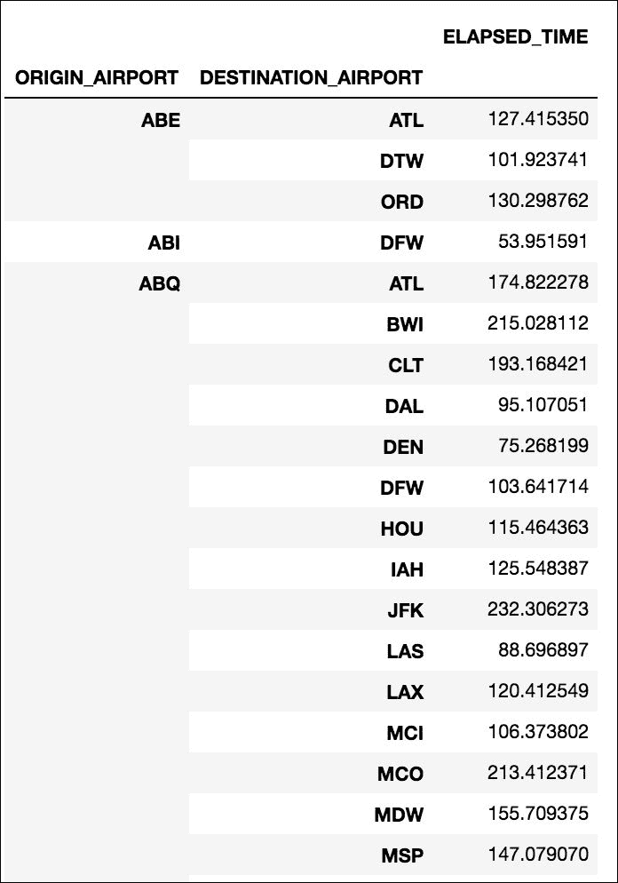

按出发地和目的地分组的航班，平均平均飞行时间为`ELAPSED_TIME`

在使用此`DataFrame`创建有向图之前，我们需要将索引从多索引重置为常规单索引，将索引列转换为常规列。 为此，我们仅使用`reset_index()`方法，如下所示：

```py
edges = edges.reset_index()
edges
```

### 注意

[您可以在此处找到代码文件](https://github.com/DTAIEB/Thoughtful-Data-Science/blob/master/chapter%209/sampleCode6.py)。

现在，我们有了一个形状正确的`DataFrame`，可以用来创建有向图，如以下屏幕截图所示：

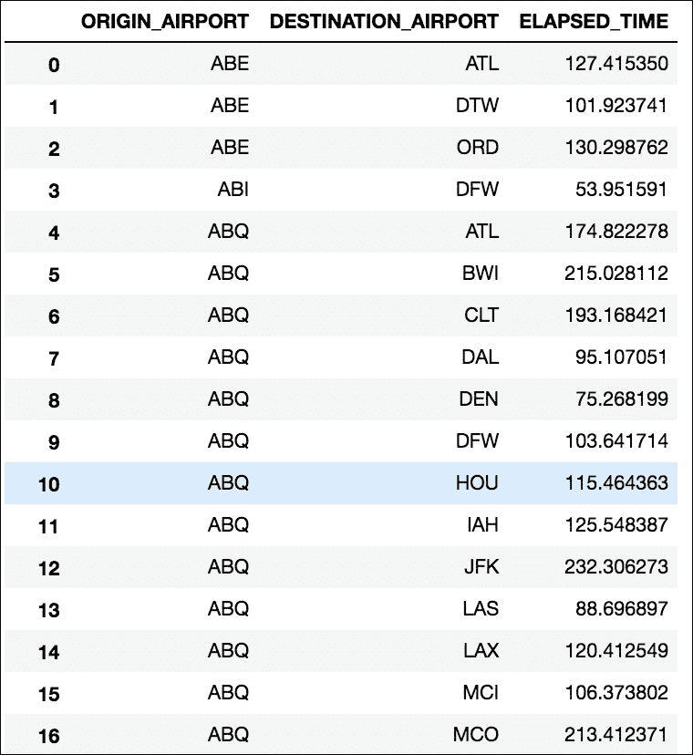

按始发地和目的地分组的航班，平均平均飞行时间为`ELAPSED_TIME`，并且只有一个索引

要创建有向加权图，我们使用 NetworkX `from_pandas_edgelist()`方法，该方法以 Pandas `DataFrame`作为输入源。 我们还指定了源列和目标列，以及权重列（在我们的示例中为`ELAPSED_TIME`）。 最后，我们告诉 NetworkX 我们想通过使用`create_using`关键字参数来创建有向图，并将`DiGraph`的实例作为值传递。

以下代码显示如何调用`from_pandas_edgelist()`方法：

```py
flight_graph = nx.from_pandas_edgelist(
    flights, "ORIGIN_AIRPORT","DESTINATION_AIRPORT",
    "ELAPSED_TIME",
    create_using = nx.DiGraph() )
```

### 注意

[您可以在此处找到代码文件](https://github.com/DTAIEB/Thoughtful-Data-Science/blob/master/chapter%209/sampleCode7.py)。

**注意**：NetworkX 支持通过从多种格式创建，包括字典，列表，NumPy 和 SciPy 矩阵，当然还有 Pandas。 [您可以在此处找到有关这些转换功能的更多信息](https://networkx.github.io/documentation/networkx-2.1/reference/convert.html)。

我们可以通过直接打印其节点和边来快速验证我们的图是否具有正确的值：

```py
print("Nodes: {}".format(flight_graph.nodes))
print("Edges: {}".format(flight_graph.edges))
```

### 注意

[您可以在此处找到代码文件](https://github.com/DTAIEB/Thoughtful-Data-Science/blob/master/chapter%209/sampleCode8.py)。

产生以下输出（被截断）：

```py
Nodes: ['BOS', 'TYS', 'RKS', 'AMA', 'BUF', 'BHM', 'PPG', …, 'CWA', 'DAL', 'BFL']
Edges: [('BOS', 'LAX'), ('BOS', 'SJC'), ..., ('BFL', 'SFO'), ('BFL', 'IAH')]
```

我们还可以使用`networkx`中提供的内置绘图 API 创建更好的可视化，这些 API 支持多个渲染引擎，包括 Matplotlib，[Graphviz AGraph](http://pygraphviz.github.io) 和带有 pydot 的 [Graphviz](https://github.com/erocarrera/pydot)。

为简单起见，我们将使用 NetworkX `draw()`方法，该方法使用现成的 Matplotlib 引擎。 为了美化可视化效果，我们将配置为适当的宽度和高度`(12, 12)`，并添加具有鲜艳色彩的色图（我们使用`matplolib.cm`中的`cool`和`spring`色图，[请参阅这里](https://matplotlib.org/2.0.2/examples/color/colormaps_reference.html)）。

以下代码显示了图形可视化的实现：

```py
import matplotlib.cm as cm
fig = plt.figure(figsize = (12,12))
nx.draw(flight_graph, arrows=True, with_labels=True,
        width = 0.5,style="dotted",
        node_color=range(len(flight_graph)),
        cmap=cm.get_cmap(name="cool"),
        edge_color=range(len(flight_graph.edges)),
        edge_cmap=cm.get_cmap(name="spring")
       )
plt.show()
```

### 注意

[您可以在此处找到代码文件](https://github.com/DTAIEB/Thoughtful-Data-Science/blob/master/chapter%209/sampleCode9.py)。

产生以下结果：

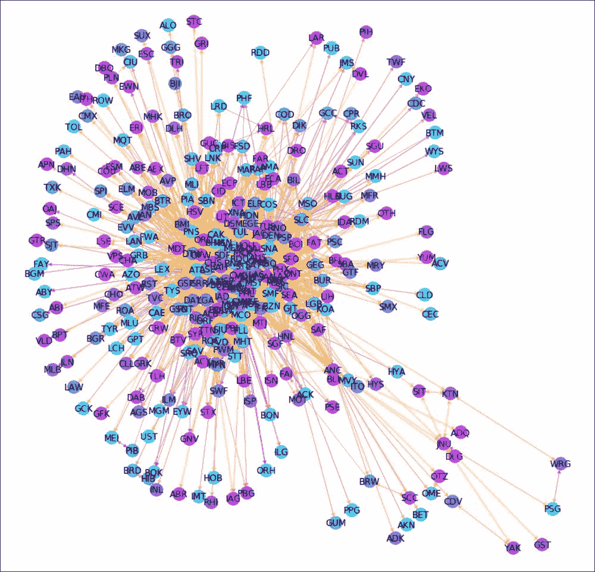

使用 Matplotlib 快速可视化我们的有向图

在上一张图表中，节点使用称为`spring_layout`的默认图形布局进行定位，这是一种强制控制的布局。 这种布局的一个好处是它可以迅速显示出具有最多边缘连接的节点，它们位于图的中心。 调用`draw()`方法时，可以使用`pos`关键字参数通过更改图形布局。 `networkx`支持其他类型的布局，包括`circular_layout`，`random_layout`，`shell_layout`和`spectral_layout`。

例如，使用`random_layout`：

```py
import matplotlib.cm as cm
fig = plt.figure(figsize = (12,12))
nx.draw(flight_graph, arrows=True, with_labels=True,
        width = 0.5,style="dotted",
        node_color=range(len(flight_graph)),
        cmap=cm.get_cmap(name="cool"),
        edge_color=range(len(flight_graph.edges)),
        edge_cmap=cm.get_cmap(name="spring"),
        pos = nx.random_layout(flight_graph)
       )
plt.show()

```

### 注意

[您可以在此处找到代码文件](https://github.com/DTAIEB/Thoughtful-Data-Science/blob/master/chapter%209/sampleCode10.py)。

我们得到以下结果：

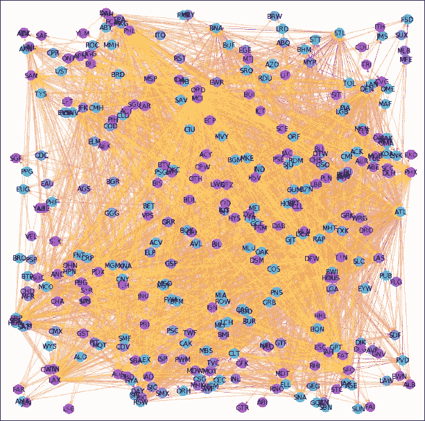

使用`random_layout`的飞行数据图

### 注意

[注意：您可以在此处找到有关这些布局的更多信息](https://networkx.github.io/documentation/networkx-2.1/reference/drawing.html)。

## 图的中心

关于该图要分析的下一个有趣的事情是它的中心指数，它使我们能够发现哪些节点是最重要的顶点。 作为练习，我们将计算四种类型的中心度索引：**度**，**PageRank**，**紧密度**和**最短路径间隔**。 然后，我们将扩充机场数据框架以为每个中心度索引添加一个列，并使用 PixieDust `display()`在 Mapbox 地图中可视化结果。

使用`networkx`可以很容易地计算图的程度。 只需使用`flight_graph`对象的`degree`属性，如下所示：

```py
print(flight_graph.degree)
```

这将输出具有机场代码和程度索引的元组数组，如下所示：

```py
[('BMI', 14), ('RDM', 8), ('SBN', 13), ('PNS', 18), ………, ('JAC', 26), ('MEM', 46)]
```

现在，我们想向机场数据帧添加`DEGREE`列，其中包含前一个数组中每个机场行的度值。 为此，我们需要创建一个具有两列的新`DataFrame`：`IATA_CODE`和`DEGREE`并在`IATA_CODE`上执行 Pandas `merge()`操作。

下图说明了合并操作：

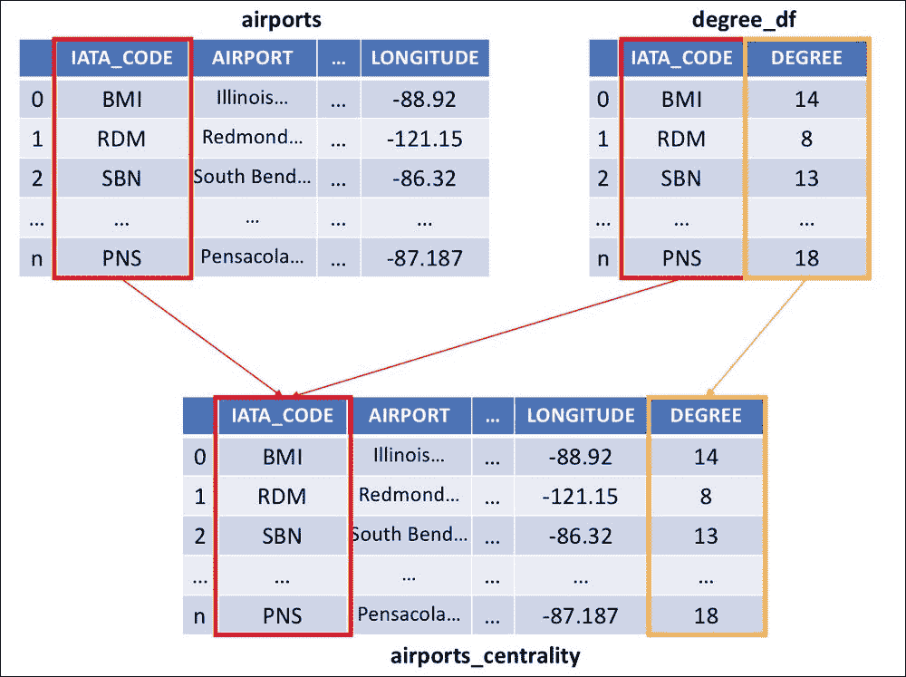

将度数`DataFrame`合并到机场`DataFrame`

以下代码显示了如何实现上述步骤。 我们首先通过遍历`flight_path.degree`输出来创建 JSON 有效负载，然后使用`pd.DataFrame()`构造函数来创建`DataFrame`。 然后，我们以`airports`和`degree_df`作为参数来使用`pd.merge()`。 我们还将`on`参数与值`IATA_CODE`一起使用，这是我们要在其上进行连接的键列：

```py
degree_df = pd.DataFrame([{"IATA_CODE":k, "DEGREE":v} for k,v in flight_graph.degree], columns=["IATA_CODE", "DEGREE"])
airports_centrality = pd.merge(airports, degree_df, on='IATA_CODE')
airports_centrality
```

### 注意

[您可以在此处找到代码文件](https://github.com/DTAIEB/Thoughtful-Data-Science/blob/master/chapter%209/sampleCode11.py)。

结果在以下屏幕快照中显示：


使用`DEGREE`列增强的机场`DataFrame`

要可视化 Mapbox 地图中的数据，我们只需在`airport_centrality``DataFrame`上使用`PixieDust.display()`：

```py
display(airports_centrality)
```

以下屏幕截图显示了选项对话框：

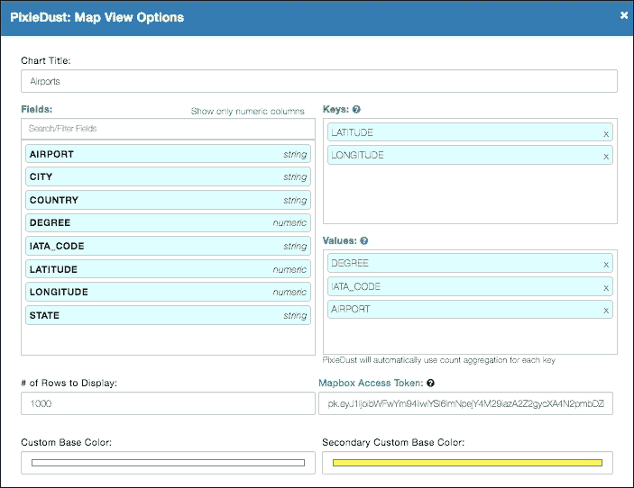

用于显示机场的 Mapbox 选项

在选项对话框中单击 **OK** 后，我们得到以下结果：

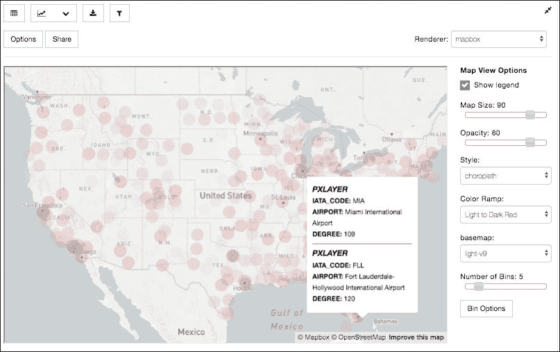

以学位为中心向机场展示

对于其他中心指数，我们可以注意到，所有相应的计算函数都返回了一个 JSON 输出（与度属性的数组相对），其中`IATA_CODE`机场代码为键，而中心指数为值。

例如，如果我们使用以下代码计算 PageRank：

```py
nx.pagerank(flight_graph)
```

我们得到以下结果：

```py
{'ABE': 0.0011522441195896051,
 'ABI': 0.0006671948649909588,
 ...
 'YAK': 0.001558809391270303,
 'YUM': 0.0006214341604372096}
```

考虑到这一点，我们无需执行与`degree`相同的步骤，而是可以实现一个名为`compute_centrality()`的泛型函数，该函数将计算中心度和列名的函数作为参数，创建一个临时函数。 包含计算出的中心值的数据帧，并将其与`airports_centrality`数据帧合并。

以下代码显示了`compute_centrality()`的实现：

```py
from six import iteritems
def compute_centrality(g, centrality_df, compute_fn, col_name, *args, **kwargs):
    # create a temporary DataFrame that contains the computed centrality values
    temp_df = pd.DataFrame(
        [{"IATA_CODE":k, col_name:v} for k,v in iteritems(compute_fn(g, *args, **kwargs))],
        columns=["IATA_CODE", col_name]
    )
    # make sure to remove the col_name from the centrality_df is already there
    if col_name in centrality_df.columns:
        centrality_df.drop([col_name], axis=1, inplace=True)
    # merge the 2 DataFrame on the IATA_CODE column
    centrality_df = pd.merge(centrality_df, temp_df, on='IATA_CODE')
    return centrality_df

```

### 注意

[您可以在此处找到代码文件](https://github.com/DTAIEB/Thoughtful-Data-Science/blob/master/chapter%209/sampleCode12.py)。

我们现在可以简单地用三个计算函数`nx.pagerank()`，`nx.closeness_centrality()`和`nx.betweenness_centrality()`分别用列`PAGE_RANK`，`CLOSENESS`和`BETWEENNESS`调用来调用`compute_centrality()`方法，如以下代码所示：

```py
airports_centrality = compute_centrality(flight_graph, airports_centrality, nx.pagerank, "PAGE_RANK")
airports_centrality = compute_centrality(flight_graph, airports_centrality, nx.closeness_centrality, "CLOSENESS")
airports_centrality = compute_centrality(
    flight_graph, airports_centrality, nx.betweenness_centrality, "BETWEENNESS", k=len(flight_graph))
airports_centrality
```

### 注意

[您可以在此处找到代码文件](https://github.com/DTAIEB/Thoughtful-Data-Science/blob/master/chapter%209/sampleCode13.py)。

`airports_centrality``DataFrame`现在具有多余的列，如以下输出所示：


使用`PAGE_RANK`，`CLOSENESS`和`BETWEENNESS`值增强的机场 `DataFrame`

作为练习，我们可以验证四个中心指数为顶级机场提供了一致的结果。 使用 Pandas `nlargest()`方法，我们可以获得四个索引的前 10 个机场，如以下代码所示：

```py
for col_name in ["DEGREE", "PAGE_RANK", "CLOSENESS", "BETWEENNESS"]:
    print("{} : {}".format(
        col_name,
        airports_centrality.nlargest(10, col_name)["IATA_CODE"].values)
    )
```

### 注意

[您可以在此处找到代码文件](https://github.com/DTAIEB/Thoughtful-Data-Science/blob/master/chapter%209/sampleCode14.py)。

产生以下结果：

```py
DEGREE : ['ATL' 'ORD' 'DFW' 'DEN' 'MSP' 'IAH' 'DTW' 'SLC' 'EWR' 'LAX']
PAGE_RANK : ['ATL' 'ORD' 'DFW' 'DEN' 'MSP' 'IAH' 'DTW' 'SLC' 'SFO' 'LAX']
CLOSENESS : ['ATL' 'ORD' 'DFW' 'DEN' 'MSP' 'IAH' 'DTW' 'SLC' 'EWR' 'LAX']
BETWEENNESS : ['ATL' 'DFW' 'ORD' 'DEN' 'MSP' 'SLC' 'DTW' 'ANC' 'IAH' 'SFO']
```

正如我们所看到的，亚特兰大机场成为所有中心指数的最高机场。 作为练习，我们创建一个名为`visualize_neighbors()`的通用方法，该方法可视化给定节点的所有邻居，并使用 Atlanta 节点对其进行调用。 在这种方法中，我们通过向自身的所有邻居添加一条边来创建以父节点为中心的子图。 我们使用 NetworkX `neighbors()`方法来获取特定节点的所有邻居。

以下代码显示`visualize_neighbors()`方法的实现：

```py
import matplotlib.cm as cm
def visualize_neighbors(parent_node):
    fig = plt.figure(figsize = (12,12))
    # Create a subgraph and add an edge from the parent node to all its neighbors
    graph = nx.DiGraph()
    for neighbor in flight_graph.neighbors(parent_node):
        graph.add_edge(parent_node, neighbor)
    # draw the subgraph
    nx.draw(graph, arrows=True, with_labels=True,
            width = 0.5,style="dotted",
            node_color=range(len(graph)),
            cmap=cm.get_cmap(name="cool"),
            edge_color=range(len(graph.edges)),
            edge_cmap=cm.get_cmap(name="spring"),
           )
    plt.show()
```

### 注意

[您可以在此处找到代码文件](https://github.com/DTAIEB/Thoughtful-Data-Science/blob/master/chapter%209/sampleCode15.py)。

然后，我们在`ATL`节点上调用`visualize_neighbors()`方法：

```py
visualize_neighbors("ATL")
```

产生以下输出：

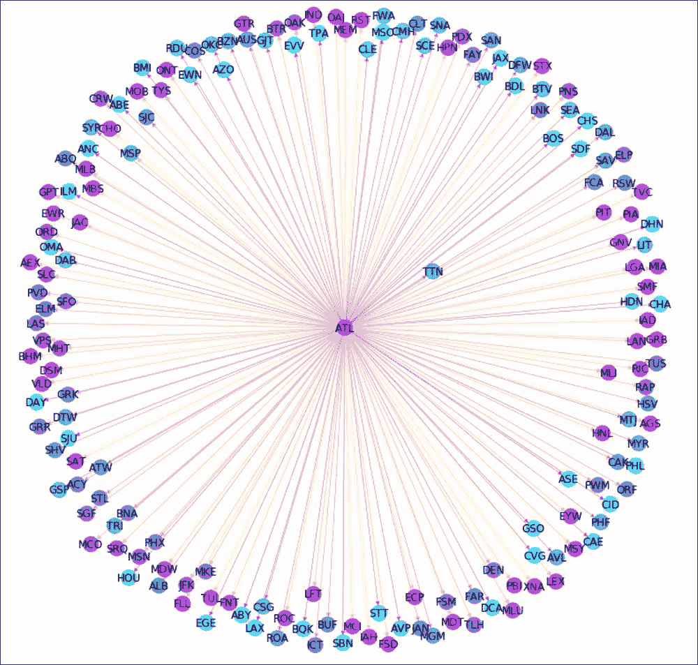

可视化顶级节点 ATL 及其邻居

通过使用著名的 [Dijkstra 算法](https://en.wikipedia.org/wiki/Dijkstra%27s_algorithm)计算两个节点之间的最短路径，我们完成了第 1 部分部分。 我们将尝试使用不同的权重属性以检查是否获得了不同的结果。

例如，我们使用 NetworkX `dijkstra_path()`方法来计算马萨诸塞州波士顿洛根机场（`BOS`）和华盛顿州帕斯科三城市机场（`PSC`）之间的最短路径。

我们首先使用`ELAPSED_TIME`列作为权重属性：

### 注意

**注**：提醒一下，`ELAPSED_TIME`是我们在本节前面计算的，具有相同出发地和目的地机场的每个航班的平均飞行时间。

```py
nx.dijkstra_path(flight_graph, "BOS", "PSC", weight="ELAPSED_TIME")
```

哪个返回：

```py
['BOS', 'MSP', 'PSC']
```

不幸的是，我们之前计算的中心度索引不是`flight_graph DataFrame`的一部分，因此将其用作`weight`属性的列名将不起作用。 但是`dijkstra_path()`还允许我们使用一个函数来动态计算权重。 由于我们想尝试不同的中心指数，因此我们需要创建一个[工厂方法](https://en.wikipedia.org/wiki/Factory_method_pattern)，该方法将为给定的中心指数创建函数参数。 此参数用作嵌套包装函数的闭包，该包装函数符合`dijkstra_path()`方法的`weight`参数。 我们也使用字典来记住给定机场的权重，因为该算法将为同一机场多次调用该函数。 如果权重不在缓存中，则使用`centrality_indice_col`参数在`airports_centrality``DataFrame`中查找权重。 由于 Dijkstra 算法偏爱距离较短的路径，因此通过获得中心值的倒数来计算最终权重。

以下代码显示`compute_weight`工厂方法的实现：

```py
# use a cache so we don't recompute the weight for the same airport every time
cache = {}
def compute_weight(centrality_indice_col):
    # wrapper function that conform to the dijkstra weight argument
    def wrapper(source, target, attribute):
        # try the cache first and compute the weight if not there
        source_weight = cache.get(source, None)
        if source_weight is None:
            # look up the airports_centrality for the value
            source_weight = airports_centrality.loc[airports_centrality["IATA_CODE"] == source][centrality_indice_col].values[0]
            cache[source] = source_weight
        target_weight = cache.get(target, None)
        if target_weight is None:
            target_weight = airports_centrality.loc[airports_centrality["IATA_CODE"] == target][centrality_indice_col].values[0]
            cache[target] = target_weight
        # Return weight is inversely proportional to the computed weighted since
        # the Dijkstra algorithm give precedence to shorter distances
        return float(1/source_weight) + float(1/target_weight)
    return wrapper
```

### 注意

[您可以在此处找到代码文件](https://github.com/DTAIEB/Thoughtful-Data-Science/blob/master/chapter%209/sampleCode16.py)。

现在，我们可以为每个中心性索引调用 NetworkX `dijkstra_path()`方法。 请注意，我们不使用`BETWEENNESS`，因为某些值等于零，因此不能用作权重。 在调用`dijkstra_path()`方法之前，我们还需要清除缓存，因为使用不同的中心性索引会为每个机场产生不同的值。

以下代码显示了如何为每个中心指数计算最短路径：

```py
for col_name in ["DEGREE", "PAGE_RANK", "CLOSENESS"]:
    #clear the cache
    cache.clear()
    print("{} : {}".format(
        col_name,
        nx.dijkstra_path(flight_graph, "BOS", "PSC",
                         weight=compute_weight(col_name))
    ))
```

### 注意

[您可以在此处找到代码文件](https://github.com/DTAIEB/Thoughtful-Data-Science/blob/master/chapter%209/sampleCode17.py)。

产生以下结果：

```py
DEGREE : ['BOS', 'DEN', 'PSC']
PAGE_RANK : ['BOS', 'DEN', 'PSC']
CLOSENESS : ['BOS', 'DEN', 'PSC']
```

有趣的是，正如预期的那样，经过计算的最短路径对于三个中心指数而言都是相同的，它们都经过丹佛机场（这是最高的中央机场）。 但是，它与不同，后者是使用`ELAPSED_TIME`权重计算得出的值，而这会使我们通过明尼阿波利斯。

在本节中，我们展示了如何将美国航班数据加载到图形数据结构中，如何计算不同的中心性指数，并使用它们来计算机场之间的最短路径。 我们还讨论了可视化图形数据的不同方法。

### 注意

[可在以下位置找到第 1 部分的完整笔记本](https://github.com/DTAIEB/Thoughtful-Data-Science/blob/master/chapter%209/USFlightsAnalysis/US%20Flight%20data%20analysis%20-%20Part%201.ipynb)。

在下一节中，我们将创建`USFlightsAnalysis` PixieApp，以对这些分析进行操作。

# 第 2 部分——创建`USFlightsAnalysis` PixieApp

对于`USFlightsAnalysis`的第一个迭代，我们想实现一个简单的用户故事，该故事利用第 1 部分中创建的分析：

*   欢迎屏幕将显示两个下拉控件，用于选择来源和目的地机场
*   选择机场后，我们将显示一个图表，显示选定的机场及其直接邻居
*   选择两个机场后，用户单击**分析**按钮以显示包含所有机场的 Mapbox 地图
*   用户可以选择一个中心性指标作为复选框，以根据所选中心性显示最短的飞行路径

首先让我们看一下欢迎屏幕的实现，它是在`USFlightsAnalysis` PixieApp 的默认路由中实现的。 下面的代码定义了`USFlightsAnalysis`类，该类用`@PixieApp`装饰器装饰成一个 PixieApp。 它包含一个`main_screen()`方法，该方法用`@route()`装饰器装饰以使其成为默认路由。 此方法返回一个 HTML 片段，该片段将在 PixieApp 启动时用作欢迎屏幕。 HTML 片段由两部分组成：一部分显示用于选择始发机场的下拉控件，另一部分包含用于选择目标机场的下拉控件。 我们使用遍历每个机场的 Jinja2 ``循环（由`get_airports()`方法返回）来生成一组`<options>`元素。 在这些控件的每个控件下，我们添加一个占位符`<div>`元素，该元素将在选择机场时托管图形可视化。

### 注意

**注意**：与往常一样，我们使用`[[USFlightsAnalysis]]`表示法表示该代码仅显示部分实现，因此，在提供完整实现之前，读者不应尝试按原样运行它。

稍后我们将解释为什么`USFlightsAnalysis`类继承自`MapboxBase`类。

```py
[[USFlightsAnalysis]]
from pixiedust.display.app import *
from pixiedust.apps.mapboxBase import MapboxBase
from collections import OrderedDict

@PixieApp
class USFlightsAnalysis(MapboxBase):
    ...
    @route()
    def main_screen(self):
        return """
<style>
    div.outer-wrapper {
        display: table;width:100%;height:300px;
    }
    div.inner-wrapper {
        display: table-cell;vertical-align: middle;height: 100%;width: 100%;
    }
</style>
<div class="outer-wrapper">
    <div class="inner-wrapper">
        <div class="col-sm-6">
            <div class="rendererOpt" style="font-weight:bold">
                 Select origin airport:
            </div>
            <div>
                <select id="origin_airport{{prefix}}"
                        pd_refresh="origin_graph{{prefix}}">
                    <option value="" selected></option>
                    
 <option value="{{code}}">{{code}} - {{airport}}</option>
 
                </select>
            </div>
            <div id="origin_graph{{prefix}}" pd_options="visualize_graph=$val(origin_airport{{prefix}})"></div>
        </div>
        <div class="input-group col-sm-6">
            <div class="rendererOpt" style="font-weight:bold">
                 Select destination airport:
            </div>
            <div>
                <select id="destination_airport{{prefix}}"
                        pd_refresh="destination_graph{{prefix}}">
                    <option value="" selected></option>
                    
 <option value="{{code}}">{{code}} - {{airport}}</option>
 
                </select>
            </div>
            <div id="destination_graph{{prefix}}"
pd_options="visualize_graph=$val(destination_airport{{prefix}})">
            </div>
        </div>
    </div>
</div>
<div style="text-align:center">
    <button class="btn btn-default" type="button"
pd_options="org_airport=$val(origin_airport{{prefix}});dest_airport=$val(destination_airport{{prefix}})">
        <pd_script type="preRun">
            if ($("#origin_airport{{prefix}}").val() == "" || $("#destination_airport{{prefix}}").val() == ""){
                alert("Please select an origin and destination airport");
                return false;
            }
            return true;
        </pd_script>
        Analyze
    </button>
</div>
"""

def get_airports(self):
    return [tuple(l) for l in airports_centrality[["IATA_CODE", "AIRPORT"]].values.tolist()]

```

### 注意

[您可以在此处找到代码文件](https://github.com/DTAIEB/Thoughtful-Data-Science/blob/master/chapter%209/sampleCode18.py)。

当用户选择始发机场时，将触发以 ID 为`origin_graph{{prefix}}`的占位符`<div>`元素为目标的`pd_refresh`。 反过来，此`<div>`元素使用状态`visualize_graph=$val(origin_airport{{prefix}}`触发路由。 提醒一下，`$val()`指令在运行时通过获取`origin_airport{{prefix}}`下拉元素的机场值来解析。 目的地机场使用类似的实现。

此处提供了`visualize_graph`路由的代码。 它只是调用我们在第 1 部分中实现的`visualize_neighbors()`方法，在第 2 部分中稍加更改，以添加一个可选图形尺寸参数以适应该尺寸。 主机`<div>`元素。 提醒一下，我们也使用`@captureOutput`装饰器，因为`visualize_neighbors()`方法直接写入所选单元格的输出：

```py
[[USFlightsAnalysis]]
@route(visualize_graph="*")
@captureOutput
def visualize_graph_screen(self, visualize_graph):
    visualize_neighbors(visualize_graph, (5,5))
```

### 注意

[您可以在此处找到代码文件](https://github.com/DTAIEB/Thoughtful-Data-Science/blob/master/chapter%209/sampleCode19.py)。

`Analyze`按钮正在触发与`org_airport`和`dest_airport`状态参数关联的`compute_path_screen()`路由。 我们还希望确保允许`compute_path_screen()`航线继续之前选择两个机场。 为此，我们将`<pd_script>`子元素与`type="preRun"`一起使用，其中包含将在触发路由之前执行的 JavaScript 代码。 如果我们想让路线继续进行，则该代码的合同规定返回布尔值`true`，否则返回`false`。

对于`Analyze`按钮，我们检查两个下拉列表是否都具有值，如果是这种情况，则返回`true`，否则引发错误消息并返回`false`：

```py
<button class="btn btn-default" type="button" pd_options="org_airport=$val(origin_airport{{prefix}});dest_airport=$val(destination_airport{{prefix}})">
   <pd_script type="preRun">
 if ($("#origin_airport{{prefix}}").val() == "" || $("#destination_airport{{prefix}}").val() == ""){
 alert("Please select an origin and destination airport");
 return false;
 }
 return true;
   </pd_script>
      Analyze
   </button>
```

### 注意

[您可以在此处找到代码文件](https://github.com/DTAIEB/Thoughtful-Data-Science/blob/master/chapter%209/sampleCode20.html)。

以下输出显示了选择 BOS 作为始发机场并且选择 PSC 作为目的地时的最终结果：

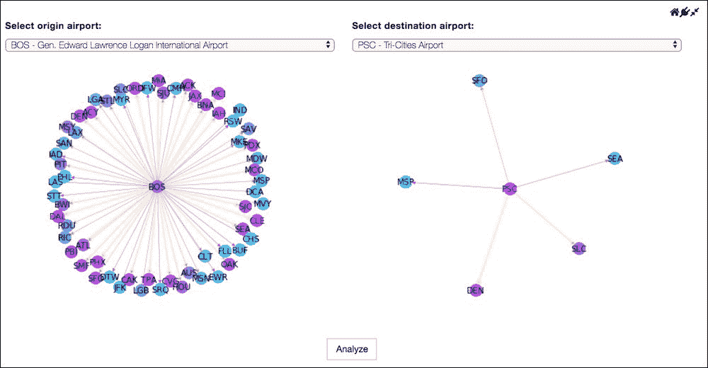

选择两个机场的欢迎屏幕

现在让我们看一下`compute_path_screen()`路线的实现，该路线负责显示所有机场的 Mapbox 地图和基于所选中心度索引的最短路径作为一层，这是叠加在整个地图上的额外可视化 。

以下代码显示了其实现：

```py
[[USFlightsAnalysis]]
@route(org_airport="*", dest_airport="*")
def compute_path_screen(self, org_airport, dest_airport):
    return """
<div class="container-fluid">
    <div class="form-group col-sm-2" style="padding-right:10px;">
        <div><strong>Centrality Indices</strong></div>
 
        <div class="rendererOpt checkbox checkbox-primary">
            <input type="checkbox"
                   pd_refresh="flight_map{{prefix}}"
pd_script="self.compute_toggle_centrality_layer('{{org_airport}}', '{{dest_airport}}', '{{centrality}}')">
            <label>{{centrality}}</label>
        </div>
 
    </div>
    <div class="form-group col-sm-10">
        <h1 class="rendererOpt">Select a centrality index to show the shortest flight path
        </h1>
        <div id="flight_map{{prefix}}" pd_entity="self.airports_centrality" pd_render_onload>
            <pd_options>
 {
 "keyFields": "LATITUDE,LONGITUDE",
 "valueFields": "AIRPORT,DEGREE,PAGE_RANK,ELAPSED_TIME,CLOSENESS",
 "custombasecolorsecondary": "#fffb00",
 "colorrampname": "Light to Dark Red",
 "handlerId": "mapView",
 "quantiles": "0.0,0.1,0.2,0.3,0.4,0.5,0.6,0.7,0.8,0.9,1.0",
 "kind": "choropleth",
 "rowCount": "1000",
 "numbins": "5",
 "mapboxtoken": "pk.eyJ1IjoibWFwYm94IiwiYSI6ImNpejY4M29iazA2Z2gycXA4N2pmbDZmangifQ.-g_vE53SD2WrJ6tFX7QHmA",
 "custombasecolor": "#ffffff"
 }
            </pd_options>
        </div>
    </div>
</div>
"""
```

### 注意

[您可以在此处找到代码文件](https://github.com/DTAIEB/Thoughtful-Data-Science/blob/master/chapter%209/sampleCode21.py)。

此屏幕的中心`<div>`元素是 Mapbox 地图，默认情况下显示所有机场的 Mapbox 地图。 如上面代码中的所示，`<pd_options>`子元素直接从相应的单元元数据中获取，我们在第 1 部分中配置了映射。

在左侧，我们使用`centrality_indices`变量上的 Jinja2 ``循环，生成了一组与每个中心度索引相对应的复选框。 我们在`USFlightsAnalysis` PixieApp 的`setup()`方法中初始化此变量，该方法保证在 PixieApp 启动时会被调用。 此变量是[`OrderedDict`](https://docs.python.org/3/library/collections.html#collections.OrderedDict)，其键为中心索引，值为在 Mapbox 渲染中将使用的配色方案：

```py
[[USFlightsAnalysis]]
def setup(self):
   self.centrality_indices = OrderedDict([
      ("ELAPSED_TIME","rgba(256,0,0,0.65)"),
      ("DEGREE", "rgba(0,256,0,0.65)"),
      ("PAGE_RANK", "rgba(0,0,256,0.65)"),
      ("CLOSENESS", "rgba(128,0,128,0.65)")
  ])
```

### 注意

[您可以在此处找到代码文件](https://github.com/DTAIEB/Thoughtful-Data-Science/blob/master/chapter%209/sampleCode22.py)。

以下输出显示未选择中心性索引的分析屏幕：

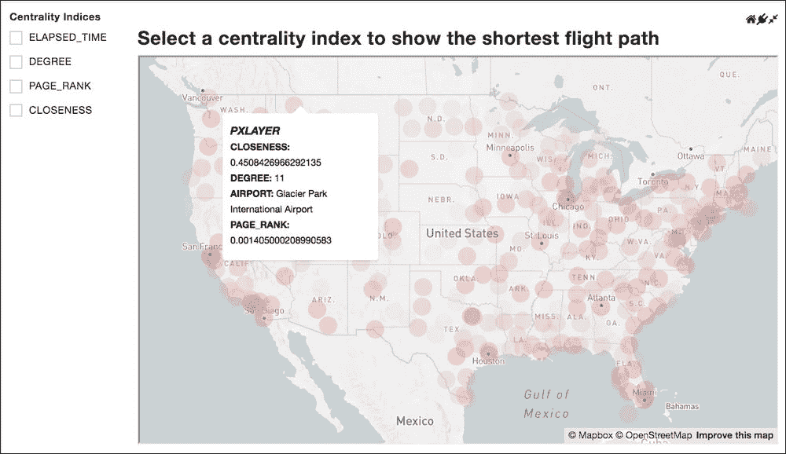

未选择中心指数的分析屏幕

现在我们到达步骤，用户选择中心度索引以触发最短路径搜索。 每个复选框都有一个`pd_script`属性，该属性调用`compute_toggle_centrality_layer()`方法。 此方法负责使用通过调用第 1 部分中讨论的`compute_weight()`方法生成的`weight`参数调用 NetworkX `dijkastra_path()`方法。 此方法返回一个数组，其中每个机场构成最短路径。 然后使用此路径创建一个 JSON 对象，该对象包含 GeoJSON 有效载荷，作为要在地图上显示的一组线。

在这一点上，值得暂停讨论什么是层。 **层**是使用 [GeoJSON 格式](http://geojson.org)定义的，我们在第 5 章，“最佳做法和 PixieDust 高级内容”中对此进行了简要讨论。 提醒一下，GeoJSON 有效负载是具有特定架构的 JSON 对象，该架构除其他外还包含`geometry`元素，该元素定义了要绘制的对象的形状。

例如，我们可以使用`LineString`类型定义一条直线，并为直线的两端定义一个经度和纬度坐标数组：

```py
{
    "geometry": {
        "type": "LineString",
        "coordinates": [
            [-93.21692, 44.88055],
 [-119.11903000000001, 46.26468]
        ]
    },
    "type": "Feature",
    "properties": {}
}
```

### 注意

[您可以在此处找到代码文件](https://github.com/DTAIEB/Thoughtful-Data-Science/blob/master/chapter%209/sampleCode23.json)。

假设我们可以从最短的路径生成此 GeoJSON 有效负载，我们可能想知道如何将其传递给 PixieDust Mapbox 渲染器，以便可以显示它。 好了，机制很简单：Mapbox 渲染器将对主机 PixieApp 进行内省，以查找符合特定格式的任何类变量，然后使用它来生成要显示的 Mapbox 图层。 为了帮助遵循此机制，我们使用了我们先前简要介绍的`MapboxBase`实用程序类。 此类具有`get_layer_index()`方法，该方法采用唯一名称（我们使用`centrality`索引）作为参数并返回其索引。 它还需要一个额外的可选参数，以在尚不存在的情况下创建该图层。 然后，我们调用`toggleLayer()`方法，将图层索引作为参数传递以打开和关闭图层。

以下代码显示`compute_toggle_centrality_layer()`方法的实现，该方法实现了上述步骤：

```py
[[USFlightsAnalysis]]
def compute_toggle_centrality_layer(self, org_airport, dest_airport, centrality):
    cache.clear()
    cities = nx.dijkstra_path(flight_graph, org_airport, dest_airport, weight=compute_weight(centrality))
    layer_index = self.get_layer_index(centrality, {
        "name": centrality,
        "geojson": {
            "type": "FeatureCollection",
            "features":[
                {"type":"Feature",
                 "properties":{"route":"{} to {}".format(cities[i], cities[i+1])},
                 "geometry":{
                     "type":"LineString",
                     "coordinates":[
                         self.get_airport_location(cities[i]),
 self.get_airport_location(cities[i+1])
                     ]
                 }
                } for i in range(len(cities) - 1)
            ]
        },
        "paint":{
 "line-width": 8,
 "line-color": self.centrality_indices[centrality]
 }
    })
 self.toggleLayer(layer_index)

```

### 注意

[您可以在此处找到代码文件](https://github.com/DTAIEB/Thoughtful-Data-Science/blob/master/chapter%209/sampleCode24.py)。

使用`get_airport_location()`方法计算几何对象中的坐标，该方法查询我们在第 1 部分中创建的`airports_centrality DataFrame`，如以下代码所示：

```py
[[USFlightsAnalysis]]
def get_airport_location(self, airport_code):
    row = airports_centrality.loc[airports["IATA_CODE"] == airport_code]
    if row is not None:
        return [row["LONGITUDE"].values[0], row["LATITUDE"].values[0]]
    return None
```

### 注意

[您可以在此处找到代码文件](https://github.com/DTAIEB/Thoughtful-Data-Science/blob/master/chapter%209/sampleCode25.py)。

传递给`get_layer_index()`方法的图层对象具有以下属性：

*   `name`：唯一标识图层的字符串。
*   `geojson`：定义图层的特征和几何的 GeoJSON 对象。
*   `url`：仅当不存在`geojson`时使用。 指向返回 GeoJSON 有效负载的 URL。
*   `paint`：特定于 Mapbox 规范的可选额外属性，用于定义图层数据的样式，例如颜色，宽度和不透明度。
*   `layout`：特定于 Mapbox 规范的可选附加属性，用于定义图层数据的绘制方式，例如填充，可见性和符号。

### 注意

[**注意**：您可以在此处找到有关 Mapbox 布局和绘画属性的更多信息](https://www.mapbox.com/mapbox-gl-js/style-spec/#layers)。

在前面的代码中，我们指定了额外的`paint`属性来配置`line-width`和`line-color`，这些属性是从`setup()`方法中定义的`centrality_indices` JSON 对象获取的。

以下输出显示了使用`ELAPSED_TIME`（红色）和`DEGREE`（绿色）中心指数从`BOS`到`PSC`的最短飞行路线：


使用`ELAPSED_TIME`和`DEGREE`中心指数显示从 BOS 到 PSC 的最短路径

在本节中，我们构建了一个 PixieApp，该应用使用 PixieDust Mapbox 渲染器提供两个机场之间最短路径的可视化。 我们已经展示了如何使用`MapboxBase`实用工具类创建一个新图层，以在地图上添加更多信息。

### 注意

[您可以在此处找到完整的第二部分的笔记本](https://github.com/DTAIEB/Thoughtful-Data-Science/blob/master/chapter%209/USFlightsAnalysis/US%20Flight%20data%20analysis%20-%20Part%202.ipynb)。

在下一部分中，我们将添加与航班延误和相关航空公司有关的其他数据探索。

# 第 3 部分——向`USFlightsAnalysis` PixieApp 添加数据浏览

在本节中，我们想扩展`USFlightsAnalysis` PixieApp 的航线分析屏幕，以添加两个图表，以显示从所选始发机场起飞的每家航空公司的历史到达延迟：一个表示所有从始发机场起飞的航班，另一个表示与机场无关的所有航班。 这将为我们提供一种在视觉上比较特定机场的延误是好于还是差于其他机场的方法。

我们首先实现一种选择给定航空公司的航班的方法。 我们还添加了一个可选的机场参数，可用于控制我们是包含所有航班还是仅包含源自该机场的航班。 返回的`DataFrame`应该具有两列：`DATE`和`ARRIVAL_DELAY`。

以下代码显示了此方法的实现：

```py
def compute_delay_airline_df(airline, org_airport=None):
    # create a mask for selecting the data
    mask = (flights["AIRLINE"] == airline)
    if org_airport is not None:
        # Add the org_airport to the mask
        mask = mask & (flights["ORIGIN_AIRPORT"] == org_airport)
    # Apply the mask to the Pandas dataframe
    df = flights[mask]
    # Convert the YEAR, MONTH and DAY column into a DateTime
    df["DATE"] = pd.to_datetime(flights[['YEAR','MONTH', 'DAY']])
    # Select only the columns that we need
    return df[["DATE", "ARRIVAL_DELAY"]]
```

### 注意

[您可以在此处找到代码文件](https://github.com/DTAIEB/Thoughtful-Data-Science/blob/master/chapter%209/sampleCode26.py)。

我们可以通过将其与来自波士顿的达美航班一起使用来测试上述代码。 然后我们可以调用 PixieDust `display()`方法来创建折线图，该折线图将在 PixieApp 中使用：

```py
bos_delay = compute_delay_airline_df("DL", "BOS")
display(bos_delay)
```

在 PixieDust 输出中，我们选择**折线图**菜单，并配置选项对话框，如下所示：

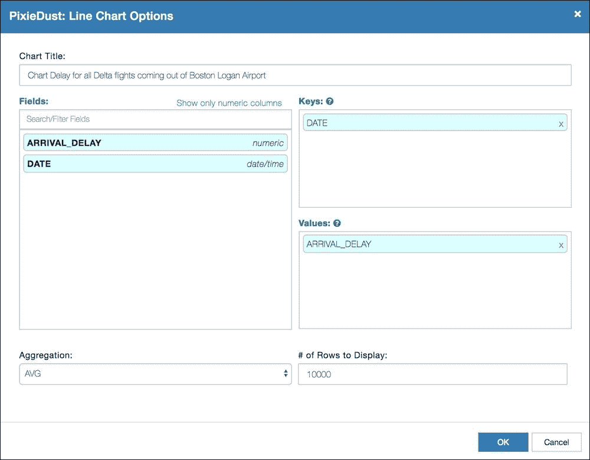

用于生成达美航空从波士顿起飞的到达延迟折线图的选项对话框

当单击 **OK** 时，我们得到以下图表：

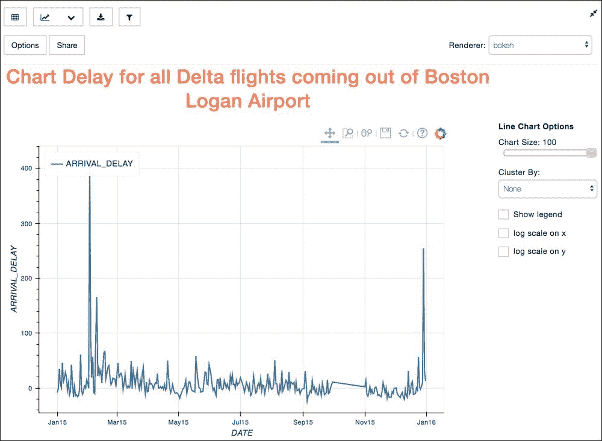

波士顿起飞的所有达美航班的图表延误

当我们要在 PixieApp 中使用此图表时，最好从**编辑单元元数据**对话框中复制 JSON 配置：

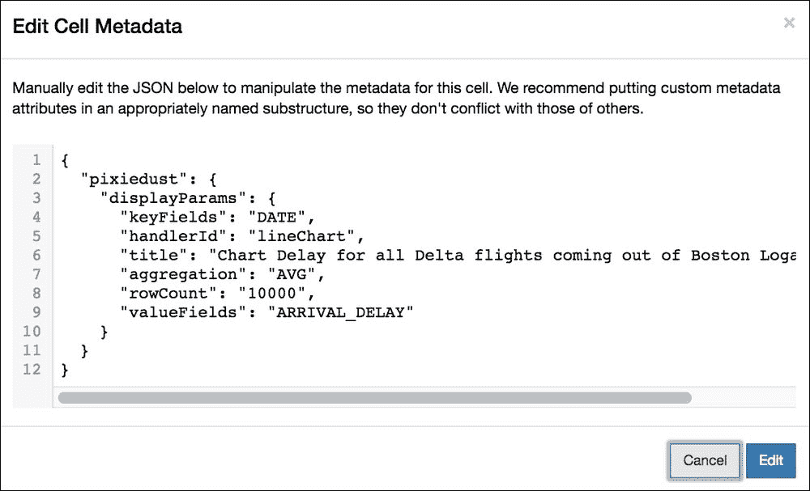

需要为 PixieApp 复制的延迟图的 PixieDust `display()`配置

现在我们知道如何生成延迟图，我们可以开始设计 PixieApp。 我们首先更改主屏幕的布局，以使用`TemplateTabbedApp`助手类，该类免费提供给我们标签式布局。 整体分析屏幕现在由`RouteAnalysisApp`子 PixieApp 驱动，它包含两个选项卡：与`SearchShortestRouteApp`子 PixieApp 关联的`Search Shortest Route`选项卡和与`AirlinesApp`子 PixieApp 关联的`Explore Airlines`选项卡。

下图提供了新布局中涉及的所有类的高层流程：

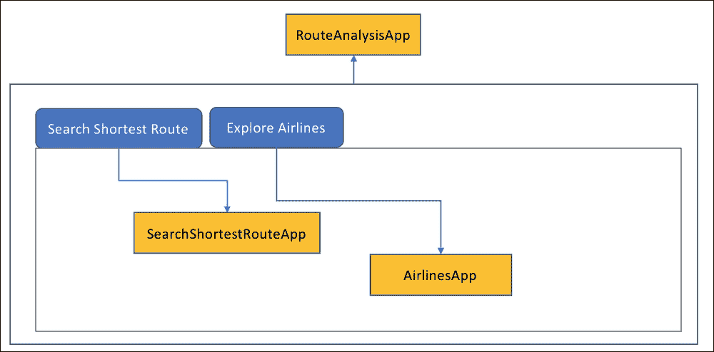

新的选项卡式布局类图

使用`TemplateTabbedApp`的`RouteAnalysisApp`实现非常简单，如以下代码所示：

```py
from pixiedust.apps.template import TemplateTabbedApp

@PixieApp
class RouteAnalysisApp(TemplateTabbedApp):
    def setup(self):
        self.apps = [
            {"title": "Search Shortest Route",
             "app_class": "SearchShortestRouteApp"},
            {"title": "Explore Airlines",
             "app_class": "AirlinesApp"}
        ]

```

### 注意

[您可以在此处找到代码文件](https://github.com/DTAIEB/Thoughtful-Data-Science/blob/master/chapter%209/sampleCode27.py)。

`SearchShortestRouteApp`子 PixieApp 基本上是我们在第 2 部分中创建的主要 PixieApp 类的副本。 唯一的区别是，它是`RouteAnalysisApp`的子 PixieApp，它本身又是`USFlightsAnalysis`主 PixieApp 的子 PixieApp。 因此，我们需要一种机制将始发和目的地机场传递到各个子 PixieApps。 为此，我们在实例化`RouteAnalysisApp`子 PixieApp 时使用`pd_options`属性。

在`USFlightAnalysis`类中，我们更改`analyze_route`方法以返回触发`RouteAnalysisApp`的简单`<div>`元素。 我们还为`org_airport`和`dest_airport`添加了`pd_options`属性，如以下代码所示：

```py
[[USFlightsAnalysis]]
@route(org_airport="*", dest_airport="*")
def analyze_route(self, org_airport, dest_airport):
    return """
<div pd_app="RouteAnalysisApp"
pd_options="org_airport={{org_airport}};dest_airport={{dest_airport}}"
     pd_render_onload>
</div>
        """
```

### 注意

[您可以在此处找到代码文件](https://github.com/DTAIEB/Thoughtful-Data-Science/blob/master/chapter%209/sampleCode28.py)。

相反，在`SearchShortestRouteApp`子 PixieApp 的`setup()`方法中，我们从`parent_pixieapp`的选项字典中读取的`org_airport`和`dest_airport`值，如以下代码所示 ：

```py
[[SearchShortestRouteApp]]
from pixiedust.display.app import *
from pixiedust.apps.mapboxBase import MapboxBase
from collections import OrderedDict

@PixieApp
class SearchShortestRouteApp(MapboxBase):
    def setup(self):
 self.org_airport = self.parent_pixieapp.options.get("org_airport")
 self.dest_airport = self.parent_pixieapp.options.get("dest_airport")
        self.centrality_indices = OrderedDict([
            ("ELAPSED_TIME","rgba(256,0,0,0.65)"),
            ("DEGREE", "rgba(0,256,0,0.65)"),
            ("PAGE_RANK", "rgba(0,0,256,0.65)"),
            ("CLOSENESS", "rgba(128,0,128,0.65)")
        ])
        ...
```

### 注意

[您可以在此处找到代码文件](https://github.com/DTAIEB/Thoughtful-Data-Science/blob/master/chapter%209/sampleCode29.py)。

**注意**：为简洁起见，省略了`SearchShortestRouteApp`的其余实现，因为它与第 2 部分完全相同。 要访问该实现，请参阅完整的第 3 部分笔记本。

最后要实现的 PixieApp 类是`AirlinesApp`，它将显示所有延迟图。 与`SearchShortestRouteApp`相似，我们从`parent_pixieapp`选项字典中存储`org_airport`和`dest_airport`。 我们还计算了中所有航班超出给定`org_airport`的航空公司的元组列表（代码和名称）。 为此，我们在`AIRLINE`列上使用 Pandas `groupby()`方法并获取索引值的列表，如以下代码所示：

```py
[[AirlinesApp]]
@PixieApp
class AirlinesApp():
    def setup(self):
        self.org_airport = self.parent_pixieapp.options.get("org_airport")
 self.dest_airport = self.parent_pixieapp.options.get("dest_airport")
        self.airlines = flights[flights["ORIGIN_AIRPORT"] == self.org_airport].groupby("AIRLINE").size().index.values.tolist()
        self.airlines = [(a, airlines.loc[airlines["IATA_CODE"] == a]["AIRLINE"].values[0]) for a in self.airlines]
```

### 注意

[您可以在此处找到代码文件](https://github.com/DTAIEB/Thoughtful-Data-Science/blob/master/chapter%209/sampleCode30.py)。

在`AirlinesApp`的主屏幕中，我们使用 Jinja2 ``循环为每个航空公司生成一组行。 在每一行中，我们添加两个`<div>`元素，这些元素将保存给定航空公司的延误折线图：一个元素用于始发机场的航班，另一个元素用于该航空公司的所有航班。 每个`<div>`元素都有一个`pd_options attribute,`，其中`org_airport`和`dest_airport`作为状态属性，从而触发`delay_airline_screen`路由。 我们还添加了`delay_org_airport`布尔状态属性，以表示要显示的延迟图类型。 为了确保立即显示`<div>`元素，我们还添加了`pd_render_onload`属性。

以下代码显示了`AirlinesApp`默认路由的实现：

```py
[[AirlinesApp]]
@route()
    def main_screen(self):
        return """
<div class="container-fluid">
    
    <div class="row" style="max-e">
        <h1 style="color:red">{{airline_name}}</h1>
        <div class="col-sm-6">
            <div pd_render_onload pd_options="delay_org_airport=true;airline_code={{airline_code}};airline_name={{airline_name}}"></div>
        </div>
        <div class="col-sm-6">
            <div pd_render_onload pd_options="delay_org_airport=false;airline_code={{airline_code}};airline_name={{airline_name}}"></div>
        </div>
    </div>
    
</div>
        """
```

### 注意

[您可以在此处找到代码文件](https://github.com/DTAIEB/Thoughtful-Data-Science/blob/master/chapter%209/sampleCode31.py)。

`delay_airline_screen()`路由具有三个参数：

*   `delay_org_airport`：如果仅希望从始发机场起飞的航班，则为`true`；如果我们希望给定航空公司的所有航班，则为`false`。 我们使用此标志来构建掩码，以从飞行数据帧中过滤数据。
*   `airline_code`：给定航空公司的 IATA 代码。
*   `airline_name`：航空公司的全名。 在 Jinja2 模板中构建 UI 时，将使用它。

在`delay_airline_screen()`方法的主体中，我们还计算了`average_delay`局部变量中所选数据的平均延迟。 提醒一下，为了在 Jinja2 模板中使用此变量，我们使用`@templateArgs`装饰器，该装饰器会自动使所有局部变量在 Jinja2 模板中可用。

包含图表的`<div>`元素具有`pd_entity`属性，该属性使用我们在本节开头创建的`compute_delay_airline_df()`方法。 但是，由于参数已更改，因此我们需要将该方法重写为类的成员：`org_airport`现在是类变量，`delay_org_airport`现在是字符串布尔值。 我们还添加了`<pd_options>`子元素和 PixieDust `display()` JSON 配置，该配置是从**编辑单元元数据**对话框复制的。

以下代码显示了`delay_airline_screen()`路由的实现：

```py
[[AirlinesApp]]
@route(delay_org_airport="*",airline_code="*", airline_name="*")
    @templateArgs
    def delay_airline_screen(self, delay_org_airport, airline_code, airline_name):
        mask = (flights["AIRLINE"] == airline_code)
        if delay_org_airport == "true":
            mask = mask & (flights["ORIGIN_AIRPORT"] == self.org_airport)
        average_delay = round(flights[mask]["ARRIVAL_DELAY"].mean(), 2)
        return """

<h4>Delay chart for all flights out of {{this.org_airport}}</h4>

<h4>Delay chart for all flights</h4>

<h4 style="margin-top:5px">Average delay: {{average_delay}} minutes</h4>
<div pd_render_onload pd_entity="compute_delay_airline_df('{{airline_code}}', '{{delay_org_airport}}')">
    <pd_options>
    {
 "keyFields": "DATE",
 "handlerId": "lineChart",
 "valueFields": "ARRIVAL_DELAY",
 "noChartCache": "true"
 }
    </pd_options>
</div>
        """
```

### 注意

[您可以在此处找到代码文件](https://github.com/DTAIEB/Thoughtful-Data-Science/blob/master/chapter%209/sampleCode32.py)。

`compute_delay_airline_df()`方法具有两个参数：对应于 IATA 代码的航空公司和`delay_org_airport`字符串布尔值。 我们已经介绍了此方法的实现，但此处提供了新的改编代码：

```py
[[AirlinesApp]]
def compute_delay_airline_df(self, airline, delay_org_airport):
        mask = (flights["AIRLINE"] == airline)
        if delay_org_airport == "true":
            mask = mask & (flights["ORIGIN_AIRPORT"] == self.org_airport)
        df = flights[mask]
        df["DATE"] = pd.to_datetime(flights[['YEAR','MONTH', 'DAY']])
        return df[["DATE", "ARRIVAL_DELAY"]]

```

### 注意

[您可以在此处找到代码文件](https://github.com/DTAIEB/Thoughtful-Data-Science/blob/master/chapter%209/sampleCode33.py)。

在分别以 BOS 和 PSC 作为始发地和目的地机场的情况下运行`USFlightsAnalysis` PixieApp，我们单击**探索航空公司**标签。

结果显示在以下屏幕截图中：

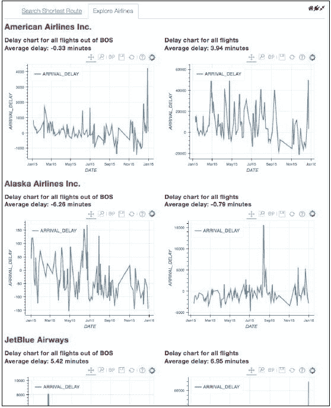

所有从波士顿机场提供服务的航空公司的延线图

在本节中，我们将提供另一个示例，说明如何使用 PixieApp 编程模型来构建功能强大的仪表板，这些仪表板可为笔记本中开发的分析结果提供可视化和见解。

### 注意

[可在以下位置找到`USFlightsAnalysis` PixieApp 的第 3 部分的完整笔记本](https://github.com/DTAIEB/Thoughtful-Data-Science/blob/master/chapter%209/USFlightsAnalysis/US%20Flight%20data%20analysis%20-%20Part%203.ipynb)。

在下一节中，我们将建立一个 ARIMA 模型，尝试预测航班延误。

# 第 4 部分——创建 ARIMA 模型来预测航班延误

在第 8 章，“金融时间序列分析和预测”中，我们使用时间序列分析建立了预测金融股票的预测模型。 实际上，我们可以在航班延误中使用相同的技术，因为毕竟我们还在这里处理时间序列，因此在本节中，我们将遵循完全相同的步骤。 对于每个目的地机场和可选航空公司，我们将构建一个 Pandas `DataFrame`，其中包含匹配的航班信息。

### 注意

**注意**：我们将再次使用`statsmodels`库。 如果尚未安装，请确保进行安装，有关更多信息，请参考第 8 章，“金融时间序列分析和预测”。

例如，让我们集中研究以`BOS`为目的地的所有达美航空（`DL`）航班：

```py
df = flights[(flights["AIRLINE"] == "DL") & (flights["ORIGIN_AIRPORT"] == "BOS")]
```

使用`ARRIVAL_DELAY`列作为时间序列的值，我们绘制 ACF 和 PACF 图以识别趋势和季节性，如以下代码所示：

```py
import statsmodels.tsa.api as smt
smt.graphics.plot_acf(df['ARRIVAL_DELAY'], lags=100)
plt.show()
```

### 注意

[您可以在此处找到代码文件](https://github.com/DTAIEB/Thoughtful-Data-Science/blob/master/chapter%209/sampleCode34.py)。

结果显示在以下屏幕截图中：


`ARRIVAL_DELAY`数据的自相关函数

同样，我们还使用以下代码绘制部分自相关函数：

```py
import statsmodels.tsa.api as smt
smt.graphics.plot_pacf(df['ARRIVAL_DELAY'], lags=50)
plt.show()
```

### 注意

[您可以在此处找到代码文件](https://github.com/DTAIEB/Thoughtful-Data-Science/blob/master/chapter%209/sampleCode35.py)。

结果显示在这里：


`ARRIVAL_DELAY`数据的部分自相关

从前面的图表中，我们可以假设数据具有趋势和/或季节性，并且不稳定。 使用我们在第 8 章，“金融时间序列分析和预测”中介绍的对数差异技术，对序列进行转换并使用 PixieDust `display()`方法将其可视化，如以下代码所示：

### 注意

**注意**：我们还确保通过先调用`replace()`方法将`np.inf`和`-np.inf`替换为`np.nan`，然后再调用`dropna()`来删除具有 NA 和无穷大值的行。 方法删除具有`np.nan`值的所有行。

```py
import numpy as np
train_set, test_set = df[:-14], df[-14:]
train_set.index = train_set["DEPARTURE_TIME"]
test_set.index = test_set["DEPARTURE_TIME"]
logdf = np.log(train_set['ARRIVAL_DELAY'])
logdf.index = train_set['DEPARTURE_TIME']
logdf_diff = pd.DataFrame(logdf - logdf.shift()).reset_index()
logdf_diff.replace([np.inf, -np.inf], np.nan, inplace=True)
logdf_diff.dropna(inplace=True)
display(logdf_diff)
```

### 注意

[您可以在此处找到代码文件](https://github.com/DTAIEB/Thoughtful-Data-Science/blob/master/chapter%209/sampleCode36.py)。

以下屏幕截图显示了 PixieDust 选项对话框：

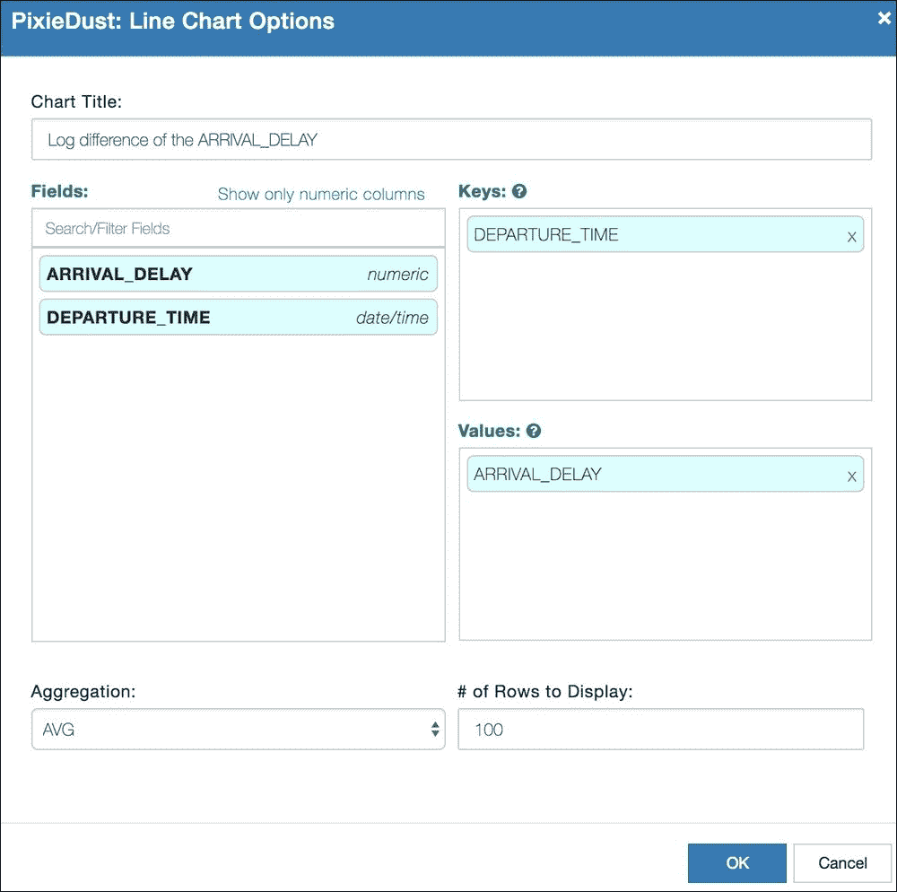

用于`ARRIVAL_DELAY`数据的日志差异的选项对话框

单击 **OK** 后，我们得到以下结果：

### 注意

**注意**：运行前面的代码时，您可能无法获得与以下屏幕快照完全相同的图表。 这是因为我们在选项对话框中将要显示的**行数**配置为`100`，这意味着 PixieDust 在创建图表之前将采取大小为 100 的样本。

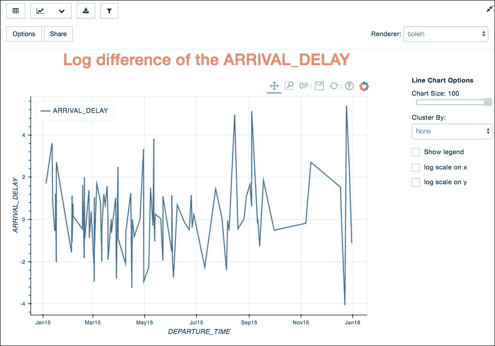

`ARRIVAL_DELAY`数据的对数差异折线图

前面的图表看起来很平稳； 我们可以通过在对数差异上再次绘制 ACF 和 PACF 来加强这一假设，如以下代码所示：

```py
smt.graphics.plot_acf(logdf_diff["ARRIVAL_DELAY"], lags=100)
plt.show()
```

### 注意

[您可以在此处找到代码文件](https://github.com/DTAIEB/Thoughtful-Data-Science/blob/master/chapter%209/sampleCode37.py)。

结果如下：

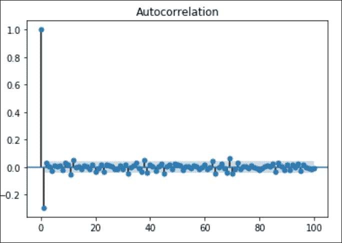

ACF 图表以获取`ARRIVAL_DELAY`数据的对数差异

在以下代码中，我们对 PACF 执行相同的操作：

```py
smt.graphics.plot_pacf(logdf_diff["ARRIVAL_DELAY"], lags=100)
plt.show()
```

### 注意

[您可以在此处找到代码文件](https://github.com/DTAIEB/Thoughtful-Data-Science/blob/master/chapter%209/sampleCode38.py)。

结果如下：


PARI 图表以获取`ARRIVAL_DELAY`数据的对数差异

作为第 8 章，“金融时间序列分析和预测”的提醒，ARIMA 模型由三个阶组成：`p`和`d`和`q`。 从前面的两个图表中，我们可以推断出要构建的 ARIMA 模型的这些顺序：

*   **阶数`p`为 1 的自回归**：对应于 ACF 第一次越过有效水平
*   **阶数`d`为 1 的集成**：我们必须做一次对数差异
*   **阶数`q`为 1 的移动平均**：对应于 PACF 首次超过有效水平

基于这些假设，我们可以使用`statsmodels`包构建 ARIMA 模型，并获取有关其残留误差的信息，如以下代码所示：

```py
from statsmodels.tsa.arima_model import ARIMA

import warnings
with warnings.catch_warnings():
    warnings.simplefilter("ignore")
    arima_model_class = ARIMA(train_set['ARRIVAL_DELAY'],
                              dates=train_set['DEPARTURE_TIME'],
                              order=(1,1,1))
    arima_model = arima_model_class.fit(disp=0)
    print(arima_model.resid.describe())
```

### 注意

[您可以在此处找到代码文件](https://github.com/DTAIEB/Thoughtful-Data-Science/blob/master/chapter%209/sampleCode39.py)。

结果如下所示：

```py
count    13882.000000
mean         0.003116
std         48.932043
min       -235.439689
25%        -17.446822
50%         -5.902274
75%          6.746263
max       1035.104295
dtype: float64
```

如我们所见，的平均误差仅为 0.003，这非常好，因此我们准备使用`train_set`中的值运行模型，并可视化与实际值的差异。

以下代码使用 ARIMA `plot_predict()`方法创建图表：

```py
def plot_predict(model, dates_series, num_observations):
    fig,ax = plt.subplots(figsize = (12,8))
    model.plot_predict(
        start = dates_series[len(dates_series)-num_observations],
        end = dates_series[len(dates_series)-1],
        ax = ax
    )
    plt.show()
plot_predict(arima_model, train_set['DEPARTURE_TIME'], 100)
```

### 注意

[您可以在此处找到代码文件](https://github.com/DTAIEB/Thoughtful-Data-Science/blob/master/chapter%209/sampleCode40.py)。

结果如下所示：

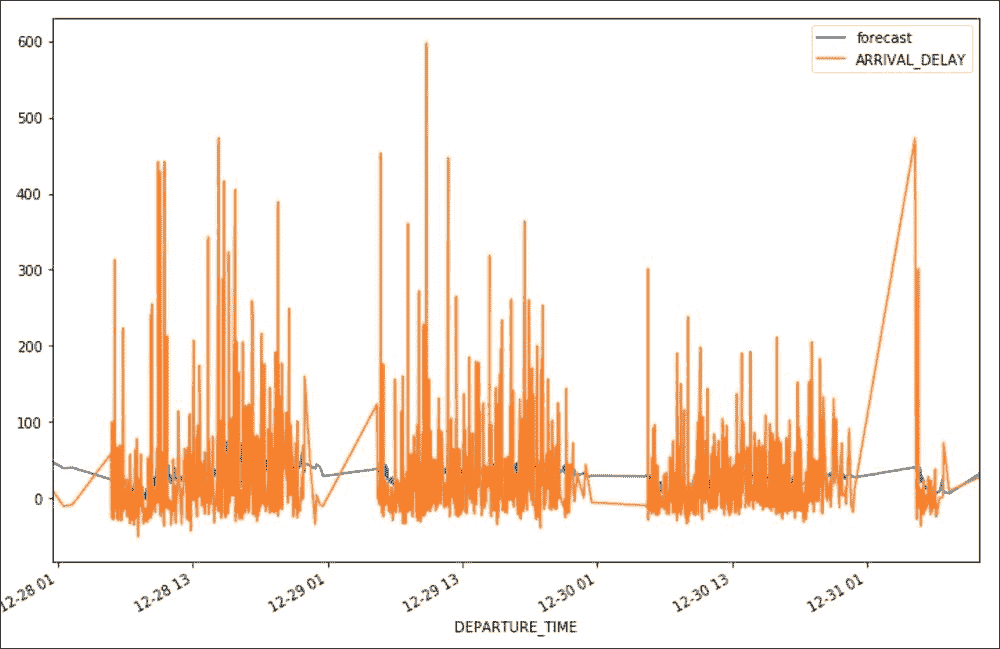

预测与实际

在上图中，我们可以清楚地看到预测线比实际值平滑得多。 该是有道理的，因为实际上，总是存在意想不到的延迟原因，这些延迟可以被视为异常值，因此很难建模。

我们仍然需要使用`test_set`使用模型尚未看到的数据来验证模型。 以下代码创建一个`compute_test_set_predictions()`方法，以使用 PixieDust `display()`方法比较预测数据和测试数据并可视化结果：

```py
def compute_test_set_predictions(train_set, test_set):
    with warnings.catch_warnings():
        warnings.simplefilter("ignore")
        history = train_set['ARRIVAL_DELAY'].values
        forecast = np.array([])
        for t in range(len(test_set)):
            prediction = ARIMA(history, order=(1,1,0)).fit(disp=0).forecast()
            history = np.append(history, test_set['ARRIVAL_DELAY'].iloc[t])
            forecast = np.append(forecast, prediction[0])
        return pd.DataFrame(
          {"forecast": forecast,
 "test": test_set['ARRIVAL_DELAY'],
 "Date": pd.date_range(start=test_set['DEPARTURE_TIME'].iloc[len(test_set)-1], periods = len(test_set))
 }
        )

results = compute_test_set_predictions(train_set, test_set)
display(results)
```

### 注意

[您可以在此处找到代码文件](https://github.com/DTAIEB/Thoughtful-Data-Science/blob/master/chapter%209/sampleCode41.py)。

PixieDust 选项对话框如下所示：

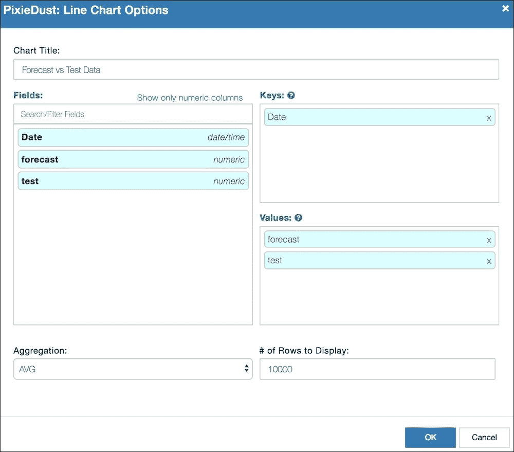

预测与测试比较折线图的“选项”对话框

单击 **OK** 后，我们得到以下结果：


预测与测试数据折线图

现在，通过在`RouteAnalysisApp`主屏幕上添加一个名为`Flight Delay Prediction`的第三个选项卡，我们可以将该模型集成到`USFlightsAnalysis` PixieApp 中。 此选项卡将由一个名为`PredictDelayApp`的新子 PixieApp 驱动，它将使用户选择使用 Dijkstra 最短路径算法并以`DEGREE`作为中心度指标计算出的最短路径的航段。 用户还可以选择一家航空公司，在这种情况下，培训数据将仅限于所选航空公司运营的航班。

在以下代码中，我们创建`PredictDelayApp`子 PixieApp 并实现`setup()`方法，该方法为选定的始发和目的地机场计算 Dijkstra 最短路径：

```py
[[PredictDelayApp]]
import warnings
import numpy as np
from statsmodels.tsa.arima_model import ARIMA

@PixieApp
class PredictDelayApp():
    def setup(self):
        self.org_airport = self.parent_pixieapp.options.get("org_airport")
        self.dest_airport = self.parent_pixieapp.options.get("dest_airport")
        self.airlines = flights[flights["ORIGIN_AIRPORT"] == self.org_airport].groupby("AIRLINE").size().index.values.tolist()
        self.airlines = [(a, airlines.loc[airlines["IATA_CODE"] == a]["AIRLINE"].values[0]) for a in self.airlines]
        path = nx.dijkstra_path(flight_graph, self.org_airport, self.dest_airport, weight=compute_weight("DEGREE"))
        self.paths = [(path[i], path[i+1]) for i in range(len(path) - 1)]
```

在`PredictDelayApp`的默认路线中，我们使用 Jinja2 ``循环来构建两个下拉框，以显示航班航段和航空公司，如以下代码所示：

```py
[[PredictDelayApp]]
@route()
    def main_screen(self):
        return """
<div class="container-fluid">
    <div class="row">
        <div class="col-sm-6">
            <div class="rendererOpt" style="font-weight:bold">
                Select a flight segment:
            </div>
            <div>
                <select id="segment{{prefix}}" pd_refresh="prediction_graph{{prefix}}">
                    <option value="" selected></option>
                    
 <option value="{{start}}:{{end}}">{{start}} -> {{end}}</option>
 
                </select>
            </div>
        </div>
        <div class="col-sm-6">
            <div class="rendererOpt" style="font-weight:bold">
                Select an airline:
            </div>
            <div>
                <select id="airline{{prefix}}" pd_refresh="prediction_graph{{prefix}}">
                    <option value="" selected></option>
                    
 <option value="{{airline_code}}">{{airline_name}}</option>
 
                </select>
            </div>
        </div>
    </div>
    <div class="row">
        <div class="col-sm-12">
            <div id="prediction_graph{{prefix}}"
                pd_options="flight_segment=$val(segment{{prefix}});airline=$val(airline{{prefix}})">
            </div>
        </div>
    </div>
</div>
        """
```

### 注意

[您可以在此处找到代码文件](https://github.com/DTAIEB/Thoughtful-Data-Science/blob/master/chapter%209/sampleCode42.py)。

这两个下拉菜单具有`pd_refresh`属性，该属性指向 ID 为`prediction_graph{{prefix}}`的`<div>`元素。 触发后，此`<div>`元素使用`flight_segment`和`airline`状态属性调用`predict_screen()`路由。

在`predict_screen()`路线中，我们使用`flight_segment`和`airline`参数创建训练数据集，构建一个可预测模型的 ARIMA 模型，并在折线图中可视化结果，以比较预测值和实际值。

### 注意

时间序列预测模型仅限于接近实际数据的预测，并且由于我们只有 2015 年的数据，因此我们无法真正使用此模型来预测更多最新数据。 当然，在生产应用中，假定我们拥有最新的航班数据，因此这不会成为问题。

以下代码显示了`predict_screen()`路由的实现：

```py
[[PredictDelayApp]]
@route(flight_segment="*", airline="*")
 @captureOutput
    def predict_screen(self, flight_segment, airline):
        if flight_segment is None or flight_segment == "":
            return "<div>Please select a flight segment</div>"
 airport = flight_segment.split(":")[1]
 mask = (flights["DESTINATION_AIRPORT"] == airport)
        if airline is not None and airline != "":
 mask = mask & (flights["AIRLINE"] == airline)
        df = flights[mask]
        df.index = df["DEPARTURE_TIME"]
        df = df.tail(50000)
 df = df[~df.index.duplicated(keep='first')]
        with warnings.catch_warnings():
            warnings.simplefilter("ignore")
            arima_model_class = ARIMA(df["ARRIVAL_DELAY"], dates=df['DEPARTURE_TIME'], order=(1,1,1))
            arima_model = arima_model_class.fit(disp=0)
            fig, ax = plt.subplots(figsize = (12,8))
            num_observations = 100
            date_series = df["DEPARTURE_TIME"]
 arima_model.plot_predict(
 start = str(date_series[len(date_series)-num_observations]),
 end = str(date_series[len(date_series)-1]),
 ax = ax
 )
            plt.show()
```

### 注意

[您可以在此处找到代码文件](https://github.com/DTAIEB/Thoughtful-Data-Science/blob/master/chapter%209/sampleCode43.py)。

在下面的代码中，我们还希望确保对数据集索引进行重复数据删除，以避免在绘制结果时出错。 这可以通过使用`df = df[~df.index.duplicated(keep='first')]`过滤重复索引来完成。

剩下要做的最后一件事是将`PredictDelayApp`子 PixieApp 连接到`RouteAnalysisApp`，如以下代码所示：

```py
from pixiedust.apps.template import TemplateTabbedApp

@PixieApp
class RouteAnalysisApp(TemplateTabbedApp):
    def setup(self):
        self.apps = [
            {"title": "Search Shortest Route",
             "app_class": "SearchShortestRouteApp"},
            {"title": "Explore Airlines",
             "app_class": "AirlinesApp"},
            {"title": "Flight Delay Prediction",
 "app_class": "PredictDelayApp"}
        ]
```

### 注意

[您可以在此处找到代码文件](https://github.com/DTAIEB/Thoughtful-Data-Science/blob/master/chapter%209/sampleCode44.py)。

当我们像上一节中一样使用 BOS 和 PSC 运行`USFlightsAnalysis` PixieApp 时。 在**飞行延迟预测**标签中，我们选择`BOS -> DEN`飞行段。

结果如下所示：

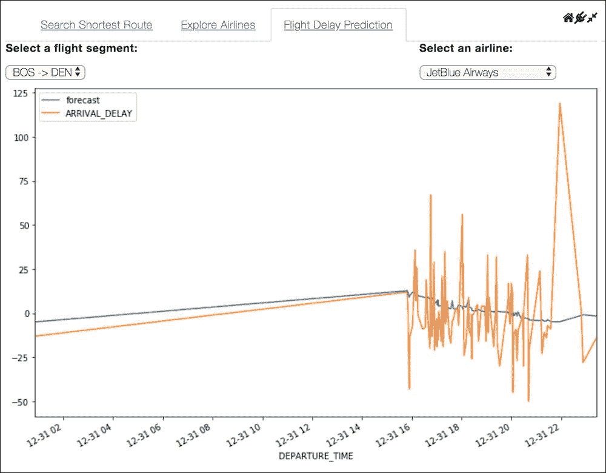

波士顿至丹佛航班段的预测

在本节中，我们展示了如何使用时间序列预测模型根据历史数据预测航班延误。

### 注意

[您可以在此处找到完整的笔记本](https://github.com/DTAIEB/Thoughtful-Data-Science/blob/master/chapter%209/USFlightsAnalysis/US%20Flight%20data%20analysis%20-%20Part%204.ipynb)。

提醒一下，虽然只是一个示例应用，仍有很大的改进空间，但使用 PixieApp 编程模型进行数据分析的技术将在其他任何项目中同样应用。

# 总结

在本章中，我们讨论了图及其相关的图论，并探讨了其数据结构和算法。 我们还简要介绍了`networkx` Python 库，该库提供了丰富的用于处理和可视化图形的 API 集。 然后，我们将这些技术应用于构建示例应用，该应用通过将飞行数据视为一个图问题（以机场为顶点并沿边缘飞行）来分析飞行数据。 与往常一样，我们还展示了如何将这些分析操作化为一个简单但功能强大的仪表板，该仪表板可以直接在 Jupyter 笔记本中运行，然后可以选择通过 PixieGateway 微服务作为 Web 分析应用进行部署。

本章完成了一系列示例应用，涵盖了许多重要的行业用例。 在下一章中，我对本书的主题提供了一些最终的想法，即通过使数据的使用变得简单且所有人都可以访问来弥合数据科学与工程学之间的鸿沟。