# 建模与估计

> 原文：[https://www.bookbookmark.ds100.org/ch/10/modeling_intro.html](https://www.bookbookmark.ds100.org/ch/10/modeling_intro.html)

```
# HIDDEN
# Clear previously defined variables
%reset -f

# Set directory for data loading to work properly
import os
os.chdir(os.path.expanduser('~/notebooks/10'))

```

> 基本上，所有模型都是错误的，但有些模型是有用的。
> 
> -[George Box，统计学家（1919-2013）](https://www.wikiwand.com/en/George_E._P._Box)

我们已经讨论了问题制定、数据清理和探索性数据分析，这是数据科学生命周期的前三个步骤。我们还发现 EDA 经常揭示数据集中变量之间的关系。我们如何决定一段关系是真实的还是虚假的？我们如何利用这些关系对未来做出可靠的预测？为了回答这些问题，我们需要数学工具来建模和估计。

模型是系统的理想化（htg1）表示。例如，如果我们从比萨斜塔上落下一个钢球，一个简单的重力模型表明我们希望钢球落在地上，以 9.8 米/秒的速度加速。这个模型也可以让我们用抛射运动定律预测球撞击地面需要多长时间。

这个重力模型描述了我们的系统的行为，但只是一个近似值，它忽略了空气阻力、其他天体的重力效应和空气浮力的影响。由于这些无意识的因素，我们的模型在现实生活中几乎总是会做出错误的预测！尽管如此，简单的重力模型在如此多的情况下仍然足够精确，以至于今天它被广泛使用和教授。

类似地，我们使用数据定义的任何模型都是实际过程的近似值。当近似值不太严格时，我们的模型具有实际应用价值。这自然会引发一些基本问题。我们如何选择模型？我们如何知道我们是否需要一个更复杂的模型？

在本书的其余章节中，我们将开发计算工具来**设计模型并使其适合数据。我们还将介绍推理工具，使我们能够解释我们的模型将**归纳为感兴趣的人群的能力。****

## 10.1 模型

```
# HIDDEN
# Clear previously defined variables
%reset -f

# Set directory for data loading to work properly
import os
os.chdir(os.path.expanduser('~/notebooks/10'))

```

```
# HIDDEN
import warnings
# Ignore numpy dtype warnings. These warnings are caused by an interaction
# between numpy and Cython and can be safely ignored.
# Reference: https://stackoverflow.com/a/40846742
warnings.filterwarnings("ignore", message="numpy.dtype size changed")
warnings.filterwarnings("ignore", message="numpy.ufunc size changed")

import numpy as np
import matplotlib.pyplot as plt
import pandas as pd
import seaborn as sns
%matplotlib inline
import ipywidgets as widgets
from ipywidgets import interact, interactive, fixed, interact_manual
import nbinteract as nbi

sns.set()
sns.set_context('talk')
np.set_printoptions(threshold=20, precision=2, suppress=True)
pd.options.display.max_rows = 7
pd.options.display.max_columns = 8
pd.set_option('precision', 2)
# This option stops scientific notation for pandas
# pd.set_option('display.float_format', '{:.2f}'.format)

```

在美国，许多用餐者会在用餐者付钱时给他们的服务员留下小费。尽管美国习惯于提供 15%的小费，但也许有些餐馆的顾客比其他餐馆更慷慨。

一个特别的服务员对他能得到多少小费非常感兴趣，他收集了他在一个月工作期间提供的所有桌子的信息。

```
# HIDDEN
tips = sns.load_dataset('tips')
tips

```

|  | 账单合计 | 提示 | 性别 | 吸烟者 | 白天 | 时间 | 大小 |
| --- | --- | --- | --- | --- | --- | --- | --- |
| 零 | 十六点九九 | 1.01 年 | 女性 | 不 | 太阳 | 晚餐 | 二 |
| --- | --- | --- | --- | --- | --- | --- | --- |
| 1 个 | 十点三四 | 一点六六 | 男性 | No | Sun | Dinner | 三 |
| --- | --- | --- | --- | --- | --- | --- | --- |
| 二 | 二十一点零一 | 3.50 美元 | Male | No | Sun | Dinner | 3 |
| --- | --- | --- | --- | --- | --- | --- | --- |
| …… | …… | ... | ... | ... | ... | ... | ... |
| --- | --- | --- | --- | --- | --- | --- | --- |
| 241 个 | 二十二点六七 | 2.00 美元 | Male | 是的 | 坐 | Dinner | 2 |
| --- | --- | --- | --- | --- | --- | --- | --- |
| 二百四十二 | 十七点八二 | 1.75 美元 | Male | No | Sat | Dinner | 2 |
| --- | --- | --- | --- | --- | --- | --- | --- |
| 二百四十三 | 十八点七八 | 3 点 | Female | No | 周四 | Dinner | 2 |
| --- | --- | --- | --- | --- | --- | --- | --- |

244 行×7 列

我们可以绘制尖端数量的柱状图：

```
# HIDDEN
sns.distplot(tips['tip'], bins=np.arange(0, 10.1, 0.25), rug=True)
plt.xlabel('Tip Amount in Dollars')
plt.ylabel('Proportion per Dollar');

```

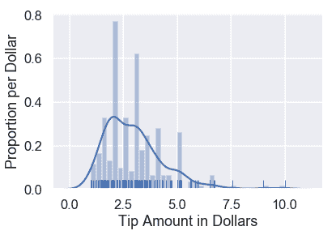

数据中已经有一些有趣的模式。例如，有一个清晰的模式是 2 美元，大多数提示似乎是 0.50 美元的倍数。

目前，我们对小费百分比最感兴趣：小费金额除以账单金额。我们可以在数据框架中为这个变量创建一个列并显示它的分布。

```
# HIDDEN
tips['pcttip'] = tips['tip'] / tips['total_bill'] * 100
sns.distplot(tips['pcttip'], rug=True)
plt.xlabel('Percent Tip Amount')
plt.ylabel('Proportion per Percent');

```

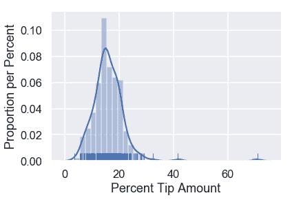

看起来有一张桌子给了我们的服务员 70 美元的小费！然而，大部分小费百分比低于 30 美元。让我们放大分布的那部分。

```
# HIDDEN
sns.distplot(tips['pcttip'], bins=np.arange(30), rug=True)
plt.xlim(0, 30)
plt.xlabel('Percent Tip Amount')
plt.ylabel('Proportion per Percent');

```


我们可以看到分布大致集中在$15\%$和另一个潜在模式$20\%$之间。假设我们的服务员有兴趣预测他从一张给定的桌子上能得到多少小费。为了解决这个问题，我们可以创建一个服务生能得到多少小费的模型。

### 一个简单的模型

一个简单的模型是完全忽略数据，并声明由于美国的惯例是给 15%的小费，服务员总是从他的桌子上得到 15%的小费。虽然非常简单，但我们将使用这个模型来定义一些稍后将使用的变量。

这个模型假设有一个正确的百分比提示，所有的表，过去和未来，都将给服务员。这是百分比提示的 _ 填充参数 _，我们将用$\theta^*$表示。

在做出这个假设之后，我们的模型说我们对$\theta^*$的猜测是$15\%$。我们将使用$\theta$来表示当前的猜测。

在数学符号中，我们的模型指出：

$$\theta=15$$

如果模型是真的，那么这个模型显然是有问题的，我们数据集中的每个表都应该给服务员 15%的小费。尽管如此，这个模型将对许多场景做出合理的猜测。事实上，如果我们没有其他信息，除了服务员受雇于美国之外，这个模型可能是最有用的选择。

但是，由于我们的服务生收集了数据，我们可以使用他的提示历史来创建模型，而不是仅根据惯例选择 15%。

### 损失函数直觉

为了方便起见，下面复制了数据集中提示百分比的分布。

```
# HIDDEN
sns.distplot(tips['pcttip'], bins=np.arange(30), rug=True)
plt.xlim(0, 30)
plt.xlabel('Percent Tip Amount')
plt.ylabel('Proportion per Percent');

```


假设我们正在比较两个选项，分别是：$10\%$和$15\%$。我们可以在发行版上标记这两种选择：

```
# HIDDEN
sns.distplot(tips['pcttip'], bins=np.arange(30), rug=True)

plt.axvline(x=10, c='darkblue', linestyle='--', label=r'$ \theta = 10$')
plt.axvline(x=15, c='darkgreen', linestyle='--', label=r'$ \theta = 15$')
plt.legend()

plt.xlim(0, 30)
plt.xlabel('Percent Tip Amount')
plt.ylabel('Proportion per Percent');

```

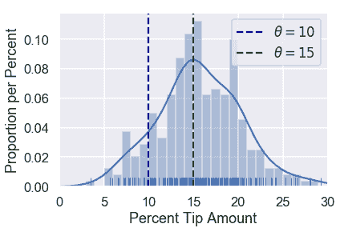

直观地说，在给定数据集的情况下，选择$\theta=15$比选择$\theta=10$更有意义。这是为什么？当我们查看数据中的点时，我们可以看到更多的点接近 15 美元，而不是 10 美元。

虽然看起来很明显，$\theta=15$比$\theta=10$是更好的选择，但还不太清楚，$\theta=15$是否比$\theta=16$更好。为了在不同的$\theta$值之间做出精确的选择，我们要为每个$\theta$值分配一个数字，该数字测量数据的“好”程度。也就是说，我们需要一个函数，它将输入一个$\theta$值和数据集中的点，输出一个单一的数字，我们将使用它来选择我们可以选择的最佳值$\theta$。

我们称此函数为**损失函数**。

## 10.2 损失函数

```
# HIDDEN
# Clear previously defined variables
%reset -f

# Set directory for data loading to work properly
import os
os.chdir(os.path.expanduser('~/notebooks/10'))

```

```
# HIDDEN
import warnings
# Ignore numpy dtype warnings. These warnings are caused by an interaction
# between numpy and Cython and can be safely ignored.
# Reference: https://stackoverflow.com/a/40846742
warnings.filterwarnings("ignore", message="numpy.dtype size changed")
warnings.filterwarnings("ignore", message="numpy.ufunc size changed")

import numpy as np
import matplotlib.pyplot as plt
import pandas as pd
import seaborn as sns
%matplotlib inline
import ipywidgets as widgets
from ipywidgets import interact, interactive, fixed, interact_manual
import nbinteract as nbi

sns.set()
sns.set_context('talk')
np.set_printoptions(threshold=20, precision=2, suppress=True)
pd.options.display.max_rows = 7
pd.options.display.max_columns = 8
pd.set_option('precision', 2)
# This option stops scientific notation for pandas
# pd.set_option('display.float_format', '{:.2f}'.format)

```

```
# HIDDEN
tips = sns.load_dataset('tips')
tips['pcttip'] = tips['tip'] / tips['total_bill'] * 100

```

回想到目前为止我们的假设：我们假设有一个单一的总体提示百分比$\theta^*$。我们的模型估计这个参数；我们使用变量$\theta$来表示我们的估计。我们希望使用收集到的 Tips 数据来确定$\theta$应该具有的值，

为了精确地确定哪一个$theta$值是最好的，我们定义了一个**损失函数**。损失函数是一个数学函数，它接受一个估计值$\theta$和数据集$y_1，y_2，ldots，y_n$中的点。它输出一个单独的数字，即**损失**，用来衡量$\theta$是否适合我们的数据。在数学符号中，我们要创建函数：

$$ L(\theta, y_1, y_2, \ldots, y_n) =\ \ldots $$

按照惯例，损失函数输出的值越低，值越大，值越高，值越低，值越大，值越低。为了适应我们的模型，我们选择了产生比其他所有选择的损失都要低的$theta$的值，即$theta$的值，它是**将损失最小化的$theta$的值**。我们使用符号$\hat \theta$表示将指定损失函数最小化的$\theta$值。

再次考虑两个可能的值：$\theta$：$\theta=10$和$\theta=15$。

```
# HIDDEN
sns.distplot(tips['pcttip'], bins=np.arange(30), rug=True)

plt.axvline(x=10, c='darkblue', linestyle='--', label=r'$ \theta = 10$')
plt.axvline(x=15, c='darkgreen', linestyle='--', label=r'$ \theta = 15$')
plt.legend()

plt.xlim(0, 30)
plt.xlabel('Percent Tip Amount')
plt.ylabel('Proportion per Percent');

```


由于$\theta=15$接近大多数点，我们的损失函数应该输出一个小的值为$\theta=15$和一个大的值为$\theta=10$。

让我们用这个直觉来创建一个损失函数。

### 我们的第一个损失函数：均方误差[¶](#Our-First-Loss-Function:-Mean-Squared-Error)

我们希望选择的$\theta$接近数据集中的点。因此，我们可以定义一个损失函数，它输出一个更大的值，因为$\theta$远离数据集中的点。我们从一个叫做 _ 均方误差 _ 的简单损失函数开始。这里的想法是：

1.  我们选择的值是$\theta$。
2.  对于数据集中的每个值，取值和 theta 之间的平方差：$（y_i-\theta）^2$。用一种简单的方法将差异平方化，将负差异转化为正差异。我们之所以要这样做，是因为如果我们的点$y_i=14$、$\theta=10$和$\theta=18$距离该点同样远，因此也同样“差”。
3.  要计算最终损失，取每个平方差的平均值。

这给了我们一个最终的损失函数：

$$ \begin{aligned} L(\theta, y_1, y_2, \ldots, y_n) &= \text{average}\left\{ (y_1 - \theta)^2, (y_2 - \theta)^2, \ldots, (y_n - \theta)^2 \right\} \\ &= \frac{1}{n} \left((y_1 - \theta)^2 + (y_2 - \theta)^2 + \ldots + (y_n - \theta)^2 \right) \\ &= \frac{1}{n} \sum_{i = 1}^{n}(y_i - \theta)^2\\ \end{aligned} $$

创建一个 python 函数来计算损失很简单：

```
def mse_loss(theta, y_vals):
    return np.mean((y_vals - theta) ** 2)

```

让我们看看这个损失函数是如何工作的。假设我们的数据集只包含一个点，$y_1=14$。我们可以尝试不同的$\theta$值，看看每个值的损失函数输出了什么。

```
# HIDDEN
def try_thetas(thetas, y_vals, xlims, loss_fn=mse_loss, figsize=(10, 7), cols=3):
    if not isinstance(y_vals, np.ndarray):
        y_vals = np.array(y_vals)
    rows = int(np.ceil(len(thetas) / cols))
    plt.figure(figsize=figsize)
    for i, theta in enumerate(thetas):
        ax = plt.subplot(rows, cols, i + 1)
        sns.rugplot(y_vals, height=0.1, ax=ax)
        plt.axvline(theta, linestyle='--',
                    label=rf'$ \theta = {theta} $')
        plt.title(f'Loss = {loss_fn(theta, y_vals):.2f}')
        plt.xlim(*xlims)
        plt.yticks([])
        plt.legend()
    plt.tight_layout()

try_thetas(thetas=[11, 12, 13, 14, 15, 16],
           y_vals=[14], xlims=(10, 17))

```

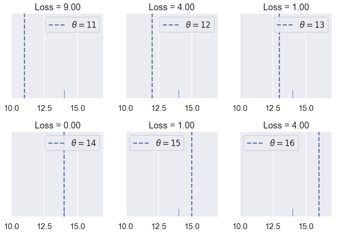

您还可以交互地尝试下面的不同值$\theta$。你应该理解为什么$theta=11$的损失比$theta=13$的损失高很多倍。

```
# HIDDEN
def try_thetas_interact(theta, y_vals, xlims, loss_fn=mse_loss):
    if not isinstance(y_vals, np.ndarray):
        y_vals = np.array(y_vals)
    plt.figure(figsize=(4, 3))
    sns.rugplot(y_vals, height=0.1)
    plt.axvline(theta, linestyle='--')
    plt.xlim(*xlims)
    plt.yticks([])
    print(f'Loss for theta = {theta}: {loss_fn(theta, y_vals):.2f}')

def mse_interact(theta, y_vals, xlims):
    plot = interactive(try_thetas_interact, theta=theta,
                       y_vals=fixed(y_vals), xlims=fixed(xlims),
                       loss_fn=fixed(mse_loss))
    plot.children[-1].layout.height = '240px'
    return plot

mse_interact(theta=(11, 16, 0.5), y_vals=[14], xlims=(10, 17))

```

<button class="js-nbinteract-widget">Loading widgets...</button>

正如我们所希望的那样，我们的损失更大，因为$\theta$离我们的数据越远，当$\theta$正好落在我们的数据点上时，损失就越小。现在让我们来看看当我们有五个点而不是一个点时，我们的均方误差是如何表现的。我们这次的数据是：$[11，12，15，17，18]$。

```
# HIDDEN
try_thetas(thetas=[12, 13, 14, 15, 16, 17],
           y_vals=[11, 12, 15, 17, 18],
           xlims=(10.5, 18.5))

```


在我们尝试的$Theta$值中，$Theta=15$的损失最小。但是，14 到 15 之间的$theta$的值可能比$theta=15$的损失更低。看看你能不能用下面的互动图找到一个更好的值$\theta$。

```
# HIDDEN
mse_interact(theta=(12, 17, 0.2),
             y_vals=[11, 12, 15, 17, 18],
             xlims=(10.5, 18.5))

```

<button class="js-nbinteract-widget">Loading widgets...</button>

平均平方误差似乎是通过惩罚远离数据中心的$\theta$值来完成的。现在让我们看看损失函数在原始的 Tip 百分比数据集上输出了什么。作为参考，尖端百分比的原始分布如下所示：

```
# HIDDEN
sns.distplot(tips['pcttip'], bins=np.arange(30), rug=True)
plt.xlim(0, 30)
plt.xlabel('Percent Tip Amount')
plt.ylabel('Proportion per Percent');

```


让我们尝试一些值为$\theta$。

```
# HIDDEN
try_thetas(thetas=np.arange(14.5, 17.1, 0.5),
           y_vals=tips['pcttip'],
           xlims=(0, 30))

```


和以前一样，我们创建了一个交互式小部件来测试不同的$theta$值。

```
# HIDDEN
mse_interact(theta=(13, 17, 0.25),
             y_vals=tips['pcttip'],
             xlims=(0, 30))

```

<button class="js-nbinteract-widget">Loading widgets...</button>

到目前为止，我们已经尝试过的最低价是 16.00 美元，略高于我们最初估计的 15%小费。

### 速记本

我们定义了第一个损失函数，均方误差（mse）。它计算出远离数据中心的$theta$值的高损失。数学上，该损失函数定义为：

$$ \begin{aligned} L(\theta, y_1, y_2, \ldots, y_n) &= \frac{1}{n} \sum_{i = 1}^{n}(y_i - \theta)^2\\ \end{aligned} $$

当我们更改$theta$或$y_1，y_2，ldots，y_n$时，loss 函数将计算不同的损失。当我们尝试不同的$theta$值和添加新的数据点（更改$y_1，y_2，ldots，y_n$）时，我们已经看到了这种情况。

简而言之，我们可以定义向量$\textbf y=[y_1，y_2，ldots，y_n]$。然后，我们可以将 mse 写为：

$$ \begin{aligned} L(\theta, \textbf{y}) &= \frac{1}{n} \sum_{i = 1}^{n}(y_i - \theta)^2\\ \end{aligned} $$

### 最大限度地减少损失

到目前为止，我们只需尝试一系列的价值，然后选择损失最小的价值，就可以找到\theta$的最佳价值。该方法虽然运行良好，但利用损失函数的性质可以找到一种较好的方法。

对于以下示例，我们使用一个包含五个点的数据集：$\textbf y=[11、12、15、16、17]$。

```
# HIDDEN
try_thetas(thetas=[12, 13, 14, 15, 16, 17],
           y_vals=[11, 12, 15, 17, 18],
           xlims=(10.5, 18.5))

```

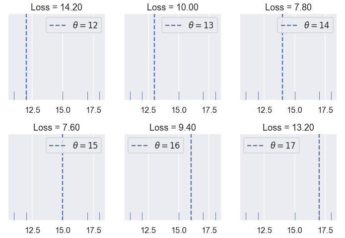

在上面的图中，我们使用了 12 到 17 之间的整数$\theta$值。当我们改变$theta$时，损失似乎开始很高（在 10.92），减少到$theta=15$，然后再次增加。我们可以看到损失随着$theta$的变化而变化，所以让我们制作一个图，将我们尝试的六个$theta$中的每一个的损失与$theta$进行比较。

```
# HIDDEN
thetas = np.array([12, 13, 14, 15, 16, 17])
y_vals = np.array([11, 12, 15, 17, 18])
losses = [mse_loss(theta, y_vals) for theta in thetas]

plt.scatter(thetas, losses)
plt.title(r'Loss vs. $ \theta $ when $\bf{y}$$ = [11, 12, 15, 17, 18] $')
plt.xlabel(r'$ \theta $ Values')
plt.ylabel('Loss');

```

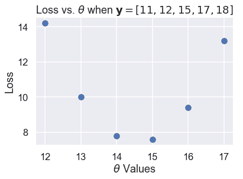

散点图显示了我们以前注意到的向下，然后向上的趋势。我们可以尝试更多的$theta$值，以查看一条完整的曲线，该曲线显示损失如何随着$theta$的变化而变化。

```
# HIDDEN
thetas = np.arange(12, 17.1, 0.05)
y_vals = np.array([11, 12, 15, 17, 18])
losses = [mse_loss(theta, y_vals) for theta in thetas]

plt.plot(thetas, losses)
plt.title(r'Loss vs. $ \theta $ when $\bf{y}$$ = [11, 12, 15, 17, 18] $')
plt.xlabel(r'$ \theta $ Values')
plt.ylabel('Loss');

```

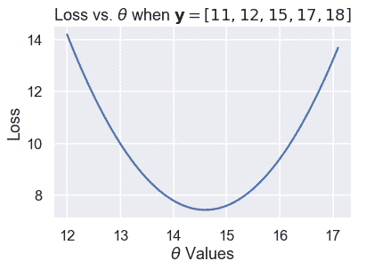

上面的图显示，事实上，$\theta=15$不是最佳选择；14 到 15 之间的$\theta$损失会更低。我们可以用微积分来精确地找到$\theta$的最小值。在最小损失下，损失函数相对于$\theta$的导数为 0。

首先，我们从损失函数开始：

$$ \begin{aligned} L(\theta, \textbf{y}) &= \frac{1}{n} \sum_{i = 1}^{n}(y_i - \theta)^2\\ \end{aligned} $$

接下来，我们插入点$\textbf y=[11，12，15，17，18]$：

$$ \begin{aligned} L(\theta, \textbf{y}) &= \frac{1}{5} \big((11 - \theta)^2 + (12 - \theta)^2 + (15 - \theta)^2 + (17 - \theta)^2 + (18 - \theta)^2 \big)\\ \end{aligned} $$

为了找到将此函数最小化的$\theta$值，我们计算了与$\theta$相关的导数：

$$ \begin{aligned} \frac{\partial}{\partial \theta} L(\theta, \textbf{y}) &= \frac{1}{5} \big(-2(11 - \theta) - 2(12 - \theta) - 2(15 - \theta) - 2(17 - \theta) -2(18 - \theta) \big)\\ &= \frac{1}{5} \big(10 \cdot \theta - 146 \big)\\ \end{aligned} $$

然后，我们找到了$theta$的值，其中导数为零：

$$ \begin{aligned} \frac{1}{5} \big(10 \cdot \theta - 146 \big) &= 0 \\ 10 \cdot \theta - 146 &= 0 \\ \theta &= 14.6 \end{aligned} $$

我们已经找到了最小化的$\theta$，正如预期的那样，它在 14 到 15 之间。我们表示将损失降至最低的美元。因此，对于数据集$\textbf y=[11、12、15、17、18]$和 mse loss 函数：

$$ \hat{\theta} = 14.6 $$

如果我们恰好计算数据值的平均值，我们会发现一个奇怪的等价性：

$$ \text{mean} (\textbf{y}) = \hat{\theta} = 14.6 $$

### 均方误差最小值[¶](#The-Minimizing-Value-of-the-Mean-Squared-Error)

事实证明，上述等价性不仅仅是巧合；数据值 _ 的平均值 _ 总是产生$\hat \theta$，而$\theta$则使 MSE 损失最小化。

为了证明这一点，我们再次求出损失函数的导数。我们没有插入点，而是保留$y_i$术语的完整性，以便推广到其他数据集。

$$ \begin{aligned} L(\theta, \textbf{y}) &= \frac{1}{n} \sum_{i = 1}^{n}(y_i - \theta)^2\\ \frac{\partial}{\partial \theta} L(\theta, \textbf{y}) &= \frac{1}{n} \sum_{i = 1}^{n} -2(y_i - \theta) \\ &= -\frac{2}{n} \sum_{i = 1}^{n} (y_i - \theta) \\ \end{aligned} $$

由于我们没有用特定的值替换$Y_i$，所以这个公式可以与任何具有任意点数的数据集一起使用。

现在，我们将导数设为零，然后求出$\theta$以找到$\theta$的最小值，如下所示：

$$ \begin{aligned} -\frac{2}{n} \sum_{i = 1}^{n} (y_i - \theta) &= 0 \\ \sum_{i = 1}^{n} (y_i - \theta) &= 0 \\ \sum_{i = 1}^{n} y_i - \sum_{i = 1}^{n} \theta &= 0 \\ \sum_{i = 1}^{n} \theta &= \sum_{i = 1}^{n} y_i \\ n \cdot \theta &= y_1 + \ldots + y_n \\ \theta &= \frac{y_1 + \ldots + y_n}{n} \\ \hat \theta = \theta &= \text{mean} (\textbf{y}) \end{aligned} $$

你看，我们看到有一个单独的$theta$值，不管数据集是什么，它都会给出最小的毫秒。对于均方误差，我们知道$\hat \theta$是数据集值的平均值。

### 返回到原始数据集[¶](#Back-to-the-Original-Dataset)

我们不再像以前那样测试不同的$theta$值。我们可以一次计算平均小费百分比：

```
np.mean(tips['pcttip'])

```

```
16.080258172250463
```

```
# HIDDEN
sns.distplot(tips['pcttip'], bins=np.arange(30), rug=True)

plt.axvline(x=16.08, c='darkblue', linestyle='--', label=r'$ \hat \theta = 16.08$')
plt.legend()

plt.xlim(0, 30)
plt.title('Distribution of tip percent')
plt.xlabel('Percent Tip Amount')
plt.ylabel('Proportion per Percent');

```


### 摘要[¶](#Summary)

我们引入了一个**常量模型**，这个模型为数据集中的所有条目输出相同的数字。

**损失函数**$L（\theta、\textbf y）$测量给定值$\theta$与数据的匹配程度。在本节中，我们介绍了均方误差损失函数，并证明了对于常数模型，$hat \theta=\text mean（\textbf y）$的值。

我们在本节中采取的步骤适用于许多建模场景：

1.  选择一个模型。
2.  选择损失函数。
3.  通过最小化损失来拟合模型。

在本书中，我们所有的建模技术都扩展到这些步骤中的一个或多个。我们介绍了新的模型（1）、新的损失函数（2）和减少损失的新技术（3）。

## 10.3 绝对损失和 Huber 损失

```
# HIDDEN
# Clear previously defined variables
%reset -f

# Set directory for data loading to work properly
import os
os.chdir(os.path.expanduser('~/notebooks/10'))

```

```
# HIDDEN
import warnings
# Ignore numpy dtype warnings. These warnings are caused by an interaction
# between numpy and Cython and can be safely ignored.
# Reference: https://stackoverflow.com/a/40846742
warnings.filterwarnings("ignore", message="numpy.dtype size changed")
warnings.filterwarnings("ignore", message="numpy.ufunc size changed")

import numpy as np
import matplotlib.pyplot as plt
import pandas as pd
import seaborn as sns
%matplotlib inline
import ipywidgets as widgets
from ipywidgets import interact, interactive, fixed, interact_manual
import nbinteract as nbi

sns.set()
sns.set_context('talk')
np.set_printoptions(threshold=20, precision=2, suppress=True)
pd.options.display.max_rows = 7
pd.options.display.max_columns = 8
pd.set_option('precision', 2)
# This option stops scientific notation for pandas
# pd.set_option('display.float_format', '{:.2f}'.format)

```

```
# HIDDEN
tips = sns.load_dataset('tips')
tips['pcttip'] = tips['tip'] / tips['total_bill'] * 100

```

```
# HIDDEN
def mse_loss(theta, y_vals):
    return np.mean((y_vals - theta) ** 2)

def abs_loss(theta, y_vals):
    return np.mean(np.abs(y_vals - theta))

```

```
# HIDDEN
def compare_mse_abs(thetas, y_vals, xlims, figsize=(10, 7), cols=3):
    if not isinstance(y_vals, np.ndarray):
        y_vals = np.array(y_vals)
    rows = int(np.ceil(len(thetas) / cols))
    plt.figure(figsize=figsize)
    for i, theta in enumerate(thetas):
        ax = plt.subplot(rows, cols, i + 1)
        sns.rugplot(y_vals, height=0.1, ax=ax)
        plt.axvline(theta, linestyle='--',
                    label=rf'$ \theta = {theta} $')
        plt.title(f'MSE = {mse_loss(theta, y_vals):.2f}\n'
                  f'MAE = {abs_loss(theta, y_vals):.2f}')
        plt.xlim(*xlims)
        plt.yticks([])
        plt.legend()
    plt.tight_layout()

```

为了拟合模型，我们选择了一个损失函数，并选择了使损失最小化的模型参数。在上一节中，我们介绍了均方误差（mse）损失函数：

$$ \begin{aligned} L(\theta, \textbf{y}) &= \frac{1}{n} \sum_{i = 1}^{n}(y_i - \theta)^2\\ \end{aligned} $$

我们使用了一个常量模型来预测数据集中所有条目的相同数字$\theta$。当我们使用 MSE 损失来拟合这个模型时，我们发现$\hat \theta=\text mean（\textbf y）$。在 Tips 数据集中，我们发现拟合常数模型将预测$16.08\%$因为$16.08\%$是 Tip 百分比的平均值。

在本节中，我们介绍了两个新的损耗函数，即**平均绝对误差**损耗函数和**huber**损耗函数。

### 平均绝对误差

现在，我们将保持我们的模型相同，但切换到一个不同的损失函数：平均绝对误差（MAE）。这个损失函数取的是绝对差，而不是每个点的平方差和我们的预测值：

$$ \begin{aligned} L(\theta, \textbf{y}) &= \frac{1}{n} \sum_{i = 1}^{n} |y_i - \theta| \\ \end{aligned} $$

### 比较 mse 和 mae[？](#Comparing-MSE-and-MAE)

为了更好地了解 MSE 和 MAE 的比较方式，让我们比较它们在不同数据集中的损失。首先，我们将使用一个点的数据集：$\textbf y=[14]$。

```
# HIDDEN
compare_mse_abs(thetas=[11, 12, 13, 14, 15, 16],
                y_vals=[14], xlims=(10, 17))

```


我们发现 MSE 通常高于 MAE，因为误差是平方的。让我们看看当有五个点时会发生什么：$\textbf y=[12.1，12.8，14.9，16.3，17.2]。$

```
# HIDDEN
compare_mse_abs(thetas=[12, 13, 14, 15, 16, 17],
                y_vals=[12.1, 12.8, 14.9, 16.3, 17.2],
                xlims=(11, 18))

```


请记住，实际损失值本身对我们不是很有趣；它们只对比较不同的$theta$值有用。一旦我们选择了一个损失函数，我们将寻找产生最小损失的$\hat \theta$，即$\theta$。因此，我们感兴趣的是损失函数是否产生不同的$\hat \theta$。

到目前为止，这两个损失函数似乎在$\hat \theta 上达成一致。然而，如果我们再近一点看，就会发现一些差异。我们首先计算损失，并将它们与我们尝试的 6 个$\theta$值的$theta$进行比较。

```
# HIDDEN
thetas = np.array([12, 13, 14, 15, 16, 17])
y_vals = np.array([12.1, 12.8, 14.9, 16.3, 17.2])
mse_losses = [mse_loss(theta, y_vals) for theta in thetas]
abs_losses = [abs_loss(theta, y_vals) for theta in thetas]

plt.scatter(thetas, mse_losses, label='MSE')
plt.scatter(thetas, abs_losses, label='MAE')
plt.title(r'Loss vs. $ \theta $ when $ \bf{y}$$= [ 12.1, 12.8, 14.9, 16.3, 17.2 ] $')
plt.xlabel(r'$ \theta $ Values')
plt.ylabel('Loss')
plt.legend();

```

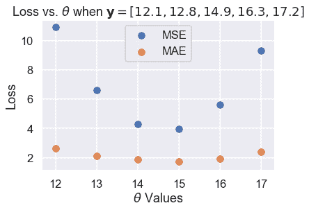

然后，我们计算更多的$\theta$值，使曲线平滑：

```
# HIDDEN
thetas = np.arange(12, 17.1, 0.05)
y_vals = np.array([12.1, 12.8, 14.9, 16.3, 17.2])
mse_losses = [mse_loss(theta, y_vals) for theta in thetas]
abs_losses = [abs_loss(theta, y_vals) for theta in thetas]

plt.plot(thetas, mse_losses, label='MSE')
plt.plot(thetas, abs_losses, label='MAE')
plt.title(r'Loss vs. $ \theta $ when $ \bf{y}$$ = [ 12.1, 12.8, 14.9, 16.3, 17.2 ] $')
plt.xlabel(r'$ \theta $ Values')
plt.ylabel('Loss')
plt.legend();

```

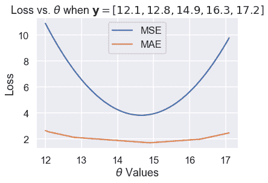

然后，我们放大 Y 轴上 1.5 到 5 之间的区域，以更清楚地看到最小值的差异。我们用虚线标出了最小值。

```
# HIDDEN
thetas = np.arange(12, 17.1, 0.05)
y_vals = np.array([12.1, 12.8, 14.9, 16.3, 17.2])
mse_losses = [mse_loss(theta, y_vals) for theta in thetas]
abs_losses = [abs_loss(theta, y_vals) for theta in thetas]

plt.figure(figsize=(7, 5))
plt.plot(thetas, mse_losses, label='MSE')
plt.plot(thetas, abs_losses, label='MAE')
plt.axvline(np.mean(y_vals), c=sns.color_palette()[0], linestyle='--',
            alpha=0.7, label='Minimum MSE')
plt.axvline(np.median(y_vals), c=sns.color_palette()[1], linestyle='--',
            alpha=0.7, label='Minimum MAE')

plt.title(r'Loss vs. $ \theta $ when $ \bf{y}$$ = [ 12.1, 12.8, 14.9, 16.3, 17.2 ] $')
plt.xlabel(r'$ \theta $ Values')
plt.ylabel('Loss')
plt.ylim(1.5, 5)
plt.legend()
plt.tight_layout();

```

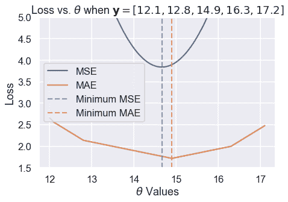

我们从经验上发现，MSE 和 MAE 可以为同一个数据集生成不同的$\hat \theta。一个更仔细的分析揭示了它们何时会不同，更重要的是，它们为什么会不同。

### 离群值[¶](#Outliers)

我们可以在上面的损失图和$\theta$图中看到的一个区别在于损失曲线的形状。绘制均方根误差会导致损失函数中平方项产生抛物线。

另一方面，绘制 MAE 会产生一系列连接的线条。当我们考虑到绝对值函数是线性的时，这是有意义的，因此取许多绝对值函数的平均值应该产生一个半线性函数。

由于 MSE 有一个平方误差项，所以它对异常值更为敏感。如果$\theta=10$且一个点位于 110，则该点的毫秒误差项将为$（10-110）^2=10000$而在 mae 中，该点的误差项将为$10-110=100$。我们可以用一组三点来说明这一点，即$textbf y=[12，13，14]$并绘制 MSE 和 MAE 的损失与$theta$曲线。

使用下面的滑块将第三个点移动到远离其余数据的位置，并观察损失曲线会发生什么。（由于 MSE 的值大于 MAE，所以我们已经缩放了曲线以保持这两个曲线都在视图中。）

```
# HIDDEN
def compare_mse_abs_curves(y3=14):
    thetas = np.arange(11.5, 26.5, 0.1)
    y_vals = np.array([12, 13, y3])

    mse_losses = [mse_loss(theta, y_vals) for theta in thetas]
    abs_losses = [abs_loss(theta, y_vals) for theta in thetas]
    mse_abs_diff = min(mse_losses) - min(abs_losses)
    mse_losses = [loss - mse_abs_diff for loss in mse_losses]

    plt.figure(figsize=(9, 2))

    ax = plt.subplot(121)
    sns.rugplot(y_vals, height=0.3, ax=ax)
    plt.xlim(11.5, 26.5)
    plt.xlabel('Points')

    ax = plt.subplot(122)
    plt.plot(thetas, mse_losses, label='MSE')
    plt.plot(thetas, abs_losses, label='MAE')
    plt.xlim(11.5, 26.5)
    plt.ylim(min(abs_losses) - 1, min(abs_losses) + 10)
    plt.xlabel(r'$ \theta $')
    plt.ylabel('Loss')
    plt.legend()

```

```
# HIDDEN
interact(compare_mse_abs_curves, y3=(14, 25));

```

<button class="js-nbinteract-widget">Loading widgets...</button>

我们已经显示了下面$y_3=14$和$y_3=25$的曲线。

```
# HIDDEN
compare_mse_abs_curves(y3=14)

```


```
# HIDDEN
compare_mse_abs_curves(y3=25)

```


当我们将该点移离其他数据时，MSE 曲线也随之移动。当$y_=14$时，mse 和 mae 都有$that \theta=13$。然而，当$y_=25$时，MSE 损失产生的是$hat \theta=16.7$而 MAE 产生的是$hat \theta=13$，与以前没有变化。

### 最小化 mae[？](#Minimizing-the-MAE)

既然我们对 MSE 和 MAE 的区别有了定性的认识，我们就可以最小化 MAE，使这一区别更加精确。如前所述，我们将取损失函数对$\theta$的导数，并将其设为零。

然而，这一次我们必须处理这样一个事实：绝对函数并不总是可微的。当$x&gt；0$时，$\frac \部分\部分 x x=1$时。当$x&lt；0$时，$\frac \部分\部分 x x=-1$时。虽然$x 在$x=0$时在技术上是不可微的，但是我们将设置$\frac \ partial \ partial x x=0$以便方程更容易处理。

回想一下，MAE 的方程是：

$$ \begin{aligned} L(\theta, \textbf{y}) &= \frac{1}{n} \sum_{i = 1}^{n}|y_i - \theta|\\ &= \frac{1}{n} \left( \sum_{y_i < \theta}|y_i - \theta| + \sum_{y_i = \theta}|y_i - \theta| + \sum_{y_i > \theta}|y_i - \theta| \right)\\ \end{aligned} $$

在上面的行中，我们将求和分为三个单独的求和：一个是每$y_i&lt；\theta$有一个术语，一个是每$y_i=\theta$有一个术语，一个是每$y_i&gt；\theta$有一个术语。为什么求和看起来更复杂？如果我们知道$y_i&lt；\theta$我们也知道$y_i-\theta&lt；0$因此之前的$frac \ partial \ partial \theta y_i-\theta=-1$上面的每个术语都有类似的逻辑，以使取导数更容易。

现在，我们取与$\theta$相关的导数，并将其设为零：

$$ \begin{aligned} \frac{1}{n} \left( \sum_{y_i < \theta}(-1) + \sum_{y_i = \theta}(0) + \sum_{y_i > \theta}(1) \right) &= 0 \\ \sum_{y_i < \theta}(-1) + \sum_{y_i > \theta}(1) &= 0 \\ -\sum_{y_i < \theta}(1) + \sum_{y_i > \theta}(1) &= 0 \\ \sum_{y_i < \theta}(1) &= \sum_{y_i > \theta}(1) \\ \end{aligned} $$

上面的结果是什么意思？在左侧，对于每个小于$\theta$的数据点，我们有一个术语。在右边，对于每个大于$\theta$的数据点，我们都有一个。然后，为了满足这个方程，我们需要为$\theta$选择一个值，该值具有相同数量的较小和较大的点。这是一组数字的 _ 中位数 _ 的定义。因此，MAE 的$theta$的最小值是$that\theta=\text 中位数（\textbf y）$。

当我们有奇数个点时，当点按排序顺序排列时，中间值就是中间点。我们可以看到，在下面的例子中，当$\theta$位于中间值时，损失最小：

```
# HIDDEN
def points_and_loss(y_vals, xlim, loss_fn=abs_loss):
    thetas = np.arange(xlim[0], xlim[1] + 0.01, 0.05)
    abs_losses = [loss_fn(theta, y_vals) for theta in thetas]

    plt.figure(figsize=(9, 2))

    ax = plt.subplot(121)
    sns.rugplot(y_vals, height=0.3, ax=ax)
    plt.xlim(*xlim)
    plt.xlabel('Points')

    ax = plt.subplot(122)
    plt.plot(thetas, abs_losses)
    plt.xlim(*xlim)
    plt.xlabel(r'$ \theta $')
    plt.ylabel('Loss')
points_and_loss(np.array([10, 11, 12, 14, 15]), (9, 16))

```


但是，当我们有偶数个点时，当$\theta$是两个中心点之间的任何值时，损失最小。

```
# HIDDEN
points_and_loss(np.array([10, 11, 14, 15]), (9, 16))

```


当我们使用 MSE 时，情况并非如此：

```
# HIDDEN
points_and_loss(np.array([10, 11, 14, 15]), (9, 16), mse_loss)

```


### mse 与 mae 比较[？](#MSE-and-MAE-Comparison)

我们的研究和上述推导表明，MSE 比 MAE 更容易区分，但对异常值更敏感。对于 MSE，$\hat \theta=\text mean（\textbf y）$，而对于 mae \hat \theta=\text mean（\textbf y）$。注意中位数受异常值的影响比平均值小。这一现象源于我们对两个损失函数的构造。

我们还发现 MSE 有一个唯一的$\hat \theta$，而平均绝对值在有偶数个数据点的情况下可以是多个可能的$\hat \theta$值。

### Huber 损失

第三个损失函数 huber loss 结合了 mse 和 mae，创建了一个对离群值具有可微性 _ 和 _ 的损失函数。Huber 损失通过类似于接近最小值的$\theta$值的 mse 函数和远离最小值的$\theta$值的绝对损失来实现这一点。

和往常一样，我们通过获取数据集中每个点的 Huber 损失的平均值来创建一个损失函数。

让我们看看当我们改变$\theta$时，huber loss 函数为一个数据集输出了什么样的结果。

```
# HIDDEN
def huber_loss(est, y_obs, alpha = 1):
    d = np.abs(est - y_obs)
    return np.where(d < alpha, 
                    (est - y_obs)**2 / 2.0,
                    alpha * (d - alpha / 2.0))

thetas = np.linspace(0, 50, 200)
loss = huber_loss(thetas, np.array([14]), alpha=5)
plt.plot(thetas, loss, label="Huber Loss")
plt.vlines(np.array([14]), -20, -5,colors="r", label="Observation")
plt.xlabel(r"Choice for $\theta$")
plt.ylabel(r"Loss")
plt.legend()
plt.savefig('huber_loss.pdf')

```


我们可以看到 Huber 损失是平稳的，不像 Mae。Huber 损失也以线性速率增加，与均方损失的二次速率不同。

然而，Huber 损失确实有一个缺点。注意，一旦$\theta$离这一点足够远，它就会从 MSE 过渡到 MAE。我们可以调整这个“足够远”来得到不同的损失曲线。例如，我们可以在离观察点只有一个单位远的地方进行一次$theta$转换：

```
# HIDDEN
loss = huber_loss(thetas, np.array([14]), alpha=1)
plt.plot(thetas, loss, label="Huber Loss")
plt.vlines(np.array([14]), -20, -5,colors="r", label="Observation")
plt.xlabel(r"Choice for $\theta$")
plt.ylabel(r"Loss")
plt.legend()
plt.savefig('huber_loss.pdf')

```

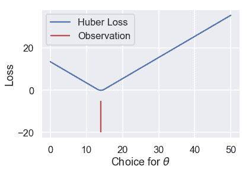

或者我们可以在离观察点 10 个单位远的地方进行转换：

```
# HIDDEN
loss = huber_loss(thetas, np.array([14]), alpha=10)
plt.plot(thetas, loss, label="Huber Loss")
plt.vlines(np.array([14]), -20, -5,colors="r", label="Observation")
plt.xlabel(r"Choice for $\theta$")
plt.ylabel(r"Loss")
plt.legend()
plt.savefig('huber_loss.pdf')

```

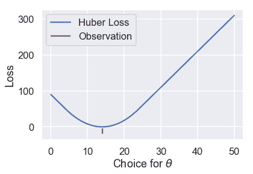

此选择会导致不同的损失曲线，因此可能会导致不同的值$\hat\theta$。如果我们想使用 Huber 损失函数，我们还有一个额外的任务，就是将这个转换点设置为合适的值。

Huber 损失函数的数学定义如下：

$$ L_\alpha(\theta, \textbf{y}) = \frac{1}{n} \sum_{i=1}^n \begin{cases} \frac{1}{2}(y_i - \theta)^2 & | y_i - \theta | \le \alpha \\ \alpha ( |y_i - \theta| - \frac{1}{2}\alpha ) & \text{otherwise} \end{cases} $$

它比以前的损失函数更复杂，因为它结合了 MSE 和 MAE。附加参数$\alpha$设置 Huber 损失从 MSE 过渡到绝对损失的点。

尝试求 Huber 损失函数的导数是繁琐的，不会产生像 mse 和 mae 这样优雅的结果。相反，我们可以使用一种称为梯度下降的计算方法来找到$\theta$的最小值。

### 摘要[¶](#Summary)

在本节中，我们介绍了两个损失函数：平均绝对误差和 Huber 损失函数。我们展示了一个使用 mae 拟合的常数模型，$\hat \theta=\text 中位数（\textbf y）$。