# 十一、梯度下降与数值优化

> 原文：[https://www.bookbookmark.ds100.org/ch/11/gradient_descence.html](https://www.bookbookmark.ds100.org/ch/11/gradient_descence.html)

```py
# HIDDEN
# Clear previously defined variables
%reset -f

# Set directory for data loading to work properly
import os
os.chdir(os.path.expanduser('~/notebooks/11'))
```

为了使用数据集进行估计和预测，我们需要精确定义我们的模型并选择一个损失函数。例如，在 Tip Percentage 数据集中，我们的模型假设存在一个单独的 Tip 百分比，该百分比不会随表而变化。然后，我们决定使用均方误差损失函数，并找到最小化损失函数的模型。

我们还发现有一些简单的表达式可以最小化 MSE 和平均绝对误差损失函数：平均值和中位数。然而，随着我们的模型和损失函数变得更加复杂，我们将无法再为最小化损失的模型找到有用的代数表达式。例如，Huber 损耗具有有用的特性，但很难用手加以区分。

我们可以用计算机用梯度下降法来解决这个问题，这是一种最小化损失函数的计算方法。

## 11.1 使用程序最小化损失

```py
# HIDDEN
# Clear previously defined variables
%reset -f

# Set directory for data loading to work properly
import os
os.chdir(os.path.expanduser('~/notebooks/11'))
```

```py
# HIDDEN
import warnings
# Ignore numpy dtype warnings. These warnings are caused by an interaction
# between numpy and Cython and can be safely ignored.
# Reference: https://stackoverflow.com/a/40846742
warnings.filterwarnings("ignore", message="numpy.dtype size changed")
warnings.filterwarnings("ignore", message="numpy.ufunc size changed")

import numpy as np
import matplotlib.pyplot as plt
import pandas as pd
import seaborn as sns
%matplotlib inline
import ipywidgets as widgets
from ipywidgets import interact, interactive, fixed, interact_manual
import nbinteract as nbi

sns.set()
sns.set_context('talk')
np.set_printoptions(threshold=20, precision=2, suppress=True)
pd.options.display.max_rows = 7
pd.options.display.max_columns = 8
pd.set_option('precision', 2)
# This option stops scientific notation for pandas
# pd.set_option('display.float_format', '{:.2f}'.format)
```

```py
# HIDDEN
def mse(theta, y_vals):
    return np.mean((y_vals - theta) ** 2)

def points_and_loss(y_vals, xlim, loss_fn):
    thetas = np.arange(xlim[0], xlim[1] + 0.01, 0.05)
    losses = [loss_fn(theta, y_vals) for theta in thetas]

    plt.figure(figsize=(9, 2))

    ax = plt.subplot(121)
    sns.rugplot(y_vals, height=0.3, ax=ax)
    plt.xlim(*xlim)
    plt.title('Points')
    plt.xlabel('Tip Percent')

    ax = plt.subplot(122)
    plt.plot(thetas, losses)
    plt.xlim(*xlim)
    plt.title(loss_fn.__name__)
    plt.xlabel(r'$ \theta $')
    plt.ylabel('Loss')
    plt.legend()
```

让我们回到常量模型：

$$ \theta = C $$

我们将使用均方误差损失函数：

$$ \begin{aligned} L(\theta, \textbf{y}) &= \frac{1}{n} \sum_{i = 1}^{n}(y_i - \theta)^2\\ \end{aligned} $$

为了简单起见，我们将使用数据集$\textbf y=[12，13，15，16，17]$。从上一章的分析方法中我们知道，MSE 的最小$\theta$是$\text mean（\textbf y）=14.6$。让我们看看是否可以通过编写程序找到相同的值。

如果我们写得好，我们将能够在任何损失函数上使用相同的程序，以便找到$\theta$的最小值，包括数学上复杂的 Huber 损失：

$$ L_\alpha(\theta, \textbf{y}) = \frac{1}{n} \sum_{i=1}^n \begin{cases} \frac{1}{2}(y_i - \theta)^2 & | y_i - \theta | \le \alpha \\ \alpha ( |y_i - \theta| - \frac{1}{2}\alpha ) & \text{otherwise} \end{cases} $$

首先，我们创建数据点的地毯图。在地毯图的右侧，我们绘制了不同值（$\theta$）的 MSE。

```py
# HIDDEN
pts = np.array([12, 13, 15, 16, 17])
points_and_loss(pts, (11, 18), mse)
```


我们如何编写一个程序来自动找到$\theta$的最小值？最简单的方法是计算许多值的损失。然后，我们可以返回导致最小损失的\theta$值。

我们定义了一个名为`simple_minimize`的函数，它接受一个丢失函数、一个数据点数组和一个要尝试的$\theta$值数组。

```py
def simple_minimize(loss_fn, dataset, thetas):
    '''
    Returns the value of theta in thetas that produces the least loss
    on a given dataset.
    '''
    losses = [loss_fn(theta, dataset) for theta in thetas]
    return thetas[np.argmin(losses)]
```

然后，我们可以定义一个函数来计算 mse 并将其传递到`simple_minimize`。

```py
def mse(theta, dataset):
    return np.mean((dataset - theta) ** 2)

dataset = np.array([12, 13, 15, 16, 17])
thetas = np.arange(12, 18, 0.1)

simple_minimize(mse, dataset, thetas)
```

```py
14.599999999999991
```

这接近预期值：

```py
# Compute the minimizing theta using the analytical formula
np.mean(dataset)
```

```py
14.6
```

现在，我们可以定义一个函数来计算 Huber 损失，并将损失与$\theta$进行比较。

```py
def huber_loss(theta, dataset, alpha = 1):
    d = np.abs(theta - dataset)
    return np.mean(
        np.where(d < alpha,
                 (theta - dataset)**2 / 2.0,
                 alpha * (d - alpha / 2.0))
    )
```

```py
# HIDDEN
points_and_loss(pts, (11, 18), huber_loss)
```


虽然我们可以看到，$\theta$的最小值应该接近 15，但是我们没有直接为 Huber 损失找到$\theta$的分析方法。相反，我们可以使用`simple_minimize`函数。

```py
simple_minimize(huber_loss, dataset, thetas)
```

```py
14.999999999999989
```

现在，我们可以返回到 Tip 百分比的原始数据集，并使用 Huber 损失找到$\theta$的最佳值。

```py
tips = sns.load_dataset('tips')
tips['pcttip'] = tips['tip'] / tips['total_bill'] * 100
tips.head()
```

|  | 账单合计 | 提示 | 性别 | 吸烟者 | 白天 | 时间 | 大小 | PCTIP |
| --- | --- | --- | --- | --- | --- | --- | --- | --- |
| 零 | 十六点九九 | 1.01 年 | 女性 | 不 | 太阳 | 晚餐 | 二 | 5.944673 页 |
| --- | --- | --- | --- | --- | --- | --- | --- | --- |
| 1 个 | 十点三四 | 一点六六 | 男性 | No | Sun | Dinner | 三 | 16.054159 页 |
| --- | --- | --- | --- | --- | --- | --- | --- | --- |
| 二 | 二十一点零一 | 3.50 美元 | Male | No | Sun | Dinner | 3 | 16.658734 |
| --- | --- | --- | --- | --- | --- | --- | --- | --- |
| 三 | 二十三点六八 | 三点三一 | Male | No | Sun | Dinner | 2 | 13.978041 |
| --- | --- | --- | --- | --- | --- | --- | --- | --- |
| 四 | 二十四点五九 | 三点六一 | Female | No | Sun | Dinner | 四 | 14.680765 个 |
| --- | --- | --- | --- | --- | --- | --- | --- | --- |

```py
# HIDDEN
points_and_loss(tips['pcttip'], (11, 20), huber_loss)
```


```py
simple_minimize(huber_loss, tips['pcttip'], thetas)
```

```py
15.499999999999988
```

我们可以看到，使用 Huber 损失给我们带来了\theta=15.5 美元。现在，我们可以比较 mse、mae 和 huber 损失的最小$\hat \theta 值。

```py
print(f"               MSE: theta_hat = {tips['pcttip'].mean():.2f}")
print(f"               MAE: theta_hat = {tips['pcttip'].median():.2f}")
print(f"        Huber loss: theta_hat = 15.50")
```

```py
               MSE: theta_hat = 16.08
               MAE: theta_hat = 15.48
        Huber loss: theta_hat = 15.50
```

我们可以看到，Huber 损失更接近 MAE，因为它受 Tip 百分比分布右侧的异常值影响较小：

```py
sns.distplot(tips['pcttip'], bins=50);
```

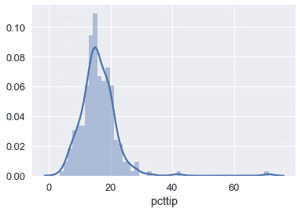

## 与`simple_minimize`[¶](#Issues-with-simple_minimize)有关的问题

虽然`simple_minimize`允许我们最小化损失函数，但它有一些缺陷，使其不适合一般用途。它的主要问题是，它只使用预先确定的$theta$值进行测试。例如，在我们上面使用的代码片段中，我们必须在 12 到 18 之间手动定义$\theta$值。

```py
dataset = np.array([12, 13, 15, 16, 17])
thetas = np.arange(12, 18, 0.1)

simple_minimize(mse, dataset, thetas)
```

我们如何知道检查 12 到 18 之间的范围？我们必须手动检查损耗函数的曲线图，并看到在这个范围内有一个最小值。当我们为模型增加额外的复杂性时，这个过程变得不切实际。此外，我们在上面的代码中手动指定了 0.1 的步长。然而，如果$\theta$的最佳值是 12.043，我们的`simple_minimize`函数将四舍五入到 12.00，即 0.1 的最接近倍数。

我们可以使用一个名为 _ 梯度下降 _ 的方法同时解决这两个问题。

## 11.2 梯度下降

```py
# HIDDEN
# Clear previously defined variables
%reset -f

# Set directory for data loading to work properly
import os
os.chdir(os.path.expanduser('~/notebooks/11'))
```

```py
# HIDDEN
import warnings
# Ignore numpy dtype warnings. These warnings are caused by an interaction
# between numpy and Cython and can be safely ignored.
# Reference: https://stackoverflow.com/a/40846742
warnings.filterwarnings("ignore", message="numpy.dtype size changed")
warnings.filterwarnings("ignore", message="numpy.ufunc size changed")

import numpy as np
import matplotlib.pyplot as plt
import pandas as pd
import seaborn as sns
%matplotlib inline
import ipywidgets as widgets
from ipywidgets import interact, interactive, fixed, interact_manual
import nbinteract as nbi

sns.set()
sns.set_context('talk')
np.set_printoptions(threshold=20, precision=2, suppress=True)
pd.options.display.max_rows = 7
pd.options.display.max_columns = 8
pd.set_option('precision', 2)
# This option stops scientific notation for pandas
# pd.set_option('display.float_format', '{:.2f}'.format)
```

```py
# HIDDEN
tips = sns.load_dataset('tips')
tips['pcttip'] = tips['tip'] / tips['total_bill'] * 100
```

```py
# HIDDEN
def mse(theta, y_vals):
    return np.mean((y_vals - theta) ** 2)

def grad_mse(theta, y_vals):
    return -2 * np.mean(y_vals - theta)

def plot_loss(y_vals, xlim, loss_fn):
    thetas = np.arange(xlim[0], xlim[1] + 0.01, 0.05)
    losses = [loss_fn(theta, y_vals) for theta in thetas]

    plt.figure(figsize=(5, 3))
    plt.plot(thetas, losses, zorder=1)
    plt.xlim(*xlim)
    plt.title(loss_fn.__name__)
    plt.xlabel(r'$ \theta $')
    plt.ylabel('Loss')

def plot_theta_on_loss(y_vals, theta, loss_fn, **kwargs):
    loss = loss_fn(theta, y_vals)
    default_args = dict(label=r'$ \theta $', zorder=2,
                        s=200, c=sns.xkcd_rgb['green'])
    plt.scatter([theta], [loss], **{**default_args, **kwargs})

def plot_tangent_on_loss(y_vals, theta, loss_fn, eps=1e-6):
    slope = ((loss_fn(theta + eps, y_vals) - loss_fn(theta - eps, y_vals))
             / (2 * eps))
    xs = np.arange(theta - 1, theta + 1, 0.05)
    ys = loss_fn(theta, y_vals) + slope * (xs - theta)
    plt.plot(xs, ys, zorder=3, c=sns.xkcd_rgb['green'], linestyle='--')
```

我们有兴趣创建一个函数，它可以最小化损失函数，而不必强制用户预先确定要尝试的值是\theta$。换句话说，虽然`simple_minimize`函数具有以下签名：

```py
simple_minimize(loss_fn, dataset, thetas)
```

我们想要一个具有以下签名的函数：

```py
minimize(loss_fn, dataset)
```

此函数需要自动查找最小化的$\theta$值，无论其大小。我们将使用一种称为梯度下降的技术来实现这个新的`minimize`函数。

### 直觉

与损失函数一样，我们将首先讨论梯度下降的直觉，然后用数学形式化我们的理解。

由于`minimize`函数没有给定要尝试的$\theta$的值，因此我们从选择需要的任何位置的$\theta$开始。然后，我们可以迭代地改进对$\theta$的估计。为了改进对$\theta$的估计，我们研究了在选择$\theta$时损失函数的斜率。

例如，假设我们对简单数据集$\textbf y=[12.1、12.8、14.9、16.3、17.2]$使用 mse，而当前选择的$\theta$是 12。

```py
# HIDDEN
pts = np.array([12.1, 12.8, 14.9, 16.3, 17.2])
plot_loss(pts, (11, 18), mse)
plot_theta_on_loss(pts, 12, mse)
```

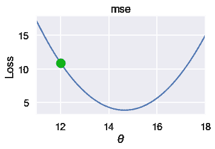

我们想为.\theta$选择一个减少损失的新值。要做到这一点，我们看损失函数在$\theta=12$时的斜率：

```py
# HIDDEN
pts = np.array([12.1, 12.8, 14.9, 16.3, 17.2])
plot_loss(pts, (11, 18), mse)
plot_tangent_on_loss(pts, 12, mse)
```

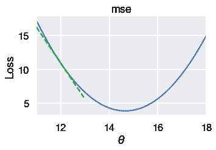

坡度为负，这意味着增加$\theta$将减少损失。

另一方面，如果$\theta=16.5 美元，则损失函数的斜率为正：

```py
# HIDDEN
pts = np.array([12.1, 12.8, 14.9, 16.3, 17.2])
plot_loss(pts, (11, 18), mse)
plot_tangent_on_loss(pts, 16.5, mse)
```


当坡度为正时，降低$\theta$将减少损失。

切线的斜率告诉我们移动$\theta$的方向，以减少损失。如果坡度为负，我们希望$\theta$朝正方向移动。如果坡度为正，则$\theta$应朝负方向移动。在数学上，我们写道：

$$\theta^（t+1）=\theta^（t）-\frac \部分\部分\theta l（\theta ^（t），\textbf y）$$

其中，$\theta^（t）$是当前估计数，$\theta^（t+1）$是下一个估计数。

对于 MSE，我们有：

$$ \begin{aligned} L(\theta, \textbf{y}) &= \frac{1}{n} \sum_{i = 1}^{n}(y_i - \theta)^2\\ \frac{\partial}{\partial \hat{\theta}} L(\theta, \textbf{y}) &= \frac{1}{n} \sum_{i = 1}^{n} -2(y_i - \theta) \\ &= -\frac{2}{n} \sum_{i = 1}^{n} (y_i - \theta) \\ \end{aligned} $$

当$\theta^（t）=12$时，我们可以计算$-\frac 2 n sum i=1 n（y i-\theta）=-5.32$。因此，$\theta^（t+1）=12-（-5.32）=17.32 美元。

我们将旧的$theta$值绘制为绿色轮廓圆圈，新的值绘制为下面损失曲线上的填充圆圈。

```py
# HIDDEN
pts = np.array([12.1, 12.8, 14.9, 16.3, 17.2])
plot_loss(pts, (11, 18), mse)
plot_theta_on_loss(pts, 12, mse, c='none',
                   edgecolor=sns.xkcd_rgb['green'], linewidth=2)
plot_theta_on_loss(pts, 17.32, mse)
```


虽然$\theta$朝着正确的方向发展，但最终却远远超出了最低值。我们可以通过将斜率乘以一个小常数，然后从$\theta$中减去它来解决这个问题。我们的最终更新公式是：

$$\theta^（t+1）=\theta^（t）-\alpha\cdot\frac \部分\部分\theta l（\theta ^（t），\textbf y）$$

其中，$\alpha$是一个小常量。例如，如果我们设置$\alpha=0.3$，这是新的$\theta^（t+1）$：

```py
# HIDDEN
def plot_one_gd_iter(y_vals, theta, loss_fn, grad_loss, alpha=0.3):
    new_theta = theta - alpha * grad_loss(theta, y_vals)
    plot_loss(pts, (11, 18), loss_fn)
    plot_theta_on_loss(pts, theta, loss_fn, c='none',
                       edgecolor=sns.xkcd_rgb['green'], linewidth=2)
    plot_theta_on_loss(pts, new_theta, loss_fn)
    print(f'old theta: {theta}')
    print(f'new theta: {new_theta}')
```

```py
# HIDDEN
plot_one_gd_iter(pts, 12, mse, grad_mse)
```

```py
old theta: 12
new theta: 13.596
```

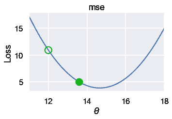

以下是此过程连续迭代的$\theta$值。请注意，$\theta$随着接近最小损失而变化得更慢，因为坡度也更小。

```py
# HIDDEN
plot_one_gd_iter(pts, 13.60, mse, grad_mse)
```

```py
old theta: 13.6
new theta: 14.236
```

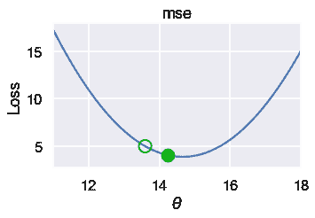

```py
# HIDDEN
plot_one_gd_iter(pts, 14.24, mse, grad_mse)
```

```py
old theta: 14.24
new theta: 14.492
```

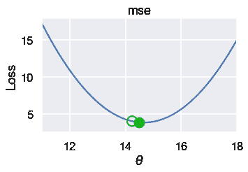

```py
# HIDDEN
plot_one_gd_iter(pts, 14.49, mse, grad_mse)
```

```py
old theta: 14.49
new theta: 14.592
```


### 梯度下降分析

现在我们有了完整的梯度下降算法：

1.  选择一个起始值$\theta$（0 是一个常见的选择）。
2.  计算$\theta-\alpha\cdot\frac \partial \partial\theta l（\theta、\textbf y）$并将其存储为新值$\theta$。
3.  重复直到$\theta$在迭代之间不改变。

您将更常见地看到梯度$\nabla_uta$代替部分导数$\frac \部分\部分\theta$。这两个符号本质上是等效的，但是由于梯度符号更为常见，从现在起我们将在梯度更新公式中使用它：

$$\theta^（t+1）=\theta^（t）-\alpha\cdot\nabla\theta l（\theta^（t），\textbf y）$$

要查看符号：

*   $\theta^（t）$是第$t$次迭代时的当前估计值$\theta^*。
*   $\theta^（t+1）$是$\theta$的下一个选择。
*   $\alpha$称为学习率，通常设置为一个小常量。有时，从一个更大的$\alpha$开始并随着时间的推移减少它是有用的。如果在迭代之间$\alpha$发生变化，我们使用变量$\alpha^t$来标记$\alpha$随时间变化$t$。
*   $\nabla_ \theta l（\theta^（t），\textbf y）$是损失函数相对于时间$t$的偏导数/梯度。

现在您可以看到选择一个可微分损失函数的重要性：$\nabla_theta l（\theta、\textbf y）$是梯度下降算法的关键部分。（虽然可以通过计算两个稍有不同的$theta$值的损失差异并除以$theta$值之间的距离来估计梯度，但这通常会显著增加梯度下降的运行时间，因此使用它变得不切实际。）

梯度算法简单而强大，因为我们可以将它用于许多类型的模型和许多类型的损失函数。它是拟合许多重要模型的计算工具，包括大数据集和神经网络上的线性回归。

### 定义`minimize`函数[¶](#Defining-the-minimize-Function)

现在，我们回到原来的任务：定义`minimize`函数。我们将不得不稍微改变我们的函数签名，因为我们现在需要计算损失函数的梯度。

```py
def minimize(loss_fn, grad_loss_fn, dataset, alpha=0.2, progress=True):
    '''
    Uses gradient descent to minimize loss_fn. Returns the minimizing value of
    theta_hat once theta_hat changes less than 0.001 between iterations.
    '''
    theta = 0
    while True:
        if progress:
            print(f'theta: {theta:.2f} | loss: {loss_fn(theta, dataset):.2f}')
        gradient = grad_loss_fn(theta, dataset)
        new_theta = theta - alpha * gradient

        if abs(new_theta - theta) < 0.001:
            return new_theta

        theta = new_theta
```

然后我们可以定义函数来计算 mse 及其梯度：

```py
def mse(theta, y_vals):
    return np.mean((y_vals - theta) ** 2)

def grad_mse(theta, y_vals):
    return -2 * np.mean(y_vals - theta)
```

最后，我们可以使用`minimize`函数计算$\textbf y=[12.1，12.8，14.9，16.3，17.2]$的最小化值。

```py
%%time
theta = minimize(mse, grad_mse, np.array([12.1, 12.8, 14.9, 16.3, 17.2]))
print(f'Minimizing theta: {theta}')
print()
```

```py
theta: 0.00 | loss: 218.76
theta: 5.86 | loss: 81.21
theta: 9.38 | loss: 31.70
theta: 11.49 | loss: 13.87
theta: 12.76 | loss: 7.45
theta: 13.52 | loss: 5.14
theta: 13.98 | loss: 4.31
theta: 14.25 | loss: 4.01
theta: 14.41 | loss: 3.90
theta: 14.51 | loss: 3.86
theta: 14.57 | loss: 3.85
theta: 14.61 | loss: 3.85
theta: 14.63 | loss: 3.84
theta: 14.64 | loss: 3.84
theta: 14.65 | loss: 3.84
theta: 14.65 | loss: 3.84
theta: 14.66 | loss: 3.84
theta: 14.66 | loss: 3.84
Minimizing theta: 14.658511131035242

CPU times: user 7.88 ms, sys: 3.58 ms, total: 11.5 ms
Wall time: 8.54 ms
```

我们可以看到，梯度下降很快找到了与解析法相同的解：

```py
np.mean([12.1, 12.8, 14.9, 16.3, 17.2])
```

```py
14.66
```

### 最小化 Huber 损失

现在，我们可以应用梯度下降来最小化提示百分比数据集上的 Huber 损失。

Huber 损失为：

L 123; 123; 1 2 \ delta）&amp；\text 否则\结束案例$$

Huber 损失的梯度为：

$$\nabla_\theta l_\delta（\theta，\textbf y）=\frac 1 n \sum i=1 n\ begin cases-（y \theta）&amp；y i-\theta \le\delta\

```py
- \delta \cdot \text{sign} (y_i - \theta) & \text{otherwise} 
```

\结束案例$$

（注意，在之前的 Huber 损失定义中，我们使用变量$\alpha$来表示转换点。为了避免与梯度下降中使用的$\alpha$混淆，我们将 Huber 损失的过渡点参数替换为$\delta$。）

```py
def huber_loss(theta, dataset, delta = 1):
    d = np.abs(theta - dataset)
    return np.mean(
        np.where(d <= delta,
                 (theta - dataset)**2 / 2.0,
                 delta * (d - delta / 2.0))
    )

def grad_huber_loss(theta, dataset, delta = 1):
    d = np.abs(theta - dataset)
    return np.mean(
        np.where(d <= delta,
                 -(dataset - theta),
                 -delta * np.sign(dataset - theta))
    )
```

让我们最小化 Tips 数据集上的 Huber 损失：

```py
%%time
theta = minimize(huber_loss, grad_huber_loss, tips['pcttip'], progress=False)
print(f'Minimizing theta: {theta}')
print()
```

```py
Minimizing theta: 15.506849531471964

CPU times: user 194 ms, sys: 4.13 ms, total: 198 ms
Wall time: 208 ms
```

### 摘要[¶](#Summary)

梯度下降给了我们一种一般的方法来最小化损失函数，当我们无法通过分析来求解$\theta$的最小值时。随着我们的模型和损失函数的复杂性增加，我们将转向梯度下降作为我们选择适合模型的工具。

## 11.3 凸性

```py
# HIDDEN
# Clear previously defined variables
%reset -f

# Set directory for data loading to work properly
import os
os.chdir(os.path.expanduser('~/notebooks/11'))
```

```py
# HIDDEN
import warnings
# Ignore numpy dtype warnings. These warnings are caused by an interaction
# between numpy and Cython and can be safely ignored.
# Reference: https://stackoverflow.com/a/40846742
warnings.filterwarnings("ignore", message="numpy.dtype size changed")
warnings.filterwarnings("ignore", message="numpy.ufunc size changed")

import numpy as np
import matplotlib.pyplot as plt
import pandas as pd
import seaborn as sns
%matplotlib inline
import ipywidgets as widgets
from ipywidgets import interact, interactive, fixed, interact_manual
import nbinteract as nbi

sns.set()
sns.set_context('talk')
np.set_printoptions(threshold=20, precision=2, suppress=True)
pd.options.display.max_rows = 7
pd.options.display.max_columns = 8
pd.set_option('precision', 2)
# This option stops scientific notation for pandas
# pd.set_option('display.float_format', '{:.2f}'.format)
```

```py
# HIDDEN
tips = sns.load_dataset('tips')
tips['pcttip'] = tips['tip'] / tips['total_bill'] * 100
```

```py
# HIDDEN
def mse(theta, y_vals):
    return np.mean((y_vals - theta) ** 2)

def abs_loss(theta, y_vals):
    return np.mean(np.abs(y_vals - theta))

def quartic_loss(theta, y_vals):
    return np.mean(1/5000 * (y_vals - theta + 12) * (y_vals - theta + 23)
                   * (y_vals - theta - 14) * (y_vals - theta - 15) + 7)

def grad_quartic_loss(theta, y_vals):
    return -1/2500 * (2 *(y_vals - theta)**3 + 9*(y_vals - theta)**2
                      - 529*(y_vals - theta) - 327)

def plot_loss(y_vals, xlim, loss_fn):
    thetas = np.arange(xlim[0], xlim[1] + 0.01, 0.05)
    losses = [loss_fn(theta, y_vals) for theta in thetas]

    plt.figure(figsize=(5, 3))
    plt.plot(thetas, losses, zorder=1)
    plt.xlim(*xlim)
    plt.title(loss_fn.__name__)
    plt.xlabel(r'$ \theta $')
    plt.ylabel('Loss')

def plot_theta_on_loss(y_vals, theta, loss_fn, **kwargs):
    loss = loss_fn(theta, y_vals)
    default_args = dict(label=r'$ \theta $', zorder=2,
                        s=200, c=sns.xkcd_rgb['green'])
    plt.scatter([theta], [loss], **{**default_args, **kwargs})

def plot_connected_thetas(y_vals, theta_1, theta_2, loss_fn, **kwargs):
    plot_theta_on_loss(y_vals, theta_1, loss_fn)
    plot_theta_on_loss(y_vals, theta_2, loss_fn)
    loss_1 = loss_fn(theta_1, y_vals)
    loss_2 = loss_fn(theta_2, y_vals)
    plt.plot([theta_1, theta_2], [loss_1, loss_2])
```

```py
# HIDDEN
def plot_one_gd_iter(y_vals, theta, loss_fn, grad_loss, alpha=2.5):
    new_theta = theta - alpha * grad_loss(theta, y_vals)
    plot_loss(pts, (-23, 25), loss_fn)
    plot_theta_on_loss(pts, theta, loss_fn, c='none',
                       edgecolor=sns.xkcd_rgb['green'], linewidth=2)
    plot_theta_on_loss(pts, new_theta, loss_fn)
    print(f'old theta: {theta}')
    print(f'new theta: {new_theta[0]}')
```

梯度下降提供了一种最小化函数的一般方法。我们观察到 Huber 损耗，当函数的最小值难以解析地找到时，梯度下降特别有用。

## 梯度下降找到局部最小值[¶](#Gradient-Descent-Finds-Local-Minima)

不幸的是，梯度下降并不总是找到全局最小化的$\theta$。考虑使用下面的损失函数的初始$\theta=-21$进行以下梯度下降运行。

```py
# HIDDEN
pts = np.array([0])
plot_loss(pts, (-23, 25), quartic_loss)
plot_theta_on_loss(pts, -21, quartic_loss)
```

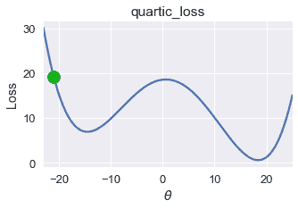

```py
# HIDDEN
plot_one_gd_iter(pts, -21, quartic_loss, grad_quartic_loss)
```

```py
old theta: -21
new theta: -9.944999999999999
```


```py
# HIDDEN
plot_one_gd_iter(pts, -9.9, quartic_loss, grad_quartic_loss)
```

```py
old theta: -9.9
new theta: -12.641412
```

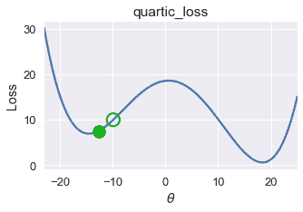

```py
# HIDDEN
plot_one_gd_iter(pts, -12.6, quartic_loss, grad_quartic_loss)
```

```py
old theta: -12.6
new theta: -14.162808
```

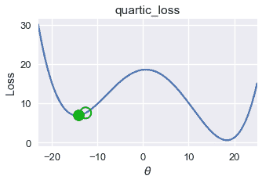

```py
# HIDDEN
plot_one_gd_iter(pts, -14.2, quartic_loss, grad_quartic_loss)
```

```py
old theta: -14.2
new theta: -14.497463999999999
```


在这个损失函数和$theta$值上，梯度下降收敛到$theta=-14.5$，产生大约 8 的损失。但是，这个损失函数的全局最小值是$\theta=18$，相当于几乎为零的损失。从这个例子中，我们观察到梯度下降发现了一个局部最小值 _，它可能不一定具有与 _ 全局最小值 _ 相同的损失。_

幸运的是，许多有用的损失函数具有相同的局部和全局最小值。考虑常见的均方误差损失函数，例如：

```py
# HIDDEN
pts = np.array([-2, -1, 1])
plot_loss(pts, (-5, 5), mse)
```

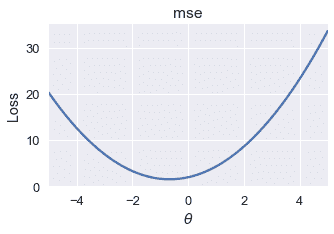

在这个损失函数上以适当的学习速率进行梯度下降，总是会找到全局最优的$\theta$，因为唯一的局部最小值也是全局最小值。

平均绝对误差有时有多个局部极小值。然而，所有的局部最小值产生的损失可能是全球最低的。

```py
# HIDDEN
pts = np.array([-1, 1])
plot_loss(pts, (-5, 5), abs_loss)
```

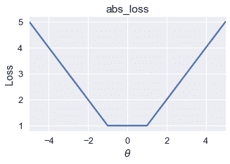

在这个损失函数上，梯度下降将收敛到$[-1，1]$范围内的一个局部极小值。由于所有这些局部极小值都具有此函数可能的最小损失，因此梯度下降仍将返回一个最优选择$\theta$。

## 凸性的定义

对于某些函数，任何局部最小值也是全局最小值。这组函数被称为**凸函数**，因为它们向上弯曲。对于常数模型，MSE、MAE 和 Huber 损耗都是凸的。

在适当的学习速率下，梯度下降找到凸损失函数的全局最优值。由于这个有用的性质，我们更喜欢使用凸损失函数来拟合我们的模型，除非我们有充分的理由不这样做。

形式上，函数$f$是凸的，前提是并且仅当它满足以下不等式时，对于所有可能的函数输入$a$和$b$，对于[0，1]$中的所有$t\

$$tf(a) + (1-t)f(b) \geq f(ta + (1-t)b)$$

这个不等式表明，连接函数两点的所有线必须位于函数本身之上或之上。对于本节开头的损失函数，我们可以很容易地找到出现在图下面的一条线：

```py
# HIDDEN
pts = np.array([0])
plot_loss(pts, (-23, 25), quartic_loss)
plot_connected_thetas(pts, -12, 12, quartic_loss)
```

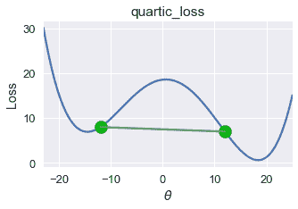

因此，这个损失函数是非凸的。

对于 mse，连接图上两点的所有线都显示在图的上方。我们在下面画一条这样的线。

```py
# HIDDEN
pts = np.array([0])
plot_loss(pts, (-23, 25), mse)
plot_connected_thetas(pts, -12, 12, mse)
```

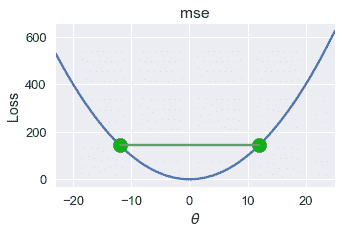

凸性的数学定义给了我们一个精确的方法来确定函数是否是凸的。在这本教科书中，我们将省略凸性的数学证明，而是说明所选的损失函数是否凸。

## 摘要[¶](#Summary)

对于凸函数，任何局部极小值也是全局极小值。这种有用的性质使得梯度下降能够有效地找到给定损失函数的全局最优模型参数。当非凸损失函数的梯度下降收敛到局部极小值时，这些局部极小值不能保证是全局最优的。

## 11.4 随机梯度下降法

```py
# HIDDEN
# Clear previously defined variables
%reset -f

# Set directory for data loading to work properly
import os
os.chdir(os.path.expanduser('~/notebooks/11'))
```

```py
# HIDDEN
import warnings
# Ignore numpy dtype warnings. These warnings are caused by an interaction
# between numpy and Cython and can be safely ignored.
# Reference: https://stackoverflow.com/a/40846742
warnings.filterwarnings("ignore", message="numpy.dtype size changed")
warnings.filterwarnings("ignore", message="numpy.ufunc size changed")

import numpy as np
import matplotlib.pyplot as plt
import pandas as pd
import seaborn as sns
%matplotlib inline
import ipywidgets as widgets
from ipywidgets import interact, interactive, fixed, interact_manual
import nbinteract as nbi

sns.set()
sns.set_context('talk')
np.set_printoptions(threshold=20, precision=2, suppress=True)
pd.options.display.max_rows = 7
pd.options.display.max_columns = 8
pd.set_option('precision', 2)
# This option stops scientific notation for pandas
# pd.set_option('display.float_format', '{:.2f}'.format)
```

在本节中，我们将讨论对梯度下降的修改，这使得它对大型数据集更有用。修改后的算法称为**随机梯度下降**。

回忆梯度下降使用所选损失函数的梯度更新模型参数$\theta$。具体来说，我们使用了这个梯度更新公式：

$$ {\theta}^{(t+1)} = \theta^{(t)} - \alpha \cdot \nabla_{\theta} L(\theta^{(t)}, \textbf{y}) $$

在这个方程中：

*   $\theta^（t）$是我们在第$t$th 次迭代时对$\theta^*$的当前估计值。
*   $\alpha$是学习率
*   $是损失函数的梯度
*   我们计算下一个估计值$\theta^（t+1）$减去以\theta^（t）（t）计算的$\alpha$和$\nabla \theta l（\theta，textbf y）$的乘积。$

### 批梯度下降的限制

在上面的表达式中，我们使用损失函数$\ell（\theta，y_i）$的平均梯度（使用**整个数据集**计算$\nabla \theta（\theta，y）$的值。换句话说，每次更新$\theta$时，我们都会作为一个完整的批处理查询数据集中的所有其他点。因此，上面的梯度更新规则通常被称为**批梯度下降**。

不幸的是，我们经常使用大型数据集。虽然批量梯度下降通常会在相对较少的迭代中找到一个最优的$\theta$，但是如果训练集包含多个点，则每次迭代都需要很长的时间来计算。

### 随机梯度下降

为了避免在整个训练集中计算梯度的困难，随机梯度下降使用单个随机选择的数据点来近似整体梯度。由于观测是随机选择的，我们期望在每个单独观测中使用梯度最终会收敛到与批梯度下降相同的参数。

再次考虑批次梯度下降的公式：

$$ {\theta}^{(t+1)} = \theta^{(t)} - \alpha \cdot \nabla_{\theta} L(\theta^{(t)}, \textbf{y}) $$

在这个公式中，我们有一个术语“$\nabla \theta l（\theta ^（t）、\textbf y）”$，培训集中所有点的损失函数平均梯度。即：

$$ \begin{aligned} \nabla_{\theta} L(\theta^{(t)}, \textbf{y}) &= \frac{1}{n} \sum_{i=1}^{n} \nabla_{\theta} \ell(\theta^{(t)}, y_i) \end{aligned} $$

其中，$\ell（\theta，y_i）$是训练集中某一点的损失。为了进行随机梯度下降，我们只需将平均梯度替换为单点的梯度。随机梯度下降的梯度更新公式为：

$$ {\theta}^{(t+1)} = \theta^{(t)} - \alpha \cdot \nabla_{\theta} \ell(\theta^{(t)}, y_i) $$

在这个公式中，$Y I$是从$\textbf Y$中随机选择的。注意，随机选择点对随机梯度下降的成功至关重要！如果不随机选取点，随机梯度下降可能比批量梯度下降产生更差的结果。

我们最常用的方法是随机梯度下降，通过改变数据点的排列顺序，使用每个点的排列顺序，直到完成一个完整的训练数据。如果算法没有收敛，我们就重新组合点，并运行另一个数据传递。随机梯度下降的每个**迭代**都会查看一个数据点；每个完整的数据传递都称为**epoch**。

#### 使用 MSE 损耗[¶](#Using-the-MSE-Loss)

作为一个例子，我们推导了均方损失的随机梯度下降更新公式。回顾平均平方损失的定义：

$$ \begin{aligned} L(\theta, \textbf{y}) &= \frac{1}{n} \sum_{i = 1}^{n}(y_i - \theta)^2 \end{aligned} $$

考虑到$\theta$的梯度，我们有：

$$ \begin{aligned} \nabla_{\theta} L(\theta, \textbf{y}) &= \frac{1}{n} \sum_{i = 1}^{n} -2(y_i - \theta) \end{aligned} $$

因为上面的公式给出了数据集中所有点的平均梯度损失，所以单个点的梯度损失只是被平均的公式的一部分：

$$ \begin{aligned} \nabla_{\theta} \ell(\theta, y_i) &= -2(y_i - \theta) \end{aligned} $$

因此，MSE 损失的批梯度更新规则为：

$$ \begin{aligned} {\theta}^{(t+1)} = \theta^{(t)} - \alpha \cdot \left( \frac{1}{n} \sum_{i = 1}^{n} -2(y_i - \theta) \right) \end{aligned} $$

随机梯度更新规则为：

$$ \begin{aligned} {\theta}^{(t+1)} = \theta^{(t)} - \alpha \cdot \left( -2(y_i - \theta) \right) \end{aligned} $$

### 随机梯度下降行为

由于随机下降一次只检查一个数据点，因此它可能会比批梯度下降的更新更准确地更新$\theta$然而，由于随机梯度下降计算更新比批梯度下降快得多，随机梯度下降可以在批梯度下降完成单个更新时，朝着最优的$\theta$取得显著进展。

在下面的图片中，我们使用批梯度下降显示对$\theta$的连续更新。图中最暗的区域对应于我们训练数据中的最优值$\theta$，$\hat \theta$。

（此图从技术上显示了一个具有两个参数的模型，但更重要的是，批梯度下降总是朝着$\hat \theta 的方向迈出一步。）

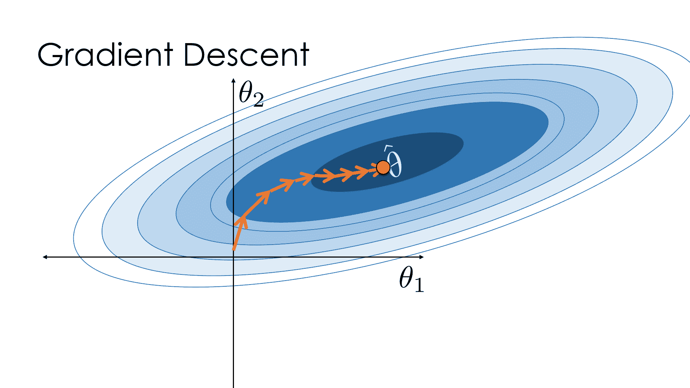

另一方面，随机梯度下降通常会从$\hat \theta$开始逐步下降！然而，由于它使更新更频繁，所以它通常比批梯度下降更快地收敛。

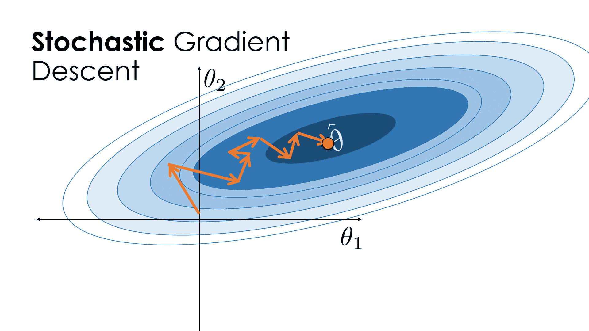

### 定义随机梯度下降函数

正如我们之前对批梯度下降所做的那样，我们定义了一个函数来计算损失函数的随机梯度下降。它将类似于我们的`minimize`函数，但我们需要在每次迭代中实现一个观测的随机选择。

```py
def minimize_sgd(loss_fn, grad_loss_fn, dataset, alpha=0.2):
    """
    Uses stochastic gradient descent to minimize loss_fn.
    Returns the minimizing value of theta once theta changes
    less than 0.001 between iterations.
    """
    NUM_OBS = len(dataset)
    theta = 0
    np.random.shuffle(dataset)
    while True:
        for i in range(0, NUM_OBS, 1):
            rand_obs = dataset[i]
            gradient = grad_loss_fn(theta, rand_obs)
            new_theta = theta - alpha * gradient

            if abs(new_theta - theta) < 0.001:
                return new_theta

            theta = new_theta
        np.random.shuffle(dataset)
```

### 小批量梯度下降

**小批量梯度下降**通过增加我们在每次迭代中选择的观测次数，实现了批量梯度下降和随机梯度下降之间的平衡。在小批量梯度下降中，我们对每个梯度更新使用一些数据点，而不是单个点。

我们利用损失函数梯度的平均值来估计交叉熵损失的真实梯度。如果$\mathcal b$是我们从$n$观察值中随机抽样的一小批数据点，则以下近似值成立。

$$ \nabla_\theta L(\theta, \textbf{y}) \approx \frac{1}{|\mathcal{B}|} \sum_{i\in\mathcal{B}}\nabla_{\theta}\ell(\theta, y_i) $$

与随机梯度下降一样，我们通过改变训练数据的格式和通过迭代随机数据选择小批量来执行小批量梯度下降。在每个时代之后，我们重新洗牌我们的数据并选择新的小批量。

虽然我们已经在这本教科书中区分了随机和小批量梯度下降，但随机梯度下降有时被用作一个涵盖选择任何大小的小批量的总称。

#### 选择小批量大小[¶](#Selecting-the-Mini-Batch-Size)

在某些计算机中的图形处理单元（GPU）芯片上运行时，最小批量梯度下降最为理想。由于这些硬件类型的计算可以并行执行，因此使用小批量可以在不增加计算时间的情况下提高梯度的精度。根据 GPU 的内存，小批量通常设置在 10 到 100 个观察值之间。

### 为小批量梯度下降定义函数

用于小批量梯度下降的函数要求能够选择批量大小。下面是实现此功能的函数。

```py
def minimize_mini_batch(loss_fn, grad_loss_fn, dataset, minibatch_size, alpha=0.2):
    """
    Uses mini-batch gradient descent to minimize loss_fn.
    Returns the minimizing value of theta once theta changes
    less than 0.001 between iterations.
    """
    NUM_OBS = len(dataset)
    assert minibatch_size < NUM_OBS

    theta = 0
    np.random.shuffle(dataset)
    while True:
        for i in range(0, NUM_OBS, minibatch_size):
            mini_batch = dataset[i:i+minibatch_size]
            gradient = grad_loss_fn(theta, mini_batch)
            new_theta = theta - alpha * gradient

            if abs(new_theta - theta) < 0.001:
                return new_theta

            theta = new_theta
        np.random.shuffle(dataset)
```

## 摘要[¶](#Summary)

我们使用批梯度下降迭代改进模型参数，直到模型达到最小损失。由于批量梯度下降是大数据集难以计算的问题，我们经常使用随机梯度下降来拟合模型。在使用 GPU 时，在相同的计算代价下，小批量梯度下降比随机梯度下降收敛得更快。对于大型数据集，随机梯度下降和小批量梯度下降通常比批量梯度下降更为可取，因为它们的计算速度更快。