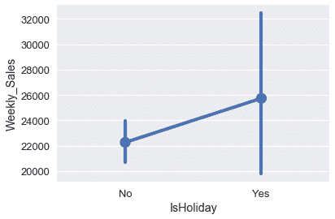
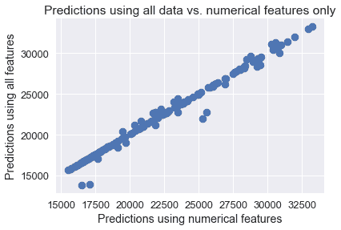
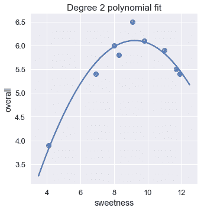
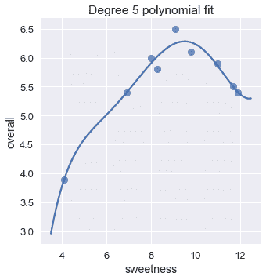

# 特征工程

> 原文：[https://www.textbook.ds100.org/ch/14/feature_engineering.html](https://www.textbook.ds100.org/ch/14/feature_engineering.html)

```
# HIDDEN
# Clear previously defined variables
%reset -f

# Set directory for data loading to work properly
import os
os.chdir(os.path.expanduser('~/notebooks/14'))

```

特征工程指的是为数据集本身创建和添加新特征，以增加模型的复杂性的实践。

到目前为止，我们只使用数字特征作为输入进行线性回归，我们使用（数字）总账单来预测小费金额。然而，tip 数据集也包含分类数据，例如星期几和用餐类型。特征工程允许我们将分类变量转换为数值特征进行线性回归。

特征工程还允许我们通过在数据集中创建新变量来使用线性回归模型进行多项式回归。

## 14.1 沃尔玛数据集

```
# HIDDEN
# Clear previously defined variables
%reset -f

# Set directory for data loading to work properly
import os
os.chdir(os.path.expanduser('~/notebooks/14'))

```

```
# HIDDEN
import warnings
# Ignore numpy dtype warnings. These warnings are caused by an interaction
# between numpy and Cython and can be safely ignored.
# Reference: https://stackoverflow.com/a/40846742
warnings.filterwarnings("ignore", message="numpy.dtype size changed")
warnings.filterwarnings("ignore", message="numpy.ufunc size changed")

import numpy as np
import matplotlib.pyplot as plt
import pandas as pd
import seaborn as sns
%matplotlib inline
import ipywidgets as widgets
from ipywidgets import interact, interactive, fixed, interact_manual
import nbinteract as nbi

sns.set()
sns.set_context('talk')
np.set_printoptions(threshold=20, precision=2, suppress=True)
pd.options.display.max_rows = 7
pd.options.display.max_columns = 8
pd.set_option('precision', 2)
# This option stops scientific notation for pandas
# pd.set_option('display.float_format', '{:.2f}'.format)

```

2014 年，沃尔玛发布了一些销售数据，作为预测其商店每周销售额的竞争的一部分。我们已经获取了他们数据的一个子集，并将其加载到下面。

```
walmart = pd.read_csv('walmart.csv')
walmart

```

|  | 日期 | 每周销售 | 伊索利德 | 温度 | 燃料价格 | 失业 | 降价 |
| --- | --- | --- | --- | --- | --- | --- | --- |
| 零 | 2010 年 2 月 5 日 | 24924.50 美元 | 不 | 四十二点三一 | 二点五七二 | 八点一零六 | 无降价 |
| --- | --- | --- | --- | --- | --- | --- | --- |
| 1 个 | 2010 年 2 月 12 日 | 46039.49 元 | 是的 | 三十八点五一 | 二点五四八 | 8.106 | No Markdown |
| --- | --- | --- | --- | --- | --- | --- | --- |
| 二 | 2010 年 2 月 19 日 | 41595.55 美元 | No | 三十九点九三 | 二点五一四 | 8.106 | No Markdown |
| --- | --- | --- | --- | --- | --- | --- | --- |
| …… | …… | ... | ... | ... | ... | ... | ... |
| --- | --- | --- | --- | --- | --- | --- | --- |
| 一百四十 | 2012 年 10 月 12 日 | 22764.01 年 | No | 六十二点九九 | 三点六零一 | 六点五七三 | 降价 2 |
| --- | --- | --- | --- | --- | --- | --- | --- |
| 一百四十一 | 2012 年 10 月 19 日 | 24185.27 美元 | No | 六十七点九七 | 三点五九四 | 6.573 | MarkDown2 |
| --- | --- | --- | --- | --- | --- | --- | --- |
| 一百四十二 | 2012 年 10 月 26 日 | 27390.81 元 | No | 六十九点一六 | 三点五零六 | 6.573 | 降价 1 |
| --- | --- | --- | --- | --- | --- | --- | --- |

143 行×7 列

这些数据包含几个有趣的特性，包括一周是否包含假日（`IsHoliday`）、那周的失业率（`Unemployment`），以及商店在那一周提供哪些特价商品（`MarkDown`）。

我们的目标是创建一个模型，使用数据中的其他变量预测`Weekly_Sales`变量。使用线性回归模型，我们可以直接使用`Temperature`、`Fuel_Price`和`Unemployment`列，因为它们包含数值数据。

## 使用 SciKit Learn[¶](#Fitting-a-Model-Using-Scikit-Learn)拟合模型

在前面的部分中，我们已经了解了如何获取成本函数的梯度，并使用梯度下降来拟合模型。为此，我们必须为模型定义 python 函数、成本函数、成本函数的梯度和梯度下降算法。虽然这对于演示概念如何工作很重要，但在本节中，我们将使用名为[`scikit-learn`](http://scikit-learn.org/)的机器学习库，它允许我们用更少的代码来适应模型。

例如，为了使用沃尔玛数据集中的数值列来拟合多重线性回归模型，我们首先创建一个包含用于预测的变量的二维 numpy 数组和一个包含我们想要预测的值的一维数组：

```
numerical_columns = ['Temperature', 'Fuel_Price', 'Unemployment']
X = walmart[numerical_columns].as_matrix()
X

```

```
array([[ 42.31,   2.57,   8.11],
       [ 38.51,   2.55,   8.11],
       [ 39.93,   2.51,   8.11],
       ..., 
       [ 62.99,   3.6 ,   6.57],
       [ 67.97,   3.59,   6.57],
       [ 69.16,   3.51,   6.57]])
```

```
y = walmart['Weekly_Sales'].as_matrix()
y

```

```
array([ 24924.5 ,  46039.49,  41595.55, ...,  22764.01,  24185.27,
        27390.81])
```

然后，我们从`scikit-learn`（[docs](http://scikit-learn.org/stable/modules/generated/sklearn.linear_model.LinearRegression.html#sklearn.linear_model.LinearRegression)）导入`LinearRegression`类，实例化它，并使用`X`调用`fit`方法来预测`y`。

请注意，以前我们必须手动将所有$1$的列添加到`X`矩阵中，以便进行截距线性回归。这一次，`scikit-learn`将在幕后处理截获列，为我们节省一些工作。

```
from sklearn.linear_model import LinearRegression

simple_classifier = LinearRegression()
simple_classifier.fit(X, y)

```

```
LinearRegression(copy_X=True, fit_intercept=True, n_jobs=1, normalize=False)
```

我们完了！当我们调用`.fit`时，`scikit-learn`找到线性回归参数，使最小二乘成本函数最小化。我们可以看到以下参数：

```
simple_classifier.coef_, simple_classifier.intercept_

```

```
(array([ -332.22,  1626.63,  1356.87]), 29642.700510138635)
```

为了计算均方成本，我们可以要求分类器对输入数据`X`进行预测，并将预测值与实际值`y`进行比较。

```
predictions = simple_classifier.predict(X)
np.mean((predictions - y) ** 2)

```

```
74401210.603607252
```

平均平方误差看起来相当高。这很可能是因为我们的变量（温度、燃料价格和失业率）与每周销售的相关性很弱。

我们的数据中还有两个变量可能对预测更有用：列`IsHoliday`和列`MarkDown`。下面的框线图显示假日可能与周销售额有一定关系。

```
sns.pointplot(x='IsHoliday', y='Weekly_Sales', data=walmart);

```



不同的降价类别似乎与不同的周销售额密切相关。

```
markdowns = ['No Markdown', 'MarkDown1', 'MarkDown2', 'MarkDown3', 'MarkDown4', 'MarkDown5']
plt.figure(figsize=(7, 5))
sns.pointplot(x='Weekly_Sales', y='MarkDown', data=walmart, order=markdowns);

```


然而，`IsHoliday`和`MarkDown`列都包含分类数据，而不是数字数据，因此我们不能像回归那样使用它们。

## 一个热编码

幸运的是，我们可以对这些分类变量执行**一次热编码**转换，将它们转换为数字变量。转换的工作方式如下：为类别变量中的每个唯一值创建一个新列。如果变量最初具有相应的值，则该列包含$1$，否则该列包含$0$。例如，下面的`MarkDown`列包含以下值：

```
# HIDDEN
walmart[['MarkDown']]

```

|  | MarkDown |
| --- | --- |
| 0 | No Markdown |
| --- | --- |
| 1 | No Markdown |
| --- | --- |
| 2 | No Markdown |
| --- | --- |
| ... | ... |
| --- | --- |
| 140 | MarkDown2 |
| --- | --- |
| 141 | MarkDown2 |
| --- | --- |
| 142 | MarkDown1 |
| --- | --- |

143 行×1 列

此变量包含六个不同的唯一值：“no markdown”、“markdown1”、“markdown2”、“markdown3”、“markdown4”和“markdown5”。我们为每个值创建一列，以获得总共六列。然后，我们按照上面描述的方案用零和一填充列。

```
# HIDDEN
from sklearn.feature_extraction import DictVectorizer

items = walmart[['MarkDown']].to_dict(orient='records')
encoder = DictVectorizer(sparse=False)
pd.DataFrame(
    data=encoder.fit_transform(items),
    columns=encoder.feature_names_
)

```

|  | markdown=降价 1 | markdown=降价 2 | markdown=降价 3 | markdown=降价 4 | markdown=降价 5 | 降价=无降价 |
| --- | --- | --- | --- | --- | --- | --- |
| 0 | 零 | 0.0 | 0.0 | 0.0 | 0.0 | 1.0 条 |
| --- | --- | --- | --- | --- | --- | --- |
| 1 | 0.0 | 0.0 | 0.0 | 0.0 | 0.0 | 1.0 |
| --- | --- | --- | --- | --- | --- | --- |
| 2 | 0.0 | 0.0 | 0.0 | 0.0 | 0.0 | 1.0 |
| --- | --- | --- | --- | --- | --- | --- |
| ... | ... | ... | ... | ... | ... | ... |
| --- | --- | --- | --- | --- | --- | --- |
| 140 | 0.0 | 1.0 | 0.0 | 0.0 | 0.0 | 0.0 |
| --- | --- | --- | --- | --- | --- | --- |
| 141 | 0.0 | 1.0 | 0.0 | 0.0 | 0.0 | 0.0 |
| --- | --- | --- | --- | --- | --- | --- |
| 142 | 1.0 | 0.0 | 0.0 | 0.0 | 0.0 | 0.0 |
| --- | --- | --- | --- | --- | --- | --- |

143 行×6 列

请注意，数据中的第一个值是“无降价”，因此只有转换表中第一行的最后一列标记为$1$。此外，数据中的最后一个值是“markdown1”，这导致第 142 行的第一列标记为$1$。

结果表的每一行将包含一个包含$1$的列；其余的将包含$0$的列。名称“one hot”反映了这样一个事实：只有一列是“hot”（标记为$1$）。

## SciKit 学习[¶](#One-Hot-Encoding-in-Scikit-Learn)中的一个热编码

要执行一个热编码，我们可以使用`scikit-learn`的[`DictVectorizer`](http://scikit-learn.org/stable/modules/generated/sklearn.feature_extraction.DictVectorizer.html)类。要使用这个类，我们必须将数据框架转换为字典列表。dictvectorizer 类自动对分类数据（需要是字符串）进行一次热编码，并保持数字数据不变。

```
from sklearn.feature_extraction import DictVectorizer

all_columns = ['Temperature', 'Fuel_Price', 'Unemployment', 'IsHoliday',
               'MarkDown']

records = walmart[all_columns].to_dict(orient='records')
encoder = DictVectorizer(sparse=False)
encoded_X = encoder.fit_transform(records)
encoded_X

```

```
array([[  2.57,   1\.  ,   0\.  , ...,   1\.  ,  42.31,   8.11],
       [  2.55,   0\.  ,   1\.  , ...,   1\.  ,  38.51,   8.11],
       [  2.51,   1\.  ,   0\.  , ...,   1\.  ,  39.93,   8.11],
       ..., 
       [  3.6 ,   1\.  ,   0\.  , ...,   0\.  ,  62.99,   6.57],
       [  3.59,   1\.  ,   0\.  , ...,   0\.  ,  67.97,   6.57],
       [  3.51,   1\.  ,   0\.  , ...,   0\.  ,  69.16,   6.57]])
```

为了更好地理解转换后的数据，我们可以用列名显示它：

```
pd.DataFrame(data=encoded_X, columns=encoder.feature_names_)

```

|  | Fuel_Price | isholiday=否 | isholiday=是 | MarkDown=MarkDown1 | ... | MarkDown=MarkDown5 | MarkDown=No Markdown | Temperature | Unemployment |
| --- | --- | --- | --- | --- | --- | --- | --- | --- | --- |
| 0 | 2.572 | 1.0 | 0.0 | 0.0 | ... | 0.0 | 1.0 | 42.31 | 8.106 |
| --- | --- | --- | --- | --- | --- | --- | --- | --- | --- |
| 1 | 2.548 | 0.0 | 1.0 | 0.0 | ... | 0.0 | 1.0 | 38.51 | 8.106 |
| --- | --- | --- | --- | --- | --- | --- | --- | --- | --- |
| 2 | 2.514 | 1.0 | 0.0 | 0.0 | ... | 0.0 | 1.0 | 39.93 | 8.106 |
| --- | --- | --- | --- | --- | --- | --- | --- | --- | --- |
| ... | ... | ... | ... | ... | ... | ... | ... | ... | ... |
| --- | --- | --- | --- | --- | --- | --- | --- | --- | --- |
| 140 | 3.601 | 1.0 | 0.0 | 0.0 | ... | 0.0 | 0.0 | 62.99 | 6.573 |
| --- | --- | --- | --- | --- | --- | --- | --- | --- | --- |
| 141 | 3.594 | 1.0 | 0.0 | 0.0 | ... | 0.0 | 0.0 | 67.97 | 6.573 |
| --- | --- | --- | --- | --- | --- | --- | --- | --- | --- |
| 142 | 3.506 | 1.0 | 0.0 | 1.0 | ... | 0.0 | 0.0 | 69.16 | 6.573 |
| --- | --- | --- | --- | --- | --- | --- | --- | --- | --- |

143 行×11 列

数值变量（燃油价格、温度和失业率）保留为数字。分类变量（假日和降价）是一个热编码。当我们使用新的数据矩阵来拟合线性回归模型时，我们将为每列数据生成一个参数。因为这个数据矩阵包含 11 列，所以模型将有 12 个参数，因为我们为截距项设置了额外的参数。

## 用转换后的数据拟合模型

我们现在可以使用`encoded_X`变量进行线性回归。

```
clf = LinearRegression()
clf.fit(encoded_X, y)

```

```
LinearRegression(copy_X=True, fit_intercept=True, n_jobs=1, normalize=False)
```

如前所述，我们有十一个列参数和一个截距参数。

```
clf.coef_, clf.intercept_

```

```
(array([ 1622.11,    -2.04,     2.04,   962.91,  1805.06, -1748.48,
        -2336.8 ,   215.06,  1102.25,  -330.91,  1205.56]), 29723.135729284979)
```

我们可以比较两个分类器的一些预测，看看两者之间是否有很大的区别。

```
walmart[['Weekly_Sales']].assign(
    pred_numeric=simple_classifier.predict(X),
    pred_both=clf.predict(encoded_X)
)

```

|  | Weekly_Sales | pred 数字 | 两者皆可预测 |
| --- | --- | --- | --- |
| 0 | 24924.50 | 30768.878035 | 30766.790214 年 |
| --- | --- | --- | --- |
| 1 | 46039.49 | 31992.279504 | 31989.410395 年 |
| --- | --- | --- | --- |
| 2 | 41595.55 | 31465.220158 号 | 31460.280008 个 |
| --- | --- | --- | --- |
| ... | ... | ... | ... |
| --- | --- | --- | --- |
| 140 | 22764.01 | 23492.262649 | 24447.348979 个 |
| --- | --- | --- | --- |
| 141 | 24185.27 | 21826.414794 个 | 22788.049554 个 |
| --- | --- | --- | --- |
| 142 | 27390.81 | 21287.928537 | 21409.367463 号 |
| --- | --- | --- | --- |

143 行×3 列

这两个模型的预测似乎非常相似。两组预测的散点图证实了这一点。

```
plt.scatter(simple_classifier.predict(X), clf.predict(encoded_X))
plt.title('Predictions using all data vs. numerical features only')
plt.xlabel('Predictions using numerical features')
plt.ylabel('Predictions using all features');

```



## 模型诊断

为什么会这样？我们可以检查两个模型学习的参数。下表显示了分类器所获得的权重，该分类器只使用数值变量而不使用一个热编码：

```
# HIDDEN
def clf_params(names, clf):
    weights = (
        np.append(clf.coef_, clf.intercept_)
    )
    return pd.DataFrame(weights, names + ['Intercept'])

clf_params(numerical_columns, simple_classifier)

```

|  | 0 |
| --- | --- |
| Temperature | -332.221180 个 |
| --- | --- |
| Fuel_Price | 1626.625604 年 |
| --- | --- |
| Unemployment | 1356.868319 号 |
| --- | --- |
| 拦截 | 29642.700510 个 |
| --- | --- |

下表显示了使用一个热编码的分类器学习的权重。

```
# HIDDEN
pd.options.display.max_rows = 13
display(clf_params(encoder.feature_names_, clf))
pd.options.display.max_rows = 7

```

|  | 0 |
| --- | --- |
| Fuel_Price | 1622.106239 年 |
| --- | --- |
| IsHoliday=No | -2.041451 年 |
| --- | --- |
| IsHoliday=Yes | 2.041451 年 |
| --- | --- |
| MarkDown=MarkDown1 | 962.908849 号 |
| --- | --- |
| MarkDown=MarkDown2 | 1805.059613 年 |
| --- | --- |
| MarkDown=MarkDown3 | -1748.475046 年 |
| --- | --- |
| MarkDown=MarkDown4 | -2336.799791 |
| --- | --- |
| MarkDown=MarkDown5 | 215.060616 年 |
| --- | --- |
| MarkDown=No Markdown | 1102.245760 号 |
| --- | --- |
| Temperature | -330.912587 号 |
| --- | --- |
| Unemployment | 1205.564331 年 |
| --- | --- |
| Intercept | 29723.135729 个 |
| --- | --- |

我们可以看到，即使我们使用一个热编码列来拟合线性回归模型，燃油价格、温度和失业率的权重也与以前的值非常相似。与截距项相比，所有权重都很小，这意味着大多数变量仍然与实际销售额略有关联。事实上，`IsHoliday`变量的模型权重非常低，以至于在预测日期是否为假日时几乎没有区别。尽管一些`MarkDown`权重相当大，但许多降价事件在数据集中只出现几次。

```
walmart['MarkDown'].value_counts()

```

```
No Markdown    92
MarkDown1      25
MarkDown2      13
MarkDown5       9
MarkDown4       2
MarkDown3       2
Name: MarkDown, dtype: int64
```

这表明我们可能需要收集更多的数据，以便模型更好地利用降价事件对销售额的影响。（实际上，这里显示的数据集是沃尔玛发布的[大得多的数据集](https://www.kaggle.com/c/walmart-recruiting-store-sales-forecasting)的一个子集。使用整个数据集而不是一个子集训练模型将是一个有用的练习。）

## 摘要[¶](#Summary)

我们已经学会了使用一种热编码，这是一种对分类数据进行线性回归的有用技术。尽管在这个特定的例子中，转换对我们的模型没有太大的影响，但在实际中，这种技术在处理分类数据时得到了广泛的应用。一个热编码还说明了特征工程的一般原理，它采用原始数据矩阵，并将其转换为一个潜在的更有用的矩阵。

## 14.2 预测冰淇淋评级

```
# HIDDEN
# Clear previously defined variables
%reset -f

# Set directory for data loading to work properly
import os
os.chdir(os.path.expanduser('~/notebooks/14'))

```

```
# HIDDEN
import warnings
# Ignore numpy dtype warnings. These warnings are caused by an interaction
# between numpy and Cython and can be safely ignored.
# Reference: https://stackoverflow.com/a/40846742
warnings.filterwarnings("ignore", message="numpy.dtype size changed")
warnings.filterwarnings("ignore", message="numpy.ufunc size changed")

import numpy as np
import matplotlib.pyplot as plt
import pandas as pd
import seaborn as sns
%matplotlib inline
import ipywidgets as widgets
from ipywidgets import interact, interactive, fixed, interact_manual
import nbinteract as nbi

sns.set()
sns.set_context('talk')
np.set_printoptions(threshold=20, precision=2, suppress=True)
pd.options.display.max_rows = 7
pd.options.display.max_columns = 8
pd.set_option('precision', 2)
# This option stops scientific notation for pandas
# pd.set_option('display.float_format', '{:.2f}'.format)

```

```
# HIDDEN
def df_interact(df, nrows=7, ncols=7):
    '''
    Outputs sliders that show rows and columns of df
    '''
    def peek(row=0, col=0):
        return df.iloc[row:row + nrows, col:col + ncols]
    if len(df.columns) <= ncols:
        interact(peek, row=(0, len(df) - nrows, nrows), col=fixed(0))
    else:
        interact(peek,
                 row=(0, len(df) - nrows, nrows),
                 col=(0, len(df.columns) - ncols))
    print('({} rows, {} columns) total'.format(df.shape[0], df.shape[1]))

```

```
# HIDDEN
# To determine which columns to regress
# ice_orig = pd.read_csv('icecream_orig.csv')
# cols = ['aerated', 'afterfeel', 'almond', 'buttery', 'color', 'cooling',
#        'creamy', 'doughy', 'eggy', 'fat', 'fat_level', 'fatty', 'hardness',
#        'ice_crystals', 'id', 'liking_flavor', 'liking_texture', 'melt_rate',
#        'melting_rate', 'milky', 'sugar', 'sugar_level', 'sweetness',
#        'tackiness', 'vanilla']

# melted = ice_orig.melt(id_vars='overall', value_vars=cols, var_name='type')
# sns.lmplot(x='value', y='overall', col='type', col_wrap=5, data=melted,
#            sharex=False, fit_reg=False)

```

假设我们正在尝试创造新的，流行的冰淇淋口味。我们对以下回归问题很感兴趣：考虑到冰淇淋的甜味，预测它的总体口味等级为 7。

```
ice = pd.read_csv('icecream.csv')
ice

```

|  | 甜度 | 总体的 |
| --- | --- | --- |
| 零 | 第 4.1 条 | 三点九 |
| --- | --- | --- |
| 1 个 | 六点九 | 五点四 |
| --- | --- | --- |
| 二 | 八点三 | 五点八 |
| --- | --- | --- |
| …… | …… | ... |
| --- | --- | --- |
| 六 | 11.0 条 | 五点九 |
| --- | --- | --- |
| 七 | 十一点七 | 第 5.5 条 |
| --- | --- | --- |
| 8 个 | 十一点九 | 5.4 |
| --- | --- | --- |

9 行×2 列

虽然我们预计不够甜的冰淇淋口味将获得较低的评级，但我们也预计过于甜的冰淇淋口味也将获得较低的评级。这反映在整体评分和甜度的散点图中：

```
# HIDDEN
sns.lmplot(x='sweetness', y='overall', data=ice, fit_reg=False)
plt.title('Overall taste rating vs. sweetness');

```


不幸的是，仅仅一个线性模型不能考虑这种增加然后减少的行为；在一个线性模型中，整体评级只能随着甜度单调地增加或减少。我们可以看到，使用线性回归会导致拟合不良。

```
# HIDDEN
sns.lmplot(x='sweetness', y='overall', data=ice)
plt.title('Overall taste rating vs. sweetness');

```


对于这个问题，一个有用的方法是拟合多项式曲线而不是直线。这样一条曲线可以让我们模拟这样一个事实：总体评分随着甜味的增加而增加，直到某一点，然后随着甜味的增加而降低。

使用特征工程技术，我们可以简单地在数据中添加新的列，以使用线性模型进行多项式回归。

## 多项式特征

回想一下，在线性回归中，我们为数据矩阵$x$的每一列拟合一个权重。在这种情况下，我们的矩阵$X$包含两列：一列所有列和甜度。

```
# HIDDEN
from sklearn.preprocessing import PolynomialFeatures

first_X = PolynomialFeatures(degree=1).fit_transform(ice[['sweetness']])
pd.DataFrame(data=first_X, columns=['bias', 'sweetness'])

```

|  | 偏倚 | sweetness |
| --- | --- | --- |
| 0 | 1.0 条 | 4.1 |
| --- | --- | --- |
| 1 | 1.0 | 6.9 |
| --- | --- | --- |
| 2 | 1.0 | 8.3 |
| --- | --- | --- |
| ... | ... | ... |
| --- | --- | --- |
| 6 | 1.0 | 11.0 |
| --- | --- | --- |
| 7 | 1.0 | 11.7 |
| --- | --- | --- |
| 8 | 1.0 | 11.9 |
| --- | --- | --- |

9 rows × 2 columns

因此，我们的模型是：

$$ f_\hat{\theta} (x) = \hat{\theta_0} + \hat{\theta_1} \cdot \text{sweetness} $$

我们可以用$x$创建一个新列，其中包含甜度的平方值。

```
# HIDDEN
second_X = PolynomialFeatures(degree=2).fit_transform(ice[['sweetness']])
pd.DataFrame(data=second_X, columns=['bias', 'sweetness', 'sweetness^2'])

```

|  | bias | sweetness | 甜度^2 |
| --- | --- | --- | --- |
| 0 | 1.0 | 4.1 | 16.81 元 |
| --- | --- | --- | --- |
| 1 | 1.0 | 6.9 | 四十七点六一 |
| --- | --- | --- | --- |
| 2 | 1.0 | 8.3 | 六十八点八九 |
| --- | --- | --- | --- |
| ... | ... | ... | ... |
| --- | --- | --- | --- |
| 6 | 1.0 | 11.0 | 一百二十一 |
| --- | --- | --- | --- |
| 7 | 1.0 | 11.7 | 一百三十六点八九 |
| --- | --- | --- | --- |
| 8 | 1.0 | 11.9 | 一百四十一点六一 |
| --- | --- | --- | --- |

9 行×3 列

由于我们的模型为其输入矩阵的每列学习一个权重，因此我们的模型将成为：

$$ f_\hat{\theta} (x) = \hat{\theta_0} + \hat{\theta_1} \cdot \text{sweetness} + \hat{\theta_2} \cdot \text{sweetness}^2 $$

我们的模型现在与我们的数据拟合二次多项式。我们可以通过为“$\text sweetness ^3$”、“$\text sweetness ^4$”等添加列来轻松适应更高程度的多项式。

注意，这个模型仍然是一个线性模型，因为它的参数是**线性的，每个$\hat \theta i$都是一个阶数的标量值。但是，该模型在其特性**中是**多项式，因为其输入数据包含另一列的多项式转换列。**

## 多项式回归

为了进行多项式回归，我们使用具有多项式特征的线性模型。因此，我们从`scikit-learn`导入[`LinearRegression`](http://scikit-learn.org/stable/modules/generated/sklearn.linear_model.LinearRegression.html#sklearn.linear_model.LinearRegression)模型和[`PolynomialFeatures`](http://scikit-learn.org/stable/modules/generated/sklearn.preprocessing.PolynomialFeatures.html#sklearn.preprocessing.PolynomialFeatures)转换。

```
from sklearn.linear_model import LinearRegression
from sklearn.preprocessing import PolynomialFeatures

```

我们的原始数据矩阵$x$包含以下值。请记住，我们包含的列和行标签仅供参考；实际的$x$矩阵仅包含下表中的数字数据。

```
ice[['sweetness']]

```

|  | sweetness |
| --- | --- |
| 0 | 4.1 |
| --- | --- |
| 1 | 6.9 |
| --- | --- |
| 2 | 8.3 |
| --- | --- |
| ... | ... |
| --- | --- |
| 6 | 11.0 |
| --- | --- |
| 7 | 11.7 |
| --- | --- |
| 8 | 11.9 |
| --- | --- |

9 行×1 列

我们首先使用`PolynomialFeatures`类来转换数据，添加 2 次的多项式特征。

```
transformer = PolynomialFeatures(degree=2)
X = transformer.fit_transform(ice[['sweetness']])
X

```

```
array([[  1\.  ,   4.1 ,  16.81],
       [  1\.  ,   6.9 ,  47.61],
       [  1\.  ,   8.3 ,  68.89],
       ...,
       [  1\.  ,  11\.  , 121\.  ],
       [  1\.  ,  11.7 , 136.89],
       [  1\.  ,  11.9 , 141.61]])
```

现在，我们将线性模型拟合到这个数据矩阵中。

```
clf = LinearRegression(fit_intercept=False)
clf.fit(X, ice['overall'])
clf.coef_

```

```
array([-1.3 ,  1.6 , -0.09])
```

上面的参数表明，对于此数据集，最适合的模型是：

$$ f_\hat{\theta} (x) = -1.3 + 1.6 \cdot \text{sweetness} - 0.09 \cdot \text{sweetness}^2 $$

我们现在可以将此模型的预测与原始数据进行比较。

```
# HIDDEN
sns.lmplot(x='sweetness', y='overall', data=ice, fit_reg=False)
xs = np.linspace(3.5, 12.5, 1000).reshape(-1, 1)
ys = clf.predict(transformer.transform(xs))
plt.plot(xs, ys)
plt.title('Degree 2 polynomial fit');

```



这个模型看起来比我们的线性模型更适合。我们也可以验证二次多项式拟合的均方成本远低于线性拟合的成本。

```
# HIDDEN
y = ice['overall']
pred_linear = (
    LinearRegression(fit_intercept=False).fit(first_X, y).predict(first_X)
)
pred_quad = clf.predict(X)

def mse_cost(pred, y): return np.mean((pred - y) ** 2)

print(f'MSE cost for linear reg:     {mse_cost(pred_linear, y):.3f}')
print(f'MSE cost for deg 2 poly reg: {mse_cost(pred_quad, y):.3f}')

```

```
MSE cost for linear reg:     0.323
MSE cost for deg 2 poly reg: 0.032

```

## 增加度数[¶](#Increasing-the-Degree)

如前所述，我们可以自由地向数据添加更高阶多项式特征。例如，我们可以很容易地创建五次多项式特征：

```
# HIDDEN
second_X = PolynomialFeatures(degree=5).fit_transform(ice[['sweetness']])
pd.DataFrame(data=second_X,
             columns=['bias', 'sweetness', 'sweetness^2', 'sweetness^3',
                      'sweetness^4', 'sweetness^5'])

```

|  | bias | sweetness | sweetness^2 | 甜度^3 | 甜度^4 | 甜度^5 |
| --- | --- | --- | --- | --- | --- | --- |
| 0 | 1.0 | 4.1 | 16.81 | 六十八点九二一 | 282.5761 个 | 1158.56201 年 |
| --- | --- | --- | --- | --- | --- | --- |
| 1 | 1.0 | 6.9 | 47.61 | 328.509 年 | 2266.7121 个 | 15640.31349 年 |
| --- | --- | --- | --- | --- | --- | --- |
| 2 | 1.0 | 8.3 | 68.89 | 571.787 美元 | 4745.8321 个 | 39390.40643 个 |
| --- | --- | --- | --- | --- | --- | --- |
| ... | ... | ... | ... | ... | ... | ... |
| --- | --- | --- | --- | --- | --- | --- |
| 6 | 1.0 | 11.0 | 121.00 | 1331.000 个 | 14641.0000 元 | 161051.00000 美元 |
| --- | --- | --- | --- | --- | --- | --- |
| 7 | 1.0 | 11.7 | 136.89 | 1601.613 年 | 18738.8721 年 | 219244.80357 号 |
| --- | --- | --- | --- | --- | --- | --- |
| 8 | 1.0 | 11.9 | 141.61 | 1685.159 年 | 20053.3921 年 | 238635.36599 个 |
| --- | --- | --- | --- | --- | --- | --- |

9 行×6 列

利用这些特征拟合线性模型，得到五次多项式回归。

```
# HIDDEN
trans_five = PolynomialFeatures(degree=5)
X_five = trans_five.fit_transform(ice[['sweetness']])
clf_five = LinearRegression(fit_intercept=False).fit(X_five, y)

sns.lmplot(x='sweetness', y='overall', data=ice, fit_reg=False)
xs = np.linspace(3.5, 12.5, 1000).reshape(-1, 1)
ys = clf_five.predict(trans_five.transform(xs))
plt.plot(xs, ys)
plt.title('Degree 5 polynomial fit');

```



该图表明，一个五次多项式和一个二次多项式似乎能大致拟合数据。事实上，五次多项式的均方成本几乎是二次多项式成本的一半。

```
pred_five = clf_five.predict(X_five)

print(f'MSE cost for linear reg:     {mse_cost(pred_linear, y):.3f}')
print(f'MSE cost for deg 2 poly reg: {mse_cost(pred_quad, y):.3f}')
print(f'MSE cost for deg 5 poly reg: {mse_cost(pred_five, y):.3f}')

```

```
MSE cost for linear reg:     0.323
MSE cost for deg 2 poly reg: 0.032
MSE cost for deg 5 poly reg: 0.017

```

这表明，我们可能会做得更好，提高程度甚至更多。为什么不是 10 次多项式？

```
# HIDDEN
trans_ten = PolynomialFeatures(degree=10)
X_ten = trans_ten.fit_transform(ice[['sweetness']])
clf_ten = LinearRegression(fit_intercept=False).fit(X_ten, y)

sns.lmplot(x='sweetness', y='overall', data=ice, fit_reg=False)
xs = np.linspace(3.5, 12.5, 1000).reshape(-1, 1)
ys = clf_ten.predict(trans_ten.transform(xs))
plt.plot(xs, ys)
plt.title('Degree 10 polynomial fit')
plt.ylim(3, 7);

```


下面是迄今为止我们所看到的回归模型的均方成本：

```
# HIDDEN
pred_ten = clf_ten.predict(X_ten)

print(f'MSE cost for linear reg:      {mse_cost(pred_linear, y):.3f}')
print(f'MSE cost for deg 2 poly reg:  {mse_cost(pred_quad, y):.3f}')
print(f'MSE cost for deg 5 poly reg:  {mse_cost(pred_five, y):.3f}')
print(f'MSE cost for deg 10 poly reg: {mse_cost(pred_ten, y):.3f}')

```

```
MSE cost for linear reg:      0.323
MSE cost for deg 2 poly reg:  0.032
MSE cost for deg 5 poly reg:  0.017
MSE cost for deg 10 poly reg: 0.000

```

10 次多项式的代价为零！如果我们仔细观察这个图，这是有意义的；十次多项式设法通过数据中每个点的精确位置。

然而，你应该对使用 10 次多项式来预测冰淇淋评级感到犹豫。直观地说，10 次多项式似乎与我们的特定数据集太接近了。如果我们取另一组数据，并将它们绘制在上面的散点图上，我们可以期望它们接近我们的原始数据集。然而，当我们这样做时，10 次多项式突然看起来不太合适，而 2 次多项式看起来仍然合理。

```
# HIDDEN
# sns.lmplot(x='sweetness', y='overall', data=ice, fit_reg=False)
np.random.seed(1)
x_devs = np.random.normal(scale=0.4, size=len(ice))
y_devs = np.random.normal(scale=0.4, size=len(ice))

plt.figure(figsize=(10, 5))

# Degree 10
plt.subplot(121)
ys = clf_ten.predict(trans_ten.transform(xs))
plt.plot(xs, ys)
plt.scatter(ice['sweetness'] + x_devs,
            ice['overall'] + y_devs,
            c='g')
plt.title('Degree 10 poly, second set of data')
plt.ylim(3, 7);

plt.subplot(122)
ys = clf.predict(transformer.transform(xs))
plt.plot(xs, ys)
plt.scatter(ice['sweetness'] + x_devs,
            ice['overall'] + y_devs,
            c='g')
plt.title('Degree 2 poly, second set of data')
plt.ylim(3, 7);

```


我们可以看到，在这种情况下，二次多项式的特征比无变换和十次多项式的特征都更好。

这就提出了一个自然的问题：一般来说，我们如何确定要拟合的多项式的度数？尽管我们试图使用训练数据集上的成本来选择最佳多项式，但我们已经看到使用此成本可以选择过于复杂的模型。相反，我们希望根据不用于拟合参数的数据来评估模型。

## 摘要[¶](#Summary)

在本节中，我们将介绍另一种特征工程技术：将多项式特征添加到数据中以执行多项式回归。与一种热编码一样，添加多项式特性允许我们在更多类型的数据上有效地使用线性回归模型。

我们还遇到了特征工程的一个基本问题。向数据中添加许多特性可以使模型在其原始数据集上降低成本，但通常会导致新数据集上的模型不太精确。