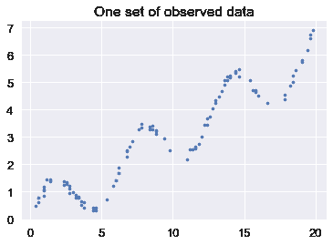
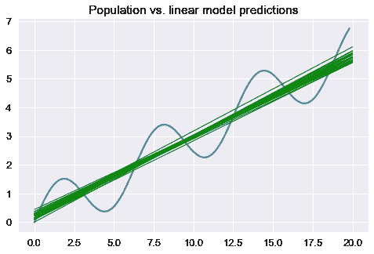
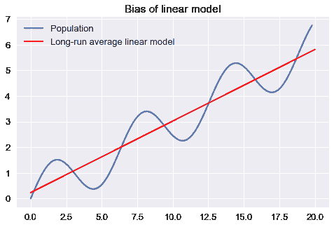
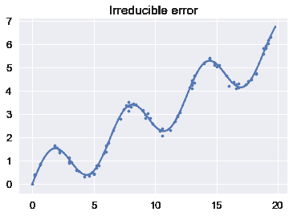
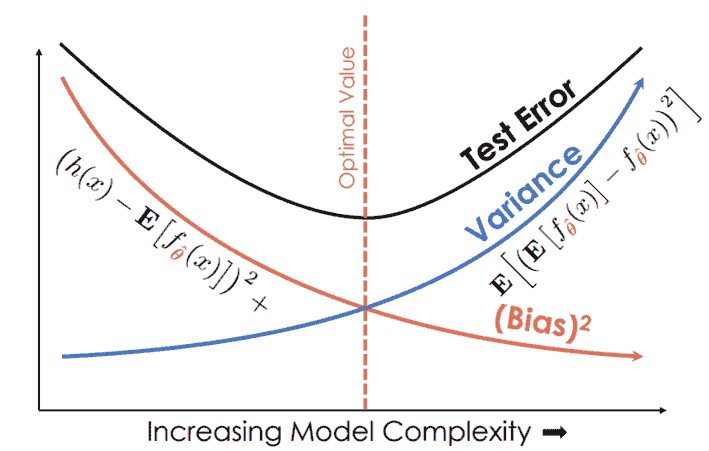
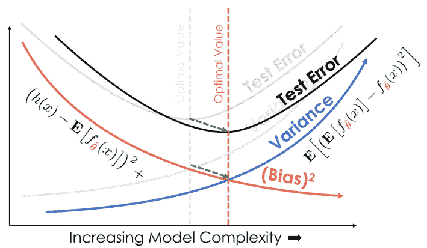
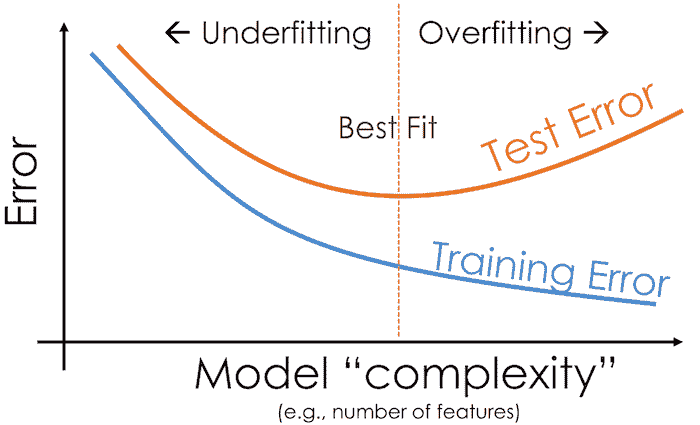
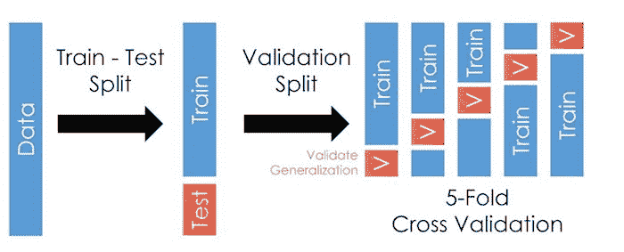
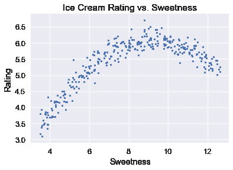
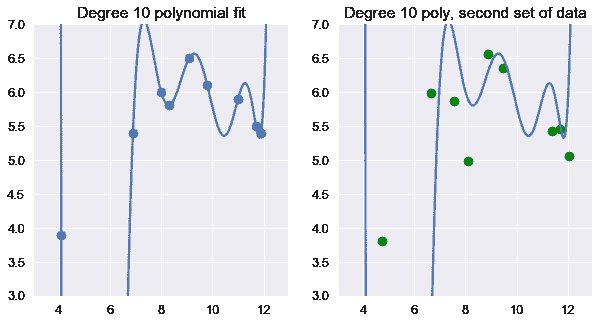

# 偏方差权衡

> 原文：[https://www.textbook.ds100.org/ch/15/bias_intro.html](https://www.textbook.ds100.org/ch/15/bias_intro.html)

```
# HIDDEN
# Clear previously defined variables
%reset -f

# Set directory for data loading to work properly
import os
os.chdir(os.path.expanduser('~/notebooks/15'))

```

有时，我们选择的模型过于简单，无法表示底层数据生成过程。其他时候，我们选择的模型过于复杂，它与数据中的噪声相匹配，而不是数据的整体模式。

为了理解发生这种情况的原因，我们使用概率和统计工具分析我们的模型。这些工具允许我们在描述建模中的基本现象的几个孤立的例子之外进行归纳。特别是，我们将使用期望和方差工具来揭示偏差-方差权衡。

## 15.1 风险和损失最小化

```
# HIDDEN
# Clear previously defined variables
%reset -f

# Set directory for data loading to work properly
import os
os.chdir(os.path.expanduser('~/notebooks/15'))

```

```
# HIDDEN
import warnings
# Ignore numpy dtype warnings. These warnings are caused by an interaction
# between numpy and Cython and can be safely ignored.
# Reference: https://stackoverflow.com/a/40846742
warnings.filterwarnings("ignore", message="numpy.dtype size changed")
warnings.filterwarnings("ignore", message="numpy.ufunc size changed")

import numpy as np
import matplotlib.pyplot as plt
import pandas as pd
import seaborn as sns
%matplotlib inline
import ipywidgets as widgets
from ipywidgets import interact, interactive, fixed, interact_manual
import nbinteract as nbi

sns.set()
sns.set_context('talk')
np.set_printoptions(threshold=20, precision=2, suppress=True)
pd.options.display.max_rows = 7
pd.options.display.max_columns = 8
pd.set_option('precision', 2)
# This option stops scientific notation for pandas
# pd.set_option('display.float_format', '{:.2f}'.format)

```

```
# HIDDEN
def df_interact(df, nrows=7, ncols=7):
    '''
    Outputs sliders that show rows and columns of df
    '''
    def peek(row=0, col=0):
        return df.iloc[row:row + nrows, col:col + ncols]
    if len(df.columns) <= ncols:
        interact(peek, row=(0, len(df) - nrows, nrows), col=fixed(0))
    else:
        interact(peek,
                 row=(0, len(df) - nrows, nrows),
                 col=(0, len(df.columns) - ncols))
    print('({} rows, {} columns) total'.format(df.shape[0], df.shape[1]))

```

为了使用数据进行预测，我们定义了一个模型，在整个数据集中选择一个损失函数，并通过最小化损失来拟合模型的参数。例如，为了进行最小二乘线性回归，我们选择模型：

$$ \begin{aligned} f_\hat{\theta} (x) &= \hat{\theta} \cdot x \end{aligned} $$

损失函数：

$$ \begin{aligned} L(\hat{\theta}, X, y) &= \frac{1}{n} \sum_{i}(y_i - f_\hat{\theta} (X_i))^2\\ \end{aligned} $$

和以前一样，我们使用$\hat \theta$作为模型参数的向量，$x$作为包含一行数据矩阵的向量，$x$和$y$作为观测值的向量进行预测。$X$I$是$X$的第$I$行，$Y$I$是 Y 的第$I$项。

注意，我们在数据集中丢失的函数是每行数据的丢失函数值的平均值。如果我们定义平方损失函数：

$$ \begin{aligned} \ell(y_i, f_\hat{\theta} (x)) &= (y_i - f_\hat{\theta} (x))^2 \end{aligned} $$

然后我们可以更简单地重写平均损失函数：

$$ \begin{aligned} L(\hat{\theta}, X, y) &= \frac{1}{n} \sum_{i} \ell(y_i, f_\hat{\theta} (X_i)) \end{aligned} $$

上面的表达式抽象了特定的损失函数；不管我们选择什么损失函数，我们的整体损失都是平均损失。

通过最小化平均损失，我们选择最适合我们观测数据集的模型参数。到目前为止，我们已经避免对生成数据集的总体进行陈述。然而，在现实中，我们非常有兴趣对整个人口做出良好的预测，而不仅仅是我们已经看到的数据。

## 风险[¶](#Risk)

如果我们的观测数据集$X$和$Y$是从给定的人群中随机抽取的，那么我们的观测数据就是随机变量。如果我们观察到的数据是随机变量，我们的模型参数也是随机变量，每次我们收集一组新的数据并拟合一个模型时，模型$f_ \hat \theta（x）$的参数将略有不同。

假设我们从人群中随机抽取一对输入输出对$Z、\gamma$。我们的模型在这个值上产生的损失是：

$$ \begin{aligned} \ell(\gamma, f_\hat{\theta} (z)) \end{aligned} $$

请注意，这个损失是一个随机变量；不同的观测数据集$X$和$Y$以及来自我们的人口的不同点$Z、\gamma$的损失都会发生变化。

模型$F \Theta 的**风险**是上述所有训练数据$X$、$Y$和所有点$Z$、$Gamma$在人群中的预期损失值：

$$ \begin{aligned} R(f_\hat{\theta}(x)) = \mathbb{E}[ \ell(\gamma, f_\hat{\theta} (z)) ] \end{aligned} $$

请注意，风险是对随机变量的期望，因此 _ 不是 _ 随机本身。公平的六面模具辊的预期值为 3.5，即使辊本身是随机的。

上面的风险有时被称为**真正的风险**，因为它说明了一个模型在整个人群中的作用。如果我们能够计算出所有模型的真实风险，我们就可以简单地选择风险最小的模型，并确定在我们选择损失函数时，模型的长期性能将优于所有其他模型。

## 经验风险

然而，现实并非如此善良。如果我们将期望的定义代入真实风险的公式，我们得到：

$$ \begin{aligned} R(f_\hat{\theta}) &= \mathbb{E}[ \ell(\gamma, f_\hat{\theta} (z)) ] \\ &= \sum_\gamma \sum_z \ell(\gamma, f_\hat{\theta} (z)) P(\gamma, z) \\ \end{aligned} $$

为了进一步简化这个表达式，我们需要知道$P（\gamma，z）$，观察人口中任何点的全局概率分布。不幸的是，这并不容易。假设我们正试图根据表的大小预测提示量。一张三人桌给 14.50 美元小费的概率是多少？如果我们准确地知道点的分布，我们就不必收集数据或拟合模型，我们就已经知道任何给定表的最大可能提示量。

虽然我们不知道人口的确切分布，但是我们可以使用观测数据集$X$和$Y$来近似它。如果从我们的人口中随机抽取$X$和$Y$点，则$X$和$Y$点的分布与人口分布类似。因此，我们将 x 美元和 y 美元视为我们的人口。然后，任何输入输出对$x_i$，$y_i$出现的概率是$\frac 1 n，因为每对输入输出对在$n$积分总数中出现一次。

这允许我们计算**经验风险**，这是真实风险的近似值：

$$ \begin{aligned} \hat R(f_\hat{\theta}) &= \mathbb{E}[ \ell(y_i, f_\hat{\theta} (X_i)) ] \\ &= \sum_{i=1}^n \ell(y_i, f_\hat{\theta} (X_i)) \frac{1}{n} \\ &= \frac{1}{n} \sum_{i=1}^n \ell(y_i, f_\hat{\theta} (X_i)) \end{aligned} $$

如果我们的数据集很大，并且数据是随机从人群中提取的，那么经验风险$\hat R（f \theta）$接近真实风险$R（f \hat \theta）$。这使我们能够选择最小化经验风险的模型。

请注意，此表达式是节开头的平均损失函数！通过最小化平均损失，我们也可以最小化经验风险。这解释了为什么我们经常使用平均损失作为我们的整体损失函数，而不是最大损失，例如。

## 摘要[¶](#Summary)

预测模型的真实风险描述了模型将为人口带来的总体长期损失。由于我们通常不能直接计算真实风险，因此我们计算的是经验风险，并使用经验风险找到一个合适的预测模型。由于经验风险是观测数据集上的平均损失，因此在拟合模型时，我们通常将平均损失最小化。

## 15.2 模型偏差和方差

```
# HIDDEN
# Clear previously defined variables
%reset -f

# Set directory for data loading to work properly
import os
os.chdir(os.path.expanduser('~/notebooks/15'))

```

```
# HIDDEN
import warnings
# Ignore numpy dtype warnings. These warnings are caused by an interaction
# between numpy and Cython and can be safely ignored.
# Reference: https://stackoverflow.com/a/40846742
warnings.filterwarnings("ignore", message="numpy.dtype size changed")
warnings.filterwarnings("ignore", message="numpy.ufunc size changed")

import numpy as np
import matplotlib.pyplot as plt
import pandas as pd
import seaborn as sns
%matplotlib inline
import ipywidgets as widgets
from ipywidgets import interact, interactive, fixed, interact_manual
import nbinteract as nbi

sns.set()
sns.set_context('talk')
np.set_printoptions(threshold=20, precision=2, suppress=True)
pd.options.display.max_rows = 7
pd.options.display.max_columns = 8
pd.set_option('precision', 2)
# This option stops scientific notation for pandas
# pd.set_option('display.float_format', '{:.2f}'.format)

```

```
# HIDDEN
def df_interact(df, nrows=7, ncols=7):
    '''
    Outputs sliders that show rows and columns of df
    '''
    def peek(row=0, col=0):
        return df.iloc[row:row + nrows, col:col + ncols]
    if len(df.columns) <= ncols:
        interact(peek, row=(0, len(df) - nrows, nrows), col=fixed(0))
    else:
        interact(peek,
                 row=(0, len(df) - nrows, nrows),
                 col=(0, len(df.columns) - ncols))
    print('({} rows, {} columns) total'.format(df.shape[0], df.shape[1]))

```

我们之前已经看到，我们选择的模型有两个基本的错误来源。

我们的模型可能过于简单——例如，线性模型无法正确地拟合由二次过程生成的数据。这种类型的错误是由模型**偏差**引起的。

我们的模型也可能适合数据中的随机噪声，即使我们使用二次模型拟合二次过程，模型也可能预测不同于实际过程产生的结果。这种类型的错误是由模型**方差**引起的。

## 偏差方差分解

我们可以通过分解模型风险的公式，使上面的陈述更加精确。回想一下，$f \theta 型号的**风险**是所有可能的训练数据集$x$、$y$和所有输入输出点$z$、$\gamma$在总体上的预期损失：

$$ \begin{aligned} R(f_\hat{\theta}) = \mathbb{E}[ \ell(\gamma, f_\hat{\theta} (z)) ] \end{aligned} $$

我们将生成真实人口数据的过程表示为$f_yta（x）$。输出点$\gamma$由我们的填充过程加上数据收集中的一些随机噪声生成：$\gamma_i=f_ \theta（z_i）+\epsilon$。随机噪声$\epsilon$是平均值为零的随机变量：$\mathbb e[\epsilon]=0$。

如果我们使用平方误差作为损失函数，则上述表达式将变为：

$$ \begin{aligned} R(f_\hat{\theta}) = \mathbb{E}[ (\gamma - f_\hat{\theta} (z))^2 ] \end{aligned} $$

通过一些代数运算，我们可以证明上述表达式等价于：

$$ \begin{aligned} R(f_\hat{\theta}) = (\mathbb{E}[f_\hat{\theta}(z)] - f_\theta(z))^2 + \text{Var}(f_\hat{\theta}(z)) + \text{Var}(\epsilon) \end{aligned} $$

此表达式中的第一个术语$（\mathbb e[f \theta（z）]-f \theta（z））^2$是模型偏差的数学表达式。（从技术上讲，这个术语表示偏差平方，$\text 偏差^2$）如果从长远来看，我们选择$f \theta（z）$模型预测人口过程产生的相同结果，$f \theta（z）$则偏差等于零。如果我们选择的模型对总体过程的预测很差，那么即使我们将整个总体作为数据集，这种偏差也是很高的。

此表达式中的第二个术语，$\text var（f \that \theta（z））$表示模型方差。当模型的预测在不同的数据集上训练时变化不大时，方差很小。当模型在来自总体的不同数据集上训练时，当模型的预测发生很大变化时，方差很大。

此表达式中的第三个也是最后一个术语，$\text var（\epsilon）$表示数据生成和收集过程中不可减少的错误或噪声。当数据生成和收集过程很精确或变化很小时，这个术语就很小。当数据包含大量噪声时，此术语很大。

## 偏差方差分解的推导

为了开始分解，我们从均方误差开始：

$$\mathbb{E}[(\gamma - f_{\hat{\theta}}(z))^2]$$

并展开平方，应用期望线性：

$$ =\mathbb{E}[\gamma^2 -2\gamma f_{\hat{\theta}} +f_\hat{\theta}(z)^2]$$

$=\mathbb e[\gamma^2]-\mathbb e[2\gamma f \hat \theta（z）]+\mathbb[f \hat \theta（z）^2]$$

由于\ \\\123\\123 \123 123 ；（Z）美元。然后，我们用$F_uyta（z）+\epsilon$替换$\gamma$：

$$ =\mathbb{E}[(f_\theta(z) + \epsilon)^2] - \mathbb{E}[2(f_\theta(z) + \epsilon)] \mathbb{E}[f_{\hat{\theta}}(z)] + \mathbb{E}[f_{\hat{\theta}}(z)^2]$$

再简单化一些：（注意，$\mathbb e[f \theta（z）]=f \theta（z）$因为$f \theta（z）$是一个确定性函数，给定一个特定的查询点$z$。）

$$ =\mathbb{E}[f_\theta(z)^2 + 2f_\theta(z) \epsilon + \epsilon^2] - (2f_\theta(z) + \mathbb{E}[2\epsilon]) \mathbb{E}[f_{\hat{\theta}}(z)] + \mathbb{E}[f_{\hat{\theta}}(z)^2]$$

再次应用期望线性：

$$= f_\theta(z)^2 + 2f_\theta(z)\mathbb{E}[\epsilon] + \mathbb{E}[\epsilon^2] - (2f_\theta(z) + 2\mathbb{E}[\epsilon]) \mathbb{E}[f_{\hat{\theta}}(z)] + \mathbb{E}[f_{\hat{\theta}}(z)^2]$$

注意到$\big（\mathbb e[\epsilon]=0\big）=&gt；\big（\mathbb[\epsilon^2]=\text var（\epsilon）\big）$因为$\text var（\epsilon）=\mathbb

$$ = f_\theta(z)^2 + \text{Var}(\epsilon) - 2f_\theta(z) \mathbb{E}[f_{\hat{\theta}}(z)] + \mathbb{E}[f_{\hat{\theta}}(z)^2]$$

然后我们可以将方程改写为：

$$ = f_\theta(z)^2 + \text{Var}(\epsilon) - 2f_\theta(z) \mathbb{E}[f_{\hat{\theta}}(z)] + \mathbb{E}[f_{\hat{\theta}}(z)^2] - \mathbb{E}[f_{\hat{\theta}}(z)]^2 + \mathbb{E}[f_{\hat{\theta}}(z)]^2$$

因为$\mathbb e[f \hat \theta（z）^2]-\mathbb[f \hat \theta（z）]2=var（f \hat \theta（z））$：

$$ = f_\theta(z)^2 - 2f_\theta(z) \mathbb{E}[f_{\hat{\theta}}(z)] + \mathbb{E}[f_{\hat{\theta}}(z)]^2 + Var(f_{\hat{\theta}}(z)) + \text{Var}(\epsilon)$$$$ = (f_\theta(z) - \mathbb{E}[f_{\hat{\theta}}(z)])^2 + Var(f_{\hat{\theta}}(z)) + \text{Var}(\epsilon) $$$$= \text{bias}^2 + \text{model variance} + \text{noise}$$

为了选择一个性能良好的模型，我们寻求最小化风险。为了最小化风险，我们尝试最小化偏差方差分解的偏差、方差和噪声项。例如，降低噪声项通常需要改进数据采集过程，以购买更精确的传感器。然而，为了减少偏差和方差，我们必须调整模型的复杂性。过于简单的模型具有较高的偏差；过于复杂的模型具有较高的方差。这就是 _ 偏差方差权衡 _ 的本质，这是我们在选择预测模型时面临的一个基本问题。

## 示例：线性回归和正弦波

假设我们正在对下面所示的振荡函数生成的数据进行建模。

```
# HIDDEN
from collections import namedtuple
from sklearn.linear_model import LinearRegression

np.random.seed(42)

Line = namedtuple('Line', ['x_start', 'x_end', 'y_start', 'y_end'])

def f(x): return np.sin(x) + 0.3 * x

def noise(n):
    return np.random.normal(scale=0.1, size=n)

def draw(n):
    points = np.random.choice(np.arange(0, 20, 0.2), size=n)
    return points, f(points) + noise(n)

def fit_line(x, y, x_start=0, x_end=20):
    clf = LinearRegression().fit(x.reshape(-1, 1), y)
    return Line(x_start, x_end, clf.predict(x_start)[0], clf.predict(x_end)[0])

population_x = np.arange(0, 20, 0.2)
population_y = f(population_x)

avg_line = fit_line(population_x, population_y)

datasets = [draw(100) for _ in range(20)]
random_lines = [fit_line(x, y) for x, y in datasets]

```

```
# HIDDEN
plt.plot(population_x, population_y)
plt.title('True underlying data generation process');

```


如果我们从人群中随机抽取一个数据集，我们可能会得到以下结果：

```
# HIDDEN
xs, ys = draw(100)
plt.scatter(xs, ys, s=10)
plt.title('One set of observed data');

```



假设我们从总体中提取许多数据集，并将一个简单的线性模型拟合到每个数据集。下面，我们用蓝色绘制人口数据生成方案，用绿色绘制模型预测。

```
# HIDDEN
plt.figure(figsize=(8, 5))
plt.plot(population_x, population_y)

for x_start, x_end, y_start, y_end in random_lines:
    plt.plot([x_start, x_end], [y_start, y_end], linewidth=1, c='g')

plt.title('Population vs. linear model predictions');

```



上面的图表清楚地表明，一个线性模型会对这个群体产生预测误差。我们可以将预测误差分解为偏差、方差和不可约噪声。我们通过显示长期平均线性模型将预测不同于人口过程的结果来说明我们模型的偏差：

```
plt.figure(figsize=(8, 5))
xs = np.arange(0, 20, 0.2)
plt.plot(population_x, population_y, label='Population')

plt.plot([avg_line.x_start, avg_line.x_end],
         [avg_line.y_start, avg_line.y_end],
         linewidth=2, c='r',
         label='Long-run average linear model')
plt.title('Bias of linear model')
plt.legend();

```



我们模型的方差是围绕长期平均模型的模型预测的方差：

```
plt.figure(figsize=(8, 5))
for x_start, x_end, y_start, y_end in random_lines:
    plt.plot([x_start, x_end], [y_start, y_end], linewidth=1, c='g', alpha=0.8)

plt.plot([avg_line.x_start, avg_line.x_end],
         [avg_line.y_start, avg_line.y_end],
         linewidth=4, c='r')

plt.title('Variance of linear model');

```


最后，我们通过显示观测点与底层总体过程的偏差来说明不可约误差。

```
# HIDDEN
plt.plot(population_x, population_y)

xs, ys = draw(100)
plt.scatter(xs, ys, s=10)
plt.title('Irreducible error');

```



## 实践偏差方差

在理想的情况下，我们将最小化我们的模型对总体中所有输入输出点的预期预测误差。然而，在实践中，我们不知道总体数据的生成过程，因此无法精确地确定模型的偏差、方差或不可约误差。相反，我们使用我们的观测数据集作为人口的近似值。

然而，正如我们所看到的，实现一个低的训练错误并不一定意味着我们的模型也将有一个低的测试错误。通过拟合一条经过每次训练观测的曲线，可以很容易地得到一个偏差极低、训练误差小的模型。然而，该模型具有很高的方差，这通常会导致很高的测试误差。相反，预测常数的模型具有低方差但高偏差。从根本上说，这是因为训练误差反映了我们模型的偏差，而不是方差；测试误差反映了两者。为了使测试误差最小化，我们的模型需要同时实现低偏差和低方差。为此，我们需要一种不使用测试集来模拟测试错误的方法。这通常是通过交叉验证完成的。

## 抽头[¶](#Takeaways)

偏差-方差权衡使我们能够更准确地描述我们迄今为止所看到的建模现象。

下溢通常是由过多的偏差引起的；过度拟合通常是由过多的模型方差引起的。

收集更多的数据可以减少差异。例如，线性回归的模型方差下降了$1/N$的因子，其中$N$是数据点的数量。因此，将数据集大小加倍将使模型方差减半，并且收集许多数据点将导致方差接近 0。最近的一个趋势是选择一个具有低偏差和高内在方差的模型（例如神经网络），并收集许多数据点，使模型方差足够低，能够做出准确的预测。虽然在实践中有效，但是为这些模型收集足够的数据往往需要大量的时间和金钱。

如果模型能够精确地适应人口过程，收集更多的数据可以减少偏差。如果模型本身无法对总体进行建模（如上例所示），即使是无限的数据也无法消除模型偏差。

向数据中添加一个有用的特性，例如，当底层进程是二次的时候，添加一个二次特性，可以减少偏差。添加一个无用的特性很少会增加偏差。

添加一个功能，无论是否有用，通常都会增加模型差异，因为每个新功能都会向模型添加一个参数。一般来说，具有许多参数的模型有许多可能的参数组合，因此比具有很少参数的模型具有更高的方差。为了提高模型的预测精度，新特征应该比增加方差更能减少偏差。

删除功能通常会增加偏差，并可能导致下溢。例如，一个简单的线性模型比添加了二次特征的同一个模型具有更高的模型偏差。如果数据是由二次现象生成的，那么简单的线性模型将在数据下方。

在下面的图表中，X 轴测量模型复杂性，Y 轴测量大小。请注意，随着模型复杂性的增加，模型偏差将严格减少，模型方差将严格增加。当我们选择更复杂的模型时，测试误差首先减小，然后随着模型方差的增加而增加，而大于模型偏差的减少。



如图所示，一个高复杂度的模型可以实现较低的训练误差，但由于其模型方差较大，不能推广到测试集。另一方面，复杂度较低的模型方差较低，但由于模型偏差较大，无法推广。为了选择一个有用的模型，我们必须在模型偏差和方差之间取得平衡。

当我们添加更多的数据时，我们将绘图上的曲线向右和向下移动，减少偏差和方差：



## 摘要[¶](#Summary)

偏差-方差权衡揭示了建模中的一个基本问题。为了使模型风险最小化，我们结合了特征工程、模型选择和交叉验证来平衡偏差和方差。

## 15.3 交叉验证

```
# HIDDEN
# Clear previously defined variables
%reset -f

# Set directory for data loading to work properly
import os
os.chdir(os.path.expanduser('~/notebooks/15'))

```

```
# HIDDEN
import warnings
# Ignore numpy dtype warnings. These warnings are caused by an interaction
# between numpy and Cython and can be safely ignored.
# Reference: https://stackoverflow.com/a/40846742
warnings.filterwarnings("ignore", message="numpy.dtype size changed")
warnings.filterwarnings("ignore", message="numpy.ufunc size changed")

import numpy as np
import matplotlib.pyplot as plt
import pandas as pd
import seaborn as sns
%matplotlib inline
import ipywidgets as widgets
from ipywidgets import interact, interactive, fixed, interact_manual
import nbinteract as nbi

sns.set()
sns.set_context('talk')
np.set_printoptions(threshold=20, precision=2, suppress=True)
pd.options.display.max_rows = 7
pd.options.display.max_columns = 8
pd.set_option('precision', 2)
# This option stops scientific notation for pandas
# pd.set_option('display.float_format', '{:.2f}'.format)

```

```
# HIDDEN
def df_interact(df, nrows=7, ncols=7):
    '''
    Outputs sliders that show rows and columns of df
    '''
    def peek(row=0, col=0):
        return df.iloc[row:row + nrows, col:col + ncols]
    if len(df.columns) <= ncols:
        interact(peek, row=(0, len(df) - nrows, nrows), col=fixed(0))
    else:
        interact(peek,
                 row=(0, len(df) - nrows, nrows),
                 col=(0, len(df.columns) - ncols))
    print('({} rows, {} columns) total'.format(df.shape[0], df.shape[1]))

```

在前一节中，我们观察到，我们需要一种更精确的方法来模拟测试误差来管理偏差方差权衡。重申一下，由于我们正在将我们的模型拟合到训练集上，因此训练误差非常低。我们需要在不使用测试集的情况下选择一个模型，因此我们再次将我们的培训集分割成一个验证集。交叉验证提供了一种方法，通过将用于培训的数据与用于模型选择和最终精度的数据分离，使用单个观测数据集估计模型误差。

## 列车验证试验拆分

实现这一点的一种方法是将原始数据集拆分为三个不相交的子集：

*   训练集：用于拟合模型的数据。
*   验证集：用于选择功能的数据。
*   测试集：用于报告模型最终精度的数据。

拆分后，我们根据以下步骤选择一组特征和一个模型：

1.  对于每个潜在的功能集，使用训练集拟合模型。模型在训练集上的错误是它的 _ 训练错误 _。
2.  检查验证集上每个模型的错误：其 _ 验证错误 _。选择实现最低验证错误的模型。这是功能和模型的最终选择。
3.  计算测试集上最终模型的 _ 测试误差 _，误差。这是模型的最终报告精度。我们禁止调整特性或模型以减少测试错误；这样做可以有效地将测试集转换为验证集。相反，我们必须在对特性或模型进行进一步更改之后收集一个新的测试集。

这个过程允许我们比单独使用训练错误更准确地确定要使用的模型。通过交叉验证，我们可以在不适合的数据上测试我们的模型，在不使用测试集的情况下模拟测试错误。这让我们了解了我们的模型是如何对看不见的数据执行的。

**列车验证试验段尺寸**

列车验证测试拆分通常使用 70%的数据作为训练集，15%作为验证集，其余 15%作为测试集。增加训练集的大小有助于模型的准确性，但会导致验证和测试错误的更多变化。这是因为较小的验证集和测试集对样本数据的代表性较小。

## 训练错误和测试错误

如果一个模型不能推广到人口中看不见的数据，那么它对我们几乎没有用处。由于我们不使用测试集来训练模型或选择特性，因此测试错误可以最准确地表示模型在新数据上的性能。

一般来说，训练误差会随着模型的复杂度的增加而减小，因为模型具有附加的特性或更复杂的预测机制。另一方面，测试误差降低到一定程度的复杂性，然后随着模型与训练集的过度匹配而再次增加。这是由于这样一个事实：首先，偏差的减少大于方差的增加。最终，方差的增加超过了偏差的减少。

## K-折叠交叉验证

**列车验证测试拆分**方法是通过验证集模拟试验误差的一种好方法。但是，进行三个分割会导致训练数据太少。此外，使用这种方法，验证错误可能会倾向于高方差，因为对错误的评估很大程度上取决于培训和验证集中的结束点。

为了解决这个问题，我们可以在同一个数据集中多次运行列车验证拆分。数据集分为 _k_ 等大小的子集（_$k$folds_），列车验证拆分重复 _k_ 次。每次使用一个 _k_ 折叠作为验证集，剩余的 _k-1_ 折叠用作培训集。我们将模型的最终验证错误报告为每个试验$k$验证错误的平均值。此方法称为**K-折叠交叉验证**。

下图说明了使用五个折叠时的技术：



该方法的最大优点是，每个数据点仅用于一次验证和训练 _K-1_ 次。通常，使用介于 5 到 10 之间的 _k_，但 _k_ 仍是未固定的参数。当 _k_ 很小时，误差估计具有较低的方差（许多验证点），但具有较高的偏差（较少的训练点）。反之，当 _k_ 较大时，误差估计的偏差较小，但方差较大。

$K$折叠交叉验证比火车验证拆分需要更多的计算时间，因为我们通常必须为每个折叠从头重新安装每个模型。但是，它通过对每个模型的多个错误进行平均来计算更精确的验证错误。

`scikit-learn`库提供了一个方便的[`sklearn.model_selection.KFold`](http://scikit-learn.org/stable/modules/generated/sklearn.model_selection.KFold.html)类来实现$k$的交叉验证。

## 偏差方差权衡

交叉验证有助于我们更准确地管理偏差-方差权衡。直观地说，验证错误通过在不用于培训的数据集上检查模型的性能来估计测试错误；这允许我们同时估计模型偏差和模型方差。k 倍交叉验证还包括这样一个事实：测试集中的噪声只影响偏差方差分解中的噪声项，而训练集中的噪声同时影响偏差和模型方差。要选择要使用的最终模型，我们选择验证错误最小的模型。

## 示例：冰淇淋评级的型号选择[¶](#Example:-Model-Selection-for-Ice-Cream-Ratings)

我们将使用完整的模型选择过程，包括交叉验证，来选择一个预测冰淇淋甜度等级的模型。完整的冰淇淋数据集和整体评分与冰淇淋甜度的散点图如下所示。

```
# HIDDEN
ice = pd.read_csv('icecream.csv')
transformer = PolynomialFeatures(degree=2)
X = transformer.fit_transform(ice[['sweetness']])

clf = LinearRegression(fit_intercept=False).fit(X, ice[['overall']])
xs = np.linspace(3.5, 12.5, 300).reshape(-1, 1)
rating_pred = clf.predict(transformer.transform(xs))

temp = pd.DataFrame(xs, columns = ['sweetness'])
temp['overall'] = rating_pred

np.random.seed(42)
x_devs = np.random.normal(scale=0.2, size=len(temp))
y_devs = np.random.normal(scale=0.2, size=len(temp))
temp['sweetness'] = np.round(temp['sweetness'] + x_devs, decimals=2)
temp['overall'] = np.round(temp['overall'] + y_devs, decimals=2)

ice = pd.concat([temp, ice])

```

```
ice

```

|  | 甜度 | 总体的 |
| --- | --- | --- |
| 零 | 3.60 条 | 三点零九 |
| --- | --- | --- |
| 1 个 | 3.50 美元 | 三点一七 |
| --- | --- | --- |
| 二 | 三点六九 | 三点四六 |
| --- | --- | --- |
| …… | …… | ... |
| --- | --- | --- |
| 六 | 十一 | 五点九零 |
| --- | --- | --- |
| 七 | 十一点七零 | 5.50 美元 |
| --- | --- | --- |
| 8 个 | 十一点九零 | 五点四零 |
| --- | --- | --- |

309 行×2 列

```
# HIDDEN
plt.scatter(ice['sweetness'], ice['overall'], s=10)
plt.title('Ice Cream Rating vs. Sweetness')
plt.xlabel('Sweetness')
plt.ylabel('Rating');

```



在数据集中的 9 个随机点上使用 10 次多项式特征，可以得到这些数据点的精确模型。不幸的是，这个模型不能概括为以前从总体中看不到的数据。

```
# HIDDEN
from sklearn.preprocessing import PolynomialFeatures
from sklearn.linear_model import LinearRegression

ice2 = pd.read_csv('icecream.csv')
trans_ten = PolynomialFeatures(degree=10)
X_ten = trans_ten.fit_transform(ice2[['sweetness']])
y = ice2['overall']

clf_ten = LinearRegression(fit_intercept=False).fit(X_ten, y)

```

```
# HIDDEN
np.random.seed(1)
x_devs = np.random.normal(scale=0.4, size=len(ice2))
y_devs = np.random.normal(scale=0.4, size=len(ice2))

plt.figure(figsize=(10, 5))

plt.subplot(121)
plt.scatter(ice2['sweetness'], ice2['overall'])
xs = np.linspace(3.5, 12.5, 1000).reshape(-1, 1)
ys = clf_ten.predict(trans_ten.transform(xs))
plt.plot(xs, ys)
plt.title('Degree 10 polynomial fit')
plt.ylim(3, 7);

plt.subplot(122)
ys = clf_ten.predict(trans_ten.transform(xs))
plt.plot(xs, ys)
plt.scatter(ice2['sweetness'] + x_devs,
            ice2['overall'] + y_devs,
            c='g')
plt.title('Degree 10 poly, second set of data')
plt.ylim(3, 7);

```



代替上述方法，我们首先使用`scikit-learn`'s[`sklearn.model_selection.train_test_split`](http://scikit-learn.org/stable/modules/generated/sklearn.model_selection.train_test_split.html)方法将数据划分为培训、验证和测试数据集，以执行 70/30%的列车测试分割。

```
from sklearn.model_selection import train_test_split

test_size = 92

X_train, X_test, y_train, y_test = train_test_split(
    ice[['sweetness']], ice['overall'], test_size=test_size, random_state=0)

print(f'  Training set size: {len(X_train)}')
print(f'      Test set size: {len(X_test)}')

```

```
  Training set size: 217
      Test set size: 92

```

我们现在使用训练集拟合多项式回归模型，每个多项式阶数从 1 到 10 为一个。

```
from sklearn.linear_model import LinearRegression
from sklearn.preprocessing import PolynomialFeatures

# First, we add polynomial features to X_train
transformers = [PolynomialFeatures(degree=deg)
                for deg in range(1, 11)]
X_train_polys = [transformer.fit_transform(X_train)
                 for transformer in transformers]

# Display the X_train with degree 5 polynomial features
X_train_polys[4]

```

```
array([[     1\.  ,      8.8 ,     77.44,    681.47,   5996.95,  52773.19],
       [     1\.  ,     10.74,    115.35,   1238.83,  13305.07, 142896.44],
       [     1\.  ,      9.98,     99.6 ,    994.01,   9920.24,  99003.99],
       ...,
       [     1\.  ,      6.79,     46.1 ,    313.05,   2125.59,  14432.74],
       [     1\.  ,      5.13,     26.32,    135.01,    692.58,   3552.93],
       [     1\.  ,      8.66,     75\.  ,    649.46,   5624.34,  48706.78]])
```

然后我们将对 10 个特征数据集执行 5 倍交叉验证。为此，我们将定义一个函数：

1.  使用[`KFold.split`](http://scikit-learn.org/stable/modules/generated/sklearn.model_selection.KFold.html)函数获取训练数据的 5 个拆分。请注意，`split`返回该拆分数据的索引。
2.  对于每个拆分，根据拆分索引和特征选择行和列。
3.  在训练分割上拟合线性模型。
4.  计算验证拆分的均方误差。
5.  返回所有交叉验证拆分的平均错误。

```
from sklearn.model_selection import KFold

def mse_cost(y_pred, y_actual):
    return np.mean((y_pred - y_actual) ** 2)

def compute_CV_error(model, X_train, Y_train):
    kf = KFold(n_splits=5)
    validation_errors = []

    for train_idx, valid_idx in kf.split(X_train):
        # split the data
        split_X_train, split_X_valid = X_train[train_idx], X_train[valid_idx]
        split_Y_train, split_Y_valid = Y_train.iloc[train_idx], Y_train.iloc[valid_idx]

        # Fit the model on the training split
        model.fit(split_X_train,split_Y_train)

        # Compute the RMSE on the validation split
        error = mse_cost(split_Y_valid,model.predict(split_X_valid))

        validation_errors.append(error)

    #average validation errors
    return np.mean(validation_errors)

```

```
# We train a linear regression classifier for each featurized dataset and perform cross-validation
# We set fit_intercept=False for our linear regression classifier since 
# the PolynomialFeatures transformer adds the bias column for us.

cross_validation_errors = [compute_CV_error(LinearRegression(fit_intercept=False), X_train_poly, y_train)
                     for X_train_poly in X_train_polys]

```

```
# HIDDEN
cv_df = pd.DataFrame({'Validation Error': cross_validation_errors}, index=range(1, 11))
cv_df.index.name = 'Degree'
pd.options.display.max_rows = 20
display(cv_df)
pd.options.display.max_rows = 7

```

|  | 验证错误 |
| --- | --- |
| 度 |  |
| --- | --- |
| 1 | 0.324820 个 |
| --- | --- |
| 2 | 0.045060 |
| --- | --- |
| 三 | 0.045418 |
| --- | --- |
| 四 | 0.045282 个 |
| --- | --- |
| 5 个 | 0.046272 |
| --- | --- |
| 6 | 0.046715 |
| --- | --- |
| 7 | 0.047140 |
| --- | --- |
| 8 | 0.047540 |
| --- | --- |
| 九 | 0.048055 |
| --- | --- |
| 10 个 | 0.047805 |
| --- | --- |

我们可以看到，当我们使用更高阶多项式特征时，验证误差会减少和增加。

```
# HIDDEN
plt.figure(figsize=(10, 5))

plt.subplot(121)
plt.plot(cv_df.index, cv_df['Validation Error'])
plt.scatter(cv_df.index, cv_df['Validation Error'])
plt.title('Validation Error vs. Polynomial Degree')
plt.xlabel('Polynomial Degree')
plt.ylabel('Validation Error');

plt.subplot(122)
plt.plot(cv_df.index, cv_df['Validation Error'])
plt.scatter(cv_df.index, cv_df['Validation Error'])
plt.ylim(0.044925, 0.05)
plt.title('Zoomed In')
plt.xlabel('Polynomial Degree')
plt.ylabel('Validation Error')

plt.tight_layout();

```


检验验证误差表明，最精确的模型只使用二次多项式特征。因此，我们选择二次多项式模型作为最终模型，并将其一次拟合到所有训练数据上。然后，我们在测试集中计算它的错误。

```
best_trans = transformers[1]
best_model = LinearRegression(fit_intercept=False).fit(X_train_polys[1], y_train)

training_error = mse_cost(best_model.predict(X_train_polys[1]), y_train)
validation_error = cross_validation_errors[1]
test_error = mse_cost(best_model.predict(best_trans.transform(X_test)), y_test)

print('Degree 2 polynomial')
print(f'  Training error: {training_error:0.5f}')
print(f'Validation error: {validation_error:0.5f}')
print(f'      Test error: {test_error:0.5f}')

```

```
Degree 2 polynomial
  Training error: 0.04409
Validation error: 0.04506
      Test error: 0.04698

```

为了将来的参考，`scikit-learn`有一个[`cross_val_predict`](http://scikit-learn.org/stable/modules/generated/sklearn.model_selection.cross_val_predict.html)方法来自动执行交叉验证，所以我们不必自己将数据分解为训练集和验证集。

另外，请注意，测试误差大于验证误差，验证误差大于训练误差。训练误差应该是最小的，因为模型适合训练数据。拟合模型可以最大限度地减少该数据集的均方误差。验证误差和测试误差通常高于训练误差，因为误差是在模型未看到的未知数据集上计算的。

## 摘要[¶](#Summary)

我们使用广泛使用的交叉验证技术来管理偏差-方差权衡。在计算了原始数据集上的列车验证测试分割后，我们使用以下过程来训练和选择模型。

1.  对于每个潜在的功能集，使用训练集拟合模型。模型在训练集上的错误是它的 _ 训练错误 _。
2.  使用$K$交叉验证检查验证集上每个模型的错误：其 _ 验证错误 _。选择实现最低验证错误的模型。这是功能和模型的最终选择。
3.  计算测试集上最终模型的 _ 测试误差 _，误差。这是模型的最终报告精度。我们禁止调整模型以增加测试错误；这样做可以有效地将测试集转换为验证集。相反，我们必须在对模型进行进一步更改之后收集一个新的测试集。