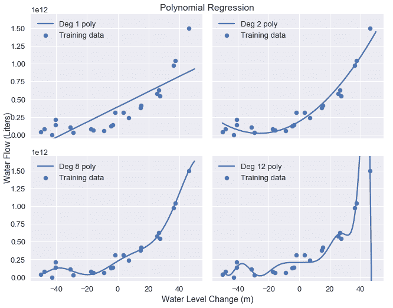
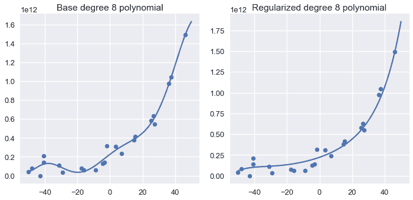
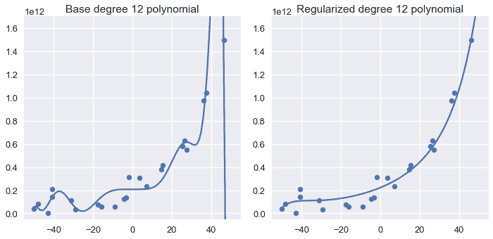
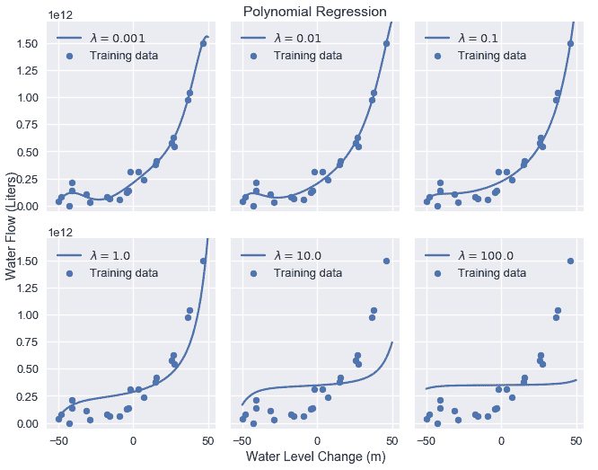
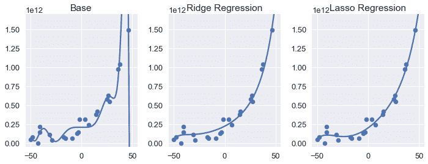

# 正规化

> 原文：[https://www.textbook.ds100.org/ch/16/reg_intro.html](https://www.textbook.ds100.org/ch/16/reg_intro.html)

```
# HIDDEN
# Clear previously defined variables
%reset -f

# Set directory for data loading to work properly
import os
os.chdir(os.path.expanduser('~/notebooks/16'))

```

特征工程可以将有关数据生成过程的重要信息合并到我们的模型中。但是，向数据中添加特性通常也会增加模型的方差，从而导致总体性能变差。我们可以使用一种称为正则化的技术来减少模型的方差，同时尽可能多地合并有关数据的信息，而不是完全抛弃特性。

## 16.1 正则化直觉

```
# HIDDEN
# Clear previously defined variables
%reset -f

# Set directory for data loading to work properly
import os
os.chdir(os.path.expanduser('~/notebooks/16'))

```

```
# HIDDEN
import warnings
# Ignore numpy dtype warnings. These warnings are caused by an interaction
# between numpy and Cython and can be safely ignored.
# Reference: https://stackoverflow.com/a/40846742
warnings.filterwarnings("ignore", message="numpy.dtype size changed")
warnings.filterwarnings("ignore", message="numpy.ufunc size changed")

import numpy as np
import matplotlib.pyplot as plt
import pandas as pd
import seaborn as sns
%matplotlib inline
import ipywidgets as widgets
from ipywidgets import interact, interactive, fixed, interact_manual
import nbinteract as nbi

sns.set()
sns.set_context('talk')
np.set_printoptions(threshold=20, precision=2, suppress=True)
pd.options.display.max_rows = 7
pd.options.display.max_columns = 8
pd.set_option('precision', 2)
# This option stops scientific notation for pandas
# pd.set_option('display.float_format', '{:.2f}'.format)

```

```
# HIDDEN
def df_interact(df, nrows=7, ncols=7):
    '''
    Outputs sliders that show rows and columns of df
    '''
    def peek(row=0, col=0):
        return df.iloc[row:row + nrows, col:col + ncols]
    if len(df.columns) <= ncols:
        interact(peek, row=(0, len(df) - nrows, nrows), col=fixed(0))
    else:
        interact(peek,
                 row=(0, len(df) - nrows, nrows),
                 col=(0, len(df.columns) - ncols))
    print('({} rows, {} columns) total'.format(df.shape[0], df.shape[1]))

```

```
# HIDDEN
df = pd.read_csv('water_large.csv')

```

```
# HIDDEN
from collections import namedtuple
Curve = namedtuple('Curve', ['xs', 'ys'])

def flatten(seq): return [item for subseq in seq for item in subseq]

def make_curve(clf, x_start=-50, x_end=50):
    xs = np.linspace(x_start, x_end, num=100)
    ys = clf.predict(xs.reshape(-1, 1))
    return Curve(xs, ys)

def plot_data(df=df, ax=plt, **kwargs):
    ax.scatter(df.iloc[:, 0], df.iloc[:, 1], s=50, **kwargs)

def plot_curve(curve, ax=plt, **kwargs):
    ax.plot(curve.xs, curve.ys, **kwargs)

def plot_curves(curves, cols=2):
    rows = int(np.ceil(len(curves) / cols))
    fig, axes = plt.subplots(rows, cols, figsize=(10, 8),
                             sharex=True, sharey=True)
    for ax, curve, deg in zip(flatten(axes), curves, degrees):
        plot_data(ax=ax, label='Training data')
        plot_curve(curve, ax=ax, label=f'Deg {deg} poly')
        ax.set_ylim(-5e10, 170e10)
        ax.legend()

    # add a big axes, hide frame
    fig.add_subplot(111, frameon=False)
    # hide tick and tick label of the big axes
    plt.tick_params(labelcolor='none', top='off', bottom='off',
                    left='off', right='off')
    plt.grid(False)
    plt.title('Polynomial Regression')
    plt.xlabel('Water Level Change (m)')
    plt.ylabel('Water Flow (Liters)')
    plt.tight_layout()

def print_coef(clf):
    reg = clf.named_steps['reg']
    print(reg.intercept_)
    print(reg.coef_)

```

```
# HIDDEN
X = df.iloc[:, [0]].as_matrix()
y = df.iloc[:, 1].as_matrix()

degrees = [1, 2, 8, 12]
clfs = [Pipeline([('poly', PolynomialFeatures(degree=deg, include_bias=False)),
                  ('reg', LinearRegression())])
        .fit(X, y)
        for deg in degrees]

curves = [make_curve(clf) for clf in clfs]

ridge_clfs = [Pipeline([('poly', PolynomialFeatures(degree=deg, include_bias=False)),
                        ('reg', Ridge(alpha=0.1, normalize=True))])
        .fit(X, y)
        for deg in degrees]

ridge_curves = [make_curve(clf) for clf in ridge_clfs]

```

我们从一个例子开始讨论正则化，这个例子说明了正则化的重要性。

## 大坝数据

以下数据集以升为单位记录某一天从大坝流出的水量，以米为单位记录该天水位的变化量。

```
# HIDDEN
df

```

|  | 水位变化 | 水流 |
| --- | --- | --- |
| 零 | -15.936758 | 6.042233E+10 号 |
| --- | --- | --- |
| 1 个 | -29.152979 年 | 3.321490E+10 型 |
| --- | --- | --- |
| 二 | 36.189549 年 | 9.727064E+11 号 |
| --- | --- | --- |
| …… | …… | ... |
| --- | --- | --- |
| 20 个 | 7.085480 | 2.363520E+11 号 |
| --- | --- | --- |
| 21 岁 | 46.282369 年 | 1.494256E+12 |
| --- | --- | --- |
| 二十二 | 14.612289 年 | 3.781463E+11 号 |
| --- | --- | --- |

23 行×2 列

绘制这些数据表明，随着水位变得更为积极，水流呈上升趋势。

```
# HIDDEN
df.plot.scatter(0, 1, s=50);

```


为了建立这个模式，我们可以使用最小二乘线性回归模型。我们在下面的图表中显示数据和模型的预测。

```
# HIDDEN
df.plot.scatter(0, 1, s=50);
plot_curve(curves[0])

```


可视化结果表明，该模型不捕获数据中的模式，模型具有很高的偏差。正如我们之前所做的，我们可以尝试通过在数据中添加多项式特征来解决这个问题。我们添加 2、8 和 12 度的多项式特征；下表显示了训练数据和每个模型的预测。

```
# HIDDEN
plot_curves(curves)

```



正如预期的那样，12 次多项式很好地匹配训练数据，但似乎也适合由噪声引起的数据中的伪模式。这提供了另一个关于偏差-方差权衡的说明：线性模型具有高偏差和低方差，而度 12 多项式具有低偏差但高方差。

## 检查系数[¶](#Examining-Coefficients)

检验 12 次多项式模型的系数，发现该模型根据以下公式进行预测：

$$ 207097470825 + 1.8x + 482.6x^2 + 601.5x^3 + 872.8x^4 + 150486.6x^5 \\ + 2156.7x^6 - 307.2x^7 - 4.6x^8 + 0.2x^9 + 0.003x^{10} - 0.00005x^{11} + 0x^{12} $$

其中$x$是当天的水位变化。

模型的系数相当大，尤其是对模型方差有显著贡献的更高阶项（例如，x^5$和 x^6$）。

## 惩罚参数[¶](#Penalizing-Parameters)

回想一下，我们的线性模型根据以下内容进行预测，其中$\theta$是模型权重，$x$是特征向量：

$$ f_\hat{\theta}(x) = \hat{\theta} \cdot x $$

为了适应我们的模型，我们将均方误差成本函数最小化，其中$x$用于表示数据矩阵，$y$用于观察结果：

$$ \begin{aligned} L(\hat{\theta}, X, y) &= \frac{1}{n} \sum_{i}(y_i - f_\hat{\theta} (X_i))^2\\ \end{aligned} $$

为了将上述成本降到最低，我们调整$\hat \theta$直到找到最佳的权重组合，而不管权重本身有多大。然而，我们发现更复杂特征的权重越大，模型方差越大。如果我们可以改变成本函数来惩罚较大的权重值，那么得到的模型将具有较低的方差。我们用正规化来增加这个惩罚。

## 16.2 L2 正则化：岭回归

```
# HIDDEN
# Clear previously defined variables
%reset -f

# Set directory for data loading to work properly
import os
os.chdir(os.path.expanduser('~/notebooks/16'))

```

```
# HIDDEN
import warnings
# Ignore numpy dtype warnings. These warnings are caused by an interaction
# between numpy and Cython and can be safely ignored.
# Reference: https://stackoverflow.com/a/40846742
warnings.filterwarnings("ignore", message="numpy.dtype size changed")
warnings.filterwarnings("ignore", message="numpy.ufunc size changed")

import numpy as np
import matplotlib.pyplot as plt
import pandas as pd
import seaborn as sns
%matplotlib inline
import ipywidgets as widgets
from ipywidgets import interact, interactive, fixed, interact_manual
import nbinteract as nbi

sns.set()
sns.set_context('talk')
np.set_printoptions(threshold=20, precision=2, suppress=True)
pd.options.display.max_rows = 7
pd.options.display.max_columns = 8
pd.set_option('precision', 2)
# This option stops scientific notation for pandas
# pd.set_option('display.float_format', '{:.2f}'.format)

```

```
# HIDDEN
def df_interact(df, nrows=7, ncols=7):
    '''
    Outputs sliders that show rows and columns of df
    '''
    def peek(row=0, col=0):
        return df.iloc[row:row + nrows, col:col + ncols]
    if len(df.columns) <= ncols:
        interact(peek, row=(0, len(df) - nrows, nrows), col=fixed(0))
    else:
        interact(peek,
                 row=(0, len(df) - nrows, nrows),
                 col=(0, len(df.columns) - ncols))
    print('({} rows, {} columns) total'.format(df.shape[0], df.shape[1]))

```

```
# HIDDEN
df = pd.read_csv('water_large.csv')

```

```
# HIDDEN
from collections import namedtuple
Curve = namedtuple('Curve', ['xs', 'ys'])

def flatten(seq): return [item for subseq in seq for item in subseq]

def make_curve(clf, x_start=-50, x_end=50):
    xs = np.linspace(x_start, x_end, num=100)
    ys = clf.predict(xs.reshape(-1, 1))
    return Curve(xs, ys)

def plot_data(df=df, ax=plt, **kwargs):
    ax.scatter(df.iloc[:, 0], df.iloc[:, 1], s=50, **kwargs)

def plot_curve(curve, ax=plt, **kwargs):
    ax.plot(curve.xs, curve.ys, **kwargs)

def plot_curves(curves, cols=2, labels=None):
    if labels is None:
        labels = [f'Deg {deg} poly' for deg in degrees]
    rows = int(np.ceil(len(curves) / cols))
    fig, axes = plt.subplots(rows, cols, figsize=(10, 8),
                             sharex=True, sharey=True)
    for ax, curve, label in zip(flatten(axes), curves, labels):
        plot_data(ax=ax, label='Training data')
        plot_curve(curve, ax=ax, label=label)
        ax.set_ylim(-5e10, 170e10)
        ax.legend()

    # add a big axes, hide frame
    fig.add_subplot(111, frameon=False)
    # hide tick and tick label of the big axes
    plt.tick_params(labelcolor='none', top='off', bottom='off',
                    left='off', right='off')
    plt.grid(False)
    plt.title('Polynomial Regression')
    plt.xlabel('Water Level Change (m)')
    plt.ylabel('Water Flow (Liters)')
    plt.tight_layout()

```

```
# HIDDEN
def coefs(clf):
    reg = clf.named_steps['reg']
    return np.append(reg.intercept_, reg.coef_)

def coef_table(clf):
    vals = coefs(clf)
    return (pd.DataFrame({'Coefficient Value': vals})
            .rename_axis('degree'))

```

```
# HIDDEN
X = df.iloc[:, [0]].as_matrix()
y = df.iloc[:, 1].as_matrix()

degrees = [1, 2, 8, 12]
clfs = [Pipeline([('poly', PolynomialFeatures(degree=deg, include_bias=False)),
                  ('reg', LinearRegression())])
        .fit(X, y)
        for deg in degrees]

curves = [make_curve(clf) for clf in clfs]

alphas = [0.01, 0.1, 1.0, 10.0]

ridge_clfs = [Pipeline([('poly', PolynomialFeatures(degree=deg, include_bias=False)),
                        ('reg', RidgeCV(alphas=alphas, normalize=True))])
        .fit(X, y)
        for deg in degrees]

ridge_curves = [make_curve(clf) for clf in ridge_clfs]

```

在本节中，我们将介绍$L_2$正则化，这是一种在成本函数中惩罚大权重以降低模型方差的方法。我们简要回顾了线性回归，然后引入正则化作为对成本函数的修正。

为了进行最小二乘线性回归，我们使用以下模型：

$$ f_\hat{\theta}(x) = \hat{\theta} \cdot x $$

我们通过最小化均方误差成本函数来拟合模型：

$$ \begin{aligned} L(\hat{\theta}, X, y) &= \frac{1}{n} \sum_{i}^n(y_i - f_\hat{\theta} (X_i))^2\\ \end{aligned} $$

在上述定义中，$x$表示$n 乘以 p$数据矩阵，$x$表示$x$的一行，$y$表示观察到的结果，$that \theta$表示模型权重。

## 二级规范化定义

要将$L_2$正则化添加到模型中，我们修改上面的成本函数：

$$ \begin{aligned} L(\hat{\theta}, X, y) &= \frac{1}{n} \sum_{i}(y_i - f_\hat{\theta} (X_i))^2 + \lambda \sum_{j = 1}^{p} \hat{\theta_j}^2 \end{aligned} $$

请注意，上面的成本函数与前面的相同，加上$L_2$Regularization$\lambda\sum_j=1 ^ p \hat \theta_j ^2$term。本术语中的总和是每种型号重量的平方和，即$\Hat \Theta、\Hat \Theta、\Ldots、\Hat \Theta P。这个术语还引入了一个新的标量模型参数$\lambda$来调整正则化惩罚。

如果$\that \theta$中的值远离 0，正则化术语会导致成本增加。加入正则化后，最优模型权重将损失和正则化惩罚的组合最小化，而不是只考虑损失。由于得到的模型权重在绝对值上趋向于较小，因此该模型具有较低的方差和较高的偏差。

使用$l_2$正则化和线性模型以及均方误差成本函数，通常也被称为**岭回归**。

### 正则化参数[¶](#The-Regularization-Parameter)

正则化参数$\lambda$控制正则化惩罚。一个小的$\lambda$会导致一个小的惩罚，如果$\lambda=0$正则化术语也是$0$并且成本根本没有正则化。

一个大的$\lambda$术语会导致一个大的惩罚，因此是一个更简单的模型。增加$\lambda$会减少方差并增加模型的偏差。我们使用交叉验证来选择$\lambda$的值，以最小化验证错误。

**关于`scikit-learn`中正则化的说明：**

`scikit-learn`提供了内置正则化的回归模型。例如，要进行岭回归，可以使用[`sklearn.linear_model.Ridge`](http://scikit-learn.org/stable/modules/generated/sklearn.linear_model.Ridge.html)回归模型。注意，`scikit-learn`模型调用正则化参数`alpha`而不是$\lambda$。

`scikit-learn`方便地提供了规范化模型，这些模型执行交叉验证以选择一个好的值$\lambda$。例如，[`sklearn.linear_model.RidgeCV`](http://scikit-learn.org/stable/modules/generated/sklearn.linear_model.RidgeCV.html#sklearn.linear_model.RidgeCV)允许用户输入正则化参数值，并自动使用交叉验证来选择验证错误最小的参数值。

### 偏压项排除

注意，偏差项$\theta_$不包括在正则化项的总和中。我们不惩罚偏倚项，因为增加偏倚项不会增加模型的方差。偏倚项只会将所有预测值移动一个常量。

### 数据规范化

注意，正则化术语$\lambda\sum_j=1 ^ p \that \theta ^2$对每个\theta j 2$的惩罚是相等的。但是，每个$\hat \theta j 的效果因数据本身而异。在添加 8 次多项式特征后，考虑水流数据集的这一部分：

```
# HIDDEN
pd.DataFrame(clfs[2].named_steps['poly'].transform(X[:5]),
             columns=[f'deg_{n}_feat' for n in range(8)])

```

|  | deg_0_ 专长 | deg_1_ 专长 | …… | deg_6_ 专长 | deg_7_ 专长 |
| --- | --- | --- | --- | --- | --- |
| 零 | -15 | 二百五十三点九八 | …… | -261095791.08 元 | 4161020472.12 年 |
| --- | --- | --- | --- | --- | --- |
| 1 个 | -27.15 | 八百四十九点九零 | ... | -17897014961.65 | 521751305227.70 |
| --- | --- | --- | --- | --- | --- |
| 二 | 三十六点一九 | 1309.68 号 | ... | 81298431147.09 | 2942153527269.12 |
| --- | --- | --- | --- | --- | --- |
| 三 | 三十七点四九 | 1405.66 元 | ... | 104132296999.30 | 3904147586408.71 |
| --- | --- | --- | --- | --- | --- |
| 四 | -41.06 | 2309.65 美元 | ... | -592123531634.12 | 28456763821657.78 |
| --- | --- | --- | --- | --- | --- |

5 行×8 列

我们可以看到 7 次多项式的特征值比 1 次多项式的特征值大得多。这意味着 7 级特征的大型模型权重对预测的影响远大于 1 级特征的大型模型权重。如果我们直接对这些数据应用正则化，正则化惩罚将不成比例地降低低阶特征的模型权重。在实际应用中，由于对预测影响较大的特征不受影响，即使采用正则化，也往往导致模型方差较大。

为了解决这个问题，我们 _ 通过减去平均值并将每一列中的值缩放到-1 和 1 之间来规范化 _ 每个数据列。在`scikit-learn`中，大多数回归模型允许使用`normalize=True`进行初始化，以便在拟合前规范化数据。

另一种类似的技术是 _ 标准化 _ 数据列，方法是减去平均值并除以每个数据列的标准偏差。

## 使用岭回归

我们以前使用多项式特征来拟合 2、8 和 12 度多项式以获得水流数据。原始数据和结果模型预测在下面重复。

```
# HIDDEN
df

```

|  | 水位变化 | 水流 |
| --- | --- | --- |
| 0 | -15.94 | 60422330445.52 号 |
| --- | --- | --- |
| 1 | -29.15 | 33214896575.60 元 |
| --- | --- | --- |
| 2 | 36.19 | 972706380901.06 |
| --- | --- | --- |
| ... | ... | ... |
| --- | --- | --- |
| 20 个 | 七点零九 | 236352046523.78 个 |
| --- | --- | --- |
| 21 岁 | 四十六点二八 | 149425638186.73 |
| --- | --- | --- |
| 二十二 | 十四点六一 | 378146284247.97 美元 |
| --- | --- | --- |

23 行×2 列

```
# HIDDEN
plot_curves(curves)

```


为了进行岭回归，我们首先从数据中提取数据矩阵和结果向量：

```
X = df.iloc[:, [0]].as_matrix()
y = df.iloc[:, 1].as_matrix()
print('X: ')
print(X)
print()
print('y: ')
print(y)

```

```
X: 
[[-15.94]
 [-29.15]
 [ 36.19]
 ...
 [  7.09]
 [ 46.28]
 [ 14.61]]

y: 
[6.04e+10 3.32e+10 9.73e+11 ... 2.36e+11 1.49e+12 3.78e+11]

```

然后，我们对`X`应用 12 次多项式变换：

```
from sklearn.preprocessing import PolynomialFeatures

# We need to specify include_bias=False since sklearn's classifiers
# automatically add the intercept term.
X_poly_8 = PolynomialFeatures(degree=8, include_bias=False).fit_transform(X)
print('First two rows of transformed X:')
print(X_poly_8[0:2])

```

```
First two rows of transformed X:
[[-1.59e+01  2.54e+02 -4.05e+03  6.45e+04 -1.03e+06  1.64e+07 -2.61e+08
   4.16e+09]
 [-2.92e+01  8.50e+02 -2.48e+04  7.22e+05 -2.11e+07  6.14e+08 -1.79e+10
   5.22e+11]]

```

我们指定了`scikit-learn`将使用交叉验证从中选择的`alpha`值，然后使用`RidgeCV`分类器来匹配转换的数据。

```
from sklearn.linear_model import RidgeCV

alphas = [0.01, 0.1, 1.0, 10.0]

# Remember to set normalize=True to normalize data
clf = RidgeCV(alphas=alphas, normalize=True).fit(X_poly_8, y)

# Display the chosen alpha value:
clf.alpha_

```

```
0.1
```

最后，我们在正则化的 8 阶分类器旁边绘制基本 8 阶多项式分类器的模型预测：

```
# HIDDEN
fig = plt.figure(figsize=(10, 5))

plt.subplot(121)
plot_data()
plot_curve(curves[2])
plt.title('Base degree 8 polynomial')

plt.subplot(122)
plot_data()
plot_curve(ridge_curves[2])
plt.title('Regularized degree 8 polynomial')
plt.tight_layout()

```



我们可以看到，正则化多项式比基阶 8 多项式更平滑，并且仍然捕获了数据中的主要趋势。

比较非正则化和正则化模型的系数，发现岭回归有利于将模型权重放在较低阶多项式项上：

```
# HIDDEN
base = coef_table(clfs[2]).rename(columns={'Coefficient Value': 'Base'})
ridge = coef_table(ridge_clfs[2]).rename(columns={'Coefficient Value': 'Regularized'})

pd.options.display.max_rows = 20
display(base.join(ridge))
pd.options.display.max_rows = 7

```

|  | 底座 | 正规化 |
| --- | --- | --- |
| 度 |  |  |
| --- | --- | --- |
| 0 | 225782472111.94 美元 | 221063525725.23 |
| --- | --- | --- |
| 1 | 13115217770.78 号 | 6846139065.96 美元 |
| --- | --- | --- |
| 2 | -144725749.98 美元 | 146158037.96 号 |
| --- | --- | --- |
| 3 | -10355082.91 元 | 193090.04 年 |
| --- | --- | --- |
| 4 | 567935.23 元 | 38240.62 元 |
| --- | --- | --- |
| 5 个 | 9805.14 年 | 五百六十四点二一 |
| --- | --- | --- |
| 六 | -249.64 条 | 七点二五 |
| --- | --- | --- |
| 七 | -2.09 | 零点一八 |
| --- | --- | --- |
| 8 个 | 零点零三 | 零 |
| --- | --- | --- |

重复 12 次多项式特征的过程会得到类似的结果：

```
# HIDDEN
fig = plt.figure(figsize=(10, 5))

plt.subplot(121)
plot_data()
plot_curve(curves[3])
plt.title('Base degree 12 polynomial')
plt.ylim(-5e10, 170e10)

plt.subplot(122)
plot_data()
plot_curve(ridge_curves[3])
plt.title('Regularized degree 12 polynomial')
plt.ylim(-5e10, 170e10)
plt.tight_layout()

```



增加正则化参数会使模型变得越来越简单。下图显示了将正则化量从 0.001 增加到 100.0 的效果。

```
# HIDDEN
alphas = [0.001, 0.01, 0.1, 1.0, 10.0, 100.0]

alpha_clfs = [Pipeline([
    ('poly', PolynomialFeatures(degree=12, include_bias=False)),
    ('reg', Ridge(alpha=alpha, normalize=True))]
).fit(X, y) for alpha in alphas]

alpha_curves = [make_curve(clf) for clf in alpha_clfs]
labels = [f'$\\lambda = {alpha}$' for alpha in alphas]

plot_curves(alpha_curves, cols=3, labels=labels)

```



如我们所见，增加正则化参数会增加模型的偏差。如果我们的参数太大，模型就会变成一个常量模型，因为任何非零的模型权重都会受到严重惩罚。

## 摘要[¶](#Summary)

使用$L_2$正则化可以通过惩罚大型模型权重来调整模型偏差和方差。$L_2$最小二乘线性回归的正则化也被更常见的名称岭回归所知。使用正则化添加了一个额外的模型参数$\lambda$，我们使用交叉验证进行调整。

## 16.3 L1 正则化：LASSO 回归

```
# HIDDEN
# Clear previously defined variables
%reset -f

# Set directory for data loading to work properly
import os
os.chdir(os.path.expanduser('~/notebooks/16'))

```

```
# HIDDEN
import warnings
# Ignore numpy dtype warnings. These warnings are caused by an interaction
# between numpy and Cython and can be safely ignored.
# Reference: https://stackoverflow.com/a/40846742
warnings.filterwarnings("ignore", message="numpy.dtype size changed")
warnings.filterwarnings("ignore", message="numpy.ufunc size changed")

import numpy as np
import matplotlib.pyplot as plt
import pandas as pd
import seaborn as sns
%matplotlib inline
import ipywidgets as widgets
from ipywidgets import interact, interactive, fixed, interact_manual
import nbinteract as nbi

sns.set()
sns.set_context('talk')
np.set_printoptions(threshold=20, precision=2, suppress=True)
pd.options.display.max_rows = 7
pd.options.display.max_columns = 8
pd.set_option('precision', 2)
# This option stops scientific notation for pandas
# pd.set_option('display.float_format', '{:.2f}'.format)

```

```
# HIDDEN
def df_interact(df, nrows=7, ncols=7):
    '''
    Outputs sliders that show rows and columns of df
    '''
    def peek(row=0, col=0):
        return df.iloc[row:row + nrows, col:col + ncols]
    if len(df.columns) <= ncols:
        interact(peek, row=(0, len(df) - nrows, nrows), col=fixed(0))
    else:
        interact(peek,
                 row=(0, len(df) - nrows, nrows),
                 col=(0, len(df.columns) - ncols))
    print('({} rows, {} columns) total'.format(df.shape[0], df.shape[1]))

```

```
# HIDDEN
df = pd.read_csv('water_large.csv')

```

```
# HIDDEN
from collections import namedtuple
Curve = namedtuple('Curve', ['xs', 'ys'])

def flatten(seq): return [item for subseq in seq for item in subseq]

def make_curve(clf, x_start=-50, x_end=50):
    xs = np.linspace(x_start, x_end, num=100)
    ys = clf.predict(xs.reshape(-1, 1))
    return Curve(xs, ys)

def plot_data(df=df, ax=plt, **kwargs):
    ax.scatter(df.iloc[:, 0], df.iloc[:, 1], s=50, **kwargs)

def plot_curve(curve, ax=plt, **kwargs):
    ax.plot(curve.xs, curve.ys, **kwargs)

def plot_curves(curves, cols=2, labels=None):
    if labels is None:
        labels = [f'Deg {deg} poly' for deg in degrees]
    rows = int(np.ceil(len(curves) / cols))
    fig, axes = plt.subplots(rows, cols, figsize=(10, 8),
                             sharex=True, sharey=True)
    for ax, curve, label in zip(flatten(axes), curves, labels):
        plot_data(ax=ax, label='Training data')
        plot_curve(curve, ax=ax, label=label)
        ax.set_ylim(-5e10, 170e10)
        ax.legend()

    # add a big axes, hide frame
    fig.add_subplot(111, frameon=False)
    # hide tick and tick label of the big axes
    plt.tick_params(labelcolor='none', top='off', bottom='off',
                    left='off', right='off')
    plt.grid(False)
    plt.title('Polynomial Regression')
    plt.xlabel('Water Level Change (m)')
    plt.ylabel('Water Flow (Liters)')
    plt.tight_layout()

```

```
# HIDDEN
def coefs(clf):
    reg = clf.named_steps['reg']
    return np.append(reg.intercept_, reg.coef_)

def coef_table(clf):
    vals = coefs(clf)
    return (pd.DataFrame({'Coefficient Value': vals})
            .rename_axis('degree'))

```

```
# HIDDEN
X = df.iloc[:, [0]].as_matrix()
y = df.iloc[:, 1].as_matrix()

degrees = [1, 2, 8, 12]
clfs = [Pipeline([('poly', PolynomialFeatures(degree=deg, include_bias=False)),
                  ('reg', LinearRegression())])
        .fit(X, y)
        for deg in degrees]

curves = [make_curve(clf) for clf in clfs]

alphas = [0.1, 1.0, 10.0]

ridge_clfs = [Pipeline([('poly', PolynomialFeatures(degree=deg, include_bias=False)),
                        ('reg', RidgeCV(alphas=alphas, normalize=True))])
        .fit(X, y)
        for deg in degrees]

ridge_curves = [make_curve(clf) for clf in ridge_clfs]

lasso_clfs = [Pipeline([('poly', PolynomialFeatures(degree=deg, include_bias=False)),
                        ('reg', LassoCV(normalize=True, precompute=True, tol=0.001))])
        .fit(X, y)
        for deg in degrees]
lasso_curves = [make_curve(clf) for clf in lasso_clfs]

```

在本节中，我们将介绍$L_1$正则化，这是另一种对特性选择有用的正则化技术。

我们首先简要回顾线性回归的$L_2$正则化。我们使用模型：

$$ f_\hat{\theta}(x) = \hat{\theta} \cdot x $$

我们通过用一个额外的正则化项最小化均方误差成本函数来拟合模型：

$$ \begin{aligned} L(\hat{\theta}, X, y) &= \frac{1}{n} \sum_{i}(y_i - f_\hat{\theta} (X_i))^2 + \lambda \sum_{j = 1}^{p} \hat{\theta_j}^2 \end{aligned} $$

在上述定义中，$x$表示$n 乘以 p$数据矩阵，$x$表示$x$的一行，$y$表示观察到的结果，$hat \theta$表示模型权重，$lambda$表示正则化参数。

## 一级规范化定义

要将$L_1$正则化添加到模型中，我们修改上面的成本函数：

$$ \begin{aligned} L(\hat{\theta}, X, y) &= \frac{1}{n} \sum_{i}(y_i - f_\hat{\theta} (X_i))^2 + \lambda \sum_{j = 1}^{p} |\hat{\theta_j}| \end{aligned} $$

注意，这两个成本函数的正则化条件不同。$L_1$正则化惩罚绝对权重值之和，而不是平方值之和。

在线性模型和均方误差成本函数中使用$L_1$正则化，通常也被称为**lasso 回归**。（lasso 代表最小绝对收缩和选择运算符。）

## 比较 lasso 和 ridge 回归

为了进行 lasso 回归，我们使用了`scikit-learn`便利的[`LassoCV`](http://scikit-learn.org/stable/modules/generated/sklearn.linear_model.LassoCV.html)分类器，它是执行交叉验证以选择正则化参数的[`Lasso`](http://scikit-learn.org/stable/modules/generated/sklearn.linear_model.Lasso.html)分类器的一个版本。下面，我们显示了我们的水位变化和大坝流出水量的数据集。

```
# HIDDEN
df

```

|  | 水位变化 | 水流 |
| --- | --- | --- |
| 零 | -15 | 60422330445.52 号 |
| --- | --- | --- |
| 1 个 | -27.15 | 33214896575.60 元 |
| --- | --- | --- |
| 二 | 三十六点一九 | 972706380901.06 |
| --- | --- | --- |
| …… | …… | ... |
| --- | --- | --- |
| 20 个 | 七点零九 | 236352046523.78 个 |
| --- | --- | --- |
| 21 岁 | 四十六点二八 | 149425638186.73 |
| --- | --- | --- |
| 二十二 | 十四点六一 | 378146284247.97 美元 |
| --- | --- | --- |

23 行×2 列

由于该过程几乎与使用上一节中的`RidgeCV`分类器相同，因此我们省略了代码，而是显示下面的基阶 12 多项式、岭回归和 lasso 回归模型预测。

```
# HIDDEN
fig = plt.figure(figsize=(10, 4))

plt.subplot(131)
plot_data()
plot_curve(curves[3])
plt.title('Base')
plt.ylim(-5e10, 170e10)

plt.subplot(132)
plot_data()
plot_curve(ridge_curves[3])
plt.title('Ridge Regression')
plt.ylim(-5e10, 170e10)

plt.subplot(133)
plot_data()
plot_curve(lasso_curves[3])
plt.title('Lasso Regression')
plt.ylim(-5e10, 170e10)
plt.tight_layout()

```



我们可以看到，两个正则化模型的方差都小于基度 12 多项式。乍一看，使用$L_2$和$L_1$正则化可以生成几乎相同的模型。然而，比较岭回归和套索回归的系数，可以发现两种正则化类型之间最显著的差异：套索回归模型将若干模型权重设置为零。

```
# HIDDEN
ridge = coef_table(ridge_clfs[3]).rename(columns={'Coefficient Value': 'Ridge'})
lasso = coef_table(lasso_clfs[3]).rename(columns={'Coefficient Value': 'Lasso'})

pd.options.display.max_rows = 20
pd.set_option('display.float_format', '{:.10f}'.format)
display(ridge.join(lasso))
pd.options.display.max_rows = 7
pd.set_option('display.float_format', '{:.2f}'.format)

```

|  | 山脊 | 套索 |
| --- | --- | --- |
| 度 |  |  |
| --- | --- | --- |
| 0 | 221303288116.2275085449 | 198212062407.2835693359 |
| --- | --- | --- |
| 1 | 6953405307.7653837204 | 9655088668.0876655579 |
| --- | --- | --- |
| 2 | 142621063.9297277331 | 198852674.1646585464 |
| --- | --- | --- |
| 三 | 1893283.0567885502 年 | 0.000000 万 |
| --- | --- | --- |
| 四 | 38202.1520293704 号 | 34434.3458919188 年 |
| --- | --- | --- |
| 5 个 | 484.4262914111 号 | 975.6965959434 |
| --- | --- | --- |
| 六 | 8.1525126516 | 0.0000000000 |
| --- | --- | --- |
| 七 | 0.1197232472 | 0.0887942172 个 |
| --- | --- | --- |
| 8 个 | 0.0012506185 | 0.0000000000 |
| --- | --- | --- |
| 九 | 0.0000289599 元 | 0.0000000000 |
| --- | --- | --- |
| 10 个 | -0.000000000 万 4 | 0.0000000000 |
| --- | --- | --- |
| 11 个 | 0.0000000069 美元 | 0.0000000000 |
| --- | --- | --- |
| 12 个 | -0.00000000001 美元 | -0.000000 万 |
| --- | --- | --- |

如果您原谅上面的详细输出，您将注意到脊回归会导致所有多项式特性的非零权重。另一方面，套索回归为七个特征生成了 0 的权重。

换句话说，当进行预测时，套索回归模型完全抛弃了大部分特征。尽管如此，上面的曲线图显示，与岭回归模型相比，lasso 回归模型将做出几乎相同的预测。

## 使用 lasso 回归的功能选择[¶](#Feature-Selection-with-Lasso-Regression)

lasso 回归执行**特征选择**——它在拟合模型参数时丢弃原始特征的子集。这在处理具有许多特性的高维数据时特别有用。一个只使用少数特征进行预测的模型比一个需要大量计算的模型运行得更快。由于不需要的特征倾向于在不降低偏差的情况下增加模型方差，我们有时可以通过使用 lasso 回归选择要使用的特征子集来提高其他模型的精度。

## 实践中的套索与山脊

如果我们的目标仅仅是达到最高的预测精度，我们可以尝试两种类型的正则化，并使用交叉验证在这两种类型之间进行选择。

有时我们更喜欢一种类型的正则化而不是另一种，因为它更接近于我们正在处理的领域。例如，如果知道我们试图从许多小因素模拟结果的现象，我们可能更喜欢岭回归，因为它不会丢弃这些因素。另一方面，一些具有高度影响力的特征导致了一些结果。在这些情况下，我们更喜欢 lasso 回归，因为它将丢弃不需要的特性。

## 摘要[¶](#Summary)

使用$L_1$正则化，如$L_2$正则化，可以通过惩罚大型模型权重来调整模型偏差和方差。$L_1$最小二乘线性回归的正则化也被更常见的名称 lasso 回归所知。套索回归也可用于执行特征选择，因为它丢弃了不重要的特征。