# 分类

> 原文：[https://www.textbook.ds100.org/ch/17/classification_intro.html](https://www.textbook.ds100.org/ch/17/classification_intro.html)

```
# HIDDEN
# Clear previously defined variables
%reset -f

# Set directory for data loading to work properly
import os
os.chdir(os.path.expanduser('~/notebooks/17'))

```

到目前为止，我们已经研究了回归模型、基于数据进行连续数值估计的过程。现在我们将注意力转向**分类**，这是一个基于数据进行分类预测的过程。例如，气象站有兴趣利用今天的天气状况预测明天是否会下雨。

回归和分类共同构成了 _ 监督学习 _ 的主要方法，即基于观察到的输入输出对学习模型的一般任务。

我们可以把分类重构为一类回归问题。我们不创建预测任意数字的模型，而是创建预测数据点属于某个类别的概率的模型。这使得我们可以重用线性回归的机制来回归概率：逻辑回归。

## 17.1 概率回归

```
# HIDDEN
# Clear previously defined variables
%reset -f

# Set directory for data loading to work properly
import os
os.chdir(os.path.expanduser('~/notebooks/17'))

```

```
# HIDDEN
import warnings
# Ignore numpy dtype warnings. These warnings are caused by an interaction
# between numpy and Cython and can be safely ignored.
# Reference: https://stackoverflow.com/a/40846742
warnings.filterwarnings("ignore", message="numpy.dtype size changed")
warnings.filterwarnings("ignore", message="numpy.ufunc size changed")

import numpy as np
import matplotlib.pyplot as plt
import pandas as pd
import seaborn as sns
%matplotlib inline
import ipywidgets as widgets
from ipywidgets import interact, interactive, fixed, interact_manual
import nbinteract as nbi

sns.set()
sns.set_context('talk')
np.set_printoptions(threshold=20, precision=2, suppress=True)
pd.options.display.max_rows = 7
pd.options.display.max_columns = 8
pd.set_option('precision', 2)
# This option stops scientific notation for pandas
# pd.set_option('display.float_format', '{:.2f}'.format)

```

```
# HIDDEN
def df_interact(df, nrows=7, ncols=7):
    '''
    Outputs sliders that show rows and columns of df
    '''
    def peek(row=0, col=0):
        return df.iloc[row:row + nrows, col:col + ncols]
    if len(df.columns) <= ncols:
        interact(peek, row=(0, len(df) - nrows, nrows), col=fixed(0))
    else:
        interact(peek,
                 row=(0, len(df) - nrows, nrows),
                 col=(0, len(df.columns) - ncols))
    print('({} rows, {} columns) total'.format(df.shape[0], df.shape[1]))

```

```
# HIDDEN
def jitter_df(df, x_col, y_col):
    x_jittered = df[x_col] + np.random.normal(scale=0, size=len(df))
    y_jittered = df[y_col] + np.random.normal(scale=0.05, size=len(df))
    return df.assign(**{x_col: x_jittered, y_col: y_jittered})

```

在篮球运动中，运动员通过一个篮筐射门得分。其中一位球员，勒布朗·詹姆斯，因其不可思议的得分能力被广泛认为是有史以来最好的篮球运动员之一。


勒布朗在美国超级篮球联盟国家篮球协会（NBA）打球。我们使用 NBA 统计网站（[https://stats.nba.com/](https://stats.nba.com/)）收集了勒布朗在 2017 年 NBA 季后赛中所有尝试的数据集。

```
lebron = pd.read_csv('lebron.csv')
lebron

```

|  | 游戏日期 | 分钟 | 对手 | 动作类型 | 镜头类型 | 射击距离 | 拍摄 |
| --- | --- | --- | --- | --- | --- | --- | --- |
| 零 | 20170415 年 | 10 个 | 因德 | 驾驶上篮得分 | 2pt 现场目标 | 零 | 0 |
| --- | --- | --- | --- | --- | --- | --- | --- |
| 1 个 | 20170415 | 11 个 | IND | Driving Layup Shot | 2PT Field Goal | 0 | 1 个 |
| --- | --- | --- | --- | --- | --- | --- | --- |
| 二 | 20170415 | 十四 | IND | 上篮得分 | 2PT Field Goal | 0 | 1 |
| --- | --- | --- | --- | --- | --- | --- | --- |
| …… | …… | ... | ... | ... | ... | ... | ... |
| --- | --- | --- | --- | --- | --- | --- | --- |
| 三百八十一 | 20170612 年 | 46 岁 | GSW | Driving Layup Shot | 2PT Field Goal | 1 | 1 |
| --- | --- | --- | --- | --- | --- | --- | --- |
| 382 个 | 20170612 | 47 岁 | GSW | 后仰跳投 | 2PT Field Goal | 14 | 0 |
| --- | --- | --- | --- | --- | --- | --- | --- |
| 三百八十三 | 20170612 | 48 岁 | GSW | Driving Layup Shot | 2PT Field Goal | 二 | 1 |
| --- | --- | --- | --- | --- | --- | --- | --- |

384 行×7 列

此数据集的每一行都包含 Lebron 尝试拍摄的照片的以下属性：

*   `game_date`：比赛日期。
*   `minute`：尝试射门的分钟数（每场 NBA 比赛 48 分钟）。
*   `opponent`：勒布朗对手的球队缩写。
*   【HTG0】：镜头前的动作类型。
*   `shot_type'`：放炮类型（2 分或 3 分）。
*   `shot_distance`：勒布朗尝试射门时与篮筐的距离（英尺）。
*   `shot_made`：`0`如果没打中，如果打中，则`1`。

我们想用这个数据集来预测勒布朗是否会在未来出击。这是一个 _ 分类问题 _；我们预测一个类别，而不是像在回归中那样的连续数。

我们可以通过预测一个镜头将进入的 _ 概率 _，将这个分类问题重新定义为一种回归问题。例如，我们预计当勒布朗离篮筐越远时，他投篮的概率就越低。

我们绘制了下面的射门尝试图，显示了 X 轴上与篮筐的距离以及他是否在 Y 轴上射门。稍微抖动 Y 轴上的点可以减少过度绘制。

```
# HIDDEN
np.random.seed(42)
sns.lmplot(x='shot_distance', y='shot_made',
           data=jitter_df(lebron, 'shot_distance', 'shot_made'),
           fit_reg=False,
           scatter_kws={'alpha': 0.3})
plt.title('LeBron Shot Make vs. Shot Distance');

```

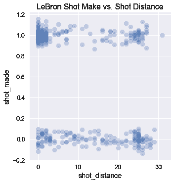

我们可以看到，当勒布朗离篮筐只有 5 英尺时，他往往投得最多。一个简单的最小二乘线性回归模型适合这个数据，产生以下预测：

```
# HIDDEN
np.random.seed(42)
sns.lmplot(x='shot_distance', y='shot_made',
           data=jitter_df(lebron, 'shot_distance', 'shot_made'),
           ci=None,
           scatter_kws={'alpha': 0.4})
plt.title('Simple Linear Regression');

```

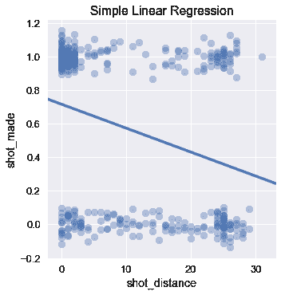

线性回归预测连续值。但是，要执行分类，我们需要将该值转换为一个类别：放炮或未放炮。我们可以通过设置一个截止值或**分类阈值**来实现这一点。如果回归预测的值大于 0.5，我们预测放炮会发生。否则，我们就预测这次射击会失败。

我们在下面画一条绿色虚线。根据这个截止点，我们的模型预测，如果勒布朗在篮筐 15 英尺以内，他会投篮。

```
# HIDDEN
np.random.seed(42)
sns.lmplot(x='shot_distance', y='shot_made',
           data=jitter_df(lebron, 'shot_distance', 'shot_made'),
           ci=None,
           scatter_kws={'alpha': 0.4})
plt.axhline(y=0.5, linestyle='--', c='g')
plt.title('Cutoff for Classification');

```

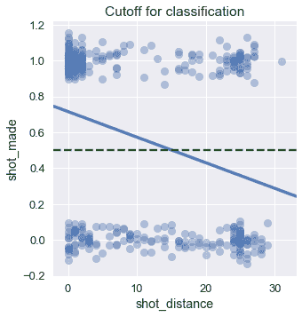

在上面的步骤中，我们尝试执行回归来预测一次放炮的可能性。如果我们的回归产生了一个概率，那么设定 0.5 的临界值意味着我们预测当我们的模型认为一个镜头进入的可能性比丢失的镜头更大时，一个镜头会进入。我们将在本章后面重新讨论分类阈值的主题。

## 概率线性回归问题

不幸的是，我们的线性模型的预测不能解释为概率。有效概率必须介于 0 和 1 之间，但我们的线性模型违反了这一条件。例如，当勒布朗距离篮筐 100 英尺时，他投篮的概率应该接近于零。然而，在这种情况下，我们的模型将预测负值。

如果我们改变我们的回归模型，使它的预测可以被解释为概率，我们就不会对使用它的预测进行分类感到不安。我们用一个新的预测函数和一个新的损失函数来实现这一点。生成的模型称为**逻辑模型**。

## 17.2 Logistic 模型

```
# HIDDEN
# Clear previously defined variables
%reset -f

# Set directory for data loading to work properly
import os
os.chdir(os.path.expanduser('~/notebooks/17'))

```

```
# HIDDEN
import warnings
# Ignore numpy dtype warnings. These warnings are caused by an interaction
# between numpy and Cython and can be safely ignored.
# Reference: https://stackoverflow.com/a/40846742
warnings.filterwarnings("ignore", message="numpy.dtype size changed")
warnings.filterwarnings("ignore", message="numpy.ufunc size changed")

import numpy as np
import matplotlib.pyplot as plt
import pandas as pd
import seaborn as sns
%matplotlib inline
import ipywidgets as widgets
from ipywidgets import interact, interactive, fixed, interact_manual
import nbinteract as nbi

sns.set()
sns.set_context('talk')
np.set_printoptions(threshold=20, precision=2, suppress=True)
pd.options.display.max_rows = 7
pd.options.display.max_columns = 8
pd.set_option('precision', 2)
# This option stops scientific notation for pandas
# pd.set_option('display.float_format', '{:.2f}'.format)

```

```
# HIDDEN
def df_interact(df, nrows=7, ncols=7):
    '''
    Outputs sliders that show rows and columns of df
    '''
    def peek(row=0, col=0):
        return df.iloc[row:row + nrows, col:col + ncols]
    if len(df.columns) <= ncols:
        interact(peek, row=(0, len(df) - nrows, nrows), col=fixed(0))
    else:
        interact(peek,
                 row=(0, len(df) - nrows, nrows),
                 col=(0, len(df.columns) - ncols))
    print('({} rows, {} columns) total'.format(df.shape[0], df.shape[1]))

```

```
# HIDDEN
def jitter_df(df, x_col, y_col):
    x_jittered = df[x_col] + np.random.normal(scale=0, size=len(df))
    y_jittered = df[y_col] + np.random.normal(scale=0.05, size=len(df))
    return df.assign(**{x_col: x_jittered, y_col: y_jittered})

```

```
# HIDDEN
lebron = pd.read_csv('lebron.csv')

```

在本节中，我们将介绍**逻辑模型**，这是一个用于预测概率的回归模型。

回想一下，拟合一个模型需要三个部分：一个预测模型、一个损失函数和一个优化方法。对于目前熟悉的最小二乘线性回归，我们选择模型：

$$ \begin{aligned} f_\hat{\boldsymbol{\theta}} (\textbf{x}) &= \hat{\boldsymbol{\theta}} \cdot \textbf{x} \end{aligned} $$

损失函数：

$$ \begin{aligned} L(\boldsymbol{\theta}, \textbf{X}, \textbf{y}) &= \frac{1}{n} \sum_{i}(y_i - f_\boldsymbol{\theta} (\textbf{X}_i))^2\\ \end{aligned} $$

我们使用梯度下降作为优化方法。在上面的定义中，$\textbf x$表示$n \乘以 p$的数据矩阵（$n$表示数据点的数目，$p$表示属性的数目），$\textbf x$表示一行$\textbf x，$textbf y$表示观察结果的向量。矢量$\BoldSymbol \Hat \Theta 包含最佳模型权重，而$\BoldSymbol \Theta 包含优化期间生成的中间权重值。

## 实数与概率

观察到模型$f_ \hat \\\123\123\123; \123\\123\123\125\\\\125\\123\\\123\\\\\\\\\\\\\\\\.

当$x$是一个标量时，我们可以很容易地看到这一点。如果$\hat\theta=0.5$，我们的模型将变为$f \theta（\textbf x）=0.5 x$。它的预测值可以是从负无穷大到正无穷大的任意值：

```
# HIDDEN
xs = np.linspace(-100, 100, 100)
ys = 0.5 * xs
plt.plot(xs, ys)
plt.xlabel('$x$')
plt.ylabel(r'$f_\hat{\theta}(x)$')
plt.title(r'Model Predictions for $ \hat{\theta} = 0.5 $');

```

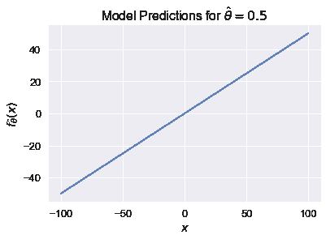

对于分类任务，我们希望限制$f_ \hat \boldSymbol \theta（\textbf x）$以便将其输出解释为概率。这意味着它只能输出$[0，1]$范围内的值。此外，我们希望$f_ux \boldsymbol \theta（\textbf x）$的大值对应于高概率，小值对应于低概率。

## Logistic 功能[¶](#The-Logistic-Function)

为了实现这一点，我们引入了**逻辑函数**，通常称为**乙状结肠函数**：

$$ \begin{aligned} \sigma(t) = \frac{1}{1 + e^{-t}} \end{aligned} $$

为了便于阅读，我们经常将$E^X$替换为$\text exp（x）$并写下：

$$ \begin{aligned} \sigma (t) = \frac{1}{1 + \text{exp}(-t)} \end{aligned} $$

我们为下面的值$t\in[-10，10]$绘制 sigmoid 函数。

```
# HIDDEN
from scipy.special import expit
xs = np.linspace(-10, 10, 100)
ys = expit(xs)
plt.plot(xs, ys)
plt.title(r'Sigmoid Function')
plt.xlabel('$ t $')
plt.ylabel(r'$ \sigma(t) $');

```

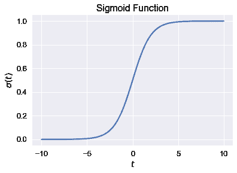

观察 sigmoid 函数$\sigma（t）$接受任何实数$\mathbb r，只输出 0 到 1 之间的数字。函数在其输入$t$上单调递增；根据需要，$t$的大值对应于接近 1 的值。这不是巧合，虽然我们省略了简单性的推导，但 sigmoid 函数可以从概率的对数比中推导出来。

## Logistic 模型定义

我们现在可以将我们的线性模型$\hat \boldSymbol \theta \cdot\textbf x$作为 sigmoid 函数的输入来创建**逻辑模型**：

$$ \begin{aligned} f_\hat{\boldsymbol{\theta}} (\textbf{x}) = \sigma(\hat{\boldsymbol{\theta}} \cdot \textbf{x}) \end{aligned} $$

换句话说，我们将线性回归的输出取为$\mathbb r 美元中的任意数字，并使用 sigmoid 函数将模型的最终输出限制为介于 0 和 1 之间的有效概率。

为了对 Logistic 模型的行为产生一些直观的认识，我们将$x$限制为一个标量，并将 Logistic 模型的输出绘制为几个值，即$hat \theta。

```
# HIDDEN
def flatten(li): return [item for sub in li for item in sub]

thetas = [-2, -1, -0.5, 2, 1, 0.5]
xs = np.linspace(-10, 10, 100)

fig, axes = plt.subplots(2, 3, sharex=True, sharey=True, figsize=(10, 6))
for ax, theta in zip(flatten(axes), thetas):
    ys = expit(theta * xs)
    ax.plot(xs, ys)
    ax.set_title(r'$ \hat{\theta} = $' + str(theta))

# add a big axes, hide frame
fig.add_subplot(111, frameon=False)
# hide tick and tick label of the big axes
plt.tick_params(labelcolor='none', top='off', bottom='off',
                left='off', right='off')
plt.grid(False)
plt.xlabel('$x$')
plt.ylabel(r'$ f_\hat{\theta}(x) $')
plt.tight_layout()

```

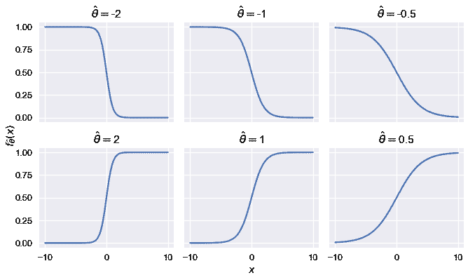

我们看到，改变\θ的幅度会改变曲线的锐度；距离 0$越远，曲线的锐度就越高。翻转$\hat \theta 的符号，同时保持大小不变，相当于反映 Y 轴上的曲线。

## 摘要[¶](#Summary)

我们引入了逻辑模型，这是一个输出概率的新预测函数。为了建立模型，我们使用线性回归的输出作为非线性逻辑函数的输入。

## 17.3 Logistic 模型的损失函数

```
# HIDDEN
# Clear previously defined variables
%reset -f

# Set directory for data loading to work properly
import os
os.chdir(os.path.expanduser('~/notebooks/17'))

```

```
# HIDDEN
import warnings
# Ignore numpy dtype warnings. These warnings are caused by an interaction
# between numpy and Cython and can be safely ignored.
# Reference: https://stackoverflow.com/a/40846742
warnings.filterwarnings("ignore", message="numpy.dtype size changed")
warnings.filterwarnings("ignore", message="numpy.ufunc size changed")

import numpy as np
import matplotlib.pyplot as plt
import pandas as pd
import seaborn as sns
%matplotlib inline
import ipywidgets as widgets
from ipywidgets import interact, interactive, fixed, interact_manual
import nbinteract as nbi

sns.set()
sns.set_context('talk')
np.set_printoptions(threshold=20, precision=2, suppress=True)
pd.options.display.max_rows = 7
pd.options.display.max_columns = 8
pd.set_option('precision', 2)
# This option stops scientific notation for pandas
# pd.set_option('display.float_format', '{:.2f}'.format)

```

```
# HIDDEN
def df_interact(df, nrows=7, ncols=7):
    '''
    Outputs sliders that show rows and columns of df
    '''
    def peek(row=0, col=0):
        return df.iloc[row:row + nrows, col:col + ncols]
    if len(df.columns) <= ncols:
        interact(peek, row=(0, len(df) - nrows, nrows), col=fixed(0))
    else:
        interact(peek,
                 row=(0, len(df) - nrows, nrows),
                 col=(0, len(df.columns) - ncols))
    print('({} rows, {} columns) total'.format(df.shape[0], df.shape[1]))

```

```
# HIDDEN
lebron = pd.read_csv('lebron.csv')

```

我们定义了概率的回归模型，逻辑模型：

$$ \begin{aligned} f_\hat{\boldsymbol{\theta}} (\textbf{x}) = \sigma(\hat{\boldsymbol{\theta}} \cdot \textbf{x}) \end{aligned} $$

与线性回归模型一样，该模型也有参数$\Hat \BoldSymbol \Theta$，这是一个向量，它为每个$\textbf x 的特征包含一个参数。我们现在解决的问题是为这个模型定义一个损失函数，它允许我们将模型的参数与数据相匹配。

直观地说，我们希望模型的预测与数据尽可能接近。下面，我们用每球与篮筐之间的距离，重现了勒布朗在 2017 年 NBA 季后赛中的投篮尝试。这些点在 Y 轴上抖动以减轻过度绘制。

```
# HIDDEN
np.random.seed(42)
sns.lmplot(x='shot_distance', y='shot_made',
           data=lebron,
           fit_reg=False, ci=False,
           y_jitter=0.1,
           scatter_kws={'alpha': 0.3})
plt.title('LeBron Shot Attempts')
plt.xlabel('Distance from Basket (ft)')
plt.ylabel('Shot Made');

```

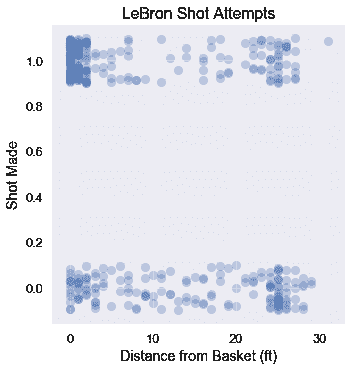

注意到篮筐附近的大量投篮和篮筐远处的较小的错失投篮，我们预计此数据上的逻辑模型可能如下所示：

```
# HIDDEN
from scipy.special import expit

np.random.seed(42)
sns.lmplot(x='shot_distance', y='shot_made',
           data=lebron,
           fit_reg=False, ci=False,
           y_jitter=0.1,
           scatter_kws={'alpha': 0.3})

xs = np.linspace(-2, 32, 100)
ys = expit(-0.15 * (xs - 15))
plt.plot(xs, ys, c='r', label='Logistic model')

plt.title('Possible logistic model fit')
plt.xlabel('Distance from Basket (ft)')
plt.ylabel('Shot Made');

```

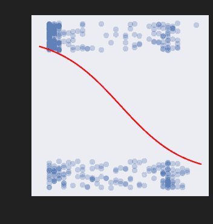

虽然我们可以像线性回归那样使用均方误差损失函数，但对于一个逻辑模型来说，它是非凸的，因此难以优化。

## 交叉熵损失

我们使用**交叉熵损失**来代替均方误差。让$\textbf x$表示 P$输入数据矩阵的$n 倍，$\textbf y$表示观测数据值的矢量，$f \boldsymbol \theta（\textbf x）$表示逻辑模型。$\BoldSymbol \Theta$包含当前参数值。使用此符号，平均交叉熵损失定义为：

$$ \begin{aligned} L(\boldsymbol{\theta}, \textbf{X}, \textbf{y}) = \frac{1}{n} \sum_i \left(- y_i \ln (f_\boldsymbol{\theta}(\textbf{X}_i)) - (1 - y_i) \ln (1 - f_\boldsymbol{\theta}(\textbf{X}_i) \right) \end{aligned} $$

您可以观察到，像往常一样，我们对数据集中的每个点取平均损失。上述总和中的内部表达式表示一个数据点的损失$（\textbf x u i，y_i）$：

$$ \begin{aligned} \ell(\boldsymbol{\theta}, \textbf{X}_i, y_i) = - y_i \ln (f_\boldsymbol{\theta}(\textbf{X}_i)) - (1 - y_i) \ln (1 - f_\boldsymbol{\theta}(\textbf{X}_i) ) \end{aligned} $$

回想一下，数据集中的每个$y_i$都是 0 或 1。如果 Y_i=0 美元，损失的第一项为零。如果 Y_i=1 美元，损失中的第二项为零。因此，对于数据集中的每个点，只有一个交叉熵损失项会导致整体损失。

假设$y_i=0$和我们的预测概率$f_uuBoldSymbol \theta（\textbf x _i）=0$我们的模型是完全正确的。这一点的损失将是：

$$ \begin{aligned} \ell(\boldsymbol{\theta}, \textbf{X}_i, y_i) &= - y_i \ln (f_\boldsymbol{\theta}(\textbf{X}_i)) - (1 - y_i) \ln (1 - f_\boldsymbol{\theta}(\textbf{X}_i) ) \\ &= - 0 - (1 - 0) \ln (1 - 0 ) \\ &= - \ln (1) \\ &= 0 \end{aligned} $$

正如预期的那样，正确预测的损失是 0 美元。您可以验证预测概率与真实值越远，损失越大。

最大限度地减少总体交叉熵损失需要模型$F_BoldSymbol \Theta（\textbf_x）$来做出最准确的预测。方便的是，该损失函数是凸的，使得梯度下降成为一种有用的优化选择。

## 交叉熵损失梯度

为了对模型的交叉熵损失进行梯度下降，必须计算损失函数的梯度。首先，我们计算 sigmoid 函数的导数，因为我们将在梯度计算中使用它。

$$ \begin{aligned} \sigma(t) &= \frac{1}{1 + e^{-t}} \\ \sigma'(t) &= \frac{e^{-t}}{(1 + e^{-t})^2} \\ \sigma'(t) &= \frac{1}{1 + e^{-t}} \cdot \left(1 - \frac{1}{1 + e^{-t}} \right) \\ \sigma'(t) &= \sigma(t) (1 - \sigma(t)) \end{aligned} $$

乙状结肠功能的导数可以方便地用乙状结肠功能本身来表示。

简而言之，我们定义了$\sigma（\textbf x u i）=\sigma（\textbf x u i \cdot \boldsymbol \theta）$。我们很快就需要.\sigma i$相对于向量.\boldsymbol \theta 的梯度，因此我们现在将使用链规则的直接应用来推导它。

$$ \begin{aligned} \nabla_{\boldsymbol{\theta}} \sigma_i &= \nabla_{\boldsymbol{\theta}} \sigma(\textbf{X}_i \cdot \boldsymbol{\theta}) \\ &= \sigma(\textbf{X}_i \cdot \boldsymbol{\theta}) (1 - \sigma(\textbf{X}_i \cdot \boldsymbol{\theta})) \nabla_{\boldsymbol{\theta}} (\textbf{X}_i \cdot \boldsymbol{\theta}) \\ &= \sigma_i (1 - \sigma_i) \textbf{X}_i \end{aligned} $$

现在，我们推导出交叉熵损失相对于模型参数$\BoldSymbol \Theta 的梯度。在下面的推导中，我们让$\sigma_i=f_ \boldsymbol \theta（\textbf x（\textbf x u i \cdot \boldsymbol \theta）$。

$$ \begin{aligned} L(\boldsymbol{\theta}, \textbf{X}, \textbf{y}) &= \frac{1}{n} \sum_i \left(- y_i \ln (f_\boldsymbol{\theta}(\textbf{X}_i)) - (1 - y_i) \ln (1 - f_\boldsymbol{\theta}(\textbf{X}_i) \right) \\ &= \frac{1}{n} \sum_i \left(- y_i \ln \sigma_i - (1 - y_i) \ln (1 - \sigma_i) \right) \\ \nabla_{\boldsymbol{\theta}} L(\boldsymbol{\theta}, \textbf{X}, \textbf{y}) &= \frac{1}{n} \sum_i \left( - \frac{y_i}{\sigma_i} \nabla_{\boldsymbol{\theta}} \sigma_i + \frac{1 - y_i}{1 - \sigma_i} \nabla_{\boldsymbol{\theta}} \sigma_i \right) \\ &= - \frac{1}{n} \sum_i \left( \frac{y_i}{\sigma_i} - \frac{1 - y_i}{1 - \sigma_i} \right) \nabla_{\boldsymbol{\theta}} \sigma_i \\ &= - \frac{1}{n} \sum_i \left( \frac{y_i}{\sigma_i} - \frac{1 - y_i}{1 - \sigma_i} \right) \sigma_i (1 - \sigma_i) \textbf{X}_i \\ &= - \frac{1}{n} \sum_i \left( y_i - \sigma_i \right) \textbf{X}_i \\ \end{aligned} $$

令人惊讶的简单梯度表达式允许我们使用梯度下降将逻辑模型拟合到交叉熵损失：

$$ \hat{\boldsymbol{\theta}} = \displaystyle\arg \min_{\substack{\boldsymbol{\theta}}} L(\boldsymbol{\theta}, \textbf{X}, \textbf{y})$$

第 17.6 节探讨了批量、随机和小批量梯度下降的更新公式。

## 摘要[¶](#Summary)

由于交叉熵损失函数是凸的，因此我们使用梯度下降将其最小化，以使逻辑模型适合数据。我们现在有了逻辑回归的必要组成部分：模型、损失函数和最小化过程。在第 17.5 节中，我们更详细地了解了为什么我们使用平均交叉熵损失进行逻辑回归。

## 17.4 使用逻辑回归

```
# HIDDEN
# Clear previously defined variables
%reset -f

# Set directory for data loading to work properly
import os
os.chdir(os.path.expanduser('~/notebooks/17'))

```

```
# HIDDEN
import warnings
# Ignore numpy dtype warnings. These warnings are caused by an interaction
# between numpy and Cython and can be safely ignored.
# Reference: https://stackoverflow.com/a/40846742
warnings.filterwarnings("ignore", message="numpy.dtype size changed")
warnings.filterwarnings("ignore", message="numpy.ufunc size changed")

import numpy as np
import matplotlib.pyplot as plt
import pandas as pd
import seaborn as sns
%matplotlib inline
import ipywidgets as widgets
from ipywidgets import interact, interactive, fixed, interact_manual
import nbinteract as nbi

sns.set()
sns.set_context('talk')
np.set_printoptions(threshold=20, precision=2, suppress=True)
pd.options.display.max_rows = 7
pd.options.display.max_columns = 8
pd.set_option('precision', 2)
# This option stops scientific notation for pandas
# pd.set_option('display.float_format', '{:.2f}'.format)

```

```
# HIDDEN
def df_interact(df, nrows=7, ncols=7):
    '''
    Outputs sliders that show rows and columns of df
    '''
    def peek(row=0, col=0):
        return df.iloc[row:row + nrows, col:col + ncols]
    if len(df.columns) <= ncols:
        interact(peek, row=(0, len(df) - nrows, nrows), col=fixed(0))
    else:
        interact(peek,
                 row=(0, len(df) - nrows, nrows),
                 col=(0, len(df.columns) - ncols))
    print('({} rows, {} columns) total'.format(df.shape[0], df.shape[1]))

```

```
# HIDDEN
from scipy.optimize import minimize as sci_min
def minimize(cost_fn, grad_cost_fn, X, y, progress=True):
    '''
    Uses scipy.minimize to minimize cost_fn using a form of gradient descent.
    '''
    theta = np.zeros(X.shape[1])
    iters = 0

    def objective(theta):
        return cost_fn(theta, X, y)
    def gradient(theta):
        return grad_cost_fn(theta, X, y)
    def print_theta(theta):
        nonlocal iters
        if progress and iters % progress == 0:
            print(f'theta: {theta} | cost: {cost_fn(theta, X, y):.2f}')
        iters += 1

    print_theta(theta)
    return sci_min(
        objective, theta, method='BFGS', jac=gradient, callback=print_theta,
        tol=1e-7
    ).x

```

我们已经开发了逻辑回归的所有组件。首先，用于预测概率的逻辑模型：

$$ \begin{aligned} f_\hat{\boldsymbol{\theta}} (\textbf{x}) = \sigma(\hat{\boldsymbol{\theta}} \cdot \textbf{x}) \end{aligned} $$

然后，交叉熵损失函数：

$$ \begin{aligned} L(\boldsymbol{\theta}, \textbf{X}, \textbf{y}) = &= \frac{1}{n} \sum_i \left(- y_i \ln \sigma_i - (1 - y_i) \ln (1 - \sigma_i ) \right) \\ \end{aligned} $$

最后，梯度下降的交叉熵损失的梯度：

$$ \begin{aligned} \nabla_{\boldsymbol{\theta}} L(\boldsymbol{\theta}, \textbf{X}, \textbf{y}) &= - \frac{1}{n} \sum_i \left( y_i - \sigma_i \right) \textbf{X}_i \\ \end{aligned} $$

在上面的表达式中，我们让$\textbf \x；$表示 p$输入数据矩阵的$n 乘以 p$输入值，$\textbf \123\ \，$\textbf \，$\textbf \123\123 123 123 123 123 \ 123 \ \123 \\\\Thet 公司 A 美元。简而言之，我们定义了$\sigma \boldsymbol \theta（\textbf x u i）=\sigma（\textbf x u i \cdot \hat \boldsymbol \theta）。

## 勒布朗射门的逻辑回归

现在让我们回到本章开头所面临的问题：预测勒布朗·詹姆斯将要投哪一球。我们从加载勒布朗在 2017 年 NBA 季后赛中拍摄的照片开始。

```
lebron = pd.read_csv('lebron.csv')
lebron

```

|  | 游戏日期 | 分钟 | 对手 | 动作类型 | 镜头类型 | 射击距离 | 拍摄 |
| --- | --- | --- | --- | --- | --- | --- | --- |
| 零 | 20170415 年 | 10 个 | 因德 | 驾驶上篮得分 | 2pt 现场目标 | 零 | 0 |
| --- | --- | --- | --- | --- | --- | --- | --- |
| 1 个 | 20170415 | 11 个 | IND | Driving Layup Shot | 2PT Field Goal | 0 | 1 个 |
| --- | --- | --- | --- | --- | --- | --- | --- |
| 二 | 20170415 | 十四 | IND | 上篮得分 | 2PT Field Goal | 0 | 1 |
| --- | --- | --- | --- | --- | --- | --- | --- |
| …… | …… | ... | ... | ... | ... | ... | ... |
| --- | --- | --- | --- | --- | --- | --- | --- |
| 三百八十一 | 20170612 年 | 46 岁 | GSW | Driving Layup Shot | 2PT Field Goal | 1 | 1 |
| --- | --- | --- | --- | --- | --- | --- | --- |
| 382 个 | 20170612 | 47 岁 | GSW | 后仰跳投 | 2PT Field Goal | 14 | 0 |
| --- | --- | --- | --- | --- | --- | --- | --- |
| 三百八十三 | 20170612 | 48 岁 | GSW | Driving Layup Shot | 2PT Field Goal | 二 | 1 |
| --- | --- | --- | --- | --- | --- | --- | --- |

384 行×7 列

我们在下面包含了一个小部件，允许您浏览整个数据帧。

```
df_interact(lebron)

```

<button class="js-nbinteract-widget">Loading widgets...</button>

```
(384 rows, 7 columns) total

```

我们首先只使用拍摄距离来预测拍摄是否进行。`scikit-learn`方便地提供了一个逻辑回归分类器作为[`sklearn.linear_model.LogisticRegression`](http://scikit-learn.org/stable/modules/generated/sklearn.linear_model.LogisticRegression.html)类。为了使用这个类，我们首先创建数据矩阵`X`和观察结果向量`y`。

```
X = lebron[['shot_distance']].as_matrix()
y = lebron['shot_made'].as_matrix()
print('X:')
print(X)
print()
print('y:')
print(y)

```

```
X:
[[ 0]
 [ 0]
 [ 0]
 ...
 [ 1]
 [14]
 [ 2]]

y:
[0 1 1 ... 1 0 1]

```

按照惯例，我们将数据分成一个训练集和一个测试集。

```
from sklearn.model_selection import train_test_split

X_train, X_test, y_train, y_test = train_test_split(
    X, y, test_size=40, random_state=42
)
print(f'Training set size: {len(y_train)}')
print(f'Test set size: {len(y_test)}')

```

```
Training set size: 344
Test set size: 40

```

`scikit-learn`使初始化分类器并将其安装在`X_train`和`y_train`上变得简单：

```
from sklearn.linear_model import LogisticRegression
simple_clf = LogisticRegression()
simple_clf.fit(X_train, y_train)

```

```
LogisticRegression(C=1.0, class_weight=None, dual=False, fit_intercept=True,
          intercept_scaling=1, max_iter=100, multi_class='ovr', n_jobs=1,
          penalty='l2', random_state=None, solver='liblinear', tol=0.0001,
          verbose=0, warm_start=False)
```

为了可视化分类器的性能，我们绘制了原始点和分类器的预测概率。

```
# HIDDEN 
np.random.seed(42)
sns.lmplot(x='shot_distance', y='shot_made',
           data=lebron,
           fit_reg=False, ci=False,
           y_jitter=0.1,
           scatter_kws={'alpha': 0.3})

xs = np.linspace(-2, 32, 100)
ys = simple_clf.predict_proba(xs.reshape(-1, 1))[:, 1]
plt.plot(xs, ys)

plt.title('LeBron Training Data and Predictions')
plt.xlabel('Distance from Basket (ft)')
plt.ylabel('Shot Made');

```


## 正在评估分类器[¶](#Evaluating-the-Classifier)

评估分类器有效性的一种方法是检查其预测精度：它正确预测的点数比例是多少？

```
simple_clf.score(X_test, y_test)

```

```
0.6
```

我们的分类器在测试集上实现了相当低的精度 0.60。如果我们的分类器只是随机地猜测每个点，那么我们期望精度为 0.50。事实上，如果我们的分类器简单地预测到 Lebron 的每一次射门都会成功，我们也会得到 0.60 的准确度：

```
# Calculates the accuracy if we always predict 1
np.count_nonzero(y_test == 1) / len(y_test)

```

```
0.6
```

对于这个分类器，我们只使用了几个可能的特性中的一个。在多变量线性回归中，我们可能通过合并更多的特征来实现更精确的分类器。

## 多变量逻辑回归

在我们的分类器中合并更多的数字特性就如同从`lebron`数据帧中提取额外的列到`X`矩阵中一样简单。另一方面，结合分类特征需要我们应用一个热编码。在下面的代码中，我们使用`minute`、`opponent`、`action_type`和`shot_type`功能增强了分类器，使用`scikit-learn`中的`DictVectorizer`类对分类变量应用一个热编码。

```
from sklearn.feature_extraction import DictVectorizer

columns = ['shot_distance', 'minute', 'action_type', 'shot_type', 'opponent']
rows = lebron[columns].to_dict(orient='row')

onehot = DictVectorizer(sparse=False).fit(rows)
X = onehot.transform(rows)
y = lebron['shot_made'].as_matrix()

X.shape

```

```
(384, 42)
```

我们将再次将数据分为训练集和测试集：

```
X_train, X_test, y_train, y_test = train_test_split(
    X, y, test_size=40, random_state=42
)
print(f'Training set size: {len(y_train)}')
print(f'Test set size: {len(y_test)}')

```

```
Training set size: 344
Test set size: 40

```

最后，我们再次调整模型并检查其准确性：

```
clf = LogisticRegression()
clf.fit(X_train, y_train)
print(f'Test set accuracy: {clf.score(X_test, y_test)}')

```

```
Test set accuracy: 0.725

```

这个分类器比只考虑射击距离的分类器精确 12%左右。在第 17.7 节中，我们探讨了用于评估分类器性能的其他指标。

## 摘要[¶](#Summary)

我们开发了使用逻辑回归进行分类所需的数学和计算机制。逻辑回归因其预测简单有效而得到广泛应用。

## 17.5 经验概率分布的近似

```
# HIDDEN
# Clear previously defined variables
%reset -f

# Set directory for data loading to work properly
import os
os.chdir(os.path.expanduser('~/notebooks/17'))

```

```
# HIDDEN
import warnings
# Ignore numpy dtype warnings. These warnings are caused by an interaction
# between numpy and Cython and can be safely ignored.
# Reference: https://stackoverflow.com/a/40846742
warnings.filterwarnings("ignore", message="numpy.dtype size changed")
warnings.filterwarnings("ignore", message="numpy.ufunc size changed")

import numpy as np
import matplotlib.pyplot as plt
import pandas as pd
import seaborn as sns
%matplotlib inline
import ipywidgets as widgets
from ipywidgets import interact, interactive, fixed, interact_manual
import nbinteract as nbi

sns.set()
sns.set_context('talk')
np.set_printoptions(threshold=20, precision=2, suppress=True)
pd.options.display.max_rows = 7
pd.options.display.max_columns = 8
pd.set_option('precision', 2)
# This option stops scientific notation for pandas
# pd.set_option('display.float_format', '{:.2f}'.format)

```

在本节中，我们介绍了**kl 散度**，并演示了如何将二进制分类中的平均 kl 散度最小化等同于将平均交叉熵损失最小化。

由于逻辑回归输出概率，逻辑模型产生一定类型的概率分布。具体地说，基于最优参数$\hat \boldSymbol \theta$，它估计标签$y$对于示例输入$\textbf x 为$1$的可能性。

例如，假设$X$是一个标量，记录了一天的预测下雨机会，$Y=1$意味着 DOE 先生带着雨伞去工作。一个带有标量参数$\hat \theta$的逻辑模型预测，在预测下雨的可能性下，doe 先生带伞的概率为：$\hat p \theta（y=1 x）$。

收集有关 doe 先生伞式使用的数据为我们提供了一种构建经验概率分布$p（y=1_x）$的方法。例如，如果有五天下雨的可能性是$X=0.60 美元，而 DOE 先生只带了一把雨伞去上班，$P（Y=1_X=0.60）=0.20 美元。我们可以为数据中出现的每个$x$值计算类似的概率分布。当然，在拟合逻辑模型后，我们希望模型预测的分布尽可能接近数据集的经验分布。也就是说，对于我们数据中出现的所有$x$值，我们需要：

$$ \hat{P_\theta}(y = 1 | x) \approx P(y = 1 | x) $$

确定两个概率分布的“紧密性”的一个常用度量是 Kullback——Leibler 散度，或称 kl 散度，其根源在于信息论。

## 定义平均 kl 发散度[¶](#Defining-Average-KL-Divergence)

KL 散度量化了由我们的 Logistic 模型计算的概率分布$\Hat P BoldSymbol \Theta$与基于数据集的实际分布$P$之间的差异。直观地，它计算逻辑模型如何不精确地估计标签在数据中的分布。

对于单个数据点$（\textbf x，y）$的两个分布$p$和$\hat p boldsymbol \theta$之间的二进制分类的 kl 差异由以下公式给出：

$$D(P || \hat{P_\boldsymbol{\theta}}) = P(y = 0 | \textbf{x}) \ln \left(\frac{P(y = 0 | \textbf{x})}{\hat{P_\boldsymbol{\theta}}(y = 0 | \textbf{x})}\right) + P(y = 1 | \textbf{x}) \ln \left(\frac{P(y = 1 | \textbf{x})}{\hat{P_\boldsymbol{\theta}}(y = 1 | \textbf{x})}\right)$$

KL 散度不是对称的，即$p$与$p$与$p$与$p$与$p$与$p$与$d（P 124 124 \\124 \124 \123 \ \ \ \\123 \\\ \\\\\\\\\（P）$$

由于我们的目标是使用$\hat p boldsymbol \theta 美元，因此我们关注的是$d（p \hat p \boldsymbol \theta 美元）。

最好的$\BoldSymbol \Theta$值，我们将其表示为$\Hat \BoldSymbol \Theta$将整个$n$点数据集的平均 kl 发散最小化：

$$ \text{Average KL Divergence} = \frac{1}{n} \sum_{i=1}^{n} \left(P(y_i = 0 | \textbf{X}_i) \ln \left(\frac{P(y_i = 0 | \textbf{X}_i)}{\hat{P_\boldsymbol{\theta}}(y_i = 0 | \textbf{X}_i)}\right) + P(y_i = 1 | \textbf{X}_i) \ln \left(\frac{P(y_i = 1 | \textbf{X}_i)}{\hat{P_\boldsymbol{\theta}}(y_i = 1 | \textbf{X}_i)}\right)\right)$$$$ \hat{\boldsymbol{\theta}} = \displaystyle\arg \min_{\substack{\boldsymbol{\theta}}} (\text{Average KL Divergence}) $$

在上面的公式中，数据点$i ^ \text th 表示为（$\textbf x u i$，$y i$），其中，$\textbf x u i$是观察到的结果。

KL 的差异并不影响与$P$相关的罕见事件的不匹配。如果模型预测实际罕见事件的高概率，那么$p（k）$和$\ln\left（\frac p（k）p boldsymbol \theta（k）right）$都很低，因此差异也很低。但是，如果模型预测实际常见事件的概率较低，则散度较高。我们可以推断，与精确预测罕见事件但在常见事件上差异很大的模型相比，精确预测常见事件的逻辑模型与$P$的差异较小。

## 由 kl 发散推导交叉熵损失

上述平均 kl 散度方程的结构与交叉熵损失具有一些表面相似性。我们现在将用一些代数操作证明，最小化平均 kl 散度实际上等于最小化平均交叉熵损失。

Using properties of logarithms, we can rewrite the weighted log ratio: $$P(y_i = k | \textbf{X}_i) \ln \left(\frac{P(y_i = k | \textbf{X}_i)}{\hat{P_\boldsymbol{\theta}}(y_i = k | \textbf{X}_i)}\right) = P(y_i = k | \textbf{X}_i) \ln P(y_i = k | \textbf{X}_i) - P(y_i = k | \textbf{X}_i) \ln \hat{P_\粗体符号\ theta（y u i=k \ textbf x u i）$$

请注意，由于第一个术语不依赖于$\BoldSymbol \Theta$，因此它不会影响$\DisplayStyle\Arg\Min \Substack \BoldSymbol \Theta$并且可以从公式中删除。由此得到的表达式是模型的交叉熵损失$\Hat P BoldSymbol \Theta$：

$$ \text{Average Cross-Entropy Loss} = \frac{1}{n} \sum_{i=1}^{n} - P(y_i = 0 | \textbf{X}_i) \ln \hat{P_\theta}(y_i = 0 | \textbf{X}_i) - P(y_i = 1 | \textbf{X}_i) \ln \hat{P_\theta}(y_i = 1 | \textbf{X}_i)$$$$ \hat{\boldsymbol{\theta}} = \displaystyle\arg \min_{\substack{\theta}} (\text{Average Cross-Entropy Loss}) $$

由于标签$Y_I$是已知值，因此$Y_I=1$、$P（Y_I=1 textbf x u I）$等于$Y_I$和$P（Y_I=0 textbf x u I）$的概率等于$1-Y_I$。模型的概率分布$\hat p boldsymbol \theta 由前两节讨论的 sigmoid 函数的输出给出。进行这些替换后，我们得出平均交叉熵损失方程：

$$ \text{Average Cross-Entropy Loss} = \frac{1}{n} \sum_i \left(- y_i \ln (f_\hat{\boldsymbol{\theta}}(\textbf{X}_i)) - (1 - y_i) \ln (1 - f_\hat{\boldsymbol{\theta}}(\textbf{X}_i) \right) $$$$ \hat{\boldsymbol{\theta}} = \displaystyle\arg \min_{\substack{\theta}} (\text{Average Cross-Entropy Loss}) $$

## 交叉熵损失的统计解释

交叉熵损失在统计学上也有基础。由于逻辑回归模型预测概率，给定一个特定的逻辑模型，我们可以问，“这个模型产生一组观察到的结果的概率是多少？”我们可以自然地调整模型的参数，直到从模型中提取数据集的概率尽可能高。尽管在本节中我们不会证明这一点，但该程序相当于最小化交叉熵损失，这是交叉熵损失的 _ 最大似然 _ 统计证明。

## 摘要[¶](#Summary)

平均 kl 差异可以解释为$p$和$hat p boldsymbol \theta$p$加权的两个分布之间的平均对数差异。最小化平均 kl 发散也最小化平均交叉熵损失。我们可以通过选择对常见数据进行精确分类的参数来减少逻辑回归模型的分歧。

## 17.6 拟合 Logistic 模型

```
# HIDDEN
# Clear previously defined variables
%reset -f

# Set directory for data loading to work properly
import os
os.chdir(os.path.expanduser('~/notebooks/17'))

```

```
# HIDDEN
import warnings
# Ignore numpy dtype warnings. These warnings are caused by an interaction
# between numpy and Cython and can be safely ignored.
# Reference: https://stackoverflow.com/a/40846742
warnings.filterwarnings("ignore", message="numpy.dtype size changed")
warnings.filterwarnings("ignore", message="numpy.ufunc size changed")

import numpy as np
import matplotlib.pyplot as plt
import pandas as pd
import seaborn as sns
%matplotlib inline
import ipywidgets as widgets
from ipywidgets import interact, interactive, fixed, interact_manual
import nbinteract as nbi

sns.set()
sns.set_context('talk')
np.set_printoptions(threshold=20, precision=2, suppress=True)
pd.options.display.max_rows = 7
pd.options.display.max_columns = 8
pd.set_option('precision', 2)
# This option stops scientific notation for pandas
# pd.set_option('display.float_format', '{:.2f}'.format)

```

之前，我们讨论了批量梯度下降，这是一种迭代更新$\BoldSymbol \Theta 的算法，以查找损失最小化参数$\BoldSymbol \Theta$。讨论了随机梯度下降和小批量梯度下降，利用统计理论和并行硬件的方法来减少训练梯度下降算法的时间。在本节中，我们将把这些概念应用到逻辑回归中，并使用 SciKit 学习函数遍历示例。

### 批梯度下降

批梯度下降的一般更新公式如下：

$$ \boldsymbol{\theta}^{(t+1)} = \boldsymbol{\theta}^{(t)} - \alpha \cdot \nabla_\boldsymbol{\theta} L(\boldsymbol{\theta}^{(t)}, \textbf{X}, \textbf{y}) $$

在逻辑回归中，我们使用交叉熵损失作为我们的损失函数：

$$ L(\boldsymbol{\theta}, \textbf{X}, \textbf{y}) = \frac{1}{n} \sum_{i=1}^{n} \left(-y_i \ln \left(f_{\boldsymbol{\theta}} \left(\textbf{X}_i \right) \right) - \left(1 - y_i \right) \ln \left(1 - f_{\boldsymbol{\theta}} \left(\textbf{X}_i \right) \right) \right) $$

交叉熵损失的梯度为$\nabla_ \boldsymbol \theta l（\boldsymbol \theta、\textbf x、\textbf y）=-\frac 1 n \sum i=1 ^n（y \sigma x u i$。把它插入到更新公式中，我们就可以找到特定于逻辑回归的梯度下降算法。让$\sigma_i=f_ \boldSymbol \theta（\textbf x u i）=\sigma（\textbf x u i \cdot \boldSymbol \theta）$：

$$ \begin{align} \boldsymbol{\theta}^{(t+1)} &= \boldsymbol{\theta}^{(t)} - \alpha \cdot \left(- \frac{1}{n} \sum_{i=1}^{n} \left(y_i - \sigma_i\right) \textbf{X}_i \right) \\ &= \boldsymbol{\theta}^{(t)} + \alpha \cdot \left(\frac{1}{n} \sum_{i=1}^{n} \left(y_i - \sigma_i\right) \textbf{X}_i \right) \end{align} $$

*   $\BoldSymbol \Theta ^（t）$是迭代$t 时当前对$\BoldSymbol \Theta$的估计$
*   $\alpha$是学习率
*   $-\frac 1 n \ sum i=1 n \ left（y i-\sigma i \ right）textbf x u i$是交叉熵损失的梯度
*   $\BoldSymbol \Theta（t+1）$是通过减去\Alpha$的乘积和以\BoldSymbol \Theta（t）计算的交叉熵损失的下一个估计数。$

### 随机梯度下降

随机梯度下降使用单个数据点的损失梯度近似所有观测的损失函数的梯度。一般更新公式如下，其中$\ell（\boldsymbol \theta，\textbf x u i，y_i）$是单个数据点的损失函数：

$$ \boldsymbol{\theta}^{(t+1)} = \boldsymbol{\theta}^{(t)} - \alpha \nabla_\boldsymbol{\theta} \ell(\boldsymbol{\theta}, \textbf{X}_i, y_i) $$

回到我们在逻辑回归中的例子，我们使用一个数据点的交叉熵损失梯度来近似所有数据点的交叉熵损失梯度。如下所示，其中$\sigma_i=f \boldsymbol \theta（\textbf x u i）=\sigma（\textbf x u i\cdot\boldsymbol \theta）$。

$$ \begin{align} \nabla_\boldsymbol{\theta} L(\boldsymbol{\theta}, \textbf{X}, \textbf{y}) &\approx \nabla_\boldsymbol{\theta} \ell(\boldsymbol{\theta}, \textbf{X}_i, y_i)\\ &= -(y_i - \sigma_i)\textbf{X}_i \end{align} $$

当我们把这个近似值代入随机梯度下降的一般公式时，我们找到了逻辑回归的随机梯度下降更新公式。

$$ \begin{align} \boldsymbol{\theta}^{(t+1)} &= \boldsymbol{\theta}^{(t)} - \alpha \nabla_\boldsymbol{\theta} \ell(\boldsymbol{\theta}, \textbf{X}_i, y_i) \\ &= \boldsymbol{\theta}^{(t)} + \alpha \cdot (y_i - \sigma_i)\textbf{X}_i \end{align} $$

### 小批量梯度下降

同样，我们可以使用一个随机的数据点样本（称为小批量）来近似所有观测的交叉熵损失梯度。

$$ \nabla_\boldsymbol{\theta} L(\boldsymbol{\theta}, \textbf{X}, \textbf{y}) \approx \frac{1}{|\mathcal{B}|} \sum_{i\in\mathcal{B}}\nabla_{\boldsymbol{\theta}} \ell(\boldsymbol{\theta}, \textbf{X}_i, y_i) $$

我们将此近似值替换为交叉熵损失的梯度，得出一个特定于逻辑回归的小批量梯度下降更新公式：

$$ \begin{align} \boldsymbol{\theta}^{(t+1)} &= \boldsymbol{\theta}^{(t)} - \alpha \cdot -\frac{1}{|\mathcal{B}|} \sum_{i\in\mathcal{B}}(y_i - \sigma_i)\textbf{X}_i \\ &= \boldsymbol{\theta}^{(t)} + \alpha \cdot \frac{1}{|\mathcal{B}|} \sum_{i\in\mathcal{B}}(y_i - \sigma_i)\textbf{X}_i \end{align} $$

## SciKit Learn[¶](#Implementation-in-Scikit-learn)中的实现

Scikit Learn 的[`SGDClassifier`](http://scikit-learn.org/stable/modules/generated/sklearn.linear_model.SGDClassifier.html)类提供了随机梯度下降的实现，我们可以通过指定`loss=log`来使用它。由于 SciKit Learn 没有实现批梯度下降的模型，因此我们将比较`SGDClassifier`与[`LogisticRegression`](http://scikit-learn.org/stable/modules/generated/sklearn.linear_model.LogisticRegression.html)在`emails`数据集上的性能。为了简洁起见，我们省略了特征提取：

```
# HIDDEN
emails = pd.read_csv('emails_sgd.csv').sample(frac=0.5)

X, y = emails['email'], emails['spam']
X_tr = CountVectorizer().fit_transform(X)

X_train, X_test, y_train, y_test = train_test_split(X_tr, y, random_state=42)

y_train = y_train.reset_index(drop=True)
y_test = y_test.reset_index(drop=True)

```

```
log_reg = LogisticRegression(tol=0.0001, random_state=42)
stochastic_gd = SGDClassifier(tol=0.0001, loss='log', random_state=42)

```

```
%%time
log_reg.fit(X_train, y_train)
log_reg_pred = log_reg.predict(X_test)
print('Logistic Regression')
print('  Accuracy:  ', accuracy_score(y_test, log_reg_pred))
print('  Precision: ', precision_score(y_test, log_reg_pred))
print('  Recall:    ', recall_score(y_test, log_reg_pred))
print()

```

```
Logistic Regression
  Accuracy:   0.9913793103448276
  Precision:  0.974169741697417
  Recall:     0.9924812030075187

CPU times: user 3.2 s, sys: 0 ns, total: 3.2 s
Wall time: 3.26 s

```

```
%%time
stochastic_gd.fit(X_train, y_train)
stochastic_gd_pred = stochastic_gd.predict(X_test)
print('Stochastic GD')
print('  Accuracy:  ', accuracy_score(y_test, stochastic_gd_pred))
print('  Precision: ', precision_score(y_test, stochastic_gd_pred))
print('  Recall:    ', recall_score(y_test, stochastic_gd_pred))
print()

```

```
Stochastic GD
  Accuracy:   0.9808429118773946
  Precision:  0.9392857142857143
  Recall:     0.9887218045112782

CPU times: user 93.8 ms, sys: 31.2 ms, total: 125 ms
Wall time: 119 ms

```

以上结果表明，与`LogisticRegression`相比，`SGDClassifier`能够在更短的时间内找到解决方案。虽然`SGDClassifier`的评估指标稍差，但我们可以通过调整超参数来提高`SGDClassifier`的性能。此外，这种差异也是数据科学家在现实世界中经常遇到的一种权衡。根据具体情况，数据科学家可能会在较低的运行时或较高的度量标准上赋予更大的价值。

## 摘要[¶](#Summary)

随机梯度下降是数据科学家用来降低计算成本和运行时间的一种方法。我们可以在 logistic 回归中看到随机梯度下降的值，因为我们只需要计算每次迭代一次观测的交叉熵损失梯度，而不需要计算每次批量梯度下降观测的交叉熵损失梯度。从使用 Scikit Learn 的`SGDClassifier`的示例中，我们观察到随机梯度下降可能会实现稍微差一点的评估指标，但会显著提高运行时。在更大的数据集或更复杂的模型上，运行时的差异可能更大，因此更有价值。

## 17.7 评估 Logistic 模型

```
# HIDDEN
# Clear previously defined variables
%reset -f

# Set directory for data loading to work properly
import os
os.chdir(os.path.expanduser('~/notebooks/17'))

```

```
# HIDDEN
import warnings
# Ignore numpy dtype warnings. These warnings are caused by an interaction
# between numpy and Cython and can be safely ignored.
# Reference: https://stackoverflow.com/a/40846742
warnings.filterwarnings("ignore", message="numpy.dtype size changed")
warnings.filterwarnings("ignore", message="numpy.ufunc size changed")

import numpy as np
import matplotlib.pyplot as plt
import pandas as pd
import seaborn as sns
%matplotlib inline
import ipywidgets as widgets
from ipywidgets import interact, interactive, fixed, interact_manual
import nbinteract as nbi

sns.set()
sns.set_context('talk')
np.set_printoptions(threshold=20, precision=2, suppress=True)
pd.options.display.max_rows = 7
pd.options.display.max_columns = 8
pd.set_option('precision', 2)
# This option stops scientific notation for pandas
# pd.set_option('display.float_format', '{:.2f}'.format)

```

```
# HIDDEN

from sklearn.feature_extraction import DictVectorizer
from sklearn.model_selection import train_test_split
from sklearn.linear_model import LogisticRegression
from sklearn.metrics import confusion_matrix

emails=pd.read_csv('selected_emails.csv', index_col=0)

```

```
# HIDDEN

def words_in_texts(words, texts):
    '''
    Args:
        words (list-like): words to find
        texts (Series): strings to search in

    Returns:
        NumPy array of 0s and 1s with shape (n, p) where n is the
        number of texts and p is the number of words.
    '''
    indicator_array = np.array([texts.str.contains(word) * 1 for word in words]).T

    # YOUR CODE HERE
    return indicator_array

```

虽然我们在前面的章节中使用分类准确度来评估我们的 Logistic 模型，但是仅使用准确度就有一些严重的缺陷，我们在这一章节中对此进行了探讨。为了解决这些问题，我们引入了一个更有用的度量来评估分类器性能：曲线下面积（AUC）度量。

假设我们有一个 1000 封邮件的数据集，它们被标记为垃圾邮件或火腿（不是垃圾邮件），我们的目标是建立一个分类器，将未来的垃圾邮件与火腿电子邮件区分开来。数据包含在下面显示的`emails`数据框中：

```
emails

```

|  | 身体 | 垃圾邮件 |
| --- | --- | --- |
| 零 | \嗨，伙计们，我一直在尝试设置 bu… | 零 |
| --- | --- | --- |
| 1 个 | 哈哈。我想她不想让每个人都知道… | 0 |
| --- | --- | --- |
| 二 | 这篇来自 nytimes.com 的文章已发送… | 0 |
| --- | --- | --- |
| …… | …… | ... |
| --- | --- | --- |
| 997 年 | &lt；html&gt；\n&lt；head&gt；\n&lt；meta http equiv=“conten…” | 1 个 |
| --- | --- | --- |
| 九百九十八 | &lt；html&gt；\n&lt；head&gt；\n&lt；/head&gt；\n&lt；body&gt；\n\n&lt；cente… | 1 |
| --- | --- | --- |
| 999 个 | \ n&lt；html&gt；\n\n&lt；head&gt；\n&lt；meta http equiv=3d“合作… | 1 |
| --- | --- | --- |

1000 行×2 列

每一行包含`body`列中的电子邮件正文和`spam`列中的垃圾邮件指示器，如果电子邮件是 ham，则为`0`，如果是垃圾邮件，则为`1`。

让我们比较三种不同分类器的性能：

*   `ham_only`：将每个电子邮件标记为 ham。
*   `spam_only`：将每封电子邮件标记为垃圾邮件。
*   `words_list_model`：根据电子邮件正文中的某些词预测“ham”或“spam”。

假设我们有一个单词列表`words_list`我们认为在垃圾邮件中很常见：“请”、“点击”、“钱”、“生意”和“删除”。我们使用以下过程构造`words_list_model`：如果`words_list`中的$i$th 字包含在电子邮件正文中，则通过将向量的$i$th 项设置为 1，否则设置为 0，将每个电子邮件转换为特征向量。例如，使用我们选择的五个字和电子邮件正文“请通过 Tomo 删除”。rrow“，特征向量将为$[1，0，0，0，1]$。此过程生成`1000 X 5`功能矩阵$\textbf x$。

下面的代码块显示分类器的精度。为了简洁起见，省略了模型创建和培训。

```
# HIDDEN

words_list = ['please', 'click', 'money', 'business', 'remove']

X = pd.DataFrame(words_in_texts(words_list, emails['body'].str.lower())).as_matrix()
y = emails['spam'].as_matrix()

# Train-test split
X_train, X_test, y_train, y_test = train_test_split(
    X, y, random_state=41, test_size=0.2
)

#Fit the model
words_list_model = LogisticRegression(fit_intercept=True)
words_list_model.fit(X_train, y_train)

y_prediction_words_list = words_list_model.predict(X_test)
y_prediction_ham_only = np.zeros(len(y_test))
y_prediction_spam_only = np.ones(len(y_test))

```

```
from sklearn.metrics import accuracy_score

# Our selected words
words_list = ['please', 'click', 'money', 'business']

print(f'ham_only test set accuracy: {np.round(accuracy_score(y_prediction_ham_only, y_test), 3)}')
print(f'spam_only test set accuracy: {np.round(accuracy_score(y_prediction_spam_only, y_test), 3)}')
print(f'words_list_model test set accuracy: {np.round(accuracy_score(y_prediction_words_list, y_test), 3)}')

```

```
ham_only test set accuracy: 0.96
spam_only test set accuracy: 0.04
words_list_model test set accuracy: 0.96

```

使用`words_list_model`可以正确分类 96%的测试集电子邮件。虽然这一精确度似乎很高，但通过简单地将所有东西标记为火腿，HTG1 达到了同样的精确度。这是值得关注的原因，因为数据表明我们完全可以在没有垃圾邮件过滤器的情况下做得同样好。

正如上述精度所示，仅模型精度就可能是模型性能的误导性指标。我们可以使用**混淆矩阵**更深入地理解模型的预测。二元分类器的混淆矩阵是一个二乘二的 heatmap，它包含一个轴上的模型预测和另一个轴上的实际标签。

混淆矩阵中的每个条目表示分类器的可能结果。如果将垃圾邮件输入到分类器，则有两种可能的结果：

*   **真阳性**（左上角的条目）：模型用阳性类（spam）正确地标记了它。
*   **false negative**（右上角的条目）：模型将其错误地标记为负类（ham），但它确实属于正类（spam）。在我们的例子中，一个错误的否定意味着一封垃圾邮件被错误地标记为火腿，并最终进入收件箱。

同样，如果一封火腿电子邮件被输入到分类器，有两种可能的结果。

*   **假阳性**（左下角的条目）：模型用阳性类（spam）误导了它，但它确实属于阴性类（ham）。在我们的例子中，假阳性意味着一封火腿电子邮件会被标记为垃圾邮件并从收件箱中过滤掉。
*   **真负**（右下角输入）：模型正确地用负类（ham）标记它。

假阳性和假阴性的成本取决于情况。对于电子邮件分类，误报会导致重要的电子邮件被过滤掉，因此它们比误报更糟糕，因为垃圾邮件会在收件箱中结束。然而，在医疗环境中，诊断测试中的假阴性比假阳性更为重要。

我们将使用 Scikit Learn 的[混淆矩阵函数](http://scikit-learn.org/stable/modules/generated/sklearn.metrics.confusion_matrix.html#sklearn.metrics.confusion_matrix)为训练数据集上的三个模型构造混淆矩阵。`ham_only`混淆矩阵如下：

```
# HIDDEN

def plot_confusion_matrix(cm, classes,
                          normalize=False,
                          title='Confusion matrix',
                          cmap=plt.cm.Blues):
    """
    This function prints and plots the confusion matrix.
    Normalization can be applied by setting `normalize=True`.
    """
    import itertools
    if normalize:
        cm = cm.astype('float') / cm.sum(axis=1)[:, np.newaxis]
#         print("Normalized confusion matrix")
#     else:
#         print('Confusion matrix, without normalization')

#     print(cm)

    plt.imshow(cm, interpolation='nearest', cmap=cmap)
    plt.title(title)
    plt.colorbar()
    tick_marks = np.arange(len(classes))
    plt.xticks(tick_marks, classes, rotation=45)
    plt.yticks(tick_marks, classes)

    fmt = '.2f' if normalize else 'd'
    thresh = cm.max() / 2.
    for i, j in itertools.product(range(cm.shape[0]), range(cm.shape[1])):
        plt.text(j, i, format(cm[i, j], fmt),
                 horizontalalignment="center",
                 color="white" if cm[i, j] > thresh else "black")

    plt.tight_layout()
    plt.ylabel('True label')
    plt.xlabel('Predicted label')
    plt.grid(False)

ham_only_y_pred = np.zeros(len(y_train))
spam_only_y_pred = np.ones(len(y_train))
words_list_model_y_pred = words_list_model.predict(X_train)

```

```
from sklearn.metrics import confusion_matrix

class_names = ['Spam', 'Ham']

ham_only_cnf_matrix = confusion_matrix(y_train, ham_only_y_pred, labels=[1, 0])

plot_confusion_matrix(ham_only_cnf_matrix, classes=class_names,
                      title='ham_only Confusion Matrix')

```

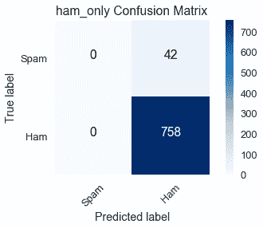

将一行中的数量相加表示培训数据集中有多少电子邮件属于相应的类：

*   真标签=垃圾邮件（第一行）：真阳性（0）和假阴性（42）的总和显示培训数据集中有 42 封垃圾邮件。
*   真标签=ham（第二行）：假阳性（0）和真阴性（758）的总和显示训练数据集中有 758 封 ham 电子邮件。

对列中的数量求和表示分类器在相应类中预测的电子邮件数：

*   预测标签=垃圾邮件（第一列）：真阳性（0）和假阳性（0）的总和显示`ham_only`预测培训数据集中有 0 封垃圾邮件。
*   预测标签=ham（第二列）：假阴性（42）和真阴性（758）的总和显示`ham_only`预测培训数据集中有 800 封 ham 电子邮件。

我们可以看到`ham_only`的高精度为$左（\frac 758 800 \约 95 右）$因为在总共 800 封电子邮件中，培训数据集中有 758 封 HAM 电子邮件。

```
spam_only_cnf_matrix = confusion_matrix(y_train, spam_only_y_pred, labels=[1, 0])

plot_confusion_matrix(spam_only_cnf_matrix, classes=class_names,
                      title='spam_only Confusion Matrix')

```

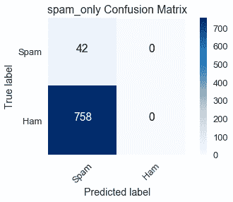

另一个极端是，`spam_only`预测训练数据集没有 ham 电子邮件，混淆矩阵显示这与 758 个误报的事实相差甚远。

我们的主要兴趣是`words_list_model`的混淆矩阵：

```
words_list_model_cnf_matrix = confusion_matrix(y_train, words_list_model_y_pred, labels=[1, 0])

plot_confusion_matrix(words_list_model_cnf_matrix, classes=class_names,
                      title='words_list_model Confusion Matrix')

```


行总数与预期的`ham_only`和`spam_only`混淆矩阵相匹配，因为训练数据集中的真实标签对所有模型都是不变的。

在 42 封垃圾邮件中，`words_list_model`正确地分类了 18 封，这是一个糟糕的性能。它的高精度受到大量真实否定的支持，但这是不够的，因为它不符合可靠过滤垃圾邮件的目的。

此电子邮件数据集是**类不平衡数据集**的一个示例，其中绝大多数标签属于一个类而不是另一个类。在这种情况下，我们的大多数电子邮件都是火腿。另一个常见的阶级失衡的例子是，当一个群体的疾病发生频率较低时，疾病检测。一项医学测试总是得出这样的结论：病人没有这种疾病会有很高的准确性，因为大多数病人确实没有这种疾病，但是它无法识别出患有这种疾病的人，这就使得它毫无用处。

我们现在转向敏感性和特异性，这两个指标更适合评估类不平衡数据集。

### 灵敏度[¶](#Sensitivity)

**灵敏度**（也称为**真阳性率**）测量属于分类器正确标记的阳性类的数据比例。

$$ \text{Sensitivity} = \frac{TP}{TP + FN} $$

从我们对混淆矩阵的讨论中，您应该将表达式$tp+fn$识别为第一行中条目的总和，它等于数据集中属于正类的实际数据点数量。使用混淆矩阵可以很容易地比较模型的敏感性：

*   `ham_only`：$\frac 0 0+42=0$
*   `spam_only`：$\frac 42 42+0=1$
*   `words_list_model`：$\frac 18 18+24 \约 429$

因为`ham_only`没有真阳性，所以它的灵敏度值可能是 0。另一方面，`spam_only`的准确度非常低，但它的灵敏度值可能是 1，因为它正确地标记了所有垃圾邮件。`words_list_model`的低敏感度表明它经常无法标记垃圾邮件；然而，它的表现明显优于`ham_only`。

### 特异性

**特异性**（也称为**真负率**）测量属于分类器正确标记的负类的数据比例。

$$ \text{Specificity} = \frac{TN}{TN + FP} $$

表达式$tn+fp$等于数据集中属于负类的实际数据点数。同样，混淆矩阵有助于比较模型的特性：

*   `ham_only`：$\frac 758 758+0=1$
*   `spam_only`：$\frac 0 0+758=0$
*   `words_list_model`：$\frac 752 752+6 \约 992$

与敏感性一样，最差和最好的特异性分别为 0 和 1。注意，`ham_only`有最好的特异性和最差的敏感性，而`spam_only`有最差的特异性和最好的敏感性。由于这些模型只预测一个标签，它们将错误分类另一个标签的所有实例，这反映在极端的敏感性和特异性值中。对于`words_list_model`来说，差距要小得多。

虽然敏感性和特异性似乎描述了分类器的不同特征，但我们使用分类阈值在这两个指标之间建立了重要的联系。

### 分类阈值[¶](#Classification-Threshold)

**分类阈值**是一个值，用于确定将数据点分配给什么类；位于阈值两侧的点用不同的类进行标记。回想一下，逻辑回归输出数据点属于正类的概率。如果此概率大于阈值，则数据点标记为正类，如果低于阈值，则数据点标记为负类。对于我们的例子，让$F_ \那\ theta 作为逻辑模型，让$C$作为阈值。如果$F_ \Theta（x）&gt；C$标记，$X$标记为垃圾邮件；如果$F \Theta（x）&lt；C$标记，$X$标记为火腿。SciKit Learn 通过默认为负类打破了联系，因此如果$f \that \theta（x）=c$，$x$标记为 ham。

我们可以通过创建一个混淆矩阵，用分类阈值$C$来评估模型的性能。本节前面显示的`words_list_model`混淆矩阵使用 SciKit 学习的默认阈值$C=0.50$。

将阈值提高到$C=0.70 美元，这意味着如果概率$F \that \theta（x）$大于.70，我们会将电子邮件$X$标记为垃圾邮件，从而导致以下混淆矩阵：

```
# HIDDEN

words_list_prediction_probabilities = words_list_model.predict_proba(X_train)[:, 1]

words_list_predictions = [1 if pred >= .70 else 0 for pred in words_list_prediction_probabilities]

high_classification_threshold = confusion_matrix(y_train, words_list_predictions, labels=[1, 0])

plot_confusion_matrix(high_classification_threshold, classes=class_names,
                      title='words_list_model Confusion Matrix $C = .70$')

```


通过提高将电子邮件分类为垃圾邮件的标准，13 封正确分类为$C=.50$的垃圾邮件现在被贴错标签。

$$ \text{Sensitivity } (C = .70) = \frac{5}{42} \approx .119 \\ \text{Specificity } (C = .70) = \frac{757}{758} \approx .999 $$

与默认值相比，更高的阈值$C=.70$增加了特异性，但降低了敏感性。

将阈值降低到$C=0.30 美元，这意味着如果概率$F \that \theta（x）$大于.30，我们会将电子邮件$X$标记为垃圾邮件，从而导致以下混淆矩阵：

```
# HIDDEN
words_list_predictions = [1 if pred >= .30 else 0 for pred in words_list_prediction_probabilities]

low_classification_threshold = confusion_matrix(y_train, words_list_predictions, labels=[1, 0])

plot_confusion_matrix(low_classification_threshold, classes=class_names,
                      title='words_list_model Confusion Matrix $C = .30$')

```


通过降低将电子邮件分类为垃圾邮件的标准，6 封错误标记为$C=.50$的垃圾邮件现在是正确的。然而，有更多的误报。

$$ \text{Sensitivity } (C = .30) = \frac{24}{42} \approx .571 \\ \text{Specificity } (C = .30) = \frac{738}{758} \approx .974 $$

与默认值相比，较低的阈值$C=.30$增加了敏感性，但降低了特异性。

我们通过改变分类阈值来调整模型的敏感性和特异性。尽管我们努力最大限度地提高敏感性和特异性，但从用不同分类阈值创建的混淆矩阵中可以看出，存在一种权衡。敏感性增加导致特异性降低，反之亦然。

### ROC 曲线

我们可以计算 0 到 1 之间所有分类阈值的敏感性和特异性值，并绘制它们。每个阈值$c$与一对（敏感性、特异性）相关。**ROC（接收器工作特性）曲线**是对这一想法的一个细微修改；它不是绘制（敏感性、特异性）曲线，而是绘制（敏感性、1-特异性）对，其中 1-特异性被定义为假阳性率。

$$ \text{False Positive Rate } = 1 - \frac{TN}{TN + FP} = \frac{TN + FP - TN}{TN + FP} = \frac{FP}{TN + FP} $$

ROC 曲线上的一个点表示与特定阈值相关的灵敏度和假阳性率。

使用 SciKit Learn 的[roc 曲线函数](http://scikit-learn.org/stable/modules/generated/sklearn.metrics.roc_curve.html)计算`words_list_model`的 roc 曲线：

```
from sklearn.metrics import roc_curve

words_list_model_probabilities = words_list_model.predict_proba(X_train)[:, 1]
false_positive_rate_values, sensitivity_values, thresholds = roc_curve(y_train, words_list_model_probabilities, pos_label=1)

```

```
# HIDDEN

plt.step(false_positive_rate_values, sensitivity_values, color='b', alpha=0.2,
         where='post')
plt.xlabel('False Positive Rate (1 - Specificity)')
plt.ylabel('Sensitivity')
plt.title('words_list_model ROC Curve')

```

```
Text(0.5,1,'words_list_model ROC Curve')
```

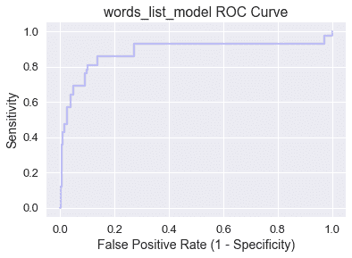

注意，当我们在曲线上从左向右移动时，敏感性增加，特异性降低。一般来说，最佳分类阈值对应于高灵敏度和特异性（低假阳性率），因此最好是位于地块西北角或附近的点。

让我们来检查一下图的四个角：

*   （0，0）：特异性$=1$，这意味着负类中的所有数据点都被正确标记，但敏感性$=0$，因此模型没有真正的正性。（0,0）映射到分类阈值$c=1.0$，这与`ham_only`具有相同的效果，因为没有电子邮件的概率大于$1.0$。
*   （1，1）：特异性$=0$，这意味着模型没有真正的负性，但敏感性$=1$，所以正类中的所有数据点都被正确标记。（1,1）映射到分类阈值$c=0.0$，这与`spam_only`具有相同的效果，因为没有电子邮件的概率低于$0.0$。
*   （0，1）：特异性$=1$和敏感性$=1$，这意味着没有假阳性或假阴性。具有包含（0，1）的 ROC 曲线的模型具有$C$值，在该值上它是一个完美的分类器！
*   （1，0）：特异性.=0$和敏感性.=0$，这意味着没有真阳性或真阴性。具有包含（1，0）的 ROC 曲线的模型具有$C$值，在该值处它预测每个数据点的错误类！

随机预测类的分类器有一条包含灵敏度和假阳性率相等的所有点的对角 ROC 曲线：

```
# HIDDEN

plt.step(np.arange(0, 1, 0.001), np.arange(0, 1, 0.001), color='b', alpha=0.2,
         where='post')
plt.xlabel('False Positive Rate (1 - Specificity)')
plt.ylabel('Sensitivity')
plt.title('Random Classifier ROC Curve')

```

```
Text(0.5,1,'Random Classifier ROC Curve')
```

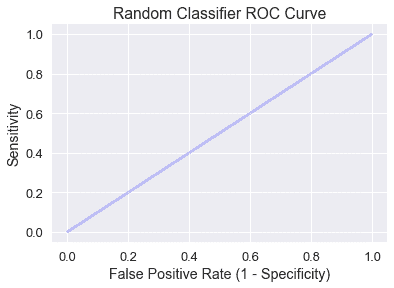

直观地说，一个随机分类器预测输入$x$的概率$p$将导致机会$p$的真正或假正，因此灵敏度和假正率相等。

我们希望分类器的 ROC 曲线高出随机模型诊断线，这将我们引入 AUC 度量。

### AUC[？](#AUC)

曲线下的**面积（auc）**是 roc 曲线下的面积，用作分类器的单个数字性能摘要。下面阴影显示了`words_list_model`的 AUC，并使用 SciKit Learn 的[AUC 函数](http://scikit-learn.org/stable/modules/generated/sklearn.metrics.roc_auc_score.html#sklearn.metrics.roc_auc_score)进行计算：

```
# HIDDEN

plt.fill_between(false_positive_rate_values, sensitivity_values, step='post', alpha=0.2,
                 color='b')

plt.xlabel('False Positive Rate (1 - Specificity)')
plt.ylabel('Sensitivity')
plt.title('words_list_model ROC Curve')

```

```
Text(0.5,1,'words_list_model ROC Curve')
```

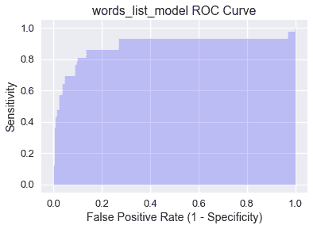

```
from sklearn.metrics import roc_auc_score

roc_auc_score(y_train, words_list_model_probabilities)

```

```
0.9057984671441136
```

AUC 被解释为分类器将更高的概率分配给真正属于正类的随机选择的数据点，而不是真正属于负类的随机选择的数据点。完美的 AUC 值 1 对应于完美的分类器（ROC 曲线将包含（0，1）。事实上，`words_list_model`的 AUC 为.906 意味着大约 90.6%的时间将垃圾邮件分类为垃圾邮件，而不是将火腿电子邮件分类为垃圾邮件。

经检验，随机分类器的 AUC 为 0.5，尽管这可能由于随机性而略有变化。一个有效的模型的 AUC 将远高于`words_list_model`所达到的 0.5。如果模型的 AUC 小于 0.5，那么它的性能会比随机预测差。

### 摘要[¶](#Summary)

AUC 是评估类不平衡数据集模型的重要指标。在对模型进行训练后，最好生成 ROC 曲线并计算 AUC 以确定下一步。如果 AUC 足够高，使用 ROC 曲线确定最佳分类阈值。但是，如果 AUC 不满意，考虑进一步进行 EDA 和特征选择以改进模型。

## 17.8 多类分类

```
# HIDDEN
# Clear previously defined variables
%reset -f

# Set directory for data loading to work properly
import os
os.chdir(os.path.expanduser('~/notebooks/17'))

```

```
# HIDDEN
import warnings
# Ignore numpy dtype warnings. These warnings are caused by an interaction
# between numpy and Cython and can be safely ignored.
# Reference: https://stackoverflow.com/a/40846742
warnings.filterwarnings("ignore", message="numpy.dtype size changed")
warnings.filterwarnings("ignore", message="numpy.ufunc size changed")

import numpy as np
import matplotlib.pyplot as plt
import pandas as pd
import seaborn as sns
%matplotlib inline
import ipywidgets as widgets
from ipywidgets import interact, interactive, fixed, interact_manual
import nbinteract as nbi

sns.set()
sns.set_context('talk')
np.set_printoptions(threshold=20, precision=2, suppress=True)
pd.options.display.max_rows = 7
pd.options.display.max_columns = 8
pd.set_option('precision', 2)
# This option stops scientific notation for pandas
# pd.set_option('display.float_format', '{:.2f}'.format)

```

```
# HIDDEN
markers = {'triangle':['^', sns.color_palette()[0]], 
           'square':['s', sns.color_palette()[1]],
           'circle':['o', sns.color_palette()[2]]}

def plot_binary(data, label):
    data_copy = data.copy()
    data_copy['$y$ == ' + label] = (data_copy['$y$'] == label).astype('category')

    sns.lmplot('$x_1$', '$x_2$', data=data_copy, hue='$y$ == ' + label, hue_order=[True, False], 
               markers=[markers[label][0], 'x'], palette=[markers[label][1], 'gray'],
               fit_reg=False)
    plt.xlim(1.0, 4.0)
    plt.ylim(1.0, 4.0);

```

```
# HIDDEN
def plot_confusion_matrix(y_test, y_pred):
    sns.heatmap(confusion_matrix(y_test, y_pred), annot=True, cbar=False, cmap=matplotlib.cm.get_cmap('gist_yarg'))
    plt.ylabel('Observed')
    plt.xlabel('Predicted')
    plt.xticks([0.5, 1.5, 2.5], ['iris-setosa', 'iris-versicolor', 'iris-virginica'])
    plt.yticks([0.5, 1.5, 2.5], ['iris-setosa', 'iris-versicolor', 'iris-virginica'], rotation='horizontal')
    ax = plt.gca()
    ax.xaxis.set_ticks_position('top')
    ax.xaxis.set_label_position('top')

```

到目前为止，我们的分类器执行二进制分类，其中每个观察都属于两个类中的一个；例如，我们将电子邮件分类为 ham 或 spam。然而，许多数据科学问题涉及到**多类分类**，其中我们希望将观测分类为几个不同类别中的一个。例如，我们可能有兴趣将电子邮件分类为家庭、朋友、工作和促销等文件夹。为了解决这些类型的问题，我们使用了一种新的方法，叫做**one vs rest（ovr）classification**。

### 一对休息分类

在 OVR 分类（也称为 One vs All，或 OVA）中，我们将一个多类分类问题分解为几个不同的二进制分类问题。例如，我们可以观察培训数据，如下所示：

```
# HIDDEN
shapes = pd.DataFrame(
    [[1.3, 3.6, 'triangle'], [1.6, 3.2, 'triangle'], [1.8, 3.8, 'triangle'],
     [2.0, 1.2, 'square'], [2.2, 1.9, 'square'], [2.6, 1.4, 'square'],
     [3.2, 2.9, 'circle'], [3.5, 2.2, 'circle'], [3.9, 2.5, 'circle']],
    columns=['$x_1$', '$x_2$', '$y$']
)

```

```
# HIDDEN
sns.lmplot('$x_1$', '$x_2$', data=shapes, hue='$y$', markers=['^', 's', 'o'], fit_reg=False)
plt.xlim(1.0, 4.0)
plt.ylim(1.0, 4.0);

```

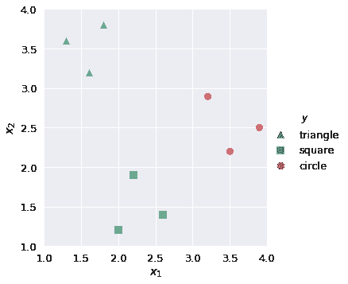

我们的目标是构建一个多类分类器，将观测值标记为$x_1$和$x_2$的给定值`triangle`、`square`或`circle`。首先，我们要构建一个二进制分类器`lr_triangle`，它将观察结果预测为`triangle`或非`triangle`：

```
plot_binary(shapes, 'triangle')

```

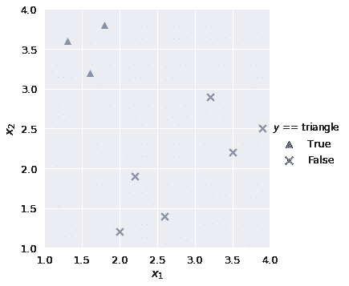

同样，我们为剩余的类构建二进制分类器`lr_square`和`lr_circle`。

```
plot_binary(shapes, 'square')

```


```
plot_binary(shapes, 'circle')

```

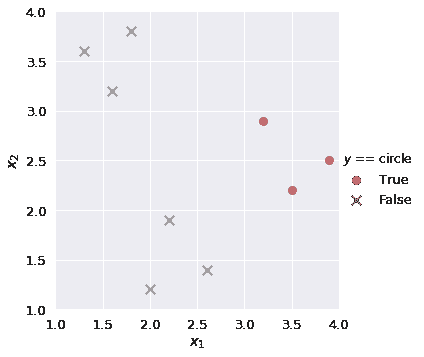

我们知道，在逻辑回归中，乙状结肠函数的输出是从 0 到 1 的概率值。为了解决我们的多类分类任务，我们在每个二进制分类器中找到正类的概率，并选择输出最高正类概率的类。例如，如果我们有一个具有以下值的新观察值：

| $XY1 $ | $XY2 $ |
| --- | --- |
| 第 3.2 条 | 2.5 条 |

然后我们的多类分类器将这些值输入到`lr_triangle`、`lr_square`和`lr_circle`中的每一个。我们提取三个分类器的正类概率：

```
# HIDDEN
lr_triangle = LogisticRegression(random_state=42)
lr_triangle.fit(shapes[['$x_1$', '$x_2$']], shapes['$y$'] == 'triangle')
proba_triangle = lr_triangle.predict_proba([[3.2, 2.5]])[0][1]

lr_square = LogisticRegression(random_state=42)
lr_square.fit(shapes[['$x_1$', '$x_2$']], shapes['$y$'] == 'square')
proba_square = lr_square.predict_proba([[3.2, 2.5]])[0][1]

lr_circle = LogisticRegression(random_state=42)
lr_circle.fit(shapes[['$x_1$', '$x_2$']], shapes['$y$'] == 'circle')
proba_circle = lr_circle.predict_proba([[3.2, 2.5]])[0][1]

```

| `lr_triangle` | `lr_square` | `lr_circle` |
| --- | --- | --- |
| 0.145748 个 | 0.285079 美元 | 0.497612 个 |

由于`lr_circle`的正类概率是三种概率中最大的，因此我们的多类分类器预测观察结果是一个圆。

## 案例研究：IRIS 数据集[¶](#Case-Study:-Iris-dataset)

IRIS 数据集是一种著名的数据集，在数据科学中经常用于探索机器学习概念。有三类，每类代表一种鸢尾植物：

*   刚毛鸢尾
*   杂色鸢尾
*   弗吉尼亚鸢尾

数据集中有四个可用功能：

*   萼片长度（厘米）
*   萼片宽度（cm）
*   花瓣长度（cm）
*   花瓣宽度（cm）

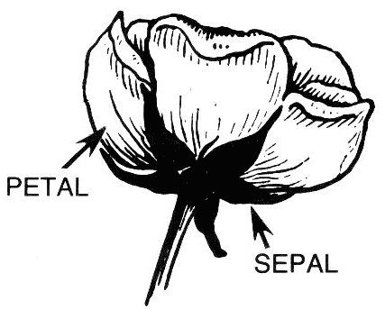

我们将创建一个多类分类器，根据上述四个特征预测鸢尾植物的类型。首先，我们读取数据：

```
iris = pd.read_csv('https://archive.ics.uci.edu/ml/machine-learning-databases/iris/iris.data',
                  header=None, names=['sepal_length', 'sepal_width', 'petal_length', 'petal_width', 'species'])

iris

```

|  | 萼片长度 | 萼片宽度 | 花瓣长度 | 花瓣宽度 | 物种 |
| --- | --- | --- | --- | --- | --- |
| 零 | 五点一 | 第 3.5 条 | 一点四 | 0.2 条 | 刚毛鸢尾 |
| --- | --- | --- | --- | --- | --- |
| 1 个 | 四点九 | 三 | 1.4 | 0.2 | Iris-setosa |
| --- | --- | --- | --- | --- | --- |
| 二 | 四点七 | 3.2 | 一点三 | 0.2 | Iris-setosa |
| --- | --- | --- | --- | --- | --- |
| …… | …… | ... | ... | ... | ... |
| --- | --- | --- | --- | --- | --- |
| 147 个 | 6.5 条 | 3.0 | 五点二 | 二 | 弗吉尼亚鸢尾 |
| --- | --- | --- | --- | --- | --- |
| 一百四十八 | 六点二 | 三点四 | 五点四 | 二点三 | Iris-virginica |
| --- | --- | --- | --- | --- | --- |
| 149 个 | 五点九 | 3.0 | 5.1 | 一点八 | Iris-virginica |
| --- | --- | --- | --- | --- | --- |

150 行×5 列

```
X, y = iris.drop('species', axis=1), iris['species']
X_train, X_test, y_train, y_test = train_test_split(X, y, test_size=0.35, random_state=42)

```

在将数据集划分为训练和测试分割之后，我们将多类分类器与我们的训练数据相匹配。默认情况下，SciKit Learn 的`LogisticRegression`设置`multi_class='ovr'`，它为每个唯一类创建二进制分类器：

```
lr = LogisticRegression(random_state=42)
lr.fit(X_train, y_train)

```

```
LogisticRegression(C=1.0, class_weight=None, dual=False, fit_intercept=True,
          intercept_scaling=1, max_iter=100, multi_class='ovr', n_jobs=1,
          penalty='l2', random_state=42, solver='liblinear', tol=0.0001,
          verbose=0, warm_start=False)
```

我们对测试数据进行预测，并使用一个混淆矩阵来评估结果。

```
y_pred = lr.predict(X_test)
plot_confusion_matrix(y_test, y_pred)

```

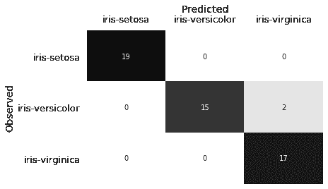

混淆矩阵表明，我们的分类器将两个`Iris-versicolor`观察结果误分类为`Iris-virginica`。在观察`sepal_length`和`sepal_width`特征时，我们可以假设为什么会发生这种情况：

```
# HIDDEN
sns.lmplot(x='sepal_length', y='sepal_width', data=iris, hue='species', fit_reg=False);

```

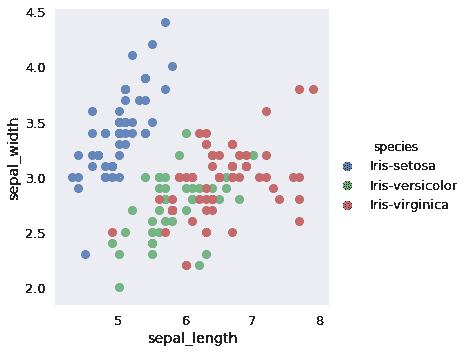

这两个特性的`Iris-versicolor`和`Iris-virginica`点重叠。虽然剩下的特性（`petal_width`和`petal_length`）有助于区分这两个类，但是我们的分类器仍然对这两个观察结果进行了错误分类。

同样，在现实世界中，如果两个类具有相似的特性，则错误分类可能很常见。混淆矩阵是有价值的，因为它们帮助我们识别分类器所产生的错误，从而洞察为了改进分类器，我们可能需要提取哪些额外的特性。

## 多标签分类

另一类分类问题是**多标签分类**，其中每个观测可以有多个标签。文件分类系统就是一个例子：文件可以有积极或消极的情绪，宗教或非宗教的内容，自由或保守的倾向。多标签问题也可以是多类的；我们可能希望我们的文档分类系统区分一系列类型，或者识别文档所用的语言。

我们可以通过简单地在每一组标签上训练一个单独的分类器来执行多标签分类。为了标记一个新的点，我们结合了每个分类器的预测。

## 摘要[¶](#Summary)

分类问题在本质上往往是复杂的。有时，这个问题要求我们区分多个类之间的观察；在其他情况下，我们可能需要为每个观察指定几个标签。我们利用我们对二进制分类器的知识来创建能够完成这些任务的多类和多标签分类系统。